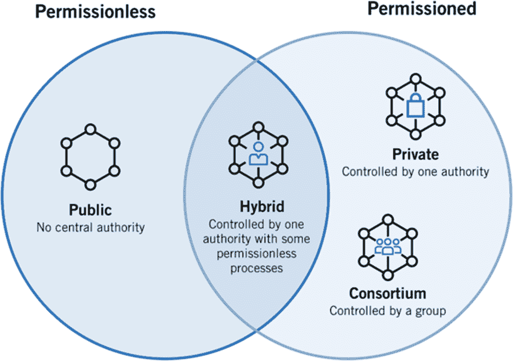
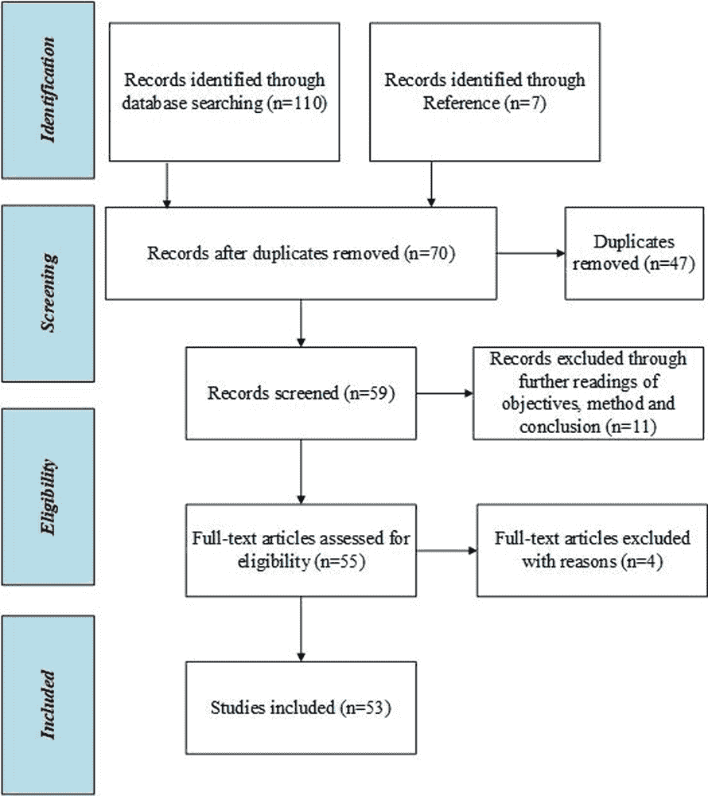
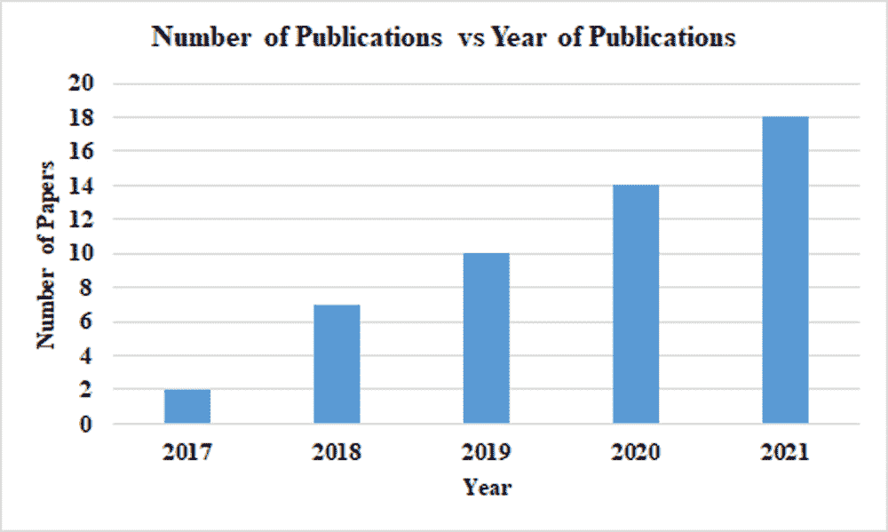
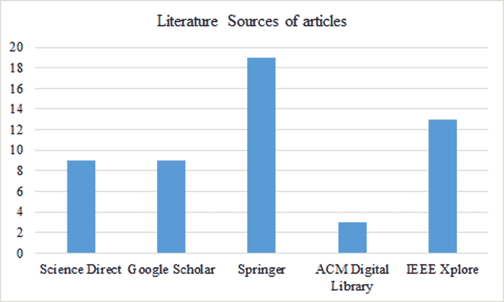
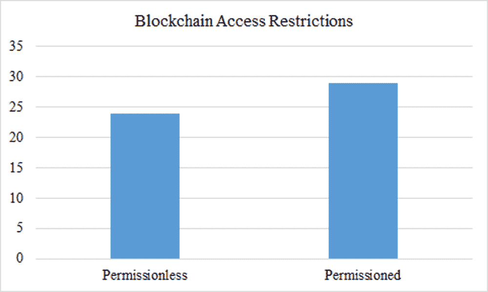
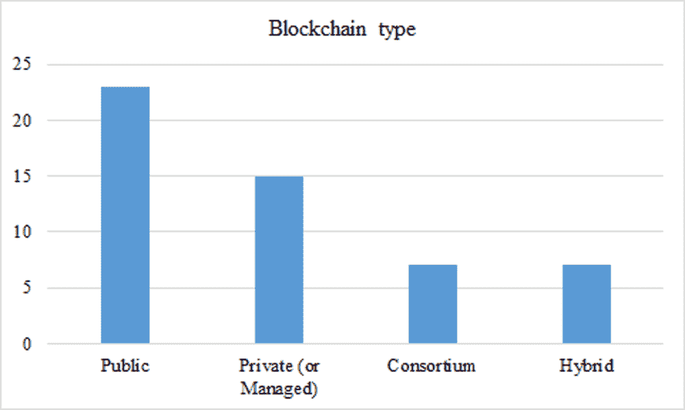
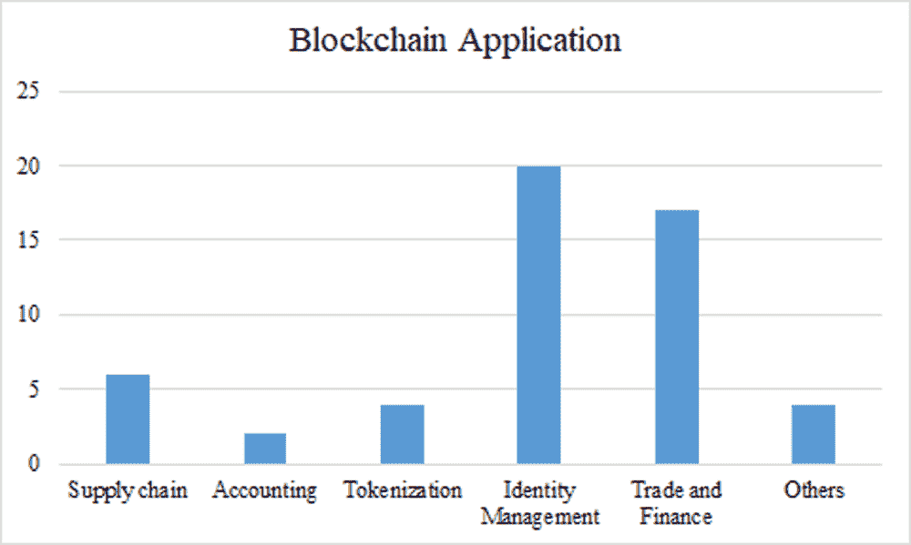

# 第一章

# 量子区块链：

一项系统性回顾

+   Peter Nimbe

    

    加纳能源与自然资源大学

+   Benjamin Asubam Weyori

    加纳能源与自然资源大学

+   Jacob Mensah

    加纳能源与自然资源大学

+   Anokye Acheampong Amponsah

    加纳能源与自然资源大学

+   Adebayo Felix Adekoya

    加纳能源与自然资源大学

+   Emmanuel Adjei Domfeh

    加纳能源与自然资源大学

摘要

量子区块链是一种分布式数据库，它是去中心化的、加密的，基于量子信息理论和计算而构建的。这是由于量子计算的最新进展以及对经典区块链的量子等效性的需求所致。其中量子区块链是一部分的算法、框架、模型、工具、架构和数据库仍在标准化过程中。最近，量子信息理论和计算的增长导致了该领域正在进行的研究数量的增加。本章使用 PRISMA 技术提供了对量子区块链的见解，并对其进行了注册和分析。文献分析基于一些参数或分类，配有图形和表格表示。

引言

本章旨在通过呈现和分析相关文献以及提出解决土地管理和行政透明度的框架来提供有关量子区块链技术的一些见解。

本章的目标是

+   • 确定关于量子区块链的文献

+   • 对量子区块链的文献进行分类。

+   • 以表格和图形形式呈现文献分类的结果。

+   • 将量子区块链与经典区块链进行比较。

+   • 提出一个经典和量子框架，以解决土地管理和行政方面的透明度问题。

+   • 展望量子区块链的未来方向和未解之谜

+   • 概述一些量子区块链文献的方法和不足之处

背景

区块链是一种现代技术，在医学、能源和金融等领域有着许多潜在的实际应用。它是分布式的并且加密的，以防止篡改（Kiktenko 等人，2018）。当前的区块链网络依赖于方案，尽管在各种应用中承诺巨大，但却容易受到量子计算机的攻击。区块链系统中的存储问题最为严重，这是由于每个节点必须存储所有区块的副本。不可变性是区块链系统的基本属性，在最近引起了一些关注。由于它们承诺提供问责制、透明度和冗余性，区块链技术近年来已被提倡用于各种应用（Fernandez-Carames & Fraga-Lamas, 2020）。下面的 图 1 显示了一个包含各种类型区块链技术的图表。

| 图 1. 区块链技术 |
| --- |
|  |
| *(Wegrzyn & Wang, 2021)* |

Karbasi 和 Shahpasand 提出了一种解决方案，通过结合几种最近发展的创新，最突出的是区块链、智能合约和量子抗性基于密码的认证密钥交换协议，确保了在线共享和发布的数字数据的有效性，如加密密钥、数字证书和常用参考字符串（Karbasi & Shahpasand, 2020）。

Wu 等人介绍了一对基于格的哈希算法，带有或不带有陷阱，并展示了它们在可编辑区块链中的应用。此外，他们的研究提出了两种避免区块链红色功能误用的方法。他们为第一种方案提出了一个完全分布式的密钥管理机制，并使用了一般框架来处理仍然存在于区块链中的红色化误用问题，但他们也为他们的第二种方案提出了一种投票策略。为了更好地理解他们的工作，他们展示了如何在现有区块链中进行相对轻微的更改来结合区块链技术和哈希（Wu 等人，2021）。

由于 Shor 和 Grover 提出的算法以及量子计算机的发展和进步，攻击现在是可能的。由于这些算法，区块链已被重建以使用能够抵御量子攻击的密码系统，导致了量子抗性密码系统的出现。鉴于此，对后量子密码系统以及它们如何在区块链和分布式账本技术中使用进行了调查。因此，他们的努力旨在为未来的区块链研究人员和开发人员提供广泛的视角和关于后量子区块链安全的实用指导（Fernandez-Carames & Fraga-Lamas, 2020）。

Mesnager 等人提出了一种基于后量子格基础的门限验证多秘密共享技术，用于验证和私人通信。该门限技术随后被实现在分布式存储区块链（DSB）系统中，用于在每个区块交换交易数据。在他们的工作中，建议的 DSB 系统在将数据块分发给每个节点之前，使用 AES-256 加密技术对数据块进行加密，并且提出的方案同时在节点之间共享数据块的哈希值和私钥（Mesnager 等人，2020）。

Khalid & Askar 对量子区块链以及与最重要的后量子区块链系统相关的主要问题进行了回顾，以向研究人员提供关于后量子区块链安全性的广泛见解和建议。此外，他们关于签名加密和数字区块链签名技术的论述显示出希望的迹象，深入探讨了这些技术的用途和耐久性（Khalid & Askar，2021）。

Küfner 等人提供了一个基于城市光纤网络的量子安全区块链安全认证平台的实例，作为应对量子时代区块链挑战的一个可能答案。他们的研究结果解答了关于在商业和政府应用中实施和扩展这些区块链的关键问题（Küfner 等人，2012）。

为了解决这一困难，Ablayev 等人采用了将 Grover 量子搜索算法调整到更广泛的区块链技术中的自然概念。Sun 等人提供了一种基于逻辑的区块链范例，通过将量子保护和量子证书纳入交易语法，以及用量子等效物替代拜占庭协议，提高了量子安全区块链的效率和功率。由于他们的工作，他们成功解决了与欺诈敏感的量子比特承诺协议相关的一个重要问题（Sun 等人，2018）。

Bennet＆Daryanoosh 提出了一种基于一组量子服务器的量子启用区块链架构。他们创建了一个交互式的挖矿协议，该协议在服务器和客户端之间进行，并利用光中编码的量子数据消除了对网络基础设施信任的需求（Bennet＆Daryanoosh，2019）。 Sharma 等人确定了光网络的攻击，并提倡使用量子安全的区块链来保护网络免受安全威胁。他们提供了关于区块链技术的概述，其中包括安全问题，并集中讨论了 QKD，这可保护区块链技术免受量子攻击。此外，他们还详细介绍了用于未来研究和开发基于量子安全区块链的安全和可信的光通信网络的量子安全区块链和网络架构（Sharma 等人，2021）。

鉴于格密码系统所使用的大量密钥和签名，张等人提出了一种将公钥和签名的整个内容存储在星际文件系统中，并将它们的哈希值放在区块链（IPFS）上的方法。因此，每个区块链块只能承载有限的交易（张等人，2021）。

为了对抗量子计算，谢等人开发了一种格签名算法，以及一个杜鹃过滤器来减少用户验证步骤的开销。最后，实施了一个分散的区块链网络，以取代传统的中央审计，从而传播和认证验证结果，从而提高方案的透明度和安全性（谢等人，2021）。

李等人完成了一种签名方案的开发，该方案可用于通过现有传统渠道保护区块链网络。密钥是使用 Bonsai Trees 技术和 Rand-Basis 算法创建的，这确保了随机化，同时创建了轻量级的非确定性钱包。该策略可以在 oracle 模型中安全地演示，并且是有效的。他们的研究有助于未来推进后量子生物学研究（李等人，2019）。

Choi 等人提出了一种使用区块链技术监控可编程逻辑控制器（PLC）信息真实性的新方法。在核电厂的背景下，他们设计了一个区块链来检查 PLC 的信息完整性。提出了一种称为 Proof of Monitoring（PoM）的新概念，用于解决将区块链应用于核电厂网络安全的限制。他们还利用区块链为核电厂的反应堆保护机制创建了一个监控系统，这是一个安全系统（Choi 等人，2020）。

Gao 等人开发了一种基于 PQB 的安全加密货币方法，该方法能够抵抗量子计算的攻击。他们首先提出了一个基于格问题的签名系统。其次，他们构建了 PQB 并提出了一种将建议的签名方案与区块链相结合的加密货币系统。加密货币方法和签名方案的安全性能够简化为格短整数解决问题（Gao 等人，2018 年）。

Gao 等人提出了一种基于区块链的电子投票协议，该协议确保了投票过程的透明度。与此同时，该方法可以通过使用基于代码和无证书密码学来审计不当投票的选民，并抵御攻击。他们的技术被发现适用于小规模选举，在选民数量有限时具有一定的效率和安全优势，在性能分析之后（Gao 等人，2019 年）。

在区块链中，Yin 等人开发了一种基于 PQB 的创新型反量子交易认证技术。轻量级非确定性钱包的公钥和私钥是从主公钥和私钥生成的，这是他们研究的一个重要收获。他们提出了一种基于 Bonsai Trees 技术的新的认证方法，该方法允许将一个格空间扩展到具有相同密钥的许多格空间。他们的工作为区块链在后量子时代的适用性奠定了理论基础（Yin 等人，2017 年）。

使用六状态量子密钥分发（QKD）协议的模拟来研究基于区块链的加密货币系统的免疫性和透明性。为了保证创建更好的加密货币系统，还研究了密钥速率生成过程。数学模型被用来为线性连接生成适当的限制。在应用层面，该协议促成了加密货币系统的创建（Azhar 等人，2019 年）。

Iovane 提出了一种基于 BB84 协议的量子加密能力以及分布式账本和区块链所提供的可能性的新数据传输协议。他们的方法允许在量子通信通道上或通过使用经典标准通道并在其中模拟量子功能的网络节点作为新的虚拟量子组件（Iovane，2021 年）上最安全的密钥传输。

Nieto-Chaupis 提出了一种基于量子力学的形式化方法来模拟电子商务交易中的区块链动态。该算法在一个综合的基于区块链的算法中使用整数阶贝塞尔函数进行了测试。在模拟中，还建立了一个简单区块链模型的可靠性在 75 个数量级上。另一方面，他们的研究未能利用量子力学的性质来描述大型经济中比特币运动的完整动态（Nieto-Chaupis，2019 年）。

世界上第一个使用并发预处理和在线原型的具有量子安全性的高效异步区块链由 Dolev 和 Wang 提出（Dolev＆Wang，2020 年）。Sun 等人提出了一种用于量子区块链的拍卖机制和抽奖协议。他们的抽奖协议保证了随机性、可验证性、去中心化和无条件安全性，而他们的拍卖协议保证了出价隐私和约束性、去中心化和无条件安全性。他们的方法无法应用于多方计算领域，因为未来将设计更加复杂的量子区块链协议（Sun 等，2020 年）。

MatRiCT 被介绍为一个基于后量子格假设的区块链秘密交易的 RingCT 系统。与先前的后量子方法相比，该协议的证明长度几乎降低了两个数量级，并且能够很好地扩展到庞大的匿名集合，而现有提议则不然。该系统或方案可以修改为可审计的，用户可以从权威列表中选择暴露自己的身份（Esgin 等，2019 年）。

为了提高区块链的安全性，高等人提出了一种独特的量子区块链方案。他们的工作始于对量子区块链的定义提出以及其架构的详细描述。他们为他们的研究建立了一种被称为量子币的加密货币。为了创建独特的量子区块链方案，他们使用了量子纠缠和 DPoS。他们的理论研究成果为未来的应用提供了科学基础（Gao 等，2020 年）。

通过展示利用城市光纤网络进行密钥分发的区块链架构，Kiktenko 等人成功解决了量子区块链挑战。这些结果解决了量子安全区块链在业务应用中的可扩展性和可实现性等重要问题（Kiktenko 等，2018 年）。

Li 等人提出了一个以格基假设为中心的反量子盲签名系统。该方案的安全性通过使用双模高斯分布等技术进行增强，鉴于格密码学是后量子密码系统的主要候选算法，而盲签名方案在电子现金和电子投票中被广泛应用于创建不可追踪的支付系统，这些系统更适用于区块链启用系统中的隐私保护。然而，随着量子计算机变得更加普遍，后量子密码学技术将变得更加重要，反量子基于格的签名将变得更加现实化（Li 等，2021 年）。

Iovane 使用了一种新颖的谈判技术，提出了一种解决区块链基础设施中区块有效性和新区块分配的方法。谈判过程集中在扩展概率环境上，以实现区块验证和分配。然而，尽管采用了 MuReQua 解决方案并创建了特定研究来研究密钥生成对大量请求和用户的影响，但他们的努力未能提供一个广泛的社区发展策略（Iovane, 2021）。

Banerjee 等人使用量子加权超图状态的多方纠缠开发了一种量子区块链。超图状态的纠缠充当了协议的“链”，其中经典区块中的信息从作为相关超图顶点的单个量子位开始。他们的研究代表了朝着开发一个真正安全的量子货币交易系统的一步（Banerjee 等人, 2020）。

Rajan 和 Visser 提出了一个量子区块链的设计。该区块链被表示为非永久性的非共存光子的 Greenberger–Horne–Zeilinger 状态。基本的量子优势被揭示为由时间纠缠而不是空间纠缠提供。考虑到传统区块链的崛起和全球量子网络的潜在构建，这一发现可能会开辟量子信息科学的新领域（Rajan & Visser, 2019）。

QChain 是由 An 和 Kim 提出的一种基于区块链的量子抗量子分布式 PKI 系统。他们建议重新设计基于格的 GLP 签名技术。QChain 签名是一种增强版的 GLP 签名，使用了数字理论变换（NTT）（An & Kim, 2018）。

Sun 等人创建了逻辑合约架构，这是一种许可的区块链（LC）。为了在区块链上达成共识，LC 使用了基于投票的共识算法和量子密钥分发的签名方案（Sun 等人, 2019）。

Vignesh 等人提出了一个量子构建的解决方案，用于使用 Hyperledger Sawtooth 处理民主应用程序的安全性。他们的研究重点是一个以量子区块链为中心的投票协议。为了保持谦逊，他们的协议提供了一个秘密的、经过验证的、合格的、理性的和自我评估的投票系统（Vignesh 等人, 2021）。

Sun 等人利用量子区块链创建了一个基本的投票协议。投票协议的最重要的特性和标准包括匿名性、不可重用性、可验证性、合格性和公平性，他们建议的协议符合这些标准。目前可用的技术有可能用于实现该协议。为了推进他们的研究，量子区块链可以应用于其他领域，如量子拍卖和量子彩票（Sun 等人，2019）。

Sun 等人将基于量子区块链的投票系统扩展到了多候选人场景。其基本思想是通过计算多候选人的康多塞赢家将多候选人投票限制为两候选人投票。根据他们的研究，量子区块链可以极大地简化电子投票的工作，同时提供多种理想的安全特性。可以通过改进协议的效率来提高协议在安全性和民主性方面的有效性（Sun，2019）。

Zhu 等人提出了一种将区块链技术和量子技术应用于物联网车联网安全（IoV）的策略。他们利用区块链架构展示了一个半量子系统，并提出了两种轻量级的 IoV 应用，具有无条件安全性（Zhu 等人，2020）。

Karbasi & Shahpasand 提出了一个解决方案，通过结合一些最近开发的创新来确保共享数字数据的有效性和真实性，例如数字证书、公共参考字符串和密码学密钥，其中最显著的是区块链、智能合约和环上量子抗量子认证密钥交换协议（Karbasi & Shahpasand，2020）。

区块链，以比特币和以太坊为代表，由于各种应用前景的多样性而得到了显著的发展和实施，包括物联网和数字货币。另一方面，计算复杂性问题影响了基于经典密码学的当前区块链技术的安全性。随着攻击者处理能力的提高，特别是量子计算机的出现，这种保护形式严重受损。Wen 等人提出了一个基于量子 SWAP 测试、量子哈希和量子传输的量子区块链系统，其安全性是无条件的，不依赖于攻击者的计算能力或资源（Wen 等人，2021）。

Ikeda 创建了一个具有相当多量化优势的系统。首先，货币交易采用了量子传送技术进行，这使得持有者在传递后无法存储原始货币数据。传统电路出现了严重问题，因此建立了区块链来解决它。在 qBitcoin 中，不存在双重支付问题，其安全性在理论上得到了保证，这要归功于量子信息理论。由于生成区块需要时间，qBitcoin 的架构使用量子链而不是区块。因此，与使用比特币相比，交易处理速度可以显著加快。采用了类似于比特币中首次提出的点对点现金系统的量子数字签名（Ikeda, 2018）。

由于当前的中心化 SIoT 系统未能有效保护用户隐私，Yi 创建了一种用户隐私保护解决方案以克服这些困难。他们建议首先使用后量子环签名，然后提出基于环签名的区块链架构作为第二步。与标准 SIoT 不同，该系统以后量子方法为中心，使其对经典和量子计算机都具有抵抗力（Yi, 2021）。

Haney 进行了有关区块链法律与安全交叉点的首个后量子调查。他的研究是关于美联储、国会和区块链技术在货币创造中复杂关系的首个法律调查之一。因此，该报告对区块链技术分散经济影响的长期假设提出了质疑。借鉴信息学、法学和经济学的学术成果，他的工作采用了跨学科的方法，以证明区块链不提供构建点对点支付系统的安全方式（Haney, 2020）。

最近，有人提出了基于晶格的区块链系统，声称其对量子时代的攻击是安全的。尽管它们在理论上很重要，但由于处理能力的限制，许多系统在实践中不可行。为了解决吞吐量的关键问题，Li & Wu 提出了一种带有分离见证的后量子区块链，可以显著减少区块大小中签名的比例。他们证明了所提出的带有分离见证的后量子区块链在基于随机预言机的假设下对自适应选择消息攻击的存在性不可伪造性，这是基于短整数解（SIS）的困难假设（Li & Wu, 2021）。

Holcomb 等人主张重新设计由 Fabric 提出的凭证管理方法和相关规范，以包括在本质上是混合型的数字签名，可以防御同时具有经典和量子攻击的单一经典和量子安全签名。他们的方法提供了完全的加密敏捷性，实现了混合型量子安全区块链的进步，并选择在每个节点上使用当前 OQS 签名技术 (Holcomb 等人，2021)。

由于量子技术的突出增长，一些区块链方案容易受到量子攻击的影响。Yuan 等人提出了一种基于人工智能的量子抗攻击的基于格的区块链基础架构，以解决吞吐量的关键问题。他们的架构基于基于格的聚合签名，有效地减少了一个区块中的签名数量，同时保持了区块的大小，并且被证明是安全和有效的。此外，这一发现可能支持即将到来的后量子区块链的研究。 (PQB) (Yuan 等人，2021)。

Banafa 阐述了区块链的基本原理和用途。其中涉及的一些内容包括点对点网络、分布式账本和区块链技术的信任模型。他们还讨论了区块链的基础知识，以及其操作、底层算法和信任基础。工作证明、智能合约和工作证明堆栈，以及货币和比特币、以太坊等类似的区块链网络，都被介绍了。讨论了区块链技术、物联网、人工智能、网络安全、数字转型和量子计算 (Banafa，2020)。

Zhang 等人主张将区块链签名的公钥和哈希值以及它们的整个内容保存在星际文件系统上。因此，每个交易所利用的存储量大大减少。他们设计了一种比特币交易技术来评估所提出的量子抗攻击的区块链系统的有效性。已经确定仿真平台是可操作和可用的 (Zhang et al, 2021)。

量子计算机在速度和数据处理能力方面优于传统计算机，正从理论角度逐渐走向现实。量子计算机的巨大计算能力将从根本上改变当今信息加密的工作方式。(Zhang et al, 2021) 讨论了量子信息技术的两个重要用途后，探讨了量子霸权对当前加密和区块链共识系统的威胁。与此同时，鉴于当前区块链技术的缺陷，提出了一种整合量子技术的区块链系统，以避免量子霸权的威胁 (Zhang et al, 2019)。

Abulkasim 等人设计了一种基于量子的区块链密封竞标拍卖协议，其中交易被存储在支持量子通信和计算的区块链上，以提高安全性。建议的协议利用区块链技术和量子计算，确保满足关键特性和需求。为了证明他们协议的好处，他们提出了安全分析、评估和比较（Abulkasim 等人，2021）。

Hijfte 描述了他们如何结合多种技术来创建一个更全面的解决方案。当然，这只是一个部分清单；你可以选择任何可能的应用组合并获得更好的结果。你应该记住，这并不总是如此，随意组合应用很容易导致灾难。他们的工作概述了在开发新流程或应用程序，或与各种新兴技术合作时，应该意识到存在一定程度的风险（Hijfte，2020）。

Vigliotti & Jones 提出了一个框架来理解和实施区块链技术。他们的工作涵盖了区块链技术在各种行业中发挥的各种角色，并以非技术术语解释了当前的区块链技术、真实世界的用例以及它们对企业的影响。它还展示了如何制定策略，以在其组织中识别和实施区块链、智能合约和数字货币技术（Vigliotti & Jones, 2020）。

Kearney 和 Perez-Delgado 研究了当今使用的关键加密货币，如 ZCash、比特币、以太坊和莱特币，以查看它们对量子攻击的脆弱性。他们通过比较研究过的加密货币以及支撑它们的区块链技术以及它们对量子攻击的脆弱性水平来得出结论（Bard 等人，2021）。

Chen 提出了一种技术，其中目标系统中的每个信号节点与其所有附近节点协商一个量子密钥，确定所有这些量子密钥中任意两个量子密钥的异或结果，然后将这些异或结果体现到一个交易中。一个服务器将所有当前的交易包含在一个块中，该块可能用于提供实时的量子密钥服务（Chen, 2020）。

由 Krishnaswamy 调查并建议使用量子计算技术激发的量子区块链技术进行设计。使用非确定性的自执行处理，调查了量子状态变量的崩溃。网络上的多个节点通过一个通信网络进行交互，形成一个量子区块链网络。调查了许多网络使用案例，例如为特定用户选择最佳访问节点或确定哪个用户在任何特定时刻具有网络访问权（Krishnaswamy，2020）。

章节的主要焦点

方法

本章的目标是定位、评估和审查当代量子区块链文献，以及它们的方法和弱点。在 2021 年 11 月，通过在五个数据库（包括 Science Direct、Google Scholar、Springer、ACM Digital Library 和 IEEE Xplore）中进行了对满足 2017 年至 2021 年纳入要求的内容的全面搜索。使用了“区块链”和“量子区块链”等术语。在作者之间进行了长时间的讨论后，基于研究目的制定了纳入和排除标准。通过阅读记录的标题、摘要和关键词来找到符合初步选择标准的记录。通过接受文献的参考文献列表，发现了更多相关的文章。使用系统性评价和荟萃分析的首选报告项目流程图，报告了文章的选择和筛选过程。

包含和排除标准

要考虑将论文纳入审查，必须是关于量子区块链或与量子区块链相关的。除英语以外的其他语言撰写的文献，以及不属于上述范围的任何工作，均不予考虑。

数据收集与组织

作者讨论和对文献的公正、深入的审查为数据收集和类别创建奠定了基础。以下类别仅用于评价、分析和评估研究：

+   区块链类别：类别按照标准；访问限制、类型和应用。

对于访问限制，子类别包括无权限和有权限。

对于类型，子类别包括公共、私有或受管理的、财团和混合。

对于应用，子类别包括供应链、会计、代币化、身份管理、贸易金融等。

+   电子数据库：Science Direct、Google Scholar、Springer、ACM Digital Library 和 IEEE Xplore 是所使用的电子数据库或来源。

+   出版年份：本类别详细说明了文章的出版年份。

上述分类并未考虑未来方向的文献。

文献评价和分析

经过精心挑选的论文根据上述分类进行了分析、研究和评分。对每个分类进行了分析，以衡量量子区块链的有效性（区块链分类 - 访问限制、类型和应用、电子数据库、出版年份）。使用每种属性类型的计数总和计算了分类属性的数值统计。由于一些文章用于“未来方向和未解答的问题”部分，因此研究中给出的文章总数少于这些分类的计数总和。

解决方案和建议

结果

在搜索了几个在线数据库后，根据标题、摘要和关键词的阅读，发现了共 117 条记录。在对这些出版物进行第二次评估，即对目标、方法和结论部分进行精读后，不符合预定包含标准的 47 篇文章被淘汰。在去除重复文章后，共读取了 70 篇文章并进行了评估。在全文阅读后，如下所示，共有 53 篇出版物被纳入研究和分析（主要基于对量子区块链的调查）。图 3 和图 4 描述了被称为“量子区块链”的热门主题。

| 图 2. 系统性审查流程图 |
| --- |
|  |

评估与分析

上述出版物如上所述进行了评估和分析，下面报告了主要发现。

研究中的文章

在显示文章及其相关分类时，考虑了五十三（53）篇文章。

+   出版年份的分析：表 1 和图 3

表 1. 文章的年度分布

| 出版年份 | 频率 |
| --- | --- |
| 2021 | 18 |
| 2020 | 16 |
| 2019 | 10 |
| 2018 | 7 |
| 2017 | 2 |
| 图 3. 文章的年度分布 |
|  |

+   数据来源的分析：表 2 和图 4

表 2. 文章的文献来源

| 数据来源 | 文章数量 |
| --- | --- |
| 科学直达 | 9 |
| 谷歌学术 | 9 |
| Springer | 19 |
| ACM 数字图书馆 | 3 |
| IEEE Xplore | 13 |
| 图 4. 文章的文献来源 |
|  |

+   区块链访问限制的分析：表 3 和图 5

表 3. 区块链访问限制

| 区块链访问限制 | 文章数量 |
| --- | --- |
| 无许可 | 24 |
| 经许可 | 29 |
| 图 5. 区块链访问限制 |
|  |

+   区块链类型的分析：表 4 和图 6

表 4. 区块链类型

| 区块链类型 | 文章数量 |
| --- | --- |
| 公开 | 23 |
| 私有（或管理） | 15 |
| 联合体 | 7 |
| 混合 | 7 |
| 图 6. 区块链类型 |
|  |

+   区块链应用分析：表 5 和图 7

表格 5. 区块链应用

| 区块链应用 | 文章数量 |
| --- | --- |
| 供应链 | 6 |
| 会计 | 2 |
| 代币化 | 4 |
| 身份管理 | 20 |
| 贸易与金融 | 17 |
| 其他 | 4 |
| 图 7. 区块链应用 |
|  |

未来的研究方向

医疗保健

关于量子区块链和区块链的未来方向，研究者应集中考虑研究以下领域；改善区块链与现有基础设施的互操作性、促进区块链的采用，并解决区块链存储位置的问题（Durneva 等，2020 年）。使用基于智能卡的区块链对医疗记录进行负责任和安全的分发是区块链技术的另一个未来方向，对于卫生部门非常重要，因为这将确保很高程度的隐私和安全性（Lal 和 Marijan，2020 年；Durneva 等，2020 年）。

机器人技术

群体机器人技术需要将人工智能、区块链和物联网机器人技术相结合，因为这有助于将机器人技术纳入物联网场景（Strobel 等人，2020 年；Aditya 等人，2021 年）。

大数据

自适应区块链架构、基于云的大数据和基于软件定义网络的大数据都是经典和量子区块链在大数据领域未来的示例。区块链在这些领域的应用将有助于确保安全性、隐私性、可扩展性、透明度和信任（Deepa 等人，2021 年）。

供应链

未来，建筑供应链可能会看到各种规模的企业之间形成软合作社，在区块链上执行其交易，以提供项目解决方案、产品、组件、服务或采购建筑项目。区块链供应链的其他研究领域包括追踪资产信息，并在资产的整个生命周期内保持每个资产的所有权记录、商业模式、采购、智能合同、管理数据的数据保护以及材料和服务的实时跟踪（Tezel 等，2020 年）。

物联网

由于物联网设备缺乏足够的存储容量来存储整个区块链的副本，因此有必要将资源受控的物联网设备与区块链集成起来。这种集成过程是一个潜在的未来研究领域，有助于推进区块链和物联网的研究与开发（Latif 等人，2021）。除了网络和计算方面的限制外，物联网设备还面临授权和认证不足、受限兼容性等问题。区块链具有与物联网设备集成的灵活性，因为它们可以用于在网络上存储结构化和非结构化数据（Latif 等人，2021）。将区块链扩展到物联网边缘可能是另一个未来的研究方向。区块链的高性能和网络开销使其无法在资源受限的物联网设备上使用。可以使用轻量级客户端与物联网网关将交易推送到区块链网络中，以解决此问题（Latif 等人，2021）。其他潜在前景包括基于物联网的区块链应用程序、基于物联网的区块链安全、使用区块链的物联网数据质量、物联网区块链数据治理、基于物联网的区块链信任管理、基于物联网的区块链自动化以及物联网区块链身份和识别管理（Lunesu 等人，2021）。

加密货币

加密货币无法扩展，比特币区块大小的 1MB 限制以及每 10 分钟增加一次区块大小都是问题。由于比特币每秒只能处理 7 笔交易，因此不适合高频交易。因此，区块越大，需要的存储空间就越多，导致网络传播变慢。因此，在区块链中需要去中心化（Kaur 等人，2020）。这是一个引人入胜的未来研究课题，因为理解这些货币的起源以及它们如何反映在其长期的价值表现中对于教育企业有关各种理念至关重要（Klarin，2020）。

数字流程、支付和系统

区块链有潜力通过实现合法的数字流程和系统来提供显著的附加值，使其成为一个优秀的研究课题。它有望通过将区块链集成到物联网的固有分散和去中心化特性中，获得巨大的好处。此外，与区块链集成相关的所有构建块，如用于自动化的智能合约和用于服务支付的加密货币，都可以添加到物联网基础设施中（Lunesu 等人，2021）。

云计算中的信任管理

云计算在信任管理方面的未来发展方向包括；信任框架、评估、交付和授权、稳健性以及信任辅助决策（Li 等人，2021）。

令牌化

保护环匿名交易（Durneva 等人，2020 年），它们隐藏了支付金额，但所有区块链参与者仍然可以验证其准确性，是由 Monero 提出的。 为了实现这一点，使用了 Pedersen 承诺和加密范围证明，以阻止未经授权的创建新代币。 进行交易的私密性和可验证性的能力是以存储空间为代价的，因为现在交易的表示涉及许多密码元素，例如必须记录在分类账上的签名和证明。 不久，Monero 社区计划用 bulletproofs（Bünz 等，2018 年；Kolb 等，2020 年）替换交易中的一个冗长方面，即范围证明。

车辆网络

未来在 5G 车联网中使用区块链的研究方向至关重要，但在整合和部署之前必须解决一些问题和挑战。 这些困难可以作为研究课题（Bendechache 等，2020 年）。

银行和金融市场

未来的区块链发展可能包括实用的治理框架和中央银行向零售和批发中央银行数字货币的增长（Schlapkohl，2020 年）。 此外，金融机构正在调查区块链应用于安全交易（Makridakis 等人，2018 年）。

价值链管理

由于当前农产品食品行业生态系统正在从中心化系统转向共享和分布式系统，因此使用区块链以实现更大的制造商合作来共享信息和服务的研究或未来方向至关重要（Zhao 等，2019 年）。

量子维度

目前，量子区块链还相对年轻，在量子计算及其在各种领域或行业中的适用性方面仍有大量研究正在进行。 量子计算机及其相关组件的出现最终将导致量子版本的经典方法、技术、方法和区块链技术的适用性的发展。 这可能提供与经典方法相比的潜在加速，安全性和隐私性，因此可能会促进进一步的研究和发展。

一些量子区块链文献的方法和不足

一些量子区块链文献的方法和不足在下表（Table 6）中显示。

表 6。量子区块链文献的方法和不足

| S/n | 引文 | 方法 | 不足 |
| --- | --- | --- | --- |
| 1 | （Fernandez-Carames＆Fraga-Lamas，2020 年） | 应用后量子密码系统以减轻此类攻击和影响。 | 未来的量子算法几乎肯定会离开理论领域，在实际应用中发挥更大作用。 |
| 2 | (卡巴西和沙帕桑德，2020) | 在消息 DApps 中使用 IPFS 和以太坊智能合约生成会话密钥，以减少中间人攻击的风险。 | 这些 DApps 没有在以太坊主网上创建，也没有将 PAKE 协议和智能合约放在真正的 IPFS 上。 |
| 3 | (谢等，2021) | 提出了一种格签名方案，旨在抵御量子计算，包括使用杜鹃过滤器减少用户验证阶段的计算负担。 | 应该在未来的工作中进一步研究区块链和完整性验证方案之间更紧密的耦合，并满足方案的更完整特性。 |
| 4 | (崔等，2020) | 作为 NPP 生态系统的一部分创建了一个私有区块链。 | 没有使用真实的电厂系统进行研究，这是必要的，以确定它是否对安全系统的性能产生影响。 |
| 5 | (高等，2018) | 提出了一种基于 PQB 的安全加密货币机制，可以抵御量子计算攻击。 | 尽管他们的工作将有助于保护区块链安全，但在当前技术条件下并不更加现实。 |
| 6 | (Iovane, 2021) | 提出了一种基于 BB84 协议的量子加密潜力以及分布式账本和区块链所提供的可能性的新数据传输协议。 | 考虑到关键制造业的完全去中心化，通信线理论上也可能不安全。 |
| 7 | (尼埃托-乔皮斯，2019) | 提出的一种形式主义允许模拟基于量子力学数学的电子商务交易的区块链动态。 | 他们无法充分利用量子力学的性质来表示庞大经济体中比特币流动的完整动态。 |
| 8 | (多列夫和王，2020) | 提出的一种形式主义允许模拟基于量子力学数学的电子商务交易的区块链动态。 | 可以进一步研究所检查的问题对 SodsBC 中的区块链的影响。 |
| 9 | (Sun 等，2020) | 用于抽奖和拍卖协议的量子区块链系统。 | 目前还没有为量子区块链的智能合约验证和定义开发任何正式的工具。 |
| 10 | (Iovane, 2021) | 在区块链架构中，通过一种创新的协商过程来确定新区块的有效性和分配。 | 尽管他们尽力了，但他们无法创建一份详细的研究，分析密钥生成如何影响大量请求和用户。 |
| 11 | (Banerjee 等人，2020) | 利用多方量子加权超图纠缠的技术。 | 这里提供的发现可以用于创建全新的纠缠量子协议，以及改进已有的协议。 |
| 12 | (Rajan & Visser，2019) | 将区块链编码为不共存光子的临时 Greenberger、Horne 和 Zeilinger（GHZ）态。 | 鉴于传统区块链的发展以及创建全球量子网络的可行性，他们的研究无法用于在量子信息科学中建立新的研究方向。 |
| 13 | (An & Kim，2018) | QChain – 一种使用区块链的量子抗性分布式 PKI 系统。 | 没有使用 C 语言作为开源项目实现 QChain。 |
| 14 | (Vignesh 等人，2021) | 使用 Hyperledger Sawtooth 提出了一种量子构建方法，用于处理和利用民主应用程序的安全性。 | 该研究没有解决量子区块链如何使许多应用程序免受启动基于量子理论的攻击的机器的简化和更安全。 |
| 15 | (Sun 等人，2019) | 在基于量子区块链的直接投票系统中添加了多候选人情况。 | 他们的工作未能改进协议，使其在安全性和民主性方面具有各种优势。 |
| 16 | (2019 年 Sun) | 采用基于投票的共识算法和基于量子密钥分发（QKD）的数字签名方法。 | 他们的努力没有导致逻辑型智能合约编程语言的系统构建。 |
| 17 | (Zhu 等人，2020) | 使用区块链作为 IoV 网络，提出了两种全新的轻量级量子反射协议。 | 他们未能设计用于 IoV 密钥协商和分发的 N 方量子半反射方法。 |
| 18 | (陈，2020) | 量子中继区块链，实现了量子密钥分发（QKS）和量子密钥分发（QKD）网络之间的安全分离。 | 一种新方案，量子中继区块链仍需要修改以满足不同的业务网络 |
| 19 | (Krishnaswamy，2020) | 扩展 Grover 算法为基础的幅度放大和修改技术，如 Oracle 和反射变换。 | 实现加速的主要障碍是达到的二次加速不足以抵消近期量子计算机的实质性开销。 |
| 20 | (Aditya 等人，2021) | Grover 和 Shor 的量子算法 | 他们的工作没有提供能够在与量子算法的竞争中持久存在的后量子密码学，量子密码学是否能够在全球范围内应用并且让大众更容易接触的问题仍然存在 |

结论

讨论

根据 Quarmby 的说法，摩根大通已经发布了关于量子密钥分发（QKD）区块链网络的研究，该网络对量子计算攻击具有免疫力。 QKD 是唯一已被数学证明能够抵御未来基于量子计算的攻击的解决方案（Quarmby, 2022）。Allende López 等人使用后量子密钥在交易中引入了第二签名，考察了关于区块链网络的量子抗性原理，并开发了一种用于保护区块链节点之间互联网信息传输的系统（Allende López, 2021）。

Quantum Resistant Ledger（QRL）是一个全新的区块链系统，具有后量子安全性，并在其设计中采用后量子计算技术，经过 red4sec 和 x41 D-sec 的审计，提供了有关后量子抗性区块链未来的重要信息（QRL, 2022）。张等人提出了一个基于量子抗性数字签名的区块链系统（Zhang et al, 2021）。量子抗性是下一个区块链前沿，被广泛认为是第一个真正量子抗性的区块链的系统称为 QANplatform。

去中心化程序（DApps）在 QAN 上是允许的，这与一些声称具有量子抗性的区块链不同，开发人员可以利用平台的免费开发工具快速构建量子抗性的 DApps。作为 QAN 的替代方案，许多知名区块链的创造者已经在考虑实施自己的量子抗性技术，例如最近创建的提交-延迟-揭示方案，该方案可以用于将比特币转换为量子抗性状态。然而，截至目前，十大用户数量最多的区块链尚未承诺采用量子抗性签名技术，这使得后量子加密的未来尚且不明朗（Thompson, 2021）。

有了量子抗性平台，区块链的可扩展性和带宽问题就解决了。区块链必须通过使用能够抵御地球上最强大的计算机攻击的密码密钥来保护。因此，像 Cellframe 这样的平台已经在开发第三代区块链解决方案，并公开分享了他们的工作。Cellframe 解决方案从量子抗性签名开始，其中一些已经集成到 Cellframe 架构中，一些是来自 NIST PQC 比赛的决赛签名，计划在团队的使命下进行更多集成，即构建一个安全和去中心化的环境以维护互联网自由。量子抗性区块链技术或方案的研究、标准化和实施可能为未来研究提供一条道路（Jansen, 2021）。

从表 1 和图 3 可看出，本文审查的大多数量子区块链文献均为 2021 年，其次是 2020 年、2019 年、2018 年和 2017 年。这似乎表明了从 2017 年到 2021 年量子区块链领域研究和兴趣逐渐增加的趋势。从表 2 和图 4 可知，共有 19 篇文章来自 Springer，13 篇来自 IEEE Xplore，9 篇来自 ScienceDirect，9 篇来自 Google Scholar，3 篇来自 ACM Digital Library。这表明分析中使用的大多数量子区块链文献来自 Springer 数据源。从表 3 和图 5 可知，在进行数值分析和图形表示时，共有 53 篇量子区块链文献中，有 24 篇强调了无许可的量子区块链，而有 29 篇讨论了有许可的量子区块链。从表 4 和图 6 可知，有 23 篇文章讨论了公共量子区块链，15 篇讨论了私有（或托管）量子区块链，7 篇讨论了财团量子区块链，7 篇讨论了混合量子区块链。从表 5 和图 7 可知，有 6 篇文章与供应链相关，2 篇与会计相关，4 篇与代币化相关，20 篇与身份管理相关，17 篇与贸易和金融相关，4 篇与其他相关。为了进一步了解经典区块链和量子区块链之间的差异，下面的表 6 中显示了比较分析。

经典区块链和量子区块链的比较

显示经典区块链和量子区块链的比较如下表 7。

表 7。经典区块链和量子区块链的比较

|  | 经典区块链 | 量子区块链 |
| --- | --- | --- |
| 1 | 分散、分布、公共数字账本，包含记录 | 基于量子力学的加密、分布和分散数据库（Chuntang 等，2019 年）。 |
| 2 | 因为使用了非对称密码学，量子攻击对区块链技术的可持续性构成威胁。 | 由于使用了量子安全、量子抗性和量子密码学，预计区块链技术的可行性不会受到威胁（Kearney & Perez-Delgado，2021 年）。 |
| 3 | 它目前正在运营，并且主要用作加密货币和加密钱包的支柱。 | 尽管目前还没有量子区块链在运行，但一些研究人员正在探讨该技术的可能性（Orchid，2021 年）。 |
| 4 | 没有区块链能像时光机一样运行，因此尽管它是安全的，但不能保证加密货币安全数十年。 | 维多利亚大学的研究人员提出了一个想法，将使用作为时光机运行的区块链来保证数十年后的加密货币未来（Rajan，D.，& Visser，M，2019 年）。 |
| 5 | 许多加密货币，如 Solana、Cardano、XRP、比特币、莱特币、泰达币、BNB、美元币、泰拉、Polkadot、狗狗币、以太坊、雪崩、多边形等，已经投入运营并使用共识算法。 | 创建了“量子币”，一种新型加密货币。提议结合量子纠缠和分布式共识机制（DPoS）来开发一种比当前区块链共识方法更快、更高效的新型共识机制（Orchid，2021）。 |
| 6 | 提高了对网络参与者的信任，使经济活动的排列方法变得新颖，并减少了中介机构的成本和时间（Weking，2020） | 量子区块链通过提供计算增长，为经典区块链提供了量子辅助（Dey et al，2021）。 |
| 7 | 经典区块链技术正在革新金融科技，并通过防止欺诈、消除交易中的中间人和民主化金融管理，创造了一个全新的数字金融领域（Kefford，2021） | 量子区块链技术是区块链可伸缩性的一个附加优势。超级数据分析、增加的计算速度、减少欺诈检测中的误报以及有效的蒙特卡洛模拟是四个金融科技应用示例，其中入侵可以用来提供计算优势（Dey et al，2021）。 |
| 8 | 大多数主要的经典区块链的签名系统容易受到量子攻击（Bard et al, 2021）。 | 由于该领域相对年轻，并且正在进行更多研究，目前尚不清楚量子区块链是否存在已知攻击。 |
| 9 | 区块链系统对量子攻击特别敏感，因为受保护的资产（分类帐）与所使用的加密技术密切相关（Bard et al, 2021）。 | 由维多利亚大学的研究人员提出的区块链的时间机器元素，如果一切顺利，金融交易和加密货币可能会安全数十年。 |
| 10 | 区块链的加密协议非常简单，因为它们使用常规密码学。 | 用于区块链的“后量子”加密协议的替换要比替换更传统的密码学功能困难得多（Bard et al，2021）。 |

未来的工作将是开发和实施用于土地管理和行政的区块链低级框架，以使土地识别、验证和获取的整个过程对涉及方，即土地所有者和购买土地的人，透明化。这将解决加纳和非洲的一个主要问题。即使量子计算仍然受到研究人员极大关注，也将探讨和探索这种土地管理和行政区块链的量子维度。

致谢

特别感谢所有为论文撰写做出贡献的个人。没有任何公共、私营或非营利部门的资助机构给予此研究特定的资助。

参考文献

Ablayev, F. M., Bulychkov, D. A., Sapaev, D. A., Vasiliev, A. V., & Ziatdinov, M. T. (2018). 量子辅助区块链。Lobachevskii 数学杂志，39(7)，957–960\. doi:10.1134/S1995080218070028

Abulkasim, Mashatan, & Ghose. (2021). 区块链上基于量子的隐私保护封闭竞标拍卖。.10.1016/j.ijleo.2021.167039

Aditya, U. S. P. S., Singh, R., Singh, P. K., & Kalla, A. (2021). 机器人学中的区块链调查：问题、机遇、挑战和未来方向。网络与计算应用期刊，196。10.1016/j.jnca.2021.103245

Allende Lopez, M., Lopez Leon, D., Ceron, S., Leal Batista, A., Pareja, A., Da Silva, M., Pardo, A., Jones, D., Worrall, D., Merriman, B., Gilmore, J., Kitchener, N., Venegas-Andraca, S.E. (2021). 区块链网络中的量子抗性。10.18235/0003313

AnH.KimK. (2018). QChain：使用区块链的量子抗性和去中心化 PKI。2018 年密码学和信息安全研讨会。

AzharM. T.KhanM. B.KhanA. U. R. (2019). 基于区块链的安全加密货币系统与量子密钥分发协议。第 8 届国际信息与通信技术会议，ICICT 2019，31–35\. 10.1109/ICICT47744.2019.9001979

Banafa, A. (2020). 量子计算与区块链：事实与迷思。在区块链技术与应用中。River Publishers.

Banerjee, S., Mukherjee, A., & Panigrahi, P. K. (2020). 使用加权超图状态的量子区块链。物理评论研究，2(1)，1–7\. doi:10.1103/PhysRevResearch.2.013322

BardD. A.KearneyJ. J.Perez-DelgadoC. A. (2021). 工作证明上的量子优势。10.2139/ssrn.3979439

BendechacheM.SaberT.MunteanG.-M.TalI. (2021). 区块链技术在 5G 启用的车联网中的应用：调查和未来方向。在第 18 届国际高性能移动计算与无线网络研讨会（MCWN 2020）中，西班牙巴塞罗那。

Bennet, A. J., & Daryanoosh, S. (2019). 使用光进行量子启用区块链的节能挖矿。账本，4。提前在线发表。doi:10.5195/ledger.2019.143

BünzB.BootleJ.BonehD.PoelstraA.WuilleP.MaxwellG. 2018\. Bulletproofs：保密交易和更多内容的简短证明。在 IEEE 安全与隐私研讨会（SP’18）论文集中。IEEE. 10.1109/SP.2018.00020

ChenH. (2020). 量子中继区块链及其在密钥服务中的应用。ACM 国际会议文集，95–99\. 10.1145/3377644.3377657

Choi, M. K., Yeun, C. Y., & Seong, P. H. (2020). 使用区块链技术的反应堆保护系统数据完整性的新型监测系统。IEEE Access：实用创新，开放解决方案，8，118732–118740\. doi:10.1109/ACCESS.2020.3005134

迪帕, 法姆, 阮, 巴塔查里亚, 普拉巴德维, 加德卡卢, 马迪昆塔, 方, & 帕蒂拉纳. (2021). 大数据区块链调查：方法、机会和未来方向。https://arxiv.org/pdf/2009.00858.pdf

多列夫, S., & 王治国. (2020). SodsBC：用于量子安全区块链的分布式密钥流. 2020 年 IEEE 国际区块链大会论文集，247–256 页。10.1109/Blockchain50366.2020.00038

朵涅娃, P., 克赖尔兹, K., & 陈明. (2020). 医疗护理中区块链技术的研究现状、挑战和未来研究方向：系统性综述. 医学互联网研究杂志，22(7)，e18619 页。doi:10.2196/18619

EsginM. F.ZhaoR. K.SteinfeldR.LiuJ. K.LiuD. (2019). Matrict：高效、可扩展和后量子区块链保密交易协议。ACM 计算机与通信安全会议论文集，567–584 页。10.1145/3319535.3354200

费尔南德斯-卡拉梅斯, T. M., & 弗拉加-拉马斯, P. (2020). 迈向后量子区块链：对抗量子计算攻击的区块链密码学综述. IEEE Access：实用创新，开放解决方案，8, 21091–21116 页。doi:10.1109/ACCESS.2020.2968985

高帅, 郑东海, 郭仁勇, 京春, & 胡陈强. (2019). 具有审计功能的区块链中的反量子电子投票协议. IEEE Access：实用创新，开放解决方案，7, 115304–115316 页。doi:10.1109/ACCESS.2019.2935895

高耀林, 陈晓兵, 陈永亮, 孙洋, 牛晓霞, & 杨燕霞. (2018). 一种基于后量子区块链的安全加密货币方案. IEEE Access，6(2)，27205–27213 页。10.1109/ACCESS.2018.2827203

高耀林, 陈晓兵, 许刚, 袁坤刚, 刘伟, & 杨燕霞. (2020). 一种基于量子纠缠和 DPoS 的新型量子区块链方案. 量子信息处理，19(12)，420 页。提前在线发表。doi:10.1007/s11128-020-02915-y

格雷戈里, M. (2015). 机密交易。检索自：https://people.xiph.org/greg/confidential_values.txt

希恩尼, 西莫斯布莱恩. (2020). 区块链：后量子安全与法律经济学。作者.

HolcombA.PereiraG.DasB.MoscaM. (2021). PQFabric：一种兼容经典和量子攻击的权限区块链。2021 年 IEEE 区块链与加密货币国际会议(ICBC)，1-9 页。10.1109/ICBC51069.2021.9461070

池田, K. (2018). qBitcoin：点对点量子现金系统. 智能计算，763–771 页。.10.1007/978-3-030-01174-1_58

伊奥瓦内, G. (2021a). 分布式分类帐和区块链上的计算量子密钥分发（CQKD）. 离散数学科学与密码学杂志，24(4)，1021–1042 页。doi:10.1080/09720529.2020.1820691

伊奥瓦内, G. (2021b). MuReQua Chain：多尺度相对论量子区块链. IEEE Access：实用创新，开放解决方案，9, 39827–39838 页。doi:10.1109/ACCESS.2021.3064297

Jansen, S. (2021). 量子抗性平台解决了区块链上存在的可扩展性和带宽瓶颈问题。https://cointelegraph.com/news/quantum-resistant-platform-solves-scalability-and-bandwidth-bottlenecks-present-on-the-blockchain

Jun, Z., Yong, Y., Xiao, W., & Fei-Yue, W. (2019). 量子区块链：区块链能与量子信息技术集成抵抗量子至尊吗？智能科学与技术中国，1(4)，409–414。

Karbasi, A. H., & Shahpasand, S. (2020). 一种基于智能合约的后量子端到端加密的区块链，用于打败中间人和拦截攻击。点对点网络和应用，13(5)，1423–1441。doi:10.1007/s12083-020-00901-w

Kaur, A., Nayyar, A., & Singh, P. (2020). 区块链。加密货币和区块链技术应用，25–42。10.1002/9781119621201.ch2

Kefford, M. (2021). 区块链革新金融科技的四种方式。https://www.businessbecause.com/news/insights/7534/blockchain-fintech?sponsored

Khalid, Z. M., & Askar, S. (2021). 抗量子计算攻击的区块链密码学。科学与商业国际期刊，5(3)，116–125。doi:10.5281/zenodo.4497732

Kiktenko, E. O., Pozhar, N. O., Anufriev, M. N., Trushechkin, A. S., Yunusov, R. R., Kurochkin, Y. V., Lvovsky, A. I., & Fedorov, A. K. (2018a). 量子安全区块链。量子科学与技术，3(3)，1–6。doi:10.1088/2058-9565/aabc6b

Kiktenko, E. O., Pozhar, N. O., Anufriev, M. N., Trushechkin, A. S., Yunusov, R. R., Kurochkin, Y. V., Lvovsky, A. I., & Fedorov, A. K. (2018b). 量子安全区块链。量子科学与技术，3(3)，035004。doi:10.1088/2058-9565/aabc6b

Klarin, A. (2020). 十年的加密货币和区块链过山车：描绘知识结构和绘制未来方向。国际商业与金融研究，51，101067。doi:10.1016/j.ribaf.2019.101067

Kolb, J., AbdelBaky, M., Katz, R. H., & Culler, D. E. (2020). 区块链中的核心概念、挑战和未来方向。ACM 计算调查，53(1)，1–39。doi:10.1145/3366370

KrishnaswamyD. (2020). 量子区块链网络。移动自组网和计算国际研讨会论文集（MobiHoc），2，327–332。10.1145/3397166.3412802

Küfner, P., Nestmann, U., Rickmann, C., Küfner, P., Nestmann, U., Rickmann, C., & Verification, F. (2017). 分布式算法的形式验证。第七届理论计算机科学国际会议（TCS），209–224。

Lal, C., & Marijan, D. (2020). 医疗保健领域的区块链：机遇、挑战和未来方向。Simula 研究实验室。https://www.simula.no/publications/blockchain-healthcare-opportunities-challenges-and-future-directions

Latif, S., Idrees, Z., Huma, Z., & Ahmad, J. (2021). 工业物联网的区块链技术：安全挑战、架构、应用和未来研究方向的综合调查。Transactions on Emerging Telecommunications Technologies , 32(11)。提前在线发布。doi:10.1002/ett.4337

Li, B., & Wu, F. (2021). 具有分隔见证的后量子区块链。2021 IEEE 第 6 届计算机与通信系统国际会议（ICCCS），522-527。10.1109/ICCCS52626.2021.9449309

Li, C., Tian, Y., Chen, X., & Li, J. (2021). 区块链启用系统的高效反量子基于格的盲签名。信息科学 , 546, 253–264。doi:10.1016/j.ins.2020.08.032

Li, C. Y., Chen, X. B., Chen, Y. L., Hou, Y. Y., & Li, J. (2019). 一种新的基于格的签名方案在后量子区块链网络中。IEEE Access: Practical Innovations, Open Solutions , 7, 2026–2033。doi:10.1109/ACCESS.2018.2886554

Li, W., Wu, J., Cao, J., Chen, N., Zhang, Q., & Buyya, R. (2021). 云计算系统中基于区块链的信任管理：分类、评论和未来方向。云计算杂志 , 10(1), 35。提前在线发布。doi:10.1186/s13677-021-00247-5

Lunesu, M. I., Tonelli, R., & Ioini, N. E. (2022). 物联网的区块链解决方案。https://www.frontiersin.org/research-topics/25758/blockchain-solutions-for-iot#overview

Makridakis, S., Polemitis, A., Giaglis, G., & Louca, S. (2018). 区块链：人工智能快速发展的下一个突破。人工智能 - 新兴趋势和应用。doi:10.5772/intechopen.75668

Mesnager, S., Sınak, A., & Yayla, O. (2020). 基于门限的后量子安全可验证的多秘密共享用于分布式存储区块链。数学 , 8(12), 1–15。doi:10.3390/math8122218

Nieto-ChaupisH. (2019). 使用量子力学理论描述区块链和加密货币的过程。IEEE 智利电气、电子工程、信息和通信技术会议，CHILECON 2019，7，31–34。10.1109/CHILECON47746.2019.8988006

Noether, S., Mackenzie, A., & Research Lab, T. M. (2016). 环路保密交易。分类帐 , 1, 1–18。doi:10.5195/ledger.2016.34

QRL. (2022). 量子抗性分类帐。后量子抗性区块链的未来。https://www.theqrl.org/the-future-of-post-quantum-resistant-blockchains/

Quarmby, B. (2022). 摩根大通发布关于量子抗性区块链网络的研究。https://cointelegraph.com/news/jpmorgan-unveils-research-on-quantum-resistant-blockchain-network

Rajan, D., & Visser, M. (2019). 使用时间纠缠的量子区块链。量子报告 , 1(1), 1–9。doi:10.3390/quantum1010002

SchlapkohlK. (2020). 区块链的未来。https://www.ibm.com/blogs/blockchain/2020/04/the-future-of-blockchain/

Sharma, P., Bhatia, V., & Prakash, S. (2021). 利用量子安全的区块链保护光学网络：概述. IEEE 量子电子学杂志 , 1–7\. https://arxiv.org/abs/2105.10663

Sun, X., Kulicki, P., & Sopek, M. (2020). 量子区块链上的彩票和拍卖. 熵 (巴塞尔, 瑞士) , 22(12), 1–9\. doi:10.3390/e22121377

Sun, X., Sopek, M., Wang, Q., & Kulicki, P. (2019). 迈向量子安全的许可区块链：签名、共识和逻辑. 熵 (巴塞尔, 瑞士) , 21(9), 1–15\. doi:10.3390/e21090887

Sun, X., Wang, Q., Kulicki, P., & Sopek, M. (2019). 量子区块链上的简单投票协议. 国际理论物理杂志 , 58(1), 275–281\. doi:10.1007/s10773-018-3929-6

Sun, X., Wang, Q., Kulicki, P., & Zhao, X. (2018). 量子增强逻辑型区块链 I: 量子诚实成功拜占庭协议和量逻币. https://arxiv.org/abs/1805.06768

Tezel, A., Papadonikolaki, E., Yitmen, I., & Hilletofth, P. (2020). 准备建筑供应链应用区块链技术：其潜力和未来方向的调查. 工程管理前沿 , 7(4), 547–563\. doi:10.1007/s42524-020-0110-8

Thompson, D. (2021). 量子抗性为什么是下一个区块链前沿. https://www.techtimes.com/articles/264625/20210826/why-quantum-resistance-is-the-next-blockchain-frontier.htm

Van Hijfte, S. (2020). 区块链和其他新兴技术 . 在为企业解码区块链中 . Apress. doi:10.1007/978-1-4842-6137-8_2

Vigliotti, M. G., & Jones, H. (2020). 区块链的未来 . 在区块链执行指南中 . Palgrave Macmillan. doi:10.1007/978-3-030-21107-3_10

Vignesh, V., Gopalan, S. H., Mohan, M., Ramya, R. S., & Ananthakumar, R. (2021). 利用 Hyperledger Sawtooth 的基于量子的区块链投票协议方法. 物理学报: 会议论文集 , 1916(1), 012088\. 提前在线发表. doi:10.1088/1742-6596/1916/1/012088

Weking, J., Mandalenakis, M., Hein, A., Hermes, S., Böhm, M., & Krcmar, H. (2020). 区块链技术对商业模式的影响 – 一种分类和典型模式. 电子市场 , 30(2), 285–305\. doi:10.1007/s12525-019-00386-3

Wen, Chen, Fan, Yi, Jiang, & Fang. (2021). 量子区块链系统. 现代物理学快报, 35(20). 10.1142/S0217984921503437

Wu, C., Ke, L., & Du, Y. (2021). 量子抗饵料无暴露密钥变色龙哈希及在可重写区块链中的应用. 信息科学 , 548, 438–449\. doi:10.1016/j.ins.2020.10.008

Xie, G., Liu, Y., Xin, G., & Yang, Q. (2021). 基于区块链的云数据完整性验证方案及高效性. 安全与通信网络 , 2021, 1–15\. 提前在线发表. doi:10.1155/2021/9921209

Yi, H. (2022, May 1). 基于后量子区块链的安全社会物联网 . IEEE 网络科学与工程杂志 , 9(3), 950–957\. 提前在线发表. doi:10.1109/TNSE.2021.3095192

尹，W.，文，Q.，李，W.，张，H.，& 金，Z.（2017 年）。区块链中的反量子交易认证方法。 IEEE Access：实用创新，开放解决方案，6，5393-5401. doi:10.1109/ACCESS.2017.2788411

袁，B.，吴，F.，邱，W.，王，W.，朱，H.，& Zhou，D.（2021 年）。基于量子抗性的人工智能区块链基础设施。2021 年第四届人工智能和大数据国际会议（ICAIBD），627-631. 10.1109/ICAIBD51990.2021.9458982

张，P.，王，L.，王，W.，付，K.，& Wang，J.（2021 年）。基于抗量子数字签名的区块链系统。安全和通信网络，2021（2）。10.1155/2021/6671648

赵，G.，刘，S.，洛佩兹，C.，卢，H.，埃尔吉塔，S.，陈，H.，& Boshkoska，B. M.（2019 年）。农食品价值链管理中的区块链技术：应用，挑战和未来研究方向的综合。工业计算机，109，83-99. doi:10.1016/j.compind.2019.04.002

朱，H.，王，X.，陈，C. M.，& Kumari，S.（2020 年）。在区块链中应用的两种新型半量子反射协议用于连接车辆系统。计算机与电气工程，86，106714. doi:10.1016/j.compeleceng.2020.106714

附加阅读

斯旺，M.（2020 年）。量子区块链。量子计算。doi:10.1142/9781786348210_0006

关键术语和定义

异步区块链：这是可以设计是否优先保证一致性或可用性的区块链网络。如果网络希望优先保证可用性，则所有交易都将在无停机时间的情况下添加。如果网络希望优先保证一致性，则某些交易可能不会被处理或暂停，直到所有先前的交易都得到确认。

区块链：传统的区块链使用预量子密码学，不受量子攻击的安全。

加密货币：是一种数字货币，旨在通过计算机网络作为交换媒介工作，不依赖于任何中央权威，如政府或银行，来维护或保持它。

密码学：是通过使用代码来保护信息和通信的技术，以便只有那些信息的目标人员可以理解和处理它。因此，防止未经授权的人员访问信息。

身份管理：是确保个人拥有适当的技术资源访问权限的组织过程。这包括对个人或个人的身份进行识别，认证和授权，以便其能够访问应用程序，系统或网络。

晶格密码系统：是一种通用术语，用于构建包含晶格算法集合的加密基元或方案，用于将明文转换为密文以安全地编码或解码消息。

有许可区块链：是一个不对公众开放的分布式账本。只有具有权限的用户才能访问。用户只能执行账本管理员授予他们的特定操作，并且需要通过证书或其他数字手段进行身份识别。

无许可区块链：也称为无信任或公共区块链，是向所有人开放的网络，供所有人参与区块链用于验证交易和数据的共识过程。它们在未知方之间完全分散。

量子区块链：在量子计算机上运行的区块链系统。

量子密钥分发：是一种安全的通信方法，实现了涉及量子力学组件的加密协议。它使两个参与方能够生成只有他们知道的共享随机秘钥，然后可以用于加密和解密消息。

抗量子区块链：具有后量子密码学，即后量子公私钥、哈希和相关协议的区块链系统。

签名方案：是一种技术，用于确保实体已经看到了某个数字消息的确认。

供应链：是一个网络，由参与创建产品并将其交付给消费者的个人和公司组成。

令牌化：是将敏感数据交换为称为“令牌”的非敏感数据的过程，这些令牌可以在数据库或内部系统中使用，而无需将其纳入范围。

透明度：透明度在科学、工程、商业、人文学科和其他社会环境中的使用是指以一种易于他人看到正在执行的行动的方式运作。透明度意味着开放性、沟通和责任。
