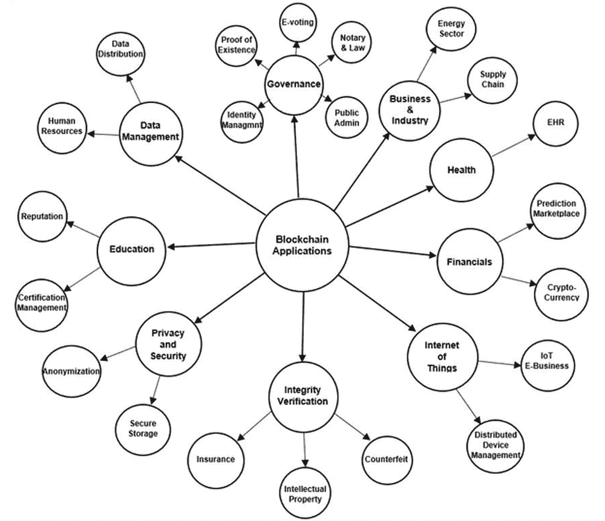
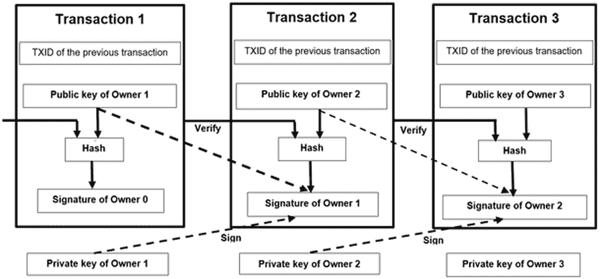

# 第二章

# 介绍量子抗量子区块链

+   Omega John Unogwu

    墨西哥阿兹特克大学

+   Ruchi Doshi

    墨西哥阿兹特克大学

+   Kamal Kant Hiran

    印度锡尔·帕丹帕特·辛格尼亚大学

+   Maad M. Mijwil

    

    伊拉克巴格达经济科学学院大学

摘要

量子抗量子区块链指的是对量子计算机攻击具有抵抗力的加密过程。现行的公钥算法依赖于解密大素数的离散对数和分解问题的难度。Shor 算法可以被量子计算机用来破解哈希签名。因此，为了开发一个后量子安全签名方案或后量子区块链以保障后量子区块链的安全性是必要的。本章将讨论以下主题对公钥密码学可能造成的量子计算机的影响：量子计算机，公钥密码学，量子对 PKI 的威胁，Shor 和 Grover 算法，后量子密码学，以及量子抗量子区块链。

结构

本章将讨论以下主题：

+   • 区块链 - 它是什么

+   • 传统区块链

    +   o 前量子密码学

+   • 量子区块链

+   • 运行在量子计算机中的区块链系统

+   • 量子抗量子区块链

    +   o 量子密码学

    +   o 后量子公钥和私钥

    +   o 散列

目标

本章结束时，以下内容应该得到很好的理解：

+   i. 具有其驱动原则的区块链技术

+   ii. 前量子密码学

+   iii. 量子区块链及其带来的威胁

+   iv. 区块链系统对量子计算机的影响

+   v. 量子抗量子区块链。使其安全的各种属性

介绍

基于区块链的新型计算数据结构有着几个有用的应用，它们运行在一个分布式、开放和自由的记录上。然而，每一个新的加密程序都应该意识到在任何潜在的执行框架的寿命内，技术进步都在迅速发展，其中大多数将会在相当长的时间内运行。本章讨论了区块链技术的缺陷，这些缺陷已经由量子计算机的发展显露出来，并就如何使区块链技术更能抵抗这种技术进步提出了一般性建议。这些建议包括采用量子区块链的新发展，如量子抗量子区块链，采用一些后量子密码学，如后量子公钥和私钥多关键子程序密码协议对于区块链系统是必要的（Aggarwal, D, 等人，2018）。一个考虑的关键方面是量子计算机必须运行的速度来破坏特定加密货币。

区块链：是什么

区块链是一个分布式开放分类账，可以有效、永久和可验证地记录两方之间的交易。它是一个仅追加的数据库系统，具有透明性，并包括跨一个庞大的、分散的、相互之间信任水平较低的代理网络获取数据共识的方法。

它是一个分布式记录数据库，结构化为有序块列表，其中提交的块是绝对的，数据在计算机网络上共享，与传统数据库不同，后者将数据存储在服务器上，它不提供单一的漏洞点。它是分布式的，因为数据库在其每个节点上是相同的(Allende, M., López, D.,等人，2021)。数据以交易形式存储在区块链上，可以代表从房屋和现金等实物资产到无形资产如专利、虚拟交易实体或服务的一切。

| 图 1\. 区块链应用的基本领域 |
| --- |
|  |

新颖的业务模式是基于区块链的便利性而创建的。公共区块链具有不可逆的记录，交易是安全的。私钥需要由区块链用户保管，因为它防止黑客进行非法入侵，他们试图破坏其数字签名。区块链具有共识算法来防止恶意交易。这为交易制定了验证条件。在没有验证的情况下，不会记录任何交易在账本上，因为共识方法禁止更改任何先前的交易。

区块链是如何工作的

区块链依赖于双重的加密原语：哈希函数，用于验证数据的完整性，和公钥密码学，用于验证数据的所有权。哈希函数接受任何间隔的输入并生成固定大小的输出线程。公钥密码学使用算法生成由公钥和私钥组成的一组密钥(Al-Housni, N., 2019)。参与者使用他的私钥对他想要在网络上发布的交易进行签名，接收者使用公钥验证交易发送者的身份。这两种原语被假定为单向函数，意味着哈希函数的输入应该无法从输出中推导出，或者通过公钥获得私钥的访问权限。

技术基础的五个基本指导原则

+   1\. 去中心化数据库

在区块链上，每个区块都可以访问整个数据库及其整个历史。信息和数据不受唯一参与者的控制。没有中介，每个参与方都可以独立验证其交易伙伴的记录(Bennett, C. H.,等人，1997)

+   2\. 同行之间的传输

对等通信在没有使用中心节点的情况下进行。 信息存储在每个节点上，并转发到每个其他节点。

+   3. 使用化名时的开放性

所有有权访问系统的人都可以看到每笔交易及其所关联的价值。 在区块链上，每个节点或用户都由一个由 30 多个字符的字母数字地址唯一标识。 用户可以选择向其他人透露其身份或保持匿名。 在区块链上，交易发生在地址之间（Jain，R.K.，2015）

+   4. 记录的不可逆性

记录与之前的每个交易记录相连接，因此有“链”一词，这样一旦交易记录到数据库中并修改了帐户，它们就无法更改。 为了确保数据库上的记录是永久的、按时间顺序排列的，并且对网络上的每个人都是可访问的，使用了各种计算策略和方法。

+   5. 逻辑计算

区块链交易可以与计算机逻辑链接，并且在某种程度上可以编程，因为分类帐是数字的。 然后用户可以配置算法和规则，自动在节点之间启动交易（Lakhwani，K.，等人，2020）

预量子密码学

预量子密码学使用某种类型的密码或算法将人类可读数据转换为秘密代码。 预量子密码学的困难在于制作易于理解但难以逆向工程的加密密码。

使用预量子、量子和后量子技术的密码学

预量子密码学使用一种称为算法的特定类型的密码将可读输入转换为秘密代码。 预量子密码学的目标是创建简单易懂但难以解密的编码密码。

量子位中的信息是由量子计算机使用量子物理原理（量子比特）进行处理的。 由于每个量子比特可以是 0 和 1 的混合，量子计算机可能比传统的二进制计算机处理数据快出指数倍（Patel，S. & Vyas，A. K.，等人 2022）

相反，量子密码学利用几何密码和原子的物理特性将可理解的数据转换为无法破解的秘密代码。 由于量子物理学仍然是一个新兴的研究领域，原型量子计算机的制造和运行成本非常昂贵，这对后量子密码学提出了重大挑战。

表 1. 经典计算与量子计算与后量子密码学

| 经典计算 | 量子计算 | 后量子密码学 |
| --- | --- | --- |
| 操纵 0 和 1 来执行其操作 | 使用量子位或量子比特来执行其操作 | 使用非对称密钥-私钥和公钥 |
| 利用互补金属半导体电路 | 需要极端寒冷的环境才能运行 | 需要光纤连接-直线视野 |
| 通过位发送数字信号 | 通过粒子或光子发送数据 | 主要限于量子密钥分发 |
| 基于数字逻辑的逻辑 | 基于量子理论 | 为了安全性，私钥必须保密 |

量子区块链：概念与影响

基于量子信息理论和量子计算的去中心化、加密和分布式数据库称为量子区块链。一旦数据存储在量子区块链中，就无法被故意更改。

由于量子计算和量子信息理论的进展，近年来研究人员越来越专注于量子区块链的研究。本章总结了量子区块链领域取得的进展，并简要探讨了其相对于传统区块链的优势。除了将量子技术应用于普通区块链的方法之外，还介绍了量子区块链的构建和框架。此外，还简要讨论了量子区块链相对于经典区块链的优势及其未来可能性。

量子计算机和“经典”计算机处理信息的方式有显著的不同。传统计算机将数据存储在可以是 0 或 1 的“位”中，其中每个 0 或 1 表示计算机理解和产生的高电压或低电压电信号。量子计算机不是将信息存储在二进制的 0/1 或是/否语句中，而是将信息存储在“量子位”（qubits）中，即浮点状态，其行为类似于概率云。

量子位是量子计算机存储信息的媒介。这些是物理结构，类似于经典计算机的位，但利用了叠加和纠缠的现象。量子位可以存在于叠加状态，可以同时处于线性系列的 0 或 1 状态中，而传统位在任何给定时刻只能处于两种状态之一。

此外，量子位可以发生纠缠，这意味着几个量子位相互关联，改变其中一个的状态将立即改变与其纠缠的另一个量子位的状态，而不论这些其他量子位是否与原始量子位在物理上相距甚远。量子算法的基本目的是使用一系列技术操纵量子位，使量子位的量子状态形成答案，并具有非常高的概率。当最终测量出计算的乘积时，量子位状态将分解为经典的 0 或 1 状态，不再表现出叠加或纠缠。所得到的结果中获得与计算中使用的量子位数量相同的经典位数。利用纠缠和叠加的量子计算机可以从量子化学和相关领域中概括解决常规计算机无法解决的问题，而无论投入的时间、能量或资源有多少。但是在量子科学领域之前，Shor 的分解算法提出了抽象数论中一个问题的解决方案模型，这个问题在当前每天使用的互联网安全系统中起着基础作用。

肖尔算法

通过彼得·肖尔，使用量子计算机对一组数字进行因式分解所需的时间从数年缩短到几小时。公钥基础设施建立在不对称密钥之上，这种密钥容易受到他的方法的影响。如果这种技术有朝一日变得可行，那么任何现有的密钥和数据都需要重新加密。

肖尔的方法生成的会话密钥会影响密钥交换。当量子计算机可用时，间谍可以简单地解密他们记录的加密会话。数据完整性和身份验证丢失可能来自间谍复制客户用于验证服务器证书的数字签名。

肖尔算法

选择任意大于零的正整数。使用欧几里得方法（x，Y），找到最大公约数 MNO，其中 Y 是自然数集合 Y=1, 2, 3, 4, 5，等等。如果最大公因数 MNO（x，Y）！= 1，则所得到的数字是 Y 的非平凡除数。但是，如果 MNO（x，Y）= 1，则必须建立周期。

在这个阶段需要找到函数 f(a) = gx mod Y 的周期 z。也就是说，需要确定使 f(a)=f(x+z)的最小值 z。此阶段只能使用量子计算机实现。

如果 z 是一个奇数，过程必须重新开始；否则，计算将继续下一阶段。

如果 x^˄z/2 + 1 = 0 mod Y，则操作必须继续到第 1 步；否则，必须使用欧几里得算法计算(x^˄z/2 - 1, Y)的最大公约数。最终，发现 Y 的所有非平凡因子。

这是上述行动的摘要图示。

+   第 1 步：假设 Y，即本示例中的 15，是要分解的数字。

+   第 2 步：在 1 和 Y（我们称之为 j），或者在 1 和 15 之间随机选择一个数字；假设 x=4。

    +   第 3 步：定位 MNO (Y, x)。使用欧几里得的除法公式。如果 MNO 小于 1，则 MNO 是 Y 的因子。在本示例中，MNO (15,4) 等于 1，因此继续进行第 4 步。

        +   第 4 步：现在确定最小的正整数 z，使得如果 f(a) = f(a+z)，则 f(a) = k^a mod Y。在接下来的示例中，这是可能的。

如果将变量定义为 q=1，则执行以下操作

+   第 4.1 步：此后，可以确定 q*x mod Y。如果余数为 1，则进行以下步骤；如果不是，则重复上一步，直到余数为 1。通过将 q 的值设置为上一步的余数来执行此操作，如下所示：

    +   1 * 4 mod 15 = 4

    +   4 * 4 mod 15 = 1

由于需要两次变换才能获得余数为 1，所以 z = 2。如果 z 是奇数，则需要执行步骤 2；否则，继续进行下一步。

+   第 5 步：使用公式 f1 = MNO (p+1, Y) 和 f2 = MNO (p-1, Y) 确定因子 f1 和 f2。要确定 p 的值，我们将 p 定义为 (^z/[2])^(th) 变换的剩余部分。在这种情况下，p = 4。具体来说，是 (²/[2])^(th) 变换。

+   第 6 步：Y，即 15 的组成部分由 f[1] = MNO (p+1, Y) 给出，即 f[1] = MNO (5,15) = 5。f[2] = MNO (p-1, Y)，即 f1 = MNO (3,15) = 3。

由于量子比特的巨大复杂性，量子计算机具有指数级别比传统计算机快的处理数据的能力。它们理论上可以解决传统计算机认为无法解决的计算问题。

包括传统区块链，量子区块链具有分布和去中心化等几个特点。量子区块链的主要特征是安全性和有效性。因此，需要加以保护。由此可推断，确保节点间通信安全性的最重要的方法之一是实施量子密钥分发（QKD）或量子安全直接通信（QSDC）。因此，量子物理原理确保了网络身份验证。即使将来量子区块链可能受到量子计算机的攻击，它也可以得到保护。由量子技术驱动的区块链还具有快速处理交易的能力。因此，工作量证明（POW）可以加快交易速度。这种组合将极大地促进加密货币的发展。

格罗弗算法

相反，对称密钥编码可能会受到格罗弗的非结构化密钥搜索技术的影响。该程序使用幅度放大在列表中搜索特定项目。格罗弗的放大方法只需进行√N 步骤，但传统计算机需要^N/[2]或 N 步骤。二次加速减少了搜索大量变量所需的时间，但该方法必须按顺序运行以充分利用二次加速。

格罗弗的方法不能使用，因为它需要串行处理，而量子计算机大量并行处理。如果考虑串行处理，格罗弗的技术对对称密钥加密的影响较小，并且使用高级加密标准（AES）128 仍然是安全的。格罗弗的方法可以用于强制执行 AES 中使用的对称密钥，128 位密钥需要大约 2⁶⁴次迭代，而 256 位密钥需要大约 2¹²⁸次迭代。因此，长度加倍的对称密钥将防御即将到来的量子攻击（张，P。，2021）。

将格罗弗算法应用于整个区块链还可以增加挖矿操作的有效性。实际上，任何事情都是不确定的。目前能够访问它们的各方在普遍量子计算机普及之前在挖矿奖励方面具有不公平优势。总的来说，量子区块链相对于经典区块链的性能优势主要归功于其效率和安全性。总之，量子区块链在未来将具有非常广泛的应用，并且将成为许多研究方向的主题，因为它具有基于量子力学的更快处理速度和更安全交易的优势。量子区块链的一个应用是量子数字货币的应用。尽管有几位研究人员提出了量子货币的概念，例如量子比特币

区块链如何受量子计算发展的影响

尽管量子计算可能给世界带来诸多潜在优势，但该技术的几个方面在国际社会的某些领域引发了质疑。有人认为，由于区块链技术使用非对称加密，通常称为公钥加密，这对系统的可行性构成了威胁。

| 图 2. 基于区块链的使用公钥、私钥和哈希函数的交易 |
| --- |
|  |

非对称加密生成一对私钥和公钥。虽然公钥对一般公众可见，但私钥保持私密。非对称加密基于“单向函数”，这是一个数学概念，它使得从私钥派生公钥变得容易，但反向操作却困难重重。

公钥被用作区块链上的钱包地址，而私钥则是访问加密货币钱包中资金所需的。使用传统的计算技术无法从公共钱包地址生成私人钱包密钥，反之亦然。

另一方面，量子密钥分发（QKD）是在后量子密码学（PQC）方法操作期间进行对称密钥的安全传输。对于经典系统来说，在即将到来的量子时代跨不受信任的媒体共享秘密对称密钥将变得困难。其解密是通过量子密钥分发尝试完成的。

为了在后量子密码学时代处理量子和经典密码，程序需要能够处理多个加密算法。利用混合密钥机制，可以保护新应用免受量子攻击的能力同时维护传统标准将成为可能。新一代的加密标准最终将要求公司做好准备。

运行在量子计算机中的区块链系统

区块链系统并不需要量子计算机；相反，量子计算机可能会对它们构成严重威胁，因为它们有朝一日可能提供破解目前为止无法渗透的加密密钥所需的计算能力。

抵抗量子的区块链

对（经典）密码方法进行潜在的量子计算机攻击的研究是量子抗性密码学的一个组成部分，也被称为后量子密码学。

例如，被称为量子抗性账本的加密货币竭尽全力保持最高水平的功能性和安全性。它具有独特的股权证明机制和对量子计算具有抵抗力的加密算法。由于它采用了抗量子哈希基础数字签名，因此量子抗性账本对使用经典和量子计算技术进行的攻击是无懈可击的。

后量子密码学

为了抵御量子计算机的攻击，正在为传统计算机开发后量子密码学，也被称为量子编码。后量子密码学旨在使量子计算机难以解密数字签名，以满足量子算法带来的挑战。由于它将后量子密码学与区块链技术相结合，后量子区块链确保了高水平的安全性。从以上研究可以看出，后量子区块链满足以下要求，具有区块链和成功抵御量子计算攻击的能力的双重优势：

+   • 后量子区块链将后量子密码学和区块链技术相结合，能够抵御已知的常见攻击技术。

+   • 后量子区块链具有可追踪签名方案特性，并且能够抵御已知的量子算法攻击，如 Grover 和 Shor 算法。

+   • 后量子密码算法具有多元密码学、基于哈希函数的密码学、基于格的密码学、基于码的加密等特征。

+   • 这些特征通过防止量子计算攻击来确保秘密密钥的安全性。

后量子公钥

当前安全的互联网交互建立在公钥密码学（PKC）系统上。PKC 表现出不对称性。这意味着它使用两个密钥：一个公钥与所有方共享，一个私钥系统用于验证其身份。通过创建消息的哈希函数并使用公钥对其进行加密，消息从客户端传递到接收方。服务器使用其私钥对通信进行加密，这只能通过相应的私钥解码，而不受任何未经授权的第三方尝试的影响。

当运行后量子密码算法时，对称密钥通过一种称为量子密钥分发的过程安全地传输。

后量子私钥

与公钥不同，私钥是仅为其所有者所知的秘密密钥；然而，为了使接收方能够使用必须用于解码密码文本的密钥读取原始消息，这两个密钥必须配对。用于生成公钥的算法也用于生成私钥，从而产生强大的、数学相关的密钥。尽管公钥（另一个密钥）可以公开，而不会危及私钥的隐私。

哈希

哈希方法将一系列消息映射为较短的固定长度值，其持续时间不限，并结合了易受攻击性、方向性、抗碰撞性和高含义。哈希经常用于保护记录的可靠性，或确保没有信息被错误修改。随着检查数据的修改，哈希值会调整。因为数据是部分的，所以尊重数据的完整性是很重要的。SHA 是遵循国家标准与技术研究所（NIST）通用特征的密码哈希函数。哈希函数可以用于区块链来检查交易和区块的完整性。区块链块的头部包含前一个块数据的哈希值。每个用户都会比较哈希。哈希算法可以将任意长度的输入值转换为特定长度的二进制值。哈希值是可用于检查数据一致性的二进制值。哈希算法在著名的工作量证明算法中使用。区块链块包含数据的哈希值。此外，在区块链中经常使用的签名是通过将所需数据与私钥进行哈希来创建的。

结论

根据我们的研究，清楚地表明量子计算机对区块链网络构成的威胁主要与区块链活动的不安全数字签名以及网络上的点对点通信所使用的密钥交换协议不足有关。

应用程序在 PQC 时代应该能够处理多种加密算法，以处理量子和经典密码。新应用程序将能够通过使用混合密钥方法来防御量子威胁，同时保持传统标准。组织最终需要为新的加密标准做好准备。

后量子密码学领域终于追赶上来，四种不同类型的密码系统—椭圆曲线、格、同源性和基于哈希的签名—正在变得流行。值得信赖的密码系统是具有 Goppa 码的 McEliece。通过使用 Shor 算法选项的量子计算机强调了区块链的安全性。量子密码密码可以保护区块链和交易。后量子密码学和量子密钥分发促进了区块链的安全性。积极寻找构建量子抗性区块链的新的有效方法的区块链社区始终在开发创新技术以抵御量子计算的处理能力。

参考文献

Aggarwal, D., Brennen, G., Lee, T., Santha, M., & Tomamichel, M. (2018). 量子攻击比特币及其防范方法. Ledger , 3, 1–21\. doi:10.5195/ledger.2018.127

Al-Housni, N. (2019). 区块链技术的探索性研究. PQDT - Global, 89\. https://www.proquest.com/dissertations-theses/exploratory-study-blockchain-technology/docview/2199337101/se-2?accountid=27931

Allende, M., López, D., Cerón, S., Leal, A., Pareja, A., Da, M., Pardo, S. A., Jones, D., Worrall, D., Merriman, B., Gilmore, J., Kitchener, N., & Venegas-Andraca, S. E. (2021). 区块链网络中的量子抗性. ITE Department IDB Lab. http://www.iadb.org

Ansom, H. H. (1982). 战略情报. Proceedings of the Academy of Political Science, 34(4), 153\. 10.2307/3700977

arXiv. (2019). 量子计算机如何在 8 小时内破解 2048 位 RSA 加密. MIT Technology Review. https://www.technologyreview.com/2019/05/30/65724/how-a-quantum-computer-could-break-2048-bit-rsa-encryption-in-8-hours/

Bard, D. A., Kearney, J. J., & Perez-Delgado, C. A. (2021). 工作证明的量子优势. SSRN Electronic Journal. 10.2139/ssrn.3979439

Barker, W., & Polk, W. (2021). 为后量子密码学做准备. Academic Press.

Barua, T., Doshi, R., & Hiran, K. K. (2020). 移动应用开发 . De Gruyter.

Bennett, C. H., Bernstein, E., Brassard, G., & Vazirani, U. (1997). 量子计算的优势与劣势. SIAM Journal on Computing , 26(5), 1510–1523\. https://doi.org/10.1137/S0097539796300933

Bohr, N. (2020). 全球量子计算未来委员会常见问题解答。学术出版社。

Buchmann, J. A., Butin, D., Göpfert, F., & Petzoldt, A.（无日期）。后量子密码学：现状。学术出版社。

Cheon, J. H., Han, K., Kim, J., Lee, C., & Son, Y. (2017). 基于 spLWE 的实用后量子公钥密码系统。计算机科学讲义，10157，51–74。10.1007/978-3-319-53177-9_3

Choubisa, M., & Doshi, R. (2022). 利用网络物理系统和机器学习进行智能农业的作物保护。在实时应用机器学习于网络物理系统中（页 134–147）。IGI Global。

Daniels, A. (2019). 基于区块链和用户参与的物联网网络信息安全。学术出版社。

Fernandez-Carames, T. M., & Fraga-Lamas, P. (2020). 迈向后量子区块链：对抗量子计算攻击的区块链密码学综述。IEEE 访问：实用创新，开放解决方案，8，21091–21116。https://doi.org/10.1109/ACCESS.2020.2968985

Foley, C. P., Scientist, C., Gambetta, J., Rao, J. R., Dixon, W., & Head, G. (2021). 您的网络安全是否准备好迈出量子跨越？https://www.weforum.org/agenda/2021/05/cybersecurity-quantum-computing-algorithms/

Grover, L. K. (1997). 量子力学有助于在草堆中搜索针。物理评论快报，79(2)，325–328。https://doi.org/10.1103/PhysRevLett.79.325

Hiran, K. K., Doshi, R., & Rathi, R. (2014). 云计算和网格计算网络的安全与隐私问题。国际计算科学与应用期刊，4(1)，83–91。

Hiran, K. K., Jain, R. K., Lakhwani, K., & Doshi, R. (2021). 机器学习：掌握有监督和无监督学习算法的实例（英文版）。BPB 出版社。

Jain, R.K., Hiran, K., Raliwal, G. (2012) 量子密码学：信息安全系统的新一代。计算机与分布式系统信息期刊论文集。

Jakh-u, R. S. (2019). 遥感空间系统法的独立审查。SSRN 电子期刊。10.2139/ssrn.3397158

Kappert, N., Karger, E., & Kureljusic, M. (2021). 量子计算 - 区块链的即将终结？PACIS 2021 会议论文集。https://aisel.aisnet.org/pacis2021/114

Kearney, J. J., & Perez-Delgado, C. A. (2021). 区块链技术对量子攻击的脆弱性。数组，10（11 月），100065。10.1016/j.array.2021.100065

Khalid, Z. M., & Askar, S. (2021). 抗量子计算攻击的区块链加密技术。国际科学与商业期刊，5(3)，116–125。https://doi.org/10.5281/zenodo.4497732

Kiktenko, E. O., Pozhar, N. O., Anufriev, M. N., Trushechkin, A. S., Yunusov, R. R., Kurochkin, Y. V., Lvovsky, A. I., & Fedorov, A. K. (2018). 量子保护的区块链。量子科学与技术，3(3)。10.1088/2058-9565/aabc6b

Lakhwani, K., Gianey, H. K., Wireko, J., & Hiran, K. K. (2020). 物联网(IoT)：物联网的原理、范例和应用。BPB 出版社。

Lamarque, M., & Master. (2016). 区块链革命：股权市场的新机遇。[`dspace.mit.edu/handle/1721.1/104522`](https://dspace.mit.edu/handle/1721.1/104522)

Li, C., Xu, Y., Tang, J., & Liu, W. (2019). 量子区块链：基于量子力学的去中心化、加密和分布式数据库。量子计算杂志，1(2)，49–63。[`doi.org/10.32604/jqc.2019.06715`](https://doi.org/10.32604/jqc.2019.06715)

Mahrishi, M., Hiran, K. K., Meena, G., & Sharma, P. (Eds.). (2020). 实时应用中的机器学习和深度学习。IGI Global。

Mosca, M. (2011). 量子计算机时代的网络安全：我们准备好了吗？Academic Press。

Patel, S., Vyas, A. K., & Hiran, K. K. (2022). 基于工业 4.0 系统的信号处理进行基础设施健康监测，网络物理系统和工业 4.0：实际应用和安全管理。学术出版社。

Permenkes. (2018). 区块链平台性能分析。硕士论文，10(2)，1–15。

Priyadarshi, N., Padmanaban, S., Hiran, K. K., Holm-Nielson, K. B., & Bansal, R. C. (Eds.). (2021). 可再生能源系统的人工智能和物联网（第 12 卷）。Walter de Gruyter GmbH&Co KG。

量子区块链。(2020)。10.1142/9781786348210_0006

量子密码学 vs 后量子密码学。(无日期)。FedTech 杂志。

Rodenburg, B., & Pappas, S. P. (2017). 区块链与量子计算。Mitre 技术报告。[`www.mitre.org/sites/default/files/publications/17-4039-blockchain-and-quantum-computing.pdf`](https://www.mitre.org/sites/default/files/publications/17-4039-blockchain-and-quantum-computing.pdf)

Sattath, O. (2020). 量子比特币挖掘的不安全性。信息安全国际期刊，19(3)，291–302。[`doi.org/10.1007/s10207-020-00493-9`](https://doi.org/10.1007/s10207-020-00493-9)

Shahriar, M. A., Bappy, F. H., Hossain, A. K. M. F., Saikat, D. D., Ferdous, M. S., Chowdhury, M. J. M., & Bhuiyan, M. Z. A. (2020). 使用 Petri 网模拟区块链系统中的攻击。2020 年 IEEE 第 19 届信任、安全和隐私国际会议论文集，1069–1078。10.1109/TrustCom50675.2020.00142

Sharma, T. K. (2022). 区块链操作系统：完整概述。区块链委员会。[`www.blockchain-council.org/blockchain/blockchain-operating-system-a-complete-overview/`](https://www.blockchain-council.org/blockchain/blockchain-operating-system-a-complete-overview/)

Shor, P. W. (1997). 量子计算机上的素数因子分解和离散对数的多项式时间算法。SIAM 计算杂志，26(5)，1484–1509。[`doi.org/10.1137/S0097539795293172`](https://doi.org/10.1137/S0097539795293172)

Sigurdsson, G., Giaretta, A., & Dragoni, N. (2020). 加密货币中的漏洞和安全漏洞。智能系统与计算的进展，925(March)，288–299。10.1007/978-3-030-14687-0_26

Tie-xiong, S. U., Shi-wen, Y., Zhi-qin, G., Xiao-lei, L. I., Bao-cheng, Z., & Yi, Z. (2001). 复杂结构连接动态仿真模型综述。华北工学院学报，22(3)，221–222。

Torino, P. (2019). 量子后密码学导论。学术出版社。

Van Trinh, T. (2020). 量子安全比特币如何保护区块链系统免受量子计算机攻击。奥斯陆大学。

必须解决由量子计算机带来的安全风险。 (n.d.). 世界经济论坛. https://www.weforum.org/agenda/2020/06/quantum-computers-security-challenges/

世界经济论坛. (2021). 您的网络安全准备好迈出量子飞跃了吗？世界经济论坛. https://www.weforum.org/agenda/2021/05/cybersecurity-quantum-computing-algorithms/

Zhang, P., Wang, L., Wang, W., Fu, K., & Wang, J. (2021). 一种基于量子抗量子计算数字签名的区块链系统。安全与通信网络，2021(2)。10.1155/2021/6671648

关键术语和定义

高级加密标准 (AES)：美国政府选择了称为高级加密标准 (AES) 的对称分组密码来保护敏感数据。

算法：是一种在量子计算机上逐步执行的搜索数据库的解决问题的方法。

非对称加密：也称为公钥密码学，是一种加密和解密数据的方法。

身份验证：客户端用于验证服务器是否是其所声称的。

二进制计算机：使用基于数字的两个符号“0”和“1”的系统来表示消息、计算机处理器指令和其他类型的数据的计算机。

比特：是比特币的常用子单位或单位。

区块链：是一个分布式、复制的数字账本，记录了通过区块链网络上的计算机网络进行的所有交易。

区块链系统：是一种存储数据的方法，使其难以或不可能被更改、篡改或欺骗系统。

区块链技术：是一个共享的、不可更改的分类帐，简化了在公司网络中记录交易和监控资产的过程。

传统区块链：是一种传统的区块链，是最基本的水平，是在由网络连接的多台计算机（称为节点）上保留的交易的数字日志。

加密货币：是一种数字货币，与集中式机构相对，使用加密来验证交易和记录。

密码学：是基于数学原理的信息和通信安全方法。它是一种保护关键数据免受未经授权访问的技术。

数据完整性：在区块链中建立，因为存储的数据是不可变的和永久的，无法更改或删除。

**分散式数据库**：是常规数据库和分布式数据库的混合体，由多层区块链支持，并使用数据库接口或计算接口进行数据记录和交易。

**欧几里得除法公式**：或引理可用于确定两个数字的最大公约数。它说，如果有两个整数 a 和 b，则必须存在 q 和 r，使它们满足公式 a = bq + r，其中 0 ≤ r < b。

**戈帕码**：是一种利用有限域上的代数曲线 X 创建的一般线性码，即代数几何码。

**格罗弗算法**：使量子搜索成为可能，允许用户在数十亿个非结构化数据点中迅速识别值。

**黑客**：是利用计算机未经授权获取数据或从脆弱实体窃取的人。

**哈希**：是一个函数，它接受任意长度的输入字符串，并输出一个定义长度的输出，满足完成区块链计算所需的加密要求。

**入侵**：是未经授权的用户获取他们被禁止的数据或访问权限的事件。

**逻辑计算**：由于账本的数字特性，区块链交易可以链接到计算逻辑，因此用户可以创建启动节点之间自动交易的公式和规则。

**恶意交易**：包括任何类型的欺诈、身份盗窃或以欺骗为目的的黑客行为，以获得不公平的优势或利益。

**麦克利斯代码**：罗伯特·麦克利斯在 1978 年首次提出了麦克利斯代码作为基于代码的公钥密码系统。

**节点**：是运行区块链软件以验证和保留网络上所有交易历史记录的机器之一。

**点对点**：是在没有中央权威参与的情况下，直接在各方之间传输资源，如数字货币。

**私钥**：类似于密码，是用于加密的秘密数字。在加密货币中，它们也用于验证交易并确定谁拥有区块链地址。

**工作证明（PoW）**：通过使挖矿或记录交易的过程变得困难，工作证明是使比特币网络保持稳定的机制。这是区块链网络的初始共识算法。

**后量子密码学**：旨在创建抵抗量子和传统计算机的密码系统，并兼容当前的网络和通信协议。

**公钥**：使加密货币交易执行成为可能。它与私钥和密码配对，并用于将加密货币转移到钱包。

量子密钥分发：QKD 是一种安全的交换加密密钥的方式，只有共享方知晓，可用于加密和解密消息。利用量子物理确保通信安全。

量子安全直接通信（QSDC）：是一个重要的量子通信协议，利用通信各方之间的直接对话，而不是事先生成秘密密钥来发送机密信息。在没有使用私钥的情况下，机密信息可以直接通过量子通道发送。

量子抗性区块链：免受量子计算机的攻击。它利用加密和量子力学，使两个参与方能够安全地通信，同时检测并防御外部人员。

[量子抗性分类帐](https://wiki.example.org/quantum-resistant-ledger)：是一个去中心化的通信层和后量子价值存储，解决了量子计算将来对加密货币的威胁。

安全散列算法（SHA）：用于散列数据和证书，旨在保护数据。

肖尔算法：是一种实用的多项式量子技术，用于在假设的量子计算机中查找质因数分解的方法。

超定态：是区分量子计算机和传统计算机的特征之一。用户可以使用这种去中心化的固定收益协议对其潜在未来收入进行代币化、交易和盈利。
