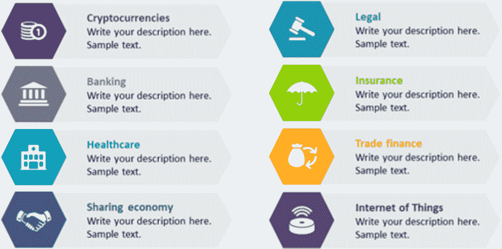
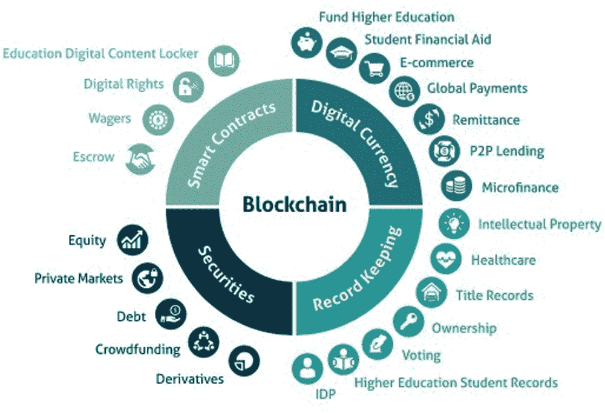
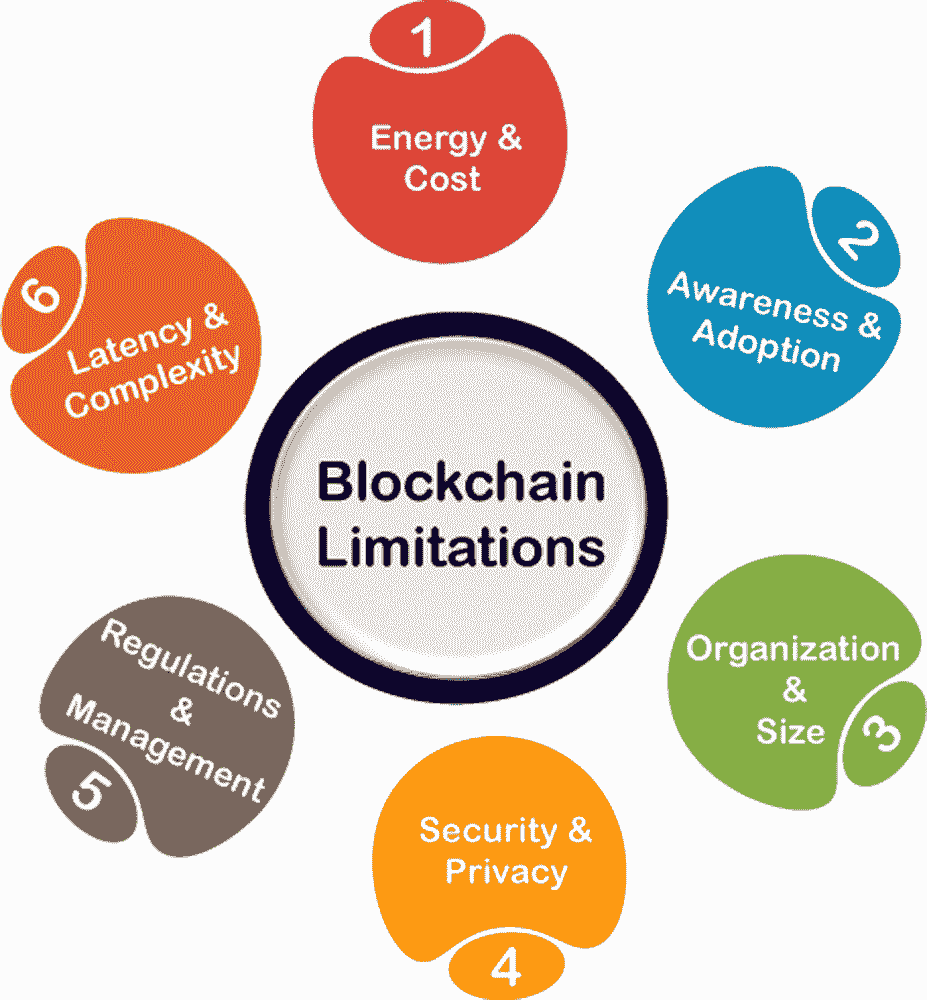
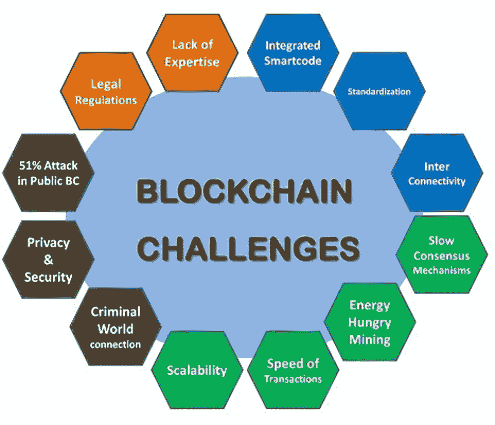
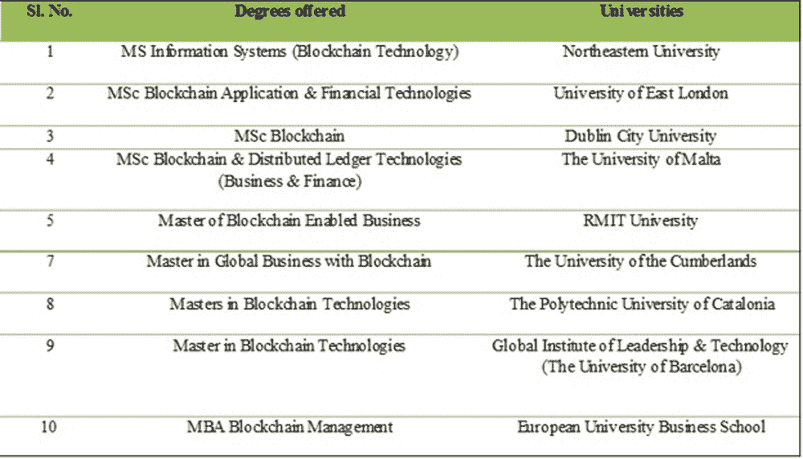
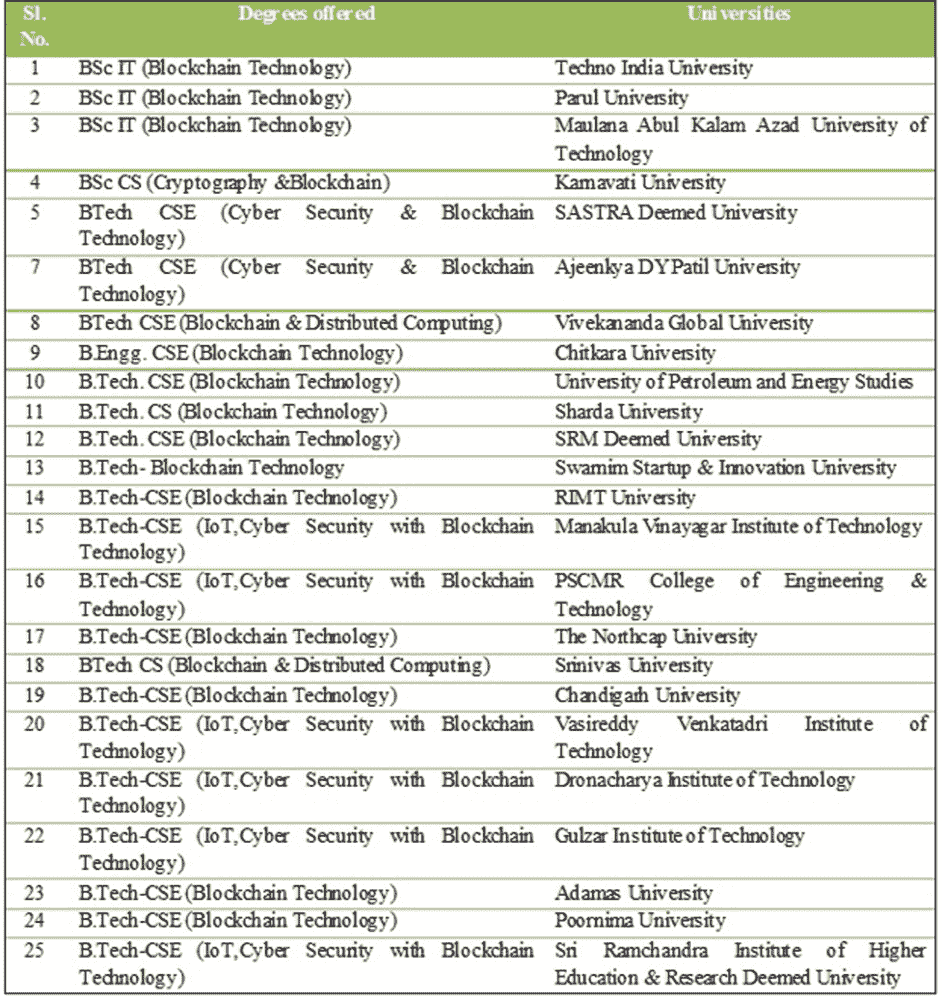
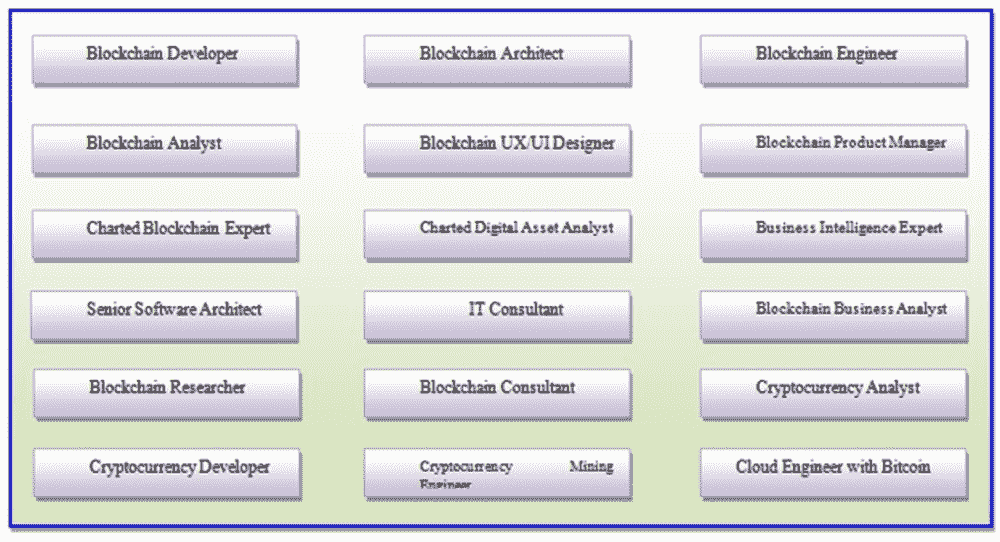

# 第三章

# 新兴的区块链技术与限制和问题：

强调印度背景

+   Prantosh Kumar Paul

    印度莱甘吉大学

摘要

区块链现在已经成为区块链技术，这是加密数据的记录，并且需要分布式数据库来进行交易、合同和独立记录。因此它是一个数字分类帐，并且可以在不同的平台上为不同的金融活动和服务提供支持。它由健康的数字货币系统支持，例如比特币交易，并且不依赖于任何第三方系统。区块链支持多个共享副本的数字记录，并且它在同一数据库中运作。最近，区块链被视为信息技术的一个重要子领域。因此，它被视为财务管理的工具、技术和程序。本章基于关于区块链的现有文献，重点介绍了基础知识和特定问题。本章重点介绍了印度区块链技术的情景，包括机遇、公司以及人力资源供应和潜力的情况。

引言

区块链技术是连接交易、合同的加密和分布式数据库，并依赖于不同的独立记录。区块链是数字分类帐，一个特定的地方被用来存储数据。区块链正在加强金融部门和适当数字货币如比特币交易的活动。区块链技术致力于有形和无形资产管理，在这里数据可以在特定的网络和分类帐中被跟踪和记录（Chattu 等人，2019）。区块链技术支持立即注册的成员，可以共享，并提供完全透明的信息。区块链在跟踪订单、支付、账户以及生产方面是必要的。使用区块链可以识别最终用户的交易细节，因此在商业和贸易、教育和培训、健康和医疗系统、政府和行政、娱乐、银行业和贸易等各个领域都在不断发展。它是一种防欺诈系统，比传统业务流程提供更透明的金融服务。与其他信息技术组件一样，区块链技术在其他领域和行业的应用也在增加和扩展。中本聪设计了一个不可变的交易分类帐，使用数字密码学将数据块链在一起，以解决与数字货币相关的双重支付问题。区块链技术允许参与者进行商业活动，即使彼此不相识，也能进行安全的业务。区块链负责识别参与者，包括验证交易，并确保每个人遵守规范。图 1 展示了区块链技术及其基本优势。区块链技术存在一些问题和挑战，在这方面，不同国家的问题不同。就印度而言，与区块链技术相关的某些问题包括从法律和法规、规范和指南、财务方面等的实施和执行。图 1 以一瞥的方式描述了区块链技术的基本优势和好处（Chen, G., et.al., 2018）。

有许多地方可以应用区块链技术，其中重要的是供应链管理、投票管理系统、版权和所有权保护事务、个人和财务管理、更好的零售管理与版税奖励、医疗保健、交通和旅游等。例如，通过适当的供应链管理，可以轻松跟踪产品的状态，这对现有的地理信息系统更有支持。

| 图 1 区块链技术的优势一览 |
| --- |
|  |

工作目标

名为“新兴区块链技术与限制和问题：强调印度背景”的章节是概念性的，并且是一项理论性的工作。这一章的目标是—

+   • 以简明方式了解区块链的基本方面，包括特点以及区块链技术的基本功能。

+   • 以简单方式了解量子区块链技术。

+   • 简要了解区块链技术的限制和缺点。

+   • 查明当代情景下实施区块链技术的问题和挑战。

采用的方法论

现有工作是理论性的，并收集自不同的二手来源和一手来源。二手来源用于收集有关区块链技术的特点和功能等方面。为了获取区块链领域的最新技术，还研究了不同公司的网站，以了解该领域的最新动态。此外，还研究了有关区块链主题的政府政策，以实现工作的目标。

区块链技术：基本方面

区块链技术是一种数据库，特别是数字账本。David Cham 在 1982 年提出了区块链的概念，后来 Stuart Haber 和 W. Scott Stornetta 在 1992 年的书中也提出并描述了该技术的其他一些方面（Gabison, 2016）。第一个基于区块链的网络实现由 Satoshi Nakamoto 完成，随后数字货币和比特币方面的内容变得流行起来。这项技术的不同工具和技术日益增多（Grover 等人，2016 年）。区块链的不同交易存储在同一网络中，并且所有这些交易广泛分类为以下三种。

+   • 公共区块链，

+   • 私有区块链，和

+   • 混合区块链。

公共区块链是开放的，工作于计算机网络的分散式，此类网络对于任何人都是可访问的以进行交易。在公共区块链系统中，验证交易的人通常会收到奖励，而为此使用了两种模式（工作证明，权益证明）。比特币和以太坊（ETH）是公共区块链的主要例子，关于此方面的一些特点如下—

+   • 更高的安全性

+   • 开放和灵活的环境

+   • 匿名性质

+   • 没有治理和规定

+   • 充满透明度和隐私

+   • 分布式性质等。

私有区块链有一些限制，因此不像公共区块链那样开放。除此之外，这里认为权限对于交易是重要的。关于这一点，连接系统管理员的工作被认为是有价值的（Christ & Helliar, 2021）。私有区块链提供各种内部网络机会，例如—

+   • 复杂的隐私和保密性。

+   • 高水平的效率。

+   • 更快速和先进的交易。

+   • 更好和健康的可扩展性。

+   • 更快速。

混合区块链是区块链的重要类型，它结合了公共区块链和私有区块链，以实现对控制和实现更高目标的需求，包括提供集中和去中心化的特性。混合区块链由于是一个合并系统，因此具有完整性、透明度和安全性的特性。混合区块链还提供了最大程度的定制化，在私有网络中具有强大的保密性（Saini 等，2021）。推广区块链技术的原因有很多，例如—

+   • 区块链技术在医疗和与健康相关的数据管理中很有用。

+   • 在 NFT 市场中，一些技术正在被使用，其中区块链被认为是重要的。

+   • 音乐行业的版税跟踪是由区块链技术完成的。

+   • 用于跨境支付和类似交易的区块链也被认为是重要的。

+   • 对于实时和复杂的基于物联网的系统，区块链技术也可能被认为是有效的，至少部分地。

+   • 关于个人身份安全增强和发展，区块链是有效的。

+   • 区块链正被用于反洗钱追踪系统的目的

+   • 区块链在先进和智能的供应链系统和物流监控系统的设计和开发中很有用。

+   • 用于健康和复杂物流监控系统的发展中，区块链正在被使用。

+   • 区块链正在被用于现代和先进的投票机制

+   • 在管理和推进当代广告系统方面

+   • 推进和增强加密货币交易以及管理。

+   • 在开发和推进房地产处理平台和系统时。

区块链技术的利用正在逐渐增加，并适用于金融和银行服务、教育和研究、医疗保健和医疗系统、政府和行政、旅行和酒店业等各个领域。图 2 中提到了一些领域。

| 图 2. 区块链技术的新兴应用 |
| --- |
|  |

量子区块链：基础知识

量子技术正在不断改进并在不同领域应用。在量子领域中，量子力学、量子计算、量子信息学被认为是有价值的。在量子信息学早期，量子密码学被认为是重要的之一，但在最近，随着区块链系统的诞生，量子区块链也蓬勃发展（Jain, Hiran, & Paliwal, 2012）。量子区块链是区块链的高级版本，是一种分布式和基于加密的，而且它是基于量子计算和量子信息理论的。重要的事实是在存储和记录数据之后，恶意篡改变得困难。由于量子计算和技术领域的最新和新兴研究，最近量子区块链的发展引人注目。根据理论，一台启用了 300 个量子比特的计算机可以立即执行比可见宇宙中的原子还要多的计算。先进和强大的量子计算机可以成功地破解传统的密码学甚至是复杂和受保护的区块链。

量子区块链通过使用量子计算机的适当原理来帮助实现适当的安全管理，传统的区块链致力于收集记录，并将其与时间顺序的密码学连接起来。就量子区块链而言，在这里，块的记录基本上是用光子编码的（这些记录被编码成一系列），这些光子相互纠缠。因此，这里的块基本上是按照时间顺序排列的，而且在时间上是纠缠的。此外，在量子区块链中，交易是在量子计算机网络内传输的。区块链的所有基本特征（如以下内容）也支持量子区块链系统—

+   • 区块链是先进的不可变的网络，用户无法编辑或修改。

+   • 区块链系统通常拥有自己的分布式系统，每个节点都遵循自己的系统交易传递。

+   • 由于区块链使用加密，因此系统内任何类型的交易都变得简单且安全。

+   • 利用区块链技术可以实现更快的结算，这种系统比现有系统更先进更快。

因此，所有这些传统的区块链系统也能够利用量子区块链和技术加速发展。

区块链技术的局限性和缺点

区块链技术涉及不同潜在应用，在这里，各种去中心化应用在金融方面也被认为是有价值的，但技术存在一些问题和限制，其中一些如下所述（还参见图 3）。

缺乏认识—缺乏对区块链技术的认识被认为是其中一个重要的限制和缺陷，这需要通过不同的方法和倡议来克服（参见 Christ & Helliar, 2021）。

有限的人力资源技能—在区块链技术等相关领域，包括密码学、比特币等领域，存在大量的机会，但是在区块链技术领域缺乏熟练人才的问题是重要的关注点。在这方面，部委、行业和协会的倡议被认为是值得的。

| 图 3\. 一览区块链技术的一些基本限制 |
| --- |
|  |

Immutable—区块链系统带来了各种好处，其中隐私是其中重要的一项。由于在区块链技术中不允许修改记录，因此用户在一般修订和编辑方面面临问题（参见 Macrinici et. al., 2018）。

关于密钥管理—区块链技术使用不同类型的密钥，重点是公钥和私钥，因此这些系统存在风险。

可伸缩性—关于可伸缩性的问题也被认为是区块链技术中的重要问题，因为在这里每个参与节点都必须验证基本和必要的交易。比特币无法解决大规模问题和交易量，因此在这里可伸缩性问题被视为重要。

共识机制—在区块链技术中，每隔 10 分钟就会创建一个区块，因此每个交易都需要达成共识（见 Gereffi et.al.，2008）。

实施成本—区块链技术为我们提供了不同的机会和好处，但同时由于项目成本的原因，该技术的实施和执行变得困难。

低效率—在区块链技术中可以注意到某些低效率，其中包括网络、技术人员等问题被认为是值得和重要的。

存储—区块链的性质是持续不断的，因此在这里存储被认为是重要和有价值的。

区块链的主要问题：印度背景

几乎所有的 IT 和信息实践部门在印度都在增长（Paul, P.K.等人，2016 年）。区块链技术在印度处于增长阶段，具有广泛的好处和优势。在印度，有超过三万名创新者和从业者从事区块链领域的工作，并且该领域因其在公共和私营部门中的先进透明度和问责制而在全球范围内得到认可（见 Jirgensons & Kapenieks，2018）。然而，关于区块链的挑战和问题是值得注意的，包括可伸缩性和互操作性的问题。就安全性和隐私性而言，某些挑战和问题被视为重要。下面列出的不同问题和挑战在图 4 中列出。

信息技术法律法规的管理是重要的，根据印度《信息技术法》，这里将数据保护相关条款和方面视为值得重视和重要（Khezr 等人，2019 年）。 区块链技术致力于在链上存储数据，并且相同的数据记录在网络上的每个节点上，因此与《信息技术法》第 43A 条相冲突（Lin 等人，2020 年）。 数据保护法律旨在保护用户的隐私，在私有区块链中也存在有关控制数据不同要素的隐私级别的担忧（Pane 等人，2020）。

区块链技术由于 2019 年草案个人数据保护法案的‘被遗忘权’案/条款而遭受数据安全和隐私问题，这不符合区块链的固有核心功能（Omar 等人，2021 年）。 由于隐私涉及数据所有权，因此在这方面，区块链可以设计为不同的上下文，即公共、私有和混合。 在区块链内部，存在关于管理链上和链下数据管理以避免敏感数据的问题。 区块链技术还带来与银行相关方面的担忧，在这里，通过亲自验证的不可否认性被视为有价值的，此外，加密货币也是一个重要问题，并与银行监管冲突（Milovanova 等人，2020 年）。

有关交易和相关方面的问题，特别是根据《信息技术法》第一编的数字签名。 这里使用证书颁发机构的问题被视为重要，特别是与数据隐私相关的方面，因为在区块链中，所有节点都具有私钥、公钥，并且在其级别上运作。 在区块链技术的背景下，去中心化金融（DeFi）的方面被认为是值得重视的。

| 图 4。区块链技术的主要挑战和问题 |
| --- |
|  |

近代见证了各种技术进步，特别是在信息技术领域，而新兴领域的区块链技术被认为是其中一项重要的技术 (Radanović & Likić, 2018)。一些相关技术，如机器学习、深度学习、云计算、大数据等，对支持区块链技术的整体发展至关重要。这项技术的出现带来了良好且可负担的透明度和不可变性。最近，区块链的应用在不同领域不断增加，如土地所有权登记、车辆生命周期管理、农场和保险管理、数字医疗保健记录管理等。值得注意的是，区块链旨在被融入国家的社会、经济结构中，并得到政府和私营部门的支持和参与。不同的公司正在进行区块链实施，以改进和有效地运营。根据一项研究，印度有 56% 的企业计划转向区块链技术，而印度政府在这方面的倡议也值得注意，通过区块链技术卓越中心（CoE）开展并协调与区块链相关的项目。这项倡议在实际实施之前是值得推广的 (Gamage et.al., 2020)。

区块链技术需要一个适当的监管机构，尽管目前尚无任何适当的机构，但值得一提的是印度国家智库 NITI AAYOG 关于区块链技术的战略文件，用于其实施案例、建议。为了完善的区块链环境和社会经济增长，重要的是建立一个本地化的点对点交易网络。在这方面，每个邦政府可能都有自己的战略、政策和倡议。有一些组织正在开发区块链系统，其中证券交易委员会（SEBI）参与了一些倡议，例如创建、托管和维护系统，在这里 DLT（分布式账本技术）发挥着重要作用。这种 DLT 在记录和监控非可转换证券的契约方面也很重要。从 2022 年 4 月 1 日起，该 DLT 系统已经实施，用于完全发展 BFSI 行业，采用区块链技术。由于银行业和医疗保健行业的监管变化迅速，因此预计会出台适当且负担得起的法规，以改善部署系统。最近（2021 年 12 月），印度电子和信息技术部（MeitY）发布了关于区块链的国家战略，这是一个政策框架，旨在规划和采纳适当的技术，特别是用于电子治理和相关活动。印度政府应该把区块链视为一种服务。除了总体的区块链战略，州级和具体的区块链也被认为是重要和有价值的。印度政府电子和信息技术部正在致力于提供强大的安全性、信任和可追踪的交易，以支持印度区块链的发展。MeitY 的路线图包括评估未来计划、现有计划、部署计划以及采纳当前计划的价值（Kumar & Mallick，2018）。印度政府电子和信息技术部计划专注于以下薄弱领域，以发展区块链技术系统—

+   • 可扩展性，

+   • 安全性，

+   • 互操作性，

+   • 数据本地化，和

+   • 文件处理。

区块链倡议还特别注意到了几家私营企业和组织的倡议，根据 Cross Tower 的报告，2021 年区块链行业的价值将从 50 亿美元增加到预计的 2620 亿美元，并在 11 年的预期期间带来 1.1 万亿美元的贡献。因此，根据预期计划，区块链的增长将对印度的 GDP 增长产生显着影响。该技术将对数字化的实施产生巨大影响，同时也是真正的“数字印度”倡议。为了正确实施区块链技术，需要大量的人力资源，借助区块链的支持，功能可以在以下领域得到增长

+   • B2B（企业对企业）

+   • G2C（政府对公民）

+   • G2G（政府对政府）

+   • B2G（企业对政府）

区块链的应用和实施可以在医疗保健、政府和行政、网络安全与管理、旅游业、教育培训等多个领域实现。因此，区块链支持透明度和问责制，并为与公民之间提供无摩擦的交易。据一些人怀疑，区块链的实施可能会磨损传统系统，但需要提到的是，它可能会有效地改革现有的系统和程序。区块链的生态系统支持并鼓励透明度、不可变性以及分散化的方法。

在涉及花俏的网络和未来主义插图时存在问题和挑战，即使它为数字化形成和传递大量数据和信息提供了很大的灵活性。在不同平台上将信息数字化分成小片段时，数据通过加密技术加密传递。虽然使用一些策略可以实现数据的删除或编辑，区块链可以检查并对每个数据集进行必要的处理，使其仅归属于其所有者或所有人。区块链的去中心化特性有助于在用户之间建立更大的信任，这是通过使用量子服务和流程变得可能的。需要注意的是，在印度加密货币存在一些问题，需要相应解决。在印度，中间人的可用性是一个重要问题，需要消除。值得注意的是，在这些专业人士中，审计师、低端技术专业人员等是关键人物。信任的问题是银行业的一个重要问题，自 2008 年金融危机以来，开始采用区块链来管理欺诈活动被视为值得的做法。减少身份盗窃并实现数据最大透明度是区块链的有价值特性（Viriyasitavat 等人，2019 年）。

作为一个发展中国家，印度存在一些问题和难题，如食品和废物系统、供应链管理等等，而在所有这些情况下，区块链都可以被有效地用于存储信息，包括食品分配。区块链由于食品营销的经济利益而具有可采纳性。消费者与企业的关系可以通过区块链技术进行管理。据专家称，缺乏区块链知识被认为是一个重要的缺点，这里指的是来自行业、组织和人力资源的缺乏知识被视为有价值的（Siyal, 2019）。除此之外，贫乏和不可用的法规和框架也被视为有价值。根据 NASSCOM 的说法，印度的区块链技术情景和发展阶段存在着许多挑战，《NASSCOM Avasant 印度区块链报告 2019》强调，大型甚至中型服务提供商在印度的区块链项目不到 5%，这比北美国家和大多数欧洲国家都要低得多。值得注意的是，印度仅占全球区块链相关初创企业的 2%。

印度区块链的一些知名组织

印度的区块链技术虽然存在问题和挑战，但发展迅速。该技术被用于国际网络系统和计算机的比特币交易记录。这里私营和公共公司都在使用区块链技术，根据一项研究，有 56% 的组织正在通过区块链实现业务增长（Williams, 2019）。在卫生信息学实践中，印度政府正在推动更多并参与多项倡议，而区块链技术在这方面是适用的。对于低收入家庭，政府进行了大量投资，而区块链实施可能是一个值得的举措。由于印度拥有许多著名的 IT 公司，因此区块链技术的增长是显著的（Sun, Yan, & Zhang, 2016）。不同的调查和评论显示，有不同的公司深入研究这项技术，尤其来自班加罗尔、海得拉巴、浦那、斋普尔、艾哈迈达巴德、加尔各答、德里等地。一些公司的详细信息如表 1 所示。

表 1. 区块链技术的一些挑战

| 序号 | 公司 | 描述 |
| --- | --- | --- |
| 1 | Hyperlink InfoSystem | Hyperlink InfoSystem 是一家在印度、美国、阿联酋、加拿大和英国工作的公司。他们为几乎所有类型的组织提供了多种区块链服务。该公司提供了与区块链服务一起的其他服务，如 Web 开发、大数据分析、物联网、CRM 解决方案等等。 |
| 2 | Accenture | Accenture 是一家财富全球公司，拥有来自全球 200 个城市和 120 个国家的 492,000 名员工提供区块链及相关服务。Accenture 区块链与多方系统专注于供应链、数字身份和金融服务领域。 |
| 3 | Fueled | Fueled 是一家新兴的 IT 解决方案公司，凭借其面向区块链技术的服务获得了多个奖项，包括移动应用、CRM、POS、CMS、ERP、CDP 等。 |
| 4 | InfoSys | 印度第二大 IT 公司 Infosys Limited 拥有 82 个营销部门和 123 个技术开发中心，分布在各地。该公司积极从事基于区块链的服务，因此组织认为应该识别和关联适当的生态系统分布、规模采用等。 |
| 5 | Capgemini | Capgemini 是一家咨询、技术公司，拥有 270,000 名员工，从 50 个国家提供云服务与区块链解决方案。 |
| 6 | Tata Consultancy Services | TCS 不仅在印度而且在全球都是知名的 IT 品牌，其服务涵盖企业应用、区块链等，分布在 46 个国家的 149 个城市运营。 |
| 7 | Zensar Technologies | Zensar Technologies 成立于 1991 年，目前在全球 20 个国家拥有 10,000 名员工，提供云基础架构和区块链服务的先进技术解决方案。 |
| 8 | Willow Tree Apps | WillowTree 是一家应用开发公司，提供包括应用开发、软件开发等区块链服务。公司使用最新技术提供其服务。除了印度，公司在其他国家也设有运营部门。 |
| 9 | Tech Mahindra | Tech Mahindra 是 Mahindra 集团的一部分，在所有行业提供 IT 解决方案。公司由来自 90 个国家的 125,000 名员工运营，大力支持基于区块链的服务。 |
| 10 | HData Systems | HData Systems 提供基于区块链的技术来提高生产力，为此它还使用了一些其他相关技术和平台，如大数据分析，数据科学，人工智能，机器学习，自动化等。 |
| 11 | SoluLab | SoluLab 是从事区块链开发的重要公司之一，拥有超过 5000 万活跃用户，并据一项研究表明，其客户成功率达到 97%。公司为提供服务与财富 500 强企业合作运营。 |
| 12 | Eleks | ELEKS 是全球前 100 家全球外包 IT 公司之一，专注于中小企业使用创新技术。公司拥有 2,000 多名专家。ELEKS 通过软件开发、产品设计等提供服务，重点是基于区块链的服务。 |
| 13 | Quytech | Quytech 是一家区块链和游戏开发 IT 公司，致力于为金融部门、医疗保健部门和初创企业提供区块链服务。 |
| 14 | OpenXcell | OpenXcell 是一家软件解决方案开发公司，提供创新解决方案的开发，这些解决方案是具有未来感和用户友好性的，最终支持区块链系统。 |
| 15 | BrancoSoft | BrancoSoft 是一家成立于 2011 年的专业软件开发 IT 外包解决方案提供商，前身为 Thoughtwaver。公司拥有 50 多名高技能 IT 专家，为中小企业提供区块链解决方案。 |
| 16 | Sofocle Technologies | Sofocle 是一家企业区块链公司，为企业、初创企业和政府提供新兴技术。该公司与大型生态系统有着强大的合作伙伴关系。 |
| 17 | Sate Development | Sate 提供基于区块链技术的企业解决方案，帮助分布式区块链支撑卓越范围的应用。 |
| 18 | KrypC | KrypC 专注于区块链领域的小众开发。KrypC 在密码学和安全等多个领域拥有可观的技术和专业知识。 |
| 19 | Auxesis | Auxesis 团队致力于金融科技，重点发展区块链技术，并为不同组织提供广泛的解决方案，为初创企业提供经济可持续性。 |
| 20 | Osiz Technologies | Osiz Technologies 是一家 IT 和软件开发公司，以其区块链技术专业知识为企业家、企业和行业提供解决方案。 |

区块链技术与人力资源背景

区块链技术正在几乎所有领域发挥作用，因此在区块链及相关技术领域需要大量熟练且知识渊博的专业人员（Sakhipov & Baygozhanova, 2020）。因此，许多国家政府正在推出区块链领域的学术课程，这些课程是新兴的、基于技能的。这些学术课程不仅是培训课程，还包括全面的学位课程。研究表明，只有少数大学提供区块链技术及相关领域的学士和硕士学位课程，还有潜力推出更多类似 MTech by Research、MS by Research、博士后培训课程等的课程（Paul 等人，2017）。值得注意的是，区块链技术不仅作为区块链技术提供，还与其他技术融合，下面列出了一些可用的命名方式—

+   • 区块链

+   • 区块链技术

+   • 区块链与金融技术

+   • 区块链管理

+   • 区块链和分布式技术

+   • 区块链和分布式账本技术

+   • 加密学与区块链技术

+   • 物联网、区块链技术的网络安全（Yang 等人，2017）。

此外，根据研究发现，硕士学位（包括 MS 和 MSc）也是可行的。流行的工商管理硕士学位也提供区块链专业。在印度，仅有 Amity University 提供区块链专业的计算机应用硕士学位。一些大学也开设区块链技术硕士课程，如下图所示。图 5 显示了研究中列出的区块链硕士课程。

| 图 5. 根据采用的方法在硕士级别上的一些区块链技术学术项目 |
| --- |
|  |

在印度，除了传统高等教育外，新兴的技术教育也在增长（Kapur & Mehta, 2004）。就印度而言，区块链技术在不同的机构和大学以 B.Sc. 和 B.Tech. 的名称提供，并涉及计算机科学、计算机科学与工程、信息技术等专业。重要的是，这些项目以合并的名称提供，如密码学、分布式计算、物联网（IoT）、网络安全等。一些潜在可用课程的详细信息如图 6 所示。

| 图 6. 印度本科阶段的区块链技术 |
| --- |
|  |

根据研究结果显示，区块链技术主要以 B.Tech.（技术学士）学位提供。然而，Chitkara University 提供的学位称为 B.Engg.（工程学士），而不是技术学士。此外，研究显示，大多数此类学位为 4 年制，基本资格是 10+2 级纯理科。然而，位于芒格洛尔的 Srinivas University 向任何 10+2 合格者提供技术学士（B.Tech.）项目。不同的相关技术在加强 IT 系统方面发挥着重要作用，其中包括云计算、大数据与分析、物联网、加密货币等（Hiran & Henten, 2020）。区块链在政府和商业领域非常有用。人力资源开发对于培养银行和金融、农业和园艺、医疗保健和医学、制造业和汽车等领域的技术人才至关重要。在区块链领域有不同的职称可供选择，其中一些重要职称如图 7 所示。

| 图 7. 印度本科阶段的区块链技术 |
| --- |
|  |

区块链开发人员是所有职业中最受欢迎的，因此拥有区块链学位不仅解决了职业问题，而且随着职业发展而打开了职业机会。区块链技术专业人员正在执行以下任务 —

+   • 开发编程代码，包括加密资产，具有区块链数据挖掘能力

+   • 创建以及实施具有超级账本和分散式应用特征的加密货币

+   • 分析企业分析在商业、社会和行业领域的重要性和作用。

+   • 根据当前趋势，执行区块链技术和相关技术的特定需求和挑战。

+   • 能够解决组织和机构中的管理和相关问题（杨，2019）。

因此，拥有学士、硕士和博士学位的区块链教育人员应被视为解决人力资源问题的重要因素。因此，适当设计和开发课程被认为是重要的。尽管在区块链领域的培训计划应被给予首要重视。

印度情景中的关键挑战：总结

就区块链技术的实施而言，在印度情况下，缺乏知识和寻找主要挑战被认为是一个重要的挑战。关于区块链的误解是它可能会取代现有系统，但实际情况是，区块链技术有助于整合现有和新系统以提高效率。区块链专注于数字化区块并与每个节点连接，并且所有记录基本上都由所有节点接收，因此如果系统中的一个或多个系统失败，整个事物仍然保持在机制中。因此，区块链技术是透明的，并且提供了更高程度的安全性。区块链适用于多个领域，但在印度情况下，适用于银行业、金融服务以及保险业。就土地所有权登记、车辆生命周期管理、机构和农场保险而言，区块链技术是有价值的和重要的。根据普华永道于 2021 年 10 月发布的一份报告，预计到 2021 年全球区块链可能达到 1.76 万亿美元的 GDP。

报告还表示，区块链技术将能够提供溯源和可追溯性，这对于更好地管理供应链是非常有价值的，并且可能在 2030 年对印度的影响达到 410 亿美元。除了上述问题外，区块链技术还适用于证券化和支付，价值 132 亿美元。对上述内容的仔细观察和研究揭示了在印度情境下，区块链技术面临以下关键挑战。

+   • 区块链技术在各个领域都有丰富的机会和利益，但与此同时，对其潜在利用的认识非常有限，因此尚未达到预期的发展水平。

+   • 根据专家们的看法，与加密货币市场相关的政策和业务的缺乏监管被认为是一个重要的挑战，此外，技术、其影响以及其使用方面的某些问题被认为是值得关注和重要的。

+   • 区块链技术带来了许多机遇和好处，并提供了完整的解决方案，但一个常见的误解是区块链负责摧毁现有系统和程序。在这里，可以将现有和最新的方法整合在一起。

+   • 区块链技术基于不同的技术和系统，适用于金融服务领域，在这方面，不同的印度银行正在采用区块链机制和生态系统，但监管和框架的关注仍被视为重要。

+   • 并行技术和系统与区块链及云计算、大数据和人工智能等相关技术的整合也被认为是重要而有价值的。

+   • 在印度，加密货币被视为非法，因此区块链技术系统的增长和发展中的挑战也很重要，并影响了印度的区块链市场。因此，印度的初创公司更多地从首次代币发行（ICO）中获得资金，而不是传统的融资过程。

印度的区块链技术发展也面临人力和人力资源问题，采用适当的策略和政策可能会得到解决。

总结建议

区块链技术在金融领域有重大影响，在这方面，不仅私人组织，而且政府机构、机构和部门都在为改善区块链技术基础设施发挥主导作用。研究表明，印度的外国直接投资在 2020-2021 年度计算和信息技术行业的投资达到了 261.4 亿美元，而在 2019-2020 年度仅为 76.7 亿美元。因此，印度将成为重要的技术中心之一。除了区块链之外，还应考虑云计算、大数据和分析、物联网、加密货币等技术对 ICT 基础设施的整体和完整发展的重要性。

参考文献

Chattu, V. K., Nanda, A., Chattu, S. K., Kadri, S. M., & Knight, A. W. (2019). 区块链技术应用在日常疾病监测系统中的新兴作用，加强全球卫生安全。《大数据与认知计算》，3(2)，25–35。doi:10.3390/bdcc3020025

Chen, G., Xu, B., Lu, M., & Chen, N. S. (2018). 探索区块链技术及其在教育中的潜在应用。《智能学习环境》，5(1)，1–10。doi:10.1186/s40561-017-0050-x

Christ, K. L., & Helliar, C. V. (2021). 区块链技术与现代奴隶制：减少移民工人招聘中的欺骗。《商业研究杂志》，131，112–120。doi:10.1016/j.jbusres.2021.03.065

Gabison, G. (2016). 区块链技术公共和私人应用的政策考虑。《SMU 科学与技术法律评论》，19(1)，327–334。

Gamage, H. T. M., Weerasinghe, H. D., & Dias, N. G. J. (2020). 区块链技术概念、应用和问题的调查。《SN 计算机科学》，1(2)，1–15。doi:10.1007/s42979-020-00123-0

Gereffi, G., Wadhwa, V., Rissing, B., & Ong, R. (2008). 搞清楚数字：美国、中国和印度的国际工程教育。《工程教育杂志》，97(1)，13–25。doi:10.1002/j.2168-9830.2008.tb00950.x

Grover, M., Reinicke, B., & Cummings, J. (2016). 信息技术教育的安全性如何？ 评估 IT 安全教育的方法。《信息系统教育杂志》，14(3)，29–37。

Hiran, K. K., & Henten, A. (2020). 云计算在高等教育部门采用的整合 TOE–DoI 框架：撒哈拉以南非洲埃塞俄比亚的案例研究。《系统保证工程与管理国际期刊》，11(2)，441–449。doi:10.1007/s13198-019-00872-z

Jain, R. K., Hiran, K., & Paliwal, G. (2012). 量子密码学：信息安全系统的新一代。《国际计算机与分布式系统期刊》，2(1)，42–45。

Jirgensons, M., & Kapenieks, J. (2018). 区块链与数字学习凭证评估和管理的未来。《可持续教师教育杂志》，20(1)，145-156。

Kapur, D., & Mehta, P. B. (2004). 印度高等教育改革：从半熟社会主义到半熟资本主义。《国际发展中心工作论文》，103。

Khezr, S., Moniruzzaman, M., Yassine, A., & Benlamri, R. (2019). 医疗保健中的区块链技术：全面回顾和未来研究方向。《应用科学（巴塞尔，瑞士）》，9(9)，1736–1745。doi:10.3390/app9091736

Kumar, N. M., & Mallick, P. K. (2018). 用于物联网安全问题和挑战的区块链技术。《计算机科学会议论文集》，132(1)，1815–1823。doi:10.1016/j.procs.2018.05.140

Kursh, S. R., & Gold, N. A. (2016). 在课程中添加金融科技和区块链。《商业教育创新杂志》，8(2)，6–12。

Lin, W., Huang, X., Fang, H., Wang, V., Hua, Y., Wang, J., Yin, H., Yi, D., & Yau, L. (2020). 当前农业系统中的区块链技术：从技术到应用。《IEEE 接入：实用创新、开放解决方案》，8，143920–143937。doi:10.1109/ACCESS.2020.3014522

Macrinici, D., Cartofeanu, C., & Gao, S. (2018). 区块链技术中的智能合约应用：系统性映射研究。《远程信息学与信息学》，35(8)，2337–2354。doi:10.1016/j.tele.2018.10.004

Milovanova, M. M., Markova, T. S., Mushrub, V., Ordynskaya, M. E., & Plaksa, J. V. (2020). 商业教育：区块链技术在业务发展中的应用培训。《包容性评论》，408-420。

Omar, I. A., Jayaraman, R., Salah, K., Yaqoob, I., & Ellahham, S. (2021). 区块链技术在临床试验中的应用：回顾与面临的挑战。《阿拉伯科学与工程杂志》，46(4)，3001–3015。doi:10.1007/s13369-020-04989-3

Pane, J., Verhamme, K. M., Shrum, L., Rebollo, I., & Sturkenboom, M. C. (2020). 区块链技术在医疗器械后市场监测中的应用。《医疗设备专家评论》，17(10)，1123–1132。doi:10.1080/17434440.2020.1825073

Paul, P. K., Aithal, P. S., Bhuimali, A., & Kumar, K. (2017). 新兴学位和合作：计算与信息技术中工程科学背景的背景——印度增强政策制定的分析。《科学。工程和技术领域的最新研究国际期刊》，5(12)，13–27。

Paul, P. K., Bhuimali, A., & Chatterjee, D. (2016). 零售信息学：基础知识和新兴场景，特别参考印度情景下拟议的 MSc-信息科学（零售信息学）的设计与发展。《信息传播与技术国际期刊》，6(2)，140–144。

Radanović, I., & Likić, R. (2018). 区块链技术在医学中的应用机会。《应用健康经济学与卫生政策》，16(5)，583–590。doi:10.1007/s40258-018-0412-8

Saini, H. K., Jain, K. L., Hiran, K. K., & Bhati, A. (2021). 利用区块链实现智能城市的范式。《可持续发展的区块链 3.0》，10，21。

Sakhipov, A. A., & Baygozhanova, D. S. (2020). 区块链技术在教育中的应用。《科学进化》，（1），36–39。

Siyal, A. A., Junejo, A. Z., Zawish, M., Ahmed, K., Khalil, A., & Soursou, G. (2019). 医学与医疗保健中区块链技术的应用：挑战与未来展望。《密码学》，3(1)，3。doi:10.3390/cryptography3010003

Sun, J., Yan, J., & Zhang, K. Z. (2016). 基于区块链的共享服务：区块链技术对智慧城市的贡献。《金融创新》，2(1)，1–9。doi:10.1186/s40854-016-0040-y

Viriyasitavat, W., Da Xu, L., Bi, Z., & Hoonsopon, D. (2019). 区块链技术在物联网应用中的应用——从系统设计角度进行映射。《IEEE 物联网杂志》，6(5)，8155–8168。doi:10.1109/JIOT.2019.2925825

Williams, P. (2019). 基于区块链的能力导向教育是否预示着大学的新使命？《高等教育政策与管理杂志》，41(1)，104–117。doi:10.1080/1360080X.2018.1520491

Yang, C. S. (2019). 海运数字化：基于区块链的技术应用，未来改进和使用意图。《交通研究 E 部分，物流与交通评论》，131，108–117。doi:10.1016/j.tre.2019.09.020

Yang, X. M., Li, X., Wu, H. Q., & Zhao, K. Y. (2017). 区块链技术在教育中的应用模型和挑战。《现代远程教育研究》，2，34-45。

额外阅读

Queiroz, M. M., & Wamba, S. F. (2019). 区块链在供应链中的采用挑战: 印度和美国主要驱动因素的实证研究. 信息管理国际期刊 , 46, 70–82\. doi:10.1016/j.ijinfomgt.2018.11.021

关键术语和定义

区块链应用：区块链技术的应用逐渐增加，并且适用于金融和银行服务、教育和研究、医疗保健和医疗系统、政府和行政管理、旅行和酒店业等各个领域。

区块链技术：区块链技术是连接交易、合同并依赖于不同独立记录的加密和分布式数据库。区块链是数字账本，特定位置用于存储数据。区块链正在加强金融领域和活动，以进行像比特币交易这样的适当数字货币的交易。

加密货币：加密货币是加密数据，表示一种货币单位。这里的点对点网络起着重要作用，被称为区块链。这对于保护基于账本的数字交易，如购买、出售和转移等事物，非常有帮助。

金融工程：金融工程是一种跨学科工程分支，专注于设计、开发和管理金融系统、应用、机器和自动化系统。

NFT：NFT 是一种加密代币，负责专用区块链系统的开发和推广，这些代币是无法复制的。实时和现实世界的问题，如艺术品和房地产等，可以得到有效的管理和显著的发展。

量子：量子是通常具有多种形式能量的最小单位，并且可以细分。因此，量子是像磁矩这样的量子化物理量。

量子区块链：量子区块链利用量子计算机的适当原理来进行安全管理，传统区块链致力于收集记录，并且与时间顺序的密码学相连接。这里的区块记录基本上是使用与彼此纠缠的光子编码的（这里的记录被编码成一系列）。

量子技术：量子技术正在不同领域改进和扩展其应用。在量子领域中，量子力学、量子计算和量子信息学被认为是有价值的。
