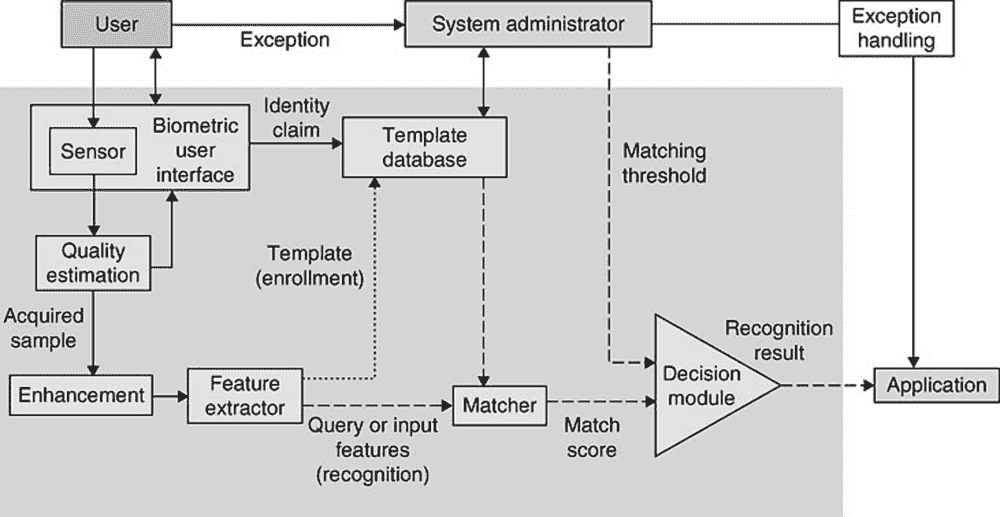
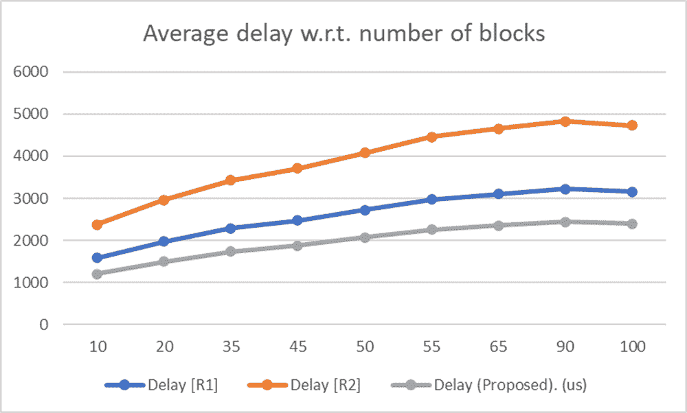
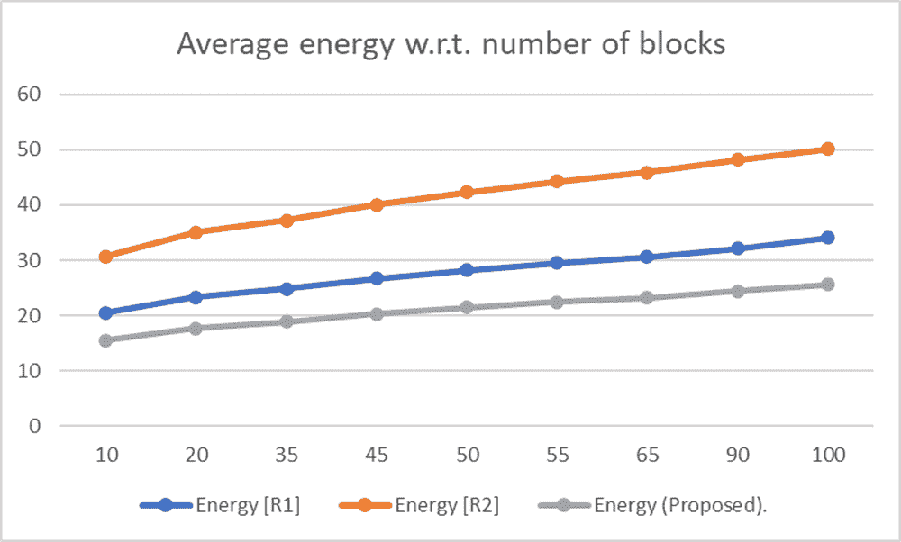

# 第四章

# 设计一种利用增强分片的区块链驱动生物特征模板安全框架

+   Sarika Khandelwal

    

    印度纳格浦尔的 G·H·莱索尼工程学院

+   Shaleen Bhatnagar

    印度总统大学

+   Nirmal Mungale

    印度纳格浦尔的 G·H·莱索尼工程学院

+   Ritesh Kumar Jain

    印度吉唐贾利技术研究学院

摘要

生物特征模板必须具备可追溯性、不可变性和高信任能力。研究人员提出了多种系统模型，其中大多数利用区块链或机器学习来提高安全性和服务质量（QoS）。增强分片模型采用轻量级增量学习框架设计，有助于碎片形成和管理。所提出的模型的性能评估表明，它能够实现高准确度的攻击缓解，以及低区块挖掘延迟和高吞吐量。该性能与各种最新方法进行了比较，延迟方面提高了 10%，吞吐量方面提高了 14%。此外，对于史比尔、伪装和中间人攻击（MITM），攻击检测准确率达到了 99.3%。该文进一步推荐了可以进一步研究以提高所提出模型的安全性和 QoS 性能的改进领域。

引言

保护生物识别签名是一个多领域任务，涉及到密码分析、隐私保护、可追溯性集成、信号处理、分类等。为了设计一个高效安全的生物识别签名处理系统，需要广泛的系统能力。这些包括但不限于数据安全、抗篡改能力、高速追溯性、低计算复杂度和降低的功耗需求。这种模型的一个示例如图 1 所示，其中可以观察到诸如模板登记、身份声明和异常处理等过程。该模型利用用户输入来捕获生物识别信息，包括指纹、面部数据等，并将这些信息提供给质量评估和特征提取。提取的特征被给予一个模板数据库进行存储，该数据库连接到一个系统管理员进行管理目的。系统管理员与模板匹配模块之间的连接通过应用程序编程接口（API）层进行。这一层将数据暴露给各种第三方，这些第三方可能容易受到窥探、伪造或篡改攻击。因此，有必要在系统与其任何传入和传出连接之间集成安全层。因此，用户数据捕获连接、系统管理员连接、应用程序连接以及任何其他连接都必须使用高性能安全层进行安全保护，该层提供高速数据读写能力。

为了设计这样一个安全层，研究人员们多年来提出了各种加密、密钥交换、隐私保护和机器学习方法。这些方法的调查可以从本文的下一部分中观察到，其中讨论了各种微妙之处、优势、限制和未来问题。

| 图 1\. 使用生物识别的身份验证模型 |
| --- |
|  |

在这次讨论的基础上，在区块链挖掘过程中观察到，每个区块都需要进行扫描以评估唯一且基于规则的哈希值。随着链长度的增加，这需要相当长的延迟，这降低了系统的可扩展性。为了提高可扩展性，使用机器学习模型，旨在减少存储和检索过程中的冗余计算，从而提高存储和检索速度。其中一些模型由于其内部构建结构而具有有限的与区块链集成能力。其他可接口化的模型不提供显着的性能改进，因为大长度的区块链需要强制的哈希验证和规则验证。因此，本文的问题陈述是在不同网络条件下保持高安全性和良好可扩展性。为了解决这个问题陈述，第三部分讨论了使用增强分片（BLTSAS）的提议的区块链驱动的生物识别模板安全框架的设计，以及其性能评估。此评估还包括与各种最新方法的比较，这有助于估计提议模型中的任何性能差距。最后，本文对提议的工作进行了一些有趣的观察，并推荐了进一步改善其性能的方法。

文献综述

为生物特征签名安全开发了多种系统模型，这些模型利用各种加密、哈希和数据修改模型来执行此任务。例如，(Toutara et al., 2020; Sawant et.al., 2020; Goel et.al., 2020; Mohatar et.al., 2019) 的工作提出使用区块链、智能合约、队列排序和 Merkle 树来进行生物特征数据的验证和存储。这些模型提出了一个初始级别的安全框架，用于存储和验证生物特征数据，因此具有中等安全性和中等 QoS 性能。通过在(Dinesh et al.,2021; Baqari et al., 2020; Yazdinejad et al.,2020; Shankar et al., 2021; Jain et al., 2012) 的工作中提出的哈希算法的影响、区块链访问控制、高度分布式区块链模型和基于区块链的一次性密码（OTP），可以改善安全性能。这些模型通过整合高度安全的加密和哈希方法来改进生物特征系统的认证和存储性能。但是由于部署了高复杂度的加密系统，它们在 QoS 性能方面表现不佳。在 (Waheed et al.,2020; Mastronardi et al.,2020; Goel et al.,2019; Ibrahim et al., 2021; Khazanchi et al., 2021) 中提出了较低复杂度的模型，其中提出了智能合约、射频识别 (RFID)、低延迟卷积神经网络 (CNNs) 和基于中心化同步的电子投票系统。这些系统利用低复杂度的加密和集中处理模型来提供生物特征存储的安全性，从而提高了 QoS，但引入了系统的安全漏洞。

生物识别系统的安全性能可以通过使用基于区块链的模糊签名（Naganuma 等人，2020；Hiran 等人，2021）、基于区块链的自主身份（Othman 等人，2018）、基于工作量证明（PoW）的区块链（Sarkar 等人，2019）以及文献中提出的基于素数利用进行区块链验证（Iovane 等人，2019）来改善。由于可扩展的区块链部署，这些模型提供了高安全性以及良好的服务质量性能。使用(Ali 等人，2019)中提到的认证协议，水平和垂直方向的几何中心分割（Jangid 等人，2020）、基于股权证明（PoS）的区块链（Jaffer 等人，2019）、授权证明（PoA）（Morano 等人，2020）以及公钥密码的混合融合(Iovane 等人，2020；Tyagi 等人，2021))可以进一步提高这种安全性能。这些模型有助于通过攻击预防来改善生物识别存储安全性，并在攻击期间作为改进模式分析的措施添加分类模型。在(Alharthi 等人，2021；Xiang 等人，2020; Gulati 等人，2019; Liu 等人，2019)中提出了类似的模型，其中包括隐私保护区块链生物识别、基于权限的区块链用户认证、基于身份的区块链和基于身份的智能合约。通过减少块形成和修改过程中的冗余来改善生物识别存储安全性和服务质量性能。观察到可以增加哈希大小以减少哈希验证的复杂性，从而增加区块链的安全性。在(Hongqing 等人，2018; Bathen 等人，2020; Madine 等人，2021; Wireko 等人，2028)中定义了应用特定的存储模型，其中定义了工业数据存储、自动驾驶数据存储和跨应用电子医疗记录（EMR）存储系统。这些模型的效率可以通过(Acquah 等人，2020; Mandal 等人，2020)进一步提高，其中提出了分布式存储和物联网（IoT）的无证书签名加密。这些模型通过选择性加密和减少区块链形成过程中的证书交换复杂性来改善生物识别存储的服务质量。基于这些模型的观察表明，基于区块链的模型已成为存储生物识别数据的事实标准，并且具有广泛的研究增强功能。在接下来的章节中描述了一个这样的系统模型，其中使用分片来提高生物识别数据的安全性和服务质量。

采用分片技术设计的区块链动力生物识别模板安全框架

提出的基于区块链的生物识别模板安全方法使用增强分片技术。它是使用修改版的联赛冠军算法（LCA）实现的，该算法用于辅助分片的创建和维护。修改后的 LCA 方法选择了最佳的分片策略，以提供高安全性、低延迟和良好的吞吐量性能。协议分为 2 部分，这两部分结合在一起形成最终的系统，

+   ● 基于工作量证明（PoW）的区块链设计，用于安全存储生物识别扫描。

+   ● 通过跟踪生物识别扫描的变化来创建分片。

+   ● 利用生物识别扫描的变化进行分片管理和合并。

分片管理和合并模型依赖于分片创建模型；因此，它们必须同时实施，以设计一个高度安全的生物识别存储系统。这些部分的详细描述在以下子节中定义。

基于工作量证明（PoW）的区块链设计，用于安全存储生物识别扫描

设计安全生物识别存储模型必须能够提供不可变性、可追溯性、高速检索和分布式计算能力。为了设计这样一个系统模型，本节提出了基于 PoW 共识的区块链存储模型。每个生物识别扫描都使用从 表 1 观察到的区块结构存储在区块链上，其中包括上一个区块的哈希值、存储的生物识别数据类型、实际生物识别数据、存储时间戳、哈希检查的 nonce 值和当前区块的哈希值。使用 256 位模式的安全哈希算法（SHA256）以生成区块的哈希值。

表 1。生物识别扫描存储块的设计

| Prev. Hash | 生物识别类型 | 生物识别数据 |
| --- | --- | --- |
| 时间戳 | Nonce | 区块哈希 |

为了将给定的生物识别扫描存储到区块链中，使用以下步骤，

+   ● 生物识别扫描转换为 1D 数组而不进行量化。

+   ● 在这个生物识别扫描数据之前添加了扫描大小、扫描尺寸和其他元数据的信息。

+   ● 使用此信息，根据 表 1 形成新的区块。

+   ●

    生成一个随机值的 nonce，并使用以下公式计算区块哈希，

    B[hash] = SHA256(P[hash]| B[type]| B[data]| T[s]| nonce) (1)

其中，P[hash]、B[type]、B[daa] 和 T[s] 分别表示上一个哈希、生物识别类型、生物识别数据和区块创建的时间戳。

+   ● 如果此哈希已经存在于链中，则会生成新的 nonce 值，这将导致新的哈希值。

+   ● 一旦生成了唯一的哈希值，然后将区块添加到链中，并且对每个新的生物识别扫描重复此过程。

随着扫描数量的增加，哈希生成的复杂性也增加。这导致需要增加到链中的块的延迟增加，从而降低了区块链存储模型的服务质量（QoS）。为了改善此 QoS，创建更小的区块链（分片），并按照以下各节中定义的过程进行管理。

通过跟踪生物识别扫描中的变化来创建分片

分片创建是将基础区块链划分为更小的链的过程，其中每个链由主存储处理单元独立管理。它使用的是 LCA 的修改版本，并可以通过以下步骤进行详细说明，

+   ● 输入参数，

    +   o 游戏数量（NG）

    +   o 联赛数量（NL）

    +   o LCA 学习率（L[r]）

    +   o 当前分片数量（N[curr]）

    +   o 将区块添加到链中的平均延迟（D[mean]）

    +   o 分片的最小长度（L[min]）

    +   o 分片的最小长度（L[max]）

+   ● 将所有游戏初始化为“可突变”，并按照给定的流程依次获取网络中当前部署的区块链解决方案的最佳分片长度，

    +   o 对于每场比赛 1 到 NG

        +   § 对于每个联赛 1 到 NL

        +   § 如果当前联赛标记为“不可突变”，则转到下一个联赛，否则处理此联赛。

        +   § 使用方程 2 制定一个随机的分片长度 ()，并生成具有给定长度的新分片，

             = rand(L[min], L[max]) (2)

        +   § 使用方程 3 评估每单位时间处理的数据包数（PPU[t]），这是给定时间间隔内添加到分片中的块数的估计，

             (3)

其中，Bp，Bd 和 Bt 分别表示单位时间通过的生物识别签名数量、单位时间丢弃的生物识别数据包数量和单位时间添加的总生物识别数据包数量。

+   o

    使用方程式 4 评估联赛适应度，

     (4)

其中，N[c] 是添加到链中的块的样本数量，D[i]，E[i] 和 B[i] 分别表示给定迭代中端到端延迟、所需能量和成功添加到链中的块的数量。

+   o

    找到每个联赛的适应度，然后使用方程式 5 评估阈值联赛适应度如下，

     (5)

+   o 将所有解标记为‘可突变’，其中联赛适应度小于 L[th]，将其他解标记为‘不可突变’，然后转到下一个游戏轮次。

一旦所有解被评估完毕，找到具有最大适应度的分片解决方案，这表明最大的节能、最大的区块转发以及最小的端到端延迟性能。让所选的分片长度为 SL[sel]，使用方程 6 找到系统的平均侧链长度（SL[avg]），

 (6)

其中，‘L’是当前分片的长度。仅当满足方程 7 时才接受这个新的侧链，

SL[sel]≥SL[avg]*L[r] 并且 SL[sel]≤S[max]*L[r]（7）

这将表明当前的区块链分片正在逐步增长，并且创建了最佳数量的区块链分片。根据这个过程，新的分片被创建，并且生物识别信息被添加到其中。每次向系统添加新的生物识别数据时都会评估此过程，并用于评估是否需要创建新的链，并在需要时创建分片。一旦创建了这些链，那么分片管理模块就会被激活，该模块将在下一节中进行描述。

利用生物识别扫描变化进行分片管理和合并

每个区块链分片存储在一组紧密放置的节点上。一旦生物识别存储容量发生变化，合并和管理层就会被激活。这一层能够自动管理分片并根据存储要求合并或拆分它们。这是必要的，以创建最佳数量的区块链分片，并且每个分片包含最佳数量的生物识别条目。为了执行此自动管理任务，执行以下步骤，

+   ● 输入

    +   o 每个分片中的节点数（N[shard]）

    +   o 当前分片数（N[curr]）

    +   o 被检查的分片索引（S[i]）

+   ● 采用动态分片聚类模型，以确定当前分片数据可以转移到哪个分片索引。该模型使用以下步骤操作，

    +   o 让当前分片‘S[i]’中生物识别数据的平均值为（x[1], x[2], x[3], …,x[n]）

    +   o

        计算所有分片到给定分片的平均距离，使用以下方程式，

        （8）

    +   o 如果 d[s]≤R，则将所有分片的‘S[i]’索引侧链虚拟合并到给定的侧链中，其中 R 根据系统性能选择。

+   ●

    对所有已完成合并过程的分片评估以下方程式 9，

    （9）

其中， 是第 j^(th) 分片的优化因子，而‘E’和‘F’是参与给定分片的存储设备的平均能量值和平均区块链数据转发比率。

+   ●

    选择具有最小值的合并分片 ，使得此值小于以下方程式 10 中制定的方差阈值。如果没有分片符合给定的阈值，则当前分片不与任何其他分片合并，并且被单独管理。

    （10）

由于这个过程，对碎片的有效合并和管理得以进行。一旦碎片管理层激活，最佳碎片将自动创建并在最少监督下进行管理。所有这些模块连接在一起，以执行高安全性的生物识别数据存储。该网络的性能可以在下一部分观察到，在该部分中，诸如延迟、吞吐量和攻击检测准确性等指标与最先进的算法进行了比较。

数据收集和结果分析

为了评估拟议的 BLTSAS 的 QoS 和安全性能，分片系统进行了大量生物识别数据输入的测试。存储数据的用户数量从 10 到 150 不等，并向系统注入了以下攻击，

+   ● 伪造攻击

+   ● 中间人攻击（MITM）

+   ● 中间人攻击

由于存在多个分片检查点，以及底层 PoW 区块链的不可变性，存储网络能够以 100% 的准确性检测到所有这些攻击。因此，使得系统对这些已知攻击和很可能对任何未知攻击都高度安全。存储在分片网络中的每个生物特征签名都要经过多次验证和验证检查，因此才能实现如此高的安全性能。在完成这些安全检查后，通过将存储的签名数量从 10 到 50 个用户变化来比较端到端延迟、能量消耗、吞吐量、数据包交付比和抖动等 QoS 参数。下表展示了拟议的分片协议与非分片 (Naganuma 等人，2020) 和 (Alharthi 等人，2021) 系统的 QoS 结果。这些结果是通过计算给定网络存储在多个生物识别数据存储期间消耗的平均能量和所需延迟得出的。基于此，将为 10 个用户添加多个区块到碎片的延迟在 表 2 中列出，该表还比较了不同非分片模型的延迟性能，从而有助于评估拟议的侧链解决方案的优越性。

表 2\. 10 个用户的延迟

| 区块数量 | 延迟 (Naganuma 等人，2020) (微秒) | 延迟 (Alharthi 等人，2021) (微秒) | 延迟（拟议）(微秒) |
| --- | --- | --- | --- |
| 10 | 869.4 | 1304.1 | 660.6 |
| 20 | 1081.8 | 1622.7 | 821.7 |
| 35 | 1251.9 | 1877.4 | 951.3 |
| 45 | 1355.4 | 2033.1 | 1030.5 |
| 50 | 1490.4 | 2236.5 | 1134 |
| 55 | 1627.2 | 2441.7 | 1237.5 |
| 65 | 1701.9 | 2552.4 | 1293.3 |
| 90 | 1763.1 | 2645.1 | 1341 |
| 100 | 1907.1 | 2862 | 1450.8 |

与其他分片系统相比，速度提高了近 18%，这是由于有效的碎片创建和合并过程。类似的性能改进也观察到了 50 个用户，可以从 表 3 中观察到，

表 3\. 50 个用户的延迟

| 区块数 | 延迟 (Naganuma et al.,2020) (us) | 延迟 (Alharthi et al., 2021) (us) | 延迟 (提议) (us) |
| --- | --- | --- | --- |
| 10 | 1044 | 1565.1 | 792.9 |
| 20 | 1298.7 | 1946.7 | 986.4 |
| 35 | 1503 | 2252.7 | 1141.2 |
| 45 | 1626.3 | 2439.9 | 1236.6 |
| 50 | 1789.2 | 2684.7 | 1359.9 |
| 55 | 1953 | 2930.4 | 1484.1 |
| 65 | 2041.2 | 3063.6 | 1552.5 |
| 90 | 2115.9 | 3174.3 | 1609.2 |
| 100 | 2087.1 | 3132 | 1587.6 |

延迟与 (Naganuma et al.,2020) 相比减少了近 20%，与 (Alharthi et al., 2021) 相比减少了 26.8%，描述了其他侧链系统，这是由于自动侧链管理和合并。对于 100 用户，类似的性能改善也观察到，可以从 表 4 中观察到，

表 4\. 100 用户延迟

| 区块数 | 延迟 (Naganuma et al.,2020) (us) | 延迟 (Alharthi et al., 2021) (us) | 延迟 (提议) (us) |
| --- | --- | --- | --- |
| 10 | 1260.9 | 1890.9 | 958.5 |
| 20 | 1568.7 | 2352.6 | 1192.5 |
| 35 | 1815.3 | 2722.5 | 1379.7 |
| 45 | 1965.6 | 2948.4 | 1494 |
| 50 | 2162.7 | 3243.6 | 1644.3 |
| 55 | 2360.7 | 3539.7 | 1794.6 |
| 65 | 2467.8 | 3700.8 | 1875.6 |
| 90 | 2556.9 | 3835.8 | 1944 |
| 100 | 2312.1 | 3468.6 | 1757.7 |

与 (Naganuma et al.,2020) 相比，速度提高了近 24%，与 (Alharthi et al., 2021) 相比，提高了 31.5%，描述了其他侧链系统，这是由于碎片合并和自动碎片管理。因此，平均延迟减少了 20%，可以从 图 2 中观察到，其中平均延迟针对区块数进行了可视化。

| 图 2\. 不同侧链算法的延迟性能 |
| --- |
|  |

类似的性能改善也观察到能耗上，并且在 表 5，6 和 7 中有所表述。

表 5\. 10 用户能耗

| 区块数 | 能耗 (Alharthi et al., 2021) (mJ) | 能耗 (Alharthi et al., 2021) (mJ) | 能耗 (提议) (mJ) |
| --- | --- | --- | --- |
| 10 | 10.00 | 14.99 | 7.61 |
| 20 | 11.38 | 17.07 | 8.66 |
| 35 | 12.11 | 18.16 | 9.21 |
| 45 | 13.02 | 19.52 | 9.89 |
| 50 | 13.77 | 20.66 | 10.47 |
| 55 | 14.40 | 21.61 | 10.95 |
| 65 | 14.94 | 22.41 | 11.36 |
| 90 | 15.67 | 23.50 | 11.91 |
| 100 | 16.71 | 25.07 | 12.70 |

与 (Naganuma et al.,2020) 相比，能耗减少了 15%，与 (Alharthi et al., 2021) 相比，减少了 23.6%，描述了其他算法，这表明整体网络寿命有所提高。50 用户的对比可从 表 6 中观察到。

表 6\. 50 用户能耗

| 区块数 | 能耗 (Naganuma et al.,2020) (mJ) | 能耗 (Alharthi et al., 2021) (mJ) | 能耗 (提议) (mJ) |
| --- | --- | --- | --- |
| 10 | 13.00 | 19.49 | 9.88 |
| 20 | 14.80 | 22.19 | 11.25 |
| 35 | 15.74 | 23.61 | 11.97 |
| 45 | 16.93 | 25.38 | 12.87 |
| 50 | 17.90 | 26.85 | 13.62 |
| 55 | 18.73 | 28.09 | 14.24 |
| 65 | 19.42 | 29.12 | 14.76 |
| 90 | 20.37 | 30.55 | 15.48 |
| 100 | 21.84 | 31.42 | 16.35 |

随着节点数量的增加，能源效率得到改善。对于 50 个用户，能耗降低了超过 20%，这是由于随着用户数量的增加，侧链合并的影响更大。这种效应可以在以下 表 7 中观察到，其中可以看到在 100 个节点的情况下的效果。

表 7\. 100 用户的能量

| 区块数 | 能量（Naganuma et al.,2020）(mJ) | 能量（Alharthi et al., 2021）(mJ) | 能量（提议）(mJ) |
| --- | --- | --- | --- |
| 10 | 17.99 | 26.99 | 13.68 |
| 20 | 20.48 | 30.73 | 15.57 |
| 35 | 21.80 | 32.69 | 16.57 |
| 45 | 23.44 | 35.14 | 17.81 |
| 50 | 24.79 | 37.17 | 18.84 |
| 55 | 25.94 | 38.90 | 19.71 |
| 65 | 26.89 | 40.33 | 20.44 |
| 90 | 28.20 | 42.30 | 21.44 |
| 100 | 29.50 | 43.81 | 22.14 |

从在 表 5, 6 和 7 中观察到的结果可以看出，与其他侧链解决方案相比，提议的分片模型减少了几乎 20% 的通信所需的延迟。这表明整体系统速度增加了，并暗示着提议的模型可以用于实时高速生物识别存储系统。这也可以从 图 2 中观察到，其中所有通信的平均延迟性能被合并。同样，能量性能表明，与其他侧链系统相比，提议的分片解决方案更具 18% 的能源效率。这也可以从 图 3 中观察到，其中直观比较了这些算法的能量性能。

| 图 3\. 提议的分片架构的能量表现 |
| --- |
|  |

对吞吐量、抖动和包交付率等其他 QoS 参数进行了类似的比较。可以从以下 表 8 中观察到此比较的结果，其中可以看到提议的分片模型在所有 QoS 参数上都优于其他模型。从而使得该系统适用于高性能、高可信度、高透明度、低能耗、高安全性的实时生物识别存储系统。

表 8\. QoS 参数的比较性能

| 参数 | (Naganuma et al.,2020) | (Alharthi et al., 2021) | 提议 |
| --- | --- | --- | --- |
| 延迟 (us) | 2100.60 | 3727.80 | 2029.50 |
| 能量 (mJ) | 22.86 | 44.28 | 22.32 |
| 吞吐量 (kbps) | 232.20 | 159.30 | 246.60 |
| 抖动 (us) | 54.43 | 114.91 | 52.56 |
| 包交付率 (%) | 89.08 | 75.72 | 89.55 |

整体系统的 QoS 实现了超过 20% 的平均性能改进，可以从 图 4 中观察到，其中不同 QoS 参数的平均性能改进可以看到。

| 图 4\. 平均 QoS 改进 |
| --- |
|  |

由于这一改进，底层系统可以用于实时生物识别存储，这需要高安全性和高服务质量，而不会在这两个参数中进行任何妥协。 在成本分析方面，与标准区块链模型相比，该模型能够将部署成本降低 25%。 该成本分析包括所提出模型与不同网络部署上现有区块链模型的延迟、能耗、吞吐量和数据包交付比率。

结论和未来展望

分片技术被用来通过有效的区块链分割以减少生物识别存储系统的整体延迟和能耗。 这种分割允许区块链减少添加、更新、搜索和访问内部区块所需的计算数量。 当组合分片时，可以通过减少哈希所需的延迟和计算数量进一步改善整体系统性能。由于这种组合，所提出的模型能够在通信延迟上获得超过 20%的减少，在能源消耗上获得超过 25%的减少，并在整体存储吞吐量上获得超过 20%的改善。 由于跨较少数量的区块的更快存储性能，数据包丢失的概率也降低了，这导致与其他侧链算法相比，数据包交付比率提高了 10%，并且整体延迟抖动降低了超过 15%。

将来，研究人员可以通过使用更好的块截断算法，以及利用改进的机器学习模型来进行分片创建，进一步扩展此算法的性能。此外，可以给予截断的数据部分适度的安全性，以减少外部和内部攻击造成的修改机会，从而进一步加强网络安全。

参考文献

Acquah, M. A., Chen, N., Pan, J. S., Yang, H. M., & Yan, B. (2020). 使用区块链和分布式存储系统保护指纹模板。 对称性，12(6)，951. doi:10.3390/sym12060951

al Baqari, M., & Barka, E. (2020). 基于生物特征的区块链 EHR 系统(BBEHR)。 2020 年国际无线通信和移动计算(IWCMC)。 IWCMC。 doi:10.1109/IWCMC48107.2020.9148357

Alharthi, A., Ni, Q., & Jiang, R. (2021). 基于生物特征的区块链（BBC）隐私保护框架，以防范 VANET 中的攻击。 IEEE Access：实用创新，开放解决方案，9，87299-87309. doi:10.1109/ACCESS.2021.3086225

Ali, W. A., Sahib, N. M., & Waleed, J. (2019). 在区块链上进行保留认证和授权。 2019 年第二届工程技术及其应用国际会议(IICETA)。 10.1109/IICETA47481.2019.901299

BathenL. A. D.FloresG. H.JadavD. (2020). RiderS: 朝着隐私感知的去中心化自动驾驶拼车生态系统。 2020 年 IEEE 去中心化应用和基础设施国际会议(DAPPS)。 10.1109/DAPPS49028.2020.00004

Delgado-MohatarO.FierrezJ.TolosanaR.Vera-RodriguezR. (2019). 与区块链一起的生物特征模板存储：成本和性能权衡的首次探究。2019 IEEE/CVF 计算机视觉与模式识别研讨会（CVPRW）。doi:10.1109/CVPRW.2019.00342

DineshA. D.Durga Prasad ReddyC.GopiG. V.JainR.ShankarT. N. (2021). 一种经久耐用的基于区块链的生物特征认证方案。2021 年电气、计算、通信和可持续技术进展国际会议（ICAECT）。doi:10.1109/ICAECT49130.2021.9392415

Goel, A., Agarwal, A., Vatsa, M., Singh, R., & Ratha, N. (2019). 使用区块链保护 CNN 模型和生物识别模板。2019 IEEE 第 10 届生物识别理论、应用与系统国际会议（BTAS）。doi:10.1109/BTAS46853.2019.9185999

GoelU.SonanisR.RastogiI.LalS.DeA. (2020). 用于区块链中异构交易的关键感知排序器。2020 年 IEEE 国际区块链和加密货币会议（ICBC）。doi:10.1109/ICBC48266.2020.9169439

Gulati, H., & Huang, C. T. (2019). 基于区块链技术的自主动态数字身份。2019 东南会议。doi:10.1109/SoutheastCon42311.2019.9020518

Hiran, K. K., Khazanchi, D., Vyas, A. K., & Padmanaban, S. (2021). 可持续发展的机器学习。可持续发展的机器学习。doi:10.1515/9783110702514

HongqingG.PeiyongS.WenzhongG.KunG. (2018). 用于机器学习流程的基于组件的装配工具和运行时引擎。2018 年国际云计算、大数据和区块链会议（ICCBB）。doi:10.1109/ICCBB.2018.8756448

Ibrahim, M., Ravindran, K., Lee, H., Farooqui, O., & Mahmoud, Q. H. (2021). ElectionBlock: 一种使用区块链和指纹认证的电子投票系统。2021 IEEE 第 18 届软件体系结构国际会议（ICSA-C）。doi:10.1109/ICSA-C52384.2021.00033

Iovane, G., Bisogni, C., de Maio, L., & Nappi, M. (2020). 使用信息融合技术涉及质数和面部生物识别的加密方法。IEEE 可持续计算交易，5(2)，260–267。doi:10.1109/TSUSC.2018.2793466

IovaneG.NappiM.ChinniciM.PetrosinoA.CastiglioneA.BarraS. (2019). 一种将质数和虹膜结合起来用于加密编码的新型区块链方案。2019 IEEE 可靠、自主和安全计算国际会议，普适智能与计算国际会议，云计算与大数据计算国际会议，网络科学与技术国际会议（DASC/PiCom/CBDCom/CyberSciTech）。doi:10.1109/DASC/PiCom/CBDCom/CyberSciTech.2019.00117

JafferS. A.PandeyS.MehtaR.BhavathankarP. (2020). 基于区块链的直接补贴发放系统。2020 年新兴技术国际会议（INCET）。doi:10.1109/INCET49848.2020.9154178

Jain, R. K., Hiran, K., & Paliwal, G. (2012). 量子密码学：信息安全系统的新一代。国际计算机与分布式系统期刊论文集。

JangidP. S.BharadiV. A. (2020). 针对生物特征物联网的演变身份验证设计考虑和 BaaS 架构. 2020 年数字世界融合国际会议 - Quo Vadis (ICCDW). 10.1109/ICCDW45521.2020.9318664

Khazanchi, D., Vyas, A. K., Hiran, K. K., & Padmanaban, S. (Eds.). (2021). 可持续发展的区块链 3.0 (第 10 卷). Walter de Gruyter GmbH & Co KG.

LiuY.SunG.SchuckersS. (2019). 通过智能合约实现安全和隐私保护的身份管理. 2019 年 IEEE 通信与网络安全会议 (CNS). 10.1109/CNS.2019.8802771

Madine, M., Salah, K., Jayaraman, R., Al-Hammadi, Y., Arshad, J., & Yaqoob, I. (2021). appXchain: 区块链网络的应用层互操作性. IEEE Access: 实用创新, 开放解决方案, 9, 87777–87791\. doi:10.1109/ACCESS.2021.3089603

Mandal, S., Bera, B., Sutrala, A. K., Das, A. K., Choo, K. K. R., & Park, Y. (2020). 基于无证书签密的物联网环境三因素用户访问控制方案. IEEE 物联网杂志, 7(4), 3184–3197\. doi:10.1109/JIOT.2020.2966242

MastronardiG.TatoS. I. (2020). HoSè: 医院安全 - 如何利用 RFID 区块链和生物特征技术使手术现场更安全. 2020 年 IEEE 医疗测量与应用国际研讨会 (MeMeA). 10.1109/MeMeA49120.2020.9137348

Morano, F., Ferretti, C., Leporati, A., Napoletano, P., & Schettini, R. (2019). 一种用于保护和保存车辆驾驶员数据的区块链技术. 2019 年 IEEE 第 23 届国际消费者技术研讨会 (ISCT). 10.1109/ISCE.2019.8900982

Naganuma, K., Suzuki, T., Yoshino, M., Takahashi, K., Kaga, Y., & Kunihiro, N. (2020). 区块链的新秘密密钥管理技术来自生物特征模糊签名. 2020 年第 15 届亚洲信息安全联合会议 (AsiaJCIS). 10.1109/AsiaJCIS50894.2020.00020

OthmanA.CallahanJ. (2018). 部分可怕协议: 分散式基于生物特征的自主身份的方法. 2018 年国际神经网络联合会议 (IJCNN). 10.1109/IJCNN.2018.8489316

SawantG.BharadiV. (2020). 基于许可区块链的智能合约利用生物特征身份验证作为服务: 未来趋势. 2020 年数字世界融合国际会议 - Quo Vadis (ICCDW). 10.1109/ICCDW45521.2020.9318715

ShankarT. N.RakeshP.Bhargawa RaoT.Hari BharadwajL.RakeshC.Lakshmi MadhuriM. (2021). 利用虹膜、区块链和一次性密码保护土地记录的安全性. 2021 年计算、通信和智能系统国际会议 (ICCCIS). 10.1109/ICCCIS51004.2021.9397176

ToutaraF.SpathoulasG. (2020). 基于区块链的分布式生物特征认证方案. 2020 年 IEEE 区块链国际会议 (Blockchain). 10.1109/Blockchain50366.2020.00068

Tyagi，S. K. S.，Mukherjee，A.，Pokhrel，S. R.，& Hiran，K.（2020a）。用于智能农业物联网的传感器网络中的智能和最优资源分配方法。智能农业物联网。IEEE 传感器杂志，21（16），17439–17446。https://doi.org/10.1109/JSEN.2020.3020889

V.，S.，Sarkar，A.，Paul，A.，& Mishra，S.（2019）。基于区块链的云计算模型对 EVM 交易进行安全投票。2019 年第 3 届计算方法和通信国际会议（ICCMC）。10.1109/ICCMC.2019.8819649

WaheedA.Venkata KrishnaP.（2020）。在智能停车系统中比较生物识别和区块链安全机制。2020 年创新计算技术国际会议（ICICT）。10.1109/ICICT48043.2020.9112483

Wireko，J. K.，Hiran，K. K.，& Doshi，R.（2018）。在物联网时代的发展中国家：来自埃塞俄比亚的视角的文化基础用户对新技术的抵制。国际新兴技术与先进工程杂志，8（4），96–105。

Xiang，X.，Wang，M.，& Fan，W.（2020）。基于权限的区块链身份管理和用户认证方案，用于电子健康系统。IEEE Access: Practical Innovations, Open Solutions，8，171771–171783。doi:10.1109/ACCESS.2020.3022429

Yazdinejad，A.，Srivastava，G.，Parizi，R. M.，Dehghantanha，A.，Choo，K. K. R.，& Aledhari，M.（2020）。使用区块链在医院网络中对分布式患者进行去中心化身份验证。IEEE 生物医学与健康信息学杂志，24（8），2146–2156。doi:10.1109/JBHI.2020.2969648

关键术语和定义

应用程序编程接口（API）：通过使应用程序能够轻松、安全地交换数据和功能，简化软件开发和创新。

区块：区块是区块链中存储和加密信息的地方。

卷积神经网络（CNN）：卷积神经网络（CNN）是一种用于图像识别和处理的人工神经网络类型。

哈希：哈希是一个满足区块链计算所需的加密要求的函数。

物联网（IoT）：描述具有传感器、处理能力、软件和其他技术的物理对象（或这些对象的组合），这些技术可以与其他设备和系统通过互联网或其他通信网络连接并交换数据。

抖动：是由网络拥塞、定时漂移或路由更改引起的数据包到达时间的变化。

联盟冠军算法（LCA）：是一个基于群体的算法框架，用于在连续搜索空间上进行全局优化。

中间人（MITM）攻击：中间人（MITM）攻击是一个泛指，指的是当攻击者将自己放置在用户和应用程序之间的对话中时。

权威证明（PoA）：是与区块链一起使用的一种算法，通过基于身份作为股份的共识机制提供相对快速的交易。

权威证明（PoA）：是一种与区块链一起使用的算法，通过基于身份作为利益的共识机制，提供相对快速的交易。

权益证明（PoS）：是一种加密货币共识机制，用于处理交易并在区块链中创建新块。共识机制是一种用于验证分布式数据库条目并保持数据库安全的方法。

公钥密码学（PKC）：公钥密码学涉及一对称为公钥和私钥（公钥对）的密钥，这些密钥与需要电子身份验证的实体相关联，或者用于签名或加密数据。

服务质量（QoS）：它是在网络上使用的机制或技术，用于控制流量并确保具有有限网络容量的关键应用程序的性能。

射频识别技术（RFID）：它是一种被动无线技术，允许跟踪或匹配物品或个体。

256 位模式下的安全哈希算法（SHA256）：SHA-256 是一种具有专利的密码哈希函数，输出长度为 256 位的值。

门限密码系统：门限密码学领域的基础是一种通过加密和在容错计算机集群之间分发信息来保护信息的密码系统。
