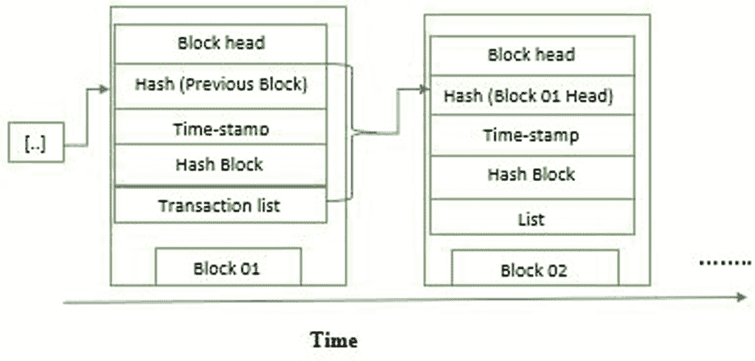
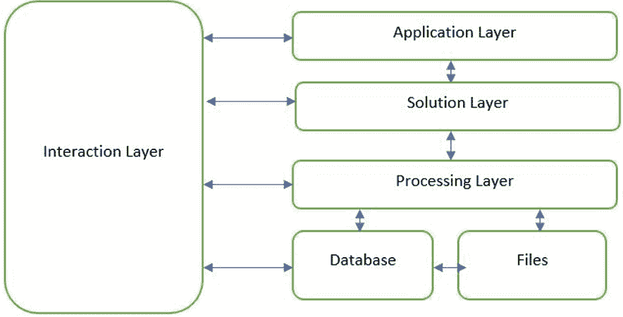

# 第六章

# 区块链在游戏中的应用

+   Alok Singh Gahlot

    印度 MBM 大学

+   Ruchi Vyas

    

    印度 MBM 大学

摘要

区块链是一种领先的创新，可以简化诸如游戏之类的许多行业。已经有许多研究利用区块链技术在金融、健康等领域进行了调查，但游戏是一个尚未征服的领域。本章将解释区块链技术如何在游戏中应用。区块链以创建独特的数字资产而闻名，这些资产可以被复制并创建去中心化的环境。区块链技术有两个方面可以改变游戏产业。区块链在过去几年中对我们的生活方式产生了重大影响。在讨论区块链时经常出现的一个词是比特币。当前设计和构建去中心化区块链应用的解决方案需要互操作性。因此，区块链和现有技术在集中式系统中无法很好地集成。作者提出了一个旨在轻松连接现有的去中心化技术和区块链的架构。区块链游戏是一种新兴的娱乐范式。

引言

区块链的创新由斯图尔特·哈伯和 W. 斯科特·斯托内塔于 1991 年完成，他们是著名的数学家，他们希望创建一个框架，以便存储时间戳。BC 是一个特殊的信息索引，它从简单的信息收集中变化，以一种方式存储数据；BC 将信息存储在各种通过密码术连接在一起的块中。每当有新信息到达时，它就会放置在一个新的块中。当数据块叠放在一起时，它们与之前的块绑定在一起。数据随后在后续查询中保存在其中(Khazanchi 等人，2021)。BC 可以存储各种数据，但所考虑的应用是记录交易。比特币以分散方式使用 BC，因此客户可以轻松控制，但在社交或个人使用时无法控制。分布式区块链是不变的，这意味着输入的数据是不可逆转的。对于比特币来说，这意味着交易始终被记录并对所有人可见。BC 的主要目标是记录和分发电子信息，但同时不修改它。因此，BC 是永久记录或跟踪无法调整、擦除或删除的交易记录的基础。这解释了为什么区块链通常被称为出站记录的演变。(Besançon 等人，2019; Deshpande 等人，2017)

区块链平台允许用户和开发人员在现有区块链系统的基础上创建新的目的。以太坊是其中的一个例子，它有一种名为以太币的本地数字货币，但该模型允许创建智能合约和代币，这些代币可以被编程并用于初始币发行和非同质化代币。在以太坊框架和以太坊网络上进行开发。区块链技术的应用范围广泛，如公司在进行金融交易的地方也可以被政府用于保护数据，也可以用于房地产，保护某些个人信息，保险行业也可以使用区块链，以便合同对每位客户可见，供应链管理是区块链的最佳应用。（Besançon 等人，2021; Pillai 等人，2020）

背景

利用区块链技术在您的产品或应用中，您可以相信其安全性，因为它处理分散的句法。它鼓励您每天 24 小时进行支付或资产转移。您不需要像手动操作那样等待漫长的日子。没有第三方可以处理该系统，因为它只是一个双向交易过程。此外，由于不需要来自任何中介的批准，因此节省了时间。区块链技术提供高精度，因为它提供多个节点进行核实以确认区块链交易。保存复杂记录的能力是不可否认的。（Anjum 等人，2017; Hardjono 等人，2018）

区块链游戏是指基于区块链系统的游戏或与区块链技术集成以提供 NFT 创建、交易和所有权功能的游戏。区块链和游戏两个世界的影响为游戏行业开辟了新的机遇。与传统的高度集中的游戏不同，在这些游戏中，游戏开发者控制所有资源和货币，区块链游戏是去中心化的。区块链游戏旨在向其玩家分发游戏内资源，并且这些资源在游戏之外也具有价值（Jin 等人，2018）。在区块链游戏中，数字货币和 NFT 用于购买游戏内资源，这些资源可以用于与加密货币和真实货币进行交换。因此，从玩家获得 NFT 奖励的那一刻起，玩家就完全拥有这些资源，可以在游戏内外交易和出售。

表 1. 各种方法之间的比较

|  | 以太坊 | 瑞波币 | Quorum |
| --- | --- | --- | --- |
| 行业应用 | 所有行业 | 金融领域 | 所有行业 |
| 权限 | 无需许可 | 需要许可 | 需要许可 |
| 加密货币 | 以太坊（ETH） | 瑞波币（XRP） | 无 |
| 算法 | 工作量证明（PoW） | 概率投票 | 多数投票 |
| 智能合约 | 是 | 否 | 是 |

区块链技术总共使用了四种协议，它们被普遍使用，包括公共区块链、混合区块链、私有区块链和联盟区块链。根据项目的需求使用这些协议。（Gordon 等人，2018）每种协议在某些参数上都比其他协议更优秀。可以通过一定的层次对它们进行比较。公共协议是一种不需要任何权限的协议，对所有人开放，无论是开发人员还是网络成员，都可以成为其中的一部分，而私有协议则需要一定级别的权限，不能被任何人使用，基本上需要一定的治理。（Xu 等人，2019；Tasatanattakool 等人，2018）在私有区块链中进行的交易只能由网络成员访问。而混合区块链是其他区块链类型的结合体，因为它提供了灵活的氛围，它在某些情况下提供私有特性，在某些位置提供公共特性。

自街机和花一刻钟的零售空间时代以来，游戏行业已经取得了长足的进步。然后，十年后出现了控制台电子游戏，游戏变得更加复杂和昂贵。玩家们坚持使用他们的控制台，花了几个小时与其他玩家几乎没有真正的互动。由于游戏托管在集中服务器上，玩家可以与居住在不同地理区域的玩家一起玩（Golosova 等人，2018 Min 等人，2019）。游戏场景是高度统一的，受到游戏开发者和发行商的严格控制。毫无疑问，为玩家带来了很多羞耻感，游戏内购买是通过政府发行的货币进行的，除了游戏领域之外没有任何价值。然而，这是在区块链去中心化出现之前（Jain 等人，2012；Choubisa 等人，2022）。

| 图 1\. 区块链中的区块基础设施 |
| --- |
|  |

相关工作

区块链系统 区块链系统由区块链数据结构、共识模型和 PP 网络组成。区块链数据结构按定义是不断增长的区块链，每个区块都有前一个区块的加密哈希、时间戳和数据。区块链数据结构旨在抵抗修改。借助于 PP 系统和比特币提出的工作证明共识模型，区块链系统可以支持去中心化的数据同步，这成为去中心化账本的基础。为了给区块链环境增添更多价值，以太坊被用来支持去中心化智能合约，这些合约是永久的、透明的可执行程序，由区块链托管。如今，基于区块链的去中心化应用程序（DApps）已经扩展到不同的领域，包括首次代币发行（ICO）、社交网络、网络游戏和物联网 (Hiran et al., 2014; Hiran et.al.,2021)。

一般共识模型 根据研究，PoW 需要参与节点做无用的数字工作来写入区块，这给区块链系统带来了能源和时间短缺问题。因此，已经提出了各种新颖的共识模型作为普适的区块链替代方案。权益证明选择新区块的生成者是根据他们在网络上的股份。例如，币龄被定义为币未花费的时间，一个人的币龄越高，他们挖掘新区块的可能性就越大。换句话说，一个人越富有，他们在区块链中挖掘的区块就越多。然而，由于在不同分支上持有代币不会为相关方带来额外的上行，PoS 区块链将产生大量分支，从而降低了网络的价值。这被称为无所谓问题。卓越证明是 PoS 白皮书中提到的一个理论模型。它表明定期举行一场比赛，根据比赛参与者的表现来铸造硬币，模拟真实比赛的奖励。

基本上，区块链选择与之达成协议的中心枢纽是通过游戏来选定的。然而，在这个模型中，优秀的玩家更有可能赢得比赛，这导致了一个情况，即优秀的玩家将能够反复地写入区块。因此，区块链将变成一个由精英玩家控制的略微集中化的平台。股权证明（DPoS）共识模型从另一个角度解决了 PoW 的上升问题：网络成员将他们产生区块的权利委托给一小部分超级节点，这些节点轮流为区块链网络中的所有用户写入区块。在这样的模型中实现了高吞吐量和低延迟。然而，公众仍在批评 DPoS 是一个在某种程度上集中化的平台，因为很难防止超级节点相互串通。类似的想法被证明投票（PoV）采纳，这是由受共同体合作伙伴控制的分布式节点主持的，他们通过投票达成分散的一致性。关键思想是为网络成员制定不同的安全身份，以便机构的投票在组织内决定区块的提交和验证，而不依赖于第三方中介或者无序的公众意识（Patel et al., 2022, Barua, T., et, al., 2020）.

比特币的创造是在何时完成的，EOS 利用委托权益证明（DPoS）作为达成协议的程序，这牺牲了去中心化以增加吞吐量。所有 BC 计划之间没有统一的标准，这导致了对互操作性进行研究的需要。特别是，提出了一种分层解决方案，以促进 BC 之间的通信。一些研究工作还试图解决特定领域内的互操作性问题。这是正在发生的事情，它分析了如何利用 BC 技术来进一步促进患者与医疗机构之间的信息共享。标准化工作由 IEEE 区块链倡议和 IEEE 标准协会发起。例如，有一个专注于物联网的方案。与此同时，企业以太坊联盟（EEA）制定了针对以太坊生态系统的 BC 用户的详细信息，这可能具有项目应用。不幸的是，这些提议不容易接触到其他应用程序并应用于其他 BC。例如，EEA 旨在达成努力，因此他们在其规范中不考虑去中心化。IBM 提出的方案具有类似的限制：尽管他们为用户提供了公共网络，但 BC 由管理员管理，并且其配置由信任的成员完成。此外，在电脑游戏行业，Hoard 计划更好地将 BC 整合到游戏引擎中供开发者使用，并为玩家解决 BC 的复杂性。然而，他们并没有提出 DBA 的通用设计（Saini, H. K.等，2021）。

某些研究显示，BC 空间中的一致性详细连接点通常已经标准化，并具有粒度视角。ERC 提出了一个统一的协会点，旨在控制可替换和不可替换的资源。在这一点上，这些准则主要涵盖了资源的 BC 方面，通过结束对交流工具的出色理解点来协助处理资源。然而，这种方法是有限的，因为它没有考虑到整体环境。例如，可收藏的资源，例如 Crypto Kitties，是由图像表示的。这些图像被统一起来，并由企业的服务器管理。如果将任何去中心化的图像存储标准应用于 ERC 标准，则可以尝试这种设计选择。事实上，大多数去中心化应用程序不能仅使用 BC 技术，因为它目前具有一些端点。例如，在以太坊 BC 上永久处理大量数据（例如图像）的成本是高昂的。因此，开发人员需要仅将 BC 用于应用程序的核心处理。非重要的处理、存储和其他辅助任务应由其他工具处理，例如分布式记录存储方案。BC 与这些工具之间的互操作性是一个挑战，在构建规则时应更好地考虑到这一点。 （侯等，2022 年；Bodhke 等，2020 年）

研究中使用的一种方法是创建虚拟宇宙并进行土地交易。土地所有者可以在三维视频中制作模型，使交互变得容易。此类研究显示了游戏如何在虚拟环境中设计和执行。程序员需要规范，以便他们能够创建游戏环境的设计以及它是如何执行的，以便创建虚拟环境并使游戏进展。最重要的是，如果游戏已经创建，则必须有适当的新设计，以使其看起来吸引人，并吸引更多客户。完整的架构不能复杂，必须简单，并且数据库管理员可以轻松理解。当我们在游戏中使用区块链技术时，需要集成某些工具。

PROPOSED LAYERED MODEL

| 图 2\. 分层模型的工作方式 |
| --- |
|  |

上图中所示的分层方案的主要动机是为数据库提供支持。模型中有四个层，分别是交互层、应用层、解决方案层、处理层，所有层都负责平稳运行，因为每一层在处理层与数据库和存储的文件进行交互并向上层提供数据，以便进一步进行平稳处理。交互层提供模型的顺利进行和工作。它还避免了不合适的块。它受到开放系统互联模型的启发；在那里，每一层都必须定期与其他层进行交互，在区块链技术中，交互对于大量信息存储来说是不够的。

分散化可以在所有应用程序上执行，尽管存在阻碍。静态限制可以通过星际文件系统流通，用于任何有中心可以挑选其拥有的内容的地方。然而，所有的东西都是相同的，以至于可能会失去一个东西所需的文件，它们可以有一个作为入口的中心，如果没有其他人被允许拥有这些文件。其他企业则尝试提供金融激励来存储数据。例如，File Coin 是建立在星际文件系统之上的区块链层，也指向获得分散化能力的以太坊环境。在记录存储层面面临的主要挑战是准确地验证应用程序的需求，就数据可访问性而言，分散化数据丢失的防范措施。

在某些情况下，我们不能直接使用上述的去中心化聚集设备，因为它们可以说是支持静态记录的。不过，一些练习使用了 Orbit 数据库，它是建立在星际文件系统之上的一层，以及 Gun 使用自由复制的数据类型。因此，收集的信息使用了适合所需情况的数据类型，因为有可能在对等方之间决定混淆的机会，尽管它们在可靠地断开连接时。根据布鲁尔定理，数据库可以具有 3 种属性中的 2 种，可能是稳定性、可访问性、弹性。在使用以上模型后，我们可以看到在某些用例中的差异。在处理层，验证信息完整性的工作是由管理游戏的。

结论

区块链技术在许多领域都取得了革命性进展，包括在无先决条件的情况下实现采购交易。2009 年，比特币使用了区块链技术的进展，随着区块链开发计划的增加，区块链技术的主要应用是电子现金系统，并且指定了包含所有交易的整体信息。这些交易使用加密哈希进行标记和验证，交易历史实际上并安全地保留了一系列事件，以便任何试图修改或更改以前交易的企图都需要对所有后续交易块进行多次计算。区块链技术的使用仍处于起步阶段，但它依赖于广泛认可的加密标准和数据存储。目前，围绕着开发有大量的进展，许多提出的算法都在使用它。展望未来，很可能，这种进展会消失，区块链技术将最终成为另一种可以使用的工具。通过这种分布，区块链依赖于已经建立的组织、加密和记录技术，但是以一种新的方式结合它们。这将是一项重要的技术，可以审视这些发展以及使用它们的利弊。一旦区块链完成并得到普遍采用，改变它将变得困难。当数据保存在区块链中时，该数据将永远存在，无论何时何地都会提出。区块链技术还很新，并且应该根据可用的区块链技术在适当的条件下加以处理。

REFERENCES

Anjum, A., Sporny, M., & Sill, A. (2017 年）。符合性和信任的区块链标准。IEEE Cloud Computing，4（4），84–90。doi:10.1109/MCC.2017.3791019

Barua, T., Doshi, R., & Hiran, K. K. (2020). 移动应用程序开发。在《移动应用程序开发》中。De Gruyter。

Besançon, L., Da Silva, C. F., & Ghodous, P. (2019 年 5 月）。走向区块链互操作性：改进视频游戏数据交换。在 2019 年 IEEE 国际区块链与加密货币会议（ICBC）（第 81-85 页）。IEEE。

Besançon, L., Ghodous, P., Gelas, J. P., & Da Silva, C. F. (2021 年 3 月）。分布式区块链应用开发建模。2020 年国际高性能计算与模拟会议（HPCS 2020）。

产业 4.0 的区块链：一项全面的回顾。 （无日期）。IEEE Access，8，79764–79800。10.1109/ACCESS

Choubisa, M., & Doshi, R. (2022). 使用**物联网和机器学习**进行智能农业的作物保护。在《实时机器学习在物联网系统中的应用》（第 134–147 页）中。IGI Global。

Deshpande, A., Stewart, K., Lepetit, L., & Gunashekar, S. (2017 年）。分布式账本技术/区块链：挑战、机遇和标准前景。概述报告。英国标准协会。BSI。

Golosova, J., & Romanovs, A. (2018 年 11 月）。区块链技术的优缺点。2018 年 IEEE 第 6 届信息、电子和电气工程进展研讨会（AIEEE）（第 1-6 页）。IEEE。

Gordon, W. J., & Catalini, C. (2018)。区块链技术用于医疗保健：促进向患者驱动的互操作性过渡。计算与结构生物技术杂志，16，224–230。doi:10.1016/j.csbj.2018.06.003

Hardjono, T., Lipton, A., & Pentland, A. (2018 年）。面向可互操作区块链系统的设计哲学。arXiv 预印本 arXiv:1805.05934。

Hiran, K. K., Doshi, R., & Rathi, R. (2014)。云计算和网格计算网络的安全与隐私问题。国际计算科学与应用期刊，4(1)，83–91。doi:10.5121/ijcsa.2014.4108

Hiran, K. K., Jain, R. K., Lakhwani, K., & Doshi, R. (2021)。机器学习：掌握监督和无监督学习算法的实际示例（英文版）。BPB 出版社。

Huo, R., Zeng, S., Wang, Z., Shang, J., Chen, W., Huang, T., Wang, S., Yu, F. R., & Liu, Y. (2022)。工业物联网中区块链的综合调查：动机、研究进展和未来挑战。IEEE 通信调查与教程，24(1)，88–122。doi:10.1109/COMST.2022.3141490

Jain, R. K., Hiran, K., & Paliwal, G. (2012)。量子密码学：新一代信息安全系统。国际计算机与分布式系统杂志会议论文集。doi:10.1109/ICOIN.2018.8343163

Jin, H., Dai, X., & Xiao, J. (2018 年 7 月）。面向多个区块链之间互操作性的新型架构。2018 年 IEEE 第 38 届国际分布式计算系统会议（ICDCS）（第 1203-1211 页）。IEEE。10.1109/ICDCS.2018.00120

Khazanchi, D., Vyas, K., & Ajay, K. H. (2021)。Kamal 和 Padmanaban，Sanjeevikumar。可持续发展的区块链 3.0。德格吕特。doi:10.1515/9783110702507

Min, T., & Cai, W. (2019 年 6 月）。区块链游戏的安全案例研究。2019 年 IEEE 游戏、娱乐、媒体会议（GEM）（第 1-8 页）。IEEE。

Patel, S., Vyas, A. K., & Hiran, K. K. (2022)。基于工业 4.0 系统的信号处理进行基础设施健康监测。网络物理系统与工业 4.0：实际应用与安全管理，249-260。

Pillai, B., Biswas, K., & Muthukkumarasamy, V. (2020)。利用交易在基于区块链的系统之间实现跨链互操作性。知识工程评论，35，35。doi:10.1017/S0269888920000314

Saini, H. K., Jain, K. L., Hiran, K. K., & Bhati, A. (2021). 使用区块链构建智能城市的范式。可持续发展的区块链 3.0，10，21。

TasatanattakoolP.TechapanupreedaC. (2018 年 1 月）。区块链：挑战和应用。2018 年国际信息网络会议（ICOIN）（第 473-475 页）。IEEE。

徐，X.，韦伯，I.，斯蒂普斯，M.（2019）。区块链在软件架构中。在区块链应用架构（第 83-92 页）。斯普林格。doi:10.1007/978-3-030-03035-3_5

关键术语和定义

算法：算法是解决任何问题或任务的逐步过程，不依赖于特定的编程语言，上述章节使用了分层架构，计算机游戏安全使用了区块链。

比特币：比特币使用一种特殊的技术，不使用任何银行或政府权威来维护和管理所有交易，而是在一个完全安全的网络上进行。它是开源的，没有人拥有或控制它，因为任何人都可以参与其中。它不需要任何先期支付。

区块链：区块链是一个分布式数据库或分类账，它在计算机网络的节点之间共享。作为数据库，区块链以数字格式电子化存储信息。区块链最为人所熟知的是其在加密货币系统（如比特币）中起着至关重要的作用，用于维护交易记录的安全和去中心化。区块链的创新在于它保证了数据记录的忠实性和安全性，并在不需要信任第三方的情况下生成信任。

加密货币：加密货币是一种旨在在互联网上交换的货币，或者它可以作为数字货币，政府不可靠，无法像普通货币一样存储在银行中。

数据完整性：今天是大数据时代，但同样重要的是要安全地维护这些数据，关于任何货币数据完整性必须得到妥善管理。

去中心化应用：去中心化应用（dApp）是一种分布式开源软件应用程序，它在点对点（P2P）区块链网络上运行，而不是在单个计算机上运行。DApps 在外观上类似于其他在网站或移动设备上支持的软件应用程序，但是是 P2P 支持的。

以太坊：以太坊是驱动加密货币以太（ETH）和数千个去中心化应用程序的社区运行技术。以太坊在所有行业中都有应用，并且使用智能合约。

哈希：加密哈希函数是一种算法，它接受任意量的数据输入凭证，并产生一个固定大小的输出，称为哈希值或哈希。然后可以存储该加密文本而不是密码本身，并稍后用于验证用户。

互操作性：区块链互操作性不是一套固定的规则书。它指的是一系列广泛的技术，允许不同的区块链彼此监听、转移数字资产和数据，并实现更好的协作。

NFT：非同质化代币（Non-fungible token）是一种无法复制的代币，正在区块链中使用。它们可以代表任何现实世界的实体，就像房地产或艺术品一样。出售或购买这些代币被称为令牌化，这降低了欺诈的可能性。

PoW：工作量证明共识算法涉及解决比特币区块链中的一个计算难题，以创建新的区块。

量子计算：它是一种利用量子力学定律来解决困难和经典问题的技术。

Ripple：Ripple 是 XRP 背后的公司，XRP 是一种主要以数字支付网络和协议而闻名的加密货币。许多主要银行使用 XRP 支付系统。比特币交易确认可能需要数分钟，并且交易成本高，而 XRP 交易在几秒钟内确认，成本很低。

智能合约：智能合约可以定义为存储在区块链系统上的一组指令，在事先以适当的方式定义了特定条件的情况下执行。智能合约会自动执行，有助于减少时间浪费，这是通过协议完成的。

时间戳：时间戳是签名权威的输入，是特定时间的数据或信息，它使用协议，通过 X.509 证书和公钥基础设施检查或认证所有时间戳。
