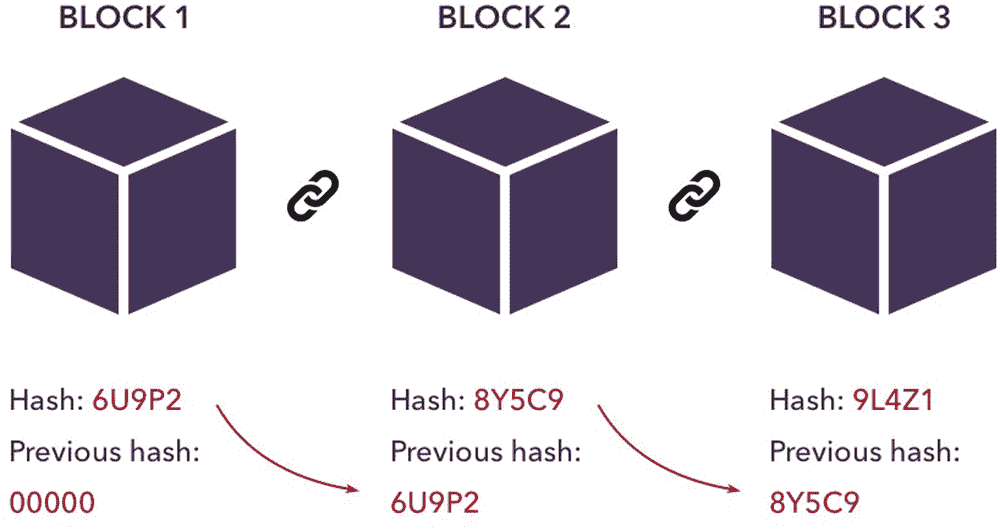
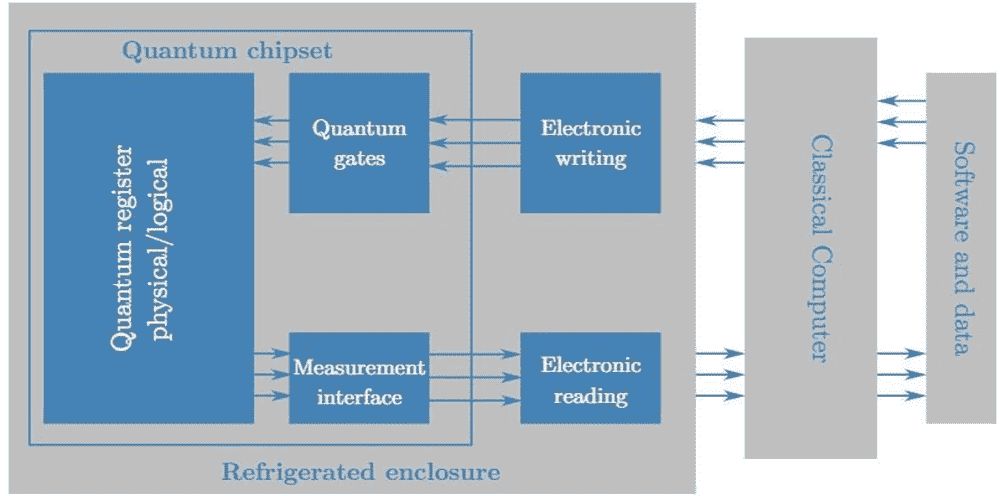
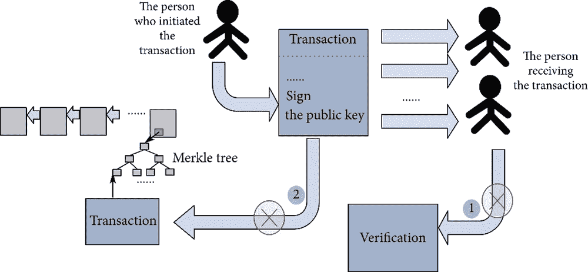
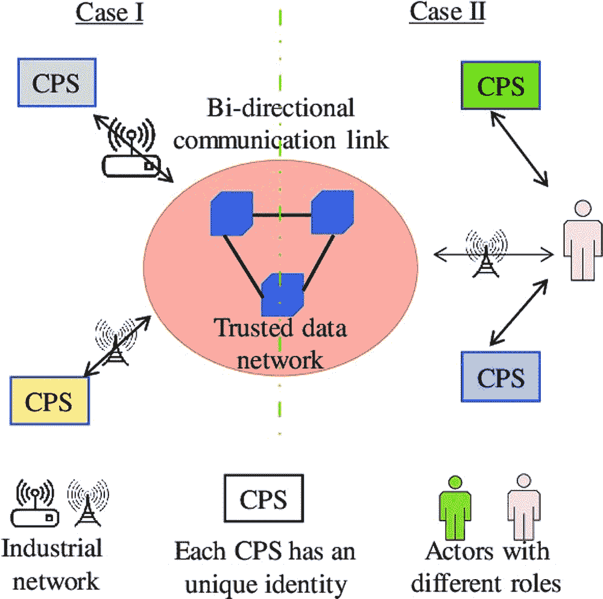

# 第七章

# 对基于 CPS 4.0 的量子抗性区块链的审查评估

+   Chandani Joshi

    印度锡尔帕丹帕特辛格尼亚大学

+   Chitra Bhole

    印度锡尔帕丹帕特辛格尼亚大学，印度乌代浦 & 印度孟买 K. J.索迈亚工程与信息技术学院

+   Naveen Vaswani

    印度锡尔帕丹帕特辛格尼亚大学，印度乌代浦 & 印度孟买 Thadomal Shahani 工程学院

摘要

利用物联网和网络物理系统，数据收集机制已经得到有效的发展。传感器被精心开发，以捕获各种形式的数据，这些数据可以存储并用作知识提取的信息基础，使用人工智能子领域的分析和统计预测。将这些数据存储在确保严格安全措施的不同方法中，是使用区块链完成的。危害区块链安全的漏洞是量子计算，因此讨论了量子抗性区块链的想法。本章最终着重介绍了实施基于 CPS 4.0 的区块链机制的有效方法。

引言

全球每天都在大量收集数据。随着时间的推移，数据的收集机制也变得更加先进。这些收集机制不仅仅局限于基于数字的数据，还包括非结构化和文档类型的多媒体数据。数据收集是使用各种现代传感器和附件完成的。这些数据需要大量的特征工程，如果以适当的方式利用，就可以给予它很多表达。物联网（IoT）（Kumar S，2019；Madakam S，2015；Rehman H.u 等，2017）和网络物理系统（CPS）（Aguida，2020；Jazdi，2014；Rawung 等，2014）可以以各种方式用于收集数据。物联网（Lakhwani 等，2020）系统是嵌入式的，具有许多传感器，通过微控制器或微处理器系统连接到互联网和云平台进行连接。CPS 也有许多单元级传感器，可在物理级别上工作以收集数据。这些数据只是被收集的信息基础，可以从中提取知识。从 CPS/IoT 收集的数据可用于执行许多分析和预测技术，以改善系统的状态。但这并不是限制的尽头，与存储和管理数据以提高安全性和各种原因相关的另一项技术是区块链（Nakamoto，2009；Vujicic 等，2018）。详细信息将在文章的后续部分中进行解释，但用简单的术语来说，区块链是一种确保透明度和分散系统的数据存储机制。区块链被严密加密，安全性是它们的首要任务。所有区块都经过严密加密，具有实时哈希，并通过强链接接连接，使用冗余来确保所有区块在交易和操作过程中处于相同的运行状态。然而，这将通过使用量子计算（Bhatt 等，2019；Ladd 等，2010；Jazaeri 等，2019）来解决。目前最先进的系统基础较少地遇到破解区块链的问题，因为哈希键。对于量子计算机来说，这些哈希键并不构成挑战，因为它是基于量子位（量子比特）运行的，可以同时处理一个问题的许多可能性。这仍然是一个遥不可及的问题，因为破解当前最先进的区块链系统所需的量子位数量很难，但在未来 10 年内将不成问题。量子计算机将轻松地能够在很短的时间内计算出私钥，这在当前看来是一个不可能的问题。甚至在这种情况发生之前，就已经引起了许多怀疑，即量子计算机将复制执行的哈希，并在记录被写入区块之前替换哈希。这个过程将会非常简单，但涉及到许多违规行为，但怀疑会引起好奇心，肯定会促使研究人员努力研究量子抗性区块链（Allende 等，2021；Ferna’ndez 等，2020；Zhang 等，2021） ，这些讨论了一些使当前区块链更安全和不可破坏的想法。尽管许多方面都涉及到了需要为量子计算机重新编写的密码算法，这肯定与传统系统不同。将区块链整合到 CPS 4.0（Patel 等，2022）工业标准中是另一个方面，本文将在后续部分讨论这个想法。

**方法论**

**网络物理系统**

任何技术都涉及许多物理层面的组件。在许多层面上，这些组件之间的智能互动至关重要。网络物理系统（Aguida，2020；Jazdi，2014；Rawung 等，2014）可被定义为利用物理和计算组件的网络进行交互的系统。它也可以被称为各种技术的组合，例如人工智能，机器学习（Alpaydin，2020；Sarker，2021；Shinde 等，2018），深度学习（Goodfellow 等，2016；LeCun，2015），物联网（Kumar S，2019；Madakam S，2015；Rehman H.u 等，2017），大数据分析（Elgendy 等，2014）和机器人技术。令人困惑的主要问题是人们心中对物联网和网络物理系统之间的区别。对此的简单答案是，物联网与连接到互联网并最终耦合在一起的对象相关联，而网络物理系统是与网络集成的物理过程。网络物理系统允许使用系统的传感器直接记录数据。使用执行器影响物理过程。使用网络物理系统可以轻松评估和保存物理世界和数字世界之间的微妙差异。在全球范围内相互连接是轻而易举的。它为更轻松的交互提供多模人机界面。可以直接从设备生成信息。个人级 IP 地址的自我监控是可能的。网络物理系统 4.0（CPS 4.0）是传统网络物理系统的工业暴露。它确实借助了其最新的进步来增强制造业。将现有的物理系统与 CPS 4.0 标准连接起来是当前的目标。如果我们分解所涉及的各种技术，那么这清楚地表明了 CPS 的实施，因为数据是其主要组成部分，在这个现代世界中，数据被分配在非常大的水平上，这肯定可以利用这些技术领域。从物联网开始，也缩写为 IoT，它连接了基于传感器的微控制器和微处理器与互联网，以创建智能应用程序。物联网的主要方面是网络、通信、安全性、用于解决业务问题的数据量和社会影响。相互连接的设备使 IoT 表达出在大量传输和接收数据的情况下。可以使用集成电路，例如片上系统（SoC）（Martin 等，2001）和现场可编程门阵列（FPGA）（Zheng 等，2001）来正确收集数据。基于物联网的系统的主要强大之处在于利用网络进行云集成（Hiran K 等，2021）。云计算（Mathew 等，2017）提供了服务和使用应用程序编程接口（API）的表达。目前，使用基于物联网的系统可以轻松实现各种网络系统的实时流式处理和集成。云还利用了数据的大容量存储，因此设备不必依赖于芯片上的存储系统。可以使用这些数据进行大量分析，这就是数据科学领域将要解释的内容。主要任务是管理异构数据并将其利用起来。时间敏感数据可用于生成延迟，并且可以丢弃不必要的属性。对于这种系统的主要可考虑点是互联网，它为各种发展打开了道路。可以在不同层次上执行分析。人工智能是一个非常广泛的术语，可以在许多领域中推导出它。它可以被认为是统计学的应用分支。与物联网或 CPS 相关时，预测模型是主要组成部分。分析是对收集到的数据进行研究，以提供最佳的业务解决方案，但人工智能（AI）可以被利用来创建基于传感器的决策的预测方面。预测性学习可以与推断统计分支相关联，其中机器学习是应用的（Mahrishi 等，2020）分支。在更广泛的意义上，机器学习与学习数据的模式和参数相关联，以产生预测。这种预测是概率的，因此需要进行大量的度量分析来清除违规行为。机器学习有许多学习方法（Hiran K 等，2021）和分支，可以详细了解。广泛考虑的学习方法可以是监督学习（Kotsiantis，2007）和无监督学习（La”ngkvist 等，2014）。当给定数据的特定特征参数的标签时，与监督学习相关，而对于无监督学习，不存在标签，纯粹与从数据中学习模式相关。当从基于物联网的系统中提取数据时，可以使用这两种学习过程。监督学习有两个主要分支，即分类（Cormack，R.M.，1971）和回归（Maulud 等，2020）。分类的简单理解是从给定标签集合中识别对象或实体。回归是连

前向传播和反向传播共同构成一个学习周期，在网络中可以有许多周期。这个过程不仅仅局限于数值数据。传感器变得更智能，数据收集过程也在改善。收集到的数据可以是图像、视频、文本和音频。图像和视频属于可以使用深度学习解决的计算机视觉问题。使用深度学习进行计算机视觉中的分类是通过一种特定类型的神经网络来完成的，该网络被称为卷积神经网络，(Albawi et al.,2017; LeCun et al.; Musale et al.,2021; Yamashita et al.,2018)建议使用，他们使用了一组称为卷积核的滤波器来从图像中提取特征。这些滤波器执行各种图像处理方法来从图像中提取信息，包括错误级别分析(Gupta, A et al.,2022)。数据可以用于在 Image-Net(Russakovsky, O et al.,2015) 数据集上训练的一些流行的卷积神经网络进行迁移学习，该数据集是一个包含超过 1000 类的数据集。一些常用的卷积神经网络包括 AlexN (Russakovsky, O et al.,2015), VGG-16 (Simonyan, K et al.,2014), ResNet (Gupta A et al.,2022; He K. et al.,2016), Inception Net (Szegedy, C et al.,2015)。这些网络参数非常丰富，如果传感器收集的数据是图像形式的，则可以利用它们。如果数据涉及检测某些对象，则可以使用像 Yolo (Bochkovskiy, A et al.,2020; Redmon, J et al. 2016)、R-CNN (Girshick, R et al.,2015)、Fast RCNN (Girshick, R et al.,2015)、Faster RCNN (Ren, S et al.,2015) 这样的对象检测算法。如果数据应该用于突出显示数据的某些部分，则可以使用像 U-Net(Ronneberger, O et al.,2015)、Bottleneck Supervised Network(Li, S et al.,2018) 和 Yolact(Bolya, D et al.,2019;Bolya D et al.,2020, Joshi, R.M et al.,2022) 这样的图像分割算法。如果数据是以文本格式存在，则属于自然语言处理类别。使用机器学习的 NLP 系统使用基本的文本管理来学习单词表示，使用词袋 (Zhang, Y et al.,2010) 和 TF-IDF (Tambe, S et al.,2022)。如果需要使用深度学习，则可以使用循环神经网络(Cho, K et al.,2014)。这可能会遇到后向传播中的梯度消失问题，为此可以使用 LSTM(Joshi R et al.,2022; Staudemeyer R, et al.,2019)。为了改进与 LSTM 的工作，使用双向 LSTM(Cui, Z et al.,2018)，它从未来获取序列输入，这有助于丢弃无用的信息。为了在学习和训练速度上取得现代系统的速度和更好的准确性，考虑使用 transformer (Vaswani A. et al.,2017; Joshi R. et al.,2022) 架构，该架构接受整个序列的输入，并使用编码器和解码器工作。机器翻译是最初考虑的主要任务之一。后来，像命名实体识别（Li, J., Sun et al.,2020）这样的任务被重视。最常见的 transformer 是 BERT (Devlin, J et al.,2018)，它的意思是来自 transformer 的双向编码器表示。在 BERT 之后带来了许多更先进的技术，目前仍在进行高端研究。考虑到音频输入，可以使用像 WaveNet(Oord, A.v.d et al.,2016) 这样的神经网络来理解音频并进行音频翻译。

区块链

分布式方式中的数据在被集中系统监控时存在许多漏洞。它由一个单一实体专门控制，并且系统的监控由一个调解人负责。这在操作的不同维度上妥协了安全性。这实际上需要一个去中心化的解决方案，一个没有调解人并且不受任何实体支配的解决方案。这确保了非常安全的操作，并提供了透明性，因为几乎不可能篡改数据。这就是区块链的发现（Nakamoto, 2009; Vujicic 等人，2018）被证明是最终解决方案的地方。区块链是一个极度紧凑和安全的数据库系统，确保了安全性的许多方面成为其首要任务。应该考虑的关键点是，它是分布式的，但提供了非常顶级的安全性。区块链最值得考虑的一点是其去中心化性质。从非常高的视角来看，它看起来并且操作起来像是一个典型的数据库，但内部操作却迥然不同。数据的结构是不同的，因为它按照其名称存储信息。然后制作这些块的链与上一个块链接。这是冗余的，更改一个块是不可能的。更改一个块需要所有块授予访问权限，这也是由智能合约的规则控制的。因此，实际上这使其在工作中具有极高的去中心化性，并且不可能被破坏。链紧密链接，并且需要在所有块中反映更改，这对于任何旨在保持完整性并避免篡改数据的应用程序都是非常有用的。

| 图 1\. 区块链示意图 |
| --- |
|  |

这些区块采用实时机制运作，因此这使得更改变得更加困难。这种应用在加密货币（Farell, R,2015; Jose, K.A,2018）领域产生了重大影响，因为交易的实时性是必要的。出于安全原因，这使用透明度和实时更改（Hiran, K 等人）。比特币是一个非常著名的加密货币，每天都在交易，并在区块链上运作。该货币是点对点的，并且需要区块链列出的所有属性。传统数据库中存储的记录采用典型的非冗余处理，而区块链使用区块进行处理，存储的数据称为账本。区块链实现了去中心化的概念，使账本去中心化，并将该过程称为去中心化账本传输以进行任何交易过程。区块链应用的好处是大量减少了需要第三方验证的成本。

量子计算

本文将连续解释许多关于量子区块链的内容，但首先需要理解量子计算作为一个更大的整体。这个术语早在 1981 年就被创造出来，当时在物理学中创造指数级增长的模拟是必要的。这个问题一直存在，直到量子力学领域（Bhatt 等人，2019 年；Ladd 等人，2010 年；Jazaeri 等人，2019 年）被发现。计算机科学中的 NP 问题与物理或化学中的复杂问题没有什么不同，它们都呈指数级增长。

| 图 2. 量子计算 |
| --- |
|  |

传统解决方案是将数据处理过程中的管道并行化，这确实起到了作用，但许多问题仍然存在，因为并行化解决了线性时间的问题，但未能覆盖指数级增长的时间。处理量子计算的表达式可以通过量子力学本身给出，因为它使用量子比特而不是普通比特。叠加的概念（Li, T., Yin et al.,2016）是量子力学中最重要的概念，因为它提供了事物运作方式的直觉。它具有非常不同的理解，因为它陈述了世界以模拟的方式运作，两个事件发生的可能性是明显的，但事件发生在原生体验到它发生的动态过程中。这是一个非常深刻的解释，可以通过非常微妙的解释来解释，因为测量会将叠加态崩溃为观察到的原生态。这是量子力学的根本思想。量子计算包含了量子力学中的所有可能动态，并不是当前可用的传统计算机的替代品，因为在其上进行的所有操作都在不同的系统中运行。一些研究估计，使用量子计算，可以将有界误差量子多项式时间的问题带到多项式时间，尽管这只是一个估计。为了理解量子计算的数学直觉，需要将其与量子力学中的叠加直觉联系起来，因为它直接与量子计算机的量子比特（qubits）相关联。可以通过使用 Dirac 符号的自旋粒子处于叠加状态的基本直觉来发展基本直觉，这是一种将粒子的线性维度方程化，将其置于向上和向下方向上的位置的方程。 

[0] |0⟩ + [1] |1⟩ (1)

|0⟩ 表示粒子的向上自旋，|1⟩ 表示粒子的向下自旋，α 为振幅。这使得叠加方程成为基向量的状态。这些可以与量子态方程相关联。

|Ψ⟩ = [0] |0⟩ + [0] |1⟩. (2)

|0⟩ 和 |1⟩ 可以被视为 2 个正交状态，它们的概率需要相加等于 1，可以用简单的方程表示为

|[0]|² + |[1]|² = 1 (3)

量子位的更深层次的见解可以通过形成量子状态中复合系统的张量积来表示。

其中

 (4)

2 量子位计算中的 0 和 1 组成的 2 位信息由

|Ψ[0]⟩ |Ψ[1]⟩ = [0][0] |00⟩ + [0][1] |01⟩ + [1][0] |10⟩ + [1][1] |11⟩ (5)

方程式 5 是 2 量子位的表示，随着时间的推移呈指数增长，导致非常高的计算。 3 量子位甚至不容易适应这里，64 量子位有 20 位数字的位数。 量子门确实是将传统位和量子位方程式分离的东西，其中叠加与线性单元 |⟩→U|⟩ 进行操作。 这个酉操作可以表示为

UU^† = U^†U = I (6)

其中 U 具有复共轭，当转置时给出 U^†。 这些对于保持范数并在转换状态后保持总概率的效率是高的，以便在观测单元的表面保持叠加给出方程式，即

|||⟩ = ||U|⟩|| (7)

这确实为将叠加崩溃为复杂算法的线性单元提供了优势。 假设可以用方程式计算 Shor 的 RSA 算法 (Rivest, R.L 等人, 1978) (Shor P.W., 1999) 为多项式时间，

 (8)

类似地，经典计算无法解决这种指数时间问题。 量子计算机以非常简单的方式计算复杂的离散傅立叶变换，可以表示为

 (9)

这使得量子计算可以作为传统系统的辅助工具，而不是替代品，因为技术正在自身发展。

量子区块链

这个术语是专门针对使用量子计算技术的区块链系统的威胁而创造的。区块链的最大优势是其安全性，这种安全性非常强大，几乎是无法被破解的。需要打破整个链条的数量需要获得至少整个链条的 51%。目前使用最先进的系统是不可能的，但是在不久的将来可以用量子计算来做到。量子计算机能够以并行的方式计算不同的比特位，超定态是一个重要的概念。纠缠是未来几年可能破坏区块链的主要因素。在量子力学中，它与粒子之间的完美纠缠相联系。一个粒子的变化会影响同一维度空间中的其他粒子。因此，考虑到超定态和纠缠，任务将按顺序执行，并行化将仅仅成为高性能计算中的一个复杂问题。超定态使用量子比特，其数量呈指数增长，因为 2 比特的结果将同时发生 4 种不同的结果，而 4 比特将使用 16 种不同的结果等等。目前最先进的量子比特不太可能破解区块链。区块链是一个分布式去中心化的账本，由密码算法密切保护。拥有大量量子比特的强大系统可以在数据进入账本之前执行修改。这项任务将轻松地通过量子计算机变得可能。由于数据在被添加到账本之前会进行哈希处理，而且如果篡改了一个文档，将会对完整性造成侵犯，因此修改将在写入操作之前进行。如果使用了单向数学函数，就可以执行修改。每个用于特定操作的区块链都有一个智能合约。这里面有数字签名。可以使用单向数学函数破解这些。其中一个例子是陷门函数。这用于以相反的方式计算解决方案。基本上，操作将以一种方式进行，如果使用反向解决方案，则泄露了预谋的信息。不过，这确实需要额外的信息，因此在区块链的情况下，这将是一项困难的任务。陷门函数自从非对称和公钥加密技术被发现以来一直存在。RSA（Rivest, R.L 等人，1978 年）和 Rabin（Yaqin，A 等人，2019 年）是经得起陷门函数考验的加密函数。考虑到其中涉及的素数分解，以及复合数的指数模，陷门函数遇到了限制。这就是量子计算机可以打破这一链条的地方，因为它能够有效地处理指数函数。另一个单向数学函数是单向哈希函数。单向哈希函数是一种压缩数学函数，它将可变长度的输入哈希成固定长度的二进制序列。对于传统计算机来说，计算逆函数非常困难，但对于量子计算机来说，这项任务并不艰巨。在量子计算中，反向计算将变得非常普遍。在交易历史中进行操纵将变得非常容易。更改区块链的哈希是不可能的，因为这会破坏链条，并且会通知整个对等网络。这就是破坏可以在不损坏哈希的情况下造成的原因。需要更改记录，然后结果应该被加密，并且哈希应该被检查是否与之前相同，否则整个系统将失败。从公钥计算私钥也将成为量子计算机的可能。RSA 是使用公钥和私钥系统的算法之一。RSA 可以使用 Shor’s（Shor P.W.，1999）算法来破解。要破解公钥，需要 2 个素数组合。量子计算机在几秒钟内因式分解非常大的数字。因此，在未来几年，量子计算机不会对现代 RSA 构成困难。如果我们当前考虑方程中给出的素数分解的时间复杂度

 (10)

其中它以 Big-Oh 复杂度运行，n 是表示 Shor's 算法可以执行的素数乘积的比特数。它的时间复杂度可以轻松地简化为

O(n³logn)

具有门数量为

O(n²logn log logn) (11)

素因数分解以有利的几率工作。Shor's（Shor P.W., 1999）算法来自于被称为有界误差概率多项式时间（BPP）的模型类别之一。这个用于量子计算的函数可以表示为

fx = x^amod N (12)

这被用于有效地计算最大公约数（GCD）。时间复杂度可观为 O(n)，计算多项式时间是常见做法，但通常最坏情况下被认为是指数级的。

量子抗性区块链

在理解了量子计算机对区块链的威胁之后，量子抗性区块链仍然是必不可少的，因为它们可以在将记录写入区块之前篡改信息而不破坏哈希。在理解了其抗性系统之前，可以更深入地了解问题。可以聚焦于许多先进问题。Hashcash 工作量证明被用来表示比特币（Aggarwal, D et al.,2017），在那里，使用 Grover 搜索算法（Grover, L K et al.,1996），量子计算机可以在二次时间内轻松执行较少的哈希，从而击败传统计算机。门速度可达 100 GHz，使量子计算机能够比传统计算机快约 100 倍地解决问题。从公钥推导出私钥将是主要关注的问题。传统的现代计算机对于执行这项任务效率低下，但对于量子计算机来说，这项任务并不艰巨。纠缠和叠加将被用于破解密码学。该系统将使用（Roetteler, M et al.,2017）量子资源估算来计算椭圆曲线的离散对数。大多数区块链使用椭圆曲线数字签名算法（ECSDA）（Al-Zubaidie et al., 2019; Bi W. et al.,2018; Sonnino et al.,2016）进行密码哈希。考虑到量子计算机，Shor's 算法可以用于破解椭圆曲线数字签名算法（Proos, J et al.,2003），其中可以从公钥推导出私钥，从而创建一个处理钱包的交易。由于 ECSDA 可能会被破解，RSA（Rivest, R.L et al.,1978）并不构成挑战。shor's 算法的量子因子化已经在硅光子芯片上得到演示（Politi, A et al.,2009），这为实验的崩溃提供了一些见解。

| 图 3\. 量子抗性区块链 |
| --- |
|  |

更大的进展是由变分量子因子化（Anschuetz et al.,2018）带来的，它比传统的 Shor 算法更稳定和无误。该算法仍在开发中，但将与嘈杂中间规模量子（NISQ）（Bharti, K et al.,2022）计算机高效配合工作。后量子密码学的概念（Bavdekar, et al.,2022；Jain R et al.）可能会产生一些变化，这肯定会成为量子抗攻击区块链的基础。改变签名方案将是量子抗攻击区块链的主要任务，这肯定不是一件容易的任务。这将改变每一个加密货币钱包。共识的需要将是下一个挑战，其中它被认为将通过硬分叉实施。在像区块链这样的分散系统中达成共识的顶峰确实不是一件容易的任务。这就像在更长的时间内扩展整个比特币一样。在所有任务中最重要的任务将是后量子密码学，因为它就像编写一个完整的基于安全的算法方案。考虑使用 XMSS（Buchmann, J et al.,2011）的有状态签名是第一个方面。为了使其用户友好，使用 WOTS+（Hu¨lsing, A et al.,2017）是一个方面。使用 SPHINCS（Bernstein et al., 2014）处理 41kB 签名是另一个方面。使用 BLISS（Espitau et al.,2017）处理侧信道攻击是另一个方面。IOTA 签名目前是一种非常常见的解决方案。量子抗攻击分类帐（Stewart, I et al.,2018）使用 XMSS 和更好的功能。通过承诺进行量子抗性转移资金的安全解决方案由 Stewart 提出，这可以被称为比特币对抗快速量子计算攻击的防御。这是一个已经实施的量子抗性签名方案。公钥的哈希和量子抗性公钥被制作。这创建了一个强大的系统，因为通过公钥的私钥篡改被避免了，因为有量子抗性公钥。在未来的时间里，量子能力对手将是一个挑战，延迟阶段将会更有效地工作。不重用任何地址是使比特币具有量子抗性的术语。日食攻击（Heilman, E et al.,2015）是对点对点系统进行的网络级攻击。这可以节省与制作相应私钥的公钥所需的额外时间。对此的简单解决方案是使用先进先出（FIFO）系统，因为它将确保交易按照它们到来的顺序排列，并且可以避免伪造交易。由于交易正在进行，中间人攻击非常常见，但幸运的是可以使用无法被破解的 RSA 和 ECDSA。如果在原始交易到达网络之前聪明地处理应用，则可以造成损害。谈到组播，它也不太有效。一旦设计好签名方案，它将保护区块链免受基于量子的攻击，而量子抗攻击区块链将能够在一定程度上避免它们。

CPS 区块链

嵌入式系统具有层次结构，其中系统层次是相互补充的。与物理层交互的 CPS 等级被称为单元级。它是最小的单位，不会对系统的整体完整性构成威胁。

| 图 4\. CPS 区块链 |
| --- |
|  |

CPS 4.0 行业标准与范围交互的自动流动一起工作。有许多被视为系统的 CPS 系统。在这个层次结构中融合区块链是需要实施的想法之一。CPS 的更高层次单元可以采用区块链。这种系统中的数据存储机制将确保一种非常明确的保护数据的透明和去中心化的方法。

CPS 区块链应用

对于嵌入式系统的广泛应用已经被许多研究人员讨论过，但在本节中，我们将讨论如何巧妙地将区块链最佳用于当前最先进的系统。

交通-交通利用嵌入式系统来平衡管理道路网络。交通网络需要大量传感器，这可以帮助保留更多信息，以更好地理解网络。道路上不同车辆的互动确实会产生影响，这些信息应该是安全的。其中的中断可能会造成不同层面的损害，为此区块链可以证明是高效的。

农业-环境的影响扰乱了作物的收获，因此许多传感器正在尝试使农业智能化。这可以改变灌溉的量，并映射作物的质量。作物的收集也记录了收获量和可用作物的数量。这就是透明度和安全性的需求所在。在这种情况下，区块链可以起到作用，因为收获作物的透明度将被所有管理层通知并看到。因此，损失或盗窃可以在记录中得到通知。

智能电网-清洁能源是与智能电网和智能管理相关的重要任务之一，其中对其进行智能管理至关重要。水资源的浪费达到了非常高的水平，可以利用一些传感器起到很大的作用。在这个领域使用 CPS 与区块链结合可以证明是一个高效的原因。有效地管理每天使用的能源，并巧妙地引导资源的使用是可以做到的。

智能建筑-当前建筑物中使用的最先进的 CPS 可以监测温度和湿度。 CPS 的使用可以进一步扩展，使建筑物更耐地震。对每个公寓的详细分析可以随后用于任何建筑缺陷。由于每个公寓的信息都非常敏感，使用区块链可能会证明是有效的。

未来范围

此时此刻从本文中建立的标准关注的是可以受到非常广泛变化影响的广泛视角。基础 CPS 4.0 系统本身的改进可以证明是整个 CPS 生态系统的改进。可以带来的变化包括我们目前以显着方式查看的硬件系统的发展。这些包括与传感器系统密切配合的最先进系统。现在，当遵循标准协议时，这些系统可以发生重大变化。在装配系统中，基于 RISC 的系统的整体基础串行化变化将导致整体实现的发展。在应用程序级别，可以观察到另一种小而微妙的变化，即机器学习算法本身变得更加欢迎和有利于与基于传感器的数据一起工作。这些日益显示出各自领域的改进，并可以扩展为 CPS 的更好的利益。

结论

本文描述了基于 CPS 的区块链的生动评论。当然，这个概念只是一个想法，并且是与 CPS 4.0 相关的所需方法。文章着重介绍了区块链的基础知识，量子计算和区块链的量子效应以及量子抗性区块链。这些想法在本文中按顺序相互关联。本文通过表达给出了实施这些想法所需的所有先决条件的材料，开启了许多新问题。

参考文献

Agarap, A. (2018). 使用修正线性单元（relu）的深度学习。arXiv 预印本 arXiv:1803.08375。

Aggarwal, D., Brennen, G., Lee, T., Santha, M., & Tomamichel, M. (2017). 关于比特币的量子攻击以及如何防范。arXiv 预印本 arXiv:1710.10377。

Aguida, M., Ouchani, S., & Benmalek, M. (2020). 对 Cyber-Physical Systems 的回顾：模型和架构。在 2020 年 IEEE 第 29 届国际会议上：为协作企业提供基础设施（WETICE）（第 275-278 页）。IEEE。

Al-Zubaidie, M., Zhang, Z., & Zhang, J. (2019). 高效安全的 ECDSA 算法及其应用：一项调查。arXiv 预印本 arXiv:1902.10313。

Albawi, S., Mohammed, T., & Al-Zawi, S. (2017). 理解卷积神经网络。在 2017 年国际工程与技术会议（ICET）中（第 1-6 页）。学术出版社。

Allende, M., Leon, D., Ceron, S., Leal, A., Pareja, A., Da Silva, M., Pardo, A., Jones, D., Worrall, D., & Merriman, B. (2021). 区块链网络的量子抗性。arXiv 预印本 arXiv:2106.06640。

Alpaydin, E. (2020). 机器学习简介。麻省理工学院出版社。

Anschuetz, E., Olson, J., Aspuru-Guzik, A., & Cao, Y. (2018). 变分量子因子分解。arXiv 预印本 arXiv:1808.08927。

Bavdekar, R., Chopde, E., Bhatia, A., Tiwari, K., & Daniel, S. (2022). 后量子密码学：技术，挑战，标准化和未来研究方向。arXiv 预印本 arXiv:2202.02826。

Bernstein, Hopwood, Hulsing, Lange, Niederhagen, Papachristodoulou, Schwabe, & Wilcox-O'Hearn (2014). SPHINCS：实用的无状态基于哈希的签名。IACR Cryptol。ePrint Arch。，2014 年，795。

Bharti, K., Cervera-Lierta, A., Kyaw, T., Haug, T., Alperin-Lea, S., Anand, A., Degroote, M., Heimonen, H., Kottmann, J., Menke, T., Mok, W.-K., Sim, S., Kwek, L.-C., & Aspuru-Guzik, A. (2022). 嘈杂的中等规模量子算法。现代物理评论，94(1)，015004。doi:10.1103/RevModPhys.94.015004

Bhatt, H., & Gautam, S. (2019). 量子计算：计算机科学的新时代。在 2019 年第六届可持续全球发展计算国际会议（INDIACom）中（第 558-561 页）。学术出版社。

Bi, W., Jia, X., & Zheng, M. (2018). 区块链的安全多椭圆曲线数字签名算法。arXiv 预印本 arXiv:1808.02988。

Bochkovskiy, A., Wang, C. Y., & Liao, H. Y. (2020). Yolov4：目标检测的最佳速度和准确性。arXiv 预印本 arXiv:2004.10934。

Bolya, D., Zhou, C., Xiao, F., & Lee, Y. (2019). Yolact：实时实例分割。在 IEEE/CVF 国际计算机视觉会议论文集中（第 9157–9166 页）。IEEE。

Bolya, D., Zhou, C., Xiao, F., & Lee, Y. (2020). Yolact++：更好的实时实例分割。IEEE 模式分析与机器智能交易。

Breiman, L. (1996). 袋装预测器。机器学习，24(2)，123–140。doi:10.1007/BF00058655

Breiman, L. (2001). 随机森林。机器学习，45(1)，5–32。doi:10.1023/A:1010933404324

Buchmann, J., Dahmen, E., & Hülsing, A. (2011). XMSS - 一种基于最小安全假设的实用前向安全签名方案。在第 4 届后量子密码国际会议 PQCRYPTO’11 论文集中（第 117–129 页）。Springer。doi:10.1007/978-3-642-25405-5_8

ChenT.GuestrinC. (2016). Xgboost：一种可扩展的树提升系统。在第 22 届 acm sigkdd 国际知识发现和数据挖掘会议论文集中（第 785–794 页）。10.1145/2939672.2939785

Cho, K., Van Merrienboer, B., Gulcehre, C., Bahdanau, D., Bougares, F., Schwenk, H., & Bengio, Y. (2014). 使用 RNN 编码器-解码器学习短语表示的统计机器翻译。arXiv 预印本 arXiv:1406.1078。

Cormack, R. M. (1971). 分类综述。《皇家统计学会杂志：A 系列（一般）》，134(3)，321–367。doi:10.2307/2344237

Cui, Z., Ke, R., Pu, Z., & Wang, Y. (2018). 用于网络全局交通速度预测的深度双向和单向 LSTM 循环神经网络。arXiv 预印本 arXiv:1801.02143。

Cunningham, P., & Delany, S. (2021). k-最近邻分类器-教程。《ACM 计算调查》，54(6)，1–25。doi:10.1145/3459665

De Ryck, T., Lanthaler, S., & Mishra, S. (2021). 关于用双曲正切神经网络逼近函数的研究。《神经网络》，143，732–750。doi:10.1016/j.neunet.2021.08.015

Devlin, J., Chang, M. W., Lee, K., & Toutanova, K. (2018). Bert：用于语言理解的深度双向转换器的预训练。arXiv 预印本 arXiv:1810.04805。

Duchi, J., Hazan, E., & Singer, Y. (2011). 自适应次梯度方法用于在线学习和随机优化。《机器学习研究杂志》，12(61)，2121–2159。

Elgendy, N., & Elragal, A. (2014). 大数据分析：文献综述。工业数据挖掘会议论文集（第 214–227 页）。doi:10.1007/978-3-319-08976-8_16

EspitauT.FouqueP.-A.GérardB.TibouchiM. (2017). BLISS 基于格签名的侧信道攻击：针对 strongSwan 的分支跟踪利用和微控制器的电磁辐射。2017 年 ACM SIGSAC 计算机与通信安全会议论文集。10.1145/3133956.3134028

Farell, R. (2015). 加密货币行业分析。学术出版社。

Fernández-Caramès, T., & Fraga-Lamas, P. (2020). 走向后量子区块链：对抗量子计算攻击的区块链密码学综述。《IEEE Access：实用创新，开放解决方案》，8，21091–21116。doi:10.1109/ACCESS.2020.2968985

Freund, Y., & Schapire, R. E. (1999). 提升(boosting)简介。学术出版社。

GirshickR.DonahueJ.DarrellT.MalikJ. (2014). 用于准确对象检测和语义分割的丰富特征层次结构。IEEE 计算机视觉和模式识别国际会议论文集（第 580–587 页）。10.1109/CVPR.2014.81

Girshick, R. (2015). 快速 r-cnn。IEEE 国际计算机视觉会议论文集（第 1440–1448 页）。IEEE。

Goodfellow, I., Bengio, Y., & Courville, A. (2016). 深度学习。MIT 出版社。

GroverL. (1996). 用于数据库搜索的快速量子机械算法。第二十八届 ACM 理论计算年会论文集（第 212–219 页）。10.1145/237814.237866

Gupta, A., Joshi, R., & Laban, R. (2022). 利用误差级别分析和卷积神经网络检测基于工具的编辑图像。arXiv 预印本 arXiv:2204.09075。

Gupta, A., Joshi, R., Tambe, S., Laban, R., Tandlekar, G., & Chitre, V. (2022). L2 正则化非参数模型对比时的词表示优化效应。在 2022 年新兴技术第三届国际会议（INCET）中（pp. 1–6）。10.1109/INCET54531.2022.9824562

Gupta, A., Nair, S., Joshi, R., & Chitre, V. (2022). 具有深度正则化层的残差连接神经网络用于二元分类。在 2022 年智能计算和控制系统第六届国际会议（ICICCS）中（pp. 1018–1022）。10.1109/ICICCS53718.2022.9788437

Gupta, A., Shetty, S., Joshi, R., & Laban, R. (2021). 对卵巢多囊综合征诊断预后的异质提升集成学习方法的简明区分。在 2021 年计算、通信和控制方面的国际会议（ICAC3）中（pp. 1–5）。10.1109/ICAC353642.2021.9697163

Gupta, A., Soni, H., Joshi, R., & Laban, R. (2022). 多囊卵巢综合征预后的对比维度判别分析。arXiv 预印本 arXiv:2201.03029。

Gupta, A., Thustu, S., Thakor, R., Patil, S., Joshi, R., & Laban, R. (2022). 使用监督学习方法预测飞行器的机动状态。arXiv 预印本 arXiv:2206.10303。

HeK.ZhangX.RenS.SunJ. (2016). 图像识别的深度残差学习。在 IEEE 计算机视觉与模式识别会议论文集中（pp. 770–778）。IEEE。

Hearst, M., Dumais, S., Osuna, E., Platt, J., & Scholkopf, B. (1998). 支持向量机。IEEE 智能系统与应用，13(4)，18–28。doi:10.1109/5254.708428

HeilmanE.KendlerA.ZoharA.GoldbergS. (2015). 比特币点对点网络的日食攻击。USENIX 安全研讨会。

Hiran, K. (2021). 调查影响 IT 云计算平台在高等教育中采用的因素：以非洲撒哈拉以南地区 IT 专业人员为例。《国际人力资本与信息技术专业人员杂志》，12(3)，21–36。doi:10.4018/IJHCITP.2021070102

Hiran, K., Jain, R., Lakhwani, K., & Doshi, R. (2021). 机器学习：掌握监督和无监督学习算法的实际示例（英文版）。BPB 出版社。

Huberty, C. J. (1975). 判别分析。《教育研究评论》，45(4)，543–598。doi:10.3102/00346543045004543

Hülsing. (2017). WOTS+ – 基于哈希的签名方案的较短签名。学术出版社。

Jazaeri, F., Beckers, A., Tajalli, A., & Sallese, J. M. (2019). 量子计算综述：从量子比特到前端电子学和低温 MOSFET 物理。在 2019 年混合集成电路和系统混合设计国际会议（pp. 15–25）。学术出版社。

JazdiN. (2014). 工业 4.0 背景下的网络物理系统。2014 年 IEEE 自动化、质量和测试国际会议，1-4。10.1109/AQTR.2014.6857843

Joshi, R., & Gupta, A. (2022). 简单变压器与 Res-CNN-BiLSTM 的网络性能比较，用于网络欺凌分类。arXiv 预印本 arXiv:2206.02206。

Joshi, R., Gupta, A., & Kanvinde, N. (2022). Res-CNN-BiLSTM 网络，用于通过社交媒体克服由网络欺凌引起的心理健康障碍。arXiv 预印本 arXiv:2204.09738。

Kanvinde, N., Gupta, A., & Joshi, R. (2022). 使用监督非参数集成方法进行高维数据的二元分类。arXiv 预印本 arXiv:2202.07779。

Kingma, D., & Ba, J. (2014). Adam：一种随机优化方法。arXiv 预印本 arXiv:1412.6980。

Kotsiantis, S. (2007). 监督机器学习：分类技术综述。在《2007 年新兴人工智能应用于计算机工程的会议论文集》中。IOS Press，pp. 3–24。

Krizhevsky, A., Sutskever, I., & Hinton, G. (2012). 使用深度卷积神经网络进行 ImageNet 分类。《神经信息处理系统的进展》，25。

Kumar, S., Tiwari, P., & Zymbler, M. (2019). 万物互联是未来技术增强的革命性方法：一项综述。《大数据杂志》，6(1)，1–21。doi:10.1186/s40537-019-0268-2

Kumari, R., & Kr, S. (2017). 机器学习：二元分类综述。《计算机与应用国际期刊》，160(7)，11–15。doi:10.5120/ijca2017913083

Ladd, T., Jelezko, F., Laflamme, R., Nakamura, Y., Monroe, C., & O’Brien, J. (2010). 量子计算机。《自然》，464(7285)，45–53。

Lakhwani, K., Gianey, H., Wireko, J., & Hiran, K. (2020). 万物互联（IoT）：IoT 的原理、范式和应用。BPB Publications。

Längkvist, M., Karlsson, L., & Loutfi, A. (2014). 无监督特征学习和深度学习用于时间序列建模的综述。《模式识别信件》，42，11–24。doi:10.1016/j.patrec.2014.01.008

LeCun, Y., Bengio, Y., & Hinton, G. (2015). 深度学习。《自然》，521(7553)，436–444。

LeCun, Y., Bottou, L., Bengio, Y., & Haffner, P. (1998). 基于梯度的学习应用于文档识别。《IEEE 会议论文集》，86(11)，2278–2324。doi:10.1109/5.726791

Li, J., Sun, A., Han, J., & Li, C. (2020). 一篇关于命名实体识别的深度学习综述。《IEEE 知识与数据工程交易》，34(1)，50–70。doi:10.1109/TKDE.2020.2981314

Li, S., & Tso, G. (2018). 瓶颈监督 U-Net 用于像素级肝脏和肿瘤分割。arXiv 预印本 arXiv:1810.10331。

Li, T., & Yin, Z. Q. (2016). 量子超位置、纠缠和微生物在电机振子上的状态传送。《科学通报》，61(2)，163–171。doi:10.1007/s11434-015-0990-x

Madakam, S., Lake, V., Lake, V., & Lake, V. (2015). 物联网(IoT)：文献综述。《计算机与通信杂志》，3(05), 164–173\. doi:10.4236/jcc.2015.35021

Mahrishi, M., Hiran, K., Meena, G., & Sharma, P. (2020). 实时应用中的机器学习和深度学习。IGI Global。doi:10.4018/978-1-7998-3095-5

Martin, G., & Chang, H. (2001). 片上系统设计。在 ASICON 2001\. 2001 年第四届 ASIC 国际会议论文集（Cat. No.01TH8549）(pp. 12-17). 10.1109/ICASIC.2001.982487

Mathew, S., Gulia, S., Singh, V. P., & Sachin Dev, V. (2017). 云计算及其安全问题综述。RICE。doi:10.15439/2017R70

Maulud, D., & Abdulazeez, A. (2020). 机器学习中线性回归综合评述。《应用科学与技术趋势杂志》，1(4), 140–147\. doi:10.38094/jastt1457

Musale, M., & Joshi, R. (2021). 通过端到端数字分类应用全面比较胶囊网络和卷积神经网络。《智能通信国际期刊》。

Nair, S., Gupta, A., Joshi, R., & Chitre, V. (2022). 使用堆叠泛化进行二元分类的多样化学习者的组合。arXiv 预印本 arXiv:2202.08910。

Nakamoto, S. (2009). 比特币: 一种点对点的电子现金系统。学术出版社。

Natekin, A., & Knoll, A. (2013). 梯度提升机，一个教程。《神经机器人学前沿》，7。

Oord, A., Dieleman, S., Zen, H., Simonyan, K., Vinyals, O., Graves, A., Kalchbrenner, N., Senior, A., & Kavukcuoglu, K. (2016). WaveNet:原始音频的生成模型。arXiv 预印本 arXiv:1609.03499。

Opitz, D., & Maclin, R. (1999). 流行的集成方法：一个实证研究。《人工智能研究杂志》，11，169–198\. doi:10.1613/jair.614

Patel, S., Vyas, A., & Hiran, K. (2022). 基于工业 4.0 系统的信号处理的基础设施健康监测。《网络物理系统和工业 4.0：实际应用与安全管理》，249–260。

Peng, C.-Y. J., Lee, K. L., & Ingersoll, G. M. (2002). 逻辑回归分析与报告简介。《教育研究杂志》，96(1), 3–14\. doi:10.1080/00220670209598786

Politi, A., Matthews, J., & O’brien, J. (2009). **Shor's quantum factoring algorithm** 在光子芯片上。《科学》，325(5945), 1221–1221\. doi:10.1126/science.1173731

Prokhorenkova, L., Gusev, G., Vorobev, A., Dorogush, A., & Gulin, A. (2018). CatBoost：具有分类特征的无偏提升。《神经信息处理系统进展》，31。

Proos, J., & Zalka, C. (2003). **Shor's discrete logarithm quantum algorithm** 适用于椭圆曲线。arXiv 预印本 quant-ph/0301141。

Quinlan, J. (1986). 决策树的归纳。《机器学习》，1(1), 81–106\. doi:10.1007/BF00116251

Ramayah, T., Ahmad, N. H., Halim, H. A., Siti, R. M. Z., & Lo, M.-C. (2010). 判别分析：一个举例说明。非洲商业管理杂志，4，1654–1667。

Rawung, R., & Putrada, A. (2014). 智能社会 ICT 论文综述。在 2014 年国际智能社会信息通信技术会议(ICISS)上(pp. 273-278)。学术出版社。

RedmonJ.DivvalaS.GirshickR.FarhadiA. (2016). 你只需看一次：统一的、实时的目标检测。在 IEEE 计算机视觉与模式识别会议论文集上(pp. 779–788)。10.1109/CVPR.2016.91

RehmanH.AsifM.AhmadM. (2017). IOT 的未来应用和研究挑战。在 2017 年国际信息与通信技术会议(ICICT)上(pp. 68-74)。10.1109/ICICT.2017.8320166

Ren, S., He, K., Girshick, R., & Sun, J. (2015). Faster r-cnn：基于区域建议网络的实时目标检测。神经信息处理系统进展，28。

Rivest, R., Shamir, A., & Adleman, L. (1978). 获得数字签名和公钥密码系统的方法。ACM 通信，21(2)，120–126。doi:10.1145/359340.359342

RoettelerM.NaehrigM.SvoreK.LauterK. (2017). 计算椭圆曲线离散对数的量子资源估算。在国际密码学与信息安全理论与应用会议上(pp. 241–270)。10.1007/978-3-319-70697-9_9

RonnebergerO.FischerP.BroxT. (2015). U-net：用于生物医学图像分割的卷积网络。在医学图像计算和计算辅助干预国际会议上(pp. 234–241)。10.1007/978-3-319-24574-4_28

Ruder, S. (2016). 梯度下降优化算法概述。arXiv 预印本 arXiv:1609.04747。

Russakovsky, O., Deng, J., Su, H., Krause, J., Satheesh, S., Ma, S., Huang, Z., Karpathy, A., Khosla, A., Bernstein, M., Berg, A. C., & Fei-Fei, L. (2015). ImageNet 大规模视觉识别挑战。国际计算机视觉杂志，115(3)，211–252。doi:10.1007/s11263-015-0816-y

Sarker, I. (2021). 机器学习：算法、实际应用和研究方向。SN 计算机科学，2(3)，1–21。doi:10.1007/s42979-021-00592-x

SchapireR. (1999). 提升算法简介。在第 16 届国际人工智能联合会议论文集-第 2 卷(pp. 1401–1406)。摩根·考夫曼出版社。

ShindeP.ShahS. (2018). 机器学习和深度学习应用综述。在 2018 年第四届计算通信控制和自动化国际会议(ICCUBEA)上(pp. 1-6)。10.1109/ICCUBEA.2018.8697857

Shor, P. (1999). 量子计算机上素数分解和离散对数的多项式时间算法。SIAM 评论，41(2)，303–332。doi:10.1137/S0036144598347011

Simonyan, K., & Zisserman, A. (2014). 非常深的卷积网络用于大规模图像识别。arXiv 预印本 arXiv:1409.1556。

Sonnino, A., & Sonnino, G. (2016). 高维曲面上的椭圆曲线密码学。arXiv 预印本 arXiv:1610.01518。

Staudemeyer, R., & Morris, E. (2019). 理解 LSTM——长短期记忆循环神经网络的教程。arXiv 预印本 arXiv:1909.09586。

Stewart, I., Ilie, D. I., Zamyatin, A., Werner, S. M., Torshizi, M. F., & Knottenbelt, W. J. (2018). 承诺量子抗性：比特币对抗快速量子计算攻击的缓慢防御。皇家学会开放科学, 5(6), 5\. doi:10.1098/rsos.180410

SzegedyC.LiuW.JiaY.SermanetP.ReedS.AnguelovD.ErhanD.VanhouckeV.RabinovichA. (2015). 使用卷积深入挖掘。在 IEEE 计算机视觉和模式识别会议论文集中(pp. 1–9). IEEE。

Tambe, S., Joshi, R., Gupta, A., Kanvinde, N., & Chitre, V. (2022). 参数化和非参数化方法对高维稀疏矩阵表示的影响。arXiv 预印本 arXiv:2202.02894。

Vaswani, A., Shazeer, N., Parmar, N., Uszkoreit, J., Jones, L., Gomez, A. K., & Polosukhin, I. (2017). 注意力就是一切。神经信息处理系统进展, 30。

Vujicic, D., Jagodic, D., & Randic, S. (2018). 区块链技术、比特币和以太坊：简要概述。2018 年第 17 届国际研讨会 INFOTEH-JAHORINA(INFOTEH), 1-6。

Wolpert, D. H. (1992). 堆叠泛化。神经网络, 5(2), 241–259\. doi:10.1016/S0893-6080(05)80023-1

Yamashita, R., Nishio, M., Do, R., & Togashi, K. (2018). 卷积神经网络：概述及在放射学中的应用。影像学洞察, 9(4), 611–629\. doi:10.1007/s13244-018-0639-9

Yaqin, A., Dahlan, A., & Hermawan, R. (2019). Rabin-Karp 算法在论文主题确定中的实现。在 2019 年信息技术、信息系统和电气工程国际会议(ICITISEE) (pp. 395-400). Academic Press。

Zhang, P., Wang, L., Wang, W., Fu, K., Wang, J., & He, D. (2021). 基于抗量子数字签名的区块链系统。安全和通信网络, 2021。

Zhang, Y., Jin, R., & Zhou, Z. H. (2010). 理解词袋模型：一个统计框架。国际机器学习与网络, 1(1), 43–52\. doi:10.1007/s13042-010-0001-0

Zheng, W., & Ren, Z. (2010). 用于快速傅里叶变换处理器的现场可编程门阵列设计与实现。在 2010 年电子商务和电子政务国际会议(pp. 4039-4042). 10.1109/ICEE.2010.1014
