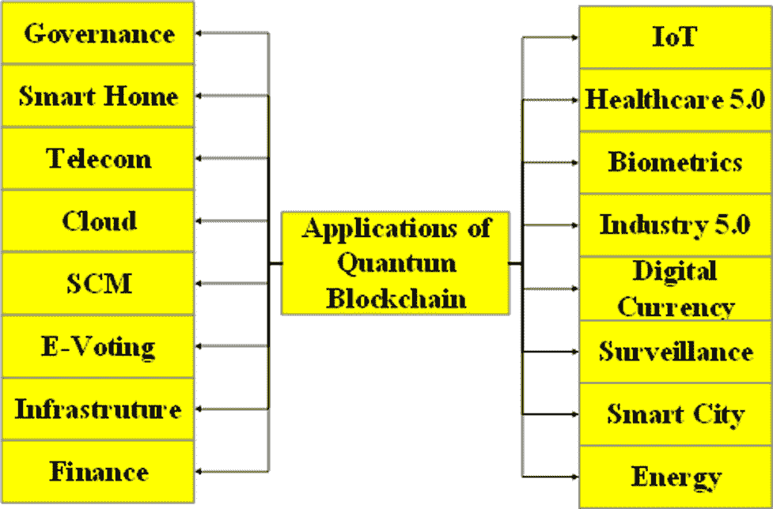
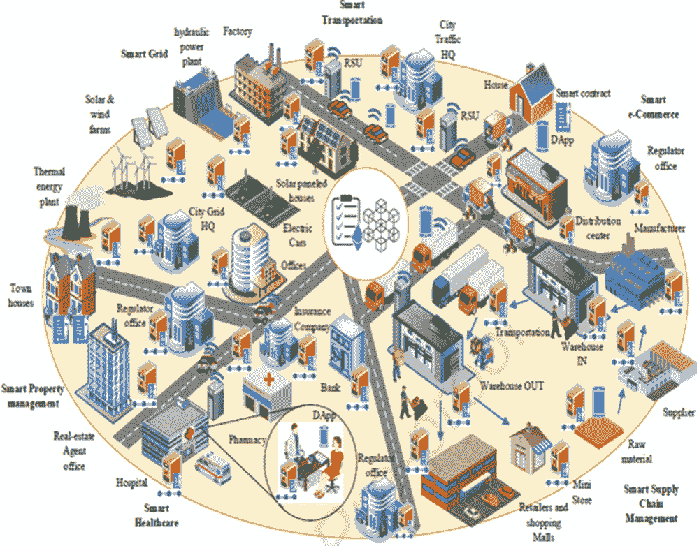

# 第九章

# 量子区块链用于智慧社会：

应用、挑战和机遇

+   Manish Dadhich

    印度 塞尔帕达姆帕特辛格尼亚大学

+   Harish Tiwari

    印度 塞尔帕达姆帕特辛格尼亚大学

ABSTRACT

智慧城市是一个未来主义的城市发展概念，利用信息和通信技术使公民、政府和组织能够收集和共享实时数据。 Q-BoC 技术可以为智慧城市的众多利益相关者之间的通信和交易提供新的便利和安全保障。 信息技术，包括量子区块链，在当今快速发展的智慧城市中已经被整合，以治理物理、社会和商业基础设施。 创新技术和概念，如物联网、5G、人工智能和量子区块链，已成为智能和先进社会的必要条件。 近年来，学术界和工业界都表现出对智慧城市革命的浓厚兴趣。 智慧城市可以提供各种智能功能，例如智能交通、工业 5.0、治理、医疗保健 5.0 和智能银行业，以提高人们的生活质量。 本章探讨了实现智慧社会的应用、挑战和机遇。

1. 介绍

区块链是一种新型的计算机专业应用方法，包括分布式数据存储、点对点传输、共识机制和加密技术 (Aggarwal et al., 2019)。 在区块链中，每个节点都有其自己分配的分类帐，用于保留交易历史。 所有节点都是联合的，验证所有区块链规则。 这些节点将交易组织成块，并确定应该在区块链中包含哪些真实交易。 区块链网络中节点之间的通信和信任基于数字签名技术，这主要是为了实现信息的识别、真实性和完整性验证 (Alam, 2021)。 根据 (Bhavin et al., 2021)，区块链是一种现代技术体系，在其中将加密块的顺序链接在一起形成分散的点对点（P2P）网络。 区块链可以为智慧社区领域的实时应用提供验证、授权、责任、安全、完整性、隐私和不可否认性，这是集中式系统可能无法有效提供的。 同样，(Kappert et al., 2021) 讨论了几种基于区块链的共识技术及其在不同领域的效率和可行性。 (Sun et al., 2016) 调查了面向边缘的物联网和以云为中心的物联网结构，重点介绍了这些分散方法的几项安全措施。 他们还调查了使用区块链所带来的安全问题。

(Khan et al., 2021)调查了物联网环境中出现的众多安全和隐私挑战。(Shalendra Singh Rao, n.d.; Solaiman et al., 2021)调查了区块链的众多安全威胁及损害后果，并提出了改善分布式系统安全性的几种策略。(Ahl et al., 2020)研究了分布式账本在区域能源市场和智能电网的交易能源控制结构中的作用。增强现实、人工智能-机器学习-物联网系统、机器人技术和雾计算越来越成为全球新时代城市计划的推动因素。同样，雾计算在智能交通管理控制、车辆管理系统以及监测独立汽车和自主间隔方面具有重要的运输应用（Gill et al., 2019）。此外，由于其低能耗和占地面积小，它是一个更可行的解决方案。政府可以利用这些应用来提高公民安全和环境管理能力。此外，它还可以作为提供重要情况的早期警报，以做出明智决策的替代服务，例如火灾和自然灾害。由于区块链的普及，出版的文献研究也越来越多，例如表 1 所示的研究（P. Sharma et al., 2022）。例如，智能城市（Costa & Peixoto, 2020）、物联网（Sun et al., 2016）、云计算（Selvaraj & Sundaravaradhan, 2020）、医疗保健系统（Ben et al., 2021）、数据中心网络（Forson & Vuopala, 2019）、金融（M. Dadhich, M. S. Pahwa, 2021）、数字货币（C. Li et al., 2019）、智能电网（Sengupta et al., 2020）、基础设施（Haji, 2021）、智能农业（Gill et al., 2019）、自动驾驶车辆（Srinivas Aditya et al., 2021）、生物特征识别（Ioannou et al., 2020）和空中通信（R. L. Kumar et al., 2021）等。  

表 1\. Q-BoC 执行措施和来源

| 来源和年份 | 1 | 2 | 3 | 4 | 5 | 6 | 7 | 8 | 9 | 10 | 11 | 12 |
| --- | --- | --- | --- | --- | --- | --- | --- | --- | --- | --- | --- | --- |
| (Costa & Peixoto, 2020) | ¡ | ¡ | - | - | ¡ | - | ¡ | ¡ | ¡ | - | - | - |
| (Sun et al., 2016) | - | ¡ | - | - | ¡ | - | - | - | - | ¡ | - | ¡ |
| (Alam, 2021) | ¡ | - | ¡ | - | ¡ | - | - | ¡ | - | ¡ | - | - |
| (Ben et al., 2021) | ¡ | - | - | ¡ | - | - | ¡ | - | ¡ | - | ¡ | - |
| (Forson & Vuopala, 2019) | - | ¡ | - | - | ¡ | - | ¡ | ¡ | - | ¡ | - | ¡ |
| (Garcia, 2018) | - | - | - | - | - | ¡ | - | - | - | ¡ | - | - |
| (C. Li et al., 2019) | ¡ | - | ¡ | ¡ | - | ¡ | ¡ | - | ¡ | - | ¡ | ¡ |
| (Sengupta et al., 2020) | - | ¡ | - | - | - | - | - | ¡ | - | - | - | - |
| (Haji, 2021) | - | - | ¡ | - | ¡ | ¡ | - | - | ¡ | - | ¡ | - |
| (Kappert et al., 2021) | ¡ | - | ¡ | - | ¡ | - | - | - | ¡ | ¡ | - | - |
| (Srinivas Aditya et al., 2021) | - | ¡ | - | - | - | ¡ | - | ¡ | - | - | - | - |
| (Ioannou et al., 2020) | ¡ | ¡ | - | - | - | - | ¡ | - | ¡ | - | - | ¡ |
| (R. L. Kumar et al., 2021) | ¡ | - | ¡ | - | ¡ | - | - | ¡ | ¡ | - | - | ¡ |

1: 智慧城市；2: 物联网；3: 云；4: 医疗系统；5: 数据中心网络；6: 金融；7: 数字货币；8: 智能电网；9: 基础设施；9: 智能农业；10: 自动驾驶车辆 11: 生物识别；12: 空中通信。

在更广泛的智慧社区中实施 Q-BoC，涉及功能和流程模型，似乎研究不足。此外，尽管具有潜力，但当前的研究并没有专注于 Q-BoC 在智慧社会中实施安全性和保密性方面的作用。因此，我们在本研究中评估了 Q-BoC 在各种智慧社区中的实用性、应用、挑战和机遇。研究主要探讨了智慧治理、云、电子投票、供应链管理、基础设施、电信、智能家居、物联网、金融、医疗保健、生物识别、工业 4.0、数字货币、监视、能源和智慧城市。

| 图 1\. 5G 量子区块链（Q-BoC）的应用 |
| --- |
|  |

2\. 文献综述

(Birda, 2019) 研究表明，智慧城市的多样性特征使其易受攻击，特别是在资源受限的设备层面，当无法实施高级安全协议时尤其如此。此外，智慧城市的集中结构鼓励特定个人或团体进行非法数据保留和操纵；这些团体甚至可能阻止一个参与者向另一个参与者传递信号。(Fernandez-Carames & Fraga-Lamas, 2020) 将区块链应用于构建 Block-VN，一个智慧小镇的车辆网络规划。所提出的架构被证明是安全的，并以分布式方式运行，以构建一个新的分布式交通管理系统。几项其他研究 (Gill et al., 2019; Hebert & Di Cerbo, 2019; Kappert et al., 2021) 已成功将区块链与智慧城市相结合。(Manish Dadhich et al., 2019; Srinivas Aditya et al., 2021) 提出了受量子漫步启发的一种新型身份验证和加密协议（QIQW）。所提议的协议为安全地在物联网设备之间交换数据提供了一个区块链议程。与使用传统的加密哈希函数来链接链块和量子失误目的不同。该框架的主要优点包括使物联网节点能够成功地与其他节点通信，同时对其记录保持完全控制。

(Yapa et al., 2021) 研究了智能电网 3.0 中 Q-BoC 的潜力，这可能促进统一的去中心化进程。此外，该研究讨论了即将到来的智能电网行动的各种应用。此外，该文章简要地审视了区块链集成问题，确保未来自主电力网络的去中心化运行是安全和可伸缩的。在这方面 (Van Den Bosch, 2020) 提出了智慧城市的概念，即将技术整合到其以人为中心的议程中的城市。基于一个概念框架，(Manish Dadhich, Purohit, et al., 2021; Sun et al., 2016) 研究了基于 Q-BoC 的共享设施如何建设智慧城市。他们还认为，量子区块链将引起理论和实践的兴趣，鼓励进一步讨论这一领域。(M. Dadhich et al., 2018; Srinivas Aditya et al., 2021) 检验了机器人在一般情况下面临的基本要求和技术障碍。它提供了关于区块链技术的全面理解，以讲座的形式呈现。然后，讨论了区块链在各种机器人应用中的作用。此外，强调了必须克服的许多技术障碍，以实现区块链为机器人带来的潜力。

创新智慧城市的理念和内涵由 (Shan et al., 2021) 阐释，涉及中国先进智慧首都的扩张现状。分析和评判了智慧城镇建设中的几种进展模式，并审视了创新智慧城市建设中存在的缺点和不足。他们还讨论了促进智慧城市发展的政策建议 (Q-BoC)。这为理解中国创新发展理念和整体发展状态提供了宝贵的参考。近年来最重要的基于区块链的解决方案解决了传统基于云的应用程序所突出的问题 (Manish Dadhich, 2017; Sengupta et al., 2020)。

3\. 区块链启用的智慧城市框架

实现现代城市智能化的整体目标，必须增强或重新发明结构、交通、服务和其他各种便利设施（见 Casino 等, 2019; Manish Dadhich 等, 2022）。值得注意的是，智慧城市的扩展包括高科技结构的发展以及居民参与交通和设施的发展。这可以通过向最终用户和决策者收集和分发数据来实现智慧城市系统。采用数字系统中的同步过程可以实现这一目标。发展机制，如数据科学、人工智能、云和物联网，促进了参与和协作演进。多项研究（Alam, 2021; Bhavin 等, 2021; Brotsis 等, 2021; Casino 等, 2019; Fernandez-Carames & Fraga-Lamas, 2020）和报告表明，向智慧城市的演变将逐步进行以确保实现和可持续性，解决影响人们生活的最顽固的挑战。公用事业（如水、食品和电力）是智慧城市最敏感的组成部分之一，因为它们为所有人提供了基本服务。

| 图 2\. 量子区块链在智慧城市项目中的作用 |
| --- |
|  |
| *（参见 Seon, 2021）* |

ICT（信息与通信技术）经常被视为创建智慧城市的关键因素。量子区块链（Q-BoC）技术是一种相对较新的技术突破，涵盖了各种基础技术和协议。量子区块链（Q-BoC）有潜力成为智慧城市和发展的主要推动力和资产（见图 2）。智慧城市是一个未来主义的城市发展概念，结合了信息通信技术，允许居民、政府和组织收集和交换实时数据。量子区块链技术可以为智慧城市的各方利益相关者之间的通信和交易带来新的便利和安全性。随着今天智慧城市的快速发展，信息技术，包括量子区块链，已经被结合起来管理物理、社会和商业基础设施。

4\. 区块链的应用

4.1 智慧城市

城市是人类定居的中心，经济的基石，也是全球创新的基础。城市通过其基础设施支持信息交流、能力结构和知识密集型商业设施的供应。这需要利用 Q-BoC 构建可信的框架，以更好地引导城市地区的社会经济发展（Casino et al., 2019；R. Sharma et al., 2020；Tribis et al., 2018）。城市正在吸引全球人口的增长。2014 年，大都市地区拥有全球 56%的人口；统计数据预计到 2050 年将增加到 67%。城市在国家的经济和福祉中变得更加重要，城市占据了大部分经济活动（Pólvora et al., 2020）。城市同时面临行政、组织、后勤、社会和环境等问题。提高行政效率、公众参与的新模式以及更好地理解电子信息的价值和安全性的需要正在改变城市与居民之间的关系。

4.2 金融体系

区块链技术目前正在各种金融行业中应用，包括企业、服务、金融、预测市场和商业合同。预计它将在全球经济的长期可持续性中发挥关键作用，推动客户、现有银行组织和人民的发展。全球金融部门正在研究使用基于区块链的应用程序进行货币资产交易，如证券、保险和衍生品交易。例如，Q-BoC 承诺在资本市场产生重大转变，并以更有效的方式进行证券和衍生品交易等功能（Gill et al., 2019）、数字支出（Aggarwal et al., 2019）、管理政策、通用银行服务、财务审计（Manish Dadhich, 2016; Schulz & Feist, 2021）。此外，Q-BoC 机制已与包括巴克莱和高盛在内的世界主要机构的财团合作，以开发可行的基于区块链的金融市场框架。

4.3 电子投票

多年来，电子投票被视为积极且不可避免的里程碑，有望加快投票流程，简化和降低选举成本，并加强民主制度。另一方面，现有的电子投票安排依赖于单一实体的专有和中央计划，破坏了选民对投票方法的信任 (Agbesi, 2020)。BitCongress 和 Liquid Democracy 是提出分布式判断制定大纲的两种分布式投票结构。总的来说，Q-BoC 提供了一种开源、点对点、分权和可单独验证的系统，以获取选民和投票控制器的信任，同时符合国内法规 (Aggarwal et al., 2019)。

4.4 物联网

如今，全球约 80% 的信息是在过去两年内创建的。由于 a) 物联网设备和 b) 人口扩张，增长速度将加快 (Marsal-Llacuna, 2020)。虽然 Q-BoC 和物联网技术的潜力巨大，但这两个学科之间的共生关系开启了一片可能性的天地。例如，尽管存在缺陷，但分布式无线传感器网络是技术和人类增长的支柱。 (Schulz & Feist, 2021) 研究了区块链构建如何通过减少其缺陷和提高其潜力来增强物联网。Q-BoC 及其固有功能主要推动了在构建去中心化物联网平台方面越来越多的关注和投资。这一中心概念允许在具有许多网络化智能设备的异构上下文感知设置中进行安全和可审计的数据共享。此外，通过自主和分权运作，网络的极大可扩展性和高效管理得以实现 (Pólvora et al., 2020)。

4.5 医疗行政管理

Q-BoC 在社区医疗保健 4.0、长期医疗记录、自动医疗保险理赔、在线患者接待、患者数据输入、用户导向型医学研究、药物仿制、临床实验和精准药物方面可能发挥关键作用。(P. Sharma et al., 2022)建议，处理患者的电子健康账户（EHA）是增长潜力最大的领域。作为医疗记录的一部分，电子健康记录包括患者的简要病史和统计数据，与患者疾病和治疗过程相关的预测和信息。(Srinivas Aditya et al., 2021)认为，Q-BoC 系统对于医疗保健 4.0 是一个过程，通过该过程，处理者可以访问和保留他们的健康信息，同时确保安全性和隐私性。一系列研究（Krishnapriya & Sarath, 2020; Sengupta et al., 2020; Xiang & Zhao, 2022）证实，医疗数据没有集中的所有者或中心，黑客无法破坏或窃取这些医疗数据。记录以分布式方式存储（它们是公开的，可以在非关联的提供者组织之间轻松验证）。来自多个来源的数据被汇集到一个统一且一致的数据源中，随时更新并可供使用。

4.6 能源行业

Q-BoC 在能源领域的潜在用途很多，可能对程序和平台都会产生巨大影响（参见 Bowen et al., 2013）。例如，Q-BoC 可以降低成本，允许新的商业模式和市场，管理复杂性、数据安全性和所有权。电网还可以吸引能源生产者参与能源市场，从而形成能源社区（参见 Brotsis et al., 2021; Casino et al., 2019; Garcia, 2018）。Q-BoC 可以提高能源市场系统的透明度和信任度，同时确保问责制，尊重隐私规则并提高效率。根据(Bhavin et al., 2021)，区块链技术还可以用于创建点对点能源交易和电动汽车能源管理方案。值得注意的是，Q-BoC 促进了能源部门的脱碳，使其向更为分散的能源来源转变。

4.7 教育

在无处不在的学习环境中，区块链可以解决易感性、安全性和隐私问题，并可用于存储与声誉奖励相关的教育数据。(Yapa 等人，2021)提出了一种非专家可以处理的基于分布式区块链的学术记录和声誉系统。根据(D. Li 等人，2021a)，教师上传存储学生学习成功的区块到区块链上。教育证书管理也可以从区块链中受益，这提高了数据安全性和对数字基础设施以及信用管理的信任。此外，基于 Q-BoC 的方法有可能改善个人和学术学习的数字认证。利用区块链技术建立教育信息中心可能会收集、报告和分析有关学校系统的数据以改善决策。最后，在学术出版方面，Q-BoC 可用于文档验证或更好地处理手稿提交并及时完成相关审阅(Yapa 等人，2021)。

4.8 治理

Q-BoC 启用的应用程序可能通过从交易和记录保存中删除中介来改变市政和州政府的工作(Van Den Bosch，2020)。 Q-BoC 的问责制、计算机化和安全处理社区记录可以防止腐败，并增强基本的电子政府服务。在(Sang & Li，2019)的话中，Q-BoC 可以作为连接智能城市中的实体、社会和业务结构的安全通信平台。区块链治理旨在提供与国家及其相关公共实体相同的基本服务，地域化和高效，同时保持相同的有效性。正式文件、证明、身份、婚姻合同、税收和投票的登记是这类服务的例子(Agbesi，2020)。

4.9 国籍和基本服务

将数字技术整合到日常生活中需要能够准确识别和认证用户基本属性的机制，例如术语、语篇、信用评分、年龄、地址和其他个人特征(Asri 等人，2021)。因此，数字身份认证已成为一项关键安全措施。(Costa & Peixoto，2020)研究了各种去中心化身份管理方法的利弊。此外，根据(Alasbali 等人，2022)，世界上有六分之一的人口没有书面证据证明他们的存在。移民和侨民受到这种情况的影响，因为他们的国家可能会拒绝提供文件，例如如果他们属于反对派。因此，Q-BoC 已成为增强全球公民平等和可能性的工具。

4.10 杂项功能

这一部分涵盖了其他部分未涉及的基于区块链的功能研究。例如，Q-BoC 正被众筹平台使用（M. Dadhich, M. S. Pahwa, 2021）。区块链应用于人道主义和慈善领域（Sun 等，2016）。它还可以在智慧城市背景下用于开发智能、可靠、分布式和自主的交通系统，并安全地运营案例票务（D. Li 等，2021a）。根据(R. Sharma 等，2020)，预计 Q-BoC 将在环境管理中发挥关键作用。例如，在排放交易方案、污染控制和可持续企业发展方面。区块链可能被用作企业采用的新型排放环节方法。引人入胜的应用包括社交媒体、数字营销、情感分析、销售预测和客户保留。以用户为中心的 Q-BoC 可能允许处理者控制、定位和声明对其通信的任何内容的所有权。一些与 IT 相关的区块链应用，如边缘计算和计算资源分配方法的创建（Manish Dadhich 等，2022；TK 等，2021），网格计算（Motlagh 等，2020），云计算（Manish Dadhich，Rao 等，2021；Kathuria 等，2018），以及将 Q-BoC 用作软件连接和社交分享动态的使用。

5\. 智慧社会的挑战和机遇

智能城市的回报伴随着新的危险。例如，作为关键结构（例如可能影响居民健康和安全的水系统）的物联网设备容易受到网络攻击 (Sengupta et al., 2020)。因此，持续监测和调节服务网络以减少对信息和功能技术的攻击风险至关重要，从而使城市成为更明智和更有用的居住地。术语“智能水系统”表示技术和社会进步，使水务服务的提供、使用、管理和优化得以改进。在技术和社会两个方面实施有效的智能公用事业需要投资于互动和通信结构、数据收集和评估、社交和众包工具、规则和信息安全 (Bhavin et al., 2021; M. dadhich & N. Kumar, 2015)。在当今的信息技术架构中，智能公用事业的传统数据管理通常在集中式系统上进行。这些集中式系统在安全性和保密性方面存在漏洞。使用 Q-BoC 来增加智能公用事业设备之间的可靠传输是安全漏洞的一个可行解决方案。区块链是一种可能的分散式和安全的数据管理系统，提供防篡改、不可变性和可追溯性。因此，本节概述了许多关键的开放性研究挑战，这些挑战妨碍了在智能城市中使用 Q-BoC。正如 表 2 所示，基于广泛的文献综述，也讨论了机遇。

表 2\. 挑战和机遇摘要

| 来源 | 挑战 | 原因 | 机遇 |
| --- | --- | --- | --- |

| (Costa & Peixoto, 2020; Marsal-Llacuna, 2020; Sun et al., 2016) | 可持续性 | • 智能城市设备消耗能源资源。 • 共识技术消耗更多能源。

• 高成本和维护费用。 | • 利用可再生能源资产。 • 利用能源收割。

• 利用能源能力一致性算法。 |

| (Aggarwal et al., 2019; Alam, 2021; N. Kumar & Dadhich, 2014) | 自适应共识算法 | • 智能城市应用具有广泛的需求 • 许多区块链共识方法设计上是客观依赖的 | • 基于博弈论原理的自适应共识机制。 • 基于人工智能的共识达成算法。 |
| --- | --- | --- | --- |
| (Brotsis et al., 2021; P. Sharma et al., 2022) | 可扩展性 | • 智能 IoT 设备数量创纪录。 • 传统的共识算法要求所有区块链节点存储所有记录。 | • 在水平方面的可扩展性是最佳的技术。 • 使用基于并行挖掘的 PoW 系统。 |

| (Costa & Peixoto, 2020; M. dadhich & N. Kumar, 2015; Seon, 2021) | 潜力 | • 虚拟交易的认证。 • 由于传播暂停而产生的分裂效应。

• 强调基于链的加密和用户数据隐私。 | • 基于最近邻选择的传播（CNS）。 • 采用基于确认的方法避免分叉。

| (Alasbali et al., 2022; D. Li et al., 2021b) | 高处理内存 | • 可扩展性限制。 • 巨大的数据仓库。

• 集中化的链下空间有时不准确。

• 分布式链下存储是公开可达的。 | • 高计算记忆体位于节点本身内。 • 用于节点计算的高存储容量。

• 应该使用链下空间，例如 IPFS。

• 在存储到链下存储之前对数据进行加密，以防止单一方控制。

| (Krishnapriya & Sarath, 2020; Marsal-Llacuna, 2020) | 受保护的经济模型 | • 公共区块链的指向和交易链接可能会泄露用户身份。 • 为什么统一的数字身份管理不安全。

• 他们依赖于人类。

• 每个人都可以访问公共区块链中的用户数据。 | • 对于每个交易，使用一个新的 id 和密码用于加密货币。这使用户完全掌控其身份和数据。

• **SSI** 和 **DID** 的安全、去中心化恢复程序，数据共享的分布式同意。

• 基于双盲零知识证明的数据用于匿名共享。

| (Pólvora et al., 2020; Sengupta et al., 2020) | 不可变性和链的有限性 | • 一旦使用智能合约，就不可变。 • 使用新交易存在信任和差异问题。

• 智能合约可能不会启动确定性外部应用程序。 | • 欲望数据和理性。 • 代理合约以感知合约委托调用。

• 事件触发的 Oracle 数据支持确定性外部数据。 |

**6. 暗示**

该研究的结果推进了关于智能社会应用、挑战和机遇的文献。它增强了各个用户群体的意识。总之，该研究旨在为智能社会提供系统、深入和一致的理解，这对于研究人员、管理者和学者在制定应对复杂技术变革的城市和农村框架时可能是有帮助的。从实际的角度来看，这项研究同样重要。首先，研究结果表明缺乏用于构建智能社会的 Q-BoC 实施。此外，研究结果可能激励区块链提供商开发更有效的技术，并解决阻碍智能社会增长的主要障碍。该研究还提供了智能社会的综合概览。因此，发展中国家可以制定必要的计划来应对 Q-BoC 的变化，并向前迈出一步发展社会。

**7. 限制和未来范围**

本工作提供了一种全面的视角，可以通过多种方式进一步探索，产生有用的研究或实用结果。区块链技术已经引发了真正的革命，其中量子区块链指的是一种去中心化、加密和分布式数据库。一旦在量子区块链上注册，数据将不会受到恶意干扰。量子计算机和量子信息理论的进步吸引了许多研究人员研究量子区块链。此外，区块链中的每个节点必须同时执行类似的过程，以进行每个交易的身份验证，这会产生巨大的计算成本。因此，创建轻量级区块链模型对于具有特定需求限制的应用程序是必要且理想的。Q-BoC 创新及其在智能城市中提高生活质量的使用是当今研究领域的热门话题。然而，在区块链可以用于可持续城市发展计划之前，仍然需要研究和处理许多障碍和需求限制。这项研究可以帮助学术界识别和解决基于 Q-BoC 为物联网智能城镇建立和开发解决方案的困难。该研究将为进一步研究和讨论 Q-BoC 基于智能城市共享服务的应用、挑战、机会、设计和实施提供一个起点。

8\. 结论

基于区块链的智能城市是一个至关重要的步骤，必须保护它们免受未来的量子攻击，因为它们包含了用户及其各种组件的敏感信息和数据。本文概述了基于区块链的智能社会未来潜在风险的广泛概述。该研究审查了量子基础区块链智能城市的事实、挑战和机会，并提出了一些最有趣的量子后解决方案。消费者、平民、军事和政府活动都可以从区块链中受益。然而，这是一个非常快节奏和灵活的环境。因此，跟上和理解区块链扩展和实施的最新突破是本次彻底分析的主题，至关重要。目前的研究揭示了几个潜在的研究挑战和机会，作为以下调查的一部分。作为讨论的一部分，该研究对未来区块链应用进行了技术尽职调查。该工作对值得关注的智能城市应用中的区块链应用进行了严格的文献分析，并尝试了区块链技术如何成功用于在智能大都市提供可靠安全服务的现实案例研究。该研究还检验了妨碍区块链作为创建智能城市的关键技术被采纳的开放性研究问题。

参考资料

Agbesi, S. (2020). 加纳互联网投票采用的机构驱动因素：定性探索研究。传播，媒体与信息技术中心，1，53–76。doi:10.13052/nbjict1902-097X.2020.003

Aggarwal, S., Chaudhary, R., Aujla, G. S., Kumar, N., Choo, K. K. R., & Zomaya, A. Y. (2019). 智能社区的区块链：应用、挑战和机遇。网络与计算机应用期刊，144，13–48。doi:10.1016/j.jnca.2019.06.018

Agrawal, T. K., Kumar, V., Pal, R., Wang, L., & Chen, Y.TK. (2021). 供应链可追溯性的基于区块链的框架：纺织和服装行业的案例。计算机与工业工程，154，107130。doi:10.1016/j.cie.2021.107130

Ahl, A., Yarime, M., Goto, M., Chopra, S. S., Kumar, N. M., Tanaka, K., & Sagawa, D. (2020). 探索能源转型的区块链：基于日本案例研究的机遇和挑战。可再生与可持续能源评论，117(九月)，109488。10.1016/j.rser.2019.109488

Alam, T. (2021). 区块链城市：由区块链、大数据和物联网驱动的未来城市。地理期刊，1，1–10。doi:10.1007/s10708-021-10508-0

Alasbali, N., Azzuhri, S. R., Salleh, R. B., Kiah, M. L. M., Shariffuddin, A. A. A. S. A., Kamel, N. M. I. N. M., & Ismail, L. (2022). 智能城市内智能物联网网络的规则走向区块链标准化。移动信息系统，2022，1–11。提前在线发布。doi:10.1155/2022/9109300

Asri, A., Le Masson, V., Montalescot, V., Lim, P. E., Nor, A. M., Hussin, H., & Shaxson, L. (2021). 移民在马来西亚海藻价值链中的作用。海洋政策，134，104812。提前在线发布。doi:10.1016/j.marpol.2021.104812

Ben, W., Ben, I., Kondrateva, G., & Hikkerova, L. (2021). 信任在消费者背景下使用 IoT 的意向中的作用：修改后的 UTAUT 的应用。技术预测与社会变革，167(二月)，120688。doi:10.1016/j.techfore.2021.120688

Bhavin, M., Tanwar, S., Sharma, N., Tyagi, S., & Kumar, N. (2021). 基于区块链和量子盲签名的医疗保健 5.0 应用的混合方案。信息安全与应用期刊，56，1–15。doi:10.1016/j.jisa.2020.102673

Birda, R. K. (2019). 对拉贾斯坦邦部落地区的信息通信技术和电子治理设施的研究。Kamal，9(7)，39–49。

Bowen, W. M., Park, S., & Elvery, J. A. (2013). 再生能源组合标准对州绿色经济的影响的经验估计。经济发展季刊，27(4)，338–351。doi:10.1177/0891242413491316

Brotsis, S., Limniotis, K., Bendiab, G., Kolokotronis, N., & Shiaeles, S. (2021). 区块链平台对物联网应用的适用性：架构、安全性、隐私和性能。计算机网络，191，1–29。doi:10.1016/j.comnet.2021.108005

Casino, F., Dasaklis, T. K., & Patsakis, C. (2019). 区块链应用的系统文献综述：现状、分类和未解决问题。《电信和信息学》，36，55–81。doi:10.1016/j.tele.2018.11.006

Costa, D. G., & Peixoto, J. P. J. (2020). Covid-19 大流行：智能城市应对新疫情的回顾。《IET 智能城市》，2(2)，64–73。doi:10.1049/iet-smc.2020.0044

Dadhich & Pahwa. (2021). 选定公共和私营部门银行财务状况的分析研究：一种 CAMEL 方法。《IEEE 探索，工业 4.0 的新兴趋势（ETI 4.0）》，1–6。.10.1109/ETI4.051663.2021.9619424

Dadhich, M. (2016). 印度人寿保险公司和印度 ICICI 保险公司的投资组合比较研究。《经济学与社会科学研究国际期刊》，6(10)，229–238。

Dadhich, M. (2017). 废钞对印度经济的影响。《社会科学研究国际期刊》，7(8)，208–215。

Dadhich, M. (2019). 孟买证券交易所主要指数的随机模式研究。《最近技术与工程国际期刊》，8(3)，6774–6779。doi:10.35940/ijrte.C6068.098319

Dadhich, M., Rao, S. S., Sethy, S., & Sharma, R. (2021). 确定影响图书馆管理系统（LMS）中云计算实施的因素：一种高阶 PLS-ANN 方法。《图书馆哲学与实践》，6281。

Dadhich, M., Hiran, K. K., Rao, S. S., & Sharma, R. (2022). Covid-19 对印度高等教育教学学习观念的影响。《移动多媒体杂志》，18(4)，957–980。doi:10.13052/jmm1550-4646.1841

Dadhich, M., Pahwa, M. S., & Rao, S. S. (2018). 影响用户接受数字支付系统的因素。《计算机科学与工程国际期刊》，06(09)，46–50。doi:10.26438/ijcse/v6si9.4650

Dadhich, M., Purohit, H., & Bhasker, A. A. (2021). 制造业中小企业绿色倡议与运营绩效的决定因素。《材料今日：会议论文集》，46(20)，10870–10874。doi:10.1016/j.matpr.2021.01.889

Fernandez-Carames, T. M., & Fraga-Lamas, P. (2020). 走向后量子区块链：关于抵抗量子计算攻击的区块链密码学综述。《IEEE Access：实用创新，开放解决方案》，8，1–27。doi:10.1109/ACCESS.2020.2968985

Forson, I. K., & Vuopala, E. (2019). 在加纳注册远程教育的学生的在线学习准备情况。《远程教育与电子学习在线期刊》，7(4)，277–294。

Garcia, P. (2018). 区块链上的生物识别。《生物识别技术今日》，1(5)，5–7。doi:10.1016/S0969-4765(18)30067-5

Gill, S. S., Tuli, S., Xu, M., Singh, I., Singh, K. V., Lindsay, D., Tuli, S., Smirnova, D., Singh, M., Jain, U., Pervaiz, H., Sehgal, B., Kaila, S. S., Misra, S., Aslanpour, M. S., Mehta, H., Stankovski, V., & Garraghan, P. (2019). 物联网，区块链和人工智能对云计算的变革效应：演变、愿景、趋势和面临的挑战。《物联网》，8，1–26。 doi:10.1016/j.iot.2019.100118

Haji, K. (2021). BRICS 国家农村和偏远地区的电子商务发展。《综合农业学报》，20(4)，979–997。 doi:10.1016/S2095-3119(20)63451-7

Hebert, C., & Di Cerbo, F. (2019). 企业中的安全区块链：一种方法论。《普适与移动计算》，59，1–14。 doi:10.1016/j.pmcj.2019.101038

Ioannou, A., Tussyadiah, I., & Lu, Y. (2020). 旅行中生物特征和行为数据的隐私问题和披露。《信息管理国际期刊》，54(January)，102122。 doi:10.1016/j.ijinfomgt.2020.102122

Kappert, N., Karger, E., & Kureljusic, M. (2021). 量子计算 - 区块链的即将结束？ PACIS 2021 会议论文集，1–14。

Kathuria, A., Mann, A., Khuntia, J., Saldanha, T. J. V., Kauffman, J., Kathuria, A., Mann, A., Khuntia, J., & Saldanha, T. J. V. (2018). 云计算的战略价值占有路径。 《管理信息系统期刊》，35(3)，740–775。 doi:10.1080/07421222.2018.1481635

Khan, S. N., Loukil, F., Ghedira-Guegan, C., Benkhelifa, E., & Bani-Hani, A. (2021). 区块链智能合约：应用、挑战和未来趋势。《点对点网络和应用》。14(5)，2901–2925。 doi:10.1007/s12083-021-01127-0

Krishnapriya, S., & Sarath, G. (2020). 使用区块链确保土地登记。《计算机科学会议录》，171(2019)，1708–1715。 10.1016/j.procs.2020.04.183

Kumar, M., & Dadhich, N. (2015). 影响拉贾斯坦邦企业家发展的因素分析。《管理、信息技术和工程国际期刊》，5(12)，41–48。

Kumar, N., & Dadhich, M. (2014). 投资者在股票市场的风险管理。 EXCEL 跨学科管理研究国际期刊，4(3)，103–108。

Kumar, R. L., Pham, Q. V., Khan, F., Piran, M. J., & Dev, K. (2021). 区块链用于保障空中通信：潜力、解决方案和研究方向。《物理通信》，47，1–19。 doi:10.1016/j.phycom.2021.101390

Li, C., Xu, Y., Tang, J., & Liu, W. (2019). 量子区块链：基于量子力学的去中心化、加密和分布式数据库。《量子计算》，1(2)，49–63。 doi:10.32604/jqc.2019.06715

Li, D., Luo, Z., & Cao, B. (2021a). 基于区块链的智能环境中的联邦学习方法。《集群计算》。在线发表。 doi:10.1007/s10586-021-03424-y

Li, D., Luo, Z., & Cao, B. (2021b). 智能环境中基于区块链的联邦学习方法论。Cluster Computing，1，1–15。doi:10.1007/s10586-021-03424-y

Marsal-Llacuna, M. L. (2020). 人民智慧城市仪表板（PSCD）：利用区块链实现社区治理。Technological Forecasting and Social Change，158，1–11。doi:10.1016/j.techfore.2020.120150

Motlagh, N. H., Mohammadrezaei, M., Hunt, J., & Zakeri, B. (2020). 互联网物联网(IoT)与能源部门。Energies，13(2)，1–27。doi:10.3390/en13020494

Pólvora, A., Nascimento, S., Lourenço, J. S., & Scapolo, F. (2020). 工业转型的区块链：面向政策建议的多利益相关者参与的前瞻性方法。Technological Forecasting and Social Change，157，1–18。doi:10.1016/j.techfore.2020.120091

Sang, Z., & Li, K. (2019). ITU-T 标准化活动对智能可持续城市的影响。IET 智慧城市，1(1)，3–9。doi:10.1049/iet-smc.2019.0023

Schulz, K., & Feist, M. (2021). 利用区块链技术实现绿色气候基金下的创新气候金融。Earth System Governance，7，1–10。doi:10.1016/j.esg.2020.100084

Selvaraj, S., & Sundaravaradhan, S. (2020). 物联网医疗系统的挑战与机遇：系统性综述。SN 应用科学，2(1)，1–8。doi:10.1007/s42452-019-1925-y

Sengupta, J., Ruj, S., & Das Bit, S. (2020). 物联网和工业物联网的攻击、安全问题和区块链解决方案综述。Journal of Network and Computer Applications，149，1–20。doi:10.1016/j.jnca.2019.102481

Seon, C. (2021). 针对物联网智能城市的区块链：最新进展、要求和未来挑战。Journal of Network and Computer Applications，181(2 月)，103007。doi:10.1016/j.jnca.2021.103007

Shalendra Singh Rao, M. D. (n.d.). 外国直接投资对印度资本市场的影响。International Journal of Research in Economics and Social Sciences，7(6)，172–178。

Shan, Z., Zhang, Y., Zhang, Y., Tang, S., & Wang, W. (2021). 中国智慧城市近期进展和发展综述。IET 智慧城市，3(4)，189–200。doi:10.1049/smc2.12020

Sharma, P., Jindal, R., & Borah, M. D. (2022). 基于智能合约的平台、应用和挑战综述。Cluster Computing，1，1–27。doi:10.1007/s10586-021-03491-1

Sharma, R., Kamble, S. S., Gunasekaran, A., Kumar, V., & Kumar, A. (2020). 可持续农业供应链绩效的机器学习应用系统性文献综述。Computers & Operations Research，119，1–12。doi:10.1016/j.cor.2020.104926

Solaiman, E., Wike, T., & Sfyrakis, I. (2021). 使用混合的区块链架构实施和评估智能合约。Concurrency and Computation，33(1)，1–17。doi:10.1002/cpe.5811

Srinivas Aditya, U. S. P., Singh, R., Singh, P. K., & Kalla, A. (2021). 《区块链在机器人领域的调查：问题、机会、挑战与未来方向》。《网络与计算机应用杂志》，196, 1–37。doi:10.1016/j.jnca.2021.103245

Sun, J., Yan, J., & Zhang, K. Z. K. (2016). 《基于区块链的共享服务：区块链技术对智慧城市的贡献》。《金融创新》，2(26), 1–9。doi:10.1186/s40854-016-0040-y

Tribis, Y., El Bouchti, A., & Bouayad, H. (2018). 《基于区块链的供应链管理：一项系统性的映射研究》。《MATEC 会议论文集》，200。10.1051/matecconf/201820000020

Van Den Bosch, H. (2020). 《人性化选择，智能默认：未来城市的 39 个构建模块》。《IET 智能城市》，2(3), 111–121。doi:10.1049/iet-smc.2020.0030

Xiang, X., & Zhao, X. (2022). 《区块链辅助的可搜索属性基础加密用于电子健康系统》。《系统架构杂志》，124, 1–15。doi:10.1016/j.sysarc.2022.102417

Yapa, C., de Alwis, C., Liyanage, M., & Ekanayake, J. (2021). 《未来智能电网的区块链调查：技术方面、应用、集成挑战与未来研究》。《能源报告》，7, 6530–6564。doi:10.1016/j.egyr.2021.09.112

额外阅读

Abd El-Latif, A. A., Abd-El-Atty, B., Mehmood, I., Muhammad, K., Venegas-Andraca, S. E., & Peng, J. (2021). 《受量子启发的基于区块链的网络安全：保护物联网智慧城市中的智能边缘公用设施》。《信息处理与管理》。爱思维尔有限公司，58(4), 1–12。doi:10.1016/j.ipm.2021.102549

Alasbali, N., Azzuhri, S. R. B., Salleh, R. B., Kiah, M. L. M., Shariffuddin, A. A. A. S. A., Kamel, N. M. I. N. M., & Ismail, L. (2022). 《智能物联网网络规则在智慧城市中的区块链标准化》。《移动信息系统》，2022, 1–11。预印本。doi:10.1155/2022/9109300

Krishna, B., Rajkumar, P., & Velde, V. (2021). 《‘区块链技术在物联网安全和隐私中的整合’，今日材料：会议录》。爱思维尔有限公司。doi:10.1016/j.matpr.2021.01.606

Sharma, R., Kamble, S. S., Gunasekaran, A., Kumar, V., & Kumar, A. (2020). 《可持续农业供应链性能的机器学习应用的系统性文献综述》。《计算机与运营研究》。爱思维尔有限公司，119, 1–12。doi:10.1016/j.cor.2020.104926

重要术语和定义

异步区块链：这是一个可以设计网络是优先一致性还是可用性的区块链网络。如果网络想要优先考虑可用性，则所有交易都会在无停机情况下添加。如果网络想要优先考虑一致性，则一些交易可能不会被处理或者被暂停，直到所有之前的交易都被确认。

区块链：传统区块链使用的是预量子密码学，不安全于量子攻击。

加密货币：是一种设计成通过计算机网络作为交换媒介的数字货币，不依赖于任何中央机构（如政府或银行）来维护或管理它。

密码学：是通过使用代码来保护信息和通信的技术，以便只有那些信息面向的人才能理解和处理它，从而防止未经授权访问信息。

身份管理：是确保个人具有适当技术资源访问权限的组织过程。这包括对个人或个人进行身份识别、认证和授权，以便能够访问应用程序、系统或网络。

格密码系统：是一个通用术语，用于构建包含格和用于安全地将明文转换为密文以编码或解码消息的一组算法的加密原语或方案。

有权限的区块链：是一种不公开可访问的分布式账本。只有具有权限的用户才能访问。用户只能执行账本管理员授予的特定操作，并且需要通过证书或其他数字手段识别自己。

无权限的区块链：也称为不受信任的或公共区块链，是对所有人开放的网络，供所有人参与区块链用于验证交易和数据的共识过程。它们在未知方之间完全去中心化。

量子区块链：在量子计算机上运行的区块链系统。

量子密钥分发：是一种安全通信方法，实现了涉及量子力学组件的加密协议。它使两个参与方能够生成仅他们知晓的共享随机秘钥，然后可用于加密和解密消息。

量子抗性区块链：具有后量子密码学的区块链系统，即后量子公私钥、哈希和相关协议。

签名方案：是一种确保实体已经看到某个特定数字消息的技术。

供应链：是涉及创建产品并将其交付给消费者的个人和公司的网络。

令牌化：是将敏感数据交换为称为“令牌”的非敏感数据的过程，这些令牌可以在数据库或内部系统中使用，而无需将其纳入范围内。

透明度：透明度在科学、工程、商业、人文学科和其他社会背景下的使用是以易于他人看到执行的操作为基础。透明度意味着开放性、沟通和问责制。
