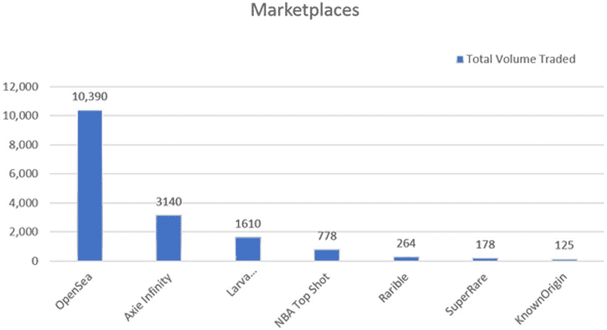
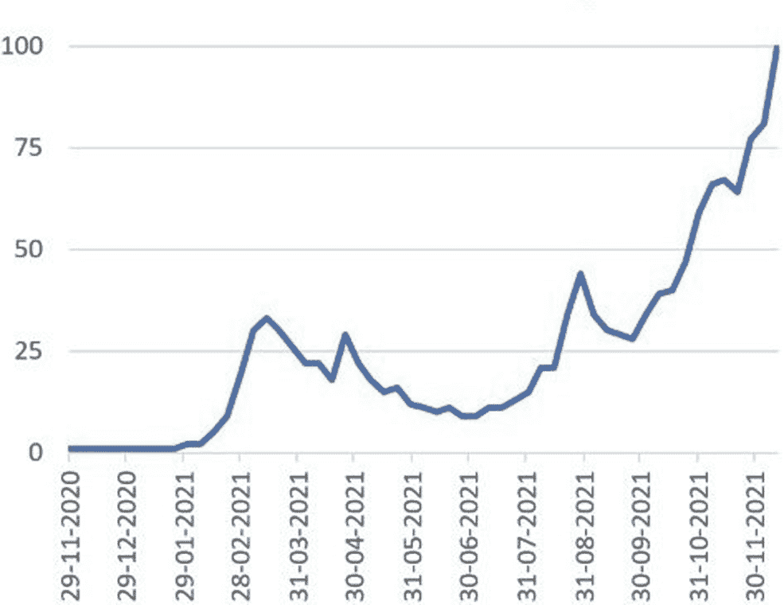
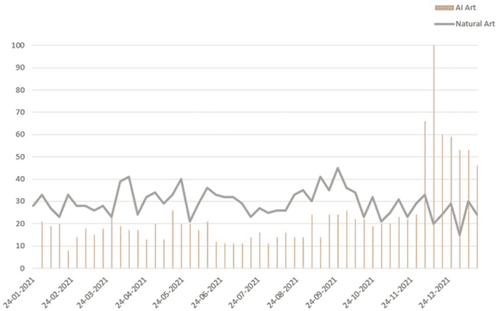
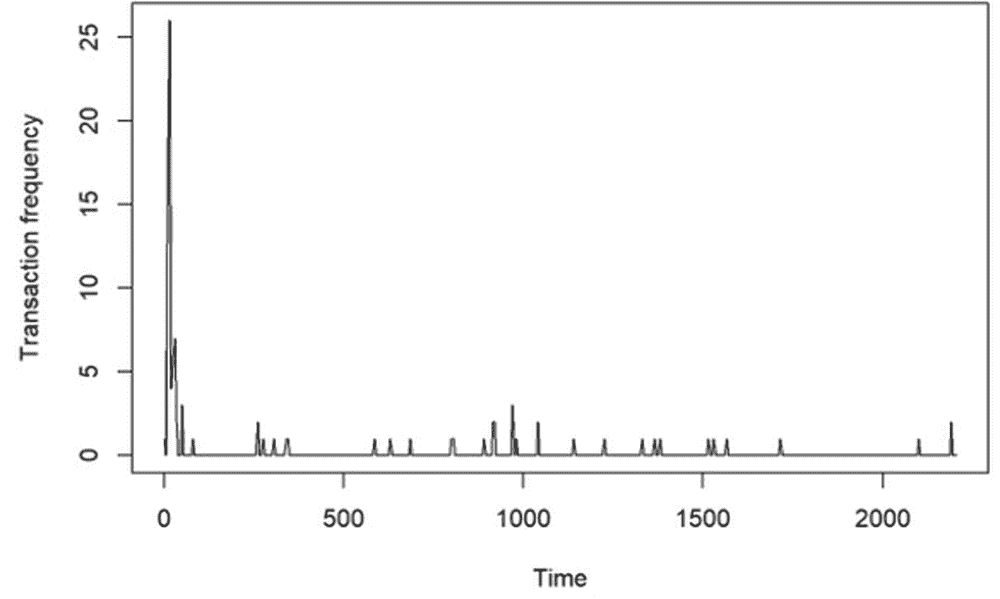

# 第十章

# 区块链技术的进步与量子区块链和非同质化代币的使用

+   Farhan Khan

    印度 Geetanjali 技术研究所

+   Rakshit Kothari

    

    印度 Geetanjali 技术研究所

+   Mayank Patel

    

    印度 Geetanjali 技术研究所

摘要

区块链是世界上一种新兴但快速增长的技术，由化名为 Satoshi Nakamoto 的人在 2009 年作为加密货币比特币而开发。区块链曾经是不可破解的，但现在，由于量子计算机的使用，篡改区块链是可能的。作为对此的反制措施，研究人员提出了利用量子密码学原理的量子区块链。今天我们看到，这项技术也催生了许多新技术。其中一个例子就是非同质化代币（NFT）。这些是一种基于区块链的全新代币，具有独特性和不可分割性。它们首次于 2014 年创建。这些是基于区块链的虚拟资产。自 2021 年初以来，这一现象及其市场已经大幅增长。

引言

区块链技术首次于 2009 年由化名为 Satoshi Nakamoto 的创造者引入，是当今世界上最流行的技术之一。它最初被介绍为一种货币媒介，名为比特币，彻底改变了货币持有和转移的方式。被称为不可破解，这项技术是当前现有系统发生许多变化的原因之一。它基本上是一组链接在一起的数据（Antonucci 等人，2019）。作为一种点对点技术，区块链变得更加安全，因为所有交易都在公共账本上更新，而且每个活跃在网络上的用户都维护其副本，所以无法篡改数据（Frauenthaler 等人，2020）。

传统上认为区块链是无法破解的，但现在这也变成了一个虚假的承诺，随着量子计算机的崛起，操纵区块链网络现在已成为可能，因为量子计算机比当前现有的经典计算机强大了百万倍。但是，答案就在问题本身中，研究人员提出了一个解决方案，我们称之为量子抗性区块链。

技术已经孕育了许多新技术，其中最重要且迅速发展的技术之一是非同质化代币（Salman, Jain & Gupta, 2019）。术语“近场技术”（NFT）表示在以前的技术基础上有了显著发展。区块链技术的支持者和技术专家因其过分乐观和技术决定论的观点而受到批评。目前对 NFT 的狂热已经席卷全球并引起了争议。然而，有一件事是清楚的：这些代币将在构建被称为“元宇宙”的虚拟土地上发挥关键作用。广义上来说，NFT 为互联网、游戏、房地产以及风险投资家们带来了新的机遇（Khalid & Askar, 2021）。NFT 对于艺术创作者和机构来说有着巨大的潜力，只需拍卖带有数字签名的艺术品就可以赚取大量资金。为了构建一个全球性的商业环境，个人和公司相互依赖于彼此来开发、传输和保存关键数据，而 NFT 为此提供了独立的空间。

进化历史

进化历史，从我们开始的地方到我们现在所处的地方。在进化的早期阶段使用了一种平等的交换系统，称为“以物易物系统”（Abou & Saade, 2019）。例如，如果一个人有很多苹果但没有芒果，另一个人有很多芒果但没有苹果，他们可以通过交换来满足他们的需求。

随后，货币时代开始了，人造硬币被使用。它们有着各种各样的变化，如长方形或立方形、大或小（Kothari, Choudhary & Jain, 2021）。这样做的主要缺点是硬币可能因地区而异，因为不同的地区有不同的政权，一个地区的硬币价值在其他地区可能一文不值，因为那时还没有货币的标准规定（Kuperberg, 2020）。

然后，在公元 7 世纪，来自中国帝国的纸币时代开始，至今仍然控制着全球（Sheikh, Patel & Sinhal, 2020）。这一切都是因为今天世界上使用美元作为完美的货币交换媒介。

最后，在 2009 年，数字时代到来，向我们介绍了一种新形式的货币，即加密货币，一种基于区块链的安全、去中心化的货币，具有匿名交易和转账的特性，对当前的中心化系统构成了威胁（Latifi, Zhang & Cheng, 2019）。比特币是第一个成功的电子货币，由匿名创造者中本聪创建。

最后，2014 年 5 月 3 日，Kevin McCoy 创造了第一个 NFT，命名为 Quantum，作为一项技术进步 (Malik, Dedeoglu, Kanhere & Jurdak, 2019)。2015 年，Spells of Genesis 游戏的制作人利用 Counterparty 成为首个发布基于区块链的游戏资产的人 (Kothari, Patel & Sharma, 2021)。

区块链

一般定义

+   • 区块链只不过是一个数据库，它将加密的数据块链接在一起，为数据创建一个连续的真实来源。

+   • 数字资产是分散的，形成资产的永久记录，而不是被复制或转移。

+   • 资产是去中心化的，允许透明和实时公共访问。

+   • 变更的视觉记录保护文件的合法性并增加了资产的信心。

由于其内置的安全功能和公共账本，区块链几乎适用于每一种业务。

区块链的关键要素

分布式账本技术（DLT）

所有网络参与者（节点）都能够访问分布式账本及其不可变的交易记录 (Salman, Jain & Gupta, 2019)。这个共享账本通过只记录一次交易来消除在传统业务网络中典型的不必要的重复。

永久记录

在将交易添加到共享账本后，任何参与者都不得修改或更改交易。如果发现交易记录中有错误，则应创建一个新交易来修复它，并且这两个交易必须都可用 (Somy et. al., 2019)。

智能合约

区块链存储了一组称为智能合约的指令，这些指令会自动执行以加快交易速度 (Tasatanattakool & Techapanupreeda, 2018)。智能合约可以制定转让公司债券的条件、旅行保险的付款条件以及其他许多事项 (Menaria, Nagar & Patel, 2020)。

区块链的工作原理

区块链的工作流程非常简单易懂。整个过程中最重要的是，发起交易的用户（Thuraisingham, 2020）即交易发起方和交易接收方，都必须有一个区块链钱包来存储数据。一个名为区块链钱包的软件使用户能够花费他们的加密货币，如 BTC、ETH 和其他货币 (Putz & Pernul, 2020)。这些钱包使用加密技术（私钥和公钥）进行保护，使用户能够监视和管理他们的交易。

当用户在网络上发起交易时，会生成一个新的区块来代表该交易 (Wan, Eyers & Zhang 2019)。在区块创建后，交易通过称为节点的计算机的点对点网络进行广播，最终确认交易。

交易确认后，它将与另一个块合并，以形成分类账的新数据块。值得注意的是，所有新交易都创建了一个安全的块，该块使用密码学原理进行加密，并与其他块链接。每当形成一个新块时，它都会被包含在当前存在的区块链网络中，确认其安全性和不可变性。

加密货币、智能合约、文件或任何其他重要数据都可能成为经过验证的交易的一部分。

优点

安全

作为开源分类账，所有交易都是公开的，这有助于消除欺诈和双重交易。为了维护交易的完整性，这些交易受矿工的监督，并且只有当网络的 51%同意时才被验证（参见 Wang, Li, Wang & Chen, 2021）。

零第三方干涉

区块链是一种独立技术，不受任何国家或省份的控制，因此没有人有权更改这些数字货币。

安全交易

所有交易都记录在区块链上，无法更改或修改。参与交易的双方以及普通公众都可以随时查看数据（参见 Yin, Wen, Li, Zhang & Jin, 2018）。这样可以增强在线交易的整体安全性。

快速交易

区块链技术使得交易可以在几分钟内完成。而银行交易可能需要至少两周的时间才能进行货币转账（指银行到银行的资金转移）。在这个阶段，使用加密货币进行虚拟交易的人可以完成多笔交易。

去中心化和匿名性

不需要任何中央机构来维护网络或验证交易。同时，它为用户提供了匿名性的权力，使用户独立。

缺点

更新困难

应用程序必须在对等网络的每个节点上更新，否则如果该网络的任何节点拒绝接受更改，则程序将被分叉。

开发难度

为了达成共识并实现可扩展性，开始时使用非常复杂的协议非常重要（参见 Yu, Lv, Shao, Guo, Zou & Zhang, 2018）。不可能迅速实现一个想法，然后再添加新功能并在不分叉或重新部署网络的情况下扩展应用程序（Saini, H. K., 2021）。

犯罪

区块链技术也负责增加犯罪率，因为它是去中心化的，使其摆脱了中央机构的任何控制，并且它允许匿名交易，使用户无法追踪（参见 Choubisa, M., et al. 2022）。

高能耗

区块链技术的核心缺点是能源消耗高。由于维护实时账本需要利用能源。此外，挖矿农场使用大量能源，因为矿工试图找到一个独特的解决方案来验证交易，这需要大量的计算机能力，因为解决方案必须从数万亿的组合中选择。

区块链的应用

国际支付

该技术最重要的应用是它使用户能够进行国际支付而无需支付高额费用，并且可以在几秒钟内完成；因此，它也可以被称为无国界转账。

保护物联网网络

尽管物联网（物联网）让我们的生活更加便利，但也可能让不诚实的参与者访问我们的数据并控制重要基础设施。通过在分布式网络而不是集中式服务器上存储密码和其他重要数据，可以实现更高的安全性。此外，区块链对数据篡改提供了安全保障，因为它基本上是不可变的（Hiran, K. K., & Doshi, R. 2013）。

数据存储

当与数据存储系统一起使用时，区块链技术可能会增加安全性和完整性。数据可以保持分散，使得黑客更难入侵并擦除网络上所有可用的数据，而集中式数据存储提供商可能有一些冗余位置（Yin, Wen, Li, Zhang & Jin, 2018）。此外，它表明数据更容易获取，因为访问不受限于单个公司的运营。在某些情况下，区块链数据存储可能更便宜。

非同质化代币

NFT（非同质化代币）通常被认为是获取数字艺术版权的一种方式。将 NFT 放在区块链上确保了数字艺术品只有一份副本，因为区块链禁止数据复制。这可能会给你一种购买实体艺术品的印象，而无需担心存储和维护的问题。

记录和身份管理

联邦、州和地方政府记录个人信息，例如出生日期、死亡日期、婚姻状况和财产交易。尽管其中一些文件只存在于纸上，但组织这些数据可能会很困难。此外，对于公民来说，亲自访问地方政府办公室进行修改是耗时、低效且不方便的。使用区块链技术可能简化记录管理并增加数据安全性。

医疗保健

像性别、年龄、身高和体重等基本详细信息是一些非常适合于区块链的医疗数据的基本示例，也可能是诸如免疫历史或生命体征之类的基本医疗记录（Hiran, K. K., & Doshi, R. 2013）。所有这些信息都不能用于单独识别患者，因此可以将其存储在公共区块链上，供许多人查看，而不会泄露隐私。

供应链管理

区块链账本的独特性使其非常适合像产品跟踪这样的任务，因为它们在供应链中移动并更换所有者。使用区块链为出口这些商品的企业打开了许多机会。可以使用区块链上的记录来组织供应链的程序，例如在货物到达港口后将其分配给不同的运输容器。区块链提供了一种新颖且灵活的组织和使用监控数据的方法。

区块链安全问题

安全漏洞

大多数区块链转账目的地远不如安全，尽管区块链被誉为“不可被黑客攻击”。例如，由于比特币交易或投资，大量比特币可能会转入一种称为“热钱包”的形式，或者是虚拟储蓄账户。这些钱包不可能像区块链的实际区块那样安全。

可以使用许多第三方服务提供商来支持区块链交易。一些例子包括支付处理器、智能合约和基于区块链的支付系统。这些第三方区块链服务提供商通常在自己的网站和应用程序上安全性较弱，这使它们容易受到攻击（Jain, R. K., 2012）。

可扩展性问题

如今，区块链是有史以来构建的最大的技术之一，它的规模只会继续增长。这让专家们感到担忧，因为这些大规模的区块链还没有得到彻底的审查。一些基本的担忧围绕着这样一种可能性：随着生态系统的迅速成熟，可能会认识到更多的漏洞并被利用，或者使这些区块链能够实现的技术基础将变得更容易受到常见威胁的影响。

与监管相关的问题

缺乏明确的立法标准是区块链安全面临的另一个挑战。区块链行业没有同质性，这使得开发人员很难从以前的错误中吸取教训。

不充分的测试

区块链被用于许多其他行业，尽管它在历史上与比特币交易有关联。问题在于，非加密货币应用程序的代码经常是试验性的和未经测试的，这给黑客留下了发现和利用漏洞的空间。

量子区块链

由于答案在问题中，唯一的事情是我们必须重新构思问题，并从最终进行检查。

同样，量子相关的对区块链的威胁的应对也可以通过采用量子来克服。由于量子计算机比传统计算机快了百万倍，并且可以在几秒钟内破解复杂的加密，传统的密码学现在无法与量子计算机竞争。因此，我们将朝着量子密码学作为解决方案迈进。

在量子密码学中，数据使用量子物理原理而不是一般的数学加密技术进行加密，这在根本上是不可破解的。详细来说，一般情况下，密码学是一种利用数学公式对数据进行加密或对明文进行混淆的方法，以便只有具有适当“密钥”的预期方能阅读它。从定义上讲，量子密码学采用量子物理定律来加密数据并以不可渗透的方式传输它（Doshi, R. 2018）。

数学和量子密码学的区别

表 1 显示了数学和量子密码学之间的比较。

表 1。­

| 数学密码学 | 量子密码学 |
| --- | --- |
| 它通常是基于数学计算的技术。 | 它通常是基于量子法则的技术。 |
| 它标志着数字签名的存在。 | 其中数字签名不存在。 |
| 位速率完全依赖于计算能力。 | 平均位速率为一(1) MbPS。 |
| 位存储是 2n，n 位字符串。 | 位存储是 1 个 n 位字符串。 |
| 它有一个独立的通信媒介。 | 它有一个依赖的通信媒介。 |
| 它被广泛使用。 | 它是复杂的。 |
| 总开支非常少。 | 总开支很高。 |

量子密码学的工作原理

量子物理学的不确定性原理为量子密码学提供了最早的基础。随着未来量子计算机有望处理离散对数问题以及广泛使用的加密方法（如 AES、RSA 和 DES）有望失败，量子密码学成为了未来的预期答案。举例来说，它被用于生成一组共享的、保密的和随机的比特流，使得两个系统，称为约翰和史密斯，能够相互交互。这被称为量子密钥分发。在约翰和史密斯之间交换了这个密钥后，可以使用众所周知的密码程序来交换额外的信息（Yu, Lv, Shao, Guo, Zou & Zhang, 2018）。

根据不确定性的海森堡原理：BB84 及其变种

使用偏振器通过单光子脉冲。约翰可能会用某种偏振器极化单光子脉冲，并将二进制值位编码到偏振器的输出（垂直，水平，圆形等）中。史密斯可能会与约翰匹配情况，并通过接收光子束并猜测偏振器来确定他的估计的有效性。如果哈罗德试图解码，那么他的偏振器生成的不一致性将在史密斯和约翰的匹配实例中引起警报，提醒他们窃听。在这样的设置中，如果哈罗德试图倾听一段对话，约翰和史密斯将会受到警报。

+   • 与原始的 BB84 的四种极化状态相比，B92 协议只有两种。

+   • 类似于 BB84 使用的 SSP 协议，使用 6 种状态对比特进行加密。

+   • 另一种使用衰减激光的技术是 SARG04，它在多光子系统中优于 BB84。

根据量子纠缠：E91 及其变体

约翰和史密斯从发射一对纠缠光子的单一源接收到每个粒子。对于每个发送的光子，约翰和史密斯将交换编码位并匹配情况，类似于 BB84 技术。然而，由于纠缠原理，在这种情况下约翰和史密斯的匹配实例的结果将是完全相反的。任何一个都可以解释位串中的补码位。然后，他们中的一个可以翻转位来生成密钥。这个测试可以证明没有窃听者，因为纠缠粒子的贝尔不等式不应成立。因为第三个光子与能量级别足够用于不可检测的纠缠几乎是不可能的，所以这个系统是完全安全的。

+   • 纠缠粒子理论可以应用于 SARG04 和 SSP 协议模型。

量子密码学的失败点：

光子数分裂（PNS）攻击

由于发送单个光子是不可能的，所以发送脉冲代替。哈罗德可以从脉冲中收集一些光子，在约翰和史密斯匹配位之后，哈罗德可能正在使用类似于史密斯的偏振器来获得尚未被发现的密钥（Gupta & Patel, 2021; Khazanchi, D. et al 2021）。

伪造状态攻击

哈罗德复制了史密斯的光子检测器，因此收集并传递了为史密斯准备的光子。尽管哈罗德知道这些编码位，史密斯仍然认为这些来自约翰。

非同质化代币

非同质化代币的可用性

像区块链一样，NFT 提供了广泛的应用，但主要的应用领域将是

游戏

非同质化代币正在通过提供游戏赚取模型并允许玩家快速轻松地访问他们独特的数字资产，稳步改变游戏产业。

截至目前，由于在线游戏运行在中央服务器上，因此与他人分享游戏资产有些复杂（参见 Wan, Eyers & Zhang 2019）。然而，随着即将到来的去中心化游戏，如 Axie Infinity，将更容易共享游戏资产，让用户自由玩耍。

NFT 游戏允许人们在玩游戏时赚钱，例如 CryptoKitties，它开辟了加密收藏品行业的道路，允许玩家将他们的小猫作为 NFT 进行交易，最昂贵的小猫之一是创始人猫 #40（售价 104 万美元）。

游戏可收藏物品，如武器、皮肤、地图和配件，被称为与游戏相关的 NFT。

元宇宙

源自 1992 年的科幻小说《雪崩》，元宇宙可以分为两个部分：“meta” 意为超越，“verse” 意为宇宙，因此合称为超越宇宙的东西。

今天证明元宇宙的含义是一个无限的世界，它是一个三维虚拟世界的组合，“虚拟和增强现实”的扩展，“混合现实”。

NFT 是通往元宇宙的门户，促进其中的身份、社区和社会体验的构建（参见 Gupta & Patel，2021）。这些将通过使用增强现实、参与和基于位置的功能来维护虚拟世界外的互操作性。

元宇宙中的虚拟土地也可以交易，就像 Decentraland 通过允许任何人购买元宇宙中的土地所做的那样。

NFT 将有助于证明在元宇宙中的艺术所有权。举个例子，列奥纳多·达·芬奇的绘画《蒙娜丽莎》，全球任何人都可能拥有一份复制品，但真正的只会被个人或组织拥有，而复制品的价值不会像真品那样高。同时，NFT 也可以被称为元宇宙中的《蒙娜丽莎》，独一无二，无价且不可替代。

其他用途领域

+   • 知识产权和专利：传统的知识产权程序，如商标和版权，无法使用户证明对整个艺术品的所有权，而非同质化代币可以。

+   • 物流运营：NFT 还可以帮助企业跟踪产品的生产、运输和交付情况。顾客可以看到他们付款的内容，供应链的机制也是透明的。

+   • 地产行业：房地产行业是最适合 NFT 的行业之一。NFT 也可以在房地产领域中使用，通过为房地产交易启用智能合约（允许自动支付机制），可以简化和加快交易，并且还可以建立去中心化的租赁。现在具有时间戳的 NFT 可以用于房地产相关文件的转移，确认所有权，并跟踪土地价值随时间的变化。

+   • 确保产品的真实性：在不久的将来，由于区块链可以永久记录产品信息，实际物品将能够被评估其真实性和有效性。非同质化代币也可以用来查看制造过程的数据，确保一切都是公平进行的。

+   • 艺术品的识别：它可以帮助确定物体的合法性，并减少或消除假冒艺术品的分发。这也确保了物体的真实性，特别是如果它是在拍卖行获得的。

+   • 在选举中投票：许多国家要求选民在选举期间向投票站提供图片 ID 和公民身份的证明。另一方面，许多人可能无法投票，因为他们可能没有任何身份证明文件或任何其他指定的居住证明。NFT 可以成为解决这个问题的有效解决方案，因为它可以被用作不需要任何实物文件的人的数字身份标记。因为 NFT 就像一个官方记录，记录了谁投票以及他们在哪里投票，所以它还将有助于防止舞弊投票和作弊。

加密货币和非同质化代币之间的相似之处和区别

相似之处

+   • 两者都由区块链机制赋予力量。

+   • 两者都需要进行挖矿/铸造以进行转移。

+   • 两者都是向所有人开放的，因此没有人被限制购买/出售加密货币或 NFT。

+   • 两者都为用户提供匿名性。

+   • 两者都使用公共账本进行记录。

+   • 两者都需要存储数字钱包。

作为基于区块链技术的 NFT 与其他加密货币有何区别的问题。对于一些人来说，这种差异可能微不足道，但对于其他人来说却是巨大的。

区别

作为对上表的参考，NFT 可以是任何东西，甚至出乎意料地，甚至可以是一条推文。2021 年 3 月，Twitter 创始人杰克·多西的第一条推文在一个名为 Valuables 的平台上拍卖，最高出价接近 289 万美元。因此可以看出，这些代币可以是任何你想要的东西。

表 2\. 加密货币和非同质化代币之间的比较

| 加密货币 | 非同质化代币 |
| --- | --- |
| 加密货币是可替代的，因此两个硬币的价值始终相同。 | 顾名思义，这些都是不可替代的，因此没有两个代币是相同的。 |
| 这些是可分割的，例如一个比特币可以分成一亿个 Satoshi。 | 这些是不可分割的，存在于单个实体。 |
| 用于挖矿的是“工作证明”(PoW)协议。 | 用于铸造的是“股权证明”(PoS)。 |
| 它代表货币。 | 它本质上是一个独特的现实世界实体的数字表示。 |
| 每种加密货币都有自己的区块链，并将其用于存储价值和验证交易 | 它基于一种币的区块链，例如，许多 NFT 是在以太坊区块链上铸造的。 |

创建和拍卖的方法

到目前为止，我们已经了解了所有关于 NFT 的知识，现在是时候通过学习创建和拍卖的过程来深入了解了(Wan, Eyers & Zhang 2019).. 如果你喜欢创作不可思议的艺术作品，这不会是一件复杂的事情。

选择独特的创作

初始阶段是选择一件杰作，正如我们所知道的那样，这些可以是任何东西，如上所述，可能是您绘制的绘画，您演唱的任何歌曲，您的电影，图像，以及实际上任何东西。因此，请选择最独特和引人注目的艺术品。

获取一些加密货币

现在艺术品已经选定，第二步是准备足够的加密货币。由于今天大多数代币都建立在以太坊上，因此最好在钱包中持有以太坊。

它不是必须仅在以太坊上构建，因为它可以在任何区块链上完成，其他几个选项包括 Solana、Polkadot、Bitgert 等。以太坊更受欢迎，因为它是最广泛使用的，几乎被每个 NFT 交易所认可。

现在心中浮现一个问题，我在这里要出售我的 NFT，为什么我需要持有加密货币。

需要考虑的重要一点是，交易平台将收取创建者的费用以铸造代币，但是铸造 NFT 的含义是什么？

简单来说，铸造 NFT 可以定义为将艺术作品从数字形式转变为 NFT 并永久存储在以太坊区块链上的过程，之后我们的艺术作品将无法更改或删除。

我们的 NFT 现在已准备好在 NFT 交易平台上交易。

选择一个市场：

现在你已经准备好了一切，现在是找到适合的市场来铸造和拍卖 NFT 的步骤（必须注意的是，该过程可能因平台而异，因为它们都有不同的跟随方法）。所需的全部内容都是创建铸造程序，如上所述。

描述艺术作品，例如它是关于什么的，是什么使其独特，为什么要购买它等等。

发起拍卖：

最后一步是出售 NFT，它可以直接进行销售，也可以通过拍卖的方式出售，这些可以描述为：

+   • 公开拍卖：它允许公众竞标，直到您接受为止。

+   • 定时拍卖：一种由我们决定持续时间的拍卖，例如一天，一周或更长时间。

+   • 固定价格：与拍卖相反，您也可以为您的 NFT 设定一个固定价格。

利润和费用

当 NFT 通过平台交易时，他们将收取一些佣金费用（取决于平台）以及一些交易费用，用于将加密货币从购买者的钱包转移到卖方的钱包，不用担心，这些金额不是很大。

一些著名的 NFT 交易市场包括：

+   • OpenSea

+   • Axie Marketplace

+   • Larva Lab /CryptoPunks

+   • NBA Top Shot Marketplace

+   • Rarible

+   • SuperRare

+   • KnownOrigin

| 图 1\. 市场交易量比较 |
| --- |
|  |

购买非同质化代币的过程

由于 NFT 与加密货币不同，它们不能直接用美元或欧元等法定货币购买，今天大多数 NFT 都是用以太坊交易的。

购买 NFT 的过程非常简单，包括以下步骤：

+   1\. 创建一个数字加密货币钱包来持有加密货币，比如 Exodus、Metamask 或 Trezor。

+   2\. 现在从你喜欢的币交易平台获取加密货币。

+   3\. 将钱包连接到你想要的市场，比如 OpenSea、Rarible 等等。

+   4\. 最后选择你想要的 NFT 并铸造它。

NFT 的流行程度决定了它的价格，NFT 越稀有和独特，价格就越高，一些例子是海滨别墅（价值 600 万美元）、十字路口（价值 660 万美元）、前 5000 天（价值 6900 万美元）等是市场上售价较高的 NFT 之一。

增加的采用率

到 2021-2022 年，NFT 已经见证了一次飞速的流行和销售，年初销售额超过了 25 亿美元。正如谷歌趋势所显示的那样。对于这种巨大的增长的解释可能是理解人类收藏行为。显然，这个说法是正确的；让我们考虑一下童年时代的例子：如果我们走进市场看到一个新东西，不管它是否有用，我们都渴望拥有它；我们渴望拥有它是因为我们喜欢它，我们必须在第二天在学校里展示它。同样，罗伯特·唐尼的粉丝肯定想要拥有罗伯特现在穿的夹克，并且愿意支付任何金额来拥有它。NFT 的功能类似，它们的吸引力来自于人类的本性。

| 图 2\. NFT 去年的流行度上升 |
| --- |
|  |

优势

拥有权

能够证明所有权是非同质化代币的关键优势。因为它们在区块链上运作，NFT 可以帮助将所有权与特定账户联系起来。这些代币也不能在多个用户之间分配。由于 NFT 的所有权优势，顾客也免受获得伪造 NFT 的影响。

真实性

NFT 所在的区块链网络的完整性确保了它们的真实性，防止它们被更改、删除或替换。

经济增长的机会

内容提供者经常担心平台通过不给予他们应得的东西而剥夺了他们的收入和收益潜力。例如，在标准版税下，通常出版的作者在纸质书上可以获得 6–21%的版税，与艺术价值相比这很少[10]。作为解决方案，NFT 使艺术家摆脱了这种中间商模式，使他们能够以他们想要的价格自由销售他们的艺术品。

艺术品的所有权证明被嵌入在 NFT 的元数据中。因此，当创作者的作品被出售时，收益直接归他们所有。开发者可能会通过在构建过程中放置智能合约来获得版税，因为发明者的地址包含在 NFT 的元数据中。

提高市场效率

NFT 最明显的优点是它们提高了市场效率的能力。目前，在艺术界的各个领域正在展示一个美妙的例子。艺术家现在可以直接与他们的粉丝互动，不再需要昂贵的代理和冗长的谈判。

对所有人开放

这一特性使得每个人都可以创建、销售和交易 NFT，无论年龄、性别、种族或其他任何因素。

匿名性

创建 NFT 无需提交任何文件，这对选择保持匿名的人们是有利的。

缺点

流动性不足和短暂的资产

由于其不成熟和波动性，NFT 行业流动性不足。NFT 并不被广泛认可，也没有很多人对其感兴趣。因此，在紧张时期，交易 NFT 可能会非常具有挑战性。它还表明 NFT 的价格非常波动，因为你今天支付数百万美元持有的热门艺术品可能在未来过时。

不可能数字化实体艺术品

拥有实体艺术和数字艺术是经常不同的。此外，任何现有的实体艺术品都不可能数字化。因此，用自己的眼睛看到真正的艺术有一种吸引力，而这些代币缺乏这种吸引力。

非环保

区块链记录需要大量的计算能力，这需要大量的电力。总电力中有一小部分来自可再生能源，而主要部分来自煤炭和不同化石燃料的燃烧，这会排放 CO2，最终导致污染和全球变暖。

受到盗窃的威胁

区块链作为一种防篡改技术可能会受到盗窃的影响，因此 NFT 也容易受到多种安全漏洞和攻击的威胁，因为它们是数字产品。这些黑客并不是指数据篡改，而是指私钥的曝光，因为它可能导致钱包被篡改和盗窃。此外，大多数 NFT 交易所采用的安全标准不足或过时，使它们容易受到多种威胁。

对所有人开放

这一特性既是优点也是缺点，因为没有内容过滤机制来检查它是什么类型的内容，它可能是任何宣扬恐怖主义或裸体的帖子。

匿名性

由于任何人都不知道真实身份，因此不可能跟踪某人，这可能会导致非法活动增加。

人工智能、自然艺术和 NFT

人工智能是计算机科学中最关键和不断发展的分支之一，在大多数领域超越人类，其中一些包括医疗、驾驶、制造、烹饪等等。文学和艺术是人工智能不应该发展的两个领域，因为它们无法拥有人类的意识和想象力，然而，由于最近的发展，这些说法似乎是不真实的。GPT3 和 DALL-E 是由 OpenAI 开发的人工智能行业的最大进步。

GPT-3 被命名为预训练生成转换器 3，是自然语言处理领域的一个进步，能够生成类似人类的语言、回答问题、写作等等。基本上，它是一个基于深度学习的自回归语言模型，运行在 1750 亿参数上，并使用 Common Crawl、WebText2、Books1、Books2、Wikipedia Corpus 数据集的组合进行训练，准备挑战人类智能。

DALL-E 是一个文本到图像处理系统，能够根据通用语言（最好是英语）中给出的文本命令生成图像。该模型运行在 120 亿自回归变换器参数（来自 GPT3）上，这些参数是在互联网上获得的 2500 万个图片和文本配对进行训练的。它通过零-shot 学习生成描述的输出，无需额外的训练。

就目前而言，我们可以看到 AI 目前正被应用于一系列领域，包括聊天机器人、外科机器人等等。同样，对于 NFT，预计 AI 也将用于生成它。因为如今由 AI 创建的艺术作品正在成为与传统艺术相比的重要焦点，如下图-3 所示，这是 12 个月的记录数据。

| 图 3. AI 与自然艺术的比较 |
| --- |
|  |

这是因为艺术可以很容易地借助人工智能创作，我们只需给出我们想要的艺术的命令，一些常用的平台有：

+   • Hotpot AI

+   • Artbits AI，等等

分数化 NFT

因为 NFT 的流行度每天都在增长，每个人都想持有他能得到的最好的 NFT，但由于流行度，著名项目已经发展到了高度，以 Bored Ape Yacht Club 和 CryptoPunks 为例，对于中产阶级人士来说，由于高昂的价格而购买是不可行的。

作为对此问题的解决方案，分数化 NFT 的想法在这种情况下发挥作用。分数化 NFT 简单来说就是可以被分成小份的代币，使多人能够对类似的 NFT 主张所有权。NFT 通过智能合约进行分数化，该合约创建一定数量的与独特原始版相关联的代币，为每个持有者提供对整个 NFT 的固定百分比的主权，这些现在也可以在市场上交易。

也许你心中会有一个令人担忧的问题，就是说 NFT 是不可分割的，并且存在于整体中，那么它怎么能被分数化。对此的答案很简单，因为在整个分数化过程中，原始的 NFT 并没有被切割成片段并分配，而是有一个明确定义的标准程序来进行此操作。

我们知道，ERC-721 是用于创建 NFT 的标准，同样，ERC-20 用于创建可替代代币，智能合约用于生成与不可分割的 ERC-721 相关联的可替代 ERC-20 代币，其总分数由所有者定义。这些 ERC-20 代币的价格由它们的当前市场价格和创建的代币数量决定。这些代币现在是可互换的；因此，它们始终具有相同的价值，并且可以彼此交换，甚至准备在市场上交易。在与 NFT 相关的决策时，所有者都聚集在一起投票决定他们想要的变化。

创建/购买分数化 NFT 的一些流行平台包括：

+   • Fractional.art

+   • Unic.ly

+   • Otis

+   • NIFTEX

+   • nft20

+   • NFTX

最后的话

很明显，某物的价值因人而异。对于艺术家来说，这是向世界展示自己作品并仍然赚钱的好方法。同样，科技爱好者正在拥抱 Metaverse，一些人开始在想象的领域购买土地，所以如果你是一名商人，这是一个投资和赚钱的绝佳领域。对于艺术爱好者来说，能够不断增加独一无二的作品是令人兴奋的。允许我们进行 P2P 数据共享。还要采用一些技术来发现和记录事件，需要一个永久且抵抗错误和操纵的分布式网络。使这一切成为可能的革命是区块链和分布式账本技术。

| 图 4\. 交易频率 V/S 时间 |
| --- |
|  |

结论

作为一种技术，区块链正在发展，甚至有可能突破所有限制，但是伴随着巨大的力量而来的是更大的责任，我们的首要责任是维护区块链，我们不能依赖有缺陷的系统来规划我们的未来，因此我们必须始终用强大的解决方案来克服缺陷。

参考文献

Abou, J., & Saade, R. G. (2019). 区块链应用–不同领域的用途。《IEEE Access：实用创新，开放解决方案》，7，45360–45381。doi:10.1109/ACCESS.2019.2902501

Antonucci, F., Figorilli, S., Costa, C., Pallottino, F., Raso, L., & Menesatti, P. (2019). 对农业中区块链应用的综述。《食品与农业科学杂志》，99(14)，6129–6138。doi:10.1002/jsfa.9912

ChoubisaM.DoshiR.KhatriN.HiranK. K. (2022 年 5 月)。用于网络安全中入侵检测系统的随机森林的简单而强大的方法。在 2022 年物联网和区块链技术国际会议（ICIBT）中（第 1-5 页）。IEEE。10.1109/ICIBT52874.2022.9807766

Doshi, R. (2018 年 6 月)。云计算在高等教育中的机构采用框架：撒哈拉以南非洲的案例。工程，信息技术和社会科学研究国际期刊，8（6），51-56。

FrauenthalerP.SigwartM.SpanringC.SoberM.SchulteS. (2020 年 11 月)。ETH 中继：以太坊基于区块链的成本效益中继。在 2020 年 IEEE 区块链国际会议（区块链）中（第 204-213 页）。IEEE。10.1109/Blockchain50366.2020.00032

GuptaH.PatelM. (2021 年 3 月)。使用 LSA 和基于句子的 BERT 主题建模的文本摘要方法。在 2021 年国际人工智能与智能系统大会（ICAIS）中（第 511-517 页）。IEEE。10.1109/ICAIS50930.2021.9395976

Hiran, K. K., & Doshi, R. (2013 年)。使用连接过程的鲁棒且安全的数字图像水印技术。国际信息与管理技术杂志。

Hiran, K. K., & Doshi, R. (2013 年)。一种用于脑瘤检测的数字图像分割的人工神经网络方法。脑，2（5），227-231。

Jain, R. K., Hiran, K., & Paliwal, G. (2012 年)。量子密码学：信息安全系统的新一代。国际计算机与分布式系统杂志的论文集。

Khalid, Z. M., & Askar, S. (2021 年)。抵抗量子计算攻击的区块链密码学。科学与商业国际杂志，5（3），116-125。

Khazanchi, D., Vyas, A. K., Hiran, K. K., & Padmanaban, S.（主编）（2021 年）。可持续发展的区块链 3.0（第 10 卷）。Walter de Gruyter GmbH＆Co KG。doi:10.1515/9783110702507

Kothari, D., Patel, M., & Sharma, A. K. (2021 年 1 月)。在 2021 年第六届国际发明计算技术大会（ICICT）中使用卷积神经网络实现生物信息学中的机器学习和人工智能的灰度归一化。IEEE。10.1109/ICICT50816.2021.9358549

Kothari, R., Choudhary, N., & Jain, K. (2021). 使用具有表达能力的阈值访问结构的 ECC 的 CP-ABE 方案与恒定大小的解密密钥。在数据驱动计算与通信的新兴趋势中（第 15-36 页）。Springer。doi:10.1007/978-981-16-3915-9_2

KuperbergM. (2020 年 11 月)。朝向在仅追加的区块链中启用删除以支持数据增长管理和 GDPR 合规性。在 2020 年 IEEE 区块链国际会议（区块链）中（第 393-400 页）。IEEE。10.1109/Blockchain50366.2020.00057

LatifiS.ZhangY.ChengL. C. (2019 年 7 月)。基于区块链的房地产市场：在商业房地产市场中应用区块链技术的一种方法。在 2019 年 IEEE 区块链国际会议（区块链）中（第 528-535 页）。IEEE。10.1109/Blockchain.2019.00002

MalikS.DedeogluV.KanhereS. S.JurdakR. (2019, 七月). Trustchain: 区块链和物联网支持的供应链中的信任管理. 在 2019 年 IEEE 国际区块链会议上 (pp. 184-193). IEEE. 10.1109/Blockchain.2019.00032

MenariaH. K.NagarP.PatelM. (2020). 使用混合分类器通过语义和频率特征对推文情感进行分类. 在首届可持续技术与计算智能国际会议上 (pp. 107-123). Springer. 10.1007/978-981-15-0029-9_9

PutzB.PernulG. (2020, 十一月). 检测区块链安全威胁. 在 2020 年 IEEE 国际区块链会议上 (pp. 313-320). IEEE. 10.1109/Blockchain50366.2020.00046

Saini, H. K., Jain, K. L., Hiran, K. K., & Bhati, A. (2021). 利用区块链构建智慧城市的范式. 区块链 3.0 用于可持续发展, 10, 21.

SalmanT.JainR.GuptaL. (2019, 七月). 基于知识和概率区块链的声誉管理框架. 在 2019 年 IEEE 国际区块链会议上 (pp. 520-527). IEEE. 10.1109/Blockchain.2019.00078

SheikhR.PatelM.SinhalA. (2020). 使用 PCA 和 LDA 识别 MNIST 手写数据集. 在 2019 年人工智能国际会议上 (pp. 169177). Springer. 10.1007/978-981-15-1059-5_20

SomyN. B.KannanK.AryaV.HansS.SinghA.LohiaP.MehtaS. (2019, 七月). 利用区块链保护所有权的 AI 市场平台. 在 2019 年 IEEE 国际区块链会议上 (pp. 156-165). IEEE. 10.1109/Blockchain.2019.00029

TasatanattakoolP.TechapanupreedaC. (2018, 一月). 区块链：挑战和应用. 在 2018 年信息网络国际会议上 (ICOIN) (pp. 473-475). IEEE. 10.1109/ICOIN.2018.8343163

Thuraisingham, B. (2020, 十月). 区块链技术及其在数据科学和网络安全中的应用. 在 2020 年智能区块链国际会议上 (SmartBlock) (pp. 1-4). IEEE. 10.1109/SmartBlock52591.2020.00008

WanL.EyersD.ZhangH. (2019, 七月). 评估网络延迟对区块链交易安全的影响. 在 2019 年 IEEE 国际区块链会议上 (pp. 194-201). IEEE. 10.1109/Blockchain.2019.00033

Wang, Q., Li, R., Wang, Q., & Chen, S. (2021). Non-fungible token (NFT): 概述、评估、机会和挑战. arXiv 预印本 arXiv:2105.07447.

Wireko, J. K., Hiran, K. K., & Doshi, R. (2018). 基于文化的用户对物联网时代新技术的抵制：来自埃塞俄比亚的视角. 国际新兴技术和先进工程期刊, 8(4), 96–105.

Yin, W., Wen, Q., Li, W., Zhang, H., & Jin, Z. (2018). 区块链中的抗量子交易认证方法. IEEE Access: 实用创新、开放解决方案, 6, 5393–5401. doi:10.1109/ACCESS.2017.2788411

Yu, S., Lv, K., Shao, Z., Guo, Y., Zou, J., & Zhang, B. (2018, August). 一种面向智能设备的高性能区块链平台. 在 2018 年第一届 IEEE 国际热信息中心网络会议（HotICN）(pp. 260-261). IEEE. 10.1109/HOTICN.2018.8606017

额外阅读

Zheng, Z., Xie, S., Dai, H. N., Chen, X., & Wang, H. (2018). 区块链的挑战与机遇：一项调查. 国际网格服务杂志, 14(4), 352–375. doi:10.1504/IJWGS.2018.095647

关键术语和定义

人工智能：人工智能基本上是机器对人类行为的模拟，尤其是计算机系统。

区块链：区块链通常是一个将加密数据块链接在一起以创建连续数据的单一真实来源的数据库。我们也可以称之为在线分类帐。

区块链挖矿：这是一种点对点计算机过程，通过该过程，在网络上验证区块链交易并将其添加到区块链分类帐中。基本上用于保护和验证区块链交易。

共识：两个或更多方之间的一般协议。

加密学：通过使用不同算法加密数据来保护交易的机制，只有预期用户才能解码。

数字钱包：用于存储加密货币的软件。

燃气费：执行加密货币交易时向用户收取的加密货币交易费。

元宇宙：这是互联网的一种演变，通过将其演变为一个单一的、普遍的、沉浸式虚拟世界来促进它，将使用虚拟增强现实头戴式显示器。简单来说，它是一个虚拟世界。

NFT 拍卖：在没有冻结固定价格的情况下销售 NFT 的过程，在拍卖过程中，NFT 的价格取决于其受欢迎程度。

NFT 铸币：指将数字文件转换为加密收藏品或可以存储在区块链上的数字资产的过程。

点对点：计算或网络是一种分布式应用程序架构，将任务或工作负载在对等方之间进行分区。

股权证明：这些证明是一类区块链的共识机制，通过按照相关加密货币的持有量选择验证者来工作。

工作证明：一种加密证明形式，在该证明中，一方向其他人证明已经花费了特定数量的特定计算工作。

量子密码学：一种利用数学密码学和量子物理定律加密数据的方法，以使交易安全并以无法被黑客入侵的方式传输数据。

量子纠缠：当两个粒子（如一对光子或电子）纠缠时，它们即使被分隔成很大的距离仍然保持连接。

智能合约：一段代码返回以自动执行所需的工作，例如，智能合约可能建立转让公司债券的条件，旅行保险的付款条款，以及许多其他事情。
