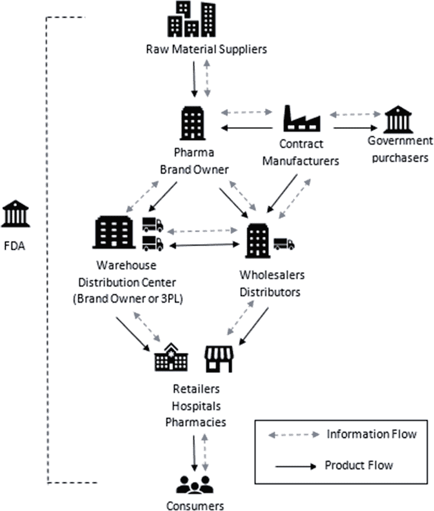
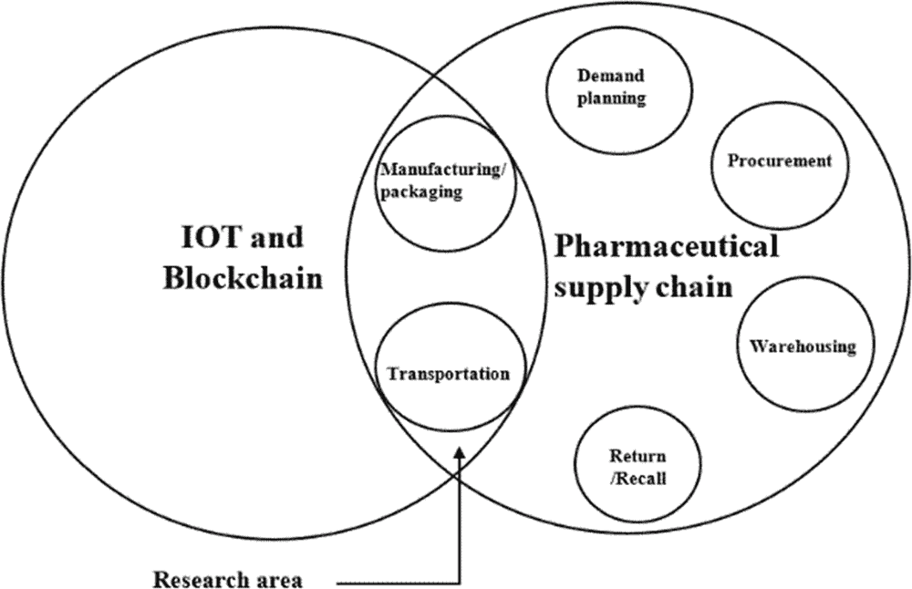
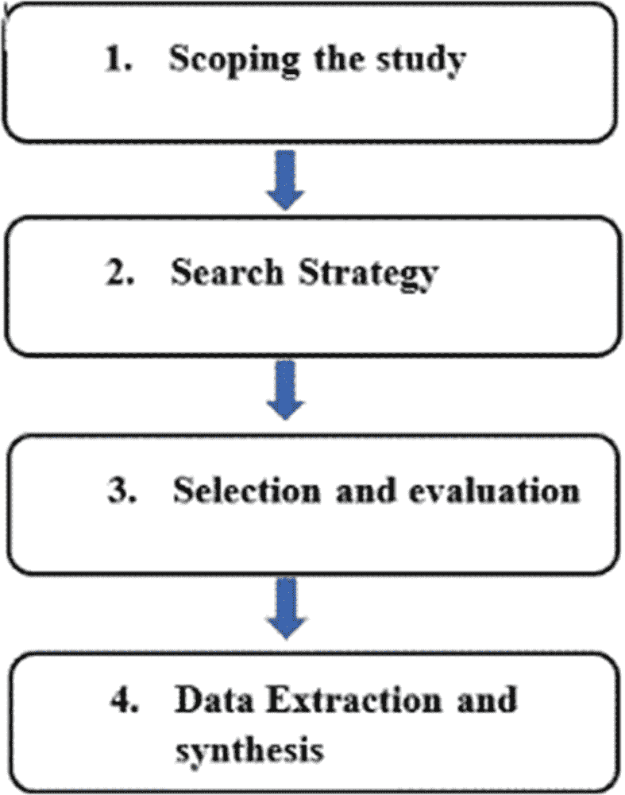
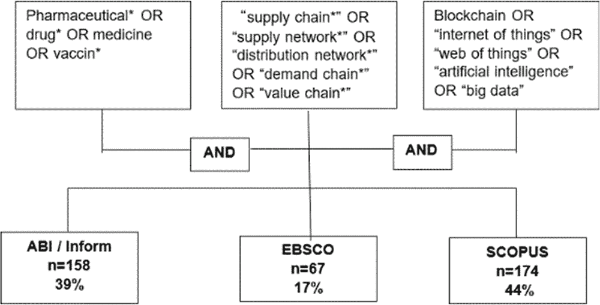
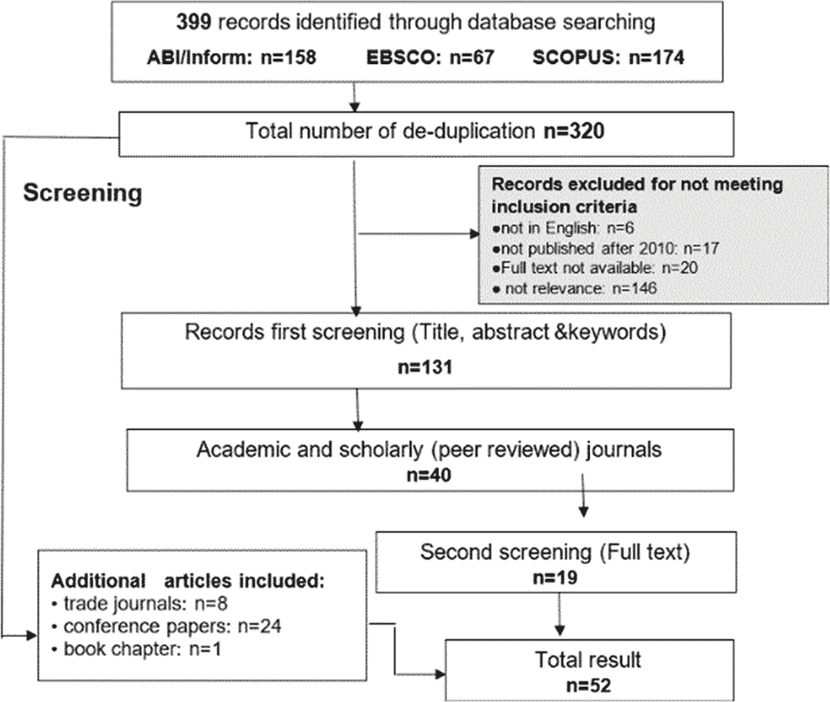
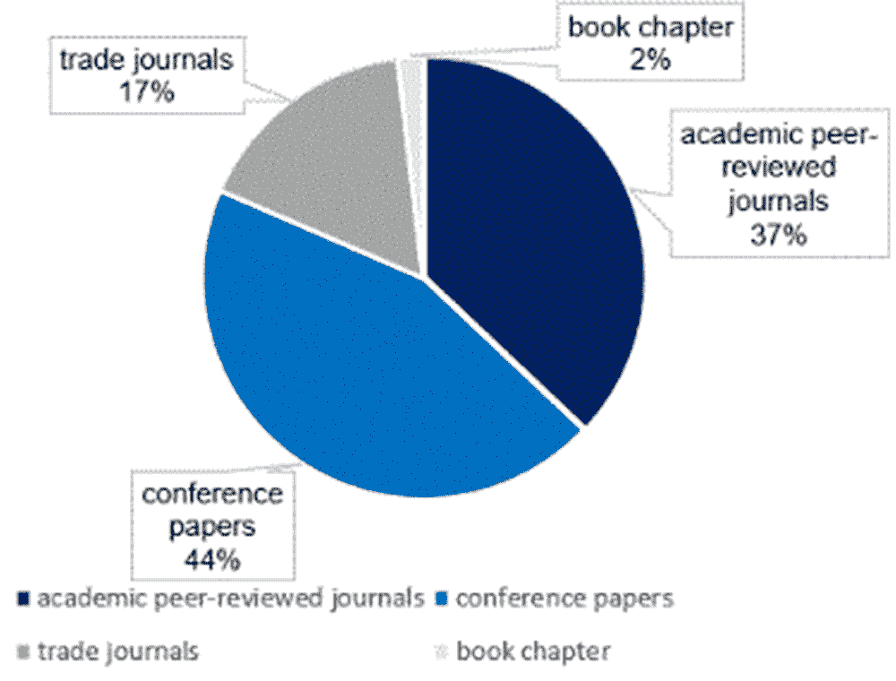
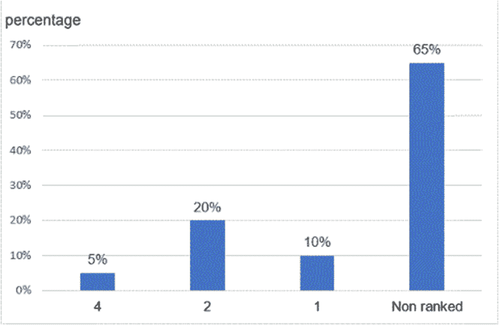
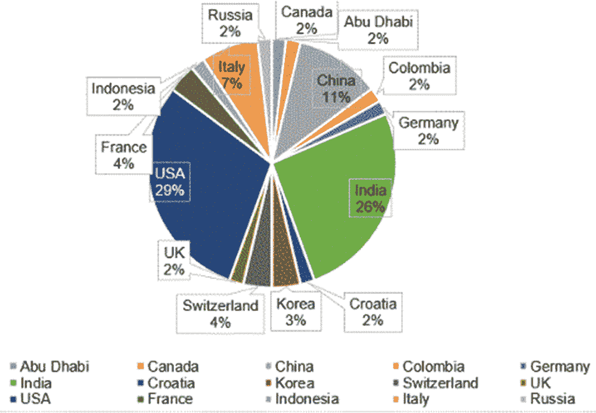

# 第一章

# 物联网（IoT）和区块链应用于制药供应链溯源以实现可追溯性、透明度和真实性

+   袁孙

    中国沃瓦克斯生物技术有限公司

+   赛义德·伊姆兰·阿里

    

    英国哈德斯菲尔德大学

摘要

可追溯、透明和真实的制药供应链（PSC）可以为药品安全、质量和更好的公共健康保护提供保证。对 PSC 和未来研究议程的全面审查是必要的，以了解物联网和区块链在 PSC 溯源中的应用。进行了系统性审查，以研究物联网和区块链如何帮助应对当前 PSC 面临的挑战。进行了描述性和主题分析，以揭示研究趋势、研究的时间和地理分布以及主题。主要发现集中在当前 PSC 面临的挑战、在 PSC 中实施物联网和区块链的机会，以及在制药包装和运输过程中的物联网和区块链的应用。此外，研究总结了在 PSC 中物联网和区块链集成的框架。

引言

药品供应是医疗系统的重要组成部分（WHO, 2010）。在当前注重健康的社会中，药品的满意质量和监管合规性在全球范围内引起了巨大关注，这是因为假冒和不合格药品对消费者健康可能造成的重大风险（Sylim 等，2018）。从生产到消费，制药供应链（PSC）中涉及多个合作伙伴和中间商。这给现有的集中式系统带来了极大的可追溯性挑战，比如单点故障、数据操纵、互操作性、安全性、利益相关者协议、实施成本、缺乏标准化和监管（Premkumar 和 C, 2020, Uddin 等，2021）。使用传统信息平台无法促进 PSC 的多个参与者之间的协作（Vecchione，2017）。它也无法支持追踪和跟踪所需的源，以确保质量、监管合规性和药品安全。

物联网（IoT）和区块链技术已经成为全球各行业关注的焦点。物联网在供应链管理中的应用可以支持实时信息更新和监控（Premkumar 和 C，2020）。区块链技术可以记录与整个供应链相关的所有内容，并以安全的方式允许信息在分销网络中共享（Bocek 等，2017）。在整个药品供应链上实施药物溯源至关重要，以加强制药市场的治理和监督（Sylim 等，2018）。因此，物联网和区块链技术在未来制药领域将发挥巨大作用。物联网和区块链技术的应用可以通过改善供应链参与者之间的协作以及信息共享，有助于实现追踪能力、真实性和透明度的目标。

背景

制药供应链

供应链被定义为一个网络，参与者共同合作将基本材料转化为最终由最终客户所重视的特定成品（Settanni，Harrington 和 Srai，2017）。供应链还涉及控制、管理和改进从供应商到最终用户的物资和信息流动（Harrison 等，2019 年，Uddin 等，2021 年）。因此，药品供应链是企业之间的一个网络，用于生产、管理、分销药品和所有相关信息给最终购买者。药品供应链的目标是通过提供药品来使企业实现改善健康状况的目标（Settanni，Harrington 和 Srai，2017 年，Musamih 等，2021 年）。药品供应链是复杂的，其质量控制过程严格（Vecchione，2017 年，Ahmadi 等，2020 年）。从涉及参与者的角度来看，典型的药品供应链包含不止一个参与者。它不仅包括原材料供应商、制造商、批发商、仓库、分销商、零售商和最终客户，还包括信息机构、政府监管部门，如食品药品监督管理局（FDA）（Sylim 等，2018a 年，Uddin 等，2021 年）。

PSC 的分销网络和规定是复杂的。PSC 有两个分销层级。首先，制药厂商从生产点向批发商供应药品，这也被称为药品分销的第一层。在第二层药品分销中，产品从批发商运送到零售商、医院或药店（Jangir 等，2019 年，Sunny 等，2020 年）。在某些情况下，制造商还直接向政府采购者分发药品（Olson 等，2018 年）。从监管的角度来看，药品的生产必须完全符合良好生产规范（GMP），以确保药品在其预期用途所需的质量标准和产品规范要求下得到一贯生产和控制（WHO，2010 年）。医疗产品的分销链必须遵循良好的分销实践（GDP），以保证药品的原始质量（WHO，2010 年）。整个 PSC 由 FDA 监督和监测（Uddin 等，2021 年）。PSC 的典型物理药品分销和信息流如图 1 所示。

| 图 1\. 制药供应链 |
| --- |
|  |

物联网（IoT）的定义

物联网（IoT）是最新的 IT 发展之一，它是连接设备和互联网的概念，以便在网络上进行数据收集、共享和传输（Ben-Daya，Hassini 和 Bahroun，2019 年，Jha 等，2019 年，Kari 等，2019 年）。Xu 等人（2014 年）指出，物联网网络由以下四个基本层组成。物联网的详细架构如下：

+   1\. 感知层

    +   存在的硬件集成在这一层。具有传感器或特殊标签（如 RFID）的无线智能系统可以感知物理事物，并在不同设备之间获取和交换数据。

+   2\. 网络层

    +   网络层的功能是提供基本的网络支持，并允许在网络内进行信息聚合和共享。

+   3\. 服务层

    +   在这一层中创建和管理服务。它旨在基于中间件技术提供满足用户需求的服务。

+   4\. 接口层

    +   此层使具有不同设备或应用程序的用户能够与系统交互，从而使物联网能够获取和处理大量的价值数据。鉴于物联网和供应链的特点，可以将物联网定义为一种能够将物理事物数字化连接起来的网络（Ben-Daya，Hassini 和 Bahroun，2019 年）。数字连接模型可以感知并与供应链中的几个合作伙伴进行交互，以实现信息共享、快速性、可见性和跟踪（Xu，He 和 Li，2014 年；Clauson 等，2018 年）。

区块链技术的定义

区块链技术最初是为支持比特币交易而创建的，但随着其发展，它已经发展成为不仅仅是一个由加密技术管理的金融交易存储平台。 例如，在健康、食品和农业行业有一些与区块链技术应用相关的案例（Rejeb，Keogh 和 Treiblmaier，2019 年）。 它被定义为“一个分散的数据库，可以在安全的、防篡改的环境中通过点对点的计算机网络与受信任的合作伙伴共享数据”（Radanović和 Likić，2018 年）。

区块链遵循去中心化网络模型，数据在网络中的所有节点之间共享并持续同步（Sylim 等，2018b 年）。 区块链由多个区块组成，每个区块包含经过验证的交易、时间戳、当前哈希码和上一个区块的哈希码（Xie 等，2019 年）。 新区块始终与上一个区块连接，形成按时间顺序排列的区块链，因此任何更改都会导致不协调（Pandey 和 Litoriya，2020 年；De Aguiar 等，2020 年）。

一般来说，有三种类型的区块链，即公共区块链、私有区块链和联盟区块链（De Aguiar 等，2020 年；Molina，Delgado 和 Tarazona，2019 年）。 公共区块链，如比特币网络，是无需许可的，记录对所有节点透明（Abbas 等，2020 年）。 对于私有区块链，只有授权参与者可以访问记录，这提供了更高程度的隐私（De Aguiar 等，2020 年）。 在联盟区块链中，一些记录可能是公开的，而部分记录只能显示给特定的私人参与者（Abbas 等，2020 年）。

Treiblmaier（2019 年）指出，区块链的主要特征是数据不可变性、透明度、去中心化、时间戳、防篡改和安全性。 不可变性不允许在网络内修改数字数据，这可以为网络内的所有交易创造一个不可变且实际的环境（Radanović和 Likić，2018 年；Wu 等，2017 年）。 区块链的透明度对于跟踪供应链中的产品尤为重要，因为它使用户只能读取先前的信息并检查智能合约的内容（Kshetri，2018 年）。

研究的正当性

进行这项研究的原因是在 PSC 中实现可追溯性、透明度和真实性。随着越来越多的内部和外部利益相关者的参与，当前的 PSC 变得越来越复杂和异构。在这种情况下，信息技术（IT）已成为并将继续是跨供应链利益相关者有效管理的不可或缺的驱动力（Rejeb 等，2019 年）。IT 能够整合内部流程、外部供应商以及客户，因此，供应链网络内获取、传输和沟通信息的能力可以得到提高（Ben-Daya，Hassini 和 Bahroun，2019 年）。因此，物联网和区块链是最新的技术。物联网可以获取实时数据以提供数字足迹（Ben-Daya，Hassini 和 Bahroun，2019 年，Musamih 等，2021 年），而区块链可以在供应链内提供更好的来源追溯性（Clauson 等，2018 年）。物联网和区块链的应用可以在 PSC 的各个领域带来范式转变。到目前为止，已经有很多关于区块链或物联网在供应链中应用的研究。例如，农业供应链通过实施区块链实现了可追溯性（Kamble，Gunasekaran 和 Sharma，2020 年，Sunny 等，2020 年），而沃尔玛使用区块链来跟踪食品以获得更好的安全性（Hyperledger，2019 年）。这些文献综述和案例研究表明，物联网和区块链应用在供应链信息管理和来源追溯方面具有很大的机会。但是，在 PSC 中，物联网和区块链应用的研究重点并不多。因此，本章将探讨物联网和区块链在 PSC 来源方面的应用，以实现真实性、追溯性和透明度。

目标和目的

本章采用系统文献综述（SLR）对与物联网和区块链应用在 PSC 来源追溯性、透明度和真实性相关的学术和实践文献进行全面搜索。SLR 方法能够使研究过程更加结构化、可靠、全面和透明。

本章的三个主要目标是：

+   1\. 目标 1：

    +   识别现有研究中实现 PSC 追溯性、透明度和真实性所面临的挑战。

        +   a. -当前 PSC 面临的挑战是什么，是什么因素导致了这些挑战？

+   2\. 目标 2：

    +   对物联网和区块链应用在 PSC 信息管理和来源方面的机会和问题进行描述性分析。

        +   b. -在 PSC 中，物联网和区块链应用的机会是什么？

+   3\. 目标 3：

    +   提供物联网和区块链应用在 PSC 主题、方法、发现和模型方面的有效见解。

        +   - 如何将物联网和区块链结合到 PSC 溯源中以实现可追溯性、透明度和真实性？

工作动机

本章研究区块链和物联网技术在 PSC 中的应用，以实现可追溯性、透明度和真实性。研究的范围主要涵盖两个过程，即药品包装和运输过程（图 2）。

| 图 2. 章节范围映射 |
| --- |
|  |

对于包装过程，涉及包装要求。在运输过程中，包括三个方面（Premkumar 和 C，2020）。第一个方面涉及对药品运动及其运输环境（湿度和温度）的实时监控。第二个方面涉及通过在防篡改环境中共享和验证记录交易来协作交易参与者。第三个方面是确保符合 FDA 和其他监管的追踪和追溯准则。更重要的是，在过程中减少引入假冒药品的风险。

为了回答研究问题和目标，本文综述将系统地从多个数据库（如 ABI Inform、EBSCO 和 SCOPUS）提取文献，这些文献提供了大量关于在 PSC 中应用物联网和区块链的学术和从业者文献。

方法论

本章采用系统文献综述（SLR）方法来实现上述目标。SLR 是一种清晰、可重复的方法，用于全面定位、审查、评估和综合特定主题的现有相关研究（Saunders，Mark N.K.，等，2009; Okoli，2015）。

SLR 源自医学科学，并且随着时间的推移，在其他领域的重要性得到了认可，因为 SLR 的过程是清晰的、科学的、透明的和可重复的（Tranfield，Denyer 和 Smart，2003）。Tranfield，Denyer 和 Smart（2003）指出，SLR 方法可以帮助确保收集的文献符合特定的研究范围。同时，该方法可以帮助审阅者在评估和综合研究的贡献和发现时减轻偏见和不平衡。因此，SLR 可被视为一种有用的方法论，可帮助审阅者从广泛的数据库中收集和审查围绕该主题的研究。同时，它可以为本章的研究结果提供足够可靠的证据（Armitage 和 Keeble-allen，2008）。

系统文献综述与传统综述的比较

Popay 等人（2006）建议在进行文献综述时应用 SLR，因为与传统综述方法相比，SLR 的好处更加突出。传统综述和 SLR 之间的详细差异列在表 1 中。

表 1. 传统文献综述和系统文献综述的比较

| 差异 | 良好质量的 SLR | 传统综述 |
| --- | --- | --- |
| 综述问题 | 以清晰的问题开始，以回答或测试假设。 | 也可能以明确的问题开始，但更常见的是包含对主题的一般讨论，没有明确的假设陈述。 |
| 搜索相关研究 | 试图收集所有相关的已发表和未发表的研究，以限制出版和其他偏见的影响。 | 通常不努力收集所有相关的论文。 |
| 决定要审查的研究 | 涉及详细的选择标准，以限制评审人员的选择偏见 | 通常不描述所选标准。 |
| 评估研究质量 | 包括每个研究的质量评价和描述评估，从而提高评论的标准。 | 不考虑证据质量和缺乏明确的方法论。 |
| 总结研究结果 | 研究结果具有最具有方法论意义的，这些结果是基于所审查的研究的结论的 | 通常不区分具有方法论意义和不具有方法论意义的研究 |

来源：（Armitage 和 Keeble-allen，2008）

系统文献综述的阶段

为了实现透明度、全面性和客观性，系统文献综述分为四个阶段，如图 3 所示。

范围界定

SLR 的第一阶段是范围界定，即将相关文献与具体的研究问题进行映射。这项研究的主要焦点是 PSC 的溯源，重点关注溯源、透明度和真实性。区块链和物联网等技术用于增强溯源。为了实现这一目标，制定了以下研究问题：

+   RQ.1. 现有 PSC 中的可追溯性问题是什么？

+   RQ.2. 区块链和物联网在增强 PSC 的可追溯性方面有什么帮助？

+   RQ.3. PSC 在实现溯源过程中面临的挑战是什么？

+   RQ.4. 在 PSC 中实施物联网和区块链的机会是什么？

| 图 3。系统文献综述阶段 |
| --- |
|  |

搜索策略

制定搜索策略是搜索相关文献的关键阶段。在这个子部分中，制定搜索策略的目的是识别与 PSC 中的物联网和区块链应用相关的适用信息来源。在这个阶段需要定义适当的数据库、搜索字符串和关键字。值得注意的是，搜索字符串或关键字可能需要根据搜索结果的评估进行修改。

数据库选择

适当的数据来源可以促进全面的 SLR。为进行研究选择了三个适当的数据库，它们是 ABI Inform、SCOPUS 和 Business Source Complete（EBSCO）。所选数据库的特点和简介如表 2 所述。

关键词和搜索字符串

为主要搜索设计了四组关键词，分别是物联网、区块链和制药供应链。为了生成具有高可用性的搜索字符串，在初步搜索和参考文献阅读之后修改了这些关键词。表 3 展示了搜索字符串。

使用逻辑运算符‘AND’来组合这些个别字符串。搜索字符串为（Pharmaceutical* OR drug* OR medicine OR vaccin*）AND（“供应链*” OR “供应网络*” OR “分销网络*” OR “需求链*” OR “价值链*”）AND（区块链 OR “物联网” OR “物联网” OR “人工智能” OR “大数据”）

表 2\. 选定数据库的特征

| 数据库 | 特征 |
| --- | --- |
| ABI/Inform（ProQuest） | ABI/INFORM 在商业研究数据库领域拥有金标准。ABI/INFORM 包含超过 4000 万份与商业相关的文档，其中 90%的文档包含全文。内容包括期刊、重要行业出版物、商业新闻、会议记录和市场报告。 |
| EBSCO（商业源完整版） | EBSCO 是各类图书馆提供研究数据库、期刊、杂志、电子书和发现服务的主要提供商。它提供“超过 55 万种电子书以及为 36 万种电子期刊、电子期刊包和印刷期刊提供的订阅管理服务”。 |
| SCOPUS | Scopus 提供了超过 5000 家国际出版商。它包括不同广泛领域的科学期刊、书籍和会议记录。 |

表 3\. 关键词识别

| 关键词 | 字符串 |
| --- | --- |
| 制药 | Pharmaceutical* OR drug* OR medicine OR vaccin* |
| 供应链 | “供应链*” 或 “供应网络*” 或 “分销网络*” 或 “需求链*” 或 “价值链*” |
| 区块链和物联网 | 区块链 或 “物联网” 或 “物联网” 或 “人工智能” 或 “大数据” |

选择和评估

该阶段的主要操作包括设定健壮的选择标准，进行标题、摘要筛选和全文筛选，以从初步搜索结果中选择文章。旨在确保文献的相关性和质量，并限制需要阅读的最终参考文献数量。

第一轮筛选标准

第一轮筛选重点放在标题和摘要上。设定排除标准以解释为什么某些文献将被从研究中移除。该步骤的详细标准概述在表 4 中。

表 4\. 排除标准及原因

| 标准 | 排除 | 原因 |
| --- | --- | --- |
| 相关性 | 超出感兴趣主题的文章 | 避免不必要的研究和资源浪费。 |
| 语言 | 非英文文章 | 为避免可能发生的翻译误解。 |
| 时间范围 | 2010 年前发表的文章（除了高度相关和质量较高的文章） | 由于技术的快速发展，很久以前发表的文章可能对最新研究的贡献有所限制。 |
| 出版类型 | 除了学术期刊之外的任何类型出版物（除了高度相关的文章） | 控制所选文章的质量，确保这些文章符合资格，并提供最佳证据支持当前的回顾。 |
| 同行评审 | 未经同行评审的文章 | 以保证文章的质量和有效性。 |
| 可获得性 | 无法获得全文的文章 | 全文可获得性将限制对文献的有效评估。 |

完整文本筛选标准

应该进一步评估文章的可用性、质量和相关性，通过全文筛选选择少量文章进行回顾。这一步的目的是寻找可追溯、透明和真实的要点。选择文章的目的是支持实现目标，促进研究发展，并提供必要的信息。

数据提取和综合

数据提取是从选定的文章中提取和记录有用数据的过程，以准备信息进行综合。为了确保审查过程的透明性、可追溯性，以及便于文章的探索，作者已提取了所有关于数据提取表格的细节，即表 5（Tranfield, Denyer and Smart, 2003）。

表 5. 数据提取表格

| 参考编号 |
| --- |
| 引用: |
| 标题: |
| 作者: |
| 期刊/来源: |
| 年份: |
| 来源国家 |
| 关键词: |
| 文章内容 |
| 研究问题/目标: |
| 研究方法: |
| 质量评估 |
| 相关主题 |
| 文献基础: |
| 贡献 |
| 覆盖范围 |
| 关键发现 |
| 关键前提和论点: |
| 限制和进一步研究的范围: |
| 综合/回顾问题的关键贡献 |

结果报告

数据提取表格用于报告描述性分析结果。同时，提取表格还有助于主题的逻辑特征和各种文献的组织，以制定主题和框架。

描述性结果

将从三个数据库中选择的文献的详细描述性发现提供在本节中。数据发现包括文章来源的特征，出版年份，研究类型以及每期期刊的文章数量。描述性统计将以图表或表格的形式以数字和百分比呈现，以便更好地解释和审查。

SLR 执行结果

通过采用方法论部分提到的搜索字符串，从三个数据库中获得了 399 个参考文献。名为 SCOPUS 的数据库提供了 174 篇文章。ABI/Inform 提供了 158 篇文章，EBSCO 贡献了 67 篇论文。图 4 展示了来自每个数据库的初始研究结果的贡献。显然，SCOPUS 捕获了最多的论文，约占整个搜索的 44%，其次是 ABI/Inform 和 EBSCO 分别占约 39%和 17%。

| 图 4. 数据库搜索的初步结果 |
| --- |
|  |

过程包括根据选择标准筛选所有相关论文。它强调质量控制。所选研究与研究主题高度相关。文章基于 2010 年至 2020 年的英文出版年份进行筛选，并且是来自全文学术和学术（同行评审）期刊的。同时，所选研究旨在包括被高度引用的论文和在学术领域具有高排名的期刊。在去重和筛选之后，本综述的文章总数为 52。结果的记录如图 5 所示。

基于来源类型选择的文章分布

从三个数据库收集的 52 篇文章可以视为研究的合格来源，因为从这些电子数据库检索的数据是可靠且有效的。所有这些数据库都提供了先进的限制和过滤功能，以及提供了每篇文章的一些关键信息，如引用次数以支持质量分析。图 6 展示了所选文章的来源类型统计数据。从饼图可以清楚地看出，与 PSC 中的 IoT 或区块链应用相关的大多数文献来自会议论文，约占 44%。对于学术同行评议期刊，37%的文章对最终选定的文章做出了贡献。学术期刊是由特定学术领域的研究人员或专家撰写的。总体文章的详细数据可分为四种不同的来源类型：

+   • 19 个学术同行评议期刊

+   • 24 个会议论文

+   • 8 个商业期刊

+   • 1 章节书籍

| 图 5. 文献搜索和选择标准的流程图 |
| --- |
|  |
| 图 6. 基于来源类型选择的文献分布 |
|  |

时间分布

仅包括在最终审查清单中的 2010 年至 2020 年间发表的文章，该清单基于排除标准。图 7 显示了所选文章按出版年份的分布情况。根据所选的搜索字符串，文章的时间跨度为 8 年，最早的文章可追溯到 2010 年，最新的贡献来自 2020 年。数据显示，本研究使用的文章中，2019 年的发表率最高，为 33%，其次是 2020 年、2018 年和 2017 年，分别为 24%、22% 和 9%。从 2015 年到 2019 年，随着时间的推移，研究论文数量显著增加。

| 图 7\. 2010 年至 2020 年间发表的文章分布情况 |
| --- |
|  |

参与审查的期刊

表 6 描述了审查的文章来自 18 种不同的期刊。该表包括学术期刊的名称、领域和 CABS 排名，以及每个期刊的文章数量信息。从图 8 可以看出，基于 CABS 2018 期刊指南，有 25% 的文章来自 2 星级和 4 星级期刊。然而，20% 的论文来自 1 星级期刊，65% 的文章来自未被排名的期刊，例如《医学互联网研究杂志》。

表 6\. 参与审查的学术期刊列表

| 编号 | 学术期刊 | 领域 | 期刊排名 | 文章数量 |
| --- | --- | --- | --- | --- |
| 1 | 生产与运营管理 | Ops &Tech | 4 | 1 |
| 2 | 计算机与工业工程 | Ops &Tech | 2 | 1 |
| 3 | 国际信息管理期刊 | 信息管理 | 2 | 1 |
| 4 | 信息管理协会期刊 | 信息管理 | 2 | 1 |
| 5 | 国际物流与供应链管理期刊 | Ops &Tech | 2 | 1 |
| 6 | 会计、金融与管理智能系统 | 金融 | 1 | 1 |
| 7 | 国际工程商业管理期刊 | Ops &Tech | 1 | 1 |
| 8 | ACM 计算调查 | n/a | n/a | 1 |
| 9 | 应用健康经济学和健康政策 | n/a | n/a | 1 |
| 10 | 电子学（瑞士） | n/a | n/a | 2 |
| 11 | 信息期刊（瑞士） | n/a | n/a | 1 |
| 12 | 国际高级科学与技术期刊 | n/a | n/a | 1 |
| 13 | 国际环境研究与公共健康期刊 | n/a | n/a | 1 |
| 14 | 国际科学与技术研究期刊 | n/a | n/a | 2 |
| 15 | 信息安全与应用期刊 | n/a | n/a | 1 |
| 16 | 医学互联网研究杂志 | n/a | n/a | 1 |
| 17 | 无线个人通信期刊 | n/a | n/a | 1 |
| 总计 |  |  |  | 19 |

注：

Ops &Tech = 运营与技术管理

Info man = 信息管理

n/a = 不适用

来源：作者（2020）

| 图 8\. 按期刊排名分布的文章百分比 |
| --- |
|  |

除了学术期刊外，还有 24 篇会议论文，9 篇行业期刊和 1 篇书籍章节可以提供与研究领域高度相关且最新的信息。保留的信息涵盖了关于物联网、区块链和其他新技术以及组合策略来解决与 PSC 的透明度、追溯性和真实性相关的问题的各个方面。会议论文的详细信息如表 7 所示。

表 7. 为评论做出贡献的会议论文列表

| 编号 | 会议论文 | 年份 | 文章数量 |
| --- | --- | --- | --- |
| 1 | 第五届国际计算机科学与融合信息技术会议 | 2010 | 1 |
| 2 | 第八届供应链管理和信息系统国际会议：物流系统与工程 | 2010 | 1 |
| 3 | 计算机与信息科学通讯 | 2015&2019 | 2 |
| 4 | IFIP/IEEE 集成网络与服务管理国际研讨会 | 2017 | 1 |
| 5 | 跨学科工程的进展 | 2018 | 1 |
| 6 | IEEE 2018 年国际智能技术大会 | 2018 | 1 |
| 7 | 计算机科学、社会信息学和电信工程学院讲义 | 2018 | 1 |
| 8 | 第十届计算、通信和网络技术国际会议 | 2019 | 2 |
| 9 | 第十一届国际通信系统与网络会议 | 2019 | 1 |
| 10 | 第六届 IEEE 国际计算、通信和控制会议 | 2019 | 1 |
| 11 | 第六届信息技术、计算机和电气工程国际会议 | 2019 | 1 |
| 12 | ACM 国际会议论文集系列 | 2019 | 1 |
| 13 | 2019 年 IEEE 第 10 地区会议 | 2019 | 1 |
| 14 | IFIP 信息与通信技术进展 | 2019 | 1 |
| 15 | “信息技术和纳米技术”国际会议 | 2019 | 1 |
| 16 | 计算机科学讲义 | 2019 | 1 |
| 17 | 2019 年 IEEE 国际智能系统和绿色技术会议 | 2019 | 1 |
| 18 | 冬季模拟会议 | 2019 | 1 |
| 19 | 第九届云计算、数据科学与工程国际会议 | 2019 | 1 |
| 20 | 第六届高级计算与通信系统国际会议 | 2020 | 1 |
| 21 | 第六届移动与安全服务国际会议 | 2020 | 1 |
| 22 | 工业 4.0 与智能制造国际会议 | 2020 | 1 |

文章的地理分布

来源国可能提供另一种了解 PSC 中物联网和区块链应用情况的方式，因为不同地区可能具有不同的技术应用研究水平。图 9 展示了选定文章的地理位置。发现来自美国的作者发表了最多数量的相关文章，占总文章的 29%。印度占总文章的 26%，紧随其后的是中国（11%）和意大利（7%）。

| 图 9\. 文章的地理分布 |
| --- |
|  |

研究主题的识别

从 SLR 过程中收集的相关论文揭示了关于在 PSC 中采用物联网和区块链技术的深入知识和策略。为了在特定领域获得更多发现，应通过分析将收集的文章分类为符合研究范围的不同洞见主题。表 8 展示了所有审查研究中涵盖的主题，这些主题囊括了本章研究问题的解决框架。

表 8\. 研究主题

| 文档类型 | 作者 | 区块链 | 物联网 | PP | TP | IM |
| --- | --- | --- | --- | --- | --- | --- |
| 学术期刊 | Yong 等人 (2019) | x |  |  |  | x |
| De Aguiar 等人 (2020) | x | x |  | x | x |
| Abbas 等人 (2020) | x |  | X |  | x |
| Slym 等人 (2018) | x |  |  | x | x |
| Jamil 等人 (2019) | x |  |  |  | x |
| Wu 等人 (2017) | x |  |  | x | x |
| Kumari 和 Saini (2020) | x |  |  |  | x |
| Papert，Rimpler 和 Pflaum (2016) |  | x | X | x | x |
| Tseng 等人 (2018) | x | x | X | x | x |
| Radanovic 和 Likic (2018) | x |  |  |  | x |
| Pandey 和 Litoriya (2020) | x |  |  | x | x |
| Yadav，Selva 和 Tandon (2020) | x | x |  |  | x |
| Srivastava 等人 (2019) | x | x |  | x | x |
| Rotunno 等人 (2014) |  | x | X |  | x |
| Dwivedi，Amin 和 Vollala (2020) | x | x |  |  | x |
| Chanson 等人 (2018) | x | x |  |  | x |
| Hasan 等人 (2019) | x | x |  | x | x |
| Kim 和 Laskowski (2018) | x | x |  |  | x |
| Kshetri (2018) | x |  |  |  | x |
| 会议论文 | Fernando (2020) | x |  |  |  | x |
| Chiacchio 等人 (2019) | x | x | x |  | x |
| Alangot 和 Achuthan。 (2017) | x | x |  |  | x |
| Kumar 和 Tripathi (2019) | x |  |  |  | x |
| Molina 等人 (2019) | x |  |  |  | x |
| Sahoo 等人 (2019) | x | x | x | x | x |
| Chiacchio 等人 (2020) | x | x | x |  | x |
| Jangir 等人 (2019) | x |  | x |  | x |
| Raj，Rai 和 Agarwal (2019) | x |  |  |  | x |
| Premkumar 和 C. (2020) | x | x | x | x | x |
| Bryatov 和 Borodinov (2019) | x |  |  |  | x |
| Bocek 等人 (2017) | x | x |  | x | x |
| Kumar 等人 (2019) | x |  | x |  | x |
| Ahmadi 等人 (2020) | x | x | x |  | x |
| Huang，Wu 和 Long (2018) | x |  | x |  | x |
| Ting 等人 (2020) |  | x |  |  | x |
| Botcha，Chakravarthy 和 Anurag (2019) | x | x | x |  | x |
| Barchetti 等人 (2020) |  | x | x |  | x |
| Zhou 和 Piramuthu (2014) |  | x |  |  | x |
| Chitre 等人 (2020) | x | x | x |  | x |
| 史一，匡（2019 年） | x | x | x |  | x |
| Benatia 等人（2018 年） |  | x | x |  | x |
| Sinclair，Shahriar 和 Zhang（2019 年） | x |  |  |  | x |
| 谢，王和叶（2019 年） | x |  |  |  | x |
| 商业杂志 | 匿名（2018 年） |  | x |  |  | x |
| Vecchione（2017 年） | x |  |  |  | x |
| Thaul（2015 年） | x |  |  |  | x |
| Shanley（2018 年） |  | x | x |  | x |
| Marbury（2019 年） | x |  |  |  | x |
| Shanley（2017 年） |  | x |  | x | x |
| Haughwout（2018 年） | x | x |  |  | x |
| Redman（2019 年） | x |  |  |  | x |
| 图书章节 | 阿纳德等人（2020 年） | x |  |  |  | x |
|  | 每个主题的文章数量 | 44 | 28 | 18 | 12 | 52 |

注意：IM = 信息管理

PP = 包装流程

TP = 运输流程

主题分析

本节提供了对审查文章所得结果的详细分析。审查文章确认了物联网和区块链在解决当前 PSC 中存在的问题并创建可追溯、透明和真实的制药供应环境方面具有巨大潜力。在分析主题贡献之前，了解当前 PSC 中的挑战和问题将是有帮助的。因此，本节将从与传统 PSC 相关的发现开始，然后讨论分为物联网和区块链技术在 PSC 中的应用和机会两个主要主题的发现，并最终在 PSC 背景下讨论物联网和区块链的组合策略。

传统制药供应链

传统 PSC 中的挑战

有许多参与者参与了 PSC，因此在今天的商业世界中变得复杂。最近的研究表明，制药行业面临着挑战。有许多挑战，但以下是 PSC 中的三个普遍挑战：

产品追溯不足

不足的药物追溯是长期存在的问题之一。有几项已发表的研究将这一问题定义为 PSC 中的一个巨大挑战（Sahoo 等人，2019 年；Dwivedi，Amin 和 Vollala，2020 年）。追溯对于确保药品符合法规并安全地交付给最终客户至关重要（Dwivedi，Amin 和 Vollala，2020 年）。这也是制药市场建立客户信心的基础（Chiacchio 等人，2019 年）。然而，金和拉斯科夫斯基（2018 年）解释说，今天的 PSC 中药品的来源评估是复杂的，因为它具有跨组织性质。此外，斯里瓦斯塔瓦等人（2019 年）指出，信息共享不足、信息传输延迟和药物追溯系统效率低下导致了难以追踪药品和确保来源和真实性。

至于 PSC 中现有的追踪系统，Chitre 等人（2019 年）指出，药品追溯可以通过将制造商到零售商的 IT 系统集成来实现。尽管这一做法符合追溯相关的法规，但对这种系统的采用仍存在一些担忧。首先，正如 Pandey 和 Litoriya（2020 年）所指出的，这是一个集中式系统，可能会出现单点故障。Yong 等人（2020 年）、Kumari 和 Saini（2020 年）也提出了相同的观点，即集中式信息系统存在风险。同时，他们强调，当中央服务器受到攻击时，数据很容易被删除或篡改。其次，所有交易数据存储在由第三方管理的数据库中，这会降低记录的隐私性和可靠性，因为中间人可以轻易获取和修改药品信息（Huang、Wu 和 Long，2018 年；Chitre 等人，2019 年）。第三，最终用户不在系统之内。根据 Chitre 等人（2019 年）和 Pandey（2020 年）的研究，记录处理通常从制造商开始，到达最终用户之前结束。此外，目前的数据收集和共享机制涉及手动操作，可能会发生人为错误（Ting 等人，2010 年）。因此，目前的系统存在一些缺点，包括数据安全性、数据透明度、数据传输延迟、IT 系统兼容性差。它们无法满足药品追踪的需求。

低透明度

目前复杂的 PSC 中透明度不足是另一个主要问题。几篇出版物指出了这个问题，比如 Tseng 等人（2018 年）、Kumari 和 Saini（2020 年），以及 Dwivedi、Amin 和 Vollala（2020 年）。Jamil 等人（2019 年）提到了低透明度与信息和交易相关。低透明度的根本原因是缺乏适当的信息传递系统或机制。目前，不同企业可能使用不同的系统记录信息，这会导致兼容性问题（Dwivedi、Amin 和 Vollala，2020 年）。在这种情况下，很难保证信息流的完整性和及时性。缺失的数据、信息不对称或阻塞会导致供应链不透明（Tseng 等人，2018 年）。此外，尽管信息技术的发展允许集成不同类型的 IT 系统，但产品追溯仍存在风险。

透明度和可见性低会对 PSC 管理产生一些不良影响，因为存在可能将假药引入市场的漏洞（Shi、Yi 和 Kuang，2019 年；Abbas 等人，2020 年）。与此同时，PSC 中的低透明度会导致合作伙伴之间的信任关系降低（Thaul，2015 年；Jangir 等人，2019 年）。Fernando、Meyliana 和 Surjandy（2019 年）强调了在不同类型公司之间保持信任关系的重要性，这与 Dwivedi（2020 年）、Chitre 等人（2019 年）和 Ting 等人（2010 年）的观点一致。在 PSC 中缺乏信任将极大地阻碍合作和协作关系的发展。

为了减轻透明度、可见性和可追溯性问题，近年来有一些监测技术被提出用于收集数据。条形码、QR 码、RFID 是在 PSC 中采用的相对成熟的识别技术，尽管它们的能力有些受限（Barchetti 等人，2010 年；Papert、Rimpler 和 Pflaum，2016a；Hasan 等人，2019 年）。从先前的文献中可以看出，这些识别技术可以帮助在 PSC 中提供一定程度的信息可见性和透明度，但存在隐私、无线攻击、数据修改和重用的风险（Jamil 等人，2019 年；Kumar 和 Tripathi，2019 年；Dwivedi、Amin 和 Vollala，2020 年）。

在识别能力方面，条形码只能定义一种产品，这对 PSC 不利（Ting 等人，2010 年）。至于读写能力，条形码和数据矩阵码中的数据是固定的。这两种技术都不支持在药品级别上添加更多信息（Papert、Rimpler 和 Pflaum，2016 年）。此外，在读取范围方面，条形码需要激光束扫描，而且不能有任何障碍。损坏或污染的条形码无法被识别（Ting 等人，2010 年）。另一方面，RFID 具有更多优势，Ting 等人（2010 年）指出，RFID 允许为每个项目分配唯一的 ID，有利于跟踪特定产品。此外，RFID 技术的读取范围也比条形码长，并且不受障碍限制。然而，RFID 系统的普及率并不是很高（Molina、Delgado 和 Tarazona，2019 年）。此外，Raj、Rai 和 Agarwal（2019 年）以及 Kumar（2019 年）指出，随着技能和技术的增长，RFID 和 QR 码很容易被模仿和克隆，这也对 PSC 中数据的真实性构成了威胁。

真实性的缺乏

在当前复杂的 PSC 中，药物的真实性难以保证，因为药物有多个分销渠道，涉及多个流程和企业。关于真实性的最大挑战是药物伪造。几篇文献记载了伪造和假药对制药行业的重大威胁（Tseng 等，2018 年；Jamil 等，2019 年；Kumari 和 Saini，2020 年；Pandey 和 Litoriya，2020 年）。它在发展中国家和缺乏严格监管的地区很普遍（Sylim 等，2018 年；Pandey 和 Litoriya，2020 年）。虚假药的质量差，不规范，会对消费者的健康产生负面影响（Abbas 等，2020 年）。同时，这种现象会降低公众对真正药物有效性的信心，影响 PSC 公司的声誉，以及导致医药公司的收入损失（Papert，Rimpler 和 Pflaum，2016 年；Sahoo 等，2019 年）。

一些研究人员认为，假药的出现是由于当前 PSC 的透明度和可见度较低（Shi，Yi 和 Kuang，2019 年；Kumar 等，2019 年；Abbas 等，2020 年）。尽管一些技术，如条形码和 RFID 已经在 PSC 中实施，但它们无法阻止市场上的假药，并有效确保产品的真实性（Papert，Rimpler 和 Pflaum，2016 年；Tseng 等，2018 年；Anand 等，2020 年）。

与 PSC 真实性相关的另一个问题是信息记录。 Molina，Delgado 和 Tarazona（2019 年）描述了 PSC 中的每个参与者都有不同的任务，每个企业都有自己的信息和 IT 系统。由于 IT 系统的兼容性问题，PSC 的参与者通过纸质记录交换信息。另一种方法是通过第三方进行集中式数据库管理。此外，由中介维护的集中式数据库可能存在捏造和篡改的可能性（Huang，Wu 和 Long，2018 年）。这些潜在风险对真实性和有效的政府监督构成了威胁，甚至可能引发严重的安全问题。

限制和要求

基于对当前 PSC 情况、现有技术和 IT 支持系统的全面分析，可以看出，目前的做法和采用的技术不足以实现 PSC 中的可追溯性、透明度和真实性目标。 因此，正如 Abbas 等人（2020）、Yong 等人（2020）和 Kumar 和 Tripathi（2019）所强调的，有必要开发一个值得信赖且防篡改的信息网络，以帮助解决当前 PSC 中的问题和挑战。 这样的网络需要准确、安全地记录和共享与药品有关的信息，从其原材料供应商、制造商和批发商到最终用户（Huang、Wu 和 Long，2018；Pandey 和 Litoriya，2020）。 与此同时，它要求网络对政府监管机构提供更高的可见性和透明度，并在复杂的国际 PSC 中协助药品可追溯性，以证明药品的来源（Kim 和 Laskowski，2018a；Kim 和 Laskowski，2018a）。

在 PSC 中应用 IoT 和区块链

IoT 技术在 PSC 中

IoT 应用

IoT 的实施是基于 IoT 传感器或标签的出现，如记录器、RFID、条形码和 QR 码等（Xu 等人，2014）。 正如前文所述，条形码、QR 码和 RFID 是当前 PSC 中采用的识别技术，它们可以帮助 PSC 快速识别货物并提供一定程度的信息可见性。

此外，序列化是一种 IoT 技术。 当欧盟发布法规要求所有处方药产品（处方药）必须具有支持整个 PSC 中的验证检查的安全标签时，它被确定为防伪解决方案（Chiacchio 等人，2020）。 根据 Chiacchio（2020）的描述，它需要分配一个与药品生产数据（如批号、生产日期和项目识别代码）相关联的唯一序列号，以数据矩阵码的形式，然后将该号码贴在药品包装上。 通过序列化软件的唯一标识符和层次矩阵，可以从外部追踪药品到内部包装级别。 目前，先进的技术使操作机器能够自动生成序列号、打印标签、自动包装，并与互联网连接以实现 IoT 范例（Chiacchio 等人，2019；Jha 等人，2019）。

IoT 的机遇

根据物联网应用，不同种类的物联网传感器可以捕捉与环境、产品和位置以及时间戳相关的详细实时数据（Shanley，2017；Kim 和 Laskowski，2018b；Chanson 等，2019）。因此，物联网技术在供应链管理中的出现有利于提供数字足迹并构建实时信息通信和产品监控网络（DE AGUIAR 等，2020 年；Premkumar 和 C，2020 年；Khari 等，2019 年）。通过实时共享，网络可以支持整合合作伙伴（Xie 等，2019 年）。Srivastava 等人（2019 年）提供了类似的观点，即传感器和网络的结合使目标和机制之间的数据交换成为可能。正如前面提到的，物联网传感器如 RFID、QR 码经常被采用来收集和提供大量的 PSC 数据，这有助于通过 PSC 提供药品的数字足迹。然而，正如 Chanson 等人（2019 年）所指出的，物联网设备的使用带来了一些与安全和隐私有关的新挑战。

PSC 中的区块链技术

区块链应用

在 Abbas 等人（2020 年）的研究中开发了基于 Hyperledger Fabrics 的 PSC 管理系统，以解决欺诈疫苗记录和过期疫苗的问题。从原材料到最终客户的参与 PSC 的公司都包括在系统中。作者在他们的研究中指出，模拟结果是令人满意的。同一年，另一个基于区块链的系统被设计出来了。智能合约在疫苗以太坊区块链中被开发出来进行监督（Yong 等，2020 年），这可以为追踪疫苗提供一个防篡改的环境。然而，该研究只选择了三个关键机构加入网络，这与实际情况不符。此外，Molina、Delgado 和 Tarazona（2019 年）提供了一个用于跟踪和检查交付过程的系统。该系统采用了 Hyperledger 区块链技术。然而，这种方法只是基于案例研究，并可能不实际。Jamil 等人（2019 年）建议通过使用 Hyperledger Fabric 区块链来记录医药供应链记录的一种新颖且安全的系统。

可以发现有两种区块链平台，分别是 Hyperledger Fabrics 和以太坊平台。这两种平台之间存在一些差异。上述研究表明，这两种平台都可行于改进 PSC。制药公司可以根据需求选择合适的平台来开发系统。以下是两个平台之间的差异总结：

+   1\. 以太坊平台

以太坊是一个公共网络，任何人都可以开发和使用作为分布式应用程序的可用框架（Yong 等，2020）。 De Aguiar 等人（2020）强调了以太坊的框架可以为智能合约提供支持的平台，这可以为交易创建更可靠和安全的灵活环境。此外，它通常默认带有数据加密（Sylim 等人，2018a）。

+   2\. 超级账本（Hyperledger Fabric）平台

超级账本是一个私有网络，由于平台模块化，只有授权参与者才能信任和访问系统，因此可以提供更好的性能和隐私（Sylim 等，2018a; Kumar 和 Tripathi，2019）。 Yadav、Selva 和 Tandon（2020）指出私有区块链可能是 PSC 的令人信服的用例。

区块链的机遇

区块链的优势使其成为近年来一项引人注目的技术。区块链拥有许多强大的优势，如去中心化、时间戳、数据不可变性、透明度和隐私等（Xie 等，2019; Chanson 等，2019; De Aguiar 等，2020）。越来越多的研究也讨论了区块链可能为 PSC 带来的潜在好处。

+   1\. 透明度和可见性

由 Abbas 等人（2020）、Jangir 等人（2019）和 Yadav、Selva 和 Tandon（2020）进行的研究表明，分布式存储模式和去中心化的特性可以提高 PSC 的可见性和透明度。去中心化账本使数据和交易能够由所有网络参与者存储和共享，无需中间人（Radanović和 Likić，2018; Redman，2019; Molina、Delgado 和 Tarazona，2019）。端到端的可见性使监测保持一致，从而改善了端到端 PSC 的监管（Dwivedi、Amin 和 Vollala，2020）。

+   2\. 追溯性

每个区块与时间戳的连接确保了区块链中记录的严格顺序。因此，它可以提供信息溯源，并跟踪 PSC 中的药品（Dwivedi、Amin 和 Vollala，2020b）。此外，这一特性可以为调查提供令人信服的证据，如果在药品分销过程中出现任何偏差或问题的话（Fernando、Meyliana 和 Surjandy，2019）。

+   3\. 安全和隐私

Yong 等人（2020 年）和 Srivastava 等人（2019 年）补充说，区块链可以作为解决 PSC 中隐私和安全障碍的解决方案，因为区块通过密码哈希相连，并且只有具有特定权限的用户才能访问数据。交易被存储在具有唯一哈希值的块中，框架中的每个块都始终与前一个块连接在一起（Marbury，2019 年；Ting 等人，2010 年）。在区块链中任何变更都是不可能的，因为它会导致不和谐的情况，并且网络不会接受结果变化（Jangir 等人，2019 年；Pandey 和 Litoriya，2020 年）。因此，区块链中的数据是不可变的和防篡改的，这有助于解决真实性和安全性问题，以确保药品质量和可靠性（Abbas 等人，2020 年）。此外，去中心化可以提高网络安全性，有效降低网络故障的可能性，因为数据分布在许多节点中，并且也在实时更新（Molina、Delgado 和 Tarazona，2019 年；Kumari 和 Saini，2020 年）。

+   4\. 智能合约应用

Sylim 等人（2018 年）和 Chiacchio 等人（2020 年）指出，智能合约是区块链的最佳应用，可以为 PSC 带来多种好处。首先，谢等人（2019 年），Srivastava 等人（2019 年）和 Fernando、Meyliana 和 Surjandy（2019 年）指出，智能合约在执行交易验证方面的支持自动防止了 PSC 中的各种攻击，例如偏差、伪造和盗窃。其次，智能合约可以以数字格式写入区块链中，这使得同一业务中的合作伙伴能够遵循定义的规则（Chiacchio 等人，2020 年）。第三，通过适当的智能合约，系统可以为交易提供更可靠、安全和灵活的环境（Markarian，2018 年；Sylim 等人，2018 年）。

+   5\. 其他好处

除了上述特征之外，其他特性也可能给 PSC 带来好处。例如，区块链中的共识算法可以避免重复交易的问题，并确保只有经过验证的信息才能上传到网络中（Abbas 等人，2020 年）。

[物联网（IoT）与区块链在 PSC 中的结合](https://wiki.example.org/combination_of_iot_and_blockchain_in_psc)

近年来，人们致力于研究物联网和区块链技术。先前的出版物提到了区块链的属性，这些属性对于缓解物联网中的数据隐私和安全问题很有用（Shanley，2018；Chanson 等人，2019）。借助区块链，物联网可以拥有许多多功能和分散式的平台，因此物联网可以更好地执行工作（Dwivedi、Amin 和 Vollala，2020a）。De Aguiar 等人（2020）提到，区块链可以帮助管理和共享医疗保健领域的物联网信息。同样，Sylim 等人（2018）和 Haughwout（2018）强调了区块链可以成为将防伪机制整合到物联网中并提高不相关系统的互操作性的渠道。De Aguiar 等人（2020）和 Ahmadi 等人（2020）还指出，整合区块链和物联网可以提供不可伪造性和可追溯性的能力，从而有助于减少药品转移和盗窃的可能性。

包装过程中的应用

Premkumar 和 C.（2020）提供的观点认为，物联网和区块链的结合可以让制造商实现和优化数字孪生项目，使企业能够监控产品的整个生命周期。Premkumar 和 C.（2020）描述了物联网可以支持实时数据监测和更新，而区块链可以安全、不可篡改地记录所有信息。在实施物联网和区块链时，包装过程存在一些特定要求。Huang、Wu 和 Long（2018）、Sylim 等人（2018）、Chiacchio 等人（2019）和 Pandey 和 Lotoriya（2020）进行的研究提出了系统设计和特殊要求，例如：

+   -   RFID 和区块链

黄、吴和龙（2018）设计的 Drugledger 系统采用了条形码和 RFID 技术。作者描述了 RFID 或条形码编码了原始数据，并贴在药物包装上。只有获得证书的企业才能作为节点加入 Drugledger，这可以确保网络安全。作者强调，原始数据的编码哈希将作为元数据添加到系统中，用于查询整个跟踪信息。因此，在 PSC 中，参与者需要在交易发生时扫描包装上的 QR 码或 RFID 标签以获取编码哈希。特别是，由于系统考虑了不同的包装级别以及重新包装和拆包的情况。因此，Drugledger 区块链可以支持记录不同级别包装的药品交易和移动。

+   -   RFID、GTIN 与区块链

2018 年，Sylim 等人开发了一种药品监测系统。为确保系统能够生效，需要根据 GS1 标准为每个实际药品单元和运输包分配 RFID 和 GTIN（全球标识号码），以创建生产和运输谱系。此外，包装中包含特定信息，如哈希代码和上述两个谱系。通过扫描 RFID，可以验证药品的真实性，然后由 PSC 参与者加密并输入网络的验证交易。此过程将从生产一直持续到最终销售点。通过整个数据流，最终用户可以扫描代码以检查药品的分销历史，确认药品的来源。然而，所提出系统的主要限制是无法跟踪官方 PSC 以外的假药分销。

+   • 二维码和区块链

Pandey 和 Lotoriya（2020）提出了一种基于二维码和区块链的系统。每个销售单元、子包装、销售、整箱都印有包含批号、生产日期、到期日期等关键生产信息的唯一二维码。在 PSC 中，借助各种信息标识符，可以轻松获取和检查药品信息。PSC 中的合作伙伴可以通过扫描二维码验证药品的真实性，然后在分类帐上记录验证信息。由于二维码在开始时已经注册，系统可以通过检查是否已经记录了具有相同 ID 的产品，自动检测到假冒药品。完整的信息流使得在 PSC 中跟踪药品成为可能，从而可以提供药品溯源评估。此外，最终消费者也可以验证药品的真实性。然而，该研究仅适用于有限的地理区域，并且不能确保在其他地区的有效性。此外，该系统只对在系统中获得授权的药品有效。

+   • 序列化和区块链

序列化技术使得药品的每个层级都在其包装上拥有独特的序列号，由序列化软件生成层次矩阵列表。这确保了产品的可追踪性（Chiacchio 等，2019）。序列号的作用和功能类似于上文提到的 QR 码和 RFID 等信息标识符。为了将区块链与序列化系统结合起来，需要为实现信息传输开发一个 BC 服务器，以便在区块链中存储层次矩阵。此外，服务器和智能合约的交互将生成 QR 码作为每种药品的唯一电子身份。类似地，QR 码将标在相应药品的包装上。该系统使最终客户能够通过扫描包装上的 QR 码来验证药品的真实性。系统的有效性已经通过测试得到确认。作者发现以太坊生成 QR 码的速度稍有延迟，可能会降低包装过程中的生产能力。因此，可能需要调查其他具有较低延迟和更高交易性能的区块链平台（Chiacchio 等，2020）。

+   **序列号**、**指纹**和**区块链**

Sahoo 等人（2019）提出的模型采用了一种名为指纹的新信息标识符。特别是，指纹难以复制，并且能确保真实性。Sahoo 等人（2019）描述了 PSC 中的所有参与者都包含在网络中。每个销售单位的包装上将附有药品制造的序列号和唯一指纹。同时，内部产品的序列号将包含在运输层次的药品包装中。验证的交易、序列号信息将由 PSC 的参与者实时扫描并记录在区块链上，使药品的足迹在区块链上可见。此外，该模型允许最终用户通过在区块链的云平台上扫描药品序列号来查看相关数据。

运输过程中的应用

有一些对温度敏感的药物，其质量会受到不适宜的环境影响。根据 GDP 规定，需要在配送过程中记录温度，以确保一致的质量，并且任何偏差必须报告（Papert、Rimpler 和 Pflaum，2016a；Bocek 等，2017 年）。几项研究表明，在实时药品环境监测中应用物联网和区块链的优势。Hastig 和 Sodhi（2020 年）提到，包括 RFID 标签和传感器在内的物联网技术将有助于监测端到端的 PSC 中的温度变化。此外，Sahoo 等人（2019 年）还建议将物联网传感器（如无线传感器或 GPS）附加到药品包装上，以帮助进行环境和位置监测。然而，与运输相关的物联网和区块链应用的研究数量有限。

Modum.io 公司设计了一个系统，利用物联网设备和以太坊区块链技术来辅助药品温度监测，从而保证监管合规性和有效的质量控制运输过程（Bocek 等，2017 年）。该系统的组成如表 9 所示。

表 9。Modum.io 公司设计的系统架构

| 架构 | 组件 | 功能 |
| --- | --- | --- |
| 物联网设备 | 蓝牙传感器 | 提供温度数据 |
| 数据库 | n/a | 数据和用户凭证存储 |
| 智能合约 | n/a | 定义交易以确保整个运输过程中的温度符合规定。 |
| 服务器 | n/a | 用作区块链和前端用户之间的接口并支持通信。 |
| 移动设备 | n/a | 使终端用户能够执行操作，例如新货运注册和跟踪温度记录。 |
| 以太坊区块链网络 | n/a | 存储智能智能合约代码，验证前端存储的温度数据。 |

来源：（Bocek 等，2017 年）。

根据 Bocek 等人的研究（2017 年），药品包装上将附有一个跟踪号码，每个传感器都有一个地址号码。传感器设备放置在货物适当的点上。传感器将持续记录温度，然后将其存储在其数据库中。通过扫描药品包装上的跟踪号码来连接传感器，温度数据将被下载，然后数据可以发送到智能合约。通过这种方式，区块链中的参与者可以验证数据。这种方法可以增强运输过程中的监管合规性并保证质量控制。

这项研究证明了在药品运输过程中采用物联网和区块链技术记录和监控环境变化是可行的。通过持续监测，可以更好地保证药品质量。这些架构由 Modum.io 设计。该公司提供了将物联网和区块链结合到 PSC 中的大致想法和方法。然而，它只关注温度监测，这是有限的。在未来的研究和实践中，研究人员或公司可以根据这种架构选择合适的物联网传感器和区块链平台，开发其他功能，例如湿度、位置和其他信息的运输过程监控。

在 PSC 中结合物联网和区块链的框架

鉴于当前 PSC 存在的问题。石、易和匡（2019）提出了 PSC 管理系统的架构设计。该模型基于区块链和物联网技术。它由六个模块组成。（1）物联网模块，（2）应用程序模块，（3）证书授权，（4）交易私有模块，（5）智能合约模块，（6）Fabric 区块链。石、易和匡（2019）指出，该模型可以确保数据透明、真实、不被篡改和可追溯。功能测试结果令人满意。

通过结合与 PSC 相关的物联网和区块链研究，作者总结了一个基本的框架，用于在 PSC 中集成物联网和区块链，这可以详细说明如何在 PSC 中结合两种技术以获得多种优势。表 10 描述了详细的系统模块。

表 10\. PSC 系统模块

| 模块 | 组成 | 功能 |
| --- | --- | --- |
| 物联网模块 | 数据采集设备（GPS、条形码、序列号、RFID、传感器及其网络） | 实时收集并上传数据 |

| 应用程序模块 | • 数据上传子模块，• 数据查询子模块。 | • 接收数据，• 查询数据

• 将来自物联网设备的各种数据传输到隐私模块。

• 作为接口，支持物联网设备与区块链网络之间的通信

• 通过移动应用程序使最终用户能够执行操作 |

| 数据库 | n/a | 数据和用户凭证存储 |
| --- | --- | --- |
| 证书授权 | n/a | • 生成公钥和私钥，• 为区块链中的每个成员提供版本号 |
| 交易私有模块 | 网络中的关键参与者（制造商、批发商、零售商、承运商等） | 数据加密和解密，确保隐私和安全 |
| 智能合约模块 | n/a | • 提供 AIP（应用程序接口）部署、调用、执行和注销合约。 • 定义交易以确保整个运输过程中的温度符合法规。 |

| 区块链平台 | 以太坊平台或超级账本面料平台 | • 连接参与者节点，• 存储智能合约代码，

• 在区块链中存储或返回数据。

来源：石、易和匡（2019）和（Bocek 等，2017）

药企可以根据需求和要求选择不同种类的 IoT 设备和区块链平台。除了 IoT 设备和区块链平台之外，其他模型也可以帮助建立连接并实现参与者和用户的功能。因此，公司可以将上述多种模型视为开发其自己的 PSC 管理系统的基本框架，以整合 IoT 和区块链。

PSC 中的 IoT 和区块链应用挑战

由于 IoT 和区块链组合的出现时间不长，而且明显制药行业受到高度监管。因此，在 PSC 中应用新的综合技术时存在几个挑战。

+   1\. 缺乏规章制度和政策

IoT 的隐私和可靠性存在一些风险。虽然几项研究证实了 IoT 和区块链应用可能带来 PSC 的巨大优势。随着基于 IoT 的数据共享持续增长，缺乏规范以增强基于 IoT 的数据共享治理可能导致安全和隐私方面的高风险（Srivastava 等人，2019 年）。其次，没有政策鼓励技术实施（Sylim 等人，2018a）。

+   2\. 接受

只有 PSC 中涉及的所有公司都愿意参与网络，IoT 和区块链应用在 PSC 中的优势才能实现。因此，使区块链被制药行业接受并推广其应用是一项具有挑战性的任务（Huang，Wu 和 Long 2018 年；Srivastava 等人，2019 年）。

+   3\. 智能合约的编写

智能合约是能为供应链带来巨大利益的最有利的应用。然而，编写智能合约面临一些挑战。首先，智能合约的编程语言是新的，很难维护。其次，交易执行效率低，原因是所有交易都在所有节点之间执行（Sylim 等人，2018 年；Abbas 等人，2020 年）。

+   4\. 区块链的效率

随着网络中节点和交易数量的增加，需要更多的验证才能执行交易。因此，区块链的吞吐量会对 PSC 的效率产生负面影响（Zhou 等人，2019 年）。

+   5\. 其他障碍

Radanović和 Likić（2018）认为区块链技术仍不成熟，公众或专家知识不足。

结论

目标回顾

作者认为本章提出的所有目标都已经实现。

目标 1：文献概括了与 PSC 主要挑战或问题相关的相关信息。 PSC 面临的三个主要挑战是追溯性差、透明度低和真实性缺乏。如在复杂 PSC 环境的审查中讨论的一些问题是企业的不同实践、信息管理系统不足、跟踪系统不尽人意等。

目标 2: 对物联网和区块链应用在 PSC 中信息管理和来源方面的机会和问题进行了描述性分析。本章对在 PSC 中应用的现有物联网设备和拟议的区块链系统进行了简要描述。目前 PSC 中的物联网和区块链应用的出版物显示出潜在的机会。然而，研究人员提出的大多数区块链系统缺乏系统效力。审查中讨论的挑战包括监管、专业知识以及制药行业的接受程度等方面。所有这些挑战都将影响在 PSC 中实施物联网和区块链的效果。

目标 3: 通过将其分为物联网和区块链应用在 PSC 中的组合以及在 PSC 中集成物联网和区块链的建议框架的两个部分来实现此目标的努力。虽然开发 PSC 管理的区块链仍处于初期阶段，但已有多项研究表明，在 PSC 中应用物联网和区块链可以提供安全、真实、可靠、可信、不可变、可追踪以及防篡改的环境来支持 PSC。该应用可以促进药品信息的收集，记录并与参与 PSC 的相关参与者共享信息和交易。借助完整可靠的信息流动，PSC 的透明度、可追踪性和真实性可以得到有效改善。因此，诸如假药和 PSC 合作伙伴之间信任度低等问题可以得到解决。对于物联网和区块链的集成，本章重点关注包装过程和运输过程。更重要的是，本章基于对现有研究的审查提供了物联网和区块链在 PSC 中组合结构的初步基本框架，提出了结合物联网和区块链时的关键模型。

限制和未来研究

这项研究的发现必须从以下几个限制条件中看待。首先是样本量和用于审查的学术文献数量。由于区块链和物联网集成技术仍处于初级阶段，因此对这个主题的研究有限。因此，选定的学术同行评议期刊、期刊论文和会议论文的数量不平衡。此外，大多数选定的学术论文的排名不明确。其次，与药品运输过程中物联网和区块链的实施相关的文章很少，这可能是因为物联网和区块链应用仍处于初级阶段。最后，本章提供的框架是通过将物联网和区块链结合在 PSC 中而形成的。它由六个模块组成。(1) 物联网模块，(2) 应用程序模块，(3) 证书授权，(4) 交易私有模块，(5) 智能合约模块，以及 (6) Fabric 区块链。应进一步进行研究以模拟框架，实现朝着最佳实践的阶段性方法。

参考文献

Abbas, K., Afaq, M., Khan, T. A., & Song, W.-C. (2020). 基于区块链和机器学习的智能制药工业药品供应链管理和推荐系统。《电子学报》, 9(5), 852.

AhmadiV.BenjellounS.El KikM.SharmaT.ChiH.ZhouW. (2020). 药品治理：物联网基于区块链的药品供应链实施。第六届移动与安全服务国际会议，MOBISECSERV 2020，1–8。10.1109/MobiSecServ48690.2020.9042950

AlangotB.AchuthanK. (2017, 八月). 追溯和跟踪：增强的药品供应链基础设施以防止欺诈。《普及通信和网络计算国际会议》(pp. 189-195)。Springer。

Anand, R., Niyas, K., Gupta, S., & Revathy, S. (2020). 利用区块链技术进行药品防伪检测。《网络与系统讲义》，89, 1223–1232。doi:10.1007/978-981-15-0146-3_119

Anon. (2018). 2018 主要制药包装趋势。《制药加工》。Advantage Business Media.

Arksey, H., & O’Malley, L. (2005). 范围研究：朝着一个方法论框架。《社会研究方法学国际杂志：理论与实践》, 8(1), 19–32。doi:10.1080/1364557032000119616

ArmitageA.Keeble-allenD. (2008). 进行结构化文献综述或构建文献综述：来自学术会议和出版国际的故事 – Issuu. 第七届欧洲会议，6(2), 103–114。

Barchetti, U., Bucciero, A., De Blasi, M., Guido, A. L., Mainetti, L., & Patrono, L. (2010). RFID、EPC 和 B2B 对药品供应链追溯管理的影响。第五届国际计算机科学与融合信息技术会议论文集，ICCIT 2010，58–63。10.1109/ICCIT.2010.5711029

Ben-Daya, M., Hassini, E., & Bahroun, Z. (2019). 物联网与供应链管理：一篇文献综述。生产研究国际期刊，57(15–16)，4719–4742。doi:10.1080/00207543.2017.1402140

Benatia, M. A., De Sa, V. E., Baudry, D., Delalin, H., & Halftermeyer, P. (2018 年 3 月)。大数据驱动产品追溯系统的框架。2018 年第 4 届高级技术信号与图像处理国际会议(ATSIP)，(pp. 1-7)。IEEE。10.1109/ATSIP.2018.8364340

BocekT.RodriguesB. B.StrasserT.StillerB. (2017). 到处都有的区块链 - 利用区块链技术的医药供应链用例。IM 2017 年会议论文集 - 2017 IFIP/IEEE 国际集成网络与服务管理研讨会，772–777。10.23919/INM.2017.7987376

BotchaK. M.ChakravarthyV. V. (2019 年 6 月)。利用物联网(IoT)和区块链增强制药供应链的可追溯性。2019 年 IEEE 智能系统与绿色技术国际会议(ICISGT)，(pp. 45-453)。IEEE。10.1109/ICISGT44072.2019.00025

BryatovS. R.BorodinovA. (2019 年 5 月)。制药供应链中的区块链技术：基于 Hyperledger Fabric 的商业模式研究。国际信息技术与纳米技术会议论文集(ITNT)，(pp. 21-24)。10.18287/1613-0073-2019-2416-134-140

Chanson, M., Bogner, A., Bilgeri, D., Fleisch, E., & Wortmann, F. (2019). 区块链与物联网：传感器数据的隐私保护。信息系统协会期刊，20(9)，1271–1307。doi:10.17705/1jais.00567

Chiacchio, F., Compagno, L., D’Urso, D., Velardita, L., & Sandner, P. (2020). 制药行业追溯流程的去中心化应用。制造工程论文集，42，362–369。

Chitre, M., Sapkal, S., Adhikari, A., & Mulla, S. (2019)。使用反链监测假药。2019 年第 6 届 IEEE 计算、通信和控制进展国际会议(ICAC3 2019)。10.1109/ICAC347590.2019.9036794

Clauson, K. A., Breeden, E. A., Davidson, C., & Mackey, T. K. (2018). 利用区块链技术增强医疗保健供应链管理：探讨卫生供应链的挑战和机遇。医疗保健中的区块链，1(0)，1–12。

Da Xu, L., He, W., & Li, S. (2014). 工业物联网：一项调查。IEEE 工业信息学交易，10(4)，2233–2243。doi:10.1109/TII.2014.2300753

De Aguiar, E. J., Faiçal, B. S., Krishnamachari, B., & Ueyama, J. (2020). 医疗保健的基于区块链的策略调查。ACM 计算调查，53(2)，1–27。doi:10.1145/3376915

Dwivedi, S.K., Amin, R., & Vollala, S. (2020b)。基于区块链的供应链管理系统中安全信息共享协议与密钥分发机制。信息安全与应用期刊，54。

Hasan, H., AlHadhrami, E., AlDhaheri, A., Salah, K., & Jayaraman, R. (2019). 基于智能合约的高效货运管理方法。《计算机与工业工程》，136（7 月），149–159。

Hastig, G. M., & Sodhi, M. S. (2020). 区块链用于供应链追溯性：业务需求和关键成功因素。《生产与运营管理》，29（4），935–954。doi：10.1111/poms.13147

Haughwout, J. (2018). 透明区块链跟踪药品。《制药加工》，33（1），24–26。

黄远，吴晶，龙超（2018）。Drugledger：一种用于药品追溯和监管的实用区块链系统。IEEE 2018 国际智能物联网大会论文集：2018 IEEE 物联网、绿色计算与通信、网络安全、物理和社会计算、智能数据、区块链、计算机和信息技术会议，1137–1144。doi：10.1109/Cybermatics_2018.2018.00206

Hyperledger. (2019). 案例研究：沃尔玛如何通过 Hyperledger Fabric 挑战为食品供应链带来前所未有的透明度。作者。

Jamil, F., Hang, L., Kim, K., & Kim, D. (2019). 医疗区块链模型用于智能医院中药品供应链完整性管理的新方法。《电子学》，8（5）。doi：10.3390/electronics8050505

Jangir, S., Muzumdar, A., Jaiswal, A., Modi, C. N., Chandel, S., & Vyjayanthi, C. (2019). 利用分布式账本和智能合约的制药供应链管理的新框架。2019 年第十届计算、通信和网络技术国际会议，ICCCNT 2019。doi：10.1109/ICCCNT45670.2019.8944829

Jha, S., Kumar, R., Chatterjee, J. M., & Khari, M. (2019). 2009–2017 年间物联网和计算机联网之间的协作握手方法综述。《电信系统》，70（4），617–634。doi：10.1007/s11235-018-0481-x

Kamble, S.S., Gunasekaran, A., & Sharma, R. (2020). 在农业供应链中建模区块链启用的可追溯性。《国际信息管理期刊》，52（6 月）。

Khari, M., Garg, A. K., Gandomi, A. H., Gupta, R., Patan, R., & Balusamy, B. (2019). 利用密码学和隐写术技术保护物联网中的数据。《IEEE 系统、人类和网络。系统》，50（1），73–80。doi：10.1109/TSMC.2019.2903785

Kim, H. M., & Laskowski, M. (2018b). 为供应链溯源设计的本体驱动区块链。《会计、金融与管理智能系统》，25（1），18–27。doi：10.1002/isaf.1424

Kshetri, N. (2018). 区块链在实现关键供应链管理目标中的作用。《国际信息管理期刊》，39（6 月），80–89。doi：10.1016/j.ijinfomgt.2017.12.005

KumarA.ChoudharyD.RajuM. S.ChaudharyD. K.SagarR. K. (2019). 打击假药：使用区块链技术对打击假药行业进行定量分析。第 9 届云计算、数据科学和工程国际会议论文集，Confluence 2019，174–178。10.1109/CONFLUENCE.2019.8776891

Kumar, R., & Tripathi, R. (2019). 通过区块链追溯假药供应链。2019 年第 11 届通信系统和网络国际会议，COMSNETS 2019, 568–570。10.1109/COMSNETS.2019.8711418

Kumari, K., & Saini, K. (2020). 数据处理与药品追溯：区块链与医疗保健结合打击假药。《科技研究国际期刊》，9(3), 728–731。

Marbury, D. (2019). 区块链如何减少药房浪费和欺诈。《药品话题》，163(1), 30–31。

Markarian, J. (2018). 现代化制药制造。《制药技术》，42(4), 20–25。

Meyliana & Surjandy. (2019). 医药行业区块链技术实施成功因素：文献综述。2019 年第 6 届国际信息技术、计算机和电气工程大会，ICITACEE 2019。

Molina, J. C., Delgado, D. T., & Tarazona, G. (2019). 使用区块链追溯药品供应链。《计算机与信息科学通信》，1027, 536–548。doi:10.1007/978-3-030-21451-7_46

Musamih, A., Salah, K., Jayaraman, R., Arshad, J., Debe, M., Al-Hammadi, Y., & Ellahham, S. (2021). 医疗保健供应链中药品追溯的基于区块链的方法。《IEEE Access: 实用创新、开放解决方案》，9, 9728–9743。doi:10.1109/ACCESS.2021.3049920

Okoli, C. (2015). 进行独立系统性文献综述的指南。《信息系统协会通讯》，37(1), 879–910。doi:10.17705/1CAIS.03743

Olson-Hazboun, S. K., Howe, P. D., & Leiserowitz, A. (2018). ‘开采活动对可再生能源政策公众支持的影响’。《能源政策》，123, 117–126。doi:10.1016/j.enpol.2018.08.044

Pandey, P., & Litoriya, R. (2020). 使用区块链保护电子健康网络免受假药渗透的研究。《无线个人通信》。在线提前发表。doi:10.1007/s11277-020-07041-7

Papert, M., Rimpler, P., & Pflaum, A. (2016a). 在制药供应链中增强供应链可见性：基于自动识别技术的解决方案。《国际物流管理期刊》，46(9), 859–884。doi:10.1108/IJPDLM-06-2016-0151

Patel, K. K., Patel, S. M., & Scholar, P. G. (2016). 物联网-IOT: 定义、特征、架构、技术支持、应用和未来挑战。《国际工程科学与计算》, 6(5), 1–10。

Popay, J., Roberts, H., Sowden, A., Petticrew, M., Arai, L., Rodgers, M., ... Duffy, S. (2006). 系统综述中叙事综合的指导。ESRC 方法计划版本的产品。学术出版社。

Premkumar, A., & C, S. (2020). 利用区块链和物联网应用于。药品工业，729–733。

Radanović, I., & Likić, R. (2018). 医学中区块链技术的应用机会。应用健康经济学和健康政策，16(5)，583–590。

Raj, R., Rai, N., & Agarwal, S. (2019). 通过建立所有权证明在制药供应链中进行防伪。IEEE 区域 10 年度国际会议，会议录/TENCON，1572–1577\. 10.1109/TENCON.2019.8929271

Redman, R. (2019). 沃尔玛加入 FDA 的处方药区块链试点。超市新闻，1–3。

Rejeb, A., Keogh, J. G., & Treiblmaier, H. (2019). 利用物联网和区块链技术进行供应链管理。未来互联网，11(7)，10–11\. doi:10.3390/fi11070161

Rotunno, G., Mannarelli, C., Guglielmelli, P., Pacilli, A., Pancrazzi, A., Pieri, L., Fanelli, T., Bosi, A., & Vannucchi, A. M. (2014). 钙网蛋白突变对原发性血小板增多症的临床和血液表型以及结果的影响。血液，123(10)，1552–1555\. doi:10.1182/blood-2013-11-538983

Sahoo, M., Singhar, S. S., Nayak, B., & Mohanta, B. K. (2019). 一种基于 ECDSA 的区块链框架，用于遏制药品伪造。2019 年第 10 届计算，通信和网络技术国际会议，ICCCNT 2019。10.1109/ICCCNT45670.2019.8944772

Saunders, M. N., Altinay, L., & Riordan, K. (2009). 后并购文化整合的管理：从酒店业的含义。服务行业杂志，29(10)，1359–1375\. doi:10.1080/02642060903026213

Settanni, E., Harrington, T.S., & Srai, J.S. (2017). 制药供应链模型：来自运营研究系统视角的综合。运营研究透视，4，74–95。

Shanley, A. (2017). 实时物流：物联网、高级分析和区块链解决方案，如智能合同承诺给制造商更多对产品和供应链的控制。欧洲制药技术，29(10)，46–48。

Shanley, A. (2018). FDA 就 DSCSA 提供了更多的澄清。欧洲制药技术，30(11)，36–37。

Shi, J., Yi, D., & Kuang, J. (2019). 利用物联网和区块链技术集成的制药供应链管理系统。计算机科学讲座（包括子系列人工智能讲座和生物信息学讲座），11911 LNCS，97–108\. doi:10.1007/978-3-030-34083-4_10

Sinclair, D., Shahriar, H., & Zhang, C. (2019 年，一月). **使用 Hyperledger Composer 进行药品供应链安全需求原型设计：区块链应用**. 在《密码学、安全和隐私第三届国际会议论文集》中（pp. 158-163）。 10.1145/3309074.3309104

Srivastava, S., Bhadauria, A., Dhaneshwar, S., & Gupta, S. (2019). **通过区块链实现制药产品供应链管理系统的可追溯性和透明度**. 《科学与技术研究国际杂志》，8(12)，3201–3206。

Sunny, J., Undralla, N., & Pillai, V. M. (2020). **通过基于区块链的追溯实现供应链透明度：概述与演示**. 《计算机与工业工程》，150，106895。 doi:10.1016/j.cie.2020.106895

Sylim, P., Liu, F., Marcelo, A., & Fontelo, P. (2018a). **区块链技术用于检测分销中的伪劣药品：制药供应链干预**. 《医学互联网研究杂志》，20(9)，1–12。

Thaul, S. (2015). **制药供应链安全**. 《保障药品供应链安全：问题与展望》，1–26。

Ting, S. L., Kwok, S. K., Tsang, A. H. C., & Lee, W. B. (2010). **基于射频识别(RFID)和物联网的制药供应链信息传输的增强**. SCMIS 2010 - 2010 年第 8 届供应链管理与信息系统国际会议论文集：物流系统与工程。

Tranfield, D., Denyer, D., & Smart, P. (2003). **通过系统性回顾开发基于证据的管理知识方法论的构建**. 《英国管理杂志》，14(3)，207–222。 doi:10.1111/1467-8551.00375

Treiblmaier, H. (2019). **朝着更严谨的区块链研究：编写区块链案例研究的建议**. 《区块链前沿》，2(May)，1–15。 doi:10.3389/fbloc.2019.00003

Tseng, J.-H., Liao, Y.-C., Chong, B., & Liao, S.-W. (2018). **通过 gcoin 区块链治理药品供应链**. 《国际环境研究与公共卫生杂志》，15(6)，1055。 doi:10.3390/ijerph15061055

Uddin, M., Salah, K., Jayaraman, R., Pesic, S., & Ellahham, S. (2021). **药品追溯的区块链：架构和面临的挑战**. 《健康信息学杂志》，27(2)。 doi:10.1177/14604582211011228

Vecchione, A. (2017). **区块链技术可以追踪药品供应链**. 《药品主题》，161(11)。

WHO. (2010). **监测卫生系统基础结构的搭建：指标和手册**. 世界卫生组织。

Wu, H., Li, Z., King, B., Miled, Z. B., Wassick, J., & Tazelaar, J. (2017). **供应链物流可见性的分布式分类帐**. 《信息》，8(4)。 doi:10.3390/info8040137

Xie, W., Wang, B., Ye, Z., Wu, W., You, J., & Zhou, Q. (2019). **基于仿真的区块链设计以确保生物制药供应链的安全**。 《冬季模拟会议论文集》，797–808。 10.1109/WSC40007.2019.9004696

Yadav, A.S., Selva, N.S., & Tandon, A. (2020). 利用人工神经网络的区块链应用于药品制造业供应链管理。国际高级科学与技术杂志, 29(8), 1294–1301.

勇, B., 沈健, 刘鑫, 李飞, 陈辉, & 周琦. (2020). 一种基于智能区块链的安全疫苗供应与监管系统 . 信息管理国际期刊 , 52, 52\. doi:10.1016/j.ijinfomgt.2019.10.009

周文平, PiramuthuS. (2014 年 6 月). 可穿戴健身追踪物联网设备的安全/隐私。在 2014 年第 9 届伊比利亚信息系统和技术会议(CISTI)中 (pp. 1-5). IEEE. 10.1109/CISTI.2014.6877073

周勇, Cahya, S., Combs, S. A., Nicolaou, C. A., 王杰, Desai, P. V., & 沈健. (2019). 使用工业 ADME 数据集探索深度神经网络的可调参数. 化学信息与建模杂志 , 59(3), 1005–1016\. doi:10.1021/acs.jcim.8b00671
