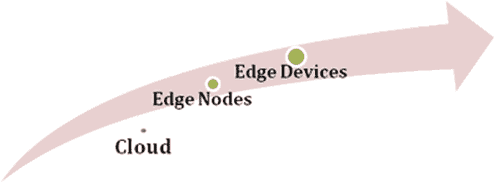
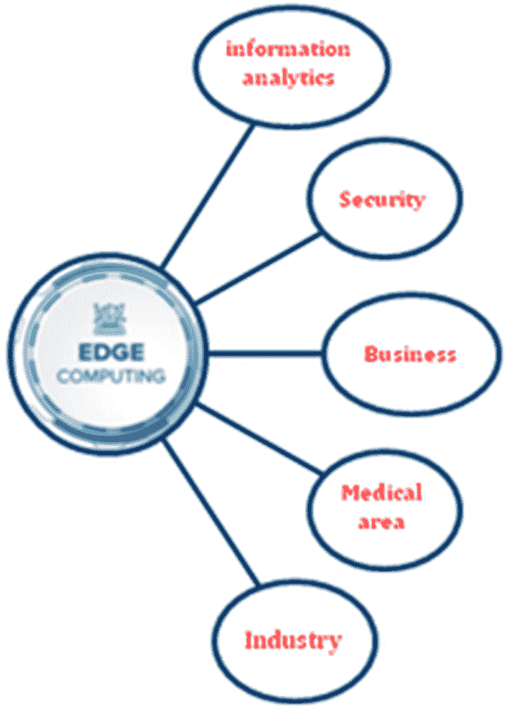
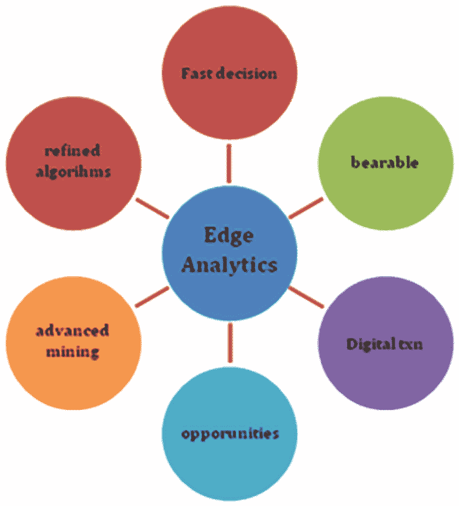
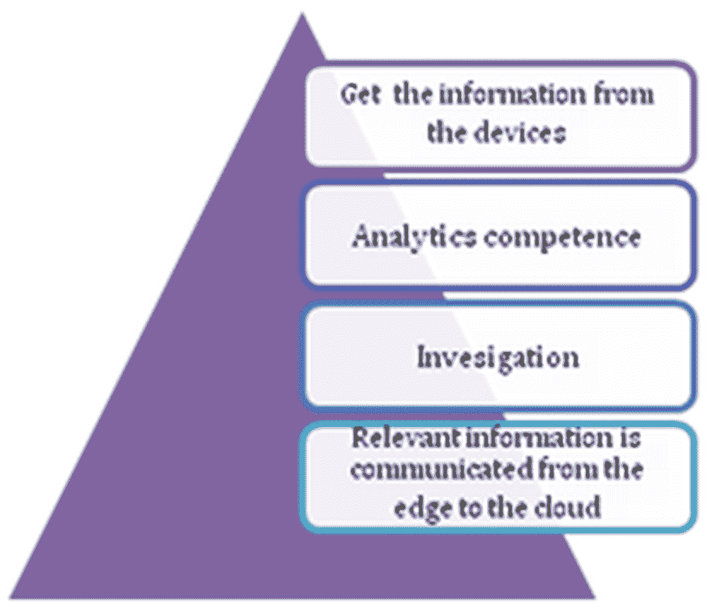
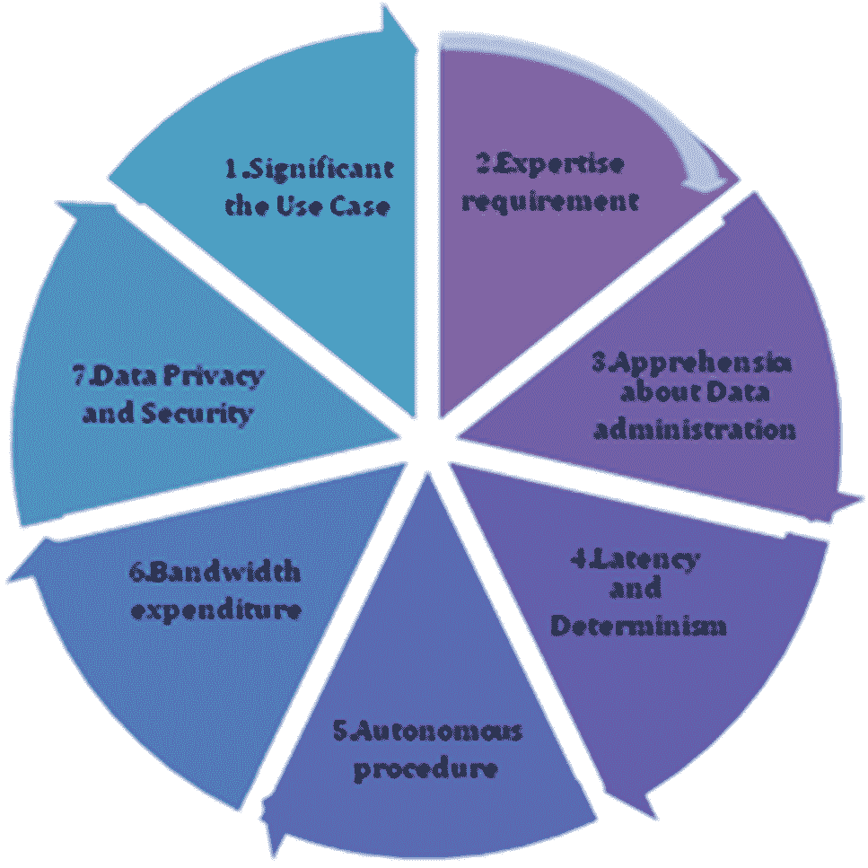
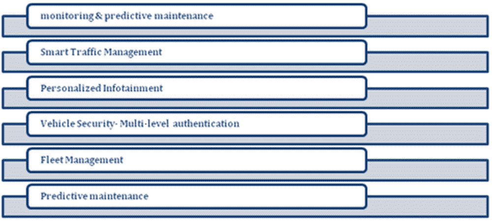
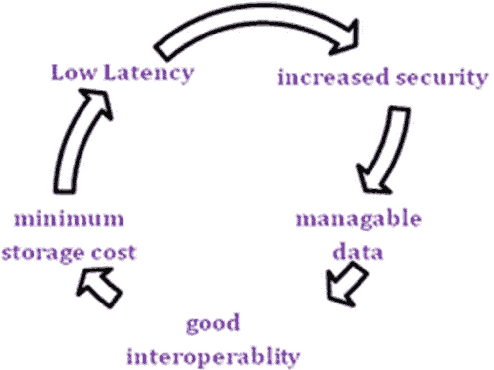
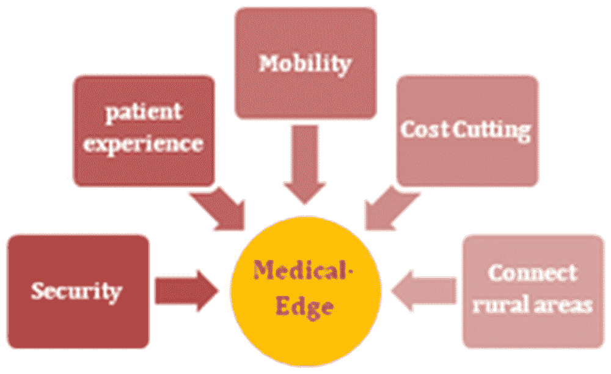

# 第二章

# 对多接入边缘计算前景的洞察

+   Dhaya R.

    

    沙特阿拉伯的哈利德国王大学

+   Kanthavel R.

    沙特阿拉伯的哈利德国王大学

摘要

边缘计算是一种开放的信息技术设计，正在推动移动计算和物联网创新。边缘计算是过程安排，这一安排至关重要，因为它为制造业和企业级组织提供了全新的方式，以最大化运营效率，提高性能和安全性，自动化所有核心业务流程，并确保始终可用。边缘计算的效率取决于对物联网支持设备的智能评估以及我们物联网设备的集群方式。尽管边缘计算在许多应用案例中都能提供令人信服的好处，但该技术还远未成熟。除了传统的网络限制问题外，一些关键考虑因素可能影响边缘计算的采用。本章主要讨论了多接入边缘计算的挑战方面，特别关注网络带宽、分布式计算、延迟、安全性、备份、数据积累、控制和管理以及规模问题。

介绍

边缘计算的能力非常强大。预计到 2025 年，惊人的 75％的企业信息将在“边缘”产生和处理。换句话说，五年后，大多数企业信息可能会绕过云端。边缘计算架构允许它们将服务器放置在世界各地的股票交易所附近，尽可能靠近数据源来运行资源密集型计算。这为它们提供了最精确和最新的数据，以保持业务运转。边缘计算和云计算之间有所不同。边缘计算用于保存时间敏感的数据，而分布式计算用于处理不是基于时间的数据。除了延迟之外，在偏远地区，边缘计算优于云计算，在那里几乎没有或者没有对集中部件的连通性。边缘计算将是物联网的未来解决方案。使用边缘计算有助于增加本地网络的可用带宽，从而可以改善各种服务，例如本地服务器和其他物联网设备，并因此增加单个网络上的最大设备数量（从而允许更多的物联网设备集成）。在边缘计算中，数据是现代企业的灵魂，提供宝贵的业务洞察，并支持对关键业务流程和操作的实时控制。当今的企业被淹没在大量的数据中，大量的数据通常可以从传感器和物联网设备中实时收集，这些设备在世界各地的偏远地区和恶劣工作环境中运行。

然而，这股虚拟数据潮流也改变了企业处理计算的方式。传统的基于集中式数据中心和常规互联网的计算范式并不适用于不断增长的现实数据流。带宽限制、延迟问题和不可预测的网络中断都可能导致此类努力受挫。企业正在通过边缘计算架构来应对这些数据挑战。在最简单的情况下，边缘计算将存储和计算资源的几个部分从中心数据中心移动到数据产生源头附近。与其将原始数据发送到中心数据中心进行处理和分析，不如将这项工作在数据生成的地方进行处理 - 无论是商业地址、工厂车间、广阔的功能区域还是跨越智能城镇。仅将边缘计算工作的结果（如实时业务见解、设备维护预测或更重要的反馈）发送回主要数据中心进行审查和进一步的人类合作（Shi 等，2019 年）。

在惯例的企业计算中，数据是在客户端点生成的，例如客户的个人计算机。该数据通过广域网（如互联网）跨越业务局域网获得，在那里数据由企业设备存储和处理。然后，这些工作的结果被传递回客户端的视角。对于大多数常规行业用途，这仍然是一种经过验证和可靠的客户端服务器计算方法。但是，通过互联网连接的设备数量以及这些设备生成的数据量和企业使用的数据量正迅速增长，以至于传统的数据中心系统已无法满足需求（Hu 等，2015 年）。建议的章节的目标是解释以下内容

+   • 分析旨在提高效率的边缘数据中心的战略考虑。

+   • 描述和评估边缘计算的挑战及可能的解决方案。

+   • 为了更好地理解边缘计算的用例和示例，以实现智能利用。

建议章节的范围

边缘计算的主要优势在于通过边缘计算设备中的物联网处理数据来减少延迟，从而提高网络性能。边缘计算和雾计算一起因相同的原因迅速崛起：物联网数据风暴，特别是在工业物联网中（Symeonides 等人，2019 年）。如果你获得了大量数据，就像当你在端到端方式中利用物联网或者甚至在特定的传感器密集型和因此数据密集型的条件下利用物联网时一样，数据就会在边缘产生，这在物联网中是很自然的，因为你的数据感知和收集设备在边缘。边缘计算将边缘网关或设备的智能、处理能力和通信能力直接推向诸如可编程自动化控制器之类的设备。因此，在多访问环境中解决边缘计算的挑战至关重要，本部分将作为拓展，对边缘计算的效率进行深入研究。

边缘计算的功能是如何的？

使用边缘计算的必要性：大多数企业在集中存储、管理和分析数据，通常是在公共云或私有云环境中。然而，传统基础设施和云计算已不再能够满足许多真实应用的要求。例如，在物联网和物联网的情况下，需要具有高度可用性和最小延迟的网络来实时处理大量数据，在传统的 IT 基础设施上是不可能的。在这种情况下，边缘计算的优势变得更加明显（Ravi 等人，2005 年）。图 1 显示了边缘计算的基础。

| 图 1\. 边缘计算的基础 |
| --- |
|  |

边缘计算设备的作用

边缘计算设备是推动不同企业采用边缘计算的设备。它们用于实现各种任务，具体取决于其被配置的软件应用程序或功能，并在图 2 中描述。

| 图 2\. 边缘计算设备的作用 |
| --- |
|  |

边缘计算还简化了制造车间内的数据分析。在车间包含许多机器和物联网设备的情况下，边缘设备通过分散式系统收集、处理和存储数据。这确保处理是实时进行的，而无需不断访问云或外部数据中心（Satyanarayanan 等人，2009 年）。

边缘计算的分散性质还意味着安全性是每个边缘设备的本地问题。因此，这充当了对抗网络攻击的屏障。在成功入侵发生的情况下，受影响的边缘网络内的信息受到影响，但未转移到企业生态系统内的其他公司。

在服务型行业，如金融和电子商务领域，边缘计算设备也发挥着作用。在这种情况下，智能手机、电脑或平板电脑成为边缘计算设备。利用这些设备，员工可以被派往偏远地区，并向人群提供个性化服务。一个例子是使用平板电脑捕获个人的账户细节，并为他们创建银行账户资料，而无需去银行。在需要时，捕获的数据随后可以传输到银行的企业网络中（Shi et al.，2016）。

在医疗保健领域，边缘计算设备被部署在可穿戴设备和可植入医疗设备上，以帮助患者。在大多数情况下，设备能够处理生物医学信号处理方案，以帮助设备采取特定行动。边缘设备在医疗保健中的整合还增强了向患者提供个性化医疗解决方案的能力。

生物医学行业内的制造商和拥有仓库的服务提供商也可以利用边缘计算设备来优化车间操作。将边缘设备与物料处理工具或特定部件内部集成有助于了解车间流量、库存管理和生产效率。捕获的数据随后可以用于优化仓储并加快订单处理活动（Symeonides et al.，2019）。

边缘计算门户的特点

+   - 边缘计算门户的一个关键目标是实现与传感器和执行器的连接。许多行业协议促进了多种风格的设备通信。边缘解决方案应支持最常见的协议。

    +   • 本地运行应用程序的能力是实现本地数据处理的关键。根据领域的不同，示例应用程序包括分析算法、基于边缘的通知和警报、诊断和监测应用程序，以及在门户上执行的任何其他自定义软件代码（Vakali & Pallis，2003）。

    +   • 除了附近处理外，一个通道应该能够在本地存储信息。这对于使通道能够自主运行至关重要。本地计算和本地存储的结合应该允许通道在隔离模式下运行。

    +   • 安全性应该纳入边缘解决方案中。边缘解决方案应考虑基于权限的访问控制、安全加密通信、证书管理以及与现有安全解决方案的集成。

    +   • 边缘计算入口需要一种远程管理和访问每个单独入口的方法。远程管理功能应允许远程启动、停止、配置和更新入口及其连接的设备。

    +   • 最后，边缘解决方案的软件应该能够适应不同的硬件平台。

边缘计算与云计算与雾计算

边缘计算和雾计算都提供将数据和信息推送到靠近数据起源的当地智能平台的相似功能，无论是在车辆、发动机、扬声器、显示器、传感器还是泵上（Aazam 等，2018）。这两种技术都利用了本地网络内的处理能力来执行可能在云中完成的计算任务（Xu，2014）。它们可以帮助组织减少对基于云的平台进行数据处理和存储的依赖，这通常会导致延迟问题，并且可以更快地做出数据驱动的决策（Jain & Singhal，2016）。

数据处理区域：云计算、雾计算和边缘计算之间的主要区别在于数据处理发生的位置。

+   • 在云计算中，数据存储在远离数据源的中央云服务器上。这发生在云网络中，例如，Amazon E2C 实例。

+   • 边缘计算主要直接在传感器所连接的设备或接近传感器起源的入口设备上进行。

+   • 雾计算将边缘计算工作转移到与局域网设备或局域网相关的处理器上，因此它们可能与执行器和传感器相比更不可用（Bonomi 等，2012）。

+   • 因此，对于边缘计算，数据是在传感器或设备本身上处理而不是转移到其他地方。相反，在雾计算中，数据是在放置在局域网连接中的物联网门户或雾中心节点内进行处理。

边缘计算和内存办公室：分布式计算可以收集比具有有限处理能力的雾计算更多的信息。由于边缘计算在设备或物联网传感器本身上执行，处理能力和容量能力大大降低（Francis & Madhiajagan，2017）。

指导：分布式计算通常适用于数据的长期全面评估。雾和边缘计算更适合于需要实时响应的快速分析。就安全性而言，雾和边缘提供了更多的安全性（Al-Qamash 和 Soliman，2018 年）。

+   • 在雾中，数据分散在节点之间。换句话说，与云计算的集中式架构相比，控制数据是困难的（Alrawais 等，2017 年）。

+   • 在边缘计算中，数据保留在设备本身，相对于其他两种方式更安全。

+   • 因此，在安全性是重要问题的情况下，雾和边缘是理想的选择。

由于在雾计算中数据在节点之间传递，所以在与集中式计算相比，中断时间较短，因为一切都在一个地方处理，如果出了什么问题，它会降低整个系统。即使在雾计算中一个节点崩溃了，其他节点仍然可以正常运行；这使得它成为那些需要零停机时间的使用案例的正确选择（Dolui 和 Datta，2017 年）。表 1 显示了云计算、边缘计算和雾计算的比较

表 1\. 云、边缘和雾计算的区别

|  | 云 | 雾 | 边缘 |
| --- | --- | --- | --- |
| 架构 | 集中式 | 分布式 | 去中心化 |
| 数据处理 | 远离信息源 | 靠近信息源 | 数据处理有限 |
| 计算能力 | 更大 | 更小 | 较低 |
| 分析 | 长期 | 短期 | 中期 |
| 延迟 | 高 | 低 | 低 |
| 连接 | 互联网 | 各种协议和标准 | 连接有限 |
| 安全性 | 较弱 | 最强 | 潜在的 |

边缘分析

边缘分析是一种处理信息收集和验证的方法，其中执行自动化的分析算法，如图 3 所示。边缘分析是在社会或系统的边缘或接近传感器、连接器或其他相关设备的地方对数据进行处理、管理和分析的解决方案。

| 图 3\. 边缘分析 |
| --- |
|  |

边缘分析：利润

+   • 实时动态

+   • 删除不必要的数据

+   • 节省处理和传输时间

+   • 保护已处理的保护，一致的信息发送到云端

+   • 更大的生产范围和预测性支持

+   • 更有效的服务和保障措施

+   • 可用性问题的影响较低

边缘分析的工作流程

边缘分析工具的整体工作流程遵循这个模式：

+   • 边缘的传感器或设备收集数据

+   • 设备内的分析能力赋予了在边缘执行分析的能力

+   • 如果设备需要采取任何行动，则根据分析结果采取行动。

+   • 从边缘到云传递相关数据，因此组织可以通过从大量设备收集的摘要数据来看到全局视图

| 图 4\. 边缘分析的工作流程 |
| --- |
|  |

边缘分析的好处

边缘分析的优势包括：

+   • 由于经验是在信息源处被识别，防止了停滞，因此动态更快，更自主。

+   • 由于中心数据存储和管理的成本较低，因此存储的数据较少

+   • 随着更多数据传送到中央数据仓库，数据传播率较低

+   • 提高了安全性/保护，因为最精细的数据，例如视频片段，不会被存储或传输

边缘分析的缺点

我们已经注意到了两个在组织决定打扰现金分析时要避免的常见陷阱（Shi 等人，2016 年）。

+   • 安全：云环境是为安全而设计的，因为云上的泄漏对行业来说代价高昂。然而，边缘安全也很重要，因为一些边缘设备决定机器的实际行为。泄漏可能导致设备损坏，其他昂贵的机器错误，或至少是虚假信息。

+   • 保存：由于带宽或存储限制，各种边缘分析系统仅通过使用云来共享其输出。然后，企业无法审查导致与云系统共享的分析的原始数据源。因此，他们必须确保数据源是通过最新的分析软件处理的，依赖过时模型可能会导致企业基于错误数据做出决策（Satyanarayanan，2017 年）。

关键挑战

尽管边缘分析可以被视为与传统的集中式大数据分析相反，但它并不是来取代云分析。然而，首先有一些问题需要解决。由于带宽或存储限制，一些边缘分析系统仅将它们的输出与云共享。这将限制企业查看导致与云系统共享的分析的原始数据源。接下来，目前并非所有物联网设备和边缘设备都能存储其数据或进行复杂的处理和分析（Zwolenski＆Weatherill，2014 年）。最后，目前没有边缘设备的监管框架。

边缘分析的重要性

+   • 节省时间：在集成系统中，所有在网络连接设备上收集的数据都以其原始状态发送进行处理，这本质上是缓慢的。无论这些原始数据是有价值的还是不明确的，都会被处理和分析以提取其中的任何价值。使用边缘分析系统的主要目的是在检查之前过滤掉不必要的信息，只有相关信息经过高级系统。所有这些都可以节省处理和上传时间，使得在云端执行的复杂分析阶段更加高效，这是一个巨大的好处。

+   • 减少开支：物联网中的边缘分析缩短了数据存储和管理的成本。它还减少了运营成本，限制了所需带宽，并减少了用于数据分析的资源。所有这些因素结合在一起可以实现巨大的经济节约。在大多数现代物联网中，数据甚至从未被分析过，这导致了大量数据的浪费和改进的丧失（Bangui 等人，2018）。

+   • 保护隐私：边缘分析有助于在敏感或设备捕获秘密信息时保护隐私。这些敏感信息在现场预处理，不会传输到云端进行处理。这一额外步骤意味着只有符合安全性的数据离开设备进行进一步分析，并且在预处理过程中经过匿名化处理。这些敏感内容得以保留，而不会失去复杂云端分析所能提供的好处。

+   • 减少数据分析的延迟：使用边缘分析更有效，可以在损坏的硬件上分析数据并立即关闭，而不是等待将数据发送到中央数据分析环境（Taleb 等人，2017）。

+   • 连接问题：物联网中的边缘分析有助于防止潜在的可用性中断，确保受限或不规则的网络不会干扰应用程序。在偏远地区或使用昂贵技术（如蜂窝网络）时，这非常有用（Shi 等人，2016）。

+   • 减少带宽使用：后端服务器上的工作减少，并且分析能力被部署到远程位置，从原始传输转变为元数据。

表 2. 边缘分析的重要性

| 领域 | 重要性 |
| --- | --- |
| 节省时间 | 在云环境中使用更少的时间 |
| 减少开支 | 减少运营成本，限制所需带宽，减少资源 |
| 保护隐私 | 在复杂的基于云的评估中保护隐私 |
| 减少数据分析的延迟 | 在分析环境中使用数据分析技术以减少延迟 |
| 连接问题 | 在偏远地区保证连接 |
| 减少带宽使用 | -使用最少的带宽具有良好的能力 |

边缘数据中心的战略考虑

传达边缘计算的基础可能对终端用户来说是一种挑战，他们必须调整他们的模型和流程以适应一个更小、更密集的环境，以处理更多的服务和用户数据（Rehman 等，2017 年）。终端用户在使用边缘设计时报告了许多常见的挑战，这在图 5 中有所描述：

| 图 5\. 边缘数据中心战略考虑 |
| --- |
|  |

使用案例的重要性：可能有一个好主意或概念，但定义使用案例会遇到障碍。当 IT、运营技术需求和管理之间存在不一致时，通常会发生这种情况。在这些情况下，重要的是退后一步，审视你的组织的长期战略。此外，一些供应商可以帮助您在这段旅程中。但是，调整基础设施和业务以确保您的策略能够成功是至关重要的。从那里开始，与能够实现愿景的正确人合作至关重要。这将我们带到下一个点。回答三个基本问题有助于您的边缘规划的业务部分（Kim 等，2017 年）。

+   1\. 当前的数据中心结构是什么，每个办公室有哪些应用程序？

+   2\. 谁是需要支持的“终端用户”，他们的具体要求是什么？

+   3\. 潜在的“终端用户”位于何处，每个地理区域有多少人？

专业知识需求：无论组织是否能够定义一个使用案例，他们可能会陷入困境，因为他们不知道如何与能够帮助他们执行愿景的合作伙伴合作。边缘公司在空间、密度、功率、管理、连接性和冗余方面与传统数据中心有许多考虑因素。识别经验丰富的合作伙伴至关重要，而且有越来越多的组织、合作伙伴和数据中心提供商可以帮助解决边缘解决方案（Jain & Mohapatra，2019 年）。

对数据管理的担忧：最终用户应该花更多时间定义数据要求和管理政策。合规性和规范可以纳入边缘架构，但这需要额外的预防措施以确保数据安全和控制。尽管边缘计算尚未有明确定义的标准，但考虑到边缘的位置、边缘的存储系统、数据处理方式以及谁将访问数据是很重要的。软件定义的解决方案允许您与核心数据中心系统集成，并支持强大的数据领域策略，这对于药房、医疗保健和其他受监管组织是必需的（Abbas, 2018）。

延迟和确定性：任何需要几乎实时响应的事情都应该在边缘或接近边缘进行，甚至在机器内部。这包括控制和实时分析应用。任何不需要真正实时响应的事情都有可能被移至外部工厂数据中心或云端（Ai et al., 2018）。云应用的良好示例是用于人工智能应用的数据或用于供应链预订目的的企业资源规划数据。

自主过程：延迟和确定性可能是需要边缘解决方案的一个技术因素。另一个因素是网络（Bastug et al., 2014）。将应用程序集中在一个集中的数据中心或云端可能对 IT 有很大的好处。但是，从工业控制的角度来看，失去对自动化应用的访问可能会产生重大影响。与延迟和确定性一样，结果可能从质量的差异到生产损失，最终可能涉及安全因素，包括人员伤亡（Lopez, 2015）。

带宽消耗：完整的边缘计算流程是控制带宽成本增加的一种方法。通过将数据从工厂传送到边缘位置，通常可以在本地传送数据，并仅将必要的数据传送到云端进行高级分析和长期存储。使用边缘平台作为通向云端的网关或路径使得更容易监控和控制边缘与云端之间的带宽和连接（Roman et al., 2016）。

数据隔离与安全：数据隔离和安全是应该面对的新问题。隐私对许多组织来说是另一个问题，但是，最近个人信息已经成为前沿问题（Shi & Dustdar, 2016）。虽然世界各国实施的数据隐私法律侧重于个人信息，但企业还应考虑其他因素。这些因素包括数据驻留和数据所有权，以及管理数据访问的法律。

边缘计算的用例和模型

边缘计算是组织基础架构中的一项令人兴奋的发展，它才刚刚开始发挥其潜力。

自主车辆：虽然无人驾驶车辆不会很快就接管高速公路，但汽车行业已经投入了数十亿美元来开发这项技术。为了安全运行，这些车辆必须收集和分析与其周围环境、方向和天气条件相关的大量数据，并与道路上的其他车辆进行通信（Salman et al.，2015）。它们还需要将数据发送回制造商，以跟踪使用情况和维护警报，以及与当地城市机构进行交互。边缘计算架构使得自主车辆能够实时地在车辆之间收集、处理和共享数据，几乎没有延迟。结合边缘数据中心网络，这些数据中心位于地理位置上便于收集和中继关键数据的区域，应急响应服务和汽车制造商，边缘设备使得自主车辆能够提供卓越的可靠性，而不会破坏暂时在图 6 中定义的网络系统。

| 图 6\. 自主车辆 – 边缘计算 |
| --- |
|  |

智慧城市：大都市区正在迅速成为大数据收集中心，传感器不断收集交通模式、公用事业使用情况和关键基础设施的数据。虽然这些数据使城市管理者能够比以往更快地响应问题，但所有这些信息在利用之前都必须被收集、存储和分析。边缘计算架构使得处理公用事业和其他公共服务的设备能够在几乎实时地响应变化，如图 7 中清晰定义的。结合不断增长的自主车辆和日益扩大的物联网，智慧城市可以改变人们在都市环境中的生活和服务使用方式（Tong et al.，2016）。由于所有边缘计算用例都依赖于收集数据来执行基本处理任务，未来的城市将能够在事件发生时动态地做出反应。

| 图 7\. 智慧城市 – 边缘计算 |
| --- |
|  |

现代制造业：也许没有哪个行业比制造业更能从物联网设备中获利。通过将数据存储和计算融入现代设备，制造商可以收集数据，从而实现更好的预测性维护和能源效率，使他们能够降低成本和能源消耗，同时保持更好的可靠性和生产时间，如图 8 所示。由不断收集和分析的数据启发的智能制造技术也将帮助企业调整生产速度，以更好地满足消费者需求。边缘计算还可以为带宽低或不存在的企业提供巨大优势。例如，远洋石油钻井平台可以利用边缘计算架构收集、监测和处理各种环境因素的数据，而无需依赖遥远的数据中心基础设施。

| 图 8\. 现代制造业 – 边缘计算 |
| --- |
|  |

金融部门：银行机构正在采用与手机应用相关的边缘计算技术，以更好地为客户提供服务。他们还将类似的原则应用到 ATM 机和自助服务设备上，使其具备收集和处理数据的能力，使其更具响应性，并允许它们提供更广泛的功能集合(Shi et al., 2016)。对于交易量大、涉足对冲基金和其他市场的金融公司来说，甚至交易算法中的一毫秒延迟都可能意味着巨额损失，如图 9 所示。边缘计算架构使他们能够在全球股票交易所附近的数据中心放置服务器，以尽可能接近数据源地运行资源密集型算法。这为他们提供了最准确和最及时的信息，以保持业务的持续运作。

| 图 9\. 金融部门 – 边缘计算 |
| --- |
|  |

医疗服务：医疗行业长期以来一直在努力整合最新的 IT 解决方案；但是，边缘计算为提供患者护理的更多机会提供了激励。随着物联网设备能够传输大量由患者产生的健康数据，医疗保健提供者可能会实时获得关于他们的患者的重要信息，而不是与缓慢和不充分的数据库进行交互。医疗设备本身也可以被制造为在诊断或治疗过程中收集和处理数据，如图 10\. 所示。边缘计算可能会对向难以抵达的农村地区提供医疗保健服务产生重大影响（Bonomi 等，2012 年）。这些地区的患者通常距离最近的医疗保健提供者有数英里之遥，即使医疗保健专业人员在现场评估了他们，他们也可能无法访问关键的医疗记录。通过边缘计算，设备可以实时收集、存储和传递这些信息，甚至可以利用其处理能力建议治疗方案。

| 图 10\. 医疗行业 - 边缘计算 |
| --- |
|  |

扩展现实设备（增强现实）：虽然对许多人来说，计算机生成的现实可能是一个更常见的术语，但扩展现实既更常见，也具有更多的实际应用。与创建虚拟世界不同，AR 在真实环境中叠加了数字元素。可穿戴的 AR 设备，如眼镜和头戴式显示器有时用于产生此效果;但是，大多数用户通过其手机显示屏体验了 AR。AR 背后的技术要求设备实时处理视觉数据并合并预先生成的视觉元素。没有边缘计算架构，此视觉数据将被发送回集中式云服务器，在那里数字元素可以添加后再发送回设备。边缘计算使物联网设备能够即时合成 AR 显示，使用户可以随时随地查看新的 AR 细节，而不必处理繁琐的等待时间。零售连锁店已开始使用 AR 技术为购物体验增加额外的细节。AR 设备可以轻松显示产品信息和促销提醒，给客户提供了在实体店购物而不是使用在线零售商的理由。边缘计算架构对于以最小延迟提供这些服务至关重要。

人工智能虚拟助手：在手机和亚马逊的 Alexa 以及谷歌的助手等人工智能控制的家庭小帮手中，先进的家庭正在成为一个完全集成的实体。随着越来越多的这些设备进入家庭，服务提供者网络将承受更大的压力，因为更多的请求涌入他们的服务器，各种流媒体内容被传送给用户。通过将边缘计算架构纳入其网络，公司可以显著提高性能并减少延迟。与每个人工智能虚拟助手都将处理和数据请求发送到集中服务器不同，它们可以在执行一些计算功能的同时将负载分布在边缘数据中心之间。

结论

本章提出了关于多接入边缘计算挑战的观点，重点阐述了网络带宽、分布式计算、延迟、安全、备份、数据积累、控制和管理以及规模等方面。本章稍后将说明边缘计算的用例和示例。作为一个总结性的评论，可以推断出 MEC 计算是指在网络边缘进行的计算。边缘类似于分布式云，靠近终端用户，提供超低延迟、可靠性和可扩展性。此外，利用当前的网络（如 LTE）和即将到来的网络技术（包括 5G）来为您的网络架构提供新的智能、控制、可靠性、安全性和速度。此外，边缘计算的 5G 架构视图。边缘计算是指在应用程序和通用计算、存储以及与之相关的交换和控制功能之间找到最接近终端用户和/或物联网终端的地方。相信本章的结果将有助于正在进行多接入边缘计算研究的研究人员。

参考文献

14Aazam, M., Zeadally, S., & Harras, K. A. (2018). 雾计算架构、评估和未来研究方向。IEEE 通信杂志，56(5)，46–52。doi:10.1109/MCOM.2018.1700707

25Abbas, N. (2018). 移动边缘计算：一项调查。IEEE IOT J.，5(1)，450–465。

26Ai, Y., Peng, M., & Zhang, K. (2018). 物联网的边缘云计算技术：入门。数字通信网络，4(2)，77–86。doi:10.1016/j.dcan.2017.07.001

11Al-Qamash & Soliman. (2018). 云、雾和边缘计算：软件工程视角。2018 年计算机与应用国际会议（ICCA）。10.1109/COMAPP.2018.8460443

15Alrawais, A., Alhothaily, A., Hu, C., & Cheng, X. (2017). 云雾计算用于物联网：安全和隐私问题。IEEE 互联网计算，21(2)，34–42。doi:10.1109/MIC.2017.37

18Bangui, H., Rakrak, S., Raghay, S., & Buhnova, B. (2018)。走向边缘-物联网的云：最新进展和未来研究方向。Electronics (Basel) , 7(309), 309\. 提前在线出版。doi:10.3390/electronics7110309

32Bastug, E., Bennis, M., & Debbah, M. (2014 年 8 月)。生活在边缘：主动缓存在 5G 无线网络中的作用。IEEE Communications Magazine , 52(8), 82–89\. doi:10.1109/MCOM.2014.6871674

2BonomiF.MilitoR.ZhuJ.AddepalliS. (2012)。雾计算及其在物联网中的作用。Proc. 1st Ed. MCC Workshop Mobile Cloud Comput., 13–16\. 10.1145/2342509.2342513

12Dolui & Datta. (2017)。边缘计算实现的比较：雾计算、云 let 和移动边缘计算。Global Internet of Things Summit (GIoTS). 10.1109/GIOTS.2017.8016213

13FrancisT.MadhiajaganM. (2017)。云执行机制的比较：雾、边缘和克隆云计算。Proc. EECSI, 446-450\. 10.11591/eecsi.v4.1032

3Hu, Y. C., Patel, M., Sabella, D., Sprecher, N., & Young, V. (2015)。移动边缘计算-通往 5G 的关键技术。ETSI, 法国 Sophia Antipolis。

20Jain, A., & Singhal, P. (2016)。雾计算：推动边缘计算的力量。2016 International Conference System Modeling & Advancement in Research Trends (SMART), 294-297\. 10.1109/SYSMART.2016.7894538

24Jain, K., & Mohapatra, S. (2019)。边缘计算的分类：挑战、机遇和数据减少方法。在 Al-Turjman Fields, 边缘计算中。EAI/Springer Innovations in Communication and Computing . Springer。doi:10.1007/978-3-319-99061-3_4

23Kim, Kim, & Park. (2017)。边缘云和基于 LPWAN 的物联网服务的联合网络控制方法。10.1002/cpe.4406

27Lopez, P. G. (2015)。以边缘为中心的计算：愿景与挑战。ACM SIGCOMM Computational Communication Rev. , 45(5), 37–42。

4Ravi, J., Shi, W., & Xu, C.-Z. (2005 年 3 月)。在网络边缘进行个性化电子邮件管理。IEEE Internet Computing , 9(2), 54–60\. doi:10.1109/MIC.2005.44

22Rehman, M. H., Jayaraman, P. P., Malik, S. R., Khan, A. R., & Gaber, M. M. (2017). RedEdge: 移动边缘计算环境中的大数据处理的新型架构。J. Sens. Actuator Network. , 6(3), 17\. doi:10.3390/jsan6030017

28Roman, R., Lopez, J., & Mambo, M. (2016)。安全威胁和挑战的调查与分析。Future Generation Computer Systems , 78, 680–698\. doi:10.1016/j.future.2016.11.009

30SalmanO.ElhajjI.KayssiA.ChehabA. (2015)。边缘计算促进物联网。Proc. IEEE World Forum Internet of Things (WFIOT), 603–608\. 10.1109/WF-IoT.2015.7389122

17Satyanarayanan, M. (2017)。边缘计算的出现。IEEE Computer Society , 50(1), 30–39\. doi:10.1109/MC.2017.9

5Satyanarayanan, M., Bahl, P., Caceres, R., & Davies, N. (2009 年 10 月/12 月)。在移动计算中基于 VM 的云 let 的案例。IEEE Pervasive Computing , 8(4), 14–23\. doi:10.1109/MPRV.2009.82

6Shi, W., Cao, J., Zhang, Q., Li, Y., & Xu, L. (2016 年 10 月)。边缘计算: 视野与挑战。IEEE 物联网杂志，3(5)，637–646。doi:10.1109/JIOT.2016.2579198

29Shi, W., & Dustdar, S. (2016 年 5 月)。边缘计算的承诺。Comput，49(5)，78–81。doi:10.1109/MC.2016.145

1Shi, W., Pallis, G., & Xu, Z. (2019 年 8 月)。边缘计算。IEEE 论文集，107(8)，1474–1481。doi:10.1109/JPROC.2019.2928287

7Symeonides, M., Trihinas, D., Georgiou, Z., Pallis, G., & Dikaiakos, M. (2019 年)。面向物联网和边缘计算的查询驱动型描述性分析。IEEE 云工程国际会议论文集（IC2E），1–11。10.1109/IC2E.2019.00-12

21Taleb, T., Dutta, S., Ksentini, A., Iqbal, M., & Flinck, H. (2017 年)。移动边缘计算在城市智能化中的潜力。IEEE 通信杂志，55(3)，38–43。doi:10.1109/MCOM.2017.1600249CM

31Tong, L., Li, Y., & Gao, W. (2016 年)。移动计算的分层边缘云架构。IEEE 国际计算通信会议论文集（INFOCOM），1–9。10.1109/INFOCOM.2016.7524340

8Vakali, A., & Pallis, G. (2003 年 11 月)。内容交付网络: 现状与趋势。IEEE 互联网计算，7(6)，68–74。doi:10.1109/MIC.2003.1250586

9Xu, Z.-W. (2014 年 1 月)。云海计算系统: 迎接即将到来的千倍性能每瓦特的赛博字节时代。计算科学技术杂志，29(2)，177–181。doi:10.1007/s11390-014-1420-2

10Zwolenski, M., & Weatherill, L. (2014 年)。数字宇宙: 丰富的数据和物联网价值的增加。澳大利亚电信数字经济杂志，2(3)，47。doi:10.7790/ajtde.v2n3.47
