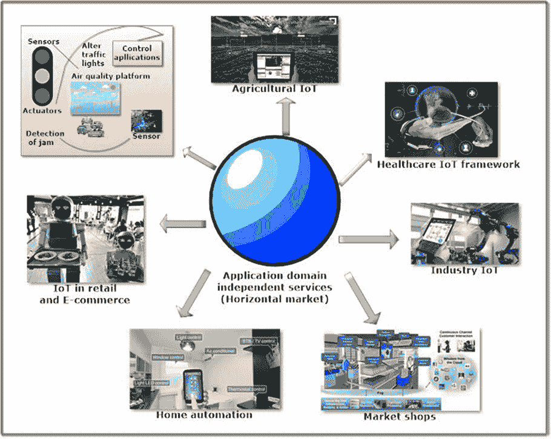

# 第三章

# 利用雾计算驱动的物联网实现环境智能以应对 COVID-19 大流行

+   **Oshin Rawlley**

    印度比尔拉理工学院和科学研究所

+   **Shashank Gupta**

    印度比尔拉理工学院和科学研究所

**摘要**

在这一章中，作者全面介绍了基于雾计算的物联网如何用于防止疫情爆发及其现有的控制系统。作者还解释了诸多边缘计算设备（如传感器/执行器、RFID 系统、网络摄像头、无人机等）如何利用物联网协议如 6LoWPAN 控制这种疾病。此外，作者还强调了物联网安全攻击和现有智能城市基础设施中普遍存在的漏洞。描述了物联网新兴用途的关键方面（如智能零售店自动化、智能交通、智能废物管理等），这些方面在现有的可持续智能城市基础设施中对控制这一流行病起到了关键作用。最后，还讨论了一些未来的研究方向，强调了利用雾计算的物联网和人工智能技术缓解这一大流行病影响的步骤。

**介绍**

数据已经成为生活中不可或缺的一部分。在当今数字化的世界中，技术是不同业务和其他应用的新驱动力。这个信息技术时代已经开始产生大量需要处理的数据。根据国际数据公司（IDC）的报告，截至 2010 年，数字数据几乎已经超过了**Zettabyte**。自 2011 年以来，每天产生 2.5 **Zettabyte**的数据（Yousef 等，2019）。预计到 2020 年，约有 50 亿个连接设备将产生新数据。例如，医疗物联网应用显示，由 3000 万用户产生的数据每秒达到 2.5 万个元组（Sarkar 等，2015）。

云计算是一种高效的计算范例之一，具有高处理能力、计算能力和存储能力（Yousef 等，2019）。所有要处理的数据都发送到集中式云，并进行进一步分析。云计算是一种集中式的计算模型，在这种模型中，所有数据预处理、后处理步骤都在云本身的主要位置完成。但由于设备及其生成的数据的增加，带宽不足以满足延迟需求。带宽因素已经成为云计算的瓶颈（Kharrufa 等，2019）。

本章阐述了不断发展的各种技术范式，如雾计算，以控制现有系统来解决 Covid-19 流行病问题。 “Covid-19 的发端” 部分说明了将雾计算范式与现有模型相结合，以更好地识别和追踪病毒。该章节作为建立雾技术启用的物联网设备概念的知识基础，重新确认了雾计算在 Covid-19 中的相关性以及连接机制的抽象层。

Covid-19 的发端

第一个病例是 2019 年 12 月 8 日在中国武汉被发现患有肺炎症状的。随后，世卫组织在中国报告了许多事件。图 1 突出了冠状病毒的时间线。然后，欧洲出现了疫情的蔓延，并于 2020 年 1 月 7 日宣布了首例病例。突然的升级导致了死亡，中国首次死亡。肺炎影响人们并导致死亡，在世界各地引起了警报，使全球红色警报和国家在 2020 年 3 月宣布全国封锁。即使封锁之后，仍有超过 50,000 人死亡的报道。2020 年是大流行病的纯粹观察者，对这一爆发没有解决方案。到 2021 年 1 月，医学界能够通过在全球范围内推出 Covid-19 疫苗来使用一些药物来对抗该病毒（Rasheed 等人，2020 年）。

| 图 1\. Covid-19 的发端 |
| --- |
|  |

对于疾病的准确识别是一项繁重的任务，利用一些现有技术来解决病例识别问题更是一项艰巨的任务。黑霉病和白霉病的突然爆发进一步加剧了 COVID-19 的流行病情，使其更加严重。确实，需要更大的努力来改善情况。可以通过增强雾计算框架来快速追踪病例，从而加强云计算社区的工作。移动设备可以被制作成雾设备，并在其中安装追踪应用程序。

雾计算启用的物联网的出现

考虑到云计算模型的限制，需要一个能够解决带宽、超低延迟、隐私等地理分散式应用问题的模型是必不可少的。雾计算范式的出现接管了现有的传统模型。为了满足上述问题的需求，提出了雾计算范式。为了满足连接设备需要接近云端的需求，这个模型满足了当下的需求。

图 2 讨论了 Covid 传播级别的阶段。这种疾病的传播开始于一个人感染了更多的人，形成了一个链条，并迅速蔓延到人口中。FC 通过充当云与连接设备之间的中间接口，即物理设备如传感器、执行器等，扩展了其能力（Sarkar 等人，2015 年）。它赋予了云计算的现有模型以自己的特性，表现出处理、网络、存储等能力。这些活动可以沿着数据从物理世界到数字世界的路径进行，即从物联网设备到云端。许多其他类似的模型，如雾计算、云端、边缘计算等，已经出现，以互补彼此并共同解决问题（Chiang 等人，2016 年）。

| 图 2\. Covid 传播级别。 |
| --- |
|  |

该架构帮助设备通过智能地理位置层次结构分析和定位数据（Mahmud 等人，2018 年）。它具有分布式的网络环境层，并与云计算和物联网技术集成。FC 已经无缝地降低了数据传输所需的带宽要求。物联网行业正准备改变零售、医疗保健、汽车行业等许多行业的垂直领域。它是一种分散的计算范例，通过在分散的雾节点中处理数据来进行（Atlam 等人，2018 年）。

Covid-19 中的雾计算的相关性

在 Covid-19 爆发之后，全球几乎每个领域都在数字化自己。人们已经开始转向更加自动化的流程，倾向于基于云的方法，以确保服务的不间断运行。FC 提供所需的安全功能，以在雾网络中启用通信。在即将到来的感知世界时代，几乎所有事物的数字化都将以新的颠覆性技术如人工智能、FC 与物联网、机器学习、区块链等主导着全球的商业。雾计算的强大之处在于为更快的访问、检索、实时数据分析分配计算能力，以供大规模分析和解释 Covid-19。它可能有助于在连接性和可达性较差的地方加快地方地点的运行。由于雾计算可以是具有网络、处理和存储能力的设备集群，因此这些集群可以安装在偏远的地方。

雾计算中的连接机制

雾节点通过蓝牙、4G、Wi-Fi 等无线模式连接，为用户提供独立的计算、存储和网络服务（Yousef 等，2019）。此外，雾节点可以通过互联网与云建立连接，以满足存储和计算资源的丰富需求。应强调的是，雾计算的确定性不应被视为云计算的替代品，而是云计算的扩展。分层架构如下：

物理和虚拟化层：最底层是物理和虚拟化层。它包括能够生成数据并连接到网络的物理设备。它具有网络设备、节点、传感器（物理和虚拟）等。这些节点根据其特性和服务要求进行管理。

监控层：在这一层中，根据节点和任务的功率，监控网络和节点活动。它安排下一个要执行的任务，以及执行任务的时间。在考虑传感器状态时，能量消耗是要确定的主要因素之一。监控节点的能量消耗，以便在超载或其他问题时做出适当的决策。任务卸载是可以采取的措施之一，如果能量消耗过大，就需要在系统中保持平衡。这也是朝着更绿色的计算愿景的方向。

预处理层：数据的管理发生在这一层。进行各种预处理任务，包括数据修剪、标准化数据和过滤，以便对数据进行准确的分析。为了避免不必要的通信，预处理层对此进行检查。

存储层：雾节点中的数据存储由存储层管理。雾节点具有临时存储空间，用于暂时存储数据。这是为了满足仓库中的即时访问和数据的快速处理等计算能力的迫切需求。相反，长时间存储数据可以在云中进行，云中的计算能力可以充分利用。当数据到达云时，雾节点可以解除对相同数据的持有，以避免冗余集。

安全层：有许多情况下数据敏感性是一个主要关注点。像医疗保健和智能健康服务这样的领域产生了包含患者个人和机密信息的数据。在某些情况下，位置设备数据的隐私至关重要。在将数据发送到公共易受攻击的信道之前，提供数据的安全性和隐私性功能。

传输层：当数据准备好离开传输到云端进行处理时，传输层负责。这通过使增强服务更快地实现，从而使核心网络免受额外负担。雾的节点处于云层与物联网节点之间。由于距离底层物理对象较近，雾能够提供感知其上下文的定制服务，实现更精细的供应。结果是具有低延迟的移动节点可以快速流式传输高质量的内容。（Chifor 等人，2018 年）。

| 图 3. 雾计算架构 |
| --- |
|  |

根据对生成数据节点施加的约束以及来自应用程序或云的反馈，雾层可以微调传感器网络、机器、节点与云之间的通信。这确保了对网络资源、云资源（Yousef 等人，2019 年）等所有资源的有效利用。例如，在医疗服务中，雾层根据每个应用服务的需求处理数据。

雾层可以从医疗设备获取原始数据。雾架构的层对原始数据执行预处理任务。这样做可以减少云层的开销，因为它会节省云层处理全部数据负担的时间和空间。之后，处理后的数据传输到云端。随后，雾服务将处理后的数据转换为相关信息。例如，一个医疗保健服务的应用可以在患者血糖水平超过阈值或心跳异常时发出警报。（Farahani 等人，2018 年）。

表 1. 雾相关范例缩写的使用

| MC | 移动计算 |
| --- | --- |
| CC | 云计算 |
| FC | 雾计算 |
| EC | 边缘计算 |
| MCC | 移动云计算 |

表 2. 雾计算相关范例的属性

| 属性 | CC | MC | FC | EC | MCC | Mist |
| --- | --- | --- | --- | --- | --- | --- |
| 运营商 | 云运营商服务 | 自主组织 | 用户和云提供商 | 基于本地的企业和网络基础设施。 | 用户和云提供商 | 基于本地的企业和网络基础设施。 |
| 服务类型 | 全球性 | 本地性 | 较少全球性 | 本地性 | 本地性 | 本地性 |
| 计算资源的可用性 | 存在较高 | 资源有限 | 适度水平 | 适度水平 | 存在较高 | 资源有限 |
| 应用类型 | 充足的计算 | 分散的移动处理 | 具有较少延迟的充足计算能力 | 具有较少延迟的计算 | 充足的计算 | 物联网设备上的分散处理 |
| 可用性 | 丰富 | 较少 | 丰富 | 平均 | 丰富 | 较少 |
| 延迟问题 | 高 | 适度 | 较少 | 较少 | 高 | 适度 |
| 安全性 | 应该在从云到物的连续体上启用 | 应该在每台移动设备上提供 | 在参与节点上启用 | 必须在边缘设备上提供 | 应该在从云到物的连续体上和在移动设备上启用 | 必须在物联网设备上提供 |
| 服务器位置 | 安装在大型专用建筑物中 | ___ | 安装在专用位置或边缘 | 安装在专用位置或边缘 | 安装在大型专用建筑物中 | ___ |
| 互联网连接 | 服务正常运行所必需。 | 低互联网连接可以满足需求 | 在较少的互联网连接下自主运行 | 在较少的互联网连接下自主运行 | 在较少的互联网连接下自主运行 | 低互联网连接可以满足需求 |
| 服务访问 | 通过核心完成 | 通过移动设备完成 | 通过从边缘到核心的连接设备网络完成 | 边缘 | 通过核心完成 | 通过物联网设备完成 |
| 架构 | 分层 / 集中式 | 分布式 | 分层 / 集中式 | 分层 / 集中式 | 集中式云与分布式移动设备 | 分布式 / 本地化 |
| 主要标准化实体 | CSA、DMFT、NIST、OCC、GICTF | MobileInfo | Open-Fog Consortium、IEEE | ___ | NIST | ___ |

主要贡献

我们对基于雾计算的物联网及其 enabling technologies 如何防止 Covid-19 爆发进行了全面回顾。主要贡献如下：

+   • 我们已经展示了 FC 如何在这次 Covid 疫情中帮助数据和网络问题。

+   • 我们介绍了 FC 的分层架构，并且我们还提出了 FC 及其相关计算范式的比较分析。

+   • 描述了像网络、通信、存储和计算技术、隐私和安全保护、资源管理等主要重要能力，以解决实时数据访问和分析的问题，比如在 Covid-19 中，并打破 Covid-19 危机并确保部署。

+   • 驱动 IoT 的雾计算的新兴用例，在缓解和控制这次爆发性流行病中发挥关键作用，也为可持续的智能城市基础设施提供了解释。

+   • 此外，还讨论了一些未来研究方向，详细阐述了使用雾计算 IoT 和 AI 应用程序控制这场前所未有的流行病影响的预防措施。

章节大纲：第二节讨论了智能相关环境中的物联网。第二节描述了物联网协议。为了全面了解雾计算，在第三节我们将看到物联网安全技术。接下来，在第四节中，我们描述了在现实生活中正在出现的应用案例。在第五节中，我们提出了这一领域的未来研究方向。最后，在第六节中总结本章。

| 图 4. 雾计算的技术启用器。 |
| --- |
|  |

COVID-19 中的雾计算物联网基础设施

物联网的演进可以通过许多阶段来描述，如图 5 所示。RFID 的使用启动了物联网，在零售、物流、医疗保健、制药行业等领域越来越受欢迎。在任何物联网系统中，我们有三件事，即传感、处理和通信。为了扩展物联网，我们需要更少的功率来能够在网络上进行通信，通常是在长距离上进行。ZigBee、Bluetooth5、RFID 等是实现这些设备之间通信的重要技术。物联网可以被看作是一个全球建立的连接设备网络，构建了一个感知数字世界。在这个感知网络中，计算以数据处理、网络、设备之间的通信、信息处理技术等形式进行。物联网的一项技术如下所述。

| 图 5.技术演进 |
| --- |
|  |

技术与物联网在抗击 COVID-19 中的关联

RFID 是物联网的主要技术。它允许通过微芯片将识别信息传输到阅读器，通过无线通信。此外，其他技术，如条形码扫描仪、云计算、智能手机和社交网络等，广泛用于支持物联网形成一个广泛的网络。图 6 显示了与物联网相关的技术。我们可以在下一小节中进一步了解 RFID 技术的一些细节。

| 图 6.与缓解 COVID-19 相关的物联网技术 |
| --- |
|  |

RFID 系统

图 7 显示了 RFID 系统的 2 个主要组成部分，即标签读取器和无线电信号跳频器（标签）。标签的结构描述包括芯片和天线。芯片读取对象并存储其唯一标识，而天线允许芯片通过无线电波与标签读取器进行通信。标签读取器生成的无线电频率用于通过从标签反射的无线电波识别对象。RFID 通过无线电波将标签号发送给标签读取器，如下图所示。然后，该编号被传递给一个特定的计算机应用程序，称为 ONS，即对象命名服务。它从数据库中查找标签的详细信息，如制造商名称、制造地点、制造时间等。

物联网市场

与网络连接的实体设备的爆炸式增长以前所未有的速度感知到物联网的精髓。一个重要的例子是 HVAC（暖通空调）和智能家居的恒温器控制和监控系统。物联网还通过在改善生活质量方面发挥作用，在其他领域证明了其价值。这些领域包括交通系统、健康应急响应系统等应用。实体物体被赋予感知、解释和做出决策的能力，通过它们相互通信。它们相互协调以共享信息并做出决策。有区域特定的应用称为垂直市场。而水平市场具有分析服务和普适计算，形成区域独立的服务。物联网垂直市场包括石油工业、农业、零售业、金融业等。像房地产、医院、银行。这是一个所有人都属于同一行业的市场。图 8 显示了特定领域应用（即垂直市场）与域独立服务之间的交互作用。特定领域中的传感器和执行器直接联系。  

| 图 7\. RFID 系统 |
| --- |
|  |

IoT 元素

在世界不断增长的经济中，许多部门将数字化，并可能期待智能系统的认知解决方案。这些系统将被期望注入 IoT 系统需要的独立运行智能。对于类似于人类智能的智能 IoT 系统，有一些基本元素。图 9 展示了代表 IoT 功能的 6 个主要元素。我们列出以下对这些元素的理解。

辨识

此步骤对于辨识物联网对象至关重要。它们的服务与需求同步。uCode（普适代码）和 EPC（电子产品代码）是用于辨识的各种方法。在区分物联网设备的地址时至关重要，这里的对象 ID 地址指的是命名法。例如，温度传感器的温度。对象地址指的是位于通信网络内的位置。还有其他各种寻址方法，如 IPV4、IPV6 等。它确定了在 IPv6 标头上的压缩机制。这导致了使用 IPv6 寻址的低功率无线网络的解决方案。对象地址与其辨识之间应有显著差异，因为辨识方法在全球范围内并不唯一。因此，寻址有助于唯一辨识对象。因此，由对象组成的网络可能使用公共 IP，而不使用私有 IP。我们可以得出结论，辨识方法可以为网络中的每个对象提供清晰的身份标识（Letaief 等人，2019 年，Hu 和 Dhelim，2017 年）。

| 图 8\. 强调垂直市场和水平市场的物联网整体情况图 |
| --- |
|  |
| 图 9\. 物联网元素 |
|  |

服务

物联网服务分为 4 个领域，即：协作感知服务、身份相关服务、普适服务、信息聚合服务。图 10 描述了相同的情况。

| 图 10\. 物联网服务 |
| --- |
|  |

物联网架构

存在多种物联网架构，其中之一是三层架构。我们还对五层物联网架构进行了简要描述。图 11 展示了具有相关设备示例的各层。三层架构包括以下三层：应用层、网络层、感知层

| 图 11\. 物联网的三层架构 |
| --- |
|  |

另一种架构是基本的五层架构，包括对象层、对象抽象层、服务管理层、应用层、业务层（Naha & R. K., Garg, 2018）。可以将其视为上述三层架构的扩展。下文提供了简要阐述。图 12 以图表形式展示了各层的排列。图 13 突显了中间件的整体功能（Hu & Dhelim, 2017, Al-Turjman et al., 2019, Hu & Dhelim, 2017）。

| 图 12\. 五层架构 |
| --- |
|  |
| 图 13\. 中间件 |
|  |

物联网协议

我们提出了 4 种可能构成物联网应用程序的 IoT 协议。这些协议不一定需要共同工作来为抗击 COVID-19 提供物联网应用程序。在后续章节中，我们将详细介绍各类协议及其功能。图 14 显示了分类，后续章节将对其进行详细描述。

| 图 14\. 物联网协议 |
| --- |
|  |

应用层协议

约束应用协议（CoAP）：该协议是一个网络传输协议。它依赖于基于 HTTP 功能的表现状态转移（REST）。CoAP 由 IETF 约束性 REST 环境（CoRE）工作组创建（Kharrufa 等人，2019 年）。物联网的应用程序使用该协议作为应用层协议。REST 具有更简单的通信方式，用于在服务器和客户端之间交换数据的 HTTP 上建立。REST 依赖于无状态的客户端-服务器架构，同时也被视为可缓存的连接协议。社交网络和移动应用程序使用这种架构。它通过使用 HTTP 的方法（如 put、delete、get、post）来消除歧义。REST 不需要 XML 来交换消息。与 REST 不同，默认情况下 CoAP 基于 UDP（Welbourne 等人，2009 年）。

由于 CoAP 不是基于 TCP 的，这一特性使得 CoAP 更适用于物联网应用。物联网有一些要求，如功耗低、鲁棒性强、适用于噪声环境和适用于不稳定的链接（Singh＆Kaur，2020 年）。因此，通过修改 HTTP 的一些操作，CoAP 还能满足物联网的能源要求。图 15 显示了 CoAP 的结构。REST 协议使得微型嵌入式设备具备了能力，如计算量少、低功耗和高效通信。CoAP 有两个子部分：

+   • 通信层

+   • 请求/响应层

使用消息 ID 来检测重复消息。当消息丢失或通信延迟发生时，发送 RST 消息。CoAP 提供了一些在图 16 中列出的关键特性。

| 图 15\. CoAP（约束应用协议） |
| --- |
|  |

消息队列遥测传输（MQTT）：它是一种消息协议，旨在连接嵌入式设备、中间件和应用程序到网络。连接步骤使用不同的映射，如一对一、多对多、一对多。这使得 MQTT 协议成为物联网和 M2M 之间通信的最佳选择。由于 MQTT 基于 TCP 协议，因此对于资源受限的设备而言，它是合适的，因为它使用的带宽较少，并且使用不可靠的链接（Kharrufa 等人，2019 年）。为了维持显著的 QoS 水平，它具有三级 QoS 规范的层次结构。

| 图 16\. CoAP 的特点 |
| --- |
|  |

可扩展消息和出席协议（XMPP）：XMPP 是即时通讯的标准，促进多用途通信、视频聊天、语音通话等。它被开发来支持分布式消息传递机制，一个无垃圾邮件且具有完整安全协议的机制。该协议允许用户通过即时消息相互聊天，而不受使用的操作系统的影响。XMPP 使用 IM 应用程序对消息进行身份验证，建立更好的访问、隐私控制，加强兼容性以及端到端加密等其他协议。文本通信在网络上会产生很大的开销。对这一挑战的解决方法是压缩 XML 数据流（Rabah 等人，2018 年）。

服务发现协议

由于连接设备数量的增加以及对高可扩展性的需求推动了资源管理机制的发展方向。这些机制将能够以有效的方式记录和注册资源及其服务（Kharrufa 等人，2019 年）。在这一类别中最突出的协议是 DNS-SD、DNS-SD 和 mDNS，即 DNS 服务发现、DNS 服务发现和多播 DNS。这些协议具有发现由物联网设备提供的所有服务和资源的能力。

其他具有影响力的协议

除了传统的特性、协议和标准之外，还有其他因素影响物联网应用的运行框架。设备之间的互操作性以及数据和其他操作的安全传输应该被考虑在任何物联网系统被接受之中（Saleem 等人，2019 年）。

| 图 17\. 6LoWPAN 物联网协议 |
| --- |
|  |

物联网安全技术

各种应用领域由物联网系统的发展推动。这些应用根据它们的网络可访问性类型、异构性质、范围、用户参与度、规模和可重复性进行划分（Ni，J. & Zhang，2018）。这个分类中存在许多安全技术，如下表 III 所示。通常，使用的安全技术与它们的应用领域一起列在一起，如：

+   • 授权

+   • 信任建立

+   • 认证

+   • 资源耗尽。

表 3\. 不同物联网安全技术的总结

| 最新技术 | 兴趣领域 | 实施的技术 | 目标 | 优点 | 缺点 |
| --- | --- | --- | --- | --- | --- |
| 2013 | 智能环境 | 使用的平台- 用于实现云的 Aneka | 调查物联网应用的当前趋势。对互相交织的技术的需求 | 系统和存储资源与云（公共、私人）结合使用 | 混合云可能会损害安全性，以及个性化保险库。 |
| 2014 | 应用限制于单一权威 | 基于椭圆曲线密码学的属性基加密（ABE）方案可用 | 减少通信开销和计算复杂性。解决物联网中的隐私和安全问题 | 加密技术（ABE）可用于广播加密和密文访问控制。 | 属性不可访问。可扩展性较低 |

| 2015 | 数据分析，挖掘。 | Shamir 的秘密共享方案的最新版本。 | 提升数据可扩展性降低密码算法中密钥管理的复杂性

增加数据的可靠性特性。 | 成功使用 Shamir 的秘密方案。 | 生成不必要的计算开销时效率低下。当硬件组件之一失效时，鲁棒性受到损害。 |

| 2016 | 健康行业 | 雾计算 | （资源管理和估算）为雾计算客户建立资源估算模型。 | 实现实时数据传输。在边缘设备中引入云技术特性。 | 延迟高。 |
| --- | --- | --- | --- | --- | --- |
| 2015 | 智能能源计量表 | 为了建立安全通道，利用轻量级方案。 | 控制从传感器生成的细粒度信息的隐私。安全通信信息和保护内容的防御 | 传感器数据安全性和隐私的相互依赖受到影响。通过提供具有自适应和增强安全性的端到端服务来鼓励资源消耗较少。 | 对多个安全场景敏感（即可采用 1 个场景） |

架构

还没有被普遍接受的架构。在授权和认证领域，对物联网的不同架构进行了许多研究，将它们暴露在不同的应用领域和多样化的场景中（Hu＆Dhelim，2017）。表 IV 总结了现有物联网架构和应用领域（Pham 等人，2020）。

表 4. 不同物联网安全架构类型和应用领域。

| 应用域 | 最新技术 | 设计 | 目标 |
| --- | --- | --- | --- |
| 智能城市 | Gaur 等人 | 智能城市模型 | 调节通信技术和传感器边缘设备（远程）之间的互动。 |
| Chakrabarty 等人 | 黑色 SDN 模型 | 迎合传统物联网系统中的易受攻击区域。 |
| 智能环境 | Valdivieso | SDN | 消除传统物联网网络中的刚性 |
| 智能电网 | Vucinic 等人 | 对象安全体系结构（OSCAR） | 通过构建可扩展的物联网模型来解决端到端安全性和访问控制问题。 |
| 智能交通 | Ramao 等人 | SOA-面向服务的架构。 | 为物联网中间件引入安全服务。推断要在中间件（物联网）上实施的安全服务结构的分析。 |
| 商业组织 | Vishvakarma 等人 | 概念组织框架（COF） | 制定 2 个物联网架构：5 层模型，3 层云中心架构，自主导向。解决物联网系统中的某些漏洞。 |

对物联网可能受到的威胁和漏洞造成的可能攻击进行讨论

物联网已经渗透到我们生活的方方面面。许多技术，如云计算、RFID、NFC、WSN 等，都已经发展并被物联网网络所利用（Singh & Kaur，2020）。物联网模型的基础是 M2M 功能，其上构建了整个物联网。此外，物联网还适用于健康、零售、智慧城市等其他领域。因此，这些互联设备应该相互交互，并与人类进行通信。通信路径和链接应该高度保护和稳健，以使用户相信系统的可靠性。

+   1\. 硬件威胁

物联网的硬件设备的一些示例包括传感器、RFID 标签、蓝牙和 ZigBee。RFID 标签的主要功能是唯一身份识别和自动识别。它们通过读写器与标签之间的无线通信进行快速信息交换。其他潜在的威胁可能包括欺骗、伪造、DoS、跟踪、否认等。ZigBee 是一种体积小、低功耗的技术。它由微控制器、协议和无线电组成。它价格低廉，功耗低。然而，这些设备的易受攻击性也很高，包括 KillerBee、黑客攻击、Scapy、密钥交换等。蓝牙技术面临窃听、车辆窃听、蓝牙欺骗、蓝牙劫持、DoS 等威胁，因为它允许无线连接两个设备（Goudarzi 等人，2020）。

+   2\. B. 网络威胁

无线和有线通信媒介都容易受到网络威胁和攻击的影响。但是，各个领域的这些物联网部署引发了假的恶意攻击检测、DoS、信息操纵等威胁，这些成本影响了管理的可靠性。SG 也面临着信任问题，例如常规电力设备、物理安全、客户安全等。在健康领域，用户拥有其智能健康卡，其中包含了关于他们的重要和机密信息（Amanullah 等人，2020）。当面临窃取、内部攻击、其他意外侵入和网络攻击等攻击时，患者的安全性和隐私就会受到威胁。下面简要描述了一些攻击：

+   a. DoS：物联网设备通过短暂中断和延迟使打算使用和服务的用户无法访问。其他 DoS 攻击包括碰撞、内部恶意攻击和干扰。

+   b. 窃听：这是一种电子形式的攻击。它可以在有线或无线信道上进行。在这种攻击中，对传输的消息进行持续监听或嗅探消息。

+   c. 设备端点：主动黑客或攻击者可以轻松侵入物联网驱动的智能应用，如交通信号灯操纵、路灯、智能电表、健康卡屏蔽和窃听数据等。在从这些智能对象中提取信息后，它会被利用，并且恶意意图会破坏系统的工作和可靠性（Zhou 等人，2018）。

+   d. 伪造攻击：伪造是指模仿内容或将其伪造为自己所用。诸如照明系统、智能可穿戴设备等设备容易受到这些攻击的影响，因为它们具有轻量级的安全性，并且容易受到威胁。内容被复制或修改以进行进一步的利用，并瘫痪系统。

+   e. 中间人攻击：这些攻击挑战着数据的安全性和隐私性。采用轻量级加密协议等对策来为网络上的安全通信提供安全性。对潜在攻击和漏洞的鸟瞰图及其威胁的解决方案列在表 V 中。

通信

通信意味着在不同的物联网设备和物联网层之间交换信息。任何系统最关键的因素是保护其用户数据并维护其保密性标准，以使系统强大可靠（Lin 等人，2017）。随着物联网中连接设备数量的增加，以及它们所散发的巨大潜力，我们可以感觉到安全性方面的一些不一致性。最终用户对不可靠的服务感到不满，因为他们的数据受到威胁。每个层面都存在一些潜在的威胁，应该加以解决，并列在下表 VI 中。

表 5. 对物联网硬件、网络基础设施和智能应用环境中的威胁和漏洞可能导致的攻击进行分析。

| 物联网硬件 | 规格 | 威胁 | 优势 | 易受攻击 | 入侵 |
| --- | --- | --- | --- | --- | --- |
| RFID | 自动跟踪识别 | 拒绝服务，否认 | 使进步追踪在牲畜、汽车、库存管理中成为可能。 | 损坏，删除，改变。 | 被动攻击-嗅探，窃听 |
| ZigBee | 低功耗，低成本的网状网络，提供较低的延迟通信。 | 数据包操纵 | 低延迟，安全数据连接，无线电，小尺寸 | 黑客 | Scapy，密钥交换，KillerBee。 |
| 蓝牙 | 无线流媒体，频率跳跃频谱。 | 中间人攻击，DoS，窃听 | 低功耗，处理数据和语音。 | 蓝色劫持，蓝色窃听 | Blueborn，蓝牙欺骗 |
| 传感器节点 | WSN 组件，执行器 | 干扰，碰撞，耗尽 | 成本效益高，延迟高，灵活性高。 | 篡改，洪水（Dos 攻击） | 数据完整性攻击，冒充攻击 |
| 网络基础设施 |
| 无线 | 卫星，发射器，接收器，无线电通信 | 数据泄漏，假配置，嗅探，非法访问 | 高可扩展性，移动性，灵活的访问。 | 信号丢失，黑客 | 协议隧道，DoS，中间人攻击，战争拨号。 |
| 有线 | 集线器，路由器，电缆，适配器 | 黑客攻击，操纵 | 更可靠，更安全 | 劫持，信号篡改 | 被动攻击，弱链路。 |
| 智慧城市应用 |
| 智慧城市 | 使用包容技术进行发展，提高安全性和改善流动性与可访问性 | 数据泄漏，隐私泄露，欺骗性通信 | 结构化城市，高效公用事业，电子治理有助于适当监管 | 通过放大攻击传播虚假新闻，阅读 IoT 设备传输私人数据，进行网络动力攻击 | 访问漏洞，通过劫持智能电表进行勒索攻击 |
| 智能电网 | EMS，智能电表 | 用户安全 | 可靠，独立于篡改，成本效益高 | 数据不安全，互操作性问题导致数据丢失。 | 网络攻击 |
| 医疗保健 | 自动化计费，患者监测，完整库存管理等。 | 物理设备过热，基础设施老化 | 保护隐私，提高对患者的响应能力。 | 对数据的黑客攻击，因为有大量可利用的数据。 | 网络攻击，内部攻击。 |
| 智慧交通 | 自动化交通管理，速度监控摄像头，车辆识别（内置面部识别），安全闭路电视。 | 网络攻击，通过被动网络攻击进行跟踪。 | 减少拥堵，节能管理 | 安全妥协 | 网络攻击 |
| 智慧交通 | 自动化交通管理，速度监控摄像头，车辆识别（内置面部识别），安全闭路电视。 | 网络攻击，通过被动网络攻击进行跟踪。 | 减少拥堵，节能管理 | 安全妥协 | 网络攻击 |

表 6\. 每个 IoT 层内的安全威胁摘要

|  |
| --- |

IoT 中的新兴用例

在本节中，我们展示了使用 IoT（Krishnamoorthy 等人，2021）部署雾计算范例的不同场景。这些是实时案例场景，由于 IoT 在生活中的无处不在，这些场景在当今世界中很常见。以下是提供的用例：

+   • 智慧零售店自动化

+   • 智慧废物管理

+   • 智慧水管理

+   • 智慧交通

智慧零售店自动化

在未来即将到来的时代，通过在商店引入物联网自动化活动，客户的零售体验可以得到极大的改变和改善。如图 18 所示，整个购买销售周期都被科技所渗透，采用了雾计算范式来简化时间消耗的活动。借助改进的机器学习方法和系统智能，任何购物都可以实现自动化，支持自动结账、自动扫描、自动支付网关等。此外，许多商场正在推广快速自助购物，顾客可以通过虚拟试穿服装（无需实际触摸）进行选择。只能在虚拟环境下进行选择，所选商品可以直接发送到结账柜台进行结算，避免长队等候（Al-Garadi 等人，2020）。这满足了顾客的利益需求，提升了整体购物体验。这种方式可以调节整个库存管理流程（Krishnamoorthy 等人，2021）。订单可以有效地下达，减少了沟通和人为干预。这种类型的零售体验旨在通过自动化管理降低运营成本，顾客可能会得到对其需求的及时响应。

| 图 18. 智能零售自动化 |
| --- |
|  |

智能废物管理

我们将解释废物管理中传感器的工作原理。在发达城市中，许多办公室都对废物的智能管理感兴趣，如各种制造厂、回收单位、医疗保健单位等。传感器数据用于确保从各个地方优化地收集垃圾。这种方式还可以实施节省燃料的策略，以节约能源和燃料以供进一步使用。此外，回收单位从传感器中提取信息，以监测产生的废物量，并将其送往下一级加工。这有助于更加恰当地优化其他内部流程（Goudarzi 等人，2020）。图 19 显示了系统的流程图。安装在不同对象上的不同传感器的动机是跟踪倾倒到其中的垃圾量。这些传感器还收集其他数据，例如垃圾箱的级别是否维护良好，如果满了，就会触发警报，向中心发送信息以清空垃圾箱。

| 图 19. 智能废物管理 |
| --- |
|  |

智能水管理

水管理在各个方面都非常重要，以便能够有效利用。智能城市具有健全的水管理系统，并制定了适当的计划以保证其顺利运行。智能城市水管理系统的关键要素是环保、成本效益的处理和节能的输送（Raj 等人，2021 年）。这种智能水系统监测城市、地区的整体用水量。通过这种方式，可以对未来有效利用水资源提出预测。例如，图 20 以水资源收集、地下水监测的形式展示了对水的需求。这将依赖于涉及智能计量表、雾网关、短-长程通信、无线传感器、LTE、4G 等通信协议的雾计算模型的支持等。在所有这些步骤之后，预计智能城市水管理系统将制定出一个有效调节水流和减少水损失的可行计划（Lin 等人，2017 年）。

| 图 20. 智能水管理 |
| --- |
|  |

智能交通

有一个可以通过多个传感器感知数据的运输套件可用。这个套件具有像 3G/4G 这样的通信技术，配备了无线传感器（Perera 等人，2017 年）。一款应用程序对从传感器收集的数据进行数据处理。算法被用来分析数据并从中推断信息，进而可以进行进一步的预测。图 21 显示了智能城市的不同方面，包括具有智能交通管理的智能交通系统。

| 图 21. 智能城市与交通 |
| --- |
|  |

启用技术

将物联网的概念实现到这个数字世界中可以通过整合各种启用技术来实现（Al-Fuqaha 等人，2015 年）。在这一部分，我们将详细介绍其中一些。在我们的愿景中，我们试图对相关技术进行广泛调查。我们还阐述了这些技术在物联网系统中的作用。

辨识、感知、通信：像无线通信这样的技术正在以多种方式推动数字经济的发展，其长期愿景是赋予设备识别物体、感知数据和相互通信的能力（Al-Fuqaha 等人，2015 年）。物联网系统的基本组成部分可以是射频识别技术（RFID）。它具有 RFID 标签和读卡器。此外，这些可以通过标识符唯一识别。它们可以应用于动物甚至人类身上。这些读卡器通过启动进程信号使传输通过网络。对于对象的实时监控，可以使用 RFID。它将物理世界与虚拟现实无缝结合。因此，它可以在诸如健康与安全之类的广泛应用中使用。RFID 是被动标签。

雾计算在 Covid-19 中的趋势

+   雾计算市场预计将以 68%的复合年增长率增长。预测期从 2021 年开始，到 2026 年结束。雾计算市场已经开始在数字市场上留下印记。

+   它扩大了云计算的范围，并将其转变为边缘技术，以满足数据的实时分析和加速时限服务。

+   例如，最受关注的公司是 IBM 公司、戴尔、英特尔公司、亚马逊网络服务等。

+   雾节点安装在终端设备的近距离位置，为虚拟和快速的智能处理环境。

+   智能电表已经出现，用于记录电力消耗。

+   北美的雾计算市场已经崛起。开放雾联盟是一个由教育机构和高科技公司组成的网络，其愿景是推动和规范各种容量的雾计算。由于北美地区数据的巨大产生，它已经深入到物联网和 5G 技术中，产生了赫塔字节的数据。

雾计算中的问题

+   雾节点与终端设备的接近给在分布式环境中处理数据和实时流的许多挑战带来了。

+   在多租户环境中执行多个应用程序，管理雾环境中的资源和服务成为一个挑战。

+   在异构环境中同时以所需的速度和质量向多个平台交付内容尚未被探索。

未来研究方向

雾计算是市场上的新潮流，它是一种不断发展的技术，很快就会达到市场采用的标准。它将能够支持低延迟和时间关键的应用程序。许多公司和组织，如开放雾联盟，即 Open Fog，是思科、微软、ARM、英特尔、普林斯顿大学、戴尔等采取的重要举措（Mukherjee 等，2018 年）。2015 年 11 月。一些贡献成员是上海科技大学、日立、富士康、中兴和通用电气。创新数字世界正在加速发展，无线技术如物联网、5G、嵌入式人工智能等的融合提供了具有高互操作性的稳健和及时的架构。

未来展望：雾计算市场具有巨大的业务敏捷性。可以说它将最大程度地利用网络带宽。改进的互连性和机器-机器交互将成为具有最佳运营成本的普遍现象。提高的服务质量将吸引更多的人群和潜在公司利用这项技术进行更好的数据活动。

Covid 情景：FC 将在像 Covid 这样的危机时期提供未来数字化，通过在本地节点实现快速响应、即时数据检索，甚至在本地化集群中进行快速分析，而无需实际到达更高级别的云端（Lalmuanawma 等人，2020 年）。我们可以通过收集分布式设备的数据并进行分析来创建连接体验。这将有助于改善个人体验。我们可以通过拥有远程可控基础设施以及微云计算或雾计算技术来现代化现有的 IT。这将有助于进行实时诊断，实现空中更新。这也将有助于降低运营成本，并促进更快的服务。然而，这种新兴计算范式仍然存在一些未解决的问题。在本节中，我们提出了一些未来研究的问题和挑战。此外，我们尝试查看这项研究的未来方向（Tuli 等人，2020 年）。图 22 描述了 FC 研究的一些相关挑战。我们列出了以下问题：

+   • 部署问题

+   • 平台相关问题

+   • 不同层之间的通信

+   • 安全与隐私

部署问题

OpenFog 在部署上下文中被称为 N 层环境（Kumar 等人，2020 年）。但同时，应该注意到在雾计算层级中引入多个级别会违背这种新范式的初衷，即低延迟（Swapnarekha 等人，2020 年）。这可能会导致在提供服务和响应终端用户方面出现高延迟。因此，根据用例，可以决定涉及的层级数量。与部署相关的决策可以基于雾设备的能力、传感器数量、任务数量、任务类型等因素来制定。然而，有必要确保满足这些要求。在部署过程中，资源和应用的扩展至关重要。

| 图 22. 在雾计算驱动的物联网中应对 Covid-19 的未来研究问题 |
| --- |
|  |

平台相关问题

+   1\. 资源管理

资源来自最多样化的来源。这导致了 FC 范式中不同硬件和制造商的多样性。由于 FC 范式中的这种异构性和动态性资源，可能会出现性能问题。例如，一个依赖于员工团队执行一些常规工作，如发送电子邮件或记录一些工作的系统可以成为雾的一部分，也可以制成雾设备。这样，我们可以得出结论，雾资源是动态的。当雾设备承担的任务结束时，资源管理或预测是必要的，因为状态可能会发生变化，例如可能会释放出来供其他应用使用。雾旨在利用空闲资源。因此，资源分配和管理可能是一项极具挑战性的任务（Gluhak 等人，2011 年）。

+   2\. 故障管理

雾设备的故障概率很高。由于其分布式安排，缺乏适当的管理。由于管理不完全集中化，因此会发生故障。因此，雾设备由于以下原因而失败：

+   a. 硬件问题

+   b. 软件不一致

+   c. 用户活动中的故障

还有一些其他起关键作用的杂项因素：

+   a. 连接

+   b. 电源来源

+   c. 移动性

另外，与有线连接相比，许多无线连接往往不可靠。在雾中，许多设备通过无线方式连接并且处于移动集群中。因此，它们的位置也可能经常变化到一些不同的集群中。另外，另一个关键因素是由于它们使用电池供电，因此电池随时可能失效，这可能再次导致可靠性问题。这些设备的另一个特点是它们由电池供电，可能随时失效。因此，故障管理的复杂性是一个研究问题。

+   3\. 不同层之间的通信

在任何网络中，应鼓励无缝交互、不间断通信和连接。雾计算范式应确保在与设备通信时达到相同的要求，以满足时间关键型应用的需求。对于像监控医疗单位或控制自动驾驶汽车这样的时间敏感型应用，如果连接失败发生，可能会造成严重伤害。即使到云的集中连接失败，中间层应该是可操作的，并且应该提供全时连接。因此，云、物联网设备、雾设备之间的跨层功能和连接是需要处理的细致而关键的因素（Sheth 等人，2020 年）。

+   4\. 安全和隐私

许多方面的雾设备的位置、制造和所有权都不同。这些设备的异构性产生了安全和隐私问题（Goudarzi 等人，2020 年）。这些设备由不同的运营商管理。如果用户的隐私在任何方面受到侵犯，用户将不太愿意采用这种计算模型。因此，在雾计算中，通信的安全性和用户的隐私是一个广泛的研究问题。由于设备是分散的，因此雾设备的管理和监视也应该分布在不同的集群中，以确保所有雾的小网络的快速和并行运行。

物联网抗击新冠疫情

图 23 代表了各种层次-感知、网络、雾和云层。感知层有连接到家庭和医院环境的物联网设备。这些设备连接到网络层中的其他无线设备。这些模型与雾和机器学习-深度学习方法相结合，用于 C-19 症状、隔离监测、追踪接触者和维持个体之间的社交距离。云层有助于预测冠状病毒。在云和雾层进行了技术进步（Bhattacharya 等人，2021 年）。这些技术包括大数据、机器学习、深度学习。它们与物联网结合在一起，更有效地解决 C-19 问题（Lopez 等人，2012 年）。

| 图 23\. 利用物联网（IoT）预防和控制 COVID-19 大流行 |
| --- |
|  |

结论

我们预计 FC 将加速节点之间交换信息的及时响应和意识。在像 COVID-19 大流行这样的紧急情况下，它将有效地管理靠近智能可穿戴设备监测健康的资源，并为本地区域的进一步分析提供处理过的数据。通过在雾节点之间分配负载，带宽问题会减少。患者数据非常敏感，因此雾计算可以轻松监测小型个性化集群。最终，采用雾计算的组织将获得更深入、更快速的洞察力，从而提高业务敏捷性、提高服务水平和改善安全性与无缝通信。对于与这种流行病相关的延迟敏感应用的准确性和精度以及药物和疫苗的发现，需要通过雾计算作为未来工作的一部分来实现，因为这种基础架构平台仅在优化带宽消耗和改善延迟方面发挥作用。

参考文献

Al-Fuqaha, A., Guizani, M., Mohammadi, M., Aledhari, M., & Ayyash, M. (2015). Internet of things: A survey on enabling technologies, protocols, and applications. IEEE Communications Surveys and Tutorials , 17(4), 2347–2376.

Al-Garadi, M. A., Mohamed, A., Al-Ali, A. K., Du, X., Ali, I., & Guizani, M. (2020). A survey of machine and deep learning methods for internet of things (IoT) security. IEEE Communications Surveys and Tutorials , 22(3), 1646–1685.

Al-Turjman, F., & Malekloo, A. (2019). Smart parking in IoT-enabled cities: A survey. Sustainable Cities and Society , 49, 101608.

Almuhammadi, A.（2021 年 3 月）。回顾物联网在沙特阿拉伯管理 COVID-19 中的作用。在 2021 年第 8 届计算可持续全球发展国际会议（INDIACom）中（第 439-444 页）。IEEE。

Amanullah, M. A., Habeeb, R. A. A., Nasaruddin, F. H., Gani, A., Ahmed, E., Nainar, A. S. M., & Imran, M. (2020). Deep learning and big data technologies for IoT security. Computer Communications , 151, 495–517.

An, J., Li, W., Le Gall, F., Kovac, E., Kim, J., Taleb, T., & Song, J. (2019). EiF：面向弹性 IoT 雾框架的 AI 服务。IEEE 通信杂志 , 57(5), 28–33.

Atlam, H. F., Walters, R. J., & Wills, G. B. (2018). 雾计算和物联网：一项回顾。大数据与认知计算, 2(2), 10.

Azimi, I., Anzanpour, A., Rahmani, A. M., Pahikkala, T., Levorato, M., Liljeberg, P., & Dutt, N. (2017). HiCH：用于医疗保健 IoT 的分层雾辅助计算架构。ACM 嵌入式计算系统交易 , 16(5s), 1–20.

Bhattacharya, S., Maddikunta, P. K. R., Pham, Q. V., Gadekallu, T. R., Chowdhary, C. L., Alazab, M., & Piran, M. J. (2021). 新冠病毒（COVID-19）大流行的深度学习和医学图像处理：一项调查。可持续城市与社会 , 65, 102589.

Chiang, M., & Zhang, T. (2016). 雾和 IoT：研究机会概述。IEEE 物联网杂志, 3(6), 854-864.

Chifor, B. C., Bica, I., Patriciu, V. V., & Pop, F. (2018). 智能家居物联网设备的安全授权方案。未来一代计算系统 , 86, 740–749.

Dastjerdi, A. V., Gupta, H., Calheiros, R. N., Ghosh, S. K., & Buyya, R. (2016). 雾计算：原理、架构和应用 。在物联网中（pp. 61–75）。摩根·考夫曼。

Farahani, B., Firouzi, F., Chang, V., Badaroglu, M., Constant, N., & Mankodiya, K. (2018). 朝着雾驱动的 IoT 电子健康：医学和医疗保健 IoT 的承诺与挑战。未来一代计算系统 , 78, 659–676.

Gams, M., Gu, I. Y. H., Härmä, A., Muñoz, A., & Tam, V. (2019). 人工智能和环境智能。环境智能与智能环境杂志 , 11(1), 71–86.

Gluhak, A., Krco, S., Nati, M., Pfisterer, D., Mitton, N., & Razafindralambo, T. (2011). 用于实验物联网研究的设施概况。IEEE 通信杂志 , 49(11), 58–67.

Goudarzi, M., Wu, H., Palaniswami, M., & Buyya, R. (2020). 边缘和雾计算环境中并发 IoT 应用的应用部署技术。IEEE 移动计算交易 , 20(4), 1298–1311.

Hu, P., Dhelim, S., Ning, H., & Qiu, T. (2017). 雾计算综述：架构、关键技术、应用和未解决问题。网络与计算应用杂志 , 98, 27–42.

Kharrufa, H., Al-Kashoash, H. A., & Kemp, A. H. (2019). 基于 RPL 的 IoT 应用中的路由协议：一项综述。IEEE 传感器杂志 , 19(15), 5952–5967.

Krishnamoorthy, S., Dua, A., & Gupta, S. (2021). 未来 IoT 驱动的医疗保健 4.0 技术中新兴技术的作用：一项调查，当前挑战和未来方向。环境智能与人性化计算杂志 , 1–47.

Kumar, A., Sharma, K., Singh, H., Naugriya, S. G., Gill, S. S., & Buyya, R. (2021). 一种基于无人机的网络系统及方法用于抗击新冠病毒疫情（COVID-19）大流行。未来一代计算机系统，115，1–19。

Lalmuanawma, S., Hussain, J., & Chhakchhuak, L. (2020). 机器学习和人工智能在新冠肺炎（SARS-CoV-2）大流行中的应用：一综述。混沌、孤立子和分形，110059。

Letaief, K. B., Chen, W., Shi, Y., Zhang, J., & Zhang, Y. J. A. (2019). 通向 6G 的路线图：AI 助力的无线网络。IEEE 通信杂志，57(8)，84–90。

Lin, J., Yu, W., Zhang, N., Yang, X., Zhang, H., & Zhao, W. (2017). 物联网综述：架构、技术支持、安全和隐私以及应用。IEEE 物联网杂志，4(5)，1125–1142。

López, T. S., Ranasinghe, D. C., Harrison, M., & McFarlane, D. (2012). 为物联网增添意义。个人与普适计算，16(3)，291–308。

Mahmud, R., Kotagiri, R., & Buyya, R. (2018). 雾计算：分类、调查和未来方向。在万物互联中（第 103–130 页）。斯普林格。

Mukherjee, M., Shu, L., & Wang, D. (2018). 雾计算概览：基础、网络应用和研究挑战。IEEE 通信调查与教程，20(3)，1826–1857。

Naha, R. K., Garg, S., Georgakopoulos, D., Jayaraman, P. P., Gao, L., Xiang, Y., & Ranjan, R. (2018). 雾计算：趋势、架构、需求和研究方向的调查。IEEE Access：实用创新，开放解决方案，6，47980–48009。

Ni, J., Zhang, K., Lin, X., & Shen, X. (2017). 为物联网应用保障雾计算的安全性：挑战与解决方案。IEEE 通信调查与教程，20(1)，601–628。

Perera, C., Qin, Y., Estrella, J. C., Reiff-Marganiec, S., & Vasilakos, A. V. (2017). 雾计算用于可持续智慧城市：一项调查。ACM 计算调查，50(3)，1–43。

Pham, Q. V., Nguyen, D. C., Huynh-The, T., Hwang, W. J., & Pathirana, P. N. (2020). 新冠病毒（COVID-19）大流行的人工智能（AI）和大数据：现状调查。学术出版社。

Rabah, K. (2018). AI、物联网、大数据和区块链的融合：一综述。湖区学院杂志，1(1)，1-18。

Raj, M., Gupta, S., Chamola, V., Elhence, A., Garg, T., Atiquzzaman, M., & Niyato, D. (2021). 物联网在采纳和推动农业 4.0 中的作用的调查。网络与计算机应用杂志，103107。

Rasheed, J., Jamil, A., Hameed, A. A., Aftab, U., Aftab, J., Shah, S. A., & Draheim, D. (2020). 支持一线工作人员和决策者应对新冠疫情的人工智能方法的调查。混沌、孤立子和分形，110337。

Saleem, T. J., & Chishti, M. A. (2019). 物联网数据分析的深度学习。Procedia 计算机科学，163，381–390。

Sarkar, S., Chatterjee, S., & Misra, S. (2015). 在物联网背景下评估雾计算的适用性。《IEEE 云计算交易》，6(1)，46–59。

Sharma, M. (2021). 用于协助偏远地区 COVID-19 受害者的无人机技术：机遇和挑战。《医疗系统杂志》，45(9)，1–2。doi:10.1007/s10916-021-01759-y

Sheth, K., Patel, K., Shah, H., Tanwar, S., Gupta, R., & Kumar, N. (2020). 6G 通信网络的 AI 技术分类法。《计算机通信》，161，279–303。

Singh, P., & Kaur, R. (2020). 一种集成的雾计算和人工智能智能健康框架，用于预测和预防 COVID-19。《全球转型》，2，283-292。

Singh, S. K., Rathore, S., & Park, J. H. (2020). Blockiotintelligence：一种具有人工智能的区块链启用的智能物联网架构。《未来一代计算系统》，110，721–743。

Swapnarekha, H., Behera, H. S., Nayak, J., & Naik, B. (2020). 智能计算在 COVID-19 预后中的作用：一篇现状综述。《混沌、孤立子和分形》，138，109947。

Tuli, S., Tuli, S., Tuli, R., & Gill, S. S. (2020). 利用机器学习和云计算预测 COVID-19 大流行的增长和趋势。《物联网》，11，100222。

Welbourne, E., Battle, L., Cole, G., Gould, K., Rector, K., Raymer, S., & Borriello, G. (2009). 使用 RFID 构建物联网：RFID 生态系统的经验。《IEEE 互联网计算》，13(3)，48–55。

Yousef pour, A., Fung, C., Nguyen, T., Kadiyala, K., Jalali, F., Niakanlahiji, A., ... Jue, J. P. (2019). 关于雾计算和相关边缘计算范式的一切：一项完整的调查。《系统架构杂志》，98，289–330。

Zhang, P., Zhou, M., & Fortino, G. (2018). 雾计算中的安全性和信任问题：一项调查。《未来一代计算系统》，88，16–27。

Zhou, W., Jia, Y., Peng, A., Zhang, Y., & Liu, P. (2018). 物联网新特性对安全性和隐私的影响：新威胁、现有解决方案和尚未解决的挑战。《IEEE 物联网杂志》，6(2)，1606–1616。

Zikria, Y. B., Afzal, M. K., Ishmanov, F., Kim, S. W., & Yu, H. (2018). Contiki 物联网操作系统支持的路由协议调查。《未来一代计算系统》，82，200–219。

额外阅读

Ahanger, T. A., Tariq, U., Nusir, M., Aldaej, A., Ullah, I., & Sulman, A. (2021). 一种新颖的物联网-雾-云健康监测和预测 COVID-19 扩散的系统。《超级计算杂志》，1–24。

Dong, Y., & Yao, Y. D. (2021). COVID-19 预防和控制的物联网平台：一项调查。《IEEE 接入：实用创新、开放解决方案》，9，49929–49941。

Garg, L., Chukwu, E., Nasser, N., Chakraborty, C., & Garg, G. (2020). 一种保护匿名性的基于物联网的 COVID-19 和其他传染病接触追踪模型。《IEEE 接入：实用创新、开放解决方案》，8，159402–159414。

Jahmunah, V., Sudarshan, V. K., Oh, S. L., Gururajan, R., Gururajan, R., Zhou, X., & Acharya, U. R. (2021). 未来 COVID‐19 接触追踪和预测的物联网工具：现有技术综述. 成像系统和技术国际期刊 , 31(2), 455–471.

Kumar, K., Kumar, N., & Shah, R. (2020). 物联网在避免 COVID-19 传播中的作用. 智能网络国际期刊 , 1, 32–35\. doi:10.1016/j.ijin.2020.05.002

Kumar, M., Nayar, N., Mehta, G., & Sharma, A. (2021). 物联网在当前 COVID-19 大流行中的应用. IOP 会议系列. 材料科学与工程 , 1022(1), 012063.

Mukherjee, R., Kundu, A., Mukherjee, I., Gupta, D., Tiwari, P., Khanna, A., & Shorfuzzaman, M. (2021). 基于物联网云的 COVID-19 检测医疗模型：一种改进的 k 最近邻分类器方法. 计算 , 1–21.

Pandya, S., Sur, A., & Kotecha, K. (2020). 智能疫情隧道：基于物联网传感器融合的辅助技术用于 COVID-19 消毒. 普适计算和通信国际期刊 .

Rahman, A., Hossain, M. S., Alrajeh, N. A., & Alsolami, F. (2020). 对 COVID-19 深度学习系统在医疗物联网设备中的安全威胁的对抗性示例 . IEEE 物联网杂志.

Siripongdee, K., Pimdee, P., & Tuntiwongwanich, S. (2020). 基于物联网技术的混合式学习模型：COVID-19 大流行时有效吗？ 天才青少年科学教育期刊 , 8(2), 905–917.

Yousif, M., Hewage, C., & Nawaf, L. (2021). COVID-19 期间及其后的物联网技术：综合评述. 未来互联网 , 13(5), 105.

关键术语和定义

人工智能（AI）：它是通过计算机设备建立的计算智能，进一步包括感知和情感。

COVID-19：由 SARS-CoV-2 对人类造成的一种传染性感染。

深度学习：它是机器学习的一部分，基于增强的监督/无监督学习的人工神经网络。

边缘计算：这是一种分布式计算模型，将计算推向了应用层节点，以提高响应时间。

雾计算：它是一个虚拟云，充当物联网设备的物理层和云数据中心之间的中介。

物联网：这是一个不断增长的连接对象网络，它在物理层节点之间提取和传输数据。

机器学习（ML）：这是研究通过获取经验和利用多种数据来提高性能的一些严格技术。

可持续智能城市：部署有物联网传感器/执行器和新兴技术的连接城市基础设施。
