# 第五章

# 一种在物联网网络中构建 SARS-COV-2 监测器的提议方法

+   Maissa Daoud

    突尼斯斯法克斯大学

摘要

自 2020 年以来，考虑到我们所处的情况以及由 covid 引起的死亡病例，全世界的研究人员都参与了捍卫人类免受这一流行病的影响。与所有这些人一样，作者考虑了她无法减少的事情，只能通过这个名为“SARS-COV-2 监测器”的项目在某个环境中指定病例数量，该项目测量主人的体温，并在距离不到一米的人感染时通知他。所提出的 SARS-COV-2 监测器设计包括一个放置所有组件的外壳，一个金属盖用于将热量传导到主要温度传感器中，一个 LCD 屏幕用于显示温度数据，以及一个按钮用于激活温度转换并在 LCD 屏幕上显示它。为了通知佩戴者周围有高温的人，作者集成了一个振动模块。这个小型振动电机非常适合具有触觉反馈的项目。

引言

Covid-19 危机颠覆了我们的医疗系统，并迫使大多数国家重新思考其运作方式。面对健康危机期间饱和的医院和急诊科，远程医疗看到了突如其来的关注和小小的成功（Chakkarwar，& Tamane，2020；Mnaoui，Najoua，& Ouajji，2020）。事实上，在健康危机和封锁措施数月之前，通过远程医疗进行的咨询，即通过视频会议预约医生，仅占医疗咨询的很小比例。尽管远程医疗咨询由医疗保险报销，但患者更愿意前往医生办公室就诊（Chen，2021；Harris，2020）。然而，健康危机彻底改变了这种情况。事实上，封锁措施、社交距离的建议和医院超负荷的情况鼓励法国人越来越多地采取远程咨询，以预防感染风险，更快地定位“有风险”的患者，并避免病毒的更快传播（Crisostomo，Balida，& Gustilo，2020）。连接健康设备，如手表、温度计或血糖仪，不是连接医疗的唯一作用杠杆（Garg，& Dave，2019；Hindrayani，Fakhruddin，Prismahardi Aji，& Safitri，2020）。事实上，一些感染情况更严重的国家实施了额外的技术来帮助卫生服务和患者抗击冠状病毒大流行。例如，作为第一个 Covid-19 集群的武汉市实施了连接机器人来分发药物给感染患者，有助于限制病毒在该地区的传播（Gawade，& Joshi，2020；Hameed，2021；Muladi 等人，2020）。

与医学和健康相关的新技术及其发展可以显着改善患者管理、监测和治疗疾病（Gupta & Johari，2019 年; Khant，& Patel，2021 年; Qjidaa 等，2020 年）。物联网（IOT）是解决同一地点存在的人员之间距离问题的最常用技术之一（Miladinovic，& Schefer-Wenzl，2018 年; Rahim，& Iqbal，2020 年）。

物联网网络用于为物体提供与互联网的连接，以允许信息的反馈。市场上提供了不同的通信协议来实现这一点。它们并非都具有相同的特征。对于涉足物联网的公司来说，选择最适合其用途的通信网络可能变得像拼图一样复杂。他们必须考虑网络覆盖范围、物体的电池寿命、通信距离或服务成本。连接的物体允许实时和按需跟踪和识别工具、设备和药物。能够立即获得有关患者的信息通常是决定性的。物联网应用程序允许用户与他人互动以维护和建立关系。例如，连接的物体可以自动向我们的朋友发送消息，让他们知道我们在做什么和我们在哪里。还有一些物联网系统允许操作员或用户报告故障。如果在机场服务结束时询问用户对服务的满意度是有趣的，那么更有用的是，为了改进服务，允许报告肥皂、纸张不足或气味问题（Saini，2019 年; Saini，Agarwal，Varshney，& Gupta，2018 年; Soumya，Shanmugam，Saini，& Kumar，2020 年; Kumari，& Saini，2021 年）。

它允许连接分布在不同地点的几个现有系统以交换信息和测量结果，或执行命令（Thepade，& Jadhav，2020 年; Yadav，& Vishwakarma，2019 年）。基于现有的连接系统，技术领域的研究人员注意到，连接手表中的传感器可能在第一个 Covid-19 症状报告之前就能潜在地揭示冠状病毒的污染（Thepade，Chaudhari，Dindorkar，& Bang，2020 年）。主要是温度传感器指示温度是否上升足以表明病毒的存在（Varun，& Nagaraj，2021 年; Vishwakarma，Upadhyaya，Kumari，& Mishra，2019 年）。对于提出的手表，我使用了温度传感器来测量佩戴者的体温，GPS 模块来检测目标周围的高温人员，并使用振动器模块来提醒目标附近有高温人员。

在本章中，将详细介绍设计该提出的手表的每个步骤的方法。此外，我将描述上述组件与 arduino 微型卡之间的每个连接以及用于实现该项目的代码和软件。

提出的 SARS-COV-2 手表的描述

提出的 SARS-COV-2（图 1）手表设计包括一个放置所有组件的外壳，一个片上系统，一个金属帽以将热传导到主温度传感器中，一个 LCD 屏幕以显示温度数据和一个按钮以激活温度转换并在 LCD 屏幕上显示。

| 图 1\. SARS-COV-2 手表 |
| --- |
| 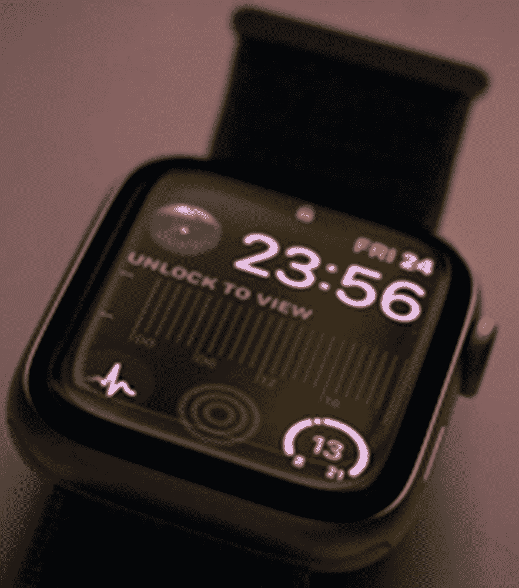 |

系统芯片的选择

在这个项目中，我们使用了 Arduino 板来控制整个系统过程。它是基于 ATmega AVR 微控制器的控制单元（Yamanoor，& Yamanoor，2017；Parthornratt，Burapanonte，& Gunjarueg，2016）。Arduino 是一个开源硬件平台，非常适用于项目开发。市场上有许多类型的 Arduino 板，如 Arduino UNO、arduino mega、arduino pro mini、Lilypad 等。Arduino 微控制器是我选择的这个项目。它在图 2 中展示。

| 图 2\. Arduino 微控制器卡 |
| --- |
| 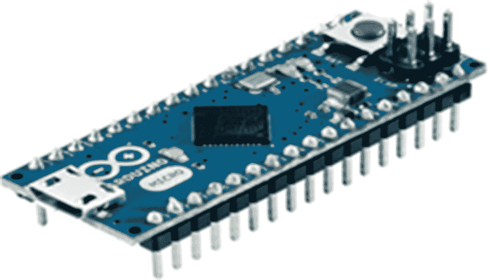 |

具有 1.8 x 4.8 厘米大小的尺寸，Micro 得名不虚，是市场上最小的微控制器之一（图 3）。在另一端，arduino Mega 2560 卡的尺寸约为 10.2 x 5.3 厘米，大约是 Micro 的 6 倍大小。在这两个极端之间的某处，您会找到 Uno 和其尺寸为 6.9 x 5.3 厘米。Micro 的价格通常在 $19-25 之间，而 Uno 的价格在 $20-23 之间，而 Mega 2560 的价格在 $36 到 $39 之间。

| 图 3\. 与现有 Arduino UNO 卡的比较 |
| --- |
| 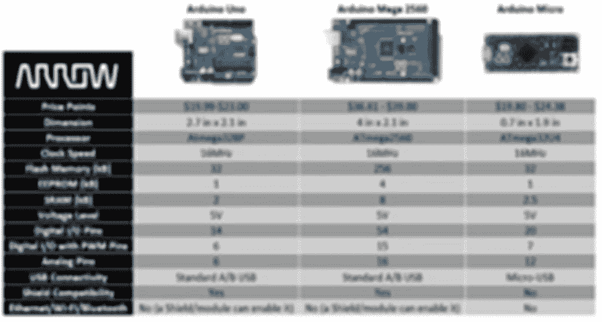 |

LCD 屏幕的选择

提出的手表的触觉显示的作用是显示由 LM35 传感器捕获并由 Arduino 微控制器处理的温度测量，并在检测到佩戴者附近距离小于 1m 的人时显示短语“保持距离！”。图 4 展示了触觉 LCD 屏幕模块。

| 图 4\. 液晶屏模块 |
| --- |
| 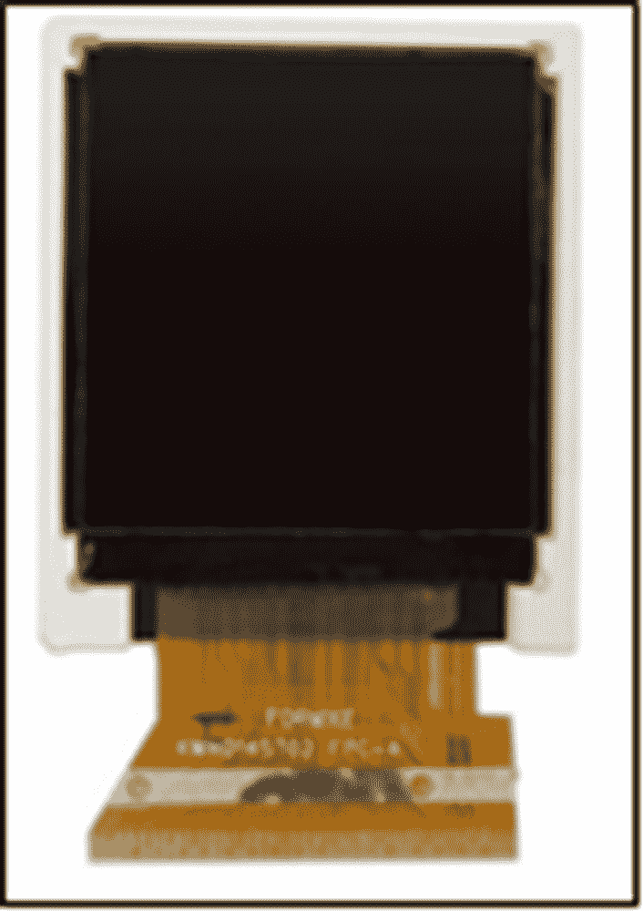 |

要将屏幕连接到 Arduino 板，您必须安装 OLED 屏幕库。首先，我们从安装 Adafruit GFX 库开始，然后是 SSD1306.h 库。LCD 屏幕模块与 Arduino uno 卡的连接如图 5 所示。

| 图 5\. LCD 屏幕模块与 Arduino uno 卡的连接 |
| --- |
| 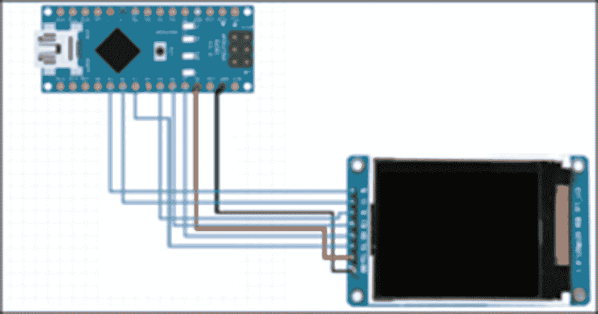 |

选择温度传感器

对于温度检测，我选择了 LM35 传感器。它是一个 3 脚温度传感器，在每 10 毫伏的变化下提供 1 摄氏度。该传感器可以检测到高达 150 摄氏度的温度。LM35 是最简单的温度传感器，可以轻松地与任何微控制器进行接口连接（Nasution，& Harahap，2020; Liu，Ren，Zhang，& Lv，2011）。LM35 传感器数据表摘要显示在图 6 中。

| 图 6\. LM25 温度传感器 |
| --- |
| 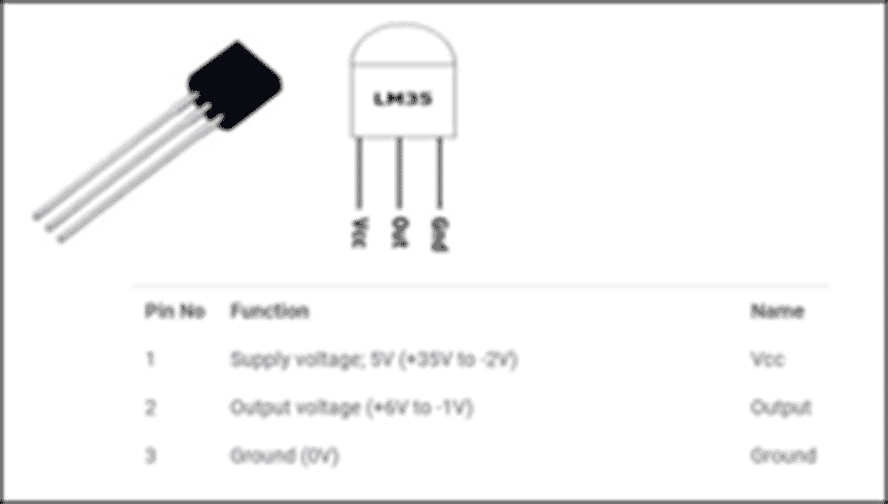 |

一个 LM35 温度传感器用于检测环境温度，其在输出引脚上每变化 10 毫伏产生 1 度的温度。你可以用电压表轻松检查，将 Vcc 连接到引脚 1，地线连接到引脚 3，将输出电压连接到 LM35 传感器的引脚 2。例如，如果 LM35 传感器的输出电压为 250 毫伏，意味着温度约为 25 摄氏度。LM35 温度传感器与 Arduino uno 卡的连接如图 7 所示。

使用 Arduino 和 LM35 温度传感器的数字温度计电路图如图 8 所示。请仔细按照图示进行连接。在这里，16x2 LCD 单元直接连接到 Arduino 以 4 位模式。LCD 的数据引脚，即 RS、EN、D4、D5、D6、D7，连接到 Arduino 数字引脚 7、6、5、4、3、2。一个 LM35 温度传感器连接到 Arduino 模拟引脚 A0，其在输出引脚每变化 10 毫伏时产生 1 摄氏度的温度。

| 图 7\. LM35 温度传感器与 Arduino uno 卡的连接 |
| --- |
| 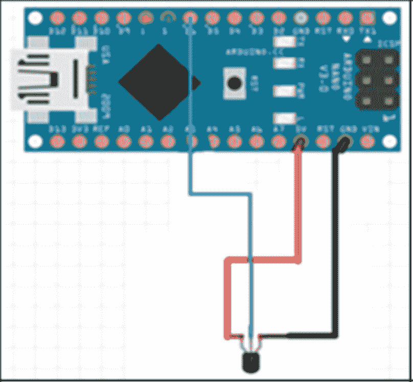 |
| 图 8\. LM35 温度传感器和 LCD 屏幕模块与 Arduino uno 卡的连接 |
|  |

LM35 Arduino 代码和解释

首先，我们包含 LCD 单元的库，然后我们定义 LCD 和温度传感器的数据和控制引脚，如图 9 所示。

| 图 9\. LCD 模块库和主要代码中温度传感器引脚的声明 |
| --- |
| 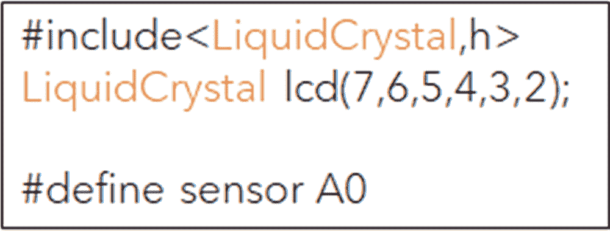 |

在模拟引脚上获取模拟值后，我们使用模拟读取函数读取此值，并将此值存储在一个变量中。然后转换温度值。在本例中，使用个性化字符的方法创建度符号，如图 10 所示。

| 图 10\. 个性化字符的方法 |
| --- |
| 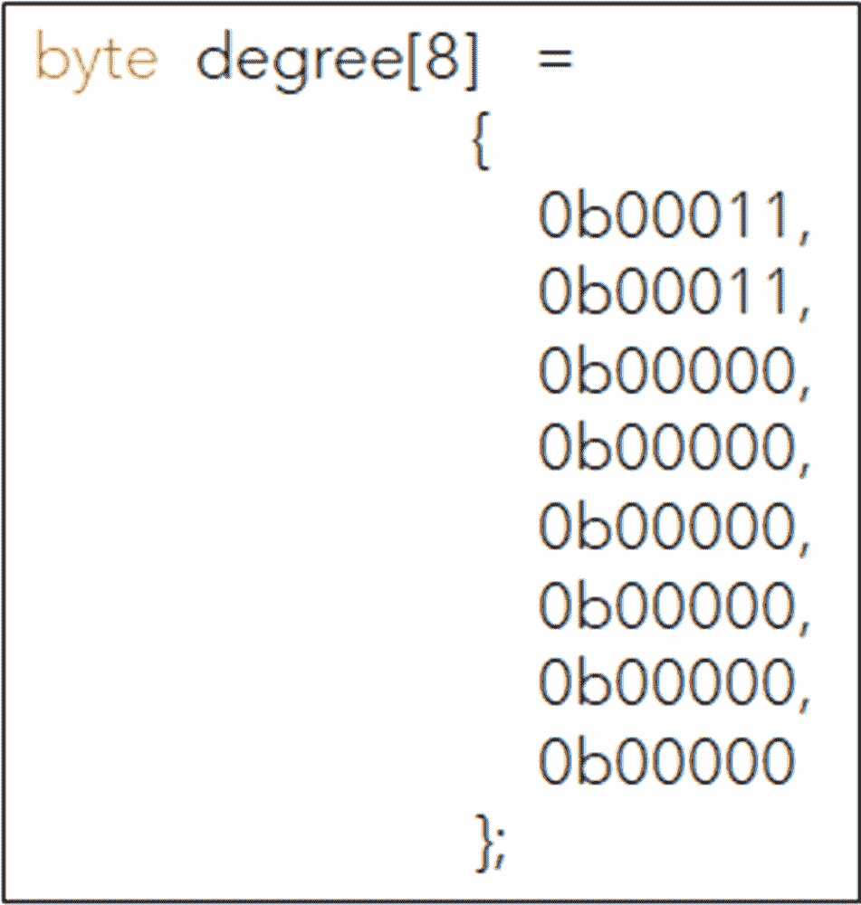 |

温度传感器和 OLED 屏幕与 Arduino 板的连接代码如下图所示。

| 图 11\. LCD 模块和温度传感器连接的主要代码 |
| --- |
| 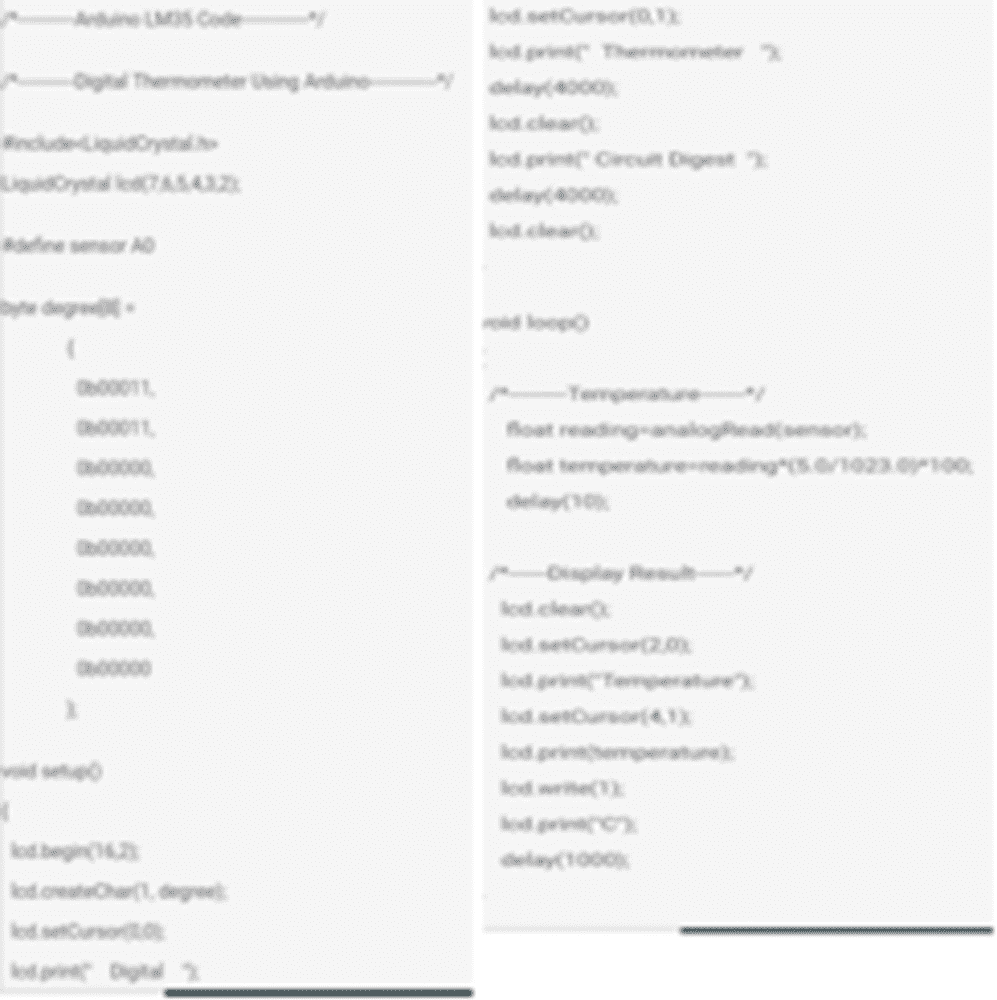 |

人体检测系统

为了检测手表佩戴者周围的其他人，我选择了 Nano GPS 2 Click 模块。它是带有集成贴片天线的最小 GPS 模块。这是世界上最小的多星座天线模块，在许多应用中具有高性能。Nano GPS 模块显示在图 12 中。

| 图 12\. Nano GPS 模块 |
| --- |
| 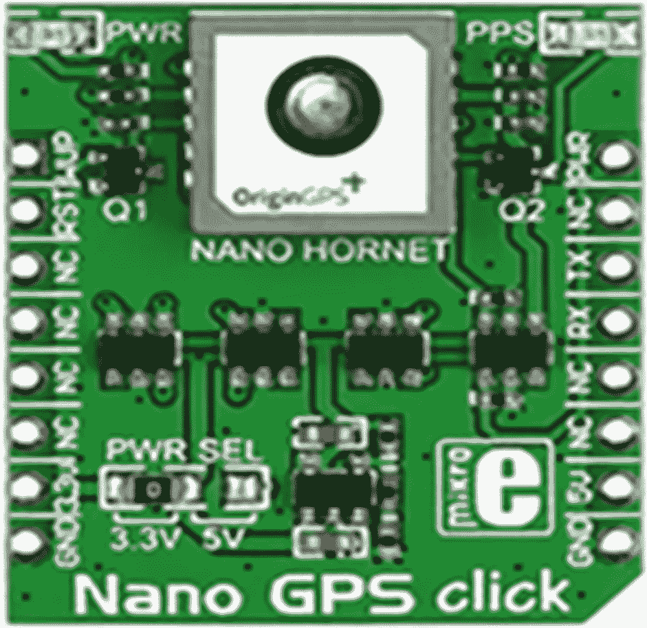 |

尽管体积小，Nano GPS 2 Click 提供了卓越的灵敏度和异常性能，首次校正时间（TTFF）不到 1 秒，高精度低于 2.5 米，跟踪灵敏度高达 -165 dBm。Nano GPS 模块与 Arduino uno 卡连接的概览如图 13 所示。

| 图 13\. Nano GPS 模块与 Arduino uno 卡连接概览 |
| --- |
| 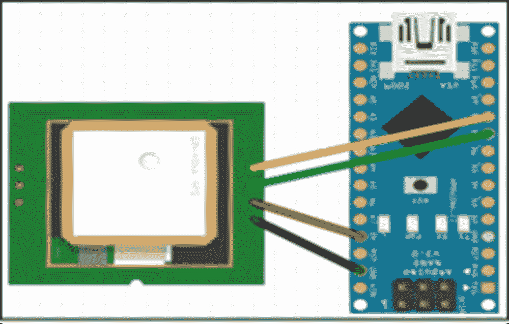 |

为了通知手表佩戴者，他周围有人距离不到一米，我集成了一个振动模块。这个小型振动马达非常适合带有触觉反馈的项目。完全封装在金属盘中，使用和搭载都很容易。两个楔形件允许供电和管理振动的功率（蓝色为负极，红色为正极）。它的工作电压为 2V 至 5V，电压越高，振动越强。如果你想降低电流以直接驱动它，可以串联一个 100 欧姆到 1 千欧姆的电阻，但最好使用一个晶体管。振动模块显示在图 14 中。

| 图 14\. 振动模块 |
| --- |
| 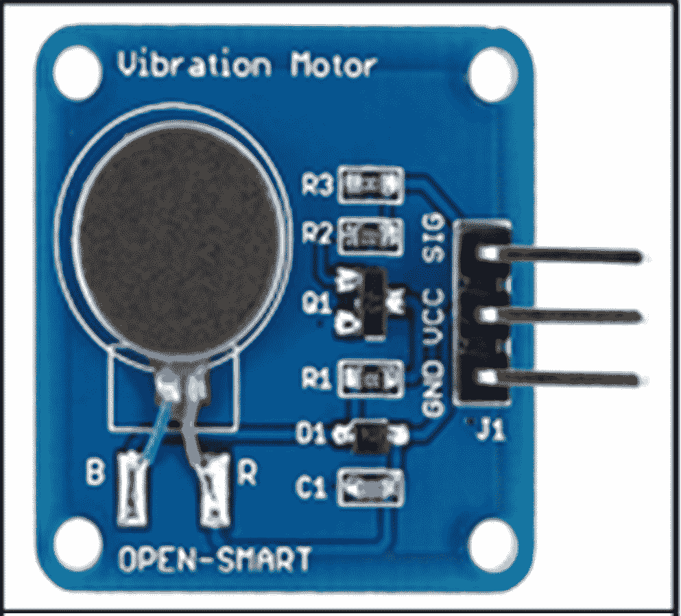 |

要实现振动模块与 Arduino 板的连接；将振动模块的 VCC 引脚连接到 3.3V 引脚，将振动模块的 SIG 引脚连接到 D6 引脚，将振动模块的地引脚连接到 Arduino-Micro 板的地引脚。振动模块与 Arduino uno 卡的真实连接如图 15 所示。

| 图 15\. 振动模块与 Arduino uno 卡的连接 |
| --- |
| 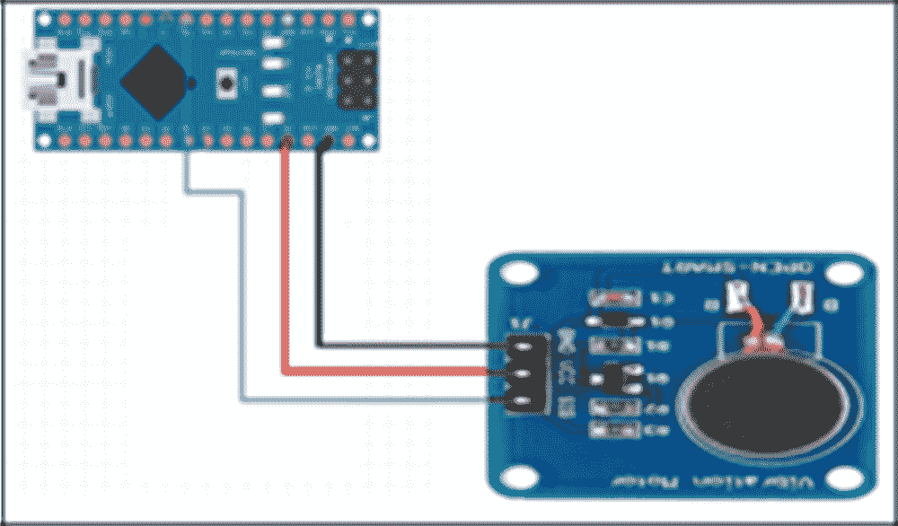 |

在将两个模块 GPS 和振动器与 Arduino 板连接后，有必要测试它们的性能，为此，我们应上传以下代码（图 16）到 Arduino 板。

| 图 16\. 振动模块、Nano GPS 模块和 Arduino uno 卡之间的主要连接代码 |
| --- |
| 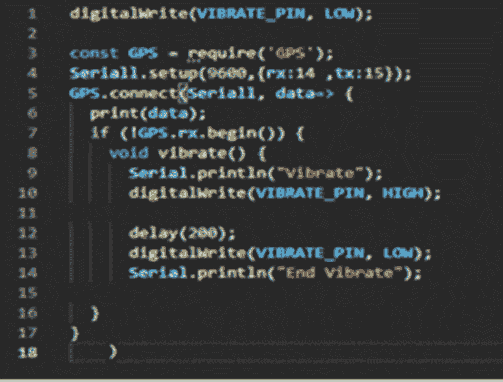 |

测量显示

所提出的手表始终显示由 LM35 传感器测量的温度测量值以及由 Nano GPS 模块测量的佩戴者与其附近另一人之间的距离。如果所提手表佩戴者与其附近人员的距离小于 1m，则手表的显示将显示“保持距离！”如图 17 所示。否则，将不显示任何内容（图 18）。

| 图 18. 当距离大于 1m 时的显示测量值。 |
| --- |
| 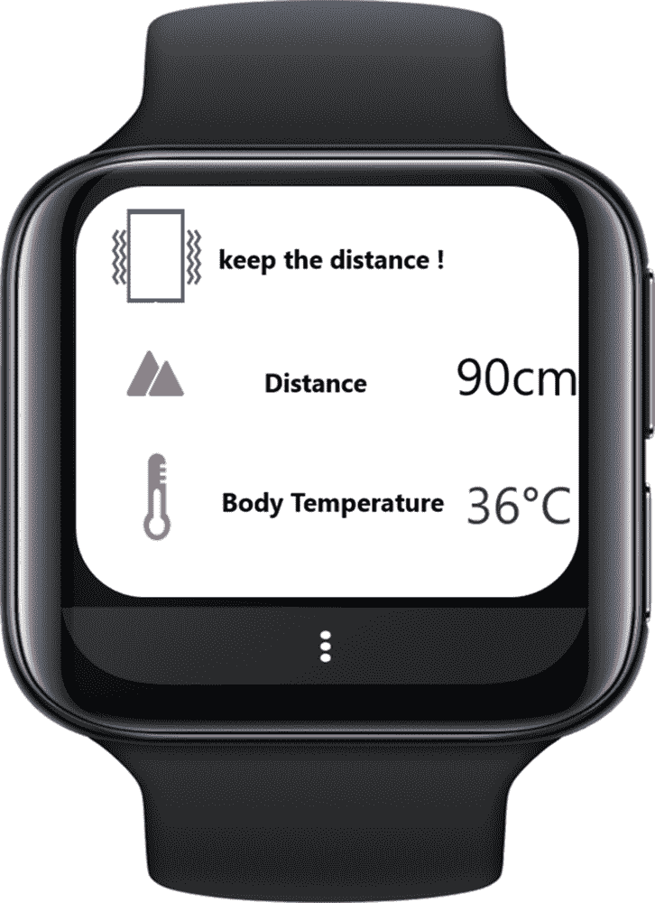 |
| 图 17. 距离小于 1m 时的显示测量值，距离大于 1m。 |
| 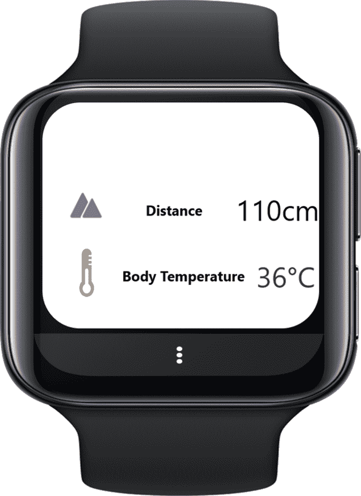 |

结论

本章提出了一种实现 SARS-COV-2 手表的方法。这款手表能够即时测量手表所有者的体温以及其附近人的位置。它通过触摸屏模块显示测得的温度和与附近人的距离。如果测得的距离小于一米，则手表会震动并显示“保持距离！”。

未来的研究方向

作为展望，我们可以为所提手表添加几个选项，例如测量心跳和血氧，如果手表的佩戴者是 COVID 患者。如果佩戴者处于严重情况，如头晕或极度疲劳，我们还可以添加“请求帮助”选项。

参考文献

ChakkarwarV.TamaneS. (2020). 使用主题建模对 COVID19 大流行期间的社交媒体分析。IEEE 智能设计、环境、管理、规划和计算国际会议（ICSIDEMPC），279-282。10.1109/ICSIDEMPC49020.2020.9299617

ChenD. (2021). COVID19 期间全面准确的在线教育模式。IEEE/WIC/ACM 国际网络智能与智能代理技术联合会议（WI-IAT），713-717。10.1109/WIIAT50758.2020.00109

CrisostomoA. S. I.BalidaD. A. R.GustiloR. C. (2020). COVID19 大流行期间高等教育教师和学生在线学习档案的 K 均值聚类。IEEE 人形机器人、纳米技术、信息技术、通信与控制、环境和管理国际会议（HNICEM），1-5。10.1109/HNICEM51456.2020.9400036

GargH.DaveM. (2019). 通过 REST API 和中间件保护物联网设备并安全连接数据。物联网：智能创新和使用国际会议（IoT-SIU），1-6。10.1109/IoT-SIU.2019.8777334

GawadeP.JoshiP. S. (2020). 使用机器学习对 COVID19 大流行期间的人格化和安全进行研究。IEEE 国际电子、通信和航空技术会议（ICECA），1582-1587。10.1109/ICECA49313.2020.9297555

GuptaA. K.JohariR. (2019). 基于物联网的电气设备监控与控制系统. IEEE 物联网：智能创新与应用国际会议 (IoT-SIU), 1-5\. DOI: [10.1109/IoT-SIU.2019.8777342](https://doi.org/10.1109/IoT-SIU.2019.8777342)

HameedK. (2021). 设计人类辅助原型机器人的方法，为医院提供快速和卫生安全的环境，以应对 COVID19 战斗中的临床专业人员，IEEE 国际物联网、电子与机电工程会议 (IEMTRONICS), 1-7\. DOI: [10.1109/IEMTRONICS52119.2021.9422658](https://doi.org/10.1109/IEMTRONICS52119.2021.9422658)

HarrisR. M. (2020). 数据仓库和决策支持系统在 COVID19 健康大流行期间服务恢复中的有效性展示. IEEE 国际开源系统与技术会议 (ICOSST), 1-5\. DOI: [10.1109/ICOSST51357.2020.9333019](https://doi.org/10.1109/ICOSST51357.2020.9333019)

Hindrayani, K. M., Fahrudin, T. M., Prismahardi Aji, R., & Safitri, E. M. (2020). 决策树回归预测包括 Covid19 时代的印度尼西亚股价. IEEE 信息技术与智能系统研讨会 (ISRITI), 344-347\. DOI: [10.1109/ISRITI51436.2020.9315484](https://doi.org/10.1109/ISRITI51436.2020.9315484)

KhantS.PatelA. (2021). COVID19 远程工程教育：以实际视角学习嵌入式系统. IEEE 创新技术与管理国际会议 (ICIPTM), 15-19\. DOI: [10.1109/ICIPTM52218.2021.9388360](https://doi.org/10.1109/ICIPTM52218.2021.9388360)

Kumari, R., & Saini, K. (2021). 先进汽车制造：工业 4.0\. 第 15 届 INDIACom, 899-904\. DOI: [10.1109/INDIACom51348.2021.00161](https://doi.org/10.1109/INDIACom51348.2021.00161)

Liu, C., Ren, W., Zhang, B., & Lv, C. (2011). LM35 温度传感器测量土壤温度的应用. IEEE 国际电子与机械工程及信息技术会议论文集, 1825-1828\. DOI: [10.1109/EMEIT.2011.6023459](https://doi.org/10.1109/EMEIT.2011.6023459)

Miladinovic, I., & Schefer-Wenzl, S. (2018). 用于手术室环境的 NFV 启用的物联网架构. IEEE 互联网物联网世界论坛 (WF-IoT), 98-102\. DOI: [10.1109/WF-IoT.2018.8355128](https://doi.org/10.1109/WF-IoT.2018.8355128)

MnaouiY.NajouaA.OuajjiH. (2020). 在北非分析 COVID19 危机：使用健康指标. IEEE 电子、控制、优化与计算机科学国际会议 (ICECOCS), 1-5\. DOI: [10.1109/ICECOCS50124.2020.9314612](https://doi.org/10.1109/ICECOCS50124.2020.9314612)

Muladi. (2020). COVID19 大流行期间人员监测系统的开发，使用移动应用程序和实时数据库. IEEE 信息技术与智能系统研讨会 (ISRITI), 371-376\. DOI: [10.1109/ISRITI51436.2020.9315377](https://doi.org/10.1109/ISRITI51436.2020.9315377)

NasutionT. H.HarahapL. A. (2020). 使用简单线性回归分析预测 LM35 温度传感器读数的百分比误差. IEEE 电气、通信和计算机工程国际会议 (ELTICOM), 242-245\. DOI: [10.1109/ELTICOM50775.2020.9230472](https://doi.org/10.1109/ELTICOM50775.2020.9230472)

ParthornrattT.BurapanonteN.GunjaruegW. (2016). 使用树莓派的人员识别和计数系统（AU-PiCC：树莓派顾客计数）。IEEE 国际电子、信息和通信会议（ICEIC），1-5。10.1109/ELINFOCOM.2016.7563020

QjidaaM. (2020). 通过深度学习转移模型对孤立农村地区人群的 COVID19 进行早期检测。智能系统和计算机视觉国际会议（ISCV），1-5。10.1109/ISCV49265.2020.9204099

Rahim, Z. A., & Iqbal, M. S. (2020). 马来西亚大学角色支持 COVID19 大流行期间的前线工作人员。辅助和康复技术国际会议（iCareTech），5-9。10.1109/iCareTech49914.2020.00013

Saini, K. (2019). 边缘云框架的最新进展和未来研究方向。工程与先进技术国际期刊，9(2)，439–444。提前在线发表。doi:10.35940/ijeat.B3090.129219

SainiK.AgarwalV.VarshneyA.GuptaA. (2018). 用于混合云服务的数据安全的端对端加密：一种新方法。计算、通信、控制和网络国际会议（ICACCCN），340-347。10.1109/ICACCCN.2018.8748782

SoumyaR. J.ShanmugamR.SainiK.KumarS. (2020). 云计算工具：内部视角和分析。智能可持续智能计算与应用国际会议，382-391。

ThepadeS. D.ChaudhariP. R.DindorkarM. R.BangS. V. (2020). 使用胸部 X 光图像的亮度色度直方图的机器学习分类器进行 Covid19 识别。IEEE 孟买分部签名会议（IBSSC），36-41。10.1109/IBSSC51096.2020.9332160

ThepadeS. D.JadhavK. (2020). 使用各种机器学习分类器和局部二进制模式从胸部 X 射线图像中识别 Covid19。IEEE 孟买分部签名会议（IBSSC），46-51。10.1109/IBSSC51096.2020.9332158

VarunS. S.NagarajR. (2021). Covid19 跟踪算法及相关患者监测系统的概念化。电子与信息技术趋势国际会议（ICOEI），1549-1553。10.1109/ICOEI51242.2021.9452910

VishwakarmaS. K.UpadhyayaP.KumariB.MishraA. K. (2019). 使用物联网的智能能源高效家庭自动化系统。IEEE 物联网：智能创新和使用国际会议（IoT-SIU），1-4。10.1109/IoT-SIU.2019.8777607

YadavP.VishwakarmaS. (2019). 物联网和大数据在智能城市中的应用。IEEE 物联网：智能创新和使用国际会议（IoT-SIU），1-5。10.1109/IoT-SIU.2018.8519920

YamanoorN. S.YamanoorS. (2017). 高质量、低成本的树莓派教育。IEEE 全球人道主义技术大会（GHTC），1-5。10.1109/GHTC.2017.8239274
