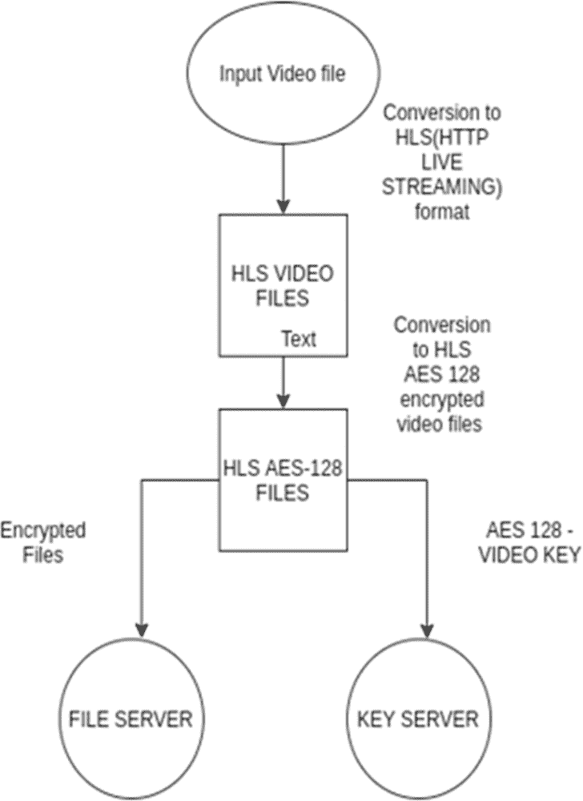
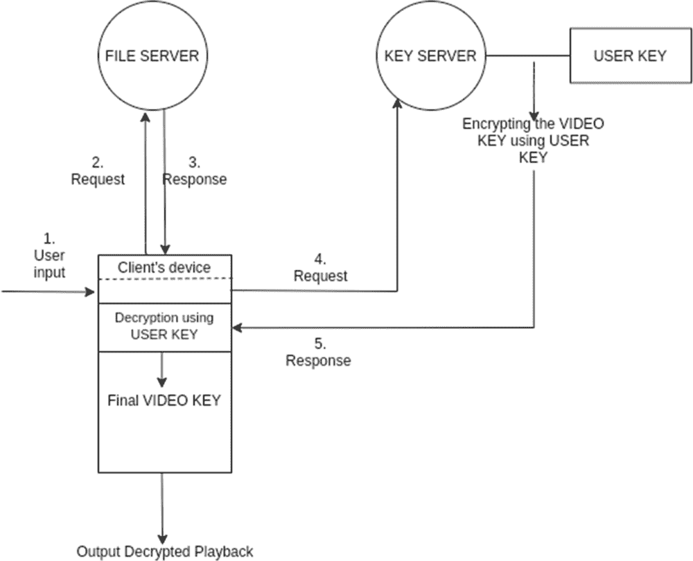
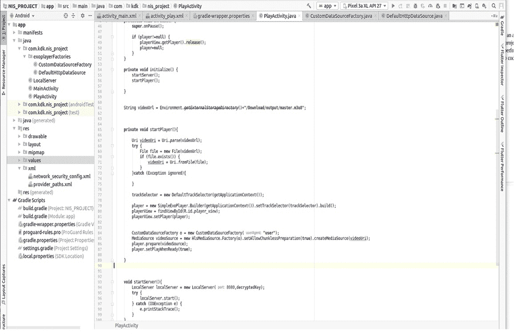
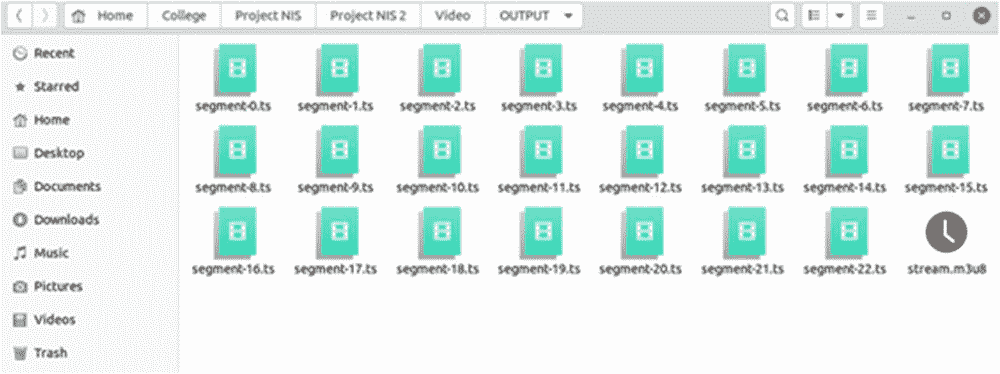
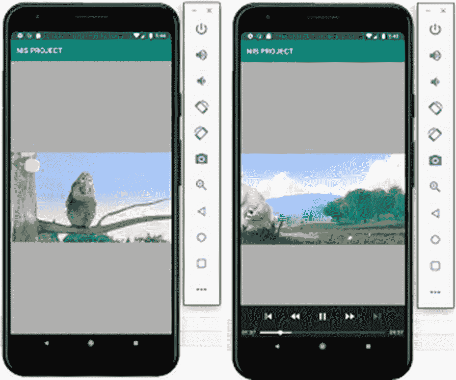

# 第七章

# 用于 HLS 视频流的端到端视频内容加密模块

+   Kazim Rizvi

    印度维洛尔理工学院

+   Bhavisha J. Dholakia

    印度维洛尔理工学院

+   Aditya Kaushik

    印度维洛尔理工学院

+   Aswani Kumar Cherukuri

    

    印度维洛尔理工学院

+   Chandra Mouliswaran S.

    印度维洛尔理工学院

摘要

对于个人或小组织来说，保护和安全内容可能是一项新的而具有挑战性的任务。现有选项并不能完全满足当今内容消费和安全的需求，同时提供良好的客户体验。作者们在构建一个应用程序时作为一个小组遇到了内容安全的问题，并试图找到一个简单的解决方案，以确保在 Android 上播放内容时的安全性，以便最终用户能够无缝地流式传输，并且不会因为加强的安全性而受到任何干扰。他们通过 AES 保护视频内容，并使用 HLS 来实现通过互联网传输这些视频文件的流式传输。在客户端，他们使用了 Google 的 exoplayer 来解密数据，并在身份验证和授权后直接播放。他们对当前模型与给定的内容保护模型进行了比较分析。总的来说，他们旨在创建一个端到端模块，展示了所有元素如何相互作用并作为一个系统来提供对外部威胁的保护。

引言

如今，被消费的最流行的内容类型是视频。仅在 YouTube 上就有大约 10 亿小时的视频内容被观看，根据研究（https://www.bento4.com/documentation/mp42hls/）显示，有 32%的人每天消费视频内容，而 72%的视频来自视频网站或应用，我们可以清楚地说内容的安全成为首要任务，在不久的将来，随着各种社交视频应用的推出，如抖音，这种需求将会迅速增加。在这种情况下，安全始终是不可或缺的。无法投资建立庞大架构的小型初创企业和个人需要一个简单的解决方案来确保其应用程序中内容的安全性和保障。

保护数据的最佳方式之一是使用密码学，使其只对授权的人员可访问。对于这个项目，我们根据它们的速度和效率探索了各种对称加密算法，发现在加密和解密方面，AES 表现优于其他所有算法（查克拉博提、德夫 & 纳加努尔，2015）。

对称加密和非对称加密之间的比较研究为我们提供了有关这两种类型算法之间在速度、复杂性、性质、漏洞等方面的差异的详细信息（Kumar、Munjal 和 Sharma，2011；Maqsood、Ahmed、Ali 和 Shah，2017）。在安全性、速度、效率和可能的攻击方面，对称算法的比较研究，Princy（2015）显示了 blowfish 和 AES 的良好结果。在分析这些研究之后，我们得出结论，在这种情况下，AES 将是加密和解密大文件的正确算法，因为它具有较少的解密时间，最终会在提供安全性的同时提供更好的用户体验。

HLS 是指 HTTP 直播流协议。它是由苹果（https://developer.apple.com/streaming/）开发的，于 2009 年发布。HLS 协议将视频内容分成小视频块，然后通过 HTTP 进行流式传输。像 HLS 和 DASH 这样的 HTTP 流媒体协议的主要特点之一是自适应比特率流媒体，这使用户可以根据客户端的带宽以不同的比特率进行流媒体传输（Jain、Shrivastava 和 Moghe，2020）。它们允许多种类型的内容消费方法，例如视频点播和直播。HTTP 流媒体协议的其他功能包括切换流、广告插入和可变分段（Jugović 和 Banduka，2017）。HLS 的工作原理是下载主播放列表一次，然后获取适配的流。在 HLS 实时流中，客户端和服务器之间的延迟可以通过使用 FFmpeg 等开源软件进行优化（Kuchta 和 Miklošík，2017）。为了将简单的 mp4、mpeg 等视频文件转换为多个分段流的 .ts 文件和 manifest.m3u8 文件，我们可以使用像 Bento 和 FFmpeg 这样的库（https://www.bento4.com/documentation/mp42hls/）。

DRM（数字版权管理）是一种保护数字内容和防止未经授权访问的方法。DRM 模型的基本需求包括加密，这使供应商可以对数据的消费施加限制（Mushtaq 等人，2017）。DRM 的架构包括一个位于客户端和发布者之间的 DRM 服务器，它充当两个方之间的认证和共享数据的中介（Oyman 和 Singh，2012）。对多个 DRM 的比较允许我们检查它们在各种客户端平台上的支持以及它们传递的内容类型（Princy，2015）。DRM 模型也可以用于多个应用程序，例如在医疗保健行业中，因此允许我们的架构在现实世界中拥有广泛的可能用例（Sheppard、Safavi-Naini 和 Jafari，2009）。

Exoplayer 是一个广泛使用的多功能库，用于 Android 设备的视频播放和流媒体。它由 Google 开发，并正在扩展其对其他平台的支持，如 Flutter 等。Exoplayer 库可以用于实现 HTTP 流媒体协议，例如 HLS 和 DASH，包括自适应比特率流媒体（Singh，2013）。本项目在 Android 中实现了 Exoplayer 库。

结合 HLS 和 AES-128，我们提出了这个系统，以确保安全性和更好的用户体验（Sodagar，2011）。然而，AES 可以稍微调整以提供更好的安全性，这可以作为未来的工作。

背景

背景介绍了启发我们选择这个主题的方式和媒介。在这里，我们讨论了文献调查，它使我们能够深入了解已经存在的论文以及现有研究如何在 exoplayer、HTTP 自适应流媒体和使用各种其他方式来确保安全性的领域进行。

我们还在同一部分讨论了问题定义和工作的贡献。

表 1。文献分析。

| 序号 | 标题 | 作者 | 年份 | 摘要 |
| --- | --- | --- | --- | --- |
| 1. | 用于实时视频流的合作服务器-客户端 HTTP 自适应流系统（韩，高，魏 & 宋，2019）。 | 韩尚旭，高云民，魏贤敏和宋煌军。 | 2019 | 作者提出了一种合作的服务器-客户端 HTTP 自适应流系统，该系统可以为使用实时视频流媒体服务的用户提供优质的视频。为了实现这一目标，服务器根据客户端的估计带宽利用 k 均值聚类方法自适应地确定段编码比特率。客户端通过考虑估计带宽、视频质量变化和缓冲播放时间从服务器请求片段。他们进行了模拟来验证所提出的 DASH 系统的性能。模拟结果表明，与当前的 DASH 系统相比，所提出的系统可以提供更高的视频质量，更高的带宽利用率和稳定的视频质量。 |
| 2. | 基于智能卡的用户友好型数字版权管理系统（李 & 李，2009）。 | 李南毅和李子怡 | 2009 | 作者改进了孙等人提出的惯例。基于智能卡的数字版权管理（DRM）框架。该策略利用不同的加密密钥提供保护和安全性。消费者可以在任何兼容的物理设备上自由使用自己的智能卡。每个数字内容都可以在在线和离线环境下播放。此外，它使消费者可以在兼容设备上播放相同的数字内容，而不必支付至少多次。因此，所提出的系统非常吸引人且易于使用。 |
| 3. | 用于医疗保健的数字版权管理模型（Sheppard，Safavi-Naini & Jafari，2009）。 | Nicholas Paul Sheppard，Reihaneh Safavi-Naini 和 Mohammad Jafari | 2009 | 数字版权管理可以与电子同意和基于工作流程的访问控制的思想相结合，以执行结合了医疗保健专业人员需求和患者需求的安全策略。数字版权管理通过保护传统访问控制系统，使其在整合数据库、单个医疗保健机构和其他需要访问医疗保健信息的组织中持续存在。如果我们能在这个领域使用 DRM，医疗保健将会得到改变。 |

| 4. | 从 AES-128 到 AES-192 和 AES-256，如何适应密钥扩展上的差分故障分析攻击（Floissac & L'Hyver，2011）| No´emie Floissac 和 Yann L’Hyver | 2011 | 通过本文，作者考虑了将 DFA 攻击变体应用于 AES-128 到 AES-192 和 AES-256 的情况。他们确定了变体中的两个基本部分：第一个部分在于扩展原始攻击，第二个部分在于在前一轮上重现此攻击。使用此技术对密钥扩展进行 DFA 的变体比对状态进行 DFA 更复杂，并且必须将每次攻击视为特殊情况。对于这种类型的 DFA，他们提出了三个主要问题需要解决，以获得足够的轮密钥字节，以揭示初始密钥。

由于 C. H. Kim 和 J. Quisquater 的攻击，他们成功地通过使用两个特定的技巧来修改了最初的攻击。他们的改进需要 16 对，分别对应于双倍 AES-128 所需对数的 192 位和 256 位密钥变体。|

| 5. | 使用新的驱动器隐藏 Rootkit 加强数字版权管理（Tsaur，2012）。 | Woei-Jiunn Tsaur | 2012 | 在这篇文章中，研究人员提出了一种用于加强 DRM 以保护版权数字多媒体内容不受非法分发和使用的新的驱动程序隐藏 Rootkit。提议的新驱动器隐藏 Rootkit 基于 DKOM 的五种技巧，已成功地规避了著名的 Rootkit 检测器，因此可以用于防止未经授权的用户通过使用反 Rootkit 工具删除 Rootkit 或隐藏数字版权管理软件。这项研究对增强 DRM 软件的安全性至关重要，并且可以激励 DRM 软件制造商有效地改进现有的方法，以保护版权数字多媒体内容不受非法分发和使用。此外，这项研究还激励了防御者通过所提出的先进 Rootkit 的隐秘技巧来有效地加强真正的应用。 |
| --- | --- | --- | --- | --- |
| 6. | 利用 HLS 实现的 AES 密码算法 (Meurer, Mück & Fröhlich, 2013) | Rodrigo Schmitt Meurer, Tiago Rogério Mück 和 Antônio Augusto Fröhlich | 2013 | 在这篇论文中，作者们调查了利用 HLS 的 AES 的多种硬件执行方式。他们建立了一个高性能的软件应用，只需要进行小的修改就可以轻松地集成到硬件中。通过研究不同的 HLS 命令和内存分配技术，他们减少了设计所占用的区域，同时也减少了加密一个块所需的周期数。尽管启用了硬件微型模型的快速设计空间分析，但 HLS 过程需要对源代码进行修改才能生成有效的硬件。这导致至少有两种不同的基本 AES 实现：一种是针对软件的，另一种是针对硬件的。考虑到 AES 可以被实现为硬件或软件的情况，对于同一组件维护两种不同的实现可能会出现错误，并导致实用性的发现。 |
| 7. | 使用 ABAC 实现的数字版权管理以提高企业文档保护 (BudimanBadarsyah & Rosmansyah, 2014) | BudimanBadarsyah 和 Yusep Rosmansyah | 2014 | 数字版权管理是当今信息安全领域中的一个有趣问题，可以为数字媒体内容的许可财产提供最佳保护。通过对数字版权管理的四大支柱进行隔离，我们可以根据组织的需求进行定制。为了提高性能，尤其是在文档/数据/信息分发方面，为组织中的所有利益相关者提供开放的环境联合体可以在短时间内有效地进行决策。然后，支持数据/信息开放性的访问控制成为一个重要的成功关键，不可回避。通过在企业数字版权管理中实现 ABAC，用户可以更轻松地进行数据分发，无论是正式的还是安排好的方式，都更加简单、开放和安全。 |
| 8. | 用于 RFID 标签的 AES 实现：硬件和软件方法（Hongsongkiat & Chongstitvatana, 2014） | Thanapol Hongsongkiat 和 Prabhas Chongstitvatana | 2014 | AES 加密通常在两个频率范围内被使用：低频范围（LF，120-150 kHz）和高频范围（HF，13.56 MHz）。这两个应用在加密时间上有各种要求。低频应用期望加密在几百个 RF 周期内完成，而在高频应用中，AES 处理时间可以高达数千个 RF 周期。软件 AES 程序是基于我们的专有指令集执行的。程序的资源使用可以适应微控制器。处理时间也符合我们针对高频 RFID 应用的规范。还提出了两种加速微控制器处理时间的方法。 |
| 9. | 使用算术编码增强 AES 算法（Mukesh、Pandya & Pathak, 2013）。 | Patel Sanket Mukesh、Morli S Pandya 和 Shreyas Pathak | 2013 | 本文帮助我们了解了如何增强 AES。论文中使用的输入数据在 AES 中为 128 位或 256 位。通过使用 MATLAB 对序列进行顺序编码、加密、解密和解码。在加密之前，MATLAB 中已对数据进行了算术编码的压缩。错误检测和纠正能力被证明很高。本文在网络安全领域有着很高的未来改进空间，并展现出了很大的潜力。这种特定策略可以用于多种其他协议，而且在加密之前可以使用更加高效的压缩技术。 |
| 10. | DES 和 AES 性能评估（Bhat、Ali & Gupta, 2015）。 | Bawna Bhat、Abdul Wahid Ali 和 Apurva Gupta。 | 2015 | 如今，数字数据交换的使用在各个领域不断增加。信息安全在存储和传输信息方面起着非常重要的作用。当我们发送多媒体数据，如音频、视频、图片等等，通过网络时，密码学提供了安全性。在密码学中，我们在发送数据之前对其进行加密，并在接收时解密，为此，我们使用多种加密算法。AES 和 DES 是最常用的加密算法。AES 提供了在传输前对数据进行加密的功能，而 DES 也像 AES 一样提供了安全性。在本文中，我们使用 MATLAB 编程讨论了 AES 和 DES 及其比较。我们根据 AES 和 DES 的雪崩效应、仿真时间和所需内存比较它们的结果。与 DES 相比，AES 提供了更好的安全性，尽管在计算方面需要更多的时间。 |
| 11. | Android STB 上 HTTP 实时流媒体 QoE 因素的自动监控 (Kovacevic, Kovacevic, Stefanovic & Novak, 2015) | Marko Kovacevic, Branimir Kovacevic, Dejan Stefanovic, Sebastian Novak | 2015 | 本文提出了一个框架，用于自动监控影响 Android STB 上媒体播放器体验质量的元素。媒体播放器使用 HTTP 实时网络协议，其中视频被分成小段（chunk），并以不同的质量级别（表现）进行编码。根据网络条件，媒体播放器应用程序选择要下载的视频片段，导致不同视频质量级别之间的切换。这些质量切换以及诸如初始延迟、视频暂停、音视频同步等因素影响最终用户的体验质量。本文介绍的系统旨在自动监控这些因素，以帮助内容提供商限制低体验质量的原因，并更轻松地进行修复。提出的系统将系统扩展为自动检测 Android STB 的测试，通过增加测量和检测 HLS 的影响因素的模块，如切换视频质量级别的频率、播放初始延迟、视频暂停、帧丢失、音视频同步。系统有助于内容提供商限制低体验质量的原因，并更轻松地进行修复。 |
| 12. | 移动设备中节能视频流媒体的自适应比特率转码（Hemalatha，Yadav 和 Ramasubramanian，2015） | K. Hemalatha，Praveen Kumar Yadav 和 N. Ramasubramanian | 2015 | 视频应用的功耗取决于组织负载、信号质量、数据传输带宽等因素，并且可以通过基于启发式的流媒体进行改进。此处介绍的工作利用了自适应比特率流媒体来确定可用带宽的最佳比特率。最佳比特率的选择确保了视频的质量传递以及设备的最佳功耗。动态自适应流媒体传输协议(HTTP Live Streaming (MPEG-DASH))已用于实现比特率之间的切换。选择用于编码的十五个比特率接近平均值，适用于流媒体。该方法已在基于 Android 的平板电脑上测试了 30 多个视频，以检查各因素之间的依赖关系。这是建立比特率和视频流媒体功耗之间联系的重要方法。获得的结果显示功耗共享水平为 14%，缓冲最少，服务质量好。 |
| 13. | 数据通信中数字签名的安全性（Rahim 等人，2018）。 | Rahim 等人 | 2018 | 在当前以互联网技术为基础的时代，信息的访问真实性非常重要，有许多方法可以保护信息免受不负责任的各方的各种安全攻击，一些技术可以用于防御不负责任的各方的攻击，如使用隐写术、密码术或数字签名。数字签名可以是解决方案之一，用于验证消息的真实性，以证明接收到的消息是原始消息，没有任何更改，Ong-Schnorr-Shamir 是本研究中使用的算法，实验是在数字签名方案和隐藏信道方案上进行的。 |
| 14. | 用于小规模网络的 AES 加密系统（Arom-oon，2017） | Ukrit Arom-oon | 2017 | 本文使用 128 位、192 位和 256 位密钥的 ECB-AES 计算完成，运行于 Free RTOS。Free RTOS 用于管理任务和资源的时间限制。明文被编码，然后被解开到原始明文。加密效率是基于无人机消息进行测试的，并且结果表明 MCU 可以处理所有消息而不会丢失。对加密系统的延迟和吞吐量进行了测试。 |
| 15. | 基于完全和置换加密技术的视频流的安全实现（Elshamy 等人，2017） | Ahmed M. Elshamy，Aziza I. Hussein，Hesham F. A. Hamed，Hamdy M. Kelash，M. A. Abdelghany 和 Ahmad Q. Alhamad | 2017 | 本文讨论了一种基于 Henon 混沌映射和光学相位调制的视频流加密方法。该过程通过将视频分成帧并将彩色 3D 图像转换为灰度 2D 来实现，并提供了良好的加密质量指标结果。 |
| 16. | 使用 AES/CFB/PKCS5 填充加密对各种视频帧（I、P、B）进行安全的 H.264 视频编码（Adiguna, 2016） | Tahta Adiguna | 2016 | 本文讨论了对 H.264 视频编码进行加密的过程，并比较了不同的加密算法。所讨论的思想是加密各种视频帧（I、P、B）。在视频的 I、P 和 B 帧加密过程中使用了 NAL（网络抽象层）单元。 |
| 17. | Look Ahead：一种 DASH 自适应算法（Belda, De Fez, Arce & Guerri, 2018） | Román Belda, Ismael De Fez, Pau Arce 和 Juan Carlos Guerri | 2018 | 本文表明视频内容的即时比特率变化是 DASH 自适应算法的关键因素。即使在稳定的带宽条件下，这种情况会提供足够的带宽以在正常视频比特率下进行无中断播放，但如果不考虑关于瞬时视频片段比特率的信息，可能会导致视频播放过程中出现停顿。本文介绍了一种称为“Look Ahead”的算法，该算法考虑了比特率的波动，以计算避免干扰的最佳表示级别。结果表明，与 ExoPlayer 使用的自适应算法以及 Müller 和 SARA 算法相比，视频播放停顿（重新缓冲）的数量和持续时间都大大减少，尽管平均视频质量略有降低。 |
| 18. | 利用 OpenCL 加速 AES 算法（Sanida, Sideris & Dasygenis, 2020） | Theodora Sanida, Argyrios Sideris 和 Minas Dasygenis | 2020 | 加密在当今各个领域中发挥着重要作用，因为我们必须保护各种数据，无论是文学还是媒体。随着文档/内容大小的扩大，通用的加密措施需要大量资源，因此总体所需时间受到限制。为此，本文评估了使用 CPU 与 GPU 加密数据效率的差异。由于如今 GPU 执行着诸多不同的任务，例如加密货币挖矿、视频/图像处理等，本文试图将其应用于加密和解密。 |
| 19. | 利用 AES 和 ECC 保护多媒体内容的强大计算 DRM 框架（Hassan, Tahoun & ElTaweel, 2020） | Heba El-Rahman Hassan, Mohamed Tahoun 和 Gh.S. ElTaweel | 2020 | 本文讨论了使用 AES-256 对多媒体内容进行加密和解密以及使用 ECC-256 对共享密钥进行加密和解密以创建 DRM 框架，以保证机密性、身份验证、数据完整性和不可否认性。该架构基于云服务器，并利用云计算构建端到端解决方案。结果系统提出了高性能的保护作者权利、内容所有权和防止非法活动。 |
| 20. | 基于 AES 和 RSA 算法的图像加密（Alsaffar 等人，2020） | Alsaffar，Dalia Mubarak，Atheer Sultan Almutiri，Bashaier Alqahtani，Rahaf Mohammed Alamri，Hanan Fahhad Alqahtani，Nada Nasser Alqahtani 和 Azza A. Ali。 | 2020 | 本文的研究旨在比较使用 MATLAB 的高级加密标准（AES）和 Rivest-Shamir-Adleman（RSA）加密算法在图像加密中的差异。该研究从测试每种算法的图像加密质量开始。除此之外，还分析了直方图和相关性结果。结果表明，AES 算法具有更好的图像加密质量，在直方图中有更多的收敛部分。此外，AES 算法的相关系数倾向于更接近零，因此具有更强的相关性。 |

通过这份详细的文献分析，我们将问题描述为使用 AES-128 加密视频内容，同时转换为 HLS 格式，并通过服务器流式传输加密数据，以便在客户设备上使用 Exoplayer 进行安全的实时解密和播放。用于文献综述的文学来源帮助我们了解了视频流的现有框架和模型。基于这一点，我们对这些模型进行了批判性分析，并了解了它们的缺点。因此，我们提出了一个新模型，不仅提供安全性，而且可以用于为我们的模型提供灵活性。

解决方案和建议

提出的模型

详细架构

我们试图将当前的视频流方法替换为使用 AES-128 加密的视频流方法，这将为网站、应用程序等的版权视频提供安全性和认证，并防止它们被滥用/盗版。我们试图通过创建一个 HLS 加密视频，然后在服务器上共享它，然后在客户设备上解密和实时播放来实现这一目标。

加密视频

| 图 1\. 第 1 阶段 - 加密并转换为 HLS |
| --- |
|  |

图 1 描绘了架构的第一阶段，即将视频转换为 AES-128 加密的 HLS 文件。该过程首先将文件转换为 HLS，然后使用 128 位随机生成的密钥对其进行加密。下一步是将加密密钥保存到 KEY 服务器和加密文件保存到 FILE 服务器。这个密钥将进一步用于在客户设备上解密视频。

解密和回放

| 图 2\. 第 2 阶段 - 检索密钥并解密文件 |
| --- |
|  |

图 2 描述了实现的第二阶段，其中包括在客户端设备上检索数据并播放加密视频。在这种情况下，客户端和服务器已经拥有一个称为用户密钥的共享密钥。上述过程可以分为以下步骤：

+   1\. 用户请求在客户端设备上播放视频文件

+   2\. 客户端设备请求文件服务器的加密数据

+   3\. 文件服务器响应所请求的数据

+   4\. 客户端请求密钥服务器获取特定视频文件的密钥

+   5\. 密钥服务器使用用户密钥使用 AES 对视频密钥进行加密，以安全地在网络上共享，并将其发送给客户端

+   6\. 客户端接收数据，并使用相同的用户密钥解密以获得视频密钥

+   7\. 最终的视频密钥用于播放加密视频文件

功能

完整模型的实现可以再次分为两部分：

服务器端

第一步是将视频转换为 HLS 并进行加密。对于这个过程，我们可以使用 FFmpeg 或 Bento 等开源软件。它将视频作为输入并输出包含清单 m3u8 文件的 HLS 转换视频。我们还可以配置它同时加密输入文件。

使用 bento 加密并将输入文件转换为 HLS，我们使用以下命令：

mp4hls -o. /output --encryption-key = {16 个字符的十六进制密钥} ./input.mp4

十六进制的 16 个字符 = 32 字节 = 256 位

客户端端

在这个实现中，客户端端的实现需要创建一个安卓应用程序。Exoplayer 是由 Google 创建的视频播放器库，用于播放视频。它是一个基于 Java 的库，使用 Java 的 Cipher 类对分段文件执行加密解密操作。它支持广泛的视频编解码器和类型，并且可以配置为解密视频并实时播放。

| 图 3\. 客户端实现（Exoplayer） |
| --- |
|  |

设置 Exoplayer 的主要代码如图 III 所示。它需要构建两个额外的自定义类来 a) 将自定义请求重定向到服务器 b) 通过 HTTP 检索文件数据，这些类分别实现为 CustomDataSourceFactory.java 和 DefaultHttpDataSource.java。

Exoplayer 带有基于 java 的 Cipher 类的内置类，我们已经在此实现中使用了它来支持 HLS。

实验结果

服务器端

| 图 4\. 输入视频 |
| --- |
|  |

图 4 描述了经过转换和加密的输入视频。

| 图 5\. 加密和分段的 HLS 输出文件 |
| --- |
|  |

如图 5 所示，加密和转换为 HLS 后生成的分段输出文件。这些文件被分割成每段 10 秒的视频，然后进行加密。HLS 的这一特性允许在互联网上进行平滑的流媒体传输，并减少了延迟。清单文件是 stream.m3u8，是传递给播放器的文件。清单文件包含有关分段文件以及其播放顺序的信息。

客户端

| 图 6\. 解密传入数据 |
| --- |
|  |

如图 6 中的安卓应用程序，借助 exoplayer 库，使用视频密钥解密来自文件服务器的传入数据，并实时向用户播放。用户在使用过程中没有任何延迟，因为视频在播放期间解密。

分析

与文献的比较

目前，我们有许多解决方案来保护数字内容。这些解决方案属于以下某一类别：

+   1\. 提供良好的用户体验但安全性较差

+   2\. 提供良好的安全性但用户体验较差

+   3\. 在架构/系统中有限制

+   4\. 复杂或难以实现

我们的解决方案既提供了安全性，又提供了良好的用户体验。它比以前的解决方案更适合当前企业的需求，因此成为了当今需求的可能简单解决方案。该模型简单易懂，易于实施，因此也可以纳入不同的业务解决方案中。

该模型的安全性取决于 AES-128 算法的安全性，因为我们在加密文件和共享密钥时使用了它。就用户体验而言，从演示视频中可以明显看出，在播放过程中没有任何滞后或延迟。

与当前行业标准的比较

当前用于保护数字内容的标准称为数字版权管理（DRM），它试图控制版权内容的使用、修改和分享。它可以包括使用诸如加密、认证、区域锁定等技术。

目前大多数像 Netflix、Prime Video 等大公司使用专有的 DRM，它们使用位于中间的许可服务器来授权用户观看内容。例如，一些专有的 DRM 包括 Google 的 Widevine、苹果的 FairPlay 和微软的 PlayReady。DRM 的架构使用需要由制造商在设备上安装的认证。例如，所有的安卓设备都需要安装 Google 的 Widevine L1 证书才能播放高清及以上质量的内容。没有此证书的设备将无法播放高质量视频。

我们的解决方案是平台独立的，灵活的，实施简单的，与现有解决方案相比。它提供了对体系结构的授权、使用和其他功能的完全控制的灵活性。它不限制任何设备上的内容质量，但允许企业决定这一点。

结论

随着世界变得完全数字化，使我们的系统更加安全是极其关键的，这样我们就可以防止对我们的私人内容的恶意访问。在这种情况下，迫切需要确保我们的数字内容的安全，并随着时间的推移使已经存在的框架变得更好、更灵活。灵活性也变得非常重要，因为技术的进步变化每天都在变好；因此，我们需要提出灵活的解决方案，以便它可以在所有设备上使用，无论是旧设备还是新设备。因此，这个特定的框架可以证明在这个时候是刚刚合适的。然而，像亚马逊和 Netflix 这样的大公司所使用的 DRM 目前更加稳定和建立。对于未来的工作，我们相信有巨大的改进我们当前模型的空间，这可以使它更安全、更稳定。

参考文献

Adiguna, T. (2016). 使用 AES/CFB/PKCS5 填充加密的安全 H.264 视频编码在各种视频帧（I，P，B）上。在 2016 年第 10 届国际电信系统服务和应用会议（TSSA）中（第 1-5 页）。IEEE。

Alsaffar, D. M., Almutiri, A. S., Alqahtani, B., Alamri, R. M., Alqahtani, H. F., Alqahtani, N. N., & Ali, A. A. (2020). 基于 AES 和 RSA 算法的图像加密。在 2020 年第 3 届国际计算机应用与信息安全会议（ICCAIS）中（第 1-5 页）。IEEE。

Arom-oonU. (2017). 用于小规模网络的 AES 加密系统。在 2017 年第三届亚洲国防技术会议（ACDT）中（第 49-53 页）。IEEE。 [10.1109/ACDT.2017.7886156](https://doi.org/10.1109/ACDT.2017.7886156)

BeldaR.De FezI.ArceP.GuerriJ. C. (2018). 展望：一种 DASH 自适应算法。在 2018 年 IEEE 国际宽带多媒体系统和广播研讨会（BMSB）中（第 1-5 页）。IEEE。

转换从 mp4 到 HLS 的 Bento 文档。（无日期）。[`www.bento4.com/documentation/mp42hls/`](https://www.bento4.com/documentation/mp42hls/)

BhatB.AliA. W.GuptaA. (2015). DES 和 AES 性能评估。在国际计算、通信与自动化会议上（第 887-890 页）。IEEE。 [10.1109/CCAA.2015.7148500](https://doi.org/10.1109/CCAA.2015.7148500)

BudimanBadarsyah, I., & Rosmansyah, Y. (2014). 使用 ABAC 实现数字版权管理以提高企业文档保护。在 2014 年第 8 届国际电信系统服务和应用会议（TSSA）中（第 1-6 页）。IEEE。

ChakrabortyP.DevS.NaganurR. H. (2015). 实时数据流的动态 http 直播流方法。在 2015 年国际计算智能与通信网络会议（CICN）中（第 1394-1398 页）。IEEE。 [10.1109/CICN.2015.333](https://doi.org/10.1109/CICN.2015.333)

ElshamyA. M.AbdelghanyM. A.AlhamadA. Q.HamedH. F.KelashH. M.HusseinA. I. (2017). 基于全和置换加密技术的视频流的安全实现。在 2017 年计算机和应用国际会议（ICCA）(pp. 50-55)。IEEE。10.1109/COMAPP.2017.8079738

Exoplayer 文档（无日期）。https://exoplayer.dev/hls.html

FFMPEG 文档（无日期）。https://ffmpeg.org/ffmpeg-formats.html

FloissacN.L’HyverY. (2011). 从 AES-128 到 AES-192 和 AES-256，如何在密钥扩展上适应差分故障分析攻击。在 2011 年密码学中的故障诊断和容错研讨会（FDTC）(pp. 43-53)。IEEE。10.1109/FDTC.2011.15

HanS.GoY.NohH.SongH. (2019). 用于实时视频流的协作服务器-客户端 http 自适应流媒体系统。在 2019 年信息网络国际会议（ICOIN）(pp. 176-180)。IEEE。10.1109/ICOIN.2019.8718151

Hassan, H. E. R., Tahoun, M., & ElTaweel, G. S. (2020). 一种用于使用 AES 和 ECC 保护多媒体内容的强大计算 DRM 框架。亚历山大工程杂志，59(3)，1275–1286。doi:10.1016/j.aej.2020.02.020

Hemalatha, K., Yadav, P. K., & Ramasubramanian, N. (2015). 自适应比特率转码，用于移动设备中的节能视频流媒体。在 2015 年第三届国际信号处理、通信和网络会议（ICSCN）(pp. 1-5)。IEEE。10.1109/ICSCN.2015.7219825

苹果公司的 HLS 文章（无日期）。https://developer.apple.com/streaming/

HongsongkiatT.ChongstitvatanaP. (2014). 用于 RFID 标签的 AES 实现：硬件和软件方法。在 2014 年国际计算机科学和工程会议（ICSEC）(pp. 118-123)。IEEE。10.1109/ICSEC.2014.6978180

JainN.ShrivastavaH.MogheA. A. (2020). 使用 FFmpeg 在 S3 Bucket 上自动化生产就绪的 HLS Player 环境。在第二届国际数据、工程和应用会议（IDEA）(pp. 1-4)。IEEE。

Jugović, D., & Banduka, M. L. (2017). 在基于 Android 的系统中扩展和集成 HLS 软件支持。在 2017 年第 25 届电信论坛（TELFOR）(pp. 1-4)。IEEE。

Kovacevic, M., Kovacevic, B., Stefanovic, D., & Novak, S. (2015). 在 Android STB 上自动监控 HTTP 动态流媒体 QoE 因素。在 2015 年 IEEE 第一届国际消费电子研讨会（CE WS）(pp. 72-75)。IEEE。10.1109/CEWS.2015.7867159

Kuchta, M., & Miklošík, A. (2017). 数字视频消费模式的演变。今日通信，8(2)，58–69。

Kumar, Y., Munjal, R., & Sharma, H. (2011). 对称和非对称密码学的比较，现有的漏洞和对策。计算机科学和管理研究国际期刊，11(03)，60–63。

LeeN. Y.LeeT. Y. (2009). 基于智能卡的用户友好数字版权管理系统。在 2009 年第五届智能信息隐藏和多媒体信号处理国际会议（IIH-MSP）(pp. 869-872)。IEEE。10.1109/IIH-MSP.2009.130

Maqsood, F., Ahmed, M., Ali, M. M., & Shah, M. A. (2017). 密码学：现代技术的比较分析。《国际先进计算机科学与应用杂志》，8(6)，442–448。 doi:10.14569/IJACSA.2017.080659

MeurerR. S.MückT. R.FröhlichA. A. (2013). 利用 HLS 实现 AES 密码。在 2013 年第 III 届巴西计算系统工程研讨会上 (pp. 113-118). IEEE。 10.1109/SBESC.2013.36

MukeshP. S.PandyaM. S.PathakS. (2013). 用算术编码增强 AES 算法。在 2013 年国际绿色计算、通信和能源保护会议上 (pp. 83-86). IEEE。 10.1109/ICGCE.2013.6823404

Mushtaq, M. F., Jamel, S., Disina, A. H., Pindar, Z. A., Shakir, N. S. A., & Deris, M. M. (2017). 密码加密算法调查。《国际先进计算机科学与应用杂志》，8(11)，333–344。

Oyman, O., & Singh, S. (2012). HTTP 自适应流式传输服务的体验质量。《IEEE 通信杂志》，50(4)，20–27。 doi:10.1109/MCOM.2012.6178830

Panda, M. (2019). 在不同平台上使用对称密钥算法进行文本和图像加密解密。《国际科学技术研究杂志》，8(09)。

Princy, P. (2015). 对称密钥算法 DES、AES、Blowfish、RC4、RC6 的比较：一项调查。《国际计算机科学与工程技术杂志》，6(5)，328–331。

Rahim, R., Pranolo, A., Hadi, R., Nurdiyanto, H., Napitupulu, D., Ahmar, A. S., . . . Abdullah, D. (2018). 数据通信中的数字签名安全。 doi:10.2991/icedutech-17.2018.34

Sanida, T., Sideris, A., & Dasygenis, M. (2020). 利用 OpenCL 加速 AES 算法。在 2020 年第 9 届现代电路与系统技术国际会议上 (pp. 1-4). IEEE。

SheppardN. P.Safavi-NainiR.JafariM. (2009). 医疗保健数字版权管理模型。在 2009 年 IEEE 国际分布式系统和网络政策研讨会上 (pp. 106-109). IEEE. 10.1109/POLICY.2009.8

Singh, G. (2013). 信息安全的加密算法研究(RSA、DES、3DES 和 AES)。《计算机与应用杂志》，67(19)。

Sodagar, I. (2011). 互联网多媒体流式传输的 mpeg-dash 标准。《IEEE 多媒体杂志》，18(4)，62–67。 doi:10.1109/MMUL.2011.71

Tsaur, W. J. (2012). 利用新的驱动程序隐藏根工具加强数字版权管理。《IEEE 消费电子学刊》，58(2)，479–483。 doi:10.1109/TCE.2012.6227450
