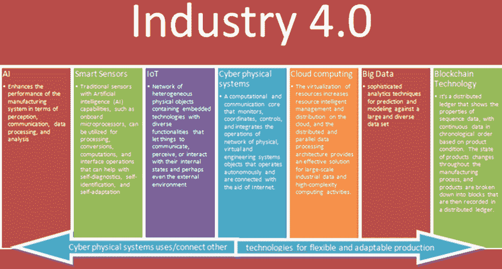
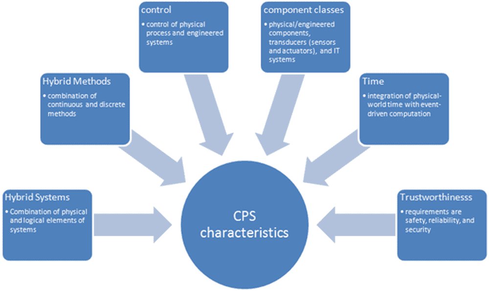

# 第八章

# 安全和智能制造的工业 4.0

+   N. S. Gowri Ganesh

    

    印度，Malla Reddy 工程技术学院

+   N. G. Mukunth Venkatesh

    印度，金奈，帕尼马拉工程学院

摘要

工业 4.0 和智能制造有望将当前的实践转变为具有高强度、速度和系统影响范围的新里程碑。人工智能、物联网（IoT）、区块链技术和物联网技术等领域的技术进步已经突破了潜力的捕捉，提高了全球各个领域人们收入水平和生活质量的改善。物联网设备产生的连续输入数据流可以帮助密切监测工业的各个生产阶段。边缘计算和人工智能在终端节点处理这些数据，而区块链技术为金融和非金融应用提供了分布式安全数据环境。必须在所有制造系统中建立安全措施，以实现故障安全生产和网络威胁保护。在本章中，作者们将探讨如何在各种场景中利用这些技术来提高工业生产力及其环境要素。

引言

当代工业由于技术上的重大创新影响，自 18 世纪初以来一直受到巨大推动。每个工业发展阶段的最终目标都是通过改进制造效率来减少浪费，从而实现更多的生产。工业 4.0 或第四次工业革命有时在制造业中也被称为工业物联网（IIOT），是物理生产和技术与智能数字技术（包括人工智能和机器学习、大数据、云计算、物联网、区块链技术、网络物理系统和边缘计算）的融合。工业始终与期望的流程、合作伙伴、产品和人民共同发展。公司日常运营的挑战在于产生有效的产出，以维持这些实体之间的联系并获得实时数据的见解。通过将工业物联网设备连接到云端，利用人工智能的协助实现智能制造，同时借助区块链技术进行安全保障，工业 4.0 的智能制造可以实现这种互联互通。由物联网设备产生的持续输入数据流可以帮助密切监控行业的各个生产阶段。这些位置的传感器可以连接到能够提供操作的可视化表示的应用程序。这些应用程序不仅能够按顺序呈现数据以具有洞察力，而且还能够通过预测未来的输出来展示智能，以便利用适当的机器学习算法做出必要的决策。边缘计算和人工智能在终端节点和中间节点级别处理这些数据，而区块链技术为金融和非金融应用提供了分布式安全数据环境。区块链技术现在是物流中货物追踪的一种可靠方法。在智能制造中，区分机器健康追踪、预测性维护和生产调度至关重要。智能工厂使用深度学习算法来控制使用时间序列数据的机器。因此，边缘计算在智能制造中已被证明可以提高机器环境的处理时间，处理大量任务。传统的制造工厂并不是为与网络安全安排共同工作而设计的。当这些行业过渡到基于 IP 的系统的物联网设备的新范式时，它们更有可能受到黑客的攻击。存在更大的网络犯罪风险，可能导致未经授权的远程访问、知识产权盗窃、数据操纵、信号干扰和数据丢失。安全措施必须从一开始就内置到所有制造系统中，以实现可靠的生产和网络威胁保护。由于制造设备的生命周期很长，所选择的解决方案具有内置的灵活性和先进的远程更新解决方案以防止今天和未来的威胁也至关重要。合适的安全架构可以生成、分发和验证设备，使它们能够与用户和应用程序交互。

背景

工业 4.0 首次由三位工程师在 2011 年提出：Henning Kagermann（物理学家，SAP 的创始人之一）（Henning Kagermann，2011），Wolfgang Wahlster（人工智能教授）和 Wolf-Dieter Lukas（物理学家，德国联邦教育和研究部的高级官员），他们在汉诺威工业博览会上以德语“Industrie4.0”提出了这个概念。此后，“工业 4.0”一词引发了新工业革命的愿景，并在德国公众中引发了关于工作和社会未来的激烈持续辩论。2013 年，德国科学与工程国家学院（acatech）准备了《工业 4.0 宣言》（“推进战略举措工业 4.0 的建议。工业 4.0 工作组的最终报告”），这个未来愿景的讨论最终扩展到了其他国家，2016 年，当世界经济论坛在达沃斯会议期间以“掌握第四次工业革命”为主题时，公众对此的认识达到了顶峰。工业 4.0 相关问题由未来工厂公私合作伙伴关系（PPP）解决和发展。工业 4.0 的演变被描述为随着时间的推移应用发明和发现作为工具和技术，其目标是大规模生产商品，生产成本低，时间短，最终导致产品成本降低。

工业 1.0：在 18 世纪早期，粮食、布料和非必需品如武器、工具等都是靠手工或动物的帮助制造的。它标志着从一个以农业和手工业为主的经济体向一个由机器主导的经济体的转变，对矿业、纺织、玻璃和农业等行业产生了重大影响，原因是许多发明，如蒸汽机、纺纱机和水车。詹姆斯·哈格里夫斯在 1764 或 1765 年在英国设计了纺纱机，一种多锭纺纱机。这台装置减少了制造布料所需的时间。它有助于建立棉花工业体系。交通和通信的改善，对新能源（如煤）的依赖，对新原材料（如钢铁）的使用，以及分工和工人专业化等因素都变得越来越重要。

工业 2.0：大规模生产和电力的使用是第二次工业革命（1871 年至 1914 年）的两个重要因素。这是由于大规模的铁路和电报网络使人们和思想能够更快地传播。制造业也在第一次世界大战期间发生了革命性的变化，该战争持续时间为 1914 年至 1918 年。

工业 3.0：电子设备和信息技术系统是第三次工业革命的主要特征。因此，制造厂已迅速从模拟系统过渡到更多的数字系统。这个时候，自动化软件首次亮相，接管了许多传统上由人类执行的琐碎任务。大规模制造和广泛使用数字逻辑、MOS 晶体管和集成电路芯片，以及它们的衍生技术，如计算机、微处理器、数字手机和互联网，是这一阶段的焦点。工业 3.0 仍然存在，大多数工厂处于这一发展阶段。

工业 4.0：物联网是这场革命的关键组成部分。工业 4.0 强调了四项设计原则对其至关重要。1) 互联性：机器、设备、传感器和人们可以通过物联网或人类互联网（IoP）相互连接和通信。2) 信息透明度 - 工业 4.0 技术为运营商提供了大量数据，供其基于其判断。3) 技术辅助是指系统帮助人类做出决策和解决问题的能力，以及帮助人类进行困难或危险活动的能力。4) 分散式决策 - 物联网系统尽可能独立地做出智能决策并执行任务的能力。自工业 4.0 在德国推出以来，各国或地区相继推出了许多相关概念或倡议，如美国的工业互联网，中国制造 2025，日本的工业 4.1J 和韩国的制造业创新 3.0。

工业 4.0 及其对智能制造技术的采用

智能制造是一种利用数字创新使工作变得更智能和更连接的新范式，从而提高生产速度和灵活性。在当前情况下，自然资源开采、过度废物产生和全球变暖都是工业界已知的问题。在这方面，最近的研究表明，采用循环利用废物的循环模型改善了制造产品的整个供应链，而许多人则专注于技术创新对制造领域、优化流程和调度问题的影响，以解决工业污染和资源浪费问题。从工业 4.0 的视角来看，智能工厂是一种制造解决方案，它提供了灵活和适应性强的生产过程，能够应对生产设施在不断增加的复杂性世界中动态和快速变化的边界条件带来的问题。这种方法可能与自动化有关，自动化被定义为软件、硬件和/或机械的混合。另一方面，它可以从各种工业和非工业伙伴之间的合作的角度来看，智能性源自动态组织的创建。智能产品是那些能进行计算、存储数据、与他人互动并与周围环境连接的产品。工业 4.0 通过利用新技术，特别是信息和通信技术，将新的和扩展的技能和技能汇集到供应网络中，提供更好的协作价值（更智能的服务和流程）。智能制造，即使用物联网、云计算、区块链技术和大数据等技术的制造业，是工业 4.0 的关键组成部分。自主机器人、增强现实、增材制造、网络安全以及水平和垂直集成是工业 4.0 建议文件中提到的其他技术。图表（图 1：工业 4.0 智能制造技术采用情况）显示了工业 4.0 中技术的采用情况。工业人工智能技术主要用于帮助智能制造。尽管相关研究仍处于早期阶段，但工业人工智能正在受到关注，正在经历快速的技术改进，并在应用方面取得了重大进展。智能设备，如物联网和 CPS，现已确立为一个全球范式，能够彻底改变任何具备感知、识别、远程控制和自动控制能力的行业。由于它们依赖于昂贵的中心化服务器，这些服务器的建设和维护成本同样昂贵，因此它特别适用于具有中等和大型用户和计算负载的工业 4.0 应用。区块链可以通过促进从信息互联网到价值互联网的转变，以及通过用分散式服务器替代中心化服务器并发展现有的互联网，构建真正的点对点共享经济，从而增加价值。

| 图 1. 工业 4.0 中智能制造技术的采用 |
| --- |
|  |

**网络物理系统**

网络物理系统（CPS）平台是工业 4.0 战略努力的结果，将支持协作式工业业务流程以及智能工厂和智能产品生命周期的特征的商业网络。它们基于互联网作为通信媒介，并包括计算和存储能力、机械和电子设备。CPS 连接虚拟世界和物理世界，形成一种智能对象的网络，这些对象可以相互通信和交互。在所有尺寸和层次上，具有强烈整合了网络的物理和网络系统的系统被称为网络物理系统。网络指的是离散的、逻辑的和切换的计算、通信和控制。物理系统是受物理规则调节的自然和人造系统，并且实时操作。设计网络物理系统应用的第一阶段是从机器及其组件获取精确和可信的数据。传感器可以直接收集数据，也可以从控制器或公司制造系统中收集数据。数据必须用于提取相关信息，例如评估健康值、估算剩余可用寿命等。在这种架构中，网络层充当核心信息中枢。为了构建机器网络，信息从每个链接的机器推送到其中。认知水平生成对监控系统的完全理解。将获得的知识正确呈现给专业用户，支持结果的准确性。

CPS（Gill，无日期）是一个计算核心，集成、监控和/或控制物理、生物和工程系统的活动。计算核心通常是一个需要实时响应且分散的嵌入式系统。网络物理系统的行为是计算机（逻辑）和物理行为完全集成的混合体。CPS（Greer 等人，2019 年）有六个共同特点，如图中所示（图 2：CPS 系统的特征），它们是混合系统、混合方法、控制、组件类、时间、可信度。

| 图 2. CPS 系统的特征 |
| --- |
|  |

从设计到组装和运行，制造执行系统 IT 解决方案现在是一个关键组成部分。静态制造线（具有确定的顺序）是当今汽车行业的特征，这使得为新产品版本重新配置变得困难。由于工业 4.0 的出现，动态制造线应运而生。车辆被转变为智能产品，可以在装配车间中从一个 CPS（Cyber-Physical Systems，网络物理系统）启用的处理模块自主行驶到下一个。CPS 中物品之间的互动层次如下：1.智能连接级别 2.数据转换为信息级别 3.网络级别 4.认知级别 5.配置级别。网络物理系统的运行过程中产生了大量数据。处理这些“大数据”需要使用专门的技术。必须使用人工智能方法来提高网络物理系统的所有组件的性能。

人工智能、智能传感器和物联网

智能制造已经成为利用先进智能系统实现对产品需求变化的动态反应以及整个价值链的实时优化的方法。通过互联性、云计算和大数据，智能制造的工业 4.0 在生产过程中实现了垂直系统集成。作为回应，整个工厂的内部元素相互连接并协作，使其能够进行个性化生产，同时调整产品生产率和资源保护。

人工智能（AI）：AI 是计算机科学的一个分支，涉及创建完成传统上与人类智能相关的功能的数据处理系统，例如推理、学习和自我改进。 AI 技术可以被视为使系统能够感知其周围环境、分析数据并解决复杂问题的工具，以及从工业角度学习经验以增加其执行特定任务的能力。人工智能（AI）在各个领域取得了巨大进步，包括图像处理、自然语言处理和语音识别。新一代 AI 技术的兴起为智能工厂带来了新的可能性和挑战。在很大程度上，人工智能可以应用于智能制造。在智能工厂中使用人工智能带来了许多显着变化，包括以下几点：

1)AI 可能会使智能设备，如机器视觉，更加精确可靠；2) 具有自主决策和推理功能的协作机制表现出更为明智的动态特性；3) 基于先进 AI 算法（如深度学习）的数据处理技术更为有效和精确。机器学习，其中包括深度学习，是人工智能的一部分。机器学习是人工智能的一个子集，包括了使机器能够学习和完成任务的先进统计方法。机器学习包括深度学习作为一个子集。它由一些允许机器通过让神经网络分析大量数据来学习完成困难任务的技术组成（比如在图像或语音中进行对象识别）。

工业人工智能：工业人工智能可以被定义为一种系统性学科，专注于为具有可持续性能力的工业应用开发、验证、部署和维护 AI 解决方案（以各种形式）。工业人工智能是一个跨学科的研究领域，包括机器学习、自然语言处理和机器人技术等领域。工业人工智能的支持技术可以分为五类：数据、分析、平台、运营和人机交互。在工业制造领域，将智能整合到机器/机器组件中是一种不可避免的发展。人工智能与先进制造技术的深度融合为提高产品质量和效率、提高公司服务水平以及显著降低能源使用提供了全面的解决方案。工业人工智能关注于工业监控领域的缺陷检测、剩余寿命预测和质量检查等技术。工业人工智能（工业 AI）在制造业中开辟了新的选择，旨在快速提升质量、成分和本质。通过将个人的工作流程与数据标准化并建立更好的数据参考和交互，可以快速积累和传递人们的经验，例如。数据可以用于使制造系统中的隐含问题显现出来，从而使设备健康透明维护、过程参数更加稳定，并且整体效率得到更好的协调和最大化。

AI 迅速发展，特别是在深度学习领域。2018 年 4 月，麦肯锡全球研究所的一份论文（Chui 等，2018 年）审视了来自 19 个行业和 9 个业务活动的 400 多个应用，以及它们的经济潜力。报告中将人工神经网络的部署称为 AI 技术。前馈神经网络、循环神经网络和卷积神经网络是三种主要形式的神经网络。其他常见的机器学习算法包括决策树算法（使用树结构构建决策模型）、回归算法（预测连续值）、分类算法（在对分类具有先验知识的情况下预测离散值）、聚类算法（在没有分类先验知识的情况下预测离散值）和集成学习（集成多个学习模型预测离散值）。其他机器学习技术分为两类：生成对抗网络（GANs）和深度强化学习（DRL）。

见过并可能感受到一些木头的情况后，人类能够解释木头的概念。从那时起，他就能识别任何木材，即使它的形状不同，颜色或纹理与他以前见过的木材不同。这是人类非常强大的一种能力，人们习以为常，因为我们的大脑自然而然地做得很好。人工神经网络(ANNs) (Lemley 等，2017)能够学习他们所观察到的东西的一些内容，然后将这些信息概括到新的例子(或样本)中。在神经网络中，输入层、输出层和一个或多个所谓的隐藏层是必不可少的。这些层由节点组成，有时被称为神经元，它们以各种方式连接到后续和前面的层。轴突从其他神经元接收输入，树突将信息传递给生物模型中的其他细胞。在神经网络中，这与输入和输出连接有关。细胞体是生物神经元的体部，它可以根据各种因素确定何时以及传输什么。在人工神经元中看到的激活函数工作方式类似。分类任务是确定数据属于哪个类别的过程。泛化是能够对以前未见过的示例进行分类。在所需的输出不能事先预测时，ANNs 在问题中特别有用。训练是指教我们的网络的过程。训练集是我们认为足够代表我们网络学习的数据集。验证集是我们在训练过程中评估我们模型的数据集。任务是我们希望我们的网络学习的技能。当 ANN 没有足够训练以执行此操作时，我们将其称为欠拟合，这表明网络没有很好地学习训练集。过拟合是其反义词，当网络学习训练集时，它学会了如此之多，以至于无法应用于以前未见过的数据。神经网络可以执行两种类型的学习：1)监督学习，其中数据以某种方式进行标记或注释，工作是学会将数据与标签匹配起来;和 2)无监督学习，其中数据没有被标记，神经网络学会找到数据之间的关系。使用训练算法更新权重和测量损失随时间变化的方式。梯度下降优化器通常用于执行此操作。反向传播是一种将错误信息从最后一层传播到第一层以调整权重的技术，它通常与训练混淆。学习规则是一种可以用来提高网络性能的技术。

模拟到数字转换是将模拟输入转换为数字数据的过程。这将信息的状态从连续转变为离散。在这个过程中，一些信息会丢失。虽然这些信息并不总是必要的来解释底层的模拟信号，但在某些情况下，我们可能会丢失关键的数据，比如高频信息。在数字处理中，我们经常将数据片段（比如图像）称为样本。在高维空间中表示这些样本，其中每个单元（或者在图像的情况下是像素）被视为位于特定轴上，其潜在值的范围是该轴的大小，是方便的但计算成本高昂的。一个矢量，在一个 10000 维空间中的一个点，将用于表示一个 100 x 100 像素的图像。这个区域被称为特征空间。我们的目标是将维度的数量限制为只有在手头的工作中是必要的，或者我们调整这些特征的表示方式。为了完成典型的模式识别技术任务，我们将我们的过程分为两个步骤：特征生成和特征选择。前者从像素空间创建新的特征，而后者降低了特征空间的维度。形态学、傅立叶和小波变换是提供特定应用更相关特征的特征生成技术的例子。主成分分析和线性费舍尔判别是特征选择方法的例子。与试图降低维度不同，基于稀疏映射的最新策略主张增加维度，以反映更抽象的方面。这种稀疏映射方法被深度学习的重要组成部分——卷积层所使用。卷积层使用卷积运算符。

在两个函数上，应用了卷积运算符。来自样本空间的信号是一个，应用于样本的滤波器是另一个。在 GPU 上，卷积是通过矩阵乘法实现的。深度神经网络通常由一个或多个卷积层组成，每个卷积层后面跟着一个池化（最大池化）操作。在完全卷积网络中，卷积层之间经常放置卷积、池化和反池化层。

AI 技术实现的人工智能应用的真正价值在于能够创造具有增加程度的自主性和由此带来的增值的系统能力。系统的一般状态可以使用自主性级别来描述。智能需要进化系统到一定程度的自主性。人工智能 (AI) 是实现一定程度自主性的技术手段。基于人工智能的自主性的一般影响 (Klaus Ahlborn, Gerd Bachmann, Fabian Biegel, Jörg Bienert, Prof. Dr. Svenja Falk, n.d.) 可以从无自主性 (级别 0: 无 AI 编程)、部分自主性 (级别 1 到 4: 使用 AI 编程; 人类干预在流程中仍然是必要的)、到完全自主性 (级别 5: AI 编程取代了任何形式的人类干预) 的工业流程中延伸。

智能传感器: 智能传感器 (Pech 等人, 2021) 实时解释制造过程的汇总数据，使机器和其他智能设备能够自我决定。智能传感器可以用作多组分测量设备，具有自校准、自优化和简单融入环境以实现高连接性的特性。智能传感器还可以生成多维数据信息并具有过程智能。物联网中的传感器可以主动监视设备，并在其偏离设定标准时发送通知; 这被称为设施管理。传感器的主要特性是敏感性、连接性、稳健性和自动诊断。输出和输入之间的关系单位变化被称为敏感性。物联网设备中使用的智能传感器是无线的，并依赖于互联网，大多数情况下还依赖于云。低功耗、自动诊断、校准以及解释和实时共享数据的能力都是智能传感器的特点。固体焊接、密封、封装、化学兼容性、安全线路和其他情景保护都是稳健性的例子。自动诊断与基于控制活动的决策或行动控制活动有关。用于维护的传感器依赖于互联网、智能电网和区块链技术。在智能工厂中，传感器主要用于控制，重点是流程。

连接智能制造系统与设计团队、供应商和前台的垂直网络的建立是工业 4.0 的核心。通过在标签或标签上使用条形码、二维码和射频识别标签来识别和监视智能工厂中的物体。智能标签已经发展成具有嵌入式模块的复杂上下文感知标签，利用无线通信、节能显示和传感器。智能标签除了识别外，还可以检测和响应其周围环境。

从传感器收集的存储数据的安全性是当前的安全挑战。除了收集数据的传感器是工业 4.0 理念的一个物理要求外，数据主权至关重要。

万物互联：**凯文·阿什顿**发明了术语“**万物互联**”来描述一个庞大的数字连接产品和机械的网络。有时候，“工业物联网（IIoT）”这个术语被用来描述物联网在工业中的应用。独立于行业或公司规模的远程传感器收集由机器（以及越来越多地，人类）产生的数据，以提高效率、促进更好的决策，并在工业物联网框架中建立竞争优势。

云计算、大数据和区块链技术

云计算：云计算建立了制造过程中涉及的众多系统的连接性，这是工业 4.0 的基础，使来自多个来源和格式的实时创建的数据翻了一番，必须使用现代算法和技术进行存储和分析。通常情况下，智能工厂从物理资源层、网络层和数据应用层采用重要技术，例如 IIoT、大数据和云计算。工业物联网（IIoT）应该在网络层能够容纳新的协议和数据格式。云平台应该能够在数据应用层评估各种数据的语义。因此，这种方法将云计算和大数据作为两种主要技术。工业 4.0 认为这两者都是必不可少的要求。由于处理的数据量巨大，云中存在延迟时间，这可能会影响生产过程的性能。可以使用“雾计算”来解决这个问题。基于通过物联网收集的大量数据进行数据分析和控制操作的处理能力被称为雾计算（IoT）。

大数据：大数据方法使得在工业 4.0 生产生态系统中产生的海量数据得以分析。实时传感器数据、机器日志以及制造过程数据都是智能工厂中的大数据示例，这些数据具有大量、多源头和相当的价值。可以使用先进的、历史的、预测性的和描述性的分析技术来检查用于制造过程、控制和监控的机器的状态和功能。来自多个来源的数据，比如生产单位、企业、客户反馈和产品请求系统等等，都被收集和分析，以帮助智能制造的实时决策。今天的制造商希望客户能提供他们对使用或计划使用的产品的评论和个人观点，这样他们就可以将产品设计聚焦于吸引广泛的客户群。大数据分析将帮助制造商实时识别产品故障的当前状态和原因，并通过更好地了解客户的购买习惯和需求来鼓励客户购买他们的产品。

区块链：区块链是一系列连接的区块，可以以分布式、透明和防篡改的方式存储和传输数据。每个区块包含数据，并使用指针连接到其他区块。这种连接保障了区块链的完整性和防篡改性。区块链交易由几个步骤组成。网络节点或用户首先请求新的交易。然后将交易以区块的形式或结构记录下来。索引、时间戳、数据、上一个哈希和当前区块哈希组成了区块结构。区块链系统（Raj 等人，2020，第 9 页）被分类为公共、私有或联盟。基于工业 4.0 的应用可以与区块链无缝集成。它利用智能合约，这消除了纸质合同的需求，并通过共识调节网络。智能合约是一种允许交易在没有第三方介入的情况下完成的机制，使其不可逆转且可追踪。共享账本不应被篡改或更新以更新网络上的任何记录。通过这种方式，保存的数据的完整性得到了保证。只有在网络的所有经过验证的用户使用共识技术达成一致意见时，才应更新交易。一组交易被广播到网络的所有对等节点。区块链网络使用 SHA-256 技术生成唯一哈希。区块链中的每个区块都链接到前一个区块的哈希，形成了一个无法渗透的交易网络。如果尝试追加交易，则必须由网络节点或智能合约验证，并达成共识。这个不可变的记录不能被改变；相反，它只能被追加到交易区块中，从而产生一个安全可靠的分散式系统。

工业 4.0 的其他技术驱动因素

5G 技术（Sasiain 等人，2020）的应用范围，如网络功能虚拟化（NFV）和软件定义网络（SDN），正在扩大，并且工业 4.0 正在调整它们。SDN 和 NFV 将使组织能够摆脱基于专用硬件的静态解决方案，转向更具成本效益和资源效率的虚拟化和软件化机制，以及改善服务可访问性、可重用性和生命周期管理，并在数据和性能级别提供高度粒度的服务隔离。

软件定义网络（SDN）：传统的计算机网络无法适应网络流量的持续变化，其中承载着大量的设备和信息。在管理、性能和可扩展性方面，传统网络与其他技术相比存在限制。SDN 适用于大规模和高速计算，因为数据转发层（例如交换机和路由器）与控制层（控制器或操作系统）分离。它可以使用不同的协议（如 IPv6 和 IPv4）以多种方式控制来自各种源头的所有网络流量（MAC 地址、IP 地址、端口号等）。操作系统与应用层协调进行各种功能，如入侵检测、负载平衡、路由等，是控制层的一部分。SDN 架构使控制器能够管理各种数据平面资源，并提供可扩展性。SDN 还可以通过设备连接实现增加的能源效率，从而解决工业 4.0 的许多问题，这得益于其灵活性和增强的能源效率。由于工业 4.0 以其有效的通信能力、灵活性和自管理能力而闻名，因此 SDN 具有很多优点。

网络功能虚拟化（NFV）：NFV 是一个四至七层的开放系统互联（OSI）参考模型，它实现了功能虚拟化；它包括网络节点、路由器、防火墙、入侵检测和防御系统（IDPS）以及负载均衡器。虚拟化技术目前在网络中被用于处理数据包传送、路由器、数据传输和其他网络活动，并由网络硬件和软件控制。NFV 架构将虚拟资源（如 CPU、内存磁盘和网络接口）呈现为物理资源，并根据需要为每个虚拟服务或虚拟服务组件分配指定部分的这些虚拟资源。虚拟服务可以独立部署，不受分配给它们的硬件服务器的影响。

智能制造

智能制造，也是智能工厂的基石，是现代生产制造在数字化方面的核心。在智能制造过程中，通过射频识别（RFID）、WiFi、ZigBee 和 5G 等信息技术（IT），大量终端设备和设施被数字化并连接起来。各种设备的持续接触和相互操作产生了大量的数据流，具有各种数据处理需求，如巨大的数据量、非结构化数据类型和最小的时间延迟。制造、计算、虚拟化、通信、数据管理等技术都集成到智能制造中。由于多种技术的互操作性，智能制造技术的范围已经扩大，带来了成本效益、时间节省、易配置、理解改进、快速对市场需求做出反应、灵活性和远程监控。

机器速度预测可以在智能工厂中使用，根据各种系统变量动态改变生产过程，提高生产吞吐量，降低能源消耗。作者（Essien & Giannetti，2020）在这项研究中开发了一个端到端的多步骤机器速度预测模型，这受到了智能制造中最新深度学习工作的启发。模型采用了深度卷积 LSTM 编码器-解码器架构。在智能制造过程中，使用了深度 ConvLSTM 自编码器架构来预测机器速度。因此，计算需求和训练时间都降低了。

智能制造的数字化推动了制造流程的虚拟化，从而产生了云制造服务。区块链技术（李等人，2020）可用于加速服务的验证和交易。当制造服务被查询和购买时，将形成一个服务交易块。这种类型的交易块将由其他点对点组织广播和验证。然后，交易块将被添加到交易区块链中。上述交易区块链操作机制在众多互动业务合作伙伴之间建立智能合约，核心协议促进、验证和执行合同的履行或谈判。通过以分布式方式实现关键相关数据的识别、分发和验证，区块链技术可以用于提高数据完整性并消除数据传输风险。区块链技术可用于确定数据流的来源和目的地，以及评估和确认数据包的完整性，并确保响应命令数据的完整性。在智能制造中使用边缘计算远不止是补充云计算的一种方式。由于其固有的通信便利性和高可扩展性，对于智能制造的发展至关重要。虚拟化技术，如虚拟机和虚拟容器，对于边缘计算的正常运行至关重要，因为它们允许同时处理许多独立的活动。

由于现代工艺行业规模庞大、耦合性强，一点小缺陷的影响可能会被极大放大。因此，密切关注运营状态并采取适当的维护措施以确保工业过程的安全至关重要。为了创建有效的多元统计过程监控（MSPM）模型，最近的方法尝试使用过去针对连续制造过程定制的信息。模型预测控制（MPC）（Shang & You, 2019）是一种基于精确已知数学模型的先进工业过程控制方法，用于表征系统行为并确定近期最优控制序列。在这种情况下，将机械模型与数据分析和机器学习相结合，这些方法在处理未知情况方面显示出相当大的潜力，是一种有前途的策略。它们的应用可以根据其功能分为两种类型。第一种是将现有的过去数据拟合到未知的预测模型中，使不确定性分为确定性部分（事先已知）和随机部分（表示预测误差）。无监督学习的不确定性分布是 MPC 中数据分析和机器学习应用的第二个领域。

边缘设备可用于运行智能软件包，支持工业 4.0 时代智能工厂中生产设备的制造活动。然而，当这种类型的边缘设备面临无法在所需时间内由边缘设备本身完成的突发高计算（SHC）任务时，可能无法及时执行计划中的功能。因此，确保边缘设备能够有效地执行 SHC 任务，以及及时向设备提供制造服务，是智能制造中一个关键而难以解决的问题。一项新的基于制造行为的 Map-Reduce 工作卸载策略在研究贡献中提出。首先，创建了一个分布式作业处理架构，使远程边缘设备可以共同完成 SHC 任务以支持制造。然后，创建了一个 Map-Reduce 程序结构，使 SHC 任务可以轻松分解成多个部分，由指定的边缘设备并行执行，每个设备处理一部分。然后，为了实现高卸载效率，提出了一种选择适当的边缘设备来完成 SHC 任务的机制，考虑了每个边缘设备的历史制造特征。

要实现智能生产，工具健康监测和维护调度至关重要。本研究旨在利用偏最小二乘和指数加权移动平均法进行特征选择和模型构建，开发一个数据驱动的框架，通过分析传感器收集的状态数据来监测和预测工具健康状态，从而制定智能生产的最佳维护策略。事实上，所提出的方法（Chien & Chen, 2020）能够处理设备多重共线性并高效处理数据。

智能制造面临的挑战

基于不同的变量依赖关系，智能制造系统在建立新的智能生产系统和/或通过智能生产技术升级当前产业时遇到安全问题、系统集成不足、对新技术投资回报不足或财务问题。

在互联网上分享信息需要在系统的多个阶段确保数据和信息安全，包括全球唯一身份和端到端数据加密。因此，每个网络节点都应受到来自外部威胁和数据利用的保护。当前设备与新设备之间的兼容性问题导致智能制造技术的采用出现了一系列问题。由某些通信协议控制的旧机械可能已经过时，而新设备可能使用不同的协议。互操作性指的是不同系统在硬件或软件供应商不同的情况下通信数据和信息的能力。I4.0 的互操作性有四个阶段：操作、系统、技术和语义互操作性。传输带宽、操作频率、通信方式、硬件能力和其他因素的差异决定了系统的互操作性限制。需要考虑为采用新技术而进行的额外支出与升级过程中可能发生的生产损失以及用现有系统收入恢复投资所需的时间之间的平衡。这影响了对新技术的采用。

安全制造

机密性、完整性和可用性是 IT 系统中信息和数据安全的三个基本组成部分。机密信息应该免受未经授权的人员查看。信息的完整性是确定数据有效性的关键因素。数据应始终对意图方可用，而不会落入未经授权的人员手中。

除了引入具有互联网连接功能的低成本设备外，新型低成本技术的快速发展也带来了无尽的应用可能性，同时具备了可以通过互联网进行控制的能力，这导致了一种新型低成本技术的快速演变。这些设备构成了物联网（IoT）。随着物联网技术的普及，应用范围开始扩展到工业领域。随着使用 IP 进行通信的工业设备数量的增加，这些设备开始进入 IT 网络领域。现在，运行技术（OT）设备可能连接到 IT 网络路由器或交换机，并通过互联网进行控制。工业 4.0 和物联网（IoT）是两种将当前网络通信转变为机器对机器（M2M）基础的方法。基本上，物联网（IoT）是一组相互连接的计算设备、机械和先进的机器、物品、动物或人员，这些设备被赋予了唯一的标识符和在网络上交换数据的能力，而无需人与人之间或人与计算机之间的交流。根据工业 4.0 推荐的智能制造，与任何其他一组相互连接的系统一样，智能制造对内部和外部威胁都是脆弱的，尤其是考虑到网络空间中可用的复杂和不断演变的保护-逃避机制。智能工厂依赖于先进技术，如物联网（IoT）技术，提供数字和物理环境之间的联系，以及通过增加云服务、数据分析和机器学习的使用来改善这些数字环境。此外，随着组织采用新的工业 4.0 技术，攻击面的数量也会增加，以及攻击或攻击点的数量也会随之增加，这取决于扩展系统的数量和与之特定攻击面。智能制造能力基于技术复杂性、集成和自动化程度远远超出传统制造过程的水平；将会出现新的漏洞，而对安全缺乏清晰的认识则使问题变得更加令人担忧。安全是一个动态过程，需要多种解决方案来应对不断变化的攻击。无论你做好了多少准备，漏洞总是会存在的，攻击者会试图通过攻击系统来揭示它们。为了应对这一挑战，关注动态行为并评估是否异常至关重要。尽管存在各种安全机制，但成功的攻击仍将继续发生。当发生事故时，安全地作出响应，将系统恢复到安全状态，并尽快恢复运行是至关重要的。

工业中的网络攻击

网络攻击不仅带来了传统的公司挑战，如知识产权盗窃和数据窃取，还可能渗透到运营中，导致整个工厂关闭，可能未被注意到的质量缺陷，以及影响人类生命的后果。

2014 年底，攻击者进入了德国一家钢铁厂。根据德国联邦信息安全办公室发布的报告，攻击者利用**鱼叉式网络钓鱼**和社会工程学技术，通过企业网络获取对控制网络的访问权限。通过操纵各种控制组件，攻击者能够对系统进行未知但巨大的物理损害，使他们能够控制高炉。执行此攻击所需的技能不仅限于信息安全，还包括工业控制系统和制造流程。在 2014 年，被用于渗透工业控制系统，如用于能源部门的 SCADA、PLC 和 DCS 的 Remote Access Trojan（RAT）Havex/Dragonfly 被发现。

乌克兰电力基础设施遭受的一次攻击发生在 2015 年 12 月。攻击者采用了各种策略，包括恶意软件和拒绝服务，使电力分配基础设施处于糟糕的状态，导致停电。

根据 Ponemon 研究所 2019 年数据泄露成本报告，工业领域数据泄露的平均成本为 520 万美元。情况可能会更糟。2017 年 5 月，许多制造业特别受到 WannaCry 勒索软件攻击的严重打击，多家汽车制造商停产数日。总损失金额达数十亿美元。

网络攻击的影响

制造公司已被确认为网络攻击者的有利目标。制造公司最有价值的资产是它们的信息技术（IT）、运营技术（OT）和管理资产。系统日志、网络访问详细信息和网络结构都是 IT 资产的例子。 SCADA 系统和系统配置是 OT 资产的例子。客户和员工数据以及内部通信是管理资产的例子。恶意人员和/或软件的直接攻击可能会使工业控制系统（ICS）处于危险之中。监控控制和数据采集（SCADA）、过程控制系统、分布式控制系统和 CPS 或可编程逻辑控制器（PLC）等是工业 ICS 的例子。随着连接设备数量的增加，对网络的网络攻击的潜力也在增加。攻击者可以很容易地确定进入企业网络的入口或通过超连接设备，尤其是如果它们不安全或已过时。网络攻击的来源可能是内部或外部的。内部来源，例如具有物理访问数据端口的操作员，或外部来源，例如外部通信渠道或无线传输，都可以用来发动网络攻击。

这些是攻击可能带来的一些可能结果。

+   1\. 信息窃取：入侵工业控制系统（ICS）的黑客可以获取有关生产环境的数据，以及有关产品（例如蓝图、草图、规格和其他创意作品）和生产本身（订单和能力）的信息。这不仅可能导致敏感业务信息的泄露，还可能破坏与其他方的保密协议。

+   2\. 系统损坏：勒索软件是一个重大问题，特别是对于使用弱（默认）密码或凭据在多个平台上被重复使用且因此容易受到攻击者攻击的系统而言。使用暴力攻击，这些密码可以很容易地被猜出。攻击者然后要求支付费用以恢复对计算机的访问权限。

+   3\. 产品损坏：攻击者可能会对最终产品进行篡改，造成轻微但有时是灾难性的修改。例如，应该按照精确规格制造的钢块可能被改变，以致直切偏离几厘米，影响飞机或汽车的耐久性。这样的损害乍看起来可能微不足道，但它们在摧毁公司的声誉或信誉方面可能非常强大。

安全顾虑

工业 4.0 工厂面临的最重要的安全问题可以分为以下几类。

+   1\. 网络间谍活动：网络间谍活动，通常被称为网络间谍行为，是一种网络攻击形式，未经授权的用户试图获取敏感或机密数据或知识产权（IP），以获取商业、竞争或政治利益。由于其智能化和网络化的企业运营，工业 4.0 容易受到网络威胁的影响。工业 4.0 已成为组织化网络黑客的首选目标，他们试图窃取关键信息和知识产权。黑藤是其中一个组织，专注于航空航天、能源和医疗保健行业。社会工程学在网络间谍活动中被用来引诱目标进行活动或获取信息，以推进攻击。这些方法通常利用人的情感，如热情、好奇心、同情心和恐惧，来促使人们迅速或轻率地行动。

+   2\. 分布式拒绝服务（DDoS）：这是一种旨在使系统不可用的网络攻击。在生产环境中一些设备不可用可能会带来灾难性后果。

+   3\. 诱饵网站：恶意行为者可以感染受害者或与目标有关的其他人经常访问的正规网站，目的是通过恶意软件来妨害用户。

+   4\. 钓鱼式网络攻击：黑客使用钓鱼邮件、短信和电话来针对特定人员，以获取登录凭据或其他敏感信息。

+   5\. 零日漏洞利用：网络犯罪分子利用零日漏洞来利用尚未被软件开发人员或客户的 IT 团队发现和修补的未披露的安全漏洞或软件问题。

+   6\. 内部人员或内部威胁：当威胁行为者说服员工或承包商向未经授权的第三方透露或出售信息或系统访问权限时，就会发生内部威胁。

+   7\. 高级持续威胁（APT）：APT 是一种随着时间推移而发展的网络攻击类型。它们由经验丰富、资金充裕的组织进行。其目的是利用漏洞渗透受害者的网络，并在很长一段时间内保持不被察觉。这是一种复杂的、长期的网络攻击，入侵者在网络中创建一个不被察觉的存在，以便随时间窃取关键数据。APT 攻击是一个精心策划和执行的尝试，旨在渗透特定组织并规避现有安全措施，持续较长时间。

+   8\. 恶意软件：它是一种有害的侵入，可以感染个人计算机或企业整个网络。

+   9\. 借口欺骗：在这种类型的攻击中，电子邮件中使用巧妙的谎言，表现为需要敏感信息来完成关键任务。它们旨在诱使受害者提供个人信息，这可能导致身份盗窃或恶意软件安装。

+   恐吓软件：在这种威胁类型中，受害者会收到虚假的警报和威胁，旨在通过貌似真实的弹出窗口向目标计算机植入恶意软件。

目前有大量方法可用于识别和打击 DDoS 攻击。这些解决方案分为两组进行分析：基于签名的解决方案和基于异常的解决方案。基于签名的解决方案使用每个 DDoS 攻击的签名来识别它。DDoS 攻击签名保存在数据库中。基于异常的解决方案是指了解网络“典型”行为的解决方案。

攻击原因

以下是工业设备被黑客攻击的主要原因：

+   设备长时间（数周或数月）未接收安全或反病毒更新；

+   ICS 网络中存在大量过时的控制器，这些控制器在网络安全成为问题之前就已经存在；

+   由于存在多个 ICS 网络之间的各种路径，网络安全威胁可以进入并规避网络安全保护。

+   由于仍然配置为与相邻网络没有物理或虚拟隔离的扁平网络的大量 ICS 网络，恶意软件传播速度很快。

攻击的影响和事件响应

对智能制造系统的攻击可能带来的影响不仅仅是对工业过程的损害：人们可能会受伤，环境或工厂可能会受到损害。发生攻击时，应尽快做出响应和恢复，以尽量减少潜在的损失，如生产力、设备和声誉。自然而然，这需要在攻击之前就有足够的资源，并且需要有适当的政策和准则，以便负责人员能够快速有效地采取行动。在行业内，必须创建一致的事件管理方法，例如文档化、意识和培训以及响应。一旦收集到有关事件的数据，就必须对数据进行分析并记录结论。SDN 和 NFV 可以自动响应各种工业威胁，允许立即检测到并使用虚拟实现替换失败系统。SDN 和 NFV 是以下方面的技术助手：1）网络可见性，2）网络能力（实现更好的网络流量流管理），以及 3）通过软件而不是特定硬件中间盒部署和控制网络功能。

预防网络攻击

尽管威胁对手通常很复杂，并且可以在其操作中使用先进技术，但防范这些攻击并非毫无希望。许多网络安全和情报工具可帮助企业更好地了解其对手、他们的攻击方法以及他们经常使用的技艺。

+   1\. 传感器覆盖范围：看不见的东西就无法停止。为了最小化可能构成对手安全避风港的盲点，组织应该实施技术，使其防御者能够完全看到其环境的整体情况。

+   2\. 技术情报：这是一个用于描述个人能力的术语，利用技术情报（例如威胁指标）来丰富数据并将其馈送到安全信息和事件管理（SIEM）中。这可以为事件相关性增加情报，可能强调了网络上本来可能不会报告的事件。在许多安全系统中实施高保真的威胁指标可以提高态势感知的能力，这是至关重要的。

+   3\. 威胁情报：这是对威胁进行研究的学科。消费叙述性的威胁情报报告是获取威胁行为、工具和行业技艺的清晰图片的一种可靠方法。威胁情报有助于对威胁行为者进行概括、跟踪活动和跟踪恶意软件家族。如今，了解攻击的背景比简单知道发生了攻击更为重要，而这正是威胁情报派上用场的地方。

工业 4.0 的安全方面

下一代智能制造设备、传感器和工艺的利用是工业 4.0 的核心特征之一，而网络攻击者使用的攻击向量必须在工业 4.0 环境下进行评估。工业 4.0 环境中使用的传感器通常包含一些最新的技术突破，并且通常可以作为制造信息架构中较大背景下的小型子系统运行。不幸的是，安全性在许多这些下一代技术中被视为次要问题。工业 4.0 面临着许多不同的安全问题，每个问题都有其自身的特点，需要仔细关注其基本机制，以便有效解决。以下是在智能制造场景中涉及的一些安全方面。

异常检测技术：关键的可操作信息可以从潜在的异常或不规律模式中得出，以帮助人类决策，并在各种实际数据驱动的应用程序中限制潜在风险，包括欺诈检测、网络安全、医疗诊断和工业制造。一种基于网络扩散的异常检测技术（Dong 等，2021 年）可以迅速有效地捕获异常事件序列。对于每个潜在的事件序列，都会产生一个异常分数，该分数量化了其相对于正常配置文件的“罕见程度”。路径模式创建组件创建了异常事件序列模式。

认知数字孪生：企业现在正在使用数字孪生来监视、评估和模拟物理资产和流程。数字孪生主要用于智能制造中的 i) 状态监视、ii) 模拟和 iii) 可视化。认知数字孪生（Intizar Ali 等人，2021）是现有数字孪生的扩展，具有通信、分析和智能功能。为了进一步评估和认知地解释异常，认知数字孪生可以与运行环境和产品的数字孪生以及正在进行的流程进行交互。所有过去识别的异常和相关的补救措施逐渐添加到一个工厂级别的知识库中。

合作安全保证：子系统在协作场景中形成了一个系统的系统，并且整个系统的安全性证书可以通过组合参与子系统的安全性证书来形成整体安全性保证。这项研究（Kabir，2021）通过使用一个假设案例来演示 IoT 在合作系统安全保证中的可能用法，探讨了 IoT 范式在合作系统安全保证中的应用。

受保护区域：现代企业安全（Kiss 等人，2019，p. 0）需要一个包括逻辑和物理控制的全面信息安全设置。除了逻辑控制外，还需要进行物理信息安全设置。在某些情况下，工业秘密或敏感技术数据会逃离 IT 系统，并以直接可读取的格式出现。受保护区域是指可以听到或看到敏感重要数据或信息的定义位置。其目标是禁止未经授权的用户访问受保护区域中显示的数据和信息，并使第三方获取变得不可能。

安全合规性：迈向工业 4.0（Pereira 等人，2017）是一项庞大的工作，涉及当今工业行业许多方面，包括安全。大多数工业组织并不完全意识到与工业 4.0 范式采用相关的安全威胁。他们通常只在发生重大事件时处理安全问题。因此，企业必须拥抱建立一种策略来实施和管理工业 4.0 所需的安全合规性流程。

服务隔离：在工业网络中使用 NFV 和 SDN 技术（Garcia 等人，2018）通过利用现有物理基础设施，促进创新，允许部署新服务和应用程序。由于它们在计算和网络层面提供了不同服务之间的隔离，NFV 和 SDN 提供了安全性。

深度防御：国际标准 IEC/ISA-62433 定义的深度防御（Jansen 和 Jeschke，2018 年）的概念被讨论为安全工业控制系统的多层方法，包括三个措施：技术、组织和以人为中心。在工厂、网络和系统级别，这个想法需要安全控制。

工厂安全使用门、代码卡等手段来确保对关键组件的物理访问安全。这通常受到程序和规范的管理，例如循环风险评估和采用适当的安全防护措施。网络安全的目标是在网络连接处保护生产网络免受未经授权的访问。对自动化系统和设备级别的控制系统免受未经授权访问的安全保障是系统完整性的一部分。

IT/OT 融合：本文讨论了开发安全智能工厂的指南，重点是如何确保低功耗、低成本的工业物联网（IIoT）设备的安全（Mantravadi 等，2020 年）。与传统的信息技术（IT）系统相比，制造环境存在额外的问题，特别是考虑到 IT 和运营技术（OT）系统的融合。将用于数据中心计算的 IT 系统与用于监测事件、过程和设备并在企业和工业运营中进行调整的 OT 系统相结合，称为 IT/OT 融合。在网络安全方面，发现工厂的 IT/OT 连接是一个薄弱环节。

动态水印：由于传感器测量或其他信息通过通信网络传输可能被拦截和篡改，网络安全成为一种风险。考虑到确定传感器是否报告了准确的工厂输出测量值的困难。在其名义驱动指令之上，激励节点叠加了一个小的隐藏随机“激励信号”。动态水印的名称来源于这个秘密激励可以被视为动态（控制）系统信号域中的一种“水印”。

CAD 文件的安全性：CAD 文件的安全性和有效性是数字制造业的基本问题。从设计文件打印的零件的外观与屏幕显示有所不同，其中包含了这些安全特征。成像方法，如断层摄影术、X 射线摄影术和超声成像，可以读取内部标记，如序列号、条形码和 QR 码。切片代码可以被定位，以便它们出现在 CAD/STL 文件中，但切片会将它们删除，留下一个没有代码迹象的实体部件。

用于 GIS 绝缘缺陷的 ML 技术：对 GIS 绝缘缺陷进行分类是最困难的任务之一。在气体绝缘开关设备（GIS）状态的在线监测中，强大的机器学习算法用于检测网络的网络攻击。基于极限梯度提升（XGBoost）的 IoT 架构（Elsisi 等人，2021），一种机器学习技术，可以描述 GIS 中的所有缺陷，并有效地揭示网络上的网络攻击。

在工业中应用区块链：下一代网络安全的工业应用可以从区块链技术中受益（Fernández-Caramés & Fraga-Lamas, 2019）。智能合约可以为工业 4.0 技术提供安全性、信任、不可变性、去中介化、分散化和更高水平的自动化。为了自动化工厂内部的数据交换并与供应商和客户互动，需要进行水平和垂直整合。制造商基于 Multichain 在区块链上发布开关电源设计的报价，而工程师则检查和分析这些报价，看看它们是否竞争该建议的激励。

未来的研究方向

使用人工智能进行智能制造的未来增长预计将集中在四个方面：稳健性、泛化性、可解释性和可分析性，据专家称。前两者旨在增加工业人工智能技术在实际场景中的适用性。特别是，AI 算法应对系统、数据和环境带来的不确定性具有抵抗力。此外，它们预计将在各种领域可用于监视、预测和诊断等任务。作为一个强调风险评估的领域，工业制造需要因果分析来进行模型推理和决策。

与功能问题相比，智能制造中的安全问题受到的关注远远不够。危险在于如果系统过早启动，它们可能是功能性的，但极易受到攻击者的攻击。迫切需要进行允许我们检验和评估智能工业系统安全性的基础研究。没有迹象可以用来测试智能工业系统的新入侵检测系统。朝着使用机器学习算法生成攻击以改进入侵检测系统的方向工作可能对安全制造产生重大影响。为了让研究人员进行测试，接近现实的智能制造测试平台和模拟器是必不可少的。

结论

采用人工智能、区块链技术的物联网、智能传感器和 CPS 等智能设备，现已成为一个潜在的普遍范式，能够彻底颠覆任何具有感知、识别、远程控制和自动化控制能力的行业。互联网和互连设备构成了工业 4.0 的技术基础，重点是减少人为干预和智能判断的过程控制，对全球市场产生了巨大影响。本章介绍了智能制造系统及其相关技术，以及新提出的范式及其对智能制造技术的影响，以及相关的标准化和挑战。在安全方面，还讨论了各种攻击、攻击原因、攻击结果和防范攻击。

致谢

本文没有从公共、商业或非盈利部门的任何资助机构获得具体资助。

参考文献

Ahlborn, Bachmann, Biegel, Bienert, & Falk. (无日期). 技术场景‘工业 4.0 中的人工智能’. 学术出版社。

Chen, C.-C., Su, W.-T., Hung, M.-H., & Lin, Z.-H. (2018). 在智能工厂中基于历史制造行为的 Map–Reduce–风格任务卸载. IEEE 机器人与自动化通信 , 3(4), 2918–2925。 doi:10.1109/LRA.2018.2847746

Chien, C.-F., & Chen, C.-C. (2020). 基于数据驱动的智能制造工具健康监测和维护策略框架. IEEE 半导体制造交易 , 33(4), 644–652。 doi:10.1109/TSM.2020.3024284

Chui, M., Manyika, J., Miremadi, M., Henke, N., Chung, R., Nel, P., & Malhotra, S. (2018). AI 前沿的观点. 来自数百个案例的见解 . 麦肯锡公司。

Dong, B., Chen, Z., Tang, L.-A., Chen, H., Wang, H., Zhang, K., Lin, Y., & Li, Z. (2021). 异常事件序列检测. IEEE 智能系统 , 36(3), 5–13。 doi:10.1109/MIS.2020.3041174

Elsisi, M., Tran, M.-Q., Mahmoud, K., Mansour, D.-E. A., Lehtonen, M., & Darwish, M. M. F. (2021). 基于物联网和机器学习的数字化 GIS 安全在线监测. IEEE Access: 实用创新, 开放解决方案 , 9, 78415–78427。 doi:10.1109/ACCESS.2021.3083499

Essien, A., & Giannetti, C. (2020). 使用卷积 LSTM 神经网络自编码器的智能制造深度学习模型. IEEE 工业信息学交易 , 16(9), 6069–6078。 doi:10.1109/TII.2020.2967556

Fernández-Caramés, T. M., & Fraga-Lamas, P. (2019). 区块链应用于下一代网络安全工业 4.0 智能工厂的综述. IEEE Access: 实用创新, 开放解决方案 , 7, 45201–45218。 doi:10.1109/ACCESS.2019.2908780

Garcia, D., Astorga, J., & Jacob, E. (2018). **在联网工业创新**：SDN 和 NFV 的经验和教训。2018 IEEE 第 26 届国际网络协议会议（ICNP），245–246。10.1109/ICNP.2018.00035

Gill, H.。[从愿景到现实：**物联网**](https://www.ingentaconnect.com/content/10.1016/0268-4012(91)90069-m)。学术出版社。

Greer, C., Burns, M., Wollman, D., & Griffor, E. (2019). **网络物理系统和物联网**（NIST SP 1900-202；p. NIST SP 1900-202）。国家标准与技术研究所。doi:10.6028/NIST.SP.1900-202

Henning Kagermann. (2011 年 4 月 1 日)。[工业 4.0：**通过物联网迈向第四次工业革命**](https://www.ingenieur.de/technik/fachbereiche/produktion/industrie-40-mit-internet-dinge-weg-4-industriellen-revolution/) - ingenieur.de。Ingenieur.de - Jobbörse Und Nachrichtenportal Für Ingenieure。

Intizar Ali, M., Patel, P., & Breslin, , J., Harik, R., & Sheth, A. (2021). **智能制造的认知数字孪生**。IEEE Intelligent Systems，36(2)，96–100。doi:10.1109/MIS.2021.3062437

Jansen, C., & Jeschke, S. (2018). **通过管理的工业安全服务**减轻数字化的风险。AI & Society，33(2)，163–173。doi:10.1007/s00146-018-0812-1

Kabir, S. (2021). **物联网与合作式网络物理系统的安全保障**：机遇与挑战。IEEE 物联网杂志，4(2)，74–78。doi:10.1109/IOTM.0001.2000062

Kiss, M., Breda, G., & Muha, L. (2019). **工业 4.0 信息安全**的方面。Procedia Manufacturing，32，848–855。doi:10.1016/j.promfg.2019.02.293

Lee, C. K. M., Huo, Y. Z., Zhang, S. Z., & Ng, K. K. H. (2020). 利用**多接入边缘计算和区块链技术设计**智能制造系统。IEEE Access：Practical Innovations, Open Solutions，8，28659–28667。doi:10.1109/ACCESS.2020.2972284

Lemley, J., Bazrafkan, S., & Corcoran, P. (2017). **消费者设备和服务的深度学习**：推动机器学习、人工智能和计算机视觉的极限。IEEE Consumer Electronics Magazine，6(2)，48–56。doi:10.1109/MCE.2016.2640698

Mantravadi, S., Schnyder, R., Møller, C., & Brunoe, T. D. (2020). **低功耗工业物联网设备的 IT/OT 链路安全**：工业 4.0 的设计考虑。IEEE Access：Practical Innovations, Open Solutions，8，200305–200321。doi:10.1109/ACCESS.2020.3035963

实验室档案新闻：2004 年 1 月至 2015 年 9 月。[存档](https://archive.f-secure.com/weblog/archives/00002718.html)。检索于 2021 年 6 月 23 日。

Pech, M., Vrchota, J., & Bednář, J. (2021). **智能工厂中的预测性维护和智能传感器** [综述]。Sensors (Basel)，21(4)，1470。doi:10.3390/s21041470

Pereira, T., Barreto, L., & Amaral, A. (2017). **工业 4.0 范式下的网络与信息安全挑战**。Procedia Manufacturing，13，1253–1260。doi:10.1016/j.promfg.2017.09.047

PlakhotnikovD. P.KotovaE. E. (2020). 人工智能在智能物联网系统中的应用。2020 年第二十三届软计算与测量国际会议（SCM），238–241。10.1109/SCM50615.2020.9198749

Raj, P., Saini, K., & Surianarayanan, C. (2020). 区块链启用的机会及其商业价值的识别：区块链的互操作性。在《区块链技术与应用》中。Auerbach 出版社。doi:10.1201/9781003081487

实施战略倡议 INDUSTRIE 4.0 的建议。《Industrie 4.0 工作组最终报告》（年代不详）。Acatech - 国家科学与工程院。获取于 2021 年 6 月 6 日，来自 https://en.acatech.de/publication/recommendations-for-implementing-the-strategic-initiative-industrie-4-0-final-report-of-the-industrie-4-0-working-group/

Sasiain, J., Sanz, A., Astorga, J., & Jacob, E. (2020). 向工业 4.0 中的 5G 和 IIoT 技术的灵活集成迈进：一个实际用例。应用科学（瑞士巴塞尔），10(21)，7670。doi:10.3390/app10217670

Shang, C., & You, F. (2019). 智能工艺制造的数据分析和机器学习：大数据时代的最新进展和展望。工程，5(6)，1010–1016。doi:10.1016/j.eng.2019.01.019

Tuptuk, N., & Hailes, S.（年代不详）。对乌克兰电网的网络攻击是未来的警示。对话。获取于 2021 年 6 月 21 日，来自 https://theconversation.com/the-cyberattack-on-ukraines-power-grid-is-a-warning-of-whats-to-come-52832

《2019 年数据泄露成本报告》中的新内容。（2019 年，7 月 23 日）。安全情报。https://securityintelligence.com/posts/whats-new-in-the-2019-cost-of-a-data-breach-report/

关键术语和定义

人工智能（AI）：AI 是计算机科学的一个领域，涉及开发执行通常与人类智力相关的功能的数据处理系统，如推理、学习和自我改进。

网络攻击：网络攻击是对组织的运营、资产或个人产生不利影响的事件，通过未经授权的访问、披露、拒绝服务（DoS）、信息篡改或其他手段实施。主动模式和被动模式攻击是两种攻击类型。

智能物联网系统（CPS）：CPS 是一种具有集成计算和物理能力的新一代技术，能够以各种新方式与人类进行交互。

工业 4.0 中的水平和垂直系统集成：组织与供应商之间的互联对于当今快节奏的工业中的快速及时交付至关重要。为了加速制造过程，工程部门必须与生产部门紧密联系。工业 4.0 提供了连接所有这些部门的机制。

-   工业物联网（IIoT）：IIoT 是一种由机器、计算机和人员组成的网络，它能够通过先进的数据分析实现智能工业操作，实现转型性的业务成果，正在改变企业和个人的格局。

-   工业 4.0：工业 4.0 是将 CPS、M2M 和 IoT 等前沿概念应用于构建智能、自我管理和动态制造流程的过程。

-   物联网（IoT）：IoT 是一种场景，在这种场景中，每个对象或“物体”都有传感器，并且可以与环境中的其他物体和自动化系统通信其状态。每个对象都是一个虚拟网络中的节点，它持续传输大量关于自身及其周围环境的数据。

-   软件定义网络（SDN）：SDN 是一种网络范式，允许网络管理者通过抽象化更高级的功能来管理网络服务。
