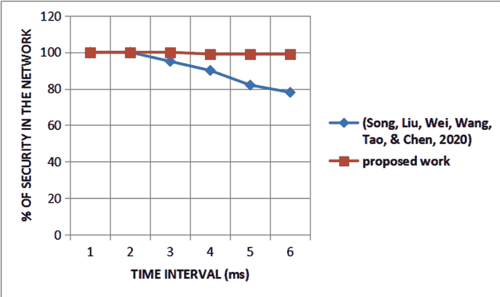
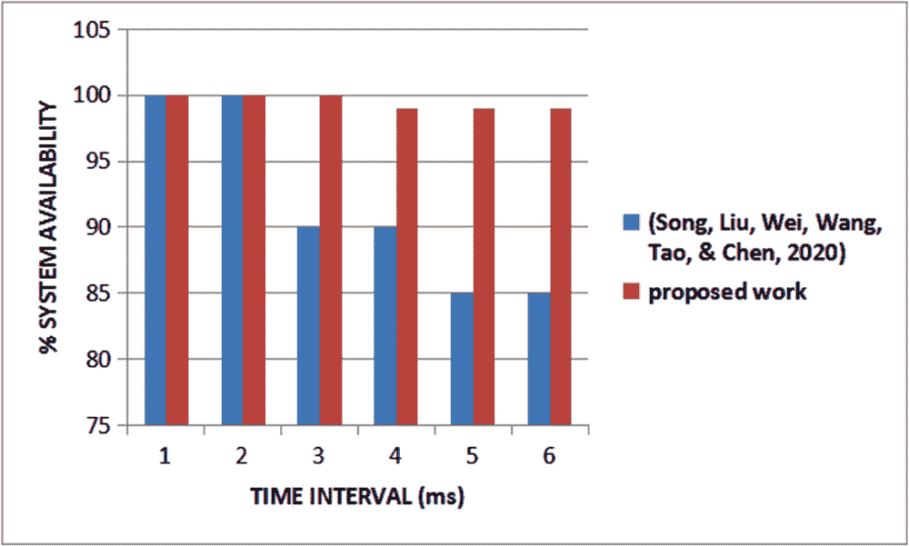

# 第九章

# 云物联网环境中的先进关联防御

+   Ambika N.

    

    印度圣弗朗西斯学院

摘要

物联网是支持分布式物联网应用程序开发的平台。因此，它提供了一个促进基础设施定义和系统部署的物联网自动化系统。该系统包括用于在整个物联网计算系统中部署服务和应用程序的软件部署工具。先前的工作假定模型破坏时间长于模型更新周期。架构方法包括两部分：工业物联网设备及其云服务器。云服务器包括两个模块。攻击监控模块根据其位置或类型记录工业物联网设备的最新攻击信息。该模块管理包含所有已报告的攻击方案的库。当攻击监控模块为设备检测到新的攻击时，将要求工具下载相应的攻击方案，以进行对抗性重新训练。改进的建议使可用性提高了 8.54%，安全性提高了 9.54%。

引言

物联网（IoT）（Ambika N.，2020）（Atzori，Iera 和 Morabito，2010）目前在各个领域广泛应用。它涉及智能建筑（Akkaya，Guvenc，Aygun，Pala 和 Kadri，2015）、电力网络、娱乐、交通（Masek 等，2016）和医疗保健（Elhoseny，Shankar，Lakshmanaprabu，Maseleno 和 Arunkumar，2018）。预计它将在未来的技术革命中发挥重要作用。它的使用可能会在未来几年内大幅增加。许多物联网设备很容易成为攻击目标。它们在网络层连接到外部资源，并且缺乏适当的安全保护。攻击者侵入网络层并控制物联网设备（Nagaraj，2021）。物联网设备为攻击者提供了许多合约机会。它使用恶意消息、配置攻击和拒绝服务攻击等多种类型的攻击。攻击检测的机制是分离的。它支持通过连接数据处理、技术设备和传感器等工具，以智能的方式处理和分析数据，并实现自主动态。

云处理（Aceto，Botta，Donato 和 W.，2013）（Ambika N.，2019）填补了物联网的前端。它允许最终用户利用互联网支持的整个服务范围来执行其日常计算操作。它还为物联网提供了高性能、可靠的等级和普及性。这些任务包括物联网中基于云的攻击检测。这是一个集中的攻击检测系统。由于存储和处理来自越来越多的设备的数据带来的开销，它表现不佳。这表明当前基于云的攻击检测系统无法解决攻击检测问题。

先前的工作（Song，Liu，Wei，Wang，Tao 和 Chen，2020）认为模型破坏时间长于模型更新周期。架构方法包括两个部分：工业物联网设备及其云服务器。驻留在工业物联网设备中的深度神经网络负责对抗恶意模型的深度神经网络的发展。最初，所有工具共享相同的深度神经网络。它们在不同的环境中进行交流。它们经历不同的数据模型和不同类型的攻击。不平衡使联合学习成为汇总不同防御能力的最佳解决方案。云服务器包括两个模块。攻击监控模块记录工业物联网设备的最新攻击信息，如其位置或类型。该模块管理一个包含所有已报告攻击方案的库。当攻击监控模块检测到某个设备的新攻击时，它将要求该工具下载相应的攻击方案，以进行对抗性重新训练。联合防护模型生成模块定期收集设备斜坡信息并将其聚合以实现具有更好鲁棒性的更新模型。然后，该模块将新形成的模型发布到所有连接的工业物联网设备上，以进行模型同步。在工业物联网设备执行期间，该设备保持一个缓冲区以保存自然模型。在特定周期内，所有工业物联网设备以联合学习方式进行重新训练和同步。这个过程包括三个阶段。每个设备本地生成相应的对抗模型以形成一个重新训练集，其元素是自然模型和相应对抗模型的集合。在第二步中，本地对抗训练过程定期将从工业物联网设备获得的新获得的角度信息上传到云服务器以进行模型更新和同步。由联合防护方法生成的模型并将每个连接的工业物联网设备都发给了。

该工作有一些缺陷。软件攻击通过部署的物联网设备下载。攻击可以使设备表现异常（如果它们被入侵）。因此，保护机器免受入侵者的攻击是必要的。设备收集攻击数据。该建议通过使用两种类型的设备增强安全性。非法位加载到动态设备中。同样被传送到云中。云生成预测模型并将其更新到静态仪器中。与之前的贡献相比，设备的安全性提高了 9.54%，可用性提高了 8.54%。本章分为四个部分。第二部分总结了其他作者提出的建议。第三部分详细介绍了该提案，并将工作与之前的贡献进行了比较。第四部分总结了本章。

文献综述

许多作者就所考虑的领域提出了他们的建议。本节总结了相同的内容。一种深度区块链系统（Alkadi、Moustafa、Turnbull 和 Choo，2020）区分了数字攻击并保护了云中的信息。故意的设计包括四个主要部分。它们是位于区块链网络中的云网络内的元素。这些实体被指望有足够的云服务来提供给它们用户功能。基于隐私保护的区块链和智能合约层与传统的云网络不同，因为它包含了一个联盟区块链。这个特性在多云网络的多个节点中重复存储，包括在中央协调器、数据中心或个人主机内。该提案是与比特币构造相似的数据结构。挖掘新块会奖励添加块到区块链的过程中。中央协调器充当 SIEM 工具，用于存储检测系统审核日志和警报。各种来源经过分析和区分。它与识别正常和异常事件相关联。这将使网络管理员能够迅速缓解风险，并增加云网络内参与者的安全意识。协调的检测系统元素协调运行在云交换网络上的帧的验证，并进一步确保了规定的标准。它们包括部署在大型分布式网络或个人上的多个检测系统。它识别托管的网络攻击并防止可能的非法活动。检测系统的作用是提高单个检测系统节点的整体检测准确性。它连接了跨多个子网络的攻击证据。

安全设置会议层（Choi & Choi, 2019）通过利用从分布式计算层和物联网层传递的安全信息来决定安全设置。 它使用设置推断模块。 它使用宇宙学中描述的数据来决定安全设置。 安全设置管理层是一个收集安全设置数据的模块。 它通过收集物联网设备的安全信息来创建设置数据。 它在设置推断模块中提供安全事件。 推理引擎和管理规则模块将问题生成和安全设置方法覆盖到网络宇宙语言中，以引导安全设置形而上学。 设置推断模块将接收到的安全设置数据转换为问题类型。 它参考设置方法和计划的推理规则。 推断安全设置数据后，提供响应策略。 它为安全响应模块提供安全设置。 在强大的物联网-云环境中，安全设置推断模块包括推理引擎和形而上学存储库。 三元解释器，问题管理员和推理属于推理引擎，并与宇宙存储库进行交互。

利用智能医疗系统（Alhussein, Muhammad, Hossain, & Amin, 2018）是一个相互连接的智慧城市环境。它使居民和临床医生能够利用交互式传感器设备、云和认知物联网感知技术记录他们的电子健康记录。通过智能可穿戴技术和通信，患者可以持续更新他们的健康相关数据。认知系统实时分析智能并执行最佳操作以帮助患者。由临床工作人员分析上传的数据以提供帮助和咨询给相关患者。这种类型的患者病房医疗监控对医疗保健至关重要。它实现了其重要目标，例如低医疗成本。本地层将来自物联网设备层的信号发送到由异构设备组成的托管层。它可以由患者佩戴或嵌入在城市环境中，例如智能家居、医疗中心、办公室或汽车中。这些传感器设备也可以使用短程通信相互通信。LAN 接口层是短到中程通信和设备之间互连的智能通信协议。托管层包含异构的智能设备，例如智能手机、平板电脑、个人数字助理、计算机或工作站，这些设备收集数据并在本地处理。这些设备具有通过专用应用程序或程序识别一般健康异常的处理能力。健康问题可能包括心率异常、血压或体温。它通过 WAN 接口将同一数据发送到云进行处理。云包括云管理员、数据中心、特征提取服务器、地址服务器和分类服务器。云管理员首先验证居民是否是智能医疗保健提供商的一部分。云管理员负责监控智能医疗系统中所有利益相关者的身份。云管理员控制与各种服务器之间的数据流，并管理通信、存储和各种资源。云管理员将数据发送到认知引擎。它利用多模态智能功能包括脑电图、心理和生理学习，并确定患者是否需要紧急护理。

这是一种半监督模糊 C 均值策略（Rathore & Park, 2018）。它将半监督模糊 C 均值与极限学习机分类器相结合，以帮助在物联网中进行有效的攻击识别。半监督聚类方法依赖于利用各种类型的先验知识来增强聚类性能。它允许数据突出显示具有几个层次的参与，并提供了聚类中的额外理论发展。因此，它提供了一种更合理的处理样本的方法，并且还可以识别不可避免的异常。初始过程意味着找到隐藏的空间结构的第一个目标函数，并且第二项考虑到标题数据来定义数据结构。该算法基于精确的风险最小化。SLFN 的输出层上的数量由随机分配到输入和隐藏层的权重和偏差来控制。例如，支持向量机以更快的学习速度提供更好的投资执行。它首先在标记数据集上训练分类器以生成准备好的模型。分类器使用隐藏节点和 sigmoid 激活函数作为隐藏节点输出函数。

该系统（Tian, Luo, Qiu, Du, & Guizani, 2019）具有数据准备、可视化和操作功能。来自边缘设备的 URL 首先将被发送到数据准备部分，处理后的数据输入到特征判别器和数据判别器进行检测。操作将根据感知结果做出响应。数据准备将从边缘设备收集的原始 URL 转换为表示形式。原始 URL 将在处理中进行解码和转换，并以学习规范化中的特殊格式对数据进行编码。表示的数据被发送到数据判别器。它适应了特征判别器的输入。知识还将被转换为特征表示中的向量。判别负责识别正常的 URL 请求和包含网络攻击的异常的 URL 请求。在我们的系统中，我们提出了多个模型。操作在所有判别器达成相同决定时做出响应。如果被识别为预期的 URL，操作将执行常规响应。

Fog 期望在云到物的连续性中开始到结束对抗者的保险。在总体框架中，通信的可靠性始于确保个体节点的安全。攻击检测系统（Diro & Chilamkurti, 2018）在环境中起着关键作用，作为一种防御机制。架构揭示了在每个核心上执行训练和检测工作的方式。计划中心注册并分发模型和参数的更新到每个节点。这种设计提供了在单个位置存储、处理和测试数据的机制，即云。它分发了在本地节点上存储的算法、控制和数据。每个节点通过一个协调节点与附近的物联网设备的入侵进行识别，并与邻近节点交换学习经验。

雾节点（Diro & Chilamkurti, 2018）负责在分布式雾网络边缘处理模型并托管攻击检测系统。规划主节点应准备好共享和优化边界。它为本地攻击检测提供了独立性。它使用本地训练和边界优化。主节点更新每个协作节点的边界。它将结果更新传播回到专家节点。

**拟议工作**

先前的工作（宋、刘、魏、王、陶、陈，2020 年）认为，模型破坏时间长于模型更新时间框架。工程方法包括两个部分：工业物联网设备及其云工作人员。工业物联网设备中的深度神经网络负责对抗敌对模型的深度神经网络的发展。起初，所有工具共享相似的深度神经网络。它们在不同环境中传输。它们经历不同的数据模型和不同类型的攻击。不平衡使得联合学习成为不同防御能力的最佳解决方案。云工作人员包括两个模块。攻击监视模块记录工业物联网设备的最新攻击信息，例如它们的位置或类型。该模块管理一个包含所有报告的攻击方案的库。当攻击监视模块检测到某个设备的新攻击时，它将要求该工具下载相应的攻击方案，以便进行敌对性重新训练。联合防御模型生成模块定期收集设备斜坡信息并将它们汇总以获得具有更好鲁棒性的更新模型。然后，该模块将新形成的模型启动到所有连接的工业物联网设备上，以进行模型同步。在执行工业物联网设备时，设备保持缓冲区以保存自然模型。在特定时期内，所有工业物联网设备以统一的学习方式进行重新训练和同步。该过程包括三个阶段。每个设备本地生成相应的敌对模型，以形成一个重新训练集，其元素是自然模型和相关敌对模型的集合。在第二步中，局部敌对训练过程定期将从工业物联网设备传输的新获得的角度信息上传到云工作人员以进行模型更新和同步。模型由联合防御方法生成，并分发给每个连接的工业物联网设备。

先前系统的缺点

+   软件攻击由部署的物联网设备下载。攻击可能会使设备表现异常（如果它们受到威胁）。因此，保护设备免受入侵者的攻击是必要的。

+   设备收集攻击数据而不是感知数据。

假设

+   部署的物联网设备容易受到攻击。它们可能会受到威胁并引入不同类型的攻击。

+   设备加载了预测模型。入侵者引入的攻击与对手的行为部分/完全匹配。因此，通信位和预测模型之间的映射提供了通信方的意图。

+   部署了两种类型的物联网设备 -

    +   o 静态物联网设备感知环境并将处理后的数据提供给主机（云）。它们还被编程以通过与预测模型进行验证记录攻击的发生。

    +   o 动态设备从一个位置移动到另一个位置对数据进行取样。

    +   o 两台设备都根据其位置进行同步。

静态设备的作用

静止和动态节点的比例为 3:1。静态设备安装在相同的环境中以感知环境。这些设备将通信位与预测模型进行比较。如果它感知到设备是非法的，它会向移动设备发送相同的消息。此设备维护攻击发生次数、攻击时间和其样本数据（通信的一些位）的计数。

动态设备的责任

动态设备在从静止设备接收到消息后。该设备移动到静态设备的位置并与入侵者通信。它从中收集样本并与存储（云）通信。

其余功能类似于（Song、Liu、Wei、Wang、Tao 和 Chen，2020）。

方案分析

该建议通过使用两种类型的设备增强了安全性。非法位加载到动态设备中。相同的内容传输到云端。云端生成预测模型并将其更新到静态设备。使用 NS2 进行了仿真工作。表 1 表示模拟环境中的设置。

表 1\. 模拟环境中的设置

|           使用的参数 |           解释 |
| --- | --- |
|           网络的维度 |           200 米* 200 米 |
|           静态节点的数量 |           15 |
|           动态设备的数量 |           3 |
|           对手的数量 |           4 |
|           通信数据的长度 |           750 位 |
|           样本位的长度 |           10 位 |
|           预测模块的大小 |           100 kb |
|           预测模块中的规则数 |           200 |
|           总仿真时间 |      60 秒 |

安全性

与之前的工作相比（Song、Liu、Wei、Wang、Tao 和 Chen，2020），静态设备更安全，因为这些设备不参与收集攻击位。这些设备安全性提高了 9.54%。图 1 表示相同的情况。

| 图 1\. 与安全性相关的两项工作的比较 |
| --- |
|  |

可用性

先前的工作（Song, Liu, Wei, Wang, Tao, & Chen, 2020）安装了软件（攻击位）。它将参与相同的处理。安装设备以感知环境并及时采取一些适当措施。因此它们的可用性是必需的。该贡献有两种类型的设备安装。一组执行常规活动并列出攻击位。第二类设备对攻击位进行采样并与云通信。与先前的工作（Song, Liu, Wei, Wang, Tao, & Chen, 2020）相比，该提议将可用性提高了 8.54%。图 2 表示相同。

| 图 2\. 系统可用性表示 |
| --- |
|  |

结论

物联网（IoT）包括具有个性、物理属性和虚拟属性的不同事物。它无缺地安全地融入到互联网中。物联网以狂乱的高峰交通、设备结构、功能和延迟要求的极端异质性，以及从云到设备的极端地理分布，即所谓的云到物的连续体，来描述。传统模型是分布式计算。它通过在云中进行集中存储和处理，并通过将这些功能集中在多租户数据中心中获得规模经济效益，从而形成出人意料的经济和技术原则来评估物联网。

先前的工作认为模型破坏时间比模型更新时间长。工程方法包括两个部分：工业物联网设备及其云服务器。云服务器包括两个模块。攻击监控模块记录工业物联网设备的最新攻击信息，如其位置或类型。该模块管理一个包含所有已报告的攻击方案的库。当攻击监控模块检测到某个设备的新攻击时，它将需要工具以下载相应的攻击方案，以进行恶意重新训练。改进的方法通过增加 8.54%的可用性和 9.54%的安全性来改进先前情况。该建议通过使用两种类型的设备来增强安全性。非法位被加载到动态设备中。相同的内容被传输到云端。云生成预测模型并将其更新到静态设备。

参考文献

Aceto, G., Botta, A., de Donato, W., & Pescapè, A. (2013). Cloud monitoring: A Survey. Computer Networks , 57(9), 2093–2115\. doi:10.1016/j.comnet.2013.04.001

Akkaya, K., Guvenc, I., Aygun, R., Pala, N., & Kadri, A. (2015). IoT-based occupancy monitoring techniques for energy-efficient smart buildings. In IEEE Wireless Communications and Networking Conference Workshops (WCNCW) . IEEE.

Alhussein, M., Muhammad, G., Hossain, M. S., & Amin, S. U. (2018). 智能医疗保健的认知 IoT-云集成：癫痫发作检测与监控案例研究。 移动网络和应用，23(6)，1624–1635。 doi:10.1007/s11036-018-1113-0

Alkadi, O., Moustafa, N., Turnbull, B., & Choo, K. K. (2020). 一种启用区块链的深度协同入侵检测框架，用于保护 IoT 和云网络。 IEEE IoT 杂志，1–12。

Ambika, N. (2019). 使用 GPS 数据的虚拟专用网络中的能量感知身份验证。在《IoT 环境中的安全、隐私和信任》（第 25-38 页）。 Springer。

Ambika, N. (2020). 云端工业 IoT 设备数据加密。在 Pal, S., & Díaz, V. G.（编），《IoT：安全与隐私范式》（第 111–129 页）。 CRC Press，Taylor & Francis Group。

Atzori, L., Iera, A., & Morabito, G. (2010). 物联网：一项调查。 计算机网络，54(15)，2787–2805。 doi:10.1016/j.comnet.2010.05.010

Choi, C., & Choi, J. (2019). 基于本体的电力 IoT-云安全服务的安全背景推理。 IEEE Access: 实用创新，开放解决方案，7，110510–110517。 doi:10.1109/ACCESS.2019.2933859

Diro, A., & Chilamkurti, N. (2018). 利用 LSTM 网络进行雾到物通信中的攻击检测。 IEEE 通信杂志，56(9)，124–130。 doi:10.1109/MCOM.2018.1701270

Diro, A. A., & Chilamkurti, N. (2018). 利用深度学习方法的 IoT 分布式攻击检测方案。 未来的计算机系统，82，761–768。 doi:10.1016/j.future.2017.08.043

Doukas, C., & Maglogiannis, I. (2012). 将 IoT 和云计算带向普及医疗保健。 6 届创新移动与普适计算中的国际会议。

Elhoseny, M., Shankar, K., Lakshmanaprabu, S. K., Maseleno, A., & Arunkumar, N. (2018). 用于物联网中医学图像安全的混合优化与密码学加密。神经计算与应用，1–15。 doi:10.1007/s00521-018-3801-x

Masek, P., Masek, J., Frantik, P., Fujdiak, R., Ometov, A., Hosek, J., Andreev, S., Mlynek, P., & Misurec, J. (2016). 智能城市交通管理的协调视角：用于道路交通建模的新型 IoT 驱动环境。 传感器（巴塞尔），16(11)，1872。 doi:10.3390/s16111872

Nagaraj, A. (2021). 介绍 IoT 和云计算应用中的传感器。 Bentham Science Publishers. doi:10.2174/97898114793591210101

Rathore, S., & Park, J. H. (2018). 基于半监督学习的 IoT 分布式攻击检测框架。 应用软件计算，72，79–89。 doi:10.1016/j.asoc.2018.05.049

Song, Y., Liu, T., Wei, T., Wang, X., Tao, Z., & Chen, M. (2020). Fda3：云端 IIoT 应用中针对对抗性攻击的联邦防御。 IEEE 工业信息学刊，1–8。 doi:10.1109/TII.2020.3005969

Tian, Z., Luo, C., Qiu, J., Du, X., & Guizani, M. (2019). 一种用于边缘设备上 Web 攻击检测的分布式深度学习系统。IEEE 工业信息学刊, 16(3), 1963–1971。doi:10.1109/TII.2019.2938778
