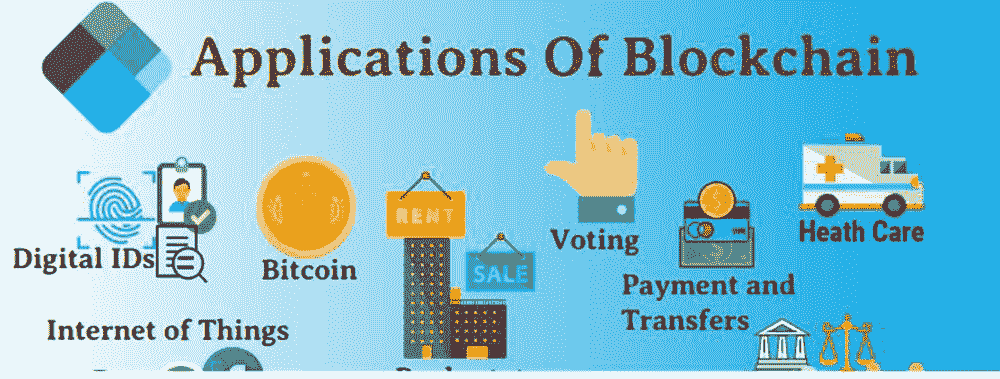

# 第十章

# 区块链技术的最新趋势：

挑战与机遇

+   Kannadhasan S.

    

    印度 Cheran 工程学院

+   R. Nagarajan

    印度 Gnanamani 技术学院

摘要

区块链是一种点对点（P2P）分布式分类帐技术，为新一代交易应用提供开放性和信心。比特币的基本构造是区块链，它由三个核心元素构成：分布式网络、公共分类帐和数字交易。数字交易由分布式网络的成员在公共分类帐中记录。在将计划的交易添加到网络之前，网络的成员运行算法来测试和验证。如果网络参与者中的一些人认为交易是合法的，则将最新交易应用于公共分类帐。在几分钟或几秒钟内，对公共分类帐的更改会在区块链的所有副本中得到反映。一旦添加了交易，交易就是不可变的，不能被撤销或删除。网络的任何一个用户都无法篡改或更改数据，网络中的每个人都有完整的区块链副本。区块链是由网络成员组成的节点的点对点（P2P）网络。

引言

区块链已经被公认为所有交易的分布式分类帐，并在首次概念化为数字货币比特币中作为促进交易的中心特征后，通过将点对点基础设施与公钥密码学集成解决了双重支付问题。区块链字面上是记录比特币交易的知识块网络；当然，有严格的法律规定如何检查区块的真实性，以确保它不能被更改或消失。区块链技术指的是生成、添加和利用块的算法和计算基础设施。区块链技术通过使用公钥密码学来解决双重支付困境，其中每个个体都被赋予一个私钥，并且与所有其他用户交换公钥。区块链背后的基本概念是它是一个分布式分类帐，其中包含参与者交换的交易记录。这些交易中的每一个都由系统的多数用户验证，不合法的交易无法通过共同审查。一旦生成并获得区块链的批准，记录就永远无法更改。现有的区块链研究主要集中在设备性能、稳定性和新颖应用上。区块链面临的最关键问题之一是性能（Abbott，2000；Allenby，2012；Almeida 等，2015；Antonopoulos，2014；Ansell＆Gash，2007）。要在区块链上构建新的交易记录，需要非常严格的身份验证程序，这导致验证周期大大延长，计算资源浪费严重。

目前，一次交易需要大约 10 分钟才能得到认证。成千上万的节点正在工作以处理和验证转账。这些问题严重限制了区块链实施的范围。作为一种替代方案，由于物联网设备必须处理有限的计算能力或低强度，现有的区块链方法通常不适用于物联网（IoT）网络。作为一种创新平台，区块链被誉为解决个人、技术和组织需求的新方式。对于合同，信任已经成为区块链可能提供的一个关键功能。由于现代信任结构从区块链中出现，人们可能能够在不违反隐私的情况下分享他们的资产。区块链技术允许开放、点对点和基于联盟的商业群组组织。比特币框架已经成为一个去中心化企业的现实模型，在这个模型下，没有一个单一的政府负责系统的问题和管理。区块链框架中节点之间的对等关系是点对点的。此外，区块链有组织、投票和形成联盟的能力。区块链系统的技术组件包括无信任计算、智能合约和网络稳定性（Dubovitskaya 等，2017 年；Kblaw 等，2016 年；Mylrea & Gourisetti，2017 年；Strobel 等，2018 年；Yaji 等，2018 年）。

在共享的区块链方案中，要达成共识。人们可能不必关心智能合约的信任问题，因为一个实体将自主依赖代码的自动执行。这些功能是基于网络的可靠性，这允许用户在进行业务交易时对设备放心。研究人员应该进行三个阶段的分析来解决市场环境下区块链实施的问题：逻辑、规范和描述水平。目前，区块链市场分析主要集中在概念阶段，这个阶段将区块链技术在商业中的概念化，以及规范水平，这个水平详细描述了区块链的业务实施。

对于医疗保健和信息技术来说，这是一个有趣的时刻。医疗保健正在经历一个开创性的转变，结合了特定患者的基因资料、饮食和气候，得益于基因科学和精准医学的进步，实现了疾病预防和管理。同时，技术的进步导致了庞大的健康记录库、用于追踪健康数据的资源，并增加了人们对自己健康保健的参与度（How Blockchain Can Fight Fraud，2019 年；Kolias 等，2017 年；Kshetri，2017 年；Trautman & Ormerod，2016 年；Yeoh，2017 年）。在健康信息技术领域，结合这些医疗保健和信息技术的进步将带来革命性的改革。

区块链技术

区块链技术有望解决医疗信息技术系统中现有的互操作性问题，并成为技术规范，使患者、医护人员、医疗机构和医学研究人员能够安全地交换电子健康记录。每个网络参与者都保留着区块链的相同副本，并参与网络的协作阶段，验证和认证加密交易。区块链可以保存任何类型的数据或数字资产，实施区块链的网络决定了每个交易中保存的数据类型。为了确保真实性和一致性，数据被安全地数字签名。区块用于组织交易，每个区块都包含了区块链中前一个区块的加密哈希值。区块按照时间顺序放置。比特币是建立在开源加密协议上的加密货币交易网络，被证明是极其安全的。尽管某些比特币交易背后的名称保持秘密，但该网络通过允许每个人查看区块链上每个比特币地址的余额和交易来促进开放性。

比特币公共区块链不适用于需要隐私和受监管、可审计访问的医疗区块链，因为缺乏数据隐私和强大安全性。此外，对于大规模和常用的区块链实施，比特币标准的区块大小和每秒最大交易数量引发了可扩展性问题。隐私、稳定性和可扩展性问题将由私有和由财团主导的区块链来解决。另一方面，这些区块链将提出独特的问题，因为它们不是供应商中立的，也不遵守透明原则。消费者将完全决定他的数据如何传输，并完全访问它。消费者必须指定谁可以查询和写入他的区块链，并授予一系列访问权限。消费者将能够通过智能手机仪表盘功能查看谁有权查看他的区块链。消费者现在将看到一个审计列表，显示谁已经访问了他的区块链，以及在哪里和访问了什么数据。消费者将能够通过相同的仪表板向任何具有唯一标识的人授予和撤销访问权限。

访问管理的权限将比“全有或全无”的权限更加开放。 消费者将创建具体的、信息丰富的转移，描述谁有权限、他们有多长时间的访问权限以及他们可以访问哪些类型的数据。 消费者将随时更改他或她的权限。 访问管理规则也将自动在区块链上维护，只有客户才能修改它们。 这创造了一个透明的氛围，在这个氛围中，消费者完全控制着收集哪些数据以及如何传输这些数据。 在被授予访问用户健康记录后，医疗公司搜索区块链以获取用户的详细信息，并使用数字签名进行验证。 为了解释健康详情，医护专业人员可以使用个性化的最佳方案程序。

区块链可以在易于获得和稳定的商品硬件上运行。 商品硬件以最少的资金提供最有用的计算。 这些硬件是基于开放规范构建的，并由各种公司制造。 对于健康和基因科学而言，这是最经济实惠且最可靠的设计。 多余的区块链硬件容量可以与健康研究人员交换，以便更快地进行药物和治疗探索。 健康 IT 环境中的互操作性问题通常通过区块链技术来解决。 健康 IT 应用程序可以使用开放的 API 与健康区块链连接和共享数据。 该行业的最佳实践用于创建开放的 API。 它们易于使用，并将最大程度地减少各种系统之间复杂的点对点数据集成的需求。 患者、医疗保健提供者和分析师将能够使用单一的共享数据源收集可靠、正确和详细的患者健康数据。 患者的智能手机应用程序、可穿戴传感器、EMR、记录和照片只是区块链数据系统配备的数据湖可能帮助的健康数据流之一。 这些数据系统是灵活和可扩展的，它们将能够处理任何可能可用的数据。

低成本移动设备和可穿戴传感器产生的数据量正在呈指数增长。基于通用硬件构建的分布式架构提供了成本效益和高可扩展性。随着更多的健康数据被添加到区块链中，成本效益的通用硬件可以迅速投入以支持升级的负载。区块链分布式设计的内置错误容忍和灾难恢复是另一个好处。数据分布在各个位置的许多服务器上。没有共同的崩溃点，并且同时影响两个区域的灾难是不可能的。区块链使用常见的算法和协议进行加密和数据安全。这些创新已经经过彻底检查并被认为是安全的，并且它们通常被各种行业和政府机构广泛使用，如图 1 所示。

区块链技术系统将成为从可穿戴设备和手机收集数据的理想选择，为关爱并提供有价值的见解，以及患者报告的结果。此外，通过将智能手机应用程序和可穿戴传感器的健康数据与传统 EMR 和基因组学数据集成，医学研究人员可能进一步将个体区分为对特定药物反应良好或对某种疾病更易受到影响的亚群体。一旦患者拥有定期的定制健康记录，他们将更加投入自己的健康治疗，而且执行力肯定会增加。此外，允许医生收集更加常规的数据（例如，每天测量血压或血糖而不仅仅是当患者前来预约时）将增加个性化护理和专门针对结果/治疗有效性的药物计划。

连续可用性和与实时数据的连接将通过区块链得以确保。医院服务管理和应急情况下的临床护理将受益于实时数据访问。研究人员和公共政策资源将能够使用实时数据跟踪、隔离并加速影响公共健康的环境因素的改革。例如，疫情可能会早期报告和控制。区块链对移动应用程序和可穿戴传感器数据的实时可用性将允许对高危患者进行全天候、24 小时不间断的监控，并推动“智能”应用程序的发展，这些应用程序将在患者跨越干预的关键阈值时提醒护理人员和医疗专业人员。早期干预恢复服务可以由护理团队与患者联系协调。医疗区块链可能会鼓励为医疗提供者开发一种新型“智能”应用程序，这些应用程序将挖掘最新的医学研究并制定个性化的治疗路径，医疗提供者和患者都可以访问相同的信息，并根据研究结果进行合作、知情的讨论，以确定基于研究结果的最佳治疗方案。

| 图 1. 区块链技术 |
| --- |
|  |

区块链技术的应用

区块链在许多领域都有多种实现方式，其中农业是最令人兴奋的之一。食品溯源保护、数据库系统、农产品贸易、银行业、种子登记和保险都是农业区块链应用的示例。因此，本文旨在研究农业领域的区块链应用，涵盖了从 Web of Science 到 Scopus 的所有主要数据库。据报道，虽然农业领域有几个基于区块链的应用，但只有少数国家把握住了这一机遇，其中以中国为首，美国、意大利、印度和西班牙紧随其后。本文还研究了农业区块链科学的新兴发展，并提出了潜在研究的建议。区块链是当今环境中最被热议的话题之一，也被认为是迄今为止最具破坏性的发明之一。区块链是一个公共账本，具有去中心化和加密不可篡改的特性。它用于记录数字交易的过去（IBM，Hyperledger）。在区块链方案中，每个参与者（利益相关者）都保存着系统曾经处理过的所有先前交易的副本。然而，没有一个节点/方只拥有机器，这表明它不是集中化的。这种去中心化结构模式建立了信任的基础，因为系统中的所有操作都是透明的，并且所有利益相关者都可以进行审计。为了进行任何交易，必须遵循共识算法，该算法确保大多数节点必须就该事项达成一致意见，以便对其进行验证和批准。此外，由于基于区块链的框架不需要中介或第三方进行交易，因此结算成本降低了。这些交易通常是永久性的，消除了每个公共或私人实体充当中间人的需要，从而实现了更有效的方法。与之相关的成员不需要彼此信任，因为结构和代码是无懈可击的。

在考虑一个居民数量有限的村庄时，两个个人或团体之间必须达成一项交易。村庄里的所有人都聚集在一个共享的论坛上进行这次交流，这个交易在所有人面前进行。所有人都应该在他们的笔记本上记录这次交易。现在，将来或在任何时刻，交易中涉及的两方都不会说出任何错误的细节或争议交易，因为村庄里的每个人都有原始的记录。为了篡改信息，欺诈者将不得不改变村庄中每个人的副本上的通知，这在实践中是不可能的。假设这些交易是通过机器进行的，每个村民都有自己的机器来保存记录。此外，这些转账是通过匿名的批准者（也称为矿工）进行加密、认证和验证的。这就是在现实世界的区块链环境中的工作原理，其中所有的数据/记录都被保存在区块中，网络上的每个人都有一个副本。任何新的交易都被引入到新的堆栈中，该堆栈连接到之前的堆栈。由于它是经过加密保护的，因此无法篡改。图 1 描述了基于区块链的方法的详细操作，该方法可以用六个简单的步骤来说明。在第一阶段，要求进行一次交易，而在第二步，该交易将被广播到所有相关的网络中。

区块链技术正在为一种现代形式的货币结算奠定基础，该技术有能力颠覆全球法定货币体系。比特币是一种新创建的加密货币，引发了全球范围内的兴趣和期待，它是建立在区块链操作特性之上的。区块链技术不依赖于集中式基础设施，而是通过一个由相互连接的数据网络组成的网络来分布数据库。区块链是一个计算数据系统，它存储了自区块链成立以来发生的所有交易。这个安排被复制并在所有参与的网络计算机之间交换。当提交新的交易时，它将与其他交易一起批处理，形成一个“堆栈”，然后定期添加到区块链的前端作为最新的交易“块”。参与的计算机网络更新他们的区块链，以匹配约定的区块链，直到“块”被多数计算机承认。

区块链的好处多多。首先，它目前是一个点对点网络，没有单点故障。如果一个节点失败，剩余节点可以继续工作，确保系统的可用性和可行性。其次，几乎所有数据都是数字化的，可以在各种应用中使用。第三，由于区块链上的所有交易对所有用户都是透明的，因此可审计性和信心得到了提高。第四，对区块链进行修改是非常复杂的，因为如果出现问题，所有其他用户都会知道，如果不经过验证，它将被从区块中移除。区块链的应用前景不可否认。“根据高盛公司的说法，‘区块链有能力改变我们购买和销售的方式，与政府互动，并检查从土地契约到有机蔬菜的所有内容的有效性。’它将互联网的透明性与密码学的可靠性结合起来，为任何人验证关键细节并建立信任提供了更快，更安全的方式。”虽然许多公司正在进行区块链计划，但尚未出现全面部署的迹象。当早期采用者分享他们的成功故事时，这肯定会发生变化。尚待决定的部署之一是收益是否能超过费用。由于没有相关第三方的参与，目前无法全面替换传统的应用程序和流程，因此无法实现区块链技术的全部效用。这给希望超越探索阶段的实施者带来了一个难题：是否值得为现在几乎没有用处的技术进行大量资本投资？最有可能实施的程序将是具有明确和有限焦点的程序，以便进行简单快速的后续跟进和审查。

处理电子支付，互联网商务几乎完全依赖于作为可信第三方的金融实体。尽管该方案对某些购买是足够的，但它也受到基于信任模型固有缺陷的影响。

由于金融公司无法防止调解冲突，完全不可逆转的交易是不可行的。结算费用提高了交易费率，降低了最低交易金额，并消除了小型非正式购买的可能性，以及在缺乏允许非可逆购买的权利的情况下造成更大的成本。随着撤销的可能性增加，信心的需求也在增加。客户应对那些向他们索要比他们想要的更多详细信息的商家持怀疑态度。

一定程度的欺诈被认为是不可避免的。当使用实际货币时，这些费用和转移风险可以通过面对面消除，但是通过消息传递系统进行转账时没有办法允许没有可信任的第三方参与。需要一种基于加密证据而不是信任的电子支付机制，使得任何两个愿意的交易方都可以直接相互交互，而不需要可信任的第三方参与。通过计算无法取消的交易来保护卖家免受盗窃，消费者则通过标准的担保机制来保护，如图 2 所示。我们在本文中提出了解决双花问题的方案，该方案利用对等分布式时间戳服务器生成交易时间顺序的统计证据。只要诚实的节点联合控制的 CPU 计算能力比任何合作的攻击者节点社区多，该设备就是稳定的。

区块链是一种“分布式文档存档，或所有已完成并由参与方交换的所有交易或数字事件的公共分类账”。它允许点对点交易，排除了外部参与方（例如传统货币交换中的银行/金融机构/国家）并保持责任和成本效益。该技术在加密货币支付中的应用是目前最为当下和有争议的案例之一。

区块链可以是完全透明的，也可以是完全私密的。就像比特币、以太坊、莱特币等常见的去中心化区块链一样，前者是完全免费的，任何人都可以参与，即任何人都可以访问网络，申请进行交易或参与共识阶段。上述是一个基于邀请的网络，将写入权限集中在单一实体/组织手中。因此，它并不是真正的去中心化，并且限制了合同参与者的数量以及认证阶段。联盟区块链存在于完全去中心化的公共区块链和具有私密区块链的单一高度可信个体范式之间的任何地方。它是两种区块链形式的结合体，部分是去中心化的，共识机制由预先选定的节点集合控制。例如，在一个由三十个组织组成的联盟中，可以预先确定每个块必须由选定的代表中的十六位签名才能合法。宝马、通用汽车、福特和雷诺等合作伙伴最近推出了移动开放区块链倡议（MOBI），这是一个旨在使移动性更安全、更环保、更可访问的联盟区块链网络。

| 图 2\. 区块链技术的应用 |
| --- |
|  |

任何合同的基本基础都是信任，无论是交易实体、作为中介的银行/金融实体，还是作为监管机构的国家。 在数字环境中，通过展示身份（认证）和权限（授权）来建立这种信任。 在区块链技术下，每个用户都有一个私钥和一个公钥，类似于大学的公共和私人 IP 地址。 大学的用户将看到私人 IP，而公共 IP 则提供给网络并可以被其他用户使用。 类似地，一个人用他或她的私钥签署发送给另一个人的加密货币，他或她用他或她的公钥接收发送给他或她的地址的加密货币。 数字签名是由两个密钥共同工作形成的，发送/接收的信息是区块的一部分。 当一个人使用自己拥有的秘密密钥授权交易，并且区块链确认时，它将成为公共分类帐的一部分（在完全公开的区块链的情况下），每个人（所有区块链参与者）都将看到正在交易的价值。

虽然交易的匿名性得到保持，但通过保持交易者的身份私密，即参与者可以看到货币正在交换，但无法将交易与任何人联系起来。 以下图表更好地说明了隐私模型：此外，区块链被吹捧为一种不可腐败、不可辩驳和不可逆转的交易数据库。 它通过提供无与伦比的保护优势，与传统的交易媒介相比具有竞争优势。 如果一个黑客要进入区块链中的一个区块，他们必须通过任何之前的区块，一直回到区块链存在的开始。 他们必须同时在所有网络的账本上这样做，这可能达到数百万。 因此，区块链记录详细信息的方式使得对区块链的任何更改，例如插入、删除或修改数据，几乎不可能被其他区块链用户察觉不到。 例如，比特币区块链的每次更新必须由网络中 51% 的所有用户通过共识过程进行验证，这是不太可能发生的，因为他们没有理由去处理链的“旧”区块。

区块链技术的各个领域

区块链技术是一个非常新的概念。根据维基百科的说法，它是“一个不断增长的文档列表，称为方块，通过使用密码学进行绑定和锚定”。我们将在本文中对区块链研究中的流动问题进行代表性分析，并讨论潜在的影响以及我们的建议。尽管区块链并不为人熟知，但它正在迅速发展成为一个平台，并且是当前媒体上高度讨论的话题。然而，由于媒体趋势通常不符合研究模式，因此这也是一个有用的练习，用于确定学术、同行评议的研究分布如何涵盖一个倾斜的主题。在不久的过去，关于区块链的学术出版物很少；然而，这种情况正在迅速改变。在本文中，我们将呈现学术出版物中最新主题的图表，以及有关区块链的三个关键问题。我们将从区块链的定义开始。然后我们描述了我们用来收集数据的方法，并继续探讨我们发现的主题。接着讨论为什么区块链是重要的以及它目前的使用情况，以及我们的建议。最后，我们总结了对可能的区块链科学的潜力和需求的概述和几个思考。我们计划完整回答以下问题：什么是方块链？有哪些方块链分类和模式？新技术的社会和机械后果是什么？方块链最终会发生什么？然后我们被问道，“这些调查为什么如此重要？”它们有什么价值？为了继续，让我们回到起点。方块链首次在一篇名为“比特币：点对点电子现金系统”的论文中被发现，作者是一个化名为“比特币”的未知开发者。区块链的冠军之处在于记录不是由单一实体拥有或保存，而是每次交易都在参与交易的每台计算机上保存了交易的详细信息的副本。

“一个包含三行的表格，每一行都对应着一个特定的交易，主要部分存储着交易的时间戳，第二部分存储着交易的要点，第三部分存储着当前交易的哈希值以及其细节再加上前一笔交易的哈希值，” 根据区块链。寻求验证这一知识的各方将在任何时间点观看它，并包括时间戳和上一笔交易，因为它包含了过去的交易，所以可以轻松追溯背景。有一些预防措施可防止其他未参与交易的人参与调查。哈希，也称为第三部分，是一串扭曲的字母和数字，用于隐藏有关交易的事实。由于每笔交易的哈希将用于区分前一笔交易的哈希，因此几乎不可能发生误导。通过每个交易都包含前一笔交易的收据，金额可以一直追溯到最初。这一特性将使每个会计的工作变得更容易，因此不会再出现错误计算的金额或遗漏的收据。任何交易都是一个带有时间戳的屏幕截图，只有具有适当权限的人在存放或显示时才能查看。然而，区块链发明不仅局限于货币；由于账本中的任何交易都只是一个字符串值，交易可以轻松跟踪。伊利诺伊州库克县已开始使用区块链技术来管理土地契约在更换所有权时。区块链基本上是一个链接的知识块网络。

在我们的初步分析中，我们偶然发现了一篇关于区块链探索的涨潮和落潮的文章。从他们的讨论方式来看，他们似乎只能找到总共 41 篇经过同行评议的出版物。报告一开始就提出的最引人注目的观点之一是，他们发现 80% 的论文都集中在使用区块链进行比特币等数字货币交易方面。尽管只关注数字货币可能是这样一项调查的一个强有力的可能性，但他们选择专注于诸如稳定性、实施、适应性等高级区块链问题。他们还发现，研究大部分集中在区块链安全和隐私以及识别局限性方面。在对区块链进行广泛的序言之后，他们提供了他们用于精确映射分析的技术概述，这与我们在当前调查中正在改进的情况非常相似。他们的四个研究问题是：当前研究主题，区块链实现，当前研究中的裂缝，以及区块链的潜在发展方向。他们首先概述了他们用于查找文献的目录，然后是他们筛选过程的概述。在那个阶段，他们能够从编辑的作品中提取关键词和细节。他们考虑了来源-商业或学术界-以及地理区域，以及主题和发展日期。他们还称之为生产的组成部分：集会、研讨会、日记、书籍部分等等。最后，他们确定了三种不同的论文类型：区块链研究、区块链更新和区块链实施。在他们的审核过程中，大多数理论都以大数据流程图和图表的形式呈现。防御、浪费资源、便捷性、安全性和智能合约、加密货币的加密方式以及可靠性都被发现是区块链文献中的重要主题。他们发现，大部分研究都集中在改进新的区块链技术，其中有很大一部分关注加密和隐私问题。令人惊讶的是，这么少的研究关注其他主题，比如使用简易性和浪费资金。令人惊讶的是，当时有很多研究是基于比特币的。区块链技术的不同财务利益在基于区块链的情况下进行了讨论。

开发人员首先使用银行和所有基金，由于存放和反映所有交易而基本上被浪费。他们认为，使用较少的物品，如硬盘来存储记录或维持系统运行所需的额外能量，不仅比使用基于区块链的记录更花费银行更多的钱，而且通常会导致使用的资产更少。因此，自然界将受益，电子污染和能量使用将减少。此外，区块链交易的成本已经显示出更易管理，因为每笔交易的平均能耗已经下降（估算为每秒每千兆哈希的瓦特数，或者说十亿个小任务消耗的能量）。该能耗在 2014 年 10 月估算为 0.69 W/GHps，近两年后的 2016 年 9 月下降到 0.099 W/GHps，仅为能量成本的微不足道的 14％。另一位研究人员 Tranquillini 专注于区块链技术在金融行业中的潜力，而不是技术本身。他使用哈佛商业评论中由本杰明·埃德尔曼和达米安·杰拉丁教授发表的一篇先前文章，讨论了区块链技术在消费品行业的应用，作为展示这些技术在证券业中的潜力的基础。他审视了关于欧洲货币体系健康和稳健性的新兴关切，以及政府监管。他的文章在某种程度上表达了他对这种创造力潜力被纳入欧洲证券业社会管理控制的学术思考的出口。总的来说，他保持着审慎的距离，不设定特定目标，并且决定将这种想法付诸实践将会很困难。

当我们继续向前推进时，区块链技术将成为高等教育最相关的技术。他们警告说，如果不实施这样的技术，必然会发生什么，但他们也敦促我们调查区块链技术可能如何增强高等教育状况的广阔可能性。他们描述了四个高等教育领域的创新者可以关注的地方：学生数据、教学法、价格和教学模式（或元大学）。意义的定义在他们的论点中是至关重要的，而互联网在这方面受到严重限制。我们可以通过互联网交换记录，但我们交换的是文件和档案的版本，而不是原件。他们发现，区块链可以用来保存几乎对人类有价值的任何数据或知识。它可以用来保存一个人的所有数据，直到他们一生。这项技术将被用来记录教育里程碑的过程。当像区块链这样的技术在二十一世纪与工作和职业更相关联时，他们经常澄清高等教育将被迫适应或失去重要性。尽管过渡对于高等教育机构来说是困难的，但他们认为，转向区块链将迫使它们找到保持有效的新方法。表面上看，这两者似乎与政府如何处理收入存在矛盾，所以这似乎是一种奇怪的相似性。但他们认为，这项技术对古典自由主义者有利，因为它将资本从政府手中移走，并将其置于公民手中。这鼓励政府扮演更小的角色。在这样的方案中，贷款将不需要经过金融机构的审核。因此，政府将不对任何错误购买负责。这与联邦存款保险公司目前的立场类似。出于相同的目的，破坏政府的财政基础和政府支持的保险将允许人们拥有更多的影响力。这可能会导致银行业的透明度增加，确保每个人都能得到平等的关注。在特定情况下，区块链作为数据库的能力可能允许以分散的方式正确跟踪和记录工作小时。操纵将更加难以逃脱，鼓励人们确保其他人是否在进行工作。

由于区块链技术具有强大的吸引力，我们现在看到了它被主流接受。考虑到几乎每个行业都使用某种形式的敏捷记录，可以预见这种技术将被扩展到各种各样的应用中，其中一些在前面的页面中已经指出，比如智能城市的可能性，而其他一些正在进行中或尚未被发现。此外，由于技术的点对点特性以及任何利益相关者都可以访问自己的账本块，篡改细节或捏造账目从未如此容易。这本身就有可能提高对这些最新技术颠覆性的客户信心。由于任何新兴技术的基础都尚不完全清楚，因此无法预测技术将被广泛实施的程度。未来的研究应该关注这些问题和新兴技术，以及技术的接受程度。进一步的研究将揭示那些已经采用区块链技术的人员报告的效率改进（如果有的话）。研究还可以考虑为什么这种技术尚未流行以及客户信任水平。此外，随着技术的进步，潜在的研究将能够揭示一些最初未被识别的保护漏洞。区块链已经在各个领域迅速崛起，从银行业和医疗保健到学校教育再到社区规划。一切都始于一个未知程序员上传的代码，他的目的是建立一个新的货币网络。最后，区块链技术似乎有能力通过大大增强的、开放的分类账机制来彻底改变跟踪对象存在的过程，从而改进现有行业的任务。

如果节点的共识决定其合法性，则交易被视为真实。任何一个节点都被称为“矿工”。他们使用专门的硬件在下一个区块上运行。矿工将交易池中的所有可用交易组合成一个新的候选区块。比特币的挖矿使用了工作证明的概念。也就是说，候选区块的数据被用来生成一个随机的哈希值。为了正确地估计一个哈希值，你需要大量的计算能力，可以每秒测量数百万个值。正确的哈希值必须满足给定的复杂性目标。这个数字是由所有区块元数据派生出来的，包括上一个区块的哈希。这是区块链稳定性的最重要方面。如果有人试图修改先前的交易，那么包含该交易的区块的哈希值必须重新计算。

每个后续区块的哈希值都必须重新确定。由于网络中超过一半的节点是敌对的，这是不可能的。当生成新区块时，会将其广播到网络中。两个节点都获取该区块并验证其中包含的所有交易。如果是真的，两个节点将其添加到本地区块链作为下一个区块。然后，池中将清除生成的区块中的交易。根据研究结果，大多数研究集中在区块链部署的一个或几个特定领域。据我们所知，没有研究深入研究过区块链实施的一致性标准和解决方案。这种形式的研究将有助于确定可纳入现代区块链应用程序的一致性标准。此外，这些研究可以帮助确定各种区块链特征和当前问题如何影响区块链系统的一致性。

我们为这项研究进行了文献回顾，以了解关于区块链实现的一致性标准有多少支持。 区块链是一种分散式分类账机制，可以确保交易记录的保密性。 它被广泛认为是支持比特币加密货币的基础设施。 当比特币加密货币首次推出时，区块链技术首次被利用。 比特币现在是基于区块链技术的最广泛采用的平台。 比特币是一种基于区块链公共交易分类账的分散式数字货币支付机制。 比特币最重要的特征是货币的价值可以在没有任何公司或政府干预的情况下得以维持。 比特币网络的交易量和用户数量不断增长。 此外，常见货币转换，如 KRW，EUR 和 USD，在货币兑换市场上经常发生。 因此，比特币吸引了各种文化的兴趣，并且正在成为基于区块链技术的最常见的数字货币。 比特币使用共享密钥基础设施（PKI）系统。 消费者在 PKI 中只有一组公钥和私钥。 公钥用于用户的比特币钱包地址，而私钥用于身份验证用户。 发件人的公钥，各种收件人的公钥和交换的价值组成一个比特币交易。 大约十分钟内，交易将被发布在一个区块中。 然后将之前写过的区块添加到此最新区块中。 包括每笔交易的详细信息的两个区块都保留在用户节点的磁盘驱动器上。 每个节点存储有关所有比特币网络交易的详细信息，并使用先前的区块验证每个新交易的有效性。 检查交易的正确性会奖励节点。 这种方法被称为挖矿，它受到区块链技术最重要的原则之一，工作量证明的支持。 当所有交易成功验证时，所有节点之间会达成一致。 最新的区块连接到之前的区块，并且它们都排列在一个单一的链中。 用于比特币的分布式分类账技术称为区块链，它由一系列区块组成。

比特币区块链是一种去中心化的管理策略，用于向比特币货币消费者释放和交换货币。这种方法将认可一个共享的注册表，其中包含了所有已完成的比特币交易，而无需第三方的参与。区块链的好处在于，如果所有节点都已验证证据，则无法更改或删除去中心化数据库。这就是为什么区块链的数据完整性和保护功能广受赞誉的原因。区块链技术可以用于各种目的。例如，它可以建立一个用于数字合同和点对点数据交换的云服务环境。区块链技术的数据保密性是它被用于其他服务和应用的原因之一。已发现了几个区块链技术的技术障碍和缺点。

在这一部分，讲述了区块链的基本原理。我们认为理解区块链技术背后的核心概念以及其运作原理的基本原理对于评估和分析其可能产生的影响至关重要。我们不会深入技术细节，而是专注于区块链的最重要特征，以及其在金融领域的优缺点。区块链最早出现于 2009 年，当时一个名叫中本聪的未知个人或一群人介绍了加密货币比特币。比特币是一种数字货币，由人们使用在世界各地的计算机上解决数学问题的应用程序“挖掘”而来。比特币的核心代码被称为区块链。重要的是要意识到，区块链和比特币并不是一回事。将区块链视为类似于 Windows 或 Macintosh 的操作系统，而比特币只是可以在其上运行的程序之一。尽管技术的进步（如电话线、信用卡网络和互联网）使贸易更快、更可靠和更值得信赖，但许多商业交易仍然效率低下、成本高昂且脆弱。（2018 年，IBM）区块链可能是使商业交易更具成本效益、可靠、安全和稳定的关键，因为它旨在防止贿赂、提高信任和问责制，并通过替代中介机构来节省时间和金钱。虽然我们正在研究区块链技术在金融和会计方面的潜在用途（也称为分布式账本技术），但重要的是要注意，区块链本身并不是一个金融平台。根据史密斯的说法，区块链不是会计论坛、记账服务或会计应用程序的替代品。然而，区块链通过“添加第三个条目”来扩展标准的复式记账概念，该条目验证了交易的双方。在典型的交易情况下，各方都维护自己的分类账和交易日志。

结论

在下一代网络中，区块链是重新定义信任的技术。它促进了处理某种交易而无需使用中间人的概念。中介机构，包括公司和国家，经常出现为收集、处理和存储交易的关键主体。我们对方案的信心很大程度上来自中介机构，他们有义务使用适当的商业推理来处理交易。中介机构拥有完全的数据保护和隐私权。基于区块链的应用程序的信心是分散的。用户只应该对机制和所有参与者交换的智能代码有信心。从技术上讲，区块链是在点对点网络上运行的分布式区块链。由于网络中的任何节点都处于与其他节点相同的级别，因此这个 P2P 网络作为系统的支柱。虽然节点可能有多种类型，但没有中央权威节点。每个节点在本地保留区块链的副本。

参考文献

1Abbott, F. (2000). 世贸组织—世界知识产权组织的分布式治理：开放式架构集成治理的演进模型。《国际经济法杂志》，3(1)，63–81。doi:10.1093/jiel/3.1.63

2Allenby, B. R. (2012). 可持续工程的理论与实践（第一版）。Pearson Prentice Hall。

3Almeida, V., Getschko, D., & Afonso, C. (2015). 多利益相关者模型的起源和演变。《IEEE 互联网计算》，19(1)，74–79。doi:10.1109/MIC.2015.15

5Ansell, C., & Gash, A. (2007). 理论与实践中的协作治理。《公共管理：研究与理论》，18(4)，543–571。doi:10.1093/jopart/mum032

4Antonopoulos, A. (2014). 比特币安全模型：通过计算建立信任。《奥莱利-雷达》。检索自 http://radar.oreilly.com/2014/02/bitcoin-security-model-trust-by-computation.html

10Dubovitskaya, A., Xu, Z., Ryu, S., Schumacher, M., & Wang, F. (2017). 使用区块链进行安全可信的电子医疗记录共享。arXiv 预印本 arXiv:1709.06528。

11 区块链如何基于客户识别数据对抗欺诈。 (2019). 可用：https://www.nasdaq.com/articles/how-blockchain-can-fight-fraud-based-know-your-customer-data-2019-02-11。

9Kblaw, Azaria, Halamka, & Lippman. (2016). 区块链在医疗保健中的案例研究。 “MedRec”电子健康记录和医学研究数据的原型。IEEE 开放与大数据会议论文集，13。

12Kolias, C., Kambourakis, G., Stavrou, A., & Voas, J. (2017). 物联网中的 DDoS：Mirai 和其他僵尸网络。《计算机》，50(7)，80–84。doi:10.1109/MC.2017.201

14Kshetri, N. (2017). 区块链能加强物联网吗？《IT 专业人士》，19(4)，68–72。doi:10.1109/MITP.2017.3051335

7Mylrea, M., & Gourisetti, S. N. G. (2017). 区块链在小型电网弹性中的应用：以速度、规模和安全性交换分布式能源。《弹性周刊》，(九月)，18–23。

8Strobel, V., Ferrer, E. C., & Dorigo, M. (2018). 通过区块链技术管理拜占庭机器人在群体决策场景中。 Proc.17th Int. Conf. Auto. Agents MultiAgents System International Foundation for Autonomous Agents and MultiAgent Systems, 541-549.

13Trautman, L. J., & Ormerod, P. C. (2016). 公司董事和高管的网络安全标准：雅虎数据泄露。 Am. UL Rev. , 66(1), 1231.

6Yaji, S., Bangera, K., & Neelima, B. (2018). 基于部分同态加密系统的区块链隐私保护，用于人工智能应用。 第 25 届高性能计算研讨会（HIPCW），81-85。

15Yeoh, P. (2017). 区块链技术的监管问题。 Journal of Financial Regulation and Compliance. , 25(2), 196–208\. doi:10.1108/JFRC-08-2016-0068
