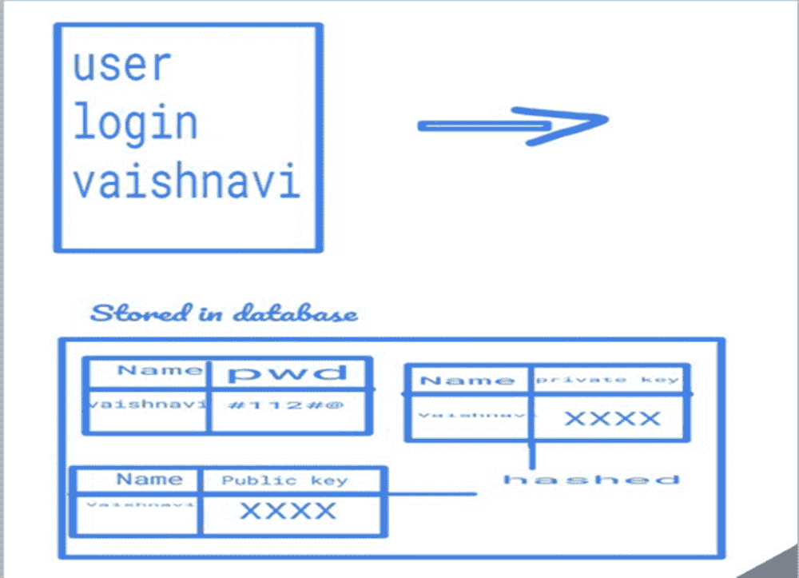
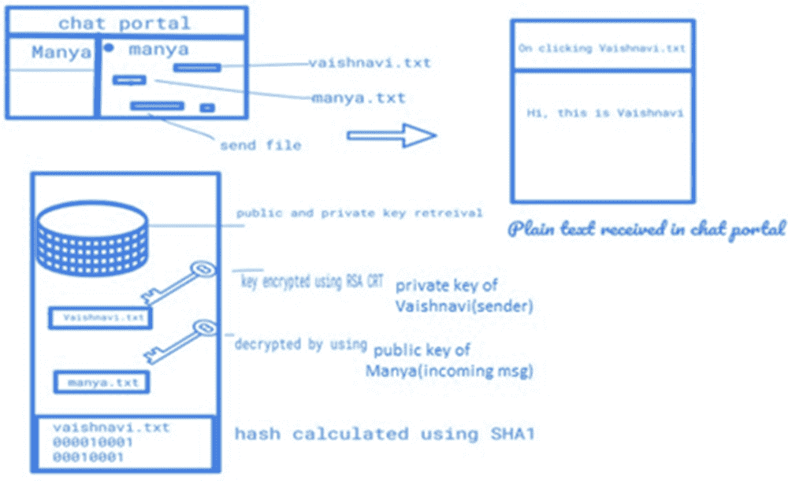
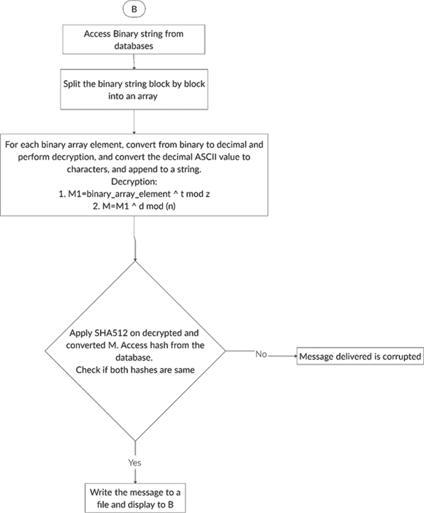
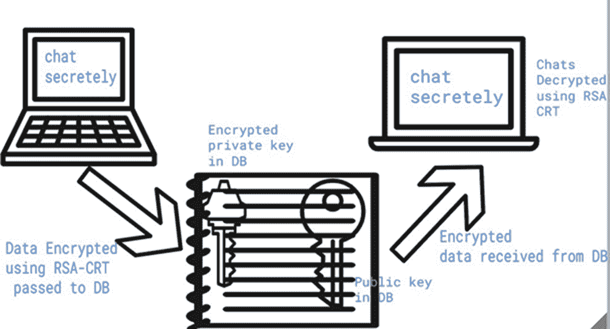
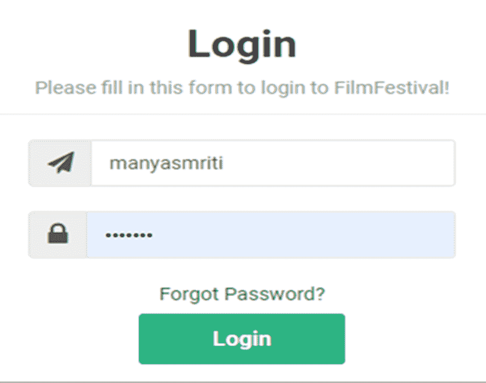
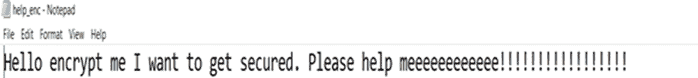
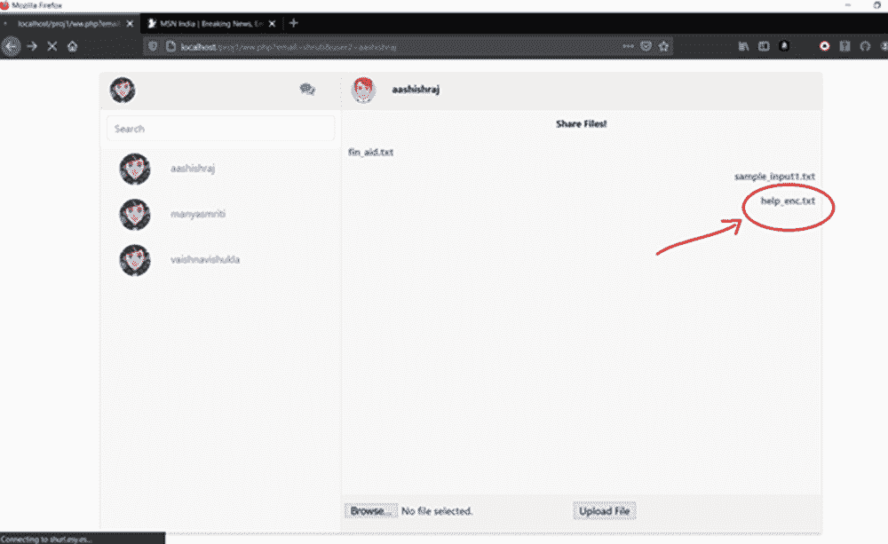
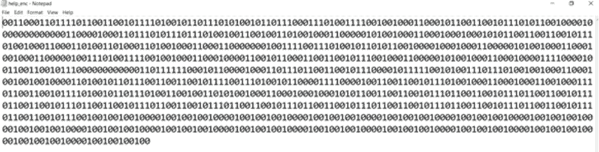
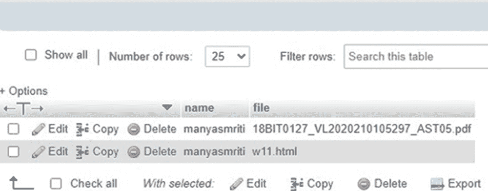
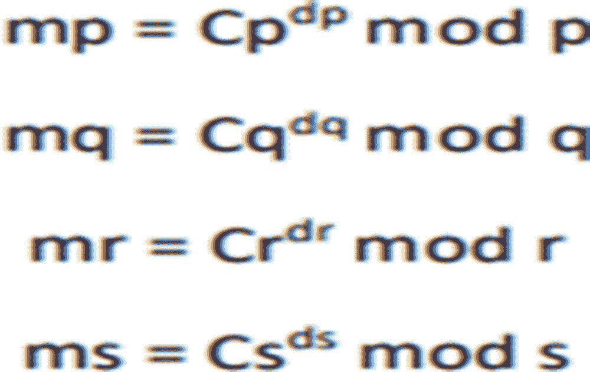

# 第十一章

# 使用修改的密码算法在云计算中实现安全文件存储

+   Manya Smriti

    印度维洛尔理工学院

+   Shruti Varsha Venkatraman

    印度维洛尔理工学院

+   Aashish Raj

    印度维洛尔理工学院

+   Vaishnavi Raj Shukla

    印度维洛尔理工学院

+   Aswani Kumar Aswani Cherukuri

    

    印度维洛尔理工学院

摘要

本章调查了与文件云存储相关的安全问题，以保护云数据服务器中客户数据的安全。作者提出了一种使用多个密钥和 CRT 的修改后的 RSA 算法，以保证数据的机密性，并通过 SHA-512 哈希来保持数据完整性。该工作创建了一个安全的数据交换应用程序，其中文件使用 RSA-CRT 算法进行加密，然后进行哈希处理。在成功实施该工作后，他们观察到所提出的技术比原始 RSA 算法和 RSA-CRT 更安全。此外，它通过采用 CRT 进行解密来提高了解密的算法性能；因此，所提出的技术比具有多个密钥的 RSA 更快。

引言

RSA 算法是一种非对称密码技术。它使用两个密钥，即公钥和私钥。我们工作中提出的模型采用了四种主要的评估技术，并发现了建立远程数据审阅策略的扩展，该策略可用于检查修订后的 RSA 中的数据完整性。与直接发送一个公钥不同，将两个公钥发送给接收者。然而，存在速度问题，因此在 RSA 解密中使用中国剩余定理来提高 RSA 解密的速度。

背景

文献调研

杨等人（杨和贾，2012 年）提出了一种高效且本质安全的动态审阅规范。它通过将加密策略与双线性配对的双线性性质相结合，而不是使用面纱方法，来保护信息免受审阅者的侵犯。因此，他们的多云集群审阅规范不需要任何额外的协调者。他们的集群审阅规范还可以支持多个所有者的批量扫描。此外，他们的评估方案通过将评估的计算负载从检查员移至服务器，从而减少了通信成本和评估者的计算成本，极大地改善了评估性能，并可应用于大规模分布式存储系统。

Li 等人（Li 等人，2017）集中关注云信息存储的问题，并计划提供一种方法，可以避免云管理员获取客户敏感数据。为了实现这一目标，他们提出了一种名为安全感知高效分布式存储（SA-EDS）模型的新方法。在这个模型中，他们使用了他们提出的算法，包括替代数据分布（AD2）、安全高效数据分布（SED2）和高效数据融合（ED-Con）算法。他们的实验评估表明，他们提出的方案可以有效地保护云端的重要风险。算法的运行时间比当前的动态方法更短。未来的工作将着重于确保数据的重复性，以增加数据可用性水平，因为任何数据中心的宕机都会导致数据恢复的失败。

Bindu 等人（Shwetha Bindu＆Yadaiah，2011）研究了云服务器中的数据安全问题。为了确保云数据服务器中客户数据的准确性，他们提出了一个有效且灵活的设计，其中包括明确的动态数据支持，包括块转换、删除和连接。他们在文件分发计划中使用纠错码来提供冗余等式向量，并保护数据的可靠性。他们的设计实现了存储正确性保护和数据损坏在分布式服务器上的存储准确性检查期间已被检测到。他们的设计非常高效且耐受拜占庭失败、恶意数据篡改攻击，甚至服务器内部攻击。他们认为，云计算中的数据存储安全问题是一个充满挑战和卓越需求的领域，仍处于发展初期。他们设想了该领域未来研究的几个潜在方向。它允许第三方审计员审计云数据存储，而不需请求用户的时间和可能性。

Sookhak（Sookhak，2015）研究了当前分布式计算中额外处理时间的问题。

它提出了一种基于最先进的信息评估技术的主题分类，以满足云计算数据存储完整性领域的差距和突出问题的识别需求。定性分析用于比较现有方法，并突出它们的优点、缺点以及尚未解决但已识别和突出的云和移动计算环境中的数据审计方案的开放问题和挑战。目前的数据审计方法在实际云计算环境中得到了实施，并使用基准测试来评估这些方法在客户端和服务器端的计算和通信成本。此外，分析了动态数据更新操作对现有数据方法在真实环境中的影响。它研究了动态数据更新过程对大规模文件大小的影响。最后，评估了常规数据更新对不同文件大小的影响。提出了一种基于数学标记方法的新远程数据审计方法，以实现对云计算中重要数据完整性的有效检查。该方案解决了云数据存储系统额外计算和通信成本的问题。D&CT 数据结构还使他们的方法能够适用于大规模数据，并且客户端的处理时间最少。提出的数据审计方案通过使用 Java 和 C++ 语言在真实环境中实施，以解决评估 DRDA 方法的目标。通过在仿真环境中使用基准测试验证了 DRDA 方案的性能，并通过使用长度、文件大小和检测概率等明确参数分析了 DRDA 方案。还定义了不同的场景来评估所提出的方法。

此外，它根据数学来评估和验证 DRDA 技术的安全质量。结果表明，D&CT 信息结构通过减少移动数量，减少了动态信息更新活动的处理时间。此外，D&CT 信息结构显著降低了云计算中大规模外包文件的动态数据更新处理时间。

Chambre 等人（Shimbre & Deshpande，2015）讨论了文件分发和 SHA-1 方法。 当文件被分发时，数据也被分成多个工作者。 所以这里需要数据安全。 每个文件块包含自己的哈希码，使用哈希码将改进用户认证过程；只有经授权的人员才能访问数据。 这里，数据使用高级加密标准进行加密，因此数据可以轻松且安全地存储在云上。 第三方审计员用于公开审计。 本文讨论了一些安全问题的处理，如快速错误限制、数据完整性、数据安全性。 所提出的方案允许用户通过轻量级的通信和计算成本审计数据。 分析表明，所提出的系统对恶意数据篡改攻击和工作者串通攻击具有高效性。 执行和广泛的安全分析表明，所提出的系统具有可证明的安全性和高效性。 他们表明，他们的设计对于工作者串通攻击和恶意数据篡改攻击非常高效，且计算开销最小。 执行分析和广泛的安全性表明，所提出的方案是可以证明安全且非常有效的。 Behl（Behl，2011）探讨了与云相关的安全问题。 本文还讨论了保护云系统和应用程序的现有安全方法及其缺点。

在这片朦胧之中存在着各种安全挑战，本文试图解决最广为认可和基本的挑战。 除非虚拟环境，即基础设施、虚拟机、接口、网络传输是安全的，否则安全的云是不可能的。 由于复杂和动态的云计算性质，云环境需要比传统的安全解决方案更多的内容。 作为迈出的第一步，云提供商和用户应该共同制定需求和细节。 新的虚拟化感知安全解决方案应该被实施，以确保对整个系统的预防性安全。 云安全解决方案应该具有自我防御的智能，能够提供对已知和未知威胁的实时监控、检测和预防。

Usman 等人（Usman 等人，2017 年）在紧凑的视频传输中混淆了神秘信息，这是一个相对较新的研究领域，吸引了科学家们的注意。这主要是因为涉及到公共云的隐私和安全问题。在本文中，提出了一种安全方案，该方案将秘密数据隐藏在 HEVC 编码的视频传输中，即在压缩区域内。所提出的方案包括三个重要阶段：视频编码、数据加密和解密（有/无解释）。所提出的方案旨在在加密后保持原始视频传输的大小，而不影响视频数据的视觉质量。因此，它为实时视频应用程序提供了理想的平台。秘密数据被分布在编码的视频传输中，因此黑客很难提取整个秘密数据。这是因为黑客不知道隐藏方案的具体位置和模式，即使他们获得了秘密密钥。另一个重要的优点是，他们提出的方案完全支持 HEVC 标准的编码和解码结构。具有编码秘密数据的视频传输可以轻松解码，而不会危及或显示额外的隐藏信息。测试结果表明，所提出的方案在维持视觉质量的同时，略微增加了编码视频传输的大小。

Garg 等人（Garg & Sharma，2014 年）讨论了当资产所需的手机将其数据存储在云上时，是否始终存在云服务提供商是否正确存储文件的大问题。安全性是移动云计算的主要关注点。所提出的工具提供了一种使用 RSA 算法和哈希函数来确保移动云中数据安全的安全机制。这篇研究论文提出了一种工具，为移动云中存储的数据提供保密性和完整性。所提出的方案利用 RSA 算法和其他加密解密技术来保护数据，以确保在云上不会发生数据泄露。在这个方案中，加密用于在通信过程中为数据提供安全保障。由于加密文件存储在云上，因此用户可以相信他的数据是安全的。在设计文档中，只有加密形式的文件在通道上传输，这减少了信息泄露的问题。没有第三人或入侵者可以获得文件，因为该人不知道数据所有者的密钥。在每个工作领域都存在改进的空间，因此在这里也是如此。安全模型的所有假设中都假定了 TP An 是中立的。所有的算法和验证都被卸载到 TP A 上，因此需要使 TP A 更安全。未来的工作可能涉及到研究移动云环境中安全存储服务中应用其他网络的用途。还可以做一些工作来减少移动终端的开销。

Samir 等人在论文中提出的模型采用了 RSA 中的 4 个素数，而不是使用一个公钥，而是将 2 个公钥发送给接收者。通过使用带有中国剩余定理的 RSA 来解决速度问题。中国剩余定理（CRT）是数学中的一个定理，可用于密码学中。其应用是计算，在算法和计算模块的计算方面非常重要。中国剩余定理（CRT）从一组模的剩余中确定一个单一的整数。它在数字信号处理中也有应用。CRT 允许 RSA 算法的实现非常高效。如果使用随机密钥多次加密相同的消息，使得每次使用的密文看起来都不同。论文中的比较清楚地表明，RSA-CRT 的全时加密和解密几乎是 RSA 的一半。对于 640 位长度的明文，RSA-CRT 到 RSA 所花费的时间为 26:42。该论文深入研究了如何宣称 RSA-CRT 比 RSA 更先进的算法。

Pant 等人（Pant 等人，2015）讨论了信息和数据安全作为云处理和 IT 行业最重要的问题。在这篇论文中，他们利用了一些策略来确保在云端或网络中的数据安全。这篇论文研究了分布式计算框架中的安全问题以及如何防止它们，在这里他们将密码学和隐写术策略结合在一起以确保数据安全。RSA 算法比其他算法更安全。他们将 RSA 算法与其他算法结合起来，为数据提供更高的安全性。在隐写术中，他们得到的加密图像，在自然眼睛看来与原始图像相同。如果他们分析图像的二进制代码，那么差异就会被看到。否则，他们将无法识别原始图像。本文中所使用的方法将有助于为分布式计算领域或网络中的数据安全构建一个坚实的框架。

Somani 等人（Somani 等人，2010）讨论了由云计算趋势驱动的众多 IT 强国中，没有任何疑问。几乎每个人都带来了好消息。对于企业来说，云计算值得考虑并尝试建立业务系统作为一种方式，因此公司可以确实实现降低成本、增加利润和更多选择；对于大规模产业，经济危机之后，大规模压力下的基础设施成本似乎是可能的；对于设计师来说，当面临云计算时，通过 PaaS 模型可以有效提高他们自己的能力，因此，云计算对 ISV 的影响是众多角色中最大的；对于工程师和开发人员来说，云计算的出现必然会诞生大量新的工作机会。一旦可用带宽和相应的服务模型足够发展，云计算将带来互联网的革命性变化。云计算提供了低成本的超级计算服务的可能性，虽然背后有大量的制造商支持，但毫无疑问，云计算拥有光明的未来。

Arora 等人（Arora et al., 2013）在本文中讨论了加密算法，以使云数据安全，脆弱，并对安全问题、挑战以及 AES、DES、Blowfish 和 RSA 算法进行了比较，以找到最佳的安全算法，这必须在云计算中使用，以确保云数据安全，并且不被攻击者攻击。加密算法在云数据的安全中起着重要作用，并且通过对算法中使用的不同参数进行比较，发现 AES 算法使用最少的时间来执行云数据。Blowfish 算法具有最少的内存需求。DES 算法消耗最少的加密时间。RSA 消耗最长的内存大小和加密时间。通过在 IDE 工具和 JDK 1.7 中对所有算法进行执行，已经实现了对云计算数据的最佳输出。当前云的需求正在增加，因此，云和用户的安全性是首要关注的问题。因此，提出的算法对当前需求是有帮助的。将来可以与不同方法进行比较，并提供结果以展示所提出结构的有效性。

Ruj 等人（Ruj et al., 2012）讨论了一种安全保障访问控制方案，该方案提供了细粒度的访问控制，并确认在云中存储数据的用户。然而，云并不知道存储数据的用户的身份，而只是验证用户的凭据。密钥分发是以分散的方式进行的。一个限制是云知道云中存储的每个记录的访问策略。未来，他们还希望确保用户特征的安全性。在本文中，他们提出了一种新的安全保障验证访问控制方案来保护云数据。在所提出的方案中，云在存储数据之前检查用户的有效性，而不知道用户的身份。此外，他们的方案具有附加的访问控制功能，只有合法用户才能解密存储的数据。该方案防止了重放攻击，并支持创建、修改和读取存储在云中的数据。此外，他们的验证和访问控制方案是分散的和强大的，与为集中式云设计的其他访问控制方案相比。通信、计算和存储开销与集中式方法相当。

Subashini 等人（Subashini＆Kavitha，2011）在本文中讨论了云环境中信息存储安全性的问题。即使入侵者获得对这些数据的访问权，这使得数据变得无价。尽管这种模型需要一些可量化的努力才能在实时中实施，但它为像云这样的环境提供了基本的解决方案，表明了成为下一代企业环境的敌意潜力。在系统发展的早期阶段实施这种模型将相对容易，因为相比于在云中存储大量数据之后再实施它而言。这种模型与他们的多级安全模型相结合，用于确保数据在传输过程中的安全，将在恶意用户的网络中提供适当的防护。

王等人（Wang 等，2010）讨论了云计算被想象为下一代大型企业 IT。与传统的企业 IT 解决方案相反，在这些解决方案中，IT 服务受到适当的物理、逻辑和人员控制，而云计算将应用软件和数据库转移到互联网上的大型数据中心的服务器上，其中数据和服务的管理并不完全可靠。在本文中，他们关注云数据存储安全性。他们首先提出了一种网络架构，用于有效地描述、开发和评估安全的信息存储问题。通过深入分析，审查了一些现有的数据存储安全构建模块。总结了它们在云计算环境中的实际影响的利弊。还讨论了公开审计服务的进一步测试问题。他们认为，云计算中的安全性，这是一个充满挑战和至关重要的领域，目前仍处于起步阶段，但将在未来的很多年里吸引大量的研究工作。

Zhou 等人（Zhou 等人，2013）在本文中讨论了 RBE 图，首先提出了一种实现高效客户否认的方法。然后，他们介绍了一种基于 RBAC 的分布式存储架构，允许组织在公共云中安全存储数据，同时在私有云中保持与组织结构相关的敏感信息。接着，他们建立了一个安全的分布式存储系统架构，并表明该系统具有一些优越特性，例如恒定大小的密文和解密密钥。他们的试验表明，客户端的加密和解密算法都很有效，并且在云端的解密时间可以通过使用多个处理器来减少，这在云环境中是很常见的。他们认为，所提出的系统可以在商业环境中很有用，因为它以一种灵活的方式捕捉基于角色的实用访问策略。此外，它提供了在云中安全存储数据的方法，以实施这些访问策略。

Hardik 等人（Gandhi＆Gupta，2015）讨论了在当前情况下，一切都在网络和其他通信媒介上传输。我们需要使我们的数据免受所有其他攻击者和未经授权的人的攻击。通过使用魔方，我们可以为相同的字符获得不同的密文。这种方法提升了公钥加密系统。这项工作禁止任何入侵者以可读形式获取明文。由于魔方中没有值的重复，安全性得到了增强。即使入侵者找到了 MR 的初始值，要追踪行/列也是非常困难的。所提出的工作中的一个问题是初始构建魔方需要额外的时间。

Shinde 等人（Shinde＆Fadewar，2008）在本文中讨论了 RSA 加密算法。在作者简要列举和注释了加密目标之后，他们详细阐述了 RSA 加密算法的工作原理。密钥是如何生成的，以及加密和解密是如何进行的。然后引入了 CRT 及其详细功能。作者随后展示了如何使用 RSA 和 CRT，如何在加密和解密过程中将它们一起使用的步骤。提出的方法（RSA-CRT）然后根据安全性和性能进行了分析。在 Java 中实现了所述的提出方法的方法，并显示了消息、发送者和接收者的公钥和私钥以及加密和解密。然后，论文得出结论：使用 CRT 的加密更有效。

Lakshmi 和 Chandravathi（Lakshmi, 2020）在本文中讨论，作者提到私有数据容易受到许多有害攻击的影响。因此，确保秘密数据的要求已经成为互联网上的一个重要挑战。加密技术是提供保护免受恶意攻击的最佳选择。通过应用不同的策略，数据可以得到保护。为了在云中保护数据，这是另一个重要的挑战，仍然需要考虑。同态加密是在云中保护数据的一种有前途的技术。在本文中，作者提出了使用同态加密的多个公钥集合的 RSA 算法。这个想法是使用 RSA 同态加密从多个密钥中生成一个关键对，其性质是部分同态的，而不是一个单一的密钥对。该方法使用一个密钥进行加密，另一个进行解密。这种方案的优点在于，从多个密钥集合中选择一个单一的密钥对与其他用户进行交互。与使用单个密钥的 RSA 相比，不同的密钥生成策略使用一些数学逻辑来直接获得公钥。因此，寻找私钥的攻击被阻止。

Kim 等人（Kim et al., 2020）讨论了 RSA 中的私有指数是如何通过使用欧几里得算法预先选择的公共指数生成的。在比特大小方面，它几乎与模数数字相同。因此，在 RSA 密钥生成过程中不容易减少私钥和公钥指数。文章讨论了 CRT 方法，其中指数被减小，并且介绍了一种快速而更安全的方法来减少指数。该论文还讨论了素数生成机制。

Balaji 等人（Balaji et al., 2018）讨论了云资源管理效率的局限性，这在很大程度上是由预设规则决定的，并且是反应性的。为了克服这一点，作者采用了一种由预测方法进行的云资源管理。使用 AWS t2 微实例来托管一个用于开关时间表的读密集型应用，并使用历史数据制作了基于模拟的工作负载模式。对现有方法和所提出方法进行了比较，结果显示所提出的方法减少了错误，减少了用户的等待时间，增加了请求的数量，并提高了资源的利用率。

Balaji 等人（Balaji et al., 2019）在本文中讨论，假设企业工作负载是恒定的，资源分配就会变得无效。通过分析合成的突发工作负载，当前的研究旨在解决这一挑战。研究人员使用赫斯特指数和样本熵度量构建资源分配模型。NASA 数据集用于将所提出的方法与基准反应方法和离散度方法的性能进行比较。

Narayanan 等人（Narayanan & Cherukuri, 2018）讨论了为了获取有关患者的当前信息，以及跟踪目的，必须将数据湖移至云端进行分析，而分析数据则需要将数据移至云端。根据这项研究，作者建议在云端使用数据湖作为基于云的集成框架。此处提出的工作通过设计使用数学模型（Petri 网）来验证云中数据湖的架构，扩展了信息集成架构。

Balaji 等人（Balaji et al., 2014）讨论了云服务提供商使用预定义的限制，根据平均消耗提供或取消资源。因此，它并没有完全解决企业各种用例的不同范围。尽管可以更有效地执行，但仍然有少数案例报告使用预测技术来管理资源。在云环境中有效地管理资源，关键是建立一个能够预测系统在负载下的性能的模型。作为监视资源利用率的指标，他们使用请求速率来比较两种预测模型的性能，Holt-Winter 和 ARIMA。显示了几个选择的 ARIMA 模型比 Holt-Winter 模型表现更好，如果数据请求速率遵循类似的趋势，这随后将对在云上管理资源有用。

问题定义

在云存储中，我们将数据分享给许多客户端、服务器和人员。因此，云中存在的信息的安全性不能得到保证，因为入侵者很容易访问和破坏第一类信息。因此，需要一些明文密钥来帮助我们进行混合加密和保护数据。RSA 算法是一种非对称加密技术，它使用两个密钥，即公钥和私钥。建议模型在 RSA 中采用四个素数。与直接发送一个公钥不同，将两个公钥发送给接收者。但是存在速度问题，因此在 RSA 解密中使用中国剩余定理来提高 RSA 解密速度。

工作的贡献

我们的工作贡献如下：

+   1\. RSA 算法的新方法：修改的 RSA 与 CRT 和多密钥：

从本质上讲，RSA 算法是一种非对称算法，被认为是安全的，但在速度方面欠缺。特别是当用于生成密钥的素数非常大时，进行所有必要计算所需的时间可能很长，因为它必须确保安全性。

因此，通过我们提出的方法，我们正在实现安全性和速度。在此方法中，使用 CRT 将算法的主要部分分解以增加吞吐量高达 4 倍。这是通过对以下内容进行分区来完成的：

+   DP; DQ; DR; DS < D and CP; CQ; CR; CS < C

通过这样做，CRT 将数字的大小减少到原始大小的一半以下，这将自动加快算法，使其计算时间更短。

使用多个质数的 RSA——使用多个密钥的 RSA 有助于确保更高的安全性。在普通的 RSA 算法中，存在 2 个质数，这些质数将进行一些计算以生成公钥和私钥，而这些密钥又用于加密和解密过程。

在使用多个密钥的 RSA 中，质数的数量翻了一番。有 4 个质数，这些质数将进行计算以生成 4 个密钥。随着质数的加倍，自然所有的计算过程也会加倍。将生成 2 个公钥和 2 个私钥。

在普通的 RSA 中，加密和解密各有一步，而在使用多个密钥的 RSA 中，加密和解密各有两步。公钥和私钥的两组都用于加密和解密过程。加密和解密的数量翻倍，这增加了安全性。

+   使用哈希来确保消息的真实性和完整性：

哈希算法，特别是 SHA-512，以确保从人到人发送的消息的真实性和完整性而闻名。我们正在使用 SHA-512 做同样的事情。我们在从文件读取消息后对消息进行哈希处理，并将哈希存储在数据库中，以便在接收端进一步使用。

当接收者完成解密并揭示消息后，我们提出的算法会对解密后的消息进行哈希处理，然后与其他哈希进行比较。如果两个哈希值匹配，则意味着消息是真实且完整的。否则，它显示了一种违反，即消息失去了其真实性和完整性。

+   从用户的密码生成质数：

通常，会使用函数生成随机大质数，然后用于密钥生成。这确实有其优点。然而，我们提出了一种新的生成质数的方法：从用户的密码生成质数。通过使用试图登录到门户或界面的用户的密码，在用户的密码上执行特定的算术操作。

获取密码的 ASCII 值，执行乘法、加法、乘以 ASCII 值的平方或加上 ASCII 值的平方等操作。这些操作将生成 4 个质数，并且不会对所有数字执行相同的操作。

因此，我们生成了一种计算大素数的方法，并且不需要保存在数据库中。而且这种方法也是独一无二的。密码只为用户所知，因此我们需要保护密码，这对于每个应用程序或网站都是必要的。我们没有在数据库中保存私钥，因此即使数据库受到攻击，攻击者也只会得到以二进制形式的加密文本，而几乎不可能在不知道段大小和私钥的情况下解密，这两者在任何地方都不可用，只有当我们在应用程序中解密文本时才生成它们，这使得这个过程非常高效和安全。

+   4. 对密文的另一层安全性：

考虑到普通的 RSA 算法，密文是发送给接收者以进行解密的整数。如果攻击者获取或找到了公钥，则可以破解密文以访问被攻击者发送的消息。

我们的方法如下：

+   a. 将消息转换为其 ASCII 值。

+   b. 加密每个 ASCII 值，即十进制数。

+   c. 将每个密文转换为其二进制等效值，并附加为长二进制字符串，并存储在数据库中，以供接收者用于解密。

通过我们方法中的上述步骤，我们可以确保攻击者将极其难以找出二进制字符串应该被分割成的位数。对于非常长的二进制字符串，找出其原始形式，无论是整数、八进制数还是文本，都将非常困难。这将是一个漫长的试错过程，大部分情况下都会以失败告终。

提出的模型

详细的架构

图 1 显示，如果用户首次注册门户，则在数据库中为用户创建动态表，该表存储其门户的密码。每个用户的私钥和公钥分别存储在单独的表中。所有用户的密码/密钥都通过应用密码哈希函数 MD5 存储在数据库中，因为在数据库中存储明文密码不亚于一种罪恶。

当用户成功登录门户时，他将被重定向到他的聊天框。（为此，从数据库中提取的联系人被动态提取）。所有以前交换的文件都显示在聊天框中。

图 2 显示，当发送文件时，文件将上传到数据库中，该数据库作为用户的云服务。现在，存储在数据库中的文件实际上是大的二进制值（作为 RSA-CRT 加密的结果）。为了实现 RSA-CRT，从数据库中检索公钥和私钥。使用 SHA-1 来确保数据的完整性。因此，第三方无法访问两个用户之间发送和接收的数据。它作为云，因为用户不需要下载交换的文件，只需点击文件，即可查看当前和以前交换的文件。

算法架构：

| 图 1. 在数据库中存储日志信息并生成公钥和私钥 |
| --- |
|  |
| 图 2. 发送方向接收方发送文本文件，RSA-CRT 使用多个密钥进行加密和解密，并使用哈希验证其真实性和完整性。 |
|  |

发送方算法流程如图 3 所示。当用户/发送方登录到界面时，密钥生成过程被启动。由于所提出的方法是改进的 RSA 与 CRT，RSA 密钥生成和加密解密的步骤数量翻了一番。生成四个大素数，称为‘p’，‘q’，‘r’和‘s’。使用生成的素数计算密钥的组件，即‘n’和‘z’。还计算了组件的欧拉函数值。另一组密钥组件被枚举，即：‘I’和‘g’。然后，使用列举的数字确定密钥的主要元素。按照这个顺序生成和确定密钥。发送方上传的文件由算法读取，然后将每个字符转换为其 ASCII 十进制等价值。同时，使用 SHA-512 对文件上的内容进行哈希处理，并保存在数据库中以供接收方验证。使用修改后的 RSA 步骤加密每个 ASCII 十进制等价值，并存储在数组中。然后，将密码数组的每个元素转换为其二进制等价值，并附加。然后将此二进制字符串保存在数据库中，供接收者用于解密。

图 4 显示了接收方算法流程：接收方算法首先访问二进制字符串的数据库。块大小将字符串分割，并将每个块存储在数组中。将每个二进制元素转换为其十进制等价值。对于每个十进制等价值，使用修改后的 RSA 步骤进行解密。在每次解密后，计算出的值再次保存在数组中。然后将这些值转换为它们的 ASCII 字符等价值。并将它们作为字符串附加在一起。使用 SHA-512 对此字符串进行哈希处理。将其与已存储在数据库中的哈希值进行比较，以验证其真实性和完整性。如果哈希值相同，则将内容写入文件，并使接收者可以查看。 

功能

图 5 展示了我们制作的应用程序的要点，这是一个安全的数据交换应用程序，其中文件使用 RSA-CRT 算法加密。首次，如果用户注册门户，将为用户在数据库中创建一个动态表，该表存储他/她的门户密码。每个用户的私钥和公钥都存储在单独的表中。用户的所有密码/密钥都通过在数据库中应用密码哈希函数 MD5 来存储，因为在数据库中存储明文密码不亚于一种罪行。

当用户成功登录到门户时，他将被重定向到他的聊天框。（为此，从数据库中提取存储的联系人动态）。所有以前交换的文件都会出现在聊天框中。

现在，当用户发送文件时？发生了什么？

当发送文件时，文件会上传到数据库中，该数据库为用户提供云服务。现在，数据库中存储的文件（将由用户进一步用于检索目的）实际上是大型二进制值（由于 RSA-CRT 加密的结果）。为了实现 RSA-CRT，从数据库中检索公钥和私钥。SHA-1 用于确保数据的完整性（图 2）。因此，第三方无法访问两个用户之间发送和接收的数据。它充当云，因为用户不需要下载交换的文件，只需点击文件，即可查看当前和以前交换的文件。

| 图 3\. 发件人端算法流程。显示使用多密钥 RSA-CRT 进行密钥生成和加密的流程。 |
| --- |
|  |
| 图 4\. 接收方算法流程。显示使用哈希进行解密和验证。 |
|  |
| 图 5\. 算法和聊天平台的功能。用户可以进行私人聊天，并发送文件，这些文件将使用修改后的 RSA-CRT 进行加密和解密。 |
|  |

算法工作概述：

使用 CRT 可以加速 RSA 解密和签名操作，其中假设已知模数 N（即 Q）的因数。通过 CRT，可以将 M 的计算分成四部分：

mp = Cp^dp mod p mq = Cq^dq mod q mr = Cr^dr mod r ms = Cs^ds mod s 其中

Cp = C1 mod p Cq = C1 mod q Cr = C1 mod r Cs = C1 mod s 和

C1 = Ct mod (z)。[使用第一个私钥（t，z）]

这样做可以减少计算时间，因为 dp，dq，dr，ds < D，而 Cp，Cq，Cr，Cs < C。实际上，它们的大小约为原始大小的一半。在理想情况下，由于 d 和 n 的大小都减小了，我们可以实现约 4 倍的加速。但是提出的技术增加了安全性。

表 1\. RSA、RSA-CRT、RSA 多密钥和提出的技术的结果比较。

| 位数 | RSA 的加密和解密时间（毫秒） | RSA 的加密和解密时间（毫秒） | RSA 的加密和解密时间（毫秒） | RSA 的加密和解密时间（毫秒） |
| --- | --- | --- | --- | --- |
| 640 | 42 | 26 | 84 | 66 |
| 1040 | 48 | 29 | 93 | 71 |
| 1136 | 63 | 32 | 113 | 85 |

所提出的技术相比原始的 RSA 算法和 RSA-CRT 更安全。它增强了算法在解密方面的性能，因为它在解密中使用了 CRT，因此比 RSA 快速多密钥。它减少了计算成本。尽管与原始 RSA 相比执行它需要很长时间。 

使用多密钥和中国剩余定理的 RSA

从云中取出一个要发送给另一个人的文档。文档将被哈希函数切成几行，并将有一对诸如“消息摘要”之类的词的引用。使用我们的软件，我们将使用私钥加密消息，从而得到数字签名。然后使用多个密钥和中国剩余定理对签名使用接收方的公钥进行加密。接收方可以使用他们的私钥解密密文以获得明文，并使用我们的公钥验证签名。

所提出的算法试图通过改进其速度来修改 RSA 加密系统，使用中国剩余定理提高其安全性，而不是使用 2 个素数和两个公钥对 (图 3)。

生成密钥的过程如下：

+   1\. 我们生成四个大素数 p, q, r 和 s

+   2\. 我们计算 (n, z) 的值

    +   n = pq

    +   z = rs。

+   3\. 我们找到 ϕ(n) 和 ϕ(z) 的值，其中 ϕ(n)= (p − 1)(q − 1)

    +   ϕ(z) = (r − 1)(s − 1)。

+   4\. 我们选择随机整数 e, g 使得 1 < e < n 且 gcd(e, ϕ(n)) = 1

    +   1 < g < z 且 gcd(g, ϕ(z)) = 1。

+   5\. 我们计算 d 和 t 的值，使得 ed = 1 mod (ϕ(n))。

    +   tg = 1 mod (ϕ(z))。

+   6\. 我们计算 dp, dq, dr 和 ds 的值 dp = d mod (p − 1)

    +   dq = d mod (q − 1) dr = d mod (r − 1) ds = d mod (s − 1)。现在，

公钥 KU =< (e, n),(g, z) >

私钥 KV =< t, z, dp, dq, dr, ds>。拟议技术的加密 (图 3)：

对于消息 M 的加密，以下步骤如下：

+   1\. 我们将消息 M 转换为整数形式，在范围 [0 到 n − 1] 内。

+   2\. 我们使用第一个公钥即 e 计算密文 C1，公式为

    +   C1 = M^e mod (n)

+   3\. 我们使用第二个公钥 g 和 C1 计算密文 C，公式为 C = C1^g mod (z)。

+   4\. 我们将密文 C 发送给接收方。拟议技术的解密 (图 4)：

对于密文 C 的解密，我们按照以下步骤进行：

+   1\. 首先我们使用第一个私钥 (t, z) 找到 C1，公式为 C1 = Ct mod (z)。

+   2\. 我们进行以下计算 Cp = C1 mod p

    +   Cq = C1 mod q Cr = C1 mod r Cs = C1 mod s

+   3\. 然后我们计算：

    +   mp = Cp^dp mod p mq = Cq^dq mod q mr = Cr^dr mod r ms = Cs^ds mod s

+   4\. 现在合并 mp、mq、mr 和 ms 后，我们恢复原始明文消息 M。

实验结果

执行算法至所需程度后，得到以下结果：

当 p、q、r、s 为大值时变量的样本值 当 p、q、r、s 为大值时变量的样本值 我们实验结果的外观和感觉：

用户已登录：

图 6 显示了我们聊天门户的登录用户界面，注册用户可以在其中登录。

表 2\. 揭示背后的算法 - 当 p、q、r、s 是小值时的变量样本值

+   5\. 原始文本文件（在加密之前的 help_enc txt

图 7 展示了用户希望使用聊天门户发送的文本文件。

+   6\. 现在将这个文件上传到云端

+   7\. 存储在数据库中的加密文件

图 9 展示了存储在我们数据库中的加密文本，确保用户上传的文本文件的安全数据传输。

表 3\. 当 p、q、r、s 为大值时变量的样本值

| VARIABLE | VALUES |
| --- | --- |
| P | 5760005761 |
| Q | 57600032951 |
| R | 331776232243207 |
| S | 331776351372017 |
| N | 331776521631549830711 |
| Z | 110075507805606161588078138519 |
| Phin | 331776521568189792000 |
| Phiz | 110075507805605498035494523296 |
| E | 331776521568189791999 |
| G | 110075507805605498035494523295 |
| D | 331776521568189791999 |
| T | 110075507805605498035494523295 |

表 4\. 算法的输出

| 5760005761 =p 57600032951 =q 331776232243207 =r 331776351372017 =s |
| --- |
| 331776521631549830711 =n 110075507805606161588078138519 =z |
| 331776521568189792000 =phin 110075507805605498035494523296 =phiz |
| 331776521568189791999 =e 110075507805605498035494523295 =g |
| 331776521568189791999 =d 110075507805605498035494523295 =t |
| 001100011011110110011001011101011101110100010111011101000101110111010000100100100100001 |
| 嘿嘿嘿!!!这项工作是由 Manya、Aashish、Shruti 和 Vaishnavi 完成的，消息是要发送的哈希相同。 嘿嘿嘿!!!这项工作是由 Manya、Aashish、Shruti 和 Vaishnavi 完成的 |
| 图 6\. 登录用户界面 |
|  |

+   8\. 当用户尝试从云中打开文件时解密的文本

用户可以轻松检索文件：

图 10 展示了当用户在云中尝试打开文件时解密的文本。

文件存储在数据库中：

图 11 展示了存储在数据库中的文件名。

| 图 7\. 用户希望发送的文本文件（加密前）。 |
| --- |
|  |
| 图 8\. 在界面和云中上传文本文件。 |
|  |
| 图 9\. 用户上传的文本文件的加密文本。 |
|  |
| 图 10\. 接收者将能够查看的解密文本文件。 |
|  |
| 图 11\. 发送者上传的文件存储在数据库中。 |
|  |

分析

可以通过 RSA-CRT 减轻的 RSA 攻击：

RSA-CRT 的攻击缓解：低指数攻击 d 是 RSA 的私有指数。

让我们详细看一下：

+   • 给定输入 m，将其提升为模 p 和模 q 的 d 次方。然后通过与某些预定义的常数进行加法和乘法来计算最终结果。

+   • 由于模幂是在 n 的位数的一半上执行的，所以执行时间不到 4 倍。

+   • 在 RSA 中，

解密 M=Cd mod n

直接依赖于 d 和 n 的大小。

但在 RSA-CRT 中：

将 mp、mq、mr 和 ms 结合后，我们得到原始的明文消息 M。

| 图 12. 在 RSA-CRT 中计算 mp、mq、mr 和 ms |
| --- |
|  |

缩小 d 和 n 的大小被认为是中国剩余定理的一个重要优点。

时序攻击

通过引入 Montgomery 乘法可以缓解时序攻击。

Montgomery 乘法是一种模乘法，可以更快地计算这样的乘法。它不是除以乘积并多次减去 n，而是添加 n 的倍数来取消掉低位，然后只是丢弃低位。

使用多密钥 RSA-CRT 相较于 RSA 的优点

+   1. 需要更快通信的应用的安全选项：

通过 RSA 和 RSA-CRT 对 5 个文件进行加密和解密。加密和解密所需的时间如下。

表 5。RSA 加密和 RSA-CRT 加密 1024 位的比较结果

| 文件 | RSA 加密时间（纳秒） | RSA-CRT 加密时间（纳秒） |
| --- | --- | --- |
| 1 | 330,130 | 371,148 |
| 2 | 316,803 | 348,592 |
| 3 | 330,131 | 358,845 |
| 4 | 344,485 | 375,250 |
| 5 | 351,661 | 382,426 |

表 6。RSA 解密和 RSA-CRT 解密 1024 位的比较结果

| 文件 | RSA 解密时间（纳秒） | RSA-CRT 解密时间（纳秒） |
| --- | --- | --- |
| 1 | 103,534,963 | 29,710,330 |
| 2 | 102,998,756 | 29,400,697 |
| 3 | 103,437,564 | 29,477,594 |
| 4 | 103,300,180 | 29,538,084 |
| 5 | 103,515,483 | 29,730,836 |

我们可以看到，RSA-CRT 的平均加密时间为 367252.2(Table 4)，而 RSA 的加密时间为 334642。因此，RSA-CRT 在加密 1024 位块时比 RSA 多花了 33610.2 纳秒。但在解密时，RSA-CRT 的平均解密时间为 29,571,508.2，而 RSA 的解密时间为 103,357,389。因此，RSA-CRT 在解密 1024 位块时比 RSA 快了 73,785,800.8 纳秒（表 5）。

观察加密和解密 RSA-CRT 的整体机制，应用该机制比 RSA 快 73,752,270.6 纳秒，快了 3 倍。这证明了尽管存在计算开销，但 RSA-CRT 比 RSA 更快。

尽管计算开销很大，但此机制所花费的时间较少。因此，它是在面向事务或业务计划的快速通信应用中使用的更好选择。但随着修改方法中变量数量的增加，需要使用更多的内存。因此，这种方法的主要局限性是开销时间和用于相同目的的内存，这可以通过未来的研究和改进来克服。

+   1\. 密钥生成开销大，但更不容易受到攻击。

像故障注入或侧信道分析这样的攻击无法使用 RSA 抵御，但 RSA- CRT 可以保护用户的数据免受这些攻击。当计算过程中引发故障时，RSA-CRT 可以防止攻击者获取签名。不仅如此，在数据交换的生命周期内，它还使其他攻击（使用大素数）如因子分解大数或公共模高度不可行。

对 RSA-CRT 的定时攻击是高度不可行的，因为在定时攻击中，卡片的解密精确时间可以帮助攻击者找到或发现私有解密指数。

但在 RSA-CRT 中，解密时间比 RSA 少 3 倍（这是安全的，因为它仍在使用中）。

+   2\. 具有 RSA-CRT 的多个密钥使攻击在数据的生命周期内变得高度不可行。

计算私钥 (t,z,dp,dq,dr,ds) 其中

t 由 tg = 1 mod (φ(z)) 获得。（其中 g 是随机整数，使得 gcd(g, φ(z)) = 1）。dp = d mod (p − 1)

dq = d mod (q − 1) dr = d mod (r − 1) ds = d mod (s − 1)。在数据的生命周期内是高度不可行的。

RSA 的私钥计算仅为 {d,n}，在数据的生命周期内更容易受到攻击。

+   3\. 减小 d 和 n 的值仍然可以在具有多个密钥的 RSA-CRT 中产生一些有希望的结果。

在密码系统领域，许多算法使用模运算的功能。解密指数 d 和模数 n 的大小非常重要，因为 RSA 解密的复杂性直接取决于它们。解密指数指定了模乘法的次数，必须执行指数运算。模数 n 在确定中间结果的大小方面起重要作用。通过使用中国剩余定理来减小 d 和 n 的大小，这是一种减小解密过程中计算量的方法，因为模指数运算是在 n 的位数的一半上执行的。

结论

我们提出了一种基于传统 RSA 的技术，但我们通过使用多个密钥来提高安全性，并应用中国剩余定理来加速计算。我们将我们提出的技术应用于存储云中的文件，这是一个更加关注文本文件安全性的聊天应用程序。这项工作使得可以使用 RSA-CRT 算法对文件进行加密，并稍后对其进行哈希处理的安全数据交换应用程序成为可能。我们观察到，与原始 RSA 算法和 RSA-CRT 相比，所提出的技术更安全。

参考文献

12Arora, R., Parashar, A., & Transforming, C. C. I. (2013). 利用加密算法在云计算中安全用户数据。工程研究与应用国际期刊 , 3(4), 1922–1926.

21Balaji, M., Kumar, C. A., & Rao, G. S. V. (2018). 企业工作负载的预测云资源管理框架。沙特国王大学计算机与信息科学杂志 , 30(3), 404–415\. [doi:10.1016/j.jksuci.2016.10.005](https://doi.org/10.1016/j.jksuci.2016.10.005)

22Balaji, M., Kumar, C. A., & Rao, G. S. V. (2019). 利用双度量对突发工作负载进行非线性分析以改善云资源管理。环境智能与人性化计算杂志 , 10(12), 4977–4992\. [doi:10.1007/s12652-019-01183-8](https://doi.org/10.1007/s12652-019-01183-8)

24Balaji, M., Rao, G. S. V., & Kumar, C. A. (2014). 云基础设施管理的预测模型比较研究。2014 年第 14 届 IEEE/ACM 国际簇、云和网格计算研讨会 (pp. 923-926). IEEE. [10.1109/CCGrid.2014.32](https://doi.org/10.1109/CCGrid.2014.32)

6Behl, A. (2011). 云计算中新兴的安全挑战: 对云安全挑战及其缓解的洞察。2011 年世界信息与通信技术大会 , 21, 217–222.

17Gandhi, , & Gupta, . (2015). 通过 MRGA 与 RSA 和 N-Prime RSA 增强公钥加密的研究。科技创新研究国际期刊 , 16, 72–79.

8GargP.SharmaV. (2014). 移动云计算中的高效安全数据存储通过 RSA 和哈希函数。2014 年智能计算技术问题与挑战国际会议(ICICT), 334–339.

20Kim, G.-C., Li, S.-C., & Hwang, H.-C. (2020). 具有典型素数生成的快速再平衡 RSA 签名方案。理论计算机科学 , 830-831, 1–19\. [doi:10.1016/j.tcs.2020.04.024](https://doi.org/10.1016/j.tcs.2020.04.024)

19Lakshmi, B. (2020). 小说《德里的黄昏》中文化冲突的黑暗阶段。学术出版社.

2Li, Y., Gai, K., Qiu, L., Qiu, M., & Zhao, H. (2017). 云计算中安全分布式大数据存储的智能密码学方法。信息科学 , 387, 103–115\. [doi:10.1016/j.ins.2016.09.005](https://doi.org/10.1016/j.ins.2016.09.005)

23Narayanan, M., & Cherukuri, A. K. (2018). 利用彩色彼得里网验证基于云的信息集成架构。计算机网络与信息安全国际期刊 , 12(2), 1–11\. [doi:10.5815/ijcnis.2018.02.01](https://doi.org/10.5815/ijcnis.2018.02.01)

10PantV. K.PrakashJ.AsthanaA. (2015). 基于 RSA 和隐写术的云计算三步数据安全模型。2015 年绿色计算和物联网国际会议(ICGCIoT), 490–494\. [10.1109/ICGCIoT.2015.7380514](https://doi.org/10.1109/ICGCIoT.2015.7380514)

13RujS.StojmenovicM.NayakA. (2012). 云中用于保护数据的隐私保护访问控制与认证。IEEE/ACM 国际簇、云和网格计算研讨会, 556–563.

5ShimbreN.DeshpandeP. (2015). 使用 TPA 和 AES 算法增强云计算的分布式数据存储安全性。计算通信控制与自动化国际会议，35–39。10.1109/ICCUBEA.2015.16

18ShindeG. N.FadewarH. S. (2008). 利用中国剩余定理进行更快的 RSA 解密算法。ICCES：计算与实验工程与科学国际会议，255–262。

3Shwetha Bindu & Yadaiah. (2011). 云计算中的安全数据存储。《计算机科学研究国际期刊》，1(1)，63–73。

11SomaniU.LakhaniK.MundraM. (2010). 采用 RSA 加密算法实现数字签名以增强云计算中的数据安全性。2010 年第一届并行、分布式和网格计算国际会议，211–216。

4Sookhak, M. (2015). 云计算中用于保护大数据存储的动态远程数据审计（博士论文）。马来亚大学。

14SubashiniS.KavithaV. (2011). 一种基于元数据的云环境数据安全存储模型。2011 年国际网络分布式计算与知识发现会议，429–434。

7Usman, M., Jan, M. A., & He, X. (2017). 使用 HEVC 和公共云的基于密码学的安全数据存储和共享。信息科学，387，90–102。doi:10.1016/j.ins.2016.08.059

15Wang, C., Ren, K., Lou, W., & Li, J. (2010). 朝着可公开审计的安全云数据存储服务。IEEE 网络，24(4)，19–24。doi:10.1109/MNET.2010.5510914

1Yang, K., & Jia, X. (2012). 用于云计算数据存储的高效安全动态审计协议。IEEE 并行与分布式系统交易，24(9)，1717–1726。doi:10.1109/TPDS.2012.278

16Zhou, L., Varadharajan, V., & Hitchens, M. (2013). Vijay Varadharajan 和 Michael Hitchens。在云存储中实现安全的基于角色的访问控制。IEEE 信息取证与安全交易，8(12)，1947–1960。doi:10.1109/TIFS.2013.2286456
