# 第十二章

# 冠状病毒工业防护的物联网应用：

智能口罩和智能徽章

+   Maissa Daoud

    突尼斯斯法克斯大学

摘要

本章概述了两种物联网应用，智能徽章和智能口罩，用于保护在拥挤环境中工作的员工。智能口罩可以保护佩戴者免受通过空气传播的非常小的微生物（如流感病毒或冠状病毒）的吸入，过滤空气，控制 CO2 的存在，并测量体温。智能徽章测量佩戴者的体温。它配备了用于室内和室外工人的 SOS 恐慌报警器。通过按下 SOS 按钮，设备与预先录制的 ID 进行通信，以便受害者可以交谈并警报应急服务。多亏了 GPS 功能，可以通过 Google 地图链接精确定位用户。

引言

导致 COVID-19 的病毒 SARS-CoV-2 可以通过在与感染者密切接触时咳嗽或呼吸产生的飞沫传播给其他人。当这些飞沫落在感染者周围的物体和表面上，其他人接触到这些物体或表面然后触摸眼睛、鼻子或嘴巴时，也可能发生感染，而不需要直接接触。这就是为什么重要的是要远离生病的人 1 到 2 米（3-6 英尺）。因为有些人感染病毒时没有症状，所以无论对方看起来是否生病，都应保持 1 到 2 米的物理距离（Chamola、Hassija、Gupta、& Guizani，2020）。

COVID-19 的最常见症状是发热、咳嗽和疲劳。一些患者可能会出现味觉或嗅觉丧失、结膜炎、头痛、肌肉疼痛、鼻塞、流鼻涕、喉咙痛、腹泻、恶心或呕吐以及各种皮疹。有些人感染了病毒但没有症状，也不感到不适。大多数人（约 80%）患病后无需特殊护理即可康复。约有 1/6 的 COVID-19 感染者病情严重，出现严重症状，包括呼吸困难或气促、混乱、食欲不振、胸部持续疼痛或压力，需要住院治疗。年龄较大的人和患有高血压、心脏问题或糖尿病等基础疾病的人更容易患重病。有发热、咳嗽和呼吸困难症状的人应该寻求医疗帮助（Henderi、Maulana、Warnars、Setiyadi & Qurrohman，2020; Haritha、Swaroop & Mounika，2020）。

通过采取以下一些预防措施，您可以减少感染或传播 COVID-19 的可能性。与他人保持至少 1 到 2 米（3 到 6 英尺）的物理距离，无论他们是否有症状。作为预防 COVID-19 传播的整体公共卫生措施的一部分，即使您没有症状或感染，也要戴口罩。为此，设计了智能口罩，其作用是测量人体温度、过滤呼吸空气并控制 CO2 的存在（Li, et al. 2021; Baluprithviraj, Bharathi, Chendhuran & Lokeshwaran, 2021; Rahman, et al. 2020）。在工业中，为了保护雇主免受冠状病毒的污染，设计了可以测量人体温度并控制徽章周围雇主的徽章。智能口罩和徽章通过物联网（IoT）与同一环境中的物体远程通信（Chandra, et al. 2019; Mikroyannidis, Domingue, Bachler & Quick, 2018; Javali & Revadigar, 2012; João, et al. 2021）。

术语“物联网”指的是能够收集并与同一网络上的其他设备共享数据的设备网络，因为这样可以通过现有的网络基础设施远程检测和控制物体，从而在物质世界中创造了许多无缝集成计算系统的机会（Garg & Dave, 2019; Gupta & Johari, 2019; Desai & Toravi, 2017）。

在本章中，将概述两种用于保护在拥挤环境中工作的员工的 IOT 应用（智能徽章和智能口罩）。研究涵盖了它的组件和操作模式。

智能徽章

面对持续的冠状病毒大流行，企业和工业界需要确保社交距离和安全接触追踪，以使员工对在共同物理工作场所工作更有信心成为可能。自动监测新安全政策的能力，同时使员工成为业务运营新常态的一部分，对于任何组织都至关重要。

无论是在办公室、工厂还是建筑工地，每位员工都可以配备一个紧凑便携的近距离传感器，方便监测公共区域的交互情况，同时与安全徽章一起工作以进行门禁控制和智能口罩配合使用。当传感器注册到两个或更多人超过安全距离时，会发出听觉或视觉警报。

系统描述

作为一名员工进入公司，我们佩戴着员工徽章，并用 RFID 标签登记我们的数据，这与员工身份证关联。此刻，该徽章的操作周期开始（见图 1）。

| 图 1. 徽章操作流程图 |
| --- |
| 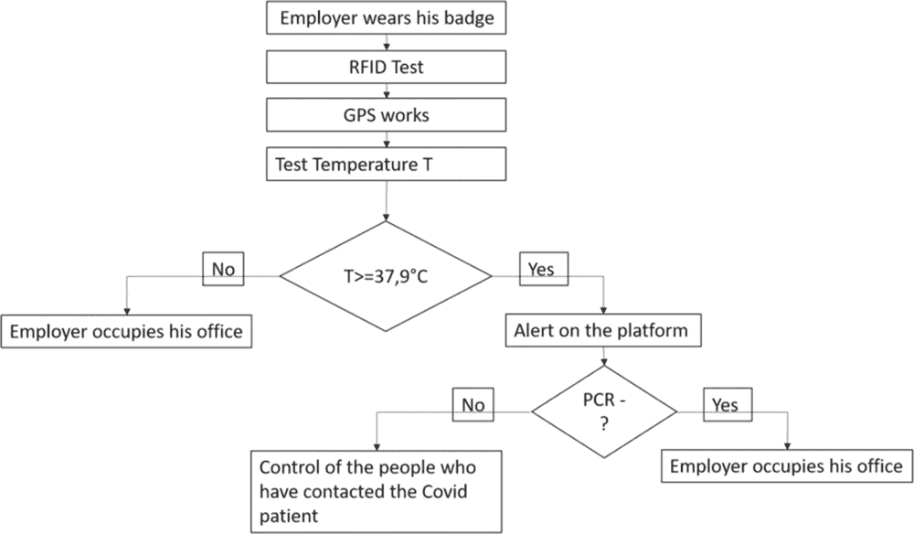 |

进入公司前及数据登记后。徽章将通过位于徽章领口与皮肤接触的小型温度传感器来测量温度。这样，工作时间内的温度都将被测量。

+   • 如果测得的体温高于 37.9°C，则徽章会在由员工控制的平台上发出警报，随后会呼叫冠状病毒服务执行 PCR 测试，需时 48 小时。在此期间，员工需进行隔离。

+   • 如果 PCR 检测结果为阳性，则在 48 小时内与其接触过的所有员工都需进行此测试。

+   • 如果 PCR 检测结果为阴性，员工可返回工作岗位

+   • 如果温度严格低于 37.9°C，则无需报告

相关组件和技术

+   1\. BLE 接近性

智能徽章使用 BLE 信标和扫描来检测附近的其他智能徽章（见图 2）。当某些风险水平超过时，设备会发送警报。

| 图 2\. BLE 接近性 |
| --- |
| 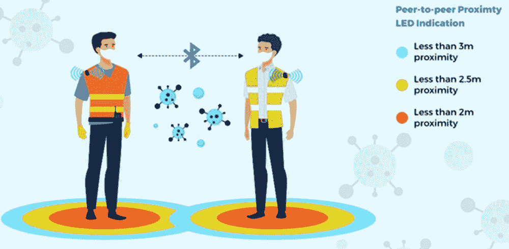 |

+   2\. SOS 紧急求救警报

SOS 紧急求救警报用于室内和室外工人徽章。通过按下 SOS 按钮，设备与预先注册的 ID 通信，以便受害者可以发言并警报急救服务。借助 GPS 功能，可以通过 Google 地图链接精确定位用户。

+   3\. 远程广域网（LoRa WAN）协议

LoRaWAN 是一种用于低速通信的电信协议。使用 LoRa 技术的低功耗对象通过网关连接到互联网，从而参与物联网。该协议用于智能城市、工业监控和农业。与 LoRaWAN 相关联的调制技术是 LoRa，它是由 Grenoble 创业公司 Cycleo 于 2009 年创建，并在 2012 年被 Semtech 收购。Semtech 通过 LoRa 联盟推广其 LoRa 平台，后者是该联盟的成员。LoRaWAN 协议在 LoRa 物理层上允许连接传感器或需要长电池寿命的对象，体积和成本较小（见图 3）。

| 图 3\. LoRaWAN 网络协议 |
| --- |
| 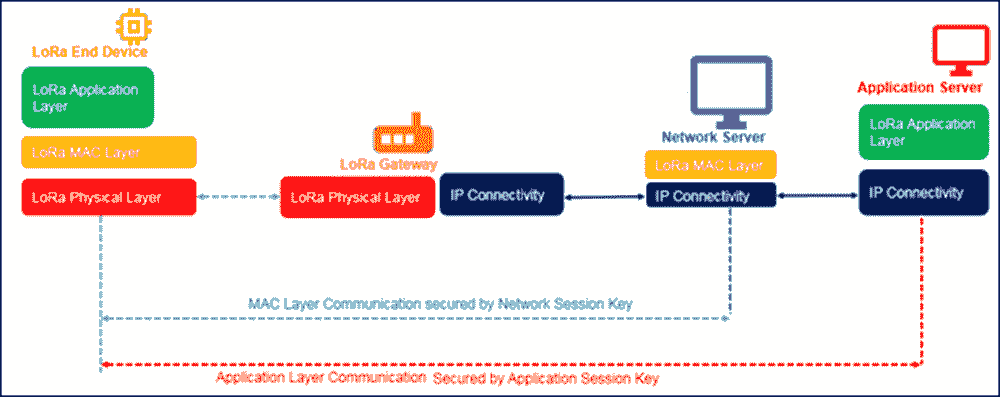 |

终端将数据发送到网关，网关将其传输到网络服务器，网络服务器再将其传输到应用服务器。云端执行数据路由和电池优化，并提供安全通信。

由于 LoRaWAN 设备可以在传感器发生变化或定时器激活时与网络服务器通信。它们可以随时唤醒并与服务器通信。

+   4\. 卫星定位系统（GPS）

GPS 的工作原理是基于接收器到多个卫星的距离测量。每颗卫星发射信号，接收器接收到信号，通过信号的传播时间可以非常精确地测量发射器和接收器之间的距离。GPS 将用于查找公司内工作人员的位置。

在这个项目中，我们使用了 NEO-6M GPS 模块（图 4）。它是一款性能卓越的全功能 GPS 接收器，配备了一款集成的 25 x 25 x 4 毫米陶瓷天线，具有强大的卫星搜索能力。通过电源和信号指示灯，您可以监视模块的状态。有了数据备份电池，在意外断电时模块可以保存数据。

| 图 4\. NEO-6M GPS 模块 |
| --- |
| 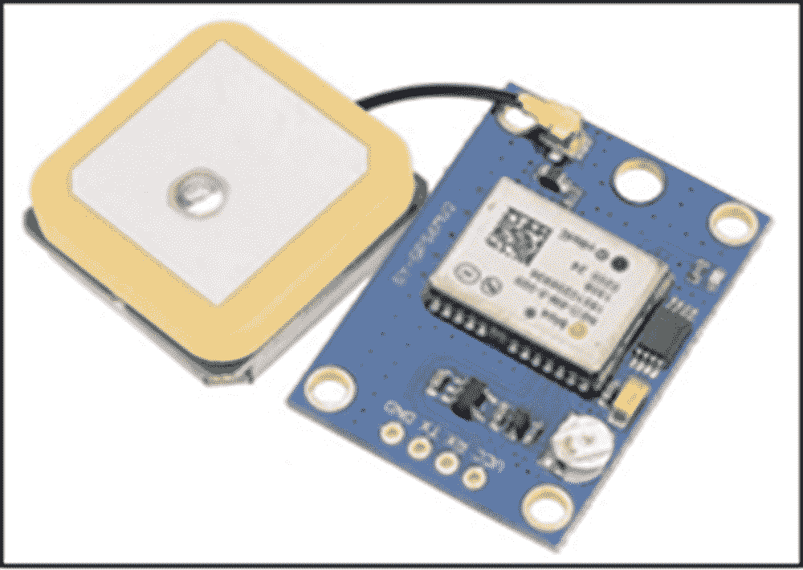 |

+   5\. 蓝牙低功耗（BLE）

BLE，提供简单可靠的访问。它受到消费类电子制造商、移动应用程序开发人员和工程师的欢迎。它越来越适用于所有需要更少能量的物联网相关事物。

蓝牙低功耗的主要优点无疑是其低能耗。用于短距离定期传输少量数据，BLE 易于部署。总的来说，BLE 的功耗是蓝牙的一半。最后，成本相对较低，电池寿命也不可忽视。BLE 具有不同类型的连接。BLE 连接的对象最多可以有 4 种不同的功能：

+   • 广播者: 它可以充当服务器。广播者: 它可以定期向设备传输数据，但不接受任何传入的连接。

+   • “观察者”: 在第二阶段，对象只能听取并解释由广播者发送的数据。在这种情况下，对象无法向服务器发送任何连接。

+   • “中央”: 常常是智能手机或平板电脑。它是以两种不同方式互动的元素：广告模式或连接模式。然后它是领导者，数据交换始于此。

+   • “外围”: 它接受来自中央的连接，并定期发送数据。该系统旨在通过协议以通用方式封装数据，以便其他外围理解。

    +   6\. 皮肤温度传感器

有了这个传感器（图 5），可以比传统温度计更准确地测量体温。此外，该传感器可以集成到几乎任何可穿戴的皮肤接触设备中。

| 图 5\. 皮肤温度传感器 |
| --- |
| 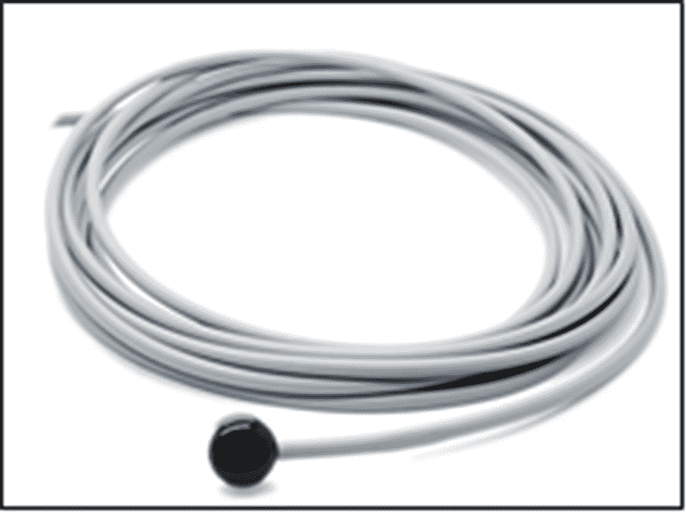 |

由于其小型化，传感器可以集成到几乎任何与皮肤接触的便携设备中。因此，本研究将使用它，因为我们将测试工作人员的体温。

+   7\. 边缘计算

边缘计算是一种开放式分布式计算架构（图 6）。它提供了分散式处理能力（Saini, K., 2018; Saini, K., 2019）。因此，数据不是传输到远程数据中心，而是直接由生成它的设备（连接对象、智能手机...）或本地计算机或服务器处理。具体而言，边缘计算可以被认为是一种微型数据中心的网状网络，用于处理或本地存储关键数据。然后，数据被传输到占地面积小于 10 平方米的中央数据中心或云存储中。

| 图 6\. 边缘计算流程图 |
| --- |
| 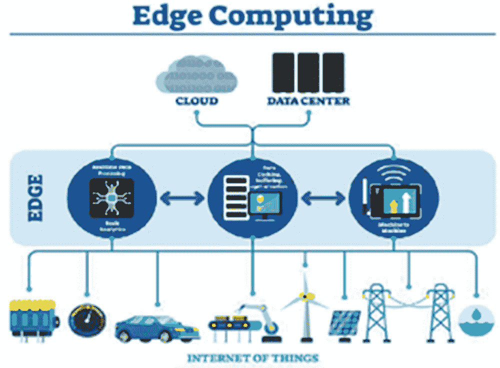 |

边缘计算最常用于物联网领域。一些由连接设备收集的大量数据在本地处理，以减少到云端或数据中心的流量，并允许对重要数据进行实时（或接近实时）分析。边缘计算用于接近检测和暴露评估。

+   8\. 射频识别 (RFID)

射频识别是一种使用称为射频标签的标记物远程存储和检索数据的方法。后者是小型对象，如自粘标签，可以粘贴或内置到物体或产品中，甚至植入到生物体内（动物、人体）。射频标签包括与微芯片相关联的天线，该芯片使它们能够接收和响应来自收发器的无线电请求（见图 7）。

这些电子芯片包含一个标识符，可能还包含额外的数据。该识别技术可用于识别：个人，通过集成到护照、交通卡、支付卡或雇主卡中，以进行签到。

| 图 7\. RFID 通信 |
| --- |
| 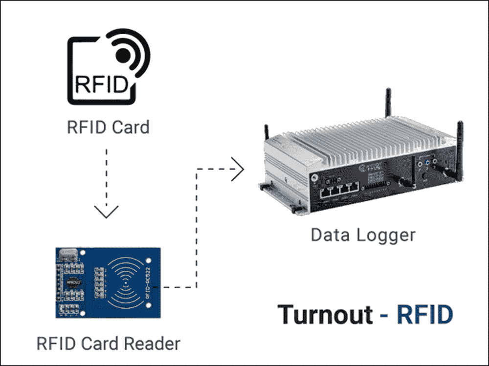 |

+   9\. WIFI 协议

WiFi 是由 IEEE 802.11 组的标准管控的一组无线通信协议（ISO/IEC 8802-11）。 WiFi 网络允许多台计算机设备（计算机、路由器、智能手机、调制解调器、互联网等）通过无线电波连接到计算机网络中，以便在它们之间以高速传输数据。

WiFi 用于将所有徽章与平台连接起来，以识别是否存在 covid 病例，是否有人遇到过受污染的工人，或按下 SOS 按钮，以及是否有地点需要消毒。

智能口罩

一般而言，口罩可以保护佩戴者免受通过空气传播的非常小的微生物（例如流感、冠状病毒或结核杆菌）的吸入。除此之外，智能口罩还可以测量佩戴者的体温，测量其周围物体的温度，测量 CO2 的水平，并过滤呼吸空气（见图 8）。

| 图 8\. 智能口罩图片 |
| --- |
| 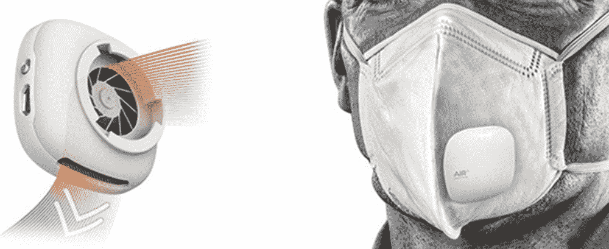 |

温度测量

测量温度时，我们使用了 MLX90164 温度传感器（图 9）。这个外表酷似未来科技的传感器在闪烁的眼睛背后隐藏着一个秘密。与大多数温度传感器不同，该传感器测量远处物体反射的红外光，因此可以在不接触物体的情况下检测温度。只需将传感器对准想要测量的物体，它就会通过吸收发射的红外波浪来检测温度。

这个传感器在许多应用中使用，如：精密温度测量（非接触式）、医疗界的温度测量、体温测量、移动空调系统的传感器、商业、工业和住宅区域空调系统的温度测量、挡风玻璃起雾检测、食品监测、打印机和复印机的温度控制以及热警报。

| 图 9. MLX90164 温度传感器图片 |
| --- |
|  |

这是一个用于测量环境和物体温度的非接触式红外温度传感器。该模块通过 PWN 输出或 I2C 链路与微控制器通信。由于它不接触正在测量的物体，因此可以检测到大多数数字传感器无法检测到的温度范围：从 -70 度到 +380 度。它在 90 度的视角内进行测量，因此可以用于确定区域的温度。

运动传感器

使用的运动传感器是 HC-SR505（图 10）。这个 PIR（热释电红外）传感器测量检测区域内物体发出的红外（IR）光。由于它已经在检测区域内的某些物体移动时发送高信号，因此非常易于使用。这个高信号持续约 8 秒，有时被认为是一个缺点。不幸的是，这个缺点不能通过软件来解决，即添加一个源代码的变通方法是不起作用的。模块的工作电压在 4.5V 和 20V 之间。根据数据表，该传感器可以检测到达 3 米的距离的运动。

| 图 10. HC-SR505 运动传感器图片 |
| --- |
| 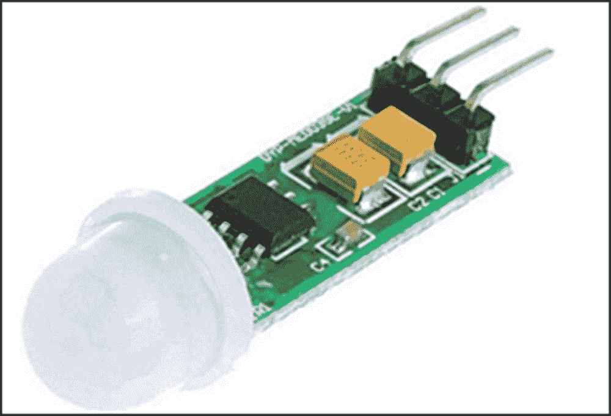 |

气体传感器

使用的气体传感器是 MG-811（图 11）。它可以检测 CO2 的存在。6V 功率升压器可以使传感器升温以进行精确测量。其高灵敏度和快速响应时间是其特点。该模块具有模拟输出和数字开关输出。模块连接到 Arduino 兼容板的模拟输入。

| 图 11. MG-811 气体传感器图片 |
| --- |
| 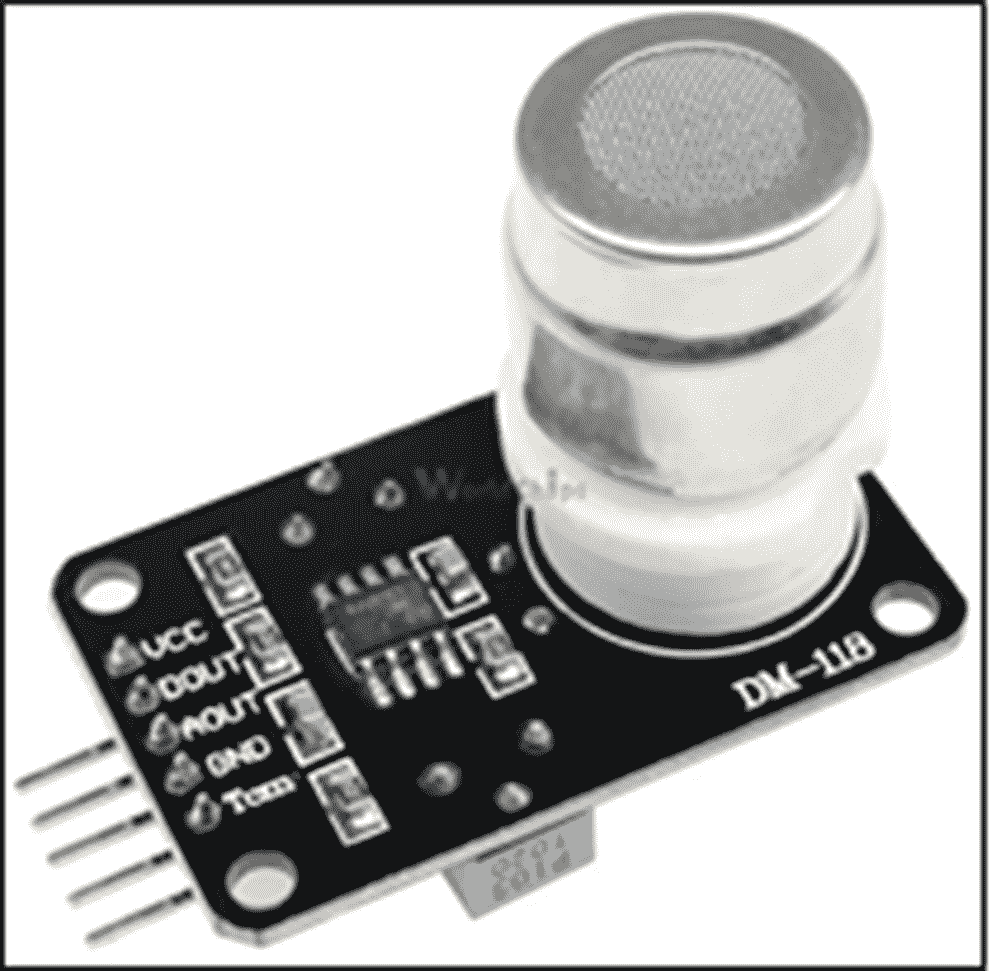 |

通风扇

口罩内部有两个通风口（图 12）。空气被吸入、过滤并呼出。口罩适应佩戴者的呼吸，使其安全舒适。为此，传感器检测佩戴者的呼吸周期和容量，并允许三种不同速度的通风口进行调节。简而言之，通风口会自动加速以便于空气进入，并在呼出时减缓以减少呼吸阻力。

| 图 12\. 通风口图片 |
| --- |
| 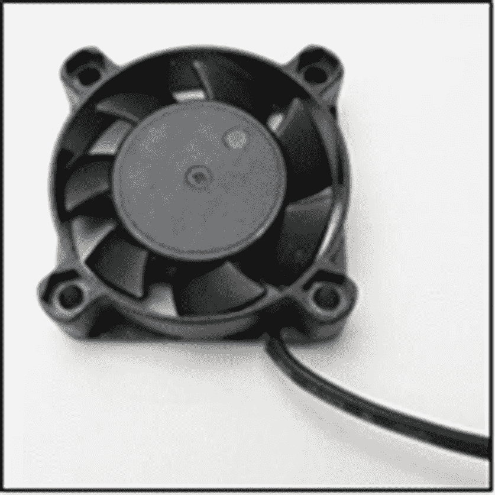 |

结论

在本章中，对两个物联网应用（智能徽章和智能口罩）进行了详细研究，用于保护在拥挤环境中工作的员工。智能口罩测量佩戴者的体温，并保护他免受通过呼吸道传播的非常小的微生物（如流感病毒或冠状病毒）的吸入。智能徽章测量佩戴者的体温。它配备了用于室内和室外工作者的 SOS 紧急求助警报。通过按下 SOS 按钮，设备与预先记录的 ID 进行通信，以便受害者可以交谈并警报紧急服务。

参考文献

BaluprithvirajK. N.BharathiK. R.ChendhuranS.LokeshwaranP. (2021). 基于人工智能的智能门禁系统，具有口罩检测功能。IEEE 人工智能与智能系统国际会议（ICAIS），543-548\. 10.1109/ICAIS50930.2021.9395807

Chamola, V., Hassija, V., Gupta, V., & Guizani, M. (2020). 对 COVID-19 大流行的全面审查及物联网、无人机、人工智能、区块链和 5G 在管理其影响中的作用。IEEE Access: 实用创新、开放解决方案 , 8, 90225–90265\. doi:10.1109/ACCESS.2020.2992341

ChandraY. U. (2019). 智能校园学生活动的智能电子徽章。IEEE 用于智能社会的 ICT 国际会议（ICISS），1-6\. 10.1109/ICISS48059.2019.8969806

DesaiM. R.ToraviS. (2017). 物联网环境中智能家居和心跳监测的智能传感器接口。IEEE 当前计算机、电气、电子和通信技术的国际会议（CTCEEC），74-77\. 10.1109/CTCEEC.2017.8455124

GargH.DaveM. (2019). 通过 REST API 和中间件保护物联网设备并安全连接点。IEEE 物联网：智能创新与用途国际会议（IoT-SIU），1-6\. 10.1109/IoT-SIU.2019.8777334

GuptaA. K.JohariR. (2019). 基于物联网的电器设备监控和控制系统。IEEE 物联网：智能创新与用途国际会议（IoT-SIU），1-5\. 10.1109/IoT-SIU.2019.8777342

HarithaD.SwaroopN.MounikaM. (2020). 使用 CNN 和 X 射线预测 COVID-19 病例。IEEE 国际计算、通信和安全会议（ICCCS），1-6\. 10.1109/ICCCS49678.2020.9276753

Henderi.（2020）。使用正向链接诊断 COVID-19 的模型决策支持系统：印度尼西亚的案例。第 8 届国际网络和 IT 服务管理会议（CITSM），1-4。10.1109/CITSM50537.2020.9268853

JavaliC.RevadigarG.（2012）。基于 IEEE 802.15.4 LRWPAN 的无线智能徽章。IEEE 世界信息与通信技术大会，367-372。10.1109/WICT.2012.6409104

João，D. V.，Lodetti，P. Z.，dos Santos，A. B.，Izumida Martins，M. A.，De Francisci，S.，& Brandao Almeida，J. F.（2021）。电力部门的智能徽章实施，用于提高工作人员安全性 - 一项研究案例。IEEE 电力与能源协会创新智能电网技术会议，1–5。提前在线发表。doi:10.1109/ISGT49243.2021.9372220

LiC. H.（2021）。基于物联网的智能回收机的发展，用于收集废弃的非织造布口罩（NFM）。IEEE 亚洲产品合规工程研讨会（ISPCE-CN），1-5。10.1109/ISPCE-CN51288.2020.9321851

Mikroyannidis，A.，Domingue，J.，Bachler，M.，& Quick，K.（2018）。数据科学教育的智能区块链徽章。IEEE 教育前沿会议（FIE），1-5。10.1109/FIE.2018.8659012

RahmanM. M.（2020）。智能城市网络中限制 COVID-19 的自动化系统：面部口罩检测。IEEE 国际物联网、电子与机电技术会议（IEMTRONICS），1-5。10.1109/IEMTRONICS51293.2020.9216386

SainiK.（2018）。未来的主导技术区块链：数字化转型。IEEE 计算、电力和通信技术国际会议，937-940。10.1109/GUCON.2018.8675075

Saini，K.（2019）。边缘云框架的最新进展和未来研究方向。《国际工程与先进技术杂志》，9（2），1–6。doi:10.35940/ijeat.B3090.129219
