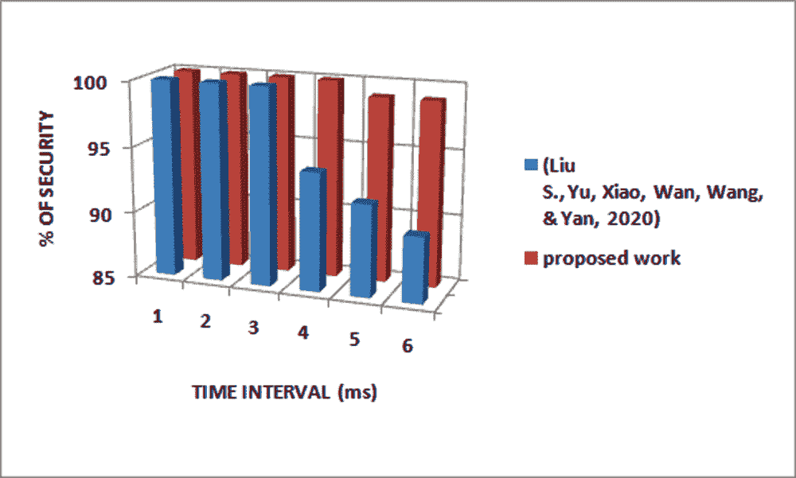
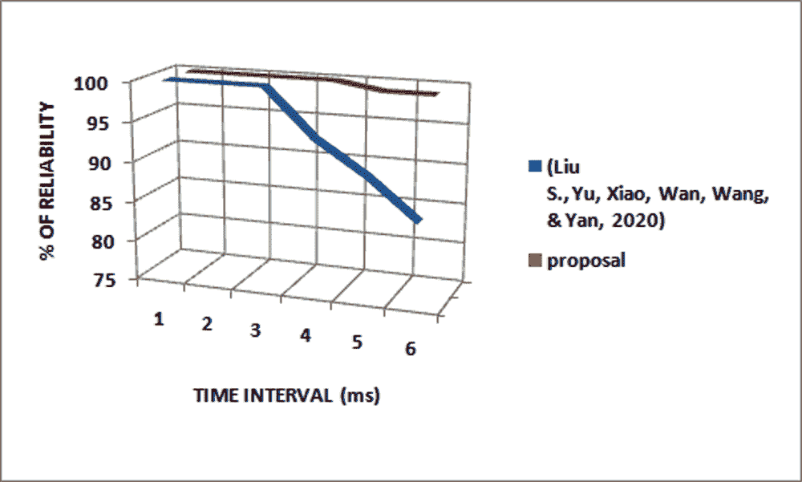

# 第十三章

# 可靠的区块链辅助可搜索的基于属性的加密技术用于云物联网

+   Ambika N.

    

    印度圣弗朗西斯学院

摘要

该工作利用联盟区块链，其中许多预定的节点控制着协议。不同的设备可以生成数据并将数据发送到数据池中。所有协议节点共同更新用户拒绝列表，从而提高了框架的可靠性。用户通过区块链提交搜索请求。用户向区块链发送部分令牌，并且协议节点使用用户的特征密钥生成总和。然后，云可以使用客户的总令牌执行搜索。云从区块链请求与客户的相关时间协调的预解密密钥以进行预解密。该系统相当于一个公告栏，我们在其中记录所有用户的公开身份密钥、用户解密密钥、密钥更新消息和预解密密钥。云可以使用这些密钥为客户进行预解密，而协议节点负责更新未被撤销用户的密钥。该提案将安全性提高了 3.82%，并将信任度提高了 5.09%。

引言

物联网（Ambika，2019）（Alaba，2017）（Nagaraj，2021）通过降低人类的努力程度使人类生活变得更加轻松。这些设备使用共同平台以不同的能力相互通信。云支持庞大的数据存储。物联网设备与云之间的传输需要一定的安全性。一些利用这些设备的应用包括智能家居（Verma＆Sood，2018）、医院（Ambika N.，2020）（Abdelgawad，Yelamarthi＆Khattab，2016）、工业（A＆K，2016）、智能建筑（Akkaya，Guvenc，Aygun，Pala＆Kadri，2015）和城市（Alrashdi，Alqazzaz，Aloufi，Alharthi，Zohdy，＆Ming，2019）。这些设备没有足够的空间来存储大量数据。因此，使用云进行存储。使用互联网服务，设备可以随时随地上传数据。

区块链（Atlam & Wills, 2019）是一个分布式记录，其中包含不断增长的证据序列。区块链的分布式特性意味着没有单一实体控制数据，而是需要共同验证记录的可信度。这些记录在使用加密哈希连接的块中，因此得名区块链。基于区块链的技术鼓励一组同行者在网络中达成共识的算法。其中区块链解决方案（Chen, Xu, Lu, & Chen, 2018）（Dorri, Kanhere, Jurdak, & Gauravaram, 2017）是比特币加密货币。比特币区块链维护了从初始块开始的所有交易。交易包括发件人、收件人、转移的比特币金额以及签名（发件人）。为了使交易得以记录，区块链向区块链网络传输。所谓的矿工负责验证新交易并提出包含已验证交易的下一个块。矿工通过比特币和交易费用来奖励他们的计算工作。

这项工作（Liu S., Yu, Xiao, Wan, Wang, & Yan, 2020）利用了联盟区块链，其中预定的（信任的）节点控制共识协议。各种工具可以生成数据并将数据发送到数据池。然后，共识节点运行共识协议来更新链，并使该系统中的所有设备都达成一致状态。所有共识节点一起更新用户撤销列表，从而提高了系统的可靠性。用户通过区块链提交搜索请求。用户将部分令牌发送到区块链，共识节点使用用户的特征密钥生成完整的令牌。它可以使用完整的承诺来为用户执行搜索。它从区块链获取相关的时间协调的预解密密钥以进行预解密。该系统相当于一个公告板，记录了所有用户的公开身份密钥、用户解密密钥、密钥更新消息和预解密密钥。它可以使用这些密钥对用户进行预解密，而共识节点负责为未被撤销的用户更新凭据。该方法相对于先前的工作有所改进。该提案使用默克尔根方法生成哈希值。与（Liu S., Yu, Xiao, Wan, Wang, & Yan, 2020）相比，它将先前生成的值前缀到数据上，并在传输之前将新的哈希值后缀到数据上。相较于（Liu S., Yu, Xiao, Wan, Wang, & Yan, 2020），它将可靠性提高了 5.09%。

本章分为七个小节。 文献综述在第二节引言之后。 第三节简要介绍了工作的背景。 第四段详细说明了先前的贡献。 第五个子部分解释了拟议的工作。 第六节提供了工作的分析。 本章在第七节结束。

文献综述

该部分包含类似于讨论的贡献。 这项工作（Liu S.，Yu，Xiao，Wan，Wang 和 Yan，2020）利用联盟区块链，在那里预定（相信）的节点控制协议。 不同的设备可以生成数据并将数据发送到数据池。 然后，协议节点运行协议来更新链并使该系统中的所有设备保持一致状态。 所有协议节点合作更新客户拒绝列表，以提高框架的可靠性。 用户通过区块链提交搜索请求。 用户将部分令牌发送到区块链，协议节点使用客户的特征密钥生成完整的令牌。 它可以使用客户的完整承诺执行搜索。 它从区块链中请求与客户的时间相关的预解密密钥来进行预解密。 该系统相当于一个布告板，我们在其中记录所有客户公开身份密钥、客户解密密钥、密钥更新消息和预解密密钥。 它可以使用这些密钥对客户进行预解密，协议节点负责为未放弃的客户更新凭据。

该工作（Shafagh，Burkhalter，Hithnawi 和 Duquennoy，2017）将我们的物联网分布式存储系统的控制平面和数据平面分离。 在系统中，控制平面将数据平面的理性分离。 他们利用一个公开明显的区块链来创建一个负责任的分布式系统，并在没有中心信任实体的不受信任的网络中启动信任。 交易包括流的所有权和相关访问权限。 他们使用区块链安全地存储访问权限。 访问权授予每个数据流。 数据所有者可以拒绝共享数据流。 对于检索数据的任何请求，存储节点首先检查区块链以获取访问权限。 要撤销对数据流的访问权，数据所有者更新加密密钥。 他们存储形成序列的数据块。 数据块在源端使用对称密码 AES-GCM 进行加密。 在存储层，他们积累键值对。 物联网网关充当存储层前端的代理存储节点。 门使用 FIFO 标准将块推入存储层。

新工程（Manzoor，Liyanage，Braeke，Kanhere 和 Ylianttila，2019）依赖于区块链的组件。它是用于安全存储和共享传感器数据的重新加密。他们在系统中考虑了四个实体：物联网传感器，数据请求者，云供应商和区块链。传感器的所有者激活传感器并使用合同功能将其注册到区块链上。注册后，传感器的所有者为传感器提供所需的密钥材料。测量数据传输到分布式存储服务器。用户使用智能合同功能请求访问所有者的一个（或一组）传感器。在收到请求后，将在区块链上生成并开采合同。请求者与区块链交互以共享公共加密密钥并处理所有与财务相关的交易。在接收到用户请求后，分布式存储通过区块链进行通信。软件根据请求过滤数据。当收到用户请求时，传感器所有者的重新加密密钥将在智能合同上更新。当数据接收到处理时，区块链会通知请求者数据的临时位置。请求者可以使用其私有加密密钥解密数据。他们建议应用基于证书的代理重加密（CB-PRE）方案，其中包括七个多项式时间算法。

这个框架（Dwivedi, Srivastava, Dhar, & Singh, 2019）包括五个部分，包括覆盖组织、云存储、医疗保健供应商、智能合约和患者配备医疗可穿戴 IoT 设备。云存储集群将用户数据存储在不可区分的块中，与唯一的块编号相关联。这些云与覆盖网络连接。信息被存储到领域中，云服务器将数据块的哈希发送到覆盖网络。使用 Merkle Tree 计算数据的哈希。系统接受根哈希。它包括前一个值生成链。它包括特定的节点以证明具有有效证书。可以在网络上创建记录之前上传或验证它。一旦得到验证，他将能够在网络上对数据/交易进行数字签名。为了增加网络的灵活性并避免网络延迟，他们将节点分组为多个集群。每个集群都有一个集群头，负责设备的公钥。在延迟的情况下，连接到任何集群的任何设备都可以更改集群。该工具附加到一个群组并可以更改群组头。群组头保留可以访问特定患者数据的请求者的公钥。保险公司或患者委派医疗服务提供商执行临床检查。医疗保健服务提供商一旦从网络收到警报就会处理患者的治疗。他们还将其视为网络中的一个节点，并被授权从云中获取特定患者的数据。智能合约允许在任何 IoT 设备上创建协议，并在给定条件满足时执行。当从不遵循显示范围的可穿戴设备获得读数时，智能合约将向授权人或医疗保健提供者发送警报消息。它存储了不规则的数据，以便医疗保健提供者可以获取患者的血压读数。IoT 设备将收集患者的所有健康数据。此类数据可能是脉搏、休息状态或行走距离等等。患者自己是他们信息的所有者。他们负责允许、拒绝或撤销其他方的数据访问。如果患者需要医疗治疗，将会与所需医生共享个人健康数据。治疗结束后，患者可以拒绝医生、医疗服务提供者或医疗保险公司进一步访问。

患者信息通过健康传感器（Obour Agyekum, Xia, Sifah, Gao, Xia, & Guizani, 2019）进行分组，通常在记录后转移到云工作人员。在患者的临床信息移动到云工作人员之前，患者对其数据特征进行编码。它显示了数据的入口服务。患者向区块链处理节点提供所有经授权的用户的详细信息。因此，只有当用户满足特征集并使用与该特征集相关的私钥时，才能访问患者的数据。数据所有者是获取的实体。访问是根据数据用户的私钥是否与数据所有者确定的质量集相匹配而产生的。数据用户是希望使用来自所有者的数据的实体。数据所有者和用户都应在区块链上注册。云服务器是来自所有者的信息的存档。云服务器使用通信渠道发送所有加密记录。区块链网络包括以下实体。发行人实体在区块链网络上注册参与者（数据所有者和用户）。它为他们提供注册密钥，并作为他们的身份（ID）的身份。验证者可以作为身份验证单元，检查用户是否发出访问请求或数据所有者是否将其数据上传到存储器。处理节点是区块链网络的脉搏。该实体执行所有进程。

该工作（Liu B., Yu, Chen, Xu, & Zhu, 2017）分为四部分- 数据所有者应用程序（DOA），数据购买者应用程序，云存储服务和区块链。 CSS 分为私有 CSS 和公共 CSS。数据完整性验证将涉及多个 DOA 和 DCA。数据完整性服务（DIS）以区块链框架为基础。需要 DIS 的人必须首先在其节点上启动区块链客户端。每个设备都可以自由加入或离开区块链网络。为了简化所提出的服务，它使用云存储服务。数据完整性服务（DIS）由生活在区块链上的智能合约实现。实施是完全分散的，这使得 DIS 的效率更高，可靠性更好。数据完整性服务通过智能合约实现。应该本地加密要记录在区块链上的每个参与方的记录与共识相关。区块链服务启动后，节点上的区块链数据将与整个区块链网络同步。 DOA 应通过智能合约将信息写入区块链，以便在区块链达成共识后对其他设备有效和公开。

[无人机链](https://wiki.example.org/dronechain)（Liang, Zhao, Shetty, & Li, 2017）包括四个主要部分- 无人机、控制系统、云工作者和区块链网络。至少有一架无人机可以形成一个无人机群来执行复杂的任务。控制系统可以被指派并与无人机群通信以进行数据收集和任务分配。云工作者为无人机收集的数据提供存储能力，并提供实时数据处理和数据分析，以促进未来的动态。区块链，一个去中心化的网络，被用于数据验证和容错。它需要通过代表与控制系统通信以传递收集到的数据或飞行状态数据，并获取命令。控制系统从无人机或无人机群收集数据，并传输命令以修改飞行动作。控制系统用于汇总从无人机获取的信息。它对原始数据进行哈希以保护完整性，然后将原始数据和哈希数据同时发送到区块链网络和云端。区块链网络用于三个目的的实施。每个哈希数据条目都会传输到区块链网络以保护完整性，并可以以确保稳定性的适当方式存储。云数据库存储从无人机收集的原始数据，控制系统发送的命令以及云工作者和审查人员的数据访问。每次访问数据时都会为其生成一个唯一标识符，该标识符也存储在数据库中。守护进程将查看数据库和区块中的每个数据条目。为了验证数据记录，云工作者负责向区块链网络请求区块链收据，作为数据完整性的永久证明。链网络定期用于一致性检查。

作者（Samaniego & Deters，2016 年）将虚拟资源实现为 Golang 程序中的并行 go 调度。虚拟强度是一种在 Golang 语言中定义的函数。所有虚拟资源的源代码存储在示例数据库的代码存储库中。在运行时，管理员选择虚拟资源并将其编译到一个或多个 Golang 应用程序中。 Golang 功能添加到源代码中。它具有为目标平台编译的程序。管理员将代码放入基于许可的区块链，并通知边缘组件从区块链下载代码。虚拟资源通过通知主程序阻止其 go 功能或重新编译另一个主程序来停用。更改虚拟资源需要创建一个新的主程序。Edison 模块是一个芯片上的框架（SoC），包含一个 500 MHz 双核，双线程的英特尔 Atom 和一个 100 MHz 的 32 位英特尔 Quark 微控制器。在研究中使用的两个板都连接到相同的共享 Wi-Fi 网络。在第一次实验中，每个板运行一个虚拟资源。一个虚拟资源向另一个板上的虚拟强度发送 1000 个连续请求。发送请求后，虚拟资源等待确认并继续下一个请求。

BaDS 设计（张、何和朱，2018 年）包括以下成员：物联网设备、数据所有者、区块链网络和云。物联网设备收集信息并将信息发送到组织层。这些工具还负责数据获取、基本处理、加密和传输。这些设备通常可以远程请求访问并处理命令。当设备需要从其他设备请求数据时，它们应该向云端或数据所有者发布相应的请求。有一个非常大量的数据所有者，分成头部。管理者负责验证参与者。系统中的共识算法是拜占庭容错机制 PBFT，而不是比特币中使用的工作证明（POW）。该网络包含验证节点和排序节点。当设备收到交易时，它们将对其进行验证并将其打包到区块链中。云用于存储加密设备的数据，并在从物联网设备接收到请求时向区块链网络发送相应的请求以查询工具的权限。

每个节点 (Kim & Lee, 2018) 通过与充当门户的服务器进行通信，向不同位置的设备传输其数据。 它通过创建 n 个重新加密密钥并将这些密钥发送到代理服务器来执行加密。 然后，服务器生成允许其他节点解密文本的密文，减少每个设备的计算难度。 在该方案中，用户可以通过解密数据的权限(由其等级表示)来获取最终数据。 如果两个用户具有相同的属性，它们将具有相同的解密权限。 如果它们的属性不同，其他用户将经历否定。 在提议的数据共享方案中，不需要拒绝用户属性。 用户 A 通过重新编码加密密钥向想要访问已知数据的用户 B 传递加密密钥。 它可以使用用户 B 的强度公钥解密加密数据，根据其属性解密加密数据。 所提出的方法通过消除不必要的流程提供了增加的效率和更安全的数据共享。

LES (Al Salami, Baek, Salah, & Damiani, 2016) 利用了精彩的家庭应用。 它可以应用在以下情况：假设一个用户试图远程打开家中的前门。 在房子里，智能锁系统的实现带来了安全性。 用户将通过手机发送消息来打开门。 但是，命令智能锁系统打开门的消息包含了门锁定与否的敏感信息。 这些信息对于试图闯入房子的小偷是有用的。 该设计有两个子算法 - KEYEncrypt 和 DATAEncrypt。 第一个对会话密钥进行编码，最后一个是根据选择的密钥对消息进行加密。 该设计是基于字符的，这意味着用于该设计的公钥只是身份字符串，不需要认证。 基于字符的属性有助于管理智能家居设备的加密密钥。

A lightweight is no pairing ECC-Based ABE (Yao, Chen, & Tian, 2015). 它旨在解决物联网中的信息安全和隐私问题。提出的 ABE 方案的安全性取决于 ECDDH 问题而不是双线性 Diffie–Hellman 怀疑，这可以减少计算开销和通信开销。安全验证是在基于特定属性的集合模型中进行的。椭圆曲线是一种综合加密方案。它为用户提供信息隐私和信息完整性，采用 ECDH 生成共享秘密，其中加密密钥和 MAC 密钥分别确定。一个 KP-ABE 计划包含四个算法。Setup 算法随机化计算，并由位置控制。它产生公共凭证边界和主密钥。分布式边界具有位置的关键秘密。Encrypt 算法是一个随机化算法，由发送者控制。通过对要编码的消息进行处理，它产生加密文本。特征集规定了信息用户应满足的条件，以及公共凭证边界作为输入。Key-Generation 算法是随机的。它由权限控制，并将入口结构和主密钥作为输入。它产生与入口结构对应的解密凭证。解密算法由收集器控制，该控制器采用编码在属性集下的代码文本，与访问控制结构的解密密钥 D 以及公共凭证边界作为输入。如果控制结构值等于 1，则解密代码文本并生成消息。

背景

Merkle 根：Merkle 根是验证 Merkle 树上数据的数学方法。它们用于在共享网络上的对等方之间保证数据块的传输。它们对于维护像比特币和以太币这样的加密货币的加密交易所需的计算至关重要。哈希树有效且安全地编码了区块链数据。它通过快速检查分布式网络上的区块链数据来实现。在区块链网络上发生的每笔交易都有一个与之关联的哈希。这些嵌入为树状结构的哈希的目的是使每个哈希都与其父哈希在父子树状关系中相连。

假设两个即时消息的哈希在第 1 级。保持内容不变 T[1] 和 T[2]。让通过对 T[1] 进行哈希获得的结果哈希估计 Hm[1]。符号 (1) 表示相同的内容。通过对内容 T[2] 进行哈希推断出的派生哈希估计 Hm[2]。符号 (2) 表示相同。这两个哈希估计的父级由 Hm[12] 表示。通过对文本 T[1] 和 T[2] 进行哈希得到的相同。符号 (3) 表示相同。

 (1)

 (2)

 (3)

先前的贡献

先前的贡献（Liu S., Yu, Xiao, Wan, Wang, & Yan, 2020）有四个参与者。任何物联网设备都可以生成信息。信息所有者负责加密数据并生成列表。它接收密文。信息使用者（DU）使用其私人身份密钥生成令牌并将其发送到区块链。在接收到发送者的半解码密文后，DU 可以使用其私人身份密钥对信息进行解密。系统中使用的联盟区块链是由一组预选的受信任的理解节点、一个数据池和一个分布式边缘组成的共享网络。BC 引入了系统的公钥（Ambika & Raju, 2010），存储客户的共享身份密钥，初始化客户的解密密钥，生成密钥更新消息，并生成预解码密钥。节点的协议一起恢复客户的否认列表。云服务器是我们存储大量加密物联网数据的存储位置。存储负责为客户进行查找和预解码。该算法生成并发布全局公钥。协议节点使用 Pedersen 秘密共享协议和 Reciprocal 协议共同选择主密钥。当一个数据用户想要加入这个系统时，它运行算法生成其身份密钥对。然后，它将 ID 发送给 BC 进行存储。在下一步中，协议节点将使用 ID 生成此用户的共享解码密钥。这个公共解码密钥生成当前用户的预解码密钥。最后，云（Aazam, Khan, Alsaffar, & Huh, 2014）（Aceto, Botta, Donato, & W., 2013）可以使用预解码凭证为此客户预解码。每当用户否认时，协议节点运行 Revoke 算法更新否认列表。在凭证生成步骤中，协议节点生成三种类型的密钥。客户公共解码密钥基于客户数据。其次是密钥更新消息。它与客户否认列表、时间检查和状态标记相关联。最后一个是客户预解码密钥，由云用于客户的预解码。  

提出的工作

表 1\. 工作中使用的符号

| 使用的符号 | 描述 |
| --- | --- |
| N | 研究中的网络 |
| S[i] | 正在考虑的服务器 |
| ID[s] | 服务器的身份 |
| U[i] | 网络中的用户 |
| ID[u] | 用户的身份 |
| Data[i] | 传输的数据 |
| Hash[pre] | 先前的哈希值 |
| Hash[post] | 新的哈希值 |

+   1\. 

    服务器公钥生成 - 该提案通过使用 Merkle 根概念提高了可靠性。基站或服务器使用此概念生成公共哈希值。它向其用户广播。符号（4）表示相同。S[i] 是使用的服务器，ID[s] 是服务器 S[i] 在时间 Time[1] 的身份。

     (4)

+   2\. 

    用户注册 - 用户设备还使用 Merkle 根概念生成哈希值。在注册过程中，用户设备连接所获得的和生成的哈希值。符号（5）表示相同。让 U[i] 是用户，ID[u] 是用户的身份。

     (5)

此哈希值附加到发送到服务器的每条消息。每个会话具有不同的哈希值。它在之前的哈希值 hash[pre] 前缀之后，后跟数据 Data[i] 并在新哈希值 hash[post] 后缀之后。符号（6）表示相同。因此，与先前的贡献相比，网络的可靠性和安全性增加（Liu S.，Yu，Xiao，Wan，Wang 和 Yan，2020）。

 (6)

对工作的分析

协议中心（Liu S.，Yu，Xiao，Wan，Wang 和 Yan，2020）利用 Pedersen 秘密共享协议和 Reciprocal Protocol 共同选择主密钥。当数据用户需要加入此系统时，它运行算法生成其身份密钥对。然后，它将 ID 发送给 BC 进行存储。在下一阶段，协议中心将使用 ID 为该用户生成共享解密密钥。此公共解密密钥生成此用户的预解密密钥。最后，云（Aazam，Khan，Alsaffar 和 Huh，2014）（Aceto，Botta，Donato 和 W.，2013）可以使用预解密凭证为此用户进行预解密。每当用户撤销时，协议中心运行 Revoke 算法来更新撤销列表。在凭证生成步骤中，协议中心生成三种类型的密钥。第一个是客户的公共解密密钥。它基于客户的数据。第二个密钥更新消息与客户撤销列表、时间检查和状态标记相关联。最后一个是客户的预解密密钥，由云用于为客户进行预解密。

模拟是在 NS2 中执行的。表 2 包含模拟中使用的参数。

表 2\. 研究中使用的参数

| 使用的参数 | 描述 |
| --- | --- |
| 监控区域 | 200m *200 m |
| 考虑的设备数量 | 5 |
| 标识长度 | 24 位 |
| 生成的哈希值长度 | 12 位 |
| 模拟时间 | 60 ms |

表 3\. 用于生成哈希值的算法

| 输入：设备标识（24 位）步骤 1：交换奇偶位置中的位

步骤 2：对于 i=1 到 24

结果 [i] = Xor 操作极端位

步骤 3：对于 i=1 到 12

分成 2 组

对两个组进行循环右移

第四步：合并两个组 |

提案使用 Merkle 根来生成哈希值。服务器使用相同的概念使用其标识生成哈希值。此值传输给用户。同样，用户设备使用其标识计算哈希值。它将先前的哈希值前缀到数据并将新的哈希值后缀到数据。它传输给服务器。哈希值每个会话都会更改。它通过 3.82%（Abd El-Latif 等人，2020 年）增加了安全性。由于先前的哈希值已经前缀到数据，网络的可靠性（Ahmad，2014 年）提高了 5.09%。同样在图 1 和图 2 中表示。

| 图 1. 网络安全比较 |
| --- |
|  |
| 图 2. 网络可靠性比较 |
|  |

结论

物联网设备不同档次。这些仪器使用共享平台相互通信。它们没有足够的空间来存储，因此使用云设施。存储设施提供充足的仓储。使用区块链增强了传输数据的可靠性。该提案使用 Merkle 根生成哈希值。用户和服务器用此方法为每个会话更改其凭证。该方法通过 3.82%增加了安全性。数据由先前生成的哈希值前缀并由新值后缀。因此，该技术通过 5.09%提高了信任。

参考文献

A, B., & K, M. V. (2016). 工业物联网的区块链平台。软件工程与应用杂志, 9(10), 533.

AazamM.KhanI.AlsaffarA. A.HuhE. N. (2014). 物联网云：将物联网与云计算集成以及涉及的问题。在国际布尔班应用科学与技术会议上。巴基斯坦伊斯兰堡：IEEE。10.1109/IBCAST.2014.6778179

Abd El-Latif, A., Abd-El-Atty, B., Venegas-Andraca, S., Elwahsh, H., Piran, M., & Bashir, A. (2020). 使用物联网网络中的量子行走提供端到端安全性。IEEE Access: 实用创新，开放解决方案, 8, 92687–92696\. doi:10.1109/ACCESS.2020.2992820

AbdelgawadA.YelamarthiK.KhattabA. (2016). 用于主动和辅助生活的基于物联网的健康监测系统。在国际智能物体和社会福利技术会议上（第 11-20 页）。意大利威尼斯：Springer。

Aceto, G., Botta, A., de Donato, W., & Pescapè, A. (2013). 云监控：一项调查。计算机网络, 57(9), 2093–2115\. doi:10.1016/j.comnet.2013.04.001

AhmadM. (2014). 互联网物联网可靠性模型：一种范式转变。在 IEEE 国际软件可靠性工程研讨会上。意大利那不勒斯：IEEE。10.1109/ISSREW.2014.107

Akkaya, K., Guvenc, I., Aygun, R., Pala, N., & Kadri, A. (2015). 基于物联网的能源高效智能建筑占用监测技术。在 IEEE 无线通信和网络会议研讨会上。IEEE。

Al SalamiS.BaekJ.SalahK.DamianiE. (2016). 智能家居的轻量级加密。在第 11 届可用性、可靠性和安全性国际会议（ARES）（pp. 382-388）。IEEE。

Alaba, F. A., Othman, M., Hashem, I. A. T., & Alotaibi, F. (2017). 物联网安全：一项调查。网络与计算机应用杂志，88，10–28。doi:10.1016/j.jnca.2017.04.002

Alrashdi, I., Alqazzaz, A., Aloufi, E., Alharthi, R., Zohdy, M., & Ming, H. (2019). Ad-iot：智能城市中物联网攻击异常检测的机器学习。在第 9 届计算与通信研讨会和会议（CCWC）（pp. 305-310）。10.1109/CCWC.2019.8666450

Ambika, N. (2019). 利用 GPS 数据进行虚拟私人网络的能源感知认证。在物联网环境中的安全、隐私与信任（pp. 25-38）。施普林格。

Ambika, N. (2020). 云端工业物联网设备数据加密。在 Pal, S., & Díaz, V. G.（Eds。），IoT：安全与隐私范式（pp. 111–129）。CRC 出版社，泰勒弗朗西斯集团。

Ambika, N. (2020). 医疗保健中的系统化物联网信息系统。在 Chakraborthy, C.（Ed。），医疗保健中的智能医疗数据感知和物联网系统设计（pp. 155-177）。印度班加罗尔：IGI 全球。

Ambika, N., & Raju, G. T. (2010). 无线传感器网络中的幻想认证方案。在安全技术、灾难恢复和业务连续性中。柏林、海德堡：施普林格。

Atlam, H. F., & Wills, G. B. (2019). 区块链和物联网的技术方面。在区块链技术在物联网应用中的作用（Vol. 115）。doi:10.1016/bs.adcom.2018.10.006

Chen, G., Xu, B., Lu, M., & Chen, N. S. (2018). 探索区块链技术及其在教育中的潜在应用。智能学习环境，5（1），1。doi:10.1186/s40561-017-0050-x

Dorri, A., Kanhere, S. S., Jurdak, R., & Gauravaram, P. (2017). 物联网安全与隐私的区块链：智能家居案例研究。在 IEEE 国际普适计算与通信研讨会上。IEEE。

Dwivedi, A. D., Srivastava, G., Dhar, S., & Singh, R. (2019). 一种去中心化的保护隐私的医疗保健物联网区块链。传感器（巴塞尔），19（2），1–17。doi:10.3390/s19020326

Kim, S., & Lee, I. (2018). 基于代理重加密的物联网设备安全。环境智能与人性化计算杂志，9（4），1267–1273。doi:10.1007/s12652-017-0602-5

LiangX.ZhaoJ.ShettyS.LiD. (2017). 通过区块链实现物联网数据的保障和恢复。在 IEEE 军事通信会议（MILCOM）（pp. 261-266）。IEEE。

刘 B.YuX. L.ChenS.XuX.ZhuL. (2017). 基于区块链的物联网数据完整性服务框架. 在 IEEE 国际网络服务会议 (ICWS) (pp. 468-475). 檀香山, 夏威夷: IEEE. 10.1109/ICWS.2017.54

Liu, S., Yu, J., Xiao, Y., Wan, Z., Wang, S., & Yan, B. (2020, May). BC-SABE: 用于云物联网的区块链辅助可搜索属性基础加密. IEEE 物联网杂志 , 7(9), 1–17\. doi:10.1109/JIOT.2020.2993231

ManzoorA.LiyanageM.BraekeA.KanhereS. S.YlianttilaM. (2019). 基于区块链的安全物联网数据共享代理再加密方案. 在 国际区块链和加密货币会议 (ICBC) (pp. 99-103). IEEE. 10.1109/BLOC.2019.8751336

Nagaraj, A. (2021). 物联网和云计算应用中的传感器简介. 本特姆科学出版社. doi:10.2174/97898114793591210101

Obour Agyekum, K. O., Xia, Q., Sifah, E. B., Gao, J., Xia, H. D., & Guizani, M. (2019). 基于区块链的物联网环境中安全的代理数据共享模块. 传感器（巴塞尔） , 19(5), 1–20\. doi:10.3390/s19051235

SamaniegoM.DetersR. (2016). 在区块链上为边缘主机托管虚拟物联网资源. 在 IEEE 计算与信息技术国际会议 (CIT) (pp. 116-119). 纳迪, 斐济: IEEE. 10.1109/CIT.2016.71

ShafaghH.BurkhalterL.HithnawiA.DuquennoyS. (2017). 朝着基于区块链的可审计物联网数据存储和共享. 在 2017 年云计算安全研讨会会议论文集 (pp. 45-50). ACM. 10.1145/3140649.3140656

Verma, P., & Sood, S. K. (2018). 雾辅助物联网智能家居中的患者健康监测. IEEE 物联网杂志 , 5(3), 1789–1796\. doi:10.1109/JIOT.2018.2803201

Yao, X., Chen, Z., & Tian, Y. (2015). 用于物联网的轻量级属性基础加密方案. 未来一代计算系统 , 49, 104–112\. doi:10.1016/j.future.2014.10.010

Zhang, Y., He, D., & Choo, K. K. (2018). BaDS: 基于区块链的数据共享架构，具有 ABS 和 CP-ABE 在物联网中. 无线通信与移动计算 , 2018, 1–10\. doi:10.1155/2018/2783658
