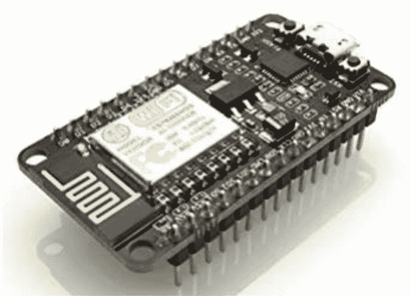
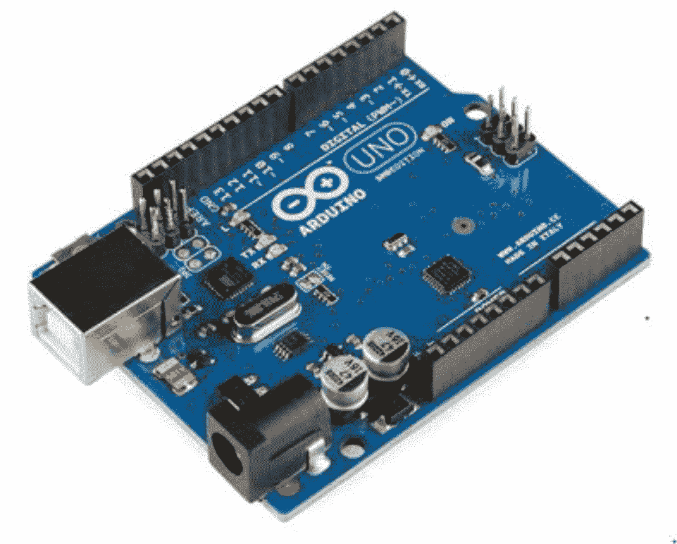
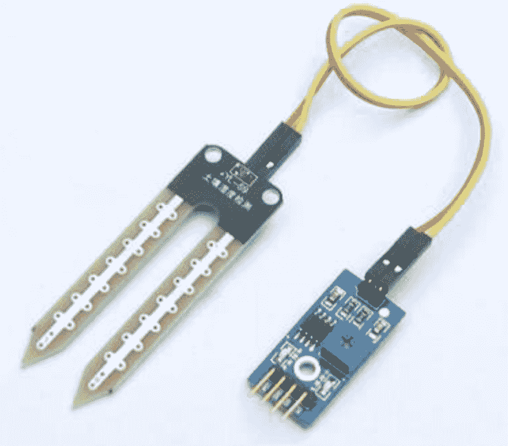
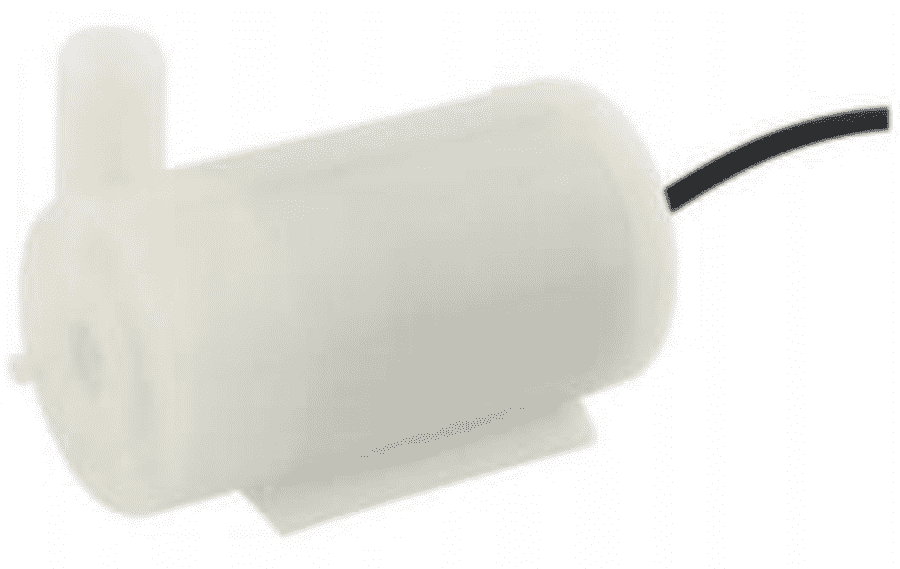
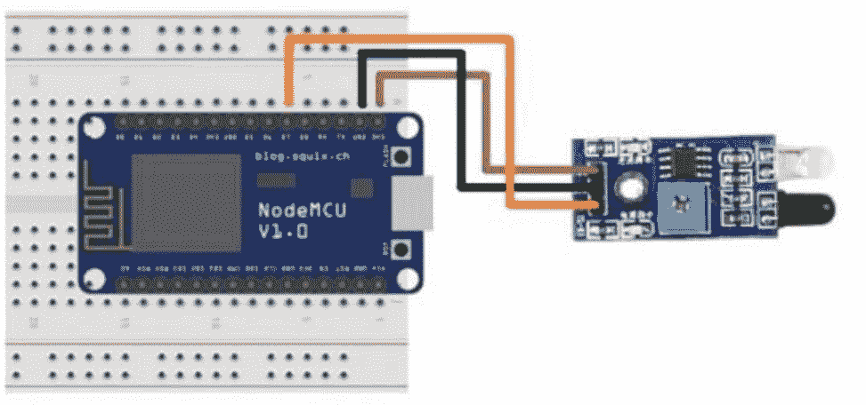
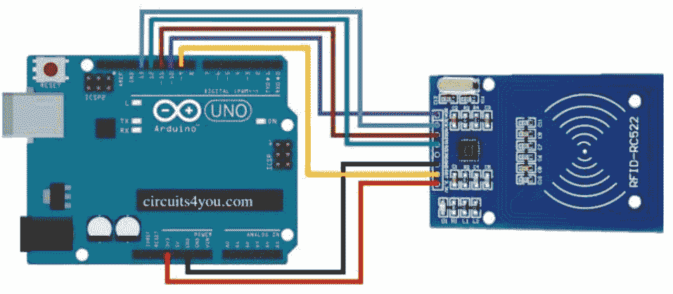
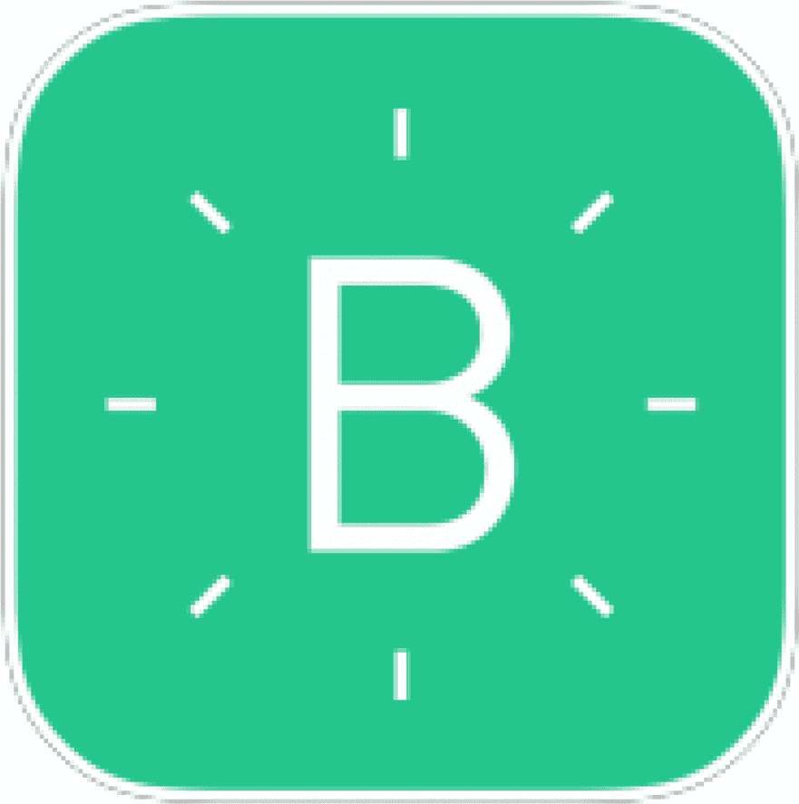
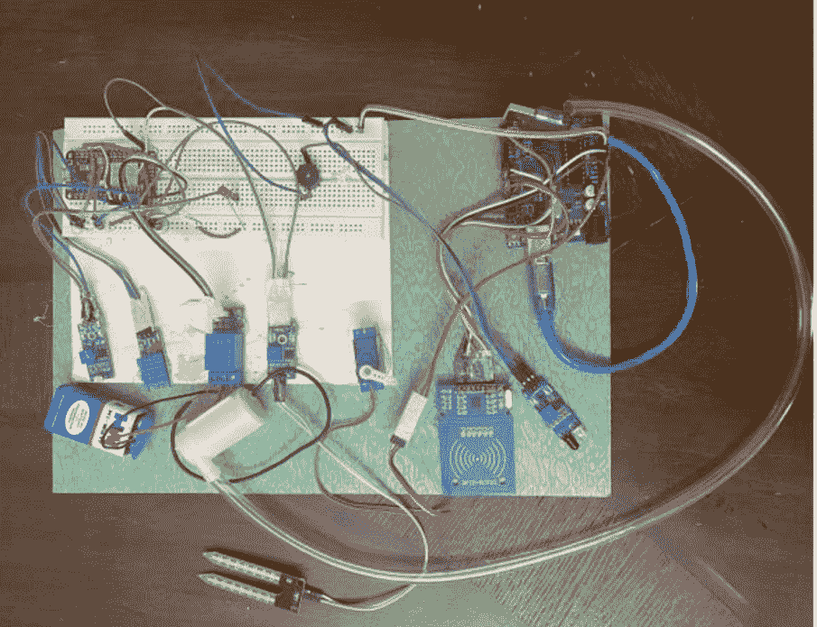
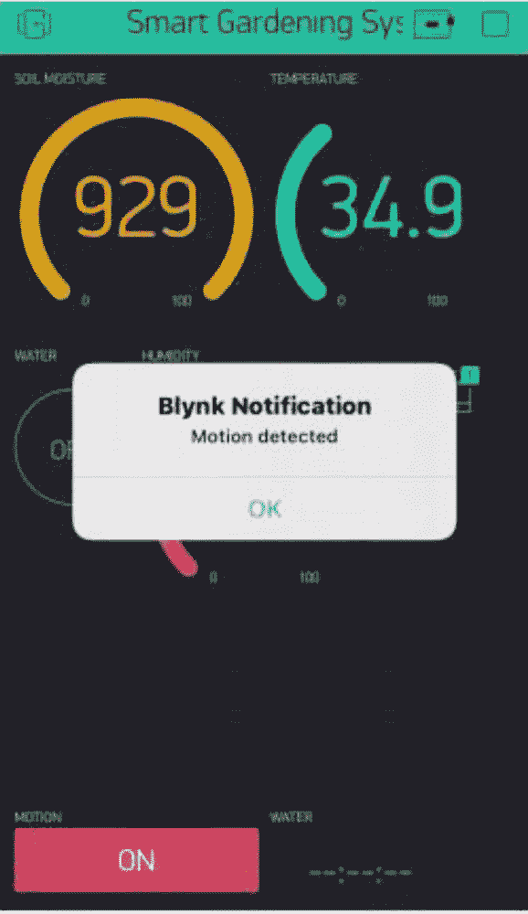
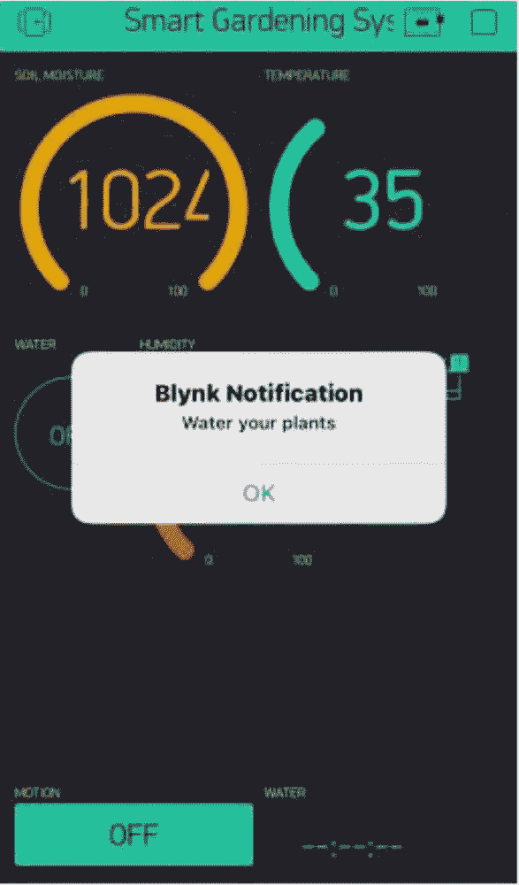

# 第十五章

# 云端基于物联网的智能园艺系统

+   Sudha Senthilkumar

    印度维洛尔工学院计算机科学与工程学院

+   Meghena Danasekar

    印度维洛尔工学院信息技术与工程学院

+   Brindha K.

    印度维洛尔工学院信息技术与工程学院

摘要

园艺是一项愉快的活动。每天 24 小时都不可能监测和照顾花园，所以我们需要一个智能园艺系统，可以按我们的要求监测和照顾花园。在今天忙碌的世界中，我们忘记了养护和浇水植物，而这些植物使我们的家变得清洁和舒适。如果我们能收到关于植物健康和需求的手机通知将会非常有帮助。考虑到这一点，作者们提出了建立一个智能花园的想法，配备了物联网植物监控系统。在数据处理和验证之后，会发送有关植物健康的通知。设计了一个自动化的园艺系统，使我们能够管理园艺，包括监测湿度、温度和湿度。本章介绍了一种基于物联网的智能花园监控系统，该系统能够感知植物的需求，并在土壤失去湿度时为其提供水源。Thing-speak 和 Blynk 应用程序用于查看远程位置的传感器数据。

引言

当今世界正在被自动化所主宰。这是一种利用计算机或手机监控和控制日常生活中简单参数的技术。我们的生活水平将因使用自动化处理简单事务而得到提升。利用物联网的概念，我们制造了彼此通信的传感器，这在自动化方面非常强大。这个原型的重要方面在于它节约成本并确保安全。当人们尝试种植和建立自己的花园时，他们在开始阶段只会对维护感到警惕。随着时间的推移，由于缺乏维护，植物会被破坏。这个原型将帮助人们自动监测参数并确保花园的维护。它发挥着重要作用，并成为植物的良好伴侣。物联网为各种问题提供解决方案，允许事物在网络基础设施中被远程感知或控制。

在人类历史上，最强大和重要的创造物是互联网。未来互联网的一部分是物联网。在商业、社会进程、信息和通信领域，预计事物将通过物联网成为活跃参与者。它们需要被激活以与环境互动，并通过转换和交换环境中感知到的数据和信息进行相互交流。它自动对真实世界事件做出反应，并受到创建服务和触发带或不带人类干预的过程的影响。

公司数量增加以帮助实现其物联网（物联网）理念。因此，我们听到了一些正在用 M2M（机器对机器）通信解决业务挑战的新理念和解决方案。如今，我们希望突出显示另一个行业中最引人注目的物联网应用之一——农业。农业物联网正成为物联网中增长最快的领域之一（字面意思）。今天，农民必须更有效地利用和保护资源。这就是数据需求的来源，而 M2M 通信已经使持续收集信息变得容易。（Tzounis 等人，2017）（Khan 等人，2017）

现有水资源分配面临着增加的压力，并且增加了对灌溉农业可持续性的水管理的重要性。目标思路是：优化向作物供水，减少人工干预，使灌溉系统智能化、自主化和高效化。根据老年人的心理健康问题，园艺和物联网技术，他们提出了针对老年人的物联网种植方案，该方案由安卓应用程序控制，可帮助老年人的心理健康和记忆问题。我们使用该应用程序通过使用种植树木活动作为中介来减少老年人与技术之间的隔阂，并避免由种植树木活动导致的事故。智能露台花园在论文问题中是系统价格太昂贵且不与应用程序或两者兼容。解决此问题的方法是它将有助于节省时间、金钱，并通过减少水损失来帮助环境。所提出的系统由三个主要组件组成：监测节点、中央节点和云端。

这是一个基于物联网的系统，用于检测植物的土壤、温度、水分和冷却水平，使用传感器，所有这些描述都将得到通知，并且所有这些信息都应通过物联网保存在云端。

文献综述

作者 Byoungwook Min 等人（Min & Park，2017）探索了一个智能室内园艺系统的潜力，该系统将园艺活动与物联网技术联系起来。强调园艺的好处以提高生活质量。然而，由于缺乏园艺文化和公寓住房系统等原因，韩国个人园艺的局限性受到了限制。因此，室内园艺作为一种替代方案受到关注，但仍然是一个挑战。先前的研究和实践表明，物联网技术可以应用于许多场合，并且可以可行地为这些园艺问题提供解决方案。本文提出了一种可能的智能室内园艺系统来应对这些问题。

Thamaraimanalan 等人（Thamaraimanalan 等人，2018）提出了一个系统，其中包括一个中央微控制器，其他对象连接到该控制器上。智能花园包括 NodeMCU 作为中心，连接到该中心的不同类型的传感器，如湿度传感器、温度传感器和超声波传感器。超声波传感器连接到一个水箱，指示水箱中的水位。其他传感器连接到它们各自的位置，并将数据发送到具有内置 Wi-Fi 技术的 NodeMCU。Firebase 是互联网上的一个数据库，其中传感器的实时值每秒更新一次。Android 应用程序使用 Android Studio 软件开发。在软件内，将建立应用程序与 Firebase 之间的连接。因此，用户可以从任何地方监视参数。花园的浇水量因土壤类型而异。因此，传感器的值在软件内预先确定为自动化目的。每当用户发现需要浇水时，应用程序中的开关将自动化该过程。这有助于对花园进行全面维护。

植物试验箱（Ait Abdelouahid 等，2020），又称生长室，是研究装置，可精确控制环境参数，如温度、湿度、灌溉、电导率、照明和 CO2。这种装置一方面允许我们测量环境变化的影响，另一方面可以优化植物的自然生长。随着材料的普及、云计算和物联网（IoT）提供的新可能性，开发低成本的个人植物试验箱成为可能。在本文中，我们提议使用连接的设备来开发个人生长室，旨在在城市环境中生产新鲜蔬菜。

Mitul 等人（Sheth ＆ Rupani，2019 年）提出了由无线传感器网络（WSN）实现的全球感知技术，横跨当前生活的许多领域。这提供了计算和理解环境指标的可能性。在今天的数字世界中，人们期望自动化使任务变得简单、舒适、快速和高效。该想法是将我们的传统系统升级为用于在家庭园艺、农田等地供水的智能自动系统。在该系统中，我们使用土壤湿度检测器、温度检测器和湿度检测器，这些检测器安装在植物的根部空间。系统识别的数值被传输到基站。目标是获取数据并将这些值与互联网同步使用 Wifi。当水位低于设定点时，它会通知用户。本文表明，利用 NodeMCU 我们可以使用无线技术监测电路图，并使用 Blynk App 显示结果。当检测到低湿度和高温时，NodeMCU 与 Blynk App 之间传递消息，它会自动启动家庭园艺、农场等地的电机。

Sachin 等人（Samonte 等人，2019 年）利用无线传感器网络（WSNs）的云技术正在为 VANET 场景中的人们带来许多新的应用和机会。本文介绍了一种智能家庭园艺系统；该系统能够收集与园艺系统中使用的各种参数相关的实时数据。本文使用的技术将在经济影响方面帮助社会。家庭园艺被认为是引导社会对环境意识的一种重要新趋势。利用智能传感器进行有效的无线通信为实时家庭园艺管理系统提供了成本效益的解决方案。精确的家庭园艺管理系统可以优化资源利用、智能传感器部署，并提高社会对无污染环境的意识。本文介绍了新型创新技术的设计、实施和验证过程，这些技术可以收集与家庭园艺相关的数据，如湿度、温度、肥料组成等，将收集到的数据推送到 VANET 云进行分析，并生成警报并通知用户采取适当的行动。在本文中，我们提出了基于云的 IoT 技术在 VANET 实现中用于智能家庭园艺管理系统，该系统主要关注于在城市中开发无污染智能家庭的现实挑战。我们展示了所提出系统的实施并讨论了结果。（Sharma 等人，2020 年）

Burton 等人（Burton 等人，2018 年）探索了在场地环境中使用 WI-FI 电位计监测氮的使用。我们报告了一种一次性的物联网园艺土壤片，能够在渗漏和灌溉事件期间实时测量土壤硝酸盐浓度。硝酸盐掺杂聚吡咯离子选择性电极（N 掺杂 PPy ISE）传感器阵列片具有容错电路设计，多路复用到氧化和还原电位计，可以快速检测土壤浸出液中的硝酸盐水平。测量数据通过 Waspmote ZB Pro SMA 5dBi 无线电，6600mAh 可充电电池，7.4 伏太阳能电池板和 Meshlium ZigBee PRO 接入点传输到云服务器和移动设备。本文调查了园艺物联网片作为一种在场地硝酸盐映射的可行工具，并有可能帮助普通家庭和商业园艺者减少过量施肥。

Omary 等人（Al-Omary 等人，2018 年）提出了一种基于云的物联网（IoT）智能花园监测和灌溉机，使用了 Arduino Uno。通过跟踪土壤湿度可以调整植物的浇水需求。测量植物的土壤湿度可以提供植物是否被理想地浇水，过度浇水或不足浇水的统计数据。所提出的设备监视和保持花园的两个量，即草坪土壤湿度和光强度。这是通过使用土壤湿度传感器和光强度传感器实现的。监视的数据不断发送到 ThinkSpeak IoT 云。在云中，从设备收集的数据进行分析，当达到土壤湿度的目标阈值时，从云到花园自动浇水系统发送一个动作来灌溉花园。Arduino Uno 微控制器用于实现设备控制单元。物联网用于使花园所有者随时了解洒水器的状态。传感器的信息经常更新在 ThinSpeack IoT 云上，用户可以随时检查水洒喷头的状态。此外，传感器读数被传输到 ThingSpeak 频道以生成用于分析的图表。

Homera 等人（Durani 等人，2018 年）提出了一种方法，其中包含 Node esp8266 的功能性与上述两个家庭应用相关联，如风扇，灯，水泵，园艺，通过编码和托管在网页服务器上。所有功能都由 Android 应用程序中创建的移动应用程序处理，通过该应用程序可以控制家庭应用程序。本文阐明了通过 Wi-Fi 监控电路设备使用 Node MCU 并使用 App Blynk 进行控制。根据需要，可以连接多个设备，如传感器，家电等，最多可连接八个。

在研究现有系统（Domb，2019）（Jabbar 等人，2018）之后，我们提出了包含几个优点的系统。它通常包括一个中央微控制器，其他对象连接到该微控制器。智能花园由 NodeMCU 作为中心，连接到不同类型的传感器，如湿度传感器、温度传感器和超声波传感器。超声波传感器连接到水箱，指示水箱中的水位。其他传感器连接到它们的相应位置，并发送数据到具有内置 Wi-Fi 技术的 NodeMCU。Firebase 是互联网上的数据库，其中传感器的实时值每秒更新一次。使用 Android Studio 软件开发了 Android 应用程序。在软件内部，将建立应用程序和 Firebase 之间的连接。因此，用户可以从任何地方监视参数 25。园艺浇水取决于土壤的类型。因此，传感器的值在软件内预先确定，以实现自动化目的。每当用户发现需要浇水时，应用程序中的开关将自动执行该过程。这有助于完全维护花园。

优势

+   • 该系统可以在世界任何地方操作，借助 acts 作为虚拟开关的 blynk 应用程序。（Darby, 2018）（Singh 等人，2018）

+   • RFID 传感器，提供安全性，帮助我们防范盗贼和未经授权的访问。

+   • 价格低廉。

+   • 从一个地方管理所有设备。便利因素是巨大的。

+   • 为新设备和家电提供灵活性。

+   • 使用 Blynk 应用程序控制功能，该应用程序作为智能园艺系统的虚拟开关。

+   • 增加能源效率。

+   • 提高家电功能。

+   • 智能园艺管理见解。

+   • 减少人力努力：由于该系统自动工作，人们不需要

+   • 为了更多的努力。

+   • 多任务：多个功能同时完成，无需人为干预。

+   • 减少时间：由于这个系统是多任务的，所需时间将会减少。

提议的系统架构

Arduino IDE

+   • **ARDUINO** 集成开发环境（IDE）是一个跨平台应用程序（适用于 Windows、macOS、Linux），使用 Java 编程语言编写。

+   • 它被用于编写和上传程序到 Arduino 兼容板上，但是也可以通过第三方内核支持其他供应商的开发板。（Singh 等人，2018）（Govindraj 等人，2017）

+   • Arduino IDE 还支持使用特殊的代码格式化规则的 C 和 C++ 语言。

+   • Arduino IDE 提供了来自 wiring 项目的软件库，提供了许多基本的输入和输出方法。

+   • 它使我们能够使用直接和突破性的 LUA 编程语言或 Arduino IDE 编程 ESP8266WiFi 模块。

Blynk 应用程序

+   -   Blynk 是一个硬件无关的物联网平台，具有白标移动应用程序、私有云、设备管理、数据分析和机器学习。（Zaidan & Zaidan，2020）（Alaa 等，2017）

+   -   加入最流行的物联网平台，将您的设备连接到云端，设计应用程序来控制它们，分析遥测数据，并扩展性地管理您的产品。

+   -   这是一个新平台，允许您快速构建用于控制和监视硬件项目的界面，从您的 iOS 和 Android 设备。

+   -   下载 Blynk 应用后，您可以创建项目仪表板，并在屏幕上排列按钮、滑块、图形和其他小部件。

| 图 1\. 系统架构 |
| --- |
|  |

图 1 代表了我们提出的系统的整体架构，该架构集成了所有传感器和空白应用。（Chen 等，2017）

NodeMCU

图 2 中显示的 NodeMCU 是一个开源物联网平台。它包括在 Espressif Systems 的 ESP8266 Wi-Fi SoC 上运行的固件，以及基于 ESP-12 模块的硬件。默认情况下，“NodeMCU” 这个术语指的是固件而不是开发套件。该固件使用 Lua 脚本语言。它基于 eLua 项目构建，并基于 ESP8266 的 Espressif 非操作系统 SDK 构建。它使用许多开源项目，例如 lua-cjson 和 spiffs。NodeMCU ESP8266 开发板配备了包含 Tensilica Xtensa 32 位 LX106 RISC 微处理器的 ESP8266 芯片的 ESP-12E 模块。该微处理器支持 RTOS，并以 80MHz 到 160 MHz 可调时钟频率运行。NodeMCU 具有 128 KB RAM 和 4MB 的 Flash 存储器，用于存储数据和程序。其高处理能力与内置 Wi-Fi/蓝牙和深度睡眠操作特性使其非常适合物联网项目。

| 图 2\. NodeMCU |
| --- |
|  |

Arduino Uno

图 3 中显示的 Arduino Uno 是基于 ATmega328P（数据表）的微控制器板。它有 14 个数字输入/输出引脚（其中 6 个可以用作 PWM 输出），6 个模拟输入，一个 16 MHz 的陶瓷谐振器（CSTCE16M0V53-R0），一个 USB 连接，一个电源插座，一个 ICSP 头和一个复位按钮。它包含了支持微控制器所需的一切；只需用 USB 线连接到计算机或用 AC-DC 适配器或电池供电即可开始使用。您可以尽情玩弄您的 Uno，不必担心做错什么，最坏的情况下您可以用几美元替换芯片，重新开始。

| 图 3\. Arduino Uno |
| --- |
|  |

土壤湿度传感器

图 4 中显示的土壤湿度传感器使用电容来测量土壤的含水量（通过测量土壤的介电常数来实现，这是水含量的函数）。只需将这个坚固的传感器插入要测试的土壤中，土壤的体积含水量就以百分比报告。土壤湿度传感器的工作原理非常简单。具有两个裸露导体的叉形探针作为一个可变电阻（就像一个电位器），其电阻根据土壤中的水含量变化。这个电阻与土壤湿度成反比：

+   • 土壤中的水越多，导电性越好，电阻越低。

+   • 土壤中的水越少，导电性越差，电阻越高。

传感器根据电阻产生输出电压，通过测量我们可以确定湿度水平。传感器还包含一个将探针连接到 Arduino 的电子模块。该模块根据探针的电阻产生输出电压，并在模拟输出（AO）引脚上提供。该模块具有用于数字输出（DO）的灵敏度调节的内置电位器。您可以使用电位器设置阈值；因此，当湿度水平超过阈值时，模块将输出 LOW，否则输出 HIGH。当您希望在达到某个阈值时触发操作时，此设置非常有用。

| 图 4\. 土壤湿度传感器 |
| --- |
|  |

自动喷水传感器：（可潜水的微型水泵）

图 5 中显示的微型 DC 3-6V 微型潜水泵迷你水泵适用于喷泉花园迷你水循环系统 DIY 项目。这是一款低成本、小尺寸的潜水泵电机，可以从 3 ~ 6V 电源供电。它可以每小时最多吸水 120 升，电流消耗非常低，为 220mA。只需将管道连接到电机出水口，将其浸入水中并给它通电。确保水位始终高于电机。干转可能会损坏电机，因为会产生热量。

| 图 5\. 自动喷水传感器 |
| --- |
|  |

红外传感器

红外传感器是图 6 中显示的传感器，它用于通过发射或检测红外辐射来感知其周围的某些特征。它还能够测量物体发出的热量并检测运动。该传感器在智能城市监测中起着重要作用。在这个系统中，我们使用红外传感器在检测到任何人时自动开启灯光。当它检测到任何人时，灯光会自动开启。

| 图 6\. 红外传感器 |
| --- |
|  |

RFID 传感器

RFID 代表 Radio Frequency Identification，如图 7 所示，它是一种非接触式技术，广泛应用于许多行业，用于人员跟踪、门禁控制、供应链管理、图书馆中的图书跟踪、收费站系统等任务。在我们的系统中，我们将 RFID 用于收费站系统。我们使用身份证打开门。当任何车辆进入收费门时，显示未经授权访问，门将不会打开。只有经过授权的车辆才能免费进入收费站。

| 图 7\. RFID 传感器 |
| --- |
|  |

IOT 模块 - Blynk 应用程序

图 8 中显示的 BLYNK 是最受欢迎的 IoT 平台，可以将您的设备连接到云端。BLYNK 是一个数字仪表板，您可以通过简单地拖放小部件来构建项目的图形界面。它支持广泛的硬件，包括 Arduino、Nodemcu、树莓派等。Blynk 是为物联网设计的。它可以远程控制硬件，显示传感器数据，存储数据并可视化。

| 图 8\. Blynk 应用程序 |
| --- |
|  |

完整设计：

| 图 9. |
| --- |
|  |

结果

Blynk 应用程序

下图显示了 Blank 应用程序的输出。

| 图 10. |
| --- |
|  |
| 图 11. |
|  |
| 图 12. |
|  |
| 图 13. |
|  |

结论与未来展望

我们成功地使用 NodeMCU 和 Blynk 云平台制作了一个食品质量监测系统。如果温度和湿度的读数超出设定的阈值，该系统会闪烁 LED。可以在仓库和存储容器中放置几个这样的传感器以进行实际应用。该系统将有助于保持食物处于最佳的温度和湿度，并延长植物的保质期。通过将土壤的不同参数连接到云端并成功通过移动应用程序远程控制，已经验证了使用物联网实现智能花园系统的实现可以令人满意地工作。该系统不仅监视传感器数据，如湿度，温度和超声波，而且根据需求激活其他参数，例如，如果水箱中的水位降至最低值，则自动打开电机开关以将水箱的水位提高到最大值。该系统的初始成本和安装成本低廉，因此可以在任何地方实施。随着传感器技术的发展，该系统可以提升到下一个水平，从而帮助用户以经济的方式利用他们的投资。如果可以安装土壤营养传感器，则可以修改系统以精确供应肥料给花园。该系统节省人力资源并高效利用可用的水资源，最终实现更多的利润。系统提供的反馈将改善园艺过程的实施。

我们可以将我们的项目成功实现为现有智能园艺监测技术的廉价替代品。我们还可以创建一个与我们的项目进行接口的应用程序，以提供更沉浸式和更好的体验。

参考文献

Ait Abdelouahid, R., Debauche, O., Mahmoudi, S., Marzak, A., Manneback, P., & Lebeau, F.（2020）。开放的植物室：一种新的家庭园艺物联网设备。学术出版社。

Al-Omary, A., AlSabbagh, H. M., & Al-Rizzo, H.（2018）。基于云的物联网智能花园浇水系统使用 Arduino Uno。学术出版社。

Alaa, M., Zaidan, A. A., Zaidan, B. B., Talal, M., & Kiah, M. L. M.（2017）。基于物联网的智能家居应用综述。网络与计算应用杂志，97，48-65。doi:10.1016/j.jnca.2017.08.017

Burton, L., Dave, N., Fernandez, R. E., Jayachandran, K., & Bhansali, S.（2018）。智能园艺物联网土壤片用于实时营养分析。电化学学会杂志，165（8），B3157-B3162。doi:10.1149/2.0201808jes

Chen, M., Yang, J., Zhu, X., Wang, X., Liu, M., & Song, J.（2017）。智能家居 2.0：由植物物联网和情感检测驱动的创新智能家居系统。移动网络和应用，22（6），1159-1169。doi:10.1007/s11036-017-0866-1

14Darby, S. J. (2018 年)。家庭智能技术：需要更清晰的时间。建筑研究与信息，46(1)，140–147。doi:10.1080/09613218.2017.1301707

12Domb, M. (2019 年)。基于物联网的智能家居系统。在自动化和智能应用的物联网（IoT）中。IntechOpen。doi:10.5772/intechopen.84894

11DuraniH.ShethM.VaghasiaM.KotechS. (2018 年 4 月)。使用 Blynk 应用的智能自动化家庭应用。在 2018 年第二届发明通信和计算技术国际会议（ICICCT）中（第 393-397 页）。IEEE。10.1109/ICICCT.2018.8473224

17GovindrajV.SathiyanarayananM.AbubakarB. (2017 年 8 月)。使用物联网（IoT）和移动应用程序从习惯性家庭到智能家庭。在 2017 年智能国家智能技术国际会议（SmartTechCon）中（第 1059-1063 页）。IEEE。10.1109/SmartTechCon.2017.8358532

13JabbarW. A.AlsibaiM. H.AmranN. S. S.MahayadinS. K. (2018 年 6 月)。基于物联网的智能家居自动化系统的设计与实施。在 2018 年国际网络、计算机和通信研讨会（ISNCC）中（第 1-6 页）。IEEE。10.1109/ISNCC.2018.8531006

8Khan, W. Z., Aalsalem, M. Y., Khan, M. K., & Arshad, Q. (2017 年)。当社交对象合作时：概念、处理单元、攻击和挑战。计算机与电气工程，58，397–411。doi:10.1016/j.compeleceng.2016.11.014

1Min, B., & Park, S. J. (2017 年)。使用物联网技术的智能室内园艺系统。在计算机科学和普适计算的进展中（第 683–687 页）。斯普林格。

5SamonteM. J. C.SignoE. P. E.GayomaliR. J. M.ReyW. P.SerranoE. A. (2019 年 3 月)。PHYTO：一种物联网城市园艺移动应用程序。在 2019 年第 2 届国际信息科学与系统会议论文集（第 135-139 页）。10.1145/3322645.3322659

6Sharma, S., Sharma, A., Goel, T., Deoli, R., & Mohan, S. (2020 年 7 月)。智能家庭园艺管理系统：VANET 中基于云的物联网（IoT）应用。在 2020 年第 11 届计算、通信和网络技术国际会议（ICCCNT）中（第 1-5 页）。IEEE。

4Sheth, M., & Rupani, P. (2019 年 4 月)。使用 BLYNK 应用的物联网智能园艺自动化。在 2019 年第三届电子和信息技术趋势国际会议（ICOEI）中（第 266-270 页）。IEEE。10.1109/ICOEI.2019.8862591

15Singh, H., Pallagani, V., Khandelwal, V., & Venkanna, U. (2018 年 3 月)。使用传感器节点的基于物联网的智能家居自动化系统。在 2018 年第 4 届最新信息技术国际会议（RAIT）中（第 1-5 页）。IEEE。10.1109/RAIT.2018.8389037

2Thamaraimanalan, T., Vivekk, S. P., Satheeshkumar, G., & Saravanan, P. (2018 年)。使用物联网的智能花园监控系统。亚洲应用科学与技术杂志，2(2)，186–192。

7Tzounis, A., Katsoulas, N., Bartzanas, T., & Kittas, C. (2017). 农业物联网，最新进展和未来挑战。《生物系统工程》，164，31–48。doi:10.1016/j.biosystemseng.2017.09.007

18Zaidan, A. A., & Zaidan, B. B. (2020). 一项关于基于物联网的智能家居应用的智能过程的评论：连贯的分类、动机、开放挑战和建议。《人工智能评论》，53(1)，141–165。doi:10.1007/s10462-018-9648-9
