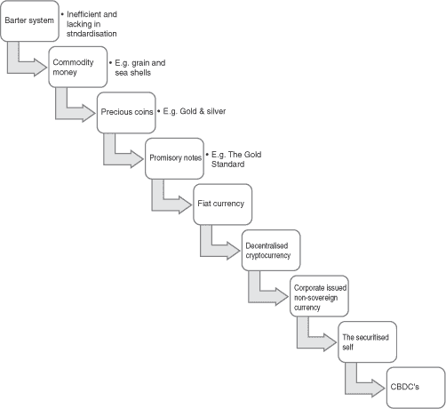

## 5

## 在 Bitworker 世界中的利润和权力

### 引言

本章从组织的角度考虑了 Bitworker 的崛起。我们调查权力动态的发生地，考虑了 Bitworker 的层次结构，并最终检查了利润流向——是流向 Bitworker 还是组织。

### 完成工作，雇佣 Bitworker

Bitworker 是一种科技赋能的个体，承担了自我就业的风险和回报，但代价是失去了工作安全和短期到中期有偿工作的保障。与先前讨论过的平台型企业类似，我们预测这种商业结构的使用量将增加，以连接 Bitworker 的可用性与技能短缺以及潜在的工作和相应支付提供者。这种人力资源的匹配可以通过区块链系统进行，该系统能够连接互相感兴趣的各方，无需中央信任的仲裁者。

这些区块链劳动力交易所可以按地理、专业或其他类似变量组织，工人可以在多个区块链交易所同时发布他们的可用性，但受到每个相应区块链会员资格规则的限制。在第二章中提出的数字合作社（DCOP）的基础上，这样的劳动力交易所可能成为由国家、地区、行业协会甚至私营企业赞助的非营利机构。相反，也有可能想象出追求利润的替代方案，以更大的会员费换取更优越或更独家的机会，这些费用可以归属于股东、会员或二者的混合体。

在没有中央仲裁者的情况下，这种交换可以称为去中心化交易所（DEX），这是一种相对较新的技术，旨在通过一个中央机构来减轻不信任和不端行为的风险。DEX 允许价值的点对点交换。目前，它们几乎完全用于加密货币的交易。一个这样的例子是以太 Delta，其创始人因被指控经营未注册的交易所而与证券交易委员会达成和解。

招聘合适资质良好的和有声誉的比特工作专业人士可能需要进行重要的*了解您的客户*（KYC）审查。这对于需要这种保证的安全关键职业来说变得越来越重要，甚至可能对相关监管机构来说需要全面透明，如果这符合公众和更广泛社会的利益的话。尽管基础的区块链技术只是数据库的一种变体，但它很适合这种需要多个利益相关者实时访问的匹配过程（劳动），记录在不可变的审计跟踪中。[¹]正是这个审计跟踪将为当前和潜在成员（比特工作者）以及潜在的合同雇主提供透明度。基本上，一个系统从不信任中提供了信任。然而，由于缺乏中央仲裁者，将需要一个去中心化的金融（或*DeFin*）解决方案来维护此分类帐或审计跟踪的准确性和健壮性。可能可以使用去中心化的验证节点挖矿池来完成此操作，类似于比特币，这样一来，劳动交换只会暴露给通过量子计算技术进行有针对性的 51%攻击的风险[²]。

对于像英国的 HMRC 和美国的 IRS 这样的税务机构来说，伪匿名系统（如比特币）的存在以及允许用户在现有监管结构之外转移价值的区块链启用社区的存在至少带来了头痛。因此，这种*去中心化劳动交易所*（DLEXs）可能需要来自国家和国际监管机构等仲裁者的授权。根据这种推理，这样的*DEX*权限可能会受到匿名性或伪匿名性的限制，以减轻因此获得和执行的工作所带来的逃税风险的影响。从 2019 年 8 月起，IRS 和 HMRC 正联系那些涉嫌未申报加密货币交易历史收益的个人。许多人认为，考虑到技术的伪匿名性质，这样的议程是不可能的。然而，加密货币交易所持有的 KYC 信息的强制披露正在促使税务机关采取行动。这其中许多可能是公关策略而不是对从未纳税的阴影经济获利的有意义的尝试，但无论如何，在评估劳动 DEX 的未来可行性时都必须考虑到这一点。

与所有交易一样，必须在合同规模和持续时间等方面进行一些预先定义的标准化。目前，像纽约商品交易所和商品交易所 COMEX 这样的贵金属交易所就是这种情况。对于我们假设的劳动交换，一个通用的工作单位需要预先定义。这可能是之前讨论过的*比特任务*，可计费时间单位（例如一小时/一天/一周），或者是预先定义的项目，项目本身可能是定制的。标准化的性质很大程度上取决于工人的技能水平和潜在合同雇佣公司的需求。此外，区块链基础设施所提供的透明度和信任度将使潜在的合同雇佣公司完全了解个体工人的当前工作负载以及历史工作负载。这可能还包括工人的评价和认可，与 LinkedIn 等系统并无太大不同，从而成为不可变的简历，以更好地帮助评估和招聘。事实上，工人或工作提供者的未来工作或合同承诺也可能在适当的情况下提供。

与数字专业人士（如作者、营销人员或计算机程序员）相比，身体或接触导向的专业（如建筑工、教师或护理工作）显然更容易适应上述情况。这并不意味着后者的职业不能通过 DLEX 进行有效分配，而是它们的时间单位可能会被分解成更大的块，例如，与数字工作者的比特任务形成对比的六个月短期合同。这些后者的数字职业也更适合全球受众，这意味着泰国公民可以从爱沙尼亚、墨西哥和印度的组织同时获取工作。此外，这些个人现在在自己的物理位置和税收居住地方面也更加灵活，类似于最近备受关注的*数字游牧民*趋势。

数字游牧者是指那些地点独立、通常在面向技术的行业工作的人。《美国独立状况》（2018 年）由管理收购（MBO）合伙人确定，大约有 1700 万美国工人有成为数字游牧者的愿望，而已经这么做的美国人数约为 480 万。专家预测，到 2035 年，全球数字游牧者的人数将超过 10 亿。随着数字游牧者数量在美国和其他地方预计会增加，像 WeWork 这样的机构已经建立起来，并且看起来很有能力利用这一趋势。WeWork 是为这些数字游牧者提供基础设施支持的社区，包括共享办公空间和私人住宿，从而使一个人的业务单元或*个人战略业务单元*得以实现。政府对这种趋势的反应并不迟缓，爱沙尼亚现在提供世界上第一个数字游牧者签证，根据 e-Estonia 政府机构的说法，每年可以吸引大约 1400 名工作者。根据[marketinspector.co.uk](http://marketinspector.co.uk)（2019 年）的说法，目前最常见的数字游牧者职业包括：

+   软件开发人员

+   翻译员

+   平面设计师

+   内容编辑/写手

+   虚拟个人助理

+   搜索引擎优化（SEO）专家

+   代发货商

+   辅导/咨询

*随处办公*的趋势看起来正在获得进展，将进一步得到我们三位一体技术的支持。然而，显然，并非所有的职业和人群都适合这种工作灵活性。正是在招聘时，可以更容易地使用人工智能（AI）技术来评估这种适用性。目前，一些领先的美国招聘公司使用 AI 来消化候选人面试视频的约 25000 个属性，然后将其与潜在雇主匹配。眼神接触和语调等变量都被用作标记，以识别可能的特质和品质，或者缺乏。必须强调的是，这种技术虽然是前沿的，但已经存在，而不是一种设想中的未来可能性。此外，在英国，像 Red Wigwam 这样的组织，虽然在评估临时候选人工作人员方面更注重人本主义，但也使用 AI 将工人与雇主匹配，合同期间从 15 分钟到 3 个月不等。这是向着任务持续时间越来越短的方向发展，随着我们预测的 Bitworker 和 Bit 任务经济的显现。

### 这不一定是一个反乌托邦，比特工作的利弊

我们假设的后工作经济面临着关于职业选择、工人灵活性、工作机会的可用性以及缺乏稳定可靠收入来源的关键挑战。然而，与大多数技术变革一样，除了这些威胁外，也可能存在改进的机会。这在飞机、互联网和电力等几项技术创新中已经出现过。

中小企业失败的一个常见原因是低质量的收入。也就是说，尽管盈利水平合理，但现金流却较弱或为负。这种思维现在全球范围内的个体经营者和独立承包商都清楚地理解，从而产生了关键词汇，如“现金为王”和“直到客户付款才算销售”。当前经济中存在许多解决这些风险的方案。例如，应收账款贴现和保理，涉及以低于总销售额的金额出售公司的债务或销售账户，以换取即时现金。这可能是一种昂贵的融资来源，用于满足公司增长时的负工作资本需求，通常根据行业、应收账款（应收账款）的质量以及协议是否有追索权，费用可能在总销售额的 5%至 15%之间。

这引发了一个问题，即我们的三位一体可能如何扰乱这一现象。其中一种潜在解决方案将是应用我们之前讨论过的更先进类型的智能合约。这种智能合约可以被创建，以允许资金在个人之间（他们的钱包之间）、个人与智能合约之间，或最后，也许在两个智能合约之间的转移。在转让人和受让人之间可能投入的资金通常是以太坊区块链上的欧洲研究理事会（ERC）20 代币，这是托管此类智能合约的行业标准。这些合约可以在销售或交易开始时在两个交易对手之间持有加密货币资金，然后在满足某些条件的情况下自动转移。

或许最简单的情况是与销售或购买条件相一致的时间约束，例如，发票日期后的 90 天。然而，也存在替代方案，例如双方批准，甚至由额外的第三方批准。同样，AI 和 Oracle 可以用来验证特定事件是否发生，以便基于外部数据源释放资金。如果可以想象并编码，那么就有可能。优势可能并不立即显而易见，但在一个硬编码的世界里，当资金应该到位时，支付没有延迟，没有因追索坏账而丢失资金，并且企业更有可能成功，前提是其现金预测计算正确。与当前的第三方托管账户相比，这是一个改进，因为现在不再需要第三方托管人，因为这个角色现在由一个公正的智能合约更便宜、更准确地扮演。此外，与之相比，由于成本大幅降低，现在这种方法在较小范围内也可以成为可行的选择。将其扩展到宏观范围，我们预见到一个更多公司成功的世界，从而提高了就业机会，而在以前可能失败的情况下。信任得到提高，不确定性降低，资本成本下降，从而增加了投资的可能性，推动了进一步的增长和就业。

然而，需要注意的是，这并不是对所有人都是好消息。金融服务公司可能会在这种摩擦从我们的企业到企业（B2B）供应链中消除时遇到重大干扰，包括桥梁金融家、托管人和提供循环信贷设施等。此外，在国际贸易和争端解决领域，法律服务可能会受到不利影响。

Bitwork 的好处不仅仅限于与智能合约和 Oracle 辅助锁支持的交易相关的现金流管理。我们还预测在个人金融领域可能会取得进展，特别是在发薪贷款和传统期限贷款行业。发薪贷款在上世纪 90 年代开始引起关注，并在全球范围内成为重要行业，受法律、监管和宗教限制允许的地区。全球最大的市场包括：美国、荷兰、英国、加拿大和澳大利亚。这些贷款的特点是在非常短的时间内提供中等到小额贷款，利率则非常高，有时一年的利率可达数千个百分点。对于社会中的这一群体来说，这些贷款通常昂贵且价值低廉，而且很难在其他地方获得融资选择。因此，立法机构试图保护他们的脆弱性，例如，2014 年英国的监管机构金融行为监管局将此类贷款的利率上限设定为每日 0.8%。相比之下，荷兰将此限制为基准利率的 12%，而澳大利亚选择每月 4%，相当于复利作用下的每年 60%多。

大型支付日贷款提供商，例如英国的 Wonga，以更为结构化和合法的方式为信用评级较低的工人提供了一种从工资支票到工资支票的未来收入的桥梁，其利率优于放高利贷者收取的令人费解的费用^(4)。这个领域可能会出现进一步的混乱，以使比特工人受益，这种混乱采用了像 MAKR 的©DAI 稳定币或通过他们的 DAO 管理的代币所提供的微观证券化^(5)，^(6)。单个 DAI 硬币由以太坊支持，并与一美元挂钩，自 2017 年成立以来，一直相对稳定，这正是其意图。挂钩是在 Maker Dao 平台上以分散的方式进行的，在那里用户可以将他们的以太坊存入定制的抵押债务头寸（CDPs）中，以换取价值低于抵押品以太坊的 DAI 硬币，减去一个减价。类似于典当安排，用户仍然拥有底层以太坊的权利，并且在 CDP 的生命周期内的任何时候，可以通过退还最初发行的 DAI 硬币来赎回以太坊。这允许以太坊的波动性以 DAI 硬币的稳定性交换，而无需放弃底层以太坊价格波动的上升潜力。相比之下，如果底层以太坊的价格跌破上述减价的缓冲区，那么 CDP 将自动清算，以维护一个 DAI 对一美元的挂钩的完整性。这是一种创新的分散式金融工程，大大降低了证券化行业的规模要求，这个行业通常需要数亿美元的基础资产价值来保证设立和维护的费用。这个行业通常专注于大型非流动资产，例如无抵押贷款池、房地产（房地产投资信托基金）和抵押贷款业务。MAKR ©已经概述了开放这种结构到其他类型的资产，包括比特币和黄金的愿望。组织提供超过市场利率的薪酬来购买个人未来的时间，实质上是一种短期/中期的就业合同。

但是，我们不会局限于此。Bitworkers 可能会有可能将他们未来的时间格式化为 CDP 内的智能合约来证券化。同样，这将使 Bitworkers 有可能将他们未来的自我货币化，并在今天以 DAI（稳定币加密货币）的形式提取出来，从而有效地作为支付日，甚至期限贷款。由于这种结构的去中心化性质，可以以更合理的利率为 Bitworker 带来可能的好处。然而，将会面临挑战，包括对未来时间证券化资产支持的无形性质的应变，以及如何定价和获得对竞争 Bitworkers 的不同收入率的舒适度。

### 一个组织需要如何调整？

组织面临的挑战以及它们招聘、培训、薪酬和管理方式将在其内部部门中显著且普遍地产生影响。人力资源（HR）部门可能需要大幅提升他们的技术能力，以便他们反映外部观察到的第四次工业革命所带来的变化。

正如之前讨论的那样，向独立承包商而不是雇佣工人的趋势开始在未来的组织中占据主导地位，他们需要更有效地从这个更加灵活的 Bitworkers 池中定位和获取他们的技能需求，这些 Bitworkers 现在通过 DLEXs 可能可以使用。需要做出决策的内容包括所需的 Bit 任务数量，期望的评级，任何物理位置要求以及管理工作产出的过程，包括质量和完成情况。在这里使用区块链基础设施可能是合适的，考虑到需要来自多个利益相关者的不可变性和实时访问的舒适度。一种可验证的 LinkedIn，可以获取你当前和未来的工作，但无需 LinkedIn 作为集中式和值得信赖的仲裁者。未来的人力资源部门可能需要更多的技术意识来应对这些新的挑战，但也可能进一步使用 AI 启用的 Oracle 来自动获取工人，以期超越竞争对手。也许有一天我们甚至可能看到战略转变，超市如 Tesco 参与 *土地银行* 的同时也采取 *时间银行* 策略，购买大量特定技能和职业的时间，类似于法律和会计专业人士使用的侵略性保留者类型结构。^(7)

报酬和福利可能也会发生重大变化。由于使用加密货币进行交易几乎没有成本，我们可能会看到支付频率从每周或每月显著增加到几乎实时的同时生产、消费和支付商品和服务。这是可能的，因为使用加密货币在去中心化的区块链平台上进行微交易。请参阅下一章，了解这种情况对*物联网*经济的宏观影响的全面讨论。此外，被雇用或获得终身职位可能会成为例外，而不是规则，前者几乎成为一种荣誉徽章，表示您作为与短期合同雇员相比的优质工作者。根据美国教育统计局的数据，大约三分之二的大学教师拥有终身职位。如果不受工会、立法和在第二章中讨论的理论化的 DCOPs 的抵制，我们的三位一体技术将会减少这样的数字。

从雇佣到合同工的技术转变将降低组织的运营杠杆，也就是说固定成本与变动成本的比例。通过这种方式，这种减少降低了未来收益的波动性，因此也降低了债权人和股东的风险，分别以利息和股息的形式获得收益。再次减少风险将降低融资成本，并使组织能够产生更高的回报，并更能够吸引外部融资以资助增长。尽管最初具有吸引力，但这种变化的实质是，风险正在从公司转移到不再拥有更长期收入和工作机会的工人身上。相反，如果再次不受控制，这将使他们的技能和赚钱能力受到自由市场的摆布，这将受到一些拥有稀缺技能和更灵活生活方式和承诺的人的欢迎，但会给普通的有 2.4 个孩子的工薪家庭带来不确定性、怀疑和压力。在其中，雇主更容易从预测的变化中受益的行业将是那些人员成本占比较大的行业——例如：银行业、教育业和咨询业。

尽管上述对未来工作者的不利影响，但工作者获得了工作和实际居所选择的权力。因此，未来的组织必须调整其人才供给以适应这一情况。也许最具挑战性的是如何管理这些未来的工作者并使其利益与组织的利益保持一致。长期以来人们一直了解到一个代理问题存在，被称为*代理理论*，即董事和股东之间的利益不一致。更令人担忧的是，至少在总体上，股东与日益分散的比特工人劳动力之间可能存在更大的不一致。这些工作者可能同时在多个雇主之间工作，这引起了雇主对商业敏感性和竞争力的担忧，以及不同雇主是否正在优先考虑比特工人的工作组合，而损害了您的利益的风险。此外，这些比特工作者将从事微任务或比特任务，按定义来看，这些任务的持续时间将很短。然后，这些工作者将花时间寻找未来的工作机会，而不是等到目前的工作结束，这可能对他们的工作努力产生不利影响，而您是在为此付费的。这些比特工作者可能在时间上更敏感，因为他们会优先考虑增加未来被雇用的可能性或确保在短期内获得收益和良好的反馈，而不是将来的其他比特工人。无论如何，这种次优决策，虽然对比特工作者来说是合理的，但对股东的利益是有害的。由此导致董事们做出错误决策的著名例子包括伯尼·马多夫的庞氏骗局以及安然的监管和会计违规行为，分别导致监禁和最终的企业崩溃。然而，这些代理问题出现的频率较低，因为董事会董事的行动受到分析师和更广泛的市场的严格监管，特别是对于较大的上市组织。然而，我们注意到了对不当行为的相对无关紧要的罚款的趋势，其中一个组织接受了最初的罚款，而不是面对进一步的调查。实际上，他们有能力回避审查。这一情况被特别是数据和隐私丑闻的“新颖性”所加剧。法律在这里仍在不断发展，而犯罪的法律定义滞后于社会的定义。值得注意的是，消费者和社会行动如何对调节和限制负面组织行为产生更大的影响，而不是法律或监管压力。比特工人层面的代理问题的独特挑战，被称为*运营代理理论*（OAT），是对于单个工作者来说，它的规模要小得多，因此更难以识别，更不用说管理和纠正了。然而，这种基于代理的失误的总体效应可能会超过董事会层面的传统代理理论，从而对企业绩效产生持续的拖累作用。这种假设的 OAT 拖累可能作为对劳动力分散化的自然制动器，因此激励组织保持比他们可能选择的更多的永久雇员。

未来组织管理比特工作者的另一种方式是利用衍生品。^(8) 通过 DLEXs 获取的技能的未来可用性和价格将成为许多组织的重要风险因素。新风险出现时，金融工程和二级市场很快就会出现，从而促进了风险在不愿承担的一方和愿意承担的一方之间的重新打包和出售，作为回报，会有一笔费用。因此，按职业计算的工作者时间衍生品的产生是完全可能的。例如，在 2020 年第一季度，在英国西北部以每小时 £300.00 的费率购买 10,000 小时律师时间的期货合约对于曼彻斯特的大型律师事务所，如 DLA Piper 或 Eversheds Sutherland（国际公司）来说是可能的，且具有明确的商业价值。^(9) 相比之下，在下一财政年度西澳大利亚矿业的 4,000 小时以每小时 AUD$ 100.00 的费率购买看涨期权将引起 BHP Billiton 或 Rio Tinto 等公司的兴趣。^(10) 不可避免地，投机者会跟随，他们会根据不断变化的地方、地区和宏观经济需求而按专业和地区交易劳动力，尽管在我们看到像高盛这样的领先投资银行的交易楼层上设立劳动力交易台可能还需要一些时间。更可能出现的是排除或封锁规定的出现，这些规定将使雇主感到安心，同时补偿那些允许他们支配自己时间的工作者。对双方都有潜在好处，但这项规定很可能只会被拥有更高技能的专业人士和那些以前的雇主反馈和评级特别高的行业所支付。这可能会进一步加剧我们全球社会中的不满地区的压力，他们认为，以及可以说已经，被抛在了后面，没有分享全球化带来的好处。

### 比特工作世界中的利润和权力

未来工作世界中，软实力和硬实力的体系将会瓦解并重新分配，这得益于我们的三权分立。正如之前讨论的，这不太可能是以统一的方式进行，而是会根据行业、监管、技能水平以及现有和未来劳动力的可用性而变化。然而，清晰的是，我们设想了一个后零工经济，在这个经济中，风险从企业转移到个体工作者身上。我们看到工会力量重新崛起，利用分布式合作组织作为个体工作者进一步孤立为经济单位的现象，以便有效地分配资源，但具有讽刺意味的是，他们能够利用这些分散式金融工具来汇集自己的利益，从而共享在孤立工作中的风险和收益。通常情况下，如果由有影响力的个人创立，能够从跨国公司获得大型合同，然后将其提供给劳动力交易所的成立，类似于现代招聘公司，那么层次化的盈利型劳动力交易所可能会成为第二阶段的产物。

尽管如此，一些全球最大的雇主不太可能完全受制于这些分布式劳动力交易所或者它们盈利的同等替代品。相反，我们可能会看到某些行业的领导者创建自己的交易所，并强制规定他们只会从这些劳动力资源池中获取资源。这可能包括：麦肯锡（咨询）、谷歌（科技）、特斯拉（下一代汽车）等。这种紧张局势可能是一场权力争夺战，存在于个体工作者、雇主和私营企业（中间商）之间的紧张关系。随着像沃尔玛（230 万员工）、国家医疗服务体系（170 万员工）和中国石油化工集团公司（160 万员工）这样的雇主的存在，可以设想，部分或大部分权力和相应的利益将归属于跨国公司是合理的。对于这种超级全球化趋势的另一个制动是国家和全球贸易集团的作用，迄今为止我们尚未充分探讨。

与过去十年对加密货币的不同反应类似，不同国家对于工人和三权分立技术影响的机会和威胁的解读可能也是不均衡的。从瑞士和爱沙尼亚这样倡导这项新技术的国家到印度这样通过示例大规模禁止加密货币交易的国家，范围广泛。总的来说，权力的动态和相应的利润将会分为三个方面：个人的分散解决方案（例如比特币）、国家（例如中央银行数字货币）和公司（例如摩根大通）。从技术上讲，铸造新货币不再是国家的专利，因此预计这种公司发行的非主权货币的持续趋势会继续存在。

货币的铸造是权力所在。控制货币系统的愿望使控制国家或公司能够对其用户施加影响和影响力。只需考虑，全球贸易中约有 10% 由美国进行，但 50% 的全球贸易以美元货币计价。正是对美元作为全球标准的依赖赋予了美国更大的经济和政治权力，因为其国内货币政策受政府和美联储控制，将产生超出国界的不成比例的深远影响。因此，个人有可能将自己代币化，或者说将自己证券化，以便将这种权力从国家夺回来为自己谋利益；*证券化的自我*。

一个全球经济体系的机制，有近 80 亿个人发行了自己的定制货币，本身就引发了许多功能性、税收和立法等问题。尽管如此，这一认知和趋势已经开始于今日，因为越来越多的小国开始探索引入自己的由国家支持的央行数字货币（CBDCs），以与其对美元的现有采用并行运行。一个这样的例子是马绍尔群岛，2018 年通过了《主权货币法》，概述了他们发行基于区块链技术的马绍尔主权数字货币并有固定供应的意图。马绍尔群岛总统助理兼环境部长大卫·保罗（The Honourable David Paul）在 2019 年解释说，“他们（马绍尔群岛）希望以自己的方式连接到全球金融系统”，并且“中心化的货币解决方案在一个仅有 50,000 人分布在 1,000 多个太平洋岛屿的国家是行不通的。这可以与 2019 年 5 月议员布拉德·谢尔曼相比较，他在 2019 年 5 月表示

*我们（美国）的很大一部分国际力量源于美元是国际金融和交易的标准单位[...] 数字货币支持者的宣布目的是将这种力量从我们手中夺走。*

尽管如此，马绍尔群岛仍然是一个国家，尽管相对较小。因此，它有权发行自己的货币，因此可以认为，作为地理规模的一个单位，这项规定不能再进一步。如果你这样认为就错了。全球各地都存在城市和地区级别的货币。例如，在英国，我们有：布里斯托尔镑，湖区镑和利物浦镑。事实上，全球存在许多这样的例子，包括但不限于：阿尔伯塔省的卡尔加里美元，费城的平等美元，墨西哥 Espinal 的 Tumin 货币，希腊 Volos 的 TEMs 货币和纽约的伊萨卡小时货币。货币的这种碎片化带来了标准化和因此对用户的实用性的问题，因为货币是一个谁受益的工具。然而，对于明天的工作者来说，他们的时间是他们自己的，因此在一个未来的世界中，通过 DLEXs 可以测量和在二级市场交易他们的货币价值的世界，有什么可以阻止他们的相应时间单位被代币化呢？

继续这个思想实验，也许在这种向*证券化的自我*的趋势中的渐进阶段将是统一劳动单位的结合。正如之前讨论的那样，劳动的标准化对于交易的务实定价和运营以及相应的衍生品至关重要，这些东西可能有一天会被交易。

这可能是一个逻辑的观点，需要退一步，以*直升机视图*来看，正如管理咨询师所说的那样。到目前为止，我们已经定义了许多不同形式的未来货币，它们大致都被归类为*加密货币*的总称。它们如下所示，并且作为货币演变的持续故事的一部分在下一页上描述(图 2)。

**图 2.   随时间演变的货币。**

图 2 描述了货币随时间的演变，无论是向后还是向前看。未来的货币分为四种方式：（1）像比特币这样的去中心化加密货币；（2）像 Facebook 的 Libra 这样的公司发行的非主权货币；（3）把自己的劳动时间资产化的证券化自我 - 这是一种假设的职业劳动时间的代币化；以及（4）央行发行的数字货币，例如加密英镑。后者再次是一种理论构想，而不是当前的现实。本章旨在评估货币的未来以及货币政策控制的收益归属于谁。上述四种情景并不是互斥的，事实上在 2019 年第四季度很难作出决定。对于比特币和其他无权限的*替代币*，我们看到了潜在的泡沫，然后是随后的下降，但这些货币尚未消失，不愿意摆脱可信的未来。相反，公司发行的非主权货币吸引了最多的媒体和政治关注，部分原因是 Facebook 的 Libra。然而，应该注意的是，摩根大通的机构货币实际上是机构等同于利博拉提供给零售市场的。一个更可接受的提议，可以说是悄悄进行。相比之下，证券化的自我可能是最远离我们当前现实的。这是一种技术可能性，与当前趋势对工人任务的时间单位越来越短的趋势一致。我们称之为*Bit 任务*的概念。最后，央行数字货币代表了对诸如比特币之类的加密货币威胁的机构回应。全球大多数央行正在探索这种货币将如何融入当前国际经济体系的机制。这些作者认为，公司不太可能错过这个机会而不进行斗争。作为全球消费者，我们直接与公司交易，而不是与政府。后者往往是通过税收间接支出。基于这个原因，总体上，也许是公司会赢得今天，从而赢得可能成为全球化下一阶段的战利品。销售商品和服务给消费者以及用于购买它们的货币体系。中央银行要小心了！

### 注意事项

1. 根据普华永道的区块链健康测试（2018 年）。

2. 51%攻击描述了一种情况，即一个人（或一组人）掌握了大量的计算机处理能力。如果这种能力超过了挖矿社区部署的总计算能力的 51%，那么黑客（们）实际上可以对去中心化金融社区的原则进行黑客攻击并从根本上破坏。2019 年 1 月 5 日，加密货币以太经典（ETC）遭受了这样一次黑客攻击，一名个人控制了约 60%的社区处理能力。

3. 企业间交易。

4. 自 2018 年 8 月以来处于管理状态，由 Grant Thornton UK LLP 监督。

5. 稳定币是一种特定类型的加密货币，它由另一种资产支持，以克服相对于法定货币的价格波动性，或者为了促进黄金等资产的移动和定价的实用性。去中心化的例子包括：温克尔沃斯兄弟的双子座美元，以及帕克斯和泰达币，后者受到美国监管机构的重大压力，因为他们的美元支持力度不足。最后，商业例子包括摩根大通的 JPM 币（以美元一比一支持），以及 Facebook 最近宣布的天秤币，后者将由一篮子世界领先的法定货币和短期政府证券支持。

6. 去中心化自治组织。通常包含以加密货币计价的价值的智能合约载体，托管在以太坊等平台上。DAO 通常具有一套预定义的规则或协议，可以通过这些规则或协议部署或投资资金。

7. 土地储备通常被大型零售商用来在理想位置（通常在城镇和城市的郊区）收购土地。这样做是为了确保将来店铺的潜在增长的地点可用，但至关重要的是，也为了阻碍这些土地对竞争对手的可用性，从而限制其增长的潜力。

8. 衍生品是一种与另一个变量的变动（上升和下降）相匹配的合同。因此，它从其他变量中获得其价值。这样的衍生品可用于通过对冲策略来减轻风险，流行的衍生品包括：大宗商品、外汇交易、利率和股票市场指数。

9. 期货合约是一种购买承诺。它是一份具有约束力的合同。

10. 看涨期权是一种合同，它赋予持有人在固定日期以固定价格购买给定数量的基础变量的权利，但并不是义务。请注意，与此相对应的是看跌期权，即卖出权。
