# 第一章

区块链技术简介

技术和金融领域的专家认为区块链技术是革命性的。作为解决方案工程师、售前工程师或客户面向销售专业人员，您的角色可能需要在您的职业生涯中现在或以后销售区块链技术解决方案的知识。重要的是要欣赏区块链如何改变世界，以及您作为增值再销售商（VAR）/供应商/集成商甚至专业服务组织如何参与区块链革命。

区块链不是要销售的产品，比如服务器、数据存储阵列或网络路由器。区块链是一个“开发练习”，基本上是为了销售、服务和开发以区块链为重点的解决方案。区块链当然可以“启用”产品，因此设计、实施和开发应用程序可能会更加复杂。有时可以扩展旧应用程序，这是企业应考虑的一种常见设计和集成方法。基本上，区块链技术很简单，但技术实施是更加复杂的地方。本章的目标是为以销售为驱动力且技术关注的受众解析区块链技术。

本章以简单的方式讨论了区块链技术的技术优点，并直接将其与业务应用相关联。

**在本章中，您将了解以下关于区块链的内容：**

+   什么是区块链以及如何定义区块链

+   区块链的历史以及为何需要了解历史的重要性

+   区块链与其他企业技术平台相比有何不同

+   区块链交易是什么以及它们如何为企业提供价值

+   无信任模型与信任模型相比是什么

+   为什么区块链被认为是革命性的

+   区块链平台的类型  ## 什么是区块链？

区块链被认为是一种颠覆性技术，是所谓的 Web 3.0 时代的开始。Web 3.0 是 Web 的下一个技术前沿，在这个时代，许多设备被互联（称为物联网）并与自动化智能等技术一起使用。区块链技术对执行受托或中介职责的特定行业有重大影响，您将在本章和整本书中看到。

明确地说，人们对区块链的真正含义、它如何创造价值以及它是否是一种加密货币存在相当大的困惑。另一个问题是，区块链有着非常不同的用例；一些区块链仅用于加密货币，而其他一些则不支持加密货币。

要理解区块链和加密货币的来源，重要的是要理解比特币。比特币是区块链技术的真正起点，因为它为社会提供了一个用例。中本聪在他的 2008 年论文“比特币：一个点对点电子现金系统”中创造了区块链的概念。

中本聪的论文对区块链应该如何为大众利益而设定了一些详细的方法。

+   区块链应该是一个基于点对点（P2P）电子现金的信任在线支付网络。该网络是一个强大的节点结构，它在很少的协调下共同工作。

+   区块链应该解决双重支付的挑战，即资金可以被透支，因此会丢失给钱包持有者。

+   区块链应该实施证明工作共识方法，奖励参与创建区块的节点（矿工）。通过激励方法奖励参与者，这鼓励矿工诚实。

+   区块链应该通过一个无需信任的系统简化隐私，消除中间人，并引入匿名公钥的使用。

如果你阅读中本聪的论文，你很可能会得出结论，企业权限的区块链当时不在中本聪的视野内。对企业的这一要求的认识是在比特币成为主流几年后才引入的。

区块链领域的主要挑战之一是如何回答“什么是区块链？”这个问题。如果你问 10 位不同的区块链专家，你会得到 10 个不同的答案。以下只是一些关于区块链是什么的定义：

+   区块链是一个共享的分布式账本或数据结构。

+   区块链是一个分布式信任根源，位于分布式账本上。

+   区块链是一种数字账本，其中以比特币或其他加密货币进行的交易按时间顺序公开记录。

+   区块链是一种用于维护交易数据的永久且防篡改的分布式账本类型。

+   区块链技术是一种使用分布式、去中心化、共享和互惠账本的分布式账本技术，它可以是公共的或私有的，有许可的或无许可的，并由代币化的加密经济或无代币的驱动。

这些定义都集中在账本上——具体来说，是分布式账本。*账本* 本质上是一个业务完成的所有交易的书面或电脑记录。*分布式账本* 是一个数据库，它在跨越多个站点、机构或地理位置的网络中达成共识并同步。

### 对定义的我的看法

我对定义区块链的方法与其他区块链传道者提供的方法有些不同。我认为没有一个正确的定义能够让每个人对区块链技术有一个现实的理解。本书提出了几种不同的区块链定义，这些定义会根据受众的不同而异。

作为一名售前工程师，我的经验告诉我，不同类型的受众对技术运作的兴趣程度不同。例如，人们不会指望律师像 SQL 开发人员那样理解信息技术。开发人员和律师都接受了不同的培训，从而有了不同的思维方式。

我对区块链的定义侧重于以下受众：

+   技术性，包括 IT 人员、开发人员和其他技术利益相关者。

+   商业，通常是 IT 总监、C 级高管成员和金融机构的利益相关者。

+   法律，通常包括与合规审计有关的审计员、公司法律顾问或其他类型的律师。根据您的用例，法律可能还包括政府监管机构。### 技术受众

图 1.1 显示了纳卡莫托 2008 年论文中区块链的第一个定义。这是针对技术受众的定义。中本聪的区块链定义有些复杂，但简单来说，他描述了块的链接。从历史和技术的角度来看，审查中本聪的定义应该能够洞察他创建比特币时的思维过程。

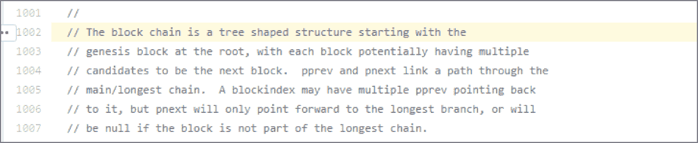

**图 1.1** 纳卡莫托原始的区块链定义

将图 1.1 中的定义与之前列出的其他广泛使用的定义进行比较，您会发现存在显著的差异。我在这里的观点是，如果您对区块链的定义感到困惑，您并不孤单。IT 行业在提供标准定义方面做得很糟糕。### 商业受众

在与客户（或学生）讨论时，我喜欢将区块链与硬拷贝笔记本进行比较。实质上，区块链是一个账本，尽管是一个分布式数据结构和不可变账本。当您在笔记本上写东西时，每个条目将占用一行。将区块链想象成一个笔记本，条目将被写入但不能被擦除。

图 1.2 将区块链账本的属性与笔记本进行了比较。当然，将区块链与笔记本进行比较是一种简化的方法。一张页面与区块链上的一个块进行比较，而页面条目实际上是一个区块链交易。区块链的关键在于实现信任。

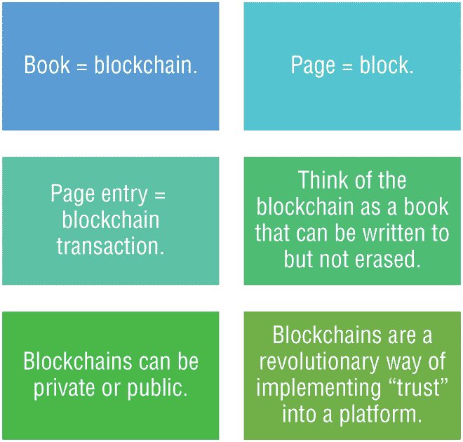

**图 1.2** 比较区块链和笔记本

当将区块链与笔记本进行比较时，可以准确地假设并非所有区块链都是相同的，就像并非所有笔记本都是相同的一样。例如，以太坊在处理交易时与超级账本的顺序和验证有所不同。当考虑笔记本时，你知道一些笔记本有线，一些没有线，也许一些有方格。

区块链技术是建立在对技术的信任以及消除第三方或中介的基础上的。区块链是一个全球共享的数据结构，具有加密安全的事务后端数据库。只要参与网络，每个人都可以读取数据库中的条目。如果你想改变数据库中的某些内容，你必须创建一个所谓的*交易*，这个交易必须被区块链中的所有其他参与者接受。*交易*这个词意味着你想要做出的改变（假设你想同时改变两个值）要么根本不会发生，要么完全被应用。

区块链不是基于任何新的变革性技术构建的，而是基于三种现有技术的独特同步：点对点网络，密码学和程序（在区块链世界中称为*智能合约*）。

另一个需要考虑的因素是成本。即使在考虑到有大量开源项目可用时，实施这些技术的成本几乎为零。从整体上看，区块链并不是复杂的技术，但在将这些系统集成到企业时可能会引入复杂性。

让我们把比特币和区块链进行比较，并了解这些术语如何联系在一起。比特币是一种未受监管的数字货币，使用区块链技术作为其交易分类账。区块链是大多数加密货币的平台，也是比特币的“启用者”；比特币是正在“启用”的应用（加密货币）。可以将它想象成区块链是铁路，比特币是火车。或者，区块链是电话网络，比特币是电话。

在高层次上，比特币交易的工作原理如下。发送者想要向接收者转移资金。交易在网上表示为一个区块。区块被广播给每个网络参与者。网络参与者审查区块，如果批准，则将其添加到区块链中。最后，资金从发送者移动到接收者。### 法律观众

立法者甚至已经进入了定义术语*区块链*的领域。美国国会议员、加利福尼亚州民主党人多丽丝·马茨伊和肯塔基州共和党人布雷特·古斯里共同提出了 H.R. 6913，“2018 年区块链促进法案”，旨在促使利益相关者共同制定*区块链*的通用定义。该法案还推荐了促进新创新的机会。见 `[`www.congress.gov/bill/115th-congress/house-bill/6913`](https://www.congress.gov/bill/115th-congress/house-bill/6913)`。

此外，加利福尼亚州最近定义了什么是区块链和智能合约。见 `[`leginfo.legislature.ca.gov/faces/billTextClient.xhtml?bill_id=201720180AB2658`](http://leginfo.legislature.ca.gov/faces/billTextClient.xhtml?bill_id=201720180AB2658)`。 ### 区块链的三种定义

区块链技术在金融、物流和政府等领域显然具有变革性。下面的定义符合本书中将提到的技术、商业和法律等特定受众：

+   **技术定义** —— 一种全球共享且安全的数据结构，维护着不可变的交易后端数据库。

+   **商业定义** —— 用于对等方之间交换价值的商业网络。价值可以是货币、追踪信息，或任何利益相关方需要在区块链账本上维护的内容。

+   **法律定义** —— 一串不受腐败影响的分类账条目，由多个方在网络上共享，无需中心化中介来呈现和验证交易。

作为面向客户的专业人士，您必须向正确的受众定义正确的区块链术语。并不是每个人都会技术，也不是每个人都只关心业务方面。当您与客户讨论区块链时，尝试理解他们所处的角色，并将定义调整为适合他们的内容。这可能有助于促进对区块链技术的理解。  ## 区块链的历史

正如之前提到的，第一个已知的区块链解决方案是比特币。比特币的主要创新是将加密货币带给世界。*加密货币*使人们能够在没有中心化高成本的情况下转移价值，并改善了与传统银行系统（如 SWIFT）相关的缓慢转移时间和其他挑战。 SWIFT 是一个供其银行机构成员使用的专有全球金融网络。

比特币本质上是一个实验，它开启了一场朝着去中心化支付方法的进程，将银行排除在交易之外。比特币是在 2007 年和 2008 年的金融危机期间设计出来的。去除银行提供了去中心化、更快的转账和更低的风险等好处，因为没有一个控制器在中心进行支付处理。去中心化、P2P 和密码学是比特币在全球范围内成功的核心。此外，其影响肯定会通过降低消费者汇款成本来改善支付和汇款市场。

除了将加密货币带给大众之外，比特币的第二项创新是其运行的平台，即区块链或分布式分类帐。对于企业而言，区块链的颠覆将发生，因为它提供了一个或多个功能，包括合规性、成本效益，甚至透明的交易给客户基础。在一些行业垂直领域，企业的好处可能是多方面的，就像我们在物流行业围绕区块链接受度所见到的那样。我相信区块链是下一个伟大的技术，它将像云计算或离岸外包一样为公司提供更多的金融工程。

云计算是一种完全依赖于云提供商的集中式数据中心管理形式。明显期望这种关系能够围绕数据安全、可用性和支持进行工作。在第七章，“区块链即服务”中，我将更多地讨论云计算以及如何在各种提供商上部署区块链。

云计算对用户具有显著的好处，并且已经拉平了大型财富 100 强公司和小型初创公司之间的竞争格局。较小的公司可以以与大公司相同的成本利用云服务。云还使公司能够减少开销、减少对基础设施的投资，并间接增加了高管的薪酬以及公司的收益。

事实上，一家公司最重要的资产有时不是其员工，而是其数据。因此，如果公司为了省钱而让另一家公司控制其数据访问权限，那么根据我的经验，这些云公司将会涉足区块链，因为可以利用联合体并分担成本。区块链即服务（BaaS）已经引起了很大的关注，并得到了所有主要云提供商的大力支持。许多组织的商业模式都是围绕数据的收集、挖掘和分发的货币化进行的。从历史上看，这确实是关于数据的一切，以最低的成本从数据中创造收入。

这种商业模式也可以通过使用联盟得到加强。*联盟*是组织之间达成的一种协议，以便共同合作。联盟是拥有相同服务用例的人或组织的社群。

一般来说，这些联盟提供了一些好处，如增加合作、标准化、易于整合，甚至提高了财务效率。

目前在一些最成功的区块链实施中使用的联盟方法可以为成员公司提供重要的投资回报率、总体成本和其他财务利益。如果您的客户，例如，有许多额外开销，那么请考虑谈论他们可以相关的区块链使用案例。具有中介方，如转移代理人、海关检查员、律师和会计师的客户都是区块链技术的潜在目标。在第六章中，"企业区块链经济学"，我将涵盖诸如联盟等区块链经济学的许多好处。

现实情况是，已经取得巨大成功的公司正在向区块链技术投资数百万甚至数亿美元。他们这样做并不是出于"善意"，而是作为一种生存手段。这完全取决于不断变化的商业环境，由于经济原因，它正变得越来越集中化。

投资于区块链技术的公司名单是财富 500 强的"重要人物"，基于我的经验，我不会对他们抱有期望。他们从多个角度看到了技术的潜力，如安全性、隐私性、财务性，甚至是法律要求。

从历史上看，影响企业接受区块链技术的一些一致因素包括：

+   自主创新，如智能合约和去中心化应用程序（dapps），已经对企业能够通过可实现的效率所产生的影响做出了贡献。

+   成本效益高的解决方案已经降低了中间成本或开销，比如减少企业的中介数量或所有中介。

+   支付汇款的交易成本，例如银行间转账或结算，对公司的盈利能力产生了很大影响，特别是在金融行业。

+   在供应链中提供透明度使消费者能够了解其购买选择的来源以及从源头到市场的货物传递链。

+   权限区块链可以扩展并提供企业级安全性。

+   或许最重要的创新是智能合约。*智能合约*本质上是执行特定任务的计算机代码，当作为分布式应用程序的一部分进行正确开发时，可以提供重要的效率、合规性和性能。（在本书的过程中，我将从业务和技术角度讨论智能合约。）

了解技术是如何发展的，随着时间和结构的变化，或者它如何为组织提供价值是很重要的。现在我将让您了解区块链是如何从更久远的历史视角开始的。

拜占庭将军问题（BGP）被认为是计算的经典问题。为了解释军事隐喻，BGP 可能发生在一些将军（来自同一军队甚至盟友）已经包围了一个有城墙的城堡或城市的所有侧面的情况下。权力的平衡是这样的，所有将军必须同时发动攻击才能夺取城市。

在计算机科学中，这被称为*分布式节点网络*。了解集中式系统与分散式系统的比较对于理解比特币的出现原因至关重要。例如，当分布式系统失去同步时会发生什么？系统如何处理失去同步状态？

在中心化网络中，有一个中央权威或服务器。网络上的其他参与节点的行为类似于接受消息并执行任务的客户端或实体。

在分散式网络中，可以有多个服务器从一个集中式服务器接收消息。各个节点连接到次级服务器。在另一种形式的分散式网络中，所有服务器在网络中具有“相等”的责任，没有集中式服务器或主/从关系。在许多情况下，分散式网络被认为是分布式网络的一个子集。

在分布式系统中，没有具有集中权威的服务器。网络上的每个节点都连接到每个其他节点，并具有相同的权限和处理能力，这是共享的。这类似于区块链。

图 1.3 比较了中心化系统、分散式系统和分布式系统，突出显示了节点连接。

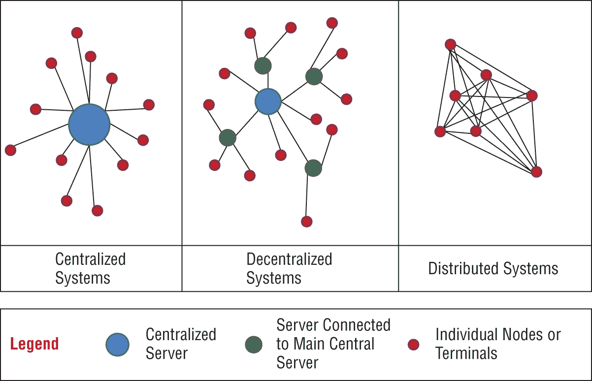

**图 1.3**比较网络化系统

区块链根据定义不是集中式系统，尽管某些区块链具有集中化属性而不是分散化或分布式属性。在中本聪 2008 年详细介绍比特币的论文中，他概述了对分布式节点性质的解决方案。（您可以将节点与我们的拜占庭将军问题中的将军进行比较。）

业界在中本聪在 2009 年推出比特币后才真正开始。然而，企业环境直到 2015 年才真正开始使用许可的区块链。（许可的区块链通常称为*企业区块链*。）因此，就目前而言，区块链技术还不到 10 年的时间，而像 Hyperledger（在第二章中介绍的“企业区块链：Hyperledger、R3 Corda 和 Ethereum、Quorum”）这样的企业区块链还不到 5 年的时间！## 区块链与传统数据库

重要的是要理解分布式区块链分类账与传统数据库的区别。分布式分类账是由区块链中的每个节点独立存储和更新的数据库。每个节点本质上都维护着区块链的副本。例如，在以太坊区块链网络中，在撰写本文时有超过 16,000 个节点。在比特币区块链网络中，在撰写本文时有超过 7,000 个节点。这为什么重要？每个在线节点都有当前工作区块链的副本。如果丢失了一些节点，也没什么大不了的，因为还有成千上万个其他节点维护着副本。在以太坊网络中，当交易被写入分类账时，它也会被写入其他超过 1,600 个节点。一个集中式数据库会维护 1,600 份数据库副本吗？当然不会。

图 1.4 展示了以太坊网络与 Etherstats.io 服务的庞大网络。您可以查看以太坊区块链的许多不同数据点，因为 Etherstats 提供了对以太坊区块链的透明度。

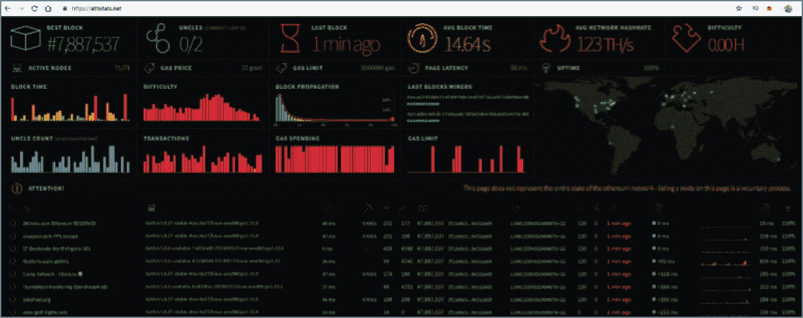

**图 1.4** 以太坊网络 Etherstats.io

企业可能有兴趣使用以太坊虚拟机（EVM）来运行其链下智能合约或为正在构建的分布式应用（称为*dapp*）建立的令牌平台。然后，它会查看图 1.4 中引用的以太坊资源管理器，并审查哈希率或气体数字。

以太坊分类账也非常适合跟踪交易并向您的客户群提供透明度。在第二章中，我将更详细地介绍以太坊，并解释为什么企业对以太坊感兴趣。

区块链和传统数据库之间最大的区别是什么？嗯，区块链的分散和分布式性质是使区块链分类账与传统数据库（如 SQL）相比独特的地方。数据库和分类账通常是集中化的，意味着存在一个中央管理员或中央节点结构，可以创建、删除、修改或更新数据库。一些常见的数据库包括 Microsoft SQL、Oracle PL/SQL 和 IBM DB2。

在传统数据库世界中，对象被用作数据结构，这些对象是 *可变的*，这意味着它们可以被修改或删除。在区块链中，对象在创建后不可修改，因此被认为是 *不可变的*。

### 信任的分布

与传统数据库相比，区块链技术真正提供的主要解决方案是关于信任的分布。在传统数据库中，信任是集中化的；在区块链中，信任分布在区块链的节点之间。

信任的分布意味着不仅仅是一个区块链节点有副本，而是每个区块链节点都维护一个副本。例如，如果企业区块链中有 1,000 个节点，那么在其最真实的形式下，区块链就充当了一个“真实代理”。在真正的区块链上，有 1000 个节点被黑客入侵或控制的可能性是统计上不可能的，因为账本是分布式账本。 ### 共识与信任

区块链账本是分散的、分布式的和不可变的。这对于信任是至关重要的，因为它们无法被修改或删除。

*共识* 是在分布式账本网络上采用的一种方法，其中所有网络节点都维护着账本的副本。账本用于就一项交易是否有效达成一致。

例如，在以太坊中，账本分布在超过 100 个国家的节点之间，用于区块链交易。这个账本在全球范围内分布，并且可以通过任何有互联网连接的地方访问。要访问账本，您需要以太坊用于认证的公钥。

图 1.5 提供了更深入的见解，说明了以太坊交易在高层次上的发生过程。詹米正在被发送$100。这笔金额将从发送者的钱包中以以太形式扣除，并存入接收者的钱包中。

请记住，大多数无许可（企业）区块链中的节点都有整个区块链的副本。这意味着网络上的每个节点都处理每次发生的交易，并且有多个副本。现在有共识（一致意见）认为这笔交易有效。 ### 账本与传统数据库的差异总结

您现在知道区块链有账本，这些账本与传统数据库在以下方面不同：

+   数据库中的传统架构基本上是受控数据的集中存储库。然而，这些数据通常是集中结构化和控制的。区块链是分散的，并在区块链网络的节点之间分布。数据是通过共识来管理的，而不是集中控制的。

+   SQL 或 NoSQL 是常见的传统数据库应用程序。SQL 是最广泛使用的数据库。区块链不使用 SQL 或关系数据库结构。

+   无论是集中式还是分布式，传统数据库都使用客户-服务器网络架构。而区块链是去中心化和分布式数据结构。

+   数据库处理速度以每秒事务数（TPS）为参考，与区块链相比，传统数据库在大多数情况下在 TPS 方面要快得多。

+   传统数据库中的数据库控制仍由指定的权威机构控制，而区块链中没有集中的权威机构。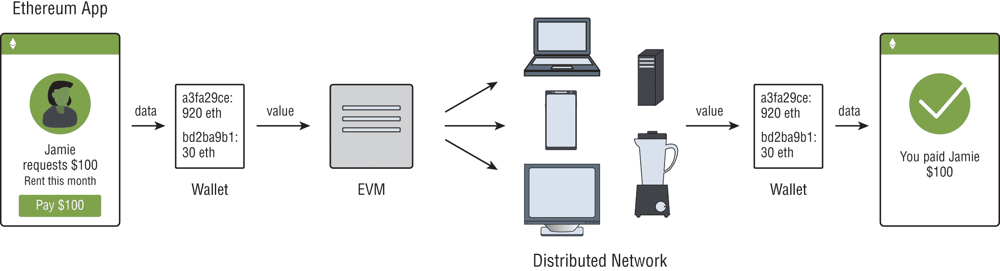

    **图 1.5** 以太坊交易

+   在传统数据库中，数据可以被修改甚至删除，但在区块链中不可能发生，因为区块链是不可变的。

+   数据库符合 CRUD（创建、读取、更新和删除）原则，而区块链符合 CR（创建和只读）原则。### CAP 定理

CAP 定理，也称为 Brewer 定理，由 Eric Brewer 在 1998 年引入，对分布式系统在维护一致性、可用性和分区容忍性方面遇到的问题提供了重要见解，并且基于当时的事实证据。

在 2002 年，CAP 定理由 Seth Gilbert 和 Nancy Lynch 分别证明为定理。CAP 定理规定，任何分布式系统都不能同时具有一致性、可用性和分区容忍性。从另一个角度来看 CAP 定理，它是一种工具，可以使系统设计人员在设计网络化数据存储时意识到可能的属性权衡。

根据 CAP 定理，必须降低某些属性以提供其他两个属性。CAP 定理中的属性如下：

+   *一致性* 意味着分布式系统中的所有网络节点具有相同的视图。

+   *可用性* 意味着系统中的节点可用，也就是在线并接受请求。

+   *分区容忍性* 意味着如果一个节点崩溃，其他节点也没问题。

请注意，已经证明分布式系统不能同时具有一致性、可用性和分区容忍性。基本上，在分布式系统中无法同时拥有它们，并且在设计企业服务时——无论服务是否为区块链——您都需要选择对客户提供的属性更重要的是什么。

CAP 定理将系统分为三类：一致性分区（CP）、一致性和可用性（CA）或可用性和分区容忍性（AP）。

在考虑分布式分类帐时，要意识到延迟会在某种程度上介入，并且需要进行设计。在本地数据中心上分布的分类帐，当然，性能会与在云服务提供商的区域和区域上分布的分类帐不同。延迟可能会决定应用程序和用户对应用程序的体验。

图 1.6 展示了 CAP 理论的结构。注意三个属性之间的重叠。在区块链中，这三个属性永远不会完全对齐。

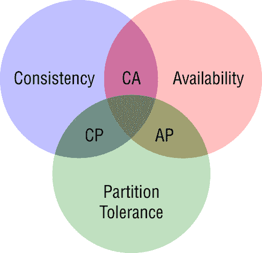

**图 1.6** Cap 理论

例如，了解三种 CAP 理论如何应用于您的区块链网络是很重要的。

+   只有当所有节点具有相同的共享状态时，即它们具有相同的最新数据副本时，才能实现一致性。

+   只有当所有节点都正常运行并响应账本上最新数据的交易请求时，可用性才能实现。

+   只有两个或更多节点能够相互通信，才能在两个或更多节点之间实现分区容忍。任何网络上的通信都受到延迟、抖动和 TCP 协议挑战的影响。

在区块链网络中，一致性是通过保证所有节点具有相同数据副本的共识算法来实现的。这种一致性形式类似于复制，但在 IT 世界中我们会称之为*状态机复制*。区块链是实现状态机复制的一种手段，当然，这可以通过多种方式来实现，基于区块链。

区块链节点在分布式网络中可能遇到两种类型的故障。

+   第一种故障类型称为*停止故障*。当节点仅崩溃时，就会发生这种故障。在这两种故障类型中，停止故障是更容易处理的。Paxos 协议可用于解决这个问题。（Paxos 是一套解决网络中不一致节点的共识挑战的协议套件。）基本上，网络存在诸如延迟之类的挑战，这些挑战会随着网络的分布而大大恶化。

+   第二种故障类型是故障节点以任意方式表现出恶意或不一致行为。这种故障很难处理，因为它可以产生任意结果。

在区块链上，一致性不是与分区容忍和可用性同时实现的，而是随着时间的推移逐渐实现的。由于一致性是随着时间的推移而实现的，而不是立即实现的，所以被称为*最终一致性*。分布式网络速度慢，维护这种一致性需要解决。

挖掘的概念是为了维护区块链网络的一致性而在比特币中引入的。*挖矿*是一种计算密集型的过程，通过使用工作量证明（PoW）共识算法来促进达成共识。

挖矿也可以被定义为一个过程，用于通过共识方法将更多的区块添加到区块链中。PoW 和其他常见的共识方法在第四章“理解企业区块链共识”中有详细介绍。## 公开区块链的常见特性

公开区块链是向公众开放的区块链，并且没有权限，这意味着用户无需授权即可使用平台。

正确的客户可能是一个企业对消费者模型，其中客户可能希望查看特殊订单，例如正在海外采购的定制项，以及通过物流流程移动的项，这将为客户提供“可见性”，或者在区块链中我们称之为“透明度”。

表格 1.1 展示了区块链提供的更常见的特性。正如您所见，区块链提供了一些常见的功能。

**表格 1.1**：常见的区块链特性

| 特性 | 注释 |
| --- | --- |
| 全球计算机网络 | 分布式节点，无中心化节点控制。 |
| 普遍访问 | 只需通过互联网连接即可从任何地方访问资源。 |
| 审查和防篡改账本 | 没有任何实体可以修改或删除数据，这使得区块链是不可变的。不可变性提供了数据合规性，因为它不能被删除或修改。 |
| 开源 | 使用可移植的编程语言，便于开发。 |
| 合规性 | 验证的智能合约。区块链账本也经过审计验证。 |
| 多用户 | 没有加入区块链的限制，并且账户可以扩展。 |
| 信任 | 对代码（智能合约）的信任，这意味着用户对区块链技术产生了信任。 |
| 保证 | 原子性、同步性和溯源性。 |

区块链和传统数据库具有相似的特性，但也具有不相似的特性。例如，区块链和传统数据库都复制数据。但是，从比较的角度来看，复制的启动、实现和处理方式实际上是非常不同的。

区块链和数据库在账本操作上的处理方式可能是最重要的不同之一。区块链只会将操作插入到账本中，这意味着交易是单向的。在数据库中，交易可以是任何插入或删除操作，意味着创建、更新或删除。

图 1.7 比较了区块链和传统数据库的特性：操作、复制、共识和不变性。将数据库与区块链进行比较，属性的差异是显著的。

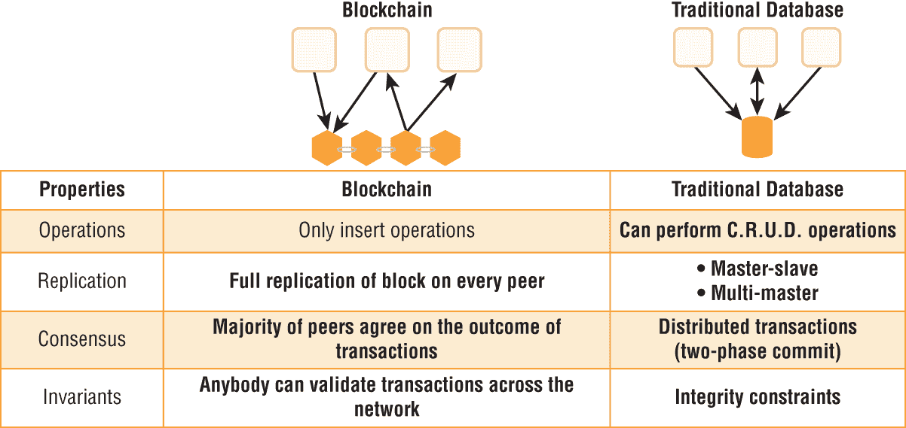

**图 1.7** 区块链与传统数据库比较

需要注意的是，区块链在其真实实现中仅允许两个特定功能。

+   交易的验证

+   新交易的写入

注意，修改数据和删除数据不是区块链支持的功能。区块链追加到区块链，这是唯一应该支持的功能。区块链是有状态的程序，因此有某种机制来跟踪和更新状态。它们保留过去，因此记得可能影响当前交易的先前交易。区块链交易中使用的术语是*追加*。（我将在整本书中详细介绍这一点。）## 为什么区块链被认为是革命性的

在过去的大约 100 年中，改变生活的技术的进步是惊人的。可以说，像人工智能、机器学习和区块链这样的新技术的潜力都会显著影响我们的生活。技术往往是革命性的，区块链技术看起来将是其中之一。

区块链技术在多个方面具有革命性，列举如下：

+   区块链技术是一种现在实施战略意义的技术同步。

+   信任是区块链技术的核心，通过共识的使用将中间人从网络中移除，从而创造出公司真正可以从中受益的新效率，例如提供透明度、信任根源、劳动力成本的降低以及其他许多好处。

+   从 Nakamoto 指定的意义上来说，区块链技术是一种“防篡改的价值公开账簿”。比特币平台使世界各地的公民可以在无需中间人的情况下进行交易。

区块链技术对现状产生了颠覆性影响，因为传统应用程序和业务流程正在被区块链应用替代。

区块链是一个对企业具有众多用例的平台。投资于区块链测试、实施和生产规格的组织数量和质量令人印象深刻。## 区块链原则

显然，隐含在区块链技术中的原则已经促使软件、企业、组织甚至政府的重新设计。区块链原则已经在数字经济时代和本质上公平的社会系统中恢复了用户的信任。

+   信任是通过技术的实施来提供的。用于建立信任的区块链中使用的技术是通过加密和代码来验证交易要求的，并且会确定交易是否被安全地接受或拒绝。

+   完整性通过区块链网络提供，其中没有集中式权威或故障点，每笔交易都记录下来。

+   激励措施分配给所有参与者，这些参与者被称为*矿工*，用于生产区块。

+   区块链是去中心化的，这意味着数据分布在成千上万个节点之间，没有集中的控制点。

+   隐私意味着用户控制数据的处理方式。例如，无需进行“了解您的客户”（KYC）等合规性要求。

+   等同接入/包容性实际上是指世界上每个人都应该有能力参与区块链网络。

### 信任或无需信任

区块链实际上并未消除信任；相反，它们最大程度地减少了网络上任何单个参与者所需的信任量。它们通过通过经济游戏将信任分散到系统中的不同参与者之间来实现这一点，从而激励参与者在由协议定义的规则内合作。经济激励是为参与无需许可的区块链（如以太坊或比特币）而设立的；矿工生产区块并因挖矿获得奖励。

区块链定义了一种安全的通信协议，允许两个个体在互联网上以“点对点”的方式进行交易。这意味着没有中介进行交易。

当你在区块链上从一个帐户（钱包）向另一个帐户（钱包）转移价值时，你是在信任基础区块链网络使该转移生效，并确保发送者的真实性以及加密货币的有效性。*真实性*意味着发送者在电子上通过公钥加密通常通过证书和密钥来实现。*有效性*意味着发送者拥有正确的钱包，并且在该钱包中有足够的资金来实际发送正确金额的资金。

例如，在集中式方法中，你可能需要使用西联从美国向秘鲁发送资金。在某些情况下，执行此转账可能需要较长的时间和较高的成本；可能需要几个小时、几天或更长时间。此外，转账费用可能是使用区块链网络上的加密货币的 10 倍或更多。

基本上，你是在“信任”中介机构来验证交易，发送交易，并确认交易已完成。你可能使用此服务，因为你期望转账是有效和真实的，因为中介机构正在执行受托责任。人们显然信任银行、非银行机构如 PayPal，以及西联等其他实体向要求资金的人发送资金。然而，这种信任可能会带来成本，无论是金融成本还是其他成本。

*无需信任*通常用于描述“信任分配”，其中信任不是放置在集中的集中点，而是分散到区块链中所有参与者的去中心化方式。

使用区块链共识方法，这种方法允许参与者共享存储在分布式账本上的数字化分布式“真相”，而这并非集中化。这个真相可以是一系列交易、凭证 ID、客户地址，或者可以写入区块链的任何资产或信息。

#### 信任区块链

信任是所有区块链的核心，无论是许可的还是无许可的，尽管它们以不同的方式处理信任。

区块链是一个真相机器，因为采用了所使用的技术的实现，而且账本的这种实现维护了真相，因为账本是信任的不可变记录。

在其最基本的形式中，区块链是一种不可变的交易记录。这些交易可以是任何类型，例如货币、产品，甚至服务的流动。区块链被设计为以一种使其他用户几乎不可能检测到添加、删除或更改数据的方式来存储信息。

在考虑区块链技术时，了解如何建立信任是至关重要的。以下列表突出了一些重要的考虑因素：

+   区块链技术是关于存储某种类型的数据，例如在比特币区块链的情况下是交易，或在以太坊中是代币。这个平台被信任执行这些交易，是因为所使用的代码和加密。信任在以太坊平台上的区块链节点之间分布。

+   区块链技术本质上是将信任从中间人转移到技术（软件代码）上。

+   将数据存储在区块链中通过密码学函数进行，例如证书和密钥。

+   使用私钥/公钥通过公钥基础设施（PKI）保护写入账本的交易数据。

在考虑用户为何信任区块链的原因时，有两个主要考虑因素。

+   假定区块链上的所有交易数据都是可信的，因为强制执行了区块链协议并且使用了加密。

+   区块链用户对区块链的信任基于以下几点：

    +   区块链数据未被篡改，且由在区块链上生成区块的节点管理。

    +   包含数据的区块链账本是不可变的，因此无法被删除、修改或移动。

信任是区块链的运作方式和它为企业和用户创造价值的中心。#### 无信任区块链

在考虑区块链时，所使用的模型被认为是一个无信任模型，其中信任从中间人转移到技术上。

无信任模型不需要“信任”来安全地交互和交易，因为信任被认为是内在于技术平台的。事实上，一个无信任的区块链是将信任从集中组织（银行、政府、公司）的人转移到区块链技术上的。

区块链是建立在透明代码（智能合约）的前提下，基本上消除了中间人的需求。智能合约基本上可以减少会计师、律师、银行家等的需求。本质上，信任被转变。“无信任” 在区块链中本质上通过默认方式创建了信任，这意味着当用户利用区块链时，他们“信任” 技术能够按照应有的方式运行。### 透明度和区块链

区块链技术正在去中心化信息传播，并提供了以前从未见过的透明度。区块链主要关注账本管理和不可变记录，使其成为去中心化跟踪资源的理想技术候选，这可能为企业客户购买有价值的东西提供透明度，例如。

消费者越来越需要更多透明度，以了解他们购买的服务和产品。以下是一些关注领域，区块链行业正在看到对用例、概念验证和实施方面有重大需求的领域：

+   食品供应可追溯性

+   劳动力证书验证

+   物流和供应链

+   海关合规

+   企业治理

区块链的透明度来自于任何人都可以查看的区块链交易的开放性。例如，在以太坊中，这种透明度是通过区块链浏览器（如 Etherstats）实现的。区块链浏览器提供了对区块链上交易的洞察。例如，在以太坊中，您的钱包地址是将交易链接到区块链用户的东西。没有识别信息，例如钱包持有人的姓名或地址。

透明度提供了关于发送和接收了多少以太币，发送到哪个钱包地址，以及其他关键信息，如区块高度或交易 ID 的洞察。然而，重要的是要注意透明度并不提供实际发送以太币的人的身份。

例如，这个区块链浏览器将账本翻译并提供了某种程度的隐私，即显示了钱包地址（透明度），但未公开提供钱包的所有者（隐私）。

*匿名* 用于指代区块链交易，发送者和接收者不直接被识别。

以下是提供此透明度的一些区块链应用的示例：

+   存储在区块链中的账本使得在运输过程中跟踪所有权和责任更加容易，限制了向患者管理药物的从业者和药剂师的责任

+   区块链技术可以应用于医疗保健领域的几个不同方面，例如管理电子健康记录（EHRs），这将用于验证患者数据，甚至跟踪用于在临床试验中制造更安全药物的研究方法。

+   例如，物流行业的区块链技术已经有了许多在生产中使用的用例。其中一个更广为人知的是集中在珠宝行业，传统上以高水平的欺诈、童工问题、虚假的金属采矿以及明显缺乏透明度而闻名。

+   与 IBM 成立了一个区块链计划的贵金属财团，旨在为消费者带来透明度。例如，消费者可以验证他们的购买是否是从可持续资源中合法获取的，没有涉及童工。

区块链技术透明度的一些常见消费者优势包括以下内容：

+   区块链是开放的，可以查看和验证交易，这意味着对于客户、财团成员和企业来说是透明的。

+   区块链为参与者提供了一个伪匿名功能，允许交易是透明的，但用户通过姓名或地址等直接手段无法被识别。使用钱包地址，但未明确说明钱包所有者的姓名。

+   参与者共享同一账本，并建立一个共享的共识服务，供利益相关者参考。

+   区块链为提供物流区块链服务的企业提供了诚信机会。诚信意味着客户可以验证企业是否确实执行了他们所说的任务。例如，你最喜欢的儿童麦片公司是否真的在购买没有转基因种子的玉米？

使用区块链可以实现财务透明度并减少中间人的需求。物流领域区块链解决方案的其他可观优势包括以下内容：

+   向消费者透明化供应链关注点，例如从农场到餐桌的信息

+   供应商的激励或责任，使其能够负责任和合乎道德地行事

+   为卡车司机和他们的司机验证里程以满足政府机构的报告要求

+   劳工验证，即在珠宝的采矿或加工中没有使用儿童劳工

+   例如，验证来自供应商（如鱼加工商）的合法采购

+   一个不可变的账本共享视图，可以被婴儿配方生产商的消费者查看 ## 区块链交易基础

区块链交易的处理方式在一定程度上取决于平台。例如，比特币的交易处理方式与超级账本的处理方式不同，这是可以预料到的，因为它们的用例非常不同。

本节的重点是涵盖共识以及交易在通用级别上是如何工作的。第四章，“了解企业区块链共识”，涵盖了以太坊、超级账本、R3 Corda 和 Quorum 的交易的具体细节。

### 共识

共识实际上是区块链的基本原则，是网络节点达成一致的方式。区块链网络中的所有节点都维护着分类账的副本，每个节点都可以从网络中获取历史交易数据来验证请求。

简单地说，共识是网络中的分布式分类账节点达成“协议”的一种方式。这个协议有效地规定了如何做以及需要验证什么才能成为有效的交易。

对于协议链网络尤其重要的一致性方法，尤其是考虑到全部节点都需要就交易的有效性达成一致。在许可区块链中，此共识算法可以通过策略进行修改或甚至操纵。

例如，在超级账本 Fabric 中，这是一个许可链，我们可以有效地指定有多少节点（对等节点）需要批准请求。节点数量可以是单个节点、十个节点或所有节点。

一致性（协议）是通过实现共识机制、协议、方法或算法来达成的。实际上，机制、方法或算法都指的是同一件事情，即分布式分类账平台如何达成一致。

为了本书的目的，我主要将参考*共识算法*，因为大多数区块链技术供应商似乎已经统一采用了这种方法。

每个区块链都有一个不同的区块链算法，提供了关于分布式分类账网络如何达成一致并批准交易的具体指令。

工作证明（PoW）、股权证明（PoS）以及许多其他共识算法将在第四章“理解企业区块链共识”中进行讨论，该章节将更详细地讨论共识算法。### 区块

区块链交易记录在区块链网络上，并依赖用户验证进行完全认证。在给定时间段内执行的交易被记录到称为*区块*的文件中。区块构成许多区块链网络的基础，因为每个新区块都链接到形成区块链网络的前一个区块的交易。

交易是一种加密货币价值的转移，会被广播到整个网络并被收集到区块中，正如之前提到的。交易的接收者由地址表示，这是一串由 26 到 35 个字母和数字组成的字符串。一旦使用私钥进行验证，这些交易就会被记录在网络分类账上，该交易信息是公开可用的。交易信息的区块组成了区块链，每个区块的高度代表了前面的区块数量。

图 1.8 显示比特币交易在区块序列中发生的方式。你可以追踪到先写入第 1 个块，然后写入第 2 个块，依此类推。请注意哈希在区块链中的引用，因此第 1 个块的哈希将被第 2 个块引用，然后第 3 个块将引用第 2 个块的哈希，依此类推。

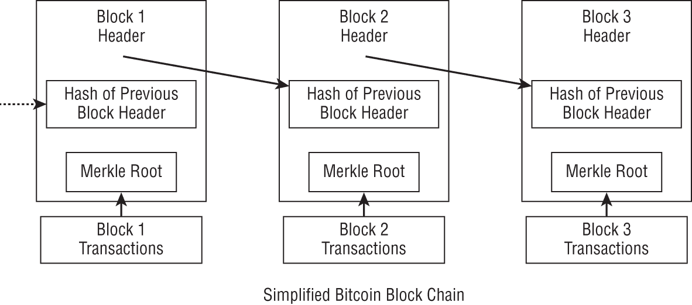

**图 1.8** 比特币区块链  ## 区块链类型

区块链有各种架构，可以满足不同的用例。当区块链得到适当设计时，将满足企业客户的需求，并满足所需的用例。企业通常偏好以企业为中心的区块链，如 Hyperledger Fabric 或 R3 Corda。

在本节中，我将介绍区块链类型和部署问题，并将区块链与云计算服务进行比较。

### 公共、私有和混合区块链

在大多数企业中，区块链通常被视为基础设施。*基础设施*意味着组织维护生产应用程序，并直接或间接地通过服务提供商维护应用程序。

我通常将区块链的部署与云计算进行比较。在云计算中，有*部署模型*和*服务模型*。

部署模型本质上是一个商业模式。让我们回顾一下 NIST 对云计算的定义，然后将这个定义应用到区块链上。

> *云计算是计算世界中相对较新的商业模式。根据官方 NIST 定义，“云计算是一种模式，它可以实现对共享的可配置计算资源（例如网络、服务器、存储、应用程序和服务）的普遍、方便、按需的网络访问，这些资源可以通过最小的管理工作或服务提供商交互快速提供和释放。”*
> 
> `[`www.bartleby.com/essay/Cloud-Computing-A-Profitable-New-Business-Model-P3S6F9L29BQQ`](https://www.bartleby.com/essay/Cloud-Computing-A-Profitable-New-Business-Model-P3S6F9L29BQQ)`

美国国家标准与技术研究院（NIST）对部署模型的定义如下(`[`nvlpubs.nist.gov/nistpubs/Legacy/SP/nistspecialpublication800-145.pdf`](https://nvlpubs.nist.gov/nistpubs/Legacy/SP/nistspecialpublication800-145.pdf)`)：

+   **私有云** 云基础架构是为单个组织提供的，包括多个消费者。

+   **社区云** 云基础架构是为具有共同关注点的特定社区的消费者提供的（例如，任务、安全需求、政策和合规性考虑）。

+   **公共云** 云基础架构是为一般公众开放使用的。

+   **混合云** 云基础设施由两个或更多个不同的云基础设施（私有、社区或公共）组成，它们仍然是独立的实体，但通过标准化或专有技术进行绑定，以实现数据和应用程序的可移植性（例如，用于在云之间进行负载平衡的云突发）。

现在，如果你用 *区块链* 替换 *云* 这个词，这正是一个区块链可以执行的操作，它可以如何部署，甚至如何适用于企业用例。

值得注意的例外是，在区块链术语中，没有“社区”区块链；然而，有“联合”区块链，它们服务于相同的部署用例。

这些联合区块链实际上是“社区”实现的，由志同道合的组织共享区块链。联合区块链的一个很好的例子是 Ripple，它被金融行业专门用于银行间支付，例如。

图 1.9 说明了常见的云计算部署模型。不同的服务模型与由提供商或消费者提供的工作量水平相关。这个模型也可以用于区块链部署。例如，区块链可以作为平台或软件服务部署在云中。

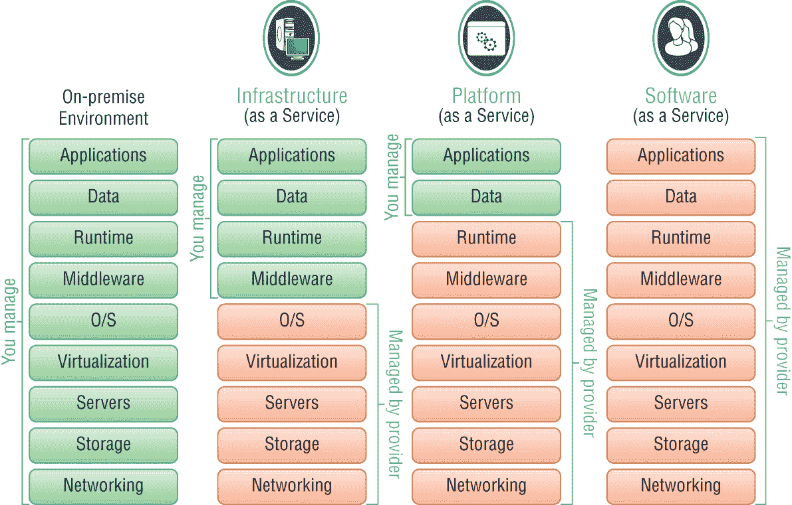

**图 1.9** 云计算部署模型

区块链通常部署在云中，并且可以作为云服务中的基础设施/平台/软件服务部署。例如，AWS、Azure 和 IBM 等提供商提供了在所有三种服务模型中部署的服务。AWS 区块链模板被视为 IaaS 部署，而 IBM 区块链平台有两个版本：一个是 SaaS，另一个更像是 PaaS。

在将云计算与区块链进行比较时，重要的是要注意，云计算在其最真实的形式下是一种“集中式”计算方法。区块链在其最真实的形式下是一种“去中心化”的计算形式。任何了解技术的人都知道，当一个技术被开发用于一个用途时，它通常可以适应其他用例。区块链也不例外，正如你将在整本书中阅读到的那样，区块链有许多不同的用例、例外和变化；有些是集中式的，有些是去中心化的。

例如，以太坊本质上是一个处理智能合约的去中心化全球计算机。以太坊的首席技术官加文·伍德将区块链描述为“全球计算机”。计算机只是一个计算机器；它接受输入，使用某些指令处理这些输入，并创建输出。

区块链在无需许可的情况下运行在“去中心化”的计算机上。在以太坊中，这个全球计算机由分布在 100 多个国家的数千个节点组成。

一般认为对任何人开放的区块链通常被视为公共、无需许可的区块链。而关闭的区块链通常被视为私有或许可的区块链。

#### 公共区块链

公共区块链也称为无需许可或开放的区块链，对任何人开放。比特币是最初由中本聪规定和开发的无需许可的区块链。所有节点都会处理区块链中的交易，并且这些交易在区块链上是公开可见（透明的）。这些交易也被广泛分布。例如，以太坊曾经在全球拥有超过 6,000 个节点，每个节点都保留了每笔交易的副本。在第二章中，我会更详细地介绍以太坊区块链及其基础设施。

公共区块链对任何人开放，这意味着您可以参与区块链。如果您想运行一个以太坊节点，您只需转到 GitHub 并下载区块链。当然，这假定您有资源来运行区块链，并且有安装和配置区块链所需的技术知识。

图 1.10 展示了无需许可的公共区块链的高层结构以及如何对网络实施无信任对等性，即，区块链网络上没有集中的成员或参与的控制。

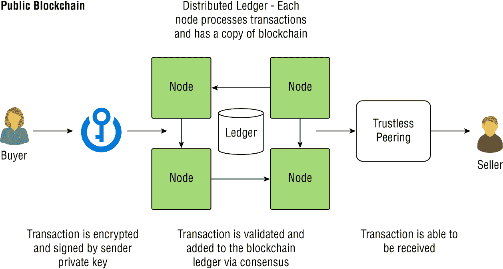

**图 1.10** 公共区块链示例

公共区块链相比私有区块链具有一些优势，如下所列：

+   开放读写

+   广泛分布的分类账

+   具有抗审查性

+   由于挖矿而安全（51%规则） #### 私有区块链

私有区块链也称为*许可区块链*或*企业区块链*。这些私有区块链是真正区块链的混合体，因为它们不是去中心化的，而是更加集中化的。中心化是企业区块链的核心，因为一个实体或一个联盟维护着对区块链的访问。访问区块链网络需要许可，意味着一个或所有交易都需要许可或授权才能进行。

这些区块链可以是开源的、联盟的或私有开发的区块链。

权限不同的区块链也会以不同方式处理交易。一些节点在区块链中处理交易。例如，一些区块链（如 Hyperledger Fabric）可以利用通道技术。通道技术也可以用于过滤节点，即使在权限控制的区块链中，也可以防止它们参与没有直接利益的特定交易。

区块链中的交易并非公开可见（透明）。交易的透明性也可以进行权限控制。（我将在第八章“区块链用例”中讨论使用情况。）

交易通常也是在本地分布的，这意味着区块链位于一个中央控制的数据中心。这种方法与无需权限的区块链相反，在以太坊区块链节点上，节点在全球范围内处理，这些节点位于不受控制的服务器上。

图 1.11 展示了私有区块链的高级结构以及如何在网络上实施受信任的对等网络。私有区块链使用受信任的对等网络方法，这与公开区块链不同。例如，财团成员将控制区块链网络的成员资格和/或参与。

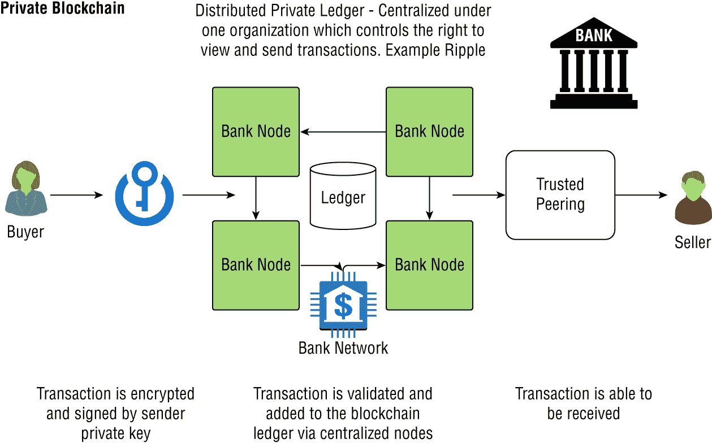

**图 1.11** 私有区块链示例

与公开区块链相比，私有区块链具有一些优势，如下所列：

+   企业被授予权限，并且受到隐私和安全性的控制。

+   它们具有更快的交易速度，因为节点较少，并且节点的分布简单，例如有限的地理范围。节点的位置和可扩展性可以直接影响性能。

+   它们具有更大的可扩展性，因为配置灵活性和成员控制。

+   它们具有合规支持，因为权限控制和数据存储的受控分布在适当的地区。

表 1.2 比较了公开和私有区块链的主要比较点，包括安全性、账本访问、身份和其他在设计区块链时重要考虑的特性的显著差异。私有区块链通过各种因素（如成员资格、隐私甚至性能）为企业创造价值。

**表 1.2**：公开 vs. 私有区块链

|  | 公开（无需权限） | 私有（需权限） |
| --- | --- | --- |
| **账本访问权限** | 开放读/写 | 需权限读/写 |
| **身份** | 匿名 | 已知身份 |
| **安全性和信任** | 开放网络（无需信任） | 受控网络（受信任） |
| **交易速度** | 较慢 | 较快 |
| **共识** | POW/POS | 专有或模块化 |
| **开源** | 是 | 取决于区块链 |
| **代码维护** | 公共 | 联合体或受管理的 |

| **示例** | 以太坊，多链 | R3 Corda，Quorum |  #### 混合区块链

混合区块链是同时具有私有、受权限控制的区块链和无需权限的区块链功能和功能的区块链。例如，一家公司可能需要对其内部员工的性能要求严格执行严格的安全要求，但在涉及 B2C 交易时，它们可能会将其放置在一个离线服务（通道化）上来处理加密货币交易。

简而言之，您可能希望将混合区块链视为类似于混合云环境，其中您同时使用两者的功能，并提供符合您企业要求的解决方案。

控制、性能、透明度、合规性等功能可以在混合区块链解决方案中进行精心协调。我将混合区块链与混合云解决方案进行了比较。混合云基本上包括了云计算中的两全其美。

在混合云解决方案中，您可以将本地数据中心扩展到诸如 AWS 等云计算平台。当扩展到 AWS 时，您的数据中心可以提供许多好处，例如通过减少资本支出实现成本效益，在高峰时段使用突发服务，或利用可用性选项。

部署为混合解决方案的区块链可能相似。例如，公司可以扩展在本地的 Hyperledger Fabric 区块链到 AWS 或 IBM BaaS。主要好处可能是为了扩展离线，以满足合规要求，或扩展区块链网络。

图 1.12 提供了一个决策树，用于决定是否实施公共、私有或混合区块链解决方案。混合区块链是私有和受权限控制区块链的分支。混合区块链也可以扩展到无需权限的区块链。

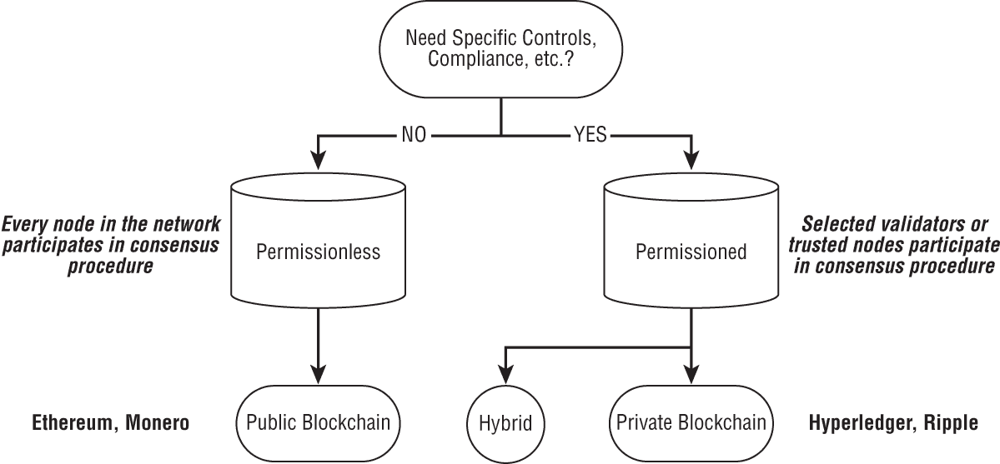

**图 1.12** 区块链部署决策树

在选择区块链类型时，另一个要考虑的因素是成本。我在第六章，“企业区块链经济学”中详细介绍了区块链部署的成本。

大型企业通常需要区块链技术可以提供的好处，而不带来公共区块链所带来的相关风险升高。如果是这种情况，那么混合解决方案可能为企业提供了适合特定用例的正确解决方案。

在第三章，“设计您的企业区块链”，我将讨论诸如 Hyperledger、R3 Corda 和以太坊企业联盟等私有-公共区块链为焦点的项目如何使组织能够适当地围绕区块链解决方案进行范围界定。  #### 受权限控制或无权限区块链

在本书中，你会注意到*公共*和*私有*有时与有权限和无权限的区块链可以互换使用。 公平地说，这些术语在某些情况下可能对不同的区块链公司和组织有些不同的用例或含义。

在我多年的解决方案销售、架构设计和实施过程中，公平地说，特定的供应商、服务提供商和媒体使事情变得比必要的更加困难。 即使在云计算已经成熟的情况下，大多数供应商都会在 NIST 云计算定义的行业范围内增加他们自己的特色。

在本章的早些时候，我介绍了公共、私有和无权限的区块链类型。 现在我将介绍有权限的区块链是什么。 有权限的区块链是一种形式的区块链，只允许授权成员加入区块链。 有权限的区块链非常适合企业，他们想要区块链的一些好处，比如一个不可变的分类账，但不想要透明度、开放的会员资格或智能合约。 有权限的区块链无疑改变了区块链最初的目的。 也就是说，区块链最初是开放的和无权限的，这基本上意味着它们对公众开放。  ## 概要

中本聪基本上将计算机和经济学结合起来，创建了一种称为比特币的区块链平台，改变了人们与传统机构（如银行）互动的方式。 比特币是直接由 2008 年的金融危机产生的。

区块链技术是革命性的，特别是对于金融部门和物流部门。 正如你在本章中学到的，区块链是一种维护交易数据永久且防篡改记录的分布式分类账的一种类型。

企业刚刚开始了解区块链在其组织、用户和客户中的潜力，并且一些企业已经开始采用区块链技术。

有几种定义和几种类型的区块链，取决于你和谁在谈论。 对所有人开放的区块链通常被认为是公共或开放的区块链。 封闭的区块链通常被认为是私有区块链。 最后，企业区块链通常是私有的、有权限的区块链。
