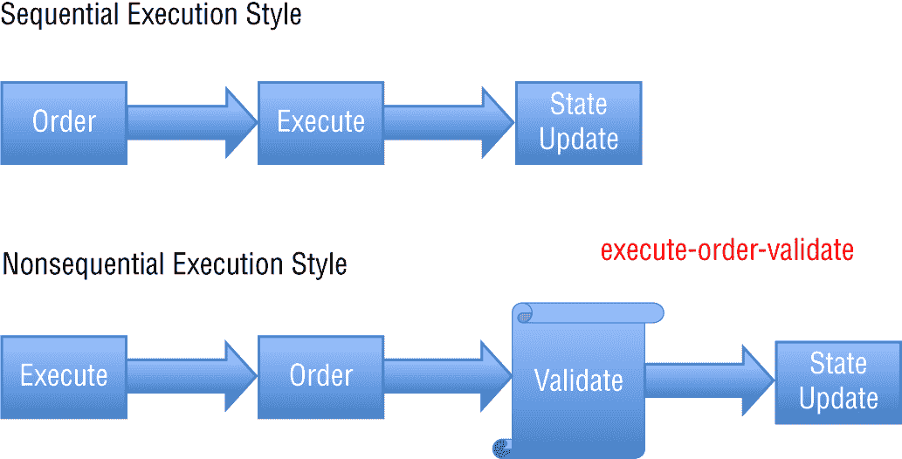
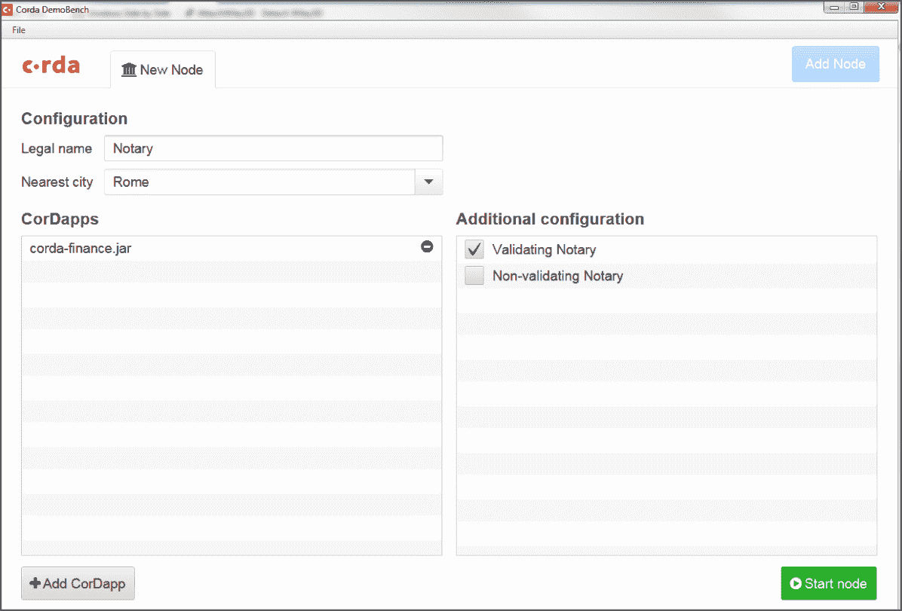

# 第二章

企业区块链：Hyperledger、R3 Corda、Quorum 和 Ethereum

在本章中，我将介绍以下企业区块链的技术优点，它们的结构以及它们在企业中的适用情况：

+   Hyperledger

+   R3 Corda

+   Quorum

+   以太坊

本章涵盖的技术优点包括安全性、共识、虚拟机、功能和对理解区块链平台至关重要的功能。本章将从基本层面介绍架构，以便您了解区块链网络和服务。在第三章“构建企业区块链”中，我将专注于设计区块链网络的步骤以及特定区块链的架构最佳实践。

## 企业区块链比较

区块链在两类主要的 IT 解决方案中使用。

+   公共、无许可的区块链

+   私有、企业、许可的区块链

第三种方法被认为是混合解决方案，结合了多种私有和公共区块链服务。混合区块链将作为一个用例在“区块链应用案例”中进行讨论。

企业区块链与以太坊等公共区块链有不同的要求。我将在本书中讨论企业区块链的优点。

正如在“区块链技术简介”中所讨论的，公共许可的区块链使用称为互联网协议（IP）的网络协议与区块链网络上的节点通信，以及管理交易的分发。节点是正在运行区块链协议的其他虚拟机。

区块链将运行各种协议的变体，在每个平台上它们可能略有不同。例如，以太坊使用点对点网络协议，而 R3 Corda 使用点对点网络协议。

区块链之间的共识也有很大的不同，在本章中我将从高层次讨论这个问题。在第四章“理解企业区块链解决方案”中也会更详细地讨论这个问题。

表格 1.2 展示了不同的公共和私有区块链在平台的功能和功能方面可能有何不同。选择正确的区块链平台可能仅仅取决于一个功能。

#### 混合区块链

在无许可的区块链中，账本是开放读/写的，这意味着任何人都可以访问交易记录。例如，这可以通过区块链浏览器完成。当然，其他功能如身份、安全性和信任处理方式也会有所不同。

诸如 Hyperledger Fabric、R3 Corda 和 Quorum 等企业区块链是分布式分类帐，在其中所有参与者都是已知的，并且有权限加入区块链网络。交易是基于角色的，并由网络中的共识确定。企业区块链通常向区块链引入一种形式的中心化，但也可能在成员联盟中实现去中心化。诸如共识或密钥管理系统之类的模块化组件使企业能够确定符合其用例的内容。在一个受控的区块链生态系统中，会员资格受控，通常不需要代币或加密货币。一些联盟区块链，如 Hyperledger，可能会在以后提供此功能。

企业区块链可以利用“链下”数据存储服务，例如星际文件系统（IPFS），以降低成本。IPFS 由 Protocol Labs 创建，是一种对等网络协议，其中每个节点都存储一组散列文件。IPFS 实际上是一种引人入胜的区块链存储方法，可以提供成本效益和编程效率。IPFS 使用散列明确地引用文件，因此可以实现更丰富的编程交互。

企业集成可能不需要中间件或 API 更改来建立企业服务。例如，使用企业以太坊和 Quorum，已经具备了一定的能力将区块链作为混合解决方案进行扩展。混合解决方案意味着区块链可以从许可链扩展到无许可链，例如以太坊。

企业区块链通常被认为属于以下几类之一，其中最常见的是：

+   *私有企业区块链*由单一组织管理。参与者通常是内部用户。

+   *联盟企业区块链*由多个受信任的组织管理。访问需要联盟中多个参与者的共识。

+   *混合企业区块链*通常用于扩展链下能力。混合区块链可以是私有和公共扩展的多样化。

从售前角度考虑区块链时，必须理解不同企业区块链的用例至关重要。并非每个企业区块链都能满足每个用例。我现在将介绍主要的企业区块链，让你了解它们的实际比较和对比。我将在本书中更详细地介绍每一个，并比较和对比这些企业区块链的特性和用例。

今天进入企业区块链领域的真正便利之处在于学习的企业区块链并不多——即使包括瑞波，这是面向银行的支付网络。我在本章中不会对瑞波进行深入介绍，主要是因为它是一种银行和支付网络服务，并且瑞波不支持智能合约。智能合约实质上为企业组织在区块链用例中提供了主要的好处。

相反，本书将重点关注 Hyperledger、R3 Corda、Quorum 和以太坊。表 2.1 展示了五个主要的企业级区块链及其在行业、账本、共识方法、智能合约和加密货币支持方面的比较。

你可以在 `[`www.horsesforsources.com/top-5-blockchain-platforms_031618`](https://www.horsesforsources.com/top-5-blockchain-platforms_031618)` 上查看完整的表格。它提供了对 50 个受访解决方案提供商中有多少实际参与企业区块链的洞察。

**表 2.1**：企业区块链比较

|  | 以太坊 | R3 Corda | Quorum | 超级账本 | 瑞波 |
| --- | --- | --- | --- | --- | --- |
| **行业** | 跨行业 | 金融 | 跨行业 | 跨行业 | 金融 |
| **账本** | 无许可 | 许可 | 许可 | 许可 | 许可 |
| **共识** | 工作证明 | 可插拔 | 多数投票 | 可插拔 | 概率投票 |
| **智能合约支持** | 是 | 是 | 是 | 是 | 否 |

| **加密货币** | 以太币（Eth） | N/A | N/A | N/A | 瑞波币（XRP） |

Linux 基金会托管 Hyperledger，并为 Hyperledger 社区提供治理结构和监督。这是一个全球开源项目，是技术领袖合作的结果。Linux 基金会还采用模块化的总体方法来支持企业区块链。Hyperledger 是一种开源软件许可模型，允许用户对代码进行建模并以适当的方式分发。

如 图 2.1 所示，Hyperledger 使用总体方法来管理其开源项目。作为一个组织，Hyperledger 管理着 100 多个开源协作（项目）。Hyperledger 结构有三个模块：基础设施、框架和工具。

你可以看到 Hyperledger 有六个框架和六个工具和实用程序。我将主要关注 Hyperledger Fabric，因为它拥有广泛的开发基础和目前正在进行的重大企业用例。总体战略，也称为*绿色战略*，是 Linux 基金会在其维护的其他项目中反复使用的经过验证的模型。历史上，Linux 基金会为联盟成员提供了出色的管理和洞察力，以便管理开源项目。

### Hyperledger 框架

如前所述，截至撰写本文时，超级账本拥有六个框架。每个框架都是一个区块链。超级账本成员组织意识到一个区块链框架无法满足所有成员的需求。这五个框架确保其成员组织具备部署适当区块链的功能、功能和其他要求。

表 2.2 展示了组成超级账本框架的五个区块链。我将重点关注 Fabric 框架，这是一个支持通道的许可区块链。通道允许进行受控的私有交易。

如前所述，本书将聚焦于 Fabric，但超级账本区块链家族中的其他框架，如 Burrow 或 Sawtooth，也将在整本书中作为用例比较而被提及。

超级账本作为一个组织，通过该项目的区块链框架、工具和组织基础设施为其成员提供支持。其中，超级账本 Fabric 是目前应用最广泛的框架之一。例如，如果你去超级账本 GitHub 项目，你会发现 Fabric 有最多的分支。GitHub 是一个基于网络的协作平台，用于使用 Git 版本控制系统的软件开发项目。Git 是软件开发的标准，也是最广泛使用的平台。

图 2.2 显示 Fabric 有超过 4,700 个分支。分支是开发人员复制存储库的情况，这是一个好迹象，因为它表明开发人员正在对代码进行更改、测试代码或使用代码。

显然，与其他框架相比，Fabric 的活动最为活跃。这主要是因为它是符合最多用例的框架。Fabric 提供了一些重要功能，比如共识的模块化和加密密钥管理，同时还支持私有通道。本书着重介绍超级账本 Fabric 的强大和灵活性。

#### 超级账本 INDY

超级账本 Indy 是由 Sovrin 基金会创建和贡献的。Sovrin 基金会是一个私营部门的国际非营利组织，旨在管理世界上第一个自主身份网络。

Indy 是一个超级账本项目，旨在支持分布式分类账平台上的独立身份。Indy 提供了广泛的工具、库和可重复使用组件，用于提供基于区块链或其他分布式分类账的数字身份。其优势在于数字身份为企业提供了跨管理域、应用程序和任何其他隔离体的可互操作能力。

**图 2.1** Hyperledger 方法（Linux 基金会）

**图形由 Linux 基金会提供**

**表 2.2**: Hyperledger 框架中的区块链

| 框架 | 应用 |
| --- | --- |
| Indy | 去中心化身份 |
| Iroha | 以移动应用为重点 |
| Sawtooth | 支持许可和无许可；EVM 交易族 |
| Burrow | 可许可的智能合约机器（EVM） |
| Fabric | 支持通道的有权限制的 |
| Grid | 基于 Web Assembly 的用于构建基于供应链的解决方案的项目 |


**图 2.2** Hyperledger Fabric GitHub 分叉

#### HYPERLEDGER IROHA

Hyperledger Iroha 是由许多参与公司创建的，例如 Soramitsu、日立、NTT 数据和 Colu。Iroha 是一个专门设计用于高效融入需要分布式账本技术的移动项目的业务区块链框架。Iroha 具有现代的、面向域的 C++ 设计，以及一种基于链的拜占庭容错共识算法，称为 Sumeragi。

Sumeragi 使用基于许可的服务器声誉系统，根据以下三个具体因素计算服务器的可靠性：

+   每个注册到成员资格服务的服务器的时间

+   每个服务器处理的成功交易数量

+   故障检测

Sumeragi 中的共识是在个别交易和应用交易所产生的全局状态上执行的。 #### HYPERLEDGER FABRIC

Hyperledger Fabric 主要由 IBM 开发。Fabric 明确旨在作为开发应用程序或解决方案的基础，具有企业需要的模块化架构。Hyperledger Fabric 允许对组件采用基本上是模块化的方法，例如共识和成员资格服务，并利用容器来托管称为*链码*的智能合约，这些合约构成系统的应用逻辑。

Hyperledger Fabric 的许可性质为参与者的操作提供了隐私保护。对隐私的需求并不排除监管机构对身份验证和审计能力的需求。基本上，身份（成员资格）的加密是以一种对其他区块链参与者“保密”的方式进行的。审计是有效地内置的，并且还提供了符合法规要求的功能，这是企业的主要关注点。

Hyperledger Fabric 不执行挖矿，尽管通过链码引用链下交易所可以支持加密货币。 #### HYPERLEDGER SAWTOOTH

Hyperledger Sawtooth 由英特尔构建，更接近于专有区块链而不是开源区块链。Sawtooth 是用于构建、部署和运行分布式分类账的模块化平台，被认为是 Hyperledger 第二最广泛接受的区块链框架。

Hyperledger Sawtooth 包括一个称为 *经过时间证明*（PoET）的多样化共识算法，其目标是在最小资源消耗的情况下针对大型分布式验证人群。这基本上意味着它可以高效地针对分布式共识。

Hyperledger Burrow 是一个权限可控的智能合约机器，在 2014 年发布时是其类别中的第一个。Burrow 的主要价值点在于，它提供了一个具有权限的智能合约解释器的模块化区块链客户端，该解释器是按照以太坊虚拟机（EVM）的规范构建的。Burrow 具体建造成为一个轻量级、高效和快速的权限智能合约机器。Burrow 通过利用经过硬化和高速的 Tendermint 共识协议与 Burrow 的 Apache 许可的 EVM 合作，实现了这一目标。

智能合约应该在支持智能合约的不同区块链上执行相同的操作。这对于可移植性来说非常有用，因为用户可以轻松地从 Hyperledger Burrow 开始，并随着时间的推移将其智能合约迁移到另一个平台。

从这张图表中，很明显 Hyperledger 作为区块链框架的投资组合具有一些相似的能力，但框架之间也有一些实质性的用例差异。## 介绍 Hyperledger Fabric

Hyperledger Fabric 作为企业区块链具有广泛的接受度，并且是 Hyperledger 最活跃的项目。使用 GitHub 存储库的开发人员数量明显高于 Hyperledger 其他区块链框架。

然而，我将比较 Hyperledger Fabric 和 Burrow、Sawtooth、Iroha 和 Indy，因为这些框架都具有非常具体的用例，但在框架投资组合中也有一些重叠的功能值得注意。

Hyperledger Fabric 项目是由 Digital Asset 和 IBM 开始的，现在已经成为一个由 Linux 基金会主持的跨行业协作项目。Hyperledger Fabric 实际上是第一个在 Hyperledger 项目中退出“孵化”阶段并在 2017 年 3 月达到“活跃”阶段的区块链。

Hyperledger Fabric 是一个设计用于部署模块化和可扩展架构的区块链实现。它具有模块化子系统设计，以便随着时间的推移可以添加不同的实现。Hyperledger Fabric 的模块化架构将交易处理工作流分为三个不同的阶段，如下所示：

1.  Chaincode 调用和初始化，客户端应用程序请求访问区块链网络。

1.  事务处理和排序，其中事务首先按顺序处理，然后验证。

1.  事务验证和提交，其中事务被验证，然后提交到区块链账本。作为这一步的一部分，世界状态被更新。

这些明确的步骤为企业提供了多重好处，例如减少了信任级别和验证，从而提高了网络的可扩展性和性能。在其他区块链中，如以太坊，事务的处理方式不同，它们是确定性的，这意味着它们在相同的输入和相同的逻辑下总是产生相同的结果。

图 2.3 显示了典型的 Fabric 网络结构。作为结构的一部分，您将拥有一个客户端应用程序、组织、各种类型的对等体、排序对等体和成员服务提供者。


**图 2.3** Hyperledger Fabric 概览

这个图显示了一个简单的 Fabric 网络设置，其中包含不同的对等体、两个组织和一个客户端应用程序。例如，Hyperledger Fabric 可以扩展到数百个对等体。我将在第三章中更详细地讨论企业区块链的可扩展性和性能。

### Hyperledger Fabric 账本

Hyperledger Fabric 账本是区块链交易的不可变记录。状态转换是由链码调用发起的，这些调用是*事务*。一个事务也可以被视为更新账本的*请求*。

每个事务的结果是一组资产键值对，这些资产键值对被提交到账本作为创建/读取/更新/删除（CRUD）操作。这也是一个事务日志。

键值对是在 Fabric 账本中表示和识别资产的有效方式。例如，您将指定一个键值对，这是一个资产，例如一辆汽车，其数据存储在 Fabric 账本中。数据存储在键值对中。

这是一个键对的示例：

```py
'color' : 'purple'
```

在这个示例中，“color”是键，“purple”是颜色的值。然后，这个键值对被存储在账本上，维护一条记录。

资产通过账本请求（交易）进行跟踪、识别或更新，例如查询或更新。简单来说，账本就是实际的区块链。账本是一个基于文件的账本，它存储序列化的区块。Hyperledger Fabric 具有一些有趣的能力，这些能力超出了区块链的标准行为。例如，状态数据库可以始终从重新处理账本中重建，并且可以回滚事务，例如，如果事务被视为无效。

Fabric 目前还有两种状态数据库选项。首先是一个称为 LevelDB 的嵌入式数据库。您也可以选择外部的 CouchDB 作为另一个选项。

Hyperledger Fabric 账本分为两个不同的部分。

+   状态数据是区块链上资产当前状态的表示。资产状态数据可以随着数据状态的变化而变化。

+   交易日志记录了所有按照接收顺序修改状态数据的交易。一旦数据被写入交易日志，它们就是不可变的，不能被修改或删除。  ### Hyperledger Fabric 共识

Hyperledger Fabric 的共识广泛而全面，涵盖了从开始到结束的整个交易流程。

在 Hyperledger Fabric 中，节点和对等节点有些令人困惑，因为它们都有多个角色。这与以太坊形成了鲜明的对比，例如，参与达成共识的节点的角色和任务是相同的。简而言之，以太坊中的每个节点都在做同样的事情，但在 Hyperledger 中，节点在区块链网络上的任务非常不同。

我在本章后面的“节点”部分讨论了 Hyperledger 节点。

在 Hyperledger 下的共识算法是可插拔的，这意味着用户可以在部署过程中选择他们喜欢的算法。

在撰写本文时，Hyperledger Fabric 1.4 支持以下共识方法：

+   Kafka/Zab

+   Raft

+   SOLO

第四章介绍了 Hyperledger、以太坊、Corda 和 Quorum 的共识方法选项。  ### Hyperledger Fabric 交易

在 Hyperledger 中，交易是向区块链发出的请求，在账本上执行一个函数。该函数由链码实现，链码是在验证节点上运行的分散式事务程序。链码交易是有时间限制的，并且在链码部署期间进行配置，类似于数据库调用或 Web 服务调用。

如果一个交易超时，例如，它被视为一个错误，并且不会在区块链账本上导致状态变化。一个链码函数可以调用另一个链码函数，如果被调用的函数具有相同的限制性机密范围。基本上，如果它们共享相同的验证节点组，一个机密链码可以调用另一个机密链码。

当交易在新区块中运行时，会维护从区块链上最后一个区块的世界状态到当前区块的变化量。变化量指的是区块链上世界状态的变化。例如，如果最后一个区块是第 27000 个区块，并且账本有更新，那么世界状态就会发生变化。简单来说，一个新区块等于一个新状态。

Hyperledger 支持两种类型的交易。

+   *代码部署交易*基本上是区块链应用的初始化(`Init`)函数。当您首次将链码部署到区块链上时，会调用`Init`。

+   *调用代码的交易*是当你想要调用（调用）链码函数在区块链上执行交易时调用的。这些交易将有效地被记录为区块链上的块。

超级账本 Fabric 通常被区块链社区视为开发应用程序的较简单平台之一。这是由于区块链开发支持的灵活性。

超级账本 Fabric 中的交易具有以下工作流程。这与其他区块链可能有很大不同。

1.  触发链码的交易提案由客户端应用程序发起。

1.  交易提案随后将按照规定发送给适当的同行进行认可。

1.  认可节点将执行链码并将实际交易写入分类账。

1.  认可节点将签署交易并将其返回给提议者。

当比较超级账本 Fabric 与以太坊的交易工作流程时，你会发现，例如，以太坊使用顺序执行风格，而超级账本 Fabric 使用非顺序执行风格进行交易。

图 2.4 显示了常见区块链交易执行风格之间的对比。你可以看到两种不同的执行风格有所不同。例如，两者之间的一个区别是非顺序地首先启动了执行阶段。这可能会为控制其成员资格的许可区块链提供效率，但也可能会更快地向请求者提供响应。

总结超级账本 Fabric 交易过程，过程从交易提案开始，由客户端发起。客户端是一个具有链码应用程序的区块链用户，请求访问区块链网络。然后，这个交易提案根据认可策略被传输到适当的同行进行认可。认可节点执行链码，结果是为了维护账本的实际交易。客户端从同行/节点接收确认。



**图 2.4** 比较区块链执行风格

总之，Fabric 网络有一个需要维护的明确交易顺序。

有关交易的更多信息，请参阅白皮书“Hyperledger Fabric: A Distributed Operating System for Permissioned Blockchains” (`[`www.hyperledger.org/wp-content/uploads/2017/08/Hyperledger_Arch_WG_Paper_1_Consensus.pdf`](https://www.hyperledger.org/wp-content/uploads/2017/08/Hyperledger_Arch_WG_Paper_1_Consensus.pdf)`)。### 超级账本 Fabric 节点

节点的概念在所有区块链技术中都很常见。节点成为区块链技术中的通信端点。

节点连接到其他节点，创建一个分散式网络。节点使用一种对等协议形式来保持网络上的分布式账本同步。在 Hyperledger Fabric 中，节点需要一个有效的证书才能与网络进行通信，参与者使用连接到网络的节点的应用程序。

请记住，Hyperledger Fabric 是一种权限区块链，在进行区块链交易之前会验证成员、身份和证书。参与者的身份与节点的身份并不相同，可能是一个组织。例如，当参与者执行或调用交易时，他们的证书将用于签署该交易，因此也将得到验证。

需要注意的是，Hyperledger 中并非所有节点都相等，不像其他区块链，每个节点都维护着相同的账本副本。在 Hyperledger Fabric 中，有三种不同类型的节点：

+   *客户节点* 为客户端应用程序启动交易。

+   *对等节点* 提交交易并在整个区块链账本上保持数据同步。

+   *有序节点* 是通信主干，负责分发交易。 ### Hyperledger Fabric 商业网络

一个商业网络模型包括参与者、资产、注册表和交易。交易处理器在这些元素上实现业务逻辑。访问控制列表（ACL）定义了隐私和共享设置。

在部署 Hyperledger Fabric 商业网络模型方面，最有效的方法是使用 Composer Playground，这是一个交互式的网络工具，用于测试和部署业务网络。区块链开发人员可以选择将其安装在 Docker 上，也可以选择在本地安装。

通过使用 Hyperledger Composer 创建商业网络归档（BNA）。Composer 是一种允许区块链开发人员打包几个不同文件并生成归档文件的工具，然后可以部署到 Fabric 网络上。Composer 对您的开发人员是免费的，并且在 IBM Cloud 上有一个版本称为 Composer Playground。  ### Hyperledger Fabric 链码（智能合约）

*链码* 是描述 Hyperledger Fabric 中智能合约的术语。智能合约在 Hyperledger Fabric 上得到充分支持，并且在撰写时支持 Golang 和 JavaScript。

链码是作为 Hyperledger 交易的一部分存储在账本上的应用级别代码。这些交易还修改账本状态，称为*世界状态*。

链码专门实例化在一个通道上，或者可以安装在多个通道上。通道是用于寻找隐私的特定通信路径。例如，如果你有两个通道，你可以有效地部署两个代码版本，而且那个代码不会被另一个通道中的其他代码访问。

客户端应用程序通过链码方法`Init`和`Invoke`与区块链分类账进行交互。链码需要安装在每个将背书交易的对等方上，并在通道上实例化。指定你的成员政策也将成为这个链码策略的一部分。

创建链码时，有两种方法需要实现。

+   当链码接收到实例化或升级交易时，首先会调用`Init`。

+   当接收到调用交易以处理任何交易提案时，会调用`Invoke`。

如果你正在开发区块链应用程序，你需要明白在你的链码中创建`Init`方法和`Invoke`方法都是重要的。### Hyperledger Fabric 开发工具

Hyperledger Composer 是一个开发框架，用于编写区块链网络的链码，并且也用于在 Hyperledger Fabric 中部署业务网络。

Hyperledger Composer 有两个版本。

+   一种可下载的本地版本，称为 Composer，在云平台的本地安装。

+   由 IBM Cloud 托管的在线版本称为 Hyperledger Playground。

你可以从 GitHub 下载 Hyperledger Fabric Composer，网址为`[`hyperledger.github.io/composer/latest/`](https://hyperledger.github.io/composer/latest/)`。

你可以访问 Hyperledger Fabric Composer Playground，网址为`[`composer-playground.mybluemix.net/`](https://composer-playground.mybluemix.net/)`。

图 2.5 展示了 Hyperledger Composer Playground 的初始登录界面。


**图 2.5** Hyperledger Fabric Composer Playground 网页版本初始界面

Composer Playground 是一个基于 Web 的用户界面，你可以用来建模和测试你的业务网络。Playground 适用于建模简单的概念验证，因为它使用浏览器的本地存储来模拟区块链网络。

但是，如果你正在运行本地 Fabric 运行时并已经在其上部署了一个网络，你也可以使用 Playground 访问它。在这种情况下，Playground 不是模拟网络；它直接与本地 Fabric 运行时通信。

存在基于 REST 的应用程序编程接口（API），客户端应用程序可以使用这些接口，允许你在网络中集成非区块链应用程序。表述性状态转移（REST）技术是一种在 Web 服务开发中使用的架构风格和服务方法。

对于 Hyperledger Fabric v1.4，还有两个软件开发工具包（SDK）可用：Java 和 Node 是撰写时支持的语言。根据 Hyperledger wiki，其他开发语言，如 Python 和 Go，可能也会得到支持。

SDK 用于构建区块链应用程序，使开发人员能够通过网络接入区块链网络，以促进快速开发。### Hyperledger Fabric Governance

由于 Hyperledger Fabric 是一个私有验证器网络协议，所有实体都需要向成员服务注册以获取身份。该身份提供了网络上的访问和交易权限。证书被发放给成员。需要两个证书：注册证书和交易证书。

Hyperledger Fabric 在架构的每一层都内置了许可制治理。诸如启动新财团、添加或驱逐成员、定义新通道、添加和驱逐通道中的参与者等操作都需要从相应组织收集批准签名。全面的政策模型贯穿整个区块链网络。

Hyperledger Fabric 有两级许可和基于财团或通道的治理支持。财团是由组织成员组成的基于成员的网络服务。

还支持通道，通过点对点连接提供增强的交易隐私。通道还提供单独的区块链交易分类帐和网络服务。第九章，“区块链治理、风险、合规（GRC）、隐私和法律问题”，详细介绍了有关 Fabric 的治理。## 介绍 R3 Corda

R3 是一个由跨越私营和公共领域的超过 200 名成员和合作伙伴组成的广泛生态系统开发的企业级区块链软件公司。 Corda 是一个开源的区块链平台，而 Corda Enterprise 则是 Corda 区块链平台的企业版，提供 Corda 支持，用于企业使用。

Corda 平台是与金融机构、贸易监管机构、贸易协会、专业服务公司和技术公司的庞大网络密切合作开发的，以利用区块链的力量解决特定的业务挑战。 Corda 被设计为满足世界上最复杂和高度监管的行业之一——金融部门的最高标准。

然而，其区块链服务可以应用于业务的其他领域。Corda 允许您构建在严格保密的条件下与其他成员进行交易的可互操作的区块链网络。

Corda 的智能合约技术（CorDapps）允许企业直接进行交易，并具有领先行业的安全功能。我相信 Corda 改进了传统的托管模式，即传统金融服务组织充当中介。

例如，它定义了一种表达金融资产和负债的标准方法和格式。企业市场利用 R3 Corda 的主要好处如下。

+   Corda 智能合约可以用 Java 和其他 JVM 语言编写，并且可以利用企业内部专业知识加速开发过程。

+   Corda 具有流程框架，用于管理网络参与者之间的通信和协商。这些参与者的网络通过直接的点对点协议进行通信，每个节点都运行 Corda 软件以及称为 CorDapps 的 Corda 应用程序。

+   Corda 具有独特的“公证人”基础设施，用于验证交易的唯一性和排序，而无需向所有网络参与者全局广播。

+   Corda 使得分布式应用程序（称为 CorDapps）的快速开发和部署成为可能。CorDapps 采用一组 JAR 文件的结构，其中包含用 Java 和/或 Kotlin 编写的类定义。

+   Corda 专门设计用于在业务问题和金融领域的领域问题之间保持权衡，例如可扩展性和安全性。

+   Corda 具有可插拔的共识机制，允许区块链开发人员解决性能、可扩展性、安全性和隐私等权衡。

金融部门不仅是美国，而且是全球最受监管的行业之一。在处理隐私和合规性问题时处理客户数据对这些组织来说是一项繁重的任务。

R3 Corda 通过受监管的金融机构可能会发现有利的权衡来处理这些挑战。这些权衡包括以下内容：

+   可扩展性

+   安全性

+   隐私

+   保密性

+   复杂性

+   性能

+   合规性

处理这些权衡正是 R3 Corda 开发的目标，并通过其 CorDapps 的结构很好地实现。

Corda 是一个严格设计的用于金融服务用例的共享账本网络，可以在现有法律框架内部署，并依赖于金融部门依赖的已验证技术。根据 Corda 白皮书，R3 Corda 具有严格和明确定义的哲学，可以分为三个类别（`[`docs.corda.net/_static/corda-introductory-whitepaper.pdf`](https://docs.corda.net/_static/corda-introductory-whitepaper.pdf)`）。

这三个类别分别是：

+   为机构的需求进行工程设计

+   注重非功能性需求

+   可扩展性

部署 R3 Corda 的基本方法实际上有两种直接方法。

+   **Corda** 是开源区块链平台，使企业能够直接进行交易，并且具有严格的隐私保护，降低交易和记录成本，简化业务操作。

+   **Corda Enterprise** 是 Corda 的企业级商业分发版本，专门优化以满足企业的需求。

如图 2.6 所示，Corda 的堆栈实际上相当简单。 Corda 有两个版本：一个是企业版或开源版，具有区块链网络服务，在堆栈的顶部是 CorDapp。


**图 2.6** Corda 堆栈结构

R3 Corda 在金融和保险行业确实有一席之地，但正在将其用例扩展到其他行业。 目前，与 Hyperledger 等其他区块链相比，Corda 不适合物流公司或政府服务组织，因为它会产生更大的开销。 我将在第八章“企业区块链用例”中更详细地讨论 R3 Corda 及其用例。

### R3 Corda 区块链基础知识

从技术角度来看，R3 Corda 或许是最直观易懂的企业区块链。 在我的经验中，有几个原因导致了它的明显成功。 R3 Corda 联盟已经清楚定义了与其联盟成员的特性、功能和用例。 Corda 是一个金融企业区块链应用平台，其中许多应用与 IOU（付款/债务）用例具有相似性。 Corda 保持供应商方法来进行开发、培训和营销，这是良好维护、专业化和有方向性的。

Corda 文档定义清晰，专业开发，但也由 Corda 分配的专家维护。 最后，R3 Corda 是唯一具有演示工具 Corda DemoBench 的企业区块链。

Corda DemoBench 工具让您在区块链中执行交易。 它对于进行演示非常有用，而且可以免费使用。  ### R3 Corda 网络

Corda 网络是一个完全连接的“图”网络，并不使用八卦协议。 Corda 通信实际上是点对点的，因此与八卦协议相比，网络开销要小一些，因为广播消息只发送给所有网络对等体。 对等体使用特定的点对点高级消息队列协议（AMQP）。 AMQP 是一个开放标准的应用层协议，是面向消息的，并使用 TLS 进行安全通信。

出于隐私考虑，对等体不会向所有其他网络对等体广播，而是直接向交易所需的网络对等体发送。

Corda 是一个特定设计的权限网络，旨在解决受监管金融机构的关切，并且自然适合银行业、交易业，甚至是保险业。

图 2.7 展示了 Corda 区块链网络如何设置与相关的 Corda 组件。这些 Corda 组件通常易于规划和部署。主要的区别在于 Corda 对组件命名的方式略有不同，比如使用公证或 CorDapp。


**图 2.7** Corda 网络

第三章，“设计您的企业区块链”，更详细地介绍了部署和架构。### R3 Corda 分类帐

R3 Corda 是一个定向的分布式分类帐技术（DLT）平台，使用有效的全球广播和流言网络协议将数据传播给区块链网络中的其他成员。

Corda 使用一种点对点的消息传递协议（称为 AMPQ），其中广播是有针对性的，并不会广播到网络上的所有成员。由于协议是点对点的，因此只有参与交易的节点才能特权地查看交易分类帐活动。这为成员提供了隐私的主要好处。

Corda 分类帐与其他区块链有一些显著的不同，值得注意。

+   Corda 分类帐允许管理和同步多方之间可以设计为法律合同的业务协议。Corda 分类帐专门设计用于解决其他区块链无法有效解决的受监管金融机构之间的合同。

+   网络上没有代表所有节点运行的集中式分类帐，这与其他区块链非常不同。相反，网络上的每个节点都维护一个包含其所有已知事实的存储库。存储库是维护已知事实的安全区域的存储空间。

+   Corda 分类帐是从每个对等方的角度主观的，这意味着分类帐将根据成员参与方式而不同地由每个对等方访问。有点独特的是，并非所有在分类帐上的事实都必须由每个成员共享，以便所有其他区块链网络成员查看。可以将此视为“需要知道”的基础，或者是对区块链分类帐采用“分区”的方式思考。### R3 Corda 共识

正如前面提到的，Corda 作为其金融部门成员的权限区块链分类账运行。这为记录提供了更精细的访问控制，并增强了其成员的隐私性。可以合理地假设达到了性能上的好处，因为只有参与交易的各方（节点）必须达成共识。交易不会分发给所有其他节点。

Corda 允许潜在的不信任方就一组共享事实的状态达成共识。需要一种机制来确保所有必要的参与方对分类账的状态达成一致。Corda 达成共识的这种能力通过 Corda 中的验证共识或唯一性共识来促进。Corda 中的这种共识方法与其他区块链有着显著的不同。

Corda 共识分为两个过程。

+   交易的有效性意味着参与方可以通过检查相关合同代码是否成功运行来确信提议的更新交易定义的输出状态是有效的。它还具有所有必需的签名，并且此交易所引用的任何交易也是有效的。

+   交易的唯一性是指各方可以确信所讨论的交易是所有其输入状态的唯一且正确的消费者。也就是说，在有效性和唯一性周围没有其他交易将消费任何相同状态。

各方可以通过独立运行相同的合同代码和验证逻辑来就交易的有效性达成一致意见。

#### Corda 公证

*公证*是 Corda 特有的网络服务。公证服务实际上提供了唯一性共识。还可以将公证视为一种担保方，保证特定状态仅被消费一次。您可以将状态类似于以太坊钱包中的资金或 Hyperledger Fabric 中的世界状态。

公证人在系统中提供最终性点，并类似于中间人。公证人用于验证唯一性的过程称为*公证*。除非获得公证人签名，否则各方无法确定是否将同样有效但存在冲突的交易视为对给定输入状态的有效尝试。

例如，每个状态将有一个指定的公证人，只有当它是所有交易输入状态的指定公证人时，该公证人才会对交易进行公证。简单地说，公证人是既可以阻止交易又可以解决冲突的中间人。

Corda 具有可插拔的唯一性服务，可以提高隐私性、可扩展性、与法律体系的兼容性和算法的灵活性。例如，一个单一的服务可以由许多相互不信任的节点组成，通过拜占庭容错算法协调，或者它可以是一个非常简单的虚拟机。

这些唯一性服务仅需要证明给定交易所消耗的状态是否先前已被消耗；它们不需要证明交易本身的有效性，这是交易各方的问题。

这实际上意味着唯一性服务无需查看任何交易的完整内容。与备选分布式分类账和区块链设计相比，这将显着提高系统的隐私性和可扩展性。这是 Corda 设计决策在共享分类账架构中所接受的折衷选择。

简而言之，当公证服务签署交易时，达到了最终性的点。然而，也可能存在例外情况。如果交易没有输入状态或时间戳，则显然无法确认或否认这些属性的“唯一性”。必须为交易分配公证员，但只有在存在输入状态和/或时间戳时才需要公证签名。### R3 Corda 节点

Java 虚拟机（JVM）用于在 Corda 中执行和验证合约。由于 Java 的广泛使用和开发的便利性，这个 JVM 提供了几个好处。在使用虚拟机进行开发之前要意识到的主要问题是，它已经加强了一个比普通 JVM 沙箱更严格的定制沙箱。这个限制性虚拟机强制执行安全性要求。

简而言之，Corda 节点是一个 JVM 运行时环境，在区块链网络上具有唯一身份，托管 Corda 服务和 CorDapps。

Corda 节点可以具有四种广泛的功能，可以是以下任何一种：

+   网络地图提供了一种将标识解析为物理节点地址和关联的公钥的方法。

+   Notary 充当交易的“见证者”，并最终决定交易是否是双重花费。

+   Oracle 是一个访问点，通过提供影响交易有效性的事实，将分类账与外部世界联系起来。

+   正常模式开始协议与其他节点、公证员和 Oracle 通信，并在网络上演变其私有分类账。### R3 Corda 状态

Corda 与其他分布式分类账技术之间的一个区别是区块链分类账的状态实际上是如何处理的。Corda 使用*状态*一词表示在特定时间点上具有共享事实（如协议或合同）的不可变对象的表示。

*共享事实*和*状态*这两个术语基本上意味着相同的事情，并且通常可以互换使用。让我们从分类账的角度澄清一下 Corda 中*状态*可以是什么。从分类账的角度来看，状态可以表示成员在特定时间同意的任何内容，例如银行票据、发票等等。这类似于其他区块链中的世界状态。静态状态意味着对定义的对象的表示没有变化。

例如，如果您熟悉金融领域，那么您可以拥有以下表示状态的状态：

+   抵押债务证券（CDO）

+   抵押贷款证券（CLO）

+   发票或对账单

+   银行信用

+   信用违约互换

+   利率互换，如利率

+   债券

基本上，在 Corda 中，状态模型可用于表示任何属于协议的部分。状态可用于表示金融工具或多边协议、资产或负债。

不同类型的状态可以包含不同的属性。例如，交易债券可能具有票息日期、赎回日期等。状态是不可变的，因此在创建后不能更改为另一种状态。状态包含特定时间点的共享事实数据。  ### R3 Corda 交易

在 R3 Corda 中，交易非常具体，因为明确定义了要发出哪个命令。例如，在 Corda 中，我们会在 CorDapp 中声明意图为“发行”或“同意”，而 CorDapp 将确定交易是否有效。

假设您的组织希望声明正在达成的交易类型。当您设计 CordApp 时，您需要适当地识别交易类型。

在 R3 Corda 中的交易在网络中传播，但不会广播到每个节点。广播更多地是基于需求的方法进行验证。这使成员能够确保他们在交易周围保持隐私。

这种交易方式类似于 Hyperledger 中的通道化，其中网络中的节点可以放置在通道上以进行通信以解决隐私问题。  ### R3 Corda 客户端应用程序

在考虑将客户应用程序集成到您的企业中的 R3 Corda 时，您必须意识到 Corda APIs 使用 Java 或 Kotlin。这并不完全是一种阻碍，但需要注意的事项之一。然而，Corda 提供了一个完整的客户端库，允许您的开发人员使用 JVM 兼容的语言编写客户端与运行中的节点进行交互。

Corda 为那些希望在 Corda 中进行教程的人提供了一个样本 CorDApp。您可以在 `[`docs.corda.net/tutorial-cordapp.html`](https://docs.corda.net/tutorial-cordapp.html)` 找到它。对于社区驱动的应用程序，请访问 `[`www.corda.net/develop/samples.html`](https://www.corda.net/develop/samples.html)`。  ### R3 Corda 智能合约

在 R3 Corda 中，智能合约也被称为 *合约*，当 CordApps 的参与者已经就法律条文达成协议时，这些合约可能是可以被执行的。相比之下，在以太坊中，智能合约是一个独立的程序，而不是可执行的合同。

在 Corda 中，这些合约是通过 CorDapp 部署的，它只是一组作为应用程序一起工作的合约。在以太坊中，这被称为*分布式应用程序*（dapp）。请注意，这些合约与其他区块链平台（如以太坊）的智能合约有些不同。在 Corda 中，这些合约不是表示世界当前状态的有状态对象，而更像是可能附带法律文书的现实世界合约。

状态可以包含任意数据，使其能够表示诸如股票交易、银行票据或贷款等事实。

R3 Corda 智能合约（CordApps）由计算机代码组成，但也可以包含附加的法律文书。这是与其他区块链不同的一个重要区别，因为这个功能明显是为其成员所计划的。

在智能法律合同之上是特定的法律文书，这些文书被设计为以智能合约代码的形式表达和实现。这样做的理由是为了给与相关法律文书相关的代码合法性。  

历史上，这种特定构造在金融领域被称为里卡迪亚合约。里卡迪亚合约是由 Ian Grigg 在 1996 年设计的，作为将文件记录为法律合同并将其安全链接到其他系统（如会计）的一种方法，作为价值发行。

在区块链世界中，里卡迪亚合约只不过是定义合同详细条款和条件的数字文件。这些合同通常由双方签署并同意。这种里卡迪亚合约方法用于缓解当前的合同问题，但也为未来的任何合同挑战提供了清晰度。

总之，CorDapp 是一个带有法院要求的标准法律文书编写的里卡迪亚合约，然后对其进行加密哈希以供应用程序使用。Corda 还有一种有趣的方法，允许监管机构实际上获得监督访问权限。该监管机构还可以被引入网络作为观察员来验证合同（参见图 2.8）。


**图 2.8** 具有法律文书的 Corda 智能合约

以下是 Corda 中特定用于使用 Corda 的金融机构的智能合约（CorDapps）的好处：

+   智能合约调节和简化参与的分散企业之间的工作流程。

+   这些 CorDapps 还包括监管和监管节点，提供观察者责任。

+   共识算法仅限于参与的公司。

+   访问协议内部数据的权限仅限于参与的经许可方。

+   CordApps 还仅在参与的两方之间验证交易。### R3 Corda 开发工具

R3 Corda 是一个私人财团，从头开始建立，为其财团成员开发企业区块链，拥有丰富的文档、工具和服务。Corda 拥有大量的开发者追随者，并且作为一个组织，Corda 提供了，在我看来，非常有帮助推动开发的优秀社区活动。

+   **Corda DemoBench** DemoBench 是一个独立的桌面应用程序，可以轻松配置和启动本地 Corda 节点。它非常适用于培训、演示和实验。要了解更多信息，请访问

    [`www.corda.net/discover/demobench.html`](https://www.corda.net/discover/demobench.html)。

+   图 2.9 显示了启动 Corda DemoBench 后的起始窗口。我们可以配置我们的节点，并确定 Corda Demobench 中的记账人类型。在下载并安装 DemoBench 后，您可以开始添加节点和记账人。



**图 2.9** Corda DemoBench 初始屏幕

我在第五章中涵盖了安装、配置和演示步骤。

+   **节点浏览器** “节点浏览器使用 Corda 的 RPC 框架提供了对节点存储库和事务数据的视图。”

    `[`ci-artifactory.corda.r3cev.com/artifactory/corda-releases/net/corda/corda-tools-explorer/3.2-corda/`](https://ci-artifactory.corda.r3cev.com/artifactory/corda-releases/net/corda/corda-tools-explorer/3.2-corda/)`。

+   **Blob Inspector** 在 Corda 3 中，R3 Corda 已经确保了一种稳定的 AMQP 序列化格式。作为一种二进制格式，它具有各种优点，但也有同样的缺点：缺乏人类可读性。Blob Inspector 填补了这一空白。给定文件路径或 URL，它将以 YAML 或 JSON 格式显示 Corda blob 的内容。

    您可以在这里找到 Blob Inspector 的文档：

    `[`docs.corda.net/head/blob-inspector.html`](https://docs.corda.net/head/blob-inspector.html)`。

    您可以从这里下载 Blob Inspector：

    `[`ci-artifactory.corda.r3cev.com/artifactory/corda-releases/net/corda/corda-blob-inspector/3.2-corda/corda-blob-inspector-3.2-corda.jar`](https://ci-artifactory.corda.r3cev.com/artifactory/corda-releases/net/corda/corda-blob-inspector/3.2-corda/corda-blob-inspector-3.2-corda.jar)`。

+   **网络引导程序**“这是一个从一个共同目录扫描所有节点配置以生成网络参数文件的工具，然后将其复制到所有节点的目录中。它还将每个节点的节点信息文件复制到每个其他节点，以便它们都可以相互可见。您可以在此处找到网络引导程序的文档：”

    `[`docs.corda.net/head/network-bootstrapper.html`](https://docs.corda.net/head/network-bootstrapper.html)`.

    “您可以从此处下载最新版本：”

    `[`ci-artifactory.corda.r3cev.com/artifactory/corda-releases/net/corda/corda-network-bootstrapper/3.2-corda/corda-network-bootstrapper-3.2-corda-executable.jar`](https://ci-artifactory.corda.r3cev.com/artifactory/corda-releases/net/corda/corda-network-bootstrapper/3.2-corda/corda-network-bootstrapper-3.2-corda-executable.jar)`.### R3 Corda 治理

由于 Corda 的金融行业客户的性质，治理显然是一个重要的优先事项，其中合规性和责任对其财团成员而言是一个重大关切。

Corda 通过使用公证监督程序采用了一种独特的交易监督方法。公证员被认为是一个可信任的方，保证 Corda 中的特定状态仅被消耗一次。来自公证员的 Corda 状态保证消除了诸如任何双重花费问题、透支账户问题甚至可以处理基于货币兑换的问题等挑战。

其实，公证员在某种程度上是主要的区块链网络治理结构，因为他们验证了交易的唯一性和网络参与。

在 Corda 中，没有包含所有交易记录的统一区块链。Corda 采用了一种不同的方法，其中 Corda 节点将只看到它们直接参与的交易或在历史上对其进行验证的交易。

最后，Corda 节点负责检查交易的正确性并授权交易。Corda 节点完全依赖于公证员来验证交易的唯一性并提供区块链的治理，这是治理结构的关键部分。## 介绍 Quorum

Quorum 是通过增强现有的以太坊区块链构建的开源区块链解决方案。Quorum 基于以太坊协议的官方 Go 实现，几乎提供了以太坊功能和优势的镜像。

Quorum 在以太坊之上提供了一个额外的层，使其能够执行私有交易，同时通过使用不同的共识算法使其更加灵活。Quorum 总体上是作为以太坊的一个有许可的实现而设计的，它支持交易隐私和合同隐私的企业需求。

Quorum 的主要用例是通过引入新的“私有”交易标识符并对以太坊代码库进行修改来实现数据隐私。这些修改包含在 Go-Ethereum 代码库中，其中包括对区块提案和验证过程的修改。 Quorum 中的数据隐私是通过密码学和节点类似于沙箱化的有意隔离来实现的。

企业选择 Quorum 而不是以太坊的主要原因是隐私；其次是 Quorum 基于以太坊，后者拥有强大且活跃的开发基础，因此很容易找到专业知识。

Quorum 支持通过公共和私有状态分割来实现私有交易和私有合约。Quorum 使用一种称为 Constellation 的新消息交换来实现隐私。Constellation 是用于向网络参与者定向传输私有数据的点对点加密消息交换。这种消息交换类似于我们在 Hyperledger 中使用 Kafka 实现的消息交换。

Quorum 提供了可用于联盟用例的共识机制选项。例如，Istanbul 拜占庭容错和基于 Raft 的共识是支持企业特性（如容错性和可用性）的两种共识方法。

Quorum Chain 是一种新的共识，它基于多数投票和基于时间的机制，支持可以通过网络传播的基于以太坊的交易。

图 2.10 展示了 Quorum 区块链的高级组件。您可以看到其中有一个带有 Go-Ethereum 的 Quorum 节点，它扩展了到以太坊网络的能力。


**图 2.10** Quorum 区块链组件

Constellation 是一个提交信息的机制，并允许对等方之间的加密通信。 Constellation 包括两个部分：事务管理器和 Enclave。

节点级别的权限由智能合约代码管理。其主要优点是与公共以太坊区块链相比，它提供了更高水平的性能。

Quorum 相对于公共以太坊的主要特点如下：

+   交易和合约的隐私

+   多种基于投票的共识机制

+   网络/节点权限管理

+   由于其简单的共识机制，性能和可扩展性更好

在 Quorum 中，交易必须是公开的或私有的。如果交易是私有的，则该交易中的所有数据对于区块链中的一组实体来说都是私有的。

简而言之，Quorum 是开源的，并且对于一些组织来说比在其他平台上实现自定义私有区块链更易接近。

Quorum 的目标是成为一个平台，允许与金融行业以及其他对以太坊区块链技术感兴趣的公司集成和实验，使用以太坊上的一个经过验证的平台。

### Quorum 区块链基础知识

Quorum 是基于以太坊协议的官方 Go 实现的私有/许可区块链平台，重点面向企业。Quorum 是建立在现有以太坊区块链之上的，并继承了经过生产测试的“go-Ethereum”代码库的成熟性。Quorum 将公共和企业开发社区汇集到一个共同的协议上，为金融行业提供服务。

Quorum 非常有效地使用基于投票的共识算法，然后通过引入新的“私有”交易标识符实现数据隐私。

Quorum 的一个明确的设计目标是尽可能地重用以太坊中的现有技术，以最小化对 Go-Ethereum 所需的更改。

战略性地，例如，这个计划实际上减少了与未来版本的公共以太坊代码库保持同步所需的工作量。负责额外隐私功能的大部分逻辑都位于一个层次结构中，该层次结构位于标准以太坊协议层的顶部。

根据其官方描述，Quorum 本质上是以太坊的一个扩展，通过对其代码库进行战略性分叉而实现。Quorum 区块链与以太坊有许多相似之处。Quorum 的明确任务是为目标受众提供权限区块链的最佳特性，并为其提供权限区块链的隐私性、安全性和性能。

Quorum 是由摩根大通及其财团成员开发的。Quorum 是金融行业普遍采用区块链的一大步。

本质上，Quorum 的功能类似于以太坊，但在与原生以太坊进行比较时有四个非常重要的不同点或需要注意的领域。

+   网络和对等节点权限管理，以在私有以太坊平台上对交易进行隔离

+   通过私有交易增加交易和合约的隐私性

+   以太坊中没有可用的基于投票的共识机制

+   由于节点有限而表现更好  ### Quorum 分类帐

在 Quorum 中，系统有两种明显不同类型的交易，即公共交易和私有交易。 *公共交易* 是指有效负载对所有参与者完全可见的交易。这些公开可查看的交易是您在以太坊区块链上期望的标准以太坊交易。

*私有交易* 不同之处在于，有效载荷只对在交易的 `privateFor` 参数中指定了公钥的参与者可见。 ### Quorum 共识

Quorum 中的共识比其他区块链略为灵活。例如，Quorum 提供了适用于联盟用例的共识机制的选项。

这些共识选择如下所示：

+   伊斯坦布尔拜占庭容错和基于 Raft 的共识是支持企业特性（如容错性和可用性）的共识方法。

+   Quorum Chain 是一种基于多数投票和基于时间的机制的新型共识，支持可以通过网络传播的基于以太坊的交易，例如。

Quorum 存在两种区块链状态。第一个状态是由所有节点共享的公共交易的公共状态，第二个状态是每个节点私有的，用于节点被授权的私有交易。### Quorum 智能合约

如前所述，Quorum 基于以太坊，并且是以太坊区块链的一个分叉。说到这一点，实施和使用以太坊智能合约对以太坊开发者来说将会非常熟悉。

Quorum 使用标准的 Solidity 语言编写智能合约。这提供了巨大的价值，因为你可以像在以太坊中一样进行设计。

其中一个区别在于智能合约可以是公共的，也可以是私有的，可以是对 Quorum 区块链网络上的一个或多个网络参与者私有的。

主要区别在于使用 Quorum 可以使用以太坊网络协议发送私有交易。在 Quorum 中，你可以通过编写你的智能合约来发送私有交易以满足这一要求。

在 Quorum 网络上，你会发送一个标准的以太坊交易，但将消息的`privateFor`参数设置为应该能够查看和执行该交易或合约代码的参与者的公钥。

图 2.11 显示了了解你的客户（KYC）用例中的私有交易。


**图 2.11** Quorum 中的 KYC 私有交易

若要了解更多，请访问`[`github.com/jpmorganchase/quorum/wiki/Using-Quorum`](https://github.com/jpmorganchase/quorum/wiki/Using-Quorum)`。

私有合约无法更新公共合约。这是有意的，因为并非所有参与者都能执行私有合约。需要注意的是，一旦合约被公开，该合约就无法稍后变为私有。要使公共合约变为私有，需要将其从区块链中删除，并创建一个新的私有合约。### Quorum 工具和实用程序

Quorum 基于以太坊，正如我们已经知道的那样，因此允许使用 Solidity 构建智能合约。Quorum 还与以太坊共享一些核心开发工具。其中一个工具是 Truffle，这恰好是大多数以太坊开发者可能已经在使用的工具。

实际上，以太坊开发人员在集成 Quorum 区块链解决方案时几乎没有开发启动时间和学习曲线，因为使用了以太坊工具和实用程序。

专门为 Quorum 构建的一项工具称为 Cakeshop。Cakeshop 提供了一个易于使用的图形界面（GUI），用于处理 Quorum 网络、智能合约和 Quorum API。Cakeshop 可以启动一个 Geth 节点，然后您可以使用 Cakeshop 前端与其交互，或者连接到您已经在运行的类似以太坊的节点，比如 Quorum。给定的 Cakeshop 实例将仅连接到您指定的区块链网络上的一个节点。

你可以从`[`github.com/jpmorganchase/cakeshop/wiki/Cakeshop-Overview`](https://github.com/jpmorganchase/cakeshop/wiki/Cakeshop-Overview)`下载 Cakeshop GUI。有关 Quorum 开发和工具的更多信息，请参阅第十章。  ### Quorum 治理

Quorum 的许可链是一个联合区块链，旨在在经过指定权威预先批准的参与者之间实施。

因为 Quorum 是以太坊区块链的一个分叉，所以治理并不是很好地支持。例如，就像以太坊一样，可以通过智能合约设置每个节点的权限功能，以提供一些治理。随着资金来自企业以太坊联盟（EEA），预计将更详细地解决治理、合规性和其他企业关注的问题。

需要注意的是，Quorum 私人交易和智能合约的路线图已经列入开发团队的项目列表中。

还需要注意的是，Quorum 一直在与 Zcash 团队合作，将零知识安全层（ZSL）集成到 Quorum 协议中。这些重要且广受欢迎的未来功能可能会在合规性、安全性和隐私方面提供一些额外的好处。  ## 介绍以太坊

[以太坊](https://example.org/ethereum)是一个基于区块链技术的开源平台，使开发人员能够构建和部署去中心化应用程序（智能合约）。

以太坊本质上是一个分布在数千个节点之间的全球计算机。这个由许多分布式节点组成的计算机对任何有互联网接入的人都是可访问的。没有任何会员资格要求，它是真正的公共区块链。

第一个公共测试版网络被称为 Olympic。奥林匹克网络为用户提供了 25000 个以太币的漏洞赏金，用于测试以太坊区块链的极限。以太币是使用以太坊网络的代币。

Ethereum 是在世界计算机网络上运行的软件，确保数据和称为*智能合约*的小型计算机程序在网络上的所有计算机上复制和处理，而无需中央协调员。创始人的愿景是创建一个不可阻挡的、抵抗审查的、自我维持的分散式世界计算机。例如，如果您将 Ethereum 下载到您的计算机上，它将成为网络上的一个 Ethereum “节点”，运行一个 EVM，并等效于所有其他节点。

注意，Ethereum 是一个点对点网络，没有中央化；因此，所有计算机都与其他节点具有相等的状态。图 2.12 显示了 Ethereum 的点对点分散网络。Ethereum 的网络节点运行 Ethereum 虚拟机。请注意，网络结构不像常见的网络那样是扁平的或分层的。


**图 2.12** Ethereum 点对点分散网络

### Ethereum 区块链基础

Ethereum 是区块链平台，而 ether 是在 Ethereum 平台上使用 Ethereum 虚拟机的代币。Ethereum 是一个无需许可的区块链，并且与本章前面讨论的其他区块链有不同的方法。

尽管所有区块链都具有处理代码的能力，但大多数区块链受到限制。Ethereum 通过允许开发人员创建任何他们想要的操作来不同地处理代码。这意味着开发人员可以构建成千上万种不同于典型区块链结构的应用程序。

Ethereum 合约具有内存，也可以有循环，我将在第十章从开发角度更详细地讨论。

Ethereum 实现了智能合约，通常通过称为*dapps*的分布式应用程序部署。Dapps 是直接在区块链上运行的应用程序。它们是去中心化的，不受任何一方控制。它们的目的显然是使用简单的逻辑进行对等值转移，并扩展到更复杂的令牌结构等等。

这些智能合约和 dapps 从应用程序的角度来看与任何其他 Web 应用程序类似。客户端应用程序将通过 API 通过 HTTP 协议访问 Ethereum 应用程序。然后智能合约将被调用并在 EVM 上运行。

因为经济和逻辑位于同一层，所以价值转移非常容易。您可以通过直接在区块链上部署逻辑来节省硬件和配置。

以太币代币是由其 2014 年预售结构设定的时间表创建的。以太币代币是通过挖矿产生的，因此需要矿工。例如，每挖掘一个区块就会创建 5 个以太币代币，大约每 15 秒一个区块。这 5 个以太币代币被发送给挖掘该区块的矿工。由于可能有多个矿工竞争挖掘区块，因此以太币也可以发送给参与交易的其他矿工。以太币被认为是驱动以太坊网络的“燃料”。

#### 工作量证明挖矿

在工作量证明（PoW）挖矿中，矿工们通过消耗电力来找到数学难题的解决方案，从而竞争创建有效的区块。以太坊的 PoW 数学挑战名为 Ethash，与比特币的 PoW 挖矿略有不同。这使得普通硬件可以用于挖矿，并且至少从成本的角度降低了挖矿的门槛。但这样做的缺点是降低了专用硬件（如比特币挖矿中常见的 ASICs）的效率优势。

有一个计划，从耗能的 PoW 挖矿转向更节能的权益证明协议，名为 Casper。原计划于 2018 年和 2019 年初开始实施，但因为几个因素而推迟。更新后的以太坊软件将被称为 Serenity。  #### 代币标准

在以太坊中，代币必须遵循代币标准，这些标准定义了以太坊代币必须实现的一组常见协议。最常见的代币标准是 ERC20 标准。

ERC20 标准基本上是一组可以被其他智能合约识别和确认的六个功能，用于与智能合约进行交互。其中一些功能是获取总代币供应量、获取钱包的账户余额等。

这种代币标准赋予了开发者在以太坊生态系统内编程新代币行为的能力。其次，通过首次代币发行（ICOs）的方式，这种方法在众筹公司中很常见。ICO 是类似于股票市场中首次公开发行（IPO）的概念。

您可以在 `[`etherscan.io/tokens`](https://etherscan.io/tokens)` 找到更多关于以太币代币的信息。  ### 以太坊账本

在以太坊中，共识是指分布式账本已被更新，并且所有节点都保持其自己的相同副本。这种架构使得作为记录系统的新能力超越了简单数据库的范围。区块通过引用上一个区块的哈希或指纹形成链，并被写入账本。

请记住，网络中的每个节点都保存着网络的交易和智能合约历史记录的副本。节点还跟踪账本上的当前“状态”。每当用户执行某些操作时，网络上的所有节点都需要达成一致意见，确认这一变化发生，并将其写入账本。

例如，每次使用程序（智能合约应用程序）时，都会有数千台计算机的网络对其进行处理。用智能合约专用编程语言编写的合约，编译成所谓的 *字节码*，然后由 EVM 读取。然后所有节点都使用他们的 EVM 执行此合约，从而更新分类帐。 ### 以太坊节点 EVM

以太坊虚拟机（EVM）是一种运行在部署的底层硬件之上的抽象层的计算机软件，比如物理服务器或容器。

以太坊使用虚拟机部署区块链服务。这种虚拟机类型被认为是图灵完备的虚拟机，可以直接运行和编译代码。图灵完备意味着软件足够灵活，可以运行开发人员定义的任何代码。在开发世界中，这种图灵完备机器也被认为是一种灵活的虚拟机。

以太坊本身是一个定义通信方式的协议。它既不是专有软件，也没有专利。相反，它是开放的，有几种不同的以太坊协议实现。

最流行的两种实现之一是 Go 语言编写的 Go-Ethereum（Geth），另一种是 Rust 语言编写的 Parity。

以太坊节点使用以太坊协议相互通信。有几种不同的连接到以太坊节点的方式。

您可以通过 HTTP 和 IPC 协议连接；也可能支持 WebSocket 连接。

以太坊节点通过 HTTP 以 JSON-RPC 格式接受请求。这是一种与以太坊节点从客户端通信的标准化方式。使用这种方法，任何实现 JSON-RPC 调用的软件都应该能够通过以太坊节点连接到区块链。

以下是关于 EVM 的一些重要注意事项：

+   EVM 唯一的真正限制是，它是由 gas 内在地限制的，而典型的图灵完备机器则没有这个限制。

+   EVM 的功能只受开发者请求提供的 gas 量限制。

+   EVM 是基于堆栈的虚拟机，意味着它使用一个处理后进先出顺序的排序结构。

+   智能合约的开发灵活性可以在 Python、Java 或 C++ 中实现。

+   完全部署时会实现隔离，因为智能合约与区块链网络完全隔离。

图 2.13 展示了 EVM 如何适配到栈中。


**图 2.13** 以太坊栈中的 EVM

加入以太坊网络时，从区块链节点的角度来看，您有一些选择。

+   **轻节点**是不验证每个区块或交易并且没有当前区块链状态副本的节点。这些节点通常用于开发。

+   **全节点**验证每个广播到区块链网络上的区块。当您设置一个全节点时，完整的区块链也会下载到该节点。这可能需要相当大的存储空间，因为在撰写本文时，其大小超过了 180 GB。

+   **归档节点**是保留了所有交易历史记录的全节点，在某些情况下可用于遵从性要求。

[Ethernode.org](http://ethernode.org) 显示连接到区块链的当前网络节点的当前状态。在撰写本文时，节点数量超过 13,600 个。该网站还显示了主网和测试网。要了解区块链上当前的以太坊节点，请访问 `[`www.ethernodes.org/network/1`](https://www.ethernodes.org/network/1)`。 ### 以太坊客户端应用

开发与以太坊 API 交互的应用程序是很简单的。通常，以下前端开发语言与以太坊一起使用：

+   HTML

+   CSS

+   JavaScript

以下是常用的后端工具：

+   Solidity

+   Truffle

你可以下载 Solidity 或者在你的浏览器中编译。

#### SOLIDITY

Solidity 是以太坊背后的开发语言，专门设计用于利用 EVM。正在开发基于以太坊的应用程序的开发人员将会在 Solidity 中开发他们的智能合约。

Solidity 使用了大量其他开发语言中存在的编程特性、概念和方法。例如，Solidity 有着您在编程语言中所期望的特定变量、函数、类等。

与以太坊一起使用的一个常见 API 是 JSON API，它是一种轻量级的数据交换格式，可以表示数字、字符串、有序的值序列和名值对集合。

以下是一些与以太坊一起使用的其他工具和应用程序：

+   **语言**—Solidity、Serpent、Mutant

+   **集成开发环境（IDE）**—Solidity 浏览器、以太坊工作室

+   **客户端**—Geth、eth、parity、以太坊钱包

+   **存储**—IPFS、Swarm 和 Storj

+   **Dapp 浏览器**—Metamask 或 Mist

+   **测试**—测试网、TestRPC

第十章 包含了更多关于这些工具集以及 Solidity 的细节。 ### 以太坊交易

以太坊中的交易是外部世界与以太坊网络交互的方式。当您想要修改或更新存储在以太坊网络中的状态时，会使用交易。重要的是要注意，以太坊是一个基于账户的区块链实现，这与其他区块链（如 Hyperledger）不同。

从开发的角度来看，以太坊中有两种类型的账户需要注意：外部拥有账户（EOA）和合约账户。

外部拥有的账户实际上是外部世界中的个人用户，例如买方和卖方。以太坊网络中的这个用户由一个 20 字节（160 位）的地址表示。

合约账户与 EOA 有一些相似之处和不同之处。合约账户是通过引用已部署的合约而创建的。这个合约账户由一个合约地址标识，而 EOA 账户仍然由一个 20 字节地址（160 位）表示。这就是与此已部署账户进行交互的地址。

合约账户在适当时可以保留以太币，根据手头的业务逻辑。合约是以太坊网络中的“智能合约”功能，也是实际实现业务逻辑的地方。

图 2.14 代表了以太坊交易的高级步骤，区块链用户授权并访问以太坊应用程序。从图中可以看出，用户正在启动一个托管在以太坊上的 Web 应用程序，因此这并不特别复杂。从技术角度来看，这是调用以太坊应用程序时所预期的情况，并且需要“ether”才能在以太坊区块链上运行应用程序。当然，“ether”是通过“gas”来为 EVM 提供动力所必需的。


**图 2.14** 以太坊授权交易概述

第四章深入探讨了以太坊共识以及如何处理智能合约调用的交易。### 以太坊智能合约

智能合约是可以转换为代码、存储和在网络节点上复制的合同。通过智能合约，你可以以透明的方式交换货币、股份、财产和任何有价值的东西，而无需中间人的服务。例如，通过使用以太坊智能合约，你可以支付产品，并且有不可变的交易记录。智能合约像传统合同一样定义了围绕协议的惩罚和规则，只要设计得当。

当你将几个智能合约一起部署作为一个应用时，这被称为*分布式应用程序*（以太坊中的*dapp*）。

以太坊中的智能合约为平台用户提供了一些显著的好处，包括以下几点：

+   自主性

+   信任

+   备份

+   安全性

+   速度

+   储蓄

+   精确性

以太坊状态的基础是，所有对合约数据的修改必须由其代码执行。修改合约数据需要区块链用户向其代码发送请求。这个过程的启动确定了是否以及如何满足这些请求。以太坊网络上的智能合约在以太坊虚拟机上运行。

在以太坊网络上运行的 Dapp 基本上是复杂的智能合约。以太坊智能合约有一些需要注意的特性，特别是当您的开发团队为应用程序设计智能合约时。首先，以太坊智能合约以自动化方式部署，并可作为两方协议的补充。

其次，智能合约的条款必须清楚地用计算机语言编写，作为一组记录到不可变分布式分类帐的指令。

在以太坊上部署智能合约时，智能合约将作为触发事件。例如，当用户向另一个以太坊用户支付 100 美元以购买音乐会门票时，仅在从买家收到并存入卖家以太坊钱包的 100 美元后，这些门票才会发送给买家。如果未从买家收到 100 美元，则智能合约不会触发，合约流程停止。

图 2.15 显示了以太坊交易的工作流程。以太坊交易有四个主要步骤，每个步骤必须正确执行，以便继续下一个步骤。仅当智能合约的执行按照程序进行时，才能进行交易的结算。


**图 2.15** 智能合约工作流程

在以太坊编写智能合约时，开发人员使用一种名为 Solidity 的编程语言。第十章 更详细地介绍了智能合约和 Solidity 的基础知识。

本质上，Solidity 实现中的智能合约是驻留在以太坊区块链上特定地址的代码和数据集合。Solidity 是一种原生于以太坊的编程语言，专门为以太坊设计，并于 2015 年发布给开发社区使用。  ### 以太坊钱包

以太坊与其他企业区块链之间的一个重要区别在于以太坊是一个无需许可的平台，而且它还有一种加密货币（代币）称为*以太*。正如前面提到的，以太是在以太坊平台上运行智能合约所使用的代币。要发送和接收以太，您需要有一个钱包。

*钱包*是一种程序，允许您在区块链网络上访问、发送和接收加密货币。以太坊钱包有几种类型，包括硬件、软件和网页钱包。

常见的以太坊钱包包括 MyEtherWallet、Jaxx 和 Metamask。您还可以访问在线交易所，如 Coinbase（目前主要针对美国市场）获取在线钱包（`[www.coinbase.com](http://www.coinbase.com)`）。  ### 以太坊工具和实用程序

以太坊由于庞大的开发者群体以及它是最成功的无许可智能合约区块链，拥有强大的工具和实用程序生态系统。作为开发者，在以太坊生态系统中找到你需要的东西不会成为问题。

让我们回顾一些几乎必须掌握的顶级工具和实用程序，以便开始使用以太坊。

+   **Mist 浏览器钱包（已废弃）** Mist 浏览器钱包用于存储以太币、发送交易和部署合约，但最近已经被废弃。由于 Mist 的广泛使用，它当然值得一提。历史上具有重要意义的是，Mist 是第一个 GUI 钱包，并且显然是当时的标准代币基础。

    你可以从 `[`github.com/ethereum/mist/releases`](https://github.com/ethereum/mist/releases)` 下载 Mist 浏览器钱包。

+   **Geth 和 Eth** 这些是以太坊网络的命令行工具。基本上，这些命令行工具将允许你将你的以太坊服务器连接到以太坊区块链或在其上运行你的应用程序。Geth 和 Eth 是两个可以运行完整的以太坊、公共或私有节点的独立命令行工具。这两个软件工具都提供多个用户界面。

    你可以从 `[`www.ethereum.org/cli`](https://www.ethereum.org/cli)` 下载 Geth CLI 工具。

+   **Parity** Parity 是一个用新的低级语言 Rust 编写的先进以太坊客户端。Parity 由以太坊前首席技术官加文·伍德博士创建。

    你可以从 `[`www.parity.io/`](https://www.parity.io/)` 下载 Parity 客户端。

+   **Metamask** Metamask 是一个 Google Chrome 浏览器扩展，允许您在浏览器中体验以太坊。

    真正有用的是，它允许您在浏览器中运行以太坊 dapps 而无需运行完整的以太坊节点。

    图 2.16 展示了 Metamask 接口。你可以看到有一个以太币余额，并且已经进行了一些合约交互。合约交互实质上是在以太坊主网上使用 EVM。

    

    **图 2.16** Metamask 接口

    你可以从 `[`metamask.io/`](https://metamask.io/)` 下载 Metamask 扩展。

+   **Truffle** Truffle 是一个经过充分测试和广泛使用的开发环境、测试框架和资产管道，用于使用 EVM 的区块链。

    你可以从 `[`truffleframework.com/`](https://truffleframework.com/)` 下载 Truffle 框架。

请注意，这不是一个包含所有工具的列表。但是，我将在第十章中更详细地讨论以太坊工具和面向开发的框架。### 以太坊治理

企业以太坊客户端必须叠加权限层，因为它基于一个无许可的去中心化平台。在撰写本文时，企业以太坊联盟（EEA）正在制定 3.0 版标准规范，其中将启用链级权限配置和强制执行。

然而，可以通过智能合约的实现设置每个节点的权限能力，以提供一些治理。由于资金来自 EEA，预计组织将按照自己的节奏更详细地解决治理、合规和其他企业问题。简而言之，如果需要严格的治理，那么可能需要考虑使用许可的区块链。

这一章介绍了目前最广泛使用的四种企业区块链平台和分布式账本。企业区块链与以太坊等公共无许可区块链有不同的要求。

企业区块链通常分为几类：私有许可、公共或无许可，甚至是混合型，如 Quorum。

超级账本是由 Linux 基金会运行的总项目，而超级账本 Fabric 是超级账本系列中根据 GitHub 分叉数量最多的区块链。

R3 是一家企业区块链软件公司，与 200 多名成员和合作伙伴构成了一个广泛的生态系统。这些成员来自私营和公共部门的多个行业。R3 开发了 Corda，这是一个开源的区块链平台，以及 Corda Enterprise，这是一个为企业使用而设计的商业级版本，并获得了支持。

Quorum 是通过增强现有的以太坊区块链构建的开源区块链解决方案。它在以太坊上提供了一个额外的层，使其能够执行私有交易，但也通过使用不同的共识算法使其更加灵活。企业可能希望使用 Quorum 的主要原因是其具有的隐私和性能能力，这些能力可以轻松扩展到以太坊应用程序。

以太坊是基于区块链技术的开源软件平台，使区块链开发者能够构建和部署去中心化应用程序（智能合约）。以太坊显然是最广泛使用的无许可智能合约区块链平台，并拥有广泛的开发者关注。

讨论的每个区块链在企业中的技术优点和用例都非常不同，因此需要仔细考虑每一个。
