# 第三章

构建您的企业区块链

本章讨论了架构企业应用程序以及采用企业最佳实践来架构区块链服务。我还涵盖了企业区块链集成、可伸缩性和安全性。在设计区块链服务时，请注意您的设计主要集中在企业区块链上。正如您所知，区块链是分布式账本和扁平非 SQL 数据库，其扩展性不同。与传统的关系型数据库（如 SQL）相比，从性能的角度来看，区块链更慢，我们在使用案例中必须考虑这一点。

**本章已被拆分，以便逐个涵盖每个区块链，从而保持读者的连贯性。涵盖的区块链如下：**

+   Hyperledger Fabric

+   Corda

+   以太坊

+   Quorum

关于其他区块链的信息，包括 Multichain、NEO 等，请参阅本书网站（`[www.wiley.com/go/blockchainsolutions](http://www.wiley.com/go/blockchainsolutions)`）获取更新内容。## 区块链技术重点领域

区块链技术具有分散化、责任性和安全性的核心特征。了解这些特征在设计区块链服务时非常重要。

区块链在两类主要的 IT 解决方案中使用，即公共无许可或私有企业有许可的区块链。另一种方法是将私有和公共区块链服务结合成混合解决方案。无论您是在私营企业、联邦政府机构还是非营利实体工作，都可能有几个可行的用例可供您的组织考虑使用区块链。一个区块链用例可能非常适合非营利实体，但同一个用例可能不适用于私营企业。

### 区块链成功领域

我认为区块链将在特定行业中取得成功的主要领域之一是那些紧密合作的共同体，例如在联盟中合作。例如，保险业是区块链的坚定拥护者，主要是因为区块链不仅允许数据共享，还允许成本、精算数据和合规责任等共享，并且促进了他们的利益相关者。保险业认为区块链是一个新的商业机会，甚至是一个新的商业模式，特别是涉及精算相关服务。

显然，在区块链领域，另一个将获益颇丰的行业是“金融业”，例如银行间转账、货币兑换、衍生品或风险缓解实践。为什么呢？因为这些金融机构实际上有大量的中间人层被视为开销。我从未犹豫地表示，金融部门将通过区块链技术走向主流。事实上，从摩根大通、汇丰银行、高盛等 30 多家大型国际银行宣布的区块链项目的众多公告来看，这种情况正在开始发生。区块链将被用作成本削减和风险缓解的方法。

高管和公司股东认为员工是开销，因此，“负担”薪水显然会成本公司股东。传统角色，如公司律师、会计师或其他具有常规任务的中间人，在未来几年很可能成为目标。

区块链通过正确实施智能合约可以提供的主要优势之一是成本效益。智能合约可以减少手工流程中的错误，减少欺诈，降低每笔交易的成本，同时实际上提供改进的客户体验并满足合规要求。

图 3.1 展示了一个例子，基于联盟的区块链交易应用，其中卖方（出口商）以比特币支付，而买方（进口商）则兑换美元进行交易。

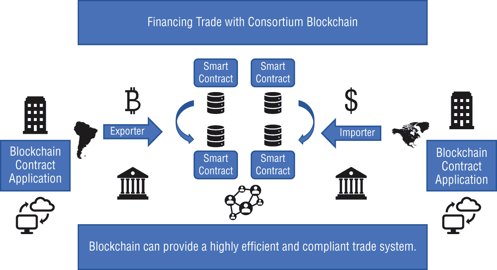

**图 3.1** 区块链贸易应用

在所示场景中，出口商正在将比特币兑换成美元。这种加密货币到法定货币的转换可以通过智能合约高效完成。请注意，智能合约的一部分将是一个支付网关接口，用于将比特币兑换成美元等法定货币。这种情景还将因为区块链的自动化而提高贸易效率，消除了昂贵的手工流程的需求。账簿将是不可变的，并且由于区块链数据结构，还将提供即时的合规性。区块链架构允许将贸易信息作为数字信息发送，该信息是分布式的，而不是复制的。这种分布式账本数据结构为联盟成员提供了透明度、信任和数据安全性。

区块链技术在金融服务行业中取得了成功应用。金融服务公司正在利用这项技术进行记录保管、数字公证服务、支付服务、通过可靠的分布式应用进行银行间转账，以及智能合约。  ### 区块链合规性

由于某些原因，区块链非常适合保持不可变历史，无论是用于确保合规性，如全球数据保护条例（GDPR），还是用于管理信任链。GDPR 是一项合规性要求，要求企业保护欧盟（EU）公民的个人数据和隐私，这些数据是在 EU 成员国内发生的交易中使用的。这项法律也适用于其他国家的欧盟公民客户。例如，可以使用区块链来满足 GDPR 要求。然后，对于诸如“被遗忘的权利”之类的方面，区块链不适合，但可以与离线数据库集成以符合 GDPR 的要求。某些数据可能适合或不适合存储甚至在权限区块链网络中。

有关 GDPR 和其他常见合规性要求的更多信息，请参阅第九章，“区块链治理、风险和合规性（GRC）、隐私和法律问题”。

最后，每个组织可能对采用区块链账本平台都有不同的业务驱动因素。无论这个业务驱动因素是专注于合规性、协作、成本效益、提供数字资产还是提供透明度，作为区块链架构师，我们必须能够将这些驱动因素整合在一起，并将它们与适当的区块链账本技术解决方案用例以及最终的工作设计相匹配。  ## 设计区块链解决方案

我们需要执行的第一个练习是考虑我们是否有一个强有力的区块链用例。这似乎是一个单一的问题步骤。然而，可能会有潜在的客户需要的需求，这些需求可能是区块链的一个良好用例，然后也许一个利益相关者需求的变更实际上可能会移除该需求。

我的主要观点是，确定用例是否有效的这个练习并不总是直接的是或否的答案。然而，通过几个最初的范围界定问题后，很可能很容易确定您是否具有坚实的用例。

一般来说，我们希望了解确定一个可持续的有效用例的支柱是什么。然后我们想了解它将集成到的企业架构。另一个步骤可能是通过检查表或问卷来解决详细信息并分配分数以建立有效性。

以下部分将带您了解设计满足客户需求的解决方案的过程。

### 区块链设计工作流程

拥有工作流程肯定可以提供重要的指导，以帮助促进区块链解决方案的设计。区块链设计可能很复杂，特别是当您的设计需要满足合规性要求或详细的用例目标时。

以下是八步区块链设计工作流程。请注意，可能不需要解决区块链决策评分表（第 5 步）。如果利益相关者已经决定了特定的区块链平台，那么继续设计就是有意义的。

1.  解决利益相关者问题。

1.  解决用例问题。

1.  解决区块链决策树问题。

1.  解决企业架构原则问题。

1.  解决区块链决策评分表问题。

1.  解决区块链设计问题。

1.  解决区块链实施问题。

1.  解决区块链任务问题。

最后，我们希望确定一个适当的平台，该平台能够提供一个可实施到企业架构中的坚实用例。  ### 用例潜力

在考虑区块链是否是一个强大的用例时，我们应该审查该潜在用例的支柱。我们核对的支柱越多，用例就越强大。例如，如果客户不需要分布式和去中心化账本，那么我们的潜在用例就被排除了。

接受区块链技术的几个更有吸引力的领域包括金融、物流和政府部门。这些部门在接受区块链技术以及对该技术的投资方面表现出的速度不会减慢。

不管媒体上讨论了什么，区块链对许多其他组织和行业都是一个关注的焦点。企业区块链社区面临的挑战是，企业技术有时会与加密货币和失败的首次代币发行（ICO）的讨论混为一谈。

#### 利益相关者

当然，利益相关者不仅是销售前和销售后关注的关键领域。在以销售为导向的环境中，一切都是关于向利益相关者提供对技术和区块链解决方案产生的价值的信任保证。应该讨论痛点，但也应该讨论潜在解决方案。还要注意，利益相关者通常会分为三类。

当与技术、业务和法律观众交流时，我们希望清楚地了解并解决他们的关切，并确保我们的回答是恰当的。对于技术观众，我们应该专注于实施、开发和安全性。对于业务观众，重点应放在价值主张、时间至市场（TTM）、总拥有成本（TCO）和投资回报率（ROI）上。对于法律观众，重点是合规性、隐私和公司治理。  #### 强大区块链用例的支柱

*支柱* 是支持考虑区块链使用案例的基本原则或基线。例如，如果指定的数据需求仅由一个组织使用，那么数据需求对区块链技术来说就不是一个强大的使用案例，因为单一组织将是一个很好的使用案例。

但是，一个强有力的应用场景是当您有一个联合体要求，例如，需要一个利用智能合约进行国际贸易的不可变共享分类账。

图 3.2 显示了区块链的四个公认的支柱。您可以看到，需要分类账是明确的，而且分类账确实需要是永久的和分布式的。智能合约需要提供商业价值，而区块链网络需要提供无单点故障的分布式网络。

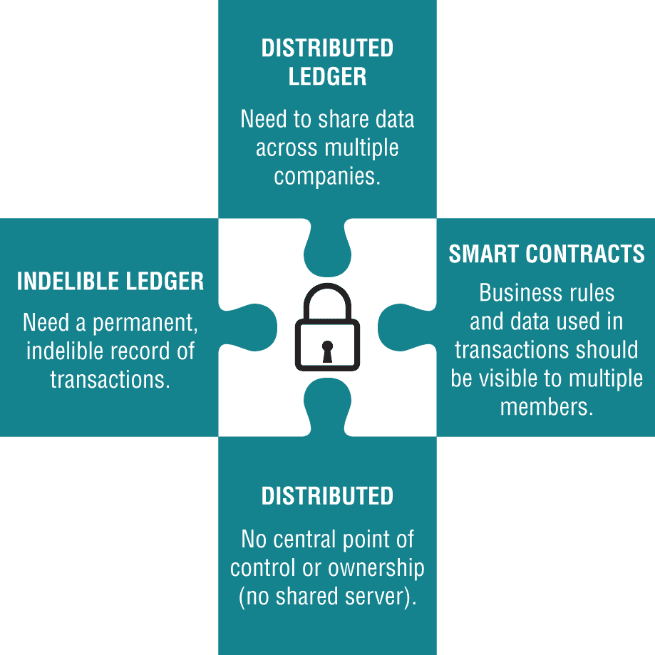

**图 3.2** 强大区块链应用案例的四大支柱

从这四个支柱中，我们可以得出结论，如果我们的使用案例需要一个不可变的记录存储，则可以考虑使用区块链平台。另一方面，如果我们的使用案例不需要不可变的记录存储，则我们可能应该放弃考虑使用区块链。#### 使用案例视角

在考虑企业区块链的使用案例时，必须明白并没有适用于每个使用案例的单一区块链平台。尽管有些区块链供应商有时会吹嘘他们是“跨行业”的，但您必须意识到有重大的技术考虑因素需要区分。事实是，一些使用案例在一个或多个区块链上是可行的。另一方面，如果您的使用案例指向 Ripple，那么它实际上只是那个分布式分类账的一个好使用案例，因为 Ripple 是一个不支持智能合约的金融行业平台。

在考虑区块链时，存在商业需求、技术需求，甚至法律或治理需求。一个利益相关者的视角可能会发生变化，或者新的政府政策，例如《通用数据保护条例》（GDPR），可能会使区块链项目偏离轨道，这不是不可能的。

以下是一个区块链项目和应用案例可能被偏离轨道的两种常见方式：

+   商业需求可能更侧重于总拥有成本（TCO）或投资回报率（ROI），甚至市场上市时间。不能正确展示有利的 TCO 或 ROI 可能会使区块链项目偏离轨道。

+   技术考虑通常更为详细，对技术优点的错误理解可能会使企业区块链项目偏离轨道。与当前企业基础架构的集成也可能对您的潜在用例提出挑战。

法律要求侧重于区块链的合规性、治理、隐私和法律执行方面的问题。已经记录了合规性要求，例如 GDPR，以排除成功的区块链项目的可能性。隐私问题，例如被遗忘权，可能无法通过不可变的解决方案，如区块链来解决。

区块链供应商通常要么专门从事某个行业，比如金融，要么是“跨行业”的，意味着它们可以适用于跨行业的用例。例如，Ripple 显然是一个金融领域的区块链，而 Hyperledger Fabric 是一个跨行业的区块链。由于这种行业关注，组件的命名方式以及它们的实现方式可能会有所不同。例如，在 Corda 中，我们有一个公证人，但在 Hyperledger 中，我们没有将公证人作为一个组件。

大多数区块链组件都是针对特定用例定制的，例如共识算法、分布式分类帐、可插拔组件、加密方法和许可模型。

区块链基于开放源代码方法，这一点在区块链开发行业中得以体现。“部落”支持更加明显，因为开发人员正在处理特定的功能和功能集，这些功能是“请求”或“赞助”的。在某些区块链平台上，功能也可以是可插拔或模块化的。这在一些企业区块链框架中尤其如此，比如 Hyperledger。

可插拔或模块化的功能允许对一些选择进行测试，例如共识算法。在某些方面更灵活的区块链可能表现为更好的解决方案。需要建立用例，并且一旦发生重大变化，无论是业务、法律还是技术驱动，用例都可能受到挑战。#### 区块链决策树

学术界、企业界甚至政府机构都提出了大量的区块链决策树。主要的重点是真正理解您的用例，并尝试确定适当的区块链决策树是否适用于您的销售组织和客户群体。如果您的客户群体由专门的金融公司组成，您可能需要为非金融客户制定单独的决策树甚至清单。

我喜欢解决具有多个选择或决策树方法的决策，以制定平台决策。任何可以在选择区块链平台方面提供明确决策的东西都是极好的。

图 3.3 展示了一个决策树，代表了我的个人方法，这应该能帮助你在私有、混合或公共区块链之间做出决定。有两个最终决定，我们将根据我们的需求做出其中一个。我们的交易是否需要隐私？如果是的话，那么在我们的交易不会公开时选择使用许可区块链。

**图 3.3** 区块链决策树

在为特定的区块链做出决策时，我通常喜欢查看显示特性和功能的图表，以确定客户是否应该使用 Hyperledger Fabric 还是 R3 Corda。两种区块链之间的决定可能仅基于是否具有通道。

图 3.4 展示了区块链决策树的备选示例。

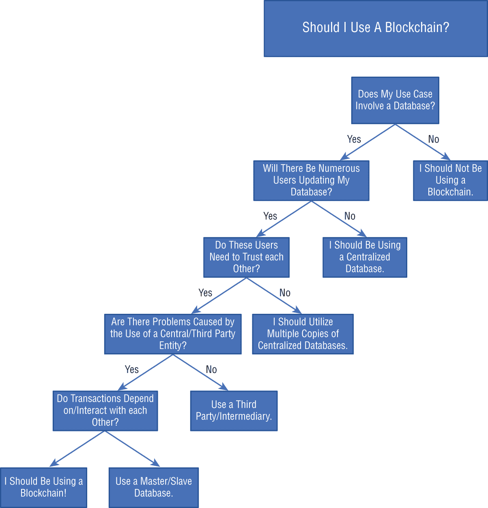

**图 3.4** 备选区块链决策树

决策将基于以下内容进行：

+   数据库

+   信任

+   第三方

+   交易互动

在遵循任何决策树时，你需要考虑它是否适合你的用例。没有一刀切的解决方案。#### 区块链决策清单

在做决定时，有时候一张老式的 Excel 电子表格会很有帮助。在考虑电子表格时，建议建立几个不同版本来满足你的客户群体。实际上，区块链问题没有一刀切的解决方案，你需要有创造力并以适当的方式解决你的受众。

区块链的结构与世界范围网络的传统架构有所不同，后者使用更集中的客户端服务器网络。区块链网络的结构和组件将不同，并且会在区块链解决方案之间有所变化。

在许可分布式区块链架构的情况下，网络内的每个参与者（节点或用户）都维护、批准和更新新条目。系统不仅由独立个体控制，而且由区块链网络中的每个人控制。每个成员都确保所有记录和程序都是有序的，这导致数据的有效性和安全性。

图 3.5 将客户端服务器拓扑与 P2P 拓扑进行了比较。这个 P2P 网络由多个节点（计算机）组成，并且它们正在运行一个将具有区块链协议的虚拟机。

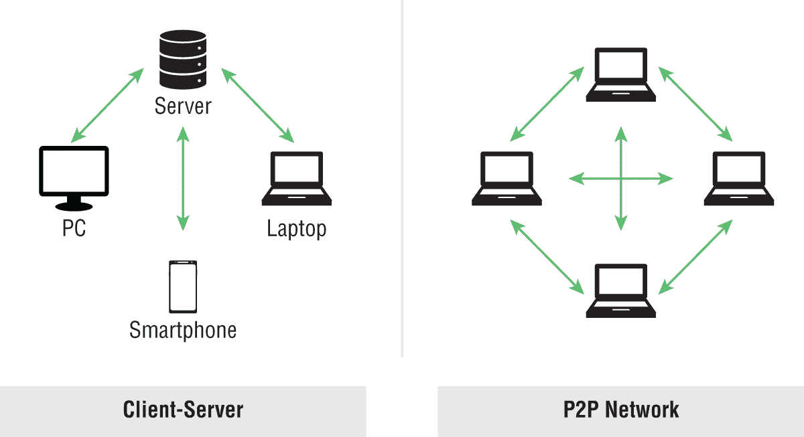

**图 3.5** 比较客户端服务器拓扑和 P2P 拓扑

如需了解有关区块链与传统数据库的更多信息，请参阅第一章，“区块链技术简介”。

### 区块链结构

区块链技术的结构由一个按顺序排列的块列表表示，这些块以特定顺序表示为交易。这些有序列表可以存储为平面文件或以文档数据库的形式使用 NoSQL，如 Google Cloud Platform 中的 Cloud Datastore 或 AWS 中的 DocumentDB。

区块链中使用的两个重要数据结构被称为*指针*和*链表*。本节的主要目的是讨论无权限区块链如何处理数据块并写入区块链。在 Hyperledger Fabric、Corda、以太坊和 Quorum 的各个区块链部分中，我将详细介绍这些区块链账本如何更详细地处理数据结构。因此，将这些示例视为更通用的结构而不是一刀切的结构。

图 3.6 显示了区块链账本中数据结构之间的关系。我们可以看到数据结构中指针和链表之间的直接关系。在考虑区块链解决方案时，我们希望了解这些数据结构在延迟方面是如何处理的，例如。当开发区块链应用程序并连接到区块链网络时，您的区块链开发人员当然会希望了解这一点。

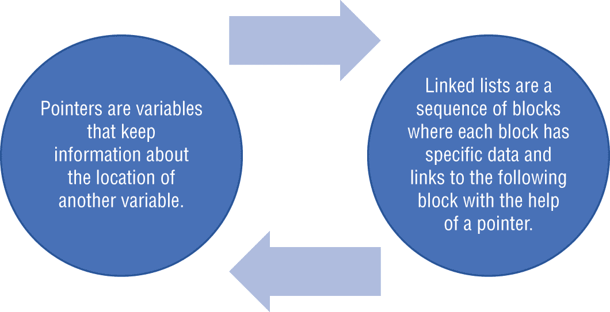

**图 3.6** 区块链数据结构

区块链数据结构是一组有序链接的交易块的反向链接记录。每个块可以通过在块头上使用 SHA256 加密哈希算法创建的哈希来识别。每个块将引用前一个块，该块被标识为父块，在“上一个块哈希”字段中。

以下是围绕区块链账本数据结构的分布式账本技术中常见术语。

*索引*表示区块在区块链账本上的位置，本质上是一个用于定位区块的地址。

+   *哈希*是在区块链账本中提供的数据集中快速分类数据的函数。

+   *随机数*是分配给区块链哈希的一部分的随机数。随机数在增加安全性方面提供了帮助，因为它只能在区块链中使用一次，并且使得重新播放交易变得困难。

+   指针被称为*哈希指针*，用于构建区块链的链表。

+   *记录* 是写入区块链然后提交到账本的区块交易。在大多数企业区块链账本中，这些记录被认为是不可变的。

+   *时间戳* 将保存区块构建的时间方面，以及在某些企业区块链中进行交易的时间。

+   *Merkle 树* 是区块链的哈希列表的摘要，并提供了对区块链的高效验证。

+   哈希列表是区块链中数据块哈希的描述性列表。

图 3.7 显示了构成数据结构的块的链接。我们可以看到有记录。这些记录被写入区块链。指针正在构建链接列表。哈希参与其中；你应该注意到，每个哈希都指向前一个哈希，作为链接的一部分。第一个块不包含指针，因为这是链中的第一个块，被称为*创世块*。

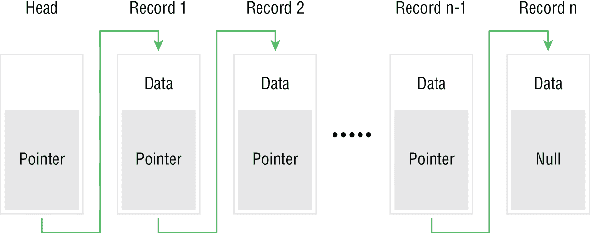

**图 3.7** 区块链数据结构示例

图 3.8 显示了详细的区块链序列图，它是一个记录的连接列表。我们可以看到哈希参与其中，其中每个哈希都指向前一个哈希，作为链接的一部分。Merkle 根是 Merkle 树的顶部部分。叶子是数据块，树中更高的节点是其各自子节点的哈希。

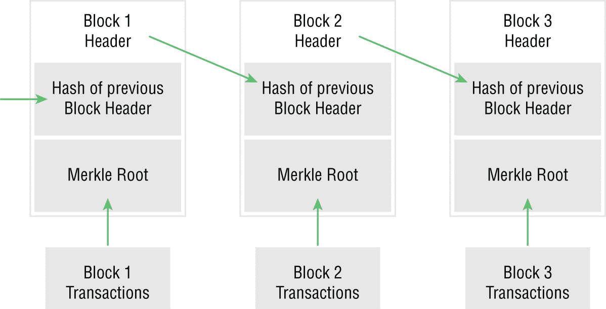

**图 3.8** 区块链序列

当然还有更多关于区块链交易的概念需要理解，但是在本书的目的是提供对这些区块链如何管理交易的洞察。即将到来的部分将提供有关 Hyperledger Fabric 不同之处的洞察，例如。从设计的角度来看，如果一个区块链在验证之前对交易进行排序，这可能会影响每秒交易数（TPS）。

本节涵盖了主要的核心区块链组件。此列表不特定于任何区块链平台，而是更多地是一个供应商中立的组件列表。例如，Hyperledger 和 Ethereum 在某些方面具有非常不同的组件。

*节点* 通常是区块链架构内的虚拟用户组件、应用程序或服务器。

+   *交易* 是区块链网络的最小构建块，它们跟踪任何有价值的东西，可能是货币、商品、文件等。

+   *区块* 是一种被称为区块链账本的数据结构的一部分。区块类似于书中记录的一页。这些区块是有序的，是组成区块链的东西。

*链* 是区块链中的一系列块。链的顺序和特性由区块链协议确定和维护。

+   *矿工* 是在区块链上执行实际工作的特定节点。他们为区块链提供区块验证、排序，甚至记录保存。

+   *共识* 是区块链的方法或策略集。本质上，共识是关于如何决定使用交易更新账本的决定，也确定了区块链的状态。在某些区块链中，共识也被称为共识机制或共识协议。

+   *有效性规则*（验证）说明了用户和交易将如何进行验证。这个验证过程有时可能在交易被排序并写入区块链之前发生，这取决于区块链。

+   *智能合约* 是基本价值，其中代码片段可以自动检查涉及的第三方是否已完全满足合约条款。一旦条款被验证（完成），智能合约代码将记录在区块链账本上，并有效关闭合约。

图 3.9 展示了常见区块链组件的一般布局。所有这些组件共同为适当的用例提供了强大的区块链服务。当涉及具体的组件和特定的区块链时，可能会有其他组件，如成员服务提供商、证书颁发机构、公证人、预言机等。

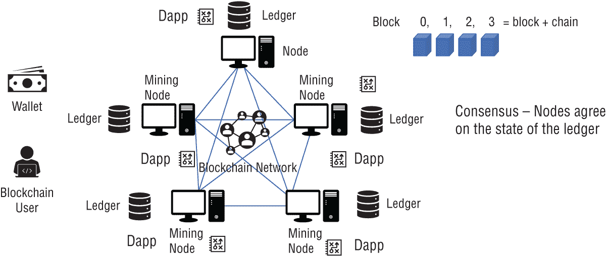

**图 3.9** 区块链组件  ## 企业区块链架构

企业有严格的要求，因此往往选择支持这些要求的应用程序和服务。区块链最初并不是为企业应用程序开发的，而更多地侧重于加密货币交易。当然，随着联盟区块链的发布和发展，如超级账本和 R3 Corda 等，这种情况已经发生了变化，这些区块链拥有活跃的企业用户群。

区块链最初也是作为无许可平台，如比特币开发的。以太坊出现并扩展了区块链，不仅作为加密货币平台，而且作为用例平台或开发平台。以太坊旨在成为无许可区块链，但现在随着通道化和离线化的出现。离线化意味着您的应用程序正在以特定目的延伸到企业区块链之外，例如支付网关。例如，以太坊现在可以被简单有效地扩展到企业用于特定用例。

在为企业设计区块链解决方案时，重要的是要了解企业架构的处理方式。考虑您当前的企业架构最佳实践，并参考任何企业架构框架。

在一些被广泛接受的企业架构框架中，有四个专注于架构的支柱或领域。企业架构框架领域的目的是指导您的组织的业务、信息、流程和技术决策，以便使组织能够执行其业务战略并满足客户的要求。

TOGAF 是最广泛使用的普通企业框架之一。这些框架包括 ISO、DoDAF 和 UPDM。我将在本书中重点介绍 TOGAF 企业领域，因为它是最广泛接受的，实际上也可以与区块链相关联。

### TOGAF 领域

在深入研究区块链架构之前，建立企业架构的基线是很有意义的。最好的起点是审查 TOGAF 标准。企业架构（EA）的基线对组织至关重要。没有基线，基本上业务成果将无法实现目标，甚至不会顺利进行。

TOGAF 是由 Open Group 开发的 Open Group 架构框架的一个众所周知的缩写。Open Group 是一个非营利性技术行业联盟，持续更新和重申 TOGAF 企业架构领域。TOGAF 标准是企业架构框架的事实标准。TOGAF 提供了启用企业架构的接受、生产、使用和维护的具体方法、流程和标准。

TOGAF 的第一个版本于 1995 年发布，基于美国国防部（DoD）开发的信息管理技术架构框架（TAFIM）规范。

DoD 授权 Open Group 基于 TAFIM 创建 TOGAF，并自那时以来 TOGAF 一直在不断发展。

实质上，如果没有框架，将企业战略与在线项目相连接将是具有挑战性的。由于缺乏该领域的知识和专业知识，区块链项目更加复杂。

TOGAF 企业架构的四个领域如下：

+   **业务架构领域** 说明了企业的组织结构。该领域还提供了关于交付业务愿景所需的功能能力的洞察。

+   **应用架构领域** 提供了对企业应用程序及其与企业核心业务流程的关系的洞察。

+   **数据架构领域** 提供了对组织数据资产结构以及可用的数据管理资源的洞察。

+   **技术架构领域** 说明了实际实施企业应用程序所需的需求。### 企业架构的“什么，谁和如何”

在构建解决方案时，建立企业架构的“什么，谁和如何”是很重要的。

+   组织的业务愿景、战略和目标是指导创建区块链服务的？

+   谁负责执行定义的区块链服务？

+   任何先前定义的业务服务或功能是如何实现的区块链服务？

简单来说，在你的区块链设计中，了解你客户的历史和兴趣可能很重要。### 原则

原则是组织内部为完成其任务而使用的规则和指南。

图 3.10 强调了可用于区块链周围的常见企业架构原则。当与客户讨论企业架构（EA）原则时，您可能希望与客户一起用白板演示它们。这些原则可能对与利益相关者的讨论有价值，并可能用于应用程序设计。定义的原则应该指导应用程序治理并提供简明的架构审查。也许它们甚至可以提高您的企业区块链采用性能。

简言之，你应该将区块链应用视为一个企业应用。这意味着确定在你的组织中哪种企业架构框架是合理的，并应用与企业架构相关的基本原则。区块链应用可能会被部署在整个企业范围内，甚至在初始部署时可能不会被整合到整个企业范围内。提前解决企业关注点肯定会增强利益相关者对区块链解决方案的接受、采用和交付。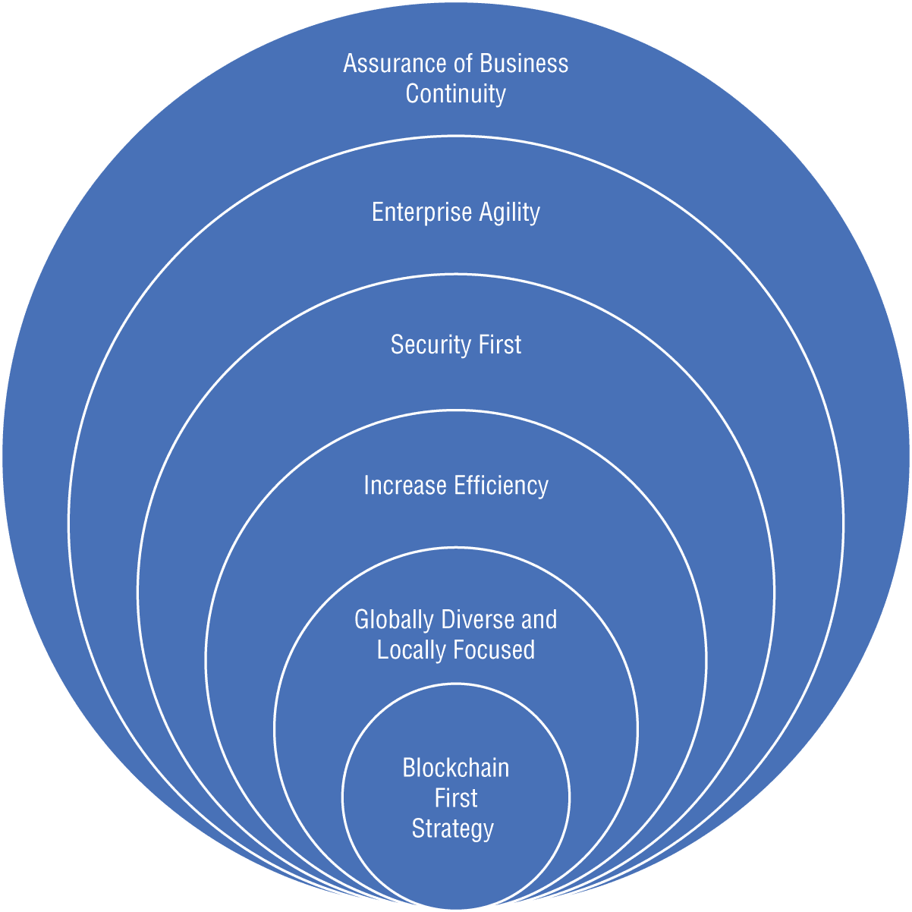

**图 3.10** 企业架构原则

### 区块链设计

在设计任何企业区块链应用时，至关重要的是建立正在评估或拟议的区块链的要求、基线、特性、功能和可扩展性。

从架构的角度来看，您希望考虑一些常见的无许可区块链特性，并确定在评估区块链服务时哪些特性对您的企业很重要。

+   区块链通常是去中心化的，因此理论上没有集中式的故障点。通过区块链传递的所有信息对每个节点都是可见的，由于不可变性，信息无法从区块链中删除。

+   区块链在整体上由点对点网络和分布式的点对点资源定义。区块链的真实形式并不是中央集权的数据库。

+   区块链由于内置的加密安全性而本质上是安全的，并且还可以增强隐私和安全性。它们甚至可以增强组织的合规性要求。

+   通过向网络添加节点，区块链网络在水平方向上扩展得相当好，但由于诸如虚拟机引起的延迟等原因，区块链在垂直方向上的扩展效果不佳。

+   交易处理取决于共识算法，如工作量证明、权益证明或您可能选择的其他选项。共识的选择和所使用的区块链平台对区块链服务的结果可能会产生重大影响。

传统上，企业一直专注于资源的集中控制，特别是在区块链方面，使用许可区块链是有道理的，因为企业可以从区块链中受益。  ### 企业区块链采用挑战

如前所述，定义区块链的方法有三种。应根据你所面向的受众来定义区块链，这种简单方法可以促进区块链提案的接受和采纳。

在利益相关者会议、电话或电子邮件中，记住受众以及如何具体地应对手头的受众。如果你在与技术工程组交谈，那么就要从技术上讲，比如讨论区块链的“速度和数据流”。如果你在与公司法律顾问交谈，那么在讨论应用程序时要使用法律术语。

一些企业在采用区块链时面临的挑战是针对你所面向的受众进行的。

+   *业务挑战*可能包括业务成本、资金需求、公司治理、执行管理、利益相关者的认可以及公司文化。合理地期望公司对竞争如何利用区块链做出反应。

+   *法律挑战*可能会层出不穷，特别是在金融、保险和物流等行业，这些行业可能无法很好地适应金融服务的“去中介化”。这意味着由于 PCI、SOX 或 GDPR 等合规要求，信任或认可可能无法完全实现。在 GDPR 的情况下，使用真正的区块链解决方案可能会面临挑战，因为区块链节点可能分布在监管机构管辖范围之外，或者不是集中管理的。

+   *技术挑战*可能涉及性能，例如每秒交易数（TPS）、与传统应用程序的集成、中间件、应用程序利益相关者的认可以及解决围绕隐私和安全性的技术问题。

请注意，这不是围绕企业区块链的挑战的包罗万象的清单。  ### 风险管理

如果你在政府整合商工作，你可能熟悉 NIST 800-37 中规定的风险管理框架指南。风险管理框架提供了一个至关重要的连接器，将关键的安全和风险管理活动整合到系统开发生命周期中。

这份文档也可以被非政府组织用来帮助他们建立基于风险的安全控制选择和规范考虑。

与管理组织风险相关的一些活动对于有效的信息安全程序至关重要。真正有用的是，它们可以应用于系统开发生命周期和联邦企业架构的详细上下文中的新系统和传统系统。这同样适用于区块链，尽管目前尚无 NIST 文档记录的联邦政府区块链的最佳实践。

以下是联邦整合商可能熟悉的风险管理活动：

1.  对系统进行分类。

1.  选择控制。

1.  实施控制。

1.  评估控制。

1.  授权系统。

1.  监控控制。

有关 NIST 框架的更多信息，请参阅第九章。### 区块链作为锤子

在 LinkedIn、Medium 或 Quora 上阅读帖子的人可能会认为区块链可以解决人类已知的每一个问题。一些供应商、博客作者和顾问不断地声称，他们的区块链解决方案一直在解决史诗般的全球问题。

说实话，区块链技术并不是万能药，在现实中，似乎区块链技术是一个“在沙盒里寻找钉子的锤子”。区块链必须被视为一个有针对性的解决方案，并且必须像激光一样有效地聚焦。

激光是直接应用光脉冲照准一个专业聚焦区域的有限工具。我经常遇到的一个挑战是与客户和学生讨论他们的使用情况可能是一个好的区块链使用情况或不是一个好的区块链使用情况。作为一名区块链专家，你必须能够处理提议使用区块链不合适的情况，无论是因为客户真正需要一个集中数据库的功能，还是因为没有贸易联盟对区块链平台感兴趣。

教训应该是，区块链并不是万能药，我们必须像激光一样有效地使用区块链解决方案，而不是像手持锤子的小工寻找钉子。## 企业区块链设计原则

在设计企业区块链服务时，有一些关键的设计原则、方法和甚至特性要解决。

您可以确实使用在您组织中有效的软件设计方法，如 ISO 或 Agile，来帮助促进已知的企业实践。现实情况是，区块链的设计、开发和部署还处于初级阶段。

从婴儿的角度来看，我把区块链的部署视为部署云应用程序。在大多数情况下，您可以期望提供相同级别的资源、要求和专业知识。部署像在 AWS 上的数据库这样的云服务与在 GCP 上部署 SQL 数据库相似但又不同。例如，SQL 代码可能会导入并采用相同的结构；然而，AWS 和 GCP 对 SQL 的不同版本的支持也不同。

简而言之，设计是将区块链应用程序的要求整合到一个满足这些要求的平台上。这个平台可以是您企业的本地设施，也可以是云提供商的远程数据中心。

在考虑为您的企业设计区块链架构时，您需要了解这里列出的一些特性、优势，甚至是权衡：

+   信任

+   一致性

+   可用性

+   安全性和隐私

+   性能

+   合规性

### 企业区块链设计要求

在第一章中，我们简要回顾了区块链设计的一些方面。本节建立在第一章的基础上，并提供了对制定适当设计要求的更多深入见解。设计要求在某些行业中可能相当基础，但在其他行业中可能完全不同。例如，有些公司可能会将完整性列在要求列表中比一致性更高。了解您的客户设计以及企业架构原则、用例和痛点应有助于形成坚实的区块链架构。

#### 完整性（不可变性）设计

完整性对不同组织可能意味着不同的事情，所以让我们澄清一下，完整性也可以推断出“信任”，因为区块链分类账的不可变属性。在区块链世界中，不可变性实际上意味着一旦某些内容被写入区块链，它就不能被任何人或任何事物修改、删除或篡改。另一方面，我们知道数据库是集中的，而区块链是一个去中心化的真实代理。

在考虑区块链技术时，重要的是要意识到区块链被开发的主要原因是围绕着对传统机构（如银行和政府机构）的不信任。

在设计区块链时，考虑用户和企业的要求至关重要。保持用户信任对设计和您客户的业务至关重要。从金融业到国防工业的各种行业的组织都依赖于信任。#### 一致性设计

在考虑企业用户体验时，重要的是要理解最终用户如何访问区块链应用程序。你可能可以通过了解企业其他部门如何处理遗留应用程序的企业应用程序开发来处理这个问题。为区块链应用程序的用户提供稳固的工作流程肯定会有助于这些区块链服务的采用。

一致性不仅应该集中在应用程序开发上，还应该集中在用户体验（UE）上。区块链应用程序用户应该至少了解解决方案的高层次运行方式，这更多是一个过程层次而不是一个事务层次。提供用户愿意参与的体验。在第十章，“区块链开发与编程”中，我们讨论了可用性、一致性和信任等方面，这些对用户的应用体验至关重要。####为可用性设计

企业需要一定程度的韧性，区块链网络应该假定故障难免会发生。企业必须准备在这些情况下保持区块链网络运行。

高可用性（韧性）要求可能会根据企业垂直行业或业务线、区块链应用程序要求、项目资金和基于企业需求的许多其他因素而变化。

企业应该像传统企业应用处理冗余一样对待区块链的可用性。它们通常利用服务复制和冗余来确保自己保持可用。

企业区块链需要部署冗余的对等节点和集群化的排序服务，并且还需要复制其他工作的区块链网络组件，以确保无缝地工作，不会对区块链应用程序的可用性造成任何妨碍。####为安全性和隐私性设计

隐私和安全问题对企业架构师来说并不是什么新鲜事。在设计你的区块链应用程序时，建议你在与连接到公共网络或甚至你可能无法控制的私有网络相关的任何事物时小心处理隐私和安全问题。

企业级区块链的需求甚至比早期更大，因为企业通常将其区块链部署在远离公共网络的私有实例中。然而，现在提供了更多选择，比如通道、离线、预言机以及区块链带来的新可能性，因此公司正确地确保安全性和隐私性至关重要。

为什么呢？不管是私有网络还是公共网络，区块链都连接到网络。我熟悉的每个网络几乎都连接到互联网。唯一的例外是当网络不连接到互联网时，比如政府的机密或最高机密网络的情况。

将网络连接到互联网将使您的网络暴露于可能的攻击，无论您的网络安全状况是否最新。

大多数公司都不应希望像艾奎法斯那样的影响广泛的漏洞发生在其企业网络或区块链上。

艾奎法斯黑客事件暴露了漏洞，也暴露了公司对公司数据常规上的责任缺失，而这实际上是个人数据。这一点尤为重要，因为公司的信心、信任和声誉实质上可能会因为缺乏责任而受到毁灭性的打击。

可以说，与区块链服务的数据暴露应被视为与任何基于互联网的应用程序一样具有风险。也就是说，区块链运行在服务器上——具体来说，是包含开源软件的 Linux 服务器，这些服务器与推动互联网的相同服务器相同。任何对 Linux 或 Docker 容器有一定了解的人都具备寻找漏洞的基础知识。

数字身份是区块链中的一个概念，可以帮助解决数据隐私的重要问题。使用特定的数字身份可以促进区块链上企业级保护的发展。

区块链还可以通过智能合约以另一种重要的方式提供隐私而不是保密。简单来说，智能合约是一种逻辑，通过编程确保如果请求满足某些特定条件，那么特定的事情就会发生，例如区块链交易、触发消息事件，或者由于签署合同而发送资金。

由于这些是大多数企业使用的权限区块链，所有成员必须是在进入企业成员生态系统之前经过仔细审查的已知实体。

权限区块链将对谁可以实际参与区块链设定特定限制。新参与者的访问在特定情况下通过满足特定条件进行处理，例如通过会员证书或交易认证进行配置，或者通过策略进行启用。

以下是企业区块链中用于授予区块链网络成员资格的常见方案：

+   通过目录服务（如 LDAP 或 AD（目录服务））注册的公司员工或合作伙伴。

+   由成员公司直接出资（会费）资助的参与成员模式的一系列公司。例如，共享保险精算数据的保险联盟。

+   消费者出于注册、就业或成为企业消费者等原因被授予访问权限。

+   作为政府实体、行业协会或其他监管机构的一部分的监管机构，需要在 SOX、GDPR、AML 或 KYC 等合规领域提供监督。

在本书的过程中，我将深入探讨与企业区块链相关的隐私和安全问题。安全相关的示例以及设计在第十一章，“区块链安全和威胁景观”中进行了介绍。 #### 性能设计

区块链性能显然是一个备受关注的领域，人们就是否区块链能够像传统的集中式数据库一样扩展到可达到的水平进行了大量辩论。现实情况是，区块链从未被构建或者甚至考虑过用于高性能。区块链是为了安全性、隐私性和不可变性而构建的，而且是在一个既分散又分布式的网络上。

区块链本质上是缓慢的，不应该与 Visa、SWIFT 或 PayPal 等平台进行比较。正在开发的区块链将更接近于 Visa，但实际上，它们不会成为区块链，而更像是 Hashgraph。

然而，目前在正确范围内考虑的用例中，与 Visa 竞争进行更多交易的用例实际上并不存在。

权限区块链当然可以比无权限区块链扩展更大，因为节点数量受到控制（有权限的），而且网络节点分布也受到控制。

将集中式应用程序与去中心化应用程序进行比较并不完全是在比较“一模一样的事物”。由于其架构明显不同，期望区块链在 TPS 上与传统应用程序竞争是不公平的。 #### 信任设计

拥有区块链解决方案并不意味着人们会立即信任系统、数据或流程。设计区块链时，应考虑用户群体，并理解信任不仅仅是一个词；它是一种感觉和一种经历。

作为一名架构师和开发人员，我通常希望验证流程是否按计划正常工作，以及数据是否健康。健康意味着数据没有被损害，数据是安全的，并且如果需要，交易是保密的。 #### 合规设计

从隐私合规的角度来看，区块链是否一般可访问或仅对属于封闭群体的用户可访问，这非常重要。

例如，隐私问题可能会影响评估数据是否转移到不确保充分保护的国家。例如，在欧洲联盟，有一个相当新的标准需要满足，称为《通用数据保护条例》（GDPR）。

这一合规结构的奇迹是一个明确定义了从居住在欧洲联盟（EU）的个人那里收集和处理个人信息的准则的法律框架。

这些欧盟法规适用于每家企业，无论其网站设立在何处。所有吸引欧洲访客的网站都必须应用该法规，没有例外，即使它们并没有专门向欧盟居民推销商品或服务。

有关 GDPR 的更多信息，请参阅`[`www.bloomberg.com/news/articles/2018-03-22/is-your-blockchain-business-doomed`](https://www.bloomberg.com/news/articles/2018-03-22/is-your-blockchain-business-doomed)`。

此外，有可能区块链网络的每个参与方仅对部分存储在区块链上的信息具有特定访问权限，而非链下的信息。每个参与方都拥有自己的完整区块链副本，通过加密有效限制。根据区块链的部署方式，它可能符合或不符合企业需要考虑的合规要求。节点位置设计、网络基础设施和企业集成都需要考虑。在第九章中，我将详细讨论与区块链相关的 GDPR 问题。### 其他关注点—部署模型

区块链可以在企业架构中现场托管，也可以在共享模型中，例如云计算区块链即服务（BaaS）模型中托管，也可以由 VAR 等托管的托管服务中管理。

BaaS 是一种较新的解决方案，开始为企业提供部署和测试区块链的选择，并可用于概念验证。

如果您在自己的数据中心部署区块链，那么您已经对该数据中心空间、维护和需要考虑的程序的成本有了一个很好的概念。大多数区块链部署在基于 Linux 的服务器和虚拟机的各种版本上。Linux 是最知名和最常用的开源操作系统。

在企业中部署 Linux 方面，可获得的专业知识不少。挑战将在部署您的区块链和连接您的区块链网络的客户端应用程序上。专业知识短缺的一个领域通常是中间件，它充当从遗留应用程序到区块链应用程序的翻译器。在本书的过程中，我将详细讨论这一点，围绕企业内部和云端都规划和部署区块链应用程序。

本节介绍 Hyperledger Fabric，这是一种具有可插拔框架的权限跨行业区块链。涵盖以下主题：

+   Hyperledger Fabric 的卖点

+   Hyperledger Fabric 设计考虑因素

+   Hyperledger Fabric 设计示例架构

除以太坊外，Hyperledger Fabric 是迄今为止最广为人知、讨论和接受的区块链平台。由于其广泛接受度，无论您的项目是什么，都很可能很容易找到有关 Hyperledger Fabric 的信息。

这一全球合作项目由 Linux Foundation 主办，包括航空航天、金融和银行业、医疗保健、物联网、供应链、制造业和技术领域的全球领导者。目前拥有超过 222 名成员，其中许多成员实际上是彼此的竞争对手。

那么，Hyperledger Fabric 到底做得好在哪里，为什么会得到如此广泛的认可？Hyperledger 从成立之初就专注于企业。财团成员在其区块链框架的开发、规划和实施中扮演着关键的角色。

### Hyperledger Fabric 的主要卖点

Hyperledger Fabric 有几个卖点，通常根据您的设计来决定，这意味着您可以根据需要选择实现它。

+   模块化可能是 Hyperledger Fabric 的主要卖点。

+   Hyperledger Fabric 在跨行业的广泛接受度

+   通过实现分区区块链网络并创建单独的分类账实现隐私

+   由于可以根据需求扩展，因此具有可伸缩性和性能### Hyperledger Fabric 的区块链设计考虑

Hyperledger Fabric 旨在开发具有模块化架构的解决方案。Hyperledger 允许组件基本上是即插即用的。

Hyperledger Fabric 是一个私有的、权限的区块链系统，因此需要进行不同的设计。我们需要考虑额外的节点、策略、证书颁发机构（CA）和成员服务提供商（MSP）。

Hyperledger Fabric 也提供了一种通过使用通道来实现隐私的独特方法。通道允许一组参与者创建一个单独的交易分类账，并保持隐私。Hyperledger Fabric 目前支持两种不同用例的数据库选项。当前的两种数据库选项是 CouchDB 和 LevelDB，用于存储区块链的世界状态。### Hyperledger Fabric 的优势

由于 Hyperledger Fabric 是一个权限区块链，因此与其他区块链系统相比具有一些重大优势。

+   **权限成员** 对区块链进行权限管理显然提供了安全性、隐私性甚至性能的优势。像 Fabric 这样的权限区块链在适当设计时还可以在合规性要求方面提供好处。

+   **性能和信任** Fabric 是一个模块化平台，可以在交易处理数据需求方面为企业提供更大的灵活性。账本数据得到清晰维护，可以轻松地查询以满足合规性要求、数据分析甚至安全性分析。

+   **历史查询** 账本已经设计用于交易查询，选择数据库可以实现更深入的洞察。通过 CouchDB，您可以运行复杂的查询并深入了解您的数据。

+   **模块化** 超级账本提供了选项，使您的企业区块链尽可能接近即插即用模型。您可以选择 CA、HSM、共识方法和 API。

+   **硬件安全模块（HSM）** 通过实施不同的密钥管理选项，超级账本 Fabric 实现了身份和访问管理的灵活性。选择您的 HSM 可以显著增强企业的安全性立场。

下面是超级账本 Fabric 的关键特性，它实现了作为可定制企业区块链的承诺。了解这些术语很重要，因为设计示例架构将引用它们。

+   **资产** 是实际在区块链上交易的有价值的东西。

+   **链码** 是 IBM 为智能合约创造的另一个名字。

+   **分类账特性** 通过通道提供了分类账查询的灵活性和不同的分类账隐私措施。

+   **通道** 允许两方之间的私密交易，并通过通道启用单独的通道特定分类账。

+   **安全性和成员服务** 提供了对区块链的访问和完整的审计能力。

+   **共识** 选择可供实施，这允许在达成一致的过程中采用不同的性能、安全性和隐私措施。

#### 参考架构

超级账本 Fabric 拥有一个良好的参考架构。它清晰地定义了设计的四个特定领域：身份、分类账和交易、智能合约和 API，以及事件和 SDK。

这种架构是模块化的，允许区块链设计者确定设计中的特定模块，如共识、证书管理，甚至分类账的数据库选项。

图 3.11 参考了超级账本参考架构。

在超级账本参考架构中，您可以看到有不同的模块。当前的架构将链码的信任假设分开。这意味着您的策略创建能力实际上取决于您如何决定排序服务处理区块链交易。排序节点通常被称为*排序服务节点*（OSN）。超级账本 Fabric 为基于部署的对等节点类型提供了不同的网络角色。共识的模块化也是显而易见的，并允许为您的企业提供可插拔的共识实现。重要的是要注意，在部署排序服务后，您不能更改共识。

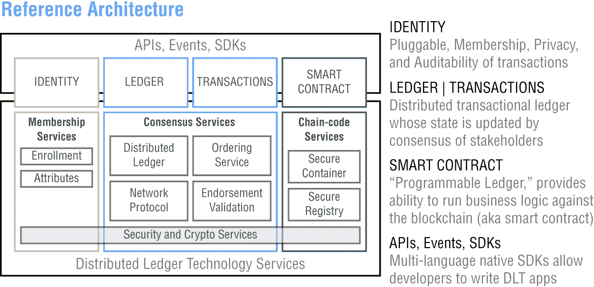

**图 3.11** 超级账本参考架构  #### 组织

从设计角度来看，超级账本 Fabric 需要为组织进行规划。一个 *组织* 是一个由成员驱动的安全域，被视为身份和凭证的单元。

一个组织管理一个或多个网络对等方，并依赖成员服务提供商为对等方和智能合约访问权限的客户发放身份和证书。还有一个被引用为排序服务的节点，它是 Fabric 网络的基石，并通常被分配有自己的组织。

图 3.12 展示了一个高级别的组织概述。Org1 是出口商，Org2 是进口商。两个组织同意了条款，并且 Org1 已将服装发送到了美国。作为进口过程的一部分，必须记录报关手续。交易被申报和授权后，交易将被记录在区块链上。

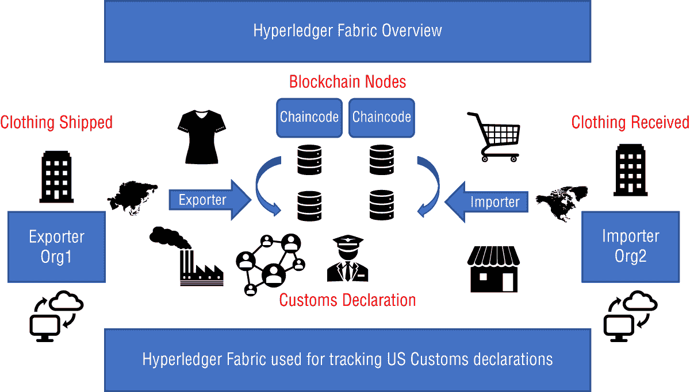

**图 3.12** 超级账本 Fabric 区块链中的组织

在超级账本 Fabric 中，网络节点需要有效的证书才能与网络上的其他节点通信。网络参与者使用一个客户端应用程序，通过网络节点连接到网络。超级账本是一个有权限的区块链，参与者的身份与节点的身份不同。当参与者执行或调用交易时，他们的证书用于对该交易进行签名。

在超级账本中，有节点的概念，所有节点**并不**相等。有三种不同类型的节点。

+   *客户端节点*将发起区块链交易，并将代表最终用户通过交易过程。

+   *对等节点*是实际提交交易并在分类账上保持数据同步的节点。对等节点是维护状态和共享分类账的节点。节点由 MSP 颁发的证书进行身份验证。在超级账本 Fabric 中，可以部署三种特定类型的对等节点。部署的对等节点类型取决于分配的角色，如对等节点、背书对等节点或排序对等节点。

+   *排序节点*是通信骨干，并负责分发交易。  #### 隐私

为了保护隐私，在区块链网络的两个成员之间可以使用一个“通道”。通道是一个私有的区块链覆盖层，允许数据隔离和保密。请注意，通道特定的分类账仅在特定通道的节点之间共享。

图 3.13 描述了通道将实现的一个简单示例。区块链网络中有三个参与者。参与者 A 和 C 创建了一个通道，以确保与区块链其余部分的隐私隔离，排除了参与者 B。这种直接方法消除了交易从区块链网络的其余部分传播，这就是超级账本 Fabric 中处理隐私的方式。

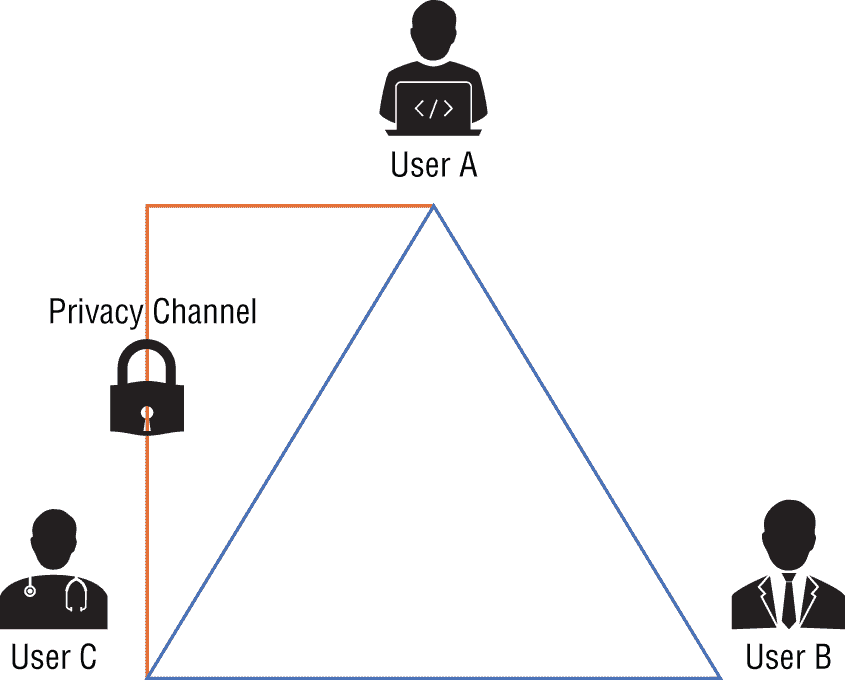

**图 3.13** Hyperledger Fabric 中的通道

Hyperledger Fabric 框架是用 Go 实现的。Hyperledger 框架专门用于启用具有不同权限、用例和集成能力的 Hyperledger 联盟区块链。Fabric 使用称为 *chaincode* 的智能合约。该 chaincode 安装在将要操作 chaincode 的任何节点上。这些区块链网络的对等方在受限制的 Docker 容器化环境中运行。

图 3.14 描述了具有客户端、对等方、MSP 和逻辑组织分组的典型 Hyperledger Fabric 对等方网络结构。最终用户将调用区块链应用程序，该应用程序反过来“调用” API 调用，这将调用智能合约。

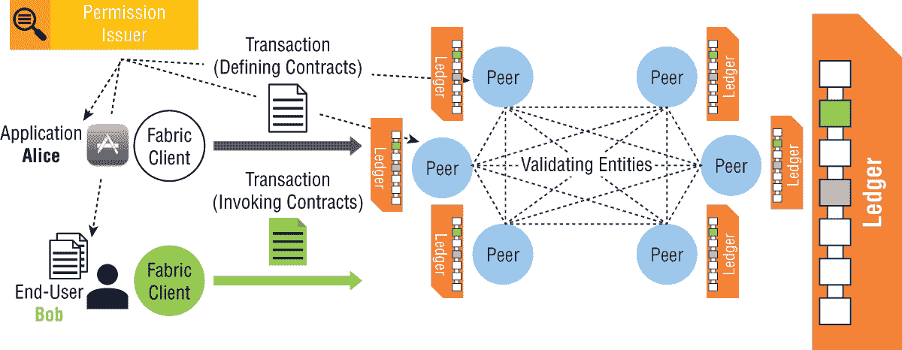

**图 3.14** Hyperledger 架构结构  #### 分类帐数据库选项

Fabric 分类帐的结构有两个部分，这与其他区块链非常不同。

+   状态数据是资产当前状态的表示。资产状态数据可以随着数据状态的变化而变化。

+   交易日志记录所有交易（按接收顺序），这些交易修改状态数据，一旦数据被写入，就是不可变的，不能修改。

在选择 Hyperledger Fabric 的分类帐数据库时，你有两个选择：LevelDB 或 CouchDB。

选择一种数据库而不是另一种的主要原因是，如果您的需求需要对二进制数据进行复杂查询。Hyperledger Fabric 中的分类帐系统使用 LevelDB。根据定义，LevelDB 允许并发写入者通过提供内部同步安全地将数据插入数据库。状态数据库选项包括 LevelDB 和 CouchDB。

表 3.1 显示了 Hyperledger Fabric 分类帐的选项。状态数据库有两种选择。但是，LevelDB 仅适用于交易日志。交易日志也是不可变的，并且只允许创建和读取操作。

**表 3.1**: Hyperledger Fabric 分类帐选项

|  | 交易日志 | 状态数据（WORLD） |
| --- | --- | --- |
| **类型** | 不可变 | 可变 |
| **操作** | 创建、读取 | 创建、读取、更新、删除 |
| **数据中心** | LevelDB | LevelDB/CouchDB |
| **态度** | 嵌入在对等方中 | 键值对（JSON、二进制） |

| **查询** | 简单 | 复杂 |  ### Hyperledger Fabric 的设计示例架构

以下示例架构旨在提供关于 Hyperledger Fabric 客户请求场景的见解，预售顾问可能会遇到。根据要求，可能会有许多不同的解决方案可以进行范围和设计。

#### 医疗保健隐私重点关注的区块链场景

一个客户已经要求你的 IT 整合公司为他们的客户群设计一个区块链网络，这些客户是医疗保健客户。 医疗保健隐私当然是一个重要的要求。 客户还声明客户主要位于美国，并且必须遵守 1996 年《健康保险可移植性和责任法案》（HIPPA）的合规要求。 HIPPA 由第 104 届美国国会制定，并于 1996 年由比尔·克林顿总统签署。 HIPPA 有安全条款和数据隐私要求，以确保患者的医疗信息安全。 该法案包含五个标题，涵盖了立法的不同方面。

由于客户指定了以 HIPPA 和健康数据安全为重点的合规要求，区块链技术在这里可以产生重大影响，因为我们可以使用证书和加密密钥来保护数据。 从会话的角度来看，我们可以使用通道，Hyperledger Fabric 支持得非常好。

图 3.15 中所示的架构允许移动用户访问由云提供商托管的区块链服务。 正在使用的应用程序旨在为移动用户提供其健康需求的更新。

你可以看到我们正在使用云计算，而这个区块链云正在为移动用户提供应用程序服务。 提供了通道，并且用户正在使用自己的通道。 Fabric 使用公钥基础设施（PKI）生成与组织相关联的加密证书。 通道访问仅允许权限用户，这正是隐私所需的。 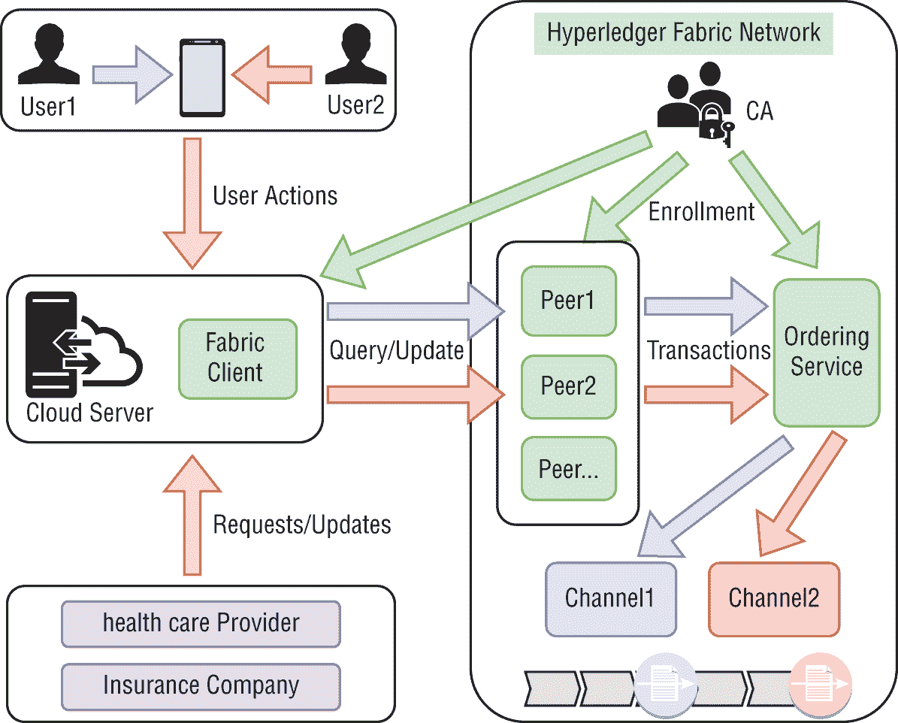

**图 3.15** 健康保健区块链与 Hyperledger Fabric

#### 用于国际贸易场景的财团区块链

一个客户已经要求你的 IT 整合公司为他们的物流应用程序设计一个区块链网络。 客户已经说明这个区块链将是一个财团区块链，并且还将涉及一些合规要求。 没有加密货币要求，客户说明这是一个国际区块链。

图 3.16 提出了一个处理国际贸易的 Hyperledger Fabric 网络。 区块链网络涉及各方。 区块链账本将任何非金融活动写入区块链。 网络中有几个对等节点以及一个专用的 MSP、OSN 和 CA。 在大多数情况下，此解决方案将适用，其中每秒的交易量较低，例如 2,000 TPS 或更少。

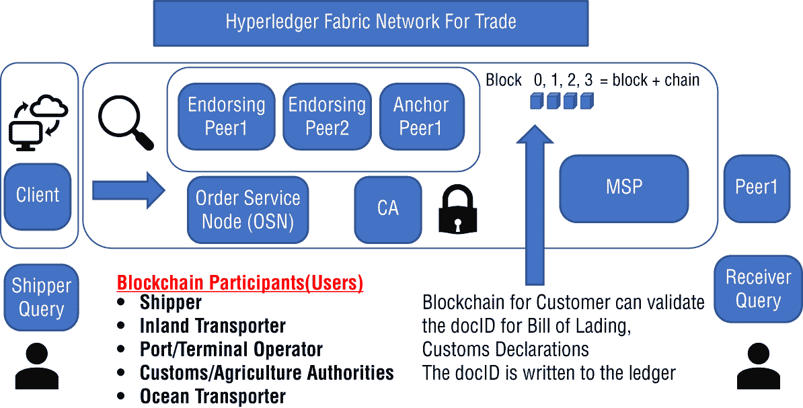

**图 3.16** Hyperledger Fabric 用于贸易的网络

与其他许可区块链相比，Hyperledger Fabric 是一个灵活、安全且被广泛利用的跨行业区块链。与其他许可区块链相比，开发者社区更加健全。  ## R3 Corda

本节介绍了 R3 Corda，这是一个许可的跨行业区块链，具有可插拔框架。 R3 Corda 是一个面向特定行业的许可区块链。它在金融和保险领域展现出真正的优势。 Corda 是一家企业级软件公司，联盟有 200 多个成员。

涵盖以下主题：

+   R3 Corda 的主要卖点

+   R3 Corda 的设计考虑

+   R3 Corda 的设计示例架构

### R3 Corda 的主要卖点

与 Hyperledger Fabric 相比，R3 Corda 的主要卖点有些专注。这种专注主要是因为一个明确定义的、由金融服务机构聚焦并创建的分布式分类帐。 Corda 确实得到了 R3 联盟的大力支持，并且是企业服务的可靠选择。

+   Corda 是专门用于金融领域的分布式分类帐。

+   Corda 在保险和其他行业中有着日益扩大的用例。

+   Corda 具有一项独特的功能，即在智能合约中直接支持法律文本。

+   由于 JVM 的灵活性，企业集成非常容易。

+   由于其企业结构和资金机制，R3 Corda 在企业支持方面无与伦比。

R3 Corda 是一个不断发展的分类帐平台，为其用户群提供明确的价值。 R3 Corda 利用行业标准协议提供了被认为是在 JVM 上操作的无缝集成，同时保持了一个强大的工具集。 Corda 还为金融客户提供了定制化的体验，用于利率互换、标准初始保证金模型计算、银行间结算甚至再保险。  ### R3 Corda 的设计考虑

最初，R3 Corda 被设计为解决金融领域区块链解决方案的隐私问题。R3 的目标市场是金融行业，特别是批发金融市场，因此我们将讨论这一点。

Corda 具有高度可扩展性，在部署中可以支持数十亿个交易。它安全是因为其安全结构，由于其专业开发的代码库，它非常稳定。

#### Corda 优势

Corda 的主要优势在于提高了减少手动任务的效率，以及引入法律文本的能力。正如人们所预期的那样，Corda 中的智能合约是详细的协议，其具体执行通过计算机代码自动化。代码根据接收到的输入工作。其他企业区块链所没有的一个显著特点是合同法是如何编码（附加）到智能合约中的，这可能是可法律执行的。

使用 Corda 的智能合约的一个主要优势是，它们将业务逻辑和业务数据与相关的法律条文联系起来。第二个优势是，这些 Corda 合约在区块链账本上定义了业务逻辑的特定部分，并被视为可移动合约。 #### 隐私

Corda 设计用于隐私，正如我们在前一章中所述。它通过仅在客户网络内共享交易来实现这一点（不广播数据传播）。基本上，它被设计为一个解决隐私和互操作性问题的分布式账本，这些仍然是 Corda 的基本设计原则。Corda 中的记账人被设计为运行 BFT 算法的不信任节点集群。

R3 Corda 为手动流程效率低下的金融协议的记录、管理和自动化提供了令人印象深刻的投资回报率（ROI）。 #### 智能合约

Corda 平台支持带有有趣转折的智能合约。这个转折是通过将法律条文设计到平台中来实现的。

Corda 上的智能合约称为 CorDapps。CorDapp 通常使用 Java 或 Kotlin 开发，法律条文是一个可选附件。

R3 Corda 对解决“智能合约”的“合约”部分进行了一些详细的工作。我所说的是什么？任何计算机代码中协议的一个挑战就是能够解决法律条文的问题。Corda 本质上支持在合同代码可能不足以解决法律问题时包含法律条文。

在 CorDapps 中，每个合约都将引用一份法律条文文档，陈述了与传统法律体系兼容的随时间推移状态演变规则。对业务的好处显而易见，可以为法律文件的全生命周期提供透明的起源链，从部分结算到完全成熟。这种透明的起源链是一个改变游戏规则的因素。我不知道还有其他任何区块链能力在法律条文方面具有这种成熟度并且被集成起来。如果你能通过模板将你的智能合约文本与业务逻辑连接起来，那么你的企业就可以将你的法律文件商品化。

R3 Corda 在 Vimeo 上提供了一段优秀的关于法律条文的视频，可在 `[`vimeo.com/213879293`](https://vimeo.com/213879293)` 上观看。 #### 账本选项

R3 Corda 账本是为金融市场而建的，旨在专注于以下内容：

+   数据隐私

+   共识

+   法规

+   智能合约

+   与银行系统集成

从每个对等方的角度来看，Corda 账本与其他区块链不同。基本上，Corda 账本没有单一的中央数据存储。它所具有的是，每个节点维护一个已知事实的单独数据库。已知事实实际上是节点可以查看的世界状态的一种视图。每个对等方仅看到账本上的一部分事实，并且没有任何对等方完全了解账本。

在 Corda 中，分类帐*不是*一个中央分类帐，而是一个共享的事实存储。网络节点维护事实的存储库，并且这些事实不会与所有人共享。

图 3.17 展示了 Corda 中状态的关系以及参与者的视图。我们可以看到三个参与者，Joe、Greg 和 George。在这个例子中，分类帐的共享事实视图是 A 和 B。Joe 和 Greg 共享事实 B，Greg 和 George 共享事实 A。事实 D 和 C 在参与者之间不共享。

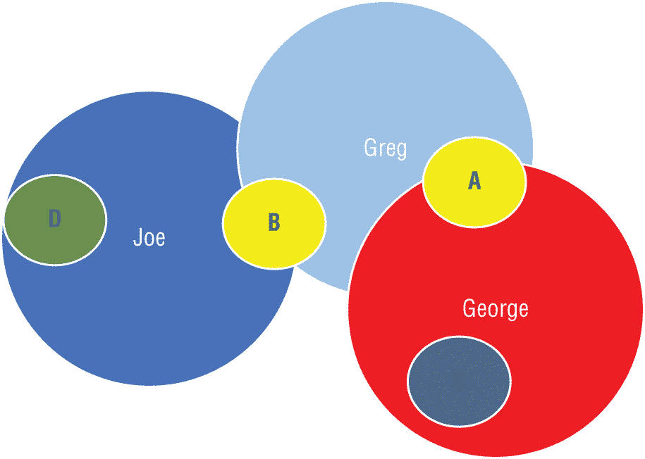

**图 3.17** Corda 分类帐事实  #### 关键概念

Corda 是针对金融行业的许可对等网络。 Corda 使用可插拔的公证模型来管理共识，而不是使用传统的拜占庭容错 (PBFT) 机制，如工作量证明 (PoW)。 Corda 使用公证池，通过并行性实现了更高的性能和可扩展性。多个公证池还可以在同一网络上实现替代共识算法。

Corda 具有一个广泛且独特的术语基础，必须在考虑设计 Corda 网络之前理解。根据需要参考主文档。

+   共识是各方就共享事实达成一致的时候。

+   流是用于协调对等体就共享事实达成共识所需的交互的轻量级进程。

+   门卫充当证书颁发机构的前端。它接受 PKCS#10 证书请求的 POST，并返回一个字符串，该字符串可用于轮询服务器，直到准备好证书的 zip 文件。

+   神谕是 Corda 合约引用离线数据的一种方式，以受控且确定性的方式进行，这是智能合约沙盒所要求的。

+   状态对象是表示特定时间点上的事实的不可变对象，例如财务协议或合同。

+   交易是输入状态，这些状态创建输出状态。被创建的输出状态替换了“历史上”的输入。这类似于追加区块链。

+   Notary 是 Corda 网络的一个服务，为唯一性共识提供了一个独特的服务。 Notary 通过证明交易是唯一的来实现这一点，这在 Corda 中意味着所提议的输入状态尚未被使用。 Notary 池在系统中提供了所谓的最终性点，也许是 Corda 中最独特的部分。

+   保险库是跟踪所有当前和历史状态的数据库，这些状态是保险库知晓的。  #### 共识

Corda 具有“可插拔”的唯一性服务，以提高隐私性、可扩展性、与法律系统的兼容性和算法灵活性。

Corda 中可插拔的唯一性服务和使用共享的加密哈希来确保交易的限制性查看，既解决了可扩展性问题，也解决了隐私问题。

共识，用于确定提议的交易是否为有效的分类帐更新，涉及到达两种类型的共识。

+   有效性共识，由每个必需签署者在签署交易之前检查。

+   独特性共识，由记账服务仅用于交易的唯一性检查

有关 Corda 共识的更多信息，请参阅 Corda 主文档，网址为`[`docs.corda.net/key-concepts-consensus.html`](https://docs.corda.net/key-concepts-consensus.html)`。#### 交易

交易是更新分类帐的提议。金融交易是买方和卖方之间的协议，交换一个或多个资产以支付货币价值。例如，购买产品或服务、贷款和抵押贷款、银行存款和取款、信用卡和借记卡购买、退款、利息累积、税款支付、版税支付等等。

非金融交易是指涉及各方之间无货币价值转移的协议。例如，地址变更或任命以给定年薪任命首席执行官。

Corda 对世界的看法是由交易的意图驱动的。

+   金融交易：交换资产以支付货币价值的协议

+   非金融交易：不涉及货币价值转移的协议。

在 Corda 中，交易通过使用命令来指示它们在 Corda 中的意图来定义。图 3.18 显示了如何定义交易的简单示例。

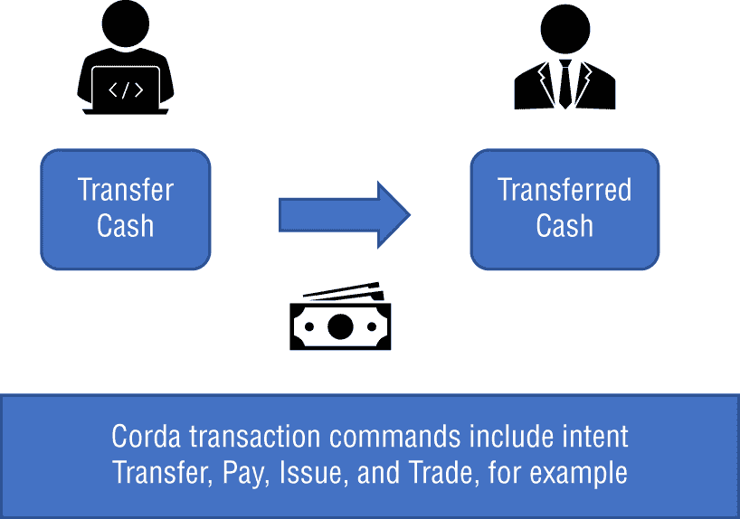

**图 3.18** Corda 交易命令

交易代表可互换的资产，即同质的资产，这些资产是可分割的、可合并的和可互换的，以及不可互换的资产，这些是独特的资产，代表不可分割、合并或互换的东西。### R3 Corda 的设计示例架构

以下示例架构旨在为 Corda 的一个预售顾问可能遇到的客户请求场景提供洞察。根据要求，可能有许多不同的解决方案可以进行范围和设计。

#### 跨境支付场景

一位客户要求您的 IT 集成公司为其客户群设计一个区块链网络，其中包括金融机构。该组织希望 Corda 减少中间商，并提供在成本和处理时间方面的效率。该应用程序将以美元发送付款，但将使用外汇服务转换为欧元。

图 3.19 提供了一个在两家银行之间转移价值的示例架构。它显示了两家银行，银行 A 和银行 B，它们在一个 CorDapp 中通过使用外汇来将美元转换为欧元进行价值转移。合同具有现金支付、公钥和地址。

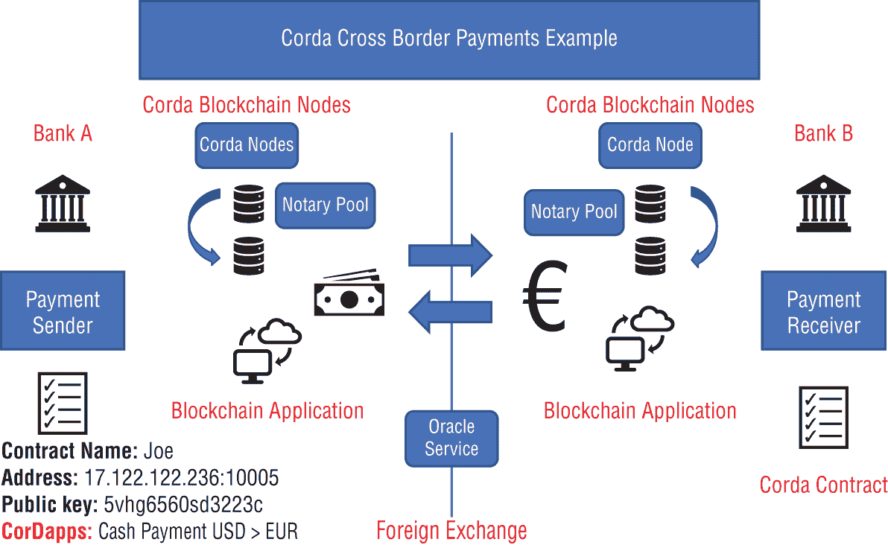

**图 3.19** 用于跨境支付的美元至欧元 CordApp  #### 保险联盟场景

一位客户要求您的 IT 集成公司为他们的客户群设计一个区块链网络，这是一个保险联盟。客户的联盟已经决定必须确保在部署智能合约时使用法律条文。

图 3.20 展示了一种使用 CorDapp 发行保单的保险解决方案。一个保险经纪人正在使用基于联盟的 Corda 区块链网络。在保单发出之前，经纪人使用一种精算工具来评估保单的风险，然后再做出决定和发出。一旦发出了积极的结果，经纪人就可以通过 CorDapp 发行保单来发行保单，这将发出保单并验证付款。

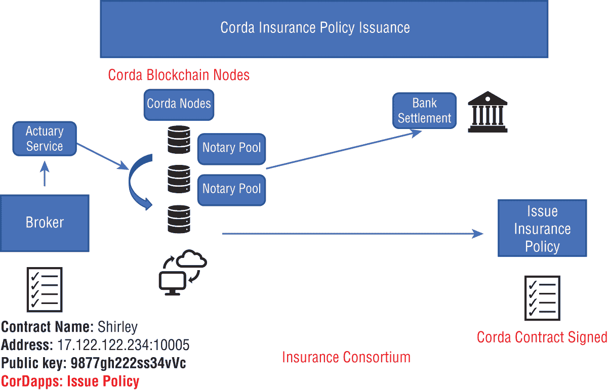

**图 3.20** 保险解决方案

Corda 是一个专业开发的区块链账本，对金融领域有强大的用例。 Corda 具有内置的法律条文，可以实现清晰定义甚至可执行的合同。  ## 以太坊

本节涵盖了以太坊的企业方面，它是一个无许可的跨行业区块链，是开源的，并且是代币平台的事实标准。

企业以太坊实际上只是公共以太坊代码库的许可版本。如果您的客户希望开发基于具有广泛开发基础的平台的分布式应用程序，那么以太坊就是您的目标。

我们将主要关注以太坊的企业优势以及围绕这些主题领域的企业：

+   以太坊的卖点

+   以太坊的设计考虑

+   以太坊的设计示例架构

### 以太坊的卖点

以太坊有几个“卖点”，它们专注于企业以太坊的企业用例。请注意，企业以太坊是一个指代企业如何使用以太坊的术语，企业以太坊不完全是一个具体的产品，而是更加专注于加固代码库。

以下是以太坊的主要卖点。它们涉及为什么企业可以在其企业中使用以太坊，尽管它是一个无许可的基于令牌的平台。

+   企业可以部署以太坊的代码库并修改代码以满足企业区块链用例，并可以利用整个以太坊生态系统。

+   以太坊是最广泛使用的代币平台，这使得以太坊成为企业数字资产数字化的良好选择。以太坊因公共以太坊区块链上使用的 ERC-20 代币而被广泛接受。

+   以太坊生态系统是最大的区块链生态系统，拥有超过 250,000 开发者的开发者社区。

+   企业以太坊由于私有化、许可和硬化的代码库而更快。它的速度比公共以太坊网络快得多，后者的平均 TPS 不超过 20。

+   私密交易是通过使用通道来实现的。

企业以太坊联盟（EEA）实际上是世界上最大的商业区块链联盟，比竞争对手 Hyperledger 联盟规模更大一些。

企业以太坊联盟拥有 450 多个成员，包括微软、摩根大通、埃森哲、英特尔等。以太坊的消费者和企业关注领域正在制定促进互操作性的标准，并指导监管以确保以太坊区块链的未来成功。共识是一个促进区块链成功的组织，他们有一篇关于以太坊的论文应该阅读。###以太坊的区块链设计

在本节中，我们将介绍企业以太坊的主要方面，这是对广泛使用的无许可区块链平台的强化，其主要用例集中在资产数字化上，也被称为*tokenization*。

以太坊是由独立的区块链节点组成的去中心化网络，这意味着它不受任何单一治理实体的控制。以太坊也被称为*全球计算机*，您可以编写控制数字价值的代码，该代码完全按照编程方式运行，并且可以从世界任何地方访问。

从历史的角度来看，大多数商业网络都是建立在中心化的控制和监督系统上的。这种方法已经被政府和企业使用了数百年，而且一再被证明是有效的。这种方法是必需的，因为需要有一个“中介”，例如在从一家银行向另一家银行汇款时。

中心化系统意味着任何单一实体都可以控制区块链网络，但也意味着存在单一故障点，这使得利用该系统的应用程序和在线服务器极易受到敌意接管、黑客攻击和不稳定性的影响。

以太坊与中心化系统完全相反，是一个去中心化系统。这个去中心化系统是完全自治的，不受任何一个人或组织的控制。由于以太坊是在全球 100 多个国家的数千个节点上运行的，所以以太坊也没有中心失效点（在写作时）。

从设计的角度来看，以太坊是最简单的，因为它具有无权限的结构和有限的企业就绪功能。有关更多示例设计，请参考该书的网站。

企业以太坊通过实现增加可扩展性和性能的私有 P2P 交易来提高隐私级别。它还引入了除工作量证明之外的不同共识协议。它允许客户选择，例如，它们的网络大小、块大小和燃气限制。

#### 企业以太坊架构堆栈

企业以太坊联盟（EEA）有一个堆栈层，你应该了解。EEA 堆栈和规范旨在加速企业以太坊解决方案的部署，并通过在多个选择的供应商之间提供互操作性来激励企业部署 EEA 标准化解决方案。

以下是 EEA 堆栈的主要领域：

+   应用层是顶层，其下有三个子层：Dapps，合约和标准，以及智能合约和工具。

+   工具层是下一层，其下有三个子层：权限和凭据，集成和部署工具以及客户端接口/ API。

+   隐私/扩展层是第三层，其下有两个子层：隐私和扩展。

+   核心区块链层是下一层，其下有三个子层：存储和分类帐，执行和共识。

+   最后一层，网络层，是基础层，仅包含一个子层：网络协议。

在设计企业区块链时，从集成的角度来看，了解堆栈如何影响您的设计和集成规划至关重要。#### 私有交易

使用企业以太坊解决方案的主要要点之一是实现私有交易，无论是在链上还是在链外。当以太坊中提到“链”时，它指的是主要的公共区块链网络。企业将希望同时进行链上和链下交易，以获取以太坊区块链生态系统的最大利益。可以使用区间证明或环签名。 ZK-SNARKS 也在可能提高区块链隐私的路线图中。

私有交易基于事件源架构方案上应用的对称和非对称加密的混合。

对于几个方希望共享的信息，采用对称加密。使用私钥签名来识别数据的来源，使用公钥加密来共享对称加密密钥并通知一方。每个交易参与者都必须安装并运行以太坊隐私节点。

图 3.21 显示了在以太坊中如何进行私有交易。两个或更多的商业伙伴将安装私有节点并连接到公共以太坊网络。例如，私钥签名用于识别数据的来源，然后使用公钥共享对称加密密钥。商业伙伴将收到有关交易的通知，并将其写入以太坊区块链。

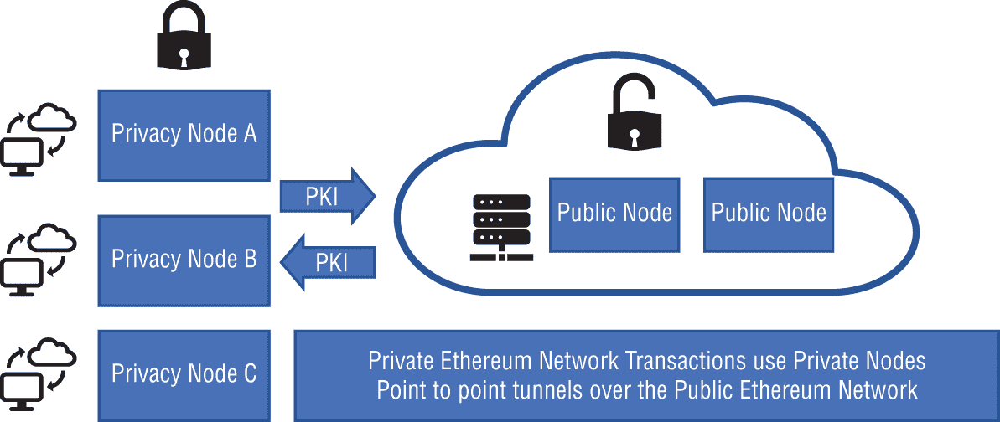

**图 3.21** 以太坊私有交易

创建私有交易意味着安装一个简单的独立程序，与公共区块链交互，并对两个商业方之间的业务合同的所有数据进行加密和解密。#### 交易扩展

与传统的以太坊平台代码库不同，以太坊企业代码库有两种交易扩展方法而不是一种。这些是链上和链下交易。

*链上*扩展发生在企业以太坊架构的第 1 层。它改变了以太坊协议以更好地适应交易需求。*链下*扩展发生在企业以太坊架构的第 2 层。

使用企业以太坊的主要目的是利用公共网络扩展私有交易。当然，这为可能不想投资于私有区块链基础设施的公司提供了一些好处。主要提议允许企业连接到公共以太坊区块链，支付公共基础设施的使用费，并通过标准智能合约与彼此交易，使用的是标准技术，即用于识别其商业伙伴的公钥基础设施。### 以太坊的设计示例架构

以下示例架构旨在提供对企业以太坊的客户请求情景的洞察，预售顾问可能会遇到。根据要求，可能会有许多不同的解决方案可以进行范围和设计。

#### 企业财务区块链场景

客户已要求您的 IT 集成公司为其有关信用证的企业财务应用设计区块链网络。客户已声明他们不会投资于基于成员的区块链，并希望使用合理的隐私技术实施公共区块链。没有加密货币要求，客户声明存在多个方之间的交易，并希望这种交易经济实惠。

图 3.22 展示了私人交易如何通过公共以太坊区块链进行。我们有两个使用隐私节点的商业伙伴。从更深层次的技术角度来看，隐私节点压缩然后使用其 RSA 私钥对交易数据进行签名，生成一次性使用的对称 AES 256 密钥，最后加密已签名的交易。然后，对称密钥使用每个目标节点的公钥进行加密。这些密钥被发布到公共以太坊区块链上的 *PrivateTransactions* 智能合约中。  #### 毕业证书发放区块链场景

您的客户 Blockchain 学校 已经要求您的 IT 集成公司设计一个区块链应用程序，将认证证书和毕业证书发布到公共区块链。客户已经声明他们不会投资于基于成员的区块链，只想将毕业证书发布到公共区块链。他们还希望将这种能力扩展到将来的其他联盟学校。这些认证证书和毕业证书将是公开可见的，但需要一个私有合同来发布到区块链上。

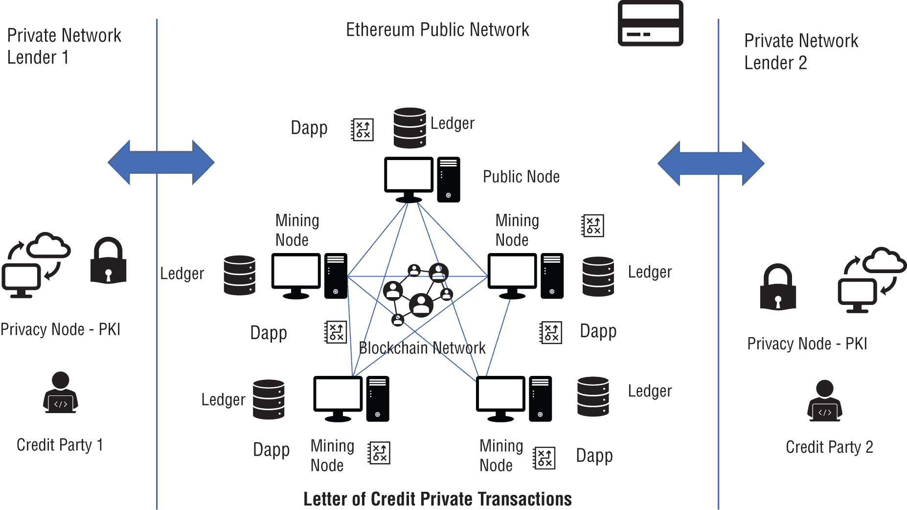

**图 3.22** 带有私人交易的信用证发行

图 3.23 展示了学校和学生使用以太坊进行私人交易的凭证发行区块链。学校将证书发布到以太坊公共网络，并向学生发送了一个私人链接，这个链接本质上是一个公钥/私钥对，用于验证发行者和接收者。学生也可以生成一个密钥对，并在需要时与雇主分享证书。

以太坊是一个灵活且广泛应用的跨行业公共区块链，具有私人扩展功能。与其他许可区块链相比，开发者社区更加强大，并且具有潜力的使用案例很多。  ## Quorum

本节介绍了 Quorum，这是一个混合跨行业区块链，具有可插拔框架。Quorum 是一个基于以太坊的开源私有许可分叉，专为企业部署而设计。涵盖以下主题：

+   Quorum 的卖点

+   Quorum 的设计原则

+   Quorum 的设计示例架构

Quorum 真正有用的地方在于，如果您已经了解以太坊，那么您对 Quorum 的学习曲线不会超过一小时。Quorum 的唯一挑战不是技术性的，因为它是以太坊区块链的一个分支，而是关于其有限的用户基础和接受挑战。摩根大通已经吸引了超过 220 家银行加入其基于 Quorum 的银行间信息网络。

以太坊和 Quorum 之间的一些区别在于，Quorum 旨在部署为私有的基于以太坊的网络或扩展为公共网络。与以太坊一样，没有像以太坊一样的主网，它是通过摩根大通和以太坊基金会的工程师的联合努力创建的，这为它带来了重大支持。Quorum 中使用的共识算法基于投票，与以太坊完全不涉及挖矿。

总体而言，开发者基数较以太坊和超级账本低，应用数量仅是以太坊的一小部分。然而，精通以太坊的开发者将轻松地将以太坊分布式应用转换为可与 Quorum 配合使用的工作。

### Quorum 的卖点

Quorum 是专为金融用例而设计的企业级重点私有许可区块链基础设施。Quorum 是基于称为 Go Ethereum 的以太坊的分支构建的。

Quorum 的功能类似于以太坊。相似之处包括网络和对等节点权限管理、增强的交易和合约隐私性、基于投票的共识机制以及更高的性能。在考虑特定用例的企业以太坊或 Quorum 时，重要的是考虑 Quorum 是否适用于金融行业客户。

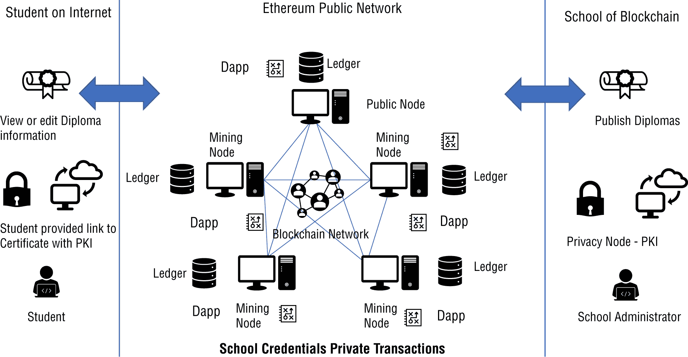

**图 3.23** 凭证发行区块链

考虑 Quorum 的主要要点如下：

+   支持私人交易，并且通过公共/私人状态分离在私人网络或公共网络上提供私人合同。

+   Quorum 在私有区块链部署中提供了扎实的安全性和高吞吐量的交易。交易速度的提高是简化的共识机制的结果。

+   多个共识机制提供了备选方案，这些共识机制更适合财团链而不是以太坊的工作量证明共识。

+   Quorum 利用以太坊生态系统，并在某些方面保持了相似性。这为以太坊开发者提供了快速的开发体验。

+   Quorum 是由摩根大通领导的财团网络全力支持的区块链。### Quorum 的区块链设计原则

Quorum 是一个允许您在其上部署 dapp 的许可去中心化平台。从某种意义上说，它是混合的，因为它可以支持使用一个或多个智能合约创建的 dapp。Quorum 是以太坊代码库的分支，提供了一些与以太坊相似但与以太坊不同的地方。从设计的角度来看，差异在于 Quorum 使用的共识协议、加密存储和新的 Geth 客户端。

在 Quorum 中，智能合约可以用传统的以太坊开发语言编写，比如 Solidity、LLL 或 Serpent。Solidity 是目前被最广泛接受和使用的，所以它更受青睐。在 Quorum 中，可以有多个智能合约实例。每个实例由唯一的定位器地址标识，您可以在同一个 Quorum 网络上部署多个 dapp。请记住，我们不是在以太坊主网上部署 Quorum，而是在一个私有企业网络或另一个公开共享的联盟网络上部署。

#### QUORUM 组件

Quorum 在其架构中具有以下主要组件：

+   Quorum 节点，这是一个修改过的 Geth 客户端。它具有提供一些重要修改的功能。对 EVM 节点进行的主要修改包括允许与有权限的节点连接的 P2P 层，更改以处理私有事务的验证，删除 gas 定价以及新的共识方法。

    关于 Quorum 节点的最新信息，请参阅 Quorum GitHub 仓库 `[`github.com/jpmorganchase/quorum`](https://github.com/jpmorganchase/quorum)`。

+   Constellation 实际上是两个独立的组件 —— 事务管理器和 Enclave。

+   事务管理器负责链的事务隐私。该组件实际上存储并提供对加密事务数据的访问控制。Constellation 还利用了 Enclave，这是 Constellation 的另一个用于加密功能的组件。

+   Constellation  Enclave 实现了明显的关注点分离。Enclave 还通过特定加密操作的并行化对性能改进产生影响。

图 3.24 提供了 Quorum 的高层概述。

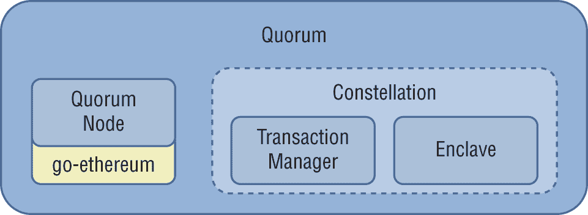

**图 3.24** Quorum 区块链概述

在高层面上，Quorum 相当简单。首先要注意的是以太坊区块链的分叉。它使用了 go-ethereum，这为整合提供了一些好处。  #### 共识

Quorum 在撰写时支持三种共识协议：QuorumChain、IBFT 和 Raft。QuorumChain 是一种多数投票协议。在我看来，Raft 和 IBFT 是最广泛使用的，也是最适合大多数企业实施的协议。

一组节点处理共识，这些节点由投票权委派，并且所有节点都有投票权，也将投票权授予其他节点。Quorum 中的智能合约用于在创世块中分配投票权。智能合约跟踪区块链网络中所有投票节点的当前状态，并在更新它们时更新它们。投票过程由一个用于发送请求或采样投票节点的投票智能合约触发。当达到适当的区块高度时，事务被提交。

Raft-based Consensus 提供了更快的交易最终性，同时也支持按需创建区块。

伊斯坦布尔 BFT 共识算法为区块链的可能是最重要的职责提供了交易的最终性。伊斯坦布尔 BFT 提供对等权限，实质上是使用智能合约的节点/对等权限，并确保只有已知的当事方可以加入网络。

Quorum 的性能明显高于主要以太坊网络的公共 Geth（以太坊），并提供 Solidity 开发人员熟悉的以太坊外观和感觉。  #### QUORUM 账本

Quorum 为世界账本维护两个状态数据库。一个是公共状态数据库，另一个是私有状态数据库。请注意，两者都在同一单一账本上提交其世界状态。  #### 隐私

隐私可能是 Quorum 相对于以太坊的主要优势，也是 Quorum 的主要用例。隐私是通过 Quorum 区块链的开发过程有意构建的。Quorum 区块链通过其星座的实施管理其大部分安全消息传输。

Quorum 支持两种实现安全性和隐私性的机制。

+   零知识安全层协议，提供零知识证明（ZKPs）。 ZKP 是定义交易的一种花哨方式，是数学的一个分支。这允许交易中的一方证明对某些秘密值或信息的知识，而不透露任何关于该秘密的细节。

+   私有合约，允许交易在两个当事人之间披露。

隐私模型正在改变，银行隐私的旧方式也在改变。通过 Quorum 权限层的实施，金融机构确保只有经授权的当事方可以加入他们的私有以太坊网络。  #### 交易

星座，Quorum 的隐私模块，使用参数允许参与者交换私人交易，并确保机密交易数据在各方之间保持机密。

交易包括全局交易哈希。此交易哈希由一个区块中的所有交易，公共状态根哈希和区块制造者的签名组成。  ### Quorum 的设计示例架构

以下示例架构旨在提供关于 Quorum 的客户请求场景的见解，这是预售顾问可能会遇到的。根据要求，可能会有许多不同的解决方案可以进行范围和设计。

#### 银行间转账私有区块链场景

您的客户是一个银行联盟，已要求您的 IT 集成公司设计一款可以在私有的许可网络上进行银行间转账的区块链应用程序。客户表示，这不会延伸到主网，并且不需要例如验证外汇信息的预言机。

图 3.25 展示了一个简单的私有区块链。这个私有区块链有一个财团，并用于发送支付。财团管理分布式账本，并实施了可信的对等互连。  #### 了解您的客户区块链场景

您的客户，一家大型国际银行，要求您的 IT 集成公司设计一个既提供隐私又符合验证客户身份要求的区块链。

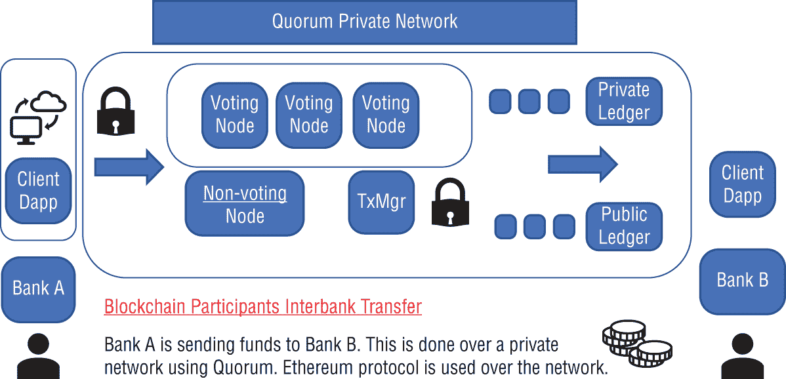

**图 3.25** 带有 Quorum 的私有区块链

图 3.26 展示了了解您的客户（KYC）区块链。Quorum 节点处理交易并向私有账本和公共账本提供更新。在此部署的一部分中，部署了一个 KYC 服务来对已知身份进行认证。维护一个合规节点以确保维护身份合规性。

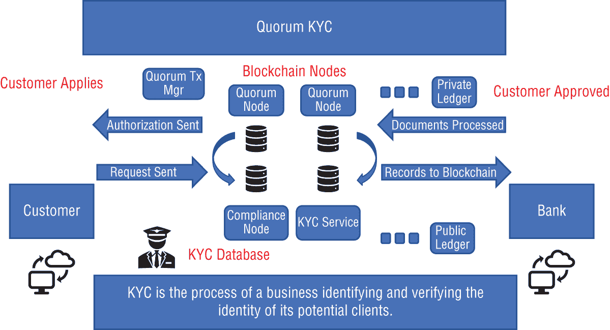

**图 3.26** 了解您的客户区块链

Quorum 是一个灵活的私有网络重点区块链，具有基于以太坊区块链的私有扩展。隐私可能是与以太坊相比的主要优势，也是 Quorum 的主要用例。  ## 摘要

本章讨论了四种最广泛使用的企业区块链和分布式账本，以及每种区块链的几种用例。

企业区块链在技术和业务角度上具有非常不同的要求。Corda 与超级账本和以太坊大不相同。

企业区块链通常分为几类：私有许可、公共或无许可、或混合解决方案，如 Quorum。

超级账本是由 Linux Foundation 运行的总项目，超级账本 Fabric 是超级账本组合中最广泛使用的区块链。超级账本 Fabric 是一个灵活的跨行业区块链，为企业提供了许多部署选项。

Corda 最初主要是为金融行业而构建的，金融协议的记录、管理和自动化是具有高效率的手动流程。该平台考虑了金融机构的数据隐私/机密性和交易可扩展性等要求而设计和构建。

以区块链技术为基础的以太坊是一个开源软件平台，使开发人员能够构建和部署去中心化应用程序（智能合约）。以太坊是最广泛使用的无权限区块链，拥有广泛的开发者追随者。

Quorum 是一个由增强现有以太坊区块链构建的开源区块链解决方案。它在以太坊的基础上提供了一个额外的层，使其能够执行私有交易，同时通过使用不同的共识算法使其更加灵活。企业可能希望使用 Quorum 的主要原因是其隐私增强和性能能力。

每个展示的四个区块链都提出了示例架构设计。作为设计模块的一部分，我们涵盖了最佳实践、考虑因素和技术问题。
