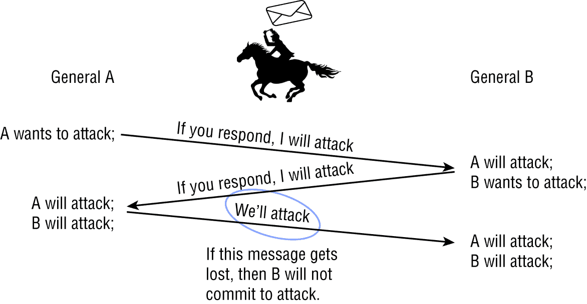
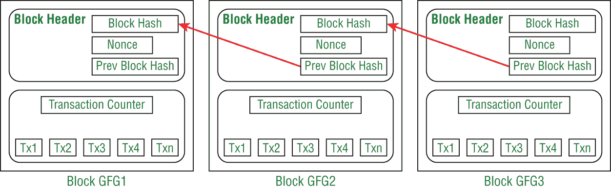
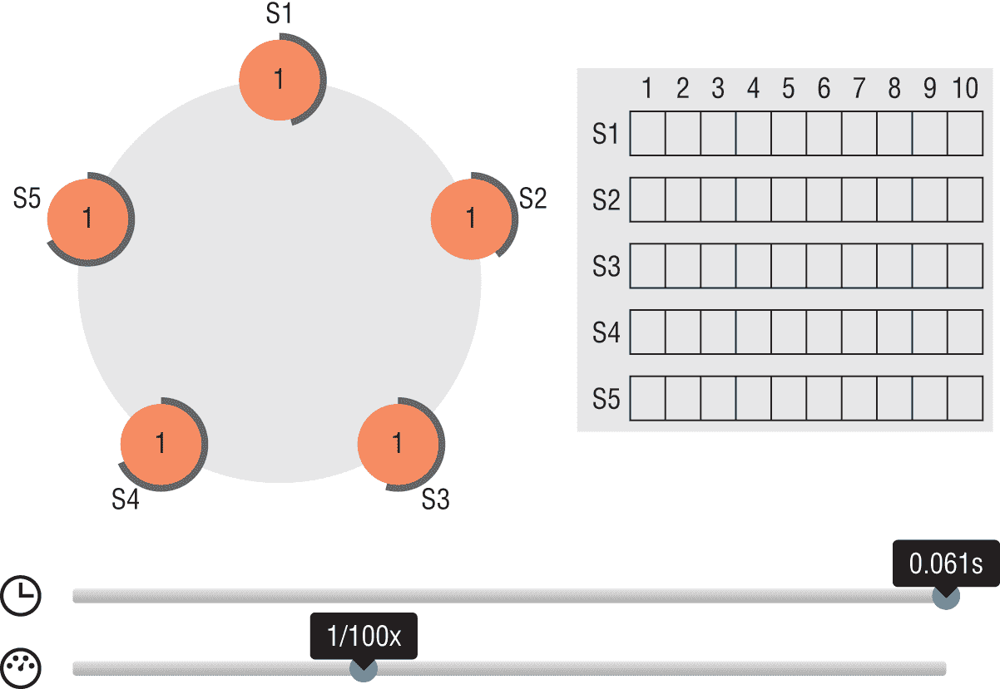
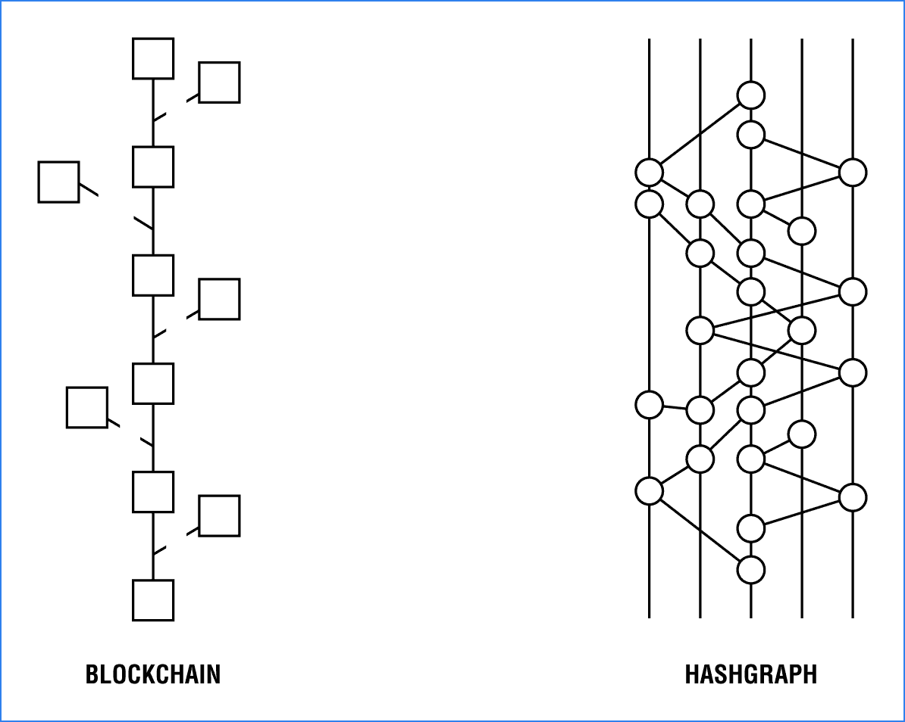

# 第四章

了解企业区块链共识

本章将涵盖用于区块链和分布式账本平台的最常见的共识方法。本章将介绍区块链共识的产生过程，并提供有关拜占庭将军问题的历史挑战以及它与分布式系统中的计算机科学挑战的比较的见解。本章的主要焦点将放在企业区块链 Hyperledger Fabric、R3 Corda、Quorum 和 Enterprise Ethereum 中使用的共识方法上。

你将了解主要企业区块链中使用的企业区块链共识算法。我将涵盖最常见的区块链共识算法；但我将无法涵盖每种区块链共识方法。至少有 40 种共识方法，大多数对企业要求不具备可行性，主要是因为它们开发的区块链或缺乏企业特性。

本章的目标是从技术售前的角度解释区块链共识方法的差异以及这如何影响企业决定实施特定的区块链账本平台。这一章节并非旨在为你提供区块链共识的博士学位，让你像一名真正的区块链开发者那样追溯交易。

请注意，比特币和以太坊等区块链可能是移动目标，因为对它们进行的更改是常规和预期的。对于经验丰富的区块链和加密货币专家来说，对这些区块链进行分叉几乎每年都不足为奇。将区块链分叉看作是一种共同商定的区块链节点软件更新的另一种方式。分叉的主要目标是创建两个并行的区块链，其中一个是获胜的区块链。

符合本书使命的宗旨，我将关注用于企业区块链的共识方法的企业就绪特性、速度和数据传输率。

如前所述，在本章节过程中，你将查看在以太坊、R3 Corda、Hyperledger 和 Quorum 中使用的每个企业区块链和分布式账本共识方法。我还将涵盖这些企业区块链和账本的企业方面，这些方面具有可插拔或模块化组件，以使您的客户在共识方法上具有灵活性。

你会发现，在本书中，工作证明（PoW）和权益证明（PoS）都是常用的比较对象。事实上，很难在没有比特币 PoW 作为参考点的情况下比较共识机制，因为它是最初的共识方法。PoS 在区块链平台中也被广泛使用，并且也可以进行有趣的比较。本章还将回顾共识的含义、重要性以及拜占庭将军问题的由来以及如何通过一种称为拜占庭容错的共识形式解决它。

具体来说，本章涵盖以下共识方法：

+   工作证明

+   权益证明

+   流逝时间的证明

+   委托权益证明

+   委托式拜占庭容错

+   实用的拜占庭容错

+   伊斯坦布尔拜占庭容错

+   基于 Raft 的有向无环图  ## 从历史角度看区块链共识方法

本节从历史角度讨论了共识概念。以下主题被讨论了：

+   共识的重要性

+   拜占庭将军问题

+   比特币对拜占庭将军问题的解决方案

+   拜占庭容错

### 共识的重要性

如您所知，共识意味着达成协议的方法。因此，在区块链中，共识是指区块链节点如何“达成协议”以确定将写入区块链分类帐的区块链交易。共识可以被视为对区块链分类帐“世界状态”的最后状态达成一致意见，该状态类似于当前写入的交易的快照或图片。共识验证交易并对其进行排序。

更具体地说，共识算法是用于在分布式网络上达成协议的过程。区块链网络运行的主要关注点是在区块链网络内记录的信息的一致性维护。共识算法固有地存在着一种权衡。在大多数情况下，权衡是在交易安全性和性能之间进行的。在区块链中，性能是用交易吞吐量来衡量的，也被称为*每秒交易数*（TPS）。例如，以太坊的性质是无信任的，并且通过使用众所周知的工作证明算法来解决。以太坊中使用的 Ethash 共识算法使攻击变得既昂贵又不太可能发生。然而，与其他数据库技术相比，以太坊的速度较慢。

共识还可能影响区块链分类帐操作的参数和安全性。了解正在部署的区块链共识的优缺点是明智的，因为通过一些基本知识可以避免暴露已知的漏洞。此外，区块链网络可能存在着可能促使更大漏洞暴露的恶意行为者。

企业要求至少具有可用性和一致性。在本章结束时，应清楚地了解到，特定的共识算法旨在实现涉及多个不可靠节点的网络的可靠性。解决行业中已知的共识问题对于分布式计算以及企业服务非常重要。

区块链中的共识遵循与分布式计算相同的要求，并且必须满足以下两个属性才能保证网络节点之间的协议：

+   安全性在大多数区块链平台中被引用为能够为区块链交易提供最终性。在区块链中，这意味着每个节点将对每个输入具有相同的输出。

+   活性与可用性相关。在区块链中，这意味着每个非故障节点最终将收到每个提交的交易。

行业普遍接受两种类型的区块链共识：基于投票和基于抽奖的。基于投票的共识应基于以下选择：

+   **最终性**—基于投票的算法被认为是有益的，因为它们提供了被认为是低延迟的最终性。这是通过大多数节点验证交易或区块来实现的。

+   **严格规则**—规则严格执行，特别是在以太坊等采用 PoW 共识方法的情况下。

基于抽奖的共识应基于以下选择：

+   **公平性**—函数应该将领导者选举分布到尽可能广泛的参与者群体中。

+   **投资**—控制领导者选举过程的成本应与从中获得的价值成比例。

+   **验证**—对于所有参与者来说，验证领导者的合法选择应该相对简单。### 拜占庭将军问题

拜占庭将军问题源自传统计算机科学领域。在这种情况下，相关方必须就一种策略达成一致，以避免操作完全失败。也可能是网络中的一些节点可能是腐败的，并且有效地传播不可靠的请求或信息。

在电信、加密和一般信息技术（IT）之前，与其他人真正交流的唯一方式是通过其他人，即信使。这种形式的通信显然对军队和信使都是危险的。例如，信使可能会被捕获，消息被盗，这可能会使军队陷入脆弱的情况。当然，还有其他形式的通信可用，如烟雾信号或镜像。但是，烟雾信号并不被接受作为保密的方式。

或许这个城市足够强大，可以抵御一个或两个敌军旅的进攻，但可能无法抵挡三个，绝对无法抵挡七个。因此，将军的七个旅需要“共识”，必须就何时、为何、何地以及如何进行精确攻击达成一致。

将军们如何同时发起攻击？他们如何知道来自其他旅的消息没有被篡改？他们如何进行通信，以免被拦截？

现在让我们回到计算机科学，特别是讨论共识如何影响区块链技术。在区块链的世界中，节点本质上是在分布式网络上运行区块链网络协议、代码和消息服务的虚拟机。当涉及到写入区块链账本时，这些区块链节点需要一种达成协议的方式。这就是共识的作用，它处理这些区块链节点在这个分布式网络中如何达成一致的问题。

图 4.1 显示了一个具有以太坊虚拟机的区块链网络。这个分布式网络采用网格网络样式连接了六个节点。在大多数分布式账本平台上，区块链账本不是一次更新一个节点，而是同时传播到所有节点。

**图 4.1** 以太坊节点网络

对于所有这些区块链节点之间如何写入区块链账本的协议达成一致是至关重要的。在区块链中，这种严格定义的协议达成一致被称为达成共识。

拜占庭将军问题的真正解决方案并不是一个简单的“一刀切”的解决方案，在共识的世界中，“一刀切”并不适用。这些区块链账本解决方案需要涉及特定类型的哈希、密集的计算工作，以及一种延迟容忍的点对点通信协议，以验证所有节点之间的交易。当将拜占庭将军问题应用于区块链时，你可以将节点看作将军。### 拜占庭容错

拜占庭容错（BFT）的出现是因为它代表了拜占庭将军问题的一个有效解决方案。BFT 是一个有效的区块链平台的重要组成部分，实现容错的方式有多种。作为预售专员或 IT 架构师，你需要了解基于你正在考虑的企业区块链平台的各种共识方法。

图 4.2 逐步介绍了拜占庭将军问题的工作原理。首先，将军 A 收到了攻击的消息，而将军 B 没有收到这个消息。因为将军 B 没有收到这个消息，这就造成了正在被攻击的城市可能挫败整个攻击的问题。

**图 4.2** 拜占庭容错工作流程

在本章的剩余部分中，我将讨论各种形式的拜占庭容错，如 PBFT 和其他形式的 BFT。## 比较企业区块链共识方法

当你试图理解区块链共识时，你可能会遇到的主要挑战之一是不同区块链账本平台的共识算法可以有多么不同。例如，比特币和以太坊都使用了一种名为 PoW 的共识形式，这是一种极其昂贵和资源密集的共识方法。其他企业区块链则使用了投票形式作为它们的共识方式。

表 4.1 引用了最常见的区块链及其采用的共识方法。每种共识方法都有特定的用例及其优缺点。大多数区块链共识方法是为了在私有许可区块链上运行而开发的，例如各种版本的 BFT 和更专业的专有共识方法，例如基于 Raft 的有向无环图和经过时间证明。

**表 4.1**：常见区块链共识方法

| 共识方法 | 用于 | 主要优点 | 主要缺点 |
| --- | --- | --- | --- |
| 工作证明 | BTH, ETH, LTC | 广泛测试 | 缓慢且资源密集 |
| 股权证明 | Peercoin, ETH Casper | 能源高效 | 无风险 |
| 经过时间证明 | Hyperledger Sawtooth | 参与成本 | 专用硬件 |
| 委托式股权证明 | Steemit, EOS, LISK | 快速且高效 | 见证人/非集中化 |
| 委托式拜占庭容错 | NEO | 快速且可扩展 | 根链控制 |
| 实用拜占庭容错 | Hyperledger Fabric | 高效，分片交易终局性 | 集中式 |
| 联邦拜占庭容错 | Ripple, Stellar | 低成本和高吞吐量交易 | 集中式 |
| 伊斯坦布尔拜占庭容错 | Quorum | 低成本，高吞吐量交易 | 集中式 |
| Raft | Quorum, IPFS, 集群 | 更快的区块时间 | 仅限许可 |
| 有向丙烯酸图 | Iota, Hashgraph | 快速，能源高效的最终性 | Oracle 需求 |

### 工作证明共识

比特币是第一个实用和成功的加密货币平台，它在平台中引入了 PoW 共识方法。工作证明协议涉及到区块矿工解决复杂的密码学难题。作为参与解决复杂问题挑战的一部分，矿工通过以比特币区块链平台为例获得比特币形式的奖励，或者以太坊区块链平台的情况下是以太币。工作证明就像是区块链矿工参加马拉松比赛一样，因为第一个产生最长链的节点将赢得区块奖励，这些奖励是根据平台而定的加密货币或代币。

工作证明是最广泛使用的共识方法。这主要是因为它是最初的协议，并已证明其对内部和外部攻击的抵抗力。基本上，PoW 表明参与者已经做了一些工作，并且为解决问题而获得了奖励。

比特币中 PoW 共识的高级概述是，一个包括交易相关部分的块被散列，然后添加一个随机的 nonce，使得结果哈希值低于某个值，这个值被称为 *难度级别*。另一种考虑挖矿过程的方式是将其看作是逆哈希的操作，这是一种密码学方法。这个逆哈希确定一个随机数（nonce），使得块数据的密码哈希算法小于给定的阈值，换句话说，就是难度级别。矿工使用这个难度级别来衡量挖掘比特币所需的计算能力和资源水平，例如，以及它是否会有利可图。

图 4.3 显示了 PoW 交易的高级过程，其中引用了上一个块的哈希。

**图 4.3** 工作证明中的交易过程

第二个块引用了第一个块的哈希，然后第三个块引用了第二个块的哈希。要将一个块写入区块链，矿工必须做大量的工作。

工作证明的主要特点如下：

+   它提供了难以预测的块，这可以增加区块链对矿工的竞争性，同时也增加了区块链网络的安全性。基本上，随着难度率的增加，数学问题变得更加困难。

+   它通过验证谁成功通过预定义值解决问题来提供验证区块正确性的简单方法。

PoW 的一个主要挑战是大量的能源被视为“浪费”或“消耗”。当你有成千上万个节点的网络，比如比特币，你将有成千上万个节点努力解决问题。资源消耗是主要关注点。除此之外，挖掘比特币的成本也飙升到了 1000 美元以上。挖掘加密货币需要大量的电力。例如，要成功挖掘比特币，你需要购买一个“挖掘机”，这个挖掘机可能会有一个专为特定应用设计的应用特定集成电路（ASIC），它是为特定应用而设计的微芯片，比如比特币挖掘。挖掘是一个竞争激烈的行业，ASIC 可以提供竞争优势，并在区块链挖掘领域提供效率、性能甚至安全性。

例如，在比特币中，矿工需要保持竞争力，这是通过持续测试不同的唯一值来实现的。这些唯一值称为*随机数*。一旦矿工成功解决了这个复杂的问题，矿工将获得流行的比特币奖励。然后，矿工可以通过向区块链网络广播该节点已经挖掘到该区块来将该区块添加到比特币区块链中。

挖矿对区块链有两个主要目的。首先，挖矿用于验证交易的合法性，因此有助于避免所谓的双重支付问题。其次，挖矿促进了奖励的创建和分发给比特币网络上的矿工。

如果您是企业，或者您的客户是企业，那么您可能不会使用基于 PoW 的区块链，例如比特币。您可能想要使用以太坊，例如，作为代币平台，或者可能是为加密货币平台扩展支付网关。

然而，在 Quorum 和企业以太坊的情况下，您也可以考虑这些区块链，因为它们具有混合企业解决方案。第八章，“企业区块链用例”，介绍了 Quorum 和企业以太坊的更常见用例。### 股权证明共识

股权证明（PoS）是一种共识算法，通常由加密货币使用来验证区块，从共识的角度来看与 PoW 非常不同。股权证明是在 2011 年创建的，第一个实施它的加密货币是 Peercoin，在 2012 年。基本上，它被创建为一种避免 PoW 中已知的经济和环境问题的方式，例如强烈的能源消耗和挖矿成本。

股权证明实施了一种方法，其中下一个区块的创建者是由一个随机系统决定的，该系统在逻辑上受用户持有的投资金额或者持有该特定货币的时间的影响。这与 PoW 中的“计算能力”是不同的方法，例如，在 PoW 中，创建区块并获得相关奖励的概率与用户在网络上持有的底层代币或加密货币成正比。

股权证明是一种基于利益的区块链处理方法，其中节点的利益与其投资直接成正比。另一种看待股权证明的方式是，它是一种基于财富定义的确定性方式，实质上是基于*股份*。对加密货币股份的更大投资意味着更大的影响力。

股权证明的主要特点如下：

+   由于经济因素，股权可能会发生变化。

+   投票基于经济因素。

+   节点需要在线投票。

+   投票是最终的。

+   不允许多次投票。

以太坊有一个计划中的 Casper 发布，这是以太坊区块链的一个分叉。这个分叉将从 PoW 共识变为 PoS 共识。请注意，如果以太坊转向 PoS 共识，那将是一次重大的颠覆性举动，因为以太坊将从挖矿共识转变为验证者共识。

PoS 系统适用于静态货币供应的平台。例如，大多数众筹平台利用这种方法来基于投资分发代币。这正是以太坊的发展方向。然而，使以太坊与众不同的是其基于 PoS 的最终性系统，能够覆盖现有的 PoW 区块链。这种覆盖在 PoW 之上的方法本质上是一种混合的 PoW/PoS 方法，称为 *Casper Friendly Finality Gadget (FFG)*。然而，由于技术挑战和安全顾虑，这一更新已经延迟。

使用股权证明的主要优势之一是它具有显着较低的能源需求；因此，您可以获得更好的投资回报率（ROI）。

已经有记录表明，每个使用 PoW 系统的比特币交易可能需要的电量相当于荷兰一个普通家庭两周的电量。这既低效又不可持续。

股权证明被认为是一种更高效的共识协议，因为它需要远少于 PoW 运行的电力，并且可以在较少的硬件要求上运行，如 ASICs 而不是 GPU。

此外，PoS 不太需要释放大量新币，这一直是激励矿工维护网络的手段。这有助于保持特定币种的价格更稳定，因此提供了更多区块链参与的动力。### 比较工作证明和股权证明

现在你已经对 PoW 和 PoS 有了一般了解，让我们回顾一下 PoW 与 PoS 的区别，以了解以太坊从 PoW 转向 PoS 会产生多大的颠覆性影响。

+   **工作证明**—PoW 依赖于在网络上运行节点的矿工来解决计算难题以验证交易的新区块。矿工会得到他们的工作报酬。

+   **股权证明**—PoW 依赖于网络上的验证者节点轮流提出和验证链中的下一个区块。验证者节点的价值—以及其奖励的大小—取决于在验证过程中抵押的硬币数量。实质上，您存入的越多，潜在的回报就越大。

PoW 是一种工作密集型的共识机制，需要矿工（节点）向区块链写入交易。矿工成本高昂，而挖矿过程在经济和能源方面都非常密集。

根据最近的 Cointelegraph 文章（`[`cointelegraph.com/news/bitcoin-mining-uses-more-power-than-most-african-countries`](https://cointelegraph.com/news/bitcoin-mining-uses-more-power-than-most-african-countries)`）估计，仅比特币网络使用了全球能源消耗的 0.14%。比特币挖掘现在可能消耗的电力比世界底部 7.5 亿用电用户多，这超过了世界人口的 10%。

PoS 需要与 PoW 不同类型的投资，而且能源消耗较少。

PoW 提供以下优点：

+   它是一种历史上被证明的共识方法，被广泛用于加密货币，并且是一个稳定的平台。

+   它是安全的，因为攻击成本高，51%的攻击概率低。（51%的攻击是指挖矿节点池被控制了 50%以上的网络挖矿算力的矿工组接管的情况。）这种类型的攻击不太可能发生，因为存在着巨大的哈希算力和对节点数量的控制要求。

PoW 有以下缺点：

+   与其他共识方法相比，交易处理速度较慢。例如，在比特币中，可能需要几个小时才能得到交易确认。

+   51%攻击的担忧仍然是真实的，这意味着网络中的 51%或 51%以上的节点可能会被利用。

+   由于需要完成产生区块的工作，挖矿是一个耗时的过程。

+   从经济和环境的角度来看，挖矿是一个昂贵的过程。例如，比特币挖矿消耗了大量的电力，因此经常被市政电力公司禁止。

PoS 提供以下优点：

+   与工作量证明相比，它是节能的，因为不需要挖掘硬币，这使得它成为比特币等加密货币的环保选项。

+   PoS 系统的入门门槛较低，因为不需要挖矿设备，并且允许更多的用户参与到质押和锻造过程中。

PoS 提供以下缺点：

+   某人可以垄断网络。通过 PoS，你知道网络中增加的份额意味着增加的影响力。如果有人伪造了大部分未来的区块并且集中了奖励，这可能是一个问题。

+   黑客不仅可以窃取你的财富，还可以窃取你在网络中的份额。当有人丢失他们的“钱包”和硬币时，他们也失去了在区块链网络中投票的能力。

与任何试图建立的区块链要求一样，审查其优缺点应该使您能够确定正确的解决方案。### Proof of Elapsed Time

证明已经流逝的时间（PoET）试图解决股权证明存在的问题，即参与提出区块的参与者的随机选举可能发生，并确保每个参与者都有公平的机会提出一个新的区块，然后参与投票过程。

PoET 是由知名的计算机芯片制造商英特尔开发的一种生产级协议，能够支持大型网络用例。 PoET 需要一种称为*英特尔软件保护扩展（SGX）*的特殊 CPU 指令集，提供了一个称为 TEE 的受信任环境。受信任的代码在与应用程序的其余部分隔离的环境中运行。这意味着应用程序的其余部分不会干扰受信任代码的内存空间，例如。将此视为云计算中的容器或沙箱。

PoET 本质上通过选举所谓的领导者并实施一个两层次的过程来缓解了对 PoW 共识的担忧。PoET 试图纠正 PoS 的问题，后者将会任意确定提出区块的成员被期望保证每个成员都有合理的机会提出一个区块。

网络中的每个参与者都被分配了随机的等待时间，第一个完成等待时间的参与者将有机会将下一个区块提交到区块链。

PoET 从其本地可靠的节点成员的私人可信飞地中强加了一个持有时间。持有时间最短的节点成员将在持有时间到期后“提出”一个区块。每个私人可信飞地都会签署潜在的请求。然后，其他成员验证结果，以便确认没有其他节点跳过等待时间。

有合理的担忧，因为 PoET 在协议的基础上严重依赖 SGX，SGX 飞地可能会被劫持。这在最近的 Foreshadow 漏洞中已经得到证明。尽管如此，Hyperledger Sawtooth 利用了 PoET 共识算法，该算法利用了英特尔的 SGX 来实现这个基于领导者的抽奖系统。

PoET 是一个专门的用例。其主要优点是它是来自英特尔的受信任专有平台。

PoET 提供以下优点：

+   受信任的环境基本上是在 Hyperledger Sawtooth 上的即插即用共识。

+   比具有挖矿成本的 PoW 共识（例如硬件和能源）的能源使用量更低。

+   解决了随机领导者选择问题，而不需要资源密集型或需要激励措施。

PoET 有以下缺点：

+   由于依赖英特尔的专有硬件和软件要求，缺乏可移植性。

+   比其他区块链平台更高的成本，因为需要专有硬件。

正如你所看到的，优缺点对于寻求有针对性解决方案并且不期望超出该解决方案的企业可能是可以接受的。### 委托权益证明

委托权益证明（DPoS）是由 Daniel Larimer 发明的，他是 Steem 的联合创始人，也是 EOS 的 CTO，两者都使用了 DPoS。DPoS 是其相对 PoS 的一个分支。

DPoS 使用实时投票系统和声誉系统来实现共识。DPoS 区块链共识协议允许区块链代币持有者利用他们的代币余额选举被称为 *见证人* 的代表。这些见证人有机会押注新交易的区块，然后获得将其添加到区块链网络中的授权。

有趣的是，投票权由指定区块链利益相关者的代币持有量决定。例如，持有更多代币的利益相关者将对网络产生比持有较少代币的人更大的影响。一般来说，这种持有份额的影响与其投入系统网络的份额成正比。

与所有其他共识协议相比，DPoS 被认为是最不集中的共识协议，因为它是最具包容性的。

DPoS 有显着的变体，其中代表需要通过将资金存入类似于时间锁定安全账户的方式来表明承诺。每个区块链还有不同的协议，用于实现和维护共识方法。

在使用 DPoS 共识算法的各种区块链网络中，通常选举出 21 至 101 名代表。例如，在撰写本文时，EOS 和 Steemit 中各有 21 名区块生产者。在 Bitshares 中，有 101 名区块生产者。在 DPoS 网络中，由该链的共识规则决定选择区块生产者的变量。

从本质上讲，与其他区块链算法相比，DPoS 具有可用性和性能等多个优势，这些只是与其他区块链算法的区别之一。这些是使用 DPoS 共识的明显好处。

DPoS 提供以下优点：

+   DPoS 消耗的能源明显比 PoW 少，被认为非常节能。

+   DPos 为参与网络提供了激励，并为代表提供了一种被选票罢免的方式，如果他们在网络上行为不当的话。

+   DPos 比 PoW 和 PoS 更具规模性，并且由于开销较少，具有更快的交易处理速度。

+   公平的奖励分配，被视为“民主化”的奖励模式。

DPoS 的缺点如下：

+   51% 攻击显然是可能的，因为负责确保网络安全的人数较少。

+   如果具有最多代币的代表增强了实力，那么控制的集中化可能会发生，这反过来可能会导致一种“卡特尔”式的网络控制。

一些使用 DPoS 共识的区块链项目包括 Steemit、EOS、Bitshares 和 Lisk。  ### 委托式拜占庭容错

委托式拜占庭容错（dBFT）是由 NEO 团队开发的，旨在克服拜占庭将军问题。NEO 在许多方面类似于以太坊，但由于撰写本文时使用较少且平台未经证实，我选择不涵盖 NEO 作为区块链之一。

但是，重要的是要注意 NEO 确实具有一些对企业有用的功能，因此在这里介绍它将是有用的。

系统由节点、代表和发言人组成。dBFT 基本上以与国家政府结构相似的方式运作，其中包括其公民、代表（代表）和发言人（政治家），以确保国家（网络）的功能正确。

与其他区块链共识相比，dBFT 有一些独特的术语，因此在继续之前澄清一些术语是很重要的。

+   *公民*本质上是 NEO 代币持有者，被视为普通节点。代币持有者是持有加密货币代币并通过投票对区块链保持兴趣的任何人。

+   *代表*是记账节点，并被选为提出请求的角色。

+   *发言人*是随机选择的代表，通过提出请求来遵循公民的请求。

dBFT 是专为 NEO 开发的一种独特共识算法，具有可被视为完美的最终性。完美的最终性意味着所有交易在第一次确认后都被确认为最终，百分之百确认。

有趣的是，使用 dBFT 时区块链无法分叉，这可以消除某些利益相关者之间的摩擦。dBFT 完全专注于企业，因为它显然是针对监管和业务用例构建的。

dBFT 提供以下优势：

+   NEO 在确认后提供即时最终性，并且几乎不可能发动 51%攻击的协议。

+   NEO 拥有快速高效的协议，因为链上的新区块需要 15 至 20 秒。

+   NEO dBFT 网络无法分叉，因此为参与者提供了稳定性。

dBFT 有以下缺点：

+   由于 NEO 网络的节点数量较少，存在着高度的中心化。

+   由于账簿保管者受 NEO 理事会控制，中心化是明显的。

+   NEO 网络实际上无法分叉，如果成员之间发生分歧，这可能是一个问题。

+   与以太坊相比，NEO 的用户和开发者基础仍然较小，这使得专业知识更难以获得。

NEO 是一个非营利社区驱动的区块链项目。它利用区块链技术和数字身份来数字化资产，并利用智能合约自动化数字资产的管理。要了解更多关于 NEO 和 dBFT 的信息，请访问`[`neo.org/`](https://neo.org/)`。 ### 实用拜占庭容错

在撰写本文时，实用拜占庭容错（PBFT）是最广泛使用的许可区块链平台协议之一。PBFT 由 1999 年在麻省理工学院计算机科学实验室的米格尔·卡斯特罗（Miguel Castro）和芭芭拉·利斯科夫（Barbara Liskov）引入。PBFT 也是拜占庭将军问题的几种潜在解决方案之一，该问题在本章前面已经讨论过。

PBFT 共识决策基于所有将军（节点）提交的总决策。PBFT 解决了没有 PoW 需要的大量能源消耗所带来的挑战。值得注意的是，PBFT 仅在许可的区块链上运行，因此不像以太坊那样允许匿名。

PBFT 的主要目的是决定是否接受提交到区块链的信息。基本上，这个信息是由一个诚实可靠的来源提出的吗？

PBFT 提供以下两个好处：

+   不需要等待确认即可记录交易的快速交易最终性

+   与 PoW 相比，功耗更低。

PBFT 有以下缺点：

+   最初设计用于限定用例，因为节点之间的网络流量负载高。

+   可能受到策勒攻击的影响，其中单个方可以创建或操纵大量网络节点，从而危及网络

区块链项目，如 Zilliqa、Hyperledger Fabric 和 Ripple 目前都在使用 PBFT 作为其主要算法或在其投资组合中选择了它。### 伊斯坦布尔拜占庭容错

伊斯坦布尔拜占庭容错（IBFT）是 BFT 的混合形式，是目前在以太坊网络中使用的 PoW 的有效替代方案。IBFT 是 PBFT 算法的一种实现，对区块链代码进行了一些重大修改。这些修改提供了诸如有效的结算最终性和减少基础设施等好处。

例如，在其与 Quorum 的用例中，IBFT 使用在私有以太坊网络上运行的一组验证节点池，这将确定提议的区块是否有效以被提议添加到区块链网络中。

进程中的下一步是随机选择一个验证节点作为提议者，并负责在区块间隔中构建一个区块。然后，它将与群组共享这个区块。

实际上，如果“超过半数”的节点验证者接受区块为有效，则接受的区块将被写入区块链。

最后，在共识过程完成时，这些验证节点可能会选择一个新的提议者。然后，这个提议者将负责在下一个区块间隔中提供下一个候选区块。

IBFT 是一种拜占庭容错解决方案，提供了立即交易最终性，减少了其他平台可能需要的区块链基础设施。当在受信任和负责任的验证节点池上使用时，IBFT 在私有区块链上提供了显著的好处。

最后，IBFT 真正提供了企业区块链必须具备的可预测的交易处理速率。

IBFT 最重要的实现在 Quorum 区块链中。### Raft 共识

Raft 是一种共识算法，设计得易于大多数 IT 专业人员理解，因为它具有简单的分类帐结构和较少的开销。主要区别在于 Raft 被简化为相对独立的进程，这些进程被称为*“子问题”*。

Raft 过程如下：

+   Raft 提供了一种领导者选举过程，在现有领导者失败的情况下选举新领导者。

+   Raft 为领导者提供了一个日志复制服务，提供了高可用性。

+   如果其中一个服务器在特定索引处提交了日志条目，则安全性是已实施的过程，并且相比之下，没有其他服务器可以为该特定索引应用不同的日志条目。

Raft 提供了几个有用的资源，帮助你有效地学习 Raft。要查看一个有趣且交互式的 Raft 可视化，你可以在浏览器中访问 `[`raft.github.io/`](https://raft.github.io/)`。

有关分布式共识、领导者选举过程和 Raft 处理的更多信息，请访问 `[`thesecretlivesofdata.com/raft/`](http://thesecretlivesofdata.com/raft/)`。

图 4.4 提供了 Raft 处理资源的可视化。正如你所见，在运行在浏览器中的 Raft 集群中有五台服务器。有趣的是，你可以与这个工具进行交互。

**图 4.4** Raft 共识可视化概览

Raft 提供了以下优点：

+   Raft 具有非常简单的分类帐和网络结构，你可以快速理解。

+   Raft 由于是 Paxos 的“姐妹”版本而闻名。Raft 被用作容器的后端数据结构。

+   Raft 使用随机选举超时过程，以确保“分裂投票”最小化。

+   Raft 共识不会铸造区块，除非存在待处理事务，这可以提供一定的效率。

+   Raft 交易的区块时间比其他区块链中使用的 IBFT 共识更快。

Raft 具有以下缺点：

+   Raft 在某种意义上的用途有限，因为它不直接与加密货币一起使用。

+   Raft 还有一个有限的企业区块链分类帐，可用于重要的企业用例。

Raft 共识是 Quorum 区块链的一种选项，### 有向无环图

基于几个因素，有向无环图（DAGs）在分类帐技术的未来可能会更加普遍。其中一些因素是更高的性能和显著的可伸缩性，而实际上区块链并不擅长这些方面。

DAG 是一种非常不同于区块链的数据结构。 DAG 传统上用于计算机科学中解决围绕数据建模和数据分析的挑战。

在讨论 DAG 平台时，了解一些定义是很重要的。与其他区块链共识方法相比，DAG 具有一些独特的术语。

以下术语是 DAG 的独特术语：

+   *网络* 是一个由边缘连接在一起的节点网络。

+   *边缘* 是连接一个或多个网络节点的单向连接点。

+   *无环* 意味着当从一个节点移动到另一个节点时，交易不能第二次遇到相同的节点。

一般来说，创建一个区块可能需要 10 分钟的时间，并且需要注意的是区块不能同时创建。实际上，重要的是交易可以同时在不同的链上运行，这可以提供更好的性能。

区块链与 DAG 之间有何区别？

区块链是一种非常不同的数据结构，其中分布式分类帐形成一个交易不可变的线性区块链，按照清晰的时间戳顺序排列。DAG 实际上是不同的，因为它是一组与多个其他交易相关联的个体交易的网络。

DAG 不像区块链一样按顺序交易，而是以一种并行分类帐数据结构的形式。

区块链是一个区块链，但 DAG 是一棵树，交易从一个交易分支到另一个交易。这被认为是一个朝一个方向移动的图，而没有连接其他边缘的循环。从更简单的角度来看，DAG 是一个“网络节点的网络”，其中每个网络节点相互连接，但是以单向通信与其他网络节点交互。

图 4.5 在视觉上比较了典型的区块链结构和 Hedora Hashgraph 中的 DAG 结构。区块链的结构更线性和分层。DAG 的主要好处之一是这些网络更快，因为交易是如何验证然后以并行方式处理的。在区块链中，交易是以串行方式处理的。

**图 4.5** 区块链与 Hedora Hashgraph 数据结构对比

DAG 相对于区块链具有以下优势：

+   DAG 是快速的，可以随着更多的交易而扩展。

+   与区块链在线性方式验证交易相比，交易可以以并行或同时的方式验证。

+   由于协议的效率，可能会实现较低的交易费用。

DAG 相对于区块链具有以下劣势：

+   从历史角度来看，被认为是复杂的学习。

+   有限的使用案例可能不适合区块链，比如物联网（IoT）数据。

使用 DAG 的分类帐平台包括 IOTA、Hashgraph 和 Nano。## 区块链共识评估

在各种平台上使用的共识形式还有许多，如权威证明（PoA）、燃烧证明（PoB）以及各种 BFT 共识的变体。出于本书的目的，我将讨论限于以太坊、Quorum、Corda 和 Hyperledger 实施的最常见的企业就绪共识方法和区块链平台。

在围绕企业区块链和适用于特定区块链的适当共识方法进行设计决策时，了解基于权限的共识与工作证明共识之间的三个主要比较点至关重要。

即使在 Quorum、Corda 和 Hyperledger 中，也支持一些“模块化”的共识。例如，在 Quorum 中，您可以选择 Raft、Quorum 共识或 IBFT 共识实现。选择一种共识形式而不是另一种形式可能会提供更好的交易性能（速度），但是选择 IBFT 时，您可能会获得更好的可扩展性。

需要考虑的主要特征包括速度、可扩展性和最终性。通常，基于投票的算法有利于提供低延迟的最终性，与以下内容相比：

+   速度是交易完成所需的时间。

+   可扩展性反映了区块链网络可以容纳多少个节点。通常，可扩展性和速度是相反的。

+   最终性是基于投票的算法提供低延迟最终性的时间长度。

表 4.2 根据企业需要评估的三个主要特征比较了不同类型的共识算法。权限共识类型（抽签和投票）在速度上都比工作证明要好。最后，工作证明和基于权限抽签的共识方法都具有良好的可扩展性。

**表 4.2**：共识算法比较

|  | 基于权限的抽签 | 基于权限的投票 | 标准的工作证明（比特币） |
| --- | --- | --- | --- |
| **速度** | 良好 | 良好 | 差 |
| **可扩展性** | 良好 | 中等 | 良好 |
| **最终性** | 中等 | 良好 | 差 |

在设计企业区块链时选择适当的共识可能一开始会让人感到困惑，但共识选择最多仅限于两种或三种选择。基本上，您需要确定适当的区块链平台，然后考虑适当的共识方法来解决速度、可扩展性和最终性。  ## 摘要

这一章涵盖了最广泛使用的企业区块链和分布式账本共识方法。企业区块链依赖于一种共识方法，原因有很多，比如达成对交易进行验证或建立信任的一致意见。共识方法在如何达成共识、如何确定股权、使用的术语以及开发的区块链方面存在广泛的差异。

企业区块链通常使用一种形式的拜占庭容错或共识方法，如分布式权益证明。权益证明共识主要用于加密货币，从企业的角度来看，由于支持挖掘的电费成本高昂，因此昂贵。企业应用程序中不需要这种 PoW 开销，因为节点由组织信任。

权益证明使用与 PoW 中的计算能力不同的方法。例如，创建区块并获得相关奖励的概率与用户在网络上持有的基础令牌或加密货币的数量成比例。权益证明是一种基于利益的处理区块链的方法，其中节点的利益与其投资成正比。

时间经过证明试图直接解决权益证明的问题，它将通过确保每个成员都有合理的机会提供区块来任意确定提出区块的成员。Hyperledger Sawtooth 利用时间经过证明共识算法，利用 Intel 的软件保护扩展来实现基于领导者的抽签系统。

委托权益证明使用实时投票系统和声誉系统来实现共识。DPoS 区块链共识协议允许令牌持有者使用其货币余额选举代表，称为*见证人*。

委托拜占庭容错是 NEO 开发的一种共识算法，具有完美的最终性，意味着所有交易在第一次确认后都是 100%最终的，这增加了其高交易容量。

实用拜占庭容错是最受欢迎的许可区块链平台协议。PBFT 是由麻省理工学院计算机科学实验室于 1999 年提出的。PBFT 是对拜占庭将军问题具有挑战性的关注的潜在解决方案之一。

最后，Raft 是一种旨在易于理解和利用的共识算法。DAG 被认为是变革性的，因为交易“链接”从一个到另一个，意味着一个交易确认下一个交易，并且持续进行。

在接下来的章节中，我将更详细地介绍一些共识方法，主要涉及安全性、成员资格和开发方面的问题。
