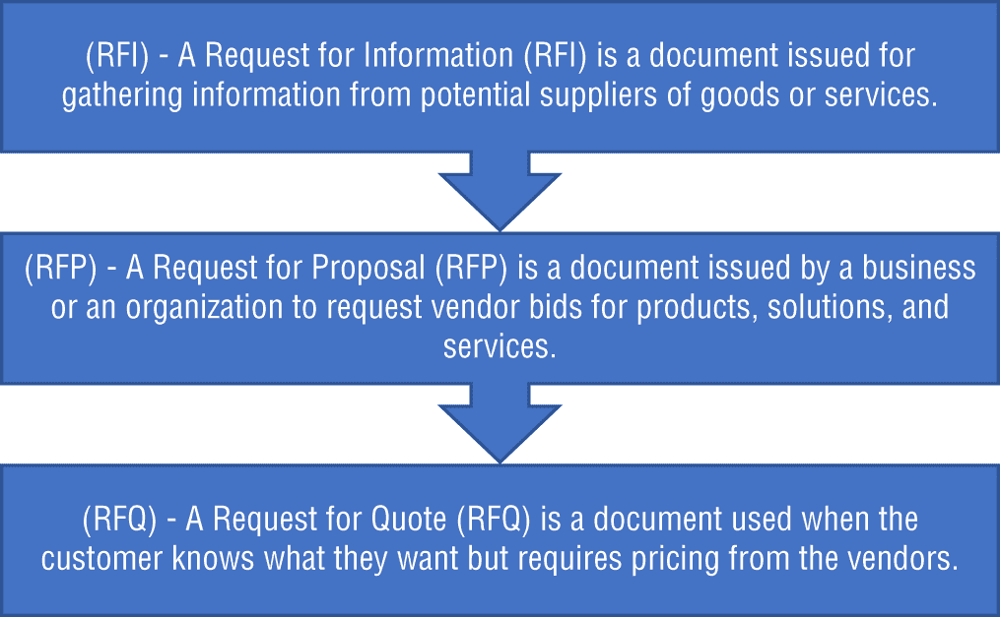
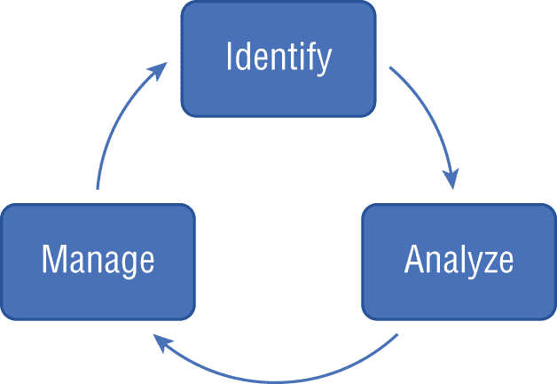
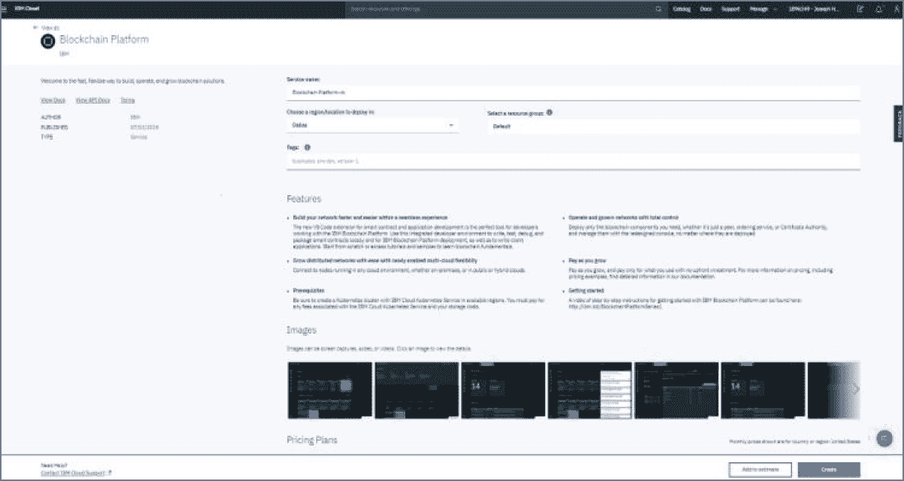
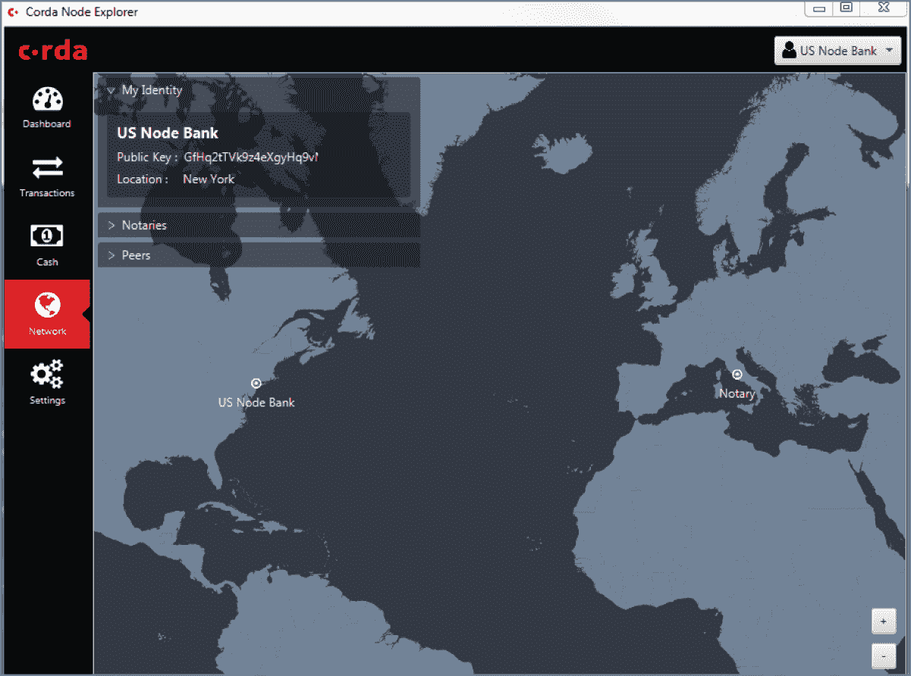
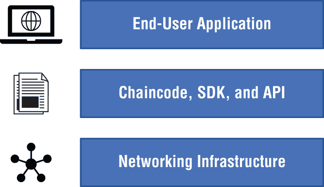
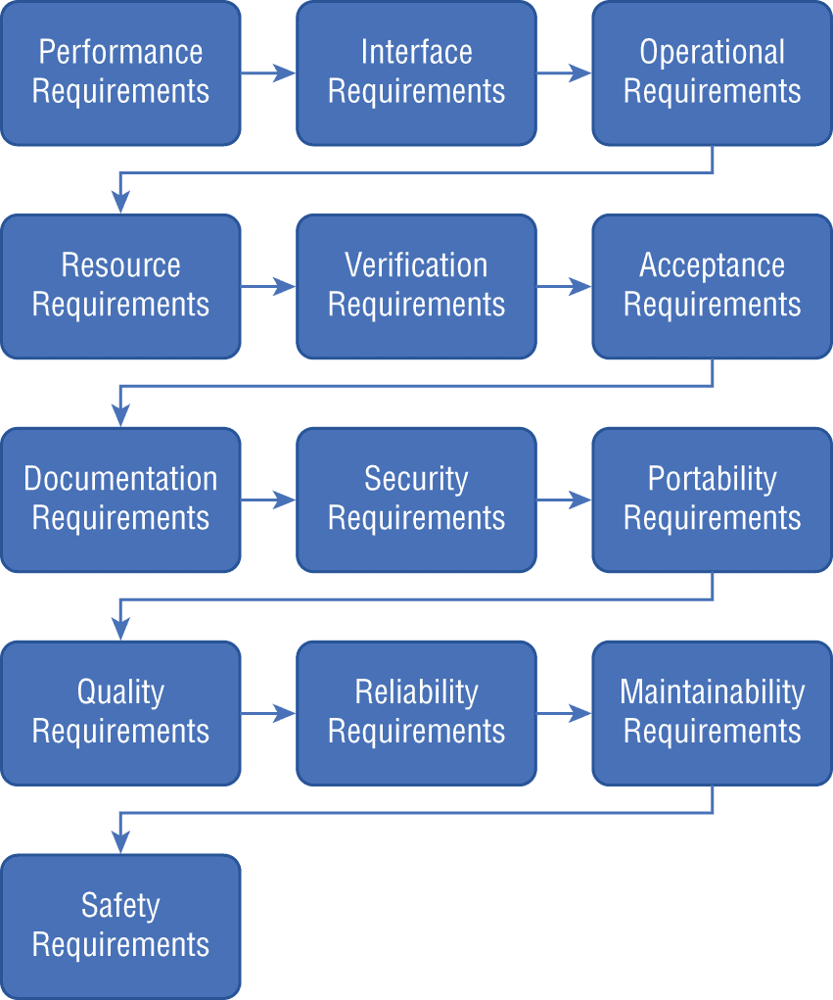
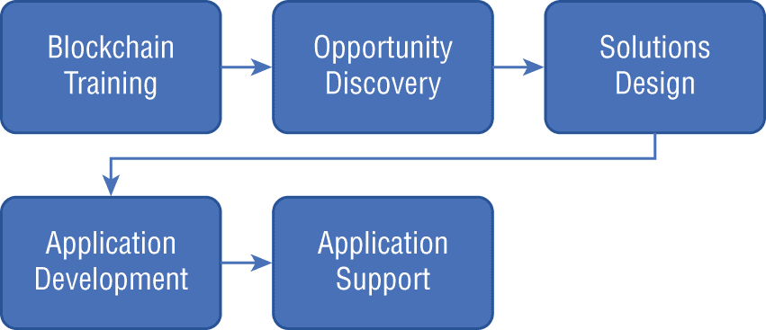

# 第五章

企业区块链销售和解决方案工程

本章介绍了典型企业区块链项目的解决方案销售周期，以及作为 VAR、IT 供应商甚至解决方案集成商如何参与区块链销售周期。区块链解决方案销售主要侧重于应用开发、合规性和企业集成，因此建议重点关注这些领域。然而，你的组织很可能已经成功地帮助客户在这些领域的应用开发、合规性和企业集成方面，因此在正确的培训下，翻译你现有的技能基础应该不难理解区块链如何提供价值并与组织集成。

在本章中，我将讨论销售区块链解决方案和解决方案销售所涉及的专业服务的具体细节。然后我将深入探讨收集需求和确定潜在用例。

本章的目标是为你提供关于如何销售区块链服务、软件和硬件的技术售前视角。我的“使命”之一是帮助你能够销售区块链解决方案。我希望确保你了解所有以下内容：历史参考资料、商业和技术资源、概念和非概念模式，以及常规售前任务，如 RFP、演示、白板、准备评估和概念验证。 ## 企业区块链销售周期

区块链销售周期在某些情况下确实可以模仿企业 IT 硬件、软件和专业服务的销售周期。在某些情景下，销售区块链解决方案的过程比传统 IT 解决方案更为直接。这是因为在金融领域，有效的生产级区块链选项明显缺乏。

但是，在其他情况下，解决方案销售可能会涉及一些新的方面，特别是涉及到区块链开发时。无论如何，无论你是否理解区块链技术，你的主要目标都应该是为你的客户提供价值。如果这意味着你需要退出流程并引入一个“区块链开发者”，那么这应该对你的组织和你的客户都是可以接受的。

在大多数复杂的销售周期中，你需要经历一个“发现”阶段，在这个阶段你讨论、理解，然后翻译客户的需求；然后理想情况下，你会继续进行探索和参与阶段，也许还有承诺阶段。

图 5.1 展示了 IT 专注的 VAR、供应商和集成商通常接受的高层次销售周期。请注意，还有一个七步销售周期，但是，为了更专注于技术方面，我们将专注于漏斗工作完成后发生的四个步骤。

**图 5.1** 高层次解决方案销售周期

这个四步骤流程在以信息技术为重点的解决方案销售以及区块链技术销售中一直被使用。在考虑将解决方案置于潜在的企业客户环境中时，这些步骤如下：

1.  确定客户希望解决的问题；在区块链行业，您将确定区块链技术可以解决的领域，如安全性、隐私性和合规性。

1.  调查问题的原因，然后为客户提出如何解决问题的建议。

1.  围绕可能的解决方案与客户进行交流。在这一步骤中，我提供了几种拟议解决方案的选项，并附带了其利益、成本和风险。向客户提供这三个方面将使您成为值得信赖的顾问。

1.  与客户合作，促进验证拟议解决方案的方法。这些验证方法可以是技术、业务和法律验证。对于技术方面的优点，可以使用演示、概念验证或甚至值得信赖的客户参考。对于业务方面，重要的是与投资回报率（ROI）、总拥有成本（TCO）以及任何其他有助于做出明智决策的客户指标合作。从法律角度来看，企业法律顾问将评估适用于区块链应用程序的一系列法规和数据保护法律。企业法律顾问已与信息技术部门会面，以避免不合规、处罚等影响。

有经验的销售执行人员了解到，企业采购是一个复杂的、建立共识的过程，很少是透明的，通常是漫长的。根据我的经验，销售区块链和分布式账本技术可能需要几周甚至一年的时间。由于各种因素，这可能是一个漫长的过程。

+   客户仍在了解区块链的确切含义以及区块链可能适用于企业的领域。技术熟练的客户将是区块链的潜在用户。

+   区块链的使用场景有限，只有一些灵活的用例。如果组织无法确定区块链可以解决的具体问题，如合规性、数据完整性、成本效益等，则销售周期可能会陷入停滞。

+   传统应用程序可能无法很好地集成，因此可能会带来额外的挑战。它们能否轻松移植或需要中间件或重建？云原生应用程序是区块链集成的良好候选对象。

+   政治挑战可能会来自利益相关者，特别是在利益相关者的角色可能受到威胁的情况下。

+   即使两个组织都是财富 100 强金融机构，它们也各不相同。从政治气候、培训、公司治理、商业模式等各个方面，都可能给销售周期带来挑战。

区块链销售周期需要耐心，尤其是当企业没有即时的用例、预算或现有技术能力时。请注意，区块链售前咨询与向已经为扩展其网络建立了企业用例的网络工程师销售一组网络边缘交换机完全不同。一般来说，在存在技术知识的情况下，这是一个关于“速度和规格”的讨论，白板和价格讨论，这些是与网络团队合作的销售团队的工作。

销售区块链技术需要与开发团队进行重要的互动。例如，开发人员在思维方式上与您典型的网络工程师有所不同。他们注重细节，清晰地认同编码语言，使用特定的行话，并喜欢解决问题。开发人员也将是唯一一组了解应用程序从头到尾如何运作的利益相关者。他们了解运行时环境、数据库结构、与端点服务的集成以及用于合规性的日志记录，例如。当向开发利益相关者展示时，您需要进行技术讨论，因此建议您带上能够讨论关注重点的人才。这些领域包括应用程序编程接口（API），如 REST 或开放 API；开发语言，如 Go、Java 和 Node；以及分布式业务应用程序的集成选项，这些应用程序可能运行在智能合约上，如企业资源规划（ERP）、了解客户（KYC）、反洗钱（AML）和客户关系管理（CRM）跨境支付等。

在某些组织中作为开发人员的利益相关者在被称为开发、开发、DevOps 部门，或者在我遇到的一个项目中叫新兴技术的部门。因此，您应该知道，在区块链项目中可能会涉及到的利益相关者并不完全是“一刀切”的。

还需要提到的是，利益相关者、决策者或批准人可能包括法律顾问和受影响的金融团体。在与公司法律顾问讨论之前，您可能希望充分了解合规性要求，这些要求我在第九章“区块链治理、风险、合规性（GRC）、隐私和法律问题”中进行了广泛讨论。

简而言之，销售区块链在很大程度上是一种“开发活动”，作为销售组织，您必须具备相关知识，以有效地定位区块链。由于区块链和分布式分类账是较新的技术，知识储备有限，您作为售前工程师的角色将更多地是“布道者”甚至是“培训师”，以确保您的潜在客户了解解决方案的价值以及解决方案将如何整合到他们的组织中。 ## 区块链角色（利益相关者）

重要的是要覆盖那些可能在区块链和账本解决方案中发挥“销售作用”的角色。在本节中，我将确定将参与有关区块链的重要讨论的利益相关者。

这很重要，因为在大多数情况下，区块链不是一般的硬件或软件销售。还要意识到围绕区块链的解决方案销售可能会扩展到您通常与之合作的首席信息官、IT 主管和网络或数据库管理员之外。在区块链、共识、框架、智能合约和分布式应用程序的新世界中，IT 角色是企业关注的一个不断发展的领域。一些角色可能需要专门的区块链专业知识，而有些可能只需要区块链技术是一个“了解即可”的重点领域。

以下角色通常在企业区块链领域中找到。这些定义更多地提供作为一般理解指南，因为人们很可能会期望，在某些情况下，标题和实际工作职责在公司之间差异很大。

+   **区块链开发人员** 区块链开发人员专注于开发智能合约或链码、设计分布式应用程序（DApps）或集成前端用户 Web 界面，以与区块链网络应用程序进行交互。具有 Java、JavaScript、Python、Solidity、Go 甚至 C++开发经验的传统开发人员在区块链开发方面表现良好。对于经验丰富的区块链开发人员的需求从未像现在这样高。

+   **区块链架构师** 区块链架构师是一个面向客户的角色，主要负责收集客户需求，将需求转化为可运行的平台，并将平台交给区块链开发人员进行智能合约、分布式应用程序和客户端应用程序的开发。在许多组织中，区块链架构师也可以被称为解决方案架构师或咨询工程师。

+   **区块链管理员** 技术负责人负责管理区块链平台的售后管理。一般来说，区块链管理员管理过其他平台，例如云计算或电信。

+   **区块链操作员** 区块链操作员是负责管理证书和账户以及对区块链进行许可的角色。在较小的组织中，区块链操作员和区块链管理员的角色可能会合并。

+   **区块链法律顾问** 在重视区块链合规性的组织中，这个角色是必不可少的。律师（顾问）通常为智能合约和财团伙伴关系建立“法律条款”，维护合规性/治理要求，并对各种区块链相关问题进行尽职调查。据我所见，在专注于首次代币发行（ICO）的组织中，这个角色侧重于架构交易。

+   **解决方案架构师** 这是一个技术角色，与客户直接对接，被认为是大多数 VAR、供应商或经销商中最关键的技术角色之一。解决方案架构师的目标是将区块链解决方案应用于解决业务问题。解决方案架构师和售前工程师的角色经常重叠。

+   **售前工程师（架构师）** 这是一个面向客户的角色，对组织至关重要，工作在“销售之前”的能力范围内。他们本质上为更多的技术领导铺平了道路。售前工程师真正关注的是区块链产品如何转化为解决方案，并向客户解释这一点。值得注意的是，大多数大型培训公司和专业服务组织也可能拥有一个专门从事区块链或专业服务或开发的售前工作角色。售前工程师或架构师的职责通常与解决方案架构师的职责相同或重叠。售前工程师和架构师被视为“收入产生”角色，因此对组织至关重要。如果你喜欢人际交往，想要积极为公司创收，并因这种“前线”参与而受到奖励，那么这个角色可能适合你。

+   **区块链营销人员** 区块链营销人员的角色是非技术性的，更侧重于向潜在客户传达区块链解决方案和服务的业务利益。这个角色通常在展会、会议和社交活动中有很好的表现，并且真正专注于积极寻找公司的潜在客户。在一些较小的公司中，例如，我看到内部销售和客户经理有责任成为区块链营销人员。

+   **区块链项目经理** 这个角色是非技术性的，更专注于确保区块链实施按计划进行并控制预算。一般来说，任何管理 IT 项目的项目经理在这个领域都可能取得成功。我发现一些项目经理可能会感到新奇的一个领域是理解与加密货币交易所的复杂流程进行接口交互。

+   **区块链培训师** 这个角色专注于使客户能够使用区块链技术。区块链培训师应该既技术上又以客户为中心。通常，技术要求将集中在网络、应用程序开发、业务流程和培训方面，但也可能负责设置概念验证。## 基于 IT 的销售周期

尽管区块链技术可能很复杂，但实际上区块链销售周期遵循您用于销售电信设备、数据存储阵列、云计算平台或 CRM 解决方案的典型销售周期。

图 5.2 中显示的七个步骤构成了典型的销售周期过程（尽管一些供应商使用八步系统）。对于本书，我主要关注区块链销售周期，尽管没有官方销售周期。然而，我提供了如何处理销售周期不同部分以适应区块链技术的见解。在销售周期结束后，我将转向设计和实施阶段。

每个 IT 供应商、系统集成商和咨询公司都有自己对销售周期世界的看法。在为几家大型组织（Brocade Communications、Hitachi Data Systems [HDS Federal ViON]、3Par Data 和 Dimension Data）工作了十多年后，我意识到每个行业垂直领域都以完全不同的方式看待解决方案销售，从而以不同的方式驱动收入。也就是说，一些组织在专注团队方法上非常前置（销售执行官和销售工程师/架构师的 1:1 比例），而其他组织则不那么重视（两个或更多的销售执行官对应一个销售工程师/架构师）。比例可能高达 5:1，这可以直接与行业垂直领域或地理区域相关。

售前工程师通常销售被认为昂贵的解决方案，也作为资本支出，例如 IT 网络设备或数据存储硬件或软件。在销售周期的大部分阶段花费相当多的时间也很常见，就像销售执行官会做的一样。这可能与销售周期较短的产品或服务不同，后者的销售周期可能更快。售前工程师确实不应该完全参与到每个阶段中，但必须得到销售执行官的明确沟通。

**图 5.2**七个销售周期阶段

通常情况下，作为一名售前工程师，参与客户的发现过程以及了解客户的痛点和导致这些痛点的原因是非常重要的。一名经验丰富的售前工程师应该知道何时介入，何时退出，例如，在何时将技术方面交给专注于区块链解决方案的工程师。基本上，作为售前工程师要知道自己的界限，并根据需要与售后团队合作。

下面的阶段，为了有效、高效、专业地处理销售和技术方面，以确保客户在需要时能够得到他们需要的东西。

七个阶段的 IT 销售周期的领域由我的自身输入定义：

1.  **勘察（关系）**：这一步涉及通过各种方式获取客户潜在客户的线索，如会议、展会，甚至是其他客户的推荐。传统上，供应商有提供线索的团队以及合格的内部销售人员。这个阶段更多地是建立与客户的关系和建立信任。最后，请求提案是一些公司（特别是政府和教育部门的公司）可能寻找客户的另一种方式。

1.  **准备（情报收集）**：这一步涉及准备与客户面对面或在线会议，收集关于客户和企业的信息。收集一些适用于他们行业（金融、能源、保险、政府等）的使用案例。此外，一位优秀的客户执行应该识别痛点，确定任何额外的利益相关者和业务决策者，也许还应该确定项目资金。

1.  **方法（初次会议）**：在方法阶段，你的客户执行将处理初次面对面会议、网络研讨会或电话会议。事实上，这些初次会议通常不包括售前工程师。在某些情况下，你作为销售工程师应该“筛选”客户和你的组织解决方案。作为这一阶段的一部分，应该确定技术决策者。

1.  **演示（第二次会议）**：在这个阶段，作为售前工程师的你可能会通过至少一次演示、一个白板，很可能还有一次演示或概念验证（POC）来展示区块链解决方案的工作原理。

1.  **客户异议（处理）**：对于销售团队而言，销售周期七个步骤中最具挑战性的部分可能是处理异议。处理异议就是积极倾听你的潜在客户的顾虑，并以能够提供价值的方式予以解决，以便他们能够做出决定。作为销售工程师，你应该致力于“技术性成交”，即在你已经提供了足够的技术上有效的关于需求的信息后，客户认为他们可以做出有利的决定的那一刻。

1.  **成交（采购订单）**：这是当利益相关者和销售团队管理人员签署采购订单（PO）的阶段。在这个阶段，将解决实施细节，并召集任何必要的实施团队。

1.  **后续跟进（支持关系）**：在您的采购订单签署后，并且实施团队已经在与客户一起工作的几周后，您应该认为销售团队了解项目进展至关重要。销售团队应向客户展示，他们在采购订单签署和区块链实施之后会一直与他们在一起。

### 预售任务

在销售周期中，很明显销售是由销售团队推动的，你需要意识到销售团队为完成交易所付出的努力程度。在收到任何采购订单之前，预计以下任务之一，如果不是全部，将被执行以完成区块链交易的关闭：

+   提案请求

+   辨识、分析和管理利益相关者

+   区块链就绪评估研讨会

+   进行演示

+   使用供应商演示工具

+   进行区块链就绪评估研讨会

+   制定解决方案

+   进行概念验证

+   通过区块链作为服务来启用销售流程

#### 提案请求

提案请求（RFP）通常在特定行业细分中被广泛使用，作为组织为其企业进行采购的主要工具，从成本的角度来看，这是一种强制性成本。

在美国联邦部门，采购也被称为*收购*，并受到处理美国联邦合同和美国联邦合同过程的法规的监管。美国法典的标题 10、31、40 和 41 是美国联邦合同的常见参考。

无论是军事、情报还是民用机构，在联邦、州和地方各级都将 RFP 称为政府的*招标*。

即使是大型商业公司也会为提案请求征求投标者。作为解决方案提供商或潜在供应商，您可能会参与区块链提案请求，因此在开始提案请求之前，让我们澄清一些术语。

+   对提案请求做出回应的解决方案提供商称为*投标者*。

+   发出提案请求的客户被称为*提出请求者*。

我超过十年的工作经验的一部分是专注于华盛顿特区地铁区域的政府合同（军事和民用机构）。作为这一经验的一部分，我可以向您保证，您进入大多数联邦、州和地方实体的唯一途径是通过提案请求过程。

我将提案请求称为门卫或守门人，因为您别无选择，只能参与该过程。信息请求（RFI）、报价请求（RFQ）和提案请求（RFP）对于提出请求者和投标者来说都可能是耗时且基本上复杂的过程。

图 5.3 展示了标准的高级 RFP 工作流程步骤。工作流程始于 RFI，这是一个信息收集请求。然后继续进行 RFP，这是销售团队的工作。最后，一些公司可能会绕过 RFI 和 RFP 流程，直接发布 RFQ，这是一个定价的练习。

**图 5.3** 采购工作流程步骤

采购流程还包括一个被称为*采购活动*的漫长工作流程，其中包括以下内容：需求开发，预奖活动和后奖活动。由于广泛的政府采购流程、法规和由美国总务署（GSA）管理的投标流程，这些过程通常对发起者和投标人都很复杂。GSA 使用一套一致挑战的评分系统来评价提案的出价。这些挑战被称为*抗议*，通常是由于 GSA 对公司的评估而产生的，这可能导致公司的评分不利于赢得投标。

当一个组织决定竞标政府合同时，例如，有一些行业最佳实践可用于评估和响应 RFP。RFP 结构良好，从投标人的角度来看，它们需要团队共同完成。请注意，有红队、蓝队、绿队、金队和粉队，每个团队都有特定的责任围绕提案开发。这些团队本质上是提案状态成熟度的逻辑表示分层方法。

在考虑参与与区块链相关的 RFP 之前，您的组织应确保拥有合适的专业知识，并且愿意接受失败。在少数存在的区块链 RFP 中，重要的是要意识到，一些组织似乎将 RFP 流程更多地用作教育过程而不是采购过程。这可能并非是故意的；相反，发起者可能没有接受过区块链方面的教育，因此无法理解要解决的真正问题。

简而言之，如果您没有仔细审查提案细节，响应 RFP 可能是浪费公司资源的一种绝佳方式。例如，只有一个回应可能对发起者不清晰，这可能导致您的组织不符合资格，甚至无法赢得采购，无论您是分包商还是主承包商。在商业和政府承包的世界中，*主承包商*是直接与客户签订合同的主要承包商。*分包商*是直接为承包商工作而不是为客户工作的分包商。主承包商和分包商可能会共同参与提出 RFP。

您还需要清楚地认识到，如果客户没有建立拟议的使用案例，那么大多数 RFP 甚至都不值得考虑竞争或投标。您的组织可能需要考虑到有限的资源和投入竞争所花费的资源，尤其是如果政府确实不知道它试图解决的问题。

RFP 要求提供详细的技术回应，这些技术回应必须适当地解决客户的需求。RFP 肯定会提供一系列每个投标公司必须回答的问题。这些问题可能包括业务方面的回答，例如以往经验或公司流程，以及更加技术性的回答，包括提出了什么类型的解决方案，甚至详细的设备清单。

RFP 可能会分发给在 RFI 过程中确定的所有公司，也可能会公开发布以征求其他投标人。在 RFP 过程中，最重要的任务是提案开发。这是回应公司（投标人）将以其提议的解决方案回应 RFP 的地方。

RFP 问题通常在技术上非常详细，投标人需要在如何回应每个问题上非常小心。这些回应将全面了解投标人及其对招标方案的潜在解决方案。另一方面，RFI 将询问一系列标准问题，涉及公司历史、技术能力、合作伙伴关系、商业计划、所有权和其他较少技术细节的关键细节。

当涉及采购流程时，RFP 可能是您的组织业务计划的一部分，也可能不是。如果是的话，学习如何回应应该是首要任务，同样重要的是找到能够洞察您特定组织市场（如教育、政府或商业）的资源。

对招标的回应可能会耗费大量时间，即使您经验丰富。在考虑是否回应美国联邦招标时，有严格的要求，建议您的组织留住商业和技术人才，以制定适当的回应。#### 识别、分析和管理利益相关者

每个组织在项目或采购中都有不止一个利益相关者。一般来说，作为项目管理的最佳实践，如果项目是由于合同协议而进行的，建议销售团队审查合同协议，找出将参与销售过程的利益相关者。

*利益相关者*是可能以某种方式（直接或间接）受到给定项目影响的人员。这些利益相关者可能是参与项目的员工、组织，甚至是合作伙伴公司。利益相关者具有不同程度的影响力，例如技术影响者或商业影响者。

利益相关者识别当然是至关重要的，以确保销售团队和客户不会浪费他们的时间。确定决策者和最终用户。决策者需要参与，并确保有合理的承诺与你进行必要的交流。

图 5.4 展示了利益相关者流程工作流程。在确定利益相关者时，最好的地方之一是识别组织中的角色。第二步是分析；你要理解利益相关者的角色，并了解他们如何影响区块链解决方案的决定。最后，你必须以促进你作为值得信赖的顾问的角色为目标来管理你的利益相关者，这意味着响应迅速、有效、熟练和诚实的沟通。

**图 5.4** 利益相关者流程工作流程

利益相关者工作流程很简单。首先，你必须确定谁是利益相关者，然后分析他们以确定他们拥有的权限级别。例如，他们是技术驱动还是更注重业务？然后你可以继续工作流程的最后一部分：管理。你以适当的方式与利益相关者接触，比如开会、用白板、提案，然后满足适当的期望水平。

作为你客户基础的值得信赖的顾问，你必须确保尽可能专业地代表你的组织。做到这一点的最佳方式之一是清楚地了解利益相关者及其在组织中的角色。清楚地了解利益相关者应该帮助你不仅适当地设定期望，而且满足或超越这些期望。当然，你最后想要做的一件事情就是“过度承诺，交付不足”，这是销售培训中常用的一句话。#### 区块链准备评估工作坊

区块链准备评估工作坊的重点是了解客户在采用区块链技术方面的进展。通常，准备评估也被一些供应商和合作伙伴称为*区块链工作坊*。

工作坊正是作为供应商、VAR、集成商或服务公司所期望提供的，以帮助在高度互动的环境中促进知识转移。当涉及评估和建立需求时，白板是一个可能的需求。白板对于识别问题并以对供应商和客户都可视化的互动方式呈现解决方案至关重要。

一般来说，在你作为工程师的角色中，你会希望与客户合作，为组织建立潜在的区块链用例。作为流程的一部分，你还将确定需求、教育客户，并提供一份带有实际可应用用例的摘要报告。

在区块链研讨会期间，您希望至少审查以下步骤：

+   通过与利益相关者接触，确定区块链技术的潜在机会，促进围绕潜在问题的解决方案的讨论。

+   识别和记录组织的区块链用例的潜在规模。一些组织可能还没有准备好作为一个独立单位或部门使用区块链。潜在客户更有可能从作为“联盟”的方式中受益，其中共享成本和利益可以提供直接价值。

+   记录利益相关者的功能需求，这些需求将规定区块链在业务层面上应该完成的任务，例如合规性、报告、审计、授权或业务重点。

+   记录利益相关者的非功能性需求。非功能性需求规定了系统在性能、可靠性、安全性或技术方面应该做什么。

+   确定客户对区块链实施的感知风险。

+   记录任何合规性要求，例如 GDPR、PCI、SOX 和 HIPPA 等，因为这些要求是区块链用例的重要组成部分。

+   确定任何性能要求，例如每秒交易量（TPS）。与客户端服务器技术相比，区块链不是一个高性能平台。

+   向您的客户提供任何预期的下一步评估流程，例如后续电话或报价。  #### 演示执行

演示是大多数预售工程师职位的必要组成部分。演示在许多方面与概念验证不同，后者在销售周期的后期进行。演示需要直接、及时、高效，并保持在 30 分钟以内。

在进行演示时，以下是一些需要注意的最佳实践：

+   尽可能在您自己维护的稳定平台上执行演示，无论是在您自己的平台上还是在云区块链即服务中。

+   区块链演示“软件”为重点，在大多数情况下应该保持围绕此展开的“故事板”。故事板是一种传递功能和功能的逻辑方式。

+   确定客户感兴趣的具体关注点、特性或功能，并尽可能避免“标准”演示流程。

+   保持演示时间不超过 30 分钟，以避免失去客户的注意力。

+   提前确定您的客户利益相关者群体，并提供专注于受众的演示。例如，CIO 的兴趣会与云开发人员或网络工程师不同。

+   如果客户想要“驱动”区块链交易，提供交互式演示。

+   在演示过程中，展示解决客户在以前讨论中确定的“痛点”的解决方案。

在进行演示时，我喜欢设置一个基本配置的区块链即服务（BaaS）来满足客户的兴趣，并围绕减少“痛点”提供价值。例如，如果演示涉及超级账本 Fabric 并且您正在 IBM Bluemix 上运行它，那么您基本上已经准备好了。如果客户群体是开发人员，我会指导他们如何部署链码（智能合约）。另一方面，如果涉及的客户群体更多是高管级别的，那么我希望专注于创建效率，展示易用性，并讨论可以通过解决方案实现的任何 ROI/TCO 节省。

图 5.5 显示了启动 IBM 区块链平台中区块链服务的界面。

**图 5.5** IBM 区块链平台

IBM 区块链平台界面使销售工程师、开发人员或客户能够在几次点击中启动超级账本区块链网络。您可以看到该服务需要服务名称、区域和组织来启动 IBM 区块链平台中的区块链网络。在进行演示或概念验证时，您可以在几分钟内开始，并且这可能为组织带来重大的结果。  #### 使用供应商演示工具

一些供应商还提供额外的工具，可以向客户展示接口的工作方式、交易发生的方式或如何部署节点。在某些情况下，您可以在笔记本电脑上运行的演示工具非常宝贵。

R3 Corda 提供了一个稳固的演示工具，称为 Demobench。Demobench 是一个独立的桌面应用程序。Demobench 的目标是让您能够轻松在桌面上配置和启动本地 Corda 节点。对于培训课程、演示或只是 Corda 的实验，它非常有用。

图 5.6 显示了 Corda Demobench 中的网络图。这个特定页面称为节点浏览器，可以在您的笔记本电脑上本地使用。它部署了一个 JVM 并专门用于演示在本地运行的一个实例。

**图 5.6** Corda Demobench  #### 白板演示解决方案

白板演示是客户面对的工程师最关键的技能之一。白板演示是一个强大的销售工具，可以向客户提供关于你对他们环境的理解以及提供的解决方案的洞察。白板演示应该以易于理解的工作流程、图表和图示清晰地构建客户的决策过程。

白板演示最好由一位技术工程师来进行，他能够传达组件集成、网络连接和应用程序网关的正确可视化。

作为白板会议的一部分，建议讨论客户的痛点，然后您可以将其直观地映射到特定的应用程序上。深入了解挑战和客户需求肯定会促进围绕区块链解决方案如何解决他们的问题进行充分的讨论。请记住，白板是社交互动的一种形式，是识别客户痛点的视觉出口。一旦客户知道你清楚地了解他们的痛点，提出解决方案就应该是次要的。  #### 实施概念验证

概念验证是大多数销售工程师在一定时间内都会参与的技术练习，以帮助识别客户试图建立的特定性能、安全性以及可用性等因素，这些因素对于他们的使用案例是有效的。

POC 本质上是实现某种方法或想法以证明解决方案可行性的过程。这通常是一个“视觉”过程，用于向客户证明解决方案可能有效。本节包含了我的 POC 最佳实践。

首先，在执行概念验证时，我做的关键性事情是与销售团队讨论客户是否经过了审查并且具有采购的可行性。（客户在财务上是否经过审查？）作为最佳实践，您的组织账户主管（AEs）应该对正确的潜在客户进行审核，然后与适当的利益相关者跟进，以确保对于客户和销售组织来说，POC 是一个有效和适当的练习。根据我的经验，向 AE 询问客户验证是公司从技术和商业角度来看是否符合最佳利益的明智决定。远程执行一个打包的 30 分钟演示是一回事，但为一个特定的使用案例设置一个周末，并且在现场待两天则是完全不同的情况。作为工程师，你完全负责你的时间，并且应该想要确保你不是“在一个无效的湖泊中钓鱼”。

其次，我要求客户和销售团队直接与我合作，为 POC 建立清晰的“成功标准”。例如，在现场之前可以通过电话会议进行。POC 必须为您作为工程师明确定义；您必须能够陈述目标和所需的结果，这些是成功标准。你可以无目的地开车，也可以设定目的地。作为 POC 的负责人，选择权在你手上，我建议你被明确地确定为驾驶员。

最后，我喜欢与销售主管确认客户是否承诺，如果我们按照成功标准交付，我们就能赢得采购。如果对客户的期望没有正确设定，那么就显示出销售团队的薄弱，并且作为工程师，你很可能会参与到另一个无效的练习中去。

一般情况下，您被要求执行 POC 是有原因的。执行 POC 的一些常见原因如下：

+   向客户展示解决方案的功能以及解决方案如何解决他们的痛点

+   为了为您的客户减少一些解决方案采购的风险

+   利用采购流程并与潜在利益相关者建立信任

企业区块链具有不同的用例、限制和功能，作为一名工程师，您需要了解这一点。在考虑区块链 POC 时，识别区块链架构以及应用程序堆栈非常重要。应用程序堆栈是复杂性可能出现的地方。复杂性可能涉及集成端用户应用程序、商业 API、分散和开源应用程序，甚至合规实施。例如，Hyperledger Fabric 基于三层架构。Hyperledger Fabric 的三层是区块链网络、链码和客户端应用程序。在执行 POC 时，您作为销售工程师的角色很可能是安装链码。链码可以用 Go（Golang）、Java 和 Node.js 中的一种开发语言编写。

开发应用程序并将其移植到区块链平台，当然，这是客户开发团队的责任。在第十章，“区块链开发与编程”中，我将在本章后面更详细地介绍这个开发领域。

图 5.7 提供了关于 Hyperledger Fabric 开发堆栈的三个层次的深入见解。Hyperledger Fabric 在网络基础设施层面专注于将区块链网络与 API 连接，并将节点与它们的智能合约集成起来。链码、SDK 和 API 是将区块链网络与端用户应用程序组合在一起的“中间件”。

**图 5.7** Hyperledger Fabric 开发堆栈

这里学到的教训是，POC 可以是与销售团队以及客户合作为企业区块链提供价值的有益机会。在执行 POC 之前，您希望确保客户利益相关者的认可，并确保已经确定了有效的“成功标准”。#### 利用区块链作为服务推动销售流程

作为一名经验丰富的云架构师，我可以向您保证，赋予任何 IT 销售组织的最大的“礼物”之一是区块链即服务（BaaS）。在 IBM Bluemix 等领域，这也被称为区块链平台即服务（PaaS）。

销售组织可以使用云服务而无需或少量使用资本支出，利用云服务进行其区块链（如 Corda、Hyperledger 和 Ethereum）的 POC（概念验证）、演示和培训。有时候，确实没有必要为区块链基础设施的资本支出向 C 级套房请求资金。销售代表知道，在任何规模甚至是适度规模的公司中请求资本支出资金是一个耗时且令人沮丧的过程。从我的经验来看，实际上这很可能是一系列耗时的过程。

2009 年，我记得在华盛顿特区大都会地区向商业部门销售 3PAR 数据存储阵列。与 EMC 或 HDS 阵列相比，这些 3PAR 阵列价格便宜，具有相同数量的千兆字节或兆字节。我们谈论的是一笔 50,000 美元的交易与一笔 800,000 美元的交易，我们正在竭尽全力获得采购订单。在我看来，您需要了解利润和客户获取成本，我在 第六章“企业区块链经济学” 中进行了涵盖。根管手术可能被认为是不太有压力的。

一些公司甚至可以以不到 100 美元的价格启动 BaaS。如果您可以使用一些供应商允许的“推广积分”或“永久免费”层，甚至可以免费。

总之，您也可以在云中使用资源进行演示、概念验证，甚至在培训过程中使用。我也喜欢在准备评估期间进行演示，只是为了让技术人员思考并将云服务与区块链服务进行比较。老实说，并非每个销售组织都适合使用区块链作为服务，当您有用例和交易量来证明大量投资时，拥有一个专用平台也可以在许多方面提供效益和好处。例如，有一个专门的区块链服务团队的一个坚实的用例是，当更大的咨询公司、VARS 和供应商投资于他们自己的专用内部私有云，并且可以扩展服务以包括区块链时。

销售区块链解决方案的一个挑战之一是不要过度宣传所谓的区块链解决方案的好处。在一些市场上，区块链技术仍处于“采用者”阶段，因此它可能被“过度宣传”为解决每个企业挑战的解决方案。我看过许多博客文章，听过许多会议演讲，讲述了特定的区块链解决方案如何解决几乎每个问题，我会给大多数博客文章打 A 分，但在可行性方面给 F 分。

区块链技术在解决问题、提高效率和建立强大的用例方面存在局限性。在销售区块链解决方案时，您需要同时与公司的业务和技术专家进行沟通。例如，如果客户对供应链管理或合规性有用例，这些潜在的用例可能非常适合建立不可变性和透明度的用例，但该用例可能无法有效地满足客户的性能和安全性需求。

#### 需求收集

捕获足够的需求以有效识别正在构建的软件解决方案至关重要。在收集这些需求时，请确保它们是可测试的。例如，一个要求指出“解决方案必须在高峰工作负载时处理超过 200 个每秒的事务（TPS）”的需求显然是可测试的。另一方面，一个要求指出“解决方案应该对利益相关者非常高效”并不清楚显示它如何被测试，也不能作为可行的要求。

您的区块链解决方案可能涉及一些重要的软件设计和开发，但也可能涉及一些硬件需求和可能的区块链即服务解决方案。从历史的角度来看，您需要了解典型的最佳实践主要集中在哪些方面进行需求收集。这些需求被确定为功能性需求和非功能性需求。软件系统功能性需求说明解决方案应如何实现所提出的最终结果，而非功能性需求将确定解决方案如何实现这些最终结果的约束。

让我们更具体地定义这些要求，并提供每个要求的示例。

+   功能性需求将指定一个解决方案、系统或特定系统组件必须能够为客户实现的功能，或提供一个可行的用例。这些功能性需求提供了系统如何实现所述标准的技术细节。

*例如*：公司的利益相关者确定电子商务网站应提供易于使用的购物车体验，对消费者来说直观易用，高度安全，但也具有高性能，以增加公司的收入。

+   非功能性需求是指确定用于衡量系统或其组件操作的标准而不是具体例程的要求。这些非功能性需求定义了外部约束、系统限制和其他技术规定的结果。这些非功能性需求有助于确定项目的成功或失败。

*例如*：公司用户群体确定电子商务应用将利用公司 A 的开源解决方案，该解决方案提供了托管的电子商务解决方案。该解决方案使用业界领先的 SaaS 平台集成“Shopify”购物车，并作为集成解决方案的一部分提供了超过 2000 TPS 的企业 SSL 证书。

还值得注意的是，非功能性需求有两个主要类别。

+   执行质量，例如，关注性能和可用性，这被认为是可观察的，因为我们有文档记录。

+   演化质量是可测试性、可维护性、可扩展性和可伸缩性，嵌入在软件堆栈的静态结构中。

IEEE-Std 830 - 1993 清楚地说明了应将“13 个非功能性需求”吸收到软件需求文档中。图 5.8 显示了由电气和电子工程师协会（IEEE）规定的 13 个要求。

**图 5.8** IEEE 13 非功能性需求

IEEE 是一个由工程师于 1884 年成立的世界知名的非盈利专业组织。该组织的主要目的是整合与电工技术有关的思想。IEEE 在出版技术著作、赞助会议和研讨会、提供认证和制定标准方面发挥着重要作用。

你可以看到 IEEE 认可的非功能性需求列表中有 13 个区块。在本书范围内，我不会详细介绍这 13 个非功能性需求。如果你对这些 IEEE 非功能性需求不熟悉，我建议你访问 `[`ieeexplore.ieee.org/document/392555`](https://ieeexplore.ieee.org/document/392555)` 从 IEEE 获取更多信息。

区块链解决方案是一个软件解决方案，涉及计算机网络、计算机安全和业务等方面，例如合规性。从历史上看，软件系统的功能性要求说明解决方案应该如何实现某事，而非功能性要求则说明了解决方案将如何实现某事的约束。

表 5.1 显示了一些常见的与区块链相关的功能性和非功能性需求，区块链解决方案通常涉及到这些。如果你的客户询问技术规格，比如正在使用哪种共识类型，他们关心的是非功能性需求。

**表 5.1**：区块链功能和非功能性需求示例

| 非功能性 | 功能性 |
| --- | --- |
| 系统如何完成其工作和属性。 | 系统做什么或达到了什么目标。 |
| 技术规格 | 业务需求 |
| 交易日志数据冗余 | 合规性要求 |
| 交易日志维护 | 容量管理 |
| 使用点对点流言协议进行交易处理 | 企业区块链性能 |
| 分布式账本版本 | 数据透明度 |
| 用户界面 | 直观易用性 |
| 实用拜占庭容错（PGFT） | 防范恶意节点 |
| 利用 x.509 证书 | 确保安全成员身份 |

区块链有一些明确的要求可以被指定，比如共识、证书和协议。然而，就像每一种技术一样，也有一些无法量化的要求，意味着衡量不是可以用数字来表示的。一些例子包括用户体验、易用性或对公司品牌的信任。 #### 要求权衡

与生活中的任何事物一样，特别是工程软件和硬件系统、解决方案和组件，您可以期待您的设计中存在权衡。一般来说，您需要在性能、安全性和弹性之间进行权衡。

了解三维中的权衡需要理解三角形。图 5.9 展示了设计区块链时要理解的三个设计权衡。

**图 5.9** 设计权衡三角形

区块链的性能主要集中在每秒交易次数上。安全性主要集中在平台可能实现的风险上，例如漏洞。最后，弹性关注的是如果网络节点宕机时区块链平台将如何可用，有时会与可用性进行比较。例如，如果您提出的区块链解决方案正在使用 Hyperledger Fabric，并且您的设计在新泽西的一个数据中心中使用了八个节点/对等体，那么您的部署非常局部化，没有地理弹性。如果电网断电会发生什么？如果有天气事件发生会怎么样？局部化的区块链网络尽可能高效，但在面对区域性灾难时提供不了弹性。

当您需要扩展您的区块链并部署额外的节点/对等体时，您必须考虑您的新位置以及在您的区块链网络中引入一些延迟的可能性。您可能会遇到的性能与您预期的不同。现在，您拥有一个地理上具有弹性的区块链网络，但由于引入了额外的网络延迟，每秒低交易的性能不同于预期。

另一个常见的权衡是在共识方法（算法）和与之相关的普遍问题之间。例如，一些共识方法严格用于公有无许可的区块链，如工作证明（POW）。在公有无许可的区块链中，你基本上放弃了你的隐私和安全，然后处理性能问题。在有许可的区块链中，你的成本和责任更大，但你也获得了安全性、隐私性，在大多数情况下，性能方面的好处。

表格 1.2 比较了公有链和私有链。清晰地向客户传达这些设计差异非常重要。

无论你决定实施无许可或有许可的区块链，都会有取舍。你必须权衡区块链设计中的取舍，并选择相应的方案。在需求收集和区块链设计方面，公有链和私有链之间存在显著差异。例如，如果你讨论 KYC，那当然会要求客户进行身份管理，那么你就会排除公有无许可的区块链，因为你没有为“了解你的客户”建立机制。#### 技术上对区块链机会进行资格认定

作为一名售前工程师，你可能是你的销售组织中唯一的区块链技术专家，或者你可能不是。无论如何，你都可能希望控制你的时间。

对区块链机会进行资格认定是确保你的时间和公司资源不会被错置的必要条件。可能会出现的挑战之一是，当你有一个销售团队或客户经理完全依赖你为每一个可能的解决方案对客户进行资格认定时。在最初考虑潜在的区块链机会是否有资格时，我会考虑以下几点：

+   客户的潜在使用情景是否是“概念匹配”，即区块链是一个有效的使用情景？例如，客户是否需要符合要求的海关报关不可变记录，这些记录将需要保留以供审计？或者客户对其物流应用程序不需要高 TPS 性能使用情况。基本上，区块链解决方案的属性是否被清晰理解，并且能否应用到客户使用情景中？确定“概念匹配”应该是你的主要目标之一。

+   这个客户是否有利益相关者的支持？例如，已经确定将逐步淘汰的当前数据库应用是否是企业可以克服的技术和业务挑战？你需要了解客户是否有利于新技术的环境。

+   这个客户是否有历史上行之有效的行业使用案例之一，例如与竞争对手，并且过去的表现是否能够提供一些洞察力，以及这个潜在的收益和用例验证？你是否真的能够将使用案例与另一个已经记录了区块链成功的公司相匹配？这样做会使解决方案销售对客户来说更具说服力。  #### 区块链决策工作流程

当您与潜在客户一起讨论区块链是否会是一个有效的解决方案时，了解到作为一名工程师或架构师，您需要遵循一个工作流程，并且要进行潜在领域的清单，这些领域可能会成为区块链是否是一个好的用例的关键因素，这一点非常重要。

IEEE 决策树为您的使用案例是否从区块链中受益提供了一个易于理解的“考虑”决策的工作流程。我喜欢 IEEE 决策树的一个主要原因是它从询问传统数据库技术是否满足您的需求开始。这个问题确实会非常轻松地过滤出需求。你可能遇到的一个挑战是，区块链行业试图让人们相信区块链是解决每个问题的方法，通过使用“找钉子的锤子，把每个问题都变成钉子”的方式。事实上，如果客户更喜欢或需要，例如，高交易处理量（超过 1000 TPS），那么你刚刚排除了区块链。另一方面，如果隐私、安全性和合规性是主要关注点，那么你很可能有一个潜在的区块链应用用例。

决策树提供了在决定区块链是否合适以及是许可区块链还是非许可区块链是否合适之前应该提出的问题的洞察。

+   首先需要做出的决定是意识到，如果传统数据库可以胜任，那么可能不需要区块链。如果传统数据库行不通，那么你可以继续进行。

+   第二个需要做出的决定是确定是否会涉及多个参与方。如果是这样，那么继续进行第三个决定。通常情况下，以联盟为基础的区块链是最佳的使用案例。

+   第三个需要做出的决定是关于信任和是否可以使用第三方。

+   第四个需要做出的决定涉及安全性以及如何信任分布式决策。

+   第五个和最后一个决定将集中在您是否需要交易隐私方面。如果需要，那么您将继续使用许可区块链，如果不需要，您可能会继续使用非许可区块链。

在第三章“设计您的企业区块链”中，更详细地介绍了这个逐步过程。有关采用区块链技术的 IEEE 决策树的完整上下文，请参阅 Morgen E. Peck 的文章，网址为`[`spectrum.ieee.org/computing/networks/do-you-need-a-blockchain`](https://spectrum.ieee.org/computing/networks/do-you-need-a-blockchain)`。 #### 成功区块链用例的指标

通过了解您的区块链指标，您可以确定如何建立一个用例。客户通常欣赏与他们所在行业相似的行业和垂直领域的用例，甚至是来自竞争对手的用例。建立和证明一个用例的最简单方法当然是拥有一个可以比较的用例，这个用例可能来自一个行业合作伙伴或竞争对手。

当您正在验证区块链客户用例时，以下是您可能会在潜在有效的区块链技术用例中使用的一些指标：

+   客户有 KYC 合规要求。

+   客户需要一个可以维护不可变记录的分布式账本。

+   客户不需要 SQL 数据库性能，特别是在每秒交易方面。

+   客户有要求实施不依赖于中央机构的跨境支付。

+   客户有可能导致财务纠纷的合同要求，比如退单或期限纠纷，这可能会引起法律上的关注。

+   客户了解什么是法律文本，并打算将这些要求纳入智能合约中。

+   客户需要建立一个“从农场到餐桌”的应用程序，为他们的客户提供可见性。

+   客户正在考虑去除中间商以减少其交易处理业务单位的成本。

肯定还有更多的用例可以识别出一个成功的区块链用例。您可能希望查看区块链供应商网站以获取额外的用例。在第八章“企业区块链用例”中，我涵盖了几个更详细的具有潜在指标的用例。 #### 强调区块链的优势

区块链技术的价值创造的好处应该是什么结果？对于大多数寻求区块链好处的组织来说，每个潜在的用例都会产生不同的结果。

本质上，一个物流公司的分布式账本可能会跟踪海外进口货物，并管理公司对美国海关合规要求的原产地证明。性能和成本管理可能不是主要的好处，因为应用程序更关心跟踪和记录美国海关合规性。

以下清单列出了一个企业可以通过使用区块链技术实现的共同好处：

+   资本支出和运营支出的减少（成本管理）

+   许可访问（安全性）

+   增加的隐私（通道）

+   通过减少中间商（减少会计师、律师、海关代理和放贷人）提高效率

+   减少风险（减少人为错误）

+   数据完整性（不可变性）

+   清源（历史事件记录）

+   透明度（对消费者的信任）

区块链可以提供与安全性相关的一些巨大好处。此外，区块链特别适用于存在安全性和冗余性需求的数据平台。#### 智能合约与价值创造

当正确实施时，智能合约为一些组织提供了显著的价值。提醒一下，智能合约是一种能够使用区块链技术管理、执行和强制执行协议履行的计算机程序代码。整个智能合约过程应完全自动化，并且在某些场景中也可以作为法律合同的补充或替代。例如，Corda 在这个领域提供了巨大的价值。

区块链技术利用了两个不同的专有特性来部署智能合约：验证规则的使用以及这些规则在智能合约中的执行。验证规则定义了记录和区块将被包含在区块链中的条件，而验证规则的执行则利用了一个算法或协议，该算法或协议强制执行由所有参与数据贡献的各方委托的规则。

智能合约可以提供组织之前未启用的自主性或信任。智能合约还可以在某些平台上提供法律文本，例如 R3 Corda，其中附件用于清晰地定义条款。一旦在区块链上部署，智能合约的条款将被记录并且是不可变的。

以下是一些使用智能合约进行价值创造的更常见原因。并非所有区块链和智能合约的使用案例都会以相同的方式体验到价值。

+   自主性

+   信任

+   备份

+   安全性

+   速度

+   储蓄

+   准确性

作为销售工程师，您应确保对企业可以从智能合约中获益的潜在价值有扎实的了解。

表 5.2 显示了传统合同与智能合约的比较。智能合约对于冗余任务来说效率更高，并且可以提供显著的成本节约。

**表 5.2**：传统合同与智能合约

| 传统合同 | 智能合约 |
| --- | --- |
| 1-3 天 | 几分钟 |
| 需要第三方担保 | 可能不需要第三方担保 |
| 昂贵 | 成本的一小部分 |
| 实体存在 | 虚拟存在 |
| 需要律师 | 可能不需要律师 |

当与客户讨论智能合约时，你应该了解客户在组织内如何处理采购、合同或交易。这将为如何解决潜在的好处提供见解，也许可以开始就如何提供价值进行深入讨论。例如，我想了解客户的应用。比如说，它是一家总部位于美国的公司，从海外进口大量产品。我首先想了解客户当前的传统解决方案是如何工作的，了解痛点，识别低效和潜在的节省，并绘制一个利用智能合约区块链平台的潜在高级工作流程。#### 区块链采用的挑战

作为以销售为重点的工程师，了解为什么区块链并非解决每个业务和技术问题的圣杯是很重要的。在一些企业组织中，区块链采用的挑战可能很大，甚至数量众多。此外，一些行业和垂直领域在采用新技术方面传统上比较保守。

以下是我经常处理的围绕区块链和分布式账本的一些常见挑战：

+   行业技术采用缓慢，使用案例有限，无法提供有效的总拥有成本（TCO）或投资回报率（ROI）。

+   组织的技术采用速度缓慢，或许是由于一些与政治相关的担忧，比如工作安全问题。

+   可能尚未明确定义监管方面的担忧，或监管机构可能未确定区块链解决方案是否“合规”。

+   服务迁移尚未明确定义，因此可能会限制采用。例如，将传统应用程序迁移到区块链服务的过程没有明确定义的迁移路径。

+   由于以太坊或特定地理位置的技能集有限，招聘环境可能具有挑战性。

谈到区块链采用时，你必须意识到，从高层来看，似乎很容易证明区块链的合理性。然而，与其他技术相比，区块链还很新，解决方案的成熟度仍无法与“集中式”解决方案相媲美，比如 SQL，一个成熟的数据库 SQL。### 销售工程成功

作为一个可能在考虑专业化区块链解决方案架构的组织，在招聘过程中应考虑一些基本的推荐工作要求。

#### 区块链成功的销售工程职位要求/职责

以下是成功的区块链销售工程师的一些常见工作要求：

+   营销责任，如会议、展会和展台职责

+   开发和呈现技术演示，将所提议的企业区块链服务的价值传达给您的潜在客户

+   将企业业务需求转化为能实现业务需求的技术需求

+   基于 RFP 的技术采购需求提供成本估算

+   支持解决方案演示和 POC，包括设置演示和 POC

+   围绕主要企业区块链平台进行竞争分析，并为客户成功提供建议

+   创建内容，如解决方案白皮书、技术演示、技术设计图、博客文章和文章

以下是一个坚实的销售工程师应该具备的一些常见工作经验：

+   有销售 IT 基础设施、软件、硬件和专业服务的经验

+   具有围绕集成的 TCP/IP 协议的常见 IT 网络经验

+   保持对计算机编程开发语言、软件开发工具包（SDK）和应用程序编程接口（API）的深入理解

+   熟悉常见的区块链开发语言，如 Python、Go（Golang）、Node.js、JavaScript、C++、Rust 和 Solidity  #### 区块链成功的销售工程最佳实践

作为客户面向的销售/解决方案工程师，您将大部分时间与由销售执行、销售经理和可能是区域经理组成的销售团队一起工作。

以下推荐的最佳实践集中在技术解决方案销售方面：

+   通过与您组织的客户基础建立信誉成为可信赖的顾问。了解客户的业务需求以及他们的业务挑战对您作为销售工程师的成功至关重要。

+   提出正确的问题来理解客户的业务需求，然后将这些需求转化为满足或超出客户要求的技术解决方案。

+   明确自信地确定能为您的企业客户基础带来价值的用例。

+   充分了解区块链技术，以讨论适当的区块链解决方案，并在演示和概念验证期间提供价值。

+   确定利益相关者，并认识到有不同类型的人。他们可能以不同的方式做决定。不要试图强迫或过度客观。决策有时不是基于优点，而是基于组织内的政治问题。

+   倾听客户的观点并适当地加以解决。

+   了解客户的采购流程，以确保您提供的解决方案最有效，并满足客户需要的适当响应。如果您正在回应 RFP，则在做出响应之前阅读所有数据点。

+   吸引有才华的应用程序开发人员，他们了解软件架构，并可以为客户提供关于特定的区块链编程语言（如 Python、Go、JavaScript 等）的见解。

+   也许最被忽视的特质之一就是要善于交际并具有亲和力。成为一个能够在个人层面建立关系的人有时可能对所有人都更有价值。在程序员周围做个书呆子很棒，但与客户讨论其他他们感兴趣的事情，如高尔夫、兵役或母校，可以增强亲和力，并为你带来竞争优势。了解你的客户并向他们展示你关心他们的组织。#### 区块链能力准备

在与任何与 IT 相关的平台或解决方案合作时，了解自己的能力非常重要。基本上，你的公司在哪些领域拥有专业知识？你的公司擅长做什么，有哪些方面可以改进？

通常，如果你是 IT 供应商、经销商或 VAR，你可能在 IT 网络和数据存储方面拥有深厚的专业知识。然而，当涉及到应用开发时，你的公司可能无法以聪明的方式谈论 Python 编程。

这就是你需要做以下一种的地方：

+   在内部获取人才（内部外包）

+   通过合作伙伴或直接招聘（外包）外部获取人才

+   基于适当的理由放弃机会

您的销售领导团队需要评估多个区块链能力。第一阶段是区块链培训。了解技术是进行设计、实施、开发甚至支持的起点。在我的经验中，我发现大多数公司的应用开发是最薄弱的阶段。图 5.10 提供了基于解决方案的组织应执行以提高区块链准备就绪性的工作流程。

**图 5.10** 区块链能力准备

+   **区块链培训** 作为以销售为导向的组织，你的公司在上层管理人员同意后必须首先投资于培训。确定包括区块链基础知识以及更高级领域（如智能合约、法律用语、性能和安全性）在内的领域。有些组织采取措施教育公司所有人，而其他人则只教育少数 IT 专业人员以“启用”。

+   **机会发现** 这一切都是关于从你的客户和潜在客户那里获取收入。通常，大多数以销售为导向的组织都处理得相当好。你总是可以依靠优秀的客户代表至少取得初步联系。这个阶段也可能发生在你的展会和会议上。一个自信的销售工程师在展台上可以在技术上与参展者进行互动。这一切都是关于识别区块链机会，你的专家必须得到支持。

+   **解决方案设计** 当设计区块链网络时，关键是能够满足客户需求和功能。一般来说，我与之合作过的大多数组织在设计网络方面效率相当高。当涉及到云计算或区块链时，很明显这些供应商和集成商在专业知识方面存在不足。在这个阶段，您必须能够创建一个区块链网络，设计高可用系统，指定适当的区块链平台，确定部署方法，然后确保这些设计满足客户的期望。

+   **应用开发** 这就是关键所在！大多数供应商和 VARs 在之前的阶段表现良好。当应用开发成为关键时，这需要不仅仅是销售团队。您的销售组织真的需要具备应用开发方面的专业知识才能在这个领域取得成功。将 SQL 数据库升级为应用硬件是一回事，但从 SQL 转移到区块链平台又是另一回事。需要解决集成、开发、性能和安全需求。智能合约和分布式应用程序需要讨论。

+   **应用支持** 在集成和部署之后，需要支持和维护区块链应用和客户关系。一般来说，这些责任大多交给客户。然而，当出现挑战，尤其是在 POC 过程中时，您的开发人员和工程师可能需要介入。例如，对于 R3 Corda，有两种部署 Corda 的选项。选项是开源版本和企业版本。一般来说，在 POC 过程中，您支持的是客户，而不是供应商，即 Corda。当客户转向 Corda Enterprise 时，支持、更新和客户管理由 Corda 直接处理。  ## 总结

本章涵盖了区块链项目解决方案销售周期以及 VARs、供应商和集成商如何参与区块链销售周期。销售区块链解决方案需要与开发组有重要的互动。围绕区块链专业化有许多角色，如区块链架构师、区块链营销人员、区块链开发人员和销售工程师，他们专注于区块链技术。

企业区块链将有功能性和非功能性需求。在规划区块链项目时，了解这些需求非常重要。

区块链与其他 IT 解决方案一样，在销售过程中有特定的任务，您需要执行或参与其中，例如请求提案（RFPs）、演示和概念验证（POCs）。区块链技术具有特定的优势，如提供透明度、溯源性和不可变性，但也面临着特定的采用挑战。与潜在客户和客户的讨论将集中在 IT 网络、区块链和计算机编程的技术要求上。通过建立与客户群的信誉来成为可信赖的顾问围绕着了解客户的业务需求以及他们的业务挑战，这可能是您成功的关键。最后，我讨论了特定的区块链核心能力，如培训、解决方案设计、应用开发和最佳实践。
