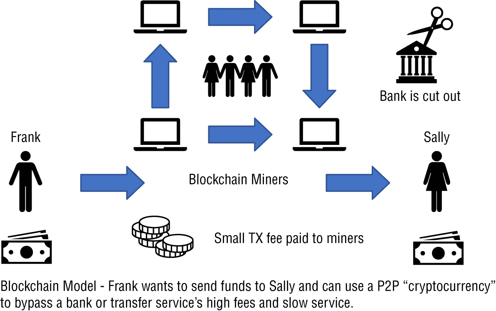

# 第六章

企业区块链经济

区块链和分布式分类账在成本控制、成本降低和成本避免方面提供了重要的机会。在本章中，我将讨论区块链和分布式分类账如何实现令人印象深刻的总体拥有成本（TCO）场景，并明显提高了金融技术（*fintech*）用例的投资回报率（ROI）。

如果你是 IT 供应商、集成商或 VAR，你需要了解成本模型，这样你就可以为你的客户群提供价值。当你参与关于区块链的讨论时，能够比较传统系统成本模型和区块链模型是至关重要的。

本章的目标是从财务角度解释如何为区块链服务和硬件的实施提供理由，并解释与成本相关的企业关注点。## 企业区块链经济简介

当你考虑区块链解决方案的经济性时，重要的是要意识到组织可能考虑的众多经济决策，这些决策可能会显着影响客户会议的结果。根据我的经验，那些在承担风险方面保守的公司往往将区块链解决方案视为一场赌博。但是，如果你看一下该公司如何处理灾难恢复，例如，备份和灾难恢复测试都按照计划进行，几乎没有干扰，你可以将相同的决策过程应用到区块链技术上。换句话说，同一家公司将根据围绕投资回报率（ROI）、总体拥有成本（TCO）和其他指标的 IT 中心数字来确定实施技术的成功可能性。在实施区块链解决方案时，也是同样的过程。

### 企业电子商务业务模型

在考虑区块链架构时，了解企业业务模型是很重要的。电子商务的普遍接受的模型如下：

+   企业对企业（B2B）是两个或两个以上企业之间的电子商务。

+   企业对消费者（B2C）是企业与企业的消费者之间的电子商务。

+   消费者对消费者（C2C）是消费者之间的电子商务。

+   政府对企业（G2B）是政府与企业之间的电子商务。

+   政府对消费者（G2C）是政府与其公民之间的电子商务。

作为区块链供应商、集成商或 VAR，重要的是你了解这些模型如何影响企业的收入流。对于本书的目的，我将重点介绍企业如何利用诸如支付网关等区块链技术。我不会涵盖 B2B 如何运作或其他本书范围之外的业务主题。### 价值创造

区块链可以通过多种方式增加价值，如改变公司运营、改变业务模式，并提供新的机会，例如利用区块链实现共享成本效益。当然，区块链技术的价值在不同公司之间的定义会有所不同，结果也会有所不同。区块链技术还可以开辟新市场，例如使用加密货币。它也可以减少一些市场，或至少减少传统支付服务（如 PayPal、西联汇款或全球银行系统）的机会。去除这些中介机构为区块链公司创造了机会，但也削减了传统组织的机会。世界在不断变化，历史上充满了今天已经毫无关联的重要公司。公司必须不断创新和创造价值，否则就会像拍立得或 blockbuster 一样灭亡。

区块链不仅可以为组织提供新的交易平台和支付服务，而且还可以连接到传统支付网关。稳定币也是一个越来越受欢迎的解决方案。在业务模式为企业对消费者时，采用稳定币是合理的。（稳定币在“稳定币”部分有更详细的讨论。）  ### 区块链支付网关

进行企业间交易或与其消费者基础进行交易的企业可能希望考虑部署基于区块链的平台应用程序，原因有几个。首先，连接到支付处理器提供了一种不同的交易和支付方式，这很可能会为企业及其业务合作伙伴创造新的流动性来源。其次，利用区块链支付网关可以使企业通过降低集成成本和中介费用（实质上降低了开销并提供了更高的效率）来降低每笔交易（TPC）的成本，特别是对于电子商务应用程序。第三，部署基于区块链的支付网关可能会降低企业在部署区块链应用程序时的风险。

区块链支付处理器的示例包括以下内容：

+   Coinbase

+   BitPesa

+   Aliant

+   MenaPay

+   Go URL

这些支付处理器与企业之间的集成可以通过支付网关 API 简单实现。这些 API 由支付网关提供商提供。一些 API 还支持不同的功能和功能。真正的好处是更快的 TPS 和低成本，通常约为 1.5%，略低于信用卡或借记卡交易，对于使用支付网关的商家来说具有重要意义。  ### 稳定币

提供经济价值和价格稳定等实用价值的较新方法之一是通过实施稳定币来实现。*稳定币*是一种加密货币，其抵押品与基础资产的价值挂钩。基础资产可以是另一种加密货币，像美元这样的法定货币，或者是金属，比如黄金或白银。

稳定币解决了加密货币传统上存在的波动性挑战。这种不稳定性降低了加密货币在日常支付用途上的潜在采用率。稳定币缓解了它可能与之挂钩的加密货币的价格波动，以便用户可以利用相关服务。

在撰写时宣布的一个更令人兴奋的稳定币项目是 Facebook 的 Libra 项目。Facebook 拥有超过 23.8 亿月活跃用户，而 Libra 可能为“未银行化”人群（可能无法获得银行账户的人）提供一些重要机会。

Libra 建立在一个名为 Libra 区块链的开源区块链上，其具有自己的权益证明协议。Libra 的使命是重新定义货币并改变全球经济，以便世界各地的人们都能过上更好的生活。

Libra 由多种资产储备支持，旨在为 Facebook 用户提供内在价值。Libra 由独立的 Libra 协会管理，负责发展生态系统。创始成员包括一系列组织，如万事达卡、PayPal、Stripe、Visa、eBay、Facebook、Lyft、Uber、Spotify、安德森·霍洛维茨公司、沃达丰集团、Kiva、慈善救济组织、妇女世界银行等。成员列表在 `[`libra.org/en-US/partners/`](https://libra.org/en-US/partners/)`。

目前有三种类型的稳定币，其中一些已经在客户交互和电子商务中得到了企业的采用。这三种类型的稳定币是基于链下抵押品、基于链上抵押品和基于算法的。表格 6.1 比较了这三种类型的稳定币及其资金模型。

**表格 6.1**：稳定币比较概览

| 类型 | 资金模型 | 示例 |
| --- | --- | --- |
| 基于链下抵押品 | 法定货币或商品抵押 | Tether, Gemini, USD coin |
| 基于链上抵押品 | 加密货币抵押 | Steem, Maker, Huabi |
| 基于算法 | 算法和智能合约；被称为铸币式稳定币 | Terra, Karbo, Ampleforth |

表 6.1 提到了在基于区块链的服务和应用中常见的不同类型的稳定币。稳定币通常与现实世界的货币以一对一的比例锚定或“系住”，并由储备支持。Tether 是一个活跃的项目，是一种广泛持有的稳定币，可以用于存储、发送和接收数字代币。这些代币以个人之间的方式与美元、欧元和日元等货币挂钩或“稳定”。稳定币通常用于加密商品交易所，例如用于交易商品。

最常见的稳定币列在稳定币指数上，网址为`[`stablecoinindex.com/`](https://stablecoinindex.com/)`。

稳定币在公司使用它们直接与消费者、其他企业甚至政府进行交互时提供了显著价值，为平台提供了稳定性。 ## 区块链资金和成本

当涉及到资助一个区块链项目时，你必须意识到项目可能最初通过一种方法资助，然后在部署完成后再通过另一种方法资助。例如，如果一家公司采购了$30,000 的服务器和网络设备来在本地部署 Hyperledger Fabric，那么部署后的支持和维护可能会通过另一种机制资助，比如部门资金。

当提出一个 IT 项目时，一个有效的执行赞助人可以通过公开讨论程序对组织重要性的原因来展示承诺。了解你的利益相关者，然后与他们合作将为区块链的采用提供巨大价值。

理解客户的区块链项目将如何资助当然是很重要的。本章的这一部分将为您提供对各种项目资金关注点的扎实理解。

### 资本支出和运营支出

公司通过不同的资金方法资助他们的基础设施项目和日常运营。这些方法将对公司的盈利能力产生一定影响，因为不仅在美国还在其他国家都有重大的税收法律。最常用的成本模型是资本支出（CAPEX）和运营支出（OPEX）模型。

+   资本支出（CAPEX）是公司今天为未来投资所做的大笔财务投资。CAPEX 资金是一种采购行为，需要获得高管和企业采购部门的批准。这种类型的资金按年计划，并且获得批准和收到资金可能需要时间。

+   运营支出（OPEX）是公司用于较小的“日常”支出的资金。OPEX 通常在日历基础上分配给业务部门，不需要批准或采购行为。（月度、季度或年度是常见的日历计划。）

这两种类型的支出方案之间的显著差异在于它们在损益表中的会计处理方式和对公司可能带来的税收优惠。从企业角度看，CAPEX 支出用于获取资产，例如数据中心发电机，这些资产的实用寿命超出了购买的特定税年。从税收的角度来看，这些费用通常不会在发生（购买）的年份中完全扣除。（它们被资本化、摊销或按照资产的寿命折旧，而在美国可能是 7 到 15 年。）

OPEX 支出用于运营费用，通常可以在购买该项物品的税年内完全扣除，这对股东来说提供了显著的好处。大多数公司更喜欢 OPEX，因为他们可以立即全额扣除这些费用，因为它们不是按照摊销的税收计划进行的。

表 6.2 提供了一些 OPEX 和 CAPEX 支出的示例。

**表 6.2**：CAPEX 和 OPEX 数据中心费用示例

| CAPEX | OPEX |
| --- | --- |
| 计算机和服务器 | 云订阅 |
| 数据存储阵列 | 区块链即服务（BaaS） |
| 网络设备 | 公用事业 |
| 建筑要求 | 网络带宽 |
| 暖通空调要求 | 会员资格和费用 |
| VM/DB/OS 许可证 | 合同劳动和员工工资 |
| 内部 CRM 套件 | 租金和租赁 |
|  | 员工培训和书籍 |

简而言之，任何 IT 服务都可以部署在由企业控制的本地数据中心，也可以部署在共享数据中心（*colo*）中。共享数据中心是一种共享的数据中心设施，企业可以租用或租赁数据中心空间来放置其 IT 设备。这些共享数据中心的合同差异很大，但一个区别是您实际上可以访问您的设备；然而，与云计算平台相比，您无法物理访问它们。例如，对于 ATT、Equinix 和 Digital Reality，您可以访问并访问您的设备，但对于 AWS、GCP 和 Azure，情况则不同。

作为一名售前工程师，我参与了数千小时的技术选择讨论，其中一部分涉及资金决策。选择 CAPEX 或 OPEX 资金支持是企业非常认真考虑的决定，因为涉及利润和损失、税收影响、上市时间，以及项目的可行性。

从经验来看，我发现公司几乎总是选择 OPEX 方法进行资金支持。我曾经遇到过这样的情况，公司会通过将购买拆分为较小的金额并使用几个 OPEX 来源来资助一个本来应该是 CAPEX 的$120,000 项目。这类似于带着$120 去杂货店购物，然后将购买拆分为三笔交易，然后使用三张限额较小的借记卡。### 成本考虑

大多数 IT 项目的成本既可以是可预测的，也可以是不可预测的。可预测的月度服务费用的一个例子是预订云计算虚拟机的费用。其他例子包括租赁、支持合同、劳动力成本、软件许可、税收、保险等等。

不可预测成本的一个例子是在难以提前确定对数据库的查询次数时的带宽费用。当然，托管在现场的区块链成本会更可预测，特别是如果用户和区块链节点都是本地的话。如果您的用户正在使用 AWS 的区块链即服务（BaaS），那么某些成本可能会是不可预测的。其他例子包括网络带宽、交易费用、公用事业和法律费用。

以下是典型企业区块链部署中可能发生的成本的示例：

+   基础设施（固定或非固定）

+   数据存储成本

+   数据传输成本

+   法律审查

+   实施成本

+   开发成本

+   维护和支持

+   合规要求

成本还取决于区块链服务的行业类型以及客户在实施甚至管理过程中愿意承担的风险量。例如，如果您有一个可以在 AWS 中使用预定义区块链模板的区块链部署，那么这将大幅削减几项成本。但是，通过使用来自任何供应商的区块链模板，您实际上正在限制您的区块链的性能、虚拟机配置以及区块链版本和区域。

最重要的一点是确保您的客户了解到区块链是一种较新的技术，它们仍在不断发展。这意味着昨天的投资如果今天没有从成本的角度进行适当的规划，很可能会被浪费。

#### 基础设施成本

基础设施成本将是您的数据中心成本，无论您的公司是否拥有它或正在租用它。数据中心非常昂贵，并且需要大量的资本支出和运营支出来维护。

数据中心空间的成本是基于平方英尺计算的。此外，您可能正在考虑使用合作定位数据中心（colo），其成本是基于“每个机架”的方式计算的。您可能还需要考虑密度。

当涉及到数据中心成本时，应考虑以下成本。请注意，这些数据中心要求可能会根据企业的业务模型而波动。根据企业所需的层级水平，成本和公用事业要求也会有很大的变化。

+   租约

+   公用事业（电力、冷却、UPS）

+   灭火

+   保险

+   维护合同

+   劳动力成本

+   硬件（服务器、存储、网络）

+   软件许可（操作系统、虚拟机、应用程序）

+   检查和审核

+   网络

+   服务提供商（带宽）

+   解决方案设计

一般来说，实施像超级账本这样的区块链的客户正在产生重大成本。公平地说，当将区块链应用与传统的集中式数据库应用进行比较时，并不存在完全一对一的关系。例如，超级账本和 Oracle 数据库具有显着不同的成本结构和劳动要求。

希望减少 CAPEX 或完全避免 CAPEX 的客户可以使用 AWS、Azure 或 IBM BaaS 等云服务。当然，还有其他几家云提供商也提供了某种形式的区块链模板或服务。使用 BaaS 的优点是，在大多数情况下，您的组织将避免任何 CAPEX 支出，并减少其维护和支持责任。这将使您的组织能够更快地将区块链服务推向市场。

使用 BaaS 的缺点是，您受到云提供商可用配置的限制，受到网络延迟的影响，并且实际上，有时您无法控制部署的节点配置。  #### 数据存储成本

数据存储是一个持续的成本，因为区块链是一个分布式账本，该分布式账本不断被“追加”。根据正在使用的账本结构，另一个要考虑的因素是区块链存储的去中心化可能会给您的企业带来各种额外的财务收益。例如，您可能会节省带宽，因为文件分布在节点之间，并从多个节点而不是单个节点下载。

图 6.1 参考了使用常见区块链云提供商时的数据存储成本。这些数字是虚构的，您需要评估每个提供商以及存储类型、区域和其他功能。例如，数据存储可以按每月 100GB 的价格计价每 GB。此外，您还应该注意诸多因素，例如云提供商的区域和区域，每 GB 的不同成本以及许多其他成本，例如访问存储的入口和出口。

**图 6.1** 数据存储成本  #### 数据传输成本

使用任何网络服务时的挑战之一是了解网络成本是如何处理的。例如，当将企业的本地资源遍历到诸如 Microsoft Azure 之类的云提供商时，您将需要注意带宽成本。

带宽费用分为两种计费流量机制。

+   **入口** 入口是指来自外部资源指向内部资源的流量。

+   **出口** 出口是指从内部资源指向外部网络的所有流量。

当考虑跨越多个网络的区块链服务时，您需要了解潜在应用的成本。如果您的节点分布在两个不同的数据中心之间，无论它们是否是云服务，您都需要估算这些应用的成本。

图 6.2 显示了来自公司数据中心的进出流量的流量图。

**图 6.2** 云中进出流量的流动图

从历史上看，流量费用是基于分层结构每月结算的，对于进出云的数据传输，费率更高。

区块链将具有大量流量，也就是说，分布式账本将不断被追加，并且交易日志将被写入。可能影响流量费用的区块链服务因素包括以下内容：

+   账本流量和/或交易日志的备份

+   灾难恢复

+   容器和/或虚拟机的快照

+   区块链节点和/或服务的监控

图 6.3 涉及进出费用，并提供了微软 Azure 的示例以及冗余性以及区域可能影响成本的方式。

**图 6.3** 微软 Azure 数据存储成本示例

所示的配置正在使用两个区域：北美和南美。两个区域的云服务成本各不相同；您还需要谨慎考虑复制和带宽费用。适当规划您的区块链数据服务，以避免过度费用。通常作为“云支出”问题的一部分的浪费领域是存在未被利用或位于错误服务层级的虚拟机和存储对象。如果您的区块链正在云提供商上运行，则使用云提供商的云支出分析器或计算器之一来识别浪费。

托管对象云存储允许您扩展使用占地面积，以利用企业所需的所有数据。例如，您的企业可以在 AWS 和 Azure 上存储高达 5TB 的超大文件。存储是成本可能失控的一个领域，所以在规划和实施时要谨慎行事。我做过许多云和虚拟机评估，并且看到公司仅在冗余数据上浪费了超过 40％的云支出。  #### 法律费用

在考虑可能“穿越”法律辖区的区块链交易时，如州、省和国家，考虑法律问题是很重要的。例如，在美国和欧盟之间进行跨境交易时，法律团队需要参与审查任何潜在的责任风险以及合规要求。

您的法律团队或公司团队可能希望验证关于在 R3 Corda 上如何处理分类账交易的“法律文书”视角的担忧。*法律文书*是 R3 Corda 中使用的一个术语，用于反映人类语言法律文书文件与智能合约代码之间的明确链接。在法律争议案件中，可能会依赖于这些“文件”。

一些可能会产生额外成本的常见法律问题包括法律文书、法律先例的缺乏、智能合约合规性、财产权以及链式监管和合规性跟踪。在第九章中，“区块链治理、风险、合规性（GRC）、隐私和法律问题”中，我将更详细地介绍法律问题。就本章而言，要意识到法律成本可能是讨论区块链资金时需要考虑的因素。#### 实施成本

对于一些企业来说，区块链的一项更具挑战性的方面可能是区块链实施中的各个组成部分。不同的利益相关者甚至是供应商并不完全了解这些过程。我倾向于关注的一个领域是区块链和分布式分类账是一个开发性的练习。每个开发人员都有自己的编程风格、方法、理解，而且说实话，完成需求和任务的动机也不尽相同。

我发现，为您的区块链开发人员提供激励，以便及时编写符合您的应用程序要求的客户端应用程序和智能合约，可能是您项目成功与否的关键因素。实施成本可能永远不会在估计值的 20%范围内。

一些可以计划的常见成本包括获得开发区块链应用程序所需技能集的成本、需要采购的资源以及将协助部署的承包商的成本。培训也是应考虑的成本之一，无论是为了劳动力还是为了概念验证。这经常被忽视和低估。#### 开发成本

开发成本在考虑总拥有成本（TCO）和投资回报率（ROI）计算时可能存在较大差异。我更倾向于保守估计。最不希望发生的事情之一是低估成本，使您的估算陷入危险之中。

我遇到的主要问题与企业集成有关。例如，组织如何将其现有客户应用程序有效地集成到 Hyperledger Fabric 等平台中？另一个问题是招聘正确的区块链编程人才，这可能是具有挑战性的。例如，了解并编写 JavaScript 和 Python 的开发人员的人才储备要比能够使用 Golang 或 Solidity 进行开发的开发人员储备要大一些。

图 6.4 突出了常见的开发成本。

全球对区块链专业知识的需求量很高。根据 CNBC 区块链（[`www.cnbc.com/2018/10/21/how-much-do-blockchain-engineers-make.html`](https://www.cnbc.com/2018/10/21/how-much-do-blockchain-engineers-make.html)）的报道，工程师的年薪平均在 15 万美元至 17.5 万美元之间。纽约市、伦敦、新加坡、硅谷、瑞士和多伦多等区块链发展热点地区的区块链开发者年薪超过 20 万美元。

在寻找区块链专业知识时，了解求职者占据上风至关重要，至少在撰写本文时是如此。因此，您应该意识到，即使区块链开发者是开发者，他们的技能显然是需求旺盛的，如果您的企业关心填补空缺，您的招聘行为应该反映这一点。

**图 6.4** 区块链开发成本

区块链开发者需要的一些技能与企业技能相关，例如网络、安全、敏捷开发和 DevOps。不同的区块链使用不同的编程语言。例如，以太坊专注于 Solidity，而 Hyperledger 则专注于 Golang。其他常见的语言包括 Node.js、Java、Python、C++和.NET 语言。建议具有开源经验。

根据要求、地点和薪资等因素，获取正确的技能组合将是具有挑战性的。 ## 企业区块链成本模型

区块链正在改变整个行业的工作方式，特别是在金融科技和物流行业，带来了新的商业模式和潜在的新收入机会。谈到区块链时，重要的是要明白，大部分节约成本将通过将“业务逻辑”实施到智能合约中来实现。

业务逻辑将您以前的“中间人”任务委托给智能合约或链码，这些智能合约或链码将由其他贡献团体成员发起的事件触发。例如，以太坊区块链可以类似于云服务，其中处理交易的责任由分布式节点共享。

但是，如果你必须拥有隐私、安全性和特定成员资格，你就不能使用像以太坊这样的共享无权限区块链，而必须要么吸收区块链的全部成本，要么与其他行业成员共享这些成本。

以下各节提供了关于区块链解决方案的成本效益的见解。

### 投资回报率

ROI 分析用于比较投资方案。让我们看看两个高层次的情景。

+   企业客户正在确定是否在三年、五年或七年内更新 SAN 存储阵列。将请求进行 ROI 分析，以帮助确定哪个选项从“财务角度”更好。这些硬件的成本是固定的（硬件、软件、支持、电力等）。

+   企业客户正在确定是否在三年、五年或七年内实施 Hyperledger Fabric 区块链。将请求进行 ROI 分析，以帮助确定哪个选项从“财务角度”更好。

从锻炼角度来看，这里与硬件的主要区别在于，硬件有着易于确定的固定成本，而区块链既有固定成本，也有一些不那么确定的成本，比如开发成本。

图 6.5 展示了进行 ROI 分析的一些常见原因。

**图 6.5** 投资回报率

每个组织对如何监视和管理 IT 项目的有效性有不同的期望和方法。在评估区块链机会时，您希望开始建立要使用的 ROI 公式。基本上，以下是计算 ROI 数字或 ROI 基本公式的最直接方法：

本质上，净利润是“回报”，而总投资是从硬件、软件、云服务、咨询和开发中产生的成本的集合。

基本的 ROI 计算也被称为*回报率*（ROR）或*利润率*（ROP）。此 ROI 回报也被称为任何投资的收入增加或损失，或者是利润和损失的结果。在会计领域，有许多方法来计算相同的结果，特别是涉及税务评估时。投资成本也被称为资本投资。具体来说，在 IT 领域，即使是区块链项目，我们也会采用 CAPEX 和 OPEX 方法来资助 IT 项目。

图 6.6 突出显示了在以 IT 为重点的项目中使用的最常见的 ROI 公式。根据您要衡量的输入，ROI 得出的数字将大相径庭。例如，如果您的客户对净利润或净收入的衡量方式与另一家公司不同，那么这将扭曲结果。我曾在大型财富 100 强公司中工作过，其中两个不同的以 IT 为重点的部门对 ROI 的确定方式有很大不同。作为解决方案工程师，您需要与客户合作，确保您使用客户用例最有利的度量标准。

**图 6.6** ROI 成本和公式

当计算投资回报率（ROI）时，我喜欢使用图表或电子表格显示向客户呈现的潜在收益。这些收益可分为两类。

+   **有形收益** 有形收益是那些可以轻易看到、测量或轻易记录的收益。这些被称为*硬收益*。一个例子是用云服务替换传统的电子邮件系统。很明显，传统系统已经退役，并且成本已经收回。

+   **无形收益** 无形收益是那些不能轻易看到、测量或轻易记录的收益。这些被称为*软收益*。一个无形收益的例子是更换呼叫中心系统并获得更高的客户满意度以及增加的品牌知名度。### 总拥有成本

总拥有成本广泛用于估算区块链应用的成本。TCO 本质上是汇总所有成本，无论是直接的还是间接的，以估算一个项目。图 6.7 突出显示了在估算区块链应用部署时要考虑的高层次成本层次。

**图 6.7** 总拥有成本

通常考虑到一些更具体的区块链实施成本作为“启动成本”，例如人员培训、基础设施硬件和软件、许可证和咨询服务。运营成本是在启动后以及应用程序投入生产时发生的。这些成本包括管理和监控服务、带宽成本和交易费用。退役成本是用于“关闭”服务的成本，基本上是将应用程序退役。这可能意味着出于合规目的归档数据，移除和处理服务器机架，或产生税收后果。

图 6.8 涵盖了企业在数据中心部署应用服务时可能发生的常见 TCO 成本。

**图 6.8** TCO 成本  ### ROI vs. TCO

两种财务分析模型（ROI 和 TCO）的主要区别在于 ROI 模型是一个现金流模型，而不仅仅是一个成本模型，而 TCO 则是在一段时间内获取和运营资产的总成本。此外，您应该意识到需要量化（细分）投资产生的成本以及任何节省的成本。## 潜在的成本效益  

让我们考虑一些区块链可以引入组织的典型成本效益。成本效益将集中在消除处理手动交易的中介。

### 降低负担薪资成本  

技术创新可以提供基于交易、费用、硬件或软件购买甚至是治理和合规的成本节约。诸如云计算、自动智能和机器学习等技术为员工和承包商招聘需求提供了大量的劳动力成本。  

例如，云计算以降低硬件、软件、公用事业和人工成本的总拥有成本（TCO）而闻名。云计算不仅用于在传统遗留 IT 专业人员的裁员方面实施激进的成本削减，还提供了负担薪资成本效率，并需要更有技能但薪酬较低的 IT 专业人员。  

当考虑到由于其作为中介而可能减少的全职员工数量时，区块链技术当然也不例外。区块链技术很可能通过消除传统上需要的手动交互或交易来提供效率。其中一个例子是了解客户（KYC），这被认为是金融机构必须参与的耗时、手动和昂贵的程序之一。  

如果您每年每名员工（工资、税收和福利）的平均负担超支成本为$150,000，而您的公司有 50 名中介机构在验证、审计或以某种方式参与交易，那么您可以考虑将传统解决方案作为区块链应用的目标。当存在一个共同体时，例如一个共同体，它作为协作努力而实现的好处就更加相对了。  

一些常见的成本项目包括工资、工资税、保险等福利、计算机、退休成本、免费零食，以及任何人力资源或招聘成本。  

图 6.9 展示了员工薪水中涉及的常见成本。从大银行的角度来看，如果他们有数百名员工，那么 CEO 总是会考虑减少员工数量的原因。  

  

**图 6.9** 负担薪水成本  

智能合约的创建旨在基于计算机逻辑执行“中介”（会计师、律师、海关审查员等）职责，并提供效率。当然，潜在的讨论可能围绕着减少您组织通常执行的重要、手工密集、昂贵但理想上“多余且可预测”的职责的机构开销。最佳的使用案例将提供显著的成本效益，这将记录清晰的节省，例如减少员工人数。  ### 使用 OPEX 而非 CAPEX

当一家公司决定从 CAPEX 转向 OPEX 模式进行 IT 资金的资助时，它可以实现大量节省。例如，当从企业的本地数据中心迁移到 BaaS 等云计算服务时，就可以实现节省。

在美国，运营支出可以在那一年完全扣除，因此为公司提供更大的收入实现、更好的每股收益（EPS）比率和股东的财务利益。一些例子是，所有与云计算相关的支出，通常被称为*云花费*，通常可以在那一年完全注销或扣除。*扣除*意味着在计算企业利润/损失时从收入中减去。请注意，我不是税务顾问或提供财务建议；这是对美国企业 IT 成本行为的概括。

当一家公司专门处理支付交易时，通过区块链应用，每笔交易的成本（CPT）可以大幅降低。例如，像 eBay、亚马逊或 Etsy 这样的市场的参与者充当中介，收取费用，并因此而利用他们控制市场内交易的能力。通过引入分散化的自动交易管理，正确的区块链解决方案可以轻松实现较低的交易成本。例如，稳定币可能在市场中发挥作用，帮助促进交易并为客户群提供稳定性。这反过来可以为平台提供单位或交易的较低成本。  ### 无成本验证

*无成本验证*是区块链技术中引用的术语，用于描述交易发生后的验证。区块链是一个不断更新但也具有历史上不可变的交易历史的活动分类账。与传统的遗留金融系统相比，无成本验证可以降低交易的验证成本。无成本验证意味着需要在区块链上安全验证的记录属性可以在分布式账本上的任何点免费提供给订阅者参考。

另一个需要考虑的因素是区块链交易始终可用且不受中心控制。例如，如果一家公司想要验证一批鳄梨的交易，只需“查询”区块链账本，即可立即确认与该批货物相关的任何信息。在集中式数据库系统中，情况并非总是如此。无成本验证提供了效率，作为一种可能的成本效益，您应该意识到这一点，并与客户讨论。

区块链（比特币等）实现的 P2P 信任经济代表了权力的显著转移。过去需要去银行汇款到海外，因此需要支付大量费用的时代已经过去了。现在，您可以通过任意数量的加密货币平台发送资金，尤其作为用户可以节省费用。

图 6.10 显示了通过 Swift 传统网络的高级交易流程。请注意，存在一个中间人，比如银行，会收取费用。

**图 6.10** 中间人示例

或许在这个新的信任经济中，一些企业通过取消中间人的要求可能会从每笔交易的成本降低中受益。有一件事对于区块链是肯定的，即每家企业的“行驶里程”在成本节省和区块链能够带来的好处方面可能会有所不同。

当谈到区块链的成本效益时，最大的成本节省可能来自“中间人”的减少或重新分配。无需许可的区块链是开放透明的，并允许在智能合约中访问交易信息。因此，智能合约自动化问题可能可以更有效地解决。

图 6.11 显示了基于区块链的价值转移解决方案。请注意，没有银行等中间人。

**图 6.11** 区块链示例

区块链技术使得两个独立方之间的数据对账成为可能。数据库很可能是分布式的且高度可用的。区块链账本分布在任意数量的节点之间，并且数据库中的任何更改都可以由独立或不完全独立的方管理。事实上，取决于区块链部署以及它是有权限的还是无权限的，可能无法充分实现好处。

在金融机构中，已经记录了区块链为基于中间人的角色要求提供了效率。这些要求围绕所需中间人的数量以及所需的技能水平展开。区块链正在颠覆角色。以下是正在受到影响的常见角色：

+   会计师

+   律师

+   海关检查员

+   履行处理器

+   结算代理

像大多数以 IT 为重点的项目一样，区块链有着相当大的成本，作为客户面向的工程师，了解这些成本非常重要，以确保你设置了项目的正确期望。 ## 总结

这一章涵盖了各种成本模型，如 B2B 和 B2C，并讨论了在商业世界中常见的主要电子商务模型。在涉及 IT 项目时，一些成本可以预测，而一些成本则无法预测。公司越来越依赖 OPEX 资金，而不是 CAPEX 资金。 OPEX 资金按照日历方式分配给业务单位，通常不需要批准或采购练习。 有许多成本，如基础设施（固定或非固定）、数据存储成本、数据传输成本、法律审查、实施、开发成本以及维护和支持。

销售区块链解决方案需要与开发组和企业的各种角色进行密切互动。 TCO 和 ROI 都是需要在区块链评估中使用的重要财务会计计算。 当涉及到区块链成本效益时，最大的成本节约可能来自中介的减少或重新分配，这可能导致每笔交易的成本降低。
