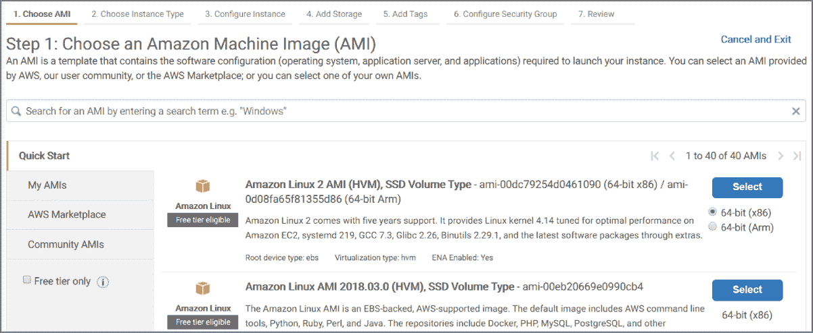
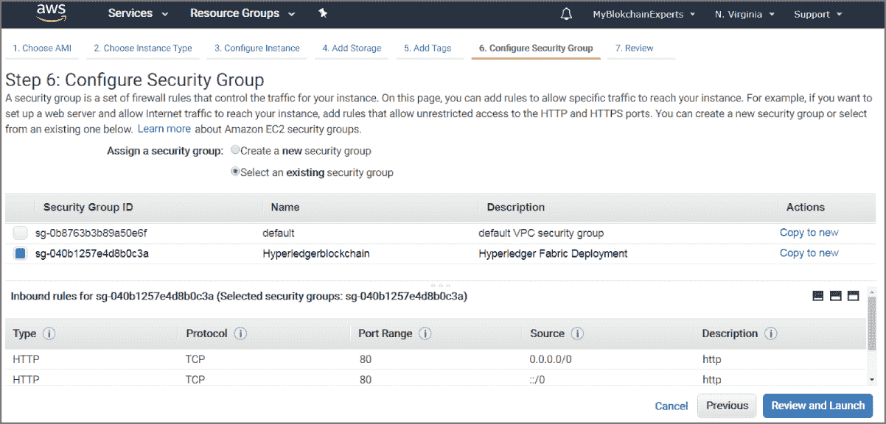
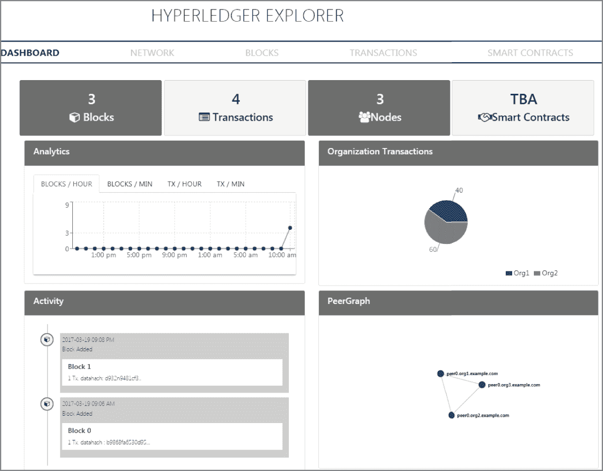
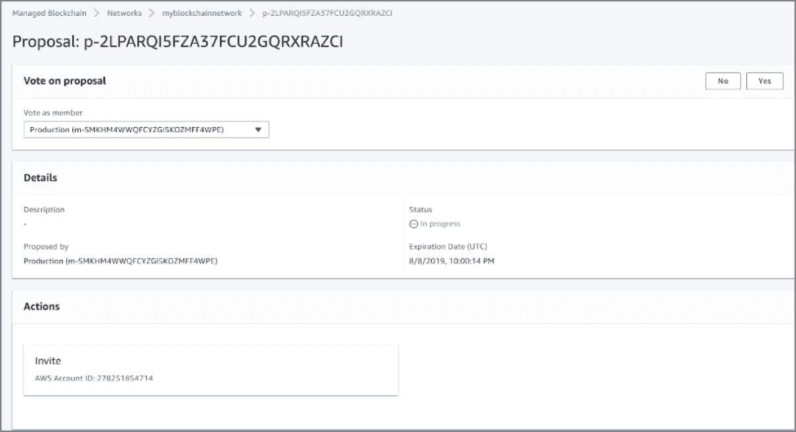
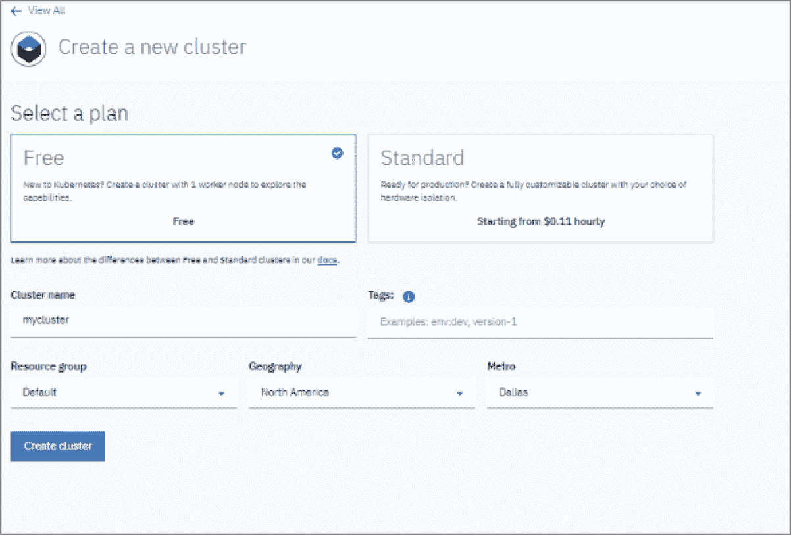
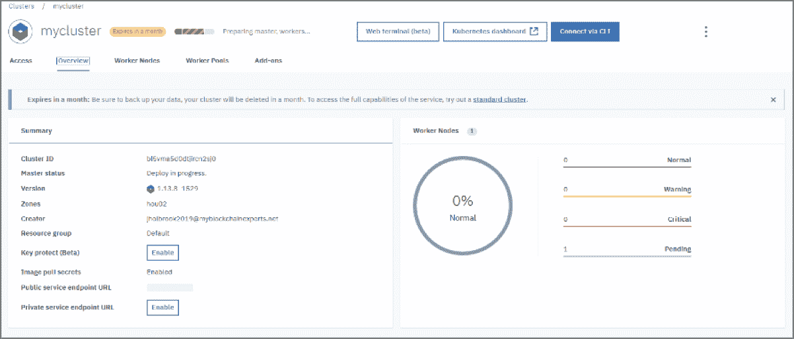
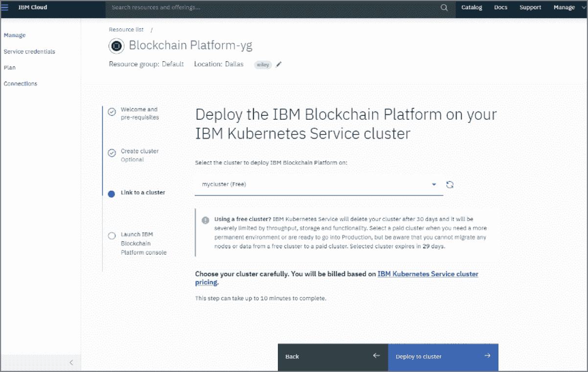

# 第七章

在 BaaS 上部署您的区块链

在本章中，我将讨论为什么区块链即服务（BaaS）是帮助您快速启动企业区块链的绝佳方式，而不需要设置 IT 基础设施以适应区块链的重要工作。BaaS 还提供了降低在本地数据中心为您的区块链建立资源的资本支出需求的额外好处。然后我将一步步向您展示如何在 IBM 和 AWS 上部署 Hyperledger。

BaaS 充分利用了云计算，通过利用云计算的经济和技术优势，使企业能够在 AWS、Microsoft Azure 和 IBM Cloud 等云提供商上部署这些服务。

我将讨论区块链和分布式账本如何为 FinTech 集中用例提供一个令人印象深刻的总体拥有成本（TCO）情景，并改善您的投资回报率（ROI）模型。

部署区块链是一个相对直接、成本效益和可管理的任务，可以在几个小时内完成。我将讨论为什么公司选择使用云服务，以及使用 IBM 等提供商部署您的区块链的主要优势。

本章的第一部分提供了当前 BaaS 平台的简明指南，包括它们提供的主要优势、特点和用例。我还将讨论如何为概念验证和演示使用 BaaS，特别是针对预售重点读者。

在本章的第二部分，我将一步步向您展示如何在以下服务上部署区块链：

+   亚马逊网络服务（AWS）

+   IBM 云

本章的主要目标是双重的。首先，我将为您提供一个财务角度，解释如何证明实施区块链服务和硬件，并提出企业对成本的关注。其次，我将解释如何在 AWS 和 IBM Cloud 服务上部署区块链。## 区块链即服务概述

区块链市场正在快速扩张，BaaS 也不例外。云计算市场领导者在这一领域也投入了数百万美元。从市场的角度来看，我将重点关注 AWS、IBM Cloud 和 Microsoft Azure，这在撰写本文时是最全面的解决方案。

### 为什么使用区块链即服务？

区块链即服务是一种云服务提供，允许客户利用基于云的解决方案来构建、托管和使用自己的区块链应用程序、智能合约和区块链上的功能。在 BaaS 中，云服务提供商管理所有必要的任务和活动，以保持基础设施的灵活性和可用性。

在未来五年内，预计 BaaS 市场将显著增长。这种增长是由市场对商业领域增加区块链应用的需求所致。随着 BaaS 模型的出现，国际商业交易变得更加安全、快速和可靠。由于数据库是分布式的，并且每笔交易的记录都是可用的，区块链作为一种服务正在消除国际支付流程中的障碍。验证和发票处理的延迟会增加业务活动的成本，而使用区块链技术可以将其抵消或减少。该技术提供了一个信息可见性的共同链，将在供应商和采购商之间共享。在国际业务交易中使用 BaaS 很可能会显著缩短处理时间和成本。

简而言之，BaaS 模型允许公司访问区块链提供商的服务，以便他们可以访问、开发和部署基于区块链的应用程序。

区块链的增长是显而易见的，随着这种增长，使用像 IBM、AWS 和 Azure 这样的平台上的区块链作为服务的使用可能会增加。其他参与者，如 Oracle、Alibaba、百度、惠普企业（HPE）、华为和腾讯，目前已经拥有 BaaS 或即将具备潜在可用性。

使用 BaaS 供应商的主要好处之一是，他们为区块链提供了所有必要的软件部署以及基础设施，并且通常采用易于消费的订阅模式提供给客户。然后，供应商负责设置和维护区块链基础设施的后端。

为了澄清，确实有一些 BaaS 平台是真正的软件即服务（SaaS）或平台即服务（PaaS），比如 IBM 区块链平台。例如，IBM 目前很好地支持 SaaS 和 PaaS 解决方案。

另一方面，有些区块链作为服务实际上是基础设施即服务，您可以在其中部署基础设施模板。例如，AWS Marketplace 中的 AWS 区块链模板可以帮助您的公司使用不同的区块链框架在 AWS 上创建和部署区块链网络。在部署区块链之前，您需要创建自己的安全组、部署 CloudFormation 模板并确定网络配置。在生产环境中部署这些模板需要一定程度的 AWS 专业知识。

云计算自亚马逊网络服务 (AWS) 初期就存在，它基本上创造了基础设施即服务 (IaaS) 云计算市场。云计算对企业、初创公司甚至家庭用户都有很多好处。现实是，IT 基础设施的采购和维护成本高昂，而在有限的预算内找到人才可能是一项挑战。云计算基本上使得杰克逊维尔 (佛罗里达州) 的顾问和纽约市的一家大型跨国银行能够在按比例计费的模型上使用相同级别的企业服务，从而使它们具备了相同的竞争优势。

之所以能够实现这些好处，是因为 BaaS 被部署在由云供应商管理的云计算基础架构上。使用区块链云服务的主要好处包括以下几点：

+   与支持 opex 资金的传统本地解决方案相比，初始成本更低。

+   由于没有基础设施的前置时间需求，上市时间更快。

+   由提供商管理的服务，减少了您的管理责任

+   由提供商提供的服务支持和专业知识

+   提供商服务大大提高了可伸缩性

+   由提供商实现和管理的立即数据安全好处

+   企业可能正在使用的当前云服务的兼容性，比如监控，这是很重要的。

云服务运行区块链应用程序，很明显，这些好处类似于在云中运行数据库或虚拟机时所经历的。### 使用区块链作为服务的负面影响

众所周知，云计算有许多好处，但一些企业可能没有充分意识到或者无法充分实现所有的用例可能因为应用框架、成本模型或开发模型的使用而无法实现这些好处。

例如，在数据存储和云市场担任售前架构师超过十年的经验，我可以肯定地说，一般来说，不善于在内部有效地管理资源的客户很可能也不会在云中有效地管理资源。资源管理是有效和高效地使用云资源的必要条件。我曾经看到“云支出”在短短几个月内飙升了 300% 以上，云工程师不知道为什么会这样。通常占据大部分“云支出”的两种资源是您的数据存储和虚拟机。

使用 BaaS 的一些负面结果如下：

+   云支出成本未经适当管理，导致云支出意外增加。

+   资源是集中管理的，而区块链根据定义不应该是集中管理的。

+   您的首选提供商对区块链/分类账服务的支持有限。

+   经验丰富的云专业人员需求量大，但很难找到。

+   一旦放置在云提供商上，云应用可能无法移植。

+   对于您的应用程序来说，诸如延迟之类的性能问题可能是不可接受的。

+   当网络节点位于不适当区域的数据中心时，可能会出现合规性违规问题。

云服务运行区块链应用程序，显然，负面影响与在云中运行数据库或虚拟机时所经历的相似，因此您将希望进行审慎设计。  ### 销售团队的区块链即服务

在第五章“企业区块链销售和解决方案工程”中，我简要讨论了为什么使用 BaaS 可以通过提供用于概念验证（POC）或实际生产环境的平台来使销售团队更有能力。

在考虑围绕任何主要区块链（如 Hyperledger、Corda 或 Ethereum）进行 POC 或演示时，您肯定可以利用任意数量的云提供商来托管您的项目。在云提供商上使用 POC 或演示可以降低公司的基础设施开销。

根据我的经验，如果您是 VAR、供应商或系统集成商，您可能有一个内部平台可以利用。您可能面临的主要挑战是确保您具有设置和维护平台所需的技术专业知识。

在您的情况下，当托管 POC 或演示时，使用 BaaS 可能不是您需要担心或需要计划的事情。但是，拥有选择始终是考虑提供 POC 或演示的交付的一个很好的方法。

举例来说，如果你是 AWS 的合作伙伴，处于特定的级别，你可能会有可供赠送给客户以启动云服务的积分。这非常有用，因为这将允许您作为信任的顾问基本上将您的客户给予测试的钥匙，而您真正的角色是提供指导并回答问题。

对我来说，这始终是最佳路线，因为预售团队中的任何人都会明白，即使他们进行了无数的 POC 和演示，实际上，客户可能对您的技术不感兴趣。如果您的客户愿意“接受钥匙”并采取主动学习，那么这显然对每个人都是一个好处。  ### 区块链即服务提供商

区块链的增长确实为云提供商、供应商甚至 VARs 创造了看似一场淘金热。供应商和云提供商正急于创建自己的区块链服务，无论是 IaaS 解决方案、PaaS 解决方案，还是 SaaS 解决方案。请注意，谷歌目前没有区块链产品，但在 2018 年的年度大会上宣布了市场解决方案的计划。

表格 7.1 显示了撰写时主流云计算提供商及其支持的区块链平台。

**表格 7.1**：比较 BaaS 提供商

|  | AWS | AZURE | IBM |
| --- | --- | --- | --- |
| **框架** | 以太坊、Hyperledger Fabric、Quorum | 以太坊、Hyperledger Fabric、Corda | Hyperledger Fabric |
| **部署模型** | IaaS、PaaS | IaaS、PaaS | PaaS |
| **服务** | 区块链模板（IaaS）和托管区块链（PaaS） | 区块链工作台，区块链模板 | IBM 区块链平台 |
| **成本模型** | 按使用量付费 | 按使用量付费 | 按使用量付费 |

如您所见，云服务提供商有不同的成本模型和部署模型。这些差异可能会极大地影响区块链服务的成本和可伸缩性。

需要注意的是，即使云服务提供商没有可用的 BaaS，也并不意味着您不能在该提供商上部署区块链。在这种情况下，您肯定可以在支持 Docker 容器的容器服务上部署大多数区块链。例如，Google Cloud Platform 可让您在 Kubernetes Engine 上部署 Hyperledger Fabric 或在 Compute Engine 上部署 Facebook Libra 测试网络。 ## 亚马逊网络服务选项

在撰写本文时，亚马逊网络服务有两种部署区块链的选择：Amazon Managed Blockchain，这是一个完全托管的平台（PaaS），以及 Amazon 区块链模板，这实际上是使用您设置和管理的容器（IaaS）。此外，还有一项名为 Amazon Quantum Ledger Database（QLDB）的新的分布式分类账技术服务，目前仍处于预发行阶段。

+   **Amazon Managed Blockchain** Amazon Managed Blockchain 是一项完全托管的服务，利用流行的开源框架 Hyperledger Fabric 和 Ethereum，高效创建和管理可扩展的区块链网络。Amazon Managed Blockchain 消除了创建网络所需的额外工作，并自动扩展以满足数千个应用程序运行数百万次交易的需求。

    图 7.1 显示了 Amazon Managed Blockchain 服务主页，其中包含有关服务的简介信息。Amazon Managed Blockchain 服务的直接链接为 `[`aws.amazon.com/managed-blockchain/`](https://aws.amazon.com/managed-blockchain/)`。请注意，图 7.1 看起来类似于 AWS 区块链模板。如果您选择去搜索引擎而不是直接链接，它们可能会默认为 AWS 区块链模板，而不是托管的区块链服务。

    

    **图 7.1** 亚马逊托管的区块链

    托管的区块链服务使得管理和维护您的区块链网络变得简单。它管理您的证书，让您轻松邀请新成员加入网络，并跟踪操作指标，如计算、内存和存储资源的使用情况。

+   **Amazon 区块链模板** 此选项适用于希望管理自己的区块链网络并只需一种简单的方式来设置和开始的客户。在我看来，大多数情况下 AWS 区块链模板服务都是最合适的选择。

图 7.2 展示了 AWS 区块链模板服务，并突出了服务的重点。以下是亚马逊区块链模板的当前链接：

`[`aws.amazon.com/blockchain/templates/getting-started/`](https://aws.amazon.com/blockchain/templates/getting-started/)`

**图 7.2** AWS 区块链模板

AWS 区块链模板服务将您选择的区块链框架部署为 Amazon 弹性容器服务（ECS）集群上的容器，或直接部署在运行 Docker 的 EC2 实例上，具体取决于部署模型。

服务费用是您已经在 AWS 中为基本服务支付的费用，基本上是计算、网络和数据资源的使用。实际上，您只需支付您使用的资源，而不是使用 Hyperledger 和 Ethereum 模板的区块链服务。

AWS 提供的区块链解决方案跨行业，包括金融市场和商业、供应链、保险、医疗保健、KYC 和合规性。

通过区块链模板在 AWS 上部署区块链服务相对来说比较简单，一旦您完成了 AWS 要求的安全组、虚拟私有云和其他网络相关任务的设置。如果步骤没有严格遵循，则 Hyperledger Fabric 网络将无法正常工作。

说明分为高级和低级（逐步）说明，任何人都应该能够遵循。这些说明提供了一个基准；云提供商可能会更改其接口、链接、说明和最佳实践，因此在按照此处的说明之前请与 AWS 确认。

以下说明将引用此模板以用于北弗吉尼亚，如下所述：

许可证：Apache 2.0（请勿删除）2018 年 4 月 19 日（bt-k5nffx4jb）

此模板在 AWS 模板堆栈页面上清楚定义，我将在逐步说明中再次引用。

### AWS 区块链模板部署高级步骤

以下是在 AWS 上使用区块链模板创建区块链服务的高级步骤：

1.  确定要部署的区块链（以太坊、Hyperledger 或 Corda）。

1.  确定在 AWS 上要部署的区域。 AWS 区域实际上是服务的地理位置。

1.  创建一个虚拟私有云（VPC），这是 AWS 中一组逻辑隔离的服务。

1.  创建密钥对和安全组，这些是访问 AWS 中虚拟机或容器所需的。

1.  部署 CloudFormation 堆栈。 CloudFormation 是 AWS 基础设施部署工具。

1.  根据需要部署区块链模板。目前的模板有 Hyperledger Fabric 和 Ethereum。

1.  为 Hyperledger Fabric 安装链码。

前面的高级步骤已经简化，以便有经验的 AWS 专业人员了解在我们进入逐步说明之前预期的情况。

假设所有步骤都按正确顺序执行，AWS 不进行任何程序更改，并且任何 AWS 服务都没有发生故障，这些步骤应该需要大约两个小时才能完成。如果您在 AWS 方面有经验，您可以假设配置这些服务大约需要一个小时。

有关 AWS 区块链模板的更多信息，请参阅 `[`aws.amazon.com/blockchain/templates/`](https://aws.amazon.com/blockchain/templates/)`。

撰写本文时，模板仅适用于以太坊和超级账本（Hyperledger Fabric）。从规划的角度来看，您应该了解模板部署在哪些区域，撰写时这些区域是有限的。### 了解 AWS 区域和可用区

区域是指独立的地理位置，例如美国东部、美国西部或欧洲爱尔兰。可用区（AZs）不过是区域的逻辑上分隔的隔离部分，并维护着单独的基础设施以实现冗余。通常每个区域都有三个或四个可用区，为部署在该区域的服务提供可用性。

AWS 区块链模板的有限可用性可能会成为欧盟或亚洲地区的阻碍。例如，这可能是由于可能遇到的延迟以及满足合规性要求等原因。

有关 AWS 区域和可用区的更多信息，请参阅以下内容：

`[`docs.aws.amazon.com/AmazonRDS/latest/UserGuide/Concepts.RegionsAndAvailabilityZones.html`](https://docs.aws.amazon.com/AmazonRDS/latest/UserGuide/Concepts.RegionsAndAvailabilityZones.html)`

在撰写本文时，以下区域提供了模板：

+   美国东部（弗吉尼亚北部）区域（us-east-1）

+   美国东部（俄亥俄州）区域（us-east-2）

+   美国西部（俄勒冈州）区域（us-west-2）

图 7.3 显示了 AWS 区块链模板网页。您可以从以太坊或超级账本（Hyperledger Fabric）中选择区块链模板。本书将选择超级账本（Hyperledger Fabric）。

**图 7.3** AWS 区块链模板 [`aws.amazon.com/blockchain/templates/getting-started/`](https://aws.amazon.com/blockchain/templates/getting-started/)

AWS 区块链模板使用一种名为 CloudFormation 的 AWS 服务，我们将使用此服务在 AWS 中创建一个堆栈。

如果您对 AWS CloudFormation 不熟悉，它是 AWS 的基础设施即代码版本，您可以将 CloudFormation 视为开发世界中的堆栈，类似于部署工作流程。

工作流程在许多应用程序开发领域通常也被称为流水线。此开发工作流程将在 Amazon EC2 实例上部署一个私有的 Hyperledger Fabric 区块链网络，并将部署所需的组件，如网络、存储和其他必需服务。

图 7.4 显示了 CloudFormation 模板的第一部分，包括剩余参数，如 EC2 密钥对、安全组和其他参数。图 7.5 显示了模板的第二部分。模板是 AWS 中预配置的一组资源。有关 CloudFormation 模板的更多信息，请参阅以下内容：

`[`aws.amazon.com/cloudformation/aws-cloudformation-templates/`](https://aws.amazon.com/cloudformation/aws-cloudformation-templates/)`

**图 7.4** CloudFormation 模板，第一部分

**图 7.5** CloudFormation 模板，第二部分

请注意，我们暂时不会部署此模板，因为我们需要准备 AWS 环境。本讨论是为了提供关于模板寻找配置变量的见解。  ### 在 AWS 上部署 Hyperledger

当使用 AWS 区块链模板时，实质上是部署了一个由 AWS 免费提供的 Hyperledger CloudFormation 模板，以帮助在 AWS 托管的 EC2 实例上创建区块链网络。

当然，在大多数 IT 领域中，“模板”一词似乎只需点击即可部署。然而，在 AWS 中，情况远非如此。您将使用的模板只有在您实际为模板设置环境后才能正常工作，其中包括安全组、子网、VPC 和一系列其他任务。

要实际完成 AWS 区块链模板的正确设置，您需要事先计划并设置一些内容，以确保模板部署成功，我们在“AWS 区块链模板部署高级步骤”部分中已经涵盖了这些内容。

1.  创建一个虚拟私有云（VPC）子网。澄清一下，我们将在本章的两个不同部分创建子网。此第一步仅涵盖我们将创建的第一个子网。

    第一个子网将用于通过 VPC 提供区块链网络服务的地址空间。第二个子网将在我们到达 AWS 管理控制台的相应部分时创建。

1.  创建一个安全组，仅允许通过您指定的端口流量到实例。

1.  在子网中启动一个 EC2 VM 实例，并将其与弹性 IP 关联起来。（弹性 IP 允许流量访问互联网。）

#### 创建 VPC 子网

如果你对 AWS 不太熟悉，我建议在进行测试之外先接受一些基础的云服务培训。我将花一些时间介绍一些基础知识，以阐明一些术语，例如 VPC 和安全组，以便学习这些主题。

VPC 是 AWS 中计算资源的隔离部署。VPC 也可以与 IT 网络世界中的沙盒或容器化资源池进行比较。

这个 VPC 需要设置一个虚拟网络结构，这个网络结构的一个基本部分是子网。子网有效地用于与其他 AWS 资源通信，但也用于在 AWS 云中有效地隔离该资源与其他资源。

例如，假设您有十台运行不同应用程序的 AWS EC2 虚拟机，它们位于不同的子网或相同的子网上。您可以根据您的 IT 经验将子网视为一种路由机制、地址空间，甚至是容器化的网络架构。

每个 VPC 可以有一个或多个子网。如果 VPC 仍然没有意义，那么我建议您查看 AWS 文档网站或参加 AWS 的课程。

现在让我们开始部署我们的云资源。

我们需要做的第一件事是登录到 AWS 管理控制台，它也称为云控制台、云仪表板和 AWS 管理控制台。在本书中，我将参考 AWS 管理控制台以减少任何混淆。

本书假设您拥有一个 AWS 帐户，这是访问 AWS 上的服务所必需的。如何设置 AWS 帐户并登录到 AWS 管理控制台的说明超出了本书的范围。如果需要，这些说明可以在 AWS 网站、YouTube 等上找到。

AWS 管理控制台当前位于 `[console.aws.amazon.com](http://console.aws.amazon.com)`。（然而，重要的是注意，云服务提供商经常更改链接，因此请相应验证提供的任何链接。）

1.  登录到 AWS 管理控制台。

    图 7.6 显示了您初始登录后的 AWS 管理控制台。

    

    **图 7.6** AWS 管理控制台

    从美学的角度来看，AWS 管理控制台相当简单。对于那些可能不熟悉 AWS 的人，您可以通过在控制台中间的查找服务框中输入**VPC**并选择 VPC 仪表板来找到 VPC 仪表板。

1.  从 VPC 仪表板中选择启动 VPC 向导，如 图 7.7 所示。

    **图 7.7** 启动 VPC 向导

    创建非默认 VPC 有几种选项，但本章将重点介绍以下方法。

1.  从左侧窗格中选择具有单个公共子网选项，如图 7.8 所示，然后点击下一步。

    需要一个子网来确保流量在 AWS 上适当地进行分段。

1.  输入 **myblockchain** 作为 VPC 名称，如图 7.9 所示。

    出于演示目的，请将设置保留为默认值。但是在您的部署中，您需要确定更详细的配置，例如端点、可用区、硬件租用和 CIDR 范围。这些配置设置超出了此演示所需的范围。

    

    **图 7.8** VPC 配置对话框

    

    **图 7.9** Myblockchain VPC

1.  选择创建 VPC 完成步骤。

    图 7.10 显示了 VPC 已创建。

    

    **图 7.10** VPC 创建确认

1.  点击确定。

    接下来您将看到 VPC 菜单，如图 7.11 所示。

    

    **图 7.11** VPC 菜单

您的 VPC Myblockchain 现已创建，因此您可以继续进行下一步，创建安全组。#### 创建安全组

AWS 中的安全组是一个虚拟防火墙，有助于为手头的 EC2 实例提供适当的网络流量。您可以将防火墙（安全组）视为 AWS 网络资源的障碍，由出站和入站策略强制执行。*出站* 指的是离开 AWS 云的流量，*入站* 指的是进入 AWS 云的流量。我们需要在这些出站和入站策略中开放几个端口以允许流量通过。

我们可以配置几层防火墙。实际上，我们可以为我们的 VPC 和我们的 EC2 实例配置安全组。在这个演示中，我们将配置两层防火墙（安全组）。

足够的 AWS 101。让我们开始工作吧。

我们需要为实例配置出站和入站流量的规则。为此，我们将配置一个安全组。

1.  从左侧窗格中选择安全组，如图 7.12 所示。

    **图 7.12** 安全组菜单

1.  选择创建安全组。

    安全组对话框出现，如图 7.13 所示。

    

    **图 7.13** 安全组

1.  输入以下变量，然后点击创建：

    +   **安全组名称**：Hyperledgerblockchain

    +   **描述**：Hyperledger Fabric 部署

    +   **VPC**：（您之前创建的 myblockchain VPC 的名称。）

        图 7.14 显示了安全组已创建。

1.  选择“关闭”以转到安全组仪表板，如图 7.15 所示。

1.  查看安全组列表以验证您创建的安全组是否在列表中。

    图 7.16 显示已创建 VPC 安全组。

    

    **图 7.14** VPC 选择对话框完成

    

    **图 7.15** 安全组确认

    

    **图 7.16** 安全组列表

    现在安全组已部署，我们需要配置出站和入站防火墙规则。

1.  从菜单界面底部选择“入站规则”选项卡，然后选择“编辑规则”。

    图 7.17 显示已创建并已选择 VPC 安全组。当选择它时，将列出安全元数据属性（描述、入站规则、出站规则和标签）。

    

    **图 7.17** 编辑入站规则界面

    现在安全组已部署，我们需要配置出站和入站防火墙规则。

1.  从菜单界面底部选择“入站规则”选项卡，然后选择“编辑规则”，如图 7.18 所示。

    我们没有规则，所以我们需要为区块链服务配置它们。

    

    **图 7.18** 编辑入站规则界面

1.  从屏幕中间左侧选择“添加规则”。

    图 7.19 在下拉菜单中显示了“自定义 TCP 规则”。

    

    **图 7.19** 编辑入站自定义规则初始窗口

1.  创建两个入站规则：一个用于 HTTP，另一个用于 HTTPS。

    输入以下内容以进行 HTTP 规则配置：

    +   **协议**：TCP

    +   **端口范围**：80

    +   **来源**：自定义，保留 0.0.0.0/0

    +   **描述**：http

    输入以下内容以进行 HTTPS 规则配置：

    +   **协议**：TCP

    +   **端口范围**：443

    +   **来源**：自定义，保留 0.0.0.0/0

    +   **描述**：https 请注意，0.0.0.0/0 不是最佳实践，实际上允许从任何地址入站访问。在部署到您的企业之前，请确认正确的地址来源以配置您的 AWS 部署。

    图 7.20 显示了编辑入站规则，用于进入云网络的流量。

    

    **图 7.20** 编辑入站规则，包括 HTTP 和 HTTPS

1.  添加允许来自任何地方的 HTTP 和 HTTPS 流量的防火墙规则，然后选择“保存规则”。

    图 7.21 显示我们已完成入站规则。

    

    **图 7.21** 入站规则已完成

1.  选择关闭。这将带您返回安全组仪表板（请参阅 图 7.22）。

    **图 7.22** 规则成功编辑

1.  再次选择安全组，并在屏幕底部查看您为 HTTP 和 HTTPS 创建的规则。您应该只有两个您创建的规则。

    请注意，在 图 7.22 中，我添加了另一个规则，以显示允许所有流量 `0.0.0.0/0` 与禁止所有流量 `::/0` 的相反情况。

1.  选择 VPC 仪表板返回主 VPC 仪表板，如 图 7.23 所示。

    **图 7.23** VPC 仪表板  #### 启动 EC2 实例

在 AWS 中，我们将虚拟机称为 EC2，即弹性计算云。EC2 将在以下区块链部署中使用。

启动您的区块链服务需要您部署一个或多个虚拟机来运行区块链服务。在本书中，我将首先为演示目的部署一个。

要启动 EC2 虚拟机，请执行以下步骤：

1.  返回主管理控制台，从查找服务中选择 EC2，如 图 7.24 所示。

    **图 7.24** 在管理控制台中查找服务

1.  选择启动 EC2 实例，如 图 7.25 所示。

    **图 7.25** EC2 仪表板

    我们想要启动一个满足可伸缩性和成本需求的实例。我们可以将此 AMI 用作默认的亚马逊机器映像（AMI），甚至可以选择用于演示目的的免费套餐符合的 AMI。在实际开发或生产中，您会因性能、集成、支持和成本等原因而谨慎对待您的 VM 配置。

    图 7.26 显示了选择 Amazon 机器映像（AMI）菜单页面。

    

    **图 7.26** 选择 AMI 快速开始页面

1.  对于演示目的，选择第一个 AMI——Amazon Linux 2 AMI（默认）。当然，您也可以选择其他版本的 Linux 运行模板。截至撰写本文时，有 30 多个版本的机器映像可用。

    图 7.27 显示了 Amazon Linux 2 AMI 映像可用的配置。我们将使用免费套餐提供的内容。

    

    **图 7.27** 选择 AMI 配置

1.  如果可用，请选择您的图像 T2 Micro（免费层级资格）。

    请注意，由于区域中的现有工作负载，亚马逊可能在特定时间段内并非在所有区域都有资源可用。

    在下一步中，我们将配置 EC2 实例。

1.  选择“下一步：配置实例详细信息”。

    图 7.28 显示了我们将要配置的初始配置实例详细信息设置。

    

    **图 7.28** 配置实例详细信息

1.  选择已创建的网络——Hyperledger Note。

1.  选择已创建的子网——公共子网。

    注意，在开发或生产部署中，您的命名可能会更加具体。

1.  跳过步骤 4 和 5，继续步骤 6。

    图 7.29 显示了所创建的安全组已被选中。请注意，由于屏幕滚动，入站规则未显示所有规则。

    

    **图 7.29** 安全组选择

1.  选择名为 Hyperledger Fabric 的 Hyperledger 区块链安全组，如 图 7.29 所示。

    图 7.30 显示了审核实例启动页面。

    

    **图 7.30** 审核实例启动页面

1.  确认您选择了正确的组，这将通过蓝色复选框反映出来，然后选择“审阅并启动”。

    请注意，选择错误的安全组将使您的实例无法使用，除非重新配置或删除。

    单击“启动”按钮后，将提示您创建或保存密钥。密钥用于 SSH 访问，因此请将其保存在桌面上以确保安全。

    图 7.31 显示了已创建实例的密钥对。

    图 7.32 显示了 EC2 实例的启动状态。

    

    **图 7.31** EC2 密钥对

    

    **图 7.32** EC2 实例启动状态

1.  选择以“i”开头的加密名称的小蓝色区域。

    这将带您进入 EC2 仪表板。

1.  如 图 7.33 所示，在 EC2 仪表板中审查实例。

    **图 7.33** EC2 仪表板

    现在我们已经完成了此部分流程的 EC2 实例配置。下一步是提供弹性 IP。弹性 IP 用于提供静态公共 IP，该 IP 用于从 AWS 外部进入 AWS 的流量（入站流量）中访问 EC2 实例。

    图 7.34 显示了我们需要进行下一步的 VPC 仪表板。

    

    **图 7.34** VPC 仪表板

1.  选择控制台顶部的 AWS 图标，返回到 AWS 管理控制台。然后，在那里选择 EC2 仪表板。

1.  从左侧边栏中选择弹性 IP。

    图 7.35 显示了弹性 IP 菜单。

    

    **图 7.35** 弹性 IP 菜单

1.  选择分配新地址。

    图 7.36 显示了分配给 VPC 弹性 IP 的成功。

    

    **图 7.36** 分配新地址

1.  选择关闭以返回到弹性 IP 菜单。

    图 7.37 显示了 IP 配置。

    

    **图 7.37** IP 配置

    在验证了我们的 IP 已在列表中分配后，我们现在可以继续配置密钥对。密钥对用于提供 SSH 访问。

1.  选择页面顶部的 AWS 图标，并继续前往 AWS 管理控制台选择 EC2。

    AWS 管理控制台实际上是主页，也显示了最近访问的服务，如 EC2 和 VPC。

1.  从 AWS 管理控制台最近访问的服务中选择 EC2 或搜索它。下面是 EC2 仪表板，具体是资源。

    图 7.38 显示了一个正在运行的实例，我们刚刚启动了它。

    

    **图 7.38** AWS 管理控制台

1.  验证您的密钥对是否正确。

    图 7.39 显示了在前面 EC2 步骤中创建的密钥对。

1.  转到 EC2 仪表板中的安全组部分，如图 7.40 所示。

    现在我们需要为 EC2 实例创建另一个安全组并创建规则。

    

    **图 7.39** 验证密钥对对话框

    

    **图 7.40** 安全组仪表板

1.  选择创建安全组。

    出现创建安全组对话框，如图 7.41 所示。

    

    **图 7.41** 安全组配置

1.  配置安全组如下：

    +   **安全组名称**：Blockchainbook

    +   **描述**：Blockchain 安全组

    +   **VPC**：myblockchain

1.  选择创建。

    当完成后，结果应类似于图 7.42 中显示的结果。

    

    **图 7.42** 安全组配置

    现在我们需要允许流量进入安全组，因此我们需要编辑安全组的规则。

1.  选择 blockchainbook 安全组，然后点击编辑。

    出现编辑入站规则屏幕。如 图 7.43 所示，添加以下入站规则：

    +   用于从端口 22 访问的 SSH

    +   用于监控端口 8080 的自定义 TCP！屏幕截图，显示已添加入站规则的编辑入站规则屏幕。

    **图 7.43** 编辑入站规则

1.  选择 SSH 和自定义规则项，还要选择 MyIP，因为它将自动从登录到 AWS 的源 IP 中获取您的源 IP。

1.  选择保存以保存规则并返回安全组主页。

    图 7.44 显示了新创建的入站规则。

    

    **图 7.44** 已完成的入站规则

现在我们可以继续创建身份和访问管理规则和策略。#### 授予 IAM 权限

我们已经创建了所需的安全组和规则，配置了弹性 IP，并部署了一个 VPC、密钥对和一个 EC2。现在我们需要授予 AWS EC2 服务访问其他服务的权限。

1.  选择菜单顶部的 AWS 图标，返回 AWS 云管理仪表板。

1.  在“查找服务”框中输入 **IAM**。

    图 7.45 显示了 IAM 仪表板。在以下步骤中要小心进行操作，因为错误将导致 Hyperledger Fabric 服务无法启动。

    

    **图 7.45** IAM 仪表板

1.  从左窗格选择策略。我们想为 S3 和 CloudFormation 创建一个策略。

    图 7.46 显示了 IAM 策略菜单。我们需要创建一个允许 ECS 访问 S3 的策略。

    

    **图 7.46** IAM 策略菜单

1.  创建一个 S3 策略，允许完全读取权限，但通过搜索 S3 并选择 AmazonS3FullAccess 进行限制列表，如 图 7.47 所示。

    **图 7.47** S3 策略搜索

1.  选择 AmazonS3FullAccess 权限旁边的箭头。我们需要确保 S3 仅具有只读权限，因此我们需要进入 S3 AmazonS3FullAccess 策略并减少权限。

    图 7.48 显示了要为 AmazonS3ReadOnlyAccess 选择的有限权限。现在，我们需要像之前设置 AWS ECR 策略权限一样做同样的事情。

    

    **图 7.48** S3 有限权限

1.  转到筛选策略并搜索 *Container*，如 图 7.49 所示。

1.  选择 AmazonEC2ContainerRegistryReadOnly。

    图 7.50 显示了特定服务可用的权限选项。

    

    **图 7.49** 容器注册表搜索

    

    **图 7.50** 容器注册表有限权限

1.  选择创建策略。

    创建策略对话框出现，如图 7.51 所示。

    

    **图 7.51** 创建策略对话框

    我们需要通过策略编辑器添加策略。策略定义了您可以分配给用户、组或角色的 AWS 权限。我们将先添加 S3，然后是 ECR。

1.  选择以下内容：

    +   **服务**：S3

    +   **操作**：读取

    +   **资源**：全部

    图 7.52 显示了我们可以在 S3 中提供策略的 AWS 可用服务。

    

    **图 7.52** 添加服务编辑器

1.  从屏幕底部选择添加附加权限，并对 ECR 执行与 S3 相同的例程。

1.  选择审查策略。

    屏幕将显示如图 7.53 所示。

    

    **图 7.53** 审查策略对话框

1.  将**EC2BC**输入为策略名称，并将**这是区块链的 ECR 和 S3 的策略**输入为描述。

    摘要部分的服务应为弹性容器注册表和 S3。

1.  选择创建策略。

    图 7.54 显示了可用选项。注意，EC2BC 策略已完成。

    

    **图 7.54** 审查策略对话框

    S3 是亚马逊的对象存储服务，而 ECR 是亚马逊的弹性容器注册表，实际上是 Hyperledger Fabric 容器部署的容器服务。我建议您在配置任何 AWS 部署之前阅读 AWS IAM 文档，因为不正确的设置可能导致许多可能的安全漏洞。请参考以下链接：

    `[`docs.aws.amazon.com/IAM/latest/UserGuide/access_policies.html`](https://docs.aws.amazon.com/IAM/latest/UserGuide/access_policies.html)`

1.  通过在左窗格中选择角色，在 IAM 角色仪表板上创建角色。

    图 7.55 显示了 IAM 角色仪表板，看起来更像是指导而不是其他。

    

    **图 7.55** IAM 角色仪表板

    我们需要创建的角色将用于 EC2，并且我们将附加之前创建的名为 EC2BC 的策略。

    图 7.56 展示了角色创建对话框界面。角色可以为进行机器对机器操作的用户创建。

    

    **图 7.56** 创建角色

1.  选择创建角色。创建角色仪表板将出现。

1.  突出显示 EC2 服务，然后选择下一步：权限。

    图 7.57 展示了附加权限策略选项。

    

    **图 7.57** 附加权限策略

    现在我们将转到筛选策略并添加之前创建的 EC2BC 策略。

    图 7.58 展示了用于筛选的创建角色策略选项。

    

    **图 7.58** 附加 EC2BC 策略

1.  搜索 EC2BC 策略的筛选策略，然后选择它。

1.  选择下一步：标签以添加用于轻松识别的标签。

    图 7.59 展示了添加标签窗口。

1.  将**blockchain**输入为键，**EC2**输入为值，然后点击下一步：审阅。

    图 7.60 展示了我们在进行之前将查看的审阅面板。

1.  输入**EC2Blockchain**作为角色名称，然后点击创建角色。

    角色列表将显示，如图 7.61 所示。

    

    **图 7.59** 为 EC2 策略添加标签

    

    **图 7.60** 审查 EC2 策略的标签

    

    **图 7.61** 在角色列表中显示 EC2Blockchain 角色

    EC2blockchain 已创建，因此我们可以继续进行下一步。

1.  点击角色名称以显示摘要页面，如图 7.62 所示。

    **图 7.62** EC2Blockchain 角色设置

    注意 ARN，它代表亚马逊参考名称；它用于定位特定的 AWS 资源。我们可以将其视为目录服务世界中的命名空间类似物。

1.  验证新角色并注意实例配置文件 ARN，它以 *arn:awsxxxx* 的格式开头。我们将需要在部署中稍后引用此 ARN 地址。

我们最终已经创建了所有必需的权限、角色和网络设置。现在我们可以开始部署我们的区块链模板了。  #### 部署 AWS 区块链模板

在此部分，我们部署实际的 Hyperledger Fabric 模板，然后登录到我们的 Hyperledger Fabric 部署。

1.  转到 AWS 区块链模板页面 (`[`aws.amazon.com/blockchain/templates/getting-started/`](https://aws.amazon.com/blockchain/templates/getting-started/)`)。

    图 7.63 显示了 AWS 上的区块链模板页面。 我们将在本书中使用 Hyperledger Fabric CloudFormation 模板。

    

    **图 7.63** AWS 区块链模板

1.  选择北弗吉尼亚超级账本模板以用于 Hyperledger Fabric。

    请注意，图 7.64 和 图 7.65 是相同的模板。 由于模板的长度，图像被分成两个图像。

    

    **图 7.64** AWS 区块链模板，第一部分

    图 7.64 显示了模板顶部的栈名称和预设参数，但我们仍需要完成模板的下半部分。

1.  将 **blockchainbook** 输入为栈的名称，并可选择输入通道和域（或选择默认值）。

1.  通过向下滚动继续到模板的下半部分。

    图 7.65 显示了栈页面的下半部分。 我预先选择了 ECC 密钥对和 EC2 安全组，并输入了前一节第 21 步中我们记下的 ARN 号码。 在您的情况下，请选择适当的 EC2 实例和符合部署要求的可用变量，或者选择默认值。

    

    **图 7.65** AWS 区块链模板，第二部分

    重要的是要仔细检查我们输入的所有内容是否正确，因为根据变量的错误配置，稍后修改模板可能比部署新模板更费力。

1.  输入以下内容：

    +   **ECC 密钥对**：blockchaindemo

    +   **EC2 安全组**：blockchainbook

    +   **EC2 实例配置文件 ARN**：在前一节的第 21 步中输入 EC2 实例 ARN。

1.  选择“我确认”复选框（如果您同意），然后单击创建。

    图 7.66 显示了区块链模板部署的状态。 此过程可能需要长达 10 分钟，具体取决于 AWS 区域的工作负载。 但是，您可以选择 blockchainbook2 栈并继续，因为状态会动态更新。

    

    **图 7.66** 栈创建已启动

1.  选择 blockchainbook2 栈以继续到图 7.67 所示的栈页面。

    CloudFormation 模板已启动，部署了我们的区块链网络，并显示为完整。 让我们通过事件日志验证。

    

    **图 7.67** 栈完成

1.  选择“显示 4 个更多事件”以展开事件。

    图 7.68 反映了 CloudFormation 事件日志和任何其他当前信息。

    

    **图 7.68** CloudFormation 事件日志

1.  选择输出。

    这将为区块链部署的组件提供洞察力。图 7.69 显示了 CloudFormation 模板的输出。

    

    **图 7.69** CloudFormation 输出

1.  选择 Key 列中的 ExplorerURL 的 URL。ExplorerURL 就是 Hyperledger Explorer，与用于遍历区块链分类帐的区块链浏览器相同。

    Hyperledger Explorer 提供了对我们的区块链网络活动的可视化洞察力。它还提供了有关在线组件以及网络上的对等体的详细状态信息。

    图 7.70 展示了我们在 Hyperledger Explorer 中的新网络部署。

    

    **图 7.70** Hyperledger Explorer

    图 7.71 展示了部署的网络的当前默认对等体图。PeerGraph 显示了当前部署区块链网络的节点（对等体）。我们有三个组织的节点在线。组织是代表方（用户）的组织。由于 Hyperledger Fabric 刚刚被安装，我们还没有安装链码，所以我们不会有任何进一步的探索活动。

    

    **图 7.71** PeerGraph 探索器

1.  选择网络以验证节点是否在线。

    Hyperledger Explorer 网络选项卡显示我们的节点在 图 7.72 中。

    

    **图 7.72** Hyperledger Explorer 网络选项卡

1.  选择 Blocks 以验证块是否已写入。

    图 7.73 显示我们已将区块写入区块链。

    

    **图 7.73** Hyperledger Explorer 块选项卡

让我们回顾一下。我们成功地在 AWS 上为 Hyperledger Fabric 配置了一个区块链模板。设置网络、策略和角色需要一些时间来完成 EC2 实例。在初始配置完成后，CloudFormation 模板允许我们仅需点击几下即可部署区块链。 ### 部署 AWS 托管的区块链

AWS 托管的区块链是一个完全托管的区块链服务，使用开源的 Hyperledger Fabric 和以太坊框架可以轻松创建和管理可扩展的区块链网络。您可以编写智能合约和应用程序，并在区块链网络上运行它们以进行安全交易。

Hyperledger Fabric 网络中的成员资格是您的身份，被称为 *组织*。这种成员资格使您能够参与区块链网络。成员费率还包括 Hyperledger Fabric 证书颁发机构（CA）以进行用户管理和其他共享网络成本。您可以在给定网络中创建多个网络成员。

部署 AWS 托管区块链服务有四个高级步骤。

1.  创建区块链网络。

1.  邀请成员加入网络。

1.  向网络添加对等节点。

1.  部署应用程序。

对于本书的目的，我们将部署一个简单的托管 Hyperledger Fabric 区块链服务。拥有一个生产就绪的网络、安装的客户端和通道需要大量的工作，您需要为此进行计划。预计在此平台设置上需要花费六到七个小时。

有关更多信息，请参阅 AWS 托管的区块链服务文档 `[`docs.aws.amazon.com/managed-blockchain/latest/managementguide/get-started-create-client.html`](https://docs.aws.amazon.com/managed-blockchain/latest/managementguide/get-started-create-client.html)`。

#### 创建 AWS 托管的区块链网络

AWS 托管的区块链是由 AWS 提供的部署基于 PaaS 的区块链网络的相对简单的服务。开发人员可以部署节点，然后在平台上部署其应用程序，而不必担心节点。

1.  返回到 AWS 管理控制台。

1.  在“查找服务”框中输入**托管的区块链**，如图 7.74 所示。

    **图 7.74** AWS 托管的区块链控制台搜索

    这将会弹出托管的区块链服务，如图 7.75 所示。

1.  单击“创建网络”按钮。

    将会出现“创建区块链网络”屏幕，如图 7.76 所示。

    

    **图 7.75** AWS 托管的区块链

    

    **图 7.76** AWS 创建区块链网络页面

    有两种模板可供选择：一种是用于 Hyperledger Fabric，另一种是用于 Ethereum（即将推出）。还有两种网络版本可供选择。网络版本是订阅模式。网络版本将确定网络的属性，包括成员数量、每个成员的节点数和其他资源。入门网络在可部署的镜像和成员数量方面受到限制，并且被视为测试部署。对于生产负载，选择标准网络。不同的版本具有与成员资格关联的不同消费率。有关定价的更多信息，请参阅 `[`aws.amazon.com/managed-blockchain/pricing/`](https://aws.amazon.com/managed-blockchain/pricing/)`。

1.  选择 Hyperledger Fabric 模板。出于演示目的，我们将使用入门网络版本。

    出现“网络名称和描述”对话框，如图 7.77 所示。

    

    **图 7.77** 网络名称和描述对话框

    投票政策被设置为确认需要多少成员批准提案。例如，如果我们有 10 个对等方，批准门槛是 50％，那么我们需要有 10 个对等方中的 6 个批准提案才能继续进行；否则，提案将被拒绝。

1.  将**myblockchainnetwork**作为网络名称，保留投票策略设置的默认值，然后点击下一步。

    出现创建成员屏幕；输入名称和描述（可选）。

1.  滚动到创建成员屏幕的底部，如图 7.78 所示。输入管理员用户名和密码，然后点击下一步。

    **图 7.78** 创建成员屏幕，管理员设置

1.  出现审阅和创建屏幕，如图 7.79 所示。审阅和创建屏幕有两个步骤：区块链网络和成员。

    **图 7.79** 审阅和创建屏幕

1.  确认信息无误，然后点击创建网络和成员。

    此创建过程将花费大约 15 分钟完成。等待后，我们应该看到从创建到可用的状态更新，如图 7.80 所示。

    

    **图 7.80** 区块链网络配置状态

    图 7.81 显示了更新后的状态现在为可用。

    

    **图 7.81** 区块链网络配置完成

区块链网络已部署，并在 AWS 中创建了一个托管的区块链网络。现在我们可以继续邀请成员加入网络。  #### 邀请成员加入网络

使用创建成员提案窗格从区块链网络中删除成员或邀请其他 AWS 帐户加入。

1.  从图 7.81 的网络列表中，单击您网络的名称以显示一组选项卡。创建成员提案选项位于成员选项卡上，如图 7.82 所示。

    **图 7.82** 网络详细信息

1.  单击提出邀请以邀请成员。

    出现“创建邀请提案”对话框，如图 7.83 所示。

    要邀请成员，您需要成员的 AWS 账户号码，该号码可在账户持有者的“账户设置”中找到。

    

    **图 7.83** 创建邀请提案对话框

1.  在“提交提案为”下拉菜单中，选择提交提案的您账户中的成员。（我选择了 Production，因为这是我所在的账户。）

1.  输入一个可选的描述，该描述将显示给其他成员。

1.  在“指定要邀请加入网络的 AWS 账户”下，输入 AWS 账户的账号。点击添加以输入额外的账户。一旦所有潜在的增补都列出来了，点击创建。

1.  提出提案的成员也必须对其进行投票（系统不会假设您投票赞成！），因此下一个窗口是提案投票对话框，如 图 7.84 所示。

    提案在继续之前需要审查各种信息，如细节、状态、操作等。

    

    **图 7.84** 提案投票选择

1.  在右上角选择提出邀请；您将被要求确认您的投票（图 7.85）。

    **图 7.85** 提案投票对话框

    

    **图 7.86** 完成策略

我们现在已经完成了预配置，所以我们可以继续添加对等节点到网络。#### 向网络添加对等节点

在此步骤中，我们将向区块链网络添加对等节点。在 AWS 区块链中，对等节点也称为*成员*。图 7.87 显示了成员视图和提案状态。

**图 7.87** 添加对等节点到网络

默认情况下创建了一个成员。在考虑区块链交易时，我们当然需要至少两个成员来进行交易、交易、购买等。事实上，我们需要一个买家和一个卖家；没有两个成员，区块链网络就没有价值。

在创建额外对等节点时，我们将为演示目的保留默认设置。如果您正在为生产配置服务，您会希望确保对等节点已正确配置以限制将来的任何更改。

步骤如下：

1.  选择创建对等节点。

    将出现创建对等节点屏幕，如 图 7.88 所示。

    

    **图 7.88** 创建对等节点屏幕

1.  选择一个实例类型和一个可用区，然后点击创建对等节点。（我会为演示保留默认设置。）

    图 7.89 显示了“创建”过程仍在进行中。该过程可能需要长达 10 分钟。

    

    **图 7.89** 节点创建过程

    图 7.90 显示状态已从创建更改为已完成。

    

    **图 7.90** 节点创建过程已完成

    您可能想要为您的开发和生产网络添加额外的对等节点。您希望提前确认 EC2 实例模板和可用区，因为您不能在写作时更改对等体的配置。

1.  通过重复上述步骤创建第二个对等节点。

    图 7.91 显示了创建第二个对等节点后的确认。您现在可以继续部署应用程序。

    

    **图 7.91** 第二个节点创建过程已完成

现在我们已在 AWS 托管的区块链服务上部署了一个有限的区块链网络。您的开发人员现在可以根据需要开始安装链码并进行进一步的配置。 #### 部署通道和链码

最后，您的开发人员将希望安装并运行他们开发的链码。然而，在继续之前，他们可能需要部署一个通道，然后添加链码。

在 Hyperledger Fabric 中，分类帐存在于通道的范围内。如果每个成员都在一个公共通道上操作，那么该分类帐可以在整个网络中共享。通道还可以私有化，仅包括特定的参与者。成员可以是您 AWS 帐户中的成员，也可以是您从其他 AWS 帐户邀请的成员。

有关如何创建通道的信息，请访问以下网站：

`[`docs.aws.amazon.com/managed-blockchain/latest/managementguide/get-started-create-channel.html`](https://docs.aws.amazon.com/managed-blockchain/latest/managementguide/get-started-create-channel.html)`

有关链码示例的更多信息，请参阅以下内容：

`[`docs.aws.amazon.com/managed-blockchain/latest/managementguide/get-started-chaincode.html`](https://docs.aws.amazon.com/managed-blockchain/latest/managementguide/get-started-chaincode.html)`

图 7.92 展示了 AWS 提供的链码示例。

添加通道和链码的整个过程可能需要六到七个小时，具体取决于客户端设置的情况。这是一个新的服务，已经退出预览模式，在写作时只提供有限的信息。该服务对于希望在有限的区块链网络结构上开始开发区块链应用程序的公司似乎很有前景。

**图 7.92** 链码示例

## IBM 云区块链平台

IBM 云拥有几种不同的区块链部署计划，可以供 IBM 云订阅者使用。区块链平台 1.0 仍对当前订阅者开放使用；然而，对于新的订阅者来说则是关闭的。我仅简要提到 IBM 区块链平台 1.0，因为该平台是市场上第一个，实际上是开发人员的开创性、实用的服务。IBM 区块链已于 2019 年 12 月 31 日对所有客户关闭。

+   **IBM 区块链平台 1.0** IBM 区块链是第一代平台，有两种订阅模式，入门计划和企业计划，这是真正的软件即服务部署模型。重要的是要注意，现有客户可以继续添加新成员并创建新网络，直到 2019 年 12 月 31 日。

+   **IBM 区块链平台 2.0** IBM 区块链平台 2.0 是第二代平台，采用按使用量付费模式。也就是说，您只需支付使用的资源；没有月费。IBM 区块链平台 2.0 是 BaaS 的下一代，是一种灵活的平台即服务（PaaS）。

两个平台都部署 Hyperledger Fabric。支持的 Hyperledger Fabric 版本由 IBM 云直接维护。Hyperledger Fabric 允许组件，例如共识和成员服务，为开发人员即插即用。

### 区块链平台 2.0

区块链平台 2.0，第二代平台，与区块链平台 1.0 大不相同。区别包括订阅模式、用户界面、部署支持、集成和许多其他技术方面。区块链平台 2.0 提供了一个易于部署的服务，部署为平台。

如下面的部分所讨论的，部署平台有三个高级步骤。

1.  如果需要，设置 Kubernetes 集群前提条件。前提条件是，如果您的 IBM 云环境没有可用的集群，则创建一个 Kubernetes 集群。

1.  链接已创建的集群。

1.  启动区块链平台 2.0 控制台。

然而，首先，我们需要选择区块链平台，这是第二代平台。请注意有两个主要前提条件。

1.  在可用区域使用 IBM 云 Kubernetes 服务创建 Kubernetes 集群。

1.  支付与 IBM 云 Kubernetes 服务和您的存储成本相关的任何费用。

#### 部署您的区块链网络和服务

图 7.93 显示了 IBM 云控制面板，这是部署 IBM 区块链平台 2.0 的起点。

部署区块链服务的最简单方法是搜索目录并选择服务。

**图 7.93** IBM 云控制面板

1.  从上方菜单栏选择目录。

    图 7.94 显示了区块链作为唯一选项。 在搜索中显示了区块链，并且搜索将解释该服务。 为了澄清那些尚未使用过 IBM Cloud 区块链的人，IBM Cloud 区块链位于 IBM Cloud 下作为数据库服务。

    

    **图 7.94** 区块链平台选择

1.  搜索*区块链*，并选择区块链服务。

    图 7.95 显示了部署的区块链服务配置变量。我们可以将服务名称、区域和资源组保留为默认值。如果需要，我们还可以添加标签以帮助识别资源，以进行日志记录或合规性检查。

    

    **图 7.95** 区块链平台服务选择

1.  点击“创建”。

    下一步是查看区块链平台向导的主菜单，如图 7.96 所示。

    

    **图 7.96** 欢迎来到 IBM 区块链平台！

1.  选择“继续”以前进到创建集群部分，如图 7.97 所示。

    我们可以选择创建新集群或使用现有集群。

    

    **图 7.97** 创建集群（可选）

1.  点击“创建新集群”。

    集群部署的选择对生产工作负载和您的云开支非常关键。请查看以下页面以了解部署选项，特别是内存和工作节点：

    `[`cloud.ibm.com/docs/services/blockchain?topic=blockchain-ibp-v2-deploy-iks`](https://cloud.ibm.com/docs/services/blockchain?topic=blockchain-ibp-v2-deploy-iks)`

1.  图 7.98 显示了选择计划的两个选项：免费和标准。

    **图 7.98** 选择创建新的免费集群或标准集群

    对于开发目的，免费选项是可以的；它将设置一个用于测试的有限部署。（如果选择标准选项，您将能够选择您的部署配置，如图 7.99 所示。）

    

    **图 7.99** 新集群选项

1.  点击“免费”；然后点击“创建集群”。 图 7.100 显示了集群访问信息，并用于访问集群和管理集群组件。 集群正在部署中，如在“mycluster”旁边的顶部区域所示。 此过程可能需要最多 20 分钟才能完成。

    **图 7.100** 集群创建进度

1.  选择“工作节点”选项卡以继续。

    我们可以转到概览窗口以查看工作节点的进度，如图 7.101 所示。工作节点的状态为“待定”。

    

    **图 7.101** 工作节点进度

    **图 7.102** 显示了集群创建概述窗口，反映了 0%。

    

    **图 7.102** 集群创建概览

1.  选择“概览”以验证集群的状态。

    集群将反映集群部署的状态。图 7.103 显示集群已完成，并处于正常状态。它还反映了 100%，因此我们可以继续将集群链接到区块链平台。  #### 链接区块链集群

现在我们需要将容器集群（Kubernetes）链接到区块链网络服务。要将集群链接到区块链平台，请执行以下步骤：

1.  在区块链平台向导侧边栏中选择“链接到集群”，如图 7.104 所示，然后选择您创建的集群。在这种情况下，它被称为 mycluster。

    **图 7.103** 集群创建完成

    

    **图 7.104** 链接到一个集群

1.  在页面底部选择“部署到集群”。

    图 7.105 显示您的集群已连接。

    

    **图 7.105** 集群已连接

1.  选择“启动 IBM 区块链平台控制台”。这将连接您到控制台，如图 7.106 所示。

    **图 7.106** 欢迎来到 IBM 区块链平台屏幕

您还将收到来自 IBM Cloud 的电子邮件，欢迎您加入区块链平台。

现在我们已经设置了集群并将其链接到区块链网络，我们可以继续部署区块链资源。  #### 创建区块链资源

下一步是部署诸如对等节点、排序节点和证书颁发机构等资源。请注意，这些资源需要按特定顺序部署。在部署生产网络之前，我建议您查阅此处的区块链部署说明和术语：

`[`cloud.ibm.com/docs/services/blockchain?topic=blockchain-ibp-v2-deploy-iks`](https://cloud.ibm.com/docs/services/blockchain?topic=blockchain-ibp-v2-deploy-iks)`

如果您按照有限部署的说明进行操作，可以在不到四到五个小时内将整个平台准备就绪。

有一个非常有用的功能叫做 Workflow。Workflow 类似于向导，提供了部署过程中下一步应该是什么的指导。选择开始，如**图 7.107**所示，以访问说明和帮助页面。

**图 7.107** 区块链平台工作流说明

区块链平台有许多资源，包括视频和免费课程。一旦学习曲线过去，区块链开发人员应该会发现该平台很有趣且非常高效。

本章介绍了两种最常见的区块链即服务（BaaS）提供商，AWS 和 IBM，以及它们的区块链部署过程。许多其他提供商也提供更为专业的服务，例如 Azure、Oracle 或 Digital Ocean，这些都是适合正确用例的有效解决方案。

BaaS 是一种云服务提供，允许客户利用基于云的解决方案构建、托管和使用自己的区块链应用程序、智能合约和功能。

在 AWS 上部署 BaaS 需要更多时间，因为您需要设置 EC2 和联盟网络配置。然而，一旦您的 VPC、安全组和策略创建完成，您可以简单地部署 Hyperledger Fabric 模板，即通过 CloudFormation 模板。

最后，IBM 在其托管的区块链服务上部署了 Hyperledger Fabric，并且部署它非常简单。区块链平台 2.0 是下一代平台，为开发人员提供了快速进入托管区块链平台的途径。
