# 第十章

区块链开发

本章通过提供对最常见的开发语言、开发工具以及它们用于的区块链的洞察，提供了对区块链开发的概述。

我将主要关注以太坊、Hyperledger、Corda 和 Quorum 区块链以及它们所构建的开发语言的高级开发方面。区块链开发领域是一个广阔而专业的领域。每个区块链都有自己的开发方法、工具集、共识和依赖关系，可能需要一本专门讨论区块链开发的书籍。

区块链开发是一个不断增长的领域。由于了解区块链的开发者短缺，需求从未如此之高。如果你正在使用 JavaScript、Golang、Python 或任何常见语言进行开发，你已经在成为区块链开发者的道路上了。

本章的目标是概述区块链是如何围绕编程语言、数据结构和编程构建模块构建的。

如果你正在寻找编程指南，请注意，本章不重点讨论应用程序开发或编程方法；相反，本章旨在为系统工程师和其他非开发人员提供一个了解区块链开发复杂性的指南。 ## 常见编程语言

区块链程序是计算机代码，被称为*智能合约*。编写网络应用、企业应用或云应用的开发人员很可能成为区块链开发人员的领先者。

如果你是系统工程师，无论是售前还是售后，你也可能了解一些编程语言的某些方面。你的客户很可能已经在他们的开发组织中使用了其中一些，这可以让你的客户组织在区块链开发方面领先一步。

主要观点是区块链是关于创建程序的，而这些程序是建立在你可能已经在企业中使用的开发语言上的。这些程序最终将解决问题、创造价值，或为公司提供其他实际的利益。唯一的重要学习曲线是了解智能合约如何与区块链网络交互，以及了解用于使客户端应用程序与应用程序接口交互的 API。

让我们列举一下最常见的区块链语言。这将给你一个很好的了解需求的想法。如果你正在寻找区块链开发人员，你将有一个更加简洁的要求清单可以提供给你的招聘人员。

### 最常见的开发语言

当涉及到开发语言时，在区块链开发中有几种语言显然需求量很高。一些语言仅用于少数几个区块链。例如，Solidity 仅用于以太坊和 Quorum，但在撰写本文时占据了 LinkedIn 上列出的区块链开发人员要求的总数的 60%以上。

请注意，其他常见的开发语言也被使用，例如在比特币、Lisk 和 EOS 中，以及我在本书中未涵盖的其他新型区块链。本章的主要覆盖范围将集中在以太坊、Corda、Hyperledger Fabric 和 Quorum 上。

以下是企业区块链开发中最常用的语言：

+   Solidity

+   Golang

+   C++

+   JavaScript

+   Python

关于整体发展而言，而不仅仅是关注区块链的发展，Python 在撰写本文时是明显的赢家。由于 Python 开发语言的广泛接受，找到 Python 专业人士可能不是问题。

要了解哪些开发语言需求量大以及每种语言当前的流行程度，可以参考 Google 编制的一份资源，名为“PYPL 编程语言流行度指数”，网址为 `[`pypl.github.io/PYPL.html`](http://pypl.github.io/PYPL.html)`。

#### SOLIDITY

当涉及到区块链开发时，Solidity 是撰写本文时企业区块链最广泛使用和需求量最大的开发者要求。作为一种面向合约的图灵完备编程语言，Solidity 拥有庞大的以太坊开发者基础，估计有 250,000+ 用户。

Solidity 是与以太坊开发人员一起使用的相对简单的编程语言。Solidity 显然是专为以太坊平台而开发的。

Solidity 的开发者从 C++、Python、JavaScript 和 Golang 中提取了特定的功能、函数和概念来组装这种新语言。Solidity 的主要程序语法基于 JavaScript，这是一种广泛使用的开发语言。由于 Solidity 是基于 JavaScript 构建的，因此对开发者来说门槛较低。

当你考虑在以太坊上开发时，你会想到 Solidity，因为它最初是专门为以太坊智能合约开发的。Solidity 实质上已经扩展为其他区块链平台遵循的标准。在撰写本文时，以太坊智能合约编写的最常用语言是 Solidity 和 Vyper。

Solidity 为何如此受欢迎？Solidity 是开发人员的强大高效工具集，因为它允许程序员编写更高级的代码，然后编译成被视为低级机器语言的代码。智能合约可以用 Solidity、Vyper 和 Serpent 编写，主要是因为它们是高级语言，会被编译成字节码。字节码本质上是操作码（opcodes），逐条指令运行。

直接支持用 Solidity 编写的智能合约的区块链包括以太坊、以太坊经典和 Hyperledger Sawtooth（带有 Seth）。  #### GOLANG

Golang（Go）是一种开源的通用编程语言，它在语法上略微基于 C 编程语言。Golang 还具有一些与 JavaScript 类似的易用性特点，这使得 Go 入门门槛较低。

Golang 最初是由 Google 工程师设计的，在 2009 年直接发布给开源社区。Golang 已经成为一种流行的面向对象和命令式设计的编程语言。超过 800,000 名开发者使用 Golang。

Hyperledger Fabric 是用 Golang 构建的。以下是使用 Golang（Go）与 Hyperledger 结合使用的一些好处：

+   提供快速的静态类型和编译语言

+   支持类型安全和动态数据输入

+   允许创建灵活和模块化的代码，通过其多线程机制，实现了分布式计算和简化的网络交互

+   为 GitHub 上的开发者提供了便利的测试工具

+   提供了高效的开发流程

以太坊的 SDK 协议实际上是用 Go 编写的。这种语言还有许多其他的区块链应用。使用 Golang（Go）编写的区块链包括 Hyperledger Fabric 和 NEO。  #### C++

C++是用于区块链的最古老的开发语言。C++已经存在了 30 多年，并且最初被称为“带类的 C”。对于区块链而言，C++的一些值得注意的特性包括围绕可伸缩性的内存控制机会，这是当今区块链面临的重大问题。

C++被认为是一种通用的编程语言，拥有超过 400 万开发者的庞大用户群。它可以用于高级任务，同时也允许程序员直接编程到硬件本身。这种灵活性使得 C++在嵌入式系统和计算机图形等用途中广受欢迎。

C++提供了以下好处：

+   促进了适当的线程处理，因为有许多并行操作必须同时执行

+   执行移动语义，这可以在检索变量值时显著提高性能

+   允许编译时多态，使开发者能够以不同的方式使用函数，从而减少代码量并提高性能

支持 C++的区块链包括 Hyperledger Iroha、Bitcoin、EOS 和 NEO。  #### JAVASCRIPT

JavaScript 通常被认为是互联网的编程语言。它主要用于增强网页，以提供更动态、用户友好的体验。JavaScript 在开发中被广泛接受，因为它擅长处理异步操作。

这种异步操作的特性使得 JavaScript 非常适合需要扩展的区块链操作。随着区块链上用户数量的增加，JavaScript 可以与区块链一起扩展。

对于对编程区块链感兴趣的开发者来说，JavaScript 是一个更低的入门点，因为它易于学习并被广泛使用。

支持 JavaScript 智能合约的区块链包括 Hyperledger Fabric、Hyperledger Sawtooth 和 Lisk。  #### PYTHON

Python 是一种解释性、高级的、通用的编程语言。Python 由 Guido van Rossum 创建，于 1991 年首次发布。Python 有一个强调代码可读性的设计哲学，尤其是使用显著的空格。

从开发的角度来看，Python 支持大量的库。Python 通常被认为是较简单的语言之一，因为它具有直观的代码结构。例如，代码可以编写一次，几乎可以在任何计算机上运行，而无需更改程序。

NEO 是支持 Python 中智能合约的区块链的一个例子。  ### 较少使用的开发语言

以下是一些较少使用但也值得注意的企业区块链开发语言：

+   C#

+   Java

+   Rust

+   简单性

尽管许多其他语言已经开发出来，而且可能在您阅读此文本时正在开发新语言，但我想专注于主流使用的语言。

#### C#

C# 教程将这种编程语言视为一个选择，它可以用于创建区块链，因为它是面向对象的。由于在跨平台软件中编写代码相对容易，它是一种广泛流行的可移植语言。重要的是要注意它与 Java 有密切关系，并且开发人员很容易理解。

使用 C# 编写的区块链包括 NEO 和 Stratus。  #### JAVA

自从 Java 问世以来，它一直主要用于网站设计，因为它能够简单地连接信息块之间的链接。Java 由 Sun Microsystems 于 1995 年发布，是一种面向对象、基于类和并发的通用编程语言。

还有一个运行时环境（JRE），它由 Java 虚拟机和 Java 平台核心类组成，并支持 Java 平台库。Java 通常用于开发客户端-服务器 Web 应用程序，使开发人员能够在支持 Java 的所有平台上运行已编译的 Java 代码，而无需重新编译，这使其在运行轻量级加密货币应用程序方面很受欢迎。

支持 Java 中智能合约的区块链包括 NEM、NEO 和 Corda。  #### RUST

Rust 是由互联网先驱 Mozilla 创建的系统语言。Rust 具有几个优点，可以促进快速区块链开发，包括高效的计算处理和在安全性方面的灵活性。

Rust 编译器在执行代码时提供了风险降低，因为它有助于消除潜在的问题。Rust 社区非常活跃，为开发人员提供了充足的沟通和学习系统。

Corda 是支持 Rust 中智能合约的区块链的一个例子。  #### 简单性

Simplicity 是一种较新的区块链编程语言，专门设计用于智能合约。Simplicity 是由一家名为 Blockstream 的公司开发的，其目标是为区块链计算提供灵活性和表达力，以及验证智能合约的安全性、安全性和成本。

在设计 Simplicity 时，有一个很好的考虑，即确保解决传统开发语言的编程挑战。其中一个主要挑战是为区块链的角色有效地编程。区块链的角色应该只是验证计算。传统的编程模型更加关注执行计算。

有关这种令人兴奋的新区块链开发语言的更多信息，请参阅此网站：

`[`blockstream.com/2018/11/28/en-simplicity-github/`](https://blockstream.com/2018/11/28/en-simplicity-github/)`  ### 区块链平台摘要

在各种加密货币和企业区块链平台上使用了许多语言。例如，在以太坊上，你有几个选择，但从开发角度来看，主要语言是 Solidity。

表 10.1 总结了主要的企业区块链语言。

**表 10.1**：区块链平台和开发语言

| 区块链平台 | 平台开发 | 智能合约语言 |
| --- | --- | --- |
| 以太坊 | Solidity | Solidity/Vyper/Bamboo/Flint |
| Hyperledger Fabric | Golang | Golang/JavaScript/Java |
| Corda | Kotlin | Kotlin 和 Java |
| Quorum | Solidity | Solidity |
| Ripple | Python | N/A |

在考虑区块链平台时，重要的不仅是考虑您组织对区块链开发的专业要求，还要审查和记录可能扩展到区块链服务的任何遗留应用程序的要求。 ## 以太坊开发

作为一个开源和协作的努力，以太坊是迄今为止拥有最强大的开发生态系统和开发者追随者的区块链。推动这一大规模开发者追随者的以太坊主要特征是图灵完备语言，它促进了智能合约的开发。

开发人员应注意，以太坊旨在用于自动化直接对等体之间的交互或促进在以太坊分散网络上的群体例行程序。

以太坊本身仅是定义通信应如何工作的协议。以太坊协议有几个版本。最常见的两个版本是 Go-Ethereum（又名 GETH），它是用 Golang 编写的；Parity，它是用 Rust 编写的。

以太坊缺乏开发工具、实用程序和测试网。一些最常见的工具包括以下内容：

+   **IDE**：Solidity 浏览器，以太坊 Studio

+   **客户端**：Geth、Parity、以太坊钱包

+   **存储**：IPFS（通过 Swarm 和 Storj 支持）

+   **Dapp**浏览器：MetaMask、Mist

+   **测试：**测试网络、测试 RPC、本地主机

还有许多其他工具用于测试 IDE 环境、前端和后端开发以及安全性。有关强大的以太坊生态系统的更多详细信息，请查看 ConsenSys GitHub 网址：

`[`github.com/ConsenSys/ethereum-developer-tools-list#smart-contract-languages`](https://github.com/ConsenSys/ethereum-developer-tools-list#smart-contract-languages)`

### 智能合约

智能合约是一种能够利用区块链技术组织、执行和强制执行协议谈判或履行的计算机程序代码。从开发的角度来看，区块链在某种程度上受到限制，因为可以进行的 API 调用很少。

开发人员通常精通自动化任务，这正是智能合约所执行的任务。智能合约是一个自动化流程，在某些情况下可以被视为适当的法律合同。

智能合约定义了协议的参与规则和惩罚，就像传统合同一样。开发人员将清楚地定义如何从代码角度处理对智能合约的任何违规行为。

在以太坊中，与其他区块链语言一样，有特定的功能要处理。你的开发人员应清楚地了解这些功能的工作原理以及程序如何组合成应用。

#### 智能合约工作流程

正如在第二章中讨论的，以太坊智能合约需要两种类型的功能。

+   构造函数，在部署智能合约时仅调用一次

+   回退函数，在有人向智能合约地址发送以太币时调用

图 10.1 显示了以太坊中智能合约的工作流程。

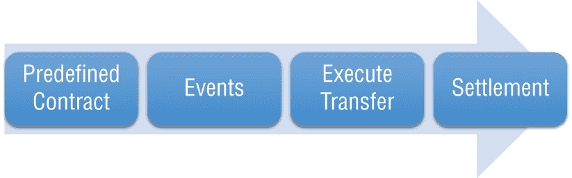

**图 10.1** 智能合约工作流程

这里是更多信息的步骤：

1.  **预定义合同：**所有智能合约参与者将建立条款，并确定执行条件。

1.  **事件：**这些实际上是触发合同执行的事件。例如，启动交易和接收资金。

1.  **执行转移：**合同的条款明确规定了基于满足条件的价值转移。

1.  **结算：**合同的结算是基于满足的要求。例如，是否从产权公司收到了 10 万美元？

智能合约与其他智能合约结合，形成去中心化应用（*dapp*）。Dapp 可以简单到几行代码，也可以是包含数千行代码的复杂应用。复杂性可以内置到平台中，也可以作为离线扩展。开发人员在开发过程中有各种各样的选项来定制 dapps。#### 智能合约执行

要修改智能合约的数据，区块链用户必须直接将请求发送到其代码。也就是说，请求不会通过中间人，而是完全由智能合约代码处理。

启动的智能合约修改流程将决定是否满足请求以及如何满足已发送的请求。实际上，智能合约是自我执行明确定义的规则。

相比之下，你可以将智能合约强制执行看作是传统数据库（如 SQL）使用所谓的*强制存储过程*的方式。在 SQL 中，你可以使用`CREATE PROCEDURE`命令指定存储过程的工作方式。`CREATE PROCEDURE`命令首先引用指定的参数，如学生、地址、货币等。然后，存储过程将接收指定的值并将其与`var_return`值进行比较。

在 SQL 中，所有插入都必须一次性执行或全部不执行，这类似于区块链强制执行智能合约逻辑的方式。在区块链中，我们将这种严格执行称为*预定义规则*。区块链中的预定义规则将指定发送方是否提供了精确的资金金额。如果发送方发送了精确的资金金额，并且随后被接收方迅速接收，那么智能合约将执行。简而言之，从普通人的角度来看，智能合约要么全部执行，要么全部不执行。  #### DAPPS

Dapps（去中心化应用程序）在一组计算机（例如以太坊）的点对点网络上运行，并非集中式。在使用以太坊开发区块链应用程序时，你有两个明显的选择。

+   使用 Solidity 或其他开发语言开发将部署到区块链的智能合约。

+   开发与以太坊区块链进行接口的网站。

当涉及到开发 dapps 时，了解区块链与传统客户端服务器应用程序的不同是很重要的。开发人员熟悉客户端服务器应用程序，并了解 Web 的世界。从 Web 2.0 迁移到 Web 3.0 的新世界将需要更新的技能集和应用程序开发语言。去中心化应用程序将成为明天的主流，开发人员需要在这个领域熟练掌握技能。

图 10.2 提供了 Web 2.0 应用程序与区块链应用程序 Web 3.0 层的高级比较。

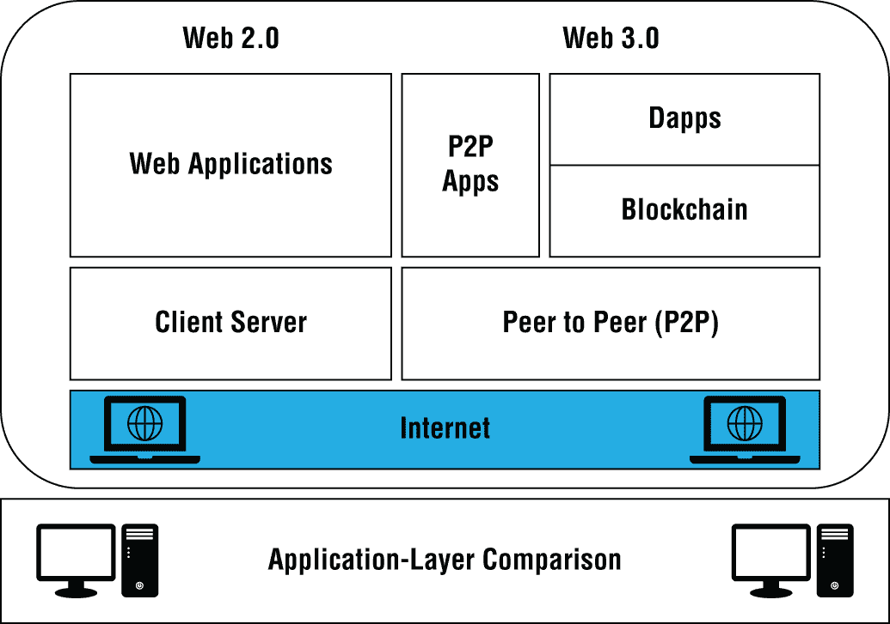

**图 10.2** 应用层比较

区块链技术中的基础设施层与 Web 2.0 不同，因为引入了点对点网络作为从集中式 Web 到更加去中心化 Web 的方法。

区块链被认为能够提供技术优势，因为它具有去中心化的能力。Web 3.0 旨在将我们的应用堆栈从客户端服务器转变为去中心化的 Web。通过去中心化，由于数据分布的去中心化，常见的安全漏洞风险可能会降低。

从应用层面来看，开发人员需要考虑整合 dapps、业务逻辑、应用服务，甚至用户界面。  #### 以太坊 GAS

以太坊区块链的本地代币是以太币，用于支付交易费用、矿工奖励和在网络上执行的其他服务。

要使用以太坊网络，你必须支付所谓的 *gas*。Gas 是以太坊中大致等效于计算步骤的度量单位。每笔交易都需要包含一个 gas 限制和一笔愿意支付的每单位 gas 的费用。区块链矿工可以选择包含交易并收取费用，也可以选择不包含。每个操作在以太坊虚拟机（EVM）上都有一个 gas 消耗，并且可以从成本的角度进行控制。

Gas 的价格是你愿意为每单位 gas 而花费的以太币数量。这个 gas 价格类似于一个拍卖限制，你可以确定你得到什么以及何时得到。

相比之下，如果你熟悉 AWS EC2 虚拟机，那么你可能已经使用过所谓的 *spot instances*。AWS 中的 spot instances 是可以以较低成本运行程序的虚拟机实例。

图 10.3 显示了估算以太坊网络 gas 资源成本的主要资源（[ethgasstation.info](http://ethgasstation.info)）。

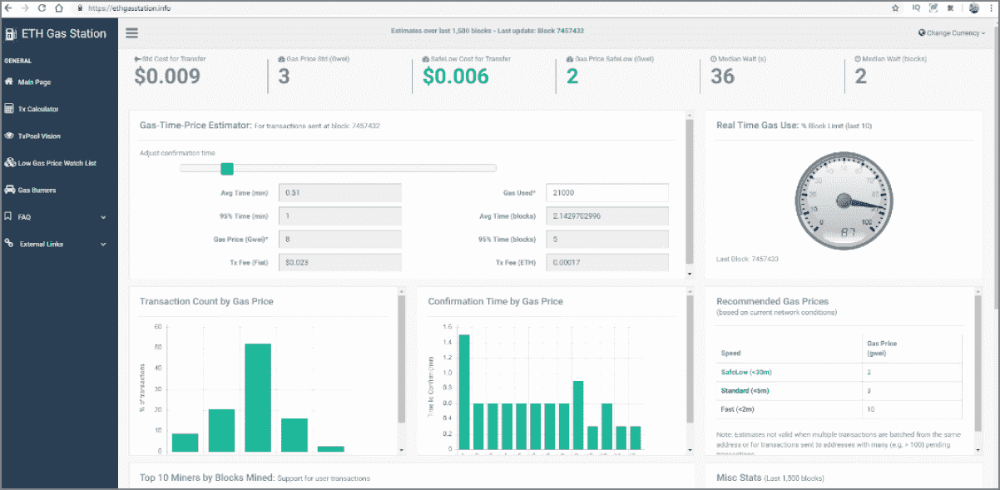

**图 10.3** 以太坊 gas 站

注意，处理交易越重要，价格就越高。基本上，你支付的 gas 越多，你的服务执行速度就越快。

围绕 gas 模型的一个常见关注点是，因为它是资源的估计，所以应该避免循环。避免循环可能会很难估计，因为如果你的应用程序扩展或你的用户群增长，那么成本可能会飙升。以太坊中的循环类似于无限自助餐，需要避免。  #### 以太坊虚拟机

在以太坊上开发时，了解 EVM 是如何为以太坊区块链设计和启用的至关重要。例如，智能合约是用智能合约编程语言（如 Solidity）编写的，然后编译成所谓的 *bytecode*。

字节码使得 EVM 能够读取和执行。部署的智能合约存在于网络的每个节点上，运行 EVM，并执行相同的指令。

EVM 不仅为企业及其用户提供了惊人的价值，还能在一个平台上开发出潜在的成千上万种不同的应用。

以太坊区块链是确定性的，这意味着相同的输入会产生相同的输出。这减少了所涉及的编程复杂性，并且可以消除许多手动错误。

图 10.4 展示了在以太坊 EVM 上的开发和部署流程。一个智能合约是用 Solidity 开发的。我们会编译我们的程序，然后部署在 EVM 上。

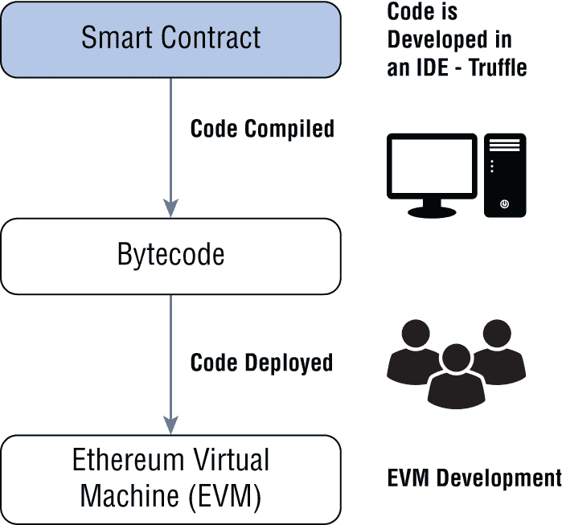

**图 10.4** EVM 开发和部署 ### 以太坊生态系统

以太坊拥有一个健全而良好配置的开发系统。

+   Solidity 是用于创建以太坊智能合约的开发语言。

+   以太坊钱包用于访问以太坊代币，这些代币用于支付以太坊资源的使用费用。

+   测试网络用于开发人员在主网络之外的测试网络上部署代码。

+   测试以太币用于支付各种测试网的交易费用。

+   提供开发环境用于构建智能合约。

+   Truffle 框架是一个被广泛接受的以太坊开发环境、测试框架和资产流水线。

#### 以太币单位

以太币被细分为单位或面额。 *gwei* 是以太坊硬币的单位，用于计算交易费用。例如，一个以太坊硬币价值 10 亿个 Gwei。

表 10.2 显示了以太币单位的细分。

**表 10.2**：以太币单位

| 单位 | Wei 值 | Wei |
| --- | --- | --- |
| Wei | 1 wei | 1 |
| Kwie (babbage) | 1e3 wei | 1,000 |
| Mwie (lovelace) | 1e6 wei | 1,000,000 |
| Gwie (shannon) | 1e9 wei | 1,000,000,000 |
| 微以太币 (szabo) | 1e12 wei | 1,000,000,000,000 |
| 毫以太币 (finney) | 1e15 wei | 1,000,000,000,000,000 |
| 以太币 | 1e18 wei | 1,000,000,000,000,000,000 |

有关以太币面额的更多信息，请访问 `[`ethdocs.org/en/latest/ether.html`](http://ethdocs.org/en/latest/ether.html)`。  #### MetaMask

MetaMask 是一个在线互联网浏览器桥接器，可在开发和测试方面提供显著的效率。例如，开发人员可以在互联网浏览器（Chrome）中运行以太坊去中心化应用程序（dapps），而不必在本地运行完整的以太坊节点。通过使用 MetaMask，开发人员可以在他们的笔记本电脑、台式机或服务器上控制 CPU 利用率和存储空间需求。

一个完整的节点需要超过 2 TB 的数据存储空间，而 MetaMask 存储在您的互联网浏览器中。MetaMask 拥有一个与 ERC-20 兼容的钱包，并提供隐私和安全工具，帮助防止网络钓鱼。

使用 MetaMask 使得以太坊开发在密钥管理方面更加简化，因为它也会在本地加密用户的密钥，然后要求用户确认密钥。确认后，用户签署交易/消息，然后将其转发到以太坊区块链。

MetaMask 包含一个安全身份保险库，提供一个用户界面来管理你在不同网站上的身份，并签署区块链交易。MetaMask 也可以被认为是一个“零客户端”。零客户端在浏览器中以 JavaScript 运行。

使用 MetaMask 来确认你的交易

+   余额

+   gas 限制

+   加斯价格

图 10.5 展示了从 Chrome 登录 MetaMask 浏览器的初始菜单。你可以看到使用微型 gas 使用量的合约交互。微型 gas 使用被认为是少于一个 gwei 的 gas 单位。

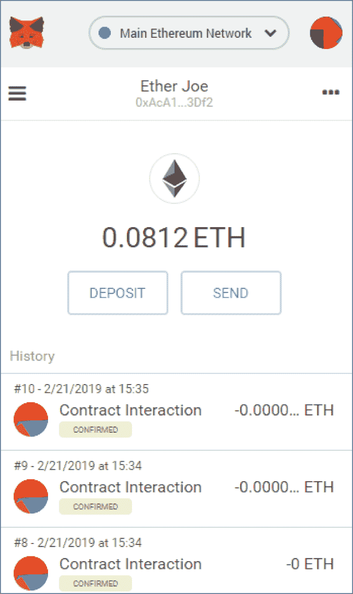

**图 10.5** MetaMask

你可以通过 Chrome 浏览器扩展或从 `[`metamask.io/`](https://metamask.io/)` 下载 MetaMask。注意，你绝不能从第三方网站下载 MetaMask，因为该版本很可能已被篡改或包含恶意软件。  #### MIST

Mist 一直是去中心化网络应用的浏览器，并最近宣布将被弃用。然而，它仍然被广泛使用，因此对它进行一些讨论是有意义的。

Mist 是一个以太坊浏览器，你可以在其中获得具有直接 Web3 访问权限的网页浏览器。Mist 是一个完整节点，因此你不需要连接到第三方节点。这与 MetaMask 不同，因为在 Mist 中你下载了一个完整节点。在 MetaMask 中，你不会下载完整的区块链到你的节点（完整节点）。

完整节点是指节点在本地下载当前世界状态的完整区块链。这将占用大量资源，大多数普通个人计算机都可能无法承受，因此确保你目前的资源不会受到挑战。

另一个重要的注意事项是，如果你只需要一个钱包，那就不要使用 Mist。相反，使用 MetaMask 或者甚至是 MyEtherWallet。

你可以从 `[`github.com/ethereum/mist`](https://github.com/ethereum/mist)` 下载 Mist。  #### PARITY

Parity 是一个轻量级的基于浏览器的钱包，为用户提供在以太坊上的去中心化应用和货币的访问。Parity 是用 Rust 编写的一个实现，是以太坊网络中最常见的钱包实现之一。

Parity 自带一个功能强大的内置以太坊钱包和完全功能的 dapp 环境。Parity 有一个 Web3 dapp 浏览器，并支持 Linux、macOS 和 Windows。  #### GETH 以太坊

Geth Ethereum 是用 Go 编写的以太坊的一种实现。要使用 Geth，你需要安装命令行界面，并与 Go 中的完整节点进行交互。

Geth 在诸如 Linux、macOS 和 Windows 等各种平台上受支持。Geth 的安装方式也非常灵活，可以通过包管理器、容器，甚至独立构建来安装。Geth 允许你参与以太坊主网，并在以太坊区块链上执行多项任务，包括以下内容：

+   挖矿以获利

+   在以太坊钱包地址之间转移资金

+   在区块链浏览器上探索区块历史

+   创建智能合约和 dapps

Geth 可在 `[`github.com/ethereum/go-ethereum/wiki/Geth`](https://github.com/ethereum/go-ethereum/wiki/Geth)` 下载。### 以太坊网络

在以太坊，每个人都可以根据以太坊协议启动自己的区块链。我们有一个主网，即生产区块链网络，以及测试或开发网络，它们就是它们听起来的样子。

你还可以部署一个私有以太坊网络，或者连接到任何可用的各种网络，比如 Ropsten。这意味着以太坊主网可以以与真实主网相同的方式复制。好处在于它不需要开发者社区的任何真实财务资源。

这些“testnet”网络用于测试你的以太坊智能合约的功能和特性。这些网络使用网络 ID，并且可能会不断变化，所以请定期检查地址。跟踪这些以太坊网络的最佳资源是以太坊堆栈交换，可在此处获取：

`[`ethereum.stackexchange.com/questions/17051/how-to-select-a-network-id-or-is-there-a-list-of-network-ids/17101#17101`](https://ethereum.stackexchange.com/questions/17051/how-to-select-a-network-id-or-is-there-a-list-of-network-ids/17101#17101)`

还要注意，并非每个测试网络都以相同的方式受支持，一般开发人员倾向于坚持自己熟悉的方式。

使用 MetaMask 在本地测试你的智能合约是预期的。另一个测试智能合约的领域是通过 MetaMask 将测试扩展到一个测试网。例如，开发人员可以在本地开发并测试任意数量的支持的测试网或主网。

如 图 10.6 所示，支持四个主要测试网络。默认网络设置为 MetaMask 的主网。以太坊最佳实践规定首先在本地开发，然后开发人员会想要确定我们将用于测试应用的测试网。与 MetaMask 配合使用的受支持测试网络包括 Ropsten、Kovan、Rinkeby 和 Goerli。我们还可以创建一个自定义的远程过程调用 (RPC) 来针对本地区块链进行测试。

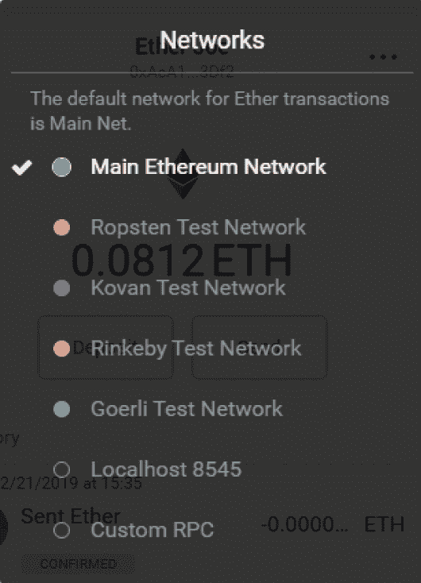

**图 10.6** MetaMask 网络

在图中，您可以看到 Main Ethereum Network 是默认网络。当您从主网切换到测试网络时，您需要确保您有足够的测试以太来执行应用程序测试。

#### 以太坊 MetaMask 水龙头

在测试以太坊应用程序上进行测试时，您需要获取称为测试以太的测试网络。测试以太本质上是免费的以太，仅可在测试网络上使用以执行应用程序测试。要请求您的测试以太，您需要前往以太坊水龙头。

以太坊 *水龙头* 是一个在线平台，为完成各种微任务（如发布社交媒体通知）的用户提供少量以太（ETH）作为奖励。作为回报，请求者在测试网络上获得测试以太。

要使用以太坊 MetaMask 水龙头，您需要在浏览器中安装并启用 MetaMask。如果您没有安装 MetaMask，则在前往以太坊水龙头时，您将收到一条错误消息，指出您需要安装并启用 MetaMask。

要安装 MetaMask，请访问此处：

`[`chrome.google.com/webstore/detail/metamask/nkbihfbeogaeaoehlefnkodbefgpgknn?hl=en`](https://chrome.google.com/webstore/detail/metamask/nkbihfbeogaeaoehlefnkodbefgpgknn?hl=en)`

安装 Chrome 扩展并在 Chrome 的扩展菜单中启用后，您可以访问 `[`faucet.metamask.io/`](https://faucet.metamask.io/)`。

图 10.7 显示了 MetaMask 以太水龙头。如果您想要获得一些测试以太以在 Ropsten 测试网络上运行，选择从水龙头请求 1 以太。

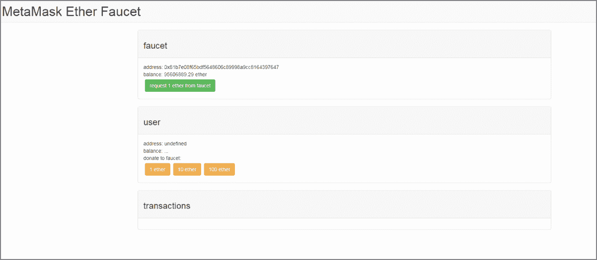

**图 10.7** MetaMask 以太水龙头

当连接到水龙头时，如果你的 MetaMask 已连接到主网，则会收到类似“当前在主网上 - 请选择正确的测试网络”的错误。

图 10.8 显示了连接请求屏幕，开发者需要连接我们的 MetaMask 帐户。选择连接，您就可以开始接收测试以太。

一旦完成连接水龙头的任务，开发者就可以在水龙头界面的交易部分看到测试交易，如图 10.9 所示。

图 10.10 显示了在 Etherscan 上的交易详情。当您点击交易链接时，您将被带到 Ropsten 测试网上的 Etherscan (`[`ropsten.etherscan.io/tx/0x4ce3ee99e291a69f35fe00d3a84e291634ef881388adb4f77130b8bf47253017`](https://ropsten.etherscan.io/tx/0x4ce3ee99e291a69f35fe00d3a84e291634ef881388adb4f77130b8bf47253017)`)。  #### RINKEBY 测试水龙头

Rinkeby 以太测试网络水龙头（`[`faucet.rinkeby.io/`](https://faucet.rinkeby.io/)`）被实施以防止恶意行为者利用所有可用资金。该水龙头的请求实际上是通过社交媒体完成的。在撰写本文时，Twitter 或 Facebook 帐户用于请求符合规定限制的资金。

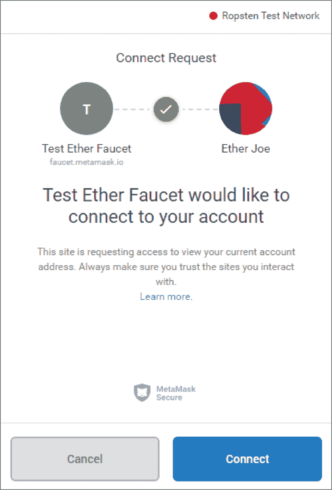

**图 10.8** 连接请求屏幕

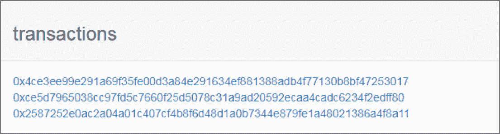

**图 10.9** 水龙头交易

图 10.11 显示了一个带有我的以太地址的推文，我希望收到 Rinkeby 测试以太币。

在 Rinkeby 网站上，只需将您的社交媒体链接粘贴到框中，然后选择您需要的以太币数量（参见图 10.12）。请注意，这是测试以太币，而不是您可以交易的东西。操作非常简单：只需选择 Give Me Ether，您的账户应该会在 Rinkeby 网络中存入相应金额。您可以返回 MetaMask 并验证存款金额。

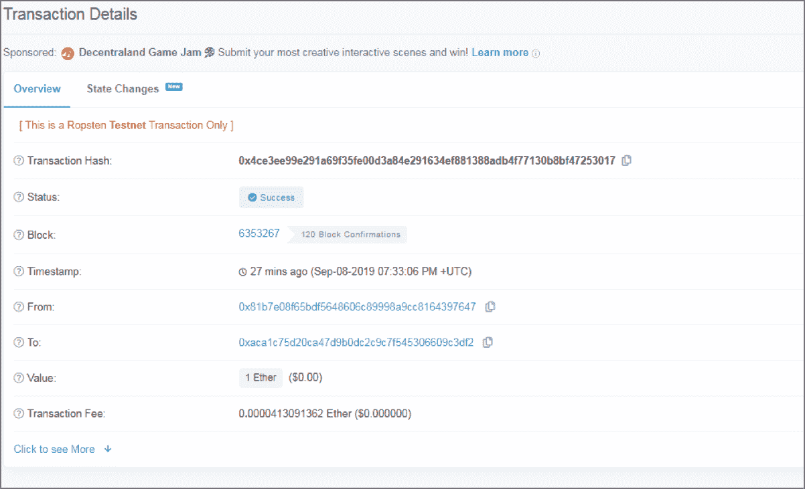

**图 10.10** Ropsten 测试网络交易详情

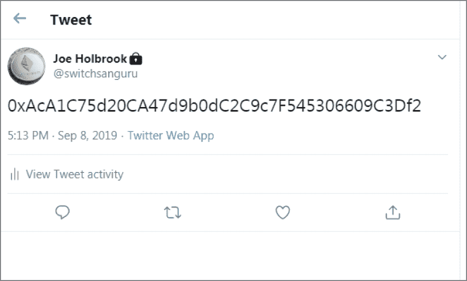

**图 10.11** 请求 Rinkeby 测试以太币

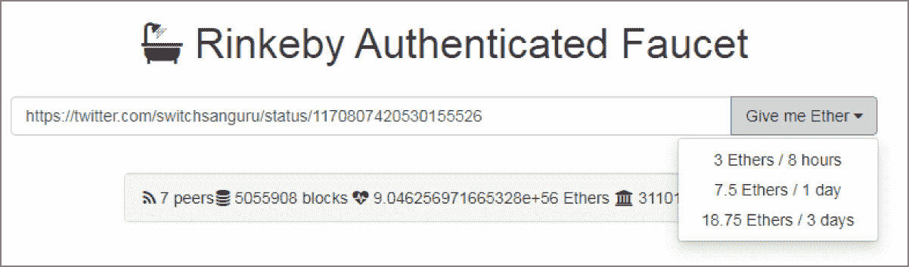

**图 10.12** Rinkeby Give Me Ether 选项  ### 以太坊节点

初次接触以太坊的开发人员应注意所部署的节点类型。使以太坊如此灵活和强大的一个方面是不同的节点功能和特性。

将节点类型视为不同的用例。有些用于部署实时应用程序，有些用于开发，有些用于测试您的区块链应用程序。未模拟的以太坊区块链节点包括以下内容：

+   Aleth 是 Cpp-ethereum 的新名称，它是用于以太坊区块链的一组 C++ 库和工具。Aleth 在 Ubuntu、macOS 和 Windows 上都受支持。

+   Go-Ethereum（GETH）是以太坊协议的三个原始实现之一。它用 Go 编写，是完全开源的，根据 GNU LGPL v3 许可。它可以作为独立客户端支持，或者您可以安装库。

+   Parity 是以太坊客户端，使用 Rust 语言编写。Parity 是具有以下节点选项的完整节点：完整工作节点，轻节点，Warp，完整节点或存档节点。

我们也可以使用模拟来模仿真实的区块链以进行开发。用于快速开发的内存中区块链模拟包括以下内容：

+   TestRPC，即以太坊区块链模拟器

+   Ganache，允许您为模拟创建私有区块链，使用 Ganache CLI，并使用以太坊来模拟完整的客户端行为

+   Truffle 开发者控制台，该控制台使用 Ganache 作为 Truffle 套件的一部分

客户端可以通过几种便捷的方式访问区块链。

+   通过 Infura 的 MetaMask 浏览器插件

+   StatusIM Android 或通过 Infura 使用 iOS 应用程序

    Status IM 是一个应用程序，它结合了信使、加密钱包和 Web3 浏览器。您可以在 `[`status.im/`](https://status.im/)` 找到有关它的信息。

    Infura 是一个提供即时、可扩展的以太坊和 IPFS 网络 API 访问的开发套件。有关更多信息，请访问 `[`infura.io/`](https://infura.io/)`。

+   MIST dapp 浏览器与集成的 Geth

有一些简单的方法可以开始运行私有区块链测试。例如，如果您考虑使用 Truffle，则有三个典型步骤。

1.  登录然后启动一个 Truffle 项目。该项目需要布置您项目的隐含结构。您可以在主网络上、在 Ganache 作为私有测试区块链上运行测试。

1.  运行部署文件。您可以将项目指向使用 Ganache 或使用主网络网络。

1.  运行 `truffle` 迁移命令。这将自动运行 `truffle` 编译，该命令将在指定的网络上部署智能合约。### Solidity 编程语言

基于以太坊的应用程序和智能合约是用 Solidity 编写的，这是一种专门设计用于利用 EVM 的语言。

Solidity 是由 Gavin Wood 博士于 2014 年 8 月提出的一种类似于 C 的语言。它也类似于 JavaScript，尽管它使用了一个全新的框架。熟悉 JavaScript 的开发人员只需要克服一小部分知识差距。JavaScript 是 Web 的通用语言，在大量应用程序中使用。

Solidity 也类似于面向对象的语言如 C++ 和 C#，而 JavaScript 基于 HTML 并受到诸如 Self 和 Scheme 的语言的影响。在处理复杂数据结构时，Solidity 在许多方面类似于 Java。Solidity 是专门为以太坊应用设计的，并且仅在以太坊区块链上运行。### 以太坊 API

以太坊使用 JSON，一种轻量级的数据交换格式，用于其 API 库。它可以表示数字、字符串、有序值序列和名称-值对的集合。

应用程序编程接口 (API) 用于与区块链网络进行交互。API 旨在为开发人员提供快速的入门。它们也被称为 *端点*。

要从 JavaScript 应用程序内部与以太坊节点通信，请使用 web3.js 库，该库为 RPC 方法提供了便捷的接口。例如，如果您希望应用程序访问具有 Etherscan 的以太坊区块链，您将需要一个 API。Etherscan 的 API 位于 `[`etherscan.io/apis`](https://etherscan.io/apis)`。

#### REMIX

Remix（`[`remix.ethereum.org/`](https://remix.ethereum.org/)`），也称为 Solidity 浏览器，是一个基于浏览器的 IDE，由以太坊开发团队构建，用于解决开发的便利性问题。Remix IDE 用于编写、编译和调试 Solidity 代码。

Remix 不仅是一个功能强大的开源开发工具，让您可以直接从浏览器中编写 Solidity 合约。Remix 还是一种在线学习解决方案，因为它使开发人员能够快速掌握智能合约开发。Remix 支持本地和在线开发。

Remix 具有开发者认为的模块。模块基本上是可以添加到 Remix 中使用的开发环境的插件。

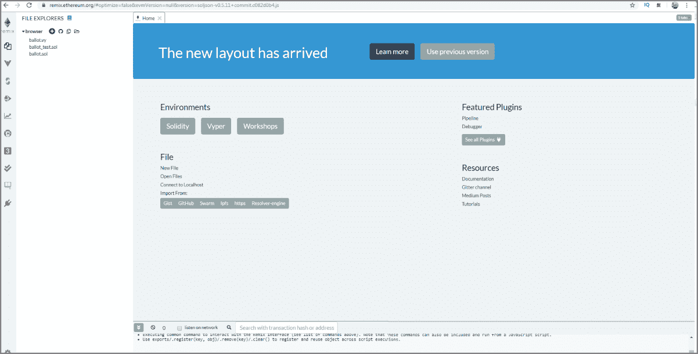

**FIGURE 10.13** Remix 界面

Figure 10.13 显示了撰写时最近更新的 Remix 界面。

Remix 包含一个用于 Etherscan 合约验证的插件。您可以使用该工具验证使用合约部署的代码是否有效，并在 Etherscan 上发布代码。

另一个有用的功能是您可以选择您的编译器版本，并将此版本与夜间构建相关联。您可以简单地使用不同的编译器编译您的代码，并验证这些构建如何运行。

Figure 10.14 显示了在特定版本编译器中运行测试代码的示例，然后在左侧边栏上接收到编译成功的绿色勾号。

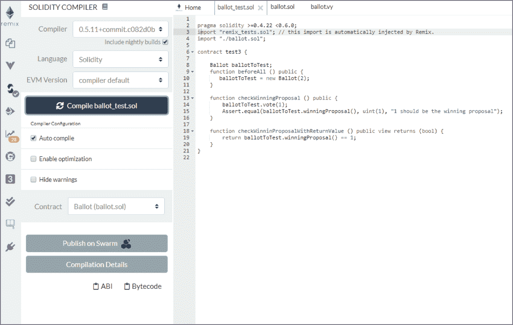

**FIGURE 10.14** 编译成功

另一个很棒的功能是你可以将你的代码推送到以太坊 Swarm。以太坊 Swarm 是一个点对点（P2P）文件存储分布式网络，允许用户数据的分布式和加密存储。

Remix 是一个功能强大但复杂的工具，因为生态系统已经显著增长。对于大多数想要在以太坊上开发的开发者来说，这是学习 Solidity 的最佳方式。  #### VYPER

Vyper 是一种面向合约的 Pythonic 编程语言，专门针对 EVM。它仍然是一种实验性编程语言，但它编译成了 EVM 字节码，就像 Solidity 一样。

Vyper 的设计目标是成为一个简单易懂的智能合约引擎，为所有参与方提供更多的透明度。

Vyper 在逻辑上与 Solidity 相似，也与 Python 有一些相似之处。Vyper 在撰写本文时仍处于测试阶段，因此我不会详细介绍它。  #### WEB3-ETH

Web3-eth 用于以太坊的区块链和智能合约开发。该库是 Web3，我喜欢将其视为进入以太坊开发和去中心化应用程序世界的“入口”。

Truffle，这是个 IDE

| 原型 | 原型 |

Truffle Suite 本质上是一套 dapp 解决方案。以下解决方案是 Truffle Suite 的一部分：

```py
**- npm install web3**
```

科文

| --- | --- |

要理解的主要点是，在区块链中有软件开发阶段，我们必须以不同的方式来对待它们。区块链部署智能合约，因此，开发起来可能比典型的企业应用程序简单。但是，需要注意的主要区别是，一旦部署到某些区块链上，智能合约是不可变的。

表 10.3 比较了传统软件开发中普遍接受的步骤与区块链开发。

| 在做任何事情之前，请参考 [web3 文档](https://web3js.readthedocs.io/en/1.0/getting-started.html)。 ### 以太坊测试 |
| --- |
| 尽管测试网络用于测试，但仍需要使用以太，尽管是测试以太，用于维护节点。你可以通过几种方式获得测试以太，例如通过在测试网络上进行挖矿或使用水龙头。 |
| 生产 | 私有链测试 |
| 下载 Web3 库后，你只需使用以下命令初始化你的应用节点： |
| 更新发布 | 测试网 |
| 你可以使用 Web3-eth 与 Ganache，例如，创建测试账户来测试你的智能合约。你可以指定以太从哪个账户转移至哪个账户。还有许多关于支持快速开发去中心化应用的 Web3-eth 的功能。 |
| Ganache，允许开发者部署个人区块链 |

在将你的应用部署到主网之前，你会想在以太坊测试网络上进行测试。以下测试网络可直接从 MetaMask 获取：

Drizzle，包含所有所需的前端库  #### Truffle

瑞克比

+   软件开发通常有一个被广泛接受的流程，这在区块链开发的世界也是如此。主要的区别在于，在区块链中步骤不同，而且相比之下还有一个额外的步骤。

+   #### 以太坊测试网络

+   Web3 的主要挑战在于，如果你在开发中不小心，可能实际上使用的是一种与库互动方式有所不同的版本。

#### Truffle Suite

Ropsten

+   |  | 主网 |

+   | Alpha/Beta | 框架测试 |

+   **表 10.3**：传统与区块链开发

Truffle 是一个用于区块链的开发环境、测试框架和资产流水线。Truffle 本质上是一个基于 NodeJS 的 JavaScript 库。Truffle 非常受欢迎，每月使用量都在增长。Truffle 是由 Consensus 开发的。

Truffle 允许开发人员点击按钮即可启动智能合约项目，并为您提供了项目结构、文件和目录，使得部署和测试变得更加容易（否则您将不得不自行配置这些）。

要安装和运行 Truffle，您首先需要安装 Node 和 Node Package Manager (NPM)。这可以在 `[`nodejs.org/en/40T`](https://nodejs.org/en/40T)` 找到。安装 Node 后，您可以进入任何命令行界面（Mac/Linux 上的终端或 Windows 上的 PowerShell）并与 npm 交互。

Truffle 框架的一个有趣项目是 Truffle Box。这些是预配置的“迷你脚手架项目”，使得启动新的分布式应用程序变得更加简单。可以在 `[`truffleframework.com/boxes/40T`](http://truffleframework.com/boxes/40T)` 找到 truffle boxes 的列表。

使用基线 JavaScript、React、Angular 或其他语言来开始一个 Truffle box。

您可以在仪表板上查看套件的下载次数（`[`truffleframework.com/dashboard`](https://truffleframework.com/dashboard)`）。

图 10.15 显示了 Truffle 套件活动仪表板。

Truffle Suite 可以从 `[`truffleframework.com/`](https://truffleframework.com/)` 下载。#### GANACHE

Ganache CLI 是 TestRPC 的最新版本：一个快速且可定制的区块链仿真器。它允许您在不运行实际以太坊节点的情况下调用区块链。交易立即被挖掘。

您可以把 Ganache 看作是用于以太坊开发的个人区块链，您可以用它来部署合约、开发应用程序和运行测试。它既可以作为桌面应用程序，也可以作为命令行工具使用。

Ganache 可用于 Windows、Mac 和 Linux。许多开发人员在开发过程中使用 Ganache 来测试他们的智能合约。它提供了方便的工具，如高级挖掘控制和内置区块浏览器。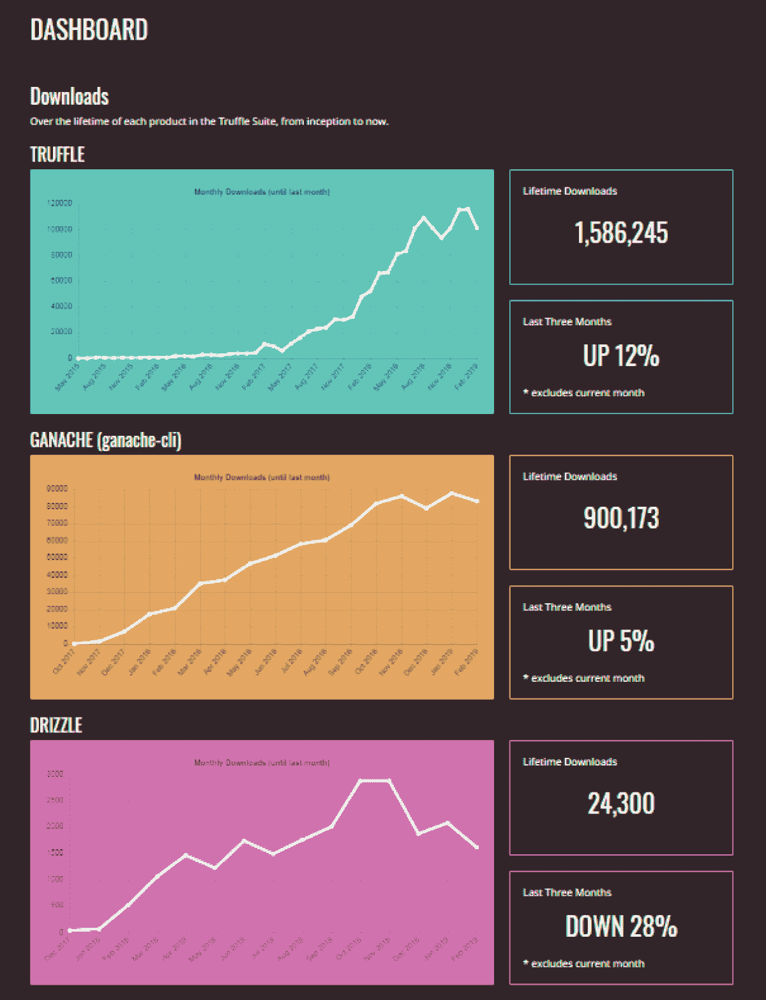

**图 10.15** Truffle 活动仪表板

#### DRIZZLE

Drizzle 是一组前端库，使编写 dapp 前端变得简单、更高效和更可预测。Drizzle 的主要核心基于 Redux 存储，并且您可以访问 Redux 的开发工具。Drizzle 包负责同步您基于以太坊的服务。#### TRUFFLE 还是 GANACHE？

决定何时使用 Truffle 或 Ganache 可能会有些困惑，因为这两个解决方案在功能上有一些重叠。以下是一些提示，帮助您决定是否使用 Truffle 或 Ganache：

+   Truffle 将使您能够开发、测试和部署您的 dapp，并且它与 Ganache 集成。

+   Ganache 是 Truffle 生态系统的一部分，您将使用 Ganache 开发您的 dapp。 Ganache 本质上模仿了真实的区块链。您也可以选择不使用 Ganache，而是使用 Truffle 连接到公共测试网或在本地部署。

+   一旦 dapp 被开发和测试完成，您就可以使用 Geth 或 Parity 将它们部署到以太坊客户端。 #### Open Zeppelin

Open Zeppelin 是一个针对以太坊和其他基于 EVM 的区块链的可重用智能合约的良好格式化和普遍存在的框架。 Open Zeppelin 是一个用于安全智能合约开发的库。

它提供了像 ERC-20 和 ERC-721 这样的标准实现，您可以按原样部署或扩展以满足您的需求，以及 Solidity 组件来构建自定义合约和更复杂的去中心化系统。

可重复使用的智能合约很有用，因为它们已经由同行审查，因此已经过审计。当然，使用一个已准备好的模板提供了诸如缩短开发时间和更快的上市时间等好处。

有关 Open Zeppelin 的更多信息，请访问`[`openzeppelin.org/`](https://openzeppelin.org/)`。 #### 私有区块链测试

开发人员感兴趣的一个领域是能够在本地部署、测试和验证应用程序，而不必连接到 VPN。或者，您正在开发应用程序，并希望确保网络的特定变量可用。您将希望选择私有部署，例如 Ganache。 #### 以太坊代币

以太坊中的令牌按照称为 ERC-20 标准的特定标准创建。以太坊生态系统中的令牌可以代表任何可交易的可替代物品，如忠诚度积分、金属证书、IOUs、硬币等。

在大多数情况下，令牌以标准方式实现了一些基本功能，这意味着您的令牌很可能与以太坊钱包或使用相同标准的任何其他客户端或合约兼容。

这些令牌需要遵循特定的标准，也称为*常量*。例如：

+   符号，即您的令牌的符号或交易代码

+   名称，即您为其指定的名称

+   总供应量，即发行的代币数量

+   小数点，即使用的小数位数

标准列在`[Ethereum.org/token](http://ethereum.org/token)`。 #### 以太坊请求评论

以太坊请求评论（ERC）是一个被赋予光荣的 GitHub 问题跟踪器。这是开发人员可以在其中要求对合约和其他与以太坊提案相关的问题进行评论的主要联系点。一个 ERC 以#1 开头，并且每次打开一个新问题时递增。

您可以在`[`eips.ethereum.org/erc`](https://eips.ethereum.org/erc)`找到 ERC。 #### 以太坊 ERC 代币（ERC-20）

ERC-20 代币合约是在以太坊区块链上部署可互换代币的“标准”模板，作为智能合约。ERC 代币标准基本上是一个标准接口，以及创建和操作 ERC-20 代币所需的函数的样本实现。

以太坊开发者需要非常注意他们如何开发应用程序。一种方式是遵循 ERC-20 标准。ERC-20 标准有几个目的，但主要目的是专注于合约的可移植性。#### 以太坊改进提案

以太坊改进提案（EIPs）与 ERCs 的格式相同，但用于提出以太坊协议的更改。EIPs 的作用与比特币改进提案（BIPs）相同。BIPs 用于引入对比特币重要的新功能或信息。EIPs 以 EIP #1 开头，并在每次打开新问题时递增。

要了解更多信息，请访问 `[`github.com/ethereum/EIPs`](https://github.com/ethereum/EIPs)`。## Hyperledger 开发

在 Hyperledger Fabric 中开发应用程序有一些很大的好处。Hyperledger 生态系统对于一个开源项目来说是强大且良好维护的。Hyperledger 项目在开发选项方面几乎没有遗漏，显然是最好管理的区块链项目。

本节提供了在 Hyperledger Fabric 中开发者需要处理和开发的广泛概念。

### 链码

链码是 Hyperledger Fabric 中的智能合约，并由外部于区块链网络的客户端应用程序调用，该客户端管理对世界状态中一组键值对的访问和修改。世界状态是当前区块链交易的实际状态，这些交易被不可变地记录下来。

Chaincode 服务是安全且轻量级的，因为环境部署为一个锁定的、安全的容器。这个容器有一组已签名的基础镜像，包含了安全的操作系统和链码语言、运行时以及 Golang、Java 和 Node.js 的 SDK 镜像。

每个链码都必须实现链码接口，该接口用于提供类似于云计算中端点的连接。链码接口使客户端应用程序能够调用响应接收到的交易提案的函数。链码实现链码接口，特别是 `Init` 和 `Invoke` 函数。

#### 安装链码

在安装链码时，您应确保首先安装了 Go 编程语言，然后设置了适合您部署类型的正确配置要求。

您将想要确保为您的链码应用程序创建一个目录，作为 `$GOPATH/src/.` 的子目录。

以下命令将创建名为 `wiley:code:` 的目录

```py
mkdir -p $GOPATH/src/wiley:code
```

要进入目录，可以使用以下命令：

```py
cd $GOPATH/src/wiley:code
```

要创建链码的源文件，请使用以下命令：

```py
touch wiley:code.go
```  #### 编写链码的考虑

安装 Go 并设置您的环境后，您就可以开始开发您的链码了。

请注意，本书不会教授链码，但组织结构旨在为开发人员考虑 Hyperledger 开发时的任务提供见解。其中一些任务与以太坊不同，值得雇主注意。

您接下来可以做的事情是实现 init 函数。init 在链码实例化期间调用，并将初始化链码的任何数据。链码应用程序将实现通过调用函数调用的两个函数。

在设置平台时，一个让人困惑的领域是数据库选项。如果复杂的查询基于预期的调用序列，则可能需要注意链码设计。

这种困惑可能是因为如果你不了解状态数据的数据库选项，就很可能发生无效交易。状态数据库可以使用 LevelDB 或 CouchDB 来编写。

要获取有关开始使用链码的教程信息，请参阅以下网站：

`[`hyperledger-fabric.readthedocs.io/en/release-1.4/chaincode.html`](https://hyperledger-fabric.readthedocs.io/en/release-1.4/chaincode.html)`  #### 区块链平台扩展

IBM Blockchain Platform Extension for VSCode 帮助 Hyperledger Fabric 开发人员快速开发、部署和测试他们的链码。这也可以用来在本地机器上测试客户端应用程序。该扩展当前支持 Windows 10、Linux 和 macOS。

该扩展通过创建一个基本的智能合约来管理您选择的开发语言中的示例资产。

真正有用的是，该扩展提供了部署智能合约到 Hyperledger Fabric 实例所需的所有依赖项。这些功能使得在 IBM Blockchain 服务上为您的链码进行高效开发成为可能。

要了解有关 VSCode 扩展的更多信息，请参阅以下网站：

`[`cloud.ibm.com/docs/services/blockchain?topic=blockchain-develop-vscode`](https://cloud.ibm.com/docs/services/blockchain?topic=blockchain-develop-vscode)`  ### Hyperledger Fabric 共识选项

Hyperledger Fabric 有两个共识选项，从开发的角度理解它们的差异非常重要。一旦部署了你的区块链，就无法简单地回滚。

+   Solo 是用于开发的，它是一个没有高可用性的单节点。

+   Kafka 是在现场区块链上部署的生产版本。在 Hyperledger 中，Kafka 是最接近基于投票的共识的选项之一。

正如在 第二章 中讨论的那样，共识方法具有不同的优点，但也有缺点。例如，拥有更多的节点意味着达成共识需要更多的时间。开发人员还应该意识到可扩展性和性能之间存在权衡。Hyperledger Fabric 共识白皮书是主要的起点。要了解更多信息，请参阅以下网站：

`[`www.hyperledger.org/wp-content/uploads/2017/08/Hyperledger_Arch_WG_Paper_1_Consensus.pdf`](https://www.hyperledger.org/wp-content/uploads/2017/08/Hyperledger_Arch_WG_Paper_1_Consensus.pdf)`  ### Hyperledger Fabric 数据库选项

重要的一点是要考虑 Hyperledger Fabric 的状态数据库选项。Hyperledger Fabric 中的分类帐系统使用 LevelDB，它允许并发写入者通过提供内部同步安全地向数据库插入数据。

状态数据库选项包括 LevelDB 和 CouchDB。LevelDB 是默认的键-值状态数据库，嵌入在对等体进程中。CouchDB 是支持二进制数据的替代外部状态数据库。

表格 10.4 显示了事务日志和状态数据库的选项。

**表格 10.4**：事务日志和状态数据库选项

|  | 事务日志 | 状态数据（全局状态） |
| --- | --- | --- |
| **类型** | 不可变 | 可变 |
| **操作** | 创建、检索 | 全部 CRUD |
| **DC** | LevelDB | LevelDB/CouchDB |
| **态度** | 嵌入式对等体 | 键-值对（JSON、二进制） |
| **查询** | 简单 | 用于复杂（二进制）的 CouchDB |

重要的是要注意，当资产以 JSON 文档的形式存储时，CouchDB 允许您根据资产状态执行复杂的查询，例如。由于查询的格式与 CouchDB 的声明性 JSON 查询语法格式相同，因此没有学习曲线。  ### 客户端应用程序

在为区块链和特别是 Hyperledger Fabric 开发客户端应用程序时，根据您的具体用例设计时有一些重要考虑因素。这些客户端前端考虑因素包括以下内容：

+   通过安全协议（HTTPS）保护 REST 服务器。

+   使用身份验证选项，如通过 Oath 或支持的平台的护照。

+   为 REST API 服务使用多用户模式。

+   了解区块链应用程序的完整用例考虑因素。

+   使用当前的企业密钥管理系统（KMS）。

+   使用当前的软件开发工具包（SDK）确保你正在运行支持组件的最新版本。

图 10.16 显示了 Hyperledger 区块链开发的不同层次。从开发角度来看，如果你正在开发一个面向最终用户的区块链应用程序，那就被认为是前端开发。在前端开发中，会有开发应用程序、钱包、移动应用程序、监控工具等。 

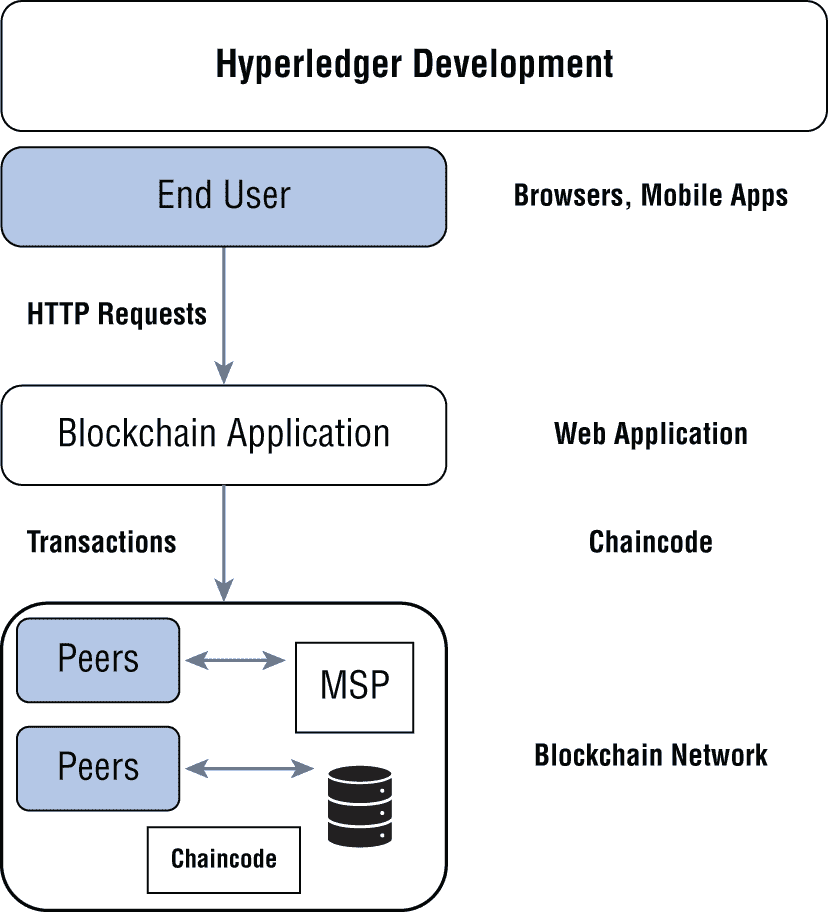

**图 10.16** 前端应用程序工作流

Hyperledger Fabric 的业务网络存档（包）包括模型文件、链码、访问控制文件和静态查询文件。

本机查询语言可以通过使用明确定义的条件来过滤返回的结果。本机查询语言也可以在交易中调用，以执行诸如更新之类的操作。

区块链查询在业务网络定义的父目录中的查询文件（`.qry`）中定义。

发生的事件将创建与区块链上的重要操作（例如，一个新区块）相关的通知，以及与处理智能合约/链码时达到的里程碑相关的通知。客户端应用程序可以订阅此事件并采取适当的业务操作。### Fabric REST 服务

REST 服务器在启动期间使用指定的业务网络卡连接到和发现已部署业务网络中的资产、参与者和交易。生成 REST API 需要此信息的可见性。业务网络卡称为发现业务网络卡。默认情况下，发现业务网络卡也用于处理对 REST API 的所有请求。

Chaincode 服务使用 Docker 托管（部署）链码，而无需依赖任何虚拟机或计算机语言。Docker 提供了一种安全、轻量级的方法来沙箱化链码执行。该环境是一个“封闭”且安全的容器，以及一组包含安全操作系统和链码语言、运行时以及用于 Golang 的 SDK 映像的签名基础映像。

Hyperledger 包括 REST 和 JSON RPC API、事件以及供应用程序与网络通信的 SDK。### 服务发现

为了在对等方上执行链码、向排序器提交交易，并了解交易状态，应用程序连接到 SDK 提供的 API。发现服务通过让对等方动态计算所需信息并以可消耗的方式呈现给 SDK 来改善此过程。

应用程序启动时已知道一组对等方，这些对等方被应用程序开发人员/管理员信任，以提供对发现查询的真实响应。

需要由客户端应用程序使用的良好候选对等方是与同一组织中的对等方。### Hyperledger Composer

由 IBM 和 Oxgcains 贡献，Hyperledger Composer 是专门为 Hyperledger 构建的开源应用程序开发框架。Composer 简化了 Hyperledger Fabric 区块链应用程序的创建过程，因此提高了开发周期的效率。

Composer 工具旨在帮助用户创建基于 Hyperledger Fabric 的区块链应用程序，而无需了解区块链网络中涉及的低级别 Go 编程细节。

如果您想直接在超级账本 Fabric 上构建自己的区块链应用程序，您必须使用 Go 或 Java 编写您的链码，这与 JavaScript 相比有很大不同，因为它的 Composer 很容易使用模型文件（`.cto`）和角度 JavaScript 编写智能合约。

超级账本 Composer 主要使用 JavaScript 进行链码开发，这也降低了入门门槛。

超级账本 Composer 使用所谓的 *连接配置文件* 来定义连接到的系统，连接配置文件是一个 JSON 文档，充当业务网络卡的一部分。连接配置文件描述了一组不同的组件，包括超级账本 Fabric 区块链网络中的对等方、排序者和证书颁发机构。连接配置文件通常由了解网络拓扑的管理员创建。

您可以使用查询获取关于区块链状态的数据。查询在业务网络中定义，可以包含变量参数。使用 Composer API 发送查询。

Composer 中的事件与参与者或资产一样在业务网络定义中定义。一旦定义了事务处理器函数，事件就会被发出。事件向外部系统指示了账本上发生了重要事件。应用程序使用 Composer 客户端 API 订阅发出的事件。

商业网络的开发者可以创建一组访问控制。访问控制是确定参与者在业务网络中可以访问哪些资产以及他们可以在什么条件下访问这些资产的规则。

历史记录是一种记录在业务网络上进行的成功交易的专门类型的注册表。

#### 超级账本 Composer 建模语言

超级账本 Composer 是一种面向对象的建模语言，为企业定义了领域模型。

建模语言保存为一个 `.cto` 文件。CTO 文件包含以下内容：

+   一个单一的命名空间，其中所有资源声明都是隐式的

+   包括资产、交易、参与者和事件在内的一组资源定义

+   从其他命名空间导入资源的选项

存在一个系统命名空间，其中包含资产、事件、参与者和交易的基本定义。这些基本定义是隐式扩展的抽象类型，由所有新资产、事件、参与者和交易隐式扩展。

系统命名空间中的事件和交易分别由 eventID 和 transactionID 定义，并带有一个时间戳。

系统命名空间还包括历史记录，这是一种专门的注册表，记录了区块链上的成功交易，以及提交交易请求的参与者和身份。  #### 超级账本 Composer 资源

在 Composer 中，资源被视为以下之一：

+   资产、参与者、交易和事件

+   枚举类型

+   概念

这里有一个以`Vehicle`为超类型和以一组零件为资产的`Car`的示例：

```py
asset Car extends Vehicle {
o String model
--> Part[] Parts
```

在 Composer 中，概念是抽象类，不被视为资产、参与者或交易。由于这种抽象特性，概念需要被清晰地定义。交通工具可以是汽车、摩托车、飞机、船舶或任何其他交通方式。我们需要通过添加字符串并将概念声明到代码中来适应概念可能是抽象的可能性。

以下代码展示了如何在程序中将纽约标识为字符串。此代码扩展了纽约市在美国可以是街道、城市或州的可能性。然后，添加了一个概念来处理纽约市也可能是加拿大的街道、城市或州的可能性。

```py
Address {
o String street
o String city default = "New York"
o String country default = "US"
o Integer[] counts optional
}
concept CanadaAddress extends Address {
o String zipcode
}
```

Composer 可以处理的其他编程领域包括数组、基元、字段验证器、关系、导入和装饰器。  #### 超级账本 Composer Playground

[Hyperledger Composer Playground](https://composer-playground.mybluemix.net/)是由 IBM 维护的免费沙盒，提供了一个快速建模和测试区块链网络的环境。Composer Playground 具有简单的图形用户界面，用于编辑和测试业务区块链网络。Playground 简化了通常用于运行区块链测试的复杂区块链网络。

Playground 有在线版本和离线版本。在线 Playground 在浏览器内存中运行业务网络，而本地 Playground 则部署在超级账本 Fabric 实例中。

我们可以使用超级账本 Composer 或 Composer Playground 来开发、测试和验证我们的区块链想法，将一个新的业务网络部署到超级账本 Fabric 上。Composer 不是一个实时的区块链，它专注于预生产用例。

图 10.17 展示了超级账本 Composer Playground 的登录提示。

Composer Playground 目前可在`[`composer-playground.mybluemix.net/`](https://composer-playground.mybluemix.net/)`上使用。

Hyperledger Fabric v1.4+应该会带来开发者体验的显著改进，其中将包括一个新的编程模型。需要注意的是，Composer Playground 可能在未来被弃用，但截至目前尚未发布清晰的路线图。

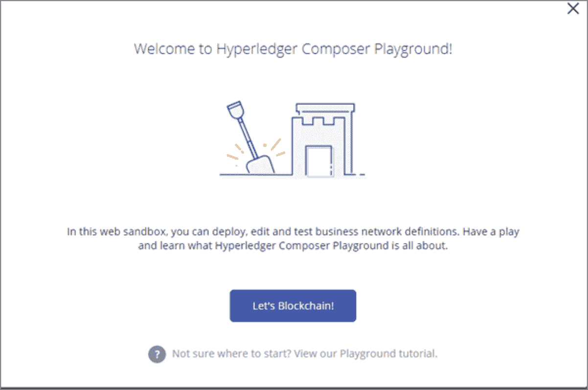

**图 10.17**展示了 Hyperledger Fabric Playground 的登录界面  ## R3 Corda 开发

Corda 是用 Kotlin 编写的，并且与任何 JVM 语言兼容。对于一些更喜欢 Scala 的程序员来说，Kotlin 是一种奇怪的语言。Kotlin 确实具有更好的类型推断、更好的具有类型变异的泛型以及更现代的语法。

Corda 开发中最流行的两种语言是 Java 和 Kotlin。真正的关键在于它在编程视角上与 Java 具有很大的灵活性和互操作性。

R3 Corda 主要专注于为受监管的金融服务实施解决方案。因此，Corda 解决方案的开发通常涉及许多类型的金融资产。在 Corda 合约中定义的一些常见金融资产包括以下内容：

+   现金

+   股票

+   债券

+   期货

+   信用证

+   衍生品

+   利率互换

金融交易是买方和卖方之间就一项或多项资产与货币价值支付达成的协议。这基本上是 Corda 中智能合约的重点。

在 Corda 中开发时，有两种主要类型的资产。

+   可互换资产，这些资产是同质的，并且是可分割的、可合并的和可互换的。

+   不可互换资产，这些资产是独特的，并且代表着不可分割、不可合并或不可互换的东西。

我不会涉及资产的商业部分，所以如果你感兴趣的话，可能需要更多的研究。

### Corda 共识模型

在 Corda 中，共识在某些方面与其他区块链处理方式有所不同，Corda 中的共识单位是可以分为两个不同部分的状态。在其他区块链中，状态被认为不够灵活，即当前事务视图的状态。Corda 中的共识被分为两个不同的部分：关于状态有效性的共识和关于状态唯一性的共识。

+   *关于状态有效性的共识* 是指区块链成员确信交易已被合约状态接受并且具有所有所需的签名。

+   *关于状态唯一性的共识* 是指区块链成员确信在交易中创建的输出状态实际上是唯一的，且之前未被消耗。

Corda 拥有可插拔的唯一性服务，以提高隐私性、可扩展性、与法律系统的兼容性和算法的灵活性。

Corda 中使用可插拔的唯一性服务以及共享的加密哈希来确保对交易的限制性查看提供所需的可扩展性和隐私性。

有关 Corda 共识模型的更多信息，请参阅以下内容：

`[`docs.corda.net/releases/release-M9.2/key-concepts-consensus-notaries.html`](https://docs.corda.net/releases/release-M9.2/key-concepts-consensus-notaries.html)`  ### CorDapps

在 Corda 中开发应用主要围绕着 CorDapp（Corda 分布式应用）以及你如何定义业务逻辑展开。任何 CorDapp 的主要目标是允许参与者就全球分布式账本中的交易达成协议。

通过定义流程（*工作流*），CorDapps 实现了这一主要目标，Corda 节点所有者必须通过 RPC 调用这些流程。需要注意的是，Corda 中合约的核心是一个可执行程序，它对 Corda 交易中的所有状态对象的更改进行身份验证。

CorDapps 包括以下软件组件：

+   状态定义了如何达成协议的事实。

+   合约定义了什么构成了有效的全局分类帐更新。

+   服务提供节点的功能，例如节点角色是什么，比如公证员。

+   Flows 通过调用与当前状态一致且相关的智能合约来指定状态更改的整个生命周期。

+   服务中心维护服务并支持 API，用于从服务器端 CorDapps 代码内部访问和控制 Corda 平台的许多方面，而不是 RPC 客户端代码。

+   客户端 RPC 操作是远程过程调用。### Corda 网络和节点

Corda 网络由运行节点的多台机器组成，包括单个节点作为网络映射服务运行。这些节点使用持久协议进行通信，以创建和验证交易。

Corda 网络是一个连接的图形。没有全局广播。网络维护点对点和非持久性连接，并支持 AMQP/1.0 over TLS。 Corda 在半私有权限网络上运行。

Corda 节点是在 Java 虚拟机 (JVM) 上运行的进程。 Corda 节点的属性包括多种类型的服务和支持 CorDapps 等自定义功能。

节点按照流程框架相互交互，该框架反映了拟议交易的业务逻辑和由 CorDapps 指定的自定义功能。验证并完成流程框架后，交易将提交到分类帐中。

要设置 Corda 节点，应使用 Corda 提供的模板。这些模板可在 GitHub 上以 Kotlin 和 Java 的形式提供（[`github.com/corda`](https://github.com/corda)）。

当您完成设置 Corda 模板后，需要通过配置 XML 文件设置网络中的多个参与者（节点）。### Corda Service Hub

Corda 节点在区块链世界中有一些独特之处 - 服务中心。服务中心维护服务并支持 API，用于从服务器端 CorDapps 代码内部访问和控制 Corda 平台的许多方面。所有这些都是在服务器端 CorDapps 代码内执行的，而不是在 RPC 客户端代码内执行的。

将服务中心视为大多数在节点内执行的操作的起点。服务中心还通过三个不同的服务调用定义节点内部访问服务的方式。

CorDapps 实际上定义了节点所有者与节点的交互方式。当然，需要 API 来提供对 Corda 节点所需操作的支持。开发人员还可以在部署应用程序之前检查和测试一套完整的独特 API 调用。

有关 API 类别的更多信息，请参阅以下内容：

`[`docs.corda.net/api/kotlin/corda/net.corda.core.node/-service-hub/index.html`](https://docs.corda.net/api/kotlin/corda/net.corda.core.node/-service-hub/index.html)`  ### Corda Doorman

Corda 网络是半私有的，并具有执行节点必须提供的信息和完成的认识您的客户流程之前被允许加入网络的门房服务的规则。

节点必须联系门房并提供所需信息。门房将从网络的权限服务中获得一个由根机构签名的 TLS 证书。  ### Corda Flows

Flows 用于建模参与资产交换的各方之间的业务流程。Flows 是一种双边协议，即两方之间的协议。在 Corda 中不能直接调用智能合约；因此，必须编写一个流程，该流程指定了状态变化的整个生命周期。流程通过调用与当前状态相关联的智能合约来实现这一点。  ### Client RPC

客户端远程过程调用是客户端区块链程序用于从位于远程 Corda 节点上的程序请求区块链访问的协议。

RPC 用于确保应用程序可以在不完全规定或理解区块链网络细节的情况下进行通信。RPC 也被称为函数调用或子程序调用，它使用客户端-服务器平台。Corda 中的节点所有者可以通过客户端 RPC 与节点交互。

从开发角度看，节点所有者无法直接访问服务中心 API。开发者需要使用 `CordaRPCClient` 类编写一个 JVM 兼容的语言的客户端来与节点交互。开发者还需要解决一些依赖和权限问题。

如需更多信息，请参考以下内容：

`[`docs.corda.net/clientrpc.html`](https://docs.corda.net/clientrpc.html)`  ### Oracles

Oracle 是可信的外部信息源，提供事实和最终信息。事实可以作为命令的一部分包含在交易中。Oracle 服务可用于访问或验证账外数据。只有当包含的账外事实在其视角下实际为真时，Oracle 才会签署交易。例如，可以使用 Oracle 服务签署交易以确保在某个时间点参考的汇率是正确的。

简而言之，Oracle 是一个可信的服务，可以以受控且确定的方式提供交换的能力。  ### Corda DemoBench

DemoBench 用于在本地开发机上运行多节点 Corda 网络。R3 Corda DemoBench 可在 Corda 下载站点免费下载，支持 Windows 和 macOS。开发者应该先使用 DemoBench 从用户角度了解 CorDapp 的工作原理，然后深入学习 JVM。

图 10.18 展示了在部署网络时 DemoBench 中的视图。

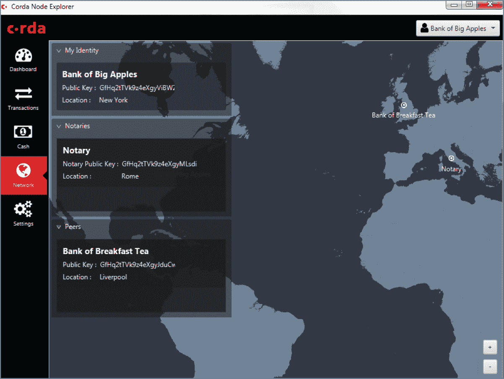

**图 10.18** DemoBench

DemoBench 将日志文件写入以下位置：

+   **macOS/Linux**: `$HOME/DemoBench/demobench.log`

+   **Windows**: `%USERPROFILE%\DemoBench\demobench.log`

图 10.19 显示 Corda DemoBench JVM 中的日志文件。

你可以从`[`www.corda.net/download.html`](https://www.corda.net/download.html)`下载 Corda DemoBench。

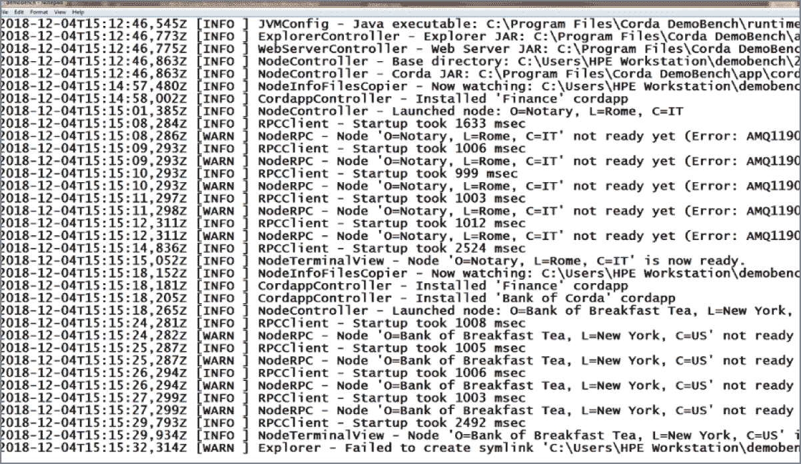

**图 10.19** DemoBench 日志  ## Quorum 开发

Quorum 是由 JP Morgan 直接从以太坊代码开发的开源私有区块链网络。这个区块链是以太坊区块链的一个分叉。

以太坊开发者将没有真正重要的学习曲线来熟练掌握该平台。Quorum 开发类似于以太坊，因此我不会再次涵盖 Quorum 的冗余区域。我将专注于 Quorum 和以太坊之间的相似之处和主要区别。

Quorum 的主要特点是它允许各方之间进行私人交易。它通过以太坊的私有部署实现这一点，而不是在以太坊主网上实现。

Quorum 引入了一种有趣的新共识算法称为 Raft。与股权证明（POS）类似，Raft 不需要计算哈希，并在不到 0.5 秒内验证块/交易，这对于区块链来说速度很快。然而，这种速度是以安全性为代价的，因为它没有拜占庭容错性。基本上，如果使用这种共识，安全性必须由实体自己提供，以确保它们的节点对攻击者不可访问。

Quorum 提供了更多的共识机制，从长远来看将允许拜占庭容错性，例如 Quorum Chain，该链通过智能合约可编程，并旨在实现可编程共识逻辑。

Quorum 允许在网络参与者之间私下进行交易，并且允许将交易仅对特定组的参与者可见。

私人交易的数据永远不会到达非参与节点，因为不是使用区块链通信发送数据，而是使用点对点网络，该网络与区块链一起工作，并允许从一个节点发送数据到另一个节点，称为/由 Constellation 提供。此数据通过其哈希在区块链中验证，但数据永远不会通过“开放”网络发送。

### Quorum vs. 以太坊

从开发的角度来看，Quorum 使用与以太坊相同的核心。它们共享相同的智能合约开发语言 Solidity。

然而，在涉及到计算价格方面，与气体系统有关。Quorum 网络开发者不必担心与合约交互所需的足够气体。开发者不需要担心气体，因为 Quorum 是一个私有区块链，不使用气体。钱包在 Quorum 中不像在以太坊中那样被使用。

然而，Quorum 确实对每个交易维持了执行燃气限制。这是为了防止有人启动一个代码，使得验证者处理起来太长时间，有效地在链上引入一个漏洞。  ### Quorum Cakeshop

Cakeshop 是一个具有创建、管理和集成类似以太坊的分类帐（如 Quorum）API 的 SDK。它打包为一个可以在 Docker 容器上运行的 Java Web 应用程序归档（WAR）。Cakeshop 具有直观的图形用户界面，使用起来相当直观。

Cakeshop 从 Geth 下载最新版本的 Quorum 和引导节点。该 Cakeshop 包括事务管理器、Solidity 编译器和所有所需的依赖项。

有关 Cakeshop 的更多信息，请访问`[`github.com/jpmorganchase/cakeshop`](https://github.com/jpmorganchase/cakeshop)`。  ## 区块链性能

区块链通常是分布式和去中心化的技术，并且它们可以很快。例如，如果你移除了节点，一个区块链可能会比另一个区块链更快。但是，当你移除节点时，你实际上是在减轻安全性或去中心化。

需要注意的是，像任何其他技术一样，区块链不可能一步到位，因此必须在约束条件上做出妥协。这种妥协类似于项目经理处理项目约束条件的方式。例如，在一个项目中，你可以通过增加劳动力来缩短完成时间，这可能会让你的项目提前完成。另一方面，通过增加更多的劳动力，你实际上增加了成本约束。

在区块链项目中，约束与妥协的角度无异，从安全性、速度或去中心化的角度考虑，这是一种权衡考虑。想要更好的性能（更快的交易）？那么减少节点数量，但也要更集中地配置节点。通过提高性能，你很可能会影响去中心化，同时改变你的安全性立场。

如图 10.20 所示，项目管理三角形（又称三重约束）包括三个约束。

+   时间指的是分配给项目的进度表。

+   成本指的是许可证、硬件和人力资源（内部和外部）的预算。

+   范围指的是项目中要交付的功能数量。

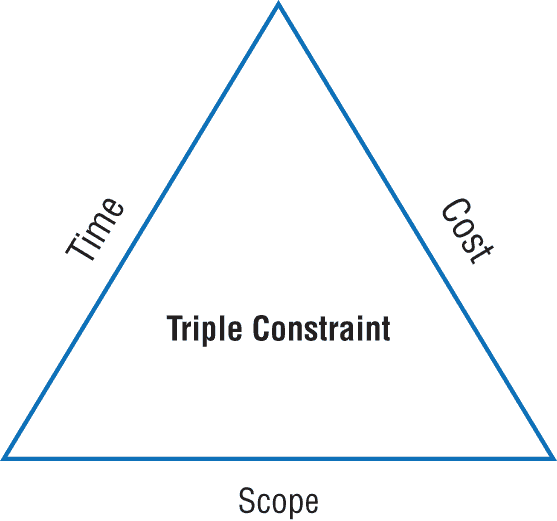

**图 10.20** 三重约束

项目需要调整三个约束之一来弥补另一个。一般来说，项目发起人将确定要优秀的两个，第三个将必须被调整以满足最初的两个约束。

现在让我们讨论区块链。如前所述，区块链是去中心化的，安全的，并且相对于其他区块链而言可以很快。这三个约束是一种选择，客户需要进行选择。

区块链可以有效地维护三个属性（约束）中的两个，其中一个属性被有效地牺牲以提供另一属性的不同结果。这三个属性（约束）是

+   速度（快）

+   安全

+   去中心化

图 10.21 显示了区块链范式。理想情况下，区块链将满足我们所有的期望。然而，我们不生活在一个完美的世界中，所以开发人员需要确定这些属性到底是什么，以及它们如何影响我们的区块链实现。

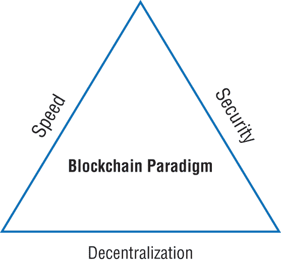

**图 10.21** 区块链范式

开发人员想要在我们的区块链性能要求中衡量或调整的常见属性如下：

+   **速度**——区块链必须提供及时处理，这应该导致更高的每秒交易数（TPS）。速度也被称为交易“快速”发生的方式。注意，“速度”或“快速”只是相对于其他区块链而言的。在这里，将区块链与客户端服务器进行比较是不相关的。

+   **安全性**——通常，证书管理器处理这些加密证书。在大多数区块链网络中，X.509 证书通常用于维护这些证书。例如，在 Hyperledger Fabric 中有一个称为*证书授权机构*的东西。权限也是需要考虑的，因为它们直接影响对资源的访问。在大多数许可的区块链中，会有许可控制，这意味着对区块链资源的访问是集中控制的。

+   **去中心化**——这在像以太坊这样的无许可区块链中是真实的。然而，Hyperledger、Corda 和 Ripple 是集中化的平台。

为了公平起见，一些区块链，如 Ripple，声称它们可以处理大约 1,500 TPS，而 Hyperledger Fabric 在一个完美的世界中可以处理高达 3,500 TPS。然而，这些数字是基于某种妥协的。

比特币的 TPS 不断变化。在当前形式下，网络不支持超过 7 TPS，以太坊在约 14 TPS 左右也没有好多少。例如，比特币和以太坊的性能直接受全球规模、互联网依赖和交易工作量的影响。更多的交易会增加以太坊和比特币所有生产区块链节点的工作量，这些节点实际上必须为每个交易更新其分类帐。

表格 10.5 比较了一些常见的区块链和传统服务。

**表格 10.5**：每秒交易数（TPS）比较

|  | VISA | BTC | RIPPLE | PAYPAL | HYPERLEDGER |
| --- | --- | --- | --- | --- | --- |
| **TPS** | 24,000 | 4 | 1,500 | 193 | 3,500 |
| **控制** | 集中化 | 去中心化 | 集中化 | 集中化 | 集中化 |
| **注意** | 推送 | P2P | 混合 | 混合 | P2P |

“注意”指的是交易实际上是如何被处理并从应用程序摄取的。 从客户端应用程序发送到服务器处理器应用程序的交易是推送事务。 从客户端应用程序拉取的交易是拉取事务。 推送，拉取和混合交易都是客户端-服务器应用程序，通常是分散的。 在应用程序中同时使用推送和拉取过程的交易被视为混合交易。 在区块链节点上处理并由每个节点处理的交易被视为 P2P 交易。 在 P2P 交易平台上处理的区块链是区块链交易的本机形式。

###许可或无许可的性能

或许围绕性能的真正权衡在于许可和无许可的区块链之间。 许可的区块链通常可以表现得更好，因为区块链网络中的节点较少，并且节点是集中化或本地化的。 性能是相对于节点数量的。

例如，据称 Hyperledger Fabric 理论上可以达到 3,500 TPS。 当然，这个数字是在一个完美的世界中，众所周知，Hyperledger Fabric 总体上从性能角度来看不会很好。 添加更多节点和对等节点将大大降低 TPS。 当您添加的节点不是本地化时，您可以预期网络延迟也会减少您的 TPS。

对于以太坊等无许可的区块链来说，开发者知道性能不应该是一个期望。 无许可的区块链通常是广泛分布的，通常有数百个节点。 用户群可能依赖于零星的行为——例如，在比特币世界中，当中国发生事件或美国发表有关监管加密货币的声明时，活动可能会激增。

如果性能是您的用例要求的一部分，则无许可的区块链是不可能的。###性能测试

当涉及到性能测试时，主要关注的是每秒交易数（TPS）。 另一个因素是交易的大小。 例如，较大的区块大小可能不如较小的区块大小表现得好。

性能测试通常通过被认为是非功能性测试来实现。 非功能性测试是一个主要由技术驱动的专注领域。 可以测试的一些技术领域包括以下内容：

+   网络延迟和瓶颈

+   区块大小调整

+   签名是否移除或包括

+   交易顺序

看起来性能测试工具数量有限。 但是，根据您的平台，有几个可靠的选择。 在撰写本文时，以太坊提供了大多数选择。

#### 以太坊测试工具

有许多用于以太坊应用程序开发的工具。重要的是要注意，在测试您的 Quorum 区块链应用程序时，某些以太坊工具可能以不同程度发挥作用。在撰写本文时，Quorum 没有测试工具。从测试的角度来看，您希望确保将测试定向到您的 localhost 或自定义 RPC。

以下是在以太坊测试中常用的三个工具：

+   **以太坊测试工具** 以太坊测试工具支持两种不同的数据格式，可以进行前端和后端测试。这涉及到一个重要的安装过程和一些依赖关系处理。

    在 GitHub 上，请访问`[`github.com/ethereum/eth-tester`](https://github.com/ethereum/eth-tester)`。

+   **Truffle** Truffle 是一个经过实战考验的以太坊开发框架，您必须了解它才能在以太坊上进行开发。它还内置了强大的测试功能。例如，您可以用 JavaScript 和 Solidity 为智能合约编写自动化测试，并快速开发您的合约。

    要了解更多关于 Truffle Suite 的信息，请访问`[`www.trufflesuite.com/`](https://www.trufflesuite.com/)`。

+   **Ganache** Ganache 是以太坊测试最流行的库。以前被称为 TestRPC，Ganache 用于在本地测试以太坊智能合约—即，它在您的桌面/服务器上启动一个实例，并模拟一个实时区块链。

    您可以在`[`www.trufflesuite.com/ganache`](https://www.trufflesuite.com/ganache)`了解更多关于 Ganache 的信息。  #### Hyperledger Fabric 测试工具

Hyperledger Fabric 有一些特定的工具可用于测试。Hyperledger Composer 目前是用于 Hyperledger 开发和测试最常用的工具。Hyperledger Composer 可以通过 Docker 容器进行本地部署，也可以使用称为 Hyperledger Composer Playground 的 Web 版本。

[Hyperledger Composer](https://wiki.example.org/hyperledger_composer)是一个开源开发工具，包含许多功能来帮助构建区块链应用程序。其中一些功能还有助于测试。在撰写本文时，Composer 支持交互式测试、自动单元测试和自动系统测试。

Composer 具有一个命令行界面，可以让您运行交互式“冒烟测试”，以确保部署成功。这也使得在持续集成/持续交付（CI/CD）流水线中执行测试变得容易。

持续集成（CI）是一个过程，开发人员的工作副本会几次与共享流水线同步。持续交付（CD）是持续集成之后的一个流程，它能够将产品放入生产中，这在历史上是一个手动驱动的过程。持续部署是持续交付的下一个逻辑步骤，在质量保证（QA）之后自动将产品部署到生产环境。

区块链正越来越多地通过离链或跨链提供更多价值。即使在区块链短暂的历史中，将价值从一个区块链转移到另一个区块链实际上也是一种新方法。

在跨链的概念和实现之前，开发人员通过加密货币网关使用离链方法进行价值交换。这种方法的主要问题在于这些网关是中心化交易所，可能会对隐私、成本、控制和性能造成一些担忧。

瘦客户端通常只呈现应用服务器提供的处理过的数据，这些数据处理工作主要由应用服务器完成。使用网络应用程序的设备是瘦客户端，一般来说这些区块链应用程序可以通过瘦客户端启用。

要将区块链与任何传统系统或允许我们的客户以用户友好的方式与之交互的前端集成，开发人员必须使用可用于各种“传统语言”的客户端库。

一般来说，区块链技术通过 RPC/HTTP 和 NodeJS 或其他库的客户端库进行通信。区块链技术交换支付和数字资产。无需信任中介，可以通过使用公证方案、中继和哈希时间锁来转移和交换来自另一个区块链的数字资产。

以太坊联合创始人维塔利克·布特林指出，实现区块链真正互操作性的三种主要方法。

+   公证方案，它是一种交换任意数据的方式，例如如何将区块链连接到另一个区块链。这通常被称为区块链的*联邦化*。一个例子是像 Blockstream 这样的公司，它提供了从一个网络转移到另一个网络的媒介。

+   中继通过所谓的网关或数据交换提供了通过任意数据交换的可能性。一些供应商将中继称为中继链。中继或中继链用于提供从一个区块链到另一个区块链的网关。BTCRelay 是最广为人知的中继，充当比特币和以太坊区块链之间的桥梁。

+   哈希时间锁合约（HTLCs）通过跨链原子交换提供数字资产的交换。HTLCs 可以在特定区块链上提供双向支付通道之间的数字资产交换。最著名的例子是比特币闪电网络。

一般来说，区块链是否使用上述任何一种方法，实际上取决于所需的联邦级别、离线或侧链需求，以及任意数量的其他因素。

### 数据交换方法

“侧链”和“支付网关”这两个术语在区块链行业中经常被互换使用。然而，它们是有很大区别的。侧链是一种独立的区块链，通过所谓的“双向挂钩”与父区块链连接在一起。这种双向挂钩使得资产可以以预定的汇率在父区块链和侧链之间互换。简单来说，它就是一个交换平台。

原始区块链通常被称为“主链”，所有附加的区块链被称为“侧链”。

目前在生产模式下的常见侧链包括 Rootstock 和 Liquid。

Rootstock（RSK）似乎是最广泛使用的，为其侧链创建了一个名为 Ginger 的开源测试网。RSK 与比特币区块链有双向挂钩，并通过合并挖矿奖励比特币矿工。RSK 的主要目标是使比特币区块链具有智能合约功能，并使这些集成支付更加高效。

Liquid 是由一家名为 Blockstream 的区块链初创公司创建的一个侧链。Liquid 使加密货币交易所之间的资金即时转移变得可能，而且非常高效。在比特币区块链上真的不需要等待确认。### 哈希定时锁

HTLC 是一类使用哈希锁的基于区块链的支付系统。时间锁要求支付接收者在截止日期之前确认收款，否则基本上放弃了索取支付的能力，然后将其退还给支付方。

HTLC 允许跨链原子交换，这意味着例如，发送者可以用比特币支付，而接收者可以选择莱特币作为支付方式。哈希时间锁是指定区块链平台上资产之间的完全资助的双向支付通道。

就闪电网络而言，它是建立在比特币区块链之上的去中心化微支付解决方案。### 中继和网关

中继实际上是在两个不同的区块链之间进行合同交换的一种方式。中继也被称为“网关”或“支付网关”。

最突出的中继是 BTC Relay，它允许以太坊合同在没有任何中介的情况下安全验证比特币交易。

BTC Relay 是一个以太坊合同，仅存储比特币区块头。它使用这些区块头来构建比特币区块链的迷你版本。其主要好处在于它允许以太坊 dapp 用户直接使用比特币支付以使用以太坊 dapp。

一些中继允许单向交换，而一些允许双向交换。例如，在 BTC Relay 中，交换是单向的，用户可以使用比特币支付以太坊，但反过来却不行。

关于 BTCRelay 的更多信息，请参考`[`btcrelay.org/`](http://btcrelay.org/)`。## 概要

本章涵盖了各种开发挑战、最佳实践、编程模型和框架。

Solidity 是一种较新但简单的编程语言，深受以太坊开发者欢迎。其他广泛使用的开发语言包括 C++、Java、Golang 和 Rust。精通这些语言的区块链开发者正在走向区块链成功之路。

在开发以太坊之前应该审查以太坊的开发要求。你了解了 Truffle、Ganache、MetaMask、测试网络以及以太坊开发的几个重点领域。

Hyperledger 开发工具包括 Hyperledger Composer，这是一种面向对象的建模语言，用于定义业务网络定义的领域模型。

Hyperledger Fabric 使用 LevelDB 作为状态数据库的数据库，但您可能需要考虑配置对等方将数据库事务存储在 CouchDB 中的选项。

Corda 开发中最流行的两种语言是 Java 和 Kotlin。使用这些语言的真正关键在于它们与 Java 在双向上的巨大灵活性和互操作性。

Quorum 是由摩根大通基于以太坊代码开发的开源私有区块链网络。以太坊开发者将很快上手在 Quorum 区块链上进行开发。

当区块链需求需要不同的区块链时，需要考虑各种互操作性和集成方面的因素，比如哈希锁、支付网关和侧链。
