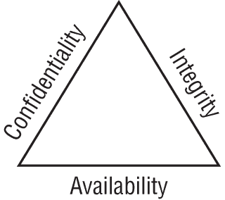
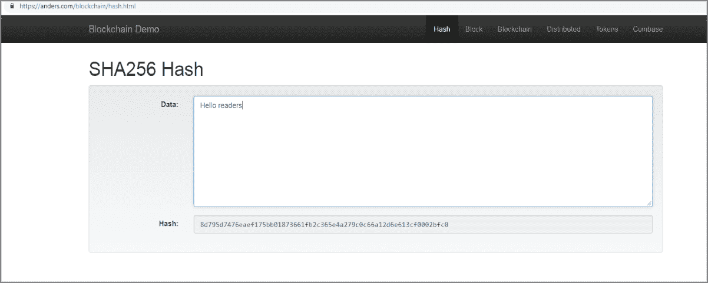
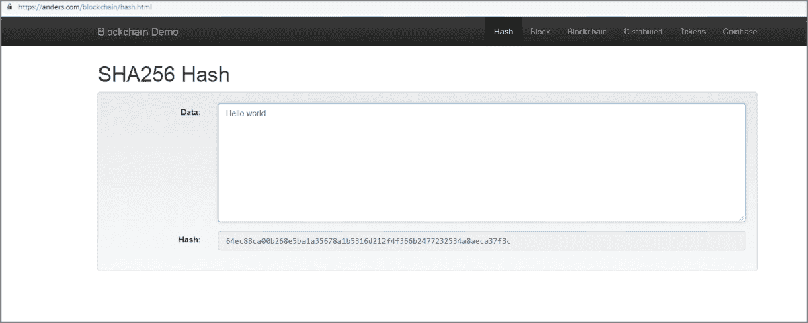
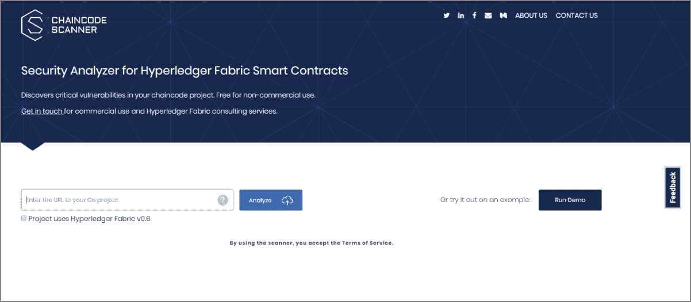

# 第十一章

区块链安全与威胁态势

本章介绍了区块链如何融入整体 IT 安全格局的基础知识。本章的主要任务是关注区块链安全，因此如果您不熟悉 IT 网络或 IT 安全的最佳实践和概念，您可能需要参考其他资源。

我将介绍区块链网络可能面临的威胁态势中的许多漏洞，包括 DDOS 攻击和 51%攻击。重点将放在以太坊、Corda、Hyperledger 和 Quorum 上。

我将讨论哈希、加密和解密如何影响区块链安全。风险评估和风险缓解也将详细讨论。

然后，我将讨论围绕智能合约的安全问题，包括法律执行和法律文本。

最后，我将深入讨论每个企业区块链安全相关功能，并讨论可能影响安全和隐私的区块链最常见方面。## 区块链安全基础

区块链本质上是一个分布式账本，在大多数情况下应该是不可变的——也就是说，写入账本的信息（交易）无法修改或删除。区块链的这一特性相对于传统集中式数据库提供了一些明显的优势。例如，集中式数据库可能会遭到篡改。

传统数据库是集中式的，意味着数据的控制由中央管理机构管理。分布式账本与部署方法不同，因为它是分布式数据库而不是集中式的。在分散式数据库中，数据不仅保存在一个位置，而且通常复制到网络中的所有其他节点，这些节点可能位于世界各地。例如，以太坊分布式账本位于全球计算机网络上与其他设备一起。由于它在一个共享网络上，应该预期可能会暴露于网络漏洞以及有关隐私、安全和可用性的问题。

关于区块链安全，我们需要全面考虑其所衍生的技术。区块链不是由一种技术构建的，而是由多种技术构建的，这可能会使区块链节点面临不同的威胁。这些威胁可能是恶意软件、网络攻击、数据窃取，以及传统 IT 领域中可能已经面对的众多其他问题。

区块链是由三种不同的技术构建的。

+   P2P 网络可能会面临分布式拒绝服务（DDoS）攻击，例如节点的缓冲区溢出

+   公钥/私钥加密，可能会通过逆向工程或影响 RSA 和 OpenPGP 算法生成的密钥的缺陷被破解

+   使用 JavaScript、Golang 和 C++等开发语言的程序（智能合约），它们具有自己独特的漏洞、威胁和关注点

因为这些技术都有自己特定的漏洞，所以了解涉及的技术是非常重要的，以解决区块链账本和网络组件、开发语言、客户端应用程序等可能存在的任何漏洞。

### 保密性、完整性和可用性

CIA 三角是 IT 安全领域中的一个著名标志。它是与 IT 安全相关的最古老和最受欢迎的安全框架之一，当然也应该与区块链一起使用。

如图 11.1 所示，CIA 三角包括三个主要组成部分。

+   **保密性**—信息除了意图接收者外，不能被任何其他人理解

+   **完整性**—信息不能在发送者和接收者之间的存储或传输过程中被篡改，否则将被检测到

+   **身份验证**—发送者和接收者可以确认彼此的身份以及信息的来源/目的地。

**图 11.1** CIA 三角

CIA 三角模型的主要目标是帮助组织适当地构建其安全姿态。

一个值得关注的领域是联盟网络，其中潜在的竞争对手正在与您的公司一起参与同一网络。减轻对隐私或保密性的担忧的一种方法是在不对所有联盟网络成员可见的对等方之间启用区块链通道。

数据保密性也可以使用加密术或更高级的零知识证明方案来隐藏，这在所有区块链中可能都不可用。例如，如果您的企业不使用通道进行隐私保护，那么同一区块链网络上的另一个竞争对手可能会了解到您在联盟区块链中与其他对等方之间的交易。这些交易可能会让您的竞争对手了解到您的公司正在做什么，从而获得竞争优势。当在区块链网络上正确实施时，通道提供保密性。

在无许可区块链上实施保密性实际上是不可能的。但是，在 Corda 或 Hyperledger Fabric 上实现和期望隐私是合理的，因为这些平台是基于成员资格的。

Hyperledger Fabric 通过采用执行-排序-验证的共识方法，在其架构中以不同的方式实现保密性。 Hyperledger Fabric 还原生支持通道。这些通道是提供区块链基础设施的机密性的私有通道，例如联盟区块链。  ### 区块链最佳实践

与几乎所有与 IT 相关的事物一样，在实施、管理或保护您的区块链时都有最佳实践可供考虑。本节重点关注三个方面：高级最佳实践、软件开发最佳实践和钱包最佳实践。

#### 高级最佳实践

以下是一些您的企业在区块链项目中应考虑的常见高级最佳实践，以确保安全性、隐私性和机密性：

+   实施专注于区块链安全的区块链供应商最佳实践，用于智能合约的开发。（例如，Corda 有详细的文档。）

+   如果适用于您的企业环境，请实施加密钱包的供应商最佳实践。

+   严格遵循最低权限最佳实践，仅允许需要访问的成员访问。

+   拒绝一切未经审查的尝试更改数据或修改您的客户端应用程序。

+   使用可靠的安全标准保护您的加密密钥，以免被破坏。

+   制定简明的成员政策，包括可接受的规则和权限处理流程。

+   实施分散式身份作为缓解与密码相关的问题的方法。

+   对您的开发人员和区块链用户进行 IT 安全最佳实践的培训。

+   定期审计您的区块链应用程序、网络和节点，以确保适当的成员身份和可能的漏洞。

+   在实施之前和实施之后阅读所有供应商或联盟的文档，并订阅适当的安全公告和区块链通讯。如果您的区块链有付费支持，则联系您的供应商寻求额外帮助。

以太坊、Hyperledger、Corda 和 Quorum 将有不同的推荐最佳实践和实施特定服务的说明。在为您的企业设计安全区块链时，遵循供应商或联盟的文档应该是第一步。  #### 软件开发最佳实践

开发您的区块链服务，如智能合约或使用区块链的客户端应用程序时，遵循最佳实践的开发方法肯定会带来价值。提供的价值可能是减少开发和部署周期中的风险。

作为之前在许多企业工作过的开发人员，我觉得您可以通过遵循一些常见的最佳实践而受益。

消除安全威胁或漏洞的最佳方式是在开发过程中实际识别它们。在开发过程之后识别漏洞，例如在生产模式下，意味着您的区块链已部署具有漏洞。结果取决于您在软件过程中是积极还是被动的，例如 DevOps。

当企业适当投资于敏捷的 DevOps 环境时，可以明显降低开发中的初学者错误，从而使其成为最有效的方式。

以下是我推荐用于保护代码开发资源的最常见的最佳实践。还包括降低企业面临安全漏洞风险的方法。

+   使用软件开发生命周期（SDLC），比如敏捷，来促进最佳实践流程，设计、开发和测试高质量的软件程序。

+   实施基于 DevOps 的运营。简单来说，DevOps 代表着软件开发中两个大趋势的交集：敏捷开发和精益运营流程。敏捷软件开发促进了整个企业的协作，甚至可以将客户作为流程的一部分。

+   有效审计你的智能合约，因为大多数区块链中的智能合约是不可变的，无法在以后删除或修改。审核应该在发布候选版（RC）上进行，即软件启动前的最后阶段。

+   在一个有效的软件发布生命周期中管理你的智能合约发布，比如发布候选版（RC）。

+   通过对发布候选版（RC）进行审计来消除代码波动。这可以通过使用主网地址（你的生产网络）来完成，然后将发布候选版与你的开发网络（测试网）进行比较来完成。代码波动是一种常见的实践，用于衡量开发人员和他们所提供的代码的性能，这可能会影响代码/程序的价值。你可以使用一个名为 Gitprime 的免费工具来获取这方面的见解。Gitprime 提供了丰富的功能来可视化数据。

+   验证你的源代码，以确保“已验证”构建是从正确的存储库上传的，并且是一个安全的副本。使用源代码验证工具验证源代码是否与需要部署的特定地址的字节码匹配，并且与源代码的编译输出匹配。用于与以太坊开发进行源代码验证的一个工具叫做以太坊字节码验证器。

关于区块链开发最佳实践的更多信息，请参阅第十章，“区块链开发”。 #### 钱包最佳实践

一些与安全相关的最佳实践围绕着如何存储你的私钥以及如何保护你的区块链钱包展开。钱包当然是以太坊开发中必不可少的，以便你的开发人员能够开发、测试和集成智能合约到你的代币平台中。保护这些钱包和密钥至关重要，因为被盗或丢失的 Ether 是不太可能会被恢复的。失去以太钱包私钥也可能是失去以太代币的一种昂贵方式。

你应该考虑以下最佳实践：

+   限制以太坊钱包的无监督访问，无论是在基于网络的钱包还是硬件钱包上。

+   提供严格的可接受用户政策（AUP），以确保保持强密码。

+   关闭所有不必开放的网络端口，并保持严格的防火墙。网络评估应该识别这些端口。

+   经常改变以太坊钱包交易的地址方案。一种常见的做法是每笔交易使用不同的地址。这可以减少暴力猜测的尝试。

+   使用你的私钥配置多重签名（多重签名）以阻止大多数常见的入侵尝试。

+   对你的以太坊钱包余额和用户基础进行审计，以确保遵循安全程序。

Corda、Quorum 和 Hyperledger Fabric 实现没有钱包，因此钱包不应该是一个问题。但是，你的企业应用程序可能有离线服务，这些服务会转到加密货币交易所。如果是这种情况，请确保你的用户基础也实施了最佳实践，并为他们清楚定义。如果你的用户没有接受培训并提供具体的指导，那么你的企业很可能存在安全漏洞的风险。### 区块链安全审计

安全审计需要定期进行，无论是每月还是每季度。不可能每次都对网络上的每个设备进行审计，因此考虑你的区块链审计计划非常重要。

从区块链的角度来看，安全审计确定漏洞并证明你的区块链代码、智能合约和区块链项目的功能正确性。

雇佣一位具有区块链专业知识的经验丰富的代码审计员对你的成功至关重要。

常见的安全代码审计流程如下：

+   静态代码审查，也称为源代码分析，是在代码审查期间执行的。此审查侧重于查找漏洞。

+   数据流分析用于在软件程序处于静态状态时收集有关数据的运行时信息。

+   代码分析可以是手动的或自动的。在手动审查中，也称为安全代码审查或动态审查，代码逐行审查以查看每个细节。自动审查执行更多的扫描，通常不会测试每个链接或功能。

+   污点分析是一种审计方法，检查用户输入可以修改的变量。一些语言内置了此功能。

+   测试覆盖率分析是一种专注的技术，确定哪些测试用例将覆盖应用程序代码。这种测试形式还确定运行测试用例时执行了多少代码。

+   专家代码分析由第三方软件编码专家/审计员执行，审查代码以确定是否存在漏洞或欺诈交易等问题。审计员甚至可能作为审计的一部分对软件程序进行逆向工程。

我将在本章节中详细讨论这些问题。### 区块链安全假设

在考虑区块链安全性时，您应该期望密码算法的安全性被适当地实现。至少在大多数区块链实现中是这样假设的。

然而，在 IT 安全领域，假设不是一个选项。我们必须识别、验证、测试，并再次确认我们的安全功能是否按预期工作。

第一个，也是最常见的假设是，在基本水平上，我们信任区块链内在构建的安全性，例如数字签名、关联哈希函数，甚至是成员控制。

第二个假设是数字签名应该验证交易和区块。这可能会验证大多数区块链中的内容，例如区块链的完整性。其他好处，比如不可否认性，也应该得到实现。从技术上讲，我们假设应该不可能伪造数字签名——也就是说，例如，因为需要巨大的技术和财务投入来逆向工程程序，所以理论上不可能控制区块链。

第三个假设是，哈希函数被用于大多数企业区块链以及加密货币中将区块链接在一起。哈希函数应该是一种单向过程，同时具有足够大的状态空间以消除诸如暴力猜测攻击之类的威胁。

当然，在区块链部署中可能会有其他假设。对于本章，我想专注于解决威胁和维护安全性的主题。### 区块链密码学

区块链平台依赖密码学来执行密码算法的数学函数。这些算法对区块链至关重要，因为它们提供或至少启用了安全性、隐私和信任。

通常用于区块链安全的几种重要密码学形式。

+   哈希函数是最基本的函数，其中输入预期始终产生特定输出。随机数（Nonce）也可以在区块链上对哈希值进行补充以增强安全性。

+   密码学是研究和实践保护私密消息的学科，以确保只有预期的参与方或区块链上的成员可以阅读它们。

+   椭圆曲线密码学（ECC）是一种公钥加密（PKE）形式，用于生成允许两个参与方安全通信的公钥和私钥。

图 11.2 展示了典型密码函数的工作流程。明文被加密为密文，然后被解密并转换回明文，以便消息可以被读取。

**图 11.2** 密码函数工作流程

在不同的区块链中使用各种方法和加密密钥对消息内容进行加密和解密。在区块链上使用加密密钥提供了所谓的*不可否认性*。不可否认性确保信息的创建者/发送者在后期无法否认他们在信息的创建或传输中的意图。此外，区块链提供了不可变性，在其中对区块链的交易不会被删除或修改。

#### 哈希

哈希函数是数学函数，可以接受任何输入并产生固定大小的输出。在密码学中，哈希函数通常用作一种单向函数，其中前进（输入到输出）容易，但反向（输出到输入）在计算上是不可行的。

要真正理解哈希是什么以及它是如何工作的，请查看 `[`anders.com/blockchain/hash.html`](https://anders.com/blockchain/hash.html)` 上的演示。Anders 已经制作了一个工具，让您作为学习者可以与演示进行交互。

图 11.3 显示输入数据为“Hello readers.”。哈希中的数据将始终返回相同的输出。请记住，相同的输入等于相同的输出。

**图 11.3** 哈希输出

图 11.4 显示数据更改会更改哈希。将“读者”更改为“世界”会更改输出（哈希）。

**图 11.4** 输入更改后哈希输出更改

在区块链中，一个节点将整个分类账以时间顺序连接的块的形式排列起来。为确保分类账保持防篡改，每个块实际上都依赖于前一个块。这就是我们得到一个块的链的地方，我们知道它作为一个区块链。

本质上，没有前一个块的哈希，就不会产生新的块。例如，在无权限的区块链中，添加新块到分类账必须得到区块链网络中每个节点的批准和验证。#### 证书

X.509 证书是符合公钥基础设施（PKI）X.509 规范标准的密钥证书。X.509 是一个标准框架，定义了 PKI 的格式，特别是用于在互联网上标识用户和实体。它有助于确认连接是安全的。

X.509 为以下内容提供了标准化格式：

+   属性证书

+   公钥证书

+   证书吊销列表

+   认证验证算法

这些 X.509 证书用于在区块链中验证身份以及传输数据。只有证书的所有者实际上才能读取它们。证书与公钥值相关联。

DNSChain（`[`github.com/okTurtles/dnschain`](https://github.com/okTurtles/dnschain)`）提供了一个可扩展且不依赖第三方（例如 DNS 服务）的去中心化替代方案。  #### 证书标准与管理

X.509 证书也充当安全标识，并且通常用作数字护照。证书通常在供应商之间承担相同的职责，尽管版本可能在供应商之间有所不同。配置和安全性遵从的主要差异是 X.509 版本及其与该版本一起使用的扩展。

扩展引用了密钥标识符。扩展字段的值如下：

+   **主体密钥标识符**—保存了证书的所有者身份。

+   **区块链名称**—记录证书所用的区块链平台的名称。

+   **CA 密钥标识符**实际上保存了当前证书颁发机构（CA）的智能合约地址。对于非 CA 证书，此字段将为空。

+   **颁发 CA 标识符**—颁发机构保存了颁发此特定证书的 CA 智能合约地址。这很重要，因为它使验证者能够在区块链网络中找到父 CA 智能合约。找到父级意味着它可以检查相应哈希的证书是否已经颁发并且未被吊销。

+   **哈希算法**—识别用于计算证书哈希的哈希算法的具体信息。

扩展可能是一个难以理解的复杂领域，通常是开发人员需要掌握的领域。请注意，扩展在证书类型之间也可能有所不同。在审查您的证书管理时，了解不同的密钥标识符很重要。可能会导入错误的证书，或者至少使用不同的标识符。  #### 证书颁发机构

在 Hyperledger 中，CA 向每个获得授权加入网络的成员（组织或个人）发放根证书（rootCert）。

CA 还根据需要向每个成员组件、服务器端应用程序和终端用户发放注册证书（eCert）。每个已注册用户都被授予一定数量的交易证书（tCert）。每个 tCert 授权一项网络交易。

表 11.1 总结了证书。

**表 11.1**：证书类型

| 证书 | 用途 |
| --- | --- |
| 根证书（rootCert） | 为组织发放一个。 |
| 注册证书（eCert） | 每个成员发放一个。 |
| 交易证书（tCert） | 每个注册证书发放多个。每次交易都需要一个证书。 |

每种类型的证书都特定于用例。例如，仅因为一个节点（成员）有一个注册证书（eCert）并不意味着它可以进行交易。成员必须有另一个证书，即 tCert，才能进行交易。如果成员需要进行 100 笔交易，那么成员必须有 100 个 tCert。#### 会员/许可

应该清楚的是，企业区块链在大多数情况下应该是基于会员/许可的区块链。当安全性和隐私性成为企业区块链用例的首要考虑因素时，这一点变得成立。一些企业可能还需要扩展以支持离链——例如，访问股票行情或货币兑换。

在超级账本 Fabric 中，许可是区块链中每个成员的成员注册证书和交易证书的概念。这两种类型的证书使得实体在完成交易时可以被许可和识别。

许可和访问管理通常包括 IT 安全人员所知的*身份和访问管理*（IAM）。您的企业需要管理和监控您的区块链服务和用户，就像您管理电子邮件或 Salesforce 活动一样。

作为大多数合规要求的一部分，您将需要验证用户身份，确保处理授权的政策，并处理审计日志。合规方面肯定会面临挑战，因此拥有强大的 IAM/会员政策至关重要。身份管理是一个具有挑战性的领域，可能涵盖以下几个方面：

+   认识你的客户（KYC）

+   反洗钱（AML）

+   合规要求

+   报告和审计

例如，在超级账本 Fabric 中，Fabric CA 服务器以及客户端将它们的私钥存储在 PEM 编码的文件中。PEM 编码文件是一种隐私增强邮件证书文件。这个 PEM 文件也可以配置为在硬件安全模块（HSM）中存储私钥。#### 两因素身份验证

两因素身份验证（2FA）是一种额外的安全层，用于确保只有合法所有者才能访问其帐户。使用 2FA，用户将首先输入用户名和密码的组合，然后需要提供其他信息。这些其他信息应以以下形式之一呈现：

+   **用户所知道的东西**—这可能是密码、对秘密问题的回答，或者个人识别码等信息。

+   **用户拥有的东西**—这种方法包括基于卡详细信息的第二级身份验证，通过智能手机、其他硬件或软件令牌。

+   **用户所拥有的东西**—这是验证用户第二步的最有效方法之一，可以通过生物识别数据来实现，例如。## 区块链风险

与其他技术一样，区块链也会遇到潜在风险。审查企业风险并将这些风险与您的区块链部署相关联是建议的做法。实际上，区块链与其他技术的风险并无不同。如果存在风险，那就是合规性的处理方式或缺乏培训可能会暴露出的漏洞。

### 风险评估

在进行区块链实施之前和之后都需要进行风险评估。一般来说，在执行称为业务影响分析（BIA）的过程后，IT 风险评估是下一步。BIA 分析企业的关键业务功能，并确定潜在损失的影响。然后您可以开始进行 IT 风险评估。

一个风险是性能问题。区块链技术不会像传统数据库那样扩展到像传统数据库那样的水平，因为每秒交易数（TPS）的结果大不相同。例如，以太坊的平均 TPS 约为 12，而 Visa 的 TPS 超过 1600，因此性能不具竞争力，也不应期望具备竞争力。通过正确的用例范围界定可以消除这种性能风险。

另一个问题是确保企业为正确的用例指定正确的解决方案。区块链节点分发是与合规性和监管要求相关的重大问题。不合规可能对企业造成昂贵的后果。遵守欧盟的 GDPR 或美国的 SOX，然后注意选择什么数据中心或云服务。了解您的合规要求肯定会有助于减少不合规的风险。

风险评估应重点关注以下领域：

+   通过确定要管理和识别的风险类别来评估您的风险评估范围。

+   确定将遵循的企业和企业客户的数据隐私/权限，例如 GDPR 的被遗忘权。

+   确定应从风险评估中制定的责任和法律文书要求。

+   满足合规要求，例如报告、审计和监控区块链应用程序。

+   指定数据管理和监控。

+   分析企业区块链网络统计数据的性能，这可能只是延迟或每秒交易数。

+   将企业应用程序集成到区块链网络上运行，或将离线应用程序扩展到区块链网络。

+   确保您的区块链服务在发生故障或其他问题时能够恢复（DR/BC）。

风险评估工作流程包括以下步骤：

1.  进行业务影响分析（BIA）以了解如果风险未得到缓解可能会出现的问题。BIA 应得到企业领导层的批准，并获得适当的资金支持。

1.  执行 IT 风险评估，以识别 BIA 中已识别的风险、漏洞和挑战。使用适当的工具和相应的文档来获得对环境的洞察。

1.  对评估中需要首先解决或按适当顺序解决的已识别风险和漏洞进行分类。例如，一种加权方法通常用于以有序方式解决这些问题。

1.  按指定顺序修复已识别的风险和漏洞。

在尝试减轻任何漏洞之前，了解实际风险是非常重要的。然后您可以正确评估风险，以执行适当的风险缓解技术。### 风险缓解

风险缓解被定义为采取措施减少潜在风险的不利影响。有四种特定的风险缓解策略，这些策略独特适用于业务连续性和灾难恢复。这些风险缓解技术可以成功应用于区块链：

+   *风险规避*是不进入存在风险的情况。

+   *风险降低*是您正在执行的责任，例如升级到最新版本的 Hyperledger Fabric，以避免或降低问题发生的可能性。

+   *风险转移*是依靠另一个组织通过通常的保险或购买债券来处理关注。

+   *风险接受*是你意识到潜在风险、影响和关注，并且仍然继续的情况。一个例子是运行无法升级或打补丁的操作系统。

公司数据应被视为企业极具价值的资产。与任何资产一样，应该受到保护和保险，并且具有限制访问的明确政策。例如，这可能是一个可接受的使用政策（AUP）。目标应该是保护数据，无论它是否在区块链上。

当您考虑区块链数据时，您需要考虑以下要点以解决围绕隐私和安全性的关注：

+   区块链管理和传统的 IT 管理有一些相似之处，例如满足隐私要求，但也有一些不同之处，例如使用区块链降低性能期望（TPS）。满足任何额外要求的需要，例如隐私或安全性，将会影响性能，因为所使用的协议或程序的开销。

+   区块链和分布式账本是不可变的——账本无法被删除、修改或销毁。

+   区块链数据可能分布也可能不分布。甚至在数据中心外部可能不存在区块链的副本。没有计划或资金用于灾难恢复或业务连续性。

+   具有权限的区块链将具有受限制的访问权限，但这并不意味着每个具有权限的人都应该访问账本。（通道可能解决围绕隐私的关注。）

与传统数据库相比，区块链可能还存在额外的风险。以下是一些例子：

+   区块链可能不符合合规要求，特别是如果未实施 DR/BC 计划的冗余性或可用性不足。这种冗余性不足在企业区块链中很常见，可能对企业构成风险。一般来说，在传统的数据库架构中，冗余性是内置的或者通过复制专门解决的。

+   数据机密性可能是一个未得到适当解决的关注点。写入区块链的数据是“公共”数据，例如在以太坊上。请注意，“私有”区块链如超级账本是由中央管理的，并且对财团成员是透明的。

+   区块链是较新技术的组合（实际上是较旧技术的融合），因此许多企业的开发和生产组织可能存在显著的知识差距。

缓解公司区块链数据的已识别风险需要以下步骤：

+   以高效的方式保护企业数据（复制）

+   强制执行数据治理政策（安全性、用户或可接受使用政策）

+   验证数据（输入前和输入后）以最小化数据损坏和数据缺陷（错误）

+   限制对特许成员的访问（确保仅授权用户）

+   满足您的法律顾问确定的合规要求

+   遵循 IT 最佳实践，例如最小权限原则，该原则将权限限制在确切所需的范围内

风险缓解是一个复杂的领域，企业需要投资。已经有充分的文件记录表明，大多数基于企业的安全攻击是由于缺乏适当的风险缓解和管理而导致的。在这一领域的投资对您的企业区块链应用程序的成功至关重要。## 区块链威胁形势

一般来说，在区块链方面，您可能期望像网络漏洞这样的一些常见漏洞，但其他区块链具有一些独特的漏洞，其中“威胁”可能是一个关注点，必须加以解决。

以下是您可能遇到的最常见的区块链漏洞：

+   终端漏洞

+   公钥和私钥安全

+   智能合约编码

+   缺乏标准

+   挖掘问题（无需许可的区块链）

+   51%攻击

+   网络钓鱼攻击

+   社交媒体

请注意，终端通常关注区块链网络访问点，例如网关及其 API。

### 51%攻击

这种类型的攻击几乎总是被区块链媒体和安全公司夸大其词。这是一种威胁，但仅适用于特定的共识方法。现实情况是，如果您是一个企业，您可能不会使用工作量证明（POW）共识。这种共识在比特币、莱特币和以太坊中使用。

51%攻击被认为是“自私”的挖掘，而不是流氓的，因为当一个恶意的矿工控制了超过区块链网络上 51%的计算能力时，就会发生这种攻击，然后可以将错误交易注入系统。

51%攻击需要矿工在将区块发布到区块链之前秘密生成区块。

最后，这种攻击类型已经被区块链软件中交易发布延迟的方式有效地避免。  ### 钓鱼攻击

钓鱼攻击发生是因为人们没有仔细注意细节。例如，对于比特币钱包 Electrum，由于用户可能没有意识到他们实际上使用的是一个伪造的钱包，一直有一个持续的针对其用户群体的黑客攻击。由于这次钓鱼攻击，恶意方成功窃取了将近 250 比特币（BTC），而在 2018 年攻击时，这笔钱相当于 88 万美元。

Electrum 自身随后确认，这次攻击是通过创建一个欺骗用户提供密码信息的钱包的伪造版本进行的。有关这次攻击的更多信息，请访问`[`www.coindesk.com/electrum-wallet-attack-may-have-stolen-as-much-as-245-bitcoin`](https://www.coindesk.com/electrum-wallet-attack-may-have-stolen-as-much-as-245-bitcoin)`。

这里的教训是，你应该仔细注意你从哪些域名下载你的钱包或其他区块链软件。例如，如果你在以太坊上开发智能合约并使用 Metamask，那么你需要直接访问 Metamask.io。不要去其他域名、软件仓库，甚至`[Metamask.com](http://metamask.com)` 或者 .net。如果用户注意到细节，这些钓鱼攻击通常是可以预防的。

以下是钓鱼攻击的解剖：

1.  攻击者注册一个与真实网站类似的域名。

1.  攻击者然后复制真实网站的内容，并用一个恶意地址替换钱包地址。

1.  攻击者使用欺骗性广告宣传复制品网站，让不知情的用户点击。

1.  攻击者截取通信，然后将所有正版网站用户重定向到他们自己的网站。

欲了解更多信息，请访问`[`resources.infosecinstitute.com/blockchain-vulnerabilities-imperfections-of-the-perfect-system/#gref`](https://resources.infosecinstitute.com/blockchain-vulnerabilities-imperfections-of-the-perfect-system/#gref)`。  ### DDOS 攻击

分布式拒绝服务（DDOS）攻击是一种极其常见的针对网站、网络节点甚至会员服务提供商的网络攻击。

这种 DDOS 攻击本质上是由许多倍数（可能是数千个）的远程节点发起的，然后利用协调来启动它们的攻击。 本质上，DDOS 攻击发生在多个系统向网络资源发送大量被称为*连接请求*、消息或其他类型的通信数据包的情况下。这种攻击的目标是使系统减速或崩溃。对系统的集中攻击和随后的关闭导致了对合法用户的“服务拒绝”。

的确，区块链是“分布式分类账”，因此分布式可以减轻攻击。但是，区块链端点肯定会暴露在您的企业网络甚至互联网中。当连接到网络时，区块链端点可能会受到攻击，并有效地阻止有效用户。

为了防止 DDOS 攻击，您应确保您的网络团队有足够的资源来缓解、管理和监控这些问题。负载均衡通常用于防止因这些攻击而造成的重大业务损失。### DNS 劫持攻击

DNS 是我们网络基础设施中至关重要的域名服务。没有 DNS，我们将无法访问其他节点或站点。DNS 劫持本质上是一种 DDOS 攻击，其中您的 DNS 被关闭，这实际上会关闭您的区块链活动。例如，如果您的成员无法访问成员服务提供商（MSP），则您的用户和客户端应用程序将无法针对 MSP 进行验证其授权和证书。

为了防止 DNS 劫持攻击，您应确保您的网络团队有足够的资源来缓解、管理和监控这些问题，就像在 DDOS 攻击中一样。

实施最佳实践，例如限制 DNS/bind 版本的视图和禁用 DNS 区域递归，甚至 DNS 区域传输。一些围绕 DNS 的最佳实践所需的工作很少，甚至不需要任何费用。最后，考虑使用像 Cloudflare 这样的提供商，可以帮助防止 DDOS 和 DNS 攻击。### 日食攻击

大多数无许可的区块链使用点对点协议（P2P），彼此之间没有中心化连接。然而，由于区块链网络被故意不完全连接，这可能会引入日食攻击。

在日食攻击中，攻击者控制了节点与网络的所有连接。通过控制节点的连接，攻击者可以完全控制节点对分布式账本和网络操作的视图。成功的日食攻击允许攻击者对孤立节点执行双重支付攻击，帮助攻击者执行拒绝服务攻击，或让攻击者利用节点的计算资源来使攻击者在区块链共识算法中受益。

这些类型的攻击只在无许可链（如比特币或以太坊）上成功。所需的资源量也将是相当大的。

日食攻击可能发生的容易程度取决于许多因素。

+   网络的数据结构（P2P 分类账与集中分类账）

+   来自客户端应用程序或其他节点的连接请求

+   主机（节点）管理及其 IP 寻址方案

为了减轻这些安全问题，企业应该使用企业许可的区块链。如果您的公司正在使用以太坊，您可能需要考虑使用白名单或通过集中器（如堡垒主机）调整连接。### 内部人员攻击

许可区块链，尽管通常不会受到无许可区块链攻击的影响，比如重放攻击或 51%攻击，但从其本质上来看，通常被视为比以太坊等无许可区块链更安全。

许可肯定可以减轻谁能访问您的区块链服务，并帮助您确定谁在做什么。但是，当您允许资源的集中时，历史已经证明，那些认为自己没有受到监视或质疑的人会做愚蠢的事情。

内部人攻击就像听起来的那样：组织内部的一名内部人员被授权访问您的区块链网络资源，并从内部执行攻击。也就是说，攻击来自公司的企业区块链网络，而不是来自公司外部。内部攻击者可能通过控制管理员证书来表现出恶意行为。作为管理员或管理员证书持有者，内部人员将完全控制区块链服务，因此可能会造成中断，如阻止有效交易。

有了管理控制权，攻击者可以添加或撤销访问权限，将特定身份列入黑名单，并操纵给定身份对区块链的访问。

内部人员攻击采取以下形式：

+   与帐户相关的问题，如隐藏帐户或权限过大的帐户。

+   MSP 或证书颁发机构劫持，其中证书控制被滥用。

+   数据操纵交易日志或合规日志，这是由于许可或暴露的漏洞所导致的。

为了减轻这些类型的问题，重要的是您的企业考虑到 IT 安全最佳实践，如基于角色的安全性或最低权限。必须完成审核，并且 IT 安全组成员应该进行例行审核日志监控并进行监控。

许可区块链的一个好处是，在许可、审计和配置方面，您的企业可以尽可能地控制多少或多少。建议在不干扰区块链用户和应用程序无法工作的情况下，尽可能积极地保护企业数据。### 重放攻击

重放攻击通常是在区块链分叉期间使用的一种方案。例如，攻击者可能会复制现有交易，然后尝试将其重新提交到区块链，就好像这是一笔新交易一样。

如果一个黑客拥有你的数字签名并且因为你的原始交易是有效的，黑客也可以尝试重新提交交易。如果攻击者成功地重新提交了这笔恶意交易，他们将收到钱包交易两次。

你可以通过消除区块链的任何交叉混合来轻松防止重放攻击。例如，一些区块链如比特币现金（BCH）具有重放攻击保护。这种保护是通过在验证检查上添加一个特殊标记来实现的，该标记标识交易是用于 BCH 分类帐而不是比特币以前的分类帐。

从用户的角度来看，为了帮助防止甚至冒险出现这个问题，你可以通过不在同一个钱包中混合硬币来分开你的帐户。  ### 路由攻击

路由攻击本质上就是其名所示：流量被劫持，然后被路由到不应该被路由的地方。基本上，路由攻击依赖于拦截通过网络传播的消息。当这些消息通过网络传播时，这些消息可能会被捕获并篡改。

这种类型的攻击通常是中间人攻击的一部分。如果黑客无法完全控制区块链网络资源，则此类攻击不会成功。网络节点检测篡改的唯一方式是当它们从另一个节点接收到不同的数据副本时。比较节点之间发送和接收的消息是减轻此漏洞的有效方法。

或许防止这类攻击最主动的方式是对网络服务和消息传输进行重要的监控。指标应包括包往返时间（RTT）、异常监控，甚至是模式匹配。  ### 虚假身份攻击

虚假身份攻击是指攻击者在区块链上创建多个帐户，以欺骗其他区块链参与者。这种行为类似于在社交媒体上搅局的人们通过创建多个帐户来实现他们愚蠢行为。虚假身份攻击可能与网络钓鱼攻击非常相似，其中冒名顶替者假装是某人，比如你的老板，要求你的网络密码。

防止虚假身份攻击在某种意义上被认为是直接的，因为你需要注意你的钱包资金被发送到了谁那里。在许可的区块链上，这类攻击不应该是一个问题，因为成员明确定义，并且通常不使用钱包。  ## 智能合约安全性

在以太坊区块链中，所有对智能合约数据的修改必须通过其区块链代码执行。这意味着用户不能直接编辑合约或者甚至删除合约。要修改合约的数据，区块链用户必须将请求发送到其代码，该代码位于较低级别。此请求流程的启动将决定是否履行以及如何履行这些智能合约修改请求。

为了与 Linux 进行比较，我们可以将智能合约视为安装在操作系统之上的应用程序。我们还可以将区块链智能合约与传统数据库处理数据库修改的方式进行比较。传统数据库使用“强制存储过程”或“预定义规则”。在区块链中，当处理事务时，我们将在区块链上追加到下一个块，而不是根据程序执行条目。安全性内置于区块链代码和智能合约平台中。智能合约的执行在技术方法上在各个平台之间存在很大差异。

### 智能合约法律文本

法律文本实际上是一种直接将文档附加到智能合约的方法。这样做是为了解决合同代码可能无法解决的问题，例如处理争议，以帮助在合同代码不足时管理或减轻问题。

如前所述，Corda 支持法律文本。在 Corda 中，将这个作为合同类的合同将被注释为 @LegalProseReference 注解。

@LegalProseReference 注解将智能合约与附加文档相关联，该文档将详细说明法律文本条款施加的合约约束。请注意，在开发 Corda 合约时，不需要附加法律文本。

Corda 和其他区块链的主要区别在于 Corda 中的智能合约如何将法律文本附加到智能合约中。从隐私和合规性以及财务的角度来看，法律文本架构也非常重要，以便节省成本。这是通过 Corda 智能合约将业务逻辑和业务数据链接到关联的法律文本结构来实现的。

在撰写本文时，针对 Hyperledger、Ethereum 和 Quorum，尚未记录有解决法律文本的功能特性。

然而，如果法律文本是一个优先事项，开发人员当然可以通过附件的方式或在智能合约中提供额外步骤的方式以基本方式解决这个问题。这将使智能合约执行更加有效，但在大多数情况下不太可能解决法律问题。

您的企业应当跟进与企业法律顾问，以确定这些合同及其文档附件在所需司法管辖区内是否具有法律约束力，甚至是否有效。### 智能合约漏洞

智能合约本质上只是以计算机代码编写的逻辑。该计算机代码是用特定语言编写的，例如 JavaScript、Golang 和 C++，在部署之前应通过软件开发的最佳实践进行审查。

软件开发的最佳实践可能涵盖干净的代码、漏洞评估、DevOps 和敏捷流程，或者您的组织认为可接受的任何内容。

智能合约可能在企业权限链（如 Hyperledger 或 Corda）中引入新的漏洞点。大多数企业区块链依赖于异步拜占庭容错复制协议来建立共识，然后有效地向智能合约应用程序提供其低级信任假设。

在权限链上所有节点上无法执行智能合约是一个严重的问题。当考虑到智能合约无法正确执行，并且有 100 个节点执行相同的流程导致区块链故障时，这可能被视为区块链网络上的拒绝服务。

关于智能合约的常见风险将出现在编程错误，如访问控制、返回值、溢出、时间戳和其他许多“脏代码”问题。

第十章更详细地讨论了智能合约编码问题。## 区块链特定功能

本节回顾了以太坊、Hyperledger、Quorum 和 Corda 最常见的区块链特定功能。每个区块链都有一些独特的与安全相关的功能、特性和实用程序。本章讨论的功能仅基于撰写时的时间，因此我主要讨论了已经过“alpha”开发阶段的功能。还有许多其他功能正在孵化，但不会在本文中涵盖。

### 以太坊

以太坊是第一个旨在允许开发人员在区块链上访问图灵完备平台并开发应用程序作为智能合约的智能合约平台。

因为这是一个首次尝试的平台，旨在是无需许可的（向公众开放），开发人员缺乏可用的安全功能。从企业开发的角度来看，以太坊的安全性更多地是一种可选功能，将在生命周期后期考虑。安全相关功能的缺乏是由于以太坊应用在部署时向世界展示的用例所导致的。

如果安全性真的很重要，那么企业不应在以太坊上部署需要隐私、安全性或企业功能的应用程序。有部署企业以太坊的选项，但我不认为以太坊，即使是企业以太坊，都是为关心安全功能的企业而设计的。

无论您是部署自己的私有以太坊网络还是使用公共网络（mainnet），在评估安全风险时，您需要考虑以太坊有四个主要组成部分。

+   以太坊节点，这些节点分布在全球，可能会暴露企业信息

+   以太坊虚拟机具有分布到每个以太坊节点的分类账状态副本

+   智能合约是不可变的，因此一旦部署，将永远存在于区块链上

+   Dapps 是分布式应用程序，期望其具有一致的性能是不合理的

以太坊的主要安全问题实际上集中在部署的节点上。节点是与以太坊网络通信的设备、程序或虚拟机。当部署以太坊节点时，该节点可能存在诸多漏洞，如用户认证问题或缺乏打补丁，或者更常见的是，节点在进行多任务处理。也就是说，节点并不专用于运行区块链节点，而是用于其他任务，如开发、运行批处理作业，甚至是多媒体。保护您的以太坊节点对于网络至关重要。

#### 以太坊测试网和主网安全测试

主网是区块链上的真实数据，包括账户余额和交易，这些都是公开的。重要的是要注意，任何人都可以创建一个节点并开始验证交易。主网上的以太具有市场价值，并且可以交换成其他加密货币或法定货币。由于以太具有价值，我们必须保护我们的钱包，并确保不会丢失我们的密钥。

以太坊的安全测试可以在任何测试网络上进行。主网是用于生产的，因此出于明显的原因，将不安全的节点连接到主网是非常不可取的。

有三种主要类型的扩展以太坊网络可用于安全测试。

+   **公共测试网络**—开发人员使用公共测试网络对其以太坊应用程序进行最终部署之前进行测试。以太用于测试目的，实际上没有交易价值。测试网络包括 Ropsten、Kovan 和 Rinkeby。

+   **企业/私人网络**—私人以太坊网络允许各方共享数据，而不会使其公开可访问。私人区块链是共享敏感数据和扩展处理更高读写吞吐量的良好选择。例如，Quorum 是以太坊和私人网络的混合体。

+   **本地测试网络**—本地测试网络部署在您的企业基础设施上进行测试。本地测试肯定可以在隐私和缓解性能问题方面提供好处。

这里的主要教训是确定哪个测试网络适合您的情况。在测试完成并消除确定的风险后，才部署到主网。  #### 以太坊开发

从区块链开发的安全角度来看，重要的是要了解有多种以太坊工具集、实用程序、IDE 和其他解决方案。每一种都可能对您的开发团队以及您的企业构成安全漏洞，这取决于事物的如何推出、管理和监控。

在设计或架构您的区块链时，有一些关于安全性的关键领域需要关注，列在这里：

+   部署在区块链节点上的私有或公共 dapps 应该通过适当的软件开发框架进行处理，比如一个正确实施的 DevOps 基础，或者至少是一个正确的变更控制系统。在软件世界中使用流水线是一种最佳实践，因此希望将这种区块链开发扩展到 DevOps 环境是很自然的。

+   应用程序平台接口 (APIs) 需要根据您的需求进行更新、验证或弃用，并且应该清晰地记录甚至通过一个维护版本控制的 API 管理平台进行维护。

+   智能合约在部署之前需要进行开发、测试、审计和保护。

+   通过测试验证区块链应用程序的用户界面是否安全。例如，去除不必要的热键或功能键是一个很好的开始。然而，UX 测试不全是视觉上的；代码应该被检查和测试以防止利用漏洞。如果涉及到加密货币钱包，那么我们必须意识到集成需要被视为用户应用程序的一部分，以解决钱包特定的漏洞，比如加密货币劫持。

这些都可能对如何减轻潜在问题构成挑战。消除这些挑战的最佳起点是在架构阶段，在该阶段识别和减轻安全问题，然后再进行开发过程。#### 以太坊安全增强

以太坊对满足企业隐私或安全需求的集成支持有限。其中很大一部分原因是它是一个无需许可的区块链，对其用户群体的控制有限。它的主要安全特性是使用公钥进行身份管理，为用户提供了一定程度的伪匿名性。

以太坊中的安全功能可以通过智能合约或 dapps 适当地实现。

未来在以太坊中的开发计划中包括支持用于零知识证明的数学操作，如 zkSNARKS。

想要使用以太坊但带有高级安全和隐私控制的组织应该考虑查看 Quorum。Quorum 实际上是以太坊的一个分支，得到了从金融行业广泛的支持，以部署一个私有以太坊网络。### Hyperledger Fabric

Hyperledger Fabric 最初是由 IBM 构建的智能合约平台。Hyperledger Fabric 平台目前由 Linux 基金会维护，并被视为开源。Hyperledger Fabric 被专门设计为一个企业区块链，具有一些围绕安全性、隐私和其他面向企业的需求的独特特性。

要审查的主要安全特性是 Fabric 设计了通道的概念。通道在某些方面类似于 IP 网络世界中的隧道，即点对点的网络连接。

在 Hyperledger Fabric 中，通道是一个完全独立的区块链网络，具有自己的分布式账本。这个通道只对通道成员可见，并提供了额外的隐私层。这种特定的架构允许多个区块链网络在同一节点网络上运行，并提供增强的隐私以及另一层安全性。

与任何区块链一样，区块链智能合约可能存在漏洞。Hyperledger Fabric 将智能合约称为链码。

Hyperledger Fabric 链码可以使用 Node.js 或 Go 编程，并将在安全的 Docker 容器中运行。这些链码程序由与分布式账本交互的外部应用程序运行。

超级账本与以太坊等智能合约平台在交易验证和执行方面采取了稍微不同的方法。Hyperledger Fabric 遵循执行、排序、验证的控制流程。由于此执行过程发生在验证之前，所以在 Hyperledger Fabric 中可能出现使用有缺陷智能合约提交交易的情况。

缓解安全漏洞并确保交易不会被欺诈性提交的最佳方式是对您的链码进行审计。

#### 超级账本链码扫描器

有一个专门用于链码扫描的独特工具，称为 Chainsecurity 的 Chaincode Scanner。Chaincode Scanner 是针对基于 Hyperledger Fabric 的智能合约的静态分析器。它通过接受以 Go 编写的链码作为输入，然后针对九种特定的漏洞模式检查它。

对于开发人员来说，使用 Chaincode Scanner 将是一个简单的练习。开发人员首先将代码上传到公共存储库（GitHub），然后将其路径添加到 Chaincode Scanner 网站上的输入字段中。

开发人员应熟练执行诸如路径设置和使用`go get`命令来使用此解决方案的任务。结果将显示为具有详细代码审查注释的表格。

图 11.5 展示了 Chaincode Scanner 工具的快照。只需输入您应用程序的 URL 即可开始扫描。

**图 11.5** 超级账本链码扫描器

有关 Chainsecurity 工具的更多信息，请访问`[`chaincode.chainsecurity.com/`](https://chaincode.chainsecurity.com/)`。第十章更详细地讨论了链码。 #### 超级账本 Fabric 安全增强

Hyperledger 有一些旨在改善其用于业务案例的安全性的功能。

+   包含一个可插拔的身份管理选项，支持传统的 IAM 方案，如 LDAP/AD，这在大多数企业环境中都很常见。

+   提供逻辑上不同和分离的虚拟化区块链的通道。节点可以由管理员指定属于多个通道。

+   通过区块链八卦协议交换数据可以实现隐私，这与以太坊不同，后者只将数据传递给有需求的节点。### R3 Corda 区块链

Corda 是一个专为企业设计的开源区块链，包括金融企业。Corda 在区块链安全和隐私方面具有一些独特的功能和能力。请注意，Corda 是在 Java 环境下作为虚拟机开发的，这为企业的快速采用提供了可能。

#### CORDA 公证安全

公证是一个可信的第三方，保证特定状态只被消耗一次。在 Corda 中，公证可能是维护和保障的最重要节点。你应该将公证视为更像是托管人或中间人，几乎像是指挥交通（状态）的交通警察。在 Corda 中，每个状态都有一个特定的公证，必须签署任何消耗该状态的交易。一旦公证完成了这个过程，就不能再为同一状态签署另一笔交易。公证是网络中交易唯一性的守护者，我们不能冒着公证被破坏的风险。

区块链的公证概念与大多数其他区块链不同，因为传统区块链通过允许每个节点看到每笔交易来解决这一挑战，这反过来会使冲突易于识别并理想情况下拒绝。

在 Corda 网络中没有中央权威，这与 Hyperledger 不同。公证实际上没有权威，并维护一个已经花费的帐户项目列表。公证的任务是防止双重支付——不多也不少。这是一个漏洞可能被注入到 Corda 网络的地方，因此我们必须维护和审计我们的公证。

从安全的角度来看，以及从我的观点来看，任何人都可以在 Corda 网络中站起来并运行一个公证是令人困惑的事实。基本上，交易双方决定他们想要谁担任公证，因此可能会有内部人员的不良公证窃取信息，甚至更糟。

简而言之，Corda 节点只看到网络中的一部分交易，这意味着比传统区块链有更好的隐私保护。然而，可能会引入不良公证的风险，我们必须识别和缓解这些问题。#### CORDA 智能合约

合约执行和验证在 Corda JVM 上执行，这部分是确定性的。*确定性*意味着相同的代码将产生相同的输出，结果不会发生变化。开发人员当然可以进行更改，以确保 JVM 完全确定性。

智能合约的执行和验证是在 Corda Java 虚拟机（JVM）上进行的，该虚拟机已经被锁定并且相当安全。JVM 充当沙盒。但是，JVM 运行的是 Java，这本质上是不安全的，因此您需要审查与 Java 相关的漏洞。如果您在一个由节点不是集中控制或在安全网络（如 DMZ）中的财团基础的区块链上，这些基于 Java 的漏洞可能会变得显而易见。DMZ 是企业网络的安全分区，是 IT 网络中常见的。如果您的虚拟机在指定版本的 Apache MyFaces Core 2.0 中运行，Java 可以让远程攻击者能够读取您的 JVM 上的任意文件。  #### CORDA 安全增强

Corda 的安全性主要基于其坚实的“知情需求”理念以及其独特的记账人网络方法。由于用户只能查看和交互他们持有利益的交易，数据泄露的潜在影响被降低了。

Corda 还使用点对点的 TLS 加密协议。这与其他区块链的点对点广播有所不同。

X.509 证书也在区块链网络中使用，并且在这个领域具有灵活性。Corda 的安全性严重依赖于所谓的记账人，他们可以被视为网络的保管者。如果指定的记账人拒绝转移或签署资产和交易，那么在 Corda 中的资产和交易可能会受到限制。恶意的记账人可以允许所谓的双重支付攻击，这将确保无法实现区块链的正确记账。

实施 Corda 区块链、记账人信任和安全性是财团成员的首要任务，以确保区块链的安全性。Corda 在其网站上披露了漏洞和最佳实践。要了解描述安全编码的简明文件，请访问`[`docs.corda.net/secure-coding-guidelines.html`](https://docs.corda.net/secure-coding-guidelines.html)`。 ### Quorum

Quorum 的设计是受限制的，这意味着使用 Quorum 的网络不会对以太坊网络开放，就像大多数情况下的以太坊那样。

Quorum 部署为私有的受限制区块链（以太坊协议的私有实现），其对批准的节点之间的信任有着非常不同的期望，与其他无许可区块链不同。由于某些原因，最初对 Quorum 在以太坊公共网络上部署存在一些混淆，但这是不正确的。Quorum 区块链是为需要高性能的私有和安全事务平台的金融机构设计的，这些机构处于需要确保隐私的授权参与者的权限组中。

Quorum 直接解决了在金融行业及其他行业中采用区块链技术所面临的具体挑战。这些挑战主要集中在金融领域的隐私和安全方面。金融机构非常熟悉以联盟方式与其他机构合作的方式。一个例子是 SWIFT 网络，在这个网络中，金融转账和相关金融信息既被共享，又根据 SWIFT 联盟各方的需求而保证了一定程度的隐私。

Quorum 在共识及其与安全相关增强方面提供了一些实质性的好处。

#### QUORUM 共识

Quorum 的共识协议称为 QuorumChain，它在区块链的创世区块中启动。QuorumChain 是一个相对简单的、简单多数投票的共识协议。一定数量的节点被赋予了投票权，并且可以将投票权授予其他节点。

在 Quorum 中，智能合约在创世区块中被用来专门分配投票权，还跟踪网络中所有投票节点的状态更新。这实际上与其他区块链有所不同，也是 Quorum 与以太坊明显不同的一个方面。

投票由智能合约触发，该合约会请求投票节点。这个请求实际上要求这些节点将其视为区块链链中特定高度上的正确区块而提交交易。在 Quorum 中，可能会发生的一个漏洞是如果在私有交易中发生了突变。在大多数情况下，这种漏洞很容易在适当的代码审查中被识别出来。  #### QUORUM 安全和隐私增强

Quorum 通过一个称为 Constellation 的系统来管理其安全消息传输。Constellation 是一个通用机制，不一定是专门针对区块链的。把 Constellation 看作是一个消息服务和加密管理器的结合体。它的作用类似于 Hyperledger Fabric 中的 Zookeeper 和 Kafka。可能会让开发人员注意到的一个方面是，Constellation 是用 Haskell 编写的——这不是你每天都用的编程语言。我将从开发人员的角度在 第十章 中介绍 Constellation。

Quorum 在以下方面提供了比以太坊更安全的增强功能：

+   Quorum 支持通过公共/私有状态分离来实现私有交易和私有合约的实现。

+   Quorum 利用更新的 Constellation 点对点加密消息交换，用于将私有数据有向地传输给网络参与者，它是完全集成的。

+   支持使用具有各种安全功能的许可网络的替代共识机制，这些功能可以由您的开发团队启用。

+   具有以太坊经验的开发人员将能够在不需要实际的上手时间和很少的努力来实现安全功能的情况下进行开发。  ## 摘要

本章涵盖了主要集中在最佳实践，如安全审计和安全扫描等方面的区块链安全的各个方面。区块链利用各种形式的密码学来提供安全的交易过程。区块链可能面临的许多形式的漏洞，如内部人员攻击或路由攻击，都需要解决。执行并采取适当的风险评估肯定会减少或消除漏洞。以太坊、Hyperledger、Corda 和 Quorum 都提供独特的安全性和隐私功能以及应该在您的区块链设计和部署中考虑的容量。
