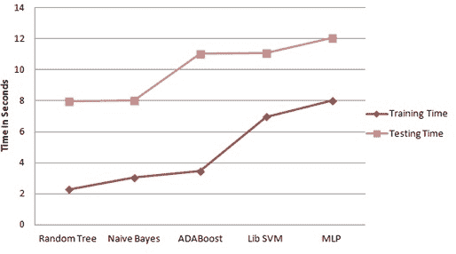

# 无线传感器网络安全漏洞的动态机器学习策略

**Shweta Paliwal^(1, *)**

¹ 印度梅尔特工程技术学院计算机科学与工程系

## 摘要

无线传感器网络（WSN）由于其部署特性和具有成本效益的特色已成为一种有希望的技术。对无线应用的快速增长导致了与其基础设施缺失和传输特性相关的新安全漏洞的出现，从而使得 WSN 成为攻击者和入侵者的中心对象。机器学习已经嵌入了全面的解决方案，以应对现代安全漏洞。通过映射安全漏洞并执行未知模式的识别，它已成为一种抑制技术的标志。本章重点介绍了无线传感器网络中的安全漏洞，以及通过动态算法和机器学习策略减少攻击的概述。我们提出了一些特征选择方法，以确定可用网络数据集中的最佳特征。这些特征选择方法与现有的机器学习分类器进行了评估，以确定最佳的特征选择策略和最佳的分类器。

**关键词：** 网络安全，特征选择，机器学习，无线传感器网络（WSN）。

* * *

^* **通讯作者 Shweta Paliwal：** 印度梅尔特工程技术学院计算机科学与工程系；电子邮件：shwtplwl23@gmail.com

## 1\. 引言

信息技术和通信领域的巨大增长为无线传感器网络（WSN）的发展铺平了道路。如今，无线传感器网络已经在医学、军事、智能空间等各种应用领域留下了自己的足迹。无线传感器网络（WSN）被定义为一组空间离散的网络设备，配备专用传感器来监测和记录物理状况。

环境的感知。无线传感器网络可以是需求驱动或事件驱动。在事件驱动的传感器网络中，网络会在监测区域感知到变化后立即触发，而在需求驱动的情况下，网络会作为客户端的更新数据库。无线传感器网络由若干个小型传感节点组成，这些节点可以随机部署或确定部署 [1]。这些节点从环境中收集数据，并将感知到的数据传输到基站进行进一步处理。WSNs 提供了跨层设计和可扩展性，同时具备处理节点故障的能力。各种类型的传感器，如地震、磁性、视觉*等*，都嵌入在 WSNs 中，从而监测环境情况。

传感节点的特性取决于它们的存储容量、有限的处理能力和有限的能量。根据节点的特性，无线传感器网络分为两种类型的网络，即同质网络和异构网络。所有传感节点在通信、存储、能量和可靠性方面具有类似特性的网络被称为同质网络 [2]。由于无线网络的传输特性，安全性已成为一个关键问题。无线传感器网络的设计者不仅必须关注安全性，还必须关注与数据可靠性、数据聚合和故障检测相关的问题。由于传感节点能够在自组织网络和普通网络中运行，安全目标可以分为两类：主要安全目标和次要安全目标。

机器学习为系统模型提供了低复杂度的估计，因此被部署在无线传感器网络的复杂环境中。无线传感器网络的设计者正在专注于机器学习算法，以获得对无法到达的位置的新见解和知识。可以看到，无线传感器网络正在采用机器学习来增强通信信道的安全性，因为机器学习能够处理无线传感器网络的动态行为。

本文从网络数据集中识别了不同的特征选择方法。特征选择方法非常重要，因为它们可以加快 ML 模型的训练，同时减少模型的复杂性，从而提供更容易解释的结果。我们确定了最佳的特征选择策略，然后将其与几种机器学习分类器进行评估，以确定最佳性能的算法来检测安全漏洞。

第二部分描述了 WSNS 中的安全问题，接着在第三部分描述了机器学习。第四部分描述了 ML 如何解决不同的安全问题，第五部分描述了为应对这些问题而开发的方法。提出的方法论在第六部分中描述。第七部分描述了整个工作的结论。

## 2\. 无线传感器网络中的安全问题

制造业和无线通信网络领域的进化促进了 WSN 的增长。它们由成本效益的传感器节点组成，释放大量能量。多种特征使 WSN 易受安全攻击，其中包括传感器节点资源受限和节点的自组部署。WSN 生存的基本要求包括可靠性、可用性和能源效率。拒绝服务攻击和窃听攻击针对网络上传输数据的机密性和完整性，而洪水和干扰攻击与网络的能源消耗有关[3-4]。因此可以说有几种安全攻击针对 WSN 的敏感点，如 WSN 的带宽、能量和路由机制，从而为入侵者开辟了新的门路。WSN 对于中间人安全攻击更加脆弱，因为它们能够完全控制在网络上传输的信息。攻击者针对数据的机密性和完整性。

### 2.1\. 窃听攻击

**窃听攻击**构成了其他攻击的基础，是对无线传感器网络的严重安全威胁。无线传感器网络中有两种类型的窃听攻击；被动窃听，恶意节点通过监听无线广播媒介中的消息传输来检测信息。主动窃听，恶意节点伪装成授权节点通过向发送器发送查询来捕获信息。

### 2.2\. 干扰攻击

干扰被视为 DOS（拒绝服务）攻击的一种特殊类别。在干扰攻击中，发射高频无线电信号来干扰发射器的操作。干扰器可以是一个简单的发射器或一个配备特殊设备的完整干扰站。

### 2.3\. 篡改

在这种攻击中，原始节点被伪造节点代替，入侵者可以访问像加密密钥之类的敏感信息。该攻击通常发生在物理层。

### 2.4\. 耗尽和碰撞攻击

在这种攻击中，MAC（媒体访问控制）协议被恶意节点通过在信道上传输而干扰，使其他节点无法访问信道。时分复用被用作对抗这种攻击的对策[5]。碰撞攻击发生在两个节点尝试以相同频率传输数据包时。

### 2.5\. 塞比尔攻击

无线传感器网络容易受到塞比尔攻击。恶意节点创建多个相同的节点。根据身份的伪造，塞比尔攻击可以以各种方式在无线传感器网络中发动。一个相同的节点可以轻易地从正常节点获取访问并在单跳通信期间获取信息。向未经授权的节点的通信导致数据的丢失。塞比尔攻击导致数据的完整性、安全性和资源利用受损。塞比尔攻击分为两类：

**盗用身份攻击和伪造攻击：** 新的恶意节点是从合法节点创建的。例如；授权的传感器节点的 16 位 ID 可以被用来创建一个具有相同 16 位 ID 的伪造节点。

**直接和间接攻击：** 塞比尔节点和真实节点之间的通信是直接进行的，而间接攻击是通过恶意节点进行的[6]。

### 2.6\. 黑洞攻击

在这种攻击中，数据流量被吸引到一个恶意节点。这个恶意节点伪装成最短路径来吸收数据包。一旦节点被捕获，它们被重新编程，以便它们无法将数据包传输到目的地。重新编程的节点被称为“黑洞节点”。

### 2.7\. 虫洞攻击

侵入者通过在低延迟链路上进行重播，将从网络的一部分收到的消息传输到网络的另一部分。蚯蚓攻击存在隐藏和暴露两种模式。蚯蚓攻击是一种可以影响网络的拒绝服务攻击，而不考虑已经实施的加密技术，从而使得攻击的检测变得困难[7]。

### 2.8\. 灰洞攻击

在这种攻击中，恶意节点作为网络中的正常节点，将需要传输到目标节点的数据包丢弃[8]。无线传感器网络中的灰洞可以根据 WSN 中的节点数量和数据包的丢失分为两类。

### 2.9\. 汇合点攻击

这是一种内部人攻击类型，在这种攻击中，侵入者首先将一个正常节点转化为受损节点，然后根据正在使用的路由协议的路由度量向受损节点吸引所有的流量[9-10]。在无线传感器网络中的通信模式使得检测汇聚点攻击成为了一个巨大的挑战。

### 2.10\. 问候洪攻击

无线传感器网络中的一些节点向所有相邻节点广播“你好”消息，以标记自己的存在。这样的节点可能会造成“你好洪水”攻击，以便成为网络中大量节点的父节点。在这种攻击中，入侵者获取一个节点，并通过发送“你好”消息宣布自己为其他节点的邻居。当一个节点收到此消息时，它会假设该节点在通信范围内，从而开始与已捕获的节点进行传输。

## 3\. 机器学习作为无线传感器网络的保障出现

机器学习（ML）这个术语是在第一个神经网络设计出现后才被创造出来的。机器学习可以被描述为“设计具有自动学习和不断改进经验的系统，而无需明确编程”。在无线传感器网络中，机器学习不仅会提高性能，还将有助于访问传感器捕获的大量数据。使用 ML 技术可以轻松预测需要覆盖目标区域的传感器节点。现有机器学习技术的分类是基于模型结构和学习能力的。图 1 描述了 ML 模型的工作基础流程。

**图（1）**

机器学习模型的设计。

在网络安全领域，机器学习通过对以前情景的分析和预测，来展现出积极的结果，为防御采取具有说服力的措施。技术已经超越了传统安全措施的某些场景。

1.  机器学习提供了对关键实时事件的识别。

1.  通过分析网络流量和过去的安全漏洞模式，算法能够揭示先进的防御机制。

1.  机器学习可以检测网络基础设施中的内部威胁和违反政策。

1.  通过机器学习方法设计了先进的 IDS。

1.  机器学习为无线传感器网络提供了同步和拥塞控制。

对于无线传感器网络，机器学习提供了先进的分析解决方案。

**本地化：**有时，在部署后，对传感器网络基础设施中的传感器节点进行识别成为一项关键任务，需要重新配置。机器学习算法为网络中未知和锚定节点提供了分类的便利。此外，集群节点经过训练，可以在传感器网络中找到特定节点。

**无线传感器网络中的覆盖范围：**传感器节点负责覆盖网络中感兴趣的区域。机器学习将告诉您所需的最少传感器节点数量，以提供网络的完全覆盖。

**异常检测：** 数据不断积累于环境中，并以持续的节奏传输至基站。因此，保护这些感知数据是一项关注重点；机器学习正在实施混合检测策略，以识别网络中的恶意数据流量。

**数据聚合和聚类：** 在分布式大规模传感器网络中有效传输数据是一项挑战。机器学习通过提取相似和不相似函数，在集群头部对数据进行压缩。

**查询处理和事件检测：** 机器学习算法有助于开发具有有限系统要求的高级检测策略。

机器学习在传感器网络学习过程中见证了端到端延迟传输的改进。它也通过在传感器节点应用降维算法，在通信开销上显著减少。算法不断改进节点的同步，并使自己调节以适应无线网络动态变化的环境，以便轻松实现重新配置。

## 4\. 监督学习

这些是标记的输入和输出数据被分类形成学习基础的系统。基于监督学习的模型用于表示系统参数与输入和输出之间的学习关系。对于无线传感器网络，使用机器学习技术解决了路由、定位、故障检测和同步的问题。

### 4.1\. 线性回归和逻辑回归

这是一种简单的监督学习方法，其中根据自变量（x）预测因变量（y）。回归可以是线性回归或逻辑回归，可以具有连续或定量变量。线性回归的数学表示如下方程式 1 所示。

|  | (1) |
| --- | --- |

逻辑回归说明只存在两种可能的类别来描述因变量的性质。因变量以 0 和 1 的形式定义。

除了这两种，另一种回归是贝叶斯回归，它使用概率估计来制定线性回归。结果变量被定义为 y，是从高斯分布中生成的。贝叶斯回归有助于确定后验概率，并不专注于寻找最佳解决方案。

支持向量回归用于实值估计，并属于监督学习方法。它基于核的使用，并用于训练对称函数。支持向量机通过将二元分类问题制定为凸优化问题来解决这些问题。

### 4.2\. 人工神经网络（ANN）

它是在生物神经网络上运行的一种监督学习模型。 人工神经网络包括大量称为神经元的处理单元，并且由 3 层运行，即输入层，隐藏层和输出层。 在无线传感器网络中，人工神经网络用于提高路由、拥塞控制和数据聚合的效率。 人工神经网络可以一次记住多种输出和决策的边界，因此被认为是解决网络挑战的合适选择，并且它们还提出了经济实惠的解决方案。

### 4.3\. 决策树

决策树基于 if-then 规则，并包括两个节点，即决策节点和叶节点。 它是一种监督学习算法，根据不同条件分割数据集。 决策树的叶节点代表类标签，树的内部节点代表属性。 通过使用基尼指数或信息增益方法来选择根节点的属性。 在无线传感器网络中，决策树用于处理异常检测、移动汇聚路径选择，*等*问题。 它还有助于识别诸如损耗率和丢失率之类的特征。

### 4.4\. 随机森林

随机森林算法基于集成，由大量的决策树组成。 随机森林算法分两个阶段进行操作；首先创建随机森林分类器，其次是预测结果。 随机森林可用于分类或回归问题。 在随机森林算法中，考虑到“树的数量越多，预测结果的准确性越高”，因此与其他机器学习技术相比，它减少了敏感性的级别。 使用此算法，将解决过拟合问题，并有助于特征工程。 使用随机森林算法解决了与媒体访问控制（MAC）相关的问题。

### 4.5\. 贝叶斯学习

贝叶斯学习是基于统计模型参数被视为随机变量的监督学习，结果是使用后验分布进行绘制。 贝叶斯推断通常考虑少量的训练样本，并遵循由方程 2 给出的贝叶斯规则。

|  | (2) |
| --- | --- |

### 4.6\. 支持向量机（SVM）

SVM 是一种监督学习方法，其中每个数据项被绘制为 n 维空间中的一个点，其中每个特征的值都是特定坐标的值。因此，我们可以说 SVM 是一个为数据分类建议最佳超平面的分类器，在二维空间中，该超平面被视为一条直线。在无线传感器网络中，SVM 可以用于检测节点的恶意行为和连接问题。当数据要么处于非结构化形式，要么处于半结构化形式时，SVM 的复杂度不受训练数据中遇到的特征数量的影响。

### 4.7\. K-最近邻算法 (K-NN)

K-NN 是一种监督学习的基于实例的学习方法，用于处理分类和回归问题。欧几里得距离、曼哈顿距离和闵可夫斯基距离是 KNN 方法中使用的距离函数。输入数据集的大小是 KNN 复杂度取决的参数之一。

## 5\. 无监督学习

这是一种学习方法，算法是使用既不经过训练也不经过分类的信息进行训练的。系统根据它们之间的相似性和差异性将信息分类成组。与监督学习方法相比，基于无监督学习的系统能够执行更复杂的任务。在无线传感器网络中，无监督学习用于节点的聚类以及解决连接和路由问题。

### 5.1\. K- 均值聚类

K 均值聚类将 n 个对象分成 k 个聚类，其中对象属于具有最近均值的聚类。K 均值聚类的主要目标是最小化聚类内变差。 算法首先考虑 K 个随机位置，并与数据点一起形成聚类。一旦聚类形成，便会从每个聚类中重新计算一个新的质心。该过程会继续，直到所有聚类的质心值不再发生变化。该聚类方法有助于选择无线传感器网络中路由的最佳集群头。

### 5.2\. 模糊 C-均值聚类

模糊 C 均值聚类最早由邓恩在 1973 年开发，后来于 1981 年由贝兹德克改进，被用于模式识别。在这里，每个数据点被分配一个对应于每个聚类中心的隶属函数。隶属度是根据聚类中心和数据点之间的距离来分配的。在数据集重叠的情况下，与 K-均值聚类相比，模糊 C 均值聚类提供了最佳的聚类。

## 6\. 半监督学习

基于半监督学习的算法由带标记和未标记数据集组成，因此可以说半监督学习是监督学习和无监督学习的结合。半监督学习的最终目标是利用一些有标签的信息集对未标记数据进行分类。半监督学习的应用领域包括语音分析、蛋白质序列分类、网页内容分类和垃圾邮件过滤。半监督学习已经被用于解决无线传感器网络的定位问题。

## 7\. 强化学习

强化学习被描述为在特定环境中采取适当行动来最大化奖励的能力。这是一种使代理（可以是 WSN 的传感器节点）通过与其环境交互来学习的学习方法。Q 学习是强化学习中流行的技术之一。Q 学习让代理知道在特定情况下需要执行什么操作，并可以处理具有随机转换的问题。使用 Q 学习技术已经在一定程度上减少了无线传感器网络中的路由问题。

## 8\. 机器学习解决 WSN 中的问题

### 8.1\. 机器学习解决安全问题

保护无线传感器网络免受不同攻击（在上述章节讨论）是一个具有挑战性的问题。然而，机器学习已经成为对抗这些攻击的保障，研究人员提出了几种利用机器学习算法来检测和防止对 WSN 的攻击的技术。入侵检测系统（IDS）在检测无线传感器网络中的恶意节点中起重要作用。Parras *et al*. [11]设计了一个基于马尔可夫决策过程的框架，以应对无线传感器网络中的自组织防御和最优性问题，使用强化学习。该方法已针对无线传感器网络中的频谱感知攻击进行了测试。

为了改善融合分类，Javaid *et al*. [12]提出了四种分类技术，分别是增强 K-最近邻（EKNN）、增强极限学习机（EELM）、增强支持向量机（ESVM）和增强循环极限学习机（ERELM）。共准备了 20 个数据集，并使用 MATLAB 进行了模拟。这些提出的技术比现有技术具有更好的准确性和检测能力。

这些研究人员设计了方法，然后对其进行了多个数据集的测试。 他们在综合性能分析中显示出了显著的改进，其中包括检测率的准确性和其他标准性能指标。 陈*等人*使用了一种合成少数过采样技术（SMOTE）来平衡数据集，并应用了随机森林算法来检测无线传感器网络中的入侵[13]。 SMOTE 是一种用于解决类别不平衡和因非启发式过采样引起的过度拟合问题的技术。 使用了包含四十一个属性的 KDD-99 数据集，后来将其分为五类攻击。 这项研究得出结论，随机森林与 SMOTE 的结合导致了 92.57%的准确性。 使用 AVISPA 工具和 HLPSL 语言验证了这些协议。 AVISPA 代表自动验证互联网安全协议和应用程序，并已用于验证涉及身份验证和 Chandre*等人*的服务拒绝攻击的协议[14]。

设计了一种用于检测无线传感器网络中黑洞和吞噬攻击的混合框架。 该框架基于比例重叠分数（POS）和 Minkowski K 均值来降低复杂性并提高检测精度。 使用 POS 来减少数据集中的特征，并将数据转换为经过预处理的形式。 Minkowski K 均值算法用于训练和分类。 该框架实现了较高的检测率和低的数据包丢失率。 它还最小化了网络中的通信开销，并使用网络模拟器 2 进行了结果模拟。 Minkowski K 均值的检测准确率为 85.93%。 Kumar*等人* [15]提出了一个检测框架，通过警报消息捕获吞噬和黑洞攻击，并激活正常的传感器节点。

入侵检测系统用于检测网络中节点的恶意行为。入侵检测系统利用基于二元逻辑回归的统计工具进行检测。该系统以节点参数作为输入进行恶意行为检测。这个 m-ID 在实时环境中部署了各种网络拓扑。Ioannou 等人[16]提出了每种网络拓扑和攻击的二十四种恶意场景。随后开发了一种用于检测无线传感器网络中欺骗攻击的机器学习技术。两种机器学习分类器被混合使用来处理和分析攻击样本。K 均值算法和 K-NN 算法是这种技术中使用的机器学习算法。De 等人[17]提出了一种用于优化场景的算法，其中攻击和合法节点的距离要么相同，要么非常接近。与现有技术相比，这种方法导致准确性增加了 10%。

Qu 等人[18]设计了一种基于知识的入侵检测策略（KBIDS），以弥合检测率与误报率之间的差距。使用均值漂移聚类算法来区分网络流量中的异常模式，并使用支持向量机来最小化分类错误。QUAL Net 被用作网络模拟器，在每个区域随机部署了 100 个传感器节点。与现有的六种不同模型相比，KBIDS 的检测率最高。

离群点检测在无线传感器网络的安全问题中占据重要地位。使用机器学习技术进行了一项关于离群点检测的调查，并观察到贝叶斯分类已经成为 Dwivedi 等人[19]检测的最佳方法。设计了一种基于支持向量机的入侵检测新方法。这里使用遗传算法进行特征选择。使用网络模拟器模拟了无线网络，并考虑了数据包传递等参数。Vijayanand 等人[20]提出了一种特征选择技术，并观察到提出的基于遗传算法的特征选择技术提供了更高的准确性，更少的开销和计算复杂度。

随机森林算法被用于检测无线传感器网络中的 DOS 攻击。Park 等人提出的算法与基于人工神经网络的模型进行了比较，观察到所提出的随机森林算法对黑洞攻击准确率为 99%，对洪水攻击为 96%，对普通和调度攻击为 96%。随后，提出了一种用于检测无线传感器网络中蠕虫攻击的算法，降低了数据包丢失率。考虑了动态阈值用于检测蠕虫攻击节点，随后采用聚类技术选择乐观通信路径。使用 MATLAB 进行 WSN 编码组织的仿真，从而降低了总体数据包丢失并改善了 WSN 性能[22]。

存在另一种拒绝服务攻击的类别，被称为吸血鬼攻击。这些攻击旨在耗尽节点电池的电力，难以检测，因为它们符合协议。随后，Tanguturi 等人提出了一种基于神经网络的检测算法，用于检测吸血鬼攻击下的受损节点[23]。数据被分为三个类别：训练、验证和测试。性能指标均方节点用于评估设计检测节点的性能。该方法提供了较低的错误率和较高的检测率。

研究人员设计了一个使用逻辑回归、朴素贝叶斯、支持向量机和随机森林的分类和预测模型。这些机器学习算法针对 KDD 数据集进行了测试。观察到随机森林在真阳性率（TPR）方面取得了最高的准确率，并与其他算法相比提供了 99%的准确率[24]。

研究工作专注于一个专门的数据集，提供了对无线传感器网络上四种类型攻击的检测和分类，分别为黑洞攻击、灰暗洞攻击、洪水攻击和调度攻击。LEACH 层次协议被用于路由。使用网络模拟器 2 处理和模拟了二十三个特征。采用人工神经网络对数据集进行训练、检测和分类 DOS 攻击。Almomani 等人得出结论，黑洞攻击的检测准确率为 92.8%，洪水攻击为 99.4%，调度攻击为 92.2%，灰洞攻击为 99.8%。

提出了一种使用 K 均值聚类检测蠕虫和黑洞攻击的混合异常检测方案。Wazid 等人提出了 OPNET 模拟器用于创建 WSN 数据集，并将传感器网络划分为簇。使用 OPNET 模拟器在正常流量和攻击情景下模拟无线传感器网络。他们得出结论，这种混合方法提供了 98.6%的检测率，误报率为 1.2%。

### 8.2\. 机器学习解决无线传感器网络中的路由问题

大规模视频流的需求增长创造了一个有效的路由传输环境来维护负载均衡。设计了一个使用主成分分析的基于路由的负载平衡框架，然后在神经网络上进行了网络培训。由 Yao *等*人[27]提出的框架提供了更好的吞吐量和延迟。

研究人员指出，物联网传感器网络需要智能路由，因此他们开发了一种使用神经模糊规则聚类方法的路由算法。这一路由算法能够更好地提高网络性能，包括能源利用率和数据包利用率，作者为 Thangamarya *等*人[28]。后来，提出了一种基于强化学习的路由算法，用于优化。它使用模糊链进行成本估算。Singh *等*人[29]提出的算法在动态环境中提供了显著改进。基于和谐路由的能效算法旨在解决传感器节点的能耗问题。Zeng *等*人[30]为改进算法的性能指标开发了本地策略，以提高算法的准确性。

### 8.3\. 机器学习在无线传感器网络中的数据聚合

除此之外，在无线传感器网络中存在一些其他问题，这些问题已经通过机器学习方法得到解决。表格**1**展示了一些无线传感器网络领域的其他工作，这些工作是通过机器学习策略完成的。

表格 1 **WSN 中的 ML 应用。**

| **算法** | **WSN 中的应用** |
| :-: | :-: |

| 随机森林 | • 入侵检测 • 安全攻击检测

• 故障检测 |

| 支持向量机 | • 故障检测 • 能源效率

• 路由 |

| K- 最近邻 | • 定位 • 节点估计 |
| --- | --- |

| 贝叶斯网络 | • 能源管理 • 传感器管理

• 移动性管理 |

因此到目前为止，观察到机器学习成功地处理和减轻了与无线传感器网络相关的威胁。这些算法的范围不仅仅局限于安全漏洞的缓解，还包括节点定位、路由、传感器管理以及其他各种问题。如果我们谈论与网络安全相关的问题，那么有几个公开可用的数据集，例如 KDD99、NSL-KDD、DARPA 和 UNSWNB15 数据集。这些数据集通过多个已识别的网络属性（称为特征）描述了网络的行为。对于最佳特征集的选择策略可以改善分类器的性能，并有助于从给定的完整数据集中识别最佳特征。

*因此，我们已经确定了三种在公开数据集上的特征选择方法，并观察了每组特征集上 ML 分类器的表现，以预测数据集中最佳特征集*。

### 9\. 提出的特征选择方法和对机器学习算法的比较分析

在讨论安全问题和应用在无线传感器网络中减轻这些影响的方法后，我们描述了特征选择策略，并在公开数据集上执行了机器学习算法的评估分析。所提出模型的工作流程已在图中描述。(**2**)

**图 (2)**

方法流程图。

**采用方法概述**

1.  已收集了一个合适的数据集，并进行了数据清洗和数据预处理阶段。因此，已准备好最终的清洁数据集用于处理。

1.  已应用多种特征选择策略并识别了最佳特征集。

1.  对每组特征集上的 ML 算法进行评估分析，并根据性能指标进行比较，以便确定最佳特征集和算法。

### 9.1\. 数据集收集

KDD99 数据集已用于评估过程。该数据集包含了几种安全攻击的实例，已被分为四种基本的安全攻击类别。KDD 99 数据集包含了二十二种不同的攻击，如服务拒绝攻击，用户对根攻击，远程到本地攻击和探测攻击。

### 9.2\. 特征选择方法论

特征选择是数据预处理阶段的重要步骤，因为它有助于减少维度并移除无关特征。

#### 9.2.1\. 基于相关性的特征

该策略包括两种方法；首先从类中选择兼容特征并执行识别，其次从数据集中消除冗余特征。

相关系数对于线性相关特征取值为+- 1，而对于不相关的特征则标值为 0。

#### 9.2.2\. 信息增益方法

这是一种基于文本特征给出的熵和信息量的评估方法。熵在决策树中很重要，因为它决定了数据的划分，并且会影响决策树边界如何使用方程式 3 绘制。

|  | (3) |
| --- | --- |

考虑一个数据集（D）和一个变量（v），信息增益的计算如下所示，如方程式 4 所示；

|  | (4) |
| --- | --- |

其中 IG (D, v) 表示数据集（D）对于变量（v）的信息，H(S) 表示更改前数据集的熵，H (D/V) 表示给定变量（v）的数据集的条件熵。

#### 9.2.3\. CFS 子集评估

通过评估每个特征的预测能力和冗余程度来评估属性的价值。优选具有交叉相关性的特征子集，这些特征高度相关。

### 10\. 实验结果和分析

在对数据集进行清洗和去除重复项后，应用上述特征选择策略。然后，对所有三个派生子集上的机器学习分类器进行评估，并已记录了每个分类器在每个子集上的性能指标。

**算法 1：随机树**

+   输入：具有 41 个属性的数据集 (D)

+   通过信息增益属性选择，将特征减少到 14 个

+   过程

+   步骤 1：初始化分类方案

+   步骤 2：选择基础分类器

+   步骤 3：如果

+   （基本分类器 = 随机树）

+   步骤 4：声明最大深度为 m

+   步骤 5：对于 (m=0; m<=5; m++)

+   步骤 6：初始化批处理大小

+   步骤 7：为每个特征向量编码模型

+   输出：最终模型 E

**算法 2：朴素贝叶斯**

+   输入：具有 41 个属性的数据集 (D)

+   通过属性选择，将 41 个特征减少到 14 个特征

+   过程

+   步骤 1：读取数据集 (D)

+   步骤 2：将预测变量初始化为 v

+   步骤 3：使用 v 预测变量计算每个类的平均值和标准差

+   步骤 4：估计每个类的概率函数 π

+   步骤 5：计算类的似然函数并估计最大似然

**算法 3：ADA 增强**

+   输入：具有 41 个属性的数据集 (D)

+   通过特征选择来减少特征

+   过程

+   步骤 1：对实例的权重进行初始化

+   步骤 2：为调用弱学习器设置 FOR 循环

+   步骤 3：返回弱分类器

+   步骤 4：设置归一化因子

+   步骤 5：更新权重并生成一个强分类器

为了避免模型的偏见和过拟合，将使用 10 折交叉验证技术对每个分类器进行评估。这有助于减少

偏差并提供适度的方差。表 **2** 描述了每个分类器在针对特征的派生子集进行评估时的检测准确性指标。

表 2 **分类器的性能指标。**

| **算法** | **CFS 特征选择** | **信息增益特征选择** | **相关性特征选择** |
| :-: | :-: | :-: | :-: |
| 随机树 | 94.55 | 99.81 | 90.57 |
| 朴素贝叶斯 | 92.03 | 94.87 | 90.13 |
| ADA 增强 | 93.17 | 95.84 | 93.32 |
| Lib SVM | 89.02 | 91.14 | 89.02 |
| MLP | 90.09 | 91.23 | 91.23 |

在记录性能指标后，对子集上的每个分类器的训练和测试时间进行记录和绘图。观察到，在针对信息增益方法得到的特征子集进行评估时，随机树表现出更高的准确性指标。图表（**3**-**5**）描述了每种特征选择方法上分类器的性能。

对于每个特征子集上的每个算法，还观察了接收者工作特性曲线以及准确率和召回率。因此，我们绘制了 ROC 曲线区域，并且精度和召回率的值在图 (**6**) 中给出。精度描述了相关结果的度量，而召回率描述了分类器展示的总相关结果。这里，TP 和 FP 分别描述了真正例和假正例实例，而 FN 和 FP 分别描述了假负例和假正例实例。

**图(3))**

Co-relation set 的图形表示。**图(4))**

信息增益方法的图形表示。**图(5))**

CFS 子集方法的图形表示。**图(6))**

其他绩效指标的图形表示。

## 结论和未来的工作

因此，我们在公开可用数据集上评估了特征选择的三种方法，并观察到通过信息增益方法识别的特征集为分类器提供了更好的准确性度量。特征的选择取决于所使用的数据集的类型，而随机树是该方法在所用数据集上的最佳机器算法。使用信息增益的特征集的训练和测试时间也有所减少。

机器学习正在保护无线传感器网络免受多种拒绝服务安全攻击。研究人员提到需要开发一个主动的抵抗系统来检测无线传感器网络中的入侵。无线传感器网络利用基于机器学习的框架来防范这些安全漏洞，提供了有效的检测和准确性。机器学习设计了一个提供高水平安全性的框架，同时降低了计算复杂度。未来的研究人员可以专注于设计针对无线传感器网络安全攻击的最佳解决方案，并减少内存开销。

机器学习作为未来无线传感器网络的一种有前途的技术，能够处理传感器网络的容量和设计相关的问题。机器学习算法从以往的经验中训练模型，使传感器网络更加优化。机器学习算法在动态环境中工作的能力使无线传感器网络更加复杂。未来的工作应该专注于使用机器学习算法设计最佳解决方案，以延长网络的寿命，并且模型还必须专注于节点的聚类和接收节点的移动性。

## 出版同意书

不适用

## 利益冲突

作者声明没有利益冲突，无论是财务上还是其他方面。

## 致谢

未声明

## 参考文献

|  |  |
| --- | --- |
| [1] | 加西亚-方特 维克多，加里格斯 卡莱斯，里法-普斯 海伦娜。比较研究智慧城市无线传感器网络异常检测技术 Sensors (Basel)201616686810.3390/s16060868 |
| [2] | 库马尔 D.R.，约翰·克莱门特·桑德尔·阿。Minkowski K-Means 入侵检测，以缓解医疗保健无线传感器网络的引路器和黑洞攻击。Tagajournal201846500 |
| [3] | 维加亚南 R.，德瓦拉杰 D.。无线网格网络中使用鲸优化算法和遗传算子的新颖特征选择方法，用于入侵检测系统。IEEE Access20208568475685410.1109/ACCESS.2020.2978035 |
| [4] | 贾特利 S.，马尔霍特拉 H.，布什安 B.。无线传感器网络中针对干扰攻击的安全漏洞和对策：一项调查。国际计算机、通信和电子会议（Comptelix）201710.1109/COMPTELIX.2017.8004033 |
| [5] | 佩雷拉 P.R.，格里洛 A.，罗沙 F.，努涅斯 M.S.，卡萨卡 A.，肖达 C.，阿尔姆斯特罗姆 P.，约翰逊 M.。无线传感器网络的端到端可靠性：调查和研究挑战。在 EuroFGI IP QoS 和流量控制研讨会上 2007 年巴黎 546774 |
| [6] | 布什安 B.，沙霍 G.。无线传感器网络中攻击、技术挑战、漏洞及其对策的最新进展。无线个人通信。20189822037207710.1007/s11277-017-4962-0 |
| [7] | 奥图姆 S.，坎塔尔奇 B.，穆夫塔 H.。针对关键基础设施中的无线传感器簇的自适应监控和入侵感知数据聚合。IEEE 国际通信大会.IICC202016 |
| [8] | 达摩达兰 U.S.R.K.，瓦亚纳佩鲁马尔 R.。使用消息认证和传递方法在无线传感器网络中检测和防止冒名顶替攻击。The Scientific World Journal2015110.1155/2015/841267 |
| [9] | 布什安 B.，沙霍 G.。无线传感器网络的需求、协议和安全挑战：工业视角 Handbook of Computer Networks and Cyber Security2020683713 |
| [10] | 帕拉斯 J.，萨佐 S.。使用马尔科夫决策过程学习无线传感器网络的攻击机制。Expert Systems with Applications2019122376387 |
| [11] | 贾维德 A.，贾维德 N.，瓦都德 Z.，萨巴 T.，谢塔 O.E.，萨利姆 M.Q.，阿尔扎拉尼 M.E. 机器学习算法和故障检测，以提高无线传感器网络中信任函数决策融合的可信度 201910.3390/s19061334 |
| [12] | 姆皮茨奥普洛斯 A.，加瓦拉斯 D.，康斯坦托普洛斯 C.，潘齐乌 G.。无线传感器网络中的干扰攻击和对抗措施调查 200910.1109/SURV.2009.090404 |
| [13] | 谭 X.，苏 S.，黄 Z.，郭 X.，左 Z.，孙 X.，李 L.。基于 SMOTE 和随机森林算法的无线传感器网络入侵检测 201910.3390/s19010203 |
| [14] | Chandre P.R.，Mahalle P.N.，Shinde G.R。十一月。基于机器学习的入侵检测和预防系统的新方法：一种基于工具的验证 IEEE 全球无线计算和网络会议（GCWCN）135140201810.1109/GCWCN.2018.8668618 |
| [15] | Alsheikh M.A.，林 S.，尼亚托 D.，谭 H-P。无线传感器网络中的机器学习：算法、策略和应用 2014 |
| [16] | 伊奥努 C.，瓦西利奥 V。基于二元逻辑回归的受限 WSN 和 IoT 节点入侵检测系统。无线和移动系统的建模、分析和仿真 201825926310.1145/3242102.3242145 |
| [17] | De Lima Pinto E.M.，Lachowski R.，Pellenz M.E.，佩纳 M.C.，苏萨 R.D。无线传感器网络中检测欺骗攻击的机器学习方法，IEEE.AINA2018752758 |
| [18] | 屈 H.，邱 Z.，汤 X.，向 M.，王 P。将无监督学习融入结构共进化的无线传感器网络入侵检测中。Appl。Soft Comput.20187193995110.1016/j.asoc.2018.07.044 |
| [19] | Dwivedi R.K.，Pandey S.，Kumar R。“关于无线传感器网络异常检测的机器学习方法研究”，云计算、数据科学和工程.Confluence2018189192 |
| [20] | Vijayanand R., Devaraj D., Kannapiran B。利用基于遗传算法的多支持向量机分类器进行无线网格网络入侵检测系统。Comput. Secur.20187730431410.1016/j.cose.2018.04.010 |
| [21] | 朴 T.，曹 D.，金 H。“无线传感器网络中 DoS 攻击的有效分类”，普世网络和未来网络.ICUFN2018689692 |
| [22] | 哈帕尔 E.，特吉帕尔 G.，夏尔马 S。蠕虫攻击检测技术的机器学习技术。无线传感器网络.IJMET2017 |
| [23] | 唐古特瑞 R.C.，贾亚库马尔 C.。VND-NN：基于神经网络的无线传感器网络中的吸血鬼节点检测 2016 |
| [24] | Belavagi M.C.，Muniyal B。监督机器学习算法的性能评估，用于入侵检测。Procedia Comput. Sci.20168911712310.1016/j.procs.2016.06.016 |
| [25] | Almomani I.，Al-Kasasbeh B.，Al-Akhras M。WSN-DS：无线传感器网络入侵检测系统数据集。J. Sens.201610.1155/2016/4731953 |
| [26] | Wazid M.，Das A.K。一种利用 K 均值聚类的有效混合异常检测方案，用于无线传感器网络无线个人通信，90201641971200010.1007/s11277-016-3433-3 |
| [27] | 姚 H.，袁 X.，张 P.，王 J.，蒋 C.，Guizani M。“一种用于支持下一代无线网络的负载平衡路由的机器学习方法”，第 15 届国际无线通信与移动计算会议.IWCMC201913171322 |
| [28] | 唐加拉玛亚 K，库洛杜甘 K，洛甘比盖 R，塞尔维 M，加纳帕西 S，卡南 A。物联网中无线传感器网络的能源感知集群和神经模糊路由算法。Computer Networks2019151:2112310.1016/j.comnet.2019.01.024 |
| [29] | 辛格 K，马尔霍特拉 J。基于强化学习的用于模糊连接成本估计的无线传感器网络路由优化的实时搜索算法。Int. J. Commun. Netw. Distrib. Syst.20192236338410.1504/IJCNDS.2019.099967 |
| [30] | 曾博，董扬。基于改进和谐搜索的能效路由算法，用于无线传感器网络。Appl. Soft Comput.201613514710.1016/j.asoc.2015.12.028 |
