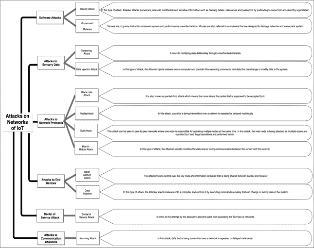

# 物联网- 基础和挑战

**Mohammad Maksuf Ul Haque^(1)****,** **Shazmeen Shamsi^(1)****,** **Khwaja M. Rafi^(2)****,** **Mohammad Sufian Badar^(3, 4, *)**

¹ 北印度穆斯林大学计算机科学系，印度新德里

² Mewat Engineering College 理事，Palla, Nuh 区，哈里亚纳邦，印度

³ 加州大学河滨分校生物工程系，美国加州河滨

⁴ Salfia Paramedical Institute Darbhanga, SPI Darbhanga, Bihar 846001, India

## 摘要

物联网（IoT）是一项革命性的技术，旨在使我们使用的所有东西都能够在互联网上共享和接收信息。从您厨房中的冰箱和洗衣机到农场的土壤湿度传感器和体育场的喷水器，几乎所有可能的东西都适用。它在每个领域都有无限的应用，包括医疗、工业/制造、安全等领域。由于其广泛的应用，IoT 是一个难以理解的概念。为了解决这个问题，我们将通过相关示例和较少的技术术语，全面地定义 IoT 这个概念。慢慢地，我们将深入讨论无线传感网络（WSNs，IoT 的一个子集）、分布式账本技术 (或区块链) 等技术，这些革命性的技术与 IoT 融合，形成更加安全和强大的应用程序。然后，我们将讨论第三支柱，人工智能（AI），当它与前面提到的系统配对时，使我们每天与之交互的设备更加智能。最后，我们将权衡该领域的挑战和前景。

**关键字:** AI, 人工智能, 区块链, 分布式账本技术, IoT 架构, 物联网, IoT 安全, 机器学习, ML.

* * *

^* **通讯作者 Mohammad Sufian Badar:** 加州大学河滨分校生物工程系，美国加州河滨；电话：+1318 2783 121；电子邮件：msbadar@engr.ucr.edu，director_academic@salfiainstitute.edu.in

## 1\. 引言

本章旨在解释“物联网”（**IoT**）的基本概念。作为智慧生物，我们一直努力让我们的生活更轻松，从最简单的压力锅到最先进的自动驾驶汽车[1] 和军队使用的无人机。

监控[2]等。物联网是又一个技术范式，旨在让我们的生活变得更轻松，丰富我们与周围事物的互动与体验。由于涉及的事物的多样性和目前可能的应用程序的大量性，物联网的概念有点难以理解。维基百科把物联网定义为：“物联网（IoT）是一种由彼此关联的计算设备、机械和数字机器组成的系统，并配备了唯一标识符（UID），能够在网络上传输数据而不需要人与人或人与计算机之间的交互。”[3]。尽管单从定义上能够理解意思，但它略显技术性。麦肯锡给出的定义虽小，但更具逻辑性，让概念更加容易理解：“嵌入于物理对象中的传感器和执行器通过有线和无线网络相连，通常使用同样连接互联网的 Internet 协议（IP）。”[4]。

如前所述，这些定义本身是可以接受的，但它们仍无法涵盖概念的深度和广度。在本章中，我们将通过各种例子了解物联网的基础知识，但现在让我们来谈谈与物联网手牵手共同使我们与周围设备交互变得更加强大的其他革命性技术。人工智能，缩写为“AI”，是计算机科学和工程领域，使机器智能化或更精确地说，使计算机程序智能。安德鲁·摩尔给出的定义简单而简洁：“人工智能是让计算机表现出我们近期认为需要人类智慧才能做到的方式的科学和工程。”

这种智能化主要通过机器学习（ML）实现，并使程序和软件学习获得或模仿人类智能，即成为人工智能。可以说，机器学习是计算机学会变得智能的方式，正如汤姆·米切尔所说：“机器学习是使计算机程序能够通过经验自动改进的研究。”

接下来是近年来爆发的另一项技术，即分布式分类账技术，更为人所熟知的是区块链，这是一种记录维护方式。技术上，区块链是一种分布式、去中心化、公共分类账。在最基本的层面上，区块链只是一串块，但不是传统意义上的那种。当我们在这个背景下提到“块”和“链”时，我们说的是将数字信息（“块”）存储在公共数据库中，然后相互链接在一起（“链”）的方式。以上这两种

技术，*即*，人工智能和区块链正在为更强大、有益和安全的物联网系统铺平道路[7, 8]。

该章节讨论了物联网的历史，然后通过各种例子和场景描述了物联网的含义。在澄清了物联网这个广泛而模糊的概念后，它讨论了技术的基本原则、架构和框架。从那里开始，它探讨了这一领域的当前挑战，如可扩展性和安全性[9]，以及应对这些挑战可以采取的措施。最后，该章节为读者留下了物联网未来可能发展的端倪。

该章旨在让人清晰地理解物联网。它为读者提供了关于物联网出现的视角，以及关于物联网如何成为现在这样的。然后，它讨论了在我们周围真实世界中的物联网，以便更清楚地理解这些嵌入互联网的设备的无处不在。通过讨论基本原理、架构，*等*，它使读者熟悉了物联网所涉及的技术细节，以及在开发物联网解决方案时需要注意的要求和考虑事项。随后，它通过当前该领域的挑战，让读者了解我们在哪方面表现不足。最后，通过对物联网扩展前景的展望，我们必须给读者一些思考和努力的东西，如果他们想在物联网领域追求职业。

## 2\. 物联网的历史

在技术世界里，人们会认为物联网是古老的东西。机器之间相互通信的想法或愿景可以在尼古拉·特斯拉在 1926 年与《柯利尔杂志》的访谈和 19 世纪初的文学作品中找到。在某种程度上，可以说自 19 世纪中叶的第一部电报以来，机器就已经联系起来了。1900 年，第一次无线电传输的语音（无线电报），以及在通信和电子领域的许多发明和创新，奠定了物联网的基础。在所有这些快速发展中，计算机的发展始于 20 世纪 50 年代。

互联网作为物联网的一个重要组成部分，始于 1962 年的军事国防项目 DARPA，并于 1969 年发展为 ARPANET。商业服务提供商在 1980 年左右开始支持公众使用 ARPANET，这使得现代互联网得以形成。互联网和通信技术是物联网发展的关键。IPv6 决定增加地址空间是物联网发展的另一个重要组成部分。

### 2.1\. 实现概念

物联网这个术语是由**凯文·艾什顿**于 1999 年创造的，但这项技术甚至在此之前就已存在。 早在上世纪 80 年代，卡内基梅隆大学的一台可口可乐机[11]就是最早的例子之一。那里的程序员连接了冰箱和传感器，并将其连接到互联网，这样他们就可以监控里面的饮料，避免徒劳地走向自动售货机。接着，1990 年在 Interop 展会上，约翰·罗姆基展示了一台可以通过互联网启动和关闭的烤面包机[12]。也有关于 1979 年可以通过无线控制的电梯的一些迹象[13]，但不太清楚，所以可乐自动售货机被认为是第一个物联网实施案例。

LG 首次注意到物联网是在 2000 年宣布推出第一台互联网冰箱时。 从那时起，物联网迅速发展，并开始在 2003 年左右出现在主流媒体如《卫报》[14]，《科学美国人》等中。 联合国国际电信联盟 ITU 在 2005 年发表了关于该主题的第一份报告：“信息和通信技术（ICTs）的世界增加了一个新的维度：从任何时间，任何地点任何人的连接性，我们现在将拥有任何事物的连接性。 连接将增多并创建一个全新的动态网络的网络 - 物联网”。 从那时起，物联网就在关注度和潜力上不断攀升。

到 2013 年，物联网已经演变成一个涉及许多不同技术的系统，如无线通信，微型电子机械系统（MEMS）和嵌入式系统。 当今，物联网的支持几乎存在于家庭到工业，现代传感器网络，控制系统等几乎所有自动化领域。

## 3\. 物联网

### 3.1\. 物联网的含义

让我们想想今天的手机。 它们能做什么？它们可以打电话，发短信，播放歌曲，电影，书籍等。 它们是如何执行这些任务的？ 当然是通过互联网。 没有互联网，它们的功能受到限制。 为设备配备互联网功能带来许多好处。 这在我们自己的设备中可以清楚地看到，如智能手机，笔记本电脑和平板电脑。 与互联网连接后潜力的增加也适用于其他所有事物，从您拥有的家电到身边的电子设备，或者您的其他资产，几乎是一切。 物联网的中心思想或概念很简单，即将一切东西连接到互联网[15]。 物联网的所有混乱基本上是因为其定义和理念如此广泛和松散，因此引发了多种可能性和例子，使得物联网的概念难以把握。 为了进一步了解这一点，我们将看到为什么将物品连接到互联网很重要。

### 3.2\. 物联网的重要性

与互联网连接的设备或物品获得了接收或发送信息的能力，并在某些情况下可以做两者。随之而来的是被称为智能的头衔，例如智能手机、智能电视、智能家居*等*。通过将它们连接到互联网，这些设备在功能、性能和体验方面超越了它们的局限性。再次考虑我们的智能手机。现在，我们可以在手机上随心所欲地听任何一首歌，这并不是因为我们在手机上存储了所有歌曲，因为我们不可能在手机上存储所有可用的歌曲。这是互联网发挥关键作用的部分。它是如何工作的？世界上的每首歌都存储在某个可以在另一个设备（例如我们自己的手机）询问时发送信息（在这种情况下是一首歌曲）的设备上。它利用互联网提供的信息，因此我们可以听到自己选择的歌曲。此交换信息的能力是互联网赋予我们的。这使得甚至像我们的手机这样的小型设备可以仅仅通过一个触摸就拥有高存储容量设备或甚至超级计算机的访问和使用。这是将设备连接到互联网所带来的力量。连接到互联网的所有设备可以广泛地分类为三类，并且它们共同工作以实现超出单个设备范围的潜力。这些类别包括：

+   收集并发送信息的东西

+   接收信息然后采取行动的东西

+   能够同时做这两件事的东西

#### 3.2.1\. 收集并发送信息的东西

就像我们有可以感知热量、触摸、运动、气味、声音、光线*等*的感官器官，并将这些信息发送给我们的大脑进行处理一样，有一些装置可以收集我们周围的信息，称为传感器。它们从我们周围收集数据，例如光线、风、速度、温度*等*。如果它们连接到某个处理单元，它们可以将数据发送到那里进行利用。使传感器具有通过互联网交换信息的能力，使它们成为更强大的工具，因为先前只在设备的范围内可用的数据现在可以在任何地方实时访问，并且可以由强大的计算设备处理以得出有用的结论。

#### 3.2.2\. 接收信息然后采取行动的东西

我们都曾使用过在我们发出信号时开始工作或执行特定任务的设备或电器。例如，要改变冰箱的温度，我们通常会旋钮或按按钮来做。命令可以简单到开关按钮，也可以复杂到莫扎特的旋律通过扬声器播放。现在，当您将这些东西连接到互联网时会发生什么？设备的功能或操作的可访问性就会飙升。现在，您可以在观看电视并坐在客厅的沙发上的同时改变冰箱的温度，您可以在另一个房间关闭灯光，甚至可以在您家外的不同房间内关闭灯光。将事物连接到互联网带来的可访问性和体验的扩展是另一个强大的工具。

#### 3.2.3\. 能够做到两者的事物

这些设备是所有物联网设备中最强大的，因为它们为您提供了实用性和可访问性。它们可以收集信息，将其发送给需要它的设备，并接收信息并对其进行操作。这就是物联网真正潜力的展现之处。现在让我们通过一个例子分别考虑前两点，然后稍后我们可以将它们合并起来，以了解那些具有发送和接收信息能力的事物如何丰富我们的生活并使其变得更容易。

以这个例子为例，假设一个农民在他的农场上安装了能够检测土壤湿度百分比的物联网传感器，这些传感器会直接将数据发送到他的家用电脑或手机上，通知他土壤的湿度百分比。现在农民可以及时灌溉他的田地了。这也能防止他过度或不足灌溉，从而为他省钱。接下来，他在农场上安装了自动灌溉系统。如果他把它连接到互联网，那么他可以随时给庄稼浇水。第一个例子是收集数据并发送数据的事物的例子，而第二个例子是接收输入数据并对其采取行动的事物的例子。现在，更进一步，他可以将土壤湿度传感器和灌溉系统都连接到互联网，并使它们相互通信。为此，他只需设置土壤湿度百分比的阈值。如果土壤湿度水平低于给定的阈值，传感器会自动向他发送数据，并同时向自动灌溉系统发出信号开始灌溉。这样，即使在夜间或农民忙碌时，如果土壤湿度百分比低于一定水平，他也不必担心浇灌田地，因为系统将在必要时自动进行。农民还可以进一步利用天气预报。他只需查看下雨的天气报告。一旦传感器检测到低湿度百分比，它将首先查看天气报告。如果未来几小时可能会下雨，它将等待雨。如果预测失败，那么几个小时后自动灌溉系统就会启动。这样，农民可以节省灌溉成本、电力和精力。在这里，土壤湿度传感器、自动灌溉系统和连接到天气预测算法的整个系统形成了这种既能发送又能接收信息、收集数据并对其采取行动的设备网络，从而使我们的工作比以前更容易[16]。

### 3.3\. 物联网的范围：应用和例子

万物互联技术有能力帮助每个组织，无论它们从事何种行业。它可以为组织的工作增添价值并以一种以前难以想象的方式扩展它。如果我们继续将先前存在的设备和物品连接到互联网，并增加具有针对物联网定制功能的新设备，一些结果或输出看起来似乎像是魔术。我们也可以在日常生活中看到物联网的应用。例如，我们都使用过或认识有人使用智能手表或智能家居设备，如智能灯泡或智能风扇。这些智能手表可以为我们提供我们日常活动和健康状况的见解，而它们通过收集关于我们走了多少路、心率、体温等方面的身体数据来完成。我们甚至可以在离家的时候远程控制我们的智能家电，只要它们连接到互联网。这提升了体验，大大增加了设备的可访问性。例如，在到家之前的一小段时间，我们可以通过我们的智能手机打开空调，或者在洗澡之前就在沙发上打开热水器，这样当我们进去时就不用等水加热。随着时间的推移，并通过学习经验（通过机器学习），这些设备可以开始自行执行一些任务，这样你就不必再费心了。谈到物联网系统的好处时，我们应该记住它们可以做以下一项或多项事情：增加效率、改善健康和公共安全，以及提升用户体验。

#### 3.3.1\. 增加效率

增加效率意味着我们用更少的工作获得相同的结果，或者用同样的工作获得更好的结果。即使个人的低效有时可能被忽视，但对于组织或工业来说，提高效率却是非常重要的。因为它直接影响投资和收入，增加效率变得非常重要[17]。例如，

+   在工厂中，通过在设备中嵌入传感器可以识别工作流程中的瓶颈。解决这些瓶颈可以帮助增加产量，从而提高效率。

+   工业可以将设备嵌入传感器或感应机械和分析设备中，以预测精确的维护周期，而不是进行定期维护[18]。这样一来，设备的寿命就会延长。避免了不必要的维护，从而降低了支出。实时监测通过防止故障减少了事故的机率。

#### 3.3.2\. 改善健康和安全

这一方面影响着人类社会的各个层面，从个人到组织，甚至到政府[19]。先进的传感设备和实时监测在这里扮演着重要角色。例如，

+   可以持续监测患者的生理状况微小变化，并可以实时通知医生任何异常情况。经过良好训练的算法可以在任何可察觉的症状或疼痛之前检测到心脏病发作的迹象。

+   使用物联网传感器和连接的分析设备，可以在这些灾难事件发生之前（压力、湿度、风速等）监测和解读环境中微小的变化，如气旋或海啸等自然灾害。这确保了生命和财产受损的显著减少，因为可以及时发出疏散和救援的警报。

#### 3.3.3\. 增强体验

直到现在，我们的大多数，如果不是所有的设备，都是基于被动输入的基础上工作的。随着物联网和机器学习的出现，这种现状正在改变。我们比以往任何时候都更多地使用我们的设备，我们的设备不仅仅是响应，而是与我们互动，有时甚至进一步建议事情或自主执行任务。这增强了用户体验，使我们在与其他设备互动时感到更加舒适。也许知道我们的设备可以在没有许可的情况下行动可能会让我们感到有点不安，但现实是它们通过观察我们的活动，了解我们的偏好或使用时间等，随着时间的推移学习。例如，配备智能空调或恒温器的智能家居可以根据我们通常在晚上或白天保持的温度或特定时间来改变房间的温度。此外，它可以根据外部天气调整温度。这有助于减少能源消耗。

从这一切看来，我们可以说，机器学习（ML）和物联网（IoT）都是强大的技术，它们的联合为我们打开了一系列新的机遇，来增长和提升我们的生活以及我们与技术的互动。

## 4\. 物联网基础知识

现在我们已经了解了物联网的工作原理，让我们看看它是如何进行工作的。

### 4.1\. 物联网设备架构

设备架构中有四个层次。

+   基础层由物联网设备组成，包括所有具有感知、计算和连接其他设备能力的组件，例如传感器。

+   第二层是物联网网关或聚合层，可以显著地聚合来自各种传感器的数据。

+   第三层是基于云的。称为处理引擎或事件处理层。它具有许多算法和数据处理元素，最终显示在仪表板上，这一层处理从传感器层获得的数据。

+   最后一层被称为应用层或 API 管理层。它充当第三方应用程序和基础设施之间的接口。

整个景观由设备管理器和身份和访问管理器支持，这对架构的安全性非常有用。

### 4.2\. **IoT 参考架构**

IoT 参考架构中有各种层[26]：

+   **设备层：** 设备层是主要组件，其中有各种设备如传感器相互连接。例如包括通过手机连接的蓝牙和通过 Zigbee 网关连接的 Zigbee。其他设备包括连接到以太网的树莓派*通过*无线网络。这直接连接到作为第二层一部分的通信层。

+   **通信层：** 通信层或网关层具有 rest 协议和其他应用程序级协议。这两个层紧密耦合并产生大量数据。

+   **总线层：** 也称为聚合层，它在传感器和通信层之间形成桥梁。它是三个重要层的重要层。

+   它支持 HTTP 服务器手或 MQTT 代理。

+   它通过网关聚合和结合通信方式*。

+   它在不同协议之间架起桥梁并进行数据转换。

+   **事件处理和分析层：** 它驱动数据并进行生成的数据转换。它提供进行事件处理的能力。数据存储在数据库中。

+   **客户端层：** 该层用于创建与外部 API 互动的基于 web 的引擎。这可以输入到 API 管理系统中。该层有助于创建仪表板并提供分析事件处理的视图。该层有助于使用机器间通信与网络外的系统进行通信。

到目前为止，我们已经看到了嵌入各种组件，规则引擎，接口和安全系统的全面 IoT 架构。

现在，使用设备管理器可以实现跨功能架构。它提供了一个远程管理的单一平台[27, 28]。设备管理器通过设定的协议与设备通信，设备管理使用设备管理代理，并负责远程管理软件。身份层具有包括策略控制和 OAuth2 令牌保险的网络安全功能。其他功能包括身份服务 XACML/PDP 和用户目录*例如*LDAP。

IoT 设置有许多框架，但最常见的是 ISO 30141\.它提供了常用词汇，可重复使用的设计和为任何开发人员设计应用程序的最佳实践。它还具有许多安全应用标准，为组织带来最大利益并降低风险。

### 4.3\. IoT 标准化和设计考虑

IoT 标准正在不断发展。一些关键标准是[29]。

+   M2M 是可以嵌入到硬件和软件中以连接设备的机器对机器服务层。

+   Contiki 是用于低成本低功耗物联网微控制器的开源操作系统。

+   轻量级操作系统 Light OS，一个类似 UNIX 的操作系统，用于无线传感器网络。

+   随机相位多址是连接物联网对象的专有标准。

+   Sig Fox，一种专有的低功耗、低吞吐量技术，用于物联网和 M2M 通信。

### 4.4\. 物联网互操作性挑战

物联网成熟性伴随着几个挑战，特别是关于互操作性和接口[30]。一些显著原因包括：

+   各种系统、设备、传感器、设备等在不同的数据格式、语言、数据模型、构造、数据质量和复杂的相互关系中交换位置-时间相关信息的共存。

+   多视觉系统是制造商经过时间设计用于各种应用领域，使得全球协议和普遍接受的规范的制定变得困难。

+   引入新的事物来支持新的意想不到的结构和协议。

+   存在需要在糟糕的网络上交换数据并且可能几个月甚至几年内几乎不可能充电的低功率设备。

在选择物联网解决方案时，考虑了多个因素，比如其无线能力、功能性、互操作性、安全存储、立即启动能力、设备分类、带宽、加密控制和电源管理。设计考虑应该是所有这些部分的预计平均值和指数的平衡，以平衡用户需求。长期以来，争议解决机制也是必需的。

### 4.5\. **物联网设备架构网络和云**

[物联网架构](https://wiki.example.org/iot_architecture)是将物品、设备平台和传感器与数据相结合的组合。集成不同的物联网流程有四个阶段[31]，

+   第一阶段：联网的物品，比如无线传感器和执行器。

+   第二阶段：传感器数据聚合系统和模拟到数字数据转换。

+   第三阶段：边缘 IT 系统的出现。

+   第四阶段：数据的分析、管理和存储。

随着这些阶段的发展，设备、网络和云应用必须在生态系统中平衡发展，以便更好地提高稳定性和安全性。

物联网架构的第一阶段包括联网的物品，通常是无线传感器和执行器。第二阶段有互联网网关和数据采集。这包括传感器数据聚合系统和模拟到数字转换。第三阶段是边缘 IT 系统在数据移动到数据中心或云之前对数据进行预处理。第四阶段数据中心和云是数据被分析、管理和存储在传统的后端数据中心系统上。基本上，我们需要一个功能性、可扩展和可维护的架构。如果这些都没有得到支持，那么架构就没有用处。

现在，让我们看看物联网的三个架构领域：

+   一、客户端物联网设备层

+   第二，服务器端的运营商 IoT 网关层

+   第三，用于连接客户和运营商的物联网平台层。

这三个层面在数据同步前相互交互。该路径将从各种应用程序生成更多的数据。层面的可行性取决于它们的应用。

### 4.6\. **集中式和分散式物联网架构**

集中式架构是一个管理中心，并且是从一个点进行管理，而分散式架构是基于用例的，它们不适用于工业物联网解决方案。集中式架构与云架构相关联，其中中央枢纽为智能设备提供一系列后端服务。在分散式架构中，许多场景要求在物联网拓扑结构中智能设备之间进行持续通信，而不需要一个必要的中心枢纽。集中式系统有助于事件处理，而分散式系统更多地进行点对点消息传递。分散式审计是分散式架构的一个重要特点 [32]。

## 5\. 挑战

### 5.1\. 安全

安全问题一直是物联网系统大规模部署的障碍。一般来说，由于安全漏洞，物联网设备更容易遭受分布式拒绝服务（DDoS）攻击。在这些攻击中，中央服务器会遭受大量数据请求的同时被多台受损的计算机轰炸，导致服务失败。近年来的几次 DDoS 攻击破坏了组织和个人的运作。不安全的物联网设备为网络犯罪分子提供了一个容易利用薄弱安全保护来发动 DDoS 攻击的目标。有关由阿罗拉等人描述的不同层面上的一些攻击的概述如（图**1**）所示。

**图（1）**

对 Iot 网络的攻击类型。

### 5.2\. 客户隐私

传感器和摄像头如今在我们的家乡和公共场所变得越来越常见。此外，作为消费者，我们对收集信息知之甚少，并且无法避免收集信息的方式。

企业对个人数据的使用变成了日常事务，一些人对此感到不满，因为公司从出售我们的数据中赚取数百万美元。从习惯到喜好再到所在地，现在几乎记录了我们所做的每件事情。根据思科 2019 年的一项调查，84%的人表示他们关心自己的隐私和社会其他成员的隐私，80%愿意采取行动来保护它 [33]。

物联网主要存在三个隐私问题：

+   设备隐私：这意味着在用户端，像传感器或摄像头等记录信息的设备会对用户隐私构成威胁，因为它们记录的信息可能会被泄露和滥用。解决此问题的一种方式是使用可靠的原厂商制造这些设备，遵循严格的安全和隐私标准。

+   通信过程中的隐私：同样，在网络上传输数据时，数据的保密性是一个问题。人们可以通过多种方式窃取这些通信渠道的信息，而没有授权。设计用于安全通信的协议将有助于解决这个问题。

+   存储隐私：显而易见，所有通过传感器、摄像头或其他设备收集的数据都存储在中央存储服务器或云上，这成为窃取大量用户私人数据的易目标。解决这个问题的一个方法是在存储数据时使用高度安全的加密算法。

目前而言，隐私问题一直是一个非常明确的问题。公司们声称用户同意了他们的隐私政策。但实际上，我们中很少有人会阅读我们点击同意的隐私政策，即使有人这么做，通常也是以难以理解我们被剥削的方式写成。这些事情加剧了对隐私的讨论。

### 5.3\. 可扩展性

设备数量的增长制造了一个瓶颈，因为当今的物联网是一个集中式系统，诸如身份验证、授权以及与大量设备连接等处理过程必定会导致问题。解决之道之一是加大投资，建立更强大的服务器，具有更高的计算能力。然而，如果该服务器遇到问题，整个系统就会崩溃。

物联网设备的数量正在稳步增长。国际数据公司（IDC）的一项新预测估计，到 2025 年将有**416 亿**个物联网设备或“物品”，产生**79.4 撒字节（ZB）**的数据[34]。思科估计每天将有**5 万亿字节**的数据从物联网设备中产生[35]。以如此庞大的数字，我们很容易说物联网将成为我们未来生活的一个重要组成部分，这让上述担忧变得更加严重。

网络安全研究人员和专家撰写了关于物联网系统安全漏洞的报告，揭示了互联设备的漏洞，这些漏洞可以被黑客利用来制造混乱。联邦贸易委员会也正在认真对待这个问题，试图了解如何在这些新的互联设备中保障隐私，并确保设备的新规定和协议得到制定和遵循。例如，随着无人驾驶车辆的出现，*等等*，它们被劫持或者利用它们的 Wi-Fi 或其他连接服务存在真正的问题，汽车行业必须解决这个安全威胁。在创建连接物联网的新方法时，不能忽视安全风险，因为每种新方法都伴随着自己的风险和漏洞。

## 6\. 未来

物联网可以被视为一种潜力无限的技术，几乎可以与人们所能想到的几乎所有领域的几乎所有技术相融合。如今，由于许多行业希望从中受益，对基于人工智能的物联网公司和设备的投资不断增加。无数公司现在都希望探索人工智能和物联网，从制定战略到评估新项目或改进现有项目。

市场出现了几个这一巨大转变的迹象：

+   基于人工智能的物联网初创公司的资本资金迅速增长。根据统计数据，2017 年前八个月，这些初创公司筹集了 7.05 亿美元[36]。

+   以人工智能为重点的物联网初创公司的收购数量不断增加。根据数据，2015 年收购数量为 11 家，2016 年为 24 家，而 2017 年前 8 个月已达到 21 家[37]。

+   诸如亚马逊[38],GE[39],IBM[40],微软[41],*等等*等物联网平台的知名供应商正在整合人工智能能力。

+   大型组织已经开始利用人工智能和物联网的潜力更有效地运作，从而提供更好的服务[42,43]。

+   全球研究和咨询公司 Gartner 预测，到 2022 年，超过 80%的物联网项目将包含人工智能组件[44]。

物联网与 AI、机器学习和区块链结合，帮助我们了解市场趋势，以及像 SHELL [45]、WALMART [46]等大公司的发展方向。我们今天看到的只是完整范围的一小部分。潜力只会随着时间的推移得到实现。谈及安全性，在由数千名员工组成的组织中，AI 被用来确定员工的常规访问模式和角色，为未来工作布局提供见解，并可能检测到可疑活动。人脸识别技术仅在过去几年里取得了巨大的进步。在如今几乎每台计算机和智能手机上都有摄像头的情况下，从消费者对产品和营销的反应中获取信息可能从未如此容易。我们可以以 Facebook 的自动标记为例，这是大多数人熟悉的。

在未来，几乎不可能找到不使用 AI 服务的物联网系统。AI 将支持“全面有效”的物联网工作，而没有 AI，部署的数据将具有“有限的价值”。我们可以看到，截至今天，几乎已经实现了这一点。许多物联网供应商至少提供基本的 AI 支持。全球各大行业的公司已经从物联网部署中受益于 AI。预计在未来，这些具有 AI 功能的物联网设备将使我们的生活变得方便到如此程度，以至于自动化将成为现实，而自动清洁的房屋、AI 智能门锁、无人驾驶汽车、增强现实和虚拟现实、智慧城市、区块链生成的加密货币以及所有其他有益的现实科幻技术的实例将成为新常态。

## 7\. 结论

从以上讨论很明显，物联网即使在当前情况下也是一种无处不在的技术，并且将呈指数级增长。技术的优势远远超过了技术的不足之处，但将其整合到我们的日常生活中使物联网成为日常商品和必不可少的服务所需的基础设施尚未完全显现。目前有几个限制正在阻碍这些设备的最佳使用。尽管物联网设备如今很常见，但如我们所见，尚未发挥出此技术的潜力。有很多原因，从攻击者的安全担忧到数据窃取或数据滥用的隐私担忧，即使是收集数据的公司以及物联网的规模化实施所需的可伸缩性问题。然而，目前的技术也存在着几个限制。正在使用诸如人工智能和分布式分类账 *等* 的技术来解决这些问题。每天我们看到新的进展和里程碑被打破以进一步增强物联网的使用和利用。有很多工作要做，需要大量的投资和努力来克服这些障碍。然而，如果我们考虑到物联网所带来的巨大好处，从改善生计到丰富与设备和环境的互动体验，甚至在可持续发展中发挥作用，如智慧城市、智能农业和其他服务，所有这一切都是值得的。希望通过阅读以上章节和讨论，读者现在清楚地了解了物联网的出现以及其架构、框架 *等* 的基础知识，还有技术面临的挑战概况以及可能的解决方案和前景。这给了读者积极扩展知识的潜力，让他们在感兴趣的物联网方面进行进一步的工作，努力改善技术和我们所生活的社会环境。

## 发表同意

无相关内容。

## 利益冲突

作者声明没有利益冲突，无论是财务利益还是其他方面的。

## 致谢

我们要感谢苏非亚医学院 (SPI) 达尔班加的董事长 (行政)，Mr. Syed Sharique Hussain，达尔班加，(director_admin@ salfiainstitute.edu.in)，Madhbuani 医学院的董事长，Mr. Asim Raza Ghazali，比哈尔邦，管理董事，工程师 Ismail Khurram，医院负责人 Dr. Yusuf Faisal，法里迪亚医院，苏非亚综合中心，达尔班加，GAMS & CO，首席执行官 Ms. Ishrat Raza，尼尔曼维哈尔，德里-110092，董事长，Dr. Mohamamad Rehan Badar（MD Physician），巴达尔医学中心，沙欣巴格，印度新德里，在阿波罗医院工作。

## 参考资料

|  |  |
| --- | --- |
| [1] | Badueet C., 等人。自动驾驶汽车：一项调查。专家系统应用。202116511381610.1016/j.eswa.2020.113816 |
| [2] | 韩国 Y.，刘 T.，李 Y.。军用无人机的典型代表和趋势 2020655 |
| [3] | 物联网。维基百科 2020 年 访问时间：2020 年 9 月 8 日。[Online]. Available: [`en.wikipedia.org/w/index.php?title=Internet_of_things&oldid=975970678`](https://en.wikipedia.org/w/index.php?title=Internet_of_things&oldid=975970678). |
| [4] | 物联网︱麦肯锡 2020 [`www.mckinsey.com/industries/technology-media-and-telecommunications/our-insights/the-int ernet-of-things`](https://www.mckinsey.com/industries/technology-media-and-telecommunications/our-insights/the-internet-of-things)（访问时间：2020 年 9 月 8 日）.. |
| [5] | 王 X.，韩 Y.，梁维，倪亚图，严 X.，陈翔.。人工智能基础。边缘人工智能：边缘计算与人工智能的融合。王 X.，韩 Y.，梁 V.C.M.，倪亚图 D.，严 X.，陈 X.。新加坡：斯普林格 2020334710.1007/978-981-15-6186-3_3 |
| [6] | Lacity M.. 加密和区块链基础。Ark.法律评论。202073363 |
| [7] | Sharma T., Satija S., Bhushan B.. 统一区块链和物联网：安全需求、挑战、应用和未来趋势 2019 年计算、通信和智能系统国际会议（ICCCIS）201934134610.1109/ICCCIS48478.2019.8974552 |
| [8] | Calo S.B., Touna M., Verma D.C., Cullen A..  边缘计算架构用于将人工智能应用于物联网 2017 IEEE 大数据国际会议（大数据）20173012301610.1109/BigData.2017.8258272 |
| [9] | Arora A., Kaur A., Bhushan B., Saini H.. 互联网物联网的安全问题和未来趋势.2019 年第二届智能计算、仪器与控制技术国际会议（ICICICT）2019189189610.1109/ICICICT46008.2019.8993222 |
| [10] | 当女人统治时（访问时间：2020 年 9 月 10 日） [`www.tfcbooks.com/tesla/1926-01-30.htm`](http://www.tfcbooks.com/tesla/1926-01-30.htm). |
| [11] | 第一个物联网设备鲜为人知的故事.勤劳 2018 [`www.ibm.com/ blogs/industries/little-known-story-first-iot-device/`](https://www.ibm.com/blogs/industries/little-known-story-first-iot-device/) (访问时间：2020 年 9 月 8 日) |
| [12] | Romkey J.. 物联网之吐司：1990 年 Interop 互联网烤面包机.IEEE 消费电子杂志 20176111611910.1109/MCE.2016.2614740 |
| [13] | 电梯控制系统。 电梯 Wiki [`elevation.fandom.com/wiki/Elevator_control_system`](https://elevation.fandom.com/wiki/Elevator_control_system)（访问时间：2020 年 9 月 8 日）。 |
| [14] | Dodson S.. 物联网。 卫报 2003 年 10 月 9 日。 |
| [15] | Lueth K. L.. 物联网基础：物联网入门 p. 10.. |
| [16] | Ahmed N., De D., Hussain I.. 互联网物联网（IoT）用于农村智能精准农业和农业. IEEE 互联网事物 J.2018564890489910.1109/JIOT.2018.2879579 |
| [17] | Sen S., Koo J., Bagchi S.. 无线物联网设备的安全性能，能源效率和通信容量比较。IEEE 互联网计算期刊 2018221748110.1109/MIC.2018.011581520 |
| [18] | Civerchia F., Bocchino S., Salvadori C., Rossi E., Maggiani L., Petracca M.. 工业物联网监控解决方案用于先进的预测维护应用。工业和信息领域杂志 2017741210.1016/j.jii.2017.02.003 |
| [19] | Yeole A.S., Kalbande D.R.. 医疗保健中物联网（IoT）的应用：一项调查。ACM 妇女研讨会论文集 2016717610.1145/2909067.2909079 |
| [20] | Ukil A., Bandyoapdhyay S., Puri C., Pal A.. 物联网医疗分析：异常检测的重要性.2016 年 IEEE 第 30 届高级信息网络和应用国际会议（AINA）201699499710.1109/AINA.2016.158 |
| [21] | Adeel A.. 无线传感器网络和物联网在灾害管理中的作用调查。基于传感器网络的地质灾害监测 Durrani T. S., Wang W., Forbes S. M. 新加坡：Springer20195766 |
| [22] | Chianese A., Piccialli F.. 通过物联网改善文化环境的用户体验：美或真实案例研究智能交互多媒体系统与服务，梅 2015112010.1007/978-3-319-19830-9_2 |
| [23] | Khattab A., Hamza H.S., Khattab S.M.. 使用语义技术在物联网集成中增强用户体验。2018 年 IEEE 全球物联网大会 201816 |
| [24] | Khan R., Khan S.U., Zaheer R., Khan S.. 未来网络：物联网架构，可能的应用和关键挑战.2012 年第 10 届国际信息技术前沿会议 201225726010.1109/FIT.2012.53 |
| [25] | Khalaf A., Akeel W., Hashim A.. 物联网架构用于大数据处理的综述.伊拉克计算机和信息杂志 20204610.25195/ijci.v46i1.245 |
| [26] | Weyrich M., Ebert C.. 用于物联网的参考架构. IEEE 软件 201633111211610.1109/MS.2016.20 |
| [27] | Lu Y., Cecil J.. 基于物联网（IoT）的先进制造的协作框架。先进制造技术国际期刊 20168451141115210.1007/s00170-015-7772-0 |
| [28] | Krylovskiy A., Jahn M., Patti E.. 使用微服务架构设计智能城市物联网平台。2015 年第 3 届未来物联网和云计算国际会议 2015253010.1109/FiCloud.2015.55 |
| [29] | Javed B., Iqbal M.W., Abbas H.. 开发人员和制造商的物联网（IoT）设计考虑综述。2017 年 IEEE 国际通信会议研讨会 201783483910.1109/ICCW.2017.7962762 |
| [30] | Noura M., Atiquzzaman M., Gaedke M.. 物联网中的互操作性：分类和开放挑战。移动网络应用杂志 201924379680910.1007/s11036-018-1089-9 |
| [31] | 侯 L.. 物联网云：架构与实施。IEEE 通信杂志 20165412323910.1109/MCOM.2016.1600398CM。 |
| [32] | Yaqoob I.. 物联网架构：最新进展、分类、需求和面临的挑战。IEEE 无线通信 2017243101610.1109/MWC.2017.1600421。 |
| [33] | 我们为什么必须保护好数据隐私？思科博客 2019 [`blogs.cisco.com/security/why-we-must-get-data-privacy-right`](https://blogs.cisco.com/security/why-we-must-get-data-privacy-right)（访问日期：2020 年 10 月 21 日）。 |
| [34] | 2020 年至 2024 年全球数据区物联网设备和数据预测：IDC 市场情报公司 [`www.idc.com/getdoc.jsp?containerId=US46718220`](https://www.idc.com/getdoc.jsp?containerId=US46718220)（访问日期：2020 年 9 月 10 日）。 |
| [35] | I. G.. 物联网（IoT）数据不断呈指数级增长。谁在使用这些数据以及如何使用？2018 [`blogs.cisco.com/datacenter/internet-of-things-iot-data-continues-to-explode -exponentially-who-is-using-that-data-and-how`](https://blogs.cisco.com/datacenter/internet-of-things-iot-data-continues-to-explode-exponentially-who-is-using-that-data-and-how)（访问日期：2020 年 9 月 10 日）。 |
| [36] | 科技股投资者支持物联网初创公司。半导体工程 2018 [`semiengineering.com/investors-back-iot-startups/`](https://semiengineering.com/investors-back-iot-startups/)（访问日期：2020 年 9 月 9 日）。 |
| [37] | 《人工智能，下一个数字前沿》麦肯锡全球研究所-odbms.org [`www.odbms.org/2017/08/artificial-intelligence-the-next-digital-frontier-mckinsey-global-institute-study/`](http://www.odbms.org/2017/08/artificial-intelligence-the-next-digital-frontier-mckinsey-global-institute-study/)（访问日期：2020 年 9 月 9 日）。 |
| [38] | AWS IoT 现在支持与 Amazon 机器学习和 AWS CloudTrail 的集成。Amazon Web Services, Inc [`aws.amazon.com/about-aws/whats-new/2016/04/aws-iot-now-supports-integration-with-amazon-machine-learning-and-aws-cloudtrail/`](https://aws.amazon.com/about-aws/whats-new/2016/04/aws-iot-now-supports-integration-with-amazon-machine-learning-and-aws-cloudtrail/)（访问日期：2020 年 9 月 9 日）。 |
| [39] | Staff R.. GE 收购了两家人工智能初创公司。路透社 2016。 |
| [40] | IBM 引入沃森来征服物联网。《财富》 [`fortune.com/2015/12/15/ibm-watson-iot/`](https://fortune.com/2015/12/15/ibm-watson-iot/)（访问日期：2020 年 9 月 9 日）。 |
| [41] | McLaughlin K.. 微软开始销售 Azure 物联网套件，为企业提供新的容器管理技术。CRN2015 [`www.crn.com/news/cloud/300078261/microsoft-starts-selling-azure-internet-of-things-suite-teases-new-container-management-tech-for-enterprises.htm`](https://www.crn.com/news/cloud/300078261/microsoft-starts-selling-azure-internet-of-things-suite-teases-new-container-management-tech-for-enterprises.htm)（访问日期：2020 年 9 月 9 日）。 |
| [42] | AT&T 实验室致力于将无人机视频素材与人工智能监控结合使用.FierceWireless [`www.fiercewireless.com/tech/at-t-labs-working-to-combine-drone-video-footage-artificial-intelligence-monitoring`](https://www.fiercewireless.com/tech/at-t-labs-working-to-combine-drone-video-footage-artificial-intelligence-monitoring) (访问日期：2020 年 9 月 9 日).. |
| [43] | DeepMind 人工智能降低谷歌数据中心冷却费用 40%Deepmind https:/blog/article/deepmind-ai-reduces-google- data-centre-cooling-bill-40 (访问日期：2020 年 9 月 9 日).. |
| [44] | 边缘人工智能：融合人工智能和物联网将催生新的数字价值创造.Gartner [`www.gartner.com/en/documents/3738018/ai-on-the-edge-fusing-artificial -intelligence-and-iot-wi`](https://www.gartner.com/en/documents/3738018/ai-on-the-edge-fusing-artificial-intelligence-and-iot-wi) (访问日期：2020 年 9 月 9 日).. |
| [45] | Millman R.. 壳牌使用物联网节省 100 万美元.Internet of Business2016 [`internetofbusiness.com/shell-reportedly-saves-1m-using-iot/`](https://internetofbusiness.com/shell-reportedly-saves-1m-using-iot/) (访问日期：2020 年 9 月 10 日).. |
| [46] | Marr B.. 沃尔玛如何利用机器学习、人工智能和大数据提升零售业绩.Forbes [`www.forbes.com/sites/bernardmarr/2017/08/29/how-walmart-is-using-machine-learning-ai-iot-and-big-data-to-boost-retail-performance/`](https://www.forbes.com/sites/bernardmarr/2017/08/29/how-walmart-is-using-machine-learning-ai-iot-and-big-data-to-boost-retail-performance/) (访问日期：2020 年 9 月 10 日).. |
