# 基于物联网的智能家居能源节约

**Somya Goyal^(1, *)****,** **Sudhir K. Sharma^(2)**

¹ 邦贾玻尔大学, 邦贾玻尔，拉贾斯坦邦和古鲁·贾姆贝什瓦尔科技大学, 希萨尔, 印度

² 信息技术与管理学院，印度新德里贾纳克普里

## 摘要

智能家居是工业 4.0 中最吸引人的应用之一。本文提出了一种使用无线传感器网络（WSNs）在智能家居中实施节能的智能系统。拟议的工作旨在减少智能家居中的非实质性电力消耗。家中配备了 Arduino、传感器，和连接的 WSN。该模型观察了房屋内的运动并通过 WSNs 连接的控制中心决定了供电的切断。为了检测运动，使用被动红外（PIR）传感器。当 PIR 传感器检测到房间内的运动时，灯光会自动打开，然后，在经过一定时间后如果没有观察到运动，灯光将自动关闭。通过这种方式，可以控制电力的浪费。实验结果显示，与没有任何智能控制的情况相比，拟议模型可以使电力消耗率减少 40%。拟议模型的验证表明这个系统是可行的，有效的，并且实施成本不高。

**关键词:** 节能，被动红外传感器（PIR），智能家居，无线传感器网络（WSNs）。

* * *

^* **通讯作者 Somya Goyal:** 邦贾玻尔大学, 邦贾玻尔，拉贾斯坦邦和古鲁·贾姆贝什瓦尔科技大学, 希萨尔, 印度; 电话: +91-8168361767; 电子邮件: somyagoyal1988@gmail.com

## 1\. 引言

智能家居是指安装有电气和电子设备，并使用远程控制器（智能手机等）操作的家。它利用各种传感器监测环境，并通过远程控制来控制电子设备。智能家居也被称为家庭自动化系统。它被发现对节约能源非常有效，并且可以轻松安装在建筑物中。考虑到无线技术在有线技术上的多重优势，智能家居概念基于

WSN。家庭和办公室对家庭自动化系统的吸引力不断增加。智能家庭或数字家庭是房屋中的一个特殊系统，其中电子设备通过互联网连接进行远程或自动控制，具有非常舒适的设备安排，可以远程控制设备，并能够根据特定情况自行调整，如图中所示(**1**)。

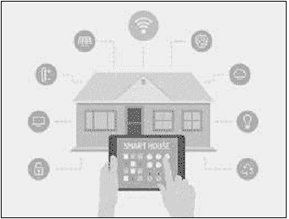**图 (1))**

智能家居-通过单一界面控制所有家电。

2013 年，家庭自动化市场价值约为 57.7 亿美元，2020 年达到 128.1 亿美元[1]。智能家居系统的组成如下：

i) 通过传感器输入环境读数 – 烟雾传感器、湿度传感器、温度传感器，ii) 对火灾检测进行持续监视和传感器输入，视频监控镜头分析，iii) 自动控制功能 – 灯光、风扇、空调的自动控制，火灾时自动洒水系统，火灾警报，以及 iv) 人工智能和逻辑 – 智能安全机制。

### 1.1\. 背景

物联网是家庭自动化技术的支柱，因为这些物联网设备是智能家居概念的基本组成部分，包括照明、供暖、制冷、安全系统[2]。在“智能家居”中，物联网在节能方面有着重要的优势，*通过*自动控制灯光和其他电子设备，如在没有人在房间时自动关闭设备。工业 4.0、人工智能、云计算和物联网使设备、车辆、仪器之间能够互联，允许制造传感器以获取读数，传感器上的数据通过网络发送*到*云端，在那里执行 AI 逻辑做出智能决策和自动化智能家居的控制[3]。物联网扩展了传感器和执行器，成为一种数字物理系统，集成了智能家居、智能交通和智能城市。

### 1.2\. 动机

家庭自动化系统用于控制照明、气候和电气/电子设备。它还包括智能安全，如控制出入口和报警。连接到互联网的智能家居将家庭转化为物联网设备。

### 1.3\. 章节组织

本章的结构如下：第二部分探讨了智能家居的好处。随后的第三部分介绍了使用智能家居技术进行能源保护的前景，其后是对历史的讨论。第四部分描述了智能家的架构和系统。然后，第五部分包括了对 ZIGBEE 标准的应用，并在此处还讨论了其他执行选项。第六部分介绍了利用物联网保护文化遗产的应用。第七部分总结了本章以供未来研究参考。

## 2\. 智能家居的好处

智能家居技术的多重益处可以总结如下（如图所示：**2**）:

1.  从一个地方远程管理您家中所有设备带来便利，通过一个界面连接所有设备是技术和家庭管理方面的重大进步。

1.  这种创新技术对于新设备和机器同样具有灵活性。智能家居系统与新设备和其他技术的便利性极为适配。

1.  它最大限度地提高了家庭安全性。当安全和监控功能融入您的智能家居连接时，您的家庭安全性可以飞跃提升。家庭自动化系统可以将技术探测器、监控摄像头、数字门锁等出色的安全措施连接到您的整个家庭。

1.  智能家居增加了能源充裕。巧妙地利用智能家居进度，普通零件可以更具能源效率。比如，通过可编程的惊人室内控制器或灯光可以在你进入或离开房间时自动控制家庭的升温和降温。

1.  这种进步也使设备的功能性得到改善。智能家居可以帮助您更好地运行您的设备。一部智能电视将帮助您找到更好的应用程序和频道，以发现您最喜爱的节目。总的来说，家庭生活变得更加愉悦！

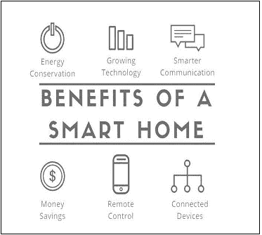**图（2）**

智能家居的好处。

## 3\. 智能家居与节能

智能家居技术的一个重要部分是减少家庭能源消耗并提高能源效率。智能家居提供了检测其能源消耗并做出生活方式改变以节省电力的灵活性[5^-7]。智能家居不仅提供高效能源管理的益处，还提供诸如改善生活方式、安全和健康等益处。智能计量、家用电器和家庭自动化设备是用于改变家庭用电模式的许多技术之一。

智能家庭和智能建筑在能源利用上比我们传统的建筑要更有效。引入智能家居技术对于减少能源消耗是合适的。文献中看到了远程传感器网络成功应用于智能家居技术。事实上，Wi-Fi 被发现更适用于远程监控和控制。智能家居实施智能来对环境参数和人类行为做出反应。

知识是针对家中居民的行为做出反应，并使家庭对他们更舒适。这种自动化系统包括收集有关电能使用情况的传感器。这些智能系统与云等处理设施相结合，并因此分析所收集的数据以找出规律。根据这些规律，用户可以自动化。它直接有助于降低成本，也有助于提高他们的生活水平。它涵盖了家庭应用，还涵盖了公共空间，如电子管理，医疗护理等少数例子包括乔治亚理工学院智能家园，地点实验室。到目前为止，智能家庭技术成功地收集了信息，并支持决策，使人们的生活方式更舒适、更安全，包括监控系统，用来捕捉气象参数，并检测警情（如果有的话），最终保护居民免受盗窃、失窃和自然灾害的损害。

### 3.1\. 看看这段旅程

智能家居系统的主要组成部分主要包括（暖通空调）供暖、通风与空调、照明控制或监控系统（包括存在模拟、触发警报和医疗警报）。通信标准包括 X10、Insteon、Zigbee 和 Z-Wave。迄今为止“智能家居”之旅的里程碑有：

+   1966 年，第一台“家用计算机”被设计为一种实验系统。

+   1975 年，X10 被开发用于远程设备之间的通信，使用电气线路进行传输。

+   在 1980 年代，智能家居项目作为住宅建筑商全国研究中心的一个项目启动[8]。

+   后来，引入了 GSM 技术，允许通过手机或互联网远程控制家庭及其设备。GSM 技术对于自动化和安全应用很有用。

+   作为结果，最终开发了三个利用短信服务的警报系统，即带有消息系统的家庭安全[9]、安全和控制系统，以及通过短信进行远程和安全控制[10]。

+   基于 GSM 技术[11]的系统是一种通过短信自动化家用电器的远程安全系统。

+   如今，建筑物或家居设计成装有智能风扇，利用传感器、物联网、无线传感传器和人工智能自动控制。

+   智能停车系统通过安装的闭路电视摄像头进行。人工智能自动扫描视频画面，实现了自动寻找停车位。

+   此外，一个可以控制能源消耗的智能家居系统能够区分人流和非活物。它能够将能源消耗降低 40%。

+   智能城市由相互连接的基础设施组成，通过通信和从连接的节点中收集数据来以更优化的方式运作。根据这一概念，新加坡的智能国家计划（新加坡国家发展局，2015 年）包括各种技术，以减少全国各地的能源消耗，并同时监测和从所有连接的消费者（如公司建筑和家庭（新加坡房屋与发展局，2014 年；IDA，2014 年））收集数据。

该计划旨在通过积极、智能地规划“智能城市”来提高能源效率，并产生一个舒适而安全的环境。这样的建筑物具有自动控制太阳能、水循环、LED 灯。使用传感器收集关于交通状况的数据，并用于自动化设备。

### 3.2\. 示例：智能系统

1.  医疗保健 - 老年人警报系统 [11]

1.  家庭能源管理系统 (HEMS) [12]

1.  智能计量系统 (SESAME) [13]

#### 3.2.1\. 医疗保健 - 老年人警报系统

它是一个精明的家庭，配备有自动化系统，连接到互联网，并提供医疗保健设施。老人警报系统通过使用传感器和运动检测器（如**3**图）帮助家庭监控老年人。

#### 3.2.2\. 家庭能源管理系统 (HEMS)

它是一个精明的系统（如**4**图所示），旨在帮助房主跟踪能源消耗和控制设备。新加坡能源管理局表示 HEMS 减少了 20%的能源消耗。

#### 3.2.3\. 智能计量系统 (SESAME)

SESAME 安排直接整合到家庭网络中，并允许系统像**5**图中显示的那样开启或关闭设备。该系统还能够检测温度、湿度或其他传感器的信号，因此根据指定的设计控制设备。

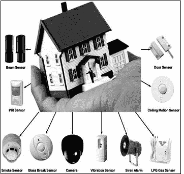**图(3))**

老年人警报系统。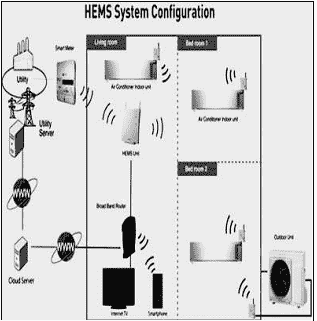**图(4))**

HEMS 系统样本。

物联网（IoT）概念是朝着为智能家居开发更多集成解决方案的大步迈进。简而言之，智能技术导致舒适和自动化环境，专注于提高能源效率。当智能设备、智能家居和智能电网集成时，降低能耗的智能技术具有强大影响[14]。

## 4\. 智能家居环境的架构和框架

当需要多个异构设备在智能家居环境（SHE）中以协作方式共同执行时，标准框架是理想的选择，以节省能源。在 SHE 中，需要能源高效架构来分析习惯模式和环境因素，以自动化智能家居设备。它将在开发为孤立运行的异构设备之间带来互操作性。该架构框架基于图中的中心化模型（6）。

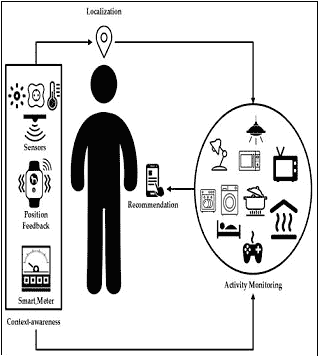**图（5）**

样本 SESAME 系统。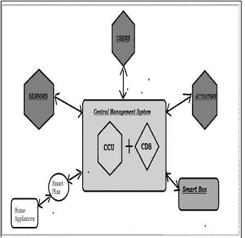**图（6）**

智能家居环境-架构框架。

这个中心化框架的核心是‘中央智能管理系统’。这个中央管理系统由两个子组件组成 - 中央控制单元（CCU）和中央专用软件（CDS）。CCU 负责数据聚合和决策核心组件。它处理系统内的所有实体。它负责所有实时信息处理，并允许决策支持。它还执行算法来预测 SHE 中的能源消耗，同时在降低能源消耗方面起关键作用。

该架构的各个组件间的通信通过特定的外围设备来保证。例如- CMS 与家用电器（如冰箱）之间的通信。这种特定的外围设备称为‘智能插头’。它之所以被称为智能插头，是因为它为普通设备增加了智能，并将其置于连接网络（互联网）上。智能插头还在设备上运行能源控制任务。它可以监视能源利用设计以及设备状态。‘智能盒子’强制实施额外的能源控制功能。这些设备能够监控设备并控制设备的激活和停用。该架构有一个重要的组件称为‘UI’，允许通过专用的 Web 应用程序以及移动应用程序与用户互动。

### 4.1\. SHE 中 CMS 的数据流和管理

该架构包括一组传感器来收集数据、智能插座和智能盒来运行智能逻辑。在这样的环境中，通过系统传输的数据和信息量是巨大的，需要一个适当的数据库和管理系统来充分利用可用信息和互操作性（如图（**7**）所示）。

这些信息的理由是管理框架必须处理从信息收集到信息解释再到决策的数据流。通过信息管理系统的信息有效利用，有助于实现降低能耗和提高智能家居舒适度的目标。实际上，从用户的角度来看，这样的管理系统非常吸引人。

CMS 是一个中间件，通过与智能家居环境的关联（如智能盒、智能配件、传感器、执行器等）收集信息。信息采集后，将存储在信息保险库中。从这个存档中，获取和处理信息以决定设备的激活/终止、评估居民的能源利用模式、监视等。

信息管理系统是整个设计的核心，用于吸收导致智能家居整体智慧的信息。预测模型也很重要，可以预测能源需求并自动安排能效设备。

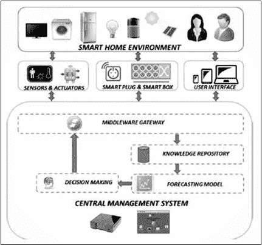**图（7）**

信息流通过框架。

建筑框架和知识管理系统有助于能源高效的智能环境，其中异构多个设备能够互操作和协作，以节省能耗并自动化整个环境，使其根据收集的数据和解释自动定制。这一中心模型对于实施能源高效的智能环境是非常有用和有效的。

## 5\. 使用 Zigbee 实施智能家居

本部分介绍了使用 Zigbee 的智能家居应用。目标是以低成本为智能家居提供能源管理。它提供对家庭设备的远程管理和控制。通过物联网的持续和稳定的监控，可以减少家庭的能耗。它允许根据能源需求重新安排居民的工作时间。它包括 PIR 传感器，以自动调节/关闭灯光，以节约能源。

### 5.1\. 智能家居控制系统

该系统包括 3 个重要模块：数据收集模块、通信模块和设备控制模块，如图（**8**）所示。

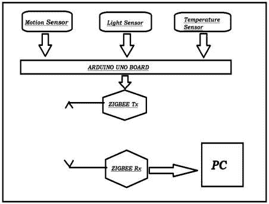**图（8）**

智能家居实施。

信息收集是通过无线传感器网络执行的。利用 Arduino Uno 收集的信息，通过 Zigbee 手持机发送到管理站。

管理模块解析收集到的数据，以检查家用电器的状态，并根据要求或环境因素监视和自动化它们。

除了根据收集的信息和观察的设计来控制机器之外，此方案还安装了 PIR 传感器（被动红外传感器）等运动传感器。它能够检测到房间内人的存在，并根据此自动打开灯光和风扇。当人离开房间时，它会自动关闭灯光和风扇。此外，光敏电阻器（LDR）连接到光线和黑暗的感应器上，用于自动调节照明。温度传感器用于检测温度信息，以自动打开/关闭风扇。该执行使用 3 个传感器来检测任何人的存在以及对光和风扇的需求状态。基于通过 Arduino 发送给中央控制器（计算机）的收集的数据来远程控制启动/停用。

### 5.2\. 两个主要功能

#### 5.2.1\. 灯光控制框架

该系统执行两个功能- 1）检测房间内光的可用性和 2）检测人类在房间内的活动。为了实现这些功能，分别在系统中嵌入了光敏电阻器（LDR）和 PIR 传感器（分别显示在图中（**9**））。这个控制系统根据光的不可用性和人类的活动情况自动打开灯光，反之亦然。因此，根据房间内灯光的需求，该控制系统执行自动开关灯光的操作。

#### 5.2.2\. 风扇控制框架

该系统执行两个功能- 1）检测房间温度和 2）检测房间内人类的运动。为了执行这两个功能，它利用传感器来感知温度读数和 PIR 传感器来检测运动。当温度高且房间内有活动时，它会打开风扇，反之亦然。这种自动化控制能够处理能源的过度消耗，特别是能源的浪费。

整个系统致力于根据需要自动开启灯光/风扇。这使得在设备不再需要时，立即关闭它们。因此，同时最大程度地减少了能源的浪费。

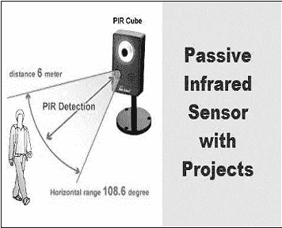**图（9）**

PIR 传感器检测。

这一部分实际上展示了利用 WSN 感知数据为智能家居自动照明的实施。它利用了 WSN 和被动红外传感器的优势。通过消除不必要的能源浪费，它减少了能源消耗。它是可扩展的实施，因为它可以轻松扩展，并且可以应用于智能建筑[16]。

## 6\.文化遗产保护-能源保护物联网的应用

文化遗产描绘了国家和地区的本土文化，这些文化通过艺术作品、语言或建筑物来代表。CH 需要为后代保留，因为它携带了一代又一代的内在属性、价值观、道德和特征。如果它受到破坏，它可能会造成无法修复的严重损失。CH 是一个巨大的资源，因为它以文物和本土文化为特色，吸引游客。选择特定旅游目的地的动力是其内在特性，包括文物、博物馆、展览、历史村庄等的艺术和文化遗产。艺术品的保护是特别关注的问题，因为时间会导致文物自然破坏，而 CH 需要得到保护。随着时间推移，气候、人为因素、天气条件等外部因素，以及材料等内部原因，对文物产生不利影响并造成损害。

目标是通过实施物联网概念，以保护受管理机构完全控制的 CH 为目的提供稳定的环境。所实现的受控情景是智能家居概念。它提供了文化遗产得到持续监督和规范的环境。

对于一些易于氧化或对光敏感的建筑物、地标或艺术品来说，需要受到完全控制的稳定环境。

适当地监控和控制气候，包括温度和湿度，是建立这种受控环境所必需的。这样的气候控制系统需要传感器记录有关气候条件的数据，以及微控制器控制文物周围的条件。物联网架构的帮助下，有助于评估艺术品的损坏风险。这种网络安排对于定期检查很有帮助，累积数据记录有助于预测和处理事故。远程监控和在线控制可保护和维护艺术品。它减少了破坏、盗窃或意外损坏的风险。

处理 CH 的 IoT 涉及艺术品作为需要保存的“东西”。第一步是安装传感器节点以收集实时数据和网关以将数据传输到云端。整个设置允许在线、实时、持续地监控和监督特定的 CH。云提供了对收集和分析数据的便捷访问，提高了艺术品的安全性。

通过传感器收集的信息对馆长和相关部门发现最危险的风险及其因素非常重要。之后，确定最危险的恶化情况，可以制定战略计划，并实施后续行动。UPV 已经启动了一个利用 IoT 进行 CH 保护的跨学科项目，其中包括艺术修复专家、气候监测、统计学、无线通信、云工程师等。[17^-19].

对于特定项目，遵循保护特定 CH 要求声明的第一步是设计特定的数据传输节点，必须能够以最低的维护成本监测气候，如图所示。(**10**)。在 IoT 实施中设计适当的节点是最关键的问题。它涵盖了通过考虑通信距离来最小化功耗。

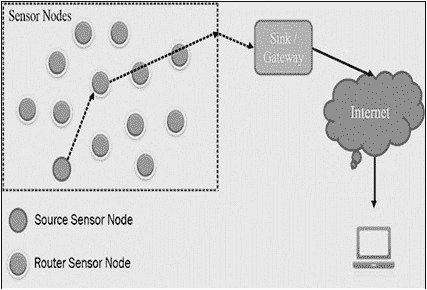**Fig. (10))**

使用传感器的 IoT 设计与网关. 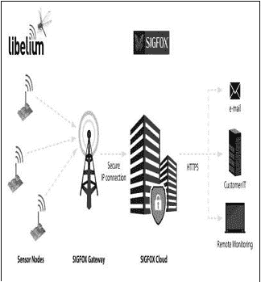**Fig. (11))**

Sigfox 实施样本。

到目前为止，还没有找到理想的用途，但可以与有效实施的原则进行比较。通过与先前存在的解决方案进行比较，可以改进新的应用。这些领域中的两个知名产品是-LoRa[20]和 Sigfox[21].

LoRa 和 Sigfox 是执行 WAN 的商业计划[22]，如图所示。(**11**)，与低功耗的传感器配合使用。在各种条件下评估了各种中继站以保存 CH。考虑到各种艺术形式，出现了涉及到供电和因特网连接的难题。例如，艺术品的展示可能在美术馆或城市里。许多场所都没有供电[23]（考古发掘，独立教堂等），如图所示。(**12**).

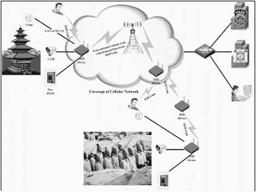**Fig. (12))**

保护不同情况下的 CH。

## 结论和未来展望

本章评估了监控大气、温度和湿度标准问题的节点的能量需求。结果表明，使用标准电池可以制造具有超过 10 年寿命的节点。这项工作设计了一个适合的云系统，以应对节点的监测需求。这项工作为此目的介绍了物联网架构。从艺术角度出发，给出了从数据采集、云处理到末端用户的数据可视化的要求。本项工作的结果集中于架构的最关键部分，即传感器节点。一种基于 LoRa 和 Sigfox 技术的解决方案被提出，以在艺术中产生最小的影响，实现超过 10 年的寿命。该解决方案将能够扩展处理和存储资源，无论是在公共云还是本地部署的云中，嵌入复杂的预测模型。这种技术组合可以适应未来不同类型的社会遗产环境。未来，机器学习和物联网[24, 25]可以结合起来自动化决策。分类技术[26, 27, 28]可以被纳入以扩展当前项目。

## 发表同意书

不适用。

## 利益冲突

作者声明没有利益冲突，无论是金融方面的还是其他方面的。

## 致谢

声明无。

## 参考文献

|  |  |
| --- | --- |
| [1] | Research and markets: 全球家庭自动化和控制市场 2014-2020 - 照明控制、安全和通道控制、HVAC 控制对 5.77 亿美元行业的分析。路透社 2019 年，原始发布于 2016-05-05。 |
| [2] | Hamdan O., Shanableh H., Zaki I., A. R. Al-Ali, Shanableh Tamer. 基于物联网的交互式双模智能家居自动化。2019 年 IEEE 消费电子国际会议（ICCE）拉斯维加斯 IEEE201912 |
| [3] | Zhu N., Anagnostopoulos A., Chatzigiannakis I.。挖掘物联网数据评估公共教育建筑的运行。无处不在的计算和通信研讨会（PerCom Workshops）2018 年 IEEE 国际会议 201827828310.1109/PERCOMW.2018.8480226 |
| [4] | Prathik M., Anitha K., Anitha V.。使用物联网监控智能能源表。2018 年国际电力、能源、控制和传输系统会议（ICPECTS）201818618910.1109/ICPECTS.2018.8521650 |
| [5] | Karthikeyan S., Bhuvaneswari P.T.V.。“基于物联网的实时住宅能源表监控系统”，2017 年工业测量和自动化趋势。金奈 TIMA201715 |
| [6] | Mustapha Hafiz Bola E.N.。建筑物中利用物联网进行高效能源管理-调查。电子计算机和计算（ICECCO）2019 年第 15 届国际会议 201916 |
| [7] | Aldossari M.Q., Sidorova A.。消费者对物联网（IoT）的接受：智能家庭背景。计算机信息系统杂志。201811110.1080/08874417.2018.1543000 |
| [8] | Sarode C.. 智能家居监控系统国际工程研究与应用（IJERA）ISSN：2248-962220133114461450 |
| [9] | Zungeru A.M., Edu U.V., Garba A.J.. 基于短信服务的远程控制器设计与实施 计算机工程和智能系统 ISSN 2222-1719（纸质版）ISSN 2222-2863（在线版）201234 |
| [10] | Raghavendran G.. 短信基础家用电器控制系统。2011 年国际生命科学与技术会议 IPCBEE32011IACSIT Press 新加坡 |
| [11] | Chetana Sarode H.S.. 智能家居监控系统国际工程研究与应用（IJERA）ISSN：2248-962220133114461450 |
| [12] | Agarwal S., Satyanarain R., 吉 T.F., Vollmer D.. 施工活动对新加坡公共住房楼宇的居民用电消耗的影响：证据来自能源经济学。能源经济学.201610.1016/j.eneco.2016.01.010 |
| [13] | 芬塞尔 A., Kumar V., Tomic S.D.K.. 最终用户界面节能高效语义智能家居。能源效率。20147465567510.1007/s12053-013-9246-2 |
| [14] | Hamernik P., Tanuska P.. 智能家居功能分类。信息教育技术国际杂志。20122214915510.7763/IJIET.2012.V2.98 |
| [15] | Molitor C.,等人。 - 多物理测试床用于智能家居可再生能源系统,‖。IEEE Trans. Ind. Electron.20136031235124810.1109/TIE.2012.2190254 |
| [16] | 韩 D.M., 林 J.H.. - 使用 IEEE 802.15.4 和 Zigbee 的智能家居能源管理系统,‖。IEEE Trans. Consum. Electron.20105631403141010.1109/TCE.2010.5606276 |
| [17] | 卡姆夫 D.. 文化遗产的微气候.爱思维尔 1998 年 |
| [18] | Merello P., 加西亚-迪艾戈 F-J., Zarzo M.. 阿里亚德妮之家（意大利庞贝）壁画的预防性保存的微气候监测。化学中心杂志 20126114510.1186/1752-153X-6-14523190798 |
| [19] | Merello P., 加西亚-迪艾戈 F-J., Zarzo M.. 评估阿里亚德妮之家（意大利庞贝）壁画预防性保存的纠正措施。化学中心杂志 2013718710.1186/1752-153X-7-8723683173 |
| [20] | LoRaLora Alliance2017 [`www.lora-alliance.org/`](https://www.lora-alliance.org/) |
| [21] | Sigfox S.I.G.F.O.X.. 2017 年物联网的全球通信服务提供商（Iot）[`www.sigfox.com/en`](https://www.sigfox.com/en) |
| [22] | 加西亚-迪艾戈 F-J., Verticchio E., Beltrán P., Siani A.M.. 在博物馆建筑物的微气候现场调查中避免测量冗余所需的最低采样频率评估。传感器（巴塞尔）2016168E129110.3390/s1608129127537886 |
| [23] | 斯托杰斯卡 B.L.R., 特里佛达利耶夫 K.V.. 智能家居的物联网综述：挑战与解决方案。清洁生产期刊.20171401454146410.1016/j.jclepro.2016.10.006 |
| [24] | 戈亚尔 S., 帕拉沙尔 A., 肖特里亚 A.. 并行计算系列的进展 20182923626610.3233/978-1-61499-814-3-236 |
| [25] | Goyal S., Bhatia P.K., Parashar A.. 云辅助的物联网烟雾监测系统（e-Nose）利用机器学习技术。《智能系统和物联网：计算创新》。新加坡 Springer 2020 年第 141 页 743-754 |
| [26] | Goyal S., Bhatia P.K.. 比较软件质量预测的机器学习技术 《知识与系统科学国际期刊（IJKSS）》2020 年 11221 140 IGI Global 10.4018/IJKSS.2020040102 |
| [27] | Goyal S., Bhatia P.K.. 使用机器学习技术进行软件质量预测。《计算智能和计算机视觉创新》。《智能系统与计算进展》。新加坡 Springer 2021 年 118 页 955-1560 |
| [28] | Goyal S.. 用于软件缺陷预测的异构堆叠集成分类器。2020 年第六届并行、分布式和网格计算国际会议（PDGC）2020 年 126 页 10.1109/PDGC50313.2020.9315754 |
