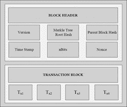
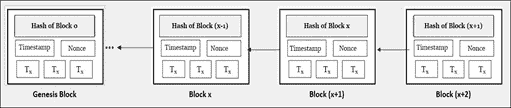
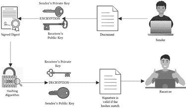
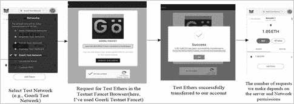
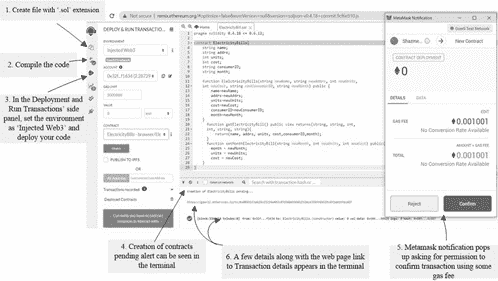
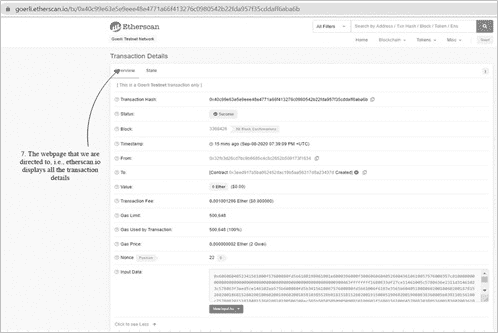

# 区块链：概念与出现

**沙兹明·沙姆西^(1)****,** **莫哈末·M·哈克^(2)****,** **苏希尔·库马^(3)****,** **贾韦德·艾哈迈德^(4)****,** **莫哈末·苏菲安·巴达^(4, 5, *)**

¹ 新德里印度真纳伊斯兰大学计算机科学系

² 雅瓦哈拉尔尼赫鲁大学计算机与系统科学学院，印度新德里

³ 新德里印度哈姆达德大学计算机科学系

加利福尼亚大学生物工程系，加利福尼亚大学河滨分校，美国

印度比哈尔邦达尔班加 Salfia Paramedical Institute, SPI Darbhanga, Bihar 846001

## 摘要

人工智能（AI）、机器学习（ML）、物联网（IoT）是技术范式的不可思议的实例，它们为通信、互联网和数字领域带来了革命性变化，融为一体，并引发了人类社会生活方式的巨大转变。但个人的隐私问题只有通过巧妙的当代技术——区块链——才能得到可信赖和透明的解决。区块链是一种使用点对点、分布式网络进行的分布式账本技术，可以形成一个不断增长、时间戳记录的数字账本。它是去中心化的，意味着不能由中央权威机构控制。它具有诸多优势，如透明度、不可变性、去中心化，并且可以被应用于几乎每个社会领域，以增加正在进行的交易的安全性。本章主要关注区块链的概念，旨在全面调查其优势和应用，并突出未来前景，因为尽管今天它如此流行，但这项技术仍处于起步阶段。

**关键词：** AI, 人工智能, 区块链, 去中心化, 分布式账本技术, 不可变性, 物联网, 机器学习, 透明度。

* * *

^* **通讯作者莫哈末·苏菲安·巴达：** 加利福尼亚大学河滨分校生物工程系，美国加利福尼亚，河滨；电话：+13182783121；电子邮箱：msbadar@engr.ucr.edu，director_academic@salfiainstitute.edu.in

## 1\. 序言

“区块链革命的潜力大于我们历史上看到的任何事物。它比互联网革命还要大，改变了社会结构。” ——帕特里克·伯恩

Overstock.com 的首席执行官兼创始人帕特里克·伯恩（Patrick Byrne）的上述言论正如他说的一样恰当。今天，区块链技术正席卷全球。这项技术所引起的巨大关注和炒作吸引了大量研究人员和科学家的注意，最终将开创一场新革命的黎明。本章旨在向读者简要但清晰地介绍这项技术的重要方面。

人类的终极目标是通过科技的发展和演变，实现生活方式的绝对现代化，从而达到最高程度的舒适。只有通过科学技术的发展和演变，我们才能获得大量极其有用的应用程序，从而使我们的生活变得轻松。我们目前生活在一个世界正在快速变化的时代，在这个时代，大众不断向当代技术转变。这些创新影响了每个行业，无论是商业、医疗保健、能源、金融市场等，甚至最近，这些技术已经触及到我们的家庭的舒适，并影响了我们的生活和社交方式[1]。在这个由科技驱动的世界中，一切都是有代价的。我们生活在一个逐渐从现金向无现金支付过渡的时代。电子现金或 E-Cash，就是现金的数字形式，使得在互联网上进行轻松、无忧的资金交易成为可能。这一发明本身就是一项值得称赞的成就，在像 Covid-19 这样的大流行病期间，它的重要性是不言而喻的。但是网络犯罪分子凭借他们的犯罪天赋，总是随时准备通过侵犯交易数据来获利。涉及第三方的安全在线交易也并不总是可信的。更不用说网络犯罪分子和私人第三方，我们经常看到大多数发展中国家的经济增长和发展往往受到滥用权力满足他们对金钱利益的贪婪的贪婪政府官员的妨碍。区块链技术最早在 2008 年随着比特币的出现而进入人们的视野，承诺在互联网上实现去中心化和安全的交易，是解决这些问题的成功尝试。

区块链是一项神奇的技术，几乎可以与当今所有其他技术结合使用，从而增加它们的利益，并确保它们的安全可靠。它是一种分布式账本技术，按照时间顺序记录和维护交易，发生在点对点的规模上，其中每个节点基本上都维护着交易的副本。值得注意的是‘没有第三方参与’，只有在至少 51%的参与者投赞成票时，才会验证新区块的添加，否则将会被拒绝。现在你一定在想，什么是区块？它们可以简单地理解为记录簿的页面，不断记录最新的交易。一旦一个区块用尽了内存（将其想象为记录充满了的页面），就需要生成一个新的区块，需要对其进行最终验证和生成。

区块链是一项革命性的技术，随着加密货币比特币的出现，它开始进入实际应用领域，引起了人们的极大兴奋，并引起研究者的广泛关注。学习它将帮助我们与当今最需求的技能保持同步。我们都需要理解这项革命性技术的真正潜力，以便充分利用它。它预期将重塑工业趋势，并导致从基于纸质/非安全的在线交易向安全、保护隐私、不可变的电子交易转变。

本章将为你提供有关区块链技术的基本概念。每个话题都以详细但简洁的方式解释。作者们尝试通过引入关于智能合约部署的实际操作来增加读者对这一主题的兴趣。希望在读者中形成对这一超前于时代的不可思议技术的清晰理解。

在接下来的章节中，我们将首先学习这项技术产生需求的原因，然后是它的历史。我们接下来将介绍每个区块链网络中必要的不同要素。然后，我们将学习其特性，从而理解这项技术为何在当今世界变得极为重要。接下来，我们将研究与这个主题相关的类型、工作原理、应用、优势和挑战。

## 2\. 区块链技术的需求

这种技术的需求起源于 2008 年国际银行危机，导致了投资的崩溃。比特币加密货币是这种技术的第一个实际例子，带来了许多优势，如效率、成本效益、可靠性，以及用于创建和记录金融交易的隐私保护安全系统。随着人口不断增加和城市化，进行的交易数量呈指数增长，并且据推测会影响当前系统的复杂性、效率和成本，并进而增加其脆弱性[3]。目前的数字交易依赖于可信赖的第三方来实现其目标。这些第三方是否可信赖是一个重大问题。尽管一些中央机构遵循严格的协议来保护交易的隐私和安全，甚至提供保证书，但研究表明，这些技术并非完全可靠。例如，SSL 证书可以确保我们处于安全的网站上，但这些证书也曾被偷窃，包括微软、Twitter、Facebook 和中央情报局（CIA）的一些知名域。

此外，在一切都可以通过点击鼠标来完成的今天，我们需要一种高效、快速且同时负担得起的技术。区块链正是解决这个问题的完美解决方案。人们不需要向银行或私人机构等第三方支付费用来维护他们的记录，因为数字分类账可以得到轻松和精确的监控，这是由于区块链架构的点对点、分布式和去中心化特性所决定的。世界需要像区块链这样的技术，它提供了一个安全的平台进行交易，完全拥有和管理自己的财产，以及进行透明的交易。一旦数据存储在网络上，就无法更改或删除，这是由于其不可变性。这个极其重要的特性可以用来存储极其重要和私密的数据。这项技术还解决了另一个非常重要的问题——双重支付的问题。由于记录严格按时间顺序维护，人们可以轻松地跟踪花费的资金，并避免双花带来的问题和损失[4]。理解了它的需求，现在让我们详细了解这项技术。

## 3\.历史和演变

这个主题是在 2008 年 10 月 31 日首次出现的，当时发布了中本聪的《比特币：一种点对点的电子现金系统》白皮书[2]。 白皮书讨论了“一种点对点的电子现金”，它允许在线支付直接从一方发送到另一方，而无需涉及银行或其他金融机构。谈论比特币时不完整，比特币是区块链技术的第一个实际例子，它于 2009 年出现，是第一个开发的加密货币，也是这项技术最受欢迎的例子。它是一种创新的支付方式，引入了虚拟现金，是独一无二的。考虑到其设计，它只允许数字信息的交换和分发，并禁止修改。您必须记住，区块链和比特币不是同一件事。区块链是用于创建数字货币比特币的技术。让我们用一个例子来理解这一点。一部手机如果没有操作系统（OS）只是一个小金属物体。OS 为手机赋予了生命，它只是管理任务的软件，它的价值只能通过它能承载的应用程序来理解。考虑到这个例子，区块链类似于操作系统，比特币类似于它承载的应用程序。

到目前为止，已经出现了三代区块链，第四代正在演变中。让我们简要讨论一下各代区块链：

### 3.1\. 第一代/Blockchain 1.0

它们是记录交易的简单分类账，并建立在改进现有货币系统的基础上。第一代加密货币的例子包括比特币、莱特币等。所有这些加密货币都是使用 C++ 编写的，并将比特币源代码作为其基础。此外，它们使用工作量证明机制，这使得这些网络成本相当高，因为在这里涉及的挖矿需要大量电力。

### 3.2\. 第二代/Blockchain 2.0

它在 2015 年随着以太坊的推出而出现，具有更广泛的功能。在这一代中添加的最重要功能是智能合约，通过允许自动执行所有条件来使交易更安全。它是使用 Solidity 编程语言编写的，存在可扩展性问题。

### 3.3\. 第三代/Blockchain 3.0

它带来了更多的优势，比如更好的设计和更广泛的功能，并试图解决可扩展性问题。一些例子是卡尔达诺（Cardano）、Nano 等。与工作量证明不同，它包含了股权证明共识机制。

### 3.4\. 第四代/Blockchain 4.0

它尚未出现，但预计当人工智能遇上这项技术时，本代将会演变。考虑到快速的研究步伐和科学家们日益增长的兴趣，似乎离区块链 4.0 成为现实的日子并不遥远。

## 4\. 前言元素

本节介绍了区块链技术的通用元素。

### 4.1\. 交易

一个交易可以被定义为供应商与消费者之间将在现在或未来进行资产交换的协议。它是区块链的基本单位，表示通过从一个参与者向另一个参与者传输价值进行交换[5]。交易包括接收者、标识发送者的签名、用于执行交易的加密货币金额被带入行动的燃气价格（发送者每个计算步骤支付的费用）和燃气限额（交易被执行的最大步骤数）。在技术层面上，可以将交易定义为燃气价格和使用的燃气数量的乘积。

### 4.2\. 节点

节点这个术语指的是区块链平台的用户或参与者。他们构成了区块链基础设施的基本组成部分。当试图向链中添加新区块时，系统中的所有节点都会反映这一变化，然后根据交易的真实性，节点们可以共同接受或拒绝该提议。节点可以是在线或离线的。在线节点是网络中的活跃参与者，而离线节点需要通过下载其离线期间添加的新区块来跟上最新的进展。更新离线区块的过程称为同步化。

### 4.3\. 挖矿

这个过程是将交易添加到分布式公共分类账技术——区块链的过程，正是这个过程促进了网络中资产的安全交换。矿工是有能力进行挖掘的节点。他们必须解决一个密码难题来创建有效的区块，解决难题最快的矿工将获得将区块添加到网络链中的机会。他们在网络上广播他们的区块，然后需要从网络中的所有节点进行验证，无论他们是普通节点还是矿工。如果经过共识机制的投票被认为是有效的（这在本章的第 4.7 节中有解释），那么该区块将被添加到链上，否则将被拒绝。

### 4.4\. 区块

一个“区块”可以简单地定义为逻辑上捆绑在一起的交易集合。这些区块将被链接在一起，形成了区块链技术。

结构上，一个区块由区块头和区块体组成[6]。 区块头包括区块版本、Merkle 树根哈希、父区块哈希、时间戳、nBits、Nonce（仅限一次使用的数字），而区块体包括该区块中进行的所有交易。 区块头包括区块元数据，可以在图 (**1**) 中可视化，并可以从以下列表中更好地理解：

**图（1))**

区块的结构。

+   区块版本 – 它指的是区块结构的当前版本。

+   Merkle 树根哈希 - 包含区块中所有交易的加密哈希值。

+   父区块哈希 – 先前/父区块的哈希值，它总是链接到后继/子区块。

+   时间戳 - 区块创建的精确时间。

+   nBits – 它指的是目标值，*即*，区块头哈希必须低于此阈值才能使区块有效。

+   Nonce（“仅一次使用的数字”）- 添加到一个散列区块中的随机值，当重新散列时，符合困难的限制。

区块链中的每个区块都与其他两个区块链接在一起- 其中一个是它的父区块，另一个是它的子区块。 应记住，一个子区块只能有一个父区块，一个父区块只能有一个子区块，如图所示 (**2**）。

**图（2))**

不同区块如何链接在一起。

添加到区块链网络中的第一个区块称为“创世区块”。

**区块类型：**

+   主链区块- 他们延伸了网络中最长的链，*即*，主区块链。

+   旁支区块- 尽管它们目前在实际中不存在，但由于交易速率增加，它们有望很快作为主链的旁支的一部分合并。

+   孤立区块- 指向处理节点未知的父区块的区块。

### 4.5\. 散列

哈希是将简单整数和字符串的输入转换为复杂、不可解密的加密输出的过程，使用复杂的数学算法。任何长度的输入哈希始终产生固定长度的输出，这使得几乎不可能猜测原始单词。它是一种‘单向函数’，不可能被破解。那么它如何帮助检查消息的真实性呢？让我们通过一个例子来理解这一点。假设你想要下载一些非常机密的重要官方文件。为此，你将需要该文件的哈希值和发送方的数字签名，而数字签名本身也会被哈希处理。文件消息被加密并变得无法通过哈希算法解密。它们充当了一个防止被追踪的陷阱门函数。接收者使用相同的哈希函数和签名解密消息，并比较两个哈希值。如果产生相同的哈希值，那么可以说文件和签名都是真实的。有许多算法可以实现此目的，如安全哈希算法（SHA）的不同版本——SHA1、SHA 224、SHA256、SHA512，*等*，消息摘要算法（MD）——MD2、MD4、MD5，Keccak——Keccak-256，Keccak 512，*等*，以及带有版本 128 和 256 的 Shake（安全哈希算法和 KECCAK）。Shake 在输出长度方面有所不同。

让我们看看每个算法是如何对相同的单词产生不同的输出的。假设单词是“Abracadabra”，下表**1**显示了使用众多不同算法的对应哈希值。

Table 1 **显示了使用不同哈希算法为相同消息生成不同哈希值的示例。**

| **Algorithm Used** | **Message hash for “Abracadabra”** |
| --- | --- |
| *SHA256* | 46abe7c8d7f5033272383a4a2483ca72ca35c6bf7d8b4b9d60eee94fd7aebce2 |
| *SHA512* | e31635ff8390c8df27ea5ecd810a73c92ba62a399fafe52b78467abf21d9e4adaf833 31238905f491bdcc1d7bfddf4d89074b4599638d4504c4eedfde45c62a9 |
| *MD5* | 53a5e9533a3a2dd2685f4f112b82379a |
| *Keccak-256* | cdbeda58b615b3bbdc510ac7b6aa14e618709a6c994e062e5e34e37e5992ab7a |
| *Shake-256* | abb7c5ab0ddcc178933e95cd40466fd2f6f7190ad1bdcb72e59e8fe447972f94da727056749cc535d94fead6a0ba697184427fd1fcf31ed5ef65e927ef943d00 |

两个消息的哈希值总是不同的。因此，哈希保障了参与者的隐私，确保消息仅安全传输给特定接收者。

### 4.6\. 数字签名

要进行交易的数据必须使用数字签名进行保护，以确保数据不会被篡改。使用数字签名的目的是将签署者与即将发送的消息绑定在一起。为此，参与者使用加密技术，可以是公钥加密或私钥加密。数字签名是手写签名的数字对应物，理想情况下应该是攻击者无法伪造的。让我们来了解一下数字签名是如何工作的。为了签署文档，发送方使用两个相互认证的密钥，即发送方的私钥和接收方的公钥。所使用的数学算法就像密码一样，它对数据进行加密并创建消息的哈希。只有正确的接收者才能使用他的私钥和发送者的公钥解码文档。如果在签名后文档发生任何更改，数字签名就会失效。有几种数字签名算法可供选择。

下图（**3**）显示了区块链平台中安全数据传输的流程图。

### 4.7\. 共识

这是区块链架构的重要部分，被用于验证和验证区块链中的交易和区块的过程称为共识。它遵循一套自我强制的规则，每个网络参与者都必须遵守，从而有助于维护链中的节点的完整性和同步性[7]。它还确保交易的一组相同和更新的副本在参与者之间进行分发。它的优点在于它提供了网络中的安全、隐私和透明度。以下是一些共识算法：

+   工作量证明（POW）-该算法背后的核心思想是解决一个复杂的数学难题，很容易得出一个解。实际上，这个数学问题需要大量的计算力。问题的解决方案应该是一个小于区块哈希的数字，而且最先解决这个难题的矿工将以加密货币的形式得到一些奖励。以太坊、莱特币、狗狗币是使用该算法的少数加密货币。

+   权益证明（POS）-该算法的本质与 POW 相同，但方法不同。这里，不是矿工，而是‘验证者’，他们在他们认为将被加入区块链的区块上下注。根据添加到区块链中的区块，他们的奖励与他们的投资成比例，他们的权益增加值。

+   委托权益证明（DPoS）-其主要思想是参与者抵押自己的一部分代币，并代表他们选举代表。每名代表的权重取决于他们做出的投资。因此，它是一种最快的共识算法之一。

+   实用拜占庭容错（PBFT）- 该算法的基本思想是，根据分类帐的状态，即使存在一些错误的节点或几个节点未响应时，算法也能正常工作。Hyperledger Fabric、Tendermint、Zilliqa 是使用该算法的几个平台[8, 9]。

+   活动证明（PoA）- 这是一种高效节能且快速的算法，它采用混合方法结合 PoW 和 PoS 算法。在这里，验证者或经过验证的账户负责确保区块的正确性。

+   容量证明（PoC）- 这也被称为空间证明，类似于工作量证明算法，其中 PoW 的计算类似于 PoC 中的存储。解决复杂数学问题的方案被积累在用于生成区块的存储中，最快计算出解的人有更好的机会创建区块。

+   燃烧证明（PoB）- 在这种算法中，参与者不是支付金钱，而是将他们的币/加密货币发送到一个地址，无法再检索。他们燃烧的加密货币数量越多，他们下一个区块的机会就越大。

+   经过时间证明（PoET）- 它通过为每个参与者生成随机休眠时间，参与节点在此期间进入休眠模式。如果一个特定节点在唤醒或变为活跃时有一个区块可用，那么该参与者被视为幸运赢家，并有机会向区块链提交新区块。

**图（3))**

区块链是如何工作的？

下面给出的表格 **2** 展示了上述不同共识算法之间的比较。

表 2 **不同共识算法的表格比较。**

| **共识算法** | **节点身份管理** | **节能** | **对抗容错能力** | **区块链类型** | **交易速率** | **例子** |
| --- | --- | --- | --- | --- | --- | --- |
| PoW | 公开 | 高 | <25% 的计算能力 | 无许可 | 低 | 比特币，莱特币，以太坊（至 2018 年） |
| PoS | 公开 | 中等 | <51% 的股权 | 两者兼具 | 高 | 以太坊（自 2018 年以来） |
| DPoS | 公开 | 低 | <51% 的验证者 | 两者兼具 | 中等 | Lisk, Bitshares, Waykichain, Steem |
| PBFT | 许可 | 高 | <33.3% 的错误副本 | 许可 | 高 | Hyperledger Fabric |
| PoA | 公开 | 高 | <25% 的计算能力 | 许可 | 中等 | Microsoft Azure, Decred |
| PoC | 公开 | 中等 | <25% 的计算能力 | 无许可 | 中等 | SpaceMint, BurstCoin, Chia |
| Tendermint | 许可 | 高 | <33.3% 的拜占庭投票权 | 许可 | 高 | Tendermint |
| 瑞波 | 公开 | 高 | <20% 的错误节点 | 两者兼具 | 高 | 瑞波 |
| PoB | 公开 | 高 | <51% 的股权 | 无许可 | 中等 | SlimCoin |
| PoET | 公开 | 低 | <25% 的计算能力 | 两者兼具 | 中等 | Hyperledger Sawtooth |

### 4.8\. 智能合约

我们都知道，合同是双方之间的法律约束关系。智能合约是指存储在区块链网络上的一段代码，当满足特定条件时将自动执行。通俗地说，它们是在区块链中编码的自动执行脚本，用于数字验证和实施参与者之间的合约，并最终帮助转移数字资产[10]。智能合约最初是由以太坊引入的，并使用 Solidity 编程语言编写。有许多可用于编写智能合约的工具，但基于 Web 的工具 Remix 是最方便的。

让我们通过在以太坊测试网络上创建和部署智能合约来快速进行一项有趣的活动。为此，我们首先需要下载 MetaMask 的浏览器扩展程序。MetaMask 是一个浏览器插件，既可以作为以太坊浏览器，又可以作为钱包。下载完成后，我们需要创建一个钱包。我们可以选择任何一个可用的测试网络，在我们的钱包中获得一些虚拟以太币，因为部署智能合约是需要付费的（以太是以太坊的加密货币）。为此，我们需要选择一个测试网络，如图所示。 (我选择了 Goerli 测试网络，因为在该网络上获得测试以太币相对容易，但您也可以选择任何其他测试网络) 并打开该网络的测试网水龙头浏览器。通过提供我们的账户地址，我们可以请求他们给我们一些测试以太币。

做完这些后，我们将打开 remix.ethereum.org 网页，并使用 solidity 语言创建我们的合同。让我们为电费创建一个智能合约。为此，我们将创建一个新的文件，文件名使用‘.sol’扩展名，并按照图（5）和（6）中所示的步骤进行操作。

**图（4）**

使用测试网水龙头在 MetaMask 钱包中获取测试以太币的步骤。**图（5）**

部署 Remix IDE 测试智能合约的步骤

## 5\. 特性

### 5.1\. 分布式

它是一种分布式技术，允许数据/交易在整个链中进行同步和共享，而不是被复制或转移。需要理解的是，由于没有单一的数据存储仓库，交易分布在所有实体之间，记录/货币永远不会被黑客入侵或盗窃。这也通过在网络上的许多计算机之间分布计算能力，避免了对单个服务器的负载。优点：

+   由于分布式计算能力，产生更好更高效的结果

+   所有成员的所有权得到了保证，因为他们积极参与了所有的交易。

+   由于每笔交易的副本都存储在所有节点上，篡改数据是不可能的，因为任何欺诈活动都可以轻松被检测到。

**图（6）**

Etherscan Network 中的交易详情。

### 5.2\. 去中心化

这意味着不需要管理数据和交易的管理机构或第三方。这意味着它是一种开放的分类账技术，并确保所有参与区块链的成员之间完整性，因为链中的每个实体都有相同的分类账副本。由于这一特性，用户始终保持高度活跃、警惕并始终了解所有发生的交易[11]。列举这些功能的一些优点：

+   不需要第三方显著提高了交易过程的速度

+   用户每个人都拥有数据的一份副本，因此数据永远不会丢失。

+   交易成本低

+   不可能发生欺诈行为

注意：上述两个术语在上下文中可能看起来相似，但实际上它们非常不同。去中心化涉及到控制水平和决策授权所共享的程度，而分布式网络则是指用户位置的差异。在去中心化网络中，决策是基于所有节点的投票来做出的。如前所述，如果至少 51%的参与者投票赞成某事，那么该行动就会执行，否则会被拒绝。但在分布式系统中，处理由所有参与者共享，但可能允许决策完全由中央机构做出。区块链结合了这两个特性。

### 5.3\. 不可变

添加到区块中的数据永远不会更改，因为它会永久存储在区块链网络上。这意味着首次添加到比特币网络的数据在其创建时仍然安全可靠，并且可以轻松访问。数据库与此功能的不同之处在于数据库允许我们更新和删除存储在其网络上的数据，除了创建和添加数据。但是，在区块链中并非如此。尽管它允许我们创建和添加数据，但无法更新和删除。这增加了其安全性，因为自第一天起的交易记录就是凭证，任何试图篡改数据的尝试都会落空。发送方和接收方都可以放心，他们的数据不会被干扰。

### 5.4\. 透明

在任何两个人之间添加单个区块或交易都会在所有区块上反映出来。因此，任何事情都对任何人是公开可见的，变化都是公开可见的。这是一个有利的特点。让我们理解一下。想象一下，一个欺诈参与者非法获取了网络访问权限，并假装是其他人。他根本无法进行任何交易，因为首先，它需要得到所有人的验证，其次，最重要的是，私钥是几乎不可能正确猜测的唯一密钥，在一种情况下，如果一个人尝试几把钥匙，所有这些尝试都会反映在所有区块上，他可以轻易被追踪。

### 5.5\. 点对点网络

区块链允许安全地在两方之间进行交易，而不需要任何第三方。每笔交易都通过某种加密算法进行数字签名。这样，只有真正的接收方才能在知道发送方的公钥和私钥的情况下解密代码。用于签名生成的散列算法非常重要，因为它们就像一个陷阱门，使它们几乎不可能被网络犯罪分子破解。

## 6\. 类型和平台

这项技术可以分为 3 种类型[12]：

### 6.1\. 公共区块链

正如名称所示，这种类型对一般公众开放，不被任何单一权威所拥有。任何人都可以参与决策制定的共识方法。所有参与者都被赋予平等的权威来通过遵循 51%的规则决定分类账的命运，根据 51%的规则，如果 51%的参与者投票赞成某个决定，例如，创建一个区块，那么它就被创建，否则，该提议被舍弃。每个用户都积极参与交易验证过程。用户可能会或可能不会因参与而获得奖励。为了清楚地理解这一点，想象一下你是公共区块链网络的一部分。有人的新交易请求出现在你的屏幕上。要验证它，你应该解决一些数学问题，如果你是第一个给出正确答案的人，你将以在线基于区块链的货币形式获得一些报酬。其他参与者给出的答案对决策制定同样重要，但他们并不总是受到奖励。这种类型的区块链可用于选举投票或维护加密货币。  

### 6.2\. 私有区块链

私有区块链，顾名思义，是私有的。可访问性和交易仅限于链中的成员。成员可能包括组织或一些共享个人数据的个人。数据管理的权限受到严格监控和控制。这种类型的区块链可能用于某些私人银行，或特定公司用于维护他们的业务记录，或大学用于维护它的学生、员工、官方文件*等*的记录。一般公众无法访问。平台包括 R3 Corda，Ripple

### 6.3\. 联盟区块链

它也被称为半私有或混合区块链，同时结合了公共和私有区块链网络。它可以被视为半去中心化网络。它可以托管在一个私有网络上，其中少数节点可以形成一个公共区块链，以便将其稳定性、安全性和验证的最佳特性纳入其中。例如，这种区块链可以用于存储移动公司的数据，其中对公众只授予只读权限，但对少数选定的员工提供读写访问权限。一些著名的平台有超级账本、MultiChain，*等*。

以下为表格 **3** 简要比较了三种类型的区块链：

表 3 **比较三种类型的区块链。**

| **属性** | **公共区块链** | **私有区块链** | **联盟区块链** |
| --- | --- | --- | --- |
| *访问* | 开放的 | 限于成员 | 部分开放 |
| *透明度* | 完全透明 | 仅对用户透明 | 取决于设定规则 |
| *去中心化* | 是 | 不是 | 部分 |
| *奖励* | 增长链的参与者获得奖励 | 未知奖励 | 可能会或可能不会奖励参与者（取决于设定规则） |
| *速度* | 相对较慢 | 更快 | 介于两者之间 |
| *效率* | 低 | 高 | 高 |
| *共识决定* | 所有矿工 | 选定的节点 | 一个权威 |
| *应用案例* | 几乎所有行业，如加密货币、供应链管理、股票市场等。 | 需要保持其数据私有或执行个人任务的组织 | 希望充分利用公共区块链的特性，但希望保持其信息完全私有的组织。 |
| *平台* | 比特币、以太坊 | Corda、瑞波 | 超级账本 |

## 7\. 它是如何工作的？

在学习了区块链的基本要素之后，我们现在知道账本中的所有记录都存储在由使用加密函数进行数字签名保护的区块中。区块是无形的和不可变的。只有当旧的区块用完内存时才会创建新的区块。在公共区块链中，当收到要将新数据添加到区块链的请求时，该请求会在网络中的所有节点上反映出来。如果根据共识规则批准了交易，则会通过添加时间戳来验证，并通过将其链接到上一个区块将其添加到区块链网络中。决定哪些节点将追加该区块非常关键，因为网络犯罪分子可能已经准备好并且有幸发起 51%的攻击。因此使用的共识算法的机制也变得极为重要。交易通过使用加密算法变得安全。下面列出了区块链交易被批准/执行的主要步骤：

+   第一步：交易请求在网络中的所有节点上反映出来。

+   第二步：共识机制被遵循以进行批准/拒绝。

+   第三步：交易被批准和验证。

+   第四步：区块添加到链中，交易完成。

## 8\. 应用、优势和挑战

### 8.1\. 应用

由于它的功能和能力可以在短时间内进行交易，区块链是一种几乎可以与所有现有技术融合的技术[13]. 它正在逐渐影响许多不同的领域，从而使它们的任务更加高效和安全。以下列出了一些应用：

1.  基于区块链的加密货币- 最著名的例子是比特币，其他加密货币如莱特币和以太币也正在发展中。这可以归因于该技术的分布式、去中心化、不可变性和透明性功能。中国央行数字货币电子支付（DCEP）于 2020 年 8 月 29 日推出，旨在通过提供无银行账户的匿名数字钱包来开发电子现金基础设施[14]。

1.  医疗数据的安全共享- 医疗保健是一个需要可靠的活动跟踪和完美保存记录的领域。在这一领域引入区块链技术将最大限度地发挥其潜力，并大幅改善医疗设施[15^-18]。

1.  在供应链管理中- 区块链被需要提供安全和完整的信息，并在成员之间保持适当的完整性，他们需要定期更新关于正在开发的产品的信息[19]。

1.  在商业应用中- 它可以节省时间和金钱，并确保每一步的进展都得到恰当的管理和安全监控[20]。

1.  在选举中- 在民主国家中，选举用于选举他们的领导人，区块链可以用来进行公平的选举，其中所有记录都容易地维护，并且选民的个人身份不会被透露[21]。

1.  存储个人文件的政府应用- 政府可以使用区块链平台来存储和交换人们的个人文件。在容易受到年度灾害如洪水影响的地方安全地存储这些文件是非常有帮助的，因为文件将永远安全存储，并且永远不会被篡改。

### 8.2\. 优势

已经在本章的第五部分中讨论过的区块链技术的特点也可以视为其优势。已经提到了一些优势。然而，如果你坐下来仔细思考，你会意识到这项正在重塑金融世界的技术还有许多其他优点。以下是一些其他优点：

1.  最大的优势是它通过使用加密哈希函数解决了用户的隐私和安全问题。

1.  真实交易：一旦输入的数据将不能被删除或篡改，并且每个区块都包含交易的永久时间戳。这使整个过程与任何其他过程一样真实，增加了安全性和隐私功能。

1.  速度更快，效率更高：由于整个系统是分散和分布的，不依赖于某个中央机构进行交易或数据存储，所以业务速度显著增加，效率提高。这也意味着一次交易所需的时间减少了，这是一个主要优势，因为最近时间有限。

1.  易于使用：我们简要了解了在网络中部署智能合约的方式，并看到了在这个平台上工作是多么容易。我们可以在任何时间和任何地点安全地进行交易，而不像金融机构那样有时间限制。

1.  记录改进和更好的可追溯性：由于每个区块包含元数据，包括区块版本、时间戳、Merkle 树根哈希、父区块哈希、比特和 Nonce（只使用一次的编号），即使生成 10 年前，跟踪它们也变得非常容易和无压力。自第一天创建以来，每个区块包括时间戳且完整无缺，永远无法删除或篡改，这表明记录都是按照时间顺序维护的。这个优势可以在医疗保健领域得到最好的利用，因为需要存储患者的病历记录。

1.  由于只有在使用共识协议进行最大信任验证的过程之后，交易才被添加到区块中，这消除了双重记账的风险，这可能导致发生双重支付。

### 8.3\. 挑战

在科技界对区块链技术仍然存在很多兴奋之情，而且这种兴奋情绪每天都在增长。毫无疑问，这项技术是 21 世纪最有影响力和最激动人心的技术，我们已经了解了这项技术的一些应用和优势。然而，由于它带来的一些挑战，这项技术仍然处于发展阶段，下面提到了其中一些挑战。

1.  可扩展性-这是尤其在公共区块链中需要尽快解决的最大挑战之一。存储需求已成为一个问题。让我们用比特币的例子来理解这一点。在比特币中，一个区块的大小受到了 1MB 的限制，一般情况下，每 10 分钟会挖出一个区块。此外，比特币网络的交易速度限制为每秒 7 笔，这无法处理高频交易。此外，更大的区块需要更多的存储空间和更慢的传播速度[22]。这可能导致转向能够维护如此庞大的交易链的集中网络。这造成了安全性与区块大小之间的权衡，这是一个主要问题[23, 24]。

1.  有限供应以增加需求- 将永远可用的比特币总数是 2100 万枚。预测最后一枚比特币将在大约 2140 年被挖掘出来，而到目前为止，我们已经开采了 1700 万枚比特币。

1.  能源消耗- 该技术使用工作量证明机制来正确验证交易并最终添加到网络中。这个过程需要大量的计算能力来在每个节点上反映交易、解决所需的用于处理和验证交易的复杂数学问题[25]。

1.  互操作性- 大多数区块链网络运作在孤岛上，并且无法与不属于它们的其他区块链网络交换信息。这可以视为大多数组织仍然不迈向这项技术的主要原因之一。尽管已经对解决这个问题做了努力，但这并没有帮助太多，这个问题仍然需要解决大部分。

1.  缺乏受过培训的专业人才是另一个挑战，但随着对这一主题的认识增加，这个问题正在逐渐得到解决。

## 未来展望

尽管该技术的先驱实施者是金融部门，但预计它将逐渐被许多其他行业采用。一些挑战需要解决，预计它将为在这一领域工作的科学家和研究人员铺平新机会的道路。人们预计，将这项技术与物联网、人工智能和机器学习等其他技术相结合，将带来全球不可思议的变化。此外，就区块链机制而言，目前没有标准化的规范，有成百上千种不同的区块链平台。因此，如果一家公司想要在他们的工作空间中应用这项技术，首先需要找出哪个平台最适合他们的需求。可以通过区块链测试来完成，特别强调测试不同参数以检查平台是否如开发人员所声称的那样运行[26, 27]。

## 结论

区块链技术可以被视为一种分布式的去中心化分类账技术，它是透明和不可变的，并且将记录以时间戳的方式存储为交易。它允许用户快速进行交易验证，而无需任何中央机构。尽管这项技术仍处于萌芽阶段，并且其最初的应用仅限于金融领域，从比特币的开发开始，并且正在慢慢渗透到所有其他领域，并具有潜力用其特性改变传统产业。当与其他技术（如物联网，人工智能和机器学习）结合使用时，它可以带来令人瞩目的变革，为人类生活的现代化增添亮点。通过了解了什么是区块链以及它的应用，优势，挑战和未来趋势，我们可以引用著名演员 Fred Ehrsam 的话结束本章：“尽管在早期可能看起来令人生畏，但我认为最终区块链会创造一个更安全的世界。”

## 出版许可

不适用。

## 利益冲突

作者声明不存在利益冲突，无论是财务上还是其他方面。

## 致谢

我们要感谢（SPI）Darbhanga 的 Salfia Paramedical Institute Darbhanga 的总监（行政），Syed Sharique Hussain 先生，director_admin@ salfiainstitute.edu.in，秘书，工程师 Syed Shahid Hasnain 先生，学术负责人 Dr. Aaliya Samreen，aaliyasamreen@gmail.com，SPI Darbhanga，招生负责人 Rana Kamal 女士，SPI Darbhanga，拉贾斯坦邦奇托加尔的梅瓦尔大学主席 Dr. Ashok Kumar Gadiya，印度比哈尔邦政府少数民族福利部联合秘书兼主任 Dr. A A A Faizi，尼泊尔加州警察局额外副局长 Kumar RanVijay Singh，印度也是，我还要感谢我们尊敬的副校长 Afshar Alam 教授以及新德里 Jamia Hamdard 大学计算机科学系助理教授 Dr. Jawed Ahmed。

## 参考文献

|  |  |
| --- | --- |
| [1] | Van Rijmenam M., Ryan P.. 区块链：改变你的业务和我们的世界。 Routledge201810.4324/9780429457715 |
| [2] | Nakamoto S.. 比特币白皮书 2019 [`bitcoin.org/bitcoin.pdf`](https://bitcoin.org/bitcoin.pdf) |
| [3] | Gupta M.. 区块链入门。 Hoboken.NJJohn Wiley＆Sons2017 |
| [4] | Efanov D., Roschin P.. 区块链技术的无处不在。 Procedia Comput. Sci.201812311612110.1016/j.procs.2018.01.019 |
| [5] | Bashir I.. 区块链大师：分布式分类账技术，去中心化和智能合同解释。 Packt Publishing Ltd.2018 |
| [6] | Niranjanamurthy M., Nithya B., Jagannatha S.. 区块链技术的分析：优势，劣势和 SWOT。 Cluster Comput.2019226147431475710.1007/s10586-018-2387-5 |
| [7] | Nguyen G.-T., Kim K.. 区块链中使用的共识算法调查。2018 |
| [8] | Castro M., Liskov B..《拜占庭容错实用指南》在 OSDI1999 中讨论 |
| [9] | Stifter N., Judmayer A., Weippl E..通过区块链技术重新审视拜占庭容错。在《物联网系统工程中的安全与质量》中討論 2019471495Springer10.1007/978-3-030-25312-7_17 |
| [10] | 王顺，等.区块链智能合约:架构、应用和未来趋势.IEEE Trans. Syst. Man Cybern. Syst.201949112266227710.1109/TSMC.2019.2895123 |
| [11] | Madaan L., Kumar A., Bhushan B..区块链技术的工作原理、应用领域和挑战在 2020 年 IEEE 第 9 届通信系统和网络技术国际会议（CSNT）中讨论 2020IEEE10.1109/CSNT48778.2020.9115794 |
| [12] | Andreev R., 等.区块链技术综述:区块链类型及其应用.Intellekt. Sist. Proizv.2018161111410.22213/2410-9304-2018-1-11-14 |
| [13] | Bhushan B., Khamparia A., Sagayam K. M., 等.智慧城市的区块链:架构、整合趋势和未来研究方向综述 Sustainable Cities and Society20206110236010.1016/j.scs.2020.102360 |
| [14] | Li Y..涌现的基于区块链的应用和技术.Springer201910.1007/s11761-019-00281-x |
| [15] | Hasselgren A., Kralevska K., Gligoroski D., Pedersen S.A., Faxvaag A..医疗保健和健康科学中的区块链-一个范围审查.Int. J. Med. Inform.202013410.1016/j.ijmedinf.2019.10404031865055 |
| [16] | Kumar T., 等.医疗保健中区块链的利用:关键需求和挑战.在 2018 年 IEEE 第 20 届健康网络、应用和服务国际会议（Healthcom）中討論 2018IEEE10.1109/HealthCom.2018.8531136 |
| [17] | Hölbl M., 等.关于区块链在医疗保健中的应用的系统性回顾.Symmetry201847010.3390/sym10100470 |
| [18] | Shahnaz A., Qamar U., Khalid A..利用区块链进行电子健康记录.IEEE Access2019714778214779510.1109/ACCESS.2019.2946373 |
| [19] | Longo F., 等.区块链启用的供应链:一项实验性研究。Comput. Ind. Eng.2019136576910.1016/j.cie.2019.07.026 |
| [20] | Morkunas V.J., Paschen J., Boon E..区块链技术如何影响您的商业模式.Bus. Horiz.201962329530610.1016/j.bushor.2019.01.009 |
| [21] | Dimitriou T..高效、无强制和普遍可验证的基于区块链的投票.Comput. Netw.202010.1016/j.comnet.2020.107234 |
| [22] | 郑中，等.区块链的挑战与机会:一项调查。Int. J. Web Grid Serv.201814435237510.1504/IJWGS.2018.095647 |
| [23] | Chauhan A., 等.关于区块链和可扩展性的讨论.在 2018 年 IEEE 软件质量、可靠性和安全性国际会议（QRS-C）中讨论 2018IEEE10.1109/QRS-C.2018.00034 |
| [24] | 周强，等.区块链的可扩展性解决方案:一项调查.IEEE Access20208164401645510.1109/ACCESS.2020.2967218 |
| [25] | 戈洛索娃 J., 罗马诺夫斯 A. 区块链技术的优缺点。在 2018 年 IEEE 第六届信息、电子和电气工程进展研讨会(AIEEE)上。2018IEEE10.1109/AIEEE.2018.8592253 |
| [26] | 比斯瓦尔 A., 布什安 B. 物联网的区块链：架构、共识进展、挑战和应用领域。在 2019 年第五届国际计算、通信、控制和自动化会议(ICCUBEA)上。2019IEEE |
| [27] | 马利克 A., 高唐 S., 阿比丁 S., 布什安 B., 等. 区块链技术-物联网的未来：包括结构、限制和各种可能的攻击 20191100110410.1109/ICICICT46008.2019.8993144 |
