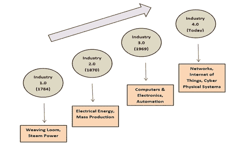
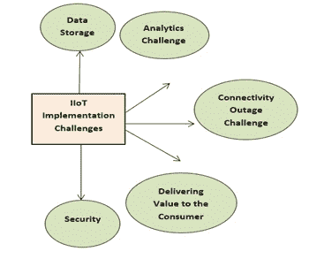
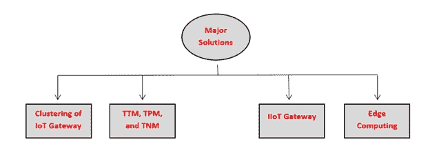

# 工业革命: 区块链作为工业 4.0 和工业物联网的一种浪潮

**Sukriti Goyal^(1)****,** **Nikhil Sharma^(1, *)****,** **Ila Kaushik^(2)****,** **Bharat Bhushan^(3)**

¹ 印度德里的 HMR 技术与管理学院

² 印度北方邦加兹亚巴德的克里希那工程技术学院

³ 印度大诺伊达的莎达大学工程与技术学院

## 摘要

在古代，人类更倾向于利用自行制作的工具来完成任何类型的工作。过去几年来，与生产相关的企业一直在扩张。人们开始依赖工具、机器和智能设备来处理工作，因为这些工具可以帮助他们在规定时间内达到目标。自 18 世纪以来，全球范围内工业经历了许多革命。技术的这种增长为工业革命奠定了基础。引入了新技术称为“区块链”。或许，区块链技术是现代数字经济中最具颠覆性的技术。区块链技术的能力在许多研究作品、媒体和主要在金融和支付领域中得到了广泛描述。一项现有的研究处于组织阶段，其实现了互联网安全性和不可转换性的架构。“工业 4.0”和“工业物联网”涉及到其不断上升的应用。因此，在本文中，阐述了区块链在工业物联网和工业 4.0 设置中的当前应用，现有的开放问题，现代应用领域，与工业物联网相关的挑战及其解决方案。本文的主要焦点是在这一领域赋权和促进研究，这将帮助开发人员在区块链获取以及在“工业 4.0”和“工业物联网”空间的投资。 

**关键词:** 农业行业, 区块链, 教育行业, 食品供应链, 医疗保健行业, 工业革命, 工业 4.0, 物联网, 隐私, 安全性, 可扩展性

* * *

^* **通讯作者 Nikhil Sharma:** 印度德里的 HMR 技术与管理学院; 电子邮件：nikhilsharma1694@gmail.com

## 1\. 引言

毫无疑问，区块链技术是一项不矫揉造作的发明。区块链通过允许数字信息传播但不复制，构建了现代互联网的基础。最初是为了数字货币，*即*比特币而发明的技术，现在技术组织已经发现了该技术的其他有效用途 [1]。简而言之，区块链是由一系列时间戳的不可逆转的信息集合组成，由一个计算机网络管理，不属于任何个人实体 [2]。每个数字块通过使用公共数据库（*即*链）进行保护和限制 [3]。在网络中，通过使用加密原理来确保数据共享安全，区块链技术为每个人提供了去中心化的数据库或数字交易账本 [4]。基本上，该网络是一系列计算机系统，必须允许共享后才能得到验证和存储。区块链有许多核心元素，但只描述了三个最必要的元素。第一个元素就是一个区块，每个链包含多个区块，每个区块有三个基本组成部分，如存储在区块中的数据是第一个组成部分 [5]。一个 32 位的整数被称为 nonce。第二个组成部分是，当生成一个块时，它是随机创建的，进而产生一个块头哈希 [6]。第三个组成部分是，一个 256 位的哈希数与 nonce 结合在一起，必须以大量的 0 开头，即它将是极其小的 [7]。当第一块链的块生成之后，nonce 会产生加密哈希。区块中的数据被认为是已签名的，并且永远与 nonce 以及哈希链接在一起，直到被挖掘 [8]。第二个元素就是矿工。通过一个称为挖矿的过程，矿工在链上生成新的区块。在区块链中，每个区块都有自己独特的哈希值和 nonce，而且，它还引用了链中前一个块的哈希值 [9]。因此，在庞大的链上挖矿是不简单的。为了解出产生可接受哈希的 nonce 的复杂数学问题，矿工使用专门的软件，因为 nonce 只有 32 位，而哈希有 256 位。在寻求修正之前，大约有 40 亿个可能的 nonce-hash 组合必须被挖掘出来 [10]。当发生这种情况时，所有网络的节点都接受任何种类的修改，并且矿工在获得一块挖矿的胜利后会获得经济奖励 [11]。第三个元素就是节点。去中心化是区块链技术中最重要的主题之一。链不能被一个计算机系统或公司所拥有 [12]。相反，它是一个分布式账本，节点与链相连。节点（以任何形式的电子设备）管理着区块链的副本，并且维护着网络的运行。区块链技术的一个主要应用是记录具有安全共享的金融信息。已经有努力去除以及扩展区块链技术在金融领域以外的扩展和用途，比如供应链、汽车、医疗保健、生产、教育和银行业 [13]。广泛分类，&ldquo;区块链 1.0&rdquo;通常与数字货币相关联，比如智能合同、比特币。&ldquo;区块链 2.0&rdquo;则与自动化数字金融流程有关，还有一种流行的技术*即*“区块链 3.0“。它专注于考虑智能家居、智能银行、智能城市和工业 4.0 等数字社区的需求 [14]。第四次工业革命在很大程度上依赖于物联网和其他相关技术。这里有另一个概念是 IIoT（工业物联网），或者工业物联网具有更为特定的关注点，而工业的第四次革命基本上与智能工业布局有关。从传统工业转变为智能工业或工业物联网是由我们社区的相互关联和数字化以及物联网设备的传播所支持的 [15]。

本章的其他部分按照下列方式组织，第二部分阐述了“工业 4.0”，以及从工业 1.0 到 4.0 的演变，“工业物联网（IIoT）”以及第四次工业革命与 IIoT 之间的主要区别。接下来，在第三部分，描述了区块链在不同领域（如医疗保健和农业）中的一些主要应用及一些现有的在 IIoT 技术中采用区块链的主要问题。第四部分描述了在工业物联网或工业 4.0 中正在执行区块链技术以找到切实可行解决方案的现代应用领域。此外，第五部分和第六部分详细介绍了与实施 IIoT 相关的一些主要挑战，以及处理实施问题的解决方案。最后，在第七部分讨论了一个结论。

## 2\. 背景材料

本节讨论了工业 4.0 的发展，以及 IIoT 和 IoT 之间的比较。

### 2.1\. 工业 4.0

在人类生活的每一天中，技术都扮演着重要的角色。它使得数据获取变得更加快速成为可能。企业的环境被卷入了这种频繁的技术演变中。逐渐地，工业领域在自动化和关联性方面应用更多。至 2020 年，“工业 4.0”在 2011 年德国汉诺威事件上被提出。在工业的革命中，工业 4.0 意味着成为主要集中在互关联、机器学习（ML）、实时数据和自动化的现代阶段[16]。有时它被称为 IIoT 或智能生产。在深入了解之前，知道自 1800 年代以来生产如何演变是有利的。如 Fig. **1**所示，世界今天面临四次不同的工业革命[17]。

**图（1))**

工业革命的阶段。

#### 2.1.1\. 工业的第一次革命

在 18 世纪末和 19 世纪初之间，工业的第一次革命发生了。在这个时期，生产从人和动物的手工劳动转变为更高效的劳动方式，通过使用水和蒸汽动力引擎以及其他种类的机器工具，由人类进行更有效的劳动[18]。

#### 2.1.2\. 工业的第二次革命

20 世纪初期，随着钢铁的引入和在工厂中应用电力，工业引入了第二次革命。为了提高优化并创建工厂机械，像移动和电力使能的制造商被引入工厂。在这个阶段，像装配线之类的大规模生产概念被提出作为提高生产力的方法。

#### 2.1.3\. 工业的第三次革命

在 20 世纪 50 年代末，工业的第三次革命慢慢开始兴起，制造商开始将计算机技术整合到他们的工厂中。在那个时期，他们开始经历一种变革，减少对机械和模拟技术的依赖，更多地使用包括自动化软件在内的数字技术。

#### 2.1.4\. 工业的第四次革命或工业 4.0

过去 10 年，工业的第四次革命——被称为“工业 4.0”已经兴起。它主要集中于从当前 10 年到完全现代化阶段的数字技术，支持通过物联网的互联性。工业 4.0 提供了更加互联、广泛和全面的生产策略[19]。它将物理技术与数字技术联系在一起，并允许在各个领域、产品和人员之间进行更好的优化和访问。此外，工业 4.0 还赋予企业所有者监控和了解他们实施的每个方面的能力，并允许他们利用即时信息来提高制造、提升运营和促进增长。

### 2.2\. IIoT

IIoT 意味着在工业领域和应用中扩展和使用物联网。包括对大数据、机器学习和机器对机器通信（M2M）的大量关注，IIoT 为企业和工厂提供了更好的优化、容量和稳定性。此外，它囊括了工业应用，包括医疗设备、软件定义制造流程和机器人技术[20]。一般来说，IIoT 是使用智能执行器和传感器来提高生产和工业流程的概念。有时，它也被认为是“工业 4.0”或“工业互联网”。IIoT 的主要概念是，智能机器比人类更擅长实时评估数据，并且更擅长交互重要信息，这些信息可用于更快、更精确地做出与业务相关的有效决策[21]。

#### 2.2.1\. IIoT 与 IoT

基本上，工业物联网和物联网都有许多常见的技术，如 M2M *即* 机器对机器通信、传感器和执行器、关联性、云平台，以及数据分析，可以应用于不同的目标。物联网的应用是将各个行业的设备进行连接，包括医疗保健、企业、农业、汽车、客户和公用事业，还包括政府和城市。智能设备、健身手环以及许多通常不会在发生故障时产生紧急情况的应用都包括在物联网设备中。而工业物联网连接的是设备和机器，进一步帮助生产和公用事业。工业物联网部署中的系统故障和停机可能会产生高风险或甚至危及生命的情况。工业物联网的应用更注重提高生产能力和增加健康或安全性，与物联网应用的用户集中性质相对立[22]。

## 3\. 主要应用

工业物联网在当今世界中扮演着重要的角色。物联网与工业的结合使其比其他技术更受欢迎。它涉及到健康产业、农业等不同领域。工业物联网的主要应用如下所述：

### 3.1\. 医疗产业

在医疗行业中，运用区块链技术可以有效地分享患者的敏感信息，从而有效地提高医疗服务的分发。例如，通过减少不同患者之间的效率，以及减少患者护理过程中发生的错误[23]。为了促进疾病的控制和管理，区块链驱动的物联网已经应用于医疗保健部门。可穿戴设备、智能药品和提高质量控制都是区块链启用的物联网的一些示例[24]。它们还允许在评估过程中跟踪临床药品，通过测试它们的影响以及负面影响。

以下是区块链技术在医疗行业的主要应用：

#### 3.1.1\. 患者记录管理

在处理患者记录时遇到的主要问题之一是患者将其医疗相关信息分散存放在多个医疗服务提供商之间。电子健康记录（EHRs）的构成不易处理，也不能在多个工业设置中分散。此外，问题存在于多个医疗组织和服务提供商之间，这给交换信息的成功带来更多障碍[25]。由于数据管理不当和信息共享不畅而导致这些医疗记录并非统一，而是分散的。区块链技术有助于为数据交换和信息安全提供设计。通过这种方式，医疗保健供应商可以收集患者的详细信息，包括他们的姓名、出生日期、处方信息、过往手术记录以及其他必要信息。通过云计算，这些信息随后记录在组织当前数据库的网络上。然后，从每个信息源计算信息的加密哈希值，然后与患者的公共身份信息一起记录在区块链上[26]。在这种情况下，智能合约是处理患者信息访问的更好选择。医疗保健提供者可以查询区块链，然后通过 API 提供这些信息，而不暴露患者的身份。

#### 3.1.2\. 保护患者数据

在医疗保健领域，数据安全是首要关注的问题。保护患者的重要医疗数据安全和保护是当前最著名的区块链医疗应用。罪犯盗取信用卡相关信息以及银行数据，还有健康和基因检测记录。区块链的能力在于保持患者数据的不间断、去中心化和清晰日志，使得这项技术适用于安全应用[27]。此外，区块链在透明的同时保持隐私，使用复杂且安全的代码隐藏任何个人的识别信息，可以保护医疗数据的敏感性。由于区块链的去中心化特性，患者、医生和医疗供应商被允许迅速而安全地交换相似的数据。

#### 3.1.3\. 工业实施

以下是医疗保健行业中一些著名的区块链工业实施。

1.  MedRec：这是医疗保健区块链设计的著名实例，可以有效和高效地记录电子健康记录（EHR）。MedRec 的原型允许患者在以太坊区块链上的智能合约中聚合数据指针，实现跨多个供应商的“病人-提供者关系”。通过 MedRec，用户也可以通过高效且易于使用的用户界面来审查、分享和发布新记录。该界面还包括一个通知系统，用于在用户或患者上传新数据或与他们分享新数据时通知他们。在这种区块链实现中，电子健康记录还具有新出现的区块链 PHR（即患者健康记录）功能，允许用户和多个服务提供者创建包括每位患者的全部生命周期医疗状况的纵向医疗数据。

1.  Medicalchain：这是一种用于电子健康记录的区块链，允许医院、外科医生、专业人员、药剂师以及保险公司请求权限以访问和交流医疗数据。每一次通信都是安全、可追溯和透明的，并且作为交易存储在 Medicalchain 的分布式账本上[29]。

#### 3.1.4\. 挑战

以下是医疗行业采用区块链时可能遇到的一些复杂问题。

1.  保健领域广泛传播：医疗服务提供者在数据管理方面并不整合。如果没有这样的系统，让他们应用区块链技术将是一项复杂的工作。此外，如果系统中的任何参与者抵制这些修改，整个系统的效用就会下降。

1.  可靠性不足：保健领域是一个如此细腻且广泛的领域，无法在一夜之间进行修改。因此，在区块链技术取得成功应用之前，很难确定这项技术的接受是否可行[30]。

1.  其他挑战：区块链技术的实施需要最佳的架构和相互关联性，而初创公司无法轻易承担这样的成本。此外，技术障碍不允许区块链技术完全应用于医疗领域。在一些企业中，由于在区块链环境中指令的稀缺，相互连接设备的系统受到破坏。

### 3.2\. 制造业

制造业是全球 GDP 中一个重要的参与者，一直以来都受到各种挑战，如低效和数据安全问题的困扰。虽然和许多行业一样，制造业的表观健康不一定意味着未来的成功。区块链有能力通过为制造业的每一项资产提供可见性来彻底改变它[31]。下面讨论了制造业中区块链的一些用例。

#### 3.2.1\. 数据保护的增强

各种供应链中的交互信息，如联系和发票详情，使用传统程序可能会很危险。这就是区块链帮助使用最佳加密方法保护详情的地方[32]。由于在区块链中，信息块只是与之前的块连接的有序记录的文件副本，这消除了数据受到攻击的可能性。

#### 3.2.2\. 制造工厂

一些制造厂已经在使用物联网和机器学习技术进行定期维护。与机器零件寿命周期相关的详情可以被收集并存储在区块链网络中，替换零件可以由智能机器订购并按计划支付。此外，制造商可以在区块链网络中记录他们的数据，并将其应用到与他们供应商的 ERP 系统链接[33]。

#### 3.2.3\. 开发了追踪和可追溯性

可以实施一个物联网支持的系统跟踪制造零件的基础。这会提高整个价值链中的透明度和可追溯性。从物联网传感器中收集的数据可以记录在区块链网络中，允许共享视图，并确保在物品沿着供应链移动时没有管理上的空白[34]。许多包括文件、获取认证的工序也可以通过区块链技术的执行得到显著提高。

#### 3.2.4\. 交付的可靠性

制造商极大地依赖他们购买的交付品质。越来越多让他们的品牌被存储和流行的供应商想要他们的品牌得到尊敬。这个要求在区块链的支持下得到了解决，制造商可以获取与他们的供应商有关的数据，确保他们得到了他们所声称的东西，这些交付是恰当尺寸的，没有任何损坏[35]。另外，智能合约的执行确保了知识产权和付款的安全性。

#### 3.2.5\. 高效的库存管理

由于区块链技术允许参与者与供应链中的每个利益相关者（包括供应商、分销商或零售商）建立联系，因此任何网络中的任何人都可以访问这些记录。这意味着每个人都持有一份记录的副本，从而避免了供应链程序中产生的混乱。这有助于更好地设计和管理库存。

#### 3.2.6\. 挑战

区块链有能力增强制造业的各个方面，使其更可靠、成本效益高且速度更快。虽然有许多优势，但在将区块链技术整合到其制造业务中时，行业也面临着一些问题。企业所有者需要分析他们业务的可扩展性，并了解是否采用区块链技术对他们有利。此外，要从制造业中获益区块链，将需要广泛的增强，涉及到链条中的每个参与者。每个生产商可能是多个区块链的一部分，因此，处理所有这些链所需的设置是具有挑战性的。因此，这些区块链的各种执行必须标准化和互操作，以便统一这些区块链。由于各企业正在生成具有所有权的区块链，实现互操作性将是一个重大问题 [36]。

### 3.3\. 农业行业

农业企业依赖于几个外部因素（如温度、气候、湿度、收获的完美度等），以及复杂的交付链，通过执行区块链技术可以使这些因素在情况下透明化。这项技术允许端对端透明进行交易，无需农业领域中的中间人或银行等中介。通过去除中央组织的要求，区块链改变了赋予信任的方式--而不是银行机构。信任被放置在密码学以及端对端基础设施上。它还有助于恢复制造商和客户之间的信任，可以降低农业市场交易成本。区块链提供了一种可靠的跟踪交易技术，同时保护参与者的隐私。区块链在所有相关社区之间提供透明度，促进可信信息的集合，并解决了消费者、组织和政府非常关注的食品质量和安全问题。

下面描述了农业领域中区块链技术的一些用例。

#### 3.3.1\. 农作物和食品的生产

从农民到生产商和零售商，区块链技术结合物联网正在重塑食品生产市场。区块链准备通过利用包括劳动力、水和肥料在内的农业资源，并采用简化的技术，使农业成为可持续的工作方式[38]。

#### 3.3.2\. 预防天气危机

农民在种植不同种类的作物时，通常遇到不可预测的天气条件。因此，预测和监测天气情况对作物生产至关重要。在美国，许多作物由于春季强降雨而无法生存。此外，最近食品链生态系统缺乏透明度可能导致价格不明确且剧烈波动。消费者不知道作物何时遭遇恶劣天气条件以及是什么导致价格上涨。农民、生产商和其他利益相关者将能够对食品分销市场的价格差异有清晰的了解。经过认证的机构可以通过智能合同追踪天气情况，以便农民能够迅速获得农作物保险的索赔。

#### 3.3.3\. 食品供应链

追踪食品供应链是追溯食品生产源头的精细过程。确保所提供的食品安全无虞是必要的。但当涉及方式时，食品供应链成为食品生产商和零售商验证产品源头的问题。通过整合区块链技术，现在可以在食品交付链环境中带来信任和透明度，确保每个人的食品安全。

#### 3.3.4\. 农业金融的处理

在正式金融会议和小农户之间出现的无数问题之一是透明度不足、信用记录不足以及合同执行问题。无法获得金融服务会对农业价值链的表现产生不利影响，由此制造商无法提高产量，购买者面临问题[39]。区块链通过透明度和共享控制的可获得性，在农业金融过程中带来公平。

#### 3.3.5\. 挑战

进入区块链的信息被认为是透明和公开的，说服和鼓励小规模消费者接受区块链技术的概念可能会成为一个问题。大部分现有解决方案都基于通过物联网传感器收集的数据。因此，除了支付区块链订阅的费用外，包含的组织还必须补偿物联网的实施。其次，收集上传到区块链平台的信息可能非常昂贵，这将成为阻碍农业行业接受区块链的障碍。第三，区块链并不直接无缝地与当前的遗留系统结合，构建一个应用区块链技术的结构通常耗时。因此，在区块链中存在的复杂性将对农业领域的基于该技术的解决方案的阐明起到阻碍作用。

## 4\. 开放问题和现代应用领域

在本章的这一部分中，将讨论工业物联网技术中区块链获取的一些最新主要问题，以及在工业物联网或工业 4.0 中执行区块链技术以寻找可行解决方案的现代应用领域。

### 4.1\. 区块链技术在工业物联网中采用的开放挑战

区块链技术在工业物联网中采用的开放挑战如下所述：

#### 4.1.1\. 能源和成本效率

随着区块链的大小增加，必须任命更强大的矿工来执行工作量证明等共识机制。一些能源适应的共识协议可以仅记录区块链上交易的最新数据，而不是记录完整的区块链数据。但是，仍然会受到大量商业信息产生的能源和资源受限的工业物联网设备的影响。因此，更为精密的共识算法结构仍然是一个重要问题。

#### 4.1.2\. 相关法规

由于区块链技术实施是分散的而不依赖于任何第三方机构，必须强制执行一个中央组织、商业标准和政府法规。

#### 4.1.3\. 资源约束

现有的区块链工作需要持续的网络连接，而工业物联网设备并不总是保证长时间的网络连接。因此，在这种情况下执行区块链是一个问题。此外，区块链产生的高网络开销对工业物联网的统一又构成问题。由于物联网设备和网络的资源扩展，现有的区块链技术在与物联网网络结合方面的去中心化程度可能[42]。

#### 4.1.4\. 安全性与保密性

目前，物联网网络容易受到多种威胁，比如窃听和重放攻击。除了这些威胁外，区块链还带来了一些安全风险。技术中一些常见的安全威胁包括信息劫持、保密泄漏、智能合约程序风险，*等等*。

#### 4.1.5\. 可伸缩性

在区块链中，可伸缩性问题是广泛遵从的一个主要抑制因素。在现有的区块链技术执行中，每个完全参与的节点都需要保存一个区块链的副本。与传统数据库相对，这导致了大量的存储开销[43]。特别是在工业物联网的情况下，传感器节点的数量以及产生的信息量不断增长，因此问题变得更加严重。

### 4.2\. 区块链正在实施的工业物联网中的现代应用领域

在工业物联网中，有各种应用领域正在实施区块链，如下所述。

#### 4.2.1\. 出租车行业

类似于 Uber、Ola 等共享乘车服务运营在一个集中结构中，通过从调度中心实施算法来监控他们的出租车车队。区块链技术可以为与现有模型的出租车司机和乘客提供一个去中心化和分布式的方法，以生成更多以消费者为导向的客户位置。为了在更大规模上能够通过信任和更好的覆盖范围，司机也可以合作。他们还可以与一系列可以依靠获得日常收入的客户建立起联系，而消费者也将拥有一个可以信任的服务提供商。

#### 4.2.2\. 音乐行业

著作权产品的完整性由智能合约保证。这些智能合约描述并自动化产品持有者之间的沟通以及连接。此外，它有助于确保消费者购买的产品得到授权，而不仅仅是一个精美的复制品。在音乐领域，音乐版权管理是智能合约的一个有效用例[44]。由于过去 10-15 年互联网的改善以及许多在线音乐流媒体功能，音乐行业一直在经历主要变化。音乐行业的版税评估程序一直是一项复杂的工作。但是，在互联网服务的发展中，这种方法变得更加复杂[45]。区块链可以通过处理一个精确和广泛的分散式数据库（以分布式分类账的方式记录完整数据）来帮助使版税支付过程安全和透明，记录音乐版权所有权的所有数据。

#### 4.2.3\. 教育行业

基于网络的远程学习的效力有助于实现对学生教育数据和成绩单的自主透明检查的需求。 对于教育文件，基于区块链技术的平台可以作为记录员，并能够为学术组织和所有权人获取安全的成绩单和所有记录数据。 情况性的职业特性表明，随着事业路径跨越机构和学科的改变，需要更多的专业化[46]。 在这种情况下，区块链可以成为学术证明的基础，为所有权人提供所需的信息，以确定求职者的简历是否准确。

#### 4.2.4\. 无人机产业

无人机行业是现代产业，区块链技术正在被尝试和测试。 无人机（也称为 UAVs，即无人机）正在大规模用于民用目的，偏离了它们在军事领域的传统用途。 无人机网络的安全是一个重要领域，在这个领域有很多研究工作。 在一项研究[47]中，提出了将区块链技术与无人机网络结合起来的提案，其中网络中的每架无人飞行器将作为区块链的节点运行。 这个提案被认为可以保护网络免受入侵。

犯罪行为，犯罪者试图拦截互动以及控制命令，以控制网络中的每一个节点[48]。

## 5\. 挑战的实施

物理世界被转化为计算机化。 大量智能设备和现代技术的爆发使人类能够随时进行频繁的互动。 大量的信息可以通过数据度量技术简单处理和评估。 在现代和流行技术中，工业物联网（IIoT），也称为工业 4.0 或工业互联网，是一种技术。 该技术可以引入令人惊奇的设备，增强的分析以及受欢迎的人才。 在工业中将 M2M 互动与大数据分析连接起来，工业物联网可以实现卓越的优化、生产能力和结果。 几乎所有公司都在朝向物联网增强组织，以将技术整合到他们的工作中。 随着 IIoT 的发展，它已经变得可以处理商业领域的实时数据分析动态。 然而，一些挑战正在阻碍工业物联网的实施。 近年来行业面临的主要挑战如图（Fig. **2**）所示。

**图（2))**

与工业物联网实施相关的挑战。

### 5.1\. 数据存储

数据存储是企业面临的主要挑战之一。在当今世界，所有被假定的活动很大程度上依赖于过去保存的数据。没有组织会沿用古老的传统程序来解析数据，因为这些数据通常是高频信息，然后将其丢弃[49]。工业物联网有助于收集大量数据，这些数据与企业的未来资产有着重要关联，超出了 OT 网络的范围。因此，对于任何企业来说，在启动完整的工业物联网之前，安排好信息的安全存储是必要的[50]。

### 5.2\. 分析挑战

在这一挑战中，如果在业务中执行物联网解决方案，那么其原始投资回报值是通过从收集的物联网内容中获得的可操作洞察力来确定的。只有在有一个高性能的分析平台的支持下，才能实现这一点，该平台可以处理包括在解决方案中的大量信息。数据分析团队需要在执行物联网结构时包括数据处理、清洗以及展示，确保给予足够的空间以便将实时或预测分析简单地连接到物联网解决方案中[51]。

### 5.3\. 连通性中断挑战

如果组织打算实施工业物联网，那么需要稳定的连接是一个持久的需求。即使在使用互联网连接时，其 100%的存在几乎是不可行的。在某个时候，连接会由于维护目的或其他目的而丢失[52]。因此，如果组织打算将工业物联网技术引入其系统中，那么关键的要求是拥有不间断的连接。

### 5.4\. 将价值传递给客户

设计执行工业物联网解决方案对容量、消费者满意度以及生产力都会产生巨大影响。拥有工业物联网非常重要，而整个过程需要深入理解。企业通常会设计符合现代技术的方案，以填补消费者问题陈述的空白。因此，物联网顾问有必要找出要通过物联网解决方案进行度量和改进的主要绩效指标[53]。

### 5.5\. 安全性

在历史上，曾经记录过几起网络侵入的案例。因此，保护敏感信息免受网络犯罪的侵害比处理普通的 IT 网络更加必要。因此，这已经成为工业物联网实施和技术的最大挑战，因为一般的风险可能会毁掉企业的业务[54]。如果企业预先计划通过工业物联网来降低此类问题[55]，这意味着向网络引入新的保护工具，这意味着增加成本和增加维护。因此，许多企业通常会避开工业物联网的概念，直到他们准备好建立牢固的安全保护措施[56]。

## 6\. 处理工业物联网实施挑战的解决方案

为了处理工业物联网实施的挑战，在（图**3**）中呈现的各种解决方案可以应用于企业、组织或公司的系统中。

**图（3))**

处理工业物联网实施挑战的解决方案。

### 6.1\. 物联网网关的集群

物联网网关的集群确保了 ERP 系统和 CRM 应用程序等 IT 系统与 SCADA 和 MES 系统等 OT 系统的统一。也保证了云交互和记录奇异信息的一致性，从而解决了 OT 和 IT 融合的问题[57]。

### 6.2\. TTM、TPM 和 TNM

为了减少安全问题，商业单位可以启用可信终端模块（*即* TTM）、可信感知模块（*即* TPM）和可信网络模块（*即* TNM）。此外，还有许多数据集中保护解决方案，确保数据在传输状态或静态状态下的加密安全，其中包括安全网关、Web 应用程序防火墙，以及应用传输控制器。

### 6.3\. 工业物联网网关

工业物联网网关可以支持当前的设备架构，安全地连接到任何商业架构。例如，物联网网关可以使用工业协议（如 OPC、无线技术、MODBUS、ISA100 和 PROFIBUS）直接将分布式控制系统与云平台连接起来，用于解决设备间交互的问题[58]。

### 6.4\. 边缘计算

边缘计算技术仅允许合理的数据进一步传输进行分析，而不是在云平台上传输一组数据。在边缘计算技术中，一定数量的具有不同操作的网关相互连接以生成一组网关，这一组网关导致了分布式边缘计算 [59]。在这种分布式边缘节点中，允许在边缘和近源处处理数据，然后再将数据传输到云端，这减少了延迟并提高了输出效果 [60]。 没有了那些已经过滤的信息，这些信息可以直接传输到雾节点上，并且雾节点的结合允许分布式雾计算。这将有助于快速数据共享，实时数据评估，并允许更快的缺陷响应时间。

## 7\. 结论

由于即将到来的第四次工业革命，也称为工业 4.0，现代有害技术被认为将在商业环境中得到整合。其中一种解决方案是“区块链技术”，其目标是统一异构系统并处理工业交易。虽然区块链技术起着重要的作用，但对于工业物联网（IIoT）或工业 4.0 的全面增强来说是非常重要的。工业物联网致力于在现代社会实现更多的自动化。专家认为，工业物联网或工业 4.0 技术将随着时间的推移，肯定会进一步发展生产阶段。据认为，工业物联网最终将成为创新的推动力，并成为多种革命背后的推动力。在本章中，我们详细讨论了区块链在工业物联网中的应用，同时详细介绍了工业 4.0 和工业物联网。此外，还阐明了与工业物联网实施相关的挑战及应对这些挑战的解决方案。

## 出版同意

不适用。

## 利益冲突

作者声明没有利益冲突，无论是经济上还是其他方面。

## 致谢

宣布没有。

## 参考资料

|  |  |
| --- | --- |
| [1] | Puthal D., Malik N., Mohanty S.P., Kougianos E., Das G.. Everything You Wanted to Know About the Blockchain: Its Promise, Components, Processes, and Problems.IEEE Consumer Electronics Magazine2018761410.1109/MCE.2018.2816299 |
| [2] | [`www.industryarc.com/Report/7385/industrial-internet-of-things-(IIoT)-market-report.html`](https://www.industryarc.com/Report/7385/industrial-internet-of-things-(IIoT)-market-report.html). |
| [3] | Arora A., Kaur A., Bhushan B., Saini H.. Security Concerns and Future Trends of Internet of Things. 2019 2^(nd) International Conference on Intelligent Computing, Instrumentation and Control Technologies (ICICICT)201910.1109/icicict46008.2019.8993222 |
| [4] | 林 J.，于 W.，张 N.，杨 X.，张 H.，赵 W.。《物联网概述：体系结构、支撑技术、安全和隐私以及应用》。IEEE 物联网期刊。201741125114210.1109/JIOT.2017.2683200 |
| [5] | Miller D.。《工业领域中的区块链和物联网》。IT 专业。201820151810.1109/MITP.2018.032501742 |
| [6] | 黄 J.，孔 L.，陈 G.，吴 M.，刘 X.，曾 P.。《面向安全的工业物联网：具有基于信用的共识机制的区块链系统》。IEEE 工业信息期刊。2019153680368910.1109/TII.2019.2903342 |
| [7] | 徐 Y.，任 J.，王 G.，张 C.，杨 J.，张 Y.。《基于区块链的工业物联网非否认网络计算服务方案》。IEEE 工业信息期刊。2019153632364110.1109/TII.2019.2897133 |
| [8] | 梁 W.，唐 M.，龙 J.，彭 X.，许 J.，李 K.。《面向工业物联网的安全 FaBric 区块链数据传输技术》。IEEE 工业信息期刊。2019153582359210.1109/TII.2019.2907092 |
| [9] | 姚 H.，麦 T.，王 J.，季 Z.，江 C.，钱 Y.。《基于区块链的工业物联网资源交易》。IEEE 工业信息期刊。2019153602360910.1109/TII.2019.2902563 |
| [10] | 赵 S.，李 S.，姚 Y.。《区块链支持的工业物联网技术》。IEEE 计算社会系统交易。201961442145310.1109/TCSS.2019.2924054 |
| [11] | Al-Jaroodi J.，穆罕默德 N.。《工业中的区块链：概述》。IEEE Access。20197365003651510.1109/ACCESS.2019.2903554 |
| [12] | Fernández-Caramés T.M.，Fraga-Lamas P.。《区块链应用于下一代网络安全工业 4.0 智能工厂综述》。IEEE Access。20197452014521810.1109/ACCESS.2019.2908780 |
| [13] | 高 A.K.，罗斯 A.，高尔 J.，布殊 B.。《物联网中的攻击、对策和安全范式》。2019 年第二届智能计算、仪器和控制技术国际会议。10.1109/icicict46008.2019.8993338 |
| [14] | Shrouf F.，Meré J.B.，Miragliotta G.。《工业 4.0 中的智能工厂：基于物联网范式的生产概念和能源管理方法综述》。2014 年 IEEE 工业工程与工程管理国际会议。201469770110.1109/IEEM.2014.7058728 |
| [15] | [`www.iot-now.com/2018/10/12/89230-iot-iiot-connected-industry-industry-4-0-come-together-create-new-model-business/`](https://www.iot-now.com/2018/10/12/89230-iot-iiot-connected-industry-industry-4-0-come-together-create-new-model-business/)。 |
| [16] | Preuveneers D.，Zudor E.I.。《未来智能工业：工业 4.0 新兴趋势、研究挑战和机遇概述》。环境智能与智能环境期刊。2017928729810.3233/AIS-170432 |
| [17] | 李 Z.，康 J.，于 R.，叶 D.，邓 Q.，张 Y.。《工业物联网中安全能源交易的联盟区块链》。IEEE 工业信息期刊。20181436903700 |
| [18] | Kang J., Yu R., Huang X., Maharjan S., Zhang Y., Hossain E.. 使用联合区块链促进插电混合动力电动汽车间的本地化点对点电力交易.IEEE Trans. Industr. Inform.2017133154316410.1109/TII.2017.2709784 |
| [19] | Wan J., Li J., Imran M., Li D., et al. 增强智能工厂安全与隐私的基于区块链的解决方案.IEEE Trans. Industr. Inform.201910.1109/TII.2019.2894573 |
| [20] | Yu Y., Chen R., Li H., Li Y., Tian A.. 边缘智能物联网数据安全前景.IEEE Netw.201933202610.1109/MNET.001.1800507 |
| [21] | Xu L., He W., Li S.. 工业中的物联网：一项调查。IEEE Trans. Industr. Inform.2014102233224310.1109/TII.2014.2300753 |
| [22] | Müller J.M., Kiel D., Voigt K.. 什么推动了工业 4.0 的实施？可持续性背景下机遇和挑战的作用.Sustainability20181024710.3390/su10010247 |
| [23] | Esposito C., Santis A. D., Tortora G., Chang H.. 区块链：医疗云数据安全与隐私的万灵药？IEEE Cloud Computing201851313710.1109/mcc.2018.011791712 |
| [24] | Wu H.. 健康护理系统的区块链：应用双线性配对技术确保数据分享中的隐私保护和准确性.IEEE Consumer Electronics Magazine201874657110.1109/mce.2018.2816306 |
| [25] | Salahuddin M. A., Al-Fuqaha A., Guizani M., Shuaib K.. 互联网物联网基础设施的软件化，实现安全和智能医疗.Computer2017507747910.1109/MC.2017.195 |
| [26] | Nugent T., Upton D., Cimpoesu M.. 通过区块链智能合约提高临床试验数据透明度.F1000 Res.20165254110.12688/f1000research.9756.128357041 |
| [27] | Xia Q., Sifah E. B., Asamoah K. O., Gao J., Du X.. MeDShare：通过区块链在云服务提供商之间的无信任医疗数据共享.IEEE Access20175147571476710.1109/ACCESS.2017.2730843 |
| [28] | MedRec2016 [`medrec.media.mit.edu/`](https://medrec.media.mit.edu/) [在线；于 2019 年 4 月 12 日查阅].. |
| [29] | Medicalchain2019 [`medicalchain.com/en/`](https://medicalchain.com/en/) [在线；于 2019 年 4 月 12 日查阅].. |
| [30] | Bocek T., Rodrigues B.B., Strasser T.. 区块链的应用-制药供应链的一个案例。2017 IFIP/IEEE Symposium on Integrated Network and Service Management (IM)201710.23919/INM.2017.7987376 |
| [31] | Kiel D., Arnold C., Voigt K.. 已建立制造公司的工业物联网对商业模式的影响-以商业层面的角度.Technovation20176841910.1016/j.technovation.2017.09.003 |
| [32] | Sun Y., Zhang L., Feng G., Yang B., Cao B., Imran M.. 区块链启用的无线物联网：性能分析和最佳通信节点部署。IEEE Internet of Things Journal201965791580210.1109/JIOT.2019.2905743 |
| [33] 纳什 P.。工业物联网面临的挑战。2017 [在线]。网址：[`www.invma.co.uk/blog/iiot-challenges`](https://www.invma.co.uk/blog/iiot-challenges)。 |
| [34] 泽尔布斯特 P.J.，格林 K.W.，索尔 V.E.，邦德 P.。射频识别（RFID）、工业物联网和区块链技术对供应链透明度的影响。制造技术管理杂志。201910.1108/JMTM-03-2019-0118 |
| [35] 伊塞加 M.，索尔达托斯 J.。工业环境中自动化、分析和仿真的分布式分类帐架构。IFAC-PapersOnLine20185137037510.1016/j.ifacol.2018.08.321 |
| [36] Gottheil A.。区块链能否解决工业物联网安全问题？2018 [在线]。网址：[`iiot-world.com/cybersecurity/canblockchain-address-the-industrial-IOT-security`](http://iiot-world.com/cybersecurity/canblockchain-address-the-industrial-IOT-security)。 |
| [37] 伊安纳斯 F.。由区块链驱动的食品透明度的新时代。创新（剑桥，马萨诸塞州）2018121-2465610.1162/inov_a_00266 |
| [38] 卡罗 M. P.，阿里 M. S.，维克西奥 M.，贾弗雷达 R.。基于区块链业务网络的粮食质量保证跟踪案例研究。arXiv 预印本 201810.1109/IOT-TUSCANY.2018.8373021 |
| [39] 卢塞纳 P.，比诺托 A.P.，莫莫 F.S.，金 H.。基于区块链业务网络的粮食质量保证跟踪案例研究。arXiv 预印本 2018 |
| [40] 王 F.，袁 Y.，张 J.，秦 R.，史密斯 M.H.。区块链化的思维互联网：物理-社会-网络系统的新机遇。IEEE 交易计算社会系统。2018589790610.1109/TCSS.2018.2881344 |
| [41] 曼查达 C.，夏尔马 N.，拉希 R.，布胡珊 B.，格罗弗 M.。智能城市中新型安全与隐私庇护技术。2020 年 IEEE 第 9 届国际通信系统和网络技术会议（CSNT）202010.1109/csnt48778.2020.9115780 |
| [42] 贾德卡 H.，夏尔马 N.，辛格 R.。物联网向工业物联网的演变：应用与挑战。SSRN 电子期刊 2020 |
| [43] 帕斯夸利 E.。工业物联网和（数据）共享经济。2018 [在线]。网址：[`iiot-world.com/connected-industry/industrialiot-and-the-data-sharing-economy`](http://iiot-world.com/connected-industry/industrialiot-and-the-data-sharing-economy)。 |
| [44] 塞迪 R.，布胡珊 B.，夏尔马 N.，库马尔 R.。工业物联网在多元化领域的适用性：演变、应用和挑战。《物联网环境中的大数据多媒体技术》45-67 页。2020456710.1007/978-981-15-7965-3_4 |
| [45] 厄夫哈特 L.，麦考利 D.。避免工业物联网的安全不安全现实。ArXiv 201810.1016/j.clsr.2017.12.004 |
| [46] 布拉斯 I.，坦兹克 L.，卡尔 M.，埃尔斯登 M.，布莱克斯托克 J.J.。标准化移动目标：物联网安全标准的开发和演变。物联网 2018 |
| [47] | Kuzmin A., Znak E.. 区块链技术为半自主无人机安全和运行网络构建。2018 IEEE 服务运营与物流与信息学国际会议 (SOLI)IEEE2018323710.1109/SOLI.2018.8476785 |
| [48] | Varshney T., Sharma N., Kaushik I., Bhushan B.. 基于身份验证和加密的区块链技术安全服务。2019 年计算、通信和智能系统国际会议 (ICCCIS)201910.1109/ICCCIS48478.2019.8974500 |
| [49] | Bassi L.. 工业 4.0：希望、炒作还是革命？2017 年 IEEE 第 3 届面向社会和工业的研究技术国际论坛 (RTSI)201716 |
| [50] | Zhou L., Wu D., Chen J., Dong Z.. 当计算融合智能：面向工业物联网的内容感知数据处理。IEEE 物联网杂志 201851657166610.1109/JIOT.2017.2785624 |
| [51] | Domova V., Dagnino A.. 工业物联网时代智能报警管理。全球物联网峰会 (GIoTS)201715 |
| [52] | Brusakova I.A., Borisov A.D., Gusko G.R., Nekrasov D.Y., Malenkova K.E.. 俄罗斯工业物联网技术发展前景。2017 年俄罗斯年轻电气电子工程研究人员 IEEE 会议 (EIConRus)201713151317 |
| [53] | Sajid A., Abbas H., Saleem K.. 云辅助的基于物联网的 SCADA 系统安全：现状综述和未来挑战。IEEE Access201641375138410.1109/ACCESS.2016.2549047 |
| [54] | Quarta D., Pogliani M., Polino M., Maggi F., Zanchettin A.M., Zanero S.. 工业机器人控制器的实验性安全分析。2017 IEEE 安全与隐私研讨会 (SP)201726828610.1109/SP.2017.20 |
| [55] | Guan Z., Lu X., Wang N., Wu J., Du X., Guizani M.. 为 IIoT 启用的能源互联网的安全高效交易：区块链方法。未来一代计算系统 2019 |
| [56] | Uhlmann E., Hohwieler E., Geisert C.. 工业 4.0 时代智能生产系统：改变思维方式和商业模式。机械工程杂志 2017 |
| [57] | Banerjee M., Lee J., Choo K.R.. 物联网安全的区块链未来：一个立场文件。数字通信与网络 2017414916010.1016/j.dcan.2017.10.006 |
| [58] | Varshney T., Sharma N., Kaushik I., Bhushan B.. 物联网中安全威胁及其对策的架构模型。2019 年计算、通信和智能系统国际会议 (ICCCIS)201910.1109/ICCCIS48478.2019.8974544 |
| [59] | Sharma T., Satija S., Bhushan B.. 将区块链和物联网统一起来：安全需求、挑战、应用和未来趋势。2019 年计算、通信和智能系统国际会议 (ICCCIS)201910.1109/ICCCIS48478.2019.8974552 |
| [60] | Chen B., Wan J., Shu L., Li P., Mukherjee M., Yin B.. 工业 4.0 智能工厂：关键技术、应用案例和挑战。IEEE Access201866505651910.1109/ACCESS.2017.2783682 |
