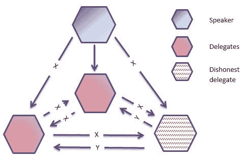
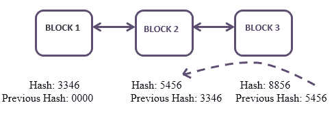
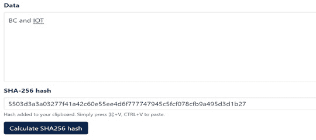
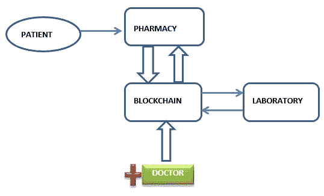
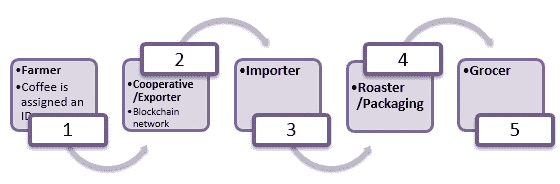
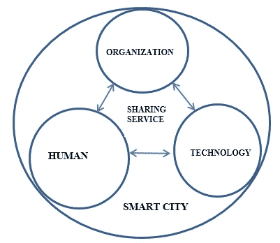

# 利用区块链技术增强物联网安全解决方案

**K. Sheela^(1, *)****,** **C. Priya^(2)**

¹ 印度金奈维尔斯科学技术和高等研究学院（VISTAS）计算机科学系

² 印度金奈维尔斯科学技术和高等研究学院（VISTAS）信息技术系

## 摘要

区块链是一个不断增长的记录列表，称为块，通过使用密码学链接在一起。每个块包含前一个块的密码散列、时间戳和交易数据。它是一个去中心化、分布式和公共数字分类帐，用于记录跨多台计算机（称为节点）的交易。区块链与人工智能、物联网、大数据等技术的协作，通过减少人力成本，增加可行性，提供更有效的结果。物联网是将互联网的力量扩展到计算机和智能手机以外的一整套其他事物、流程和环境。我们的日常生活可以通过在家庭、农业、物流、工业、医疗保健等领域应用物联网设备而变得有趣。它们可以与数据收集、大数据管理、数据存储、数据分析等学科结合使用。这些物联网设备内嵌有对黑客和恶意软件易受攻击的传感器。目前，我们不能完全保证设备访问和相关数据的安全性，因为入侵者可能会滥用或处理安排过程。但是，与区块链技术的结合可以为与安全相关的问题提供解决方案。

**关键词：** 应用、真实性、区块链、银行业、共识、Corda、加密货币、密码学、分布式、以太币、以太坊、电子治理、哈希、医疗保健、物联网、平台、工作量和堆栈证明、安全、智能合约、智慧城市。

* * *

^* **通讯作者 K. Sheela：** 印度金奈维尔斯科学技术和高等研究学院（VISTAS）计算机科学系；邮箱：ksheela.research@gmail.com

## 1\. **引言**

物联网设备已成为我们日常生活中的常规组成部分。我们可以看到连接到互联网的设备数量逐渐增加。

为数字环境铺平道路。传统数据库提供了集中式架构，而区块链提供了分布式的对等网络。简单来说，区块链是在数据库中存储的数据集合，它在分布式的对等网络节点中保持不断增长的记录[1]。这使得区块链和物联网得以集成，以提供更好的服务。通常，物联网设备容易受到许多种安全攻击[2]。以下是一些可能发生在连接到互联网的设备上的攻击。

**暴力攻击：**是尝试尝试所有由授权用户提供的密码可能性的过程。

**中间人攻击：**在这种网络攻击中，入侵者介入通信并获取传输的信息。他也可能修改信息导致误传。

**拒绝服务：**这种攻击用于减慢进程，也会影响组织的声誉。分布式拒绝服务（DDoS）也可能发生，以占用资源提供不必要的服务，并使网络资源无法进行适当的活动。克服这一问题的方法之一是活动证明，这是 PoS 和 PoW 的结合[3]。

**窃听：**也称为嗅探或窥视攻击。这是在信息通过网络传输时，通过智能手机、计算机或其他连接设备窃取信息的过程。

**术士攻击：**是创建大量匿名身份来隐藏真实身份并减缓过程的过程。它完全破坏了网络的运作。

这些攻击可以通过将区块链技术与物联网相结合来覆盖，其特点包括分散式架构、不可变性、可靠性、自治行为等[4]。区块链中的每笔交易都使用公钥/私钥进行加密封存。每笔交易必须经过定义和认证。通过这些交易，必须创建、验证和链接（链式）区块[5]，以提高交易的安全级别。

区块链技术与人工智能、物联网[IOT]、大数据*等*技术的合作，通过减少人力成本，增加可行性，提供更有效的最终结果。当然，区块链通过在物联网生态系统中提供安全性和认证，赋予了物联网设备权利。我们可以很容易地预计，随着其与区块链技术的巨大发展和合作，物联网将成为我们日常生活中的一部分。欺诈活动也可能出现在物联网设备的定位中，其中连接设备的位置可能被篡改以提供错误的数据。这可以通过区块链技术[2]来解决。它因其分散和分布式性质、哈希和加密技术以及彼此之间维护的智能合同而闻名。让我们在本章节深入探讨这种合作。

### 1.1\. 工作的贡献

本章详细阐述了安全增强解决方案，并着重介绍了可以实施区块链技术的平台。

此外，它整合了这些技术的特性和

突出了合作人工智能、区块链和物联网为可持续环境所做的研究。

它还包含了研究方向以及一些指导原则。

### 1.2\. 论文组织

在第二部分中，我们讨论了可用于实施区块链技术以及物联网集成的平台。此外，在第三部分中，通过图表和表格列出了一些强制性安全操作的技术。第四部分详细阐述了区块链技术在智能城市、医疗保健、电子治理、教育系统、废物管理、供应链管理*等*各个领域中的物联网实施。

## 2\. 实施区块链技术及其用途的平台

通过考虑区块链的性质，将其分为三种类型，即私有、公共和联盟。私有区块链是受限制的。能够访问数据的用户将由网络管理员分配，并且其他用户将受到访问限制。公共区块链没有访问限制。联盟是一种半受限的区块链，其中将根据一定限制给予访问权限以在区块链平台上工作[6]。平台是软件可以执行的环境。已设计许多平台来支持和开发区块链技术。这些平台分为许可和非许可两类：以下是一些最有效使用此技术的平台：

**以太坊**– 它是一个无需许可的、去中心化的应用（DApp）。它使用以太币作为其加密货币（ETH）。

**Hyperledger fabric –** 这是一个需要许可的区块链，只有已知身份才能参与其中。

**瑞波币 –** 它主要是为支付交易而设计的。

**Quorum** – 这是以太坊的面向企业的版本。

**Corda –** 最初是为金融领域设计的。但如今，它也在其他领域得到了实施。

**EOS –** 它为所有用户取消了所有费用。

**Open chain –** 它是为管理数字资产而专门设计的。

**Stellar –** 它处理加密货币和法定货币之间的所有交易和交换。为实现期望的共识，它使用了 Stellar 共识协议（SCP）。

还有许多其他可用于实施区块链技术的平台。上述是这项技术中备受欢迎和用户友好的平台。表格（**1**）在最高效的论坛中提供了排名前五的区块链平台之间的清晰比较 [7]。

表 1 **排名前五的区块链平台比较。**

| **区块链** | **以太坊** | **Hyperledger** **Fabric** | **Corda** | **瑞波币** | **Quorum** |
| :-: | :-: | :-: | :-: | :-: | :-: |
| **行业重点** | 跨行业 | 跨行业 | 金融目的 | 金融目的 | 跨行业 |
| **治理** | 以太坊开发者 | Linux 基金会 | R3 联盟 | 瑞波实验室 | 以太坊开发者和摩根大通 |
| **智能合约服务** | 是 | 是 | 是 | 否 | 是 |
| **智能合约语言** | Solidity | Java, Node.js, Go | Kotlin, Java | 无 | Solidity |
| **账本类型** | 无需许可 | 需许可 | 需许可 | 半许可 | 需许可 |
| **加密货币** | 以太币（ETH） | 无 | 无 | 瑞波币（XRP） | 无 |
| **共识算法** | 工作证明（PoW） | 可插桩框架 | 可插拔框架 | 概率性投票 | 多数投票 |
| **交易性能** | 可扩展 | 非常可扩展 | 非常可扩展 | 非常可扩展 | 非常可扩展 |

### 2.1\. 物联网及其集成

物联网促进了我们日常生活中人与设备之间的连接，并使最终用户能够享受各种定制服务，而这些用户可能会因缺乏安全性而受到影响。通过整合区块链技术，可以解决这个问题。设备 1 与其他设备之间的每一次通信都将生成一个交易。服务供应商与接受者之间的这些交易将被存储在维护公开数字账本的区块链中 [8]。区块链与物联网的合作已经在能源消耗、数据聚合、可伸缩性、安全性和隐私、访问控制、认证、不可否认性等方面取得了许多目标，使效率和生产力大大提高 [9]。

## 3\. 用于施加安全措施的技术

正如我们已经知道的，区块链是一个分布式和去中心化的网络，除了透明度和不可变性之外，它还提供隐私和安全。 从它的去中心化性质来看，可以清楚地知道没有中央机构来验证或核实交易。 即使如此，区块链也保证了其验证和安全性，采用共识协议。为了维护其可靠性，我们可以使用分布式数字分类账和密码技术。

### 3.1\. 共识

这是所有区块链网络的连接节点都必须满意的共同协议[10]。它已经被分类为以下内容。

+   **PoW** – **工作量证明**算法用于确认交易并向链提供新的区块。 它提出了挖掘的概念。 做挖掘的人被称为矿工。 挖矿是验证交易并在全球分类账“区块链”上维护它们的过程。

+   **PoS – 权益证明**已被创建为 PoW 的替代方案。 在这里，将考虑比特币的可用余额，而不是考虑解决谜题的资源。 例如，只持有 4％比特币的矿工只能挖掘 4％的区块。

+   **PBFT – 实用拜占庭容错**发生在像区块链技术这样的分散化、分布式系统中。 参与者之间在一个不受控制的、开放的、无需许可的系统中进行交流的可能性。 假定如果交易在规定的时间范围内未到达目的地，则交易可能是恶意的。 这可以通过拥有至少 3 分之 2 最可靠的网络节点来覆盖。 如果系统的大多数决定采取恶意行为，那么就会发生 51%的攻击。

**图（1))**

拜占庭将军问题。

从给定的图。(**1**)可以注意到不诚实的代表修改了原始消息并将其发送给其他代表。 如果其他代表信任并根据不诚实代表分享的信息行事，问题就会出现。为了避免这种情况，区块链实施了诸如 PoW、PoS 等一些共识，以选择最可靠的网络节点。 在这里，单个节点的每笔交易将自动反映在所有其他节点上。 因此，没有修改的机会。

+   **PoB** – 燃烧证明被亲切地称为能源消耗较少的工作证明。它不需要大量的计算资源。矿工需要烧掉一定数量的自己的加密货币，比如原生币或比特币，来确定他们对网络的承诺，以获取虚拟挖矿算力（它被比作虚拟矿机），用于挖矿和验证交易。与 PoW 类似，PoB 也会在特定时间内向矿工提供奖励。大部分奖励将覆盖烧掉的硬币的初始投资。

+   **PoC** – PoC 代表容量证明。名称清楚地表明它与节点的容量有很大关系。硬盘容量越大，成为下一个区块的矿工或验证者的机会就越大。

+   **DAG** – 有向无环图是一个有限的无环有向图。为了更实际地推广区块链技术，提出了 DAG。它以拓扑顺序连接在分类账中的一系列节点。在区块链中，这种新提出的结构被称为 tangle。每笔交易必须由前两笔交易验证[11]。

+   **可插拔共识 –** 交易排序由共识的模块化组件承担，逻辑上与执行交易的节点和维护分类账的节点相分离。其平台依赖于拜占庭容错（BFT）排序[12]。

表(**2**)清楚地描述了区块链技术中共识协议的功能、优点和缺点[13]。

表 2 **共识协议的对比。**

| **协议** | **功能** | **语言** | **利用资源** | **处理速度** | **效率** | **缺点** |
| :-: | :-: | :-: | :-: | :-: | :-: | :-: |
| PoW | 用于保证交易并构建新的区块到链上。 | Solidity, Python, Java, *等*。 | 提高 | 慢 | 受限 | 能源消耗越高，安全性越低 |
| PoS | 比特币的可用余额起着重要作用 | 原生 | 受限 | 快速 | 提高 | 只有富裕的持币人可以享受共识控制 |
| PBFT | 将投票机制视为保证交易的完整性和原始性 | Java 和 Go 语言 | 提高 | 提高 | 提高 | 过多的通信开销 |
| PoB | 能源消耗较少的 PoW。它涉及硬币燃烧策略。 | Solidity, Go 语言, C++ | 中等 | 中等 | 受限 | 资源浪费 |
| PoC | 增加的硬盘容量增加了成为矿工的机会 | - | 提高 | 受限 | 提高 | 只有容量更大的节点才会得到更多权益 |
| PoET | 每个节点生成一个随机数来评估其等待时间 | Python | 提高 | 中等 | 提高 | 同一个节点反复成为领导者的机会逐渐减少 |
| DAG | 它没有循环。每个节点必须由 2 个前一个节点验证 | - | 阻塞 | 提升 | 提升 | 必须按拓扑顺序排列 |

+   **PoET** – 在经过一定时间后的证明中，参与网络的每个节点都需要等待一段特定的时间。首先完成指定等待时间的节点将获得新块的挖矿权限。网络中的每个节点会生成一个任意的等待时间，并且休眠一段指定的时间。首先唤醒的节点将有机会挖矿。同样的过程将重复进行所有后续的区块。

### 3.2\. 账本

一般来说，账本被称为一个记录系统，我们可以在其中维护一个人或企业所有的财务交易（借方或贷方）以供将来参考。它可以分为两种类型。

中心化账本 - 常见服务器管理整个过程

分布式账本 - 无单一存储点

区块链以其去中心化的特性促进了分布式数字账本的生成。分布式账本是一个数据库，可以在不同地区同步更新和访问。任何一个用户所做的修改都会自动反映到所有其他连接的节点上。只有当 51%的节点接受时，该修改才会得到批准。否则，该特定操作将被禁止。这个过程减少了网络中可能发生的网络攻击和欺诈活动。它对重构机构、政府和公司工作方式有着更大的潜力。就可扩展性而言，区块链在网络上只需最少用户即能快速运行。节点数量越多，交易速度越慢[14]。

### 3.3\. 密码学

密码学促进了安全通信。术语“密”意味着“隐藏”，“graph”表示“书写”，即隐藏的书写。因此，通信的消息只能被预期接收者理解。它使用两个特殊的称为私钥和公钥的密钥，以及称为加密和解密的两个最特殊的功能。加密是将明文转换为密文的过程，解密是将密文转换为明文（可读形式）的过程。这个加密和解密将使用节点的私钥和公钥来完成。数据加密标准（DES）、三重 DES、双鱼加密、高级加密标准（AES）、RSA 算法是一些常用的加密算法。

区块链的公钥密码学和共识机制，应用于加密货币交易，对于任何欺诈交易来说是不可突破的[15]。在密码学和网络安全中，中间人攻击被认为是一种广泛使用的攻击方式，黑客可以轻易监视或篡改通信内容。可以通过包括私钥和公钥进行身份验证的功能，使用传感器连接通信设备，并借助 TensorFlow、Raspberry pi 来实现通过 MQTT（消息队列遥测传输）在设备之间传递消息，从而在交易中增加 IoT 和区块链的安全级别[16]。

### 3.4\. 哈希处理

区块链通常由相互连接的一系列区块组成。无法改变区块的顺序，因为它们彼此相互连接。每个区块都有与其相关联的唯一哈希值。一个区块的哈希值将链接到下一个区块。因此，每个区块将有其自己独特的哈希值以及前一个区块的哈希值。图（**2**）描述了带有其哈希值的区块的结构，其中不存在重新排列区块顺序的可能性[17]。提出了一系列哈希算法，并命名为安全哈希算法（SHA）。SHA-1 于 1993 年宣布，产生 160 位哈希，但被证明在避免弱碰撞上有缺陷。

SHA-2 于 2001 年宣布。SHA 2 包括 SHA-224、SHA-256、SHA-384、SHA-512。它们的命名是考虑到它们生成的哈希位或消息摘要的长度。

SHA-3 的出现是为了加强安全级别。但却使软件处理变慢。尽管提供了相关安全性，但相对于 SHA-2 来说，速度要慢一些。

哈希：3346 哈希：5456 哈希：8856

上一个哈希：0000 上一个哈希：3346 上一个哈希：5456

**图（2）**

带有其哈希值的区块。！**图（3）**

为给定字符串“区块链和 IOT 的集成”生成哈希值。

区块链改进了与 IOT 的网络连接，直接使用点对点通信而无需依赖任何第三方。区块链技术的安全功能可以避免网络攻击[18]。

SHA-256 是最常用的哈希技术。该算法返回一个十六进制表示。因此，它为每个给定的输入返回 64 位哈希值，无论输入的大小如何。在图（**3**）和（**4**）中，我们可以看到输入的长度不同，但哈希值都是 64 位。

**图（4）**

为给定字符串“BC 和 IOT”生成哈希值。

同时，必须指出，图 (**4**) 中的字符串是图 (**3**) 的子字符串。但我们在它们的哈希值中找不到任何相似之处，这似乎是完全独特的。区块链技术中的每一笔交易都将存储在与之连接的所有节点中，这可以称为完全节点。在完整模式下，将会消耗大量存储空间，这可能无法满足少数用户。因此，已经创建了轻量级节点，它们将它们的数据发送到完整节点，而不是在其中维护所有重复的记录。这将被建议用于计算能力较弱的设备 [19]。

### 3.5\. 智能合约

智能合约是区块链的安全编码数字合约。它们几乎与传统合约相似。这些智能合约将由编码者在创建时编码的规则精确执行。它直接控制在特定条件下节点之间的数字资产转移。在物联网的情况下，我们可以在我们日常生活中使用的设备和小工具之间维护智能合约。在考虑智能合约的操作机制时，我们可以观察到其生命周期分为五个阶段 [20]。

协商 – 分析实施智能合约的需求

开发 – 计划要实施的功能

部署 – 创建涉及交易双方的合约

维护 – 这个阶段管理和维护与之相关的数据。

学习和自毁 – 以系统化的方式组织整个过程。一旦整个过程完成，也可以实现自毁。

智能合约促进自动化。许多公司和组织正努力将智能合约纳入其正常实践中，而忽略传统合同 [21]。在我们依赖智能合约时，无法发生任何错误处理。这可以使用区块链中的 solidity 语言来实现。Solidity 是专门用于维护智能合约的。

## 4\. 物联网实施

区块链技术可以与物联网（IoT）集成，以增强其在现实世界中的应用。最近，这项技术通过赋予点对点合同行为的权力，而无需第三方的干预，不断回应与隐私和安全、信任、可靠性、单点故障和可扩展性有关的问题。为了克服安全问题的脆弱性，我们使用密码概念，如私钥和公钥基础设施（PKI），用于安全分发密钥以生成和验证数字签名 [22]。它可以在少数领域中实施，其中还可以实现绿色工程。以下是部分应用：

### 4.1\. 分布式数据存储

最初，数据将通过云进行共享，并且权限和访问控制将由一个集中式服务器进行管理，存在单点故障的可能性。因此，我们可以转向名为区块链的去中心化存储网络。它可以与诸如传感器之类的物联网设备协作，这些设备可以在出现不道德活动时识别并警告用户。这种警报系统可以在我们日常生活中的许多实时应用中使用。

### 4.2\. 去中心化能源生产和消费

通常，能源资源在不同地点生产，并且可以被不管位置的人所消耗，直到资源消耗殆尽。这种能源生产需要对生产者进行认证，以激励他们的努力。有可能伪造人们而不认可他们的工作，或者人们可能消耗能源资源，然后否认/假装他们没有消耗过。在这种情况下，我们可以实施区块链技术来实现透明的交易。

### 4.3\. 选择性卸载以最小化数据路径

去中心化的概念最小化了数据路径。必须重新设计网络架构，以随机卸载连接到物联网的计算和存储设备，以最小化费用和资源利用。每笔交易都将记录在分布式分类账中，使所有连接的节点都能了解整个结构。每个数据将以加密格式存储在所有节点中，只能由授权用户解密。

### 4.4\. 家用电器中的物联网

现在，家用电器都与互联网连接，可以随时随地访问。对于物品与其所有者进行安全通信是必要的。我们可以在这个领域实施区块链技术，以提供不受干扰的认证服务。在智能家居中，每个连接到互联网的设备将定期将其数据存储在云存储中，以更高效地提供当权者查询时的详细信息。例如，无论在何处，房主都可以查看和访问安全摄像头，而不必担心入侵者[23]。

### 4.5\. 电子治理

政府门户是完全集中式的。可以包括这项技术来以更高效的方式改进其各个部门。它包括其他生物识别、IT 详细信息、教育系统等。这种分散式方法消除了单点故障，并保证了数据的安全存储。这一过程也通过完成环境的许多基本方面来促进绿色工程。如今，技术在实现绿色工程目标方面发挥着主导作用，通过减少人为干预来减少我们可能会遇到的欺诈活动。当我们讨论区块链技术的电子治理时，电子招标将成为其在业务领域进展的重要一步。电子招标通过其分布式的性质促进了在线竞标流程，提供了更多的信任和效率[24]。区块链可以在许多治理领域与物联网集成。

### 4.6 教育制度

教育和就业渴望实现学生、教育机构和公司之间无瑕的融合，这实质上提高了教育和就业的效率和透明度。在这项技术中，学生可以成为自己数据的管理员。

**图（5）**

教育的透视图。

这样，他可以监控被授权用户对其记录所做的更改，而不允许任何入侵者[25]。教育机构正在维护学生的学分体系，以评估他们在校园的日常活动，从而可以评定学生的整体表现。有必要将这些信息从一所机构传递到另一所（无论他/她去哪里）以展示他们获得的学分。这可以借助区块链技术来完成，其中数据无法篡改，只有授权用户可以访问，安全存储等。区块链也可用于教育机构的认证，用于验证雇用员工的质量和资格的复杂任务。在图（**5**）中，显示了从三个角度看教育系统。学习者、学者和商业人士都可以完成。无论是什么领域，愿意发展自己的人永远不会停止学习。如果一所学院拥有一个在线课程渠道，只有授权用户才能访问。在决定受益者时，学院可以提供这种限制。此外，也可以实施这项技术来保护个人作品的版权和数字权利。由于抄袭的机会很多，我们可以通过使用这类区块链平台来识别个人努力而避免它。在这个时代，技术部署需要先进行试点开发。 

### 4.7 医疗保健

区块链在医疗保健领域有着巨大的应用。作为一种去中心化和分布式技术，它在这个领域的不同领域中发挥作用。它主要确保安全数据共享，维护患者的病历，费用交易，药品供应链等。这种数据共享可以用两种方式进行，即本地共享或全球共享。如果患者病历从一个诊所/医院转移到同一地点的另一个地点，则称为本地共享。如果数据从一个国家分享到另一个国家，则称为全球共享。有了这个平台，患者在前往其他地方旅行时无需携带自己的完整病历。

第 3 表 **面向医疗保健领域的基于区块链的应用。**

| **应用** | **描述** |
| :-: | :-: |
| 数据共享 | 必须为所有存储的数据提供安全性，并根据请求将其安全传输给经过验证的用户。数据也可以全球共享。 |
| 医疗记录维护 | 每个医疗数据必须始终可安全供患者支持。 |
| 药品供应链管理 | 它包括从原材料开始的整个产品链。 |
| 账单支付 | 所有交易都可以通过区块链技术来实现无缝的服务。例如，医疗账单。 |
| 研究或临床试验 | 对关键的临床和研究试验必须负责任。 |
| 可访问性 | 它确保患者能够管理他们的健康记录，具有极其安全的访问控制。 |

表格 (**3**) 展示了区块链技术在医疗保健领域的应用。所有数据将安全地存储在这个平台上。除非用户授权，否则入侵者将无法破坏数据。因此，患者是他们医疗记录的拥有者。将区块链技术与其物联网相结合的基本架构为其工作提供了四个层次。

**图. (6))**

医护人员之间的智能合同。

这些层次是 1) 电子医疗保健的物联网，2) 区块链平台，3) 连通性和 4) 物联网设备。此技术连接的节点可以是完整节点（存储整个区块链的完整副本）或轻节点（只存储区块链中当前状态和最近的交易）[26]。图. (**6**) 展示了医疗保健领域人员之间的智能合同，数据将根据患者知识相互关联。有了这个智能合同，我们就不需要依赖任何第三方的监视。区块链技术提供了一个个性化的平台，通过促进记录跟踪和访问来存储所有健康记录在一个平台上[27]。

### 4.8\. 安全支付处理

区块链技术同意通过利用加密的分布式账本提供既安全又快速的国内和国际支付处理服务，从而提供在没有任何中间人的情况下进行交易的可信实时验证。通常，银行在交易中扮演着中心化角色，其中一定比例的金额将自动被扣除作为服务费。在去中心化的情况下可以避免这种情况。像日本、欧洲、中国和德克萨斯等国家已经在国际支付处理和贸易融资中引入了这项技术。由于他们在保持智能合约，矿工起着通过收集非常小的数字货币单位进行身份验证检查的角色。贸易融资将通过分布式账本技术以数字贸易链联盟的形式进行。

各行业也开始接受使用区块链技术的数字货币，以避免不必要的费用并促进更高的安全性。以下是一些广泛接受这些加密货币的公司。

**AIRFOX**：该公司位于马萨诸塞州波士顿。它促进全球进行支付，接收小额贷款，并在全球范围内转移资金。

**CIRCLE**：它位于马萨诸塞州波士顿。Circle 支付功能在 29 个国家和欧元、英镑以及美元中可用。每笔交易都加密在区块链上以确保安全。

**ZCASH**：它位于科罗拉多州丹佛市。该公司创造了自己的加密货币 zcash，帮助人们支付商品和服务。

**RIPPLE**：该公司位于加利福尼亚州旧金山。公司的 RippleNet 平台提供快速的支付交易，并需要较低的资本额度进行跨境支付。

**VEEM**：它位于加利福尼亚州旧金山。它提供基于区块链的付款平台，为小企业提供发送和接收本地货币的服务。它还确保小企业的所有进出支付的透明历史。

**IVY**：它位于加利福尼亚州贝弗利山庄。企业使用 IVY 代币促进数字资产转化，并提供 24 个了解客户（KYC）接入点，以便从安全接入点进行透明交易。

此技术支持使用加密安全交易在分布式点对点网络中的现有商业模式的发展。在金融领域，我们有高效的平台，例如 Hyperledger Fabric、Ethereum、Corda、FinTech、DLT（分布式账本技术）等等。区块链技术正在进入所有领域，通过延伸其翅膀为社会带来改善。

### 4.9\. 供应链管理和物流

区块链也成功进入商业领域。 供应链管理一词指的是对商品和服务的管理，以及将原材料转化为最终产品所涉及的流程。 通过保持这种链条的透明性，我们可以在市场上获得竞争优势。供应链通常会在其各个贸易伙伴网络中与业务功能发生冲突。 这可能容易受到某些攻击或交易中发生风险。 因此，风险评估是必不可少的，可以通过以下步骤完成：

+   首先必须识别供应链合作伙伴或交易商。 然后将通过他们建立合同。

+   准备一个显示与交易和其在网络中的流程相关的所有信息的流程图。 这有助于确定风险因素。

+   对漏洞进行分类和观察

+   制定一个行动计划，以克服风险，包括在我们的过程中每个步骤都包括的内容，比如 RFID（射频识别）可以根据车辆运动自动发现风险并捕获数据。

+   最后，将制定的计划实施到现实中，以监控和控制供应链中的风险因素[29]。

这种供应链可以与区块链技术结合，为用户提供最佳服务。 首先，让我们看看以下区块链的四个主要功能：

**透明交易**：区块链没有中介。 也没有任何中央机构充当服务器。 因此，它是完全透明的。

**预先批准的交易费用**：在进行跨境支付时，只有在流程结束时才会扣除交易的佣金（交易费用）。 此外，此交易费用将首先显示给用户，仅在交易成功完成后才扣除。

**可审计性**：每笔交易对所有授权方都是即时可见的，这意味着它是防篡改的，没有人能够删除或修改与之关联的数据。

**可靠性**：由于它维护了分布式数字分类帐，没有单一故障点。 因此它们是不可变的，消除了欺诈行为的风险。 它包括三个主要用途。

**可追溯性** – 从其原始形式追踪产品至最终结果是必不可少的。 它有助于确保其标准。

**透明度** – 通过捕获诸如认证和索赔之类的数据点，它能够构建信任，并且还将为授权用户提供开放访问权限。 每件事情都将在区块链平台上注册，必须进行验证。 这些验证是由矿工进行的。

**（图。7）**

使用区块链的咖啡供应链的工作程序。

**可交易性** – 这是代币化的关键概念，其中为每个财产和特定范围内的利益相关者分配代币价值。区块链技术保证了产品的所有权和许可证。这些代币可以交易，这样一来，资产所有者可以在不实物转移的情况下转移财产所有权。

**例如**，IBM 咖啡机。是的。IBM 区块链设计了一台机器，使用其应用程序来跟踪其整个供应链。一旦我们请求供应链，它就会显示从咖啡豆生长日期和地点、研磨，到填充进机器的过程的细节，并且所有这些细节清晰地展示给顾客。图（**7**）展示了使用区块链技术的咖啡供应链所涉及的步骤。必须注意的是，每个区块都是由所有人广播和验证的。物流是详细组织和执行任务的过程，如将产品或货物从一个地点转移到另一个地点。它可以与区块链技术结合起来，以确保端到端交付以更安全的方式进行。这种供应链管理和物流可以在许多领域进行，如食品价值链、金融和支付、医疗保健、发电领域，房地产等等。

### 4.10\. 智慧城市

智慧城市可以被定义为一个利用信息和通信技术（ICT）更有效地提高其运营效率的城市区域。ICT 的利用可以与区块链技术结合起来，以许多方式促进绿色工程。智慧城市包括许多应用，如：

+   智能车辆

+   数字身份

+   智能停车

+   废物管理

+   智能停车

+   智能照明

+   智能卫生设施和传感器利用

+   智能环境

#### 4.10.1\. 智能车辆

它包括许多功能，如证据捕捉、防止意外情况、车辆追踪（带有 GPS）等。在证据捕捉的情况下，考虑一个例子，两辆车发生了事故，双方都犯了错。没有人愿意成为事故的目击者。在这种情况下，固定在车辆上的摄像机记录了事故并支付了一份忠诚度解决方案。即使如此，存在着因入侵者的努力而丢失摄像机数据的可能性。为了避免这种情况，我们可以利用区块链技术，其中不存在单点故障。其次，我们可以通过 GPS 跟踪每辆车。而不是等待公共交通工具如公交车，我们可以自己追踪车辆以及及时到达。这种方式为乘客或车辆提供了不间断的跟踪。此外，在安全平台上可以清楚地跟踪有关驾驶员和车辆的所有信息，以供将来参考。另一方面，在交通运输中还可以推广车辆共享[30]。为了保持高度安全，区块链技术是被考虑的。智能城市的一个例子是爱沙尼亚。它包括了智能城市的所有最佳功能。

#### 4.10.2\. 数字身份

如今，技术参与已经在各处变得越来越普遍。数字身份指的是经授权用户的身份[31]。在区块链中，它可以由称为私钥和公钥的两个特殊密钥提供。私钥用于识别单个用户。它绝不会与他人共享。公钥将提供给社区的所有用户，以便在交易时彼此共享。用户的公钥将彼此之间知晓。身份验证对于所有领域都是必要的，比如医疗保健、银行业、交通运输、资产维护等等。通过区块链技术实施提供身份识别密钥的过程，将拥有安全的数字身份。根据需求，这种身份识别可以成为区块链使用的所有目的的共同点。

#### 4.10.3\. 智能停车和照明

这包括区块链和物联网（IoT）的结合，以增加公共活动的智能化。车辆可以配备传感器和摄像头，以实现自动驾驶和停车。在这种情况下，不需要依赖司机了。智能道路可以及时检查道路条件及设施，以避免交通事故。这种智能停车需要诸如 KDC（密钥分发中心）、停车场业主、PIR（私人信息检索）以及联合区块链网络等实体。KDC 在调用这项技术的智能停车系统中发挥着重要作用，它将对车辆、司机、停车场业主等进行身份认证的密钥生成等工作。此外，该停车系统还可以进行停车场的付款处理[32]。此外，街灯可以安装传感器，以在目标时间到达时自动开关灯。这些应用将通过推广绿色工程来减少不必要的人力。这些服务主要是由拥有组织、技术和人类三方参与者共享的。

图（**8**）表明，这三个组成部分将相互连接以在它们之间共享数据或信息。组织方动态地与利益相关者相互连接[32]。这样做可以提供透明度，保护免受责任、无技能的服务提供商和欺诈活动的侵害。该技术保证了系统的可用性和可访问性，同时还能实时监控和智能计算技术将不断取得进展。人力方面相信安全和隐私政策，并且相信共享服务的可靠性。这可以通过区块链技术实现。

#### 4.10.4\.废物管理与智能卫生设施

可以建立基于区块链的垃圾管理和卫生系统。垃圾管理可以分为两个阶段。第一阶段包括收集和运输。在这个阶段，垃圾和废物会定期被收集并转移到它们的目的地。第二阶段包括处理和回收，其中收集的垃圾将消失或被处理以便再利用[33]。垃圾管理通过考虑物联网（IoT）技术来支持智能卫生设施。在分布式平台上，可以借助物联网来进行跟踪以遵循卫生惯例。在这个门户中，我们将拥有用户，如顾客，市政员工，监督员，承包商，警察和管理员。这些成员将被指派到一个组或区域。对所有区域进行此操作以连接进展，持续进行定期检查。否则，人们可以提交投诉，提供分布式账本技术（DLT）中可用的证据，反对检查员或其他负责错误的员工。在垃圾管理行业，监控从收集到处理的整个周期是不可或缺的。定期检查有助于保持我们的环境清洁整洁。必须使用区块链技术跟踪每条数据，这些数据无法被更改。这种程序活动减少了人力参与，并促进了绿色工程。

**图（8）**

智慧城市的共享服务。

#### 4.10.5\. 智能环境

我们可以将区块链技术与物联网结合起来，为我们的社会提供伟大的发明，促进智能环境。它不仅可以累积森林火灾的识别和报警，过度的空气污染（可以尝试控制工厂的 CO[2]排放和车辆的有毒气体），及早发现地震和山体滑坡，监测雪深以逃脱自然灾害。这是一个稍微先进的功能，结合区块链技术在现实生活中实现。此外，它有助于向人们宣传有关可以采取的控制措施，以最小化我们环境中的污染程度。它为工业 4.0 铺平了道路，增强了对制造或生产等行业的好处。在不忽视运输部门的情况下，区块链和物联网在 TDG（危险品运输）方面提供了最佳解决方案[34]。因此，很明显它通过提高安全性水平促进了实时技术特性。

#### 4.10.6\. 旅游和旅行管理中的区块链

旅游业中的区块链仍处于初级阶段。即使在这个阶段，已经创建了 13 个平台并发展了自己的代币或硬币。其中一些是基于以太坊创建的，另一些则使用了他们自己的格式。DApps 被认为是区块链技术的最新应用[35]。旅游公司也在努力实施 DApps，以更好地与他们的客户互动。例如，Travel Block 是旅游部门基于以太坊设计的一种代币，以低成本为他们的商业模型的亮点。在旅行管理中，可以利用区块链技术以安全的方式进行各种交通工具的预订过程，而不会有任何干扰。由于其透明的性质，还可以进行过程跟踪和排程过程。客户的旅行计划可以在公司的旅行管理系统中得到安全地维护。这可以通过自动报告系统防止旅行期间的崩溃。TAS（旅行咨询系统）必须在区块链平台上完全管理和维护他们服务过的客户的整个旅游详情，以供以后参考[36]。

## 结论

在这一章中，我们从基础开始解释了区块链技术与物联网（IoT）相结合的好处，包括区块链平台、共识、加密货币、数字分类帐、哈希等方面，并阐述了它们的应用领域。还解释了针对这些技术考虑的安全措施，以增强其在各个方面的性能。通过这种整合，我们可以清楚地得出结论，不存在单点故障，也没有否认的可能性。因此，无论时间和地点，我们都可以从任何设备访问我们的数据或记录，无需担心数据安全性。这两种整合技术可以在供应链、医疗保健领域、教育、智能城市、旅行管理等任何领域解决问题。这些技术在各个方面都促进了环境的丰富发展。

许多研究作品正在各国展开，旨在将这项技术与其他技术融合，以提高流程效率。物联网与区块链技术已经开始渗透我们日常生活中的几乎所有领域。仍在考虑许多安全措施，以增强这些区块链启用的物联网系统的安全性。作为后续工作，物联网与区块链可以在我们国家持续进行进展的情况下在所有领域无间断地实施。因此，它必须包含在我们环境的所有部门之中。研究人员可以通过以用户友好的方式在日常生活中实施这项技术，以安全地保存记录，使其成为可能。我们可以得出结论，开发和部署区块链技术与人工智能、机器学习、物联网和图像处理等其他技术是必不可少的，以满足我们未来的具体需求。

## 出版同意

不适用。

## 利益冲突

作者声明没有任何利益冲突，无论是财政上还是其他方面。

## 致谢

声明：无。

## 参考文献

|  |  |
| --- | --- |
| [1] | Urmila M.S., Hariharan B., Prabha R.. 用于增强物联网安全性的区块链应用的比较研究 2019 年第 10 届计算、通信和网络技术国际会议（ICCCNT）20191710.1109/ICCCNT45670.2019.8944446 |
| [2] | Cheikhrouhou O., Koubâa A.. BlockLoc：使用区块链在物联网中进行安全定位 2019 年第 15 届国际无线通信与移动计算会议（IWCMC）201962963410.1109/IWCMC.2019.8766440 |
| [3] | Zheng Z., Xie S., Hongning D., Chen X., Wang H.. 区块链技术概述：架构、共识和未来趋势 2017 年 IEEE 大数据国际大会（BigData Congress）201755756410.1109/BigDataCongress.2017.85 |
| [4] | T. Alam. 区块链及其在物联网(IoT)中的作用（ArXiv, abs/1902.09779）。国际科学研究杂志-计算机科学、工程和信息技术 2019151157 |
| [5] | Gupta S., Sinha S., Bhushan B.. 区块链技术的出现：基本原理、工作原理及其各种实施（2020 年 4 月 6 日）。创新计算与通信国际会议(ICICC) 2020 年会议论文集[`ssrn.com/abstract=3569577`](https://ssrn.com/abstract=3569577)。10.2139/ssrn.3569577 |
| [6] | Malik A., Gautam S., Abidin S., Bhushan B.. 区块链技术-物联网的未来：包括结构、限制及各种可能的攻击 20191100110410.1109/ICICICT46008.2019.8993144 |
| [7] | [`www.leewayhertz.com/blockchain-platforms-for-top-blockchain-companies/`](https://www.leewayhertz.com/blockchain-platforms-for-top-blockchain-companies/)2020 |
| [8] | Conti M., et al. 比特币的安全与隐私问题调查。IEEE 通信调查和导论 10.1109/COMST.2018.2842460 |
| [9] | Singh S.K., Rathore S., Park J.H.. 区块链启用的智能物联网架构与人工智能 *Future Gener. Comput*2020110721743 |
| [10] | [区块链中的共识算法](https://www.geeksforgeeks.org/consensus-algorithms-in-blockchain/) 2020 |
| [11] | 黄健, 陈刚, 吴敏颖, 刘晓.. 机制 *IEEE Transactions on Industrial Informatics*2019156 |
| [12] | 2020 可从 [此处获取](https://hyperledger-fabric.readthedocs.io/en/release-2.2/whatis.html#:~:text=a%20separate%20channel.-,Pluggable%20Consensus,Specifically%2C%20the%20ordering%20service). |
| [13] | Bhushan B., Khamparia A., Sagayam K. M., Sharma S. K., Ahad M. A., Debnath N. C.. 智慧城市的区块链：架构、整合趋势和未来研究方向 *Sustainable Cities and Society*202061`102360` |
| [14] | Madaan L., Kumar A., Bhushan B.. 区块链技术的工作原理、应用领域和挑战 *2020 IEEE 9^(th) International Conference on Communication Systems and Network Technologies (CSNT)*2020`25425910.1109/CSNT48778.2020.9115794` |
| [15] | Arunkumar N., Sivaprakasam P.. 数据管理中的区块链技术 *2020 Fourth International Conference on Computing Methodologies and Communication (ICCMC)*2020`19920610.1109/ICCMC48092.2020.ICCMC-00039` |
| [16] | Faika T., Kim T., Ochoa J., Khan M., Park S., Leung C. S.. 一种基于区块链的物联网（IoT）网络，用于增强安全的无线电池管理系统 *2019 IEEE Industry Applications Society Annual Meeting*201916`10.1109/IAS.2019.8912024` |
| [17] | Sheela K., Priya C.. 在加强 EMR 的情况下将区块链技术在远程医疗中的效率 *2020 International Conference on Computer Science, Engineering and Applications (ICCSEA)*2020`1610.1109/ICCSEA49143.2020.9132922` |
| [18] | Al-madani A.M., Gaikwad A.T.. 通过区块链技术和面向服务的网络实现 IoT 数据安全 *2020 International Conference on Inventive Computation Technologies (ICICT)*1721 |
| [19] | Ghosh A., Gupta S., Dua A., Kumar N.. 区块链技术中加密货币的安全性：现状、挑战和未来前景 *Journal of Network and Computer Applications*2020163`10.1016/j.jnca.2020.102635` |
| [20] | 王帅, 欧阳玲, 袁勇, 倪霞, 韩晓, 王风, . 区块链启用的智能合约：架构、应用和未来趋势 *in IEEE Transactions on Systems, Man, and Cybernetics: Systems*2019491122662277`10.1109/TSMC.2019.2895123` |
| [21] | Shojaei A., Flood I., Izadi Moud H., Hatami M., Zhang X.. 通过集成 BIM 和区块链实现智能合约 *2019*`10.1007/978-3-030-32523-7_36` |
| [22] | 金星球基尤，金永摩，胡俊豪。针对物联网多平台安全漏洞改进区块链应用的研究。《能源》201912340210.3390/en12030402 |
| [23] | S. 莫汉蒂，K. 兰芽，S. 拉尼，D. 古普塔，K. 香卡尔，S. 拉克什马纳普拉布，A. 卡纳。物联网安全和隐私的高效轻量级集成区块链（ELIB）模型。《未来计算系统》202010210271037 |
| [24] | 帕尔 O.，辛格 S. S.。区块链技术及其在电子治理服务中的应用。《最新技术与工程国际期刊》201982277387810.35940/ijrte.D8599.118419 |
| [25] | 拉哈尔贾 U.，希达扬托 A. N.，哈里古纳 T.，艾尼 Q.。利用区块链技术设计印度尼西亚高等教育系统的框架。2019 年第七届国际网络与 IT 服务管理会议论文集（CITSM）20191410.1109/CITSM47753.2019.8965380 |
| [26] | 雷 P. P.，达什 D.，萨拉赫 K.，库马尔 N.。基于物联网的医疗保健区块链：背景、共识、平台和应用案例。《IEEE 系统杂志》2021151859410.1109/JSYST.2020.2963840 |
| [27] | 卡图恩 A.。用于医疗管理的基于区块链的智能合同系统。《电子学杂志》2020919410.3390/electronics9010094 |
| [28] | S. 阿加尔瓦尔，R. 查德赫里，G. 奥杰拉，N. 库马尔，K.R. 乔，A.Y. 佐马亚。智慧社区的区块链：应用、挑战和机遇。《网络与计算应用杂志》20191441348 |
| [29] | 韩海基。区块链技术提升供应链韧性。《商业视野》Elsevier20196213545 |
| [30] | 特雷布尔迈尔 H.，雷杰布 A.，斯特雷宾格 A.。区块链作为智慧城市发展的驱动力：应用领域和一个全面的研究议程。《智慧城市》2020385387210.3390/smartcities3030044 |
| [31] | 梅尔黑姆 A.，艾尔祖比 O.，W. 马丁尼，M.B. 亚辛。区块链在智慧城市中的应用。《数据》192019 |
| [32] | 阿米里 W. A.，巴扎 M.，巴纳万 K.，马哈茂德 M.，阿拉斯马里 W.，阿卡亚 K.。利用区块链和私人信息检索的隐私保护智能停车系统。2019 年智能应用、通信和网络国际会议（SmartNets）论文集 20191610.1109/SmartNets48225.2019.9069783 |
| [33] | 拉米恩 M.，萨多夫 O.，扎斯拉夫斯基 A.。智慧废物管理系统：物联网和区块链技术的融合。《可靠的人类和行业物联网：建模、架构、实施》，V. 卡尔琴科，A.L. 柯尔，A. 鲁辛斯基 编，Gistrup，丹麦 River Publishers，351366 2018 |
| [34] | 伊梅里 A.，阿古尔明 N.，卡德拉维 D.。利用区块链和物联网设备对危险品进行安全智能环境的研究。第七届 ADVANCE 国际 ICT 基础设施和服务研讨会（ADVANCE 2019）普拉亚，佛得角。201918（hal-02439984）。 |
| [35] | 南基岩，达特·克里斯托弗·S.。区块链技术在智慧城市和智慧旅游中的应用：最新趋势和挑战。《亚太旅游研究期刊》201910.1080/10941665.2019.1585376 |
| [36] | 辛格 S., 夏尔玛 P.K.. 区块链和人工智能在可持续智能城市的物联网中的融合可持续城市与社会 202063102364 |
