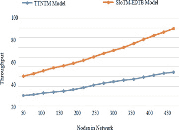

# 用于敏感数据传输的安全物联网模型使用区块链技术

**Vejendla Lakshman Narayana^(1, *)****,** **R.S.M. Lakshmi Patibandla^(2)****,** **Arepalli Peda Gopi^(1)**

¹ 印度安得拉邦冈特尔郡佩达帕拉卡卢鲁的维尼安尼拉科技与科学大学为女性

² 安得拉邦维尼安科学技术与研究基金会信息技术系

## 摘要

技术方面的全球进展涉及到智能物体，它们可以进行通信并解决我们智能物种的问题。令人兴奋的“物联网”或“物联网”世界绝对是一个能满足我们需求且安全的地方。机器到机器（M2M）的通信技术使设备在没有人类干预的情况下实现自主网络。这种自主控制对于各种物联网（IoT）的实现至关重要，包括智能制造应用、医疗系统和家庭自动化等。由于其跟踪和影响环境的能力，物联网已经吸引了几乎所有人的注意。任何物联网系统的关键特征之一是其与其他设备连接并交换数据的能力。特别是，物联网设备正在使用无线网络与其他设备通信。在这项测试中，它告诉我们物联网技术如何与我们的生活进行通信。所提出的方法使用区块链技术进行安全物联网模型以实现高效的数据传输（SIoTM- EDTB），确保数据在传输过程中的安全。提出的模型与传统方法进行了比较，结果表明提出的模型表现更好。

**关键词：** 攻击、区块链、数据丢失、数据传输、安全模型。

* * *

^* **通讯作者 Vejendla Lakshman Narayana：** 印度安得拉邦冈特尔郡佩达帕拉卡卢鲁的维尼安尼拉科技与科学大学; 电子邮件：lakshmanv58@vignannirula.org

## 1\. 引言

物联网是一种旨在将普通日常物体转变为智能物体的新的计算范式。物联网被描述为当今的变革性创新之一，它将改变我们对周围环境的视觉、解释和反应。无处不在和广泛的计算技术的进步-

物联网的发展和启用依赖于集成设备、通信、传感器网络和基于互联网的协议 [1] 在普通设备中，因此这些技术通常被称为物联网的技术启用 [2]。作者特别关注不同无线通信技术的特点、能力、优势和问题，对物联网设备广泛使用的不同无线通信技术进行了审查。

物联网范式并不是一种新技术，而是一种结合了半导体控制器、网络和信息处理研究发展的 20 个国家的方法[3]。如果你能接受一个数据中心，你可以使用物联网产生以上下文为中心的数据，并将其传输到另一台设备或云端，在那里进行处理和挖掘以提取保密知识[4]。如果你能接受数据中心，还可以使用物联网创建新的设备和新的实体物体。这将促使新的技术和应用被创造出来。在促进物联网设备与门户之间的无线共享，以及通过互联网到达远程存储库的网关中，机器对机器（M2M）通信技术起着至关重要的作用。鉴于物联网设备的电池容量有限，显然无线通信的能耗效率非常重要：都进行了广泛的占空比和能量恢复解决方案的研究。

物联网专注于传统电话网络和其他知识提供者。物联网是对互联网的延伸。互联网终端是一个运行各种程序的计算机（个人电脑，服务器）[5]。互联网只不过是机器和网络之间数据的编码和传输[6]。互联网上没有其他终端（硬件）。互联网仍然是物联网的主要概念。与互联网不同的是，不仅有个人电脑和服务器，甚至内置计算机系统和它们的传感器也可以被视为终端[7]。它能够连接各种独立的对象，并使它们共同工作以实现功能互联网络。

区块是这项技术的主要原理。在此方案中，有小数量的交易集合。每个新的区块都包含对先前交易的引用，包括先前交易的 SHA-256 哈希[8]。这创造了一系列的连接。区块在计算上难以构建，并且需要多个专门的处理器和大量的时间来产生。由于创建一个区块的难度以及来自一个区块的干扰，改变之前的一个区块并遵循链来完全改变它需要操纵。

所提出的模型引入了使用区块链技术进行高效数据传输的安全物联网模型。在提出的模型中，数据传输是安全的，因为使用了区块链技术来锁定已完成的传输，以便监控节点的行为 [9^-12 ]。引言部分简要介绍了物联网和区块链，其余章节分为文献综述部分，然后是解释安全数据传输框架流程的提出模型，然后讨论结果，最后给出了该章节的结论。

## 2\. 文献综述

Bedogni *等人*提出了绿色智能城市的新无线通信系统 [6]。由于物联网设备被用于规划、制造信息以及监控家庭的能源供给和需求，因此物联网在其规划中起着关键作用。尽管其主要目的不是分析物联网中使用的通信系统，但由于它们在最终实施中起着重要作用，因此它们进行了评估。该工作中进行的评估相当肤浅，重点不在接触而在无线能量传输上 [13^-15]。此外，并没有考虑所有可用技术进行评估，因为其主要关注异构物联网应用的 SDN（SDN）架构。

该研究调查了诸如蜂窝网络、短距离多商店技术和低功耗（LPWA）技术等系统，以便将它们用于智能城市的实施。这些通信技术面临的关键弱点是在受限领域中无法实施大规模 [16]。还建议可以通过包括小区放大、HetNets 实施和上下文感知内容传输等各种网络优化方法来解决这些限制  [17^-19 ]。

这项调查与我们的研究类似，尽管其主题有很大不同，因为它主要基于蜂窝技术，并详细研究了 5 G 的最新标准；相对于这一点，我们的工作提供了对 M2M 场景的更一般分类（*例如* 根据更短的距离和毛细技术）。数据传感器管理和信息提取在第二组中非常重要  [20^-22 ]。

企业一直在仔细研究和分类从本地化产品到制造和医疗保健等工业上下文感知技术和应用  [23^-25 ]。群众感知技术是在物联网、上下文感知计算和移动设备的融合上进行探索。

## 3\. 提出的模型

区块链 - 一种分散的分布式头条 - 是一种突破性技术，能够解决物联网安全挑战。基于区块链的物联网网络方法将解决当前模型面临的众多问题，并提高安全性。

区块链作为对抗物联网网络威胁的重要工具具有以下特点。

### 3.1\. 分散化

数据保存在区块链账本上的世界各地的各个节点上，防止单一故障点。在将任何数据添加到网络之前，每个节点都必须接受和验证它。因此，没有所有网络参与者的一般批准就不允许进行任何更改。这种方法称为节点通信，旨在通过恶意方保证区块链交易。如果黑客从服务器记录数据并将其发送到计算机，就没有单个服务器，因此没有风险发生中间攻击。

### 3.2\. 媒体连接

区块链是公开的，并对网络上的每个人都是开放的。所有网络参与者都可以看到存储块和交易的公共历史，但需要私钥才能访问。这提供了对所有活动的完全访问，并保持数据安全。如果将信息存储在区块链中，就不能改变。

### 3.3\. 安全信息

为了保护数据，区块链使用先进的加密算法进行私人加密。这主要是为了确保金融活动不受风险。物联网设备可以像金融交易一样安全地发送和接收信息，利用区块链模型在连接的物体之间进行安全数据通信。

物联网的安全是隐私的一大问题。免费的互联网数据访问使用户可以在没有他们的同意的情况下被监测机构收集和监视。物联网的最近增长会很容易通过数据收集活动导致不良情况。一个可行的解决方案是让用户控制自己的数据，并确保机密性。这定义了这些程序需要多少数据才能正常工作，或者在所有情况下实际上是由客户所同意的。另一方面，在我们的环境中，物联网设备经常滥用概念，无需用户许可书就收集信息。

因此，需要更大的隐私保护来保护物联网用户的个人信息。限制用户联系并分享所需最少信息的新解决方案是代表方法。让消费者找到最符合其偏好的平台上的其他人，而不需要符合其偏好。

为了向所有人展示这一知识。另一个正在进行的概念是隐私辅导员，该概念的本质在于系统可以扫描和检索嵌入式设备的标签。如果物品的隐私政策不符合用户的偏好，用户拒绝使用该物品。在其他情况下，扫描的物品明确地传输它们的隐私政策，并请求用户的同意。隐私辅导员将作为物理空间，恶意和不需要的扫描的防御机制。

各种攻击形式基于思科模型，因为它是非常类似于 ISO / OSI 模型的常见模型。下面提到的攻击可以对智能家居设备构成真正的挑战。

### 3.4\. 边缘节点攻击

本节提供了对不同攻击的深入概述，包括节点对参考模型的第一层的攻击。

### 3.5\. 安装被拒绝

拒绝服务攻击（DoS）通常是一种类型的攻击，通常用来淹没由流量驱动的服务器、设备或网络，以超负荷受害者的资源并阻止合法用户使用它们。在物联网世界中，DoS 可能是针对边缘计算节点的三种不同攻击。

电池耗尽：物联网设备的尺寸限制导致其使用了容量非常有限的电池。电池耗尽攻击已经成为一种有效的工具，间接导致严重后果，如节点故障和功能故障。例如，如果闯入者发现了一种耗尽智能 SMD 探测器电池的方法，整个火灾报警系统将被禁用。如果这样的系统中没有电池可以更换或充电，攻击者可以通过向节点发送大量任意流量并迫使其执行诸如数据包身份验证和校验和之类的控制来破坏网络中的节点。 

丧失睡眠：是一种相对类似于通过节点电池进行耗尽的攻击的特定类型的 DoS 攻击。能量有限的电池供电设备容易受到这种攻击。攻击者及时发送一定数量的请求，以避免睡眠或干扰节点功能。电池驱动攻击由于数据包是真实的，因此更难以检测。外部攻击是最常见的阻止边缘节点和迫使停机的 DoS 类型。这阻止了机器正常操作，并且在某些情况下完全关闭了运行。这可能是由于意外制造错误，上述电池攻击，未经授权的物理访问设备，或注入代码。Stuxnet 插入了一种恶意代码，这个代码避开了伊朗的异常行为，从而使其在紧急状态下无法关闭，这是一个著名的失败攻击的例子。

### 3.6\. 强大的节点管理

对网络的物理访问是进一步攻击的契机。直接节点操纵攻击可以根据攻击节点所进行的操作类型分为两类。每种攻击都可能造成严重的损害，并经常导致网络性能大幅下降。节点复制是一种攻击类型，攻击者通过向现有节点集合中添加一个新节点来复制节点标识号。新添加的节点通常是恶意的，这使得攻击者可以轻松地破坏或误导复制数据包。这种攻击允许攻击者访问加密共享密钥，甚至通过执行节点吊销协议，重新定位到有效和授权节点。

伪装攻击用于插入或击中被接受在边缘上隐藏的节点。这种恶意节点在正常模式下被使用，其中被标识为活动的数据包被接收、处理或发送回去。只通过被动模式进行流量分析和数据收集。节点功能被定义。节点腐败是一种常见的攻击，用于未经授权地访问基础节点网络。插入到网络中的恶意节点将获得访问其他节点的权限，可以控制整个系统。恶意软件节点还可以用于在设备中插入虚假数据或阻止真实消息的传输。

### 3.7\. 路由攻击

路由过程中的攻击询问数据包如何路由到通信层。攻击者可以通过此类攻击伪装、重定向、出错或完全将数据包丢弃出网络。路由信息可以简单地更改，以创建路由环路或错误消息。路由攻击随后可以分为几种不同的类别。

灰洞攻击被称为攻击的变种，在这种攻击中，节点选择性地丢弃某些数据包。虫洞攻击比黑洞和灰洞攻击更危险，因为它们可以在所有通信中执行，即使具有真实性和保密性。这种攻击的核心是接收数据包，然后将其隧道传输到网络中的另一个位置。基本上，虫洞节点在网络中创造出一条比原始路径更短的路径。因此，隧道必须是一个快速连接，以制造假象，使两个虫洞节点非常相似。

### 3.8\. IoT 区块链解决方案

应该注意的是，特别是全球 P2P 框架跨越整个物联网生态系统发展时，上述机制（P2P 网络参与，支持可接受的 P2P 协议，支持对等功能认可，支持共识算法，PoW 以及其他相关机制）会变得有些复杂。由于 IoT 节点的常规限制，如第二部分所述，将在 IoT 通用框架内使用成熟的区块链网络可能并不总是可行；某些重要或机构应用，如智能电网、ITSs、电子健康、保险或智能合同环境，可能具有足够的能力来支持 P2P 所需的功能。另一种选择是建立具有有限本地范围而不是全球范围的 P2P 网络；这需要更少的集中带宽，并且对于所支持的消息在大网络中的稳定分发具有远大的保证——查找、事务查询、调用、同步和共识。

### 网关的阶段：

个人用户生成的数据并不总是安全可靠的，但一旦数据进入网关，它就会与其他用户的数据集成进区块链中。

### 照片图片：

这就是一个例证。其中一个原因是个体终端节点没有计算能力来生成（可能是大的）数据块的哈希值。

### 标准网站：

在这种情况下，个人网站用户（*例如*地板上的传感器或机器人）生成的数据并不会自动为系统的完整性而得到保护。然而，一旦数据输入本地焦点节点（*例如*第二层交换机，Wi-Fi 连接点，路由器，防火墙，等等），这些数据就会与网站其他用户的信息一起集成到区块链中。采用这种方法的原因之一是因为个体终端节点无法计算（可能是大的）数据块，但基于网站的 NE 将有能力进行计算。

### 3.9\. 使用区块链技术进行强大的 IoT 保护

为了稳定应用 IoT，应考虑以下几点。

#### 3.9.1\. 安全通信

为了处理交易，IoT 设备必须进行通信并将其保存在存储库中。账本还可以用来存储加密密钥，以确保安全转移。通过目的设备的公钥将加密消息发送到 IoT 系统，然后将其保存在区块链网络中。发送方然后要求他的节点从标题中获取接收方的公钥。发送者然后使用接收方的公钥加密消息，因此只有接收方可以使用他的私钥解密消息。

#### 3.9.2\. 用户认证

在将消息发送给其他用户之前，发送方将对消息进行数字签名。为了验证收到的信件的数字签名，接收方将从账本中收到公钥。以下是数字签名的工作内容：

+   发送方计算私钥加密消息的哈希。

+   该消息将随数字签名一起发送。

+   接收方将使用存储在目录中的公共发件人密钥解密数字签名，以检索发件人哈希值。

+   仅当消息的哈希和测量的消息的哈希相同时，消息才为真。

+   如果每个发件人的数字签名都存储在目录中，则恢复的信心会得到增强。

#### 3.9.3\. 找到广泛的合法 IoT

一旦引入新的 IoT 系统，根服务器就会请求网络上信任节点的列表。然后该计算机在一个节点中进行注册，信息交换开始。为了确保根服务器名称解析的安全性，必须引入 DNSSec，以防止欺骗攻击。任何联系都必须得到有效的身份验证和加密。可以基于以下内容进行：

+   凭证在计算机配置过程中已经装载。

+   IoT 设备所有者可以发布凭证。

#### 3.9.4\. IoT 配置

区块链技术极大地有助于构建安全可靠的 IoT 设备设置。在这方面似乎很重要的方法有：

+   在分类帐上，您可以托管物联网功能，例如设置数据和已验证固件的最新版本。在引导过程中，您的区块链节点必须从分类帐中设置。设置需要在小册中进行加密，以使得公共领袖中包含的信息不会揭示物联网网络的拓扑或其属性。

+   每台设备的哈希值可以存储在最新配置文件的分类帐中。物联网设备需要定期使用云服务下载最新且最可信的配置文件。然后，应用程序可以使用区块链节点 API 检索并匹配存储在数据库中的哈希值。因此，管理员能够定期卸载不良设置，并重新启动网络上的所有物联网系统，使其使用最新且最可信的设置。

+   使用区块链网络保护物联网网络是一个没有单一权威能够批准任何交易的去中心化系统。来自每台计算机的不断增长的数据链的副本将会产生。这意味着只要有人想要访问系统并且进行交易，所有网络成员都必须对其进行验证。确认后，交易被放入一个块并转发到网络上的所有节点。所有这些都确保未经授权的来源不会违反安全性，并使系统更加安全。

## 4\. 结果

所提出的模型使用 NS2 模拟器来创建用于安全数据传输的物联网节点。所提出的模型引入了一种使用区块链技术进行高效数据传输的安全物联网模型。所提出的模型与传统模型进行比较，结果显示所提出的模型在使用区块链技术进行数据传输时表现出更好的安全性。所提出的模型在数据传输速率、安全级别、攻击识别级别、准确性和吞吐量方面与传统模型进行比较。用于创建物联网模拟的参数如表 **1**所示。

表 1 **使用的参数。**

| 节点数量 | 50,100..300 |
| --- | --- |
| 区域大小 | 500 X 500 |
| MAC | 802.11 |
| 模拟时间 | 200 秒 |
| 流量来源 | CBR |
| 包大小 | 512 |
| 发射功率 | 1.500w |
| 接收功率 | 0.675w |
| 传输范围 | 100m |
| 汇聚数量 | 5 |

所提出的和传统的可信节点传输方法（TTNTM）的数据传输速率如图 (**1**)所示。与现有方法相比，所提出的模型的数据传输速率很高。由于所提出的模型仅考虑授权节点，因此数据传输速率很高。所有节点将数据传输给其邻居节点，而不会造成任何数据丢失。所提出的模型使用区块链记录所有数据传输实例，然后分析生成的区块，以识别恶意节点。

**图 (1))**

数据传输速率。

提出的模型利用区块链技术记录已完成的交易。由于使用了区块链，提出的模型的安全性高于现有方法。当区块创建时，交易被记录并且不可修改。没有机会修改其内容。所有生成的区块相互链接。提出和现有方法的安全级别如图所示（**2**）。

**图（2))**

安全级别.**图（3))**

攻击识别级别。

由于物联网经历了数次攻击，区块链模型用于高效识别攻击和攻击发生的位置。提出模型的攻击识别水平高于提出的模型。在提出的模型中，针对每笔交易生成区块，并对节点行为进行分析。区块的值显示了哪些节点导致了数据丢失，并且容易识别出导致恶意行为的节点。攻击识别级别如图所示（**3**）。

**图（4))**

准确度水平.**图（5))**

吞吐量。

每次成功的数据传输之后，区块链将记录每一笔交易直至完成整个流程。提出模型的准确度水平如图所示（**4**）。提出的模型的准确度高于现有方法。提出的节点识别出恶意节点，以提高数据传输速率。不允许恶意节点参与数据传输。

提出模型的系统使用也很高，因为提出模型使用物联网节点，并考虑了区块链记录交易。提出和现有方法的吞吐量水平如图所示（**5**）。提出模型使用生成的区块分析节点的数据接收和传输速率。提出模型移除了恶意节点，使得数据传输准确度高。

## 结论

物联网是人们能够走向的关键路径。一些主要公司已经开始向我们的日常生活提供各种服务，例如智能家居、健康监控等，通过使用物联网来提高人类生活的质量。这是整个计算机科学技术的一个重大进步。然而，它有两面性。我们可以引起关注的一些问题。众所周知，物联网是互联网的下一个版本，但它一直都是围绕互联网展开的。保护问题仍然是一个需要关注的重点。电信技术也限制了电信的增长。此外，我们还应该关注延迟、传输成本等问题。文章中列举了物联网应用的一个例子。它解释了一个简单的物联网可能已经对人们的生活产生了影响。然而，我们应该关注未来的工作。认知物联网方法更为复杂，但要看到物联网如何实现物联网的最终目标更为成功。应将真正的认知物联网框架的创建视为未来的任务。未来，可以指派一个中央头节点来分析剩余节点，以减少网络中的复杂性和拥塞。

## 发表同意

不适用。

## 利益冲突

作者声明没有任何利益冲突，无论是经济上还是其他方面。

## 致谢

声明无冲突。

## 参考文献

|  |  |
| --- | --- |
| [1] | 马丹 L.，库马尔 A.，布舍 B.。区块链技术的工作原理、应用领域和挑战 2020 IEEE 第 9^(th)届国际通信系统和网络技术会议（CSNT）202025425910.1109/CSNT48778.2020.9115794 |
| [2] | 古普塔 S.，辛哈 S.，布舍 B.。区块链技术的出现：基本原理、工作原理及其各种实现（2020 年 4 月 6 日）国际计算和通信会议（ICICC）2020 年论文集 |
| [3] | 马利克 A.，高坦姆 S.，阿比丁 S.，布舍 B.。区块链技术-物联网的未来：包括结构、局限性和各种可能的攻击 20191100110410.1109/ICICICT46008.2019.8993144 |
| [4] | B.布舍，C.萨胡，P.辛哈等。区块链和物联网（BIoT）的统一：需求、工作模型、挑战和未来方向无线网络 202127559010.1007/s11276-020-02445-6 |
| [5] | 布舍 B.，卡姆帕里亚 A.，萨加亚姆 K.M.，夏尔马 S.K.，阿哈德 M.A.，德布纳斯 N.C.等。智能城市区块链：架构、整合趋势和未来研究方向可持续城市与社会 202061102360 |
| [6] | 贝多尼 L.，马拉博奇亚 F.，迪·菲利斯 M.，博诺尼 L.。室内使用灰色和白色空间：对无线室内通信的另一种看法，IEEE 汽车技术杂志（2017）XX12-XX12 doi:10.1109/ MVT.2016.2598414\. 1830 |
| [7] | Longoria G., Akhtar F., Shi L.. 智能城市中的无线电能传输：wIshood 无线智能社区第 6 届国际智慧城市与绿色信息通信技术大会, Porto, Portugal201731732210.5220/0006364003170322 |
| [8] | Chiariotti F., Condoluci M., Mahmoodi T., Zanella A.. Symbiocity: 智能城市的更智能网络.Trans. Emerg. Telecommun. Technol.201729110.1002/ett.3206 |
| [9] | Cachin C.. 超级账本区块链结构分析 Workshop on Distributed Cryptocurrencies and Consensus Ledgers2016 |
| [10] | Conoscenti M., Vetro A., De Martin J.C.. 物联网中的区块链：系统文献综述第 13 届 IEEE/ACS 国际计算机系统与应用会议论文集, AICCSA 2016, IEEEAgadir, Morocco201610.1109/AICCSA.2016.7945805 |
| [11] | Dorri A., Kanhere S.S., Jurdak R.. 物联网中的区块链：挑战与解决方案 2016 [`arxiv.org/abs/1608.05187`](https://arxiv.org/abs/1608.05187) |
| [12] | Dorri A., Kanhere S.S., Jurdak R.. 用于物联网优化的区块链第 2 届 IEEE/ACM 国际物联网设计与实施会议论文集, IoTDI 2017, ACM2017173178Pittsburgh, PA, USA |
| [13] | Conoscenti M., Vetro A., De Martin J.C.. 物联网中的隐私与去中心化的点对点系统第 39 届 IEEE/ACM 国际软件工程会议论文集, ICSE-C2017288290IEEE, 阿根廷布宜诺斯艾利斯 10.1109/ICSE-C.2017.60 |
| [14] | Crosby M., Pattanayak P., Verma S., Kalyanaraman V.. 区块链技术：超越比特币应用创新 20162610 |
| [15] | Wörner D., Von Bomhard T.. 当你的传感器赚钱：用比特币交换数据的方式 2014 ACM 国际泛在计算联合会议论文集, UbiComp2014295298ACM201410.1145/2638728.2638786 |
| [16] | Lakshman Narayana V.. 使用时间级别锁定加密实现安全数据上传和访问敏感数据，提供高效的云框架 Ingenierie des Systemes d'Information2020254515519 |
| [17] | Lakshman Narayana V.. MANET 中基于时间间隔的区块链模型用于检测恶意节点，使用网络区块监控节点国际发明研究计算应用大会 (ICIRCA)2020852857PublisherIEEE9183256 |
| [18] | Lakshman Narayana V.. 移动自组网中增强的路径查找过程和数据包丢弃减少国际无线与移动计算期刊 2020184391397 |
| [19] | Lakshman Narayana V.. 基于时间间隔的区块链模型用于 MANET 中检测恶意节点，使用网络区块监控节点.IEEE Xplore2020 |
| [20] | Lakshman Narayana V.. 终端基于信任的高效区块链联接路由方法论文, 用于增强移动自组网的安全性国际安全与安全工程杂志 2020104509516 |
| [21] | 古尔索 C.，戈斯 J. M.。物联网的专用网络：PHY / MAC 现状和挑战 EAI 认可的物联网事务 1825 年 20151111110.4108/eai.26 |
| [22] | 科万 J.。无线通信公司更名为 Ingenu，并推出全美范围的 M2M 无线公共网络（2015 年） |
| [23] | 金 H.。数字货币加密技术在商业营销和金融安全中的研究。亚太多媒体服务与艺术、人文和社会学相交汇的期刊 20166136537610.14257/AJMAHS.2016.01.42 |
| [24] | 瓦辛 P.。Blackcoin 的权益证明协议 v22014 |
| [25] | 伍德 G.。以太坊，一个安全的去中心化通用交易分类账以太坊项目黄皮书 2014151 |
