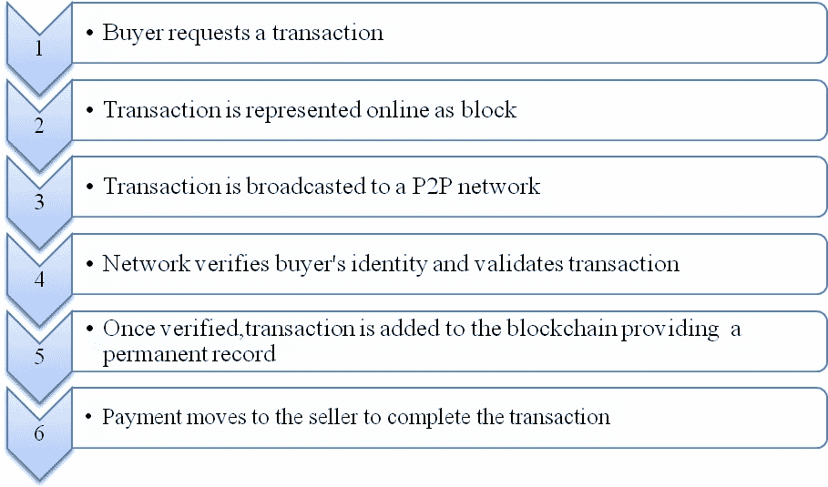
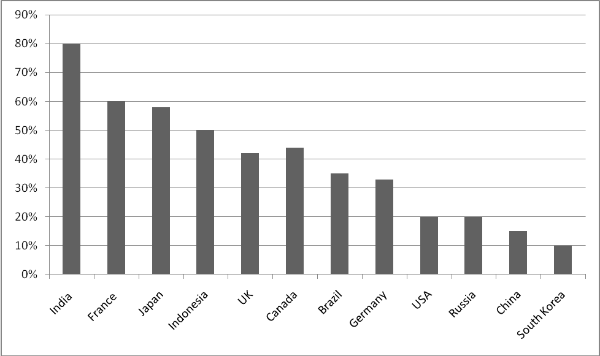
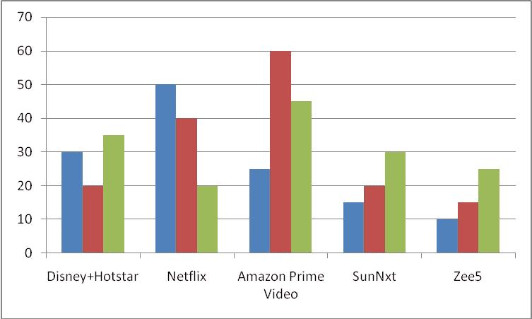
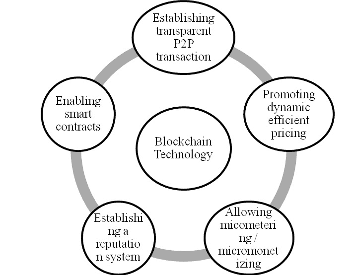
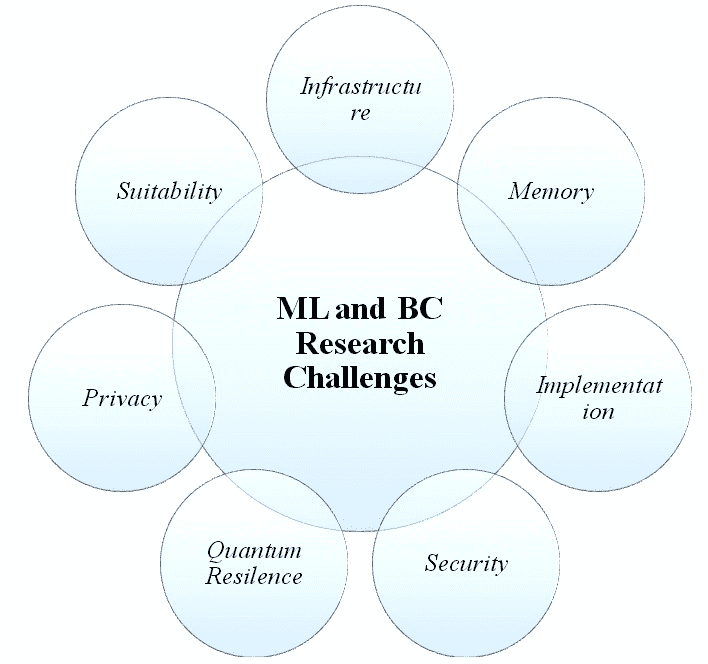

# 利用区块链技术改变 OTT 数字平台业务

**J.S. Shyam Mohan^(1, *)****,** **Nagendra Panini Challa^(2)****,** **Pasumarthy Swathi^(1)****,** **Nuggu Kowshiki^(1)**

¹ 印度泰米尔纳德邦斯里坎德拉赛卡伦德拉沙拉斯瓦西大学（SCSVMV）计算机科学与工程系，邮编 631561

² 印度安得拉邦比马瓦拉姆斯里维什努女子工程学院信息技术系，邮编 534202

## 摘要

技术已成为我们生活中不可或缺的一部分。它在健康、银行和教育等领域发挥着重要作用。组织已经开始采用这些技术发展以满足客户的需求。OTT 数字平台的崛起创造了一个经济平台，其中数字内容、服务和产品通过中介方进行促进，并改变了互动方式。区块链作为一种手段，在中介方之间创造信任，从而创建了数字平台。组织应该进行创新的技术实践，以在竞争环境中取得成功。本章检查了区块链平台与数字转型过程的关系，为研究区块链对 OTT 平台影响提供了全面的方法。

**关键词:** 区块链技术，数字技术，OTT。

* * *

^* **通讯作者 J.S. Shyam Mohan:** 印度泰米尔纳德邦斯里坎德拉赛卡伦德拉沙拉斯瓦西大学（SCSVMV）计算机科学与工程系，邮编 631561；电话：??????;

电子邮件: jsshyammohan@kanchiuniv.ac.in

## 1\. 引言

Over-the-Top (OTT)是媒体行业用于通过物理链接和盒子将电视传送到个人家庭，并通过网络“超越”链接和盒子传递先进内容的术语。 OTT 有两种产品，内容和观众或订户。从各个地点收集的数据使用大数据分析进行处理，以增强和改善客户的观看体验。与传统电视的稳定竞争相比，世界范围内 OTT 平台的前景看起来光明。传统电视已开始通过适应新技术来创新，以触及更广泛的受众。在过去的十年中，传统电视已经

开始将 OTT 平台作为向消费者提供服务的一部分。AIB 研究指出，全球视频市场将继续以超过-the-Top (OTT)的快速速度增长。到 2022 年，OTT 市场将产生高达 514 亿美元的巨额收入，复合年增长率（CAGR）达到 10%。订阅者可以在订阅 OTT 平台后享受大部分 OTT 提供的好处。在北美和欧洲等国家，电视频道播出商为他们的客户提供 OTT 服务以持续吸引他们。虚拟多频道视频编程（vMVPD）以相对较低的价格提供给所有订阅者[1]。在全球范围内，选择 OTT 的订户数量正在增加，而传统电视正在下滑。预计付费频道的平均用户收入（ARPU）到 2022 年可能会下降四倍。因此，毫无疑问，OTT 播放器正朝着通过增加更多的订户来增加其收入的方向前进。亚马逊、苹果、DAZN、Facebook、谷歌和 Netflix 已开始投资建立自己的制作公司。广播公司拥有的 OTT 平台在内容上有很大的需求，未来将会与 OTT 提供商之间达成交易[2]。表 (**1**) 显示了 2020 年 FICCI-E&Y 行业报告的行业报告。  

表 1 **FICCI-E&Y M&E 行业报告 2020.**

| **客户分段** | **特定年份的用户数量（百万）** |
| :-: | :-: |
| **2018** | **2019** | **2022** |
| :-: | :-: | :-: |
| 数字内容（用户仅在数字平台消费内容，不使用电视） | 2.5 | 8 | 14 |
| 战术数字（消费付费电视和至少一个付费 OTT 服务） | 12 | 34 | 91 |
| 组合数字（与电信捆绑消费付费电视） | 218 | 262 | 363 |
| 大众消费者（消费付费电视，并偶尔观看一些免费 OTT 内容） | 426 | 316 | 176 |
| 免费消费者（不支付内容费用） | 180 | 190 | 220 |

全球 OTT 市场收入预计将从 2018 年的 6200 万美元增加到 2024 年的 149.7 亿美元，年复合增长率（CAGR）达 15.8%[4]。印度用户更倾向于免费内容而不是订阅平台。基于此考虑，OTT 播放器推出了一种面向用户付费的模式，称为按需订阅（SVOD）业务模式，以月度或年度计费方式。与此同时，许多 OTT 播放器正在努力推广基于广告的视频点播（AVOD），而其他 OTT 播放器则坚持免费业务模式并计划将其转化为付费用户。 区块链描述了一组共享、维护、数字记录，并由多个参与者验证的不断增长的记录。虽然有很多种区块链模式，但这个定义适用于大多数情况[5, 6]。区块链中的每组数字记录按序分组为相依块，这意味着试图修改任何块中的交易通常需要修改所有后续块，这是一个计算密集型的任务，设计上从经济上来说是可行的，考虑到新块在几分钟内被添加。这个过程使得数据更加可靠，随着时间的推移，将添加更多块。由于这个独特的记录集在几处或多地不断维护，因此具有高度的容错性；没有中央机构会攻击、关闭、强迫或（在许多情况下）起诉[7]。这种去中心化对于完成这项工作绝对至关重要；由单个实体 100%拥有的区块链提供的辅助增益微乎其微。区块链技术的起源可以追溯到比特币加密货币。确保在没有信任的中央机构（如银行、电子支付提供商或政府）的参与下围绕永久数字分类账达成共识是必要的，以创建“数字货币”[8, 9]。在没有权威方来维护登记的情况下，必须设计出一些非常创新的东西，以致某人无法复制并两次花费他们的数字货币。区块链技术的这一特性，或者说是拥有独特而真正拥有的数字资源的能力，对品牌和营销人员来说是一个至关重要的特征。区块链技术的“数字稀缺性”不仅支撑着比特币的价值，而且为品牌提供了一个真正连接有限物理世界和数字无限世界的桥梁。许多公司将区块链视为一个开放平台[10]。开放区块链，如支持比特币加密货币和以太坊网络的区块链，依赖于一种新模式来弥补缺少受信任中介的缺失。另一方面，通过探索封闭或“授权”的区块链，金融机构正遭受 2008 年危机后某个匿名个体或团体发明的技术使他们变得多余。即使在这种数字化的实施中，银行也可以通过继承一些开放区块链的特性，如不可变性和去中心化，获得诸如快速结算时间和更快达成的贸易融资条款等优势。

近年来，不列颠哥伦比亚省在行业中声名鹊起，并逐渐被认为是许多行业（如服务、金融和制造业等）的改变者[11]。由于其特定特性，如隐私、安全、智能合约、可扩展性以及解决文件双重支付问题的能力，提高供应链管理的效率变得至关重要。BC 的实施改善了两方或多方之间的交易，涉及智能合约的保密性、监测、透明度和可执行性。长期使用 BC 技术使供应链系统更加节能、价格合理并朝向高性能发展。应用 BC 技术可以用来提高效率和资源的有效利用，而这种最新的技术有助于建立一个 CSS。不列颠哥伦比亚是新兴技术，研究人员和行业专业人员力求在供应链领域实施不列颠哥伦比亚。这项技术处于早期阶段，到目前为止在该地区的工作还很有限。以下是 BC 地区的主要差距，特别是在 SSC 方面[12]。我们的社会应该朝着 2030 年更数字化、数据驱动和智能化解决方案的社会发展，这需要几乎即时的无线连接。因此，未来十年将涌现出几个提供这种互动和整合的新型应用。比如，未来近期可能出现的一些关键趋势是：虚拟和增强现实、8K 视频流、全息图像、远程手术、工业 4.0、智能家居、雾计算、综合人工智能服务、无人机和自动驾驶车辆等。这又将要求移动网络具有比 5G 更高的可靠性、延迟和更高的数据速率[13]。为了提供视频流式传输，OTT（Over-the-Top）服务与 QoE（用户体验质量）和 QoS（服务质量）等互补软件解决方案重叠。大多数 OTT 供应商都有自己的专有软件，并利用服务器、网络和智能软件的组合来实时确定服务质量[14]。消费者希望在自己的设备上在方便的时间观看各种内容中提供的个性化视频。OTT 平台已经彻底改变了以满足消费者的需求。在 OTT 平台上观看的视频将成为一个产生收入的模式。人均 GDP 的增长随着智能手机用户数量的增加而增加，*等等*，最终将使 OTT 市场增加其收入。OTT 面临一些需要克服的挑战，例如盗版、审查制度和低互联网速度，*等等*。

本章重点关注以下方面，但不限于：

+   提供对 OTT 应用程序及其在区块链技术中实施的更好理解。

+   区块链技术为版权所有者提供了一种有效的版税支付方式，无需第三方介入。

+   描述了 2018 年至 2020 年印度 OTT 应用的崛起和使用统计，并建议实施区块链以确保安全和隐私。

本章的其余部分按照以下组织：第二部分概述了印度 OTT 内容的崛起。第三部分定义了区块链和智能合约。第四部分阐述了提出的区块链商业模型、益处和挑战。第五部分重点介绍了利用区块链技术作为理论视角转型 OTT 数字平台业务。第六部分提到区块链技术作为 OTT 平台业务的游戏规则改变者及其实时应用的颠覆。第七部分探讨了区块链（BC）中的机器学习（ML）采用-研究问题与挑战，最后是结论。

## 2\. 为客户提供视频流媒体应用内容的崛起

多年来，全球 OTT 平台的订阅数量增长了 285%。Netflix 是 2016 年至 2019 年期间年度消费者评价最高的应用程序。Disney+的推出也为这个市场增加了更多的收入。与其他国家相比，印度拥有最多使用 OTT 平台的消费者。在 2018 年至 2019 年期间，OTT 平台在印度发挥了至关重要的作用。在过去一年中，电视内容一直是利用率最高的分类。直到今天，电视观看没有出现任何负面发展；因此，追赶观看可能是 OTT 贡献最强有力的保证。直播流媒体在板球赛季和一些节目如“权力的游戏”期间吸引了很多消费者。电视广播公司推出了新武器，通过他们的 OTT 平台直播了现场内容。内容的直播吸引了很多消费者。选举和恐怖袭击等事件在 OTT 平台上创造了巨大需求。OTT 平台中的视频内容消费引发了对更多直播和基于内容的需求。然而，OTT 平台上没有视频审查委员会，像特别节目*等*会有暴力和低俗内容，可以在 OTT 上播放，但不可以在电视上播放。印度的平台如 ALTBalaji 吸引了很多消费者。除了 ALTBalaji，Netflix 和亚马逊也吸引了很多印度观众。OTT 平台的另一个重要方面是这些平台试图增强基于已在电视上播出过的现有库中的视频内容。印度有很多频道，每天提供无数小时的视频内容。内容在一个平台上证明了其价值，就会被传播到另一个平台上，因此重复的内容仍然备受追捧。内容在各个平台上都在播放，并且消费者不断在所选择的所有可用平台上探索。新增视频的需求正在增加。原创视频内容将定义特定 OTT 的增长。随着互联网接入成本变得更加便宜，越来越多的人对 OTT 平台显示出兴趣；尤其是半城市和农村地区可以接触到内容。这些消费者中的大多数是 OTT 的订阅者。在当前的情况下，即使是农村和非城市观众也开始对 OTT 展示兴趣。区域内容的结合将为当地市场提供一个 AVOD 平台。如果任何 OTT 提供商提供区域内容，那么他们将成为印度市场 OTT 平台的游戏规则改变者。OTT 平台的内容环境于 2018 年开始发展，公共支持内容、免费内容、工作室制作内容、电影内容和电视内容齐头并进。印度市场提供更多的进入者，提供类似电视的内容。全球 OTT 平台上大多数消费者都是印度消费者。广播 FM 已经传送音乐数十年，并提供随时随地的音乐。新兴的 OTT 平台已经开始让年轻消费者高消费参与其中。内容市场正在预期一场重大变革。许多 OTT 平台热衷于提供分为多集的特别节目，试图吸引更多订阅者。游戏和直播内容的流媒体正在发展；技术驱动的内容的兴起，如非线性内容、互动帐户、不同平台的故事和生动内容将在未来被 OTT 内容制作者探索。全球范围内，所有 OTT 播放器都在��力提供基于观众选择的精选内容。因此，主要参与者已经开始投资建立内容管道。Netflix 的投资是亚马逊和 Hulu 的 3 倍（BCG 2018 年 12 月）。OTT 平台内容的正常现金支出高于印度电视市场。全球视频流应用程序的使用时间在 2018 年与 2016 年相比增长了 140%，而在澳大利亚、印度、印度尼西亚、韩国和泰国等国家（App Annie，2019 年移动设备状况）的视频流应用程序使用时间。表(**2**) 显示 OTT 平台收入生成模型。表(**3**) 显示印度可用的 OTT 平台列表。

表 2 **超越平台-收入产生模式**。

| **国家** | **描述** |
| :-: | :-: |
| **中国** | 将在 2021 年贡献总收入的 76% |
| **韩国** | 每用户平均收入（ARPU）将达到 66.63 美元 |
| **印度** | 在 2021 年达到 10 亿美元的在线视频广告支出 |
| **日本** | 用户渗透率将在 2021 年达到 14.23% |
| **东南亚** | 预计 2021 年 SVOD 收入将增长超过 2 亿美元 |
| **OTT 视频收入将在 2021 年达到 183.96 亿美元** |
| **OTT 广告仍将是 2021 年 877.45 亿美元的主要收入来源** |

表格 3 **印度可用的 OTT 平台列表**。

| **序号** | **OTT 名称** | **发布日期** | **所有者** |
| :-: | :-: | :-: | :-: |
| 1 | 网飞 | 2016 年 1 月 6 日 | 摩根斯坦利、里德·黑斯廷斯 |
| 2 | 亚马逊 Prime Video | 2016 年 7 月 6 日 | 杰夫·贝佐斯 |
| 3 | SunNxt | 2017 年 6 月 | 卡拉尼斯马兰 |
| 4 | Aha | 2020 年 3 月 | 布赖恩·德·哈夫 |
| 5 | Zee5 | 2018 年 2 月 14 日 | 塔龙·卡蒂亚尔 |
| 6 | 迪士尼+Hotstar | 2020 年 3 月 29 日 | 鲍勃·艾格尔 |
| 7 | 索尼 LIV | 2013 年 1 月 22 日 | 索尼影业网络(印度) |
| 8 | Tentkotta | 2 月 5 日 | 瓦伦·库马尔 |
| 9 | MX Player | 2019 年 2 月 20 日 | 卡兰·贝迪 |
| 10 | Jio Cinema | 2016 年 9 月 5 日 | 慕克什·安巴尼 |
| 11 | Airtel Xtream | 2019 年 9 月 2 日 | 苏尼尔·巴蒂·米塔尔 |
| 12 | Idea Movies and TV | 2017 年 9 月 4 日 | - |
| 13 | YouTube | 2005 年 2 月 14 日 | 谷歌 |
| 14 | 塔塔天空 | 2006 年 8 月 10 日 | 哈里特·纳格帕尔 |

## 3\. 解决 OTT 挑战的技术创新

OTT 面临的挑战可以通过以下技术创新来解决[15]：

1.  区块链技术

1.  5G/6G 服务

1.  本地 CDN 网络。

## 4\. 区块链的定义

区块链是分布在许多参与者网络中的数据存储，依赖于基于交易有效性的共识，没有任何中央机构。在区块链中，交易无法被改变或修改，因为区块链是一个去中心化、分布式和公共账本系统。区块链由匿名用户管理。每个用户都可以使用不能被改变的共识算法检查数据并验证或丢弃。为了确保安全、透明和不可变的交易，加密货币使用区块链技术，在物联网中安全数据的保护也成功地通过区块链技术实现[16]。区块链的工作原理如图（**1**）所示。所有交易都是通过智能合约在区块链上进行的（第 3.1 节）。区块链的工作原理及其属性、应用可以在[19]中找到。区块链涉及的步骤如下：

**图（1）**

区块链的工作原理。

1.  买家在网上购买产品并进行交易。

1.  区块链中的交易被表示为区块。

1.  区块链中的所有交易都在对等网络中广播。

1.  区块链网络会检查买家的身份，并在验证后进行验证。

1.  所有经验证的交易都被记录并添加到区块链中。

1.  最后，交易完成，付款转至卖方。

COVID-19 吸引了很多用户依赖 OTT 平台。2018 年和 2019 年各国 OTT 应用程序（应用）的增长情况如图**2**所示，印度在 2018-19 年间 OTT 用户的百分比如图**3**所示，事实上，这激励了我们在区块链上开发 OTT 平台及其实施。我们提出的作品提供了大量的 OTT 应用程序，它们在区块链技术上的实施，以及实时使用案例场景。区块链技术为娱乐产业带来了许多优势，有助于防止盗版。为了更好地理解，在第 5 和 6 节中提供了区块链技术在娱乐产业中的应用。采用区块链技术的好处在第四部分中进行了突出。

图**2**显示了 2018 年至 2019 年间 OTT 应用程序的各国增长情况。图表显示印度在该时期有最多的 OTT 内容使用者或订阅者。

**图（2))**

2018-19 年各国 OTT 应用程序的增长情况。**图（3))**

印度 2018-19 年间 OTT 用户的百分比。

图**3**显示了 2018-2019 年印度 OTT 用户的百分比（应用使用情况）。

### 4.1\. 智能合约

智能合约是两个当事方之间做交易的协议。一旦签订了智能合约，它就不能被作废[20]。传统上，纸质合同由 TTS 管理和验证。传统合同存在以下问题：

1.  传统合同性质被动。

1.  两个当事方可能没有相同的数据或信息。

1.  他们需要不时进行手动干预。

1.  它们成本高昂。

## 5\. 提议的区块链商业模式、优势和挑战

商业模式试图建立一个能带来利润的模型。一家公司在广告上的支出更多。每个组织都会制定适合其业务需求的行动计划。为了确保安全、透明和不可变的交易，加密货币使用区块链技术。区块链是一个安全且分布式的分类帐，它将分类帐副本与每个参与节点共享[21]。区块链商业模式有助于改善组织，并使最终用户受益。

一个合理的商业模式必须集中在投资者而不是企业家身上。区块链商业理念必须在宏观和微观层面有效运作，因此使得员工和最终用户都受益。例如，BloHosT（区块链启用智能旅游和酒店管理）允许游客通过与加密货币服务器连接的单一钱包标识符与各个利益相关者进行互动以发起支付。BloHosT 使用一个不可变账本，在旅行中不需要任何证据，这样就为游客提供了无忧的体验。BloHosT 框架采用旅游启用的深度学习（TeDL）框架，它是在以前游客的经验上进行训练的。它对潜在游客提供了关于先前游客最近访问地点的评分[22, 23]。接下来的章节提供有关拟议商业模式、利益和挑战的信息。下面举例说明一个场景。

制造商的主要角色是从零开始或从任何自然来源创造产品。产品甚至可以通过制造汽车工业中的许多部件来制造。制造业遵循两种模式之一：商业对消费者，直接向消费者销售产品。在商对商或 B2B 模式中，产品被外包给另一家公司[24]。之后，批发商从生产商那里购买商品，然后销售给客户或零售商。批发商充当制造商与零售店之间的中间人。零售商从制造商那里直接或通过经销商购买产品。零售商可能在全国范围内经营，也可能独立经营。他们使客户可以轻松购买他们选择的产品。特许经营是所有上述商业模式的结合。特许经营把所有的商业程序和协议都包括在内。以下是区块链商业模式。

### 5.1\. 区块链即服务（BaaS）

最受欢迎的商业模式是 BaaS 模式。它帮助商业系统管理其区块链系统。该模式允许公司进行研究和测试流程*等*。BaaS 模式使公司能够专注于他们的业务发展周期。比特币和以太坊等服务如 EBaaS（以太坊区块链即服务）为这个模式提供支持。亚马逊网络服务、IBM BlueMix 和微软 Azure 是 BaaS 模式的例子。

### 5.2\. 通证经济- 实用通证商业模式

实用性是指从消费的商品中获得的总满意度。实用性商业模式依赖于像 Stellar 和 Ripple 这样的通证原则运作。资金使用 XRP（Ripple）或 XLM（Stellar）代币进行转移。

### 5.3\. 基于区块链的软件产品

期望获利的公司应购买区块链解决方案，并应将其整合到其系统中。 区块链在实施后支持公司的支付和其他方面。 例如，Spotify 购买了 MediaChain 区块链来解决其版税问题，并解决与人才招聘流程有关的问题。

### 5.4. 点对点区块链商业模式

点对点业务模式帮助用户直接互连。 这种业务模式使用 BaaS，代币，*等*。 点对点的例子包括存储和共享数据的 Filecoin 和 IPFS。

### 5.5. 区块链专业服务

为初创公司和其他小公司提供服务，以了解并采用区块链的使用。 区块链为公司提供审计服务 *等*。 例如，如果一个公司计划组建他们自定义的商业企业，他们可以与 IBM，德勤 *等*公司进行规划来完成任务。

## 6. 区块链技术的革命性好处

区块链技术是一种分布式账本技术，具有许多好处。 区块链技术的一些好处包括：

1.  提供更快的交易

1.  成本效益

1.  防黑客

1.  透明性

1.  可追溯性

1.  防篡改数据

1.  实时数据管理

1.  安全记录保管

1.  易审计的

1.  自动化等等。

## 7. 区块链在媒体和广播业中可以解决的挑战

区块链解决了媒体和广播业所面临的问题，甚至解决了 OTT 在第 3.1 节中提到的问题。 表格(**4**)显示了媒体和广播业所面临的挑战，以及区块链为解决这些问题所采取的措施[25]。

表 4 **行业挑战与区块链试图解决的步骤。**

| **挑战** | **区块链实施以解决挑战** |
| :-- | :-- |
| 盗版 | 避免内容聚合者; 为拥有者提供防篡改版权。 向版权所有者支付版税。 |
| 广告使用效果不佳 | 根据内容使用、所消费的内容类型和基于人工智能的代理，只能针对相关客户。 |
| 超越地理的按次观看 | 区块链跟踪每个用户的付款，并根据智能合约处理特定用户的付款。 |
| 点对点实体的货币化 | 区块链通过自动化实时过程货币化每一份分享。 |
| 版权和知识产权问题 | 区块链提供微支付、加密货币，以便用户只支付他们选择的服务。 |
| 股息分配问题 | 使用智能合约和微支付，交易变得透明。 |
| 流媒体音乐和版税支付 | 区块链使用与原始身份相关联的数字文件“哈希”。 运用区块链与人工智能确保版权所有者获得版税。 |

## 8. 使用区块链技术转变 OTT 数字平台业务

区块链技术在很多方面为 OTT 数字平台业务提供优势。以下是区块链为 OTT 数字平台业务提供的一些关键功能：

### 8.1\. 为音频和视频提供代币

通过采用区块链，人们可以使用加密货币购买和出售资产，包括版权内容。

### 8.2\. 为新艺术家和新参与者提供机会

区块链在 OTT 平台创建了新的艺术家和粉丝。它建立了客户和艺术家之间的直接沟通。

### 8.3\. 针对性广告和营销

区块链通过研究当前市场状况来帮助营销，并为目标客户轻松提供广告。它提供了营销和广告的透明度。

### 8.4\. 版税支付和智能合同

通过采用区块链，艺术家的版税支付将变得透明和无忧。图（**4**）展示了通过区块链实现的版税支付。

### 8.5\. 内容传递的分散模型

区块链消除了交易的中心化控制模式，使对等方能够直接验证交易。

### 8.6\. 减少制作成本

区块链有助于以低成本为电影制作提供视觉效果和渲染效果，从而降低总制作成本。

### 8.7\. 微支付

区块链推动数字货币的使用。通过使用加密货币钱包，用户可以跟踪他们的每月支出。版税支付可以直接支付给版权所有者。

**图（4）**

通过区块链进行版税支付。

### 8.8\. 授权和货币化

区块链可以为那些无法支付大制作公司高额费用的中小型内容创作者提供授权。它只允许授权用户跟踪其版税支付情况。

### 8.9\. 版税跟踪和支付

区块链确保所有参与者获取他们通过它产生的收入的版税支付。区块链对抗盗窃和未授权使用内容提供了数字水印。区块链通过分布式和去中心化网络提供有效的交易，并使对等网络参与者能够验证他们的交易。

### 8.10\. 区块链驱动的云空间

区块链可以作为一个提供去中心化应用空间的分布式系统。用户可以利用这个空间进行对等云存储和数据传输网络。视频广告是区块链应用的特殊兴趣。利用区块链将为广告行业带来显著好处，通过识别潜在客户。

## 9\. 区块链技术-在 OTT 平台业务和数字广告中的颠覆性作为游戏规则改变者

区块链已经改变了音乐和娱乐行业的阶段。 最近的报告表明，电信和媒体市场中的区块链预计将从 2018 年的 4,660 万美元增长到 2023 年的 9.938 亿美元，按照年复合增长率 (CAGR) 为 84.4% [26]。 视频流媒体的区块链项目的不同版本正在进行中。 OTT 中区块链技术的一些颠覆包括：

### 9.1\. 新频道发布的机会

直播活动、体育、幻想、科幻和新闻等新频道可能会被创建。 区块链将使玩家建立一个逐步成为内容创作者聚合者的平台，分散的平台将促进新节目的定位。 这将减少对流媒体设备的需求。

### 9.2\. 广告和免费内容

M&E 行业的任何行动计划都可能受到免费内容的干扰。 通过区块链技术启用的视频项目可能会通过加密货币进行交易，广告商可以使用它们进行渠道推广。 区块链将确保加密货币被正确地归属于内容创作者，没有任何中间人介入。

## 10\. 区块链技术在数字广告和 OTT 平台业务中的实时应用

数字广告在 OTT 平台上的区块链应用受到了广泛关注。 Premion，领先的 OTT 广告平台，和康卡斯特多频道视频节目分销商是 OTT 广告平台的例子。 对于交易，Premion 与基于区块链技术构建的 MadHive 合作。 Premion，MadHive 和 AdLedger 作为区块链联盟已经开始了基于概念验证 (POC) 的广告活动调整。

### 10.1\. 视觉内容和媒体

基于以太坊的 FilmChain 收集、指定和分析电影、电视和其他数字媒体的收入。 FilmChain 促进了分发过程的透明度，无需第三方干预。 它还探讨全球资金的途径，并促进触达全球观众的方式。 StreambedMedia 是一家位于多伦多的公司，正在制作内容原产地机制，允许创作者跟踪社交网络网站上像 YouTube、Instagram *等* 的内容。 该平台允许与其他内容创作者分享信息，并将用户链接到创作者以进行付款。

### 10.2\. 区块图 TM

BlockGraphTM，之前被称为 FreeWheel，部署了区块链技术，用于数字和线性电视上的优质内容。BlockGraphTM 将使用区块链技术赋予广告商、开发人员和管理员在数字、广播和流媒体音乐上进行广告购买的计划、定位和报告。使用 BlockGraphTM，广告商可以通过与开发人员、管理员和行业内其他人秘密协调其数据集，无需放弃敏感的客户数据，以在任何设备上定位或分析消费者 [27]。

### 10.3\. 音乐

在索尼和 BMG 的支持下，Vezt 是一家持有音乐版权的公司。粉丝可以分享歌曲的版税。Vezt 试图通过从粉丝那里获得资助来改变音乐业务。版税被编码并在链上进行跟踪。粉丝可以购买他们喜欢的音乐。另一家公司 Verifi 处理音乐创作者的权利。Verifi 在音乐公司之间提供同步所有权。Audius 得到 Lightspeed Ventures、General Catalyst 和 Kleiner Perkins 的支持，旨在成为 Soundcloud 的基于区块链的对手。Audius 为其艺术家提供免费的鼓励，将 90%的工资返还给制作人，并确保一流权威的扩展发现和粉丝责任感 [28]。

### 10.4\. 吸引观众

与 Ripple's XSpring、Scooter Braun 和 Warner Music Group 合作后，Audigent 在娱乐、体育和生活方式领域的广告筹款中备受欢迎。YellowHeart 是第一个建立在区块链上的票务平台。它允许活动组织者预订音乐会场地并制定票务管理规则。

### 10.5\. 当前情况及未来

为了改变数字广告供应链，个人消费者也应该参与其中。身份管理是区块链技术的核心元素；因此，消费者在采用数字钱包的使用中将发挥重要作用。许多 OTT 平台在 2020 年的当前大流行情况下开始进行直接数字发布；OTT 平台已经开始投资即将发行的电影。在 COVID-19 期间，许多电影的数字首映是由亚马逊 Prime Video 实时播放的。 2020 年 6 月，Disney+Hotstar 宣布在其平台上发布了 7 部价值 10 亿卢比的电影数位版本。OTT 平台通过专注于直接数字发布赚取利润。新订户是 OTT 平台的潜在客户。为了占领印度市场，许多 OTT 平台已经开始投资巨额资金以提供数位内容。亚马逊 Prime Video，Disney+Hotstar 和 Netflix 是在印度提供内容方面积极投资的一些 OTT 播放器。 Netflix 在 2019 年 12 月投资了 300 亿卢比用于原创内容。由于观众数量在两年内增加了 6 倍，亚马逊 Prime 的投资额增加了一倍。 Disney+Hotstar 来自其母公司 Star India 的投资增加了。 2020 年 4 月，Disney+Hotstar 的第二大投资 113 亿卢比。Star India 和 Star US 财产在 2020 年 3 月为第 13 届印度超级联赛（IPL）的 OTT 平台投资了 1066 亿卢比。 例如，myNK 是 MinersINC 的旗舰产品，这是印度第一个基于区块链的娱乐生态系统，可通过安全网络直接将内容创作者与消费者联系在一起。

## 11\. 机器学习（ML）在区块链（BC）中的采用-研究问题和挑战

在 ML 和 BC 中有许多研究挑战和问题尚待解决。ML 在 BC 中的采用的开放问题和挑战如图所示。（**5**）。

### 11.1\. 适用性

在分布式环境中，对于不受信任的来源，区块链是一个可行的解决方案。如果性能是一个主要问题，那么简单的数据库是一个更好的选择。因此，在部署任何应用程序之前，必须清楚了解区块链的可用性和架构。

### 11.2\. 基础设施

对于基于区块链的应用程序，专门设计的硬件和网络基础设施旨在提高性能。然而，目前正在进行的研究主要用于大型公司采用区块链来供应他们的应用程序。

### 11.3\. 隐私

隐私是区块链中的关键问题，因为在区块链中存储的数据可供网络中的所有节点访问。私人区块链为保护数据提供了受控访问和加密。然而，这些有限数据对于 ML 模型的采用对预测和分析造成了障碍。

**图（5）**）

区块链中的 ML 采用-研究挑战和开放问题。

### 11.4\. 内存

数据大小和新区块不断添加到区块链网络中。因此，区块链的性能也受到链大小增加而引起的内存限制的影响。区块链是不可变的，数据存储是大多数实现中的主要问题。

### 11.5\. 实施

对于较大的应用程序，实施区块链需要大量的互联网带宽以处理大量的交易。因此，需要控制区块和交易的添加。

### 11.6\. 安全

在去中心化网络中，区块链容易受到安全问题的影响，因此共识协议可能会受到损害（在公共区块链中）。在私有区块链中，每个节点都有身份，而且适当的共识协议得到了放置。

### 11.7\. 量子韧性

区块链使用的哈希计算可能很快就会被量子计算机破解。幸运的是，量子计算提供了机会来加强区块链的性能和安全性。量子密码学可以加强区块链网络的安全，因为量子通信在本质上是验证的（用户无法复制另一个用户）。它可以加密整个点对点的通信，并在区块链网络中取代传统的数字签名。正在进行研究设计具有量子计算的区块链 [31]。同样，区块链试图解决智能城市的安全问题 32，[33]。

## 结论

本文讨论了实时的 OTT 平台及其业务。无线 OTT（OTT）已改变了人们观看电视的方式，在某些地区，它可能会超过广播、有线和卫星。随着更多的观众被吸引使用 OTT 平台，OTT 提供商需要依赖用户的安全性。区块链技术为保障安全和防止盗版提供了合适的解决方案。本章探讨了使用区块链技术为 OTT 平台提供的利益和优势。使用智能合约可以安全地支付版税，而无需任何第三方干预。分布式账本技术提供以太坊交易的安全性和隐私性。区块链技术保护所有者的版权免受任何第三方攻击。本章旨在面向对 OTT 和区块链技术的最新发展感兴趣的观众。区块链技术将彻底改变数字平台市场的未来，并在未来几年扩大在许多领域的可用性。

## 发布同意

不适用。

## 利益冲突

作者声明没有利益冲突，无论是财政的还是其他方面的。

## 致谢

未声明任何冲突。

## 参考文献

|  |  |
| --- | --- |
| [1] | 印度 OTT 平台-2019 年报告 |
| [2] | Accenture 的明智转型，印度商业期刊 2019 |
| [3] | 印度 OTT 行业错失的数十亿美元机会[`yourstory.com/ 2020/05/`](https://yourstory.com/2020/05/) |
| [4] | Yang K.C.. 大中华地区互联网监管政策的比较研究：中国、香港特别行政区和台湾的新兴监管模式和问题.Telemat. Inform.2007241304010.1016/j.tele.2005.12.001 |
| [5] | Gomes Phil. 区块链技术：数字化性能的市场价值.SNCR 2020 系列探索新的通讯工具和技术 2020120 |
| [6] | Saad W., Bennis M., Chen M.. 6G 无线系统愿景：应用、趋势、技术和未解决的研究问题.arXiv2019 |
| [7] | Tariq F., Khandaker M., Wong K-K., Imran M., Bennis M., Debbah M.. 对 6G 的猜测性研究.arXiv2019 [`arxiv.org/abs/1902.06700`](http://arxiv.org/abs/1902.06700). |
| [8] | Zhang Z., Xiao Y., Ma Z., Xiao M., Ding Z., Lei X., Karagiannidis G.K., Fan P.. 6G 无线网络：愿景、要求、架构和关键技术.IEEE Veh. Technol. Mag.2019143284110.1109/MVT.2019.2921208 |
| [9] | Yang P., Xiao Y., Xiao M., Li S.. 6G 无线通信：愿景和潜在技术.IEEE Netw.2019334707510.1109/MNET.2019.1800418 |
| [10] | Christin N., Edelman B., Moore T.. 比特币：经济、技术和治理.J. Econ. Perspect.201529221323810.1257/jep.29.2.213 |
| [11] | Bosona T., Gebresenbet G.. 食品追溯作为食品和农业供应链物流管理的一部分.Food Control2013331324810.1016/j.foodcont.2013.02.004 |
| [12] | Chammem N., Issaoui M., De Almeida A.I.D., Delgado A.M.. 欧盟、美国和马格里布地区的粮食危机和食品安全事故：当前风险沟通策略和新方法.J. AOAC Int.2018101492393810.5740/jaoacint.17-044629566775 |
| [13] | Yadav S., 等. 可持续供应链的区块链关键成功因素.Resour. Conserv. Recycling202010450510.1016/j.resconrec.2019.104505 |
| [14] | Fowora Damilola, 等. OTT 通信服务的性能评估.American Journal of Transportation and Logistics20181210.28933/AJTL |
| [15] | 印度的 OTT 平台 [`www.drishtiias.com/daily-updates/daily-news-editorials/over-the-top-platform-in-india`](https://www.drishtiias.com/daily-updates/daily-news-editorials/over-the-top-platform-in-india). |
| [16] | 用区块链重塑 OTT [www.muvi.com](http://www.muvi.com). |
| [17] | Madaan Lakshit, 等. 区块链技术的工作原理、应用领域和挑战.IEEE 第九届通信系统和网络技术国际会议 (CSNT)2020 |
| [18] | Bhushan B., Sahoo C., Sinha P., 等. 区块链和物联网 (BIoT) 的统一：要求、工作模型、挑战和未来方向.Wirel. Netw.202010.1007/s11276-020-02445-6 |
| [19] | Biswal Aakash, 等. 物联网区块链：架构、共识改进、挑战和应用领域第五届计算、通信、控制和自动化国际会议 (ICCUBEA)2019 |
| [20]Gupta R., Tanwar S., Al-Turjman F., Italiya P., Nauman A., Kim S.W.。智能合同隐私保护在物联网系统中利用人工智能：工具、技术和挑战。IEEE Access20208247462477210.1109/ACCESS.2020.2970576 |
| [21]Patel M., Tanwar S., Gupta R., Kumar N.。基于深度学习的加密货币价格预测方案，面向金融机构。《信息安全和应用》杂志 20205510258311310.1016/j.jisa.2020.102583 |
| [22]Gupta R., Kumari A., Tanwar S., Kumar N.。区块链设想中的软件化多蜂群无人机应对 COVID-19 情况。《IEEE 网络》202017 |
| [23]Bodkhe U., Bhattacharya P., Tanwar S., Tyagi S., Kumar N., Obaidat M.S.。BloHosT: 区块链启动的智能旅游和酒店管理。国际计算机信息和电信系统会议(IEEE CITS-2019)2019237241 北京，中国[`blockgeeks.com/guides/understand-blockchain-business-models/`](https://blockgeeks.com/guides/understand-blockchain-business-models/)。 |
| [25]区块链委员会 - 来自[`www.blockchain-council.org/blockchain/the-best-blockchain-business-models/#:~:text=A%20blockchain%20business%20model%20is,depends%20on`](https://www.blockchain-council.org/blockchain/the-best-blockchain-business-models/#:~:text=A%20blockchain%20business%20model%20is,depends%20on)。 |
| [26]超越电视视频正在成熟。安永报告 2018 |
| [27]Maheshwari Shubhangani 等。OTT+：行业变革和创新前景。LTI - 让我们解决 - L & T201828 |
| [28]互动广告局-区块链视频广告：发布者和购买者使用案例的市场快照 2018 |
| [29]福布斯 - [`www.forbes.com/sites/tatianakoffman/2020/02/26/how-blockchain-will-transform-media--entertainment/#3659d1211d1b`](https://www.forbes.com/sites/tatianakoffman/2020/02/26/how-blockchain-will-transform-media--entertainment/#3659d1211d1b)。 |
| [30]货币控制 - [`www.moneycontrol.com/news/business/from-gulabo-sitabo-to-bhuj-how-viable-are-digital-premieres-for-ott-players-5519641.html`](https://www.moneycontrol.com/news/business/from-gulabo-sitabo-to-bhuj-how-viable-are-digital-premieres-for-ott-players-5519641.html)。 |
| [31]Tanwar S., Bhatia Q., Patel P., Kumari A., Singh P. K., Hong W. C.。机器学习在基于区块链的智能应用中的采纳：挑战与前景。IEEE Access20208474488 |
| [33]Gupta S., Sinha S., Bhushan B.。区块链技术的出现：基本原理、工作原理及其各种实现(2020 年 4 月 6 日)。国际创新计算与通信会议(ICICC)论文集 202010.2139/ssrn.3569577 |
