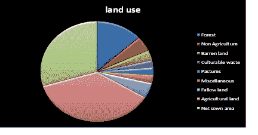
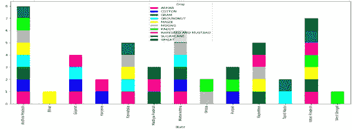
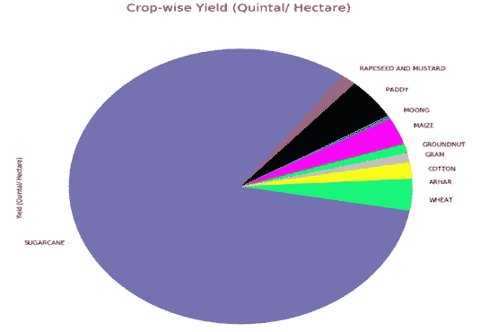
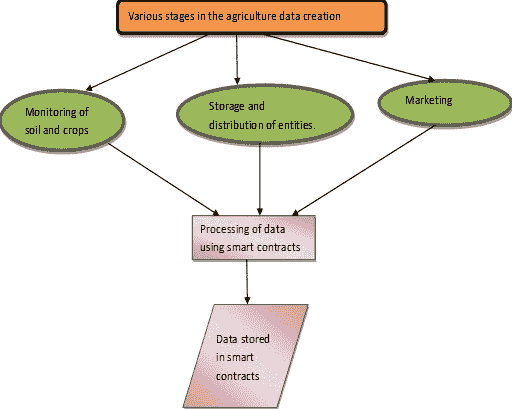
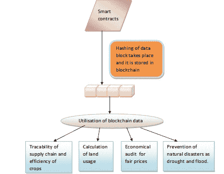

# 基于区块链的农业增长理念：一种新的农学视角

**维沙卡^(1)****,** **尼克希尔·夏尔马^(2, *)****,** **巴拉特·布胡申^(2)****,** **伊拉·考希克^(3)**

¹ 德里，印度 HMR 技术与管理学院

² 大纽德尔，印度 夏尔达大学工程技术学院

³ 印度北方邦加兹阿巴德 Krishna 工程技术学院

## 摘要

养育食物是国家繁荣和福利的基本要求。农业是种植作物和牲畜的科学和艺术。在定居人类文明中，农业发挥着关键作用。农业需要做很多工作来维护和建立消费者对食品质量检查的信任。基于区块链的农业解决方案通过其在系统中获取透明度和透明度的能力，为农业业务带来了希望。低成本的农业保险计划越来越被视为为受洪水或干旱影响的人们提供社会保障的工具。这有助于减少他们因此类事件遭受的影响。因此，本章介绍了区块链技术的概念，对相关文献进行了广泛调研，包括对食品行业中区块链发展的回顾，以及在食品供应链中的案例。本章提出了区块链在农业领域的各种机会和理想架构。最后，本章通过突出该领域的开放研究难题来结束。

**关键词：** 农业业务，农业，区块链，农业保险，食品安全，农产品电子商务，物联网，食品供应链，智能农业，智能合同，供应链，可追溯性，交易成本，水产业。

* * *

^* **通讯作者 尼克希尔·夏尔马：** 德里，印度 HMR 技术与管理学院;

电子邮件：nikhilsharma1694@gmail.com

## 1\. 引言

除了加密货币，区块链展示了多种应用。区块链领域的创新无疑正在改变从银行到医疗保健行业以及房地产业的许多行业。现在正在进行研究工作，将同样的技术应用到农业领域。随着物联网应用的进展，技术领域以及金融部门已经在生态观测应用方面取得了实质性的增长，以评估水、土壤和空气的质量。截至 2020 年 4 月，全球人口被计算为 78 亿。由于人口持续增长，人均食品需求急剧增加。

2014 年至 2015 年的研究表明，与 1975-1976 年的成年人相比，成年人的卡路里需求增加了 6.1%。食品需求的增加显著影响了环境，因此危及了许多物种。由于食品需求增加而对环境造成的破坏主要表现为森林砍伐、碳排放水平增加等*等*。如果食品供应链得到有效组织，就有可能减少碳排放量和环境危害，从而保证食品安全[1]。在目前的食品供应链中，从生产到消费都涉及到了多方利益相关者，使得情况难以获得实际的逐步数据以供分析。有报告表明，在农业种植活动中，各种过程中产生了大量碳。在美国，据估计，在导致温室气体排放的所有因素中，食品运输仅贡献了 11%的排放。人们观察到，到 2050 年，食品生产必须翻番才能满足每个人的营养需求[2]。

由于食品消费疾病案例的增加，消费者现在希望了解关于他们食用和其他食品的详细信息。人们对现有的食品体系信任不足。区块链为这些问题提供了令人兴奋的解决方案。它为每个进行中的部分提供了永恒的证据，然后将其编排成各种区块，无法反映任何变化。它还有助于替换那些物理跟踪器和监测实体，以防止传统供应链的不精确影响[3]。追踪供应链是保护食品安全的最重要措施，使其免受恶意漏洞的影响，并鼓励食品认证。LetsFarm 是一家利用人工智能的创业公司，为全球农民提供帮助。它利用透明的工具和技术连接农民，使他们可以从任何地方获取他们所需的数据。正确的信息可以帮助农民增加产量，从相同的作物中获得更好的收入。LetsFarm 还通过提供关键信息和增加农民家庭收入来赋予农民辅助收入。毕竟，农民的整体增长是整个国家的进步！荷兰农业、自然和食品质量部资助了首个研究项目“农业食品区块链”，该项目旨在研究农业食品的区块链建议。试点研究表明，区块链技术使食品能够在几秒钟内从农场追踪到市场[4]。区块链还有助于观察丰富的产品，并减少非法采集和运输欺诈案件。联合国透露，由于非法交易，食品欺诈每年给全球经济造成约 400 亿美元的损失。很多创新来自新兴企业，农业部门也不例外。Ripe.io 和 Pavo Coin 是两个最近利用区块链的供应链商业模式[5]。

Ripe.io 是位于旧金山的新业务。 Ripo.io 专注于农业，并为客户提供了更高水平的透明度。 Ripo.io 开发的系统可以检测产品的湿度、成熟度和温度。这样，农民可以得到关于产品状态的信息。区块链实现分散化并不完全是技术性质，而是技术和智能工程激励的结合。它始于 2008 年，由仍未知谁是真正身份的中本聪发布了一份介绍了一种纯粹的点对点加密货币比特币的白皮书。区块链有四种类型，分别是私有区块链、公共区块链、联合区块链和混合区块链。在私有区块链中，对访问进行了控制，只有少数用户有权限查看和验证交易。它在数据安全是首要关注的服务中使用。公共区块链是对所有人都开放的，虽然交易是匿名的。对于那些有查看访问权限的人来说，交易在总账中是透明的。联合区块链由一个团体或联合体操作，只有该团体的成员才有访问权限。混合区块链指的是使用公共区块链但同时也拥有私有区块链的系统。尽管数据存储在公共区块链上，但数据隐私不会被侵犯。这给予了节点诚实行为的激励。比特币中有两种激励机制，分别是区块奖励和交易费用。在创建区块的服务中，区块的创建者首先在区块中包括了特殊币的交易生成，然后选择该协议的接收地址。只有当区块最终出现在长期一致分支上时，区块创建者才有机会获得奖励。在区块链中，区块奖励的价值在每四年后减半。区块奖励是新比特币的生成方式，据估计将在 2140 年用完。如果这一标准没有改变，将不会生成新的比特币。在交易费用中，交易的过程创建者可以决定使代币的产出估值少于输入价值，其余的金额将成为加入到共识分支的区块创建者的交易费用。这些方式有许多问题，比如如何为每个交易选择一个随机的连接点，或者如何阻止每个节点都运行比特币节点以获取奖励。为了改进这些问题，现在比特币是通过共识机制生成的，包括 PoW、PoS、DPoS 和 PBFT 等各种过程。在工作证明（PoW）过程中，首先找到哈希值的比特币矿工将被允许将另一个新的交易块包含到区块链中去。在权益证明（PoS）机制中，持币者持有的代币越多，就越有可能将新的交易块包含到区块链中去。在 DPoS 中，持币者可以利用其余额选择一组可能被允许将新的交易块加入区块链的节点。实用拜占庭容错（PBFT）依赖于节点的数量来确认信任。当获得足够的反馈（通常为 51%）时，交易被宣布为有效交易。在区块链中有两个重要的术语，即共识机制和智能合约，在研究其在农业领域的实用性之前，这些术语需要被理解。共识机制是一种确保在数据点上达成共识的方式。系统网格中的每个顶点都有相同的记录（总账）的拷贝。它具有安全性和加密协议的经济框架。共识机制的目标包括寻求共识、协作、合作、包容性和参与性。共识的三个基本步骤，第一个是认可，确定是否接受交易。然后是排序，将所有交易在指定的时间范围内按系列排序。最后是验证，验证认可策略。智能合约，又称自动执行合约，是一种通过避免中间人交互并由存储区块链的所有对等方在去中心化平台上验证而数字化地促进、验证或执行协议的计算机约定。它用于货币、股份等的交换。它具有自验证、自执行的性质，并且抵抗变更。它将法律义务转化为自动化的流程。由于没有第三方费用，它更为便宜。它能够提供更高程度的安全保障。

本章的其他部分按照以下标准化，第二部分介绍了文献综述，第三部分描述了区块链技术在农业领域的不同机遇，第四部分讨论了区块链在农业中的应用，第五部分说明了使用案例，第六部分解释了农业中的基于区块链的架构和挑战，最后在第七部分进行了结论。

## 2\. 文献综述

在传统系统中，种子公司生产种子，根据全球标准对种子进行标识并更新当地记录。农民购买种子，收获作物，并将作物发送到谷物升降机，将生产的作物存储在各种仓库中。各种谷物加工商从仓库购买谷物，并对其进行精炼以制成最终产品。随后，分销商拿走这些最终产品并将其销售给零售商，后者将产品以小可识别的数量销售给顾客[8]。印度的农业可以被归类为生产、供应链、加工和营销等各种阶段。图（**1**）代表了导致信用风险和由于生产阶段输入供应不足和过时的耕作政策，高浪费和交通设施不佳以及供应阶段中的许多中间商引起的信贷流动限制的链条中的各个阶段。

**图（1）**

供应链的阶段。

购买者需要了解食物的起点，他们甚至愿意多付费以发现所有关于食品的基本信息。他们可以查看食品认证，但常规认证可能会被视为目前系统中的误导信息。但是，区块链具有不可变的特性，这将使任何记录的微妙更改变得困难，例如日期和内容将保持不变。扫描一次 QR 码将为顾客提供关于食品的所有信息——*即*用于生产目的的种子类型是哪种，过程中使用了哪种杀虫剂，它在商店里放置了多长时间*等*。同样，它可以用于家禽目的，了解确切的时间，它生活在哪些条件下，它患了哪些感染病，*等*。只需点击一下，所有必要的信息就会传达给消费者[9]。

全球劳动力估计占到 46%，其中仅农业部门占整个世界货币的 8.4%，其总产值为 9,084,800 百万。区块链提供安全的信息交换，为这些报告和交货事件提供了一个精心设计的保险库，这将节省因数据误解而浪费的数十亿美元。Maersk 和 IBM 正在利用区块链技术建立一个全球精心制作的框架，以数字化贸易工作流程并全程跟踪货物，消除昂贵的点对点通信中的障碍[10]。在农业方面，印度是最大的国家之一，主要用于生产目的。在所有部门中，印度的初级部门对经济的贡献明显，尽管由于工业和其他商业部门的持续发展，其占比已经下降到 15%。图（**2**）显示了印度的可用土地分布。印度是世界上第二大的自然产品生产国，估计的农业产量为 3.147 亿吨。印度的农产品出口总额估计为 385.4 亿美元[11]。

**图（2）**

印度的土地分布。

在 2017-18 年度产量年份，粮食产量创下了 2.8483 亿吨的记录。印度政府正在致力于到 2021 年产量达到 2.872 亿吨。图（**3**）显示了印度一些州的作物分布，很明显小麦、棉花、稻米、花生和芥菜是一些主要作物。将机器学习概念与区块链创新相结合将在未来几年推动经济增长[12]。

如图（**4**）清楚地表明，印度的甘蔗产量在所有作物中居首。特定作物的进出口主要取决于特定地区的种植过程和产量。由于农业领域中存在中间件而在种植实践中损失了大量的资金，现在是时候将区块链技术与农业部门整合了[13]。

**图（3）**

印度一些州的作物分布。**图（4）**

印度的作物产量。

利用区块链技术实现食品市场的多方管理的是政府的追求，通过提供食品市场的监管记录来交换信息。这可以有效解决食品监管过程中的问题。根据相关政府部门的了解，政府监管机构对食品供应链有一些要求。第一个要求是准确收集食品供应链各个环节的信息，然后从种植（繁殖）到整个消费过程中回收有关食品供应链聚会和存储的信息。这些要求与区块链存储每次交易信息的技术特点相一致。Tian 在[14]中研究了区块链和射频识别（RFID）追溯农业供应链的优缺点。Tian 等人[15]提出了基于风险检查和关键站点控制的食品供应链，利用物联网和区块链。Caro 等人[16]代表了基于区块链的 Agri Block IoT，这是一个集成来自整个供应链各种连接的物联网设备数据的可追溯性解决方案。他们为从农场到消费状态追踪产品制定了一个使用案例，并通过 Hyperledger 和以太坊进行了性能比较。Tse 等人[17]回顾了如何将区块链技术应用于食品供应链，并在高度概念水平上将基于区块链的解决方案与传统供应方案进行了对比。他还强调了涉及诚信、安全和信任的关键元素。Tripoli 和 Schmidhuber 等人[18]谈到利用分布式账本和智能共识的各种技术来提高农业中的效率，提供可追溯性。他们确定了采用分布式账本技术在实现可持续发展目标方面具有重要潜力所面临的技术挑战和障碍。Mao 和 Dianhui 等人[19]。通过加密合同提出了一种基于区块链的信用评估系统，以提高食品供应链管理的效率。Lin 等人[20]审查了农业信息通信技术（Agri-ICT）解决方案模型的区块链概念，并介绍了一个实现区块链技术的农业信息通信技术系统原型。Galves 等人[21]审查了区块链在确保食品供应链中可追溯性和真实性方面面临的挑战和未来应用。Mao 等人[22]提出了一个基于区块链的联合贸易方法，用于系统性和食品交易系统。他们提出了一种简化的、改进的拜占庭内部故障容忍算法（iPBFT），以提高食品供应链中买家贸易解决方案。Mao 等人[23]利用基于联盟的区块链验证了他们建议的食品交易系统，采用了中国山东地区的实证研究。Schneider 等人[24]设计了一个模型区块链系统，以改善农业部门的透明度和自主运营流程。Lucena 等人[25]提出了一种利用区块链和智能合同进行粮食标准测量的方法。他们提出了一个真实案例的实施解决方案，导致巴西粮食商在豆类商业中增加了 15%的附加价值。Holmberg 和 Aquiest 等人[26]分析了在过去 eur 化领域实施基于区块链的可追溯性解决方案的障碍。在澳大利亚的小麦供应中使用以太坊以及沃尔玛通过 IBM（国际商业机器公司）Hyperledger 进行食品追溯计划等农业供应链中最近的区块链试点应用实例。Chinaka 等人[28]专注于如何通过采用基于区块链的解决方案促进价值传递，把非洲农民的资源如可耕地、牲畜和农产品转化为小规模农业。作为相关研究表明，人们越来越倾向于采用区块链技术以提高透明度、增强数据安全性、验证食品和农业供应链中各种标准。赵等人[30]提出了一个基于远程传感器的农业相关应用的实时数据监控平台，通过 M2M。该系统考虑了在温室控制范围内的数据收集、管理和分配。在这些用例的一个显著部分中，研究了区块链在农业供应链中的抽象应用，缺乏具体的实施结构或方法。

## 3\. 机会

区块链技术在食品行业存在许多机会[31, 32]，如采购跟踪、农作物和食品生产管理、农业金融和保险管理、提高透明度、经济观察以及涵盖绿色债券，*等*。

### 3.1\. 采购跟踪

农业行业的主要障碍是追踪食品交付和支付。如今，该流程依赖第三方安排货物交付。传统供应系统中的供应商有一位代理人，保证产品安全交付，而购买方有一位专家建议解决方案并检查交付情况。多个代理人的参与为该系统增加了大量成本，并使整个过程变得耗时。借助区块链技术，整个流程可以改进为单一的分布式记录。

### 3.2\. 土地登记

在印度，联合国开发计划署正与许多合作伙伴共同努力，使土地登记在那里变得更加可靠。从高层次来看，该项目将捕捉并不断记录财产销售中的每一笔交易。瑞典政府的土地所有权管理局，即 Lantmäteriet，在区块链上进行了土地登记和财产交易。他们相信，这个项目为拥有数字化真实性提供了一种安全途径，可以减少政府数百万美元的成本。格鲁吉亚共和国正在研究利用比特币系统来验证与财产相关的政府交易。

### 3.3\. 水下捕鱼产业

另一个用例出现在水下捕鱼或垂钓行业，区块链技术可以用来跟踪和阻止非法、无控制和未注册的捕鱼，这对海洋环境构成重大威胁。在新西兰，世界自然基金会正在进行一项试点项目，以消除太平洋岛国渔业中的非法捕捞和侵犯人权行为。

### 3.4\. 农作物和食品生产管理

在智能种植的帮助下，物联网传感器可以带来大量数据，如水位、土壤温度、堆肥和肥料的具体情况，*等*，并将其直接传送到区块链上。这将支持提升种植过程的质量以及生产农作物的质量。

### 3.5\. 气候紧急控制

农民需要面对气候紧急控制的问题，比如反复无常的气候条件。由于降雨过量，成熟作物难以忍受洪水。购买者从未被告知作物何时遭受恶劣的气候条件，市场为何接受高涨的价格。由于涉及方在区块链解决方案中能够检测气候条件，农民可以通过智能合约迅速申请并获得保险赔偿。

### 3.6\. 农业资金和保险管理

另一个用例是农业资金和保险的管理。记录不清晰和信用历史不清晰对小农户和金融机构都构成重大问题。 如今，财务服务不仅允许小农户投资农业，而且在解决流动性限制方面也给予他们帮助。利用区块链，农业资金流程变得更加透明和公平，并且实现了共享控制的便利。

### 3.7\. 提高透明度

机会在不断增加。农业透明度也被视为重要的应用场景之一。意大利意面和青酱生产商巴里拉（Barilla）与 IBM 合作，以处理青酱生产过程中的可追溯性和透明度。从发展阶段开始，经过处理和在田间收集，到运输、储存、质量控制，再到生产，然后到消费者手中，所有细节和特点都在区块链系统上追踪并提供，以便客户可以通过扫描青酱的二维码进行核实。

### 3.8\. 经济监测和绿色债券覆盖

这包括经济监测，检测和覆盖绿色债券，这些债券是为了为受益于生态系统的计划和项目提供资金。在气候智能活动中，有可信的追踪、可识别性和验证要素是有益的，以帮助提高金融投资者对气候智能活动的信任。碳信用和交易可以通过区块链提供利润。在食品行业中，区块链技术有许多机会，如采购跟踪、作物与食品生产管理、农业资金和保险管理、提高透明度、经济监测和覆盖绿色债券，*等*。

## 4\. 应用

这一部分包括农业和食品领域的四种利用方式，即智慧种植、农业保险、农产品交易和食品供应链。

### 4.1\. 智慧农业

农业营养系统的基础是支持所有类型农业的自然资源的基本信息和数据。各利益相关方和参与者根据其需求和限制生产和管理信息和数据。智能农业业务突出了物联网、信息通信技术和不同的现代信息收集和分析技术，包括传感器、无人飞行器和人工智能。建立智能耕作的一个关键问题是建立一个全面的安全系统，促进了数据的使用和管理[33]。区块链技术有助于存储各利益相关方和农民在整个增值过程中产生的数据和信息，从播种到交易，确保信息和数据对相关利益相关方和农民是清晰和明确的，并且所有登记的信息都是永久的。传统方式以中心化方式控制信息，并且容易出现不当信息、信息歪曲和数字架一样的滥用。例如，环境监测数据大多由中心管理实体控制，其利益都是他们自己的[34]。它们可以控制与信息相关的结论。许多智能耕作模型是基于区块链和物联网技术的共同使用而提出和实施的。Patil 等人建议“一个轻量级的基于区块链的温室智能保护装置原型”，其中物联网传感器充当由所有者集中控制的私有区块链。  

### 4.2\. 食物供应网络

随着市场的扩大发展和激烈竞争，食品供应链变得比以往任何时候都更长并更复杂。食品供应链存在一些常见问题，如食品质量和安全、食品追溯、食品信任和供应链的低效率，这给整个经济、社会和人类健康带来额外风险。从生产者的角度来看，使用区块链技术可以建立与消费者的信任关系，通过在区块链中清楚地提供个体产品的信息来提高其产品的声誉 [35]。这将使欺诈和低质量产品的供应商难以在市场上立足，并迫使所有供应商改进他们产品的质量在整个农业和食品领域。企业可以实现其产品的价值，从而增加它们在市场上的竞争力。这有助于解决消费者对食品质量、安全和环境可用性的担忧。区块链的使用使生产者和消费者能够更轻松地以更自然的方式理解食品生产过程。目前食品供应链中的区块链技术仍处于发展的初期阶段。因此，所有利益相关者，包括生产者、消费者和政府监管机构，都能从中受益 [36]。例如，与产品供应链相关的任何利益相关者都可以验证和核实家畜的 DNA、蔬菜的农药残留或谷类作物。在当前时期，为所有产品收集此类信息可能会导致更高的成本，但在测试阶段，可以对样本进行测试。阿里巴巴、京东和沃尔玛正在积极实施区块链可追溯项目，并将其用于追踪食品生产、加工和销售的整个过程。

### 4.3\. 农产品互联网业务

互联网业务和乡村物品交易面临一些重要问题需要解决。即时交付现金和管理服务是互联网企业面临的最重要的挑战，特别是在印度等发展中国家。但这个困难不再制约电子商务组织比如 Grofers、big basket 等的发展。此外，电子商务零售商还需处理小订单，其中包括多种多样的产品，需要更多时间，这会导致网络商家的运营成本高。印度湖北地区的商业企业 Old Farmers' Shopping Mall 是一家网络商业组织，可以追溯到源头，所有生产数据都是顾客可以信赖的资源。在产品放到商店之前，多种详细的数据，例如播种、灌溉信息、准备和施肥等都被记录下来。他们还提供了关于制造商、运输协调者、存储天数和存储温度的基本信息[37]。顾客只需扫描产品上的 QR 码，所有数据就会为他们所获。这种方法可以有效地避免非法交易者、中间人的欺骗，并重建顾客对来自网络商家及其供应商的农产品的信任。区块链技术可以为这些问题的许多方面提供适当的解决方案，如数据安全性。它提供了私钥加密，这是一个能够提供验证要求的强大资源。因此，它可以将所有关于播种和农产品收集的数据安全不可变地链接在一起。区块链提供了零费用的数字支付解决方案。此外，农产品交易中使用加密货币将更大幅度减少交易成本，并降低种植户的费用。许多农产品是家庭出产的，但由于交易量低和规模小，传统的电子商务不愿意为他们提供帮助，从而将这些参与者排除在市场之外。区块链可以大幅度降低交易成本，并重新整合它们进入市场。

### 4.4\. 农业保险

气候限制危及农业创造，使食品安全岌岌可危，在这种情况下，作物和动物的生产都受到影响，未来需要进一步恶化气候条件的环境变化。农业保险计划通常是一种广泛认可的方法，用于预测和识别与气候相关的风险。在这里，农民在农作季节开始之前支付保险费，如果在农田遭受损失，他们就可以获得保险赔偿。这样，保险公司承担了所有已投保的风险，而农民可以管理他们与气候条件相关的财务风险。此外，完全保险覆盖无需扣除金额是可能的，支付可以及时、自动化地进行，即在不利气候事件发生后立即进行。赔偿和农场损失之间可能会出现误差，这被指示为基础风险。可能发生的三种基础风险源称为空间基础风险、时间基础风险和计划基础风险。空间基础风险表示通过空间分离方法估计的气候与农场气候之间的任何差异。时间或暂时基础风险定义为选择不确定的时间窗口进行列表保护，如描述的那样，与评估生长季节降水过程相比，计算整年降水。计划基础风险总结剩余的每一个独立来源，例如缺少气候因素或单面的技术应用[38]。

农业保险在损失评估和因此触发支付的方式上存在差异。根据由农田专家进行的评估进行农民赔偿的保险被称为基础赔偿保险。基础赔偿保险可以覆盖损失，但在某些情况下，它们容易受到由不对称数据问题引起的问题。农民需要更好地了解不利选择和道德化风险问题。总部位于瑞士的公司 Etherisc 提供基于区块链技术的去中心化作物保险，根据区块链风格的保险协议中的气候数据提供赔偿，以本地货币机制的数字货币进行支付。另一家保险供应商位于纽约市的 World Cover，为加纳的小农户提供指数保险合同，通过模拟使用基于以太坊区块链的智能合约，其中赔偿将以数字化货币 Ether 进行。另一个智能作物保险供应商是 Arbol，农民可以提出一项合同，其中包括高品质支付、赔偿以及触发赔偿的气候事件，然后投资者作为交易对手可以同意该提议的合同。

支付可以根据天气数据进行便捷和机器化触发支付，如智能合约中定义的。其次，天气数据和其他信息来源，如植物生长数据或农机收集的信息，可以通过智能预言机自动集成，提高基础风险降低，使记录的保障和支付过程更加高效。在电子商务和农产品交易中使用区块链技术仍处于起步阶段，目前的案例不仅很好地解决了如何确保将数据传输到区块链的真实性，而且是一个问题和一个对区块链开发人员的质疑。未来，一个潜在的选择可能是物联网[39]。此外，区块链的分布式，分布式，不可篡改和可追溯的特性需要更广泛和深入的探讨，以提高农业生产和交易的生产率效率和效益。

## 5\. 使用案例

随着区块链领域的各种前景的出现，各种应用已经同时被研究和实施[40]。农业的各种应用案例包括食品安全，供应链追溯性，交易成本，开辟新市场和物流。

### 5.1\. 食品安全

看起来这个领域已经做了最多的工作，因为生产者和消费者都有明显的利益。IBM 与沃尔玛等公司已经开始在这方面发挥主导作用。为食品供应链带来透明度或清晰度将使我们能够识别并消除不良行为者和糟糕的过程。这确保了从农田到市场的完美条件，我们可以在食品安全爆发时迅速定位来源。这可以节省时间，金钱和生命。

### 5.2\. 追溯性

购买当地食品的优势不断被描述为“你知道你的食物来自哪里，谁种植了它，而且它是新鲜的”。想象一下，如果我们可以大规模实现这一点。这意味着，无论你在哪里购买食物，你都知道它的来源，甚至在收获和加工时，以及谁生产了它。像 Ripe.io 这样的公司正在努力解决这个问题。这也可以在很大程度上防止食品欺诈，错误标识和冗余代理商。

### 5.3\. 交易成本

它既是分散的，又依赖于在你信任与之合作的对手之前特别了解他们。像 AgriDigital 这样的公司正在努力使用区块链技术创造透明和高效的库存和供应链。他们正在将这项技术直接应用于粮食交易，并计划扩展到其他农产品，如棉花。

### 5.4\. 开辟新市场

这是该领域的另一个应用案例。在未来数字记录的情景下，Agri Ledger 利用区块链为正在兴起的发展中国家的农民开拓了新的市场。其理念在于，如果我们能够在市场参与者之间建立信任和责任，那么就减少了对每个个体的可靠性和执行能力进行单独评估的必要性。这意味着那些以前不能建立信任的市场参与者在这项技术的帮助下能够进行合作，而不需要在中间有人来处理信任问题（并从中渔利）。这也意味着那些边缘化的市场参与者可以通过这项技术在“圆桌”上有一席之地。

### 5.5\. 物流

任何在农业供应链领域工作过的人都知道由于缺乏协调而面临的挑战。管理大批量具有短暂保质期的产品是非常困难的，而且所涉及的资金也是巨大的。此外，供应链可能会受到干扰。像 UPS 这样的公司正在加入运输区块链联盟，以在基于区块链技术的未来智能物流系统中扮演主要角色。随着这一技术已在各个其他行业崭露头角，农业行业将成为下一个。通过广泛研究，该领域已实现了许多应用，而且正在不断进行更多的研究以改进现有的限制。在这一领域，如 FARMS、Agri-Digital、Ag-Unity、TE-Foods、Hi Tractor、Agri-ledger、Shamba 等许多初创企业在这一领域取得了不错的成绩。FARMS 代表的是小农户的金融和农业风险管理。它不仅提高了农民的经济素养，还教授了各种风险管理方式。

FARMS 理念以基于区块链的虚拟现金平台为支撑，结合卫星数据和移动支付解决方案，确保透明安全交易和资金“存储”，自动化支付和信息面板。农民管理被称为“干旱硬币”的虚拟货币，存放在他们自己的 COIN22 手机钱包账户中。所有交易现在只需一键点击，通过短信随时可以核对。Agri-Digital 是食品供应链的区块链。对于总部在全球的行业，它提供基于云的产品和解决方案来管理他们的业务。它在生产者、购买者和融资者之间建立了一个链接，允许他们通过一个统一平台签约、交货和实时进行付款。

在肯尼亚，IBM 与尼日利亚初创企业 Hello Tractor 合作，推出了基于区块链的耕作应用。这是一个乡村创新组织，通过物联网技术将拥有拖拉机的人与需要拖拉机服务的小农户联系在一起。他们的创新为拖拉机所有者和农民创造了一个成功的双赢局面，因为拖拉机所有者可以高效地扩展他们的拖拉机租赁业务，而农民可以便利地获得耕作所需的拖拉机服务。

AgUnity 已经建立了一个基础设施，为世界上贫困的农民提供了融入经济的途径。这是一个简单的移动服务，使小农户可以规划、交易和跟踪日常交易。这是农民互动、赚钱、为未来存钱并且轻松购买商品和服务的途径。该应用确保小规模农民把他们的作物交给其他农民或借出农具时，参与过程的每一个人都能得到公平报酬。

TE-FOOD 是世界上最大的公开可用的从农场到餐桌的食品追溯解决方案。它每天服务 400,000 个商业交易，拥有 6000 多个商业客户。它向消费者提供食品历史。区块链记录包含由不同供应链成员输入的数据的证据，并且食品公司无法篡改数据。Shamba Records 是一家肯尼亚农业科技初创公司。它建立了一个基于区块链的平台，利用人工智能和大数据来收集农民的收割记录，处理付款等。它为用户提供了许多功能，如信息收集和映射，智能合约等，使农场变得更加高效，并收集数据，使他们能够获得金融服务。

## 6\.  农业中基于区块链的架构和挑战

智能合约在农业保险、食品可追溯性和绿色债券方面发挥了有效作用。实施区块链的农业活动的架构可以分为两个阶段进行研究。第一阶段显示了数据的收集和清洗，并将其存储在智能合约中，如图所示(**5**)。农业的各个阶段包括土壤和作物监测，储存，食品分配系统和营销，如图(**5**)所示。需要收集大量的数据以保持供应链的质量并在客户对区块链技术建立信心。在土壤监测系统中，需要存储土壤的 pH、温度和其他矿物质的数量等数据。现在可以使用物联网设备等传感器来存储使用的杀虫剂、化肥的数量和灌溉用水。需要注意各种气象控制，如风速、湿度、气压、降水、紫外线辐射等。在储存和分配实体数据方面，需要记录质量控制标签、使用传感器的运输信息以及在仓库检查期间与食品安全相关的数据[41]。在营销过程中，数据的账单，包括按照著名规范的税收，应该在系统中存在。此时，将进行清理和优化收集到的信息的过程，以确保它有条理且合理，然后将其保存在区块链上。与时间戳、人口统计信息和类型有关的数据将被添加到信息中，使其更加有条理[42]。会议的连续保证了与从物联网设备收集的信息相关的可识别数据是受保护的，并遵循了安全措施。一旦信息被优化，就会被放入 AI 准备的格式中。数据将通过 AI 算法变得更加快速。在经过数据处理步骤后，它们将使用智能合约进行处理并存储在那里，以避免任何动荡和变化。

**图（5）**

区块链在农业中的基于区块链的架构的第一阶段。

架构的第二阶段涉及散列和使用各种算法，进一步确定区块链在农业中的利用，如图. (**6**)所示。在智能合同中存储数据后，数据将分成块，以进行数据块的散列。现在，数据将存储在各种块中，并带有各自的散列函数。这些数据现在变得不可变和安全，可以用于跟踪供应链，计算用于生产目的的土地，减少自然灾害如洪水和干旱中的资源浪费量，*等*。它还将帮助金融系统和客户跟踪记录的价格。希望在农业土地上投资的人将受益，因为他们将事先了解土壤质量和其他因素，并能够做出决策 [43]。从市场购买食物的客户可以提前确保质量和营养，如果食品有瑕疵，可以轻松进行系统调查并且所需的时间大大减少，因为数据存在于区块链中，无法更改。

**图（6）**

农业区块链架构的第二阶段。

区块链技术将通过提前预测天气和其他气候条件的趋势来确保农民免受作物失败的影响。通过将传感器与分布式账本相连，将导致实时连续更新记录。这将导致农民的效率提高，以及一个公平的付款系统。实施区块链后，农业部门也将变得透明，并可以检测欺诈以防止黑市营销的情况。这还将吸引投资者。它也将导致农民之间的股份交换，并在未来可以在农业领域引入加密货币。

尽管存在大量潜在的有利益的好处，但在农业和食品领域应用区块链技术仍然存在一些关键限制 [44]。

+   首先，需要进行大量的进一步研究，为区块链记录提供真实和准确的数据。这在小规模耕种尤为重要。在耕种过程中产生的数据是分散的，并由个体农民拥有。区块链技术对农民的好处在很大程度上取决于耕地的规模。

+   其次，在区块链上传输信息可能很昂贵，这将是阻碍区块链创新在该领域应用的一个障碍。区块链技术的引入应该循序渐进，从资源规划企业、仓储管理和制造业开始。

+   第三，区块链不直接整合现有的继承框架。为了有效实施这项技术，应该将其应用到现有数据库和继承系统中。比如，行业资产规划和制造执行系统。

+   建立一个可以利用区块链技术的基础设施通常是耗时的。

+   围绕区块链的监管框架还处于早期阶段，因此存在很高的风险。许多区块链项目，特别是涉及货币或跨境交易的项目，需要符合 KYC/AML 合规要求，了解国家框架对这些项目进行深入了解是非常重要的。比特币价格的常态变化以及有关数字货币被黑客攻击的新闻已经导致多个国家增加了监管和规定，甚至有些国家禁止了加密货币的使用。

+   其他缺点包括高能耗要求，因为数据可能达到 100-200 吉字节，这需要大量的能源进行处理。交易速度较慢也是一个主要缺点。

## 结论和未来展望

食品健康是政府和行政机构的重要职责。因此，政府需要建立一个跨行业或跨部门的专家系统，以有效控制食品供应链。基于区块链技术的食品供应链可以在一秒内从农场追溯到零售商店或杂货店。区块链有巨大潜力来改变农业，虽然农业不像医疗保健或金融系统一样令人瞩目。在这项工作中，我们概述了区块链技术的不同视角，农业部门利用区块链的进展，并介绍了区块链在耕作部门的运作模式。在这一领域进行了各种最近的研究工作，为农业中的区块链创新提供了巨大的机会。使用案例的一个显著部分研究了区块链在农业供应链中的理论应用，但缺乏特定的使用结构或方法。尽管区块链技术有诸多优势，但在推动区块链创新帮助监管部门跟踪、监控和审查食品链，并帮助生产者真实透明地记录交易方面仍然存在一些挑战。区块链和人工智能在食品供应业中将扮演非常重要的角色，包括食品安全和多样性、国家产业和技术专家。提高食品供应链的监管规范、提高管理水平和效率、防止寻租和滋生腐败是非常重要的。在农业中实施区块链具有许多好处，因为它将确保供应链的质量得到提升，增加可追溯性，消费者知道他们的食品产地。PavoCoin 是基于以太坊的 PavoCoin 框架构建的 IoT 软件平台，帮助农民改善作物发展过程。此外，这个解决方案还可以收集有关产品加工和分配的数据。由于采用了区块链技术，这些过程可以得到有效监控，并且信息被存储起来。区块链技术为农业带来了许多创新的解决方案。基于区块链的软件让农民改善日常流程并增加现有业务的收入。

## 出版许可

不适用。

## 利益冲突

作者声明没有利益冲突，无论是财政上还是其他方面。

## 致谢

无冲突。

## 参考资料

|  |  |
| --- | --- |
| [1] | Watanabe H., Fujimura S., Nakadaira A., Miyazaki Y., Akutsu A.. 区块链合同：保障智能合约的区块链应用。2016 年 IEEE 国际消费电子大会 (ICCE)。10.1109/ICCE.2016.7430693 |
| [2] | Dabbene F.. 食品追溯系统：性能评估和优化。计算机与电子农业。2011 年 7 月。10.1016/j.compag.2010.10.009 |
| [3] | Khan M. A.. 物联网安全：回顾、区块链解决方案和未解决的挑战。未来计算机系统。2018 年 8 月。10.1016/j.future.2017.11.022 |
| [4] | Lucas L.. (2018). 从农场到餐桌，区块链简化食品追踪。访问日期：2018 年 6 月 12 日。[在线]. 可访问：[`www.ft.com/content/225d32bc-4dfa-11e8-97e4-13afc22d86d4`](https://www.ft.com/content/225d32bc-4dfa-11e8-97e4-13afc22d86d4) |
| [5] | Bogner A., Chanson M.. 运行在以太坊区块链上的去中心化共享应用的智能合约。第 6 届国际物联网大会论文集 - IoT'16。10.1145/2991561.2998465 |
| [6] | Salah K., Rehman M. H., Nizamuddin N.. 区块链与人工智能：回顾与未解决的研究挑战。IEEE Access。2019 年 7 月。10.1109/ACCESS.2018.2890507 |
| [7] | Hasan H. R.. 使用区块链和智能合约抵制深度伪造视频。IEEE Access。2019 年 7 月。10.1109/ACCESS.2019.2905689 |
| [8] | Toyoda K., Mathiopoulos P. T., Sasase I.. 一种新颖的基于区块链的产品所有权管理系统 (POMS) 用于跟踪供应链中的防伪产品。IEEE Access。2017 年 5 月。10.1109/ACCESS.2017.2720760 |
| [9] | Folinas D., Manikas I.. 食品链可追溯性数据管理。英国食品杂志。2006 年 10 月。10.1108/00070700610682319 |
| [10] | Bazoni C. H., Ida E. I., Barbin D. F.. 近红外光谱法作为评估储存大豆物理化学变化的快速方法。储藏产品研究杂志。2017 年 3 月。10.1016/j.jspr.2017.05.003 |
| [11] | [`www.dhyeyaias.com/current-affairs/perfect-7-magazine/changing-land-use-pattern-and-climate-change`](https://www.dhyeyaias.com/current-affairs/perfect-7-magazine/changing-land-use-pattern-and-climate-change) |
| [12] | Smith J.C., Ghosh A., Hijmans R.J.. 农业集约化与印度作物多样化的关联（1947-2014）。PLoS One。2019 年 12 月。10.1371/journal.pone.022555531826001 |
| [13] | (无日期). 访问日期：2020 年 9 月 25 日。[`www.yieldgap.org/india`](http://www.yieldgap.org/india) |
| [14] | Tian F.. 基于 RFID 和区块链技术的中国农产品供应链追溯系统。2016 年第 13 届国际服务系统和服务管理大会 (ICSSSM)。10.1109/icsssm.2016.7538424 |
| [15] | Tian F.. 基于 HACCP、区块链和物联网的食品安全供应链追溯系统。2017 年国际服务系统和服务管理大会。10.1109/ICSSSM.2017.7996119 |
| [16] | Caro M. P., Ali M. S., Vecchio M.. 农业食品供应链管理中基于区块链的溯源：实际实施。2018 年意大利托斯卡纳农业物联网峰会（IOT Tuscany）。10.1109/iot-tuscany.2018.8373021 |
| [17] | Tse D., Zhang B., Yang Y., Cheng C., Mu H.. 区块链在食品供应信息安全中的应用。2017 年 IEEE 国际工业工程与工程管理大会（IEEM）新加坡。20171357136110.1109/IEEM.2017.8290114 |
| [18] | Tripoli M., Schmidhuber J.. 区块链在农业食品行业应用的新机遇。2018 [在线]. 可用：[`FAO.org`](https://FAO.org)。 |
| [19] | Mao D., Wang F., Hao Z., Li H.. 基于食品供应链中多方利益者的区块链信用评估系统。环境研究公共健康。2018158162710.3390/ijerph1508162730071695 |
| [20] | Lin Y., Petway J., Anthony J., Mukhtar H., Liao S., Chou C.. 区块链：信息通信技术 E-.农业环境的演进下一步。2017435010.3390/environments4030050 |
| [21] | Galvez J. F., Mejuto J.. 区块链在食品溯源分析领域的未来挑战。 趋势分析化学。2018107222232。 10.1016/j.trac.2018.08.011 |
| [22] | Mao D., Hao Z., Wang F.. 利用财团区块链进行新型自动食品交易系统。阿拉伯科学与工程杂志。20184443439345510.1007/s13369-018-3537-z |
| [23] | Mao D., Hao Z., Wang F.. 食品贸易中可持续和可信环境的创新区块链方法：山东省中国的案例研究。可持续性。2018109314910.3390/su10093149 |
| [24] | Schneider M.. 农业领域基于区块链的系统设计和样机实施。2017 |
| [25] | Lucena P., Binotto A.P., da Silva Momo F., Kim H.. 基于区块链业务网络的粮食质量保证追踪案例研究。2018 [` arxiv.org/abs/1803.07877`](https://arxiv.org/abs/1803.07877)。 |
| [26] | Holmberg A., Åquist R.. 2018 年食品供应链中的区块链技术：支持溯源框架实施的可能性和挑战案例研究。 |
| [27] | Kamath R.. 区块链上的食品溯源：沃尔玛与 IBM 的猪肉和芒果试点。英国区块链协会杂志。201811112。10.31585/jbba-1-1-(10)2018 |
| [28] | Chinaka M.. 区块链技术——在改善发展中国家的金融包容性方面的应用：非洲小规模农业的案例研究。2016 |
| [29] | (2018). 彭博社。[在线]。 可用：[`www.bloomberg.com/news/articles/2018-01-22/dreyfus-teams-with-banks-for-firs tagriculture-blockchain-trade`](https://www.bloomberg.com/news/articles/2018-01-22/dreyfus-teams-with-banks-for-firstagriculture-blockchain-trade) |
| [30] | Zhao J., Zhang J., Feng Y.. 农业中物联网技术的研究与应用。2010 年第 3 届国际计算机科学和信息技术会议 10.1109/iccsit.2010.5565120 |
| [31] | Roopaei M., Rad P.. 智能农业中的物联网云：利用热成像进行智能灌溉监测。《IEEE 云计算》2017 10.1109/mcc.2017.5 |
| [32] | Voutos Y., Mylonas P., Spyrou E.. 基于物联网的智能葡萄种植监测体系。2018 年第 9 届信息、智能、系统和应用国际会议（IISA）10.1109/iisa.2018.8633630 |
| [33] | Manchanda C., Sharma N., Rathi R., Bhushan B., Grover M.. 智能城市中新颖的安全与隐私保护技术。2020 年 IEEE 第 9 届通信系统和网络技术国际会议（CSNT）10.1109/csnt48778.2020.9115780 |
| [34] | Grogan A.. 智能农业。《工程与技术》2012 10.1049/et.2012.0601 |
| [35] | Jayaraman P.P., Yavari A., Georgakopoulos D., Morshed A., Zaslavsky A.. 智能农业物联网平台：经验和教训。《传感器（巴塞尔）》2016 10.3390/s1611188427834862 |
| [36] | Saha A. K., Saha J., Ray R., Sircar S., Dutta S., Chattopadhyay S. P.. 农业领域改进作物质量的物联网无人机。2018 年 IEEE 第 8 届年度计算与通信研讨会（CCWC）10.1109/ccwc.2018.8301662 |
| [37] | Moribe T., Okada H., Kobayashl K., Katayama M.. 结合红外线测温计的智能农业无线传感器网络和无人机。2018 年第 15 届 IEEE 年度消费者通信和网络会议（CCNC） |
| [38] | K. Delmolino, M. Arnett, A. Kosba, A. Miller, E. Shi.（2016 年 2 月 22 日）。逐步创建安全智能合约的经验和见解：来自加密货币实验室的教训。2016 年 9 月 25 日检索自 [`link.springer.com/chapter/10.1007/978-3-662-53357-4_6`](https://link.springer.com/chapter/10.1007/978-3-662-53357-4_6) |
| [39] | Kosba A., Miller A., Shi E., Wen Z.. 鹰眼：区块链密码学和隐私保护智能合约模型。《IEEE 安全与隐私研讨会（SP）》2016 10.1109/SP.2016.55 |
| [40] | Hammerich T.. (2018, January 04). 区块链在农业中的 5 个潜在应用案例。2020 年 9 月 25 日检索自 [`futureofag.com/5-potential-use-cases-for-blockchain-in-agriculture-c88d4d2207e8`](https://futureofag.com/5-potential-use-cases-for-blockchain-in-agriculture-c88d4d2207e8) |
| [41] | Bhushan B.. 区块链技术中的交易隐私保护。创新计算与通信国际会议 2020 10.1007/978-981-15-5148-2_34 |
| [42] | Zhang F., Cecchetti E., Croman K., Juels A.. 2016 年《镇公告者》。2016 年 ACM SIGSAC 计算机与通信安全会议论文集 10.1145/2976749.2978326 |
| [43] | 瓦尔什尼 T., 夏尔马 N., 卡乌希克 I., 布什 B.. 2019. 区块链技术中的身份验证和加密安全服务. 2019 年计算、通信和智能系统国际会议 (ICCCIS) 10.1109/ICCCIS48478.2019.8974500 |
| [44] | Inria K., 巴尔加万 K.. 研究, M., 作者: 卡尔迪凯扬·巴尔加万 Inria. (2016 年, 10 月 01 日). 智能合约的形式验证: 简短论文. 2020 年 9 月 25 日检索自 [`dl.acm.org/doi/10.1145/2993600.2993611`](https://dl.acm.org/doi/10.1145/2993600.2993611). |
