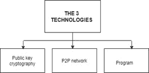
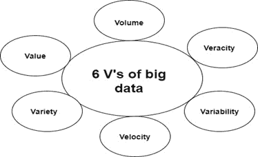
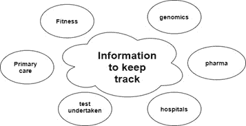
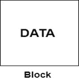
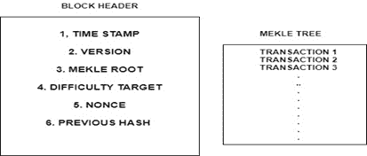
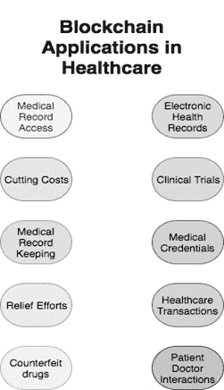

# 大数据管理的区块链解决方案

**Deepak Kumar Sharma^(1, *)****,** **Saakshi Bhargava^(2)****,** **Aashna Jha^(3)****,** **Sudhir K. Sharma^(4)**

¹ *印度德里 110078 年内塔吉苏巴斯理工大学信息技术系*

² 印度拉贾斯坦邦 Tonk Banasthali Vidyapith 物理科学与工程系

³ 印度德里 110078 年内塔吉苏巴斯理工大学电子与通信系

⁴ 印度新德里信息技术与管理研究所计算机科学系

## 摘要

在不断增长的世界中管理庞大的数据是一项重要任务。要知道，世界正面临数字方面的发展以及由消费者和技术通常产生的数字数据的多样性，处理这些大量数据并找到最佳的存储、处理和组织方式是必要的。这就是区块链出现的时机，它提供了重要的输入，因为它是私有数据的去中心化系统。当然，一些行业专家正在考虑区块链及其对不同领域的许多改进的好处。大数据是生态系统中不断增长的部门，因为每个行业都希望了解客户的风俗安排，而大数据指的是通过先进的统计表示和数据挖掘来揭示重要模式的海量数据集。所产生的数据是以**petabytes**为单位的，当我们处理这样大范围的数据集时，就会出现与之相关的问题，不仅专注于数据的收集，而且还特别重视安全措施，并且采取适当的措施来保护产生的数据，以便不发生恶意行为。

**关键词:** 大数据，BIot，比特币，区块链，共识算法，加密货币，密码学，数据挖掘，去中心化，分布式账本，电子健康记录，不可变网络，物联网，点对点网络，私有区块链，股权证明，工作证明，公共区块链，公钥，智能合约。

* * *

^* **通讯作者 Deepak Kumar Sharma：**印度德里 110078 年内塔吉苏巴斯理工大学信息技术系；电话：9868861080；电子邮箱：dk.sharma1982@yahoo.com

## 1\. 引言

区块链和大数据是两种以非凡速度不断扩张的技术。它们都是分别发展起来的，并且在各行各业独立应用。区块链应用主要集中在加密货币和比特币上，其分布式账本技术吸引了科技爱好者和潜在的投资者进入这一新兴业务领域。它进一步扩展到其他领域，如银行业和供应链管理，在生活的各个领域都找到了用武之地。区块链技术确实能通过其去中心化结构和去除第三方来颠覆当前世界经济体系。近年来，大数据成为一个热门词汇，数据像从未有过的速度增长。它的应用领域无法被局限于一个领域，因为数据在各处得到利用和生成。从传感器到社交媒体网站，大数据无处不在。当涉及到利用和分析时就会出现挑战，因为它包含了重要信息的关键。这些信息对企业和政府都有价值，用来研究产品和服务的表现。

以下章节的重要贡献将突出以下内容：

+   把两种强大的技术——区块链和大数据联系起来。

+   着重探讨区块链技术如何改变我们处理大数据的方式，使其成为一个更高效的过程。

+   着重介绍了多种好处，比如确保数据安全和进行数据分析，- 区块链的出现和与大数据的整合可以为金融到医药等各种行业提供服务。

本文结构如下。引言包括机制，区块链的同时进展以及它必须面对的挑战，还包括大数据的基础、类型和表征，这些内容在同一部分的第二部分中重点讨论。第二部分包括区块链和大数据如何共同产生影响。第三部分突出了两种技术一起使用时的应用。最后两部分完全专注于进一步的发展和结论。

## 2\. 区块链简介

区块链技术 [1] 在多个方面彻底改变了世界。可以肯定地说，它覆盖了多个领域，从经济 [2] 到医疗保健。区块链的起源可以归功于中本聪（Satoshi Nakamoto），他概述了技术的基本运作方式，自那时以来，它一直在为各种应用程序进行开发。以太坊（Ethereum）进一步提出了智能合约的概念。区块链通常被称为分布式账本技术（DLT）。简单来说，可以将其看作是谷歌文档或维基百科页面的例子。这里，我们的文档分布在许多人之间，每个人可以实时进行更改，任何更新都对所有人可见和透明。由于区块链基于 DLT，并且每个人都可以访问账本，信息是透明的，因此增加了问责制 [3]。

区块链 [4] 相对于现有系统的主要优势是没有涉及任何交易成本。维护系统的基础成本确实存在，但任何进行任何交易的用户都不会面临任何额外的费用。这是因为区块链通过其去中心化系统切断了任何第三方。考虑到许多公司目前通过成为连接消费者与产品的第三方而获利，这将对未来的经济体系产生严重影响。例如，任何杂志的年度订阅将不再流行，因为用户只需支付每篇文章很少的费用，考虑到不会征收任何额外的交易成本。

区块链（Blockchain）字面上就是其名字的意思 - 一条由“块”组成的链。这里的“块”是存储在公共数据库“链”中的数字信息。尽管在今天的世界中具有越来越重要的意义，但区块链并不是一种新技术。实际上，它实际上是三种被证明有效且现有的技术的融合 [5]，如图（**1**）所示。

**图（1))**

3 种技术。

点对点网络是区块链技术的定义特征。该网络实际上是一个由彼此连接和互连的节点系统。每个节点是一个可以接受任何输入或执行功能并发送其输出的计算机网络。不同节点之间没有等级制度，拓扑结构是统一的，工作被平均分配。

公钥加密技术（Public Key Cryptography）使用两个密钥的概念，一个是公钥，一个是私钥。公钥如其名称所示是公开的，并分发给成员，而私钥则由少数人拥有。公钥可以对消息进行加密，以使只有持有私钥的人可以阅读。拥有私钥的人可以创建数字签名，以便具有相关公钥的任何人可以验证信息。

该程序指的是协议，本质上是管理分类帐的 p2p 自然规则集。它涵盖了验证交易和列出区块链工作机制的方面。协议由数字资产运行，这创造了一种自我利益元素来保持区块链的运行。这些数字资产基本上是为使用于挖矿的计算能力而奖励的。这可以是硬币或代币，具体取决于情况。

### 2.1\. 机制

就像三种技术形成了区块链技术一样，三根支柱支撑着区块链机制。这三根支柱是不可变性、去中心化和透明度。不可变性是指区块链不可篡改的特性，这是由于其哈希函数。去中心化加速了交易过程，提供了更好的安全性和责任制。透明度是分散系统的一个明显结果。虽然它保护用户的私人信息，但交易仍然是公开的，使其成为一个非常安全的系统。区块链运行的基本机制可以分解为三个步骤[7]：

1.  一旦有人请求交易，它就会被记录下来。该块存储了诸如时间戳、交易细节和每一方的数字签名等信息。

1.  交易会被验证。这项工作是由一个计算机网络（称为节点）完成的。

1.  这些信息以一个块的形式存储，有很多其他类似的交易。每个块都有一个称为 '哈希' 的唯一代码。尽管任何两笔交易相似，但每个块都有一个唯一的哈希。每个块还被赋予上一个块的哈希，从而形成了一个区块链。

所有的步骤都在图（2）中显示，每一步都很清晰：

**图(2)**

区块链形成。

由于区块链是完全去中心化的，信任成为了一个问题。区块链[8, 9] 对所有人开放，每个节点保持匿名，从而使得验证传递的信息变得困难。因此，共识模型被发展出来，以保证新的节点去中心化系统的信任。共识模型有两种类型[10]：

#### 2.2.1\. 工作证明

要向链中添加任何区块，节点必须进行挖矿以验证信息并记录交易。这涉及解决一个消耗大量能量的难题。作为回报，他们将获得代币或硬币等奖励。

#### 2.1.2\. 权益证明

这是作为工作证明模型的替代而创建的。它提供了更多的安全性和更少的风险。根据这个概念，用户可以购买代币，允许他们进行挖矿或验证交易。更多的代币或硬币会导致更多的挖矿能力。

### 2.2\. 类型

区块链所使用的分布式账本技术（DLT）对现代世界来说是一种福音。它增加了安全性[11]，提高了问责制，并提高了透明度。它甚至减少了对第三方的需求，从而降低了交易成本。它也有一定的局限性。DLT 需要根据用户的需求进行定制和调整，因此需要对不同类型的区块链进行分类。根据其对分布式账本技术（DLT）的使用方式，区块链有四种类型[12]：

#### 2.2.1\. 公共区块链

这些区块链是非限制性和无需许可的。任何人都可以作为用户或矿工成为区块链的一部分，交易完全透明。首先是公共区块链，它完全是一个开放的基础。公共区块链允许每个用户参与系统。它们被创建为完全分散的性质，没有用户/矿工有权控制链中记录的数据。它对审查具有弹性，因为每个人都有权参加系统，无论他们在何处，他们想要提取哪个网络，*等*因此，对统治阶级来说，这使得将其锁定变得极其困难。

#### 2.2.2\. 私人区块链

这些区块链具有限制性，并且被称为许可区块链。加入网络需要获得同意，交易只对区块链成员可见。它们具有集中化的特点，授权和可访问性控制由一个组织处理。加入网络需要经过认证同意，只有与网络关联的参与者可以访问数据。这些区块链相对更加集中化。这类区块链在数据对组织而言是敏感问题的情况下被广泛使用。系统中可能涉及代币，这将有助于轻松管理提取数据的实体。

#### 2.2.3\. 联合体区块链

这些区块链具有半集中化系统，一组组织而不是单个实体来管理区块链。它与私有区块链的方式类似，可以被视为同一类型的子类。

#### 2.2.4\. 混合区块链

混合区块链结合了私人和公共区块链的特点。用户可以决定将哪些数据放在公共平台上，哪些数据保持私人。交易可以在网络内或公共网络上进行验证，从而增加了哈希节点的数量，从而增加了系统的安全性。混合系统的特性大大提供了可追溯性，并有助于使与区块链系统中存在的协议进行轻松连接。在各种着重于安全性和灵活性的商业方面得到有效应用。

### 2.3\. 区块链的现代进展

随着区块链技术不断蓬勃发展和壮大，它在应用和实施方面也在不断增长和扩展。区块链已经成为科技界中的一大热点，所有的爱好者在某种程度上都在其中发挥作用。自 2018 年以来，区块链的未来看起来更加光明，增长了超过 40%。令人鼓舞的统计数字表明，在 2017 年至 2018 年间，LinkedIn 上的工作机会增加了两倍以上。加密货币市场被规模化为约 6000 亿美元，2018 年全球对区块链解决方案的支出估计约为 21 亿美元。自 2016 年以来，全球对区块链的兴趣大幅增长，显示了通过提高意识有着巨大的发展潜力[8, 9, 13, 14]。

虽然科技领域的大多数玩家已经接触到了区块链技术，但这并非没有风险。由于区块链技术是一种新的且大部分未经测试的技术，将其引入已经运作良好的系统可能导致违规行为和安全问题。拥有庞大和成熟客户群的云服务提供商似乎处于将区块链技术纳入其商业模式的最前沿。微软 Azure 是在整合以太坊和 Hyperledger Fabric 方法等服务上的先驱之一。它还建立了 Azure 区块链服务和工作台。亚马逊网络服务也向公众发布了托管区块链。IBM 云和甲骨文区块链平台也将其解决方案基于 Hyperledger Fabrics，如图所示（**3**）。

**图 (3))**

通过区块链在各个领域的进展。

当代区块链技术进展正在发生的四个主要领域[17]。平台进展包括能够在组件故障发生时维持操作、支持存储加密数据的系统以及在两种共识机制之间平稳切换的支持系统。接口发展包括许多改变，如开发用于使用已建立身份提供者进行认证的机制以及交易的隐私和权限功能。有必要开发一种支持跨网络互操作性的基础设施和能够处理许多节点的网络。如预期的那样，当代区块链技术的大部分现代进展仍然是针对改善安全性并进行平稳分析。

### 2.4\. 挑战

尽管在第 2.3 节列出了无数的优点，区块链技术也不是没有挑战。尽管具备分散系统和数据安全等特点[18]，这些正是迫切需要的，但实施它们是一项艰巨的任务。由于这仍然是一项新开发的技术，需要应对一些缺点，才能开发出适用于各个领域的技术。在将区块链整合到各种应用程序之前，解决现有的性能问题、改善隐私和开发易于使用的平台等步骤都至关重要。区块链开发面临着四个主要问题[19]：

#### 2.4.1\. 提高性能

尽管区块链在进行交易方面确实具有优势，但它仍无法与现有系统相竞争。关键方面原来是速度，通常每秒只能进行 5-7 笔交易，而已建立的系统能够进行成千上万的交易。这排除了区块链在大规模模型中的适用性[20]。为了解决隐私问题，开发了共识模型，这进一步增加了交易的持续时间。

#### 2.4.2\. 互操作性

互操作性可能是需要解决的最重要问题。不同的区块链平台需要互相翻译[21]以进行通信，这被证明是一项非常繁琐的任务。有必要制定一套标准化系统，以改善互联性并促进通信。

#### 2.4.3\. 高成本和复杂性

区块链技术面临的另一个挑战是其对密集计算的需求。它消耗大量电力，导致成本高昂。最近，Elite Fixtures 的一项研究计算出在韩国挖掘一枚比特币的成本约为 26000 美元。此外，还有开发和维护区块链服务器和网络的成本。

#### 2.4.4\. 缺乏支持性监管

缺乏支持性监管显然仍然是一个问题。最近，随着加密货币价格的飙升以及初次发行（ICO）等现象的发生，市场的投机性相当令人担忧。此外，依赖区块链的新开发技术，如智能合约还没有任何监管体系。这既限制了开发人员和用户，也影响了投资。

## 3\. 大数据介绍

大数据是技术领域中的最新热词，受到技术爱好者和跨国公司的热捧。毫无疑问，我们生活的世界是数据驱动的，对这些数据进行统计分析对于良好的治理、增加收入以及整体更具生产力的社会至关重要。随着众多应用和有前景的结果，理解大数据变得更为关键。

首先，必须要理解数据是什么。数据实质上就是一组字符、符号或数量，可以进行各种操作并以各种格式传输。大数据本质上只是数据，但数量非常庞大。通常是一个庞大的数据集，随着时间的推移呈指数级增长。这使得数据非常难以处理，因为我们通常在常规数据上执行的操作无法奏效。

大数据已成为今天世界的一个重要组成部分，不仅因为它的应用，还因为它的巨大增长。仅在过去两年中，全球总数据量的 90%就已产生，显示了近期大规模增长的规模。IBM 估计每天全球产生 25 亿亿字节的数据[22]。这些统计数据充分证明了当代时代需求大数据分析以及对管理这样的数据需要经济有效的解决方案。大数据不仅包括数据本身，还包括工作所需的框架和工具。数据挖掘、存储、抓取、可视化等所有操作都属于大数据的范畴。

大数据在各行业中的重要性不可忽视。利用大数据能够制定有效的商业计划，从而给公司带来竞争优势。它还有助于对客户活动获取有益的见解，从而实施高效的营销活动。这能够提供更好的客户服务，改进产品，并带来更高的转化率。这些数据可以来自各种来源，如社交网络网站、实时数据传感器、医疗记录等。其中包括原始数据，可以通过数据挖掘等工具进行操作，使其更易用于分析。

### 3.1\. 大数据的类型

随着大数据涵盖了多种操作并成为了一个广泛的领域，不足为奇的是有各种各样的数据集需要处理。通常，我们可以将大部分数据集分为三类[23]：

#### 3.1.1\. 结构化

这是指以固定和特定格式存储、检索和处理的数据。这些数据以易于阅读的格式存储，使得对其进行操作和获取信息变得容易。它非常有组织，使得基本操作如存储和搜索变得简单。随着数据呈指数级增长，将数据转换为这种格式被证明是一项艰巨的任务。一个这样的数据集的例子就是公司中员工的表，其中预定义且有组织的行和列描述了各种属性，如姓名、年龄、职务等[24]。

#### 3.1.2\. 非结构化

非结构化数据指的是缺乏特定形式的数据。这是原始数据，由于其巨大的大小和非结构化格式，很难处理。尽管这些数据对大多数公司都是 readily available 的，但是从这些数据中提取信息、处理和执行基本操作都是一项困难的工作。电子邮件就是这样一个基本的示例数据集。

#### 3.1.3\. 半结构化

此类数据包含结构化数据和非结构化数据的组件。尽管没有归类到特定库中，但它有一定标签来区分彼此的元素。XML 文件代表了相同的示例数据。

### 3.2\. 大数据的特征

考虑到大数据在现代的流行程度，有必要具有某些定义特征。这些特征有助于根据用户的需求识别和分类数据集。2001 年，高德纳的分析师道格·兰尼确定了大数据的 3V，即数据量、多样性和速度，其中数据量是关键的特征组成部分。进一步的研究和调查导致列出了另外三个 V，即变异性、真实性和价值[25]，如图所示。(**4**)。

#### 3.2.1\. 数据量

数据量是任何数据被归类为大数据的标志。庞大的数据量意味着数据集是大数据。这些庞大的数据可以来自任何来源，例如企业、机器、人类和其他各种来源。

#### 3.2.2\. 多样性

多样性指的是数据来源的多样性和正在处理的数据类型。这可以是结构化、非结构化或半结构化的数据。早期，数据通常以清晰的电子表格和数据库形式存在，但现在数据以各种形式提取，如 PDF、电子邮件、照片等。这使得对这些数据进行分析、挖掘、清理和其他操作变得繁琐。

**图. (4))**

大数据的六个 V。

#### 3.2.3\. 速度

速度是数据实时生成速度的特征。它包括数据变化的速率以及链接不同数据集的速度。这种速度表明了数据的真正处理能力，取决于数据被处理的速度。

除了上面描述的三个主要 V 之外，最近还列出了另外三个 V。真实性决定数据的可信程度。价值只是数据的商业价值，变异性确定了数据格式的不同方式。

## 4\. 区块链在大数据中的应用

区块链技术[26]在过去的二十年中一直占据主导地位，但在比特币引入世界后才变得更为重要。区块链完全专注于分布式账本系统，这种去中心化的网络拓扑结构更加重视安全系统。每个通过消费者进行的交易都被存储在单独的区块中。这些区块被用来存储信息，每当新的交易发生时，就会形成一个新的区块，从而形成一个区块链技术。存储在区块中的交易相关信息必须每次都由用户验证，以维护良好的网络状态并实现高效的功能。不仅交易相关信息，时间戳记录也以防篡改的方式进行。一旦数据发生变化，就会被记录下来并附上适当的时间戳，从而无法更改，进而提高了系统的透明度。这就是为什么区块链是一种安全的系统，有助于保持数据的完整性。智能合约[27，28]是区块链技术的一个特性，这个功能在网络中对于快速解决交易非常重要。

开发者们专注于通过编码更新关于每个区块的信息，比如存在于钱包中的支付信息，银行账户信息以及所有其他相关细节。一旦交易被执行，用户可以从连接到网络的用户那里获得验证。

大数据是大量数据的集合，来自不同设备的每个数据可能来自传感器、网络等。收集到的数据非常庞大和复杂，传统数据的处理。提取的数据被用于估计市场遵循的模式和趋势。大数据的机制是当前非常高需求的，这是因为这项技术涵盖了其下的真实世界应用。大数据是大量数据的集合，来自不同设备的每个数据可能来自传感器、网络等。收集到的数据非常庞大和复杂，传统数据的处理。每当发生交易时，它都以分类帐的形式存储，同时云服务也用于记录和存储，但牵涉到云服务对于组织和公司来说是昂贵的。市场反应被分析和计算，以便可以轻松预测未来的市场情况，这是大数据的一个主要角色，而区块链[29]为大数据提供了大力支持并充当了辅助作用。

区块链是一种有效的运营数据存储方法。它不仅如此，而且它创建的网络 *即* 去中心化网络在允许多个操作者访问方面非常有效。通常，执行交易的多个方都会在不同的账本中积累交易信息。参与交易的各方可以通过区块链在同一网络上运作。正在进行的交易记录在网络中，并且可以被各方的用户轻松验证。由于所有信息都存储在区块链生成的区块中，因此易于访问其中存储的细节。区块链的设计是为了帮助用户轻松查看过去的交易，并且可以审查已进行的交易的轨迹。

利用区块链技术，大数据对于企业来说可以变得更具成本效益，因为区块链具备存储大量数据并且具有长时间保存能力的潜力。企业可以选择在具有区块链的去中心化网络架构上存储数据。由于这些技术，即将发生的项目无需为数据存储展示平台而产生成本。使用区块链处理大数据的另一个好处是可以应用智能合约。一旦收集到必要的材料，智能合约就可以自动执行交易，从而降低交易成本。

现实世界中，同时使用区块链和大数据的一个例子是日本银行业。约 50 家银行[26, 30]联合并与“瑞波”[31]达成协议。在这里，瑞波是一个建立在区块链技术基础上的开放追踪网络。在全球范围内，瑞波在市场资本化方面排名第三。这个联盟承诺使用大数据和区块链进行无威胁和更低成本的交易。通过改革过时的银行模式，这变得成为可能。传统模式涉及多个参与方，并且其中还有更多的风险特征。为了遏制风险和计划控制问题，银行们不得不支付额外的费用。使用区块链网络可以避免因此而产生的费用。银行的合作也有助于大幅减少交易时间。

大数据如果在区块链网络上执行，可以具有额外的安全层。安全性的主要层可以归因于区块链的网络构建。与过时的方法不同，网络中找到的材料或内容得到了保护，不会被复制。此外，使用区块链，可以轻松保护大数据，并且可以轻松组织和保存信息。数据的执行和分析变得更加有成效和简单。区块链技术也用于识别欺诈。

### 4.1\. 区块链在大数据中使用的动机

区块链和大数据等技术是协调的技术，可以通过引入更好的存储和数据探索来彻底改变技术。区块链是近年来的主导技术，它是简化数据库管理并提供有关每条记录的透明度的数据库。区块链使其成为高度安全的数据库技术，数据库中创建的每条记录称为一个区块，每个区块都包含用户*即*.进行的交易的详细信息。这种分散式网络有助于有效地管理和分析数据。创建的记录包括交易日期和与上一个区块关联的链接。

区块链技术中的去中心化是主要优势，因为没有人有权控制输入的数据，因此系统的完整性得以保持。当系统连接到任何网络时，都会进行持续检查。网络上的每台机器都有相同的数据，损坏的数据无法进入构建的链中。例如，我们假设在医疗保健部门，医院维护患者的数据，并确保收集的数据受到保护。不仅如此，医疗保健部门还必须专注于更新每位顾客的相关数据，以便不错过患者健康状况的任何细节。现在，如果将医疗保健数据库放在区块链网络上，任何员工都可以轻松访问网络并更新关于患者的信息，还侧重于保持数据源不可更改。由于医疗保健部门对数据的监督不足，风险增加，因为这可能导致患者的错误处理或诊断不足，而且如果对与患者相关的详细信息没有进行正确的跟踪，则有关测试的信息可能会丢失。使用区块链可以轻松避免各种风险，图。（5）显示了记录保留的范围。

**图（5）**

负责数据追踪的地方和领域。

一起使用区块链和大数据的真正动机是出于以下原因：

1.  **更好的数据分析：** 区块链技术也对数据分析产生了影响，其真实例子发生在 2017 年，当时 27 家日本银行[32]决定加入初创企业 Ripple[31]，以简化银行金融记录之间的资金转移，借助区块链的帮助。通常情况下，转账是实时进行的，这些转账也是昂贵的，因为如果交易使用相同的资产，风险因素[27, 33]将增加。区块链形成的链有助于轻松消除每笔交易涉及的风险因素。借助区块链，可以轻松进行实时诈骗检测，因为它将有助于跟踪用户在网络上进行的每笔交易，同时允许银行实时监测数据中的各种安排。因此，这两项技术共同有助于加强银行的安全系统。

1.  **更好的安全性：** 大数据和区块链的结合也有助于防止系统中的数据泄漏。当信息堆积在系统上时，公司的最高职员必须经过网络每个点的层层权限批准。因此，保护系统免受任何对数据的犯罪干涉。通过区块链技术，数据的分配更加安心。

1.  **满足隐私问题**[**15****,** **16****,** **34****]：** 随着区块链的增加使用，与系统机密性有关的问题日益增多，这正是这项技术在市场上变得流行的主要原因。很多专家对可能受制于形成客户轮廓或进一步滥用的交易账目心存疑虑。而在区块链的涉及下，数据的透明度得到了增强。如果数据的输入没有被证明，系统将完全拒绝它。因此，该技术以数据透明度而闻名。

### 4.2\. 区块链的架构

简单来说，区块链技术是一系列时间戳[22, 31]创建的不容置疑的登记，然后被不同用户拥有的多台计算机复制。每个创建的区块都是受保护的，并被迫遵守密码学[35]理念。区块链受欢迎的主要原因有：

+   ·单一对象不拥有区块链中存储的数据

+   ·进行了密码学[35]数据存储

+   ·创建的区块链不容置疑，因此任何对数据的干扰是绝不允许的。

+   ·系统的透明度得到了高度维护

区块链的建立是为了在整个网络中高效地处理和分发数据。公共区块链是著名的类型，比特币是公共区块链的一部分。现在，在执行或实施比特币时需要遵循 3 个要点：

+   · 谁在进行交易以及来自何方？

+   · 交易必须发送给谁？

+   · 资金信息

区块链的第一个区块被称为创世区块，前一个哈希块的值为 0。图（**6**）详细说明了数据块的外观。

**图（6))**

数据块。

每当进行交易或需要进行数据存储时，就会创建一个区块，随着数据不断增加，区块的数量也在增加，因此在这种情况下需要区块头。随着数据不断增加，链条被形成，为了创建链条并连接每个区块，就需要区块头。这些区块头有助于识别每个数据块的顺序，此外每个区块都会有前一个区块的哈希，以便可以轻松地进行块的链接。在系统中如何将数据块链接在一起的示例如下图所示。每个区块中包含数据，随后是哈希和区块编号。哈希是下一个区块的地址，用于保持系统中每个区块的连接，如图（**7**）中的图解所示。

**图（7))**

导致区块链的数据块。

现在区块头是一个包含对于数据块至关重要的一切信息的东西，每次进行交易或存储数据都需要正确的时间戳，因此区块头的第一个元素是“时间戳”。接下来，一个区块头必须包括关于“版本”的信息，这是头部中包含的第二重要事项。第三个元素或信息是关于“Merkle 根”，其中包含了发生的所有交易历史。然后有一个随机数和难度目标以及前一个哈希，如图（**8**）所示。

**图（8))**

区块头和 Merkle 树结构。

为了使这个系统高效运行，需要类似于“工作证明”这样的概念，困难目标和随机数是这个概念的一部分。虽然区块链以其不可变性而闻名，但如果有很大的需要向链中添加或减去数据或块，那么改变数据将需要改变块的哈希地址。如果更改了任何块的数据，将影响下一个块中的数据，依此类推，构成的链将会受到干扰。因此，必须对每个块重新生成哈希，这将产生问题。但由于该系统是通过网络连接的，并且我们生活在一个超级计算机时代，因此这是不可能的，但是这个系统如何变得安全呢？因此，每当区块链发生变化时，“工作证明”这个概念就发挥作用。现在关注“工作证明”这一概念，当添加一个块时，需要做一些处理，这个概念包括一些要点，比如：

+   · 在进行更改之前，块必须经过验证

+   · 在区块链中添加一个块，至少需要 10 分钟

+   · 区块链必须存储在多台机器中

区块链网络中的每台机器都会有一份区块链的副本。还使用“共识算法”来进行更改，每当需要在区块链中添加数据时。为了在区块链中进行更改，我们需要一些东西，比如超级计算机和区块链的 50%网络，这是不可能的，因为在第 2.1 节讨论的概念叫做“工作证明”，需要大量的 CPU 和 GPU，而且这一切都是不可能的。因此，出于这些原因，区块链得到了保护。这就是区块链架构如何支持更大规模的数据管理。

### 4.3\. 比较研究

大数据作用于三个 V，即容量、速度和多样性，这意味着收集的数据必须用以下术语来衡量。数据大小必须被定义，并且包含在容量一词中。数据变化的速度在速度一词下得到定义，以及从何处收集或发送数据的数据源由数据多样性一词定义。像亚马逊，Flipkart，*等*这样的大公司每分钟收集数百万条数据，因此处理如此庞大数量和频繁变化的数据是大数据面临的一大挑战，这是通过各种平台实现的。每天大数据技术的发展都在不断达到新的高度，并且变得越来越受欢迎，它是当前需求中对数据进行有效分析的重要工具。对大公司和企业来说，处理数据一直是一个挑战，因此根据他们的应用，他们开发了不同的数据平台，比如雅虎开发了 Zookeeper，Facebook 开发了 Cassandra，还有很多类似的发展。存储大数据是一个挑战，因此存储和访问数据引发了一些问题，比如：

+   · 当存在多个数据副本时，如何找到经过认证的数据？

+   · 如果数据崩溃了怎么处理？

+   · 如何将数据变现，如何了解想要与之共享数据的第三方？

面对所有这些问题，焦点是在不损害安全性的前提下有效地操作和分发数据，这就是区块链出现的背景，区块链为我们提供了一个平台，可以创建一个不可变的安全数据库。创建的数据块是按顺序排列的，并且数据库被维护得如此严格，以至于没有人能改变现有数据。这项技术可以轻松解决多份数据的问题，因为每种数据只分配一个数据块，在系统中不会有数据丢失的可能性，因为哈希严格地遵循数据块，而数据块标头有助于以每笔交易发生的方式进行系统安排。

注意到区块链的后续技术后[13^-16], 研究人员考虑将前者和后者合并在一起构建更好的系统，这项新技术被称为“BIGCHAINDB”。这项技术的优势在于基础设施可以轻松地在各个地点传播，并且数据库的特性，如完整性和一致性，同时保持不变。

区块链数据库在数据流水线上运行，包括从数据收集到数据管理的每一步。步骤如下：

+   · 数据是通过 IOT 传感器收集的

+   · kinesis/event hub

+   · 流式分析

+   · HFDS 存储

+   · Spark 数据清洗

+   · Spark 标准化

+   · MongoDB 存储

+   · Tableau 分析

在数据流水线步骤之前，对输入数据进行了时间戳处理，如下所示：

+   · 创建一个交易（数据和元数据的哈希）

+   · 为交易进行加密签名

+   · 将交易写入区块链数据库，这将自动将交易时间戳记录下来。

BigchainDB [36, 37] 具有去中心化、不可变性、低延迟、可定制、丰富的权限等特性。

区块链和大数据结合，共同解决三个关键部分：

+   · 计算机网络

+   · 网络协议

+   · 共识机制

系统中的每台计算机都复制账本，并且单一的算法更改以确保所做的更改是有效的。任何得到批准的内容都会被添加到链数据中。许多公司正在创建他们的私人区块链，因为这将帮助他们消除干扰的机会，节约时间和金钱，从而提高网络的安全性和可信度。

### 4.4\. 挑战与解决方案

顾名思义，主要目标是找出区块链如何帮助高效管理最快增长的大数据领域。在每个业务模型中，收集准确的见解是最重要的，根据客户需求收集见解然后分析用法模式。谈到大数据，数据集变得互补。大数据[38]是一种技术，它处理巨大的数据集，对数据进行进步的统计描述和数据挖掘，然后相应地展示模式。但与此同时，这项技术也面临一些需要解决的挑战，如下所述：

#### 4.4.1\. 数据管理

由于每分钟在各个可能的领域产生大量的数据，数据管理对公司来说是最大的挑战。他们发现很难管理如此庞大的数据量，因为存在大量的数据，对这些数据进行适当的组织，最终从组织好的数据中得出结论是一项繁琐的任务。不仅侧重于数据管理，保留获取的数据也是必要的。收集到的数据特性十分多样，既可以是非结构化数据，也可以是结构化数据，因此对每种类型进行分类并得出结论将使公司能够从市场需求中收集见解，然后他们可以有效地对其产品进行改变。因此，克服这一挑战至关重要，而区块链可作为解决方案，因为区块链[39]提供了定义明确的区块，不仅可以保留数据，而且每个输入数据都被时间戳记录下来，并且是完全不可改变的。

#### 4.4.2\. 风险

当一个公司有大量数据需要分析，如果错误地解释这些数据，那么这可能会在不同层面上产生风险，因为错误的结果会导致巨大损失，这会影响到公司和市场。因此，高效理解数据非常重要。为了构建更好的预测模型，公司必须理解数据以及它与系统的复杂关系[40]。区块链也可以帮助降低风险，因为它是一种系统技术，专注于如何轻松分析数据并将其存储在系统中，因此，与大数据结合时，区块链方案可以提高效率。

#### 4.4.3\. 数据安全

数据窃取是一种越来越多的不端行为，并且根据最近的调查，已经发现系统拥有的数据越多，黑客攻击的机会就越多。随着每家公司都在处理其客户，并且必须为所共享的信息提供安全性，这种威胁应该被彻底防止。为了数据保护，可以使用区块链，作为一种分散化网络，它会允许数据渗入，但是非常安全和不可改变，因此将数据免受所有威胁，并确保数据隐私。

## 5\. 应用程序

在本节中讨论了各种应用程序。

### 5.1\. 医疗保健

在讨论区块链及其应用时，大多数人倾向于考虑比特币和其他金融应用。奇怪的是，一些最有前途的未来应用程序对区块链的需求超过了两个以上的领域。医疗保健就是这样一个领域，提出了各种各样有用的区块链应用，这些应用可能会改变这一领域。这些应用程序范围广泛，从救援工作到追踪药物试验，但区块链的分散化和民主原则对这一努力至关重要，正如图中所解释的那样（**9**）。医疗保健中有十个主要的区块链应用程序[41]。

尽管在医疗保健领域提供了许多改进领域，但最有前途的应用可能是电子健康记录/电子病历（EMR）[42]。 EMR 是由卫生提供者维护的包含诊断、预后和实验室检测结果等信息的医疗记录。在维护病人隐私的同时，保持这些数据的完整性至关重要。区块链使用其分布式分类账技术提供了相同的优雅解决方案。使用区块链将增强安全性，同时为医疗记录提供方便的访问。

### 5.2\. 教育

区块链技术具有改变教育系统的潜力。其应用广泛，从基础设施改进到智能合约。 在教育机构使用的区块链技术，不容小觑，考虑到该行业以各种格式处理大量数据。 区块链技术还可以成功地将验证者、教育者、学生和雇主全部纳入一个系统，从而使所有操作变得无缝和更高效。 验证成绩单和其他重要文件通常是一项繁重的任务，涉及大量文件。 随着区块链技术的出现，这些成绩单的验证可以变得简单快捷。 该技术还可以用于存储学生名录，并将提供很多附加好处，考虑到其分布式账本技术。 运用基于区块链的创业公司（例如‘Arcade City’）也可以解决交通问题[43]。 云存储也是可以利用技术改进的一个潜在领域。

**图（9）**

区块链在医疗保健领域的应用。

智能合约可以颠覆世界上许多行业，包括教育[44]。 一旦满足了特定条件，它可以影响教育机构，通过减少文档和执行协议使其更高效。 如果实施智能合约，奖学金和资金交易将变得轻松。 只有在学生完成了所要求的课程工作时，才能获得财政援助。

### 5.3\. 金融

金融行业可能是市场上最大、最数据密集的行业。它庞大、处理着大量数据，并且在所有交易中速度都是必要的。当涉及到大数据、区块链和人工智能时，金融行业是首批采用者和实验者之一。效率是至关重要的问题，而区块链则为这些资金的全球交易铺平了道路。账本已经改变了金融业，这也是区块链取得成功的原因之一。消费者的期望正在改变，他们希望有更好的体验，希望他们的需求可以得到满足，这就是人工智能也被使用的原因。这有助于提供更好的服务，并且可以以更快的速度完成。金融行业每秒都在产生大量数据，这些数据是由所做的交易产生的。在金融行业涉及的多个因素都扮演着重要的角色。我们的金融生活正在变化，数字化转型、以客户和数据为驱动的金融服务对这些变化起着关键作用，通过区块链和大数据改变金融服务。当客户的集成认证信息被注册到数字身份中后，它最终通过区块链传播，为各种服务提供方便和安全的用户认证。使用基于区块链的数字积分，用户可以进行应用之间的支付，可以实时将这些积分转移到海外，并可以通过 ATM 收集这些积分，因为所有这些交易都是通过区块链实现的，限额和安全性也得到了提高。分散的客户财务信息，如支出、投资和资产，现在可以在一个应用程序中显示，并且用于分析的财务信息是去标识化的，并且通过区块链得到安全管理。它还具有人工智能虚拟助手，可以推荐虚拟产品，客户可以立即注册他们的推荐产品。接下来，金融的数字化也改变了金融环境，人工智能虚拟助手让金融机构能够提供更快的客户服务。它还使客户轻松提交文件，并且在提出保险索赔时，客户可以轻松进行身份认证，数据可以直接通过区块链从一个地方转移到另一个地方。

### 5.4\. 物联网

随着我们进入连通性和网络世界，技术中引入了一种新的特征。工业时代的技术是机械化的，那时的人们试图将他们的手放进系统的机械化中，以便通过缓慢地向着如何有效地管理机器之间的每一个连接来有效地记录来自环境的信息。目前，几乎每个设备都通过网络连接在一起。

重点在于协作物联网[45]和区块链[46, 47]，将它们融合形成一种名为 BioT 的新技术。这种技术将通过与物联网协作提供一个去中心化网络，可通过采用点对点网络来解决问题。数百万数据被生成并在设备之间共享，从而降低成本并在多个设备之间分配计算和存储需求，从而防止网络故障。

当点对点网络变得习以为常时，系统的安全性引入了一些挑战，物联网将关注安全方面[48]，不仅关注保护敏感数据，还包括许多其他方面。当区块链和物联网结合时，它们将带来一种可以轻松维护网络隐私的解决方案，这是通过每次数据被个人访问时都要求验证来完成的，协议必须通过每笔交易的处理，这可以帮助预防欺诈和盗窃。

## 结论

区块链处于新兴阶段，在很短的时间内就受到了炒作。当技术进一步发展时，可以认识和发现更多切实可行的用例，同时区块链的介入会使大数据管理变得更加容易。大量数据和海量数据集必须得到妥善处理，存储这些数据、对其进行操作以及分发都是处理如此大量数据的主要挑战。所有这些与大数据相关的问题都可以通过区块链来解决。

唯一的担忧是在这方面展示区块链的表现将是追赶的特性，这是由于数据存储*即*在块上进行的。相对于每秒为大数据等技术产生的巨大数据量来说，区块链中的块处理的数据量较小。但通过直觉地创建包含实际数据的块链，区块链能有效地提供处理如此大量数据的平台。

## 出版许可

不适用。

## 利益冲突

作者声明没有利益冲突，也没有财务方面或其他冲突。

## 致谢

未声明。

## 参考文献

|  |  |
| --- | --- |
| [1] | 区块链技术报告提交给美国联邦咨询委员会保险部门。在线获取: (访问时间 2018 年 4 月 10 日) [`www.treasury.gov/initiatives/`](https://www.treasury.gov/initiatives/)。 |
| [2] | Swan M.. 区块链: 新经济的蓝图 1^(st) 版 O’Reilly Media2015 |
| [3] | Pratp M.. 区块链，介绍和应用 2018 最后访问日期为 2020 年 3 月 15 日 [`hackernoon.com/blockchain-technology-explained-introduction-meaning-and-applications-edb d6759a2b2`](https://hackernoon.com/blockchain-technology-explained-introduction-meaning-and-applications-edbd6759a2b2)。 |
| [4] | 比特币可能会存在 100 年，但更有可能会“完全崩溃”，诺贝尔奖获得者说，2018 年。在线查阅：（访问日期 2018 年 2 月 1 日）[`www.cnbc.com/2018/01/19/bitcoin-likely-to-totally-collapse-nobel-laureate-robert-shiller-says.html`](https://www.cnbc.com/2018/01/19/bitcoin-likely-to-totally-collapse-nobel-laureate-robert-shiller-says.html) |
| [5] | Bauerle N.。诺兰·鲍尔。2017 年。区块链技术。最后访问日期为 2020 年 3 月 15 日。[`www.coindesk.com/learn/blockchain-101/how-does-blockchain-technology-work`](https://www.coindesk.com/learn/blockchain-101/how-does-blockchain-technology-work)2020 |
| [6] | Bonneau J., Narayanan A., Miller A., Clark J., Kroll J.A., Felten E.W.。Mixcoin：比特币的匿名性与负责任的混合国际金融加密与数据安全会议圣胡安，波多黎各，春季，201448650410.1007/978-3-662-45472-5_31 |
| [7] | Murray M.。区块链机制和实施。最后访问日期为 2020 年 3 月 15 日。[`graphics.reuters.com/TECHNOLOGY-BLOCKCHAIN/010070P11GN/index.html`](http://graphics.reuters.com/TECHNOLOGY-BLOCKCHAIN/010070P11GN/index.html)2020 |
| [8] | Sharma D.K., Kaushik A.K., Goel A., Bhargava S.。物联网和区块链：整合、需求、挑战、应用和未来展望.《区块链技术研究手册》，学术出版社，爱思维尔，202027129410.1016/B978-0-12-819816-2.00011-3 |
| [9] | Chhabra A., Vashishth V., Sharma D.K.。基于博弈论的安全模型，抵抗机会网络中的黑洞攻击第 51 届信息科学与系统年会论文集（CISS），20171610.1109/CISS.2017.7926114 |
| [10] | Kumar S.。区块链技术中的共识机制 2019 年 最后访问日期为 2020 年 3 月 15 日 [`www.capgemini.com/2019/02/why-there-is-so-much-fuss-aroundconsensus-model-in-blockchain/`](https://www.capgemini.com/2019/02/why-there-is-so-much-fuss-aroundconsensus-model-in-blockchain/)。 |
| [11] | Arora D., Gautham S., Gupta H., Bhushan B.。基于区块链的安全解决方案，以保护数据隐私和完整性 2019 年计算、通信和智能系统国际会议（ICCCIS）201946847210.1109/ICCCIS48478.2019.8974503 |
| [12] | 区块链的类型 2019 年 最后访问日期为 2020 年 3 月 15 日。[`dragonchain.com/blog/differences-between-publicprivate-blockchains/`](https://dragonchain.com/blog/differences-between-publicprivate-blockchains/)。 |
| [13] | Vashishth V., Chhabra A., Sharma D.K.。GMMR：基于高斯混合模型的无监督机器学习方法，用于机会物联网网络的最优路由《计算机通信》，爱思维尔，20191341513814810.1016/j.comcom.2018.12.001 |
| [14] | Chhabra A., Vashishth V., Sharma D.K.。基于模糊逻辑和博弈理论的自适应方法，以保护机会网络免受黑洞攻击《国际通信系统杂志》，201710.1002/dac.3487 |
| [15] | 瓦西什 V., 查布拉 A., 夏尔马 D.K.. 使用级联分类器进行机器学习方法优化路由管理在机会式物联网网络中。第 16 届 IEEE 传感、通信和网络国际会议（SECON）。2019 年，美国马萨诸塞州波士顿。DOI: 10.1109/SAHCN.2019.8824952 |
| [16] | 卡纳 A., 阿罗拉 S., 查布拉 A., 巴德瓦亚 K.K., 夏尔马 D.K.. 预防智能建筑能源消耗的物联网架构。《物联网设备的能源节约》。《系统、决策与控制研究》。辑者：米塔尔 M., 坦瓦尔 S., 阿加尔瓦尔 B., 戈亚尔 L.。新加坡：Springer 出版社。2020:179-208。DOI: 10.1007/978-981-13-7399-2_8 |
| [17] | 巴德瓦亚 K.K., 卡纳 A., 夏尔马 D.K., 查布拉 A.. 设计能源高效的物联网智能交通系统：需求，架构，特征，挑战和应用。《物联网设备的能源节约》。《系统、决策与控制研究》。辑者：米塔尔 M., 坦瓦尔 S., 阿加尔瓦尔 B., 戈亚尔 L.。新加坡：Springer 出版社。2019:206-209。DOI: 10.1007/978-981-13-7399-2_9 |
| [18] | 阿罗拉 H.. 区块链影响领域的主要方面。最后访问日期为 2020 年 3 月 15 日。[madesimple.com/introduction-to-blockchain-technology-and-what-it-means-to-big-data/](http://madesimple.com/introduction-to-blockchain-technology-and-what-it-means-to-big-data/) |
| [19] | 王 S., 欧阳 L., 袁 Y., 倪 X., 韩 X., 王 F.. 基于区块链的智能合约：架构，应用及未来趋势。《IEEE 系统，人类，与智能系统交易》。2019;49(11):2266-2277。DOI: 10.1109/TSMC.2019.2895123 |
| [20] | 米斯凯利 N.. 区块链开发中的问题。最后访问日期为 2020 年 3 月 15 日。[`www.bobsguide.com/guide/news/2015/Jul/21/big-data-challenges-risks-and-solutions/`](https://www.bobsguide.com/guide/news/2015/Jul/21/big-data-challenges-risks-and-solutions/)2020 |
| [21] | 索尼 S., 布兰 B.. 区块链综合调查：工作原理，安全分析，隐私威胁和潜在应用。2019 年第二届智能计算、仪器和控制技术国际会议（ICICICT）。2019:2292-2610。DOI: 10.1109/ICICICT46008.2019.8993210 |
| [22] | 赛尼 H., 布兰 B., 阿罗拉 A., 考尔 A.. 信息通信技术中的安全漏洞：区块链来拯救（关于区块链技术的调查）。2019 年第二届智能计算、仪器和控制技术国际会议（ICICICT）。2019:1680-1684。DOI: 10.1109/ICICICT46008.2019.8993229 |
| [23] | IBM 新闻。2020 年最后访问日期为 3 月 15 日。[`www.newgenapps.com/blog/future-of-blockchain-technology-applications`](https://www.newgenapps.com/blog/future-of-blockchain-technology-applications) |
| [24] | 蒂博多 M.. 分布式账本技术。2020 年最后访问日期为 3 月 15 日。[`hedgetrade.com/3-types-of-blockchain-explained/`](https://hedgetrade.com/3-types-of-blockchain-explained/) |
| [25] | Zuhair Mohammed, Taie Al. 结构化分布式账本。2016 年最后访问日期为 3 月 15 日。[`blog.agroknow.com/?p=4690`](http://blog.agroknow.com/?p=4690) |
| [26] | 大数据介绍 最后访问于 2020 年 3 月 15 日\. [`www.guru99.com/what-is-big-data.htm`](https://www.guru99.com/what-is-big-data.htm). |
| [27] | Danzi P., Kalør A. E., Stefanović Č., Popovski P.. 区块链系统与轻量级物联网客户端的延迟和通讯折衷方案 IEEE 物联网杂志 2019 年 62 卷 2354-2365 DOI: 10.1109/JIOT.2019.2906615 |
| [28] | Libkind J.. 智能合约 2019 最后访问于 2020 年 3 月 15 日\. [`www.investopedia.com/news/are-smart-contracts-best-blockchain/`](https://www.investopedia.com/news/are-smart-contracts-best-blockchain/). |
| [29] | Christidis K., Devetsikiotis M.. 用于物联网的区块链和智能合约 IEEE Access 2016 年 4 卷 2922-3031 DOI: 10.1109/ACCESS.2016.2566339 |
| [30] | Dinh T. T. A., Liu R., Zhang M., Chen G., Ooi B. C., Wang J.. 解读区块链：区块链系统的数据处理视角 IEEE 知识与数据工程交易 2017 年 30 卷 713-1366 DOI: 10.1109/TKDE.2017.2781227 |
| [31] | Webb A.. Ripple 区块链 最后访问于 2020 年 3 月 15 日\. [`ripplecoinnews.com/ripple-blockchain`](https://ripplecoinnews.com/ripple-blockchain). 2020 |
| [32] | Cheng E.. 日本银行新闻 2017 年 最后访问于 2020 年 3 月 15 日\. [`www.cnbc.com/2017/12/27/ripple-jumps-after-news-of-link-to-some-japanese-credit-card-companies.html`](https://www.cnbc.com/2017/12/27/ripple-jumps-after-news-of-link-to-some-japanese-credit-card-companies.html). |
| [33] | Rijmenam Mark van. 区块链和大数据的风险因素 2019 [`medium.com/dataseries/7-blockchain-challenges-to-be-solved-before-large-scale`](https://medium.com/dataseries/7-blockchain-challenges-to-be-solved-before-large-scale) 最后访问于 2020 年 3 月 15 日.. |
| [34] | 隐私问题 最后访问于 2020 年 3 月 15 日\. [`thesphere.io/2018/10/20/caution-big-data-privacy-concerns-ahead/`](https://thesphere.io/2018/10/20/caution-big-data-privacy-concerns-ahead/). 2020 |
| [35] | 密码学理念 最后访问于 2020 年 3 月 15 日\. [`economictimes.indiatimes.com/definition/cryptography`](https://economictimes.indiatimes.com/definition/cryptography). 2020 |
| [36] | BigchainDB 最后访问于 2020 年 3 月 15 日\. [`www.bigchaindb.com/whitepaper/bigchaindb-whitepaper.pdf.Last`](https://www.bigchaindb.com/whitepaper/bigchaindb-whitepaper.pdf.Last). |
| [37] | Thomas C.. ascribe 宣布可扩展的区块链数据库 BigchainDB.Coin Report 2016 年 2 月 [`coinreport.net/ascribe-announces-scalable-blockchain-database-bigchaindb/`](https://coinreport.net/ascribe-announces-scalable-blockchain-database-bigchaindb/). |
| [38] | Rai A.. 大数据的改进 2019 最后访问于 2020 年 3 月 15 日\. [`www.upgrad.com/blog/what-is-big-data-types-characteristics-benefits-and-examples/#Advantages_of_Big_Data_Features`](https://www.upgrad.com/blog/what-is-big-data-types-characteristics-benefits-and-examples/#Advantages_of_Big_Data_Features). |
| [39] | Ali Syed T., Alzahrani A., Jan S., Siddiqui M. S., Nadeem A., Alghamdi T.. 区块链架构及其应用的比较分析：问题和建议。《IEEE Access》2019 年 9 71768 3817688910.1109/ACCESS.2019.2957660。 |
| [40] | Sharma A.. 大数据和区块链的关系。2019 年访问日期 2020 年 3 月 15 日。[`hackernoon.com/how-blockchain-and-big-data-complement-each-other-92a1b9f8b38d`](https://hackernoon.com/how-blockchain-and-big-data-complement-each-other-92a1b9f8b38d)。 |
| [41] | Weinberg B.. 医疗保健中的区块链。2019 年访问日期 2020 年 3 月 15 日。[`openledger.info/insights/blockchain-healthcare-use-cases/`](https://openledger.info/insights/blockchain-healthcare-use-cases/)。 |
| [42] | Dimitrov B.. 区块链和大数据在医疗保健领域的应用 2019 年 访问日期 2020 年 3 月 15 日。[`www.forbes.com/sites/biserdimitrov/2019/07/08/major-improvements-are-coming-to-block chain-in-2020/#608bb01b55b6`](https://www.forbes.com/sites/biserdimitrov/2019/07/08/major-improvements-are-coming-to-blockchain-in-2020/#608bb01b55b6)。 |
| [43] | Malets D.. 区块链新闻。2019 年访问日期 2020 年 3 月 15 日。[`technorely.com/blog/emr-using-blockchain/`](https://technorely.com/blog/emr-using-blockchain/)。 |
| [44] | Frankenfield Jake. 2019 智能合同。最后访问日期 2020 年 3 月 15 日。[`www.investopedia.com/terms/s/smart-contracts.asp.Last`](https://www.investopedia.com/terms/s/smart-contracts.asp.Last)。 |
| [45] | Sharma T., Satija S., Bhushan B.. 统一区块链和物联网：安全需求、挑战、应用和未来趋势。2019 年国际计算、通信和智能系统会议 (ICCCIS)。2019 年 34134610.1109/ICCCIS48478.2019.8974552。 |
| [46] | Dorri A.. 物联网中的区块链：挑战和解决方案。arXiv 预印本 arXiv:1608.051872016。 |
| [47] | Makhdoom I., Abolhasan M., Abbas H.r, Ni W.. 区块链在物联网中的应用：挑战和未来发展路径。《网络与计算应用学报》2019 年 12 52-51 27910.1016/j.jnca.2018.10.019。 |
| [48] | Zhou W., 等。通过 IoT 平台和系统中的逻辑漏洞审查物联网安全。IEEE 物联网期刊 10.1109/JIOT.2021.3059457。 |
