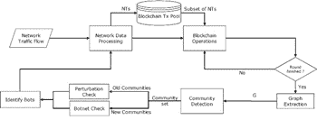
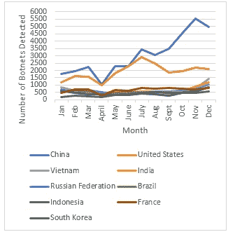

# 物联网和大数据的区块链安全解决方案

**H. Abhijith^(1, *)****,** **Deepti Gupta^(1)****,** **Shilpi Sharma^(1)**

¹ 印度北方邦诺伊达 Amity 大学工程与技术学院

## 摘要

正在塑造未来的技术，物联网（IoT）和大数据，是计算机科学系研究的主要课题。像这样的每一个领域都容易受到黑客和对手的攻击，因此有必要实施适当的安全方法。目前的物联网的性质使用集中式服务器进行数据收集和分析需求，引发了许多安全问题。同样，大数据处理每天处理和分析大量数据。区块链网络可以填补这一需要，提供更好的安全解决方案。尽管它尚处于起步阶段，但由于其去中心化、持久性、匿名性和可审计性等特性，它能够加强各种物联网和大数据应用的安全性。本文讨论了上述技术所使用的现有集中式基础设施中的安全缺陷，并提出了解决这些缺陷的安全解决方案。

**关键词：**大数据、区块链、物联网、安全解决方案。

* * *

^* **通讯作者 H. Abhijith：**印度北方邦诺伊达 Amity 大学工程与技术学院；电子邮件：abhijithrajihari@gmail.com

## 1\. 引言

物联网（IoT）是一系列互相连接的计算设备、机械和数字计算机、物体、动物或唯一标识符（UID），可以在网络上从一个人传输信息，或者不需要人机交互。然而，它存在许多与 IT 安全类似的安全问题[1]。许多当前的物联网网络依赖于用于连接服务器或云服务进行数据处理和存储的集中式网络模式。人们担心服务器会成为瓶颈和新的网络攻击目标，同时也会成为破坏整个网络并损害测试一致性的失败点。因此，如何创建一个完全可靠和互连的生态系统来支持这些嵌入式设备和计算资源进行数据传输仍然是复杂的[1]。

大数据是一个概念，用于描述常规基础设施汇集的大量结构化和非结构化数据。

然而，相关的不是信息量，而是组织对关键信息的利用。一些用户利用此信息谋取个人利益，并进行自私挖矿或将私人信息与公司分享。因此，为了克服物联网和大数据的这些问题，实施了区块链[2]。区块链是一种去中心化系统，它在交易中取消了第三方的使用，从而创建了对等连接。它基于加密、去中心化、不可变性和透明性等功能。区块链中存储的所有数据都像数据库一样耦合在块中。所有交易都与节点相连。当出现新交易时，发送方通过点对点网络将其传达给所有不同的节点。随着交易被验证，它被存储在交易池中。当这些交易在池中被验证时，矿工会创建一个新区块，并在其中存储所有交易，之后该区块被挖掘[2]。

本文讨论了与物联网和大数据相关的安全缺陷。它还介绍了在实施区块链时可能出现的安全问题。本文还提出了这些问题的一些可能解决方案。本文中有各种例子来阐述在实施中的各种结果。我们回顾了其他论文提出的一些备选方案，例如用于数据收集的基于云的无人机系统[3]和公平访问[4]。本文重点介绍了基于区块链的面向物联网网络设计的安全解决方案。这些方法包括对物联网计算机的安全维护，安全固件升级，对可信任计算机的信任验证基础，物联网设备身份的认证以及用于控制信息系统的安全数据存储访问。本文还关注了智能家居中的基于区块链的物联网设备安全架构，该架构由本地智能家居网络、覆盖网络和云存储三个层级组成[1]。各实体在各个阶段之间使用区块链传输进行协调。本文通过分析与物联网组件交互期间未来数据中断和安全问题来反映物联网区块链平台。这些安全问题包括数据保密性，设计实践资源不足，升级和维护信息不足[5]。

本文的组织如下：

第 II 节介绍与该主题相关的文献。第 III 节分析和讨论了 IoT 和大数据面临的各种安全问题，并对区块链提出的和已实施的安全解决方案进行了回顾。第 IV 节讨论了在前一节讨论的安全问题的增长，以及需要区块链解决方案。第 V 节总结了相关工作。第 VI 节总结了本文，并概述了未来工作和现有问题。

## 2\. 文献综述

在本节中，我们将讨论作为背景研究一部分阅读的论文中得出的各种结论。

由[6]进行的一项研究，Zheng *et al.* 提出了各种隐私问题和安全威胁，如 IoT 设备之间的通信中缺乏最佳控制角色以防止劫持和网络攻击，数据收集和使用公平性，以及 IoT 中的身份识别。这些挑战可以通过区块链来解决，因为它能够实现去中心化或分布式网络。然而，它也带来了一些挑战，比如合适的账本存储设施、适当的法律标准的严重不足，以及在这项技术中的有限研究。Karafiloski *et al.* [7]讨论了构建区块链网络的一些主要特征，比如可审计性、匿名性、持久性和去中心化。这些特征有助于构建一个安全的网络，用于大数据和 IoT。一个有效的共识算法是成功区块链网络的关键。高效的共识算法提供了安全性和便利性。在使用区块链网络时也出现了相同的挑战，其中一些是可扩展性和隐私泄漏（表格 **1**）。

表 1 **文献综述摘要。**

| 序号 | 标题 | 结论 | 发现的差距 |
| :-: | :-: | :-: | :-: |
| 1 | 大数据挑战的区块链解决方案 | 区块链让用户控制他们所有的数据和交易。这个概念可以影响大数据，找到一种在 P2P 网络上以分布式方式存储和管理数据的解决方案。 | 这篇论文提到了在医疗保健领域的使用，但没有考虑在时间紧迫的事件中使用区块链网络所带来的巨大计算成本。 |
| 2 | 边缘大数据的开放：一种资源高效的基于区块链的方法 | 合作证明的关键概念是参与者为大数据共享做出贡献，以便他们也可以从其他参与者的合作中受益。 | 提到的 PoC 机制模型将区块链视为一个实体，这是一个极端情况。 |
| 3 | 区块链系统安全调查 | 区块链 2.0，即智能合约的使用，存在问题，如犯罪智能合约、智能合约中的漏洞、未优化的智能合约、低价运营。 | 智能池的一个主要优势是它能够防止可能被提及的跳池行为。 |
| 4 | 区块链：汽车安全与隐私的分布式解决方案 | 所提出的新型汽车安全架构方法的隐私性是从区块链继承而来，其中每个节点都使用唯一的公钥与其他覆盖节点通信。 | 这样的架构需要一种高效的方法来存储密钥，因为每辆车都拥有与 SPs 或用户通信的多个密钥，并且这些密钥在车辆寿命内可能会发生变化。 |
| 5 | IoTChain：物联网的区块链安全架构 | 为了有效地对物联网资源进行多播，使用了自愈式组密钥分发方案，使得大规模和动态的用户能够创建用于在不可靠网络上进行安全多播通信的组密钥。 | 授权流程的第三阶段表明，只有触发智能合约的合法客户端才能解决挑战。然而，没有办法验证他/她是否是合法客户端。 |
| 6 | 区块链作为去中心化安全框架【未来方向】 | 区块链是世纪以来共识问题的有效解决方案。与此同时，区块链并非任何与交易验证和安全有关的问题的通用解决方案。 | 安全框架的实际实现可能会更多地增加研究论文的价值。 |
| 7 | 去中心化隐私：使用区块链保护个人数据 | 本文结合了离链存储来构建一个专注于隐私的个人数据管理平台，并探讨了区块链如何成为可信计算中的重要资源。 | 在本文中，所提出的解决方案查询原始数据。然而，更好的方法可能从不让服务观察原始数据，而是允许其直接在网络上运行计算并获取最终结果。 |
| 8 | 区块链能够加强物联网吗？ | 区块链中没有单点故障或漏洞，除了用于时间戳的时钟。 | 与分散式区块链网络相比，本文并未对区块链的实际实现进行区分，以展示区块链可以有多安全。 |
| 9 | 基于区块链的物联网系统安全解决方案 | 本文侧重于安全解决方案，涵盖了物联网设备的安全管理、固件安全更新、受信计算基的信任评估、物联网设备身份验证、用于访问控制信息的安全数据存储系统。 | 在医疗领域应进行更多关于轻量级加密算法的研究，因为它们对于基于区块链的安全解决方案的实际实现是必要的。 |

根据 Thakore *等人*[8]，区块链是公众可访问的分布式分类帐，它存储系统中执行的所有交易。 在使用区块链前进大数据方面的方法是将区块链与智能合约相结合。 区块链与智能合约相结合可以为发明下一代应用程序做出贡献，并具有更完善的安全和验证系统。 当用户构建和发布数据时，他们也将保持原始数据所有者。 关于通过记录用户行为和愿望实现的监视，用户至少应该对此有所了解，并且有任何优势。 区块链可以成为隐私控制权的代理，也可以引入完全自主的社交网络。 区块链提供用户对他们进行的所有数据和交易的控制。 同时防止第三方对其进行任何检查。 此定义可能会影响 Big Data 在寻求点对点网络上的分布式存储和数据管理的解决方案。

徐*等人*得出结论[9]，区块链克服了在集中网络上通过第三方仲裁者协调实体之间交易的需要（表**1**）。 区块链的实施基于四个主要理念； 挖矿，分布式公共分类帐，分类帐副本同步和对等网络。 合并区块链和物联网有助于支持对等通信，实现自主性，从而消除否则可能发生的所有瓶颈。 物联网和区块链融合可以是经济效率和业务需求的可行解决方案。 区块链并不总是架构基础的好主意，它取决于应用程序类型，该应用程序要求使用区块链的功能。

区块链网络的好坏取决于其共识算法； 根据 Reyna *等人*，[10]，我们看到了一种绿色的合作证明共识机制。 合作证明的关键概念是参与者为了共享大型数据而做出贡献，以便他们也可以从其他参与者的合作中受益。 虽然区块链带来了许多令人兴奋的功能，如去中心化和不可变性，但受限的计算资源，网络和计算机存储资源对区块链架构构成挑战。

李*等*[11]建议（表**1**）在物联网网络中，网络中的任何不可信任的部分都可能会篡改信息，以符合他们自己的利益，从而向系统提供不可靠的信息。为了解决这个问题，我们必须使用区块链实施分布式网络，这个网络被所有参与者信任，可以保证数据的不变性。区块链提供了安全的物联网所需的去中心化和安全性。整合区块链可以改善以下方面；去中心化，服务市场，身份识别，自主性，可扩展性，可靠性，安全性以及安全代码部署。尽管区块链是一个不错的替代方案，可以取代集中式云数据收集网络，但仍然存在一些挑战，比如可扩展性，存储容量，法律问题，*等*。

多里*等*[12]关注（表**1**）区块链技术安全性中的漏洞，通过研究以太坊，比特币等现有的区块链系统，*等*。他们讨论了 51%漏洞，其中共识机制本身有 51%的漏洞，然后对手利用这个漏洞来控制区块链网络，以及双重支付，交易隐私泄露和私钥安全等问题。所有这些问题存在于区块链 1.0 中，而在区块链 2.0 中还有一些特定的问题，比如智能合约的使用（智能合约可以被视为轻量级的 dAPP（去中心化应用）启用，比如智能合约的漏洞，犯罪智能合约，优化不足的智能合约，价格过低的操作。该论文还讨论了对区块链网络的改进；其中一个改进是实施智能池。

在一项研究[13]中，阿尔方德*等*建议（表**1**）一个基于区块链的车辆安全架构。BC 继承了当前系统的匿名性，其中每个节点使用特殊的私钥与其他覆盖节点进行通信。因此，覆盖节点保护覆盖节点免受注册。为了存储受隐私保护的数据，每辆车都配备了车载存储设备。该架构通过提供一种安全的数据交换方式，同时提供最终用户安全性，支持了不断发展的汽车技术。所提出的轻量级可扩展区块链架构的重点是创建一个去中心化的，保护隐私和安全的智能车辆区块链架构，其开销较低。该论文还讨论了有关所提架构的各种应用，从共享汽车服务到智能充电服务。

Puthal *等人* [14] 建议（表**1**）了一种将 OSCAR（物联网对象保护基础设施）和 ACE 授权系统元素结合起来的 IoTChain 架构。 IoTChain 架构使用单个 ACE 授权服务器区块链。 该区块链通过智能合约处理授权需求。 此外，为了有效地进行物联网资源的多播，使用了自我修复社区的主要分配方案。 自我修复组密钥分发允许为大量用户的动态组创建组密钥，以在不可靠的网络上保护多播通信。

Banerjee *等人* [15] 指出，只有在区块链网络是相关的并且允许改进受益保护的情况下，才能引入区块链网络。 参与者通过经过预定义的身份验证和共识的过程确认协议，无需中央第三方程序的干预。 由于通过复杂的密码学实现了高度安全的性质，全球公开分类账中的信息不会遭到篡改。 该系统寻求网络安全用途。 由于集中式系统在物联网中正在消失，因此移动设备可以升级应用程序，修复故障并直接通信。 区块链可能成为解决长期共识问题的成功答案。 但是，不应期望区块链能解决与验证相关的所有问题。

Kshetri *等人* [16] 通过方法、网络结构、应用程序等方式对不同的入侵预防和检测技术进行分类（表**1**）。 它还深入研究了不同的协作安全技术。 该论文还着重于公开获取数据集的必要性，因为真实世界数据集在评估所提出的保护策略方面的位置不容低估，尤其是在预测方面。 为了确保透明共享数据的安全存储，需要使用区块链技术为公开可访问的物联网数据库建立规范。 区块链的未来可以在民用和军事环境中看到，包括无人机互联网、战场互联网和军事物联网。 因此，区块链对于提供安全的分散式网络架构变得更加重要。

Pulkkis *et al.* 建议[17]（表**1**）物联网设备有能力使用智能合约执行自主交易。物联网计算机容易遭受恶意软件、DDoS 攻击、远程劫持和数据窃取。当连接到物联网网络的任何系统感染时，整个网络和相关系统也可能受到影响。在区块链中，无法更改已被接受的交易，以将不可信的设备通过向框架提供虚假签名连接到网络。除了时间戳时钟之外，区块链中没有单一的故障点或弱点。

Zheng *et al.* [18] 关注基于区块链的现有和拟议的物联网网络的安全解决方案。安全解决方案包括物联网设备的安全管理，安全固件更新，信任计算基础的信任评估，物联网设备身份验证，用于访问控制信息的安全数据存储系统。这也关注智能家居中基于区块链的物联网系统保护基础设施，该系统包括本地智能家居网络，叠加网络和云存储三个层。实体在每个阶段之间使用区块链传输来协调。交易类别包括创世交易、存储交易、控制交易和交易跟踪。他们还强调了在医学领域使用物联网设备的提出计划。

Dorri *et al.* 建议[19]，区块链可以通过其各种特性如匿名性、去中心化等而改变传统行业。这项技术可以应用于比特币之外的几个领域，但目前仅受其监护。许多智能合约应用程序旨在克服区块链所面临的困难和问题。然而，本文并未提出任何解决自私挖矿等问题的方法。也没有提出检测用户交易模式的方法，以便根据其模式建议可靠的合作伙伴。智能合约语言在许多方面存在限制和缺陷。

Khan *等* [20] 提出，区块链以其隐私和安全而闻名。在这里介绍了一种优化的区块链，以便消除典型区块链中存在的开销，同时保留其好处。该区块链构成了一种分层体系结构，其在本地端使用集中式私有不可变分类帐，以便消除开销，并在高端设备上使用去中心化公共区块链以获得用户的信任。虽然本文中使用的例子，*即*智能家居场景具有对各种物联网用例不可知的体系结构。对设计对安全性和产生的开销的影响缺乏深入评估。对框架的安全性和共识没有进行全面分析。

在一个研究中[21]，Minoli *等* 讨论了物联网的安全问题，并提出了包括实施区块链在内的可能解决方案。这些问题是由于物联网的不成熟标准和受限资源造成的。物联网在安全硬件和软件部署、设计和开发方面存在问题。本文总结了许多开放性挑战，如单点故障，区块链漏洞，但并未提供相应的解决方案。该论文未提供任何调查结果或图表以评估这些解决方案。

Atlam *等* [22] 得出结论，区块链用于应用层和低层，这使得在各层之间更方便使用，并实现机制的协同使用。区块链嵌入了各种安全机制，如加密，防火墙，*等*，以促进物联网的完整性。然而，并非所有问题都可以使用区块链机制解决，因为这是不现实的。这些系统需要具有适当功能以支持 P2P 功能的节点。

据 Ouaddah *等* [23] 表示，物联网现在在我们日常生活中随处可见。然而，关联的客户端/服务器模型存在诸多问题，如安全性和可伸缩性。为了克服这些问题，实施了区块链，因为它提供了分布式的点对点交互，无需第三方参与，并且不会违背信任。本文还表明，尽管通过实施区块链已经解决了许多问题，但不断出现需要解决的新挑战。

**赛诺等**[24]引入了一种新的区块链适用领域，即通过访问控制框架公平访问进行访问控制。类似比特币的基于区块链的加密货币提供了一致性，而该框架利用这一特性提供了透明且更强大的访问控制工具。本文利用 UML 提供了框架的动态和静态描述。详细的技术应用以及使用树莓派和典型物联网用例进行的初始执行和实施均有所提及。

**拉巴等**[25]突出显示了区块链的所有特征，并展示了它在许多应用中的理想性。区块链不应该取代所有的数据库系统，因为有一些场合应该使用传统方法而不是区块链，因为传统方法更为有益。已经进行了一项调查，显示许多行业和领域正在使用区块链。展示了区块链的个体特征，以便为所需目的选择适当的区块链。

**梁等**[26]提供了关于大数据、物联网、区块链和人工智能的详细信息。大数据可以为公共和私人服务提供便利。它精心汇集数据并指出哪些数据应该共享，哪些数据应该保密。这可以使许多组织和行业受益。本文展示了大数据、物联网、区块链和人工智能之间的相似之处，以及它们彼此之间的依赖关系。这种相互关系使它们成为每个问题的理想替代方案。

**梁等** [27] 论文得出的推断是物联网应用中每天都有许多网络攻击的增加。这项技术的进步带来了许多威胁。本文重点关注如何利用区块链消除这些威胁。为了举例说明这个想法，他们给出了一个基于云的无人机系统来收集数据。本文提出了使用区块链的无人机数据收集系统的一般架构。该系统确保了可靠性，并通过使用无人机系统进行实时数据收集来减少数据丢失和风险的数量。已经评估了一个用于无人机系统的原型，以了解其性能。

**岳等**[28]讨论了 ProvChain，这是一个用于在云存储环境中确保数据操作，并同时提高安全性和可用性的数据溯源基础设施。ProvChain 将项目历史存储为溯源数据，并将其哈希到 Merkle 树的节点中。基于区块链的数据溯源可以通过利用全球区块链网络的计算能力具有可靠性和可信度。用户的哈希身份在给定架构中保留，以保护他们的匿名性，使其不受来自区块链网络其他节点的影响。

在 Zamora *等人*的论文[29]中，区块链技术被应用来解决一些重要问题，比如对个人数据和存储的剥削，通过整合区块链和智能合约来创建无侵入第三方参与的去中心化数据交换模型，分割现有的“孤岛”网络，并增加数据声誉。对于数据供应商，去中心化架构消除了由过分集中到数据存储所带来的对数据保护的威胁；对于客户而言，区块链运营模型保证了知识收集阶段的一致性，同时保护了用户的隐私和学习权利。

## 3\. 方法论

在这一部分中，介绍了调查物联网和大数据所面临的两个主要问题——勒索软件和僵尸网络的威胁的方法论。在讨论了安全风险后，也介绍了安全解决方案。

Ransomware 和僵尸网络检测的数据来源均为 2019 年收集，*即*从 1 月 1 日到 12 月 31 日。特别是，勒索软件 ryuk 的数据收集自 Malwarebytes 的客户[30]，来自活跃账户，以减少数据中的任何不规律性。在收集数据后，我们绘制了一个图表，显示了每个月检测到的勒索软件 ryuk 的情况。检测到的僵尸网络数据是使用“跟踪垃圾邮件”[31]的方法收集的，然后绘制了一个图表，显示了 2019 年检测到的拥有最多僵尸网络的九个国家。

### 3.1\. 安全挑战

#### 3.1.1\. 物联网的安全挑战

**僵尸网络攻击** 僵尸网络是由多个互联网连接设备组成的网络，每个设备都在运行一个或多个僵尸程序，并由攻击者控制。它们被用于执行各种非法攻击，其中一个主要的攻击方式是分布式拒绝服务（DDoS）攻击，因为对手可以完全访问受影响设备[32]。如果用户的设备是僵尸网络的一部分，则可能变得更加危险。僵尸网络是通过攻击物联网网络中的弱点并暴露其漏洞而制作的。在漏洞被暴露后，攻击者获得对设备的访问权限，并继续影响网络中的其他设备，因为它们处于中心化网络中创建了一个僵尸网络。最著名的僵尸网络之一是 Mirai 僵尸网络。Mirai 是一种恶意软件，已渗入物联网设备并将它们合并成用于 DDoS 的僵尸网络。在整个扩散到设计薄弱的物联网设备[33]时，Mirai 触发了对一组目标服务器的 DDoS 攻击。在其鼎盛时期，Mirai 感染并合并了近 60 万台设备[34]。僵尸网络也在不断发展，因为它们大多具有分布式架构，这使得难以追踪攻击者[35]。

**勒索软件攻击** 勒索软件是在任何平台上执行的最常见的攻击类型。它是恶意软件的子集，只有一个目的，即加密用户的数据以将他们锁在自己的文件之外，然后攻击者要求赎金以移除所说的恶意软件[36]。在物联网方面，勒索软件攻击可能不仅仅是锁定受害者，还可能危及保密性、完整性和可用性[37]。网络犯罪投诉中心（IC3）报告仅在 2019 年就损失了约 890 万美元。其中一个例子是 WannaCry / WannaDecryptor；它是一种称为加密勒索软件的勒索软件，应用了加密和解密算法来处理计算机数据，并且如果它针对后端应用服务器，则风险更大，因为物联网设备在前端不包含大量数据[37]。

**数据完整性** 在这个新时代的物联网中随处可见，有一些估计显示到 2025 年，全球将拥有约 210 亿个物联网设备[38]。这导致传感器和与这些设备嵌入或连接的执行器收集了大量敏感数据。因此，保护这些数据的完整性和真实性非常重要。这就是挑战所在，即保持数据的完整性。而且当物联网网络中的一些传感器具有较高的带宽和低延迟（实时）的数据收集速率时，这一点变得更为重要。因此，需要采用适当的数据完整性技术，如加密和水印[39]。

**身份验证** 每当使用设备时，都会进行身份验证检查，以验证试图访问设备的用户是否具有适当的权限。物联网网络由传感器、执行器、互联网网关、边缘 IT 和数据中心组成，每个都具有其独特的功能来执行特定操作。在物联网网络中，必须对这些组件中的每一个进行适当的身份验证，以确保网络的安全实施。物联网已经存在用于此目的的基础设施，即公钥基础设施（PKI），其中使用数字证书来提供物联网设备的真实性证明，但区块链的分布式分类账的使用可以增强 PKI 并确保数字证书管理是可审计的，并且所做的任何更改是不可逆转的[40]。

#### 3.1.2\. 大数据中的安全挑战

**数据增长。** 大数据处理着大量数据，而且这些数据每天都在增加。如今，每个人都使用一个集中式数据中心来处理这些数据流。到 2020 年底，累计的数据量足够填满一座从地球到月亮的 6.6 倍高的平板堆叠[41]。视频分享平台 YouTube 单独产生如此多的数据，以至于他们拥有一台容量为一艾字节（十亿吉字节）的服务器，因为每分钟在此平台上传了 300 小时的视频[42]。这种不断增长的数据规模，大部分数据是非结构化的，需要得到控制，以免集中式数据中心溢出。

**所有权和货币化。** 数字专有权处理数字数据的所有权，可以是音频、视频或文本的艺术品形式。对于作者或创作某件艺术品的人而言，得到作品的适当认可是非常重要的。目前，如果一个创作者把他们的作品放到一个平台上，没有办法保护这些作品的真实性，因为有人可以冒充作品的原创者并且为其取得信用。创作者甚至没有一个公平获得报酬的合适途径[7]。

**数据修改。** 数据的真实性非常重要，因为它被分析和处理，正确的数据意味着正确的分析结果。数据的修改使得这个过程变得困难，因为数据可能被修改并生成不正确的见解。与数据修改类似，数据验证也是一个挑战。有时候进行分析研究的组织会从不同的系统收到相同的数据片段，而这些数据并不总是与这些不同系统上的记录相符。例如，一个医院的电子病历（EHR）程序可能有一份处方药物的记录，而合作伙伴药房也有一份【41】。

**数据安全。** 最关键的挑战是保护数据免受试图挖掘敏感信息的对手的侵害。数据安全不仅意味着保护数据免于被盗窃，还意味着保护数据免于可能的虚假。网络犯罪分子可能通过生成虚假的传感器数据来实施此类行为，因此报告将是不准确的。使用大数据研究销售其产品的组织在一个集中的数据中心聚合他们的数据，存储结构化和非结构化数据。将数据集中在一个地方成为了攻击者的一个有价值的目标，这可能会暴露大量的信息，这可能会损害组织的信任和声誉[43]。

### 3.2\. 区块链解决方案

#### 3.2.1\. 物联网的安全解决方案

**AutoBotCatcher**- Gokhan *et al.* [5] 提出了一个区块链解决方案，用于捕捉进行非法活动的恶意僵尸网络。 他们提出了 Auto Bot Catcher，它在有限权限的情况下使用拜占庭容错（BFT）区块链来检测通过处理网络流数据来检测机器人。 使用 BFT 的原因在其将生成块的角色分配给一小部分演员的特性中得到解释。 在有限权限的情况下使用区块链有助于保持对手的存储的网络数据保密，因为只有一定的预识别块生成器集才能访问上述数据。 BFT 方法遵循两个共识协议，*即*，要就目前由其中一个块生成器引入的一组规则达成共识，必须至少有三分之二的预先识别的块生成器决定。 这组规则是相同的相互接触图、经过的块集和 IoT 设备社区映射。 AutoBotCatcher 由两个实体 Agent 组成，他们监视网络流量，并且块生成器，正如其名称所暗示的那样，是共识和块生成过程的一部分。

如图（**1**）所示，AutoBotCatcher 处理 IoT 设备的安全存储的网络流数据，然后在预处理后生成相互联系图，以确定 IP 地址是否属于代理维护的*黑名单*和*白名单*。 如果检测到黑名单中的 IP 地址，则代理切断网络连接或强制其关闭，实质上使其隔离。 生成相互联系图后，通过使用 Louvain 方法[22]执行动态社区发现（DCD）进行分析，但是通过上一个状态的 IoT 设备社区集。 然后执行两个检查扰动检查和僵尸网络检查分别针对旧和新的社区。 扰动检查是为了根据它们是否属于由块管理器管理的僵尸网络的一部分而向黑名单中添加或删除 IP 地址。 而僵尸网络检查将新的社区分类为僵尸网络社区或由块管理器管理的安全社区。 最后，块管理器更新了所有 IoT 设备的黑名单并同时使用智能合约来更新标识机器人的黑名单。 

**图（1))**

AutoBotCatcher 的系统流程。

**勒索软件攻击预防框架**。Kaur *et al.* 在一项研究中[44]提出了一个通过使用区块链智能合约功能来防止勒索软件攻击的框架。在该框架中，定期进行网关检查以查找恶意端口或 IP 地址。然而，如果任何高级恶意软件突破，则区块链智能合约检查三个主要内容：系统调用；真实性；访问控制。如果软件的行为正常，例如读/写文件或查询文件，则被视为正常用户行为，但如果访问敏感信息，如网络信息或内核级信息，则向用户发出系统中存在恶意软件的警报。然后，用户对其进行适当的权限授予执行，如果是非恶意软件。被标记的上述软件可能会尝试进行恶意系统调用来加密或控制桌面，然后区块链将在除了蜜罐设备之外的所有设备中停止进程，如果它在这些设备上安全运行而且没有勒索电话，那么软件将被视为非恶意。但是，如果发出勒索电话，则该软件被标记为恶意软件，并从设备上卸载，并更新蜜罐设备的新规则。该框架还支持使用区块链云基础设施的备份功能。

**数据完整性感知**。 2019 年，Hang *et al.* [45] 实施了区块链，创建了一个基于物联网的区块链平台。与先前讨论的解决方案类似，这也严重依赖于智能合约的使用。论文中提到的智能合约包含五个字段：设备所有者注册功能；设备注册功能；传感器读取功能；执行器写入功能；事件通知。这个智能合约连接到账本，接收账本更新并返回更新结果。账本和智能合约构成了物联网区块链网络，并连接到应用客户端，执行智能合约并接收账本更新。当新设备添加到网络中时，客户端通过调用上述智能合约中提到的设备注册交易来注册设备。此后进行共识过程，每个节点更新他或她的区块链以及通知客户端交易的执行。设备成功注册后，设备所有者可以部署由特定设备执行的任务。目标设备在执行任务后，将结果发送到服务器和区块链。然后，区块链更新每个节点的分布式账本并将结果发送到设备。此外，当满足预先定义的条件时，例如，空气湿度达到不适合作物生长的不满意水平，向设备所有者提供警报，在基于农业的物联网网络中。

**信任泡沫。** 2018 年，Hammi *等* [46]提出了一种身份验证方法，其中包含多个包含许多物联网设备的封装区域。在这些区域中，物联网设备可以相互信任，但两个不同区域的物联网设备不能互相访问。该架构中的这个区域被称为泡沫。所有这一切都是通过使用公共区块链启用的智能合约实现的。这个泡沫包括两个主要组成部分，主和从。主在初始化阶段被任命（可以是任何设备），并且有一个公共/私有密钥。而从者创建一个椭圆曲线私钥/公钥，并具有一个以结构化数据类型形式呈现的票证，详细说明了从者的组 ID、对象 ID、公共地址和使用主私钥创建的签名。总之，在初始化阶段，主选择一个组 ID，并为物体提供其签名的票证。然后，主传递了一笔交易，其中包括了主的标识符（对象 ID）和要创建的组的组标识符（组 ID），并在验证了上述两个标识符的唯一性后，该泡沫被创建。主创建泡沫后，从者传递他们的交易来加入他们想要的泡沫。在这里，通过使用智能合约验证从者标识符（对象 ID）的唯一性，以及通过使用主公钥验证其票证，便可证明从者的真实性，不需要进行身份验证。

#### 3.2.2\. 大数据的安全解决方案

**所有权管理。** 已经有很多尝试正确进行所有权管理的努力，有一些成功的案例，也有一些不成功的案例。Ascribe 生成的名为安全公共在线所有权分类帐（SPOOL）的协议被列在[7]的作者中。SPOOL 是一个记录公共数字内容的合法所有权的协议。他们还允许创建者对其内容制定一些规则，比如固定数量的版本。这些版本被保存在 BigchainDB [47]中作为一个，并为区块链进行了哈希。现在，当创建者出售他们的版本之一时，将发起一笔交易，其信息包括哈希值、版本和新的所有权。然后，交易由创建者签名并传递。此外，如果查询者知道内容的哈希值，可以使用区块链浏览器来跟踪工作。然而，由于一些基础设施问题，Ascribe 不得不在 2017 年创建一个名为 Ocean 协议的新协议。这是一个去中心化的数据交换协议，使用智能合约、区块链技术、代币并为人工智能解锁数据[48]。它赋予了创建者对其内容更多的控制权。

Monegraph 是另一个使用区块链的实施方案，为艺术家创建一个平台来交易其作品，并正确管理所有权。 它允许艺术家制作定制许可证书，其中包括艺术品的使用要求。 所述艺术的所有权历史存储在区块链中，有关艺术的其他重要数据存储在文档数据库中。

**去中心化，分布式和不可变性。** 大数据的主要问题如数据增长，安全性和有效性可以通过实施区块链来解决。 区块链具有数据不可变性的关键特征，有助于确认数据未被修改，确保数据有效性[49]。 区块链网络提供数据安全性，因为每笔交易都被记录，并且由于其去中心化，几乎不可能发生可能的数据泄漏。 区块链的分布式特性确保数据的高效处理。 为适当身份验证提供的解决方案之一是去中心化身份验证，使用椭圆曲线加密生成的密钥替代传统的用户名和密码方法。 用户仅使用一个密码以便访问其提供的私钥，该用户只能在自己的设备上使用其私钥。 用于识别的协议是基于公钥数字签名的不可辩驳身份验证[49]。

## 4\. 结果

在这一部分中，对物联网和大数据安全威胁的真实性进行了评估。 这里讨论的两个案例是勒索软件和僵尸网络。 勒索软件对企业而言更为严重，而不是对消费者。 正如我们在图中所看到的(**2**)，勒索软件 ryuk 在 2019 年肆虐。

**图（2))**

2019 年检测到的勒索软件。

总体而言，消费者网络中勒索软件攻击有所减少，但支付的赎金金额仍然很大，从 2019 年第二季度到第三季度的支付赎金增加了 29%。

2019 年疑似僵尸网络数量也在增加。 如图所示(**3**)，2019 年中国最受影响的国家的疑似僵尸网络 IP 数量从年初增加了 3 倍。

**图（3))**

2019 年各国疑似僵尸网络 IP。

## 结论

区块链为我们提供了独特的解决方案来对抗大量的安全问题。 该技术设想并革新了数据管理，使用户能够更多地控制数据，并获得数据保护的附加好处。 我们可以从结果中得出结论，像僵尸网络，勒索软件和其他安全威胁仍在影响当前互联设备和网络的现状。

本文讨论了当前物联网和大数据实施中存在的一些主要安全缺陷。随后，一些拟议的框架和架构被提出作为解决上述安全问题的方案。然而，对于区块链本身的实施仍然存在一些挑战，比如一个适合的共识算法，不会使用太多计算资源，或者一个适当的账本存储设施。因此，只有当区块链在经济上可行并提供更好的安全性时，才应将其整合到当前技术中。

## 未来工作

在不久的将来，涉及通过互联网进行验证和认证的领域的大多数将以区块链作为解决方案。它将通过更好地将区块链实施到各自领域，带来更好的解决方案。值得注意的是，所给出的例子都不是基于区块链提案的物联网安全系统，它们提供了完全防范所有未来风险和攻击的防御。事实上，这些防御技术的实际应用也是未来的事情。一些挑战仍然存在，如共识模型、挖矿块计算成本和交易验证。区块链应用通常提供需要对现有系统进行重大修改或完全替换的解决方案。因此，转移并不会轻松而快速。然而，我们仍然处于区块链发展的早期阶段，最终这些障碍将被克服，为许多令人兴奋的可能性铺平道路。

## 出版同意

不适用。

## 利益冲突

作者声明无利益冲突，无论是财务上还是其他方面。

## 致谢

未声明。

## 参考文献

|  |  |
| --- | --- |
| [1] | Pulkkis G., Karlsson J., Westerlund M.. 物联网系统的基于区块链的安全解决方案.2018255273 |
| [2] | Karafiloski E.. 大数据挑战的区块链解决方案：文献综述 20176810.1109/EUROCON.2017.8011213 |
| [3] | Liang X., Zhao J., Shetty S., Li D.. 利用区块链实现物联网数据保障和恢复 201726126610.1109/MILCOM.2017.8170858 |
| [4] | Ouaddah A.A.. 公平访问：面向物联网的新区块链访问控制框架 20175943596 |
| [5] | Kumar N.M., Mallick P.K.. 用于物联网安全问题和挑战的区块链技术.计算机科学论文集 20181321815182310.1016/j.procs.2018.05.140 |
| [6] | Zheng Z., Xie S., Dai H., Chen X., Wang H.. 区块链技术概述：架构、共识和未来趋势.2017 年 IEEE 国际大数据大会论文集（BigData congress）IEEE201755756410.1109/BigDataCongress.2017.85 |
| [7] | Karafiloski E., Mishev A.. 区块链解决大数据挑战：文献综述.在 IEEE EUROCON 2017-第 17 届智能技术国际会议上 IEEE201776376810.1109/EUROCON.2017.8011213 |
| [8] | 桑科雷 R.，瓦加希亚 R.，帕特尔 C.，多希 N.。基于区块链的物联网：一项调查。Procedia 计算机科学.201915570470910.1016/j.procs.2019.08.101 |
| [9] | 许 C.，王 K.，李 P.，郭 S.，罗 J.，叶 B.，郭 M。边缘大数据开放：一种资源高效的基于区块链的方法。IEEE Trans. 并行分布式系统 201830487088210.1109/TPDS.2018.2871449 |
| [10] | 雷纳 A.，马丁 C.，陈 J.，索尔 E.，迪亚兹 M.。关于区块链及其与物联网的整合。挑战与机遇。Future Gener. 计算机系统 20188817319010.1016/j.future.2018.05.046 |
| [11] | 李 X，江 P.，陈 T.，罗 X.，文 Q.。关于区块链系统安全性的调查。未来 Gener. 计算机系统 2017 |
| [12] | 多里 A.，斯特格尔 M.，卡纳赫雷 S.S.，德拉克 R.。区块链：汽车安全与隐私的分布式解决方案。IEEE 通信杂志 2017551211912510.1109/MCOM.2017.1700879 |
| [13] | 阿尔芬德 O.，阿莫雷蒂 M.，克莱斯 T.，达拉斯塔 S.，杜达 A.，费拉利 G.，等。IoTChain: 一种物联网的区块链安全架构。2018 年 IEEE 无线通信和网络会议（WCNC）IEEE20181610.1109/WCNC.2018.8377385 |
| [14] | 博塔尔 D.，马利克 N.，莫汉蒂 S.P.，库吉安诺斯 E.，杨 C.。区块链作为分散型安全框架。IEEE 消费电子杂志 2018721821 [未来方向].. 10.1109/MCE.2017.2776459 |
| [15] | 巴纳吉 M.，李 J.，朱 K.K.R.。物联网安全的区块链未来：一个立场文件。数字通信与网络 20184314916010.1016/j.dcan.2017.10.006 |
| [16] | 克谢特里 N.。区块链能加强物联网吗？IT Prof.2017194687210.1109/MITP.2017.3051335 |
| [17] | 普尔基斯 G.，卡尔松 J.，韦斯特伦德 M.，哈桑 Q. F.。基于区块链的物联网系统安全解决方案。物联网 A 到 Z：技术和应用 201820180501 |
| [18] | 郑 Z.，谢 S.，戴 H.N.，陈 X.，王 H。区块链的挑战与机遇：一项调查。Int. J. Web Grid Serv.201814435237510.1504/IJWGS.2018.095647 |
| [19] | 多里 A.，卡纳赫雷 S.S.，德拉克 R.。朝着物联网优化的区块链。2017 年 IEEE/ACM 第二届物联网设计与实施国际会议（IoTDI）IEEE2017173178 |
| [20] | 肯恩 M.A.，萨拉 K.。物联网安全：回顾，区块链解决方案及未来挑战。Future Gener. 计算机系统 20188239541110.1016/j.future.2017.11.022 |
| [21] | 米诺利 D.，奥克奇奥格罗索 B.。物联网安全的区块链机制。物联网 2018111310.1016/j.iot.2018.05.002 |
| [22] | 阿特勒姆 H.F.，阿伦尼奇 A.，阿拉萨菲 M.O.，威尔斯 G。区块链与物联网：好处，挑战和未来方向。Intelligent Systems and Applications 国际期刊 2018106404810.5815/ijisa.2018.06.05 |
| [23] | Ouaddah A.，AbouElkalam A.。FairAccess：物联网的新基于区块链的访问控制框架。Secur. Commun. Netw.20169185943596410.1002/sec.1748 |
| [24] | Casino F., Dasaklis T.K., Patsakis C.. 基于区块链应用的系统化文献综述：当前状况、分类和待解决问题。Telemat. Inform.201936558110.1016/j.tele.2018.11.006 |
| [25] | Rabah K.. 人工智能、物联网、大数据和区块链的融合：一项综述。Law Inst. J.201811118 |
| [26] | Liang X., Zhao J., Shetty S., Li D.. 利用区块链实现物联网中的数据保障与恢复。In MILCOM 2017-2017 IEEE Military Communications Conference (MILCOM)IEEE201726126610.1109/MILCOM.2017.8170858 |
| [27] | Liang X., Shetty S., Tosh D., Kamhoua C., Kwiat K., Njilla L.. Provchain：一种基于区块链的增强隐私和可用性的云环境数据溯源架构. In 2017 17^(th) IEEE/ACM International Symposium on Cluster, Cloud and Grid Computing (CCGRID)IEEE201746847710.1109/CCGRID.2017.8 |
| [28] | Yue L., Junqin H., Shengzhi Q., Ruijin W.. 基于区块链的安全共享的大数据模型。In 2017 第 3 届国际大数据计算与通讯大会（BIGCOM）IEEE201711712110.1109/BIGCOM.2017.31 |
| [29] | Zamora W.. 2019 年恶意软件现状报告：特洛伊木马和加密挖矿程序主导威胁格局 2019 [`blog.malwarebytes.com/malwarebytes-news/ctnt-report/2019/01/2019-state-malware-report-trojans-cryptominers-dominate-threat-landscape/`](https://blog.malwarebytes.com/malwarebytes-news/ctnt-report/2019/01/2019-state-malware-report-trojans-cryptominers-dominate-threat-landscape/). |
| [30] | Chin C-C.. 日常僵尸网络统计 2008 [`botnet-tracker.blogspot.com/`](http://botnet-tracker.blogspot.com/). |
| [31] | Sagirlar G., Carminati B., Ferrari E.. AutoBotCatcher：基于区块链的物联网点对点僵尸网络检测. In 2018 IEEE 4^(th) International Conference on Collaboration and Internet Computing (CIC)IEEE20181810.1109/CIC.2018.00-46 |
| [32] | Thingbots：物联网中僵尸网络的未来。Security Intelligence2016 |
| [33] | Kolias C., Kambourakis G., Stavrou A., Voas J.. 物联网中的 DDoS：以 Mirai 和其他僵尸网络为例。Computer2017507808410.1109/MC.2017.201 |
| [34] | Antonakakis M., April T., Bailey M., Bernhard M., Bursztein E., Cochran J., 等. 了解 Mirai 僵尸网络。In 第 26^(th) {USENIX} Security Symposium ({USENIX} Security 17)201710931110 |
| [35] | Fruhlinger J.. 研究报告：Mirai 僵尸网络解析 - 物联网设备险些导致互联网崩溃 2018 [`www.csoonline.com/article/3258748/the-mirai-botnet-explained-how-teen-scammers-and-cctv-cameras-almost-brought-down-the-internet.html`](https://www.csoonline.com/article/3258748/the-mirai-botnet-explained-how-teen-scammers-and-cctv-cameras-almost-brought-down-the-internet.html). |
| [36] | Young A., Yung M.. 加密病毒学：基于勒索的安全威胁与对抗措施。IEEE Symposium on Security and Privacy1996129140 |
| [37] | 亚库卜 I., 阿迈德 E.. 勒索软件的崛起和物联网中出现的安全挑战。计算机网络。201712944445810.1016/j.comnet.2017.09.003 |
| [38] | 西曼诺维奇 S.. 物联网的未来: 关于物联网的 10 项预测。诺顿 [us.norton.com/internetsecurity-iot-5-predictions-for-the-future-of-iot.html](http://us.norton.com/internetsecurity-iot-5-predictions-for-the-future-of-iot.html)。 |
| [39] | 徐 T., Wendt J.B., Potkonjak M.. 物联网系统的安全性: 设计挑战和机遇。2014 年 IEEE/ACM 国际计算机辅助设计会议 (ICCAD)IEEE201441742310.1109/ICCAD.2014.7001385 |
| [40] | 迈克尔·奥德威尔。物联网 101 – 解析物联网设备认证。Defrag This2018 [blog.ipswitch.com/internet-of-things-101-iot-device-authentication-explained](http://blog.ipswitch.com/internet-of-things-101-iot-device-authentication-explained)。 |
| [41] | 哈维 C.. 大数据挑战。2017 [www.datamation.com/big-data/big-data-challenges.html](http://www.datamation.com/big-data/big-data-challenges.html)。 |
| [42] | 77 个史无前例的大数据统计数据: 更新至 2020 年。HostingTribunal2020 [hostingtribunal.com/blog/big-data-stats/](http://hostingtribunal.com/blog/big-data-stats/)。 |
| [43] | Tanakard C.. 大数据安全。网络安全。2012201275810.1016/S1353-4858(12)70063-6 |
| [44] | Kaur J.. 用于防止勒索软件攻击的安全智能框架。arXiv 预印本 arXiv2020 |
| [45] | 杭 L., 金 D.H.. 为传感数据完整性设计和实施集成物联网区块链平台。传感器 (巴塞尔)20191910222810.3390/s1910222831091799 |
| [46] | Hammi M.T., Hammi B., Bellot P., Serhrouchni A.. 信任泡沫: 一种面向物联网的去中心化区块链身份验证系统。计算机安全。20187812614210.1016/j.cose.2018.06.004 |
| [47] | 麦康纳格 T., 马奎斯 R., 穆勒 A., 德容赫 D., 麦康纳格 T., 麦克马伦 G., 等人。Bigchaindb: 一个可扩展的区块链数据库。白皮书，BigChainDB.McConaghy2016 |
| [48] | Protocol O.. 播放网络区块链平台推出 Beta 版，以启动具有安全、隐私保护和无国界数据共享的新数据经济。2019 [`prn.to/2TwTsM1`](https://prn.to/2TwTsM1)。 |
| [49] | 阿卜杜拉 N., 哈肯松 A., 莫拉迪安 E.. 区块链为增强分布式环境中的大数据认证提供了基础。2017 年第 9 届国际未来网络大会 (ICUFN)IEEE201788789210.1109/ICUFN.2017.7993927 |
