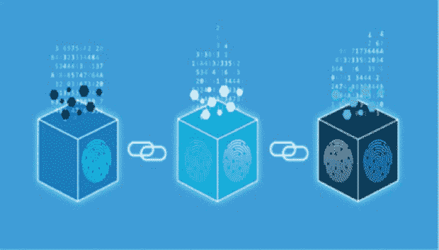
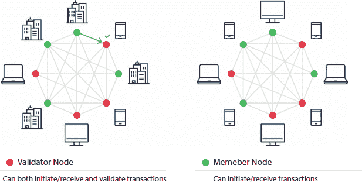
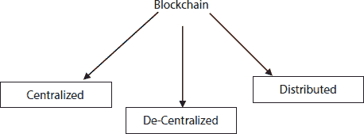
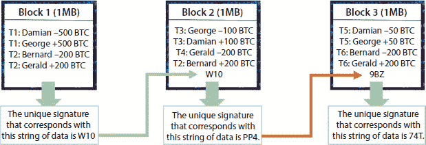
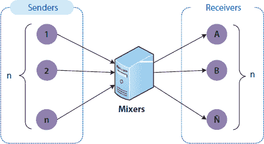
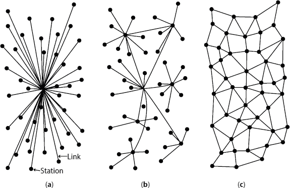
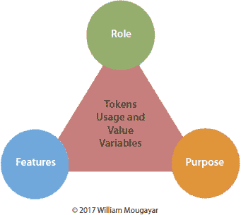
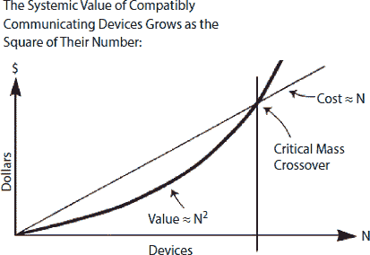

# 1

区块链简介

**Akshay Mudgal**

**GD Goenka University, Sohna, Gurugram, India**

***摘要***

自区块链技术问世以来，已经显示出有前景的应用可能性。从最初的加密货币到当前的智能合约，区块链已被应用于众多领域。尽管对区块链的安全和隐私问题进行了一些研究，但关于区块链系统安全的有效评估仍然不足。作为分布式系统中的去中心化和分布式公开记录技术，区块链近年来已获得了广泛关注。它采用链式区块结构来验证和存储信息，并应用可信的共识机制来同步信息的更改，这使得创建一个密封的数字平台用于放置和分享信息成为可能。人们认为区块链可以应用于不同的互联网智能系统（例如，物联网、供应链框架、人类身份管理等等）。然而，一些安全挑战可能会阻碍区块链的广泛应用。本章将讨论隐私问题、去中心化和监管挑战的更广泛方面，同时也将关注与区块链相关的商业模式，重点关注区块链的安全和隐私方面。

***关键词：*** 区块链，安全，隐私，去中心化，加密货币，数据盗窃

## 1.1 引言

自 2009 年比特币问世以来，其基础策略——区块链，已经显示出有前景的应用前景，并吸引了学术界和产业界的广泛关注[4]。作为第一种数字货币，比特币在 2015 年被评为表现最佳的货币，在 2016 年被评为表现最佳的产品，此外，2017 年 5 月每天的交易量超过了 30 万[4]。同时，区块链技术已应用于众多领域，包括医疗、金融、物联网、软件设计等[4]。Turing-complete 编程语言的出现使客户能够创建在区块链上运行的智能合约，标志着区块链 2.0 时代的开始。借助区块链的去中心化共识机制，智能合约允许彼此不信任的客户完成信息交换或交易，无需任何可信第三方的介入[4]。以太坊目前（2017 年 5 月）是支持智能合约的最广泛使用的区块链，其中已有 317,506 个智能合约，并且每天发生超过 75,000 笔交易[4]。

安全性是任何需要执行或拍卖的行动的首要任务或最关心的问题，因此区块链扮演了角色(图 1.1)。区块链最初是由一组研究人员在 1991 年开发的，目的是给数字文档打上时间戳，但那并没有很好地工作，实验失败了，因此今天的幻觉技术被废弃了[2]。2004 年，一位名叫 Hal Finuey 的计算机科学家再次重新引入了区块链，这次有所不同，它是 RPOW（可重用工作量证明）。

区块链是由四个主要组成部分集合而成的区块[2]。区块链是一个去中心化、分布式、公开的账本。它（区块链）是一个保存记录（交易）的去中心化场所，因为记录可以在任何地方创建，而且任何地方都可以访问，所以它是分布式的。但是，安全性方面又如何呢？因为区块链可以在任何地方、由任何人访问和创建，这意味着我们需要使这个概念更加可行和安全的。

**图 1.1** 展示了区块链的图片印象[2]。

当涉及到任何元素/产品/或系统的隐私和安全时，它应该具有基本的工作原理和架构知识。这样，已经存在的安全级别可以更新或替换，以迎接更美好的未来[2]。

参考本书的第二章节，它解释了区块链的工作原理。在本章节的这一部分，将讨论区块链的基本架构，但为了了解架构，应该先讨论一些将在区块链的安全和隐私方面主要使用的术语。

1.  不可变性——使用数字签名或哈希函数来确保账本的安全。

1.  工作量证明（POW）——这是一种协议，其主要目标是防止网络攻击。

1.  哈希——由一组规则/算法/函数或所有这些的组合分配的独特值，以使账本独特且与其他区块分离。

1.  数字签名——这是另一种确保账本安全的方法，这样数据必须经过验证并被视为真实。

1.  挖掘——挖掘活动通常是从整体中收集有用的东西。

这些是我们在本章中可能遇到的的主要术语。您将在本章的后续部分了解更多关于这些术语的内容，但在那之前，下面将讨论不同类型的区块链架构。

从逻辑上讲，区块链是一个包含特定信息（数据库）的块链，以安全和真实的方式组合在一起，形成一个网络（点对点），如图 图 1.2 所示。换句话说，区块链是计算机相互链接的组合，而不是中央服务器，这意味着整个网络是去中心化的 (图 1.3) [3]。

借助相关示例来理解，例如在 Google 文档上工作并等待其他人进行必要的更改，如果需要，同样的场景也出现在区块链的去中心化架构中。区块链允许我们共享相关文档，而不是复制 [2, 3]。这种分布式信息（账本）提供了信任因素和数据安全性。

**图 1.2** 区块链架构类型的图示表示 [3]。

**图 1.3** 图说明了当前流行的区块链类型。

而在中心化架构中，共享的信息或账本现在保持私密，并与具有必要和必要权限的授权实体共享，这意味着现在数据/账本保持私密，不在全球范围内共享。

现在剩下的是分布式架构，在这种类型中，将账本的所有方/实体都提供一个本地副本，以便高级官员或主要方进行重大更改，而账本的信息在完整的地域内进行分发。

**表 1.1** 将使概念更加清晰易懂。

**表 1.1** 公共、联盟、私有区块链之间的新比较。

| **属性** | **公共区块链** | **联盟区块链** | **私有区块链** |
| --- | --- | --- | --- |
| 共识确定 | 所有矿工 | 选定的节点集合 | 在一个组织内 |
| 读取权限 | 公开 | 公开或受限 | 公开或受限 |
| 不可篡改性级别 | 几乎不可能被篡改 | 可以被篡改 | 可以被篡改 |
| 效率（资源利用） | 低 | 高 | 高 |
| 集中化 | 否 | 部分 | 是 |
| 共识过程 | 无权限 | 需要权限 | 需要权限 |

### 1.1.1 公共区块链架构

公共区块链架构表明，数据或账本以及对系统的访问对任何愿意参与的人都是开放的，例如比特币、以太坊和莱特币区块链系统是公开的，任何地方的人都可以访问 [2, 3]。

### 1.1.2 私有区块链架构

与公共区块链架构相反，私有系统受到高度控制和管理，仅由特定组织、机构、公司或拥有参与邀请的授权用户管理。

### 1.1.3 联盟区块链架构

这种区块链结构可能包括几个组织[3]。在联盟中，由最初指定的用户建立和控制程序。这是一个“半私有”的系统，有一个小组控制它，但跨不同的组织工作。简单地说，它可以被认为是一种分布式区块链架构。

以下表格提供了这三种区块链系统之间的详细比较[3]：

## 1.2 区块链的隐私挑战

在上一节中，讨论了区块链的基本介绍部分。在本部分，将讨论包括不同工具和技术在内的隐私需求。

如本节中的图 1.4 所示，区块链是一种非常安全的机制或技术，可允许用户进行安全和安全的交易[1, 3]。这是许多工程师、科学家和研究人员所说的，但究竟是如何......？

为了详细了解这个说法，人们应该回溯区块链，并收集有关这项技术为何如此强大和安全的必要信息。我们还需要知道，如果这项技术如此巨大，那么为什么在 1991 年被废弃，然后又在 2004 年重新推出[1]。

区块链的工作范式：

让我们更深入地观察图 1.4，它说明了区块链中的一个区块是什么。

区块链中的每个区块包括：

+   某些数据

+   区块的哈希值

+   前一个块的哈希值（HOPB）。

存储在每块中的数据完全取决于区块链的类型。例如，在比特币区块链结构中，区块维护有关接收者、发送者和硬币金额的数据。

哈希值是一组独特的字母数字代码，由区块链的算法和功能自动生成（在一般术语中，它可以被视为指纹，由一些数字和字母组成的长记录）。每个区块的哈希值是通过加密哈希算法（SHA 256）[1]生成的。因此，这有助于轻松识别区块链结构中的每个区块。当创建区块链中的一个区块时，它会自动连接或附加一个哈希值，而区块中任何变化，无论是在账本字段还是其他任何地方，都会直接影响哈希值的变化，这使得这项技术非常精确和高度安全。简单地说，哈希值帮助检测区块链中区块的任何变化。

**图 1.4** 图说明了区块链的内部工作范式。

区块结构中的最后一个元素是来自前一个区块的哈希（参见图 1.4）。这形成了一个区块链，是区块链架构安全性的主要元素[4]。举个例子，假设区块范围从 1 到 46；区块 45 指向区块 46。区块链链中的第一个区块有点特殊——所有已确认和验证的区块都源自创世块/创建者块。

任何腐败尝试都会导致区块改变[4, 5]。所有假设的区块的哈希值都会改变，导致哈希值不匹配，从而携带不正确或无效的信息，使整个区块链系统无效。

另一方面，在理论上，通过强大的计算机处理器（处理器在这里指的是高度配置的计算机）调整或修改所有区块是有可能足够的。然而，有一个消除这种可能性的解决方案，称为工作量证明[1]。这允许用户减缓新块的创建过程。在比特币区块链架构中，确定或收集工作量证明所需的信息大约需要 10 分钟，并将新块添加到链中，但如前所述，块只能由拥有最佳计算系统的人添加，这里逻辑能力的作用远大于系统功率，因此这项工作由矿工完成——比特币区块链结构中的特殊节点。在比赛中获胜的矿工可以保留他们验证的块的交易费用作为奖励[1, 4]。

每个加入区块链对等网络（一个有互联网连接以共享文件和文件夹的网络）的新用户（节点）都会收到系统的完整副本。一旦创建了新块，其详细信息会被发送到区块链系统中的每个节点[4]。然后，每个节点验证块的信息，并检查块中声明的信息/数据是否正确。如果一切正常，该块将被添加到每个节点的本地区块链中。

区块链架构内的所有节点都创建了一个共识协议。共识系统是一套网络规则，如果每个人都遵守它们，它们将在区块链内部自我执行。

为了在区块链技术下管理和保护隐私术语，必须满足以下要求：

1.  交易之间的链接必须是不可见或无法发现的。

1.  交易数据仅为其成员所知。

私有或公开区块链必须有一个入口控制策略或审批计划，以满足区块链的安全先决条件，满足区块链信息的完全透明度。然而，如果是在公开环境中，每个人都可以无限制地访问区块链，安全问题必须在以下方面处理：

1.  身份隐私：这涉及到交易内容中间的难以处理和无管理性的问题，因此，其参与者的原始身份得以保持保护、安全和隐蔽。

1.  交易隐私：在下面，交易内容（如金额或交易模式）只能被指定的用户访问和捕获，并保持秘密，对普通或通用公众区块链网络来说是未知和安全的 [1, 4]。

如上所述，区块链的交易或区块包含前一个交易的身份、其成员或参与者的地址、价值（交易）、时间戳和发送者的唯一标识。由于其自然行为或特性，可以通过工具、技术和数据挖掘追溯和跟踪交易流程，以提取和收集用户的物理身份或其他常见和额外的私人信息。在本节中，以比特币系统为例，分析区块链网络的隐私威胁。

## 1.3 去匿名化

用户主要/总是当他们接入比特币系统时创建一个别名。然而，得益于区块链的公众性和开放性，可以对区块链进行静态分析，这使我们能够追踪并揭开匿名用户的真实身份，这就是去匿名化。在这里，我们列出许多可以用于去匿名化用户真实身份的攻击方法。

### 1.3.1 网络分析

区块链主要在其 P2P 网络上执行其工作，这意味着当广播交易时，节点将公开其 IP 地址。研究人员和科学家已经确定了三种异常中继模式，用于分析网络，这些模式可以映射到比特币地址到 IP 地址（即多中继&非重中继交易、单中继交易和多中继&重中继交易）。

### 1.3.2 交易指纹识别

另一个可能对交易数据造成问题，使匿名性成为问题的主要威胁是交易的用户相关特征。Androulaki 等人已经解释了六个可能描绘交易行为的特征，即随机时间间隔（RTI）、一天中的小时（HOD）、小时中的时间（TOH）、一天中的时间（TOD）、币流量（CF）和输入输出平衡（IOB）。对这些特征的过多关注可能会增加去匿名化一个个人客户的机会[1]。

### 1.3.3 拒绝服务(DoS)攻击

拒绝服务攻击可能是一种网络攻击，最著名的基本问题，其中恶意攻击者试图寻找或黑客攻击一台机器或系统资源，使其对客户不可访问，通过干扰或结束与网络或本地服务器关联的主机的网络/网络服务。最常见的处理方法，被 IP 地址隐藏或隐藏 P2P 网络中的 IP，是使用匿名网络系统（例如，TOR）。

### 1.3.4  Sybil 攻击

Sybil 攻击是一种数字攻击，其中恶意攻击者和程序员通过创建大量的化名或虚假角色，破坏 P2P 网络的地位或声誉系统，并利用它们产生不利的影响。关于区块链内的去匿名化，Bissias 等人分析和判断，Sybil 攻击可以停止并破坏去中心化的匿名协议，并可以增加查找客户真实身份的可能性。

1.4 交易模式揭露

除了某些个人信息外，大多数交易信息都发送到公共网络，可以用来获取统计分布，这可能有助于为区块链应用程序提供一些指导方针和规定。

### 1.4.1 交易图分析

在此之下，主要关注发现和分析一些总体交易特征（例如，日营业额、汇率或交易模式）随时间的变化。

### 1.4.2 AS 级别部署分析

这种技术旨在通过递归连接到客户端，请求并收集其他连接或对等 IP 地址列表来获取比特币网络。在这个过程中，可以获得关于比特币核心网络大小、结构和分布的具体和正确信息。

## 1.5 方法论：身份隐私保护

本章节的这部分呈现了研究人员最近提出的一些解决方案的概述，旨在维护和保护区块链的隐私[1]。例如，在公共区块链中的数字货币或加密货币 Decreed 中，建议和提议客户的地址应该通过为每个会话创建另一个密钥对进行调整和更改。除此之外，还有三种常用的系统和方法用于区块链中的安全和保护匿名性，它们总结为：混合服务、环签名和非交互式零知识证明。

### 1.5.1 混合服务

根据前面几节讨论的结构，区块链彼此相连，就像交易的发送者或接收者一样，因此，通过计算和分析公共内容（即分析攻击），一个人可以推断出一些秘密或隐私信息或数据，以消除此类攻击。一个解决方案是利用 *混合器*（又名 *搅拌器* 或 *洗钱机*）来混淆或模糊交易关系，如图 1.5 所示 [1]。Chaum 首次引入的混合服务允许用户隐藏他的通信内容以及通信的参与者。下面的图示展示了同样的概念。

**图 1.5** 混合服务的基本架构 [1].

假设一个元素准备了一个消息 M，打算通过加密接收者公钥 KR 将其发送到另一个物质地址 R，附上并附加地址 R，然后使用中介公钥 KI 对结果进行加密。下面表达式的左边意味着密文内容，传递给中介：

KI (r0, KR (r1, M), R) → KR (r1, M), R [1].

该符号表示中介将密文消息转换为出现在右侧的另一密文内容。这些转换通过中介私钥对原始密文消息执行解密。然后中介将子密文内容传递给 R，R 随后用自己的私钥对其进行解密。需要注意的是，r1 和 r0 是随机数，确保没有消息被传输多次 [1]。

当中介获取关于输入和输出的大量信息时，此机制将隐藏每条消息的源和目的地之间的通信。到达顺序通过随机模式产生均匀分布的项来隐藏。此外，为了最小化单个中介成为攻击者的风险，可以连接多个中介，从而创建一个混合级联 [1, 2]。

在过去的两年多时间里，这些服务已经被应用于区块链网络，用以混淆交易历史，降低去匿名化的风险。这些研究主要集中在两种主要方法上：(I) 集中混合和(ii) 分散混合。

1.  a. 集中混合是在支付一些服务费用的情况下匿名混合交易。有很多网站运作或表现得像在线混合器，将交易在不同用户之间交换，以隐藏他们传入和活跃交易之间的关系 [1]。同样，其中大部分只能通过 TOR 网络访问或联系，该网络通过一个免费、全球、志愿者叠加网络实现匿名通信。

1.  b. 去中心化混合 去中心化混合是为了减轻由中心化服务引起或增加的服务拒绝（DOS）危险；提出了一种去中心化混合设计，以授权许多通常受托的伙伴同时匿名地分发他们的消息，无需第三方匿名代理[1, 4]。这种方法的一个重要优点是混合费用的结束。此外，与集成混合设计相比，它更接近并更完美地符合区块链的去中心化结构。到目前为止，实现去中心化混合过程主要有两种策略，即 Coin Join 和多方计算（MPC）。

### 1.5.2 环签名

尽管去中心化的混合技术在区块链中提供了“优秀”的混合效果，但参与者仍然需要等待一段时间，直到他们发现或找到与他们进行交易混合的伙伴。环签名使得用户（也是集合的一名成员）能够代表成员“环”签署消息，但无法确定哪一个是真实的以及谁进行了签名。这项技术的核心思想和方法是选择一个没有中心管理员的集合，这将显著提高区块链的隐私性[1]。

**区块链混合服务的概述[1]。**

| **协议** | **匿名性** | **中心化方** | **混合成本** | **西比尔强度** | **拒绝服务强度** | **混合规模** | **盗窃强度** | **等待时间** |
| --- | --- | --- | --- | --- | --- | --- | --- | --- |
| 混合网站 | 混合器可追踪 | 需要 | 是 | 较好 | 较差 | L/T | 高 | 长 |
| CoinSwap | 混合器可追踪 | 需要 | 是 | 较好 | 较差 | N/A | 安全 | 长 |
| Mixcoin | 混合器可追踪 | 需要 | 是 | 较好 | 较差 | N/A | 可追溯 | 长 |
| Blindcoin | 不可追踪 | 需要 | 是 | 较好 | 较差 | N/A | 可追溯 | 长 |
| 盲目签名合同 | 不可追踪 | 需要 | 是 | 较好 | 较差 | N/A | 安全 | 长 |
| TumbleBit | 不可追踪 | 需要 | 是 | 较好 | 较好 | L/T | 安全 | 长 |
| Dash | 不可追踪 | 需要许多 | 是 | 较好 | 较好 | 少 | P/D | 正常 |
| Coinjoin | 内部不可追踪 | 去中心化 | 否 | 较差 | 较差 | 少 | 高 | 长 |
| CoinShuffle | 不可追踪 | 去中心化 | 否 | 较好 | 中等 | 少 | 高 | 长 |
| XIM | 不可追踪 | 去中心化 | 否 | 有费用时中等 | 有费用时中等 | 大 | 低 | 长 |

缩写：

L/A—受访问限制

N/A—无限制

L/T—受交易限制

P/D—通过存款防止

## 1.6 区块链中存在的去中心化挑战

区块链的基本定义指出并暗示，相对于图 1.6，它是一个去中心化的账本，可以安全且不可变地存储信息，利用加密和散列技术。但似乎在现实中，“去中心化”这个词 somehow 只与定义[5]相关联。市场上有很多区块链使用中心化机制。

但“去中心化”这个词到底是什么意思？它只指的是数据在“不同的地方（分布式）”处理吗？

如维塔利克·布特林在他的博客中所解释的，去中心化可以从三个角度来看—首先是“架构”角度。这个角度说明了连接到网络的物理计算机的数量？第二个是“政治”角度—有多少实体控制这些计算机？最后是“逻辑”角度—这个角度推导出计算机或系统的数据结构和界面是否像一个单一结构或一群[5]？

没有人控制区块链，它们也没有基础设施的中心或故障点。因此，它们在政治和架构上是去中心化的。然而，它们在逻辑上可以被认为是中心化的，因为它们的行为和运作像一个单一实体/计算机。

但即使上述定义是正确和可接受的，那么现在的区块链是否是去中心化的呢？

**图 1.6** 区块链中的不同类型的网络[5]。（a）中心化。（b）去中心化。（c）分布式网络。

答案主要是 NO，原因可能有这些：

拥有四台计算机而不是一台总是更好的。但如果所有计算机都感染了相同的问题或缺陷呢？

区块链中的所有节点都运行相同的客户端软件，如果它们遇到一些问题或被证明是有缺陷的，原因可能是任何或然后整个系统可能会暂停/停止。这可能会对区块链的架构去中心化[5, 6]造成疑问。

在采用工作量证明共识机制的区块链中，如果大多数矿工来自同一个国家，该国的政府可以选择或决定以国家安全的名义查封和控制或停止所有的采矿场[7]。这种情况或案例对区块链的政治去中心化构成了严重威胁。

同样，在权益证明区块链中，如果超过 70%的币在单一交易所中持有，可能会将区块链的政治去中心化置于风险之中。

此外，如果大部分采矿硬件（基础设施）是由同一家公司建造的，它也可能使区块链的政治去中心化受到威胁[8]。

那么，这意味着中心化的区块链不是那么好或者没有用吗？

并非主要的是，这是因为区块链服务于各种目的，这些目的可能需要它们是中心化的。

根据加密资产分类报告，约有 16%的加密货币被认为是完全去中心化的。其他被审查的加密货币要么是中心化的，要么只是半中心化的。只有 9%的所有功能代币被发现是足够去中心化的，只有 7%的来自首次代币发行（ICO）的金融资产是去中心化的 [9, 10]。根据报告，作为主要支付手段的加密货币（如比特币、恒星币、莱特币）是加密资产中最去中心化的一类。

虽然最初的加密货币——比特币，被设计成去中心化，消除政府或任何中央组织的控制，但一些专家声称并建议，由于大多数比特币矿工来自中国，甚至比特币也不能被称为完全去中心化。

## 1.7 结论

去中心化是一个超越计算机和网络的过程。它涉及多个组织和个体。目前可以实现部分去中心化 [8]。然而，完全去中心化是非常难以实现的，如果区块链想要实现真正的去中心化，还需要时间。这不仅涉及区块链技术，还包括人工智能算法，这些算法将取代人类来消除偏见。

## 1.8 监管挑战

区块链是一种分布式账本技术，可以称为 DLT，由一个去中心化的网络组成，包括固定或不可更改的数据库，在整个系统中平均共享。在区块链技术发展的最初阶段，区块链在不同领域（从加密货币到智能合约等）显示出巨大的潜力 [10, 11]。

在欧洲区块链合作伙伴关系开幕式上，欧盟数字经济和社会事务委员玛丽亚·加布里埃尔明确而大胆地表示，“将来，所有公共服务都将使用区块链技术”。随着这项技术趋势的不断发展，吸引着热烈的关注和意识，区块链的监管成为了一个重要且必要的讨论话题。

在我们区块链系列的第四部分，将讨论与区块链管理相关的监管措施和挑战。

## 1.9 区块链监管的障碍

作为一种去中心化的网络系统，区块链被视为最具有挑战性的技术，这也是将其纳入严格监管的合理理由。由于其创新性和分布式特性，区块链为监管机构带来了许多问题 [12]。正如已经被定义和所知，区块链是分布式和去中心化的。因此，网络中的节点或子系统可以放置在全球各地，没有一个明确的“基地”，使得法律管辖权的问题变得复杂。

区块链的结构引发了关于责任和可追溯性的问题，因为未经授权的公共区块链没有中央权威或决策者可以对网络内执行的行动负责[12]。

此外，在区块链中，数据在网络中的每个节点或参与者之间共享，每个节点都维护着数据库的完整副本。这种情况使得确定区块链的真实所有者变得更加困难或相当困难，对于已经创建的区块链[12−14]。这种情况在知识产权方面提出了挑战，使得确定数据作者或所有者变得困难。

隐私是区块链监管面临的另一个重大挑战。交易完全且唯一地与网络账户地址关联，而不是个人识别号（PI 号码），这显然保证了隐私。然而，如果两个节点之间建立了联系，并且在一方被揭示，个人的隐私保护就不再存在[16]。

## 1.10 当前监管格局

区块链监管，就像这项技术本身，仍处于起步阶段。国家级以上的举措，如欧盟的区块链观察论坛、欧洲区块链伙伴关系和地中海七国，主要关注支持其使用和发展，很大程度上避开了监管问题。这是由于在区块链及其应用上缺乏共识和和谐；一些国家持怀疑态度，包括中国，而其他国家如马耳他和爱沙尼亚则热情地接纳它。这使得监管格局各国之间存在差异[17]。

意大利和瑞士的机构是那些选择暂时观察和检查，而不是开始进行耗时的开发和管理新立法和政策的过程，因为区块链技术尚处于早期阶段，这些政策很快可能过时。“瑞士不需要为区块链制定新的特殊法规”，瑞士财政部长乌 eli·马 urer 断言[18]。政府机构已经开始选择更新和应用现有规则和法律中的新变化，以考虑这项新技术。

其他国家采取了某种不同的方法，选择采纳和吸收一些新的国家立法，专门解决区块链的单一方面或特定应用[17, 18]。对区块链在金融部门和加密工具及资产（如比特币）领域的应用给予了密切关注。波兰、法国和卢森堡等国家选择了吸收针对这些问题的具体指导方针。

与此同时，一些国家如列支敦士登采取了更先进、进步和前瞻性的方法，因为政府批准了《区块链法》，这不仅对列支敦士登，而且对将区块链视为恶意和不值得信任技术的国际社会来说，都标志着一个里程碑[19]。它提供了第一个全面的监管框架，以规范区块链的基本概念。

## 1.11 区块链监管的未来

在未来，监管机构和政策制定者在起草区块链法规时将需要达到微妙的平衡；过度监管将限制发展，并造成法律不稳定和不确定性，这最终损害并影响了最终的进步[19]。

区块链必须以一种方式进行监管，以账户和关联风险的支持，同时促进技术的发展。因此，立法不能仅仅考虑当前的技术，而必须寻求并理解适用于后续几代技术的适用性。

此外，虽然加密和货币特定的法规无疑是必要的，但监管机构还应采取全面结构，以指导众多区块链技术应用，无论现在还是将来。非货币应用可能会在未来几年获得更多立足点和影响力，因此需要更多的关注。

标准将在区块链的前进道路上发挥关键作用，通过确保技术所谓的 secure and robust [19, 20]，来控制其发展和推动采用。这一趋势已经开始出现，因为许多标准化机构都在关注与区块链和分布式账本技术（DLT）相关的问题。国际电信联盟（ITU）成立了一个分布式账本技术应用焦点小组，致力于发展 DLT 标准[21]。电气和电子工程师协会（IEEE）已经建立了一个区块链倡议，与它的标准协会合作进行区块链机构化努力。国际标准化组织（ISO）已经设立了一个专注于区块链和分布式账本技术（DLTs）的技术委员会，目前正在开展一系列关于区块链和 DLT 规则的工作，从措辞到安全，到智能合约，预计将于 2021 年发布[22]。

尽管目前与区块链合作的组织在相对无规可循的空间内工作，但这可能在不久的将来会有所调整。他们关注改进并在行政程序中有效地寻求合作，以塑造政策结果并确保继续支持发展的行政结构是非常重要的。

## 1.12 商业模式挑战

自从中本聪发布了比特币白皮书并向大家介绍了区块链技术以来，区块链技术似乎已经获得了自己的存在感，并在众多组织中引起了极大的兴趣。一些组织已经开始与基于区块链的新行动计划合作。目前，他们正在讨论成功运用区块链行动计划的情况。

### 1.12.1 传统商业模式

行动计划是一个用来解释组织通过销售产品或服务产生利润的安排/程序的夸张术语。行动计划提供了组织创建产品或服务的计划以及推广产品的概述。不同的组织将使用最适合他们需求的行动计划。有四种传统的商业模式：

+   制造商

+   分销商

+   零售商

+   特许经营。

### 1.12.2 制造商

这种行动模式围绕产品的形成。产品可以是从头开始从普通资源中制造，或者制造商可以收集预先组装的部件来制造新产品，例如车辆。制造业务可以遵循两种子模型。它可以是“商业到消费者”模式，他们可以直接向买家销售他们的产品。另一种选择是将业务流程的商业部分外包给另一家公司，这被称为商业到商业或 B2B 模型。目前，制造商将他们的产品销售给零售商，由零售商处理销售。

### 1.12.3 分销商

分销商的行动计划是从制造商那里购买商品，然后他们要么将其销售给最终客户，要么销售给零售商。在一个常见的库存网络中，制造商是根节点，而批发商是连接生产商与他们的最终客户或零售店的纽带。

### 1.12.4 零售商

零售商是实体店或电子商务网站，它们直接从制造商或通过批发商收集商品。零售商可能是全国连锁店，也可能是由单一实体经营的独立商店。零售商让客户能够极其轻松和清晰地购买他们需要的任何商品。

### 1.12.5 特许经营

一种基础设施计划可能包括上述任何一种计划，即生产、分发或零售。任何人都可以购买一个基地，既有优点也有缺点。主要优点是基地已经包含了所有的商业流程和习俗。另一方面，主要障碍是缺乏灵活性。这应该能让你了解到到目前为止存在的传统计划。然而，自从区块链技术出现以来，它已经看到了大量新的计划。因此，在进一步之前，让我们理解一下区块链模型是什么。

## 1.13 效用代币模型

效用是什么意思？效用方法是通过使用产品或服务获得的绝对满足。代币模型通过使用代币推动其业务的功能。Wave 和 Stellar 是这些模型类型的绝佳例子。属于他们系统的银行可以通过使用 XRP 或 XLM 代币来促进交易。根据 William Mougayar 的说法，代币效用具有三个重要属性(图 1.7):

+   角色

+   特点

+   目的

**图 1.7** 展示了模型的特性 [23]。

### 1.13.1 权利

通过拥有特定代币，持有者在该生态系统内获得特定权利，例如，拥有 DAO 代币，你可以在 DAO 内投票选择哪些活动获得资助，哪些不。

### 1.13.2 价值交换

代币在项目的范围内创建了一个内向的货币体系。代币可以支持购买者和卖家在生态系统内交换价值。这使得客户能够无限量地完成特定任务。代币的创造和维护个体内部经济是其最基本的要素之一。

### 1.13.3 通行费

它还可以作为您的成本通道，以使用特定系统的特定功能，例如，在 Golem 中，您需要拥有 GNT（golem 代币）才能访问 Golem 超级计算机的好处。

### 1.13.4 功能

代币还可以使持有者在该特定环境中提升客户体验。例如，在 Brave（一个浏览器）中，BAT 代币的持有者将获得权利

通过使用他们的代币在 Brave 平台上增加广告或其他关注度构建服务，从而提升客户体验。

### 1.13.5 货币

可以作为储存重要价值的使用，用于指导和执行给定环境内外的交易。

### 1.13.6 收益

有助于在特定任务中公平地分配收益或其他相关财务利益给投资者。想想 Cardano 中的投注池。

为了使这种模型有效工作，本地代币必须承担尽可能多的角色。代币能完成的属性越多，它将为生态系统带来的效用和价值就越大。

## 1.14 区块链即服务

总的来说，区块链和去中心化生态系统对新手来说可能非常可怕。区块链即服务（BaaS）模型在企业客户可以外包所有令人不安的后端操作，同时只关注前端方面提供了帮助。BaaS 供应商提供诸如客户验证、数据库管理、远程更新和弹出消息（对于移动应用程序）、分布式存储和托管[23, 24]等服务。

假设你有一个在线业务，并建立了一个肯定会收到很多点击的精彩网站。如果你想从你的电脑或服务器上进行管理，那么你将要么自己完成所有的维护工作（这可能很繁琐），要么雇佣一个员工为你处理（这可能很昂贵）。

与其给自己带来这么多压力，你只需获取像亚马逊网络服务或 HostGator 这样的外部网站托管供应商的服务。作为费用，他们将处理所有的基础设施和维护问题[23, 25]。

BaaS 如同后续选择一样，允许你专注于你的核心网站功能。他们的管理包括支持活动，如数据传输管理、正确分配资源、托管要求和像预防黑客攻击的安全特性。

将 BaaS 视为将导致区块链技术更广泛、更深入地渗透到不同行业部门和组织中的关键动力并不为过。想想看，一个企业家，他的业务需要区块链整合，在 BaaS 之前只有以下选择[23]：

合同区块链专家。他们稀有且昂贵？

对现有员工进行区块链技术培训，这将需要大量的时间和金钱。

你可以简单地停止。这对任何人来说都不是什么支持。

即使你 somehow 仍然设法让你的区块链上线，你将需要处理所有的维护。那么，为什么不将其委托给专家呢？

一些大型可靠公司已经开始了他们的 BaaS 服务：

微软在其 Azure 平台上有一个 BaaS 模块。

IBM 有自己的 BaaS，专注于私人联盟区块链。

亚马逊提供 BaaS 服务。

先知也提供区块链云托管服务。

## 1.15 证券

这是一个几乎最新的计划。最近，许多公司采用了证券或“安全代币投资”计划。当存在从他人努力中获得收益的愿望时，代币被称为安全代币 [25, 26]。如果 ICO 不遵循特定规则，那么它们可能会受到惩罚。然而，如果所有规则都得到适当满足，那么这些代币具有巨大的应用案例 [23, 25]。

由于之前已经确保了实用代币，那么何不调查一下实用代币和安全性代币之间的区别呢。

实用代币与安全代币

好吧，如果代币得到了认可，这两种代币直接如何进行呢？

安全代币 = 投资合同

在本质上，安全代币是一种投资合同，代表对物理或数字资源（如土地、ETF 等）的法律所有权。这种所有权必须在区块链内得到核实 [23]。

在所有权被核实之后，安全代币持有者可以：

+   用它们的代币交换其他资源。

+   将它们作为信贷的担保。

+   将它们存储在不同的钱包中。

话说回来，安全代币的真正价值在于它们可以彻底重新思考“所有权”的意义。它们可以使资源民主化，并将它们分散给全世界的人们。为了提供一个粗略的模型，与其拥有一个可能超出许多人预算的金币，现在有 100 个人可以持有那枚金币的股份 [23, 25]。

## 1.16 发展平台

区块链环境仍处于起步阶段，它发展的唯一方式是越来越多的工程师进入这个领域 [23]。大量的发展和研究投入到区块链，因为新公司正在尝试解决特别的问题。其中大部分新公司正在开发阶段上创建 Dapps（去中心化应用程序）。因此，这让人产生疑问。

为什么设计师要麻烦地去玩弄区块链技术呢？

+   通过去中心化和加密功能提高安全性。

+   通过加密哈希功能消除不变性。

+   提高文档、可追踪性和审计能力。

+   鼓励你建立一个高效且明显的数据库。

+   通过透明度建立信任。

迈特卡夫定律？

迈特卡夫定律是一个系统影响的假设。根据维基百科，“迈特卡夫定律表达了广播通信组织的影响力与框架中关联客户数量（n²）的平方成正比” [23]。

这一观点由以太网的发明者、3Com 的联合创始人鲍勃·麦卡菲提出[23]。

## 1.17 丑闻和公众看法

毫无疑问，区块链是一种势不可挡的技术，具有巨大的潜力。它正在展示其应用案例，并在所有商业领域中寻找应用，它成为未来的一大技术创新。区块链在比特币出现后变得知名。它是比特币的基本技术，但自 2009 年以来，区块链经历了巨大的变化，与比特币相比，它已经成为一种有更多用途的技术。开发者正在努力寻找区块链技术的应用实例，使其成为标准生活的一部分。人们经常听到关于区块链及其用途的消息，以及它如何积极影响世界，但同时，不能忽视它仍处于非常初期的阶段，要使其完美，需要一些自发的行动。尽管有无数的支持者支持这项技术，但仍然存在需要解决的优势。开发者需要在一些担忧的领域上工作，以便他们可以创建一个完整的验证技术，能够处理大量信息，同时确保安全和保密。许多人认为区块链是很快就会破灭的泡沫，但对于大多数人来说，它是一项有前景的技术。

目前，将介绍区块链创新在其发展道路上面临的五个主要困难。

### 1.17.1 隐私限制

区块链技术的一个基本亮点是伪匿名性，当讨论匿名性时，这意味着交易或交换是从某个地方进行的；然而，并没有真实的身份与之关联。这引发了担忧，如果出现伪造的情况，系统将如何追踪个人，以及在欺诈或黑客攻击事件中应该追究谁的责任。在公共区块链的情况下，客户在以太坊网络上 entered 的智能合约的详细信息对公众是开放的。在这种情况下，上传的信息如健康记录、个人数据、临床文件和身份证明、财务报告容易受到黑客攻击。

### 1.17.2 缺乏规则和治理

区块链技术的基本特点是它缺乏规则。它允许分布式交易，这意味着没有中介。此外，它还必须得到授权机构的监管。你不能让任何人负责维护系统标准，从而使整个系统变得不稳定和不可信。

### 1.17.3 建立成本

设置成本-设计师可能要花很多时间讲解区块链技术，但无法忽视整个区块链技术的设置成本，特别是如果你希望内部建立整个运营流程的话。此外，你可能还需要购买特定的硬件来使用这个软件。除了软件和硬件成本，找到能有效在这个系统上工作的人也是成本的另一个方面，就时间而言。由于这项技术完全新颖，且经常发生变化，公司需要在培训、设置系统和其它成本领域投入大量资金，因此使其成为一个昂贵的问题。

### 1.17.4 能源消耗巨大

在使用区块链技术进行加密货币交易时，一个主要的关注点是其能源消耗。无论是比特币还是以太坊网络，为了验证交易，它们都遵循工作量证明（Proof-Of-Work）组件，在处理复杂数学问题时消耗大量能源。根据 2017 年 6 月发布的白皮书，比特币系统中的能源消费者可以满足 700 个普通美国家庭的能源需求。由于能源消耗巨大，有必要考虑一种更节能的共识机制。

### 1.17.5 公众认知

区块链实现过程中最大的劣势是人们对其持有的看法。首先，人们看不到它成为标准运作的一部分。此外，大多数人认为这项技术不会持续太久。缺乏治理、简单地访问成为公共区块链成员以及缺乏规范等因素进一步破坏了人们对区块链的看法。所有这些因素都为这项技术的发展带来了困难。

为了让区块链脱颖而出并成为标准的一部分，重要的是工程师们需要打破僵局，提出一个更安全、更可靠的系统框架。

## 参考文献

1. Feng, . *J. Netw. Comput. Appl.*, 1.

1. Feng, Q., He, D., Zeadally, S., Khan, M.K., Kumar, N., 区块链系统中的隐私保护研究.*J. Netw. Comput. Appl.*, 126, 45−58, 2018.

2. Ressi, A., Di Iorio, A., What the Future of Blockchain Means for Entrepreneurs available at [`fi.co/insight/what-the-future-of-blockchain-means-for-entrepreneurs-according-to-the-co-founder-of-ethereum/`](https://fi.co/insight/what-the-future-of-blockchain-means-for-entrepreneurs-according-to-the-co-founder-of-ethereum/), 2018.

3\. MLSDEV，区块链架构基础：组件、结构、优点与创建，[URL] [`mlsdev.com/blog/156-how-to-build-your-own-blockchain-architecture`](https://mlsdev.com/blog/156-how-to-build-your-own-blockchain-architecture)，2019 年。

4\. 李，X.，姜，P.，陈，T.，罗，X.，温，Q.，区块链系统安全性的综述。*未来计算机系统杂志*，107，841−853，2017 年。

5\. 但尔林，V.，去中心化的含义，[`medium.com/@VitalikButerin/the-meaning-of-decentralization-a0c92b76a274”（https://medium.com/@VitalikButerin/the-meaning-of-decentralization-a0c92b76a274》），2017 年。

6\. 亨利，R.，赫兹伯格，A.，凯特，A.，区块链安全与隐私。* IEEE 期刊*，16，11−12，2018 年。

7\. 阿贾奥，L.A.，阿加乔，J.，adedokun，E.A.，karngon，L.，基于加密哈希算法的区块链技术，用于管理石油和天然气行业的去中心化账本数据库。*多学科科学杂志*，2（3），300−325，2019 年。

8\. 斯旺森，T.，deloitte.com，可在[https://www2.deloitte.com/content/dam/Deloitte/uk/Documents/Innovation/deloitte-uk-blockchain-key-challenges.pdf`](https://www2.deloitte.com/content/dam/Deloitte/uk/Documents/Innovation/deloitte-uk-blockchain-key-challenges.pdf)找到，2018 年。

9\. deloitte.com，区块链走进现实，[URL][`www2.deloitte.com/content/dam/Deloitte/se/Documents/risk/DI_2019-global-blockchain-survey.pdf`](https://www2.deloitte.com/content/dam/Deloitte/se/Documents/risk/DI_2019-global-blockchain-survey.pdf)，2019 年。

10\. 萨默兰，J. 和米尔斯，G.，区块链及相关法律法规问题。*国际金融合作杂志*，2019 年。

11\. 弗勒默，N.，探索区块链应用的法律法规问题。*阿克伦大学法学杂志*，2019 年，52，161−193。

12\. 叶 oh，P.，区块链技术中的监管问题。*金融监管合规杂志*，25，196−208，2017 年。

13\. 麦克斯韦尔，Coinjoin：比特币隐私实战，*欧洲计算机安全研究会议*，斯普 inger，2013 年，345–364 页。

14\. 绿伯伯格，暗钱包将使比特币洗钱变得比以往任何时候都更容易，URL：[`www.wired.com/2014/04/darkwallet`](http://www.wired.com/2014/04/darkwallet)，2014 年。

15\.

16\. Ruffing，T.，莫雷诺-桑切斯，P.，凯特，A.，Coinshuffle：实用的去中心化比特币币混合，*欧洲计算机安全研究会议*，2014 年。

17\. 巴伯，S.，博伊恩，X.，石，E.，乌赞，E.，比特币：从苦涩到更好——如何让比特币成为更好的货币，*国际金融加密与数据安全会议*，斯普 inger，2012 年，399–414 页。

18. 齐格勒，J.H.，格罗斯曼，F.，亨泽，M.，因德，N.，韦尔勒，K.，Coinparty：安全的多方比特币混合，在: *第五届 ACM 数据与应用安全与隐私会议*，ACM，第 75-86 页，2015。

19. 瑞维斯特，R.，沙米尔，A.，塔曼，Y.，如何泄露一个秘密。*加密学进展——ASIACRYPT 2001*，第 552-565 页，2001。

20. 藤崎，E. 和 铃木，K.，可追踪环签名，在: *公钥密码学*，第 181-200 页，斯普林格，[`link.springer.com/chapter/10.1007/978-3-540-71677-8_13`](https://link.springer.com/chapter/10.1007/978-3-540-71677-8_13)，2007。

21. 巴托莱蒂，M. 和 彭皮亚努，L.，智能合约的实证分析：平台、应用和设计模式，在: *首届可信智能合约研讨会*，2017。

22. BlockGeeks，智能合约：将取代律师的区块链技术，URL [`blockgeeks.com/guides/smart-contracts/`](https://blockgeeks.com/guides/smart-contracts/)，2016。

23. Hajdarbegovic, N., 比特币矿工因 51%攻击的担忧而放弃 ghash.io 池，URL [`www.coindesk.com/bitcoin-miners-ditch-ghash-iopool-51-attack/`](http://www.coindesk.com/bitcoin-miners-ditch-ghash-iopool-51-attack/)，2014。

24. 梅耶，H.，比特币和以太坊中的 ECDSA 安全性：一项研究调查，URL [`blog.coinfabrik.com/wp-content/uploads/2016/06/ECDSA-Security-in-Bitcoin-and-Ethereum-a-Research-Survey.pdf`](http://blog.coinfabrik.com/wp-content/uploads/2016/06/ECDSA-Security-in-Bitcoin-and-Ethereum-a-Research-Survey.pdf)，2016。

25. Ekblaw, A., Azaria, A., Halamka, J.D., Lippman, A., 医疗保健领域的区块链案例研究：Medrec 原型用于电子健康记录和医疗研究数据，URL [`www.media.mit.edu/publications/medrecwhitepaper/`](https://www.media.mit.edu/publications/medrecwhitepaper/)，2016。

26. 沙尔马，T.K.，[`www.blockchain-council.org/blockchain/top-5-challenges-with-pubilc-blockchain/`](https://www.blockchain-council.org/blockchain/top-5-challenges-with-pubilc-blockchain/)，2018。

1.  电子邮件: toakshaymudgal@gmail.com
