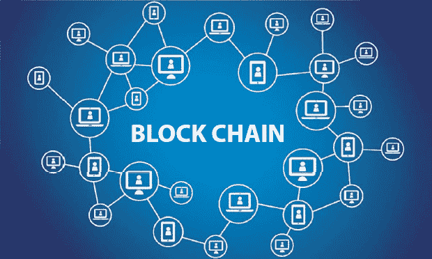
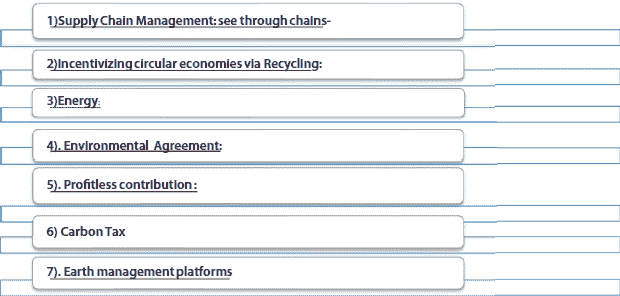
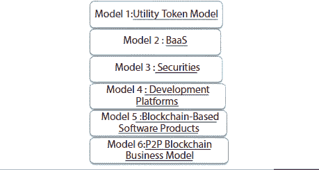
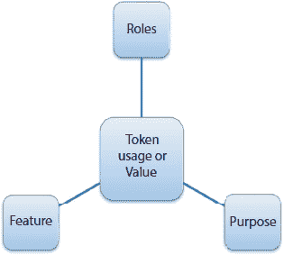
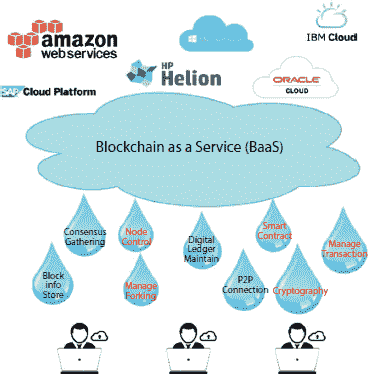
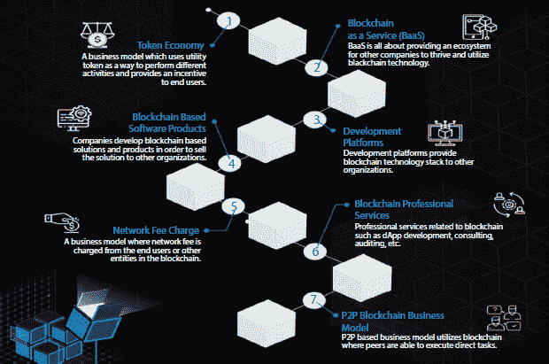
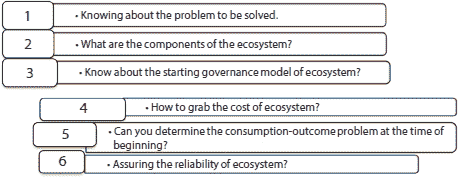

**2**

区块链生态系统的应用范围

**Manisha Suri**

**K.L. Mehta Dayanand College for Women, Faridabad, India**

**摘要**

随着现代技术的升级，不仅在各个领域捕捉和记录了大量数据集，还转向记录的安全性，以防止在存储、运输、处理、更新和访问过程中被篡改。交易可能是资产的转让，自主执行脚本-智能合同的执行，或更新为 anecdote。区块链生态系统的核心暴露和其全面风险隐藏在其生态系统中 - 矿工、开发者、供应商、消费者、股东或利益相关者、参与者的大本营。最近，区块链技术不仅限于加密货币，还运行在金融和企业应用程序上。去中心化、不可篡改和透明度是区块链技术运作的基础。这个生态系统随着公共和私人部门参与者的介入而发展。本章讨论了区块链生态系统在商业中的基础描述，从定义开始，然后区块链作为游戏规则改变者，深入到关于商业生态系统能源生产对地球影响的细节。为了阐明区块链生态系统的组成部分，本章提供了目前在不同领域运营的公司示例。然而，区块链公司（Bloq、Factom、Symbiont、Blockstream、PayStand、tZERO、Skuchain。）可能会在多个领域运作，因为它们不容易适应生态系统的一个领域，而是在能力上发展并在一段时间内跨领域过渡。

**关键词：** 应用-去中心化应用，BCD-区块链开发，BaaS-区块链即服务，KYC—了解你的客户，参与者—用户

**2.1 引言**

区块链是一种数据库，它被共享在一个由计算机组成的网络中，通过允许交易透明来进行。包含信息的记录被添加到数据库中，被捆绑在一起形成所谓的区块。这些区块然后被链接在一起形成一个链——即区块链。当我们谈论区块链生态系统（一组在其环境中相互作用的组织）时，这些是在区块链世界以及包括外的链世界内相互作用的行动者（用户、矿工、开发者和研究人员等）的群体。这些行动者之间的核心交互以交易的形式发生，但这些交易几乎完全限于区块链本身。用通俗语言来理解区块链——目前一些国家已经采用了一种在线投票系统，该系统包括投票注册数据库、电子设备和软件。投票时，首先个人必须注册自己，包括他的身份证号码、姓名、电话号码和个人信息，然后存储在软件中。从网络安全的角度来看，只需攻击选民注册数据库就可以轻易破坏软件。选举过程中的每个部分，无论是硬件还是软件，都面临被黑客攻击的重大风险。当软件系统被操纵时，可能会导致不适当的选举结果。不仅如此，在黑客攻击选民数据库后，他们可以轻易访问他们的社交媒体账户。因此，最后的受害者是普通人。为了解决这个问题，可以使用新技术区块链在投票时提供安全性。凭借其透明度、不可变性和可追溯性特性，这可以在某种确切的程度上实现。它通过使用密码学确保数字数据必须来自可信来源。

区块链一旦录入数据就无法被破坏的属性使其能够存储个人的身份记录，如生物识别、虹膜扫描等，用于验证选民，并以计数格式记录他们的记录。区块链技术就像拥有公钥—对任何人可见，可以帮助每个选民和选举官员在系统中没有故障的情况下计票，从而产生公正的选举结果。基本上，这项新技术已经完全消除了第三方，即电子设备（硬件），因此不会在整个系统中造成干扰。此外，它通过向网络中存在的其他节点提供数据副本来提高整个系统的安全级别。如果黑客尝试修改一个节点的记录，那么它也必须操纵其他节点上的数据，这些节点上存在相同的信息，这是相当复杂的。因此，区块链充当了防止系统遭受网络攻击的盾牌。由于数据已经复制到多个地方，欺诈行为可以最小化。

就像在加密货币中，其生态系统基于区块链，并包括四个部分或要素：使用加密货币接收和发送货币的用户，生产加密货币的加密货币矿工，购买加密货币的投资者，以及编写与这个系统和相关网络相关的程序的开发人员。这个系统的任何一个部分都不能在没有另一个部分的情况下继续工作。

生态系统由在消费者需求的持续过程中协作的实体组成，以提供更大的价值并支持可触及的零售市场。生态系统是由围绕组织、个人和事物构建的，这些组织、个人和事物分享或补充一组兴趣。这个圈子将由利益相关者的思维方式来定义，以及他们是否想要创造效率、策划新市场和改进协作。

合作伙伴和利益相关者定义的生态系统是一个从创建经济广泛且可持续的市场出发，与新兴的客户偏好相一致，并利用开源开发解决复杂问题的范围。这些利益可能包括宽组织内的交流以及跨广泛组织、经济的不同部门和行业之间的交流。如果一个区块链生态系统不仅能与生产者或销售者互联，也能与消费者互联，那么它被认为是发展成熟的。上述的相关性使得能够构建系统，这些系统可以有选择地利用区块链的信任度、透明度和去中心化。区块链生态系统有助于维持环境可持续性，因为它具有验证交易记录透明度的潜力——这些数据需要转让，并且目前拥有数据的人可以通过区块链技术进行验证。这可以通过结论的去中心化和数字化来实现。区块链生态系统还承诺改进现有的治理环境模型，这些模型正在以稳定的速度发展，与模型相关的中介机构通过收取高额的汗水股权来获得利益。此外，区块链是公开的——记录对每个人都是可见的，但没有人有权删除或销毁这些记录。基本上，区块链有三种类型：公共性质的去中心化组织、私有的开放程度限制在特定用户如审计公司、联盟——指的是组织与参与者之间的协议。在自然界中，生态系统倾向于自然产生。为确保生态系统能够实现其目标，它们通常由应用程序的创建、与外部系统的集成以及创建者添加内容来控制。有自我实现的协议，即智能合约，可以自动管理系统，以防万一生态系统成员需要。

## 2.2 区块链作为环境变革的游戏规则改变者

通过采用去中心化、高效的能源和水利系统，区块链技术可以改变现有环境生态系统的现状。数据比如——家庭层面使用多少水、每个区域需要多少能源等。物种从地球上消失似乎成为了一种趋势，因为生物多样性的减少达到了顶峰。随着海洋植物消耗温室气体，海洋正在变得越来越酸。科学家预测，到 2050 年，我们将面临 30-35%的水资源枯竭，因为水资源的需求每年以 1%的速度增加。与此同时，地球大气的循环系统以及气候变化、森林砍伐率也进行了计算，大约有 7.5-8.5 亿吨塑料存在于海水之中，这影响了食物链。

所有这些记录都可以在区块链环境系统中，通过智能传感器的帮助进行维护。如果汇总，无法手动收集的数据包含部分信息，基于此，集中组织的决策者和零售商做出结论。这种不足已通过区块链技术得到改进，通过提供更明智的决策，将集中式转变为分布式。借助区块链生态系统，我们可以轻松追踪和验证可再生能源、P2P 交易，将价值观作为需求方经济平衡的动态加分。这项技术可以作为基础，使人们了解自然灾害——它提前准备了社区以应对即将到来的灾难。通过智能合约，它在自然灾害发生时确保重要信息在大范围用户之间传递。区块链的角色类似于现有生态系统的 wildcard，不会干扰，对于气候变化和其他环境挑战有效，被称为游戏改变者，可以如下所述：

1.  供应链管理：透视链条

    每当顾客购买产品时，都会与 Johnson's、Maggi 或 Lakme 等品牌关联上一个信任因素。消费者迫切想要的信息是，该产品的制造应该是公平的，而这并不容易获得，有时他们很难验证产品是真还是假。产品到达商店之前，必须通过许多中介——生产商、供应商、零售商，在产品中进行重建或重塑，品牌下的化学物质可以添加，基本材料可以更改，或使用低质量成分制作产品的复制品。最后，受苦的是顾客。这时，消费者救星即区块链就出现了。区块链使产品路径的追踪变得可能，从制造开始，直到到达目的地，就像产品的 GPS 路线一样。客户可以得到四个问题的答案：

    1.  a. 产品是在哪里生产的？

    1.  b. 它是如何高效生产的？

    1.  c. 他们是如何处理他们的废物？

    1.  d. 其中有多少偏见？

    区块链有潜力使供应链变得透明，这可以帮助买家购买更加环保的产品。追踪食品的路径似乎也有助于减少碳排放，因为消费者将避免长途旅行。通过将所有利益相关者——投资者、开发者、工人、生产商、供应商、零售商、消费者——连接在一起，使这个平台变得独一无二。区块链技术还确保海鲜必须来自可持续捕鱼的渔民。对于食品追踪，Dapp 开发了 Foodtrax；Provenance 是区块链的一个项目，帮助参与者透视供应链。

1.  通过回收激励循环经济

    各个城市已经尝试开展回收项目，但常常以失败告终，有时甚至无法追踪和比较回收计划的影响。这些再利用项目通过发放代金券的形式奖励提交塑料容器或瓶子的人。借助区块链技术，我们可以轻松追踪实施回收计划的地点。它还有助于增加激励措施，因为参与者每提交一件塑料物品，就会得到加密货币作为回报，这对循环经济来说总体上是好的。区块链记录了已提交的材料的体积，这对评估其价值和利润是有价值的。在未来的几年里，我们将使用塑料货币，塑料银行是一个旨在通过在不同的地点设立收集中心，用塑料材料兑换货币的项目。Dapp Recycle to coin 也使社区能够在塑料瓶的回报中获得代币。

1.  能源

    这是一个全球范围内的普通民众或企业所面临的问题，而不是某些特定人的问题。在自然灾害、贫困或极端气候变化、电力中断的情况下，每个无法获得电力的公民都会遇到非常普遍的问题，这最终导致了停电。区块链环境生态系统为这种情况做好准备，如果它真的发生了的话。为了减少将电力传输到遥远地区的需求，它拥有基于区块链能源系统的 P2P 区块链。这可以帮助电力从最初产生的地区传输到需要的地区。这也支持减少能源储存。一个在区块链上解决这个问题的平台是 Trans active Grid，它是两家区块链公司 ConsenSys 和 LO3 Energy 之间的联合法律协议。如果有人想要获得回报或想要获得利润，区块链环境生态系统提供了一种方法。你只需通过区块链平台投资可再生能源安装，并通过代币寻求如何投资、投资哪里，这可以通过 dapp-EcoChain 完成。对于太阳能--可再生能源，太阳合同是基于 P2P 交易平台的区块链。太阳能币应用程序旨在最大化太阳能安装，是基于电力链的，即区块链平台。

1.  环境协议

    如果我们谈论领导者的承诺，有时会留下不完整，因为我们自己可以判断，或者两家公司之间的协议因未完成分配的任务而取消。但是关于环境协议，这对我们所有人都是显而易见的吗，还是我们只会观察它本身？我们要衡量这些协议的影响，完成了多少--剩下了多少？对于个人来说，不可能做所有这些事情。为了追踪环境条约的真实影响，有一个区块链平台。从长远来看，政府和当局也不感兴趣履行他们的承诺。如果数据被提出，它提出了两个主要问题：一个是欺诈，另一个是塑造。为了解决这个问题，一个集中式系统-区块链通过允许跟踪环境数据和查看所有履行或未履行的承诺的每一个实例，使整个系统变得清晰透明。它不仅做了透明跟踪的工作，而且在报告在哪个地点、多少数量取得了进展。区块链可以减少协会、企业公司和政府在环境相关承诺上发生倒退的可能性。每年大约有 9.8 亿美元用于管理基于全球碳信用计划的区块链系统。

1.  无利贡献

    在印度，如果我们提到南部地区，通常会想到台风或洪水。2007 年，发生了一系列可怕的洪水，被称为南亚洪水，其中 3000 万人受灾，所有公民都聚集起来提供经济援助，他们捐赠了非常巨额的款项。但是你是否曾经想过，我们为慈善事业在线或离线捐赠的金额是否真的落到了正确的接收者手中。许多人捐赠了用于 COVID-19（一种病毒性疾病）的款项——尽管他们已经提供了 IFSC 代码。但留在我们心中的一个问题是，这笔钱是否会真的落到受灾人员手中。如果没有，那么这笔钱会如何使用。从今天的形势来看，腐败已经深入到根部，或者说，如他们所说，到了根部开始渗透的地方。区块链技术确保了这笔用于特定目的的资金将帮助受灾人员或特定项目，而不会流入无意之人的口袋。如果基于区块链平台（加密货币），资金无疑能够准确地定位到正确的受众。一些农村地区仍然缺乏银行基础设施，当自然灾害发生时，去银行或 ATM 取款，区块链技术有潜力直接转账，而无需来自集中式系统或任何中间人的干扰。两家使用加密货币进行慈善事业的组织是 Bit Give 和 Bit Hope。

1.  碳税

    对环境产生不利影响的因素起源于汽车、家用电器等。如今，这些来源还包括那些与奢华生活方式有关的事物，这会直接或间接地影响环境，但我们能确定每个产品对环境产生了多大的影响吗？如果我们知道了碳足迹，这是可以计算的。当计划购买四轮车时，除了经济利益外，你会选择汽油、柴油还是压缩天然气车？显然，会选择碳排放量较少的车型，以防止全球变暖超过其警戒速度。碳税是在提取燃料时施加的税，这是一种间接策略，用于控制燃烧烃类（碳化合物）时产生的温室气体排放。私营部门对碳排放征税的目的是减少环境中二氧化碳的排放，导致森林退化。当这些税款被收缴时，它们应该用于植树造林计划，但由于许多政治因素，筹集的资金被用于其他地方。区块链技术推动了植树造林和森林退化。它直接将资金转移到环境生态系统中，而不是中间商的口袋。在这种情况下，区块链在所有参与者之间保持透明度，以确保通过存储碳获得的资金只应用于森林保护计划。考虑到二氧化碳的影响，制造商和生产商也携手合作，向那些销售低碳足迹产品的公司提供激励措施，消费者也有一点点好处，因为他们正在追随这一趋势。区块链作为游戏改变者，因为它提供了跟踪每种产品碳足迹的功能。然而，一些公司正在生产高碳足迹的产品，因此区块链技术将迫使他们改变供应链，以及让客户购买对环境影响较小的产品。基于区块链的系统确定了每家公司销售产品的碳足迹得分。因此，通过采用区块链技术，将增加透明度并终止对环境有害的做法。这项技术的主要兴趣是为社区和企业构建一个全球碳交易市场。

1.  地球管理平台

    电信公司（如 Voda、Airtel 或 Jio）为了提高客户满意度和收入，必须每天面对新的问题。组织的视角是网络的扩张，这涉及到选择地点，这需要一个地理平台——一个传达关于地点信息的平台。同样，地球的自然系统也需要关注，它们因为星球的边界而受到未知的压力。新的区块链地理空间平台解释地理数据，并帮助理解不仅地球表面，而且在深海中的新模式，即追踪海洋的数据。这个平台在地理空间平台的账本中分析、可视化和管理地球的数据。在数据区块链技术扩展之后，确保全球和环境领域的交易是可验证和值得信赖的。这项技术帮助保护陆地上的生命以及海洋动物的生命，通过改善他们的健康。通过消除偏见并为水资源提供适当的视觉，区块链使渔业权利得到保障，在陆地上，它加强了参与者和所有行动者的产权。地理空间区块链环境生态系统有潜力观察天气条件并监测所需的天气预报性能，这需要物联网的帮助。

    上述提到的变革者提供了用升级技术合作构建可持续未来的能力。区块链环境生态系统应该针对正确的问题，以便赋予社区权力。

## 2.3 区块链在商业生态系统中的应用

到 2025 年，全球在能源市场对区块链技术的投资将达到 347 亿美元。尽管 350 亿美元看起来很高，但它超过了整个能源市场 1.85 万亿美元的净价值。在领域中使用区块链和分布式账本技术的关键参与者包括 Accenture、AWS、Bigchain db、德勤、IBM、Infosys、微软、Nodal block、Oracle、SAP、Enosi 和 Electron。

区块链被用于能源市场的数据管理、财务跟踪和交互。采用的驱动力包括降低运营成本和资本支出。自动化程度的提高将使区块链用于数据安全和完整性。列表首位的是银行和金融应用，而医疗保健业务、监管机构和零售商也在逐步加快进入区块链市场的步伐。对这项技术的兴趣正在迅速增长，这推动了其进入商业生态系统的路径。新的企业家们已经开始在区块链商业生态系统中寻找商业解决方案。

### 2.3.1 商业生态系统

一个商业生态系统由大量的参与者组成，这些参与者可以是商业组织或行动者。他们以这样一种方式相互联系，以至于他们可以相互影响。相互关系使成员之间产生各种互动。互动可以是竞争性的或合作性的。与相互关联一起，他们在组织之间分配了相应的后果。成员相互依赖——一个组织的失败会导致其他公司的失败。

#### 2.3.1.1 什么是商业模式？

一个提供组织如何在各个领域实现最大利润的模型，无论是提供服务、生产产品，还是不通过任何中间环节直接向合适的消费者销售业务。这个模式可以是线上或线下模式。这个模式包括制造商初期所有支出的计划，市场营销，最后到达客户。

#### 2.3.1.2 商业模式——传统模式

在这种类型的模型中，消费者亲自到市场购买商品。这就像从当地商店购买产品一样。这个模型是一个纯粹的集中式模型，由一些监管机构控制。存在不同的业务，由不同的监管机构集中管理，由当局控制和管理，包括：

1.  组织

1.  b. 利益相关者或所有者，

1.  工人，以及

1.  d. 消费者。

传统商业模式分为以下几种类型：

1.  制造商

1.  分销商

1.  客户需求的满足

1.  特许经营。

1.  制造商

    他们是从原材料制作产品的相关人员；他们还可以组装组件来制作产品。常见的例子是计算机和汽车。这种模式可以直接向客户销售产品，即 B2C，或者他们也可以将业务外包给其他公司，即 B2B。例如，染料制造商向零售商销售，然后零售商再将产品卖给客户。

1.  分销商

    拥有分销商模型的组织直接从制造商购买产品，然后供应给批发商，再由批发商供应给零售商或客户。该模型的主要责任是设定价值，以此为公司提供利润。此外，它还制定营销策略，可以增加产品的销售量。总的来说，它的角色是制造商和当地用户之间的中介。

1.  客户需求得到满足

    拥有零售业务模型的公司有从分销商直接向客户销售产品的功能。零售商可以通过线上和线下方式供应产品。在线零售商如在电子商务网站上销售产品的亚马逊、Flipkart、Myntra 和 Shopclues。线下零售商类似于那些实体百货商店、当地商店。

1.  特许经营

    这个模型包括上述提到的其他商业模式。特许经营权的购买者被称为特许经营商，例如必胜客。

    传统的商业模式提供服务或产品，并从中获利。消费者按照推荐的价格购买产品或服务。相应地设定这个价格，并且还包括了在提供商品或服务时产生的收益和其他支出描述。

### 2.3.2 区块链商业模式真的需要吗？

区块链商业模式为集中式平台提供了将业务升级为去中心化的机会。它将个体元素、交易、利润转为个体元素，并确保增长。这项技术有潜力使双方受益——行动者和集中式员工。在转向区块链模型之前，应记住关于它的某些要点：

+   企业家或初创企业或已建立的组织可以在他们的企业中实施区块链。

+   一旦记录存储在区块链上，就很难删除。

+   区块链的主要独特性在于其透明度，这有助于提升供应链的运作。

这项技术的应用可以在第四次工业革命中看到，许多公司已经开发了他们自己的去中心化人工智能模型。

#### 2.3.2.1 区块链商业模式

#### 2.3.2.2 模型 1：实用代币模型

代币可以被看作是在特定生态系统中运行的某种事物的价值、股份或代表。与加密货币不同，它们不依赖于某个平台，而是代币（golem）在生态系统中称为本地代币的特定平台内使用。实用代币向用户提供产品和服务。代币具有促进企业更多功能性的潜力。这些类型的

模型有 Ripple 和 Stellar。实用代币推动网络运行并加快网络活动。一部分实用代币由企业持有，其余的则用于网络的运行。由于实用代币根据供需标准运作，如果产品需求增加，其供应减少，从而导致价格上涨。这样，这个模型为企业提供了利益。它具有如下属性：

1.  角色。

1.  特性。

1.  目的。

加密货币代币的使用和价值。

|  |
| --- |
|     |

1. 权利 | 引导参与——使用产品—投票认证—产品访问

贡献—所有权 |

2. 价值交换 | 经济创造 | 工作奖励——出售某些产品——购买——积极/被动工作

支出-制造产品 |

3. 通行费 | 参与游戏 | 运行智能合约——安全押金

使用费用 |

| 4. 功能 | 丰富用户体验 | 网络接入用户连通性 |

使用激励 |

| 5. 货币 | 无摩擦交易 | 支付单位交易单位 |
| --- | --- | --- |
| 6. 收益 | 分配利润 | 利润分享利益共享 |

为了使工作更有效，令牌可以尽可能多地担任角色。

#### *2.3.2.3 模型 2：BaaS*

这个模型提供了组织公司与区块链平台之间的联系。例如，当一个歌手录制一首歌时，所有后台材料都需要音乐导演考虑，包括麦克风、歌词、录音室和贝斯音量、维护软件记录等，这些都可能是耗时和昂贵的。BaaS 作为类似类型的把手，处理所有后台事情，这样音乐导演就可以只专注于歌曲，而不用关心基础设施、成本和维护。它使客户只关注前端，而不是后台事物。组织之间已经达成协议，其中 BaaS 同意负责所有区块链技术，包括监控系统、管理带宽和保护系统免受黑客攻击。通过与 BaaS 合作伙伴签订合同，初创公司/企业家可以将基础设施和系统性能的负担转移给他们，使他们能够专注于其主要业务和竞争策略。BaaS 通过使用基于云的服务，使客户能够开发自己的区块链应用程序，并确保其运行、托管和使用，这与网络托管提供商类似。

除此之外，如果企业家设法使区块链上线，那么他/她必须处理所有维护工作。这可以通过与区块链技术平台上的组织签订智能合同来克服。

市场上一些著名的现有 BaaS 提供商包括：Oracle、IBM-blue mix、Google Firebase、Microsoft-Azure 模块和 Amazon-AWS。它包括为商业提供一个生态系统，帮助管理他们的区块链系统。使用 BaaS 服务的成本各不相同。这取决于多个因素，如完成了多少交易，同时进行了多少次交易以及以什么速率进行。这意味着根据使用的服务单位进行支付。

#### *2.3.2.4 模型 3：证券*

区块链上提供的这种安全称为证券。许多便利的商业已经向新技术靠拢，包括金融和股票市场。安全令牌的另一个名称是股权令牌，与实用性令牌相比，它们受到政府的监管。它们通过确保对抗任何漏洞或欺诈活动，为传统商业提供更多速度和平滑的区块链。

安全令牌等同于投资合同

资产如四轮车、房地产或组织的股票——其中包含一些价值。对于这些资产，安全代币是包含部分金额的债券（智能合约）。这种代币确保了存储在任何强大诉讼中的不动产，并在新技术平台上得到保护。在验证所有权后，持有安全代币的人可以：

+   有利于其他投资。

+   用作发放贷款的担保。

+   可以放入不同的钱包。

#### *2.3.2.5 模型 4：开发平台*

区块链是一个许多企业家和初创公司正在涌入的空间，他们带着用不同方式解决他们问题的议程。他们中的大多数人正在开发去中心化应用程序。

如 Metcalfe 定律所述，使用中的网络越多，它的价值就越大。就像两部电话，你只能建立一个连接，如果只有一部电话，它就毫无用处，使用公式

n(n − 1) / 2

2 ∗ 1 / 2 = 1。

However, when there are 5 phones, you can make 10 connections. Involvement of enormous people makes the network more in use. That’s why most fortunate networks can enjoy severe aggressive hike.

有三个具体的模型：

+   收取网络使用费。

+   招募审计师。

+   其他服务。

1.  a. 收取网络使用费

    Ethereum 需要燃料来产生帮助运行区块链 24 天和 7 夜的汽油。在这个平台上开发 dapps 的任何人都要支付类似于过路费的汽油费。费用取决于交易的完成情况，交易的复杂程度如何变化。在 NEO 中，用于创建 dapps 的汽油币。可以购买和出售的代币是 Golem 网络代币。GNT 是资源提供者计算费用的支付方式。支付服务的费用由 GNT 衡量。

1.  b. 招募审计师

    如果发现区块链上的交易记录是非法的或未授权的，或者分类不正确，这将导致需要审计师根据管理层的估计进行其程序。即使我们说区块链不需要第三方，但当涉及到检查产品是否完全交付，不需要审计师查看交易过程时，当组织与其他方进行业务往来时，他们更喜欢审计师验证智能合约，因为这些合约是为了自动化业务流程。去中心化应用程序在适当运行代码方面消耗了大量的资金。如果有一个小错误，整个系统都会倾向于失败。一个最近的例子是 DAO 智能合约，它导致了以太坊社区分裂成以太坊和以太坊经典。

    这个模型可以以两种方式工作：

    +   需要对智能合约进行审核——开发者需要雇佣审计公司。

    +   独立审计员和开发者会检查代码并寻找其中的缺陷，如果他们在代码中发现了任何问题，也会对其进行修复。此外，开发者在其合同中附加了优先权。

1.  丙. 其他服务

    区块链初创公司需要做很多工作。首先，初创公司需要一个内容丰富、框架良好的网站。这些初创公司要么招聘自由职业者，要么招聘机构，以节省时间和金钱，包括为他们提供这些服务。

#### ②.③.②.⑥模型 5：基于区块链的软件产品

这包括那些向较大规模企业销售的小型企业，它们为基于该技术的应用程序获得合理报酬。除了获得预先的合理报酬外，组织了解区块链技术也是有益的。他们还需要在实施后提供支持。媒体链区块链已经被 Spotify 购买，用于解决音乐行业中存在的版税问题。公司不愿意承担繁琐的程序负担——招聘人才是收购这种商业模式的另一个原因。

#### ②.③.②.⑥模型 6：区块链专业服务

这个模型向企业家、企业或初创企业提供服务，让他们实际操作这项新技术。一些像德勤和 IBM 这样的公司已经在区块链技术上进行项目开发，其他企业可以通过这些公司完成项目。无需在硬件或软件上投入资金—直接连接这些公司提供的服务。

#### ②.③.②.⑧模型 7：商业模式—P2P

P2P 模型确保了终端用户之间的直接互动。它允许终端用户使用区块链技术构建软件，将整个互联网变为非授权状态。这种转变可以通过 BaaS、代币和网络收费来实现。基于此模型的工具有 File Coin、Sia、Etheria 和 IPFS。就像维基百科一样，对所有人开放—任何人都可以修改内容或修订内容。它作为真正的 P2P 交换的媒介。

1.  IPFS

    该系统作为 http 的替代品—它是如此设计，以至于它可以在外层空间持有交易，即解决了 http 的悬而未决问题。

1.  File Coin

    这是一个以货币为基础的系统，用于存储信息，并拥有自己的加密货币。用户未使用的存储空间换取一些价值。

1.  Sia

    这个工具使用新技术进行交易，旨在取代 Dropbox、Google Drive。

1.  Etheria

    该协议通过在升级生态系统中构建模块，专注于区块链游戏属性。一些游戏，如《超越虚空》和《创世纪魔法》，是基于区块链游戏平台构建的。

使区块链商业模型与传统模型不同的，是它保证了点对点（P2P）的互动，去除了所有中间商。通过创建一个无需信任的系统，消除了记录验证的中介，并加快了信仰的速度。在私人有限公司中，在这个平台上，董事会和所有者缺席。然而，在区块链模型中，他们理论上存在，并且他们的互动方式发生了巨大的变化。

## 2.4 区块链商业生态系统有利可图吗？

对于区块链企业家和开发者来说，盈利是一条直线——希望他们的项目能够成功，他们资产的价值将随着保留部分代币作为股权份额以及他们代币的流动性作为回报而增加。尽管如此，他们如何覆盖成本并不简单。在初始阶段，投资者以低价获得加密资产。许多加密资产的开发商和企业家举行首次代币发行（ICO），以众筹他们的项目。通过这种方式，开发商获得了足够的资金来覆盖成本。

可以通过以下任何一种方式赚取收入：

1.  通过收取网络使用费或燃气费。

1.  随着用户数量的增加，dapp 的价值也在增加，这意味着代币的价格可能会上涨。代币可以在网络内进行交易。例如，在视频游戏中，帮助进入游戏的数字货币被视为一种实用代币，它可以帮助购买游戏材料，并且可以进行交易。

1.  通过向较高层次的企业销售技术，例如之前提到的媒体链区块链被 Spotify 收购。

2.5 如何设计一个商业生态系统？

传统商业模式类似于规划和种植一朵花，而设计一个生态系统则更像是在种植一片森林：更加复杂，有额外的参与者需要互动和意想不到的结果。也存在类似于消费-结果问题或鸡-蛋问题的挑战。

然而，商业生态系统，类似于森林的建设，不能完全规划和设计——它们也会自然出现。对于生态系统设计，应该牢记以下步骤，这些步骤是相互关联的：

1.  了解要解决的问题。

1.  生态系统由哪些组成部分构成？

1.  了解生态系统的起始治理模型吗？

1.  如何抓住生态系统的成本？

1.  你能在开始时确定消费-结果问题吗？

1.  确保生态系统的可靠性吗？

步骤 1：了解要解决的问题？

首先，应该明确定义生态系统将要解决的问题，以便它可以说服高风险的商业投资者和正确的参与者参与。如果有人曾经想过 20 年前，像 YouTube 和 Instagram 这样的业务可以通过自拍、发布餐食照片和动物视频来建立。

+   生态系统是最佳选择吗？

    生态系统-区块链业务包含了一个物理生态系统（服务器、客户端、硬件、软件）所包含的一切。在以下情况下，生态系统可能更受欢迎的关键点是：

    +   ➢ 对去中心化、记录的透明性和不可变性的需求。

    +   当网关如 Expedia 或 Airbnb 更加昂贵且耗时。

    +   ➢ 用户和开发者之间需要更多的安全性。

    +   ➢ 当新数据的传输速度不断增加，同时也要存储以前的记录。

您需要哪种类型的生态系统？

由于所有商业生态系统的功能都不相同，一些商业生态系统以项目完成为基础，作为市场上的小玩家，然后将项目交给高级玩家。一些通过链接供应商和需求者的工作在交易生态系统中。一些在解决方案生态系统中工作，结合了问题的所有解决方案元素。作为一家科技初创公司，您需要了解生态系统的类型，因为它们在结构、目的、货币机制上都有所不同，最重要的是成功因素。

步骤 2：生态系统的组成部分是什么？

根据价值原型，不同的参与者获得不同的角色。一个解决方案生态系统可以通过许多导师、供应商和中间商的合唱团例子来理解。

在交易生态系统中，合唱团指挥（教授合唱团）的角色由商业生态系统的所有者扮演，其作用是建立制造商、供应商和客户之间的联系。导演指导构建生态系统，鼓励加入系统，介绍规章制度、标准和规则。生态系统的成功取决于完成分配角色的责任。还需要平衡生态系统的长寿所需的投入。生态系统失败或我们可以说系统解散是因为指挥指导不能履行分配给他的职责。

步骤 3：了解生态系统的开始治理/权威模型？确定开放程度。

企业生态系统成功需要平衡两个要求：创造和分享的数量。

对于正在兴起的企业生态系统，其主要治理问题是什么？它的开放程度如何。在三个领域的解决方案中提出问题：

+   准入：在即将成为合作伙伴的商业生态系统中，为了获得生态系统及其资源的使用权，他们必须满足什么条件？

+   合作伙伴：为了构建商业生态系统，参与者的邀请程度是多少？允许这一点的规则有哪些容量、细微之处和严重性？谁将决定在各种参与者之间分配价值？

+   保证：参与者被允许选择多模式与其他企业竞争吗？在某些行业，他们为自身的开放程度而战。如果我们看看 Android 通过提供开放性连接打破了苹果 iOS 的优越性，Facebook 通过提供接受请求或删除的图标，即在朋友功能中提供属性，克服了 MySpace 开放模型的脆弱性。从经济角度来看，在执行时开放的生态系统增长速度比其他系统快。它还鼓励去中心化，并允许各种开发者和合作伙伴。

然而，授权开放的生态系统并不容易，因此它非常适合具有有限缺点和较低恶化成本的商品和服务。增长与质量、去中心化与互联性、速度与灵活性等因素将决定商业生态系统的开放程度。

步骤 4：如何抓住生态系统的成本？

哪些费用是适用的？

生态系统“合唱团”的主要问题是价值，即金钱应平均分配给所有参与者，并保留自己的利润份额。同样，分配给参与者的金额应该足够。苹果从其应用商店销售的 app 中收取 30%。同样，企业创建的生态系统可以作为服务出售给更高的企业，以捕捉价值。

步骤 5：你能在开始时确定消费-成果问题吗？

什么条件导致了它的失败？

执行时生态系统的失败是因为当局无法计算参与者的规模——会有多少买家？会有多少卖家？由于这一点，他们无法保护网络，导致生态系统的崩溃。有时他们高估了利润，对网络效应的重要性持忽视态度。这场比赛不是冲在第一的位置，而是冲在第一个位置并有完整的解决方案。例如，苹果的 iPod 在数字市场上不是第一个，但它却是第一个将软件 iTunes 与硬件结合在一起的。另一个非常重要的因素是了解参与者的交易数量。了解网络密度是演员金额的重要驱动力。

最后，选择参与者很重要。参与者的数量无关紧要，重要的是他们的质量。例如，在 Uber 上，骑手和司机的数量相等，所以它是平衡的。

步骤 6：你如何确保生态系统的可靠性？

扩展是否可行？

Yahoo 搜索引擎最初是由员工编辑的层次数据库，并根据树结构对 Web 页面进行分类。Yahoo 在互联网增长的一小段时间内获得了流行，当时它不可扩展，最终被 Google 的页面排名算法超越。所以，如果你渴望拥有生态系统的长期可行性，了解可扩展性的位置、设计和策略对于发展中的商业生态系统至关重要。在三者中，可扩展性是可用性的主要步骤。

生态系统扩展是如何进行的？

扩展。让我们来看一些例子——技术和客户偏好的即时变化。微软在三十年内仍然设法捍卫 Windows 作为操作系统。Uber 最初开始提供打车服务，但后来扩展到了食品配送和自行车骑手服务。当 LinkedIn 开始时，它的目标是与专业人士建立联系，但现在它作为一个在线招聘和发布内容的平台。因此，为了生态系统的扩展，它应该具有两个特征：稳定性和灵活性，以便相应地向系统中添加新功能。参照这一点，我们可以说明生态系统扩展是通过：

1.  可以在现有系统中添加新产品。

1.  在同一市场扩展服务（Uber）。

1.  在一个生态系统成功后创造优势（苹果 iPods）。

您如何防范不良反应？

大型商业生态系统经历了来自客户和管理人员的反对。列表顶部是亚马逊，它最近因不征收销售税以在竞争中排名第一而受到批评，同样还有 eBay。此外，Uber 因安全问题、违反交通规则、司机和工人的权利以及适用于出租车的权利而受到指责。列表最后是 Facebook，它因未保护用户数据而受到批评。因此，生态系统应该设计成不仅合法验证，而且在社会上也要验证，以保证其长期存在。商业生态系统只有在努力坚持为消费者提供确切的价值并将其同等价值传播给所有贡献者的未来才能繁荣。

设计一个生态系统是一次主要尝试，所以上面提到的六个相互关联的步骤有助于设计商业生态系统。任何企业家或初创企业如果明智地遵循设计，都可以进行结构化，或者可以在现有组织中带来转变。理解任何商业生态系统都不能完全设计好或计划好，就像森林一样，它们也会出现。

那些希望在未来获得利润的生态系统必须具有灵活性，准备好升级技术——硬件/软件，不希望发生的事情，并根据客户偏好进行工作。

## 2.6 用区块链重新设计未来

总结来说，对于区块链业务生态系统而言，单在新技术方面出色是不够的，更需要重新考虑市场角色、现有产业生态系统及其金融价值。在这个复合系统中，有许多元素必须进行（重新）设计。

### 2.6.1 地球准备好迎接区块链了吗？

无论是在环境生态系统还是在商业生态系统中，区块链技术的适应都是一系列优势的集合，但随着新技术的采用，未来几年也会有许多意想不到的结果——区块链真的可能成为地球必须承受的负担。这项技术需要能量来维持其长期存在，所以在区块链技术中，使用加密货币释放的能量是非常高的。加密货币包括比特币、莱特币、狗狗币、BAT、以太坊、NEO、RippleXRP、卡尔达诺等等。每次使用时，它都需要大量的能量，尽管并非全部如此。有些运作在较少的能量上。加密货币的交易——以太坊、NEO 和卡尔达诺——所需的能量比比特币交易所需的能量少 13 倍。这是区块链解决方案向下一代计算机添加的额外特性，使其在提高功率和计算速度的同时保持低能耗。许多组织正在构建能源匮乏的区块链框架，这些框架将运行在 PoA 上。为了使地球成为一个更好的星球，建立区块链，使区块链的能耗得以用在恰当的方向上，即采用可再生能源和去碳化所带来的激励必须用于重新植树。如果一个比特币的交易几乎消耗了一个国家五分之一的家庭一天的电力，那么可以预测出对区块链解决方案作为节能器的多少需求。此外，每 11 分钟就有一个新的比特币交易发生。这是区块链技术在初期阶段所迫切需要的，如果适当地用于技术协议和其应用部分，将对许多部门有益。

要开发有效的区块链解决方案：

1.  利用区块链解决环境价值问题

    两国共享的国际银行建设和多机构区块链倡议带来了许多好处，这些好处体现在不同领域，如海洋健康、塑料制品、电子产品和自然资源管理。如果参与者希望区块链能满足全球环境的期望，那么国际组织之间的互联互通是必要的，以便从这项技术中获益。

1.  将区块链与人工智能和物联网结合

    我们过去用于分享隐私未确认信息的传统方法已经演变成新的区块链技术，它在发送或接收数据方面引入了透明度因素。结合物联网，这项技术完全将集中监管转变为去中心化的，这是由于第三颗星球的自然系统环境问题可以监控、深入分析，此外气候变化可以得到很好的观察，以及每种加密货币的能源使用对环境造成了什么样的负面影响。到目前为止，云计算和大数据已经通过物联网获得利润，现在轮到区块链了。

1.  为跨学科解决方案而合作

    现在很清楚，区块链构建了一个透明度极高的系统，如同水晶一样清晰，但这项技术只有在全球所有参与者之间存在合作的情况下，才能满足地球的期望。不同行业可以协同合作，互联互通，以便使区块链的应用得以顺畅运行。股东、矿工、领域专家和参与者需要相互交流，以优化这项新区块链技术所提供的服务。

    要使地球成为一个更好的星球，非政府组织、非盈利部门、私人和公共部门之间的互联是必要的。能源公司和金融机构通过各种努力成功开发了一个成功的数字基础设施，它公开有助于去中心化和去碳化能源系统。在研究机构共同工作，可以实施跨学科方法——将数据科学家与环境和行业实践者结合起来——这是可能的。因此，区块链技术能有什么用？如果过度使用，它的影响是什么？环境必须面临的风险是什么？

    如果所有经验丰富的技术科学家一起研究，以确保区块链技术的可持续性，上述三个问题的答案是有可能的。

1.  预测挑战和意外后果-政治经济学

    新技术有力量改变现有的系统-工业，使其成为权威的一个。监管机构必须关注，如果这些变化发生，它将如何影响经济率和现有系统的参与者。利益相关者更担心的是如何处理数据隐私和安全的信任因素。

1.  提供“负责任的区块链”

    在关注降低能源消耗和增加开发者和参与者收入的同时，如果策略脱离计划，那么区块链技术将关注隐私权和责任的澄清。GDF 组织与其他公司合作进行治理，以便利益相关者以系统的方式直接参与区块链生态系统。

    做出治理所需的重要安排。

1.  在当前情景下，我们拥有集中式系统——在技术出现任何损害时，管理者控制系统，监管者在监测发展并采取行动，如果他们发现技术有任何故障。如果当局之间的差异达到最高级别，那么在分布式系统中将成为一个主要的挑战。

1.  制定更全球协调的解决方案

    区块链技术已经在其各个领域扎根，因此可以构建全球互联的架构。以下是如何治理区块链生态系统的要点：

    1.  a. 使组织自我监管

        不必担心正式的法规程序——区块链为这个系统提供了新的选择；金融自由和自我主权是自我监管的基础。全球良好实践可以识别补充法规的全球代码。一些已经在少数国家运行的自我监管过程——美国（EQWITY）、日本（Last Roots）、菲律宾（初创企业）和新加坡（TBD）。为了与环境建立关系，自我监管者可以妥协，而中央监管可以发展出一套要求。

    1.  b. 使国家受监管的政府政策

        最近，这是指挥区块链并让地方经理负责维护辖区内的权威以应对任何公认的故障的最好方法。

        区块链社区可以采用更环保的协议。政府收到的资金可以用于寻找扩大公私项目规模的研究。

    1.  c. 法规在全球范围内易于理解

        在国际层面上运行区块链技术——国际当局和全球管理者面临着理解全球法规的挑战。如果小公司对区块链有困难，全球组织将关注此事，将与环境和谐地跨司法管辖区建立关系。

## 2.7 挑战与机遇

在这一章节，我们讨论区块链作为游戏改变者，在环境和企业生态系统中的技术。毫无疑问，这项技术在每一个领域都提供了透明度、节省能源使用，并且与传统模型相比有显著优势。但每当市场上出现一些技术时，它总会带来一些挑战。区块链技术所解决的 technical issue 限于可扩展性，因为区块的大小和加密货币所使用的能源是预先设定的。尽管区块链技术是去中心化、分布式，并基于加密技术，但它并未完全免受安全问题的影响，因为随着云计算和量子计算的兴起，结合物理、数字和生物领域，随着速度和智能的提高，可能会对区块链生态系统构成威胁。

挑战无法避免——它们也与第四次工业革命相伴随，即人工智能、物联网，其中自动驾驶车辆能够为全球发展创造机会和价值。这些技术也具有加速环境恶化的潜力。

毫无疑问，这些挑战需要关注，因为技术正在不断升级。很快就会有 6G 技术，尽管中国已经推出了 6G 手机，日本宣布启动 7G 技术。随着革命的先进，区块链开发者必须与这些技术相适应。然而，机会窗口不会永远开放。

负责任的区块链生态系统所提供的机遇需要真诚地获得授权，监管机构应准备好应对未预料到的结果和失败。以防万一事情出错，需要各种规则保证与隐私权达成一致以改进安全问题。股东们愿意分享所有这些职责。当前的需求迫使所有的参与者，矿工、开发者、生产商、供应商和零售商都使用区块链技术来解决问题。对于这种需求，一个结构化的方法可以帮助从业者了解如何使用这项技术。

最后，区块链的未来目前准备好了，意识到了承诺，并正在经历事实和数据。有大量的公司和人对区块链的立即和未来有自己的数据和观点。不可能涵盖一切，因此需要关注实际——现实而非承诺，应用和行业。

## 参考文献

1. Schlapkohl, K., *区块链脉搏：IBM 博客*, 美国 IBM 公司，2019 年 1 月 3 日，摘自：[`www.ibm.com/blogs/blockchain/2019/01/whats-the-difference-between-a-blockchain-and-a-database/#:~:text=-Blockchains%20versus%20traditional%20databases,the%20provenance%20of%20the%20data`](https://www.ibm.com/blogs/blockchain/2019/01/whats-the-difference-between-a-blockchain-and-a-database/#:~:text=-Blockchains%20versus%20traditional%20databases,the%20provenance%20of%20the%20data)

2. AlMuhairi, O., Mariam, 2020 年 5 月 8 日，摘自：[`www.weforum.org/agenda/2020/05/why-covid-19-makes-a-compelling-case-for-wider-integration-of-blockchain/`](https://www.weforum.org/agenda/2020/05/why-covid-19-makes-a-compelling-case-for-wider-integration-of-blockchain/)

3. Meunier, S., *何时需要区块链？决策模型*, 加利福尼亚州旧金山，2019 年 8 月，摘自 Medium 区块链：[`medium.com/@sbmeunier/when-do-you-need-blockchain-decision-models-a5c40e7c9ba1`](https://medium.com/@sbmeunier/when-do-you-need-blockchain-decision-models-a5c40e7c9ba1)

1.  *电子邮件*：manishasuri81@gmail.com
