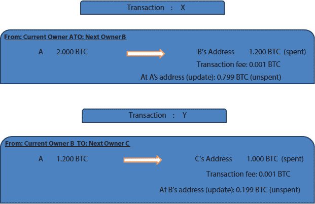
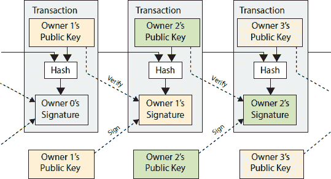
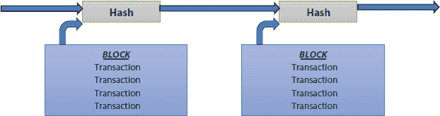
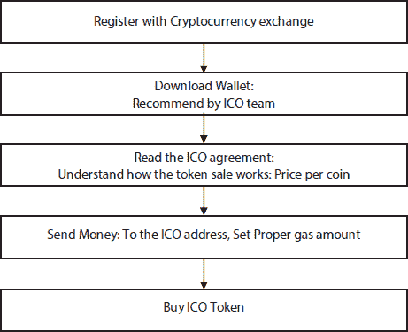

# 3

区块链技术的商业用例

**Vasudha Arora¹*, Shweta Mongia², Sugandha Sharma² and Shaveta Malik³**

*¹GD Goenka University, Gurugram, India*

*²UPES, Dehradun, India*

*³Terna Engineering College, Navi Mumbai, India*

***摘要***

使用比特币等数字货币进行加密货币交换改变了交易模式，并引导我们进入一个全新的商业世界。比特币可以被看作是通过数字钱包的数字货币，它不需要像银行或其他集中机构这样的可信赖的第三方来进行交易。实际上，这种数字货币交易模式使用的是区块链技术，基于“工作量证明”的概念，用户通过使用数字签名来签署交易。由于没有可信赖的第三方的概念，因此实现方案也提供了解决双重支付问题的方案。本章将详细讨论使用区块链作为交易媒介的比特币作为加密货币。在进入区块链之前，比特币交易必须由矿工通过区块链挖矿进行验证。为了验证交易，矿工获得奖励，这使得基于区块链的比特币业务保持活力。比特币首次币发行（ICO）可以广泛地解释为一种机制，即为创业公司筹集资金，以支持他们创新且有前景的想法，他们能够将代币出售给投资者，以资金交换资本，就像首次公开募股（IPO）中的股票一样。研究表明，比特币已经被商家广泛接受，用于他们的业务。

***关键词：*** 比特币，加密货币，比特币交易，比特币挖矿，ICO

## 3.1 加密货币简介

加密货币可以定义为一种现代的数字货币或基于互联网的货币，通过加密函数能够在不涉及银行或其他金融机构等可信赖的第三方的情况下执行金融交易。它不是创建一个基于信任的模型，而是使用对等网络术语创建一个区块链。这种金融交易方式是一种透明的、去中心化的方法，消除了任何监管机构或可信赖的第三方的控制。

一旦交易被执行并记录在区块链上，这些交易就成为公开账本的一部分，由网络中的每个对等节点共享。交易可以在同一网络上的任何两个方之间进行，使用加密密钥。由于没有第三方参与其中，因此交易速度非常快，各方无需为交易支付任何费用。

加密货币的概念诞生于 2009 年，当时在实施由中本聪提出的比特币概念。在此概念之前，已经有很多尝试来创造成功的数字货币流动，但不幸的是所有的尝试都失败了。加密货币成功的最重要原因之一是其处理双重支付问题的能力。

自其诞生以来，比特币作为一种加密货币在数字世界中越来越受欢迎，用于进行在线交易。比特币只不过是一系列经过加密的位序列，具有一定的货币价值。使用散列函数的数字签名用于验证点对点网络地址。因此，比特币也可以被看作是执行两个实体之间交易所需的数字签名链。

尽管加密货币因其交易的透明性以及其抵抗通货膨胀的特性而受到广泛关注，但有时，它们也因在其基础设施中存在的漏洞而受到批评。

本章详细介绍了比特币的概念、双重支付问题、数字签名、比特币的工作原理、ICO 以及商家对比特币的接受情况。

## 3.2 什么是比特币？

谢弗等人 2013 年定义了一种数字货币：

“在某些环境中作为货币使用，但不一定具有真正货币的所有属性。”

世界上首次实现的加密货币是比特币。它是一种使用密码学概念的数字货币，促成了新的支付系统。资金通过去中心化的点对点网络流动，其中没有中央权威机构进行监控。完全由用户驱动。密码学被用来控制货币的创造和交易，这就是现金如何在互联网上流动的方式。

中本聪在 2009 年发表了第一篇文章，作为比特币的概念证明和规格说明。比特币由开源社区推动，并通过开发者以指数级增长。其代码、技术要求在互联网上免费提供，因此任何开发者都可以贡献并开发其修改版本。

比特币不由任何可信的第三方控制，如金融机构。它属于用户，并由用户通过同一对等网络连接驱动。即使是开发者也无法控制比特币，并强制在协议中实施特定更改，原因如下：首先，如果开发者完全控制交易如何执行，那么不依赖信任模型的目标将被击败；其次，需要所有软件版本之间的兼容性，否则不同的用户可能会选择不同的版本，交易可能会因兼容性问题而失败。

可以从两个不同的角度看待比特币。首先，从用户的角度来看，它不过是使用户能够通过网络发送和接收数字货币的应用软件程序，并维护一个数字钱包。它允许其用户在卖家和相应的买家之间进行在线支付。另一方面，与今天我们使用的货币不同，比特币是通过一个地址创建的。它通过维护一个分布式和去中心化的开放账本的技术进行交易，为所有用户记录所有金融交易。这些交易通过加密方式进行加密和数字签名，在交易完成前由多个不同的用户进行验证。

中本聪在 2009 年的白皮书中将比特币定义为数字签名的链或序列。无论何时发起交易，比特币的所有者都会创建一个数字签名，该签名使用他的先前交易的哈希与交易中另一个参与者的公钥（下一个所有者）相结合。这个哈希值附加在比特币交易的末尾。这个完整的值，即比特币地址和附加的哈希，通过用户私钥进行加密，作为当前所有者的数字签名。

### 3.2.1 比特币交易及其处理

交易是两个或更多方或所有者之间的购买和销售实例。像比特币这样的数字货币允许买家和卖家通过拥有比特币数字钱包进行在线交易。为了跟踪交易和账户余额，会为这类交易维护一个数字账本。

比特币的交换是通过使用加密辅助的加密货币协议来完成的，这些协议定义了从比特币的创建到它们的验证，再到最终确认的整个过程。为了理解交易所的整个过程，让我们首先了解交易实际上是什么以及信息是如何通过这些交易进行处理的？

1.  a. 比特币交易

    使用比特币的交易可以如下所示进行可视化：

    涉及比特币的交易必须包含：

+   一个唯一的交易标识符，这是一个使用 SHA256 哈希算法生成的哈希值（在这里图 3.1 中，我们把这个哈希值表示为 x 和 y。通常它的形式如 e.g. 8907a34ef56b70d43789fe9876af54d3f670f8a999f6f18）。

    **图 3.1** 比特币交易链。

+   当前拥有者的比特币地址，用于识别当前交易中需要转让的比特币。这些通常是先前交易的输出，可用于识别比特币的当前所有者并能够检查他的可用余额。

+   交易必须包含金额细节，即要转移的比特币数量。

+   交易必须包含接收者的比特币地址，即下一个所有者。如果发送者有未花费的比特币，交易的输出还应包括当前所有者地址的条目以将其退回，以及“交易费”和如有必要发送给另一个接收者的比特币条目。

    一个交易的输出用作下一个交易的输入，以在比特币从一个地址转移到另一个地址时创建所有权链。

1.  b. 验证比特币交易

    由于在整个交易过程中没有中央权威机构，因此点对点网络中的每个用户节点都有权验证和确认网络中的每一个交易的真实性、重复性和比特币的可用性。

    比特币地址用于标识发起交易的比特币钱包账户。每个地址都有其公钥和私钥对。使用 SHA256 算法计算发送者的上一个交易和公钥的哈希值。计算出的哈希值附加到比特币地址上，然后由所有者的私钥数字签名。

    为了验证发送者的身份，交易是通过他的私钥签名的。如图 3.2 所示，发送者的数字签名可以通过使用他的相应公钥来验证，该公钥可以公开提供给网络中的所有节点。

    一旦交易被发起，比特币系统就会将这些交易组织成所谓的*区块*列表。这些不同的区块随后被链接在一起，形成一个分布式开放账本，包含所有已确认的交易。尚未包含在区块链账本中的交易被视为未确认的交易，且可被撤销。

    

    **图 3.2** 验证交易[1]。

1.  c. 比特币交易的最终确认

    验证交易并最终确认的过程被称为挖矿。在同一网络中的一群人，即矿工，确认交易并将它们添加到区块链开放账本中。这种交易的主要问题是，下一个所有者，即收款人，无法确定付款人在交易过程中是否双重花费了比特币。为了处理双重花费问题，只有当交易获得一定数量的确认时，它才被认为是确认的。

    只有在获得至少 6 个确认的情况下，比特币交易才被认为是确认的。在这里，确认意味着将包括考虑中的交易在内的区块添加到账本池中。因此，这意味着所有者必须等待至少 6 个区块。作为一个协议，区块链中的一个区块在每 10 分钟添加一次。

    区块链的分布式副本发送到网络中的每个节点，并在经过矿工最终确认后，新的确认交易进入区块链时进行更新。

因此，比特币交易过程从创建交易到验证过程可以总结如下：

+   当两方，即买家和卖家同意交换比特币时，创建了一笔交易。

+   然后，交易被广播到参与点对点网络的所有节点。

+   每笔新交易都列在一个区块内。

+   这些新的以及之前的交易都由网络中充当矿工的不同节点进行验证。

+   能够验证交易的矿工节点将确认广播传播到整个网络。

+   在特定数量的确认之后，区块被验证并接受进入区块链。

### 3.2.2 双重支付问题

通常，双重支付问题可以被定义为任何数字货币或加密货币流程中的一个潜在缺陷，其中所有者有可能多次花费同一份数字货币，即支付方，在交易过程中，收款方无法识别付款方是否重复花费了比特币。作为一种解决方案，可以有一个中心节点来检查每笔交易是否存在双重支付。但这个解决方案将改变整个比特币钱包的概念，因为不可能有中央权威机构。

因此，唯一一个证明其概念的双重支付问题的解决方案可能是，网络中的每个参与节点都必须了解每笔交易。在一个基于集中式权威模型的系统中，集中式权威了解所有交易，并由该权威决定哪笔交易先到达。只有那笔交易被认为是有效的，其他的则不被视为有效交易。

因此，为了在没有可信赖的中央权威的情况下验证两个考虑中的交易之一，每个交易必须广播到网络中的所有节点。[3] 必须实现一个系统，以维护接收到的交易的顺序。该系统必须能够提供特定交易接收时间的证明，以便大多数节点可以同意哪笔交易先到达。

为了解决这个问题所需的证明，中本聪（Satoshi Nakamoto）[1] 提出了一个时间戳服务器的要求。时间戳本质上是一种可以证明数字文档在特定时间存在的媒介。在 Ref. [5] 中，Massias 等人将数字时间戳定义如下：

*“一种旨在证明通用文档在特定时间存在的数字证书。”*

为了维护交易的隐私性和进行身份验证，不是对交易区块进行时间戳标记，而是给区块的散列值一个时间戳。对区块进行时间戳标记的目的是证明在那时存在数据。计算 previous timestamp 和区块的散列值，这个散列值由网络中的参与者进行时间戳标记。之前的 时间戳 随着每个额外的时间戳而得到加强。

时间戳

在集中式系统中拥有时间戳服务器，要求客户端在需要对数字文档进行时间戳标记时，将文档发送到时间戳服务器，在那里进行时间戳标记，并在服务器上保留带有时间戳的文档副本。但在点对点网络中，没有集中式权威，为了实现时间戳服务器，使用工作量证明[1]系统公开发布带有时间戳的散列值。这个系统类似于由亚当·巴克（Adam Back）提出的 Hash cash[6]。

工作量证明（Proof-of-work，PoW）可以被看作是大小较小的数据，例如散列代码，计算起来非常困难，但其他人验证起来却非常容易。使用随机尝试方法生成有效 PoW 需要付出很多努力。如 图 3.3 所示的 Hash cash PoW 系统被比特币交易协议所使用。

**图 3.3** 使用散列时间戳交易区块。

散列（Hash）可以被看作是用于实现工作量证明（Proof-of-Work，PoW）的大字符串。当一个散列函数应用于给定的一组数据时，它总会生成相同的散列值。但是，即使对数据中的单个比特进行微小的更改，也会由于雪崩效应而产生一个完全不同的散列代码。散列算法还表现出一个特性，无论考虑的数据集有多大，由给定算法生成的散列值总是具有相同的长度。通常，单向散列函数用于计算散列值，即，散列函数不能用于从生成的散列值中恢复原始数据，而只能用来验证生成的散列值是否与原始数据的散列值相匹配。

比特币交易的**工作量证明（PoW）**基于找到一个值，当对这个值进行哈希运算时，会产生一个符合特定条件的值。为了生成一个包含特定结果的哈希值，平均来说需要指数级的工作量，但这个结果是容易验证的。这可以通过在待验证的交易区块中使用一个 nonce（只使用一次的数字）来实现。这个 nonce 与区块中的数据相结合，并通过 SHA256 等哈希函数处理，必须提供一个符合给定条件的成果，例如，相应的哈希值必须以特定数量的零位开始。如果找到了匹配的结果，网络中的其他节点会验证结果的有效性。

因此，在没有首先找到一个有效的 nonce 的情况下，在区块链中添加一个区块是不可能的，这个 nonce 进而生成特定区块的解决方案，称为“BlockHash”。每个验证过的区块都包含一个“区块哈希”值，它代表了矿工完成的工作。这就是它被称为工作量证明的原因。

工作量证明可以防止网络遭受多种不同的攻击。要想在网络上成功发起攻击，需要大量的计算能力和大量的计算时间。如果攻击者想要修改已经被添加到区块链中的先前区块，攻击者必须重新计算该区块的“区块哈希”以及该区块之后链中添加的所有区块的“区块哈希”，在网络中的其他任何节点能够为当前添加的区块计算出区块哈希之前。如果区块生成的速度过快，重新计算的难度会呈指数级增加。

### 3.2.3 比特币挖矿

比特币作为中心化银行系统的替代品而创建。这意味着比特币交易系统能够将金额从一张账户转到另一张账户，而无需任何中心化权威。但在一个拥有去中心化账本的系统中，这是如何实现的呢？在没有赋予他足够权力以至于他能够腐败任何东西的情况下，如何有人能够更新去中心化的账本呢？

实际上，任何人都能够参与到区块链分布式账本的更新过程中。这些参与者被称为矿工，他们通过挖掘交易来生成一个 nonce（一次性数字），最终可能导出该区块所需的确切哈希值。使用他的计算能力以及暴力破解法来猜测正确的哈希值，就有可能将当前的交易区块添加到区块链的末尾。

挖矿作为一个逐步的过程，可以理解如下：

+   为了在买家和卖家之间进行交易，这笔交易必须记录在一个区块中。

+   交易和区块被安全地加密，网络中所有的贡献矿工都可以接收到这些加密的区块。

+   为了加密这个区块，矿工需要使用强大的硬件和处理技术来破解密码函数以找到区块的哈希。拥有巨大的可靠专用硬件，有很大机会成为解决给定工作量证明谜题的第一人。

+   一旦矿工能够做到这一点，其他矿工必须验证和确认它。只有这样，解决了工作量证明问题的矿工才能将区块添加到区块链中。做到这一点的矿工将合适地用新创建的货币奖励。

矿工通过生成有效哈希，在区块链上每 10 分钟添加一个新块。矿工计算哈希的谜题是通过设定某些“目标”来完成的。根据交易设置不同的难度级别以生成目标哈希。例如，如果谜题说哈希以四个零开头，而实际区块的哈希可能是说

00000129639082239efd54dd3426129639082239efd583b5273b1bd-75e8d78ff2e8d。

假设一个区块包含 1,000 笔交易，涉及 1,200 个比特币，以及前一个区块的头部。现在如果一个用户将一笔交易的金额改为 0.0001 比特币，那么结果的哈希将无法识别，网络将拒绝这种欺诈行为。

## 3.3 比特币 ICO

初创企业和新兴企业家通常面临资金不足或资本方面的诸多障碍，尽管他们拥有出售的绝佳创新想法。一定的资本金额是公司成长和维持所必需的。与已经建立的企业相比，由于缺乏信任，没有人会轻易为这些新公司提供资金。除了信任问题，信息扭曲和不充分、责任问题、代理冲突以及为基金机构或金融支持者（如银行、证券交易所、风险投资家或公众）提供的资金或融资支持的高昂交易成本，是这些新公司融资不足的几个主要原因 [7]。

因此，一种新的融资企业家和初创企业的方法出现了，称为初始币发行（ICO）。ICO 主要用于初创企业融资，以提供产品和服务的目的。ICO 基于区块链技术，这是由中本聪在 2008 年的白皮书《比特币》中引入的。

虽然 ICO 没有普遍的定义，但它可以通过众筹资金为创业公司提供创新和有前景的想法的机制来广泛解释，他们能够向投资者出售代币以换取资本，就像首次公开募股（IPO）中的股票一样 [2]。ICO 与股票差不多，但它们用于提供服务或产品。但在使用 ICO 进行商业活动时，必须小心，因为它们可以为投资者带来巨大的回报，或者对企业来说是欺诈或彻底失败。

### 3.3.1 初始币发行（ICO）

令牌代表一份合同，而不是像比特币、以太坊等基于区块链技术的加密货币。比特币是一种货币等价物；它有一定的价值与之相关。你可以用硬币购买令牌，但不能用令牌购买硬币。加密货币比特币的价值取决于区块链矿工，而令牌的价值与挖矿无关。如果它是一家笔记本电脑制造初创公司，一个令牌可以等于一台笔记本电脑，或者在一家 IT 初创公司，一个令牌可以是一份软件的年许可优惠。任何服务都可以被令牌化[8]。

令牌合同的工作原理

让我们以比特币为例，看看完整的合同周期

1.  令牌创建：初创企业和有抱负的企业家在白皮书上提供关于他们想法的详细信息，他们提供令牌的描述（例如令牌的名称、令牌价格、令牌数量、规则和条件、令牌用途、ICO 销售的开始和结束日期、ICO 销售期间令牌的优惠价格）。

1.  令牌获取：令牌获取指的是获取一个令牌，例如考虑这样一个场景，如果‘A’想在自动售货机上购买一个‘X’产品。‘A’将硬币投入自动售货机，并选择‘X’产品（在我们案例中你想购买的令牌）。现在，机器会检查‘X’产品是否有存货，并检查‘A’是否有资格购买‘X’。如果一切顺利，‘A’将得到‘X’，而‘X’的库存信息将得到更新（在我们案例中是令牌的数量）。

1.  令牌交易：继续令牌获取的例子，要么‘A’可以自己得到‘X’，要么他可以把它传给他的朋友‘B’，换一定的钱或者免费。为了交易，双方（‘A’和‘B’）应该都有由发行令牌的平台支持的令牌钱包。

所有交易都由虚拟公证人验证、监控、记录和更新，该公证人由一个标准安全合同驱动。此合同确保交易受到规则的约束。

当发生令牌交易（购买或出售）时，还会收取一些操作处理费用，称为“燃气费”。

### 3.3.2 如何参与 ICO

图 3.4](#figure4) 展示了购买和出售 ICO 的全部交易过程。为了购买或出售加密货币，必须注册加密货币交易所，因为无法使用法定货币进行交易，并仔细阅读 ICO 协议，并了解每枚硬币的价格、代币销售的运作方式、时间线、一般条款和代币购买协议等。在阅读协议后，必须根据 ICO 团队的推荐下载钱包。这些协议包含参与代币销售的系统指南。在代币交易之前，会决定一些称为“操作费”的金额。当代币销售开始时，可能出现三种情况。首先，你可能立即收到代币，或者你可能需要等待一段时间来收集代币，或者最后你可能需要手动赎回你的代币。ICO 是不受监管的，因此在使用它们时，必须格外小心和勤奋，以便在研究、交易或投资 ICO 方面进行研究。

**图 3.4** ICO 过程。

### 3.3.3 代币类型

通常，几乎所有货币都分为三种代币类型之一：支付代币、实用代币和安全代币。以下是这三种代币的解释。

加密货币或支付代币：它作为投资者之间的数字交换媒介，或作为商品和服务的支付手段，也被称为硬币。例如，比特币是一种用于从在线零售商或商人那里购买商品或服务的加密货币。

实用代币：这是一种基于激励的众筹加密货币。投资者通过 ICO 项目融资，使初创公司有权在未来提供特定的服务或产品。

安全代币：安全代币是最有前景的代币，也被称为股权代币，与公司的股份类似。投资者成为发行 ICO 的初创公司的股东，并能够参与公司的决策过程。为了验证交易是否符合“代币合约”的资格，会进行霍伊测试，这就是为什么安全代币受到美国证券交易委员会（SEC）的监管。SEC 提供了关于公司和投资专业人士的信息，以帮助投资者在投资决策方面提供帮助。## 3.4 ICO 的优缺点

公司视角

| **优点** | **缺点** |
| --- | --- |
| 无地理限制和全球宣传范围 | 必须在全球投资者社区沟通方面投入大量努力 |
| 你可以快速筹集资金，资金迅速可用 | 初始阶段筹集的资金本质上非常波动 |
| 筹款公司无需详细披露信息 | 如果该公司受到监管机构（如 SEC）的审查，可能会陷入困境 |
| 公司可以在最初建立阶段筹集大量资金 | 由于 ICO 的高度投机性，投资者变得不耐烦。他们迫使公司快速取得进展。 |

投资者视角

| advantages | disadvantages |  |
| --- | --- | --- |
| High risk, High reward asset | 如果资金丢失，就无法找回。如果黑客窃取了您的代币或您丢失了私钥，什么都做不了。 |
| 由于实用代币，投资者可以享用公司的商品和服务 | ICO 投资者很容易受到 Pump and dump schemes 的影响（通过虚假和误导性的正面声明人为地推高 ICO 的价格，以便以低价购买的股票以更高的价格出售）。 |
| 投资者可以使用托管服务（监控 ICO 项目以确保它们遵守合同）来验证 ICO 公司如何使用资金 | 缺乏透明度，托管代理是第三方公司。这指的是 ICO 评级，以向投资者提供他们的服务。对于 ICO 公司来说，没有强制性的义务披露其进展。 |
| 早期基金贡献者可以在公司的早期阶段获得更多流动性和访问权 | 产品和项目非常不成熟，这大大增加了投资的风险。 |

## 3.5 商家对比特币的接受度

尽管比特币是在 2009 年出现的，但由于投资 ICO 的风险很高，这种加密货币的采用仍然面临着最大的障碍之一。为了解决这个问题，各种支付提供商已经进入市场，允许加密货币持有者进行支付和接收。

一些支付提供商包括 Flexa：Spedn 应用、Monero：DogeCoin 应用、Dash 应用：Bitcoincash 应用、在线商店：

1.  比特币客厅是一个在线家居用品商店，接受门罗币、比特币、比特币现金、莱特币、以太坊。

1.  [Bitroadmarket.com](http://Bitroadmarket.com) 是一个在线商店，销售各种产品并接受莱特币、比特币、达世币、狗狗币。

1.  [Bitify.com](http://Bitify.com) 是一个在线商店，用于购买和出售商品，接受比特币和莱特币。

1.  币程旅行是一个接受莱特币、比特币、狗狗币的在线预订服务

1.  [Cryptopet.com](http://Cryptopet.com) 是一个接受 Darkcoin、莱特币、比特币、狗狗币的在线宠物店。一些接受比特币的商家包括微软、Reeds 珠宝店、More Stamps 全球、PizzaForCoins、Newegg、CheapAir、Shopify、Expedia、eGifter、Planet Express 和 Overstock。

尽管接受比特币作为交易支付的媒介仍然是一个开放的问题。虽然加密货币是未来，但考虑到今天的形势，接受比特币作为支付媒介会带来很大的问题。任何做买卖的商家都必须有利润空间，比如说 5%或 10%或 30%。如果有人用比特币支付，比特币的价值可能会增加到 5%或 10%，也可能在一天之内降到 5%或 10%。因此，如果一个企业的现金流充裕，不需要资金来维持这个企业，那么应该选择比特币交易，从长远来看，比如 5-10 年后，其价值可能会增加并带来利润。否则，比特币支付可能不是一个好的选择。尽管有这些事实，比特币正在各个层面得到接受。它甚至被誉为 2015 年表现最佳的货币，如图 3.5 所示。参考文献[9]的作者们通过收集 2014 年 12 月至 2015 年 12 月的数据表明，比特币的表现优于所有货币，包括美元。

即使在 2015 年之后，比特币在线交易逐年变得更加受欢迎。与大多数加密货币相比，比特币在市值方面表现出了其市场主导地位。比特币占据了超过 67%的市场市值，相比之下，以太坊位居第二，占据了大约 9%的市场市值。目前一个 BTC 的价值超过 8,863 美元，比特币交易包括的总市值超过 1629.72 亿美元。另一方面，以太坊的价值超过 204 美元，包括的总市值为 226.93 亿美元。

**图 3.5** 2015 年表现最佳的货币 [9]。

比特币的设计方式使其成为了一种有活力的货币，多年来提高了它的地位，但仅凭其设计，比特币的数量是有限的。比特币的挖矿收益无穷，因此会不断产生新的比特币，直到达到最大限额。最多可以创建 2100 万个比特币 [10]。由于比特币的价值有限，因此不会因比特币的过量供应而产生通货膨胀。此外，由于政府变动或任何限制 [11]，这些加密货币也将免受通货膨胀的影响。因此，它们对于希望将财富投资于比特币的投资者来说是安全的。除了不受通货膨胀影响外，比特币的价格还可能因一些外部因素而波动。所有这些因素都帮助比特币成为了 2015 年表现最佳的货币 [9]，并且在全世界拥有最高的货币价值。

## 参考文献

1. 中本聪，S.，《比特币：一种点对点的电子现金系统》，2008 年，[`bitcoin.org/bitcoin.pdf`](https://bitcoin.org/bitcoin.pdf)。

2. Shavers, S., *对金融服务业的虚拟货币管理、交换或使用者的监管应用*, 美国财政部财务部门，2013.

3. Dai, W., b-money, [`www.weidai.com/bmoney.txt`](http://www.weidai.com/bmoney.txt), 1998.

4. Haber, S. and Stornetta, W.S., 如何给数字文档打时间戳。*加密学杂志*, 3, 2, 99–111, 1991.

5. Massias, H., Avila, X.S., Quisquater, J.-J., 设计一个具有最小信任要求的安全时间戳服务，在：第 20 届 Benelux 信息理论研讨会，1999 年 5 月。

6. Back, A., Hashcash—一种拒绝服务攻击的对抗措施, [`www.hashcash.org/papers/hashcash.pdf`](http://www.hashcash.org/papers/hashcash.pdf), 2002.

7. Burns, L. and Moro, A., 什么因素使 ICO 成功？对 ICO 特征、团队质量和市场情绪的调查。*SSRN 电子期刊*, 2018.

8. Masiak, C., Block, J.H., Masiak, T., Neuenkirch, M., Pielen, K.N., ICO、比特币与以太坊的三角形：时间序列分析, *经济研究论文*. 4, 18, 2018.

9. Desjardins, J., 官方数据：比特币是 2015 年表现最佳的货币，检索自货币项目网站：[`money.visualcapitalist.com/its-official-bitcoin-was-the-topperforming-currency-of-2015`](http://money.visualcapitalist.com/its-official-bitcoin-was-the-topperforming-currency-of-2015).

10. King, R.S., 阅读本文，你就在挖比特币，检索自[Quartz.com](http://Quartz.com)网站：[`qz.com/154877/by-reading-this-page-you-are-mining-bitcoins`](http://qz.com/154877/by-reading-this-page-you-are-mining-bitcoins) 2013.

11. Magro, P., 希腊可以从拉丁美洲的比特币采用中学到什么。检索于 2016 年 7 月，来自国际商业时报，网站：[`www.ibtimes.co.uk/what-greece-can-learn-bitcoinadoption-latin-america-1511183`](http://www.ibtimes.co.uk/what-greece-can-learn-bitcoinadoption-latin-america-1511183)

1.  * *通讯作者*: vasudharora6@gmail.com
