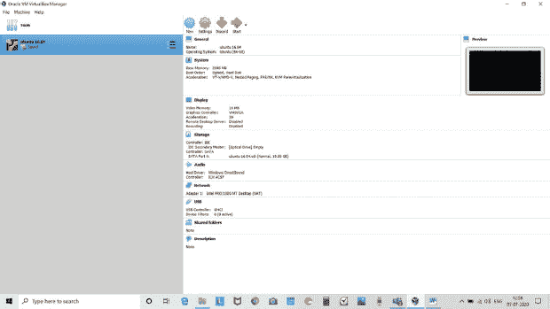
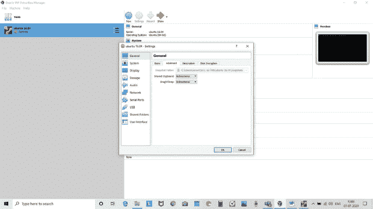
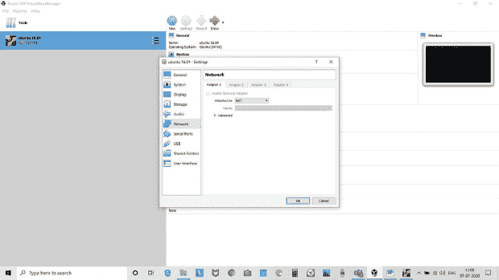
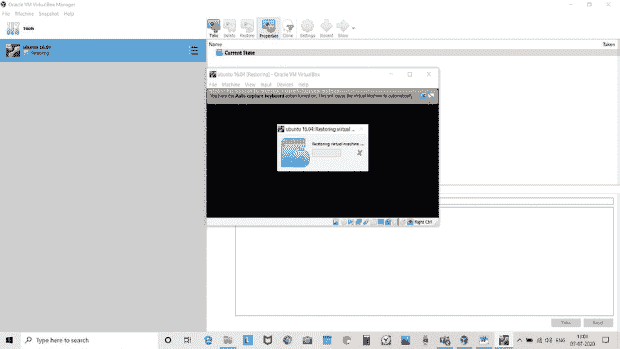
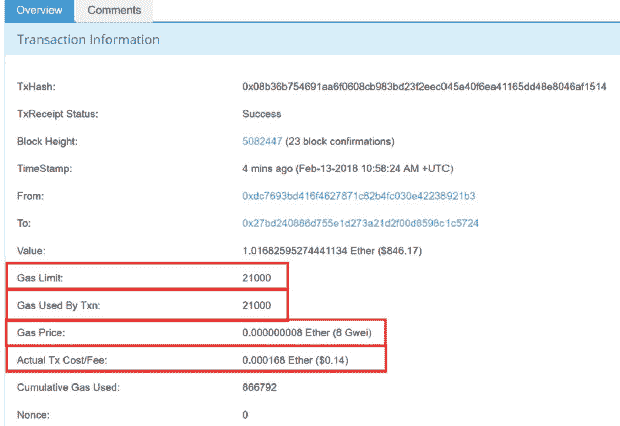
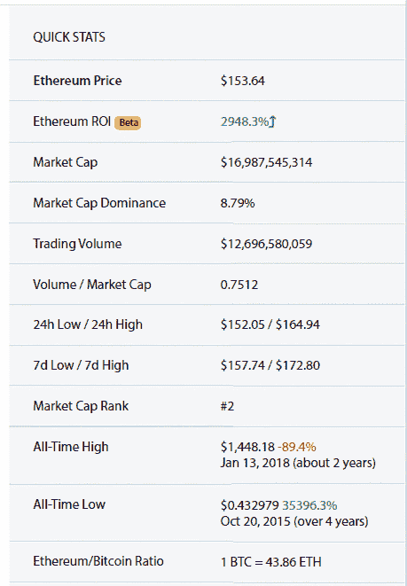

# 4

以太坊

**Shaveta Bhatia¹* 和 S.S Tyagi²**

*¹印度法里达巴德曼 av Rachna 国际研究与发展学院计算机应用系*

*²印度法里达巴德曼 av Rachna 国际研究与发展学院工程与技术系*

***摘要***

以太坊是一个重要的基于区块链的平台，用于智能合约——在去中心化系统中执行的图灵完备程序，通常控制着重要价值的高级单位。一个共享或点对点系统，由相互不信任的节点维护着一个全局的状态视角，并按需执行代码。表达的（代码）存储在一个由比特币那样的工作量证明机制组件保障的区块链中。以太坊的基本理念是一种完全可靠的中间语言编程范式，适用于执行复杂的商业逻辑。没有第三方信任的分布式应用正在吸引着众筹、金融服务、身份管理和赌博等多个领域的兴趣。智能合约是一个横跨密码学、共识算法、编程语言以及商业、金融和法律等多个领域的复杂研究主题。

本章讨论了以太坊安装、工作原理、GAS、ETH、购买 ETH 的方式、智能合约及 DApps 的工作原理以及它们的去中心化应用领域。

***关键词：*** 以太坊，GAS，比特币，以太坊虚拟机，ETH，智能合约

## 4.1 引言

以太坊是互联网的一个新时代，用于赚钱和支付，用户可以拥有自己的数据和应用程序，每个人都可访问开放的金融系统、开放的访问基础设施，没有公司或个人拥有控制权。它是一个可编程的区块链，这意味着开发者可以用来构建新的应用程序。比特币区块链是所有区块链的母体。它旨在进行点对点价值的传输。执行代码的框架是由以太坊论坛引入的。以太坊区块链的中心和重点是智能合约。以太坊有一个分布式应用程序，具有加密货币和区块链的好处。以太坊的规则简单实用，即使是在一些数据存储或时间效率方面。一个普通的程序员最好能够遵循并实施这些规格，从而完全理解加密货币带来的不平等的民主化能力，并进一步实现以太坊的愿景，即其协议对每个用户都是可访问的。任何提供复杂性的发展除非该发展导致巨大的好处，否则不应被包含。

以太坊最初是由 Vitalik Buterin 在“白皮书”中报道的。他是一名程序员，也是 Bitcoin Magazine 的联合创始人。2013 年，他设定了一个目标，即建立去中心化应用。Buterin 表示，比特币需要一种用于应用开发的脚本语言。他建议开发一个具有更通用脚本语言的新平台。Joseph Lubin，Gavin Wood 和 Jeffrey Wilke 于 2014 年成为创始人。以太坊最终于 2015 年推出。

以太坊的区块必须创建，因为它是可交换和可分割的。他们的目标是开发一个程序，使用户能够在单一位置进行小型协议更改；在不进行进一步更改的情况下，应用程序堆栈可能不会停止增加。包括 Ethash，Patricia Bushes 和 RLP 库在内的开发。以太坊不需要特殊功能，其主要目标是提供整个加密货币环境。每个用户必须在以太坊上拥有账户，称为极其拥有账户（EOA）。

## 4.2 以太坊的基本特点

1.  正确解决问题的能力使以太坊区块链成为支持任何企业或程序的最佳社区。确实，在加密货币领域，没有其他货币比以太坊更有潜力更正确地做到这一点。

1.  以太坊仅用 12 秒就记录了交易详情。

1.  以太坊自然繁荣，似乎很稳定。即使在 DDoS 和分叉的存在下，到目前为止，以太坊区块链仍然备受关注。以太坊需求的不断增长是其潜力的标志。

1.  以太坊作为 DApps 的良好平台潜力正广泛吸引企业。许多公司和初创公司已经采用以太坊作为一种交易方式。2017 年 2 月，包括英特尔、微软、摩根大通、BP 和汤森路透在内的多家基础企业合作研究以太坊社区技术，将以太坊纳入各自的组织。以太坊得到了美国银行的支持，这是第一家与以太坊区块链合作的金融机构。

## 4.3 比特币与以太坊的区别

1.  比特币和以太坊都是加密货币。比特币仅用于数字货币，而以太坊是区块链技术的著名实现。

1.  比特币常见的区块时间是大约 10 分钟，而以太坊只需 12 秒。

1.  比特币已经提取了超过 65%，而到目前为止，以太坊提取的比例不超过 50%。

1.  以太坊使用 Gas 来衡量执行程序所需的费用，而比特币交易的费用取决于区块大小。

1.  比特币和以太坊在目的上的区别：比特币被视为一种交换货币，或数字货币，以太坊通过其自己的货币机制促进点对点合同和应用程序。这就是为什么比特币已经成为更稳定的数字货币，而以太坊更多地与智能合约应用程序相关。

1.  比特币区块链的区块大小限制为 1MB。一个新的比特币区块链大约需要 10 分钟来挖掘或创建新的区块。比特币网络可以处理每秒 3-4 笔交易。而以太坊没有区块限制。区块的交易数量由矿工决定。每个区块需要 12-14 秒来挖掘，大约每秒有 15 笔交易。

1.  比特币和以太坊有不同的交易方法，比如：

    比特币：“Ram sends 10BTC to Shyam。”

    以太坊：“如果 Ram 的余额是 15 ETH，且日期是 2020 年 10 月 1 日，则发送 10 ETH 从 Ram 到 Shyam。”

下面的表格详细展示了以太坊和区块链之间的区别：

| **BASIS** | **BITCOIN** | **ETHEREUM** |
| --- | --- | --- |
| 货币发行 | 它每 10 分钟创建 12.5 个比特币。 | 它每 15 秒创建 3 个新的 ETH。 |
| 货币总量上限 | 它有 2100 万比特币的总量上限，到目前为止已经创造了 1700 万。 | 以太坊目前没有上限，但计划在未来一年或两年内减少或不再发行。目前已经有 1 亿个以太币发行。 |
| 新块的添加 | 它每 10 分钟创建一个块。 | 它每 15 秒创建一个新的块。 |
| 语言支持 | 它内置的脚本语言功能有限，仅有几十个操作。 | 它拥有构建程序所需的所有语言，被称作“智能合约”。 |
| 费用 | 费用是根据大小来决定的。 | 它设定了一个费用，称为燃料费（Gas），用于在区块链上进行每笔交易。 |
| 处理时间 | 每个比特币区块的大小限制为 1MB（比特币现金为 8MB）。比特币可以处理每秒 4 笔交易 | 在这个区块中，限制了气体的使用量，所有操作的总开销。它大约每秒处理 15 笔交易。 |
| 挖矿难度 | 比特币的哈希算法（SHA-256）可以用专门硬件（ASICs，应用特定集成电路）有效执行。 | 以太坊的“哈希算法”（KECCAK-256）耗电多，这使得制造“经济型专用芯片”变得困难。这使得以太坊可以进行去中心化挖矿。 |
| 未来战略 | 比特币目前没有这样的计划。 | 它有一个计划，通过改变计算方式，从“工作量证明（PoW）到权益证明（PoS）”，权益证明依赖于节点代币属性，而不是计算力量。同样，它也有通过实现“分片”来处理多样性的计划，将区块链分成多个互联的子区块链。 |

## 4.4 EVM（以太坊虚拟机）

EVM 旨在通过计算机提供安全并执行不可靠的代码。EVM 确保程序无法访问其他代码，并确保可以建立无潜在入侵的通信。EVM 旨在为创建智能合约提供一个“运行时环境”。几乎所有加密货币都使用智能合约。EVM 方法可以用来自动执行交易。

此虚拟机可以在多种编程语言中执行，如：C++、Java、JavaScript、Python、Ruby 以及许多其他语言。

EVM 在以太坊中至关重要，对这种虚拟机的协调机制具有重要影响。

此虚拟机的编程语言被称为“以太坊字节码”。如果源代码被编写，则被视为针对以太坊结算目标的编程语言。该源代码被编译为字节码，以便虚拟机可以识别该代码。

这款虚拟机实现“图灵完备”是通过一个市场来定价软件指导，而不是根据像“比特币”等其他加密货币执行的经济交易。代替交易费用，你获得了一种处理应用程序的报酬形式。

编程语言与运行和修改信息的结构完全相同。如果这些规则可以用来模拟图灵的计算系统，那么这些规则被认为是“图灵完备”的。这种系统可以通过数值建立，具有进行有效计算的能力。用不同的词汇表达，一个图灵完备的设备在数值上能够解决你提供的任何问题。虚拟机是“准图灵完备”的最佳选择，因为通过系统的执行受到燃料的限制，这阻碍了可以执行的计算范围。

用户可以通过在系统中安装虚拟机来创建自己的虚拟机。安装虚拟机后，下面显示的截图会逐步介绍如何在虚拟机中运行 ethereumubuntu.ova 文件以创建节点并在区块链上进行交易。创建虚拟机时，点击虚拟机的设置，然后按照以下参数设置：

> 设置虚拟机内存大小：2048MB。
> 
> 设置操作系统：Linux。
> 
> 设置网络为 NAT。
> 
> 将高级特性设置为双向。
> 
> 安装 EtherumUbantu.OVA 文件并点击开始运行。

**截图 1** 在 Windows 10 上安装虚拟机后创建虚拟机。

**截图 2** 设置创建虚拟机的参数。

虚拟机是一款可以在宿主操作系统上虚拟运行不同操作系统的应用程序。正如上面的截图所示，Ubuntu 16.04 作为虚拟机在 Windows 宿主操作系统上运行。

在运行 Etherum.Ova 文件后，所有交易都通过以太坊执行。所有交易都通过这个文件执行。以太坊实际上为实现将区块链转换为计算框架迈出了重要一步，为去中心化开启了全新的机会。以太坊支持智能合约和虚拟机，智能合约在虚拟机上执行。智能合约进而使去中心化应用能够实现比价值转移更高效的自动化去中心化应用。

**截图 3** 设置网络连接为 NAT。

**截图 4** 创建虚拟机。## 4.5 燃料

燃料是一种评估执行费用机制。每个在以太坊上执行的交易都需要附加成本，以燃料的形式支付。燃料价格是个体每单位燃料感兴趣投资的“ETH”度量。Wei 是以太币的最小单位。

> 1 以太币 = 10¹⁸ Wei
> 
> 以太币 = 交易费用 = 燃料价格 * 燃料限制
> 
> 实际交易成本费用：用户将为以太币支付的交易费用。

### 4.5.1 燃料价格图表

| **单位** | **Wei** |
| --- | --- |
| Wei | 1 |
| Kwei/ada/femtotether | 1,000 |
| Mwei/babbage/picoether | 1,000,000 |
| Gwei/Shannon/nano | 1,000,000,000 |
| Szabo/microether/micro | 1,000,000,000,000 |
| Finney/Milliether/milli | 1,000,000,000,000,000 |
| 以太币 | 1,000,000,000,000,000,000 |

以太币的最小单位是 Wei。Gwei 持有数十亿 Wei。在购买以太币之前，用户必须检查当前价格。

在执行之前，发送者必须设置固定燃料价格和限制。当发送者不 fix “限制或数量”的燃料时，“耗尽或无效”是可能的。

矿工决定燃料的价格。如果交易不符合处理条件，可以降低价格。

需要注意的是，燃料限制可以（并且通常）大于交易中实际使用的燃料。在 ICO 实例中，常见的燃料费往往会随着人类加速参与 ICO 而指数级下降，这可能导致更多人提高他们的燃料价格，以增加确认 ICO 交易的机会。

**图 4.1** 区块交易 [参考：[`masterthecrypto.com`](https://masterthecrypto.com)]。

图 4.1 显示了区块交易的示例。

交易可以加速。一个人可以虚拟地选择其交易的最高优先级。矿工会“着色”并执行提供更好燃料价格的交易，因为他们将保留他们支付的费用。因此，他们会优先执行具有更好 Gwei 的交易。

如果需要加快交易速度，那么你必须愿意支付更高的燃料费。如果你需要在 2 分钟内完成交易，你必须支付 8 Gwei。一切都取决于你的紧迫程度。

## 4.6 以太坊为基础构建的应用程序

1.  开放金融：这指的是正在开发一系列去中心化协议，以建立开放的金融基础设施。这些协议很有价值，因为它们正在创造必要的探索，以允许全球范围内拥有互联网连接的每个人都能够访问自主的、抗审查的金融服务。

1.  市场：它建立在以太坊上，允许买卖 ERC-721 代币，包括加密收藏品。

1.  预言机：预言机是指一种连接以太坊与链下数据的服务。它们可以用于从互联网查询数据、获取有关独特链（例如 BTC 交易）的信息，或者作为关于不同资产的争议解决机制。

1.  游戏：数字账本游戏是指在其背后或机制中包含数字账本技术的游戏。

## 4.7 ETH

以太坊有一种本地加密货币，叫做 ETH。它是一种数字货币。它具有与比特币相同的特性。它可以在世界各地发送或接收。它用于存储价值、进行支付或作为偿还的担保。

用户必须购买 ETH 才能使用以太坊网络。用户只能从已经拥有 ETH 的人那里购买 ETH。用户所拥有的 ETH 必须存储在硬件钱包中。有一些加密货币交易所可以让人用法定货币或加密货币购买 ETH：币安、Coinbase、Gemini、Kraken、Dether 和 Localcryptos。

### 4.7.1 用户为什么要购买 ETH？

以太坊是目前全球最著名和广泛使用的加密货币之一。这种加密货币对用户来说具有很高的投资回报率，用户真的想将 ETH 兑换成 USD，反之亦然，以便任何人都可以在以太坊区块链上使用。对于那些同意 ETH 价格进行大量交易所交易的专业买家来说，它也具有特别的吸引力。因此，以太坊被认为是所有感兴趣并希望将其视为软件资产的人以及那些真的想进行兑换的人的一个适当的选择。

除了以太坊的应用成本外，其费用与比特币相比更具吸引力。尽管 ETH 比 BTC 便宜得多，但它可能会吸引那些对获得一些加密货币但不受特定加密货币限制的人的注意。还有一些人感兴趣的是通过区块链技术进行投资，并遵循货币去中心化的概念。因此，以太坊是人们在网上广泛交易和经常用于加密货币交易所的货币之一。

### 4.7.2 如何购买 ETH？

可以通过像 GDAX、Coinbase、Bitpanda 等在线交易所，使用信用卡或借记卡购买 ETH。

要购买 ETH，你需要按照以下步骤操作：

1.  在 Binance、Coinbase、Gemini 和 Kraken 上创建账户。为了验证你的账户，你需要上传文件来证明你的身份。一旦上传文件，验证就会进行，大约需要一天或两天。

1.  按照交易中的指南存入美元。这些依赖于你的金融机构和电线切换。这可能需要三个到五个工作日。

1.  现在你有了美元在你的交易所账户中，所以你现在可以购买 ETH。

1.  当你得到所需的全部 ETH 时，将其提取到您控制的钱包中。交易所被广泛认为是容易被黑客攻击的，你需要将资金放在具有私钥的区域。

1.  你可以部署 My-crypto 电脑应用，直到你期待验证和切换的时间。

1.  在执行过程中，创建新的钱包并创建新钱包。使用你永远不会忘记的密码并创建账户。然后它将提供以 0x 开头的地址。这是你可以用来将 ETH 从他们的账户转到你的账户的东西。

1.  为了保护你的账户，设置地址（04x234）、密码和私钥。你必须有一个备份系统，其中包含 My crypto 应用程序。

### 4.7.3 购买 ETH 的其他方法

形状转换用于将比特币转换为 ETH。启动 BTC<-ETH，它会告诉你要把 BTC 发送到哪里。

然后，创建一个以太坊账户并备份。从你存储 BTC 的地方，将其发送到 Space-Shift 提供的 BTC 地址。ETH 将在 20 分钟内出现在 ETH 钱包中。

### 4.7.4 以太坊兑换成美元

市场洞察货币计算器在几秒钟内提供以太坊兑换成美元的货币转换。在 Krypto 的游客可以使用当前的汇率进行转换。货币计算器为在全球股票交易所投资的交易员提供了一个很好的工具，通过选择一种货币来进行转换。

**图 4.2** 购买以太网的交易 [参考：[`www.coingecko.com/en/coins/ethereum`](https://www.coingecko.com/en/coins/ethereum)].

以太坊兑换成美元可以在交易当天以及分配做此事的汇率进行。选择交换费日期。默认情况下，当前日期是前一天，以及以太坊兑换成美元的最高和最低价格。结果在一个非常组织的表格中显示。以太坊-美元价格，市场洞察货币计算器还提供约 160 种国际货币的其他汇率。用户需要在交易前首先检查加密货币的当前价格。 图 4.2 显示了购买以太网的交易。

## 4.8 智能合约

EVM 是一个用于执行“智能合约”包的平台。它可以被称为一个“去中心化的全球计算机”，在这个计算机系统中，通过以太坊的节点进行计算，任何节点都可以提供系统计算，并以其工作的形式获得以太币代币的报酬。

这些特别被称为“智能合约”，因为它基于需要成功匹配时执行的书面合同。

例如，想象一下开发一个“Kickstarter”式的项目，通过从很多人那里筹集资金来资助一个项目，每个人贡献相对较小的以太坊。有人应该安装一个以太坊智能合约，可以汇集硬币发送给其他人。这个智能合约应该是一个书面合同，描述了条款和条件，例如，在为资金池筹集了 10 万美元之后，全部都会直接发送给收款人。假设，在某种情况下，我们想象的一个月内没有达到 100 万美元的门槛，所有货币都可以退回到原始货币持有者。当然，这将以以太币代币而非美元进行交易。

合同可以建立在任何区块链平台上。智能合约可以用于许多经济服务和医疗保险。

### 4.8.1 政府

内部人士坚称，我们的投票机器被篡改的可能性非常低，然而，智能合约可能通过提供一个无限更大的‘安全’机器来解决所有问题。账本保护的投票可能需要被加密，并且需要过度的计算能力来获取访问权限。没有人拥有如此庞大的计算能力，这就是为什么需要主人公来黑掉系统！另外，智能合约需要提高低投票率。大部分惯性来自于一个管理不善的设备，包括排队、展示你的身份和完成官僚主义。有了智能合约，志愿者可以将投票过程转为线上，选民将集体出现为他们的候选人投票。

### 4.8.2 管理

像准确性、透明度和自动化系统这样的属性，区块链在提供值得信赖的单一账本的同时，避免了工作流程中的误解和差异。通常，企业运营应该经历双向过程，同时等待同意和内部或外部问题的解决。这由密码账本提供。它消除了独立处理中通常发生的差异，这可能导致昂贵的诉讼和合同延迟。

### 4.8.3 智能合约的好处

+   自主性—人们不能依赖经纪人、法律专业人士或其他代理人来证实。它消除了通过第三方进行操纵的风险，因为执行是由预定义的算法管理的，而不是通过一个或多个可能带有偏见、可能无法遵守适当或公认标准的组织。

+   信任—您的文件是加密存储在加密账本上的。这些文件被误放的可能性非常低。

+   备份—加密的文件遍布整个网络。为每个用户在区块链上创建多个副本，为您提供支持。

+   安全性—加密使文档安全，使黑客攻击成为不可能。

+   速度—文件的处理需要时间和文书工作。

+   节省—以太坊消除了中介，节省了用户的钱。例如，用户应该支付一个官方人士来证明他的交易。

+   准确性—自动合同并非更快且成本低廉；它消除了手动填写数千份表格可能出现的错误。

### 4.8.4 智能合约的问题

智能合约距离准确还有很长的路要走。程序中的错误导致合同的更改。政府如何在这份智能合约上收到税款？

### 4.8.5 克服此问题的解决方案

信息技术资源中心，合规性搜索表明，智能合约可能会与某些组织的变化发生冲突（公司），包括法规。律师将从一个标准的合同转向生产标准智能合约，就像你在 LegalZoom 上找到的标准传统合同一样。其他组织，包括收单机构、信贷机构和会计师可能会使用智能合约来执行任务，包括实时审计和风险检查。实际上，区块链技术网站认为智能合约将与纸质和数字内容的混合物合并，其中合同通过区块链验证并通过物理副本证实。

### 4.8.6 构建智能合约的语言

智能合约基本上是通过以下各种编程语言构建的：

1.  javascript

1.  C++

1.  Golang

1.  Java

1.  Sql

1.  Solodity.

FLETA 是一个即将推出的区块链平台，正在创造一个可持续的智能合约 DApp 环境，因为我们正在确保我们的生态系统中支持正确的语言，我们的测试网智能合约主要基于 Solidity 构建。我们将来能够在主网上指导 Golang、Javascript、Java、C++和 SQP 等智能合约的开发。

## 4.9 DApp（去中心化应用程序或智能合约）

DApp

比特币以其加密存储的账本、稀缺资产模型和点对点技术为基石，带来了一个新的模型，支持构建大规模可扩展且有价值的应用程序。一种新类型的软件，称为去中心化应用程序，或 DApps，需要这些关键功能来构建。应用程序一词通常用于指代定义特定目标的软件。我们使用的多数应用程序遵循中心化服务器-客户模型；一些是分布式的，现在越来越多地变得去中心化。

### 4.9.1 在以太坊上的 DApp

以太坊平台创建了一个用于构建去中心化程序的协议。它是一个开源的公共区块链基础分布式计算平台，具有智能合约功能，也称为脚本编写。它提供了一个去中心化的图灵完备虚拟机，即以太坊虚拟机（EVM），它使用全球网络的公共节点执行脚本。DApps 具有高度灵活、透明、去中心化和弹性，并具有更好的激励型应用程序模型。

开发者们正在分享关于什么定义了 DApp 的不同看法。一些开发者表示，其最重要的特征是没有显著的失败因素，而其他人则认为还有更多的要求。以太坊平台可以使任何人编写智能合约和去中心化应用程序，您可以为所有权、交易格式和转换功能选择自己的“政策”。正在创建多种类型，包括经济、治理、社区、法律、健康、教育。它们允许各方之间更直接的互动。

### 4.9.2 DApps 的应用

以下是 DApps 的各种应用：

1.  Maker DAO: Maker DAO 抵押债务头寸（CDP）是在以太坊区块链上执行的智能结算。它是 Dai 稳定币系统的基本元素，其目的是用抵押品交换 Dai，然后将其持有至借出的 Dai 归还。

1.  Chainlock: Chainlock 将智能合约与实际国际的信息、事件和账单连接起来。Chainlink 社区为任何区块链上的复杂智能合约提供可靠的安全输入和输出。智能合约无法自行连接到关键外部资源，包括链下记录和 API。Chainlink 通过一个舒适的去中心化预言机网络，安全且可靠地允许这种连接。

1.  Status: Status 将点对点消息传递、加密钱包和 web3 浏览器集成到一个私人舒适的通讯设备中。与朋友聊天、保存加密资产并探索网络的未来，而不会泄露您的数据。

1.  My Crypto Heros：如果你曾经梦想过为自己的数字雇佣兵企业走古代英雄，My Crypto Heros 就是为你准备的基于区块链的休闲 RPG 游戏！适用于每种移动设备和在线 PC，My Crypto Heroes 允许你收购和训练来自历史的英雄。用特殊和传奇物品装备你的英雄，打造最终、不可战胜的队伍。带领你的团队进入史诗般的战斗，征服加密世界。

1.  Uniswap：用于 ERC20 代币交换的简单智能结算界面。正式化的模拟，用于池化流动性储备。面向买家和流动性供应商的开源前端界面。致力于去中心化资产交换。

1.  Axie Infinity：Axie Infinity 是一个数字宠物宇宙，玩家在其中斗争、养育和交易被称为 Axies 的幻想生物。Axie 是第一个引入移动应用程序的区块链游戏。通过玩游戏赚取现金的潜力。

1.  Synthetix：Synthetix（原名 Havven）是一个去中心化的人工资产平台。这些资产——合成品（synths）——是以加密货币补贴的人工财产，它调和了基础财产的费用并允许公开接触一种资产，而无需真正持有它。## 4.10 结论

Ethereum 不仅仅是一种去中心化加密货币，用于支付，它还可以用于创建真实世界的应用程序。应用程序是以创建智能合同时相同的方式创建的。在这种加密货币中，不需要中间人。购买以太坊的人可以直接以智能合同的形式传达到新参与者。

Ethereum 为其所有用户提供透明度，这意味着用户可以打开自己的数据、应用程序，并可以访问开放的金融系统。Ethereum 可用于开发应用程序。Ethereum 有自己的虚拟机，称为 EVM。EVM 对每个用户开放，以创建他们的新应用程序和智能合约。使用 GAS 工具来衡量每个应用程序和智能合约的价值。

创建智能合约的好处是将合同和用户信息以加密格式存储，并存储在全球不同服务器上，这提供了一些额外的功能，如：安全、备份、速度。

比特币和以太坊都有流通数字货币的相同目的。两者都使用相同的“区块链”技术来流通货币。比特币仅用于全球范围内的支付和接收支付，而以太坊不仅用于支付和接收支付，还用于创建新应用程序。比特币和以太坊通过其原生币 BTC 和 ETH 有不同的燃料。以太坊的模型比比特币更好。以太坊可用于多任务处理，且以太坊交易费用比比特币便宜。

## 参考文献

1. Norvill, R. *et al.*, Ethereum 虚拟机的视觉仿真。*IEEE 网络操作与管理研讨会会议记录*，2018 年 4 月。

2. Vujicic, D. *et al.*, 区块链技术、比特币与以太坊：简要概述。*第 17 届国际信息科技研讨会 INFOTEH-JAHORINA (INFOTEH)*, 2018 年 3 月。

3. Buntinx, J.B., Ethereum 虚拟机是什么？可访问[`themerkle.com/what-is-the-ethereum-virtual-machine`](https://themerkle.com/what-is-the-ethereum-virtual-machine)，2017 年 96 期。

4. Wu, Y. *et al.*, 中国建筑工程项目智能建造与信息管理模型的研究。*智能建造研究*，17, 24P, 2018 年。

5. Wood, G., *ETHEREUM: A Secure Decentralised Generalised Transaction Ledger*, 美国彼得堡，黄皮书，2019 年。

6. Oliva, G.A. *et al.*, *以太坊区块链平台上的智能合约探索性研究*, 美国 Springer, 2020 年。

7. di Angelo, M. *et al.*, 用于分析以太坊智能合约的工具调查。*IEEE 国际分布式应用与基础设施会议(DAPPCON)*, 2019 年。

8. Wikipedia, 以太坊，可访问[`en.wikipedia.org/wiki/Ethereum`](https://en.wikipedia.org/wiki/Ethereum)（2020 年 3 月 3 日检索）。

9. Alharby, M. *et al.*, 智能合约当前研究主题的系统映射研究。*国际计算机科学与信息技术杂志(IJCSIT)*, 9, 5, 151−164, 2017 年。

10. Solaiman, E. *et al.*, *混合线上线下区块链架构的智能合约实施与评估*, 特刊, 美国威尔士, 2020 年。

11. Perez, D., 攻击 EVM 中的资源计量：*网络与分布式系统安全研讨会(NDSS)2020*, 美国加州圣地亚哥，2020 年 2 月 23 日至 26 日。

1.  * *通讯作者*：Shaveta26@gmail.com; shyamtyagi@hotmail.com
