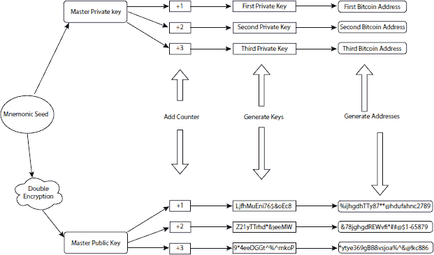
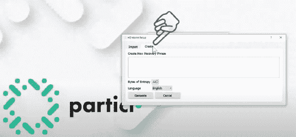
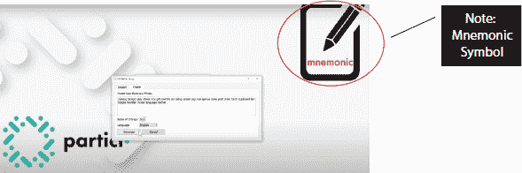
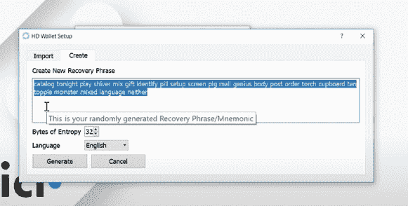
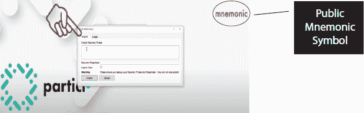
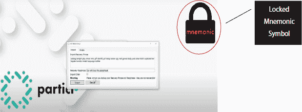
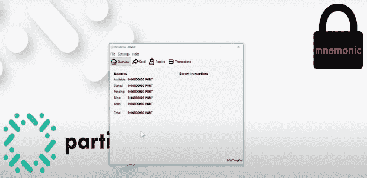
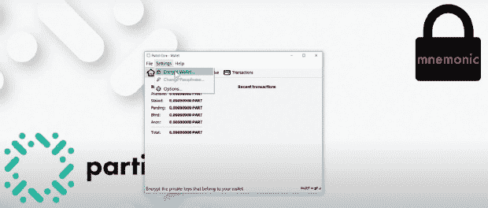
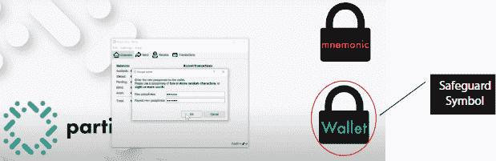

第五章

电子钱包（E-Wallet）

**Vishawjyoti 女士**

印度法里达巴德曼 avRachna 国际研究所及研究学院

**摘要**

比特币钱包是一种加密货币钱包，可以让用户管理不同的加密货币，例如比特币、以太坊等。比特币钱包在基金交换方面非常有利，交易是安全的，因为它们是数字（加密）签名的，而且可以从网络或移动设备访问。此外，用户的隐私和身份肯定得到了保护和维护。因此，比特币钱包提供了所有可能重要的功能，以便在各方之间安全、安全地转移和交易资产。比特币钱包是一种允许用户管理加密货币的钱包，它与您现在正在使用的任何电子钱包或多个其他门户非常相似，但现在您可以使用加密货币来代替，就像您使用 PayPal 进行法币交易一样。比特币钱包生态系统的例子有 electrum、Bitcoin .info、Jaxx、myceliium、Samurai 和 Bitcoin-paper 钱包。这些都是市场上存在的少数比特币钱包的名称，但根据您的需求，可以根据您需要的安全性，以及满足您需求的钱包类型，还可以创建更多。

**关键词：** 比特币钱包，加密货币，加密交易，比特币纸钱包

## 5.1 钱包技术简介

比特币或 BTC 是新时代的投资货币。它们不存在于物理平面或形式中；因此，这种数字货币不能存储在任何地方，即比特币只是数字网络上完成的数字和交易记录。相反，它们通过私钥维护 - 这些私钥用于访问公地址和交易日志 - 这些私钥需要被保护并安全存储。接收者的公地址和账户（钱包）持有者的私钥的组合是比特币交易可能性的关键和唯一的支柱。因此，有必要开发钱包，因为它们为这些钥匙和相关交易日志提供备份和安全。

比特币钱包有多种形式，它们根据不同的需求进行分类，同时也取决于安全性、可访问性、便捷性等方面的术语。

## 5.2 钱包类型

### 5.2.1 纸张

纸钱包，顾名思义，是实体钱包，或者是一种可以显示某种交易输出来进行交易的钱包。这些通常是用来存储接收和花费比特币的公钥和私钥的文档。纸钱包通常是打印成二维码的形式，这使得用户更容易扫描这些代码并将密钥存储在他们的钱包中以供交易使用。有几个服务可用于生成纸钱包，如 BitAddress 或 Bitcoinpaperwallet。这些服务允许用户使用自己的私钥为比特币创建复杂、安全且完全随机的地址，这些地址可以进一步打印出来，前提是没有安全篡改或阻力，以可读（扫描）代码的形式。

由于，打印是在离线状态下完成的，所以钥匙的也是在离线状态下，这意味着钥匙免受黑客和恶意软件攻击。然而，由于钥匙也是在离线状态下，用户必须小心并采取必要的保护措施来保护他们的私钥。用户在生成私钥之前必须确保没有人正在注视他们，或者他们只在与信任的人在一起的环境中。为了防止任何间谍软件监视你和你的活动，建议用户使用干净的操作系统，如 Ubuntu，从一个远程、离线的设备操作，或使用未连接到任何网络的输出设备。

此外，在完成其目的后，必须及时且正确地保护打印输出，因为它包含宝贵、重要且私人的信息。人们使用不可破解的锁柜，或受授权的第三方保护的安全保管箱。

### 5.2.2 实体比特币

实体比特币是一种处理比特币交易的不寻常方式，其意图是在私钥隐藏之前不允许花费比特币。它的工作原理与保修密封的工作原理相同，其中使用了易损的密封，一旦打开，比特币就失去全部价值。最初的想法是生成一个像信用卡一样的结构来访问这些支出，但后来它被转换成一张圆形卡片，私钥隐藏在一个可撕下的全息图下面。当这个全息图被移除时，会留下一个篡改标记，表明有关比特币已经赎回。

实体比特币是存储和交易资金离线的最方便和极其有用的方法。最大的缺点，虽然极其罕见，是生成这些卡片的公司被封闭或关闭，这样这些卡片及其相关资金可能会失去全部价值和价值，因为比特币在许多国家仍然处于非法的灰色地带，可能会受到货币相关当局的抵制。

### 5.2.3 移动端

移动钱包是日常用户的基本工具，他们在家商店购物时支付，面对面交易比特币。它基于智能手机上的移动应用程序运行，使用户能够从手机安全地存储私钥，在用户的个人移动锁下直接从手机支付。这些移动锁也有多种选择，用户可以选择。随着技术的提高和当今智能手机的下一代功能，带来了触摸支付和近场通信的优势，使用户能够轻松支付，而无需提供任何信息。

移动钱包在访问区块链账本方面也有优势，因为它们只访问区块链的子集，比特币网络上的可信节点，以确保它们有验证过的信息。其他完整的比特币客户端需要访问完整且不断增长的区块链账本，并且还需要存储 GB 数据，移动钱包缩小了这些账本的范围，并只针对特定且可信赖的地址。

尽管移动钱包很方便，但它们也有自己的典型缺点。它们很容易受到黑客攻击，如果有人未经用户同意就获取了钱包，或者落入天真用户的手中，这些用户可能不知道自己在做什么，那么它们就不安全。

一些常见的移动钱包示例：

自由钱包（FreeWallet）、边缘钱包（Edge）、原子钱包（Atomic Wallet）、卢米钱包（Lumi Wallet）、区块链钱包（Blockchain Wallet）、Copay、Jaxx、Mycelium 等。

### 5.2.4 Web

网络钱包，也称为电子钱包，用于在由第三方控制的在线服务器上存储私钥，该第三方根据协议进行维护。网络钱包具有多才多艺的特性，因为它们也可以与其他类型的钱包连接，如移动网络钱包、桌面网络钱包。它们在用户拥有的设备上复制地址。

由于它们可以与具有互联网连接的设备相连，与移动钱包类似，电子钱包也提供了随时随地进行交易和资金转账的便利和便捷。

与便利性并行的是，这些电子钱包的缺点也与之相伴。黑客攻击、跨站脚本攻击、钓鱼网站是最常见的漏洞。此外，这些电子钱包也适用于交易所，在转账过程中可能会被切断，完全关闭用户的资金实例，造成货币损失。

一些常见的电子钱包示例：

币安（Coinbase）、卢米钱包（Lumi Wallet）、 circle、区块链、Strongcoin、Xapo 等。

### 5.2.5 桌面

桌面钱包是可以下载的软件，安装在桌面上以存储私钥和生成公钥。与电子钱包和移动钱包相比，桌面钱包更安全，因为它们以离线方式存储和备份，并且不依赖于任何第三方或相关协议。它们的脆弱性源于它们所工作的操作系统。操作系统必须连接到互联网以处理交易，因此操作系统的风险越高，桌面钱包可能承受的脆弱性就越多。另一方面，桌面钱包为比特币小额交易者提供了更好的解决方案。

一些常见的桌面钱包示例包括：

Electrum, Exodus, Atomic Wallet, Bitcoin Core, Copay, Armory 等。

### 5.2.6 硬件

硬件钱包是一种独特的钱包，以离线方式使用，在安全的硬件设备中存储私钥。硬件钱包是存储和备份比特币私钥和资金最安全的方法。这种类型的钱包被黑客攻击的可能性几乎为零。对计算机病毒免疫，这些钱包不需要任何软件导入即可处理，它们可以轻松地以明文形式转移到开源软件中。

硬件钱包有多种类型，一些甚至有自己的屏幕，类似于寻呼机，显示与钱包相关的的重要信息。一些制造商还通过物理损坏来验证他们的设备，并且可能会向客户收取比其他人更高的费用，但肯定会为他们提供一个确保的、强大且可信赖的硬件钱包，以保护资金。

一些常见的硬件钱包示例包括：

Ledger Nano S, TREZOR, KeepKey 等。

### 5.2.7 银行

与其他存储比特币的钱包方法相比，银行钱包并不是很受欢迎，它就像一个可信方系统，用户信任某家银行来为他们保管私钥和比特币资金。银行通常不将比特币视为其投资衡量标准，因此比特币机构联合推出了一家比特币加密银行。这家比特币加密银行运作方式与普通银行类似，它管理比特币存款，追踪交易，并保持对比特币市场的最新和深入理解。

## 5.3 比特币钱包的安全性

恶意软件或恶意软件可以清除所有比特币。这甚至不是主要问题，追踪这些恶意软件才是最困难的任务。复制密钥的一个主要问题是也存在风险。如果系统扫描到两个代码相同的密钥，有效密钥的解密可能面临风险。此外，还存在特洛伊木马问题，即使只有一个文件受到影响，特洛伊木马也可以轻易地检测到钱包中的比特币数量。

比特币专家的建议是，任何用户都应避免可以直接从互联网访问的钱包。第三方存储功能应始终是最后的选择。要警惕诸如钓鱼和垃圾邮件之类的欺诈行为。

## 5.4 钱包技术的工作原理

要理解比特币钱包的工作原理，我们必须理解这些钱包的必要性和重要性。我们必须回答两个问题：

1.  这些比特币钱包存储了什么？

1.  它们存储的内容为什么重要？

比特币钱包存储了一项非常重要的信息，这项信息使用户能够访问区块链中的比特币。每枚币总是保存在区块链上的一个地址中，这意味着这些钱包中没有币。相反，这些钱包中保存了访问和控制这些比特币的信息，在技术术语中，这是最重要的信息。用户无法确定币在区块链中的位置，因为防止这些币停留在一个地址上的安全算法。

所以，钱包的工作方式是通过让钱包中的私钥与币的区块链地址对齐，然后再次触发算法，随机为区块链子集中的币分配地址。

与银行账户相比，加密货币钱包是一个存储设施，保护一对加密的公钥和私钥。公钥负责为钱包提供接收比特币的地址，私钥负责花费这些钱包中的比特币。

## 5.5 从种子创建 HD 钱包

hierarchical deterministic 钱包，或称 HD 钱包，是新时代加密货币的自主数字钱包，它能自动生成一组私钥和公钥树，每个比特币（加密货币）都是独一无二的。这些密钥因此简化了用户自己生成密钥的复杂性。这些密钥在本质上非常复杂，难以被其他散列密钥系统理解。创建 HD 钱包的过程包括以下三个步骤：

+   初始化：使用 particl-qt、ledger nano S 等工具创建钱包。

+   保护：为了安全起见，保护我们的钱包是必要的。

+   利用：地址生成允许我们的钱包提供交易功能。

### 5.5.1 初始化

钱包创建工具是用于从预定义的比特币改进提案（BIP）或 BIPs 创建种子的软件应用程序。BIP 是一本包含随机且容易记忆的单词的词典。每个词典中没有两个相似的单词，每个词典都是不同的语言。BIP39 是最常用的 BIP，因为它使用英语单词列表，通常是美国的英语。BIP39 为钱包、交易、硬币、钱包交易日志的事件以及钱包的安全性提供备份，以防钱包被破坏、丢失或损坏。

BIP39 用于创建 12 个单词列表或 24 个单词列表的种子。这些生成的种子也被称为助记符种子（短语）、恢复种子（短语）、钱包备份、主种子等。这些种子是生成钱包安全和交易功能的基础。BIP39 有 208 个单词列表，种子是从这 2,048 个随机单词中提取的，以生成短语。例如，如果有人想要从 12 个单词的种子生成 HD 钱包，那么可能的组合数量将是，

2,048¹²=2¹³²

因此，这个短语拥有 132 位的安全性。

一个 12 个单词的种子短语的示例：

> 坍缩 饲料 打开 椅子 露台 晚 溪流 火灾 满 风暴 再次 远

### 5.5.2 使用 Particl-qt 工具从 24 个单词的种子短语创建 HD 钱包的步骤

1.  打开 particl-qt 应用后，选择“创建”。

1.  然后点击生成以生成种子或 24 个单词的种子短语。

1.  一旦生成短语，我们就会看到一个助记符符号，表示 BIP 字典正在使用。在这种情况下，字典是 BIP39，生成的单词是英文。

1.  将生成的助记符短语导入以处理密码短语。

1.  最后，通过生成用户定义的密码短语来保护这个助记符短语，不要丢失，因为这是您的私钥的密码短语。

1.  点击导入，最终屏幕显示 HD 钱包创建完成。

1.  安全

    保护您的钱包的过程非常重要。它涉及用户创建的密码短语的加密，然后加密助记码，从而保护私钥。

### 5.5.3 加密 HD 钱包的步骤

1.  前往设置并选择“加密钱包”。

1.  添加新的密码短语或您的选择，并重新确认。

1.  接下来的步骤是重要信息和安全警告的闪烁，供用户理解和同意它们。点击此处查看用户理解和同意的重要信息和警告闪烁的截图。

### 5.5.4 利用

在创建和加密 HD 钱包完成后，它就可以用于加密货币交易。每个交易都是独特的，因为通过钱包生成的地址对每个不同的交易都是新的。因此，在用户的功能下使地址安全，用户可以选择是将其设为公地址，通过公钥和私钥注册，或者将其设为私地址，仅通过私钥注册进行个人交易。

### 5.5.5 使用 HD 钱包生成地址以访问交易步骤

1.  重新打开 particl-qt 工具，在新窗口的整个新界面中，点击接收导航按钮。点击此处查看重新打开 particl-qt 工具并在全新窗口中点击接收导航按钮的截图。

1.  请输入您自定义的标签，然后点击“请求付款”以接受转账。点击此处查看输入自定义标签并点击“请求付款”以接受转账的截图。

1.  最后，您的地址将带有二维码生成。付款人可以扫描代码或复制地址以完成交易付款。点击此处查看带有二维码生成地址的截图。

## 5.6 导航 HD 钱包

分层确定性（HD）钱包，正如其名所示，是一种树状的分层结构，用于加密货币钱包，它生成密钥、公私钥及其相应的地址，都从一个单一的种子生成。这个种子是从 BIP 词典中随机选择的 12/24 个单词组成的短语。这些词典用于选择这些随机单词的模式非常复杂，算法的方式是它会在每个种子中改变，防止其他用户猜测或推断出这些单词组合及其相应的密码短语的任何细节或信息。

HD 钱包创建无限数量组合以生成种子的能力，使这种新世纪的数字钱包成为保护加密货币及其所有者，以及改善区块链系统安全性以监视交易的一个非常有用的资产。

加密货币钱包所有者在其钱包中有代币，为了使这些代币有用，所有者必须通过这些代币进行交易。为接收这些代币生成一个公地址，为花费它们生成一个私钥。识别生成的密钥的复杂组合，HD 钱包因此提供并确保代币的安全和所有交易的隐私。

然而，普通加密货币钱包唯一的缺点是存储问题。随着每次交易复杂组合数量的增加，后者的备份变得庞大且复杂，增加了用户照顾每一个日志及其备份的负担。但高级钱包也解决了这个问题。高级钱包使用树分算法为地址及其相关子节点。SHA-256 哈希算法以这种方式产生密钥树，使得通过持续备份和为新的交易生成新地址，用户可以轻松地管理存储在子节点中的地址，而无需记录交易的日志。

无限组合的能力也为这些高级钱包提供了匿名性。每次在加密货币上进行交易时，用户可以使用不同的地址来存储交易日志和历史秘密，从而使所有钱包活动都保持匿名。

一些最受欢迎的高级比特币钱包包括——Trezor、KeepKey、Ledger Nano S、Mycellium、Jaxx 和 Elektrum。与普通加密货币钱包相比，高级钱包让用户能更加控制比特币交易。

## 5.7 结论

在商业、交易和货币的世界里，货币是绑定所有实体的媒介。而在尖端科技的世界里，比特币就是商业的媒介。但是，像所有货币/资产一样，必须有一个系统来存储和保护这些商业的前景。因此，需要银行、安全机构、存储设施或投资领域。对于比特币，隐藏交易的安保是在区块链上完成的，而安全的存储是通过钱包完成的。这些钱包是比特币的银行。

钱包就像是银行的保险箱，它们需要被锁定和保护，以防被盗，而对于比特币钱包来说，保护它们和保护自己一样重要。这些比特币钱包受到黑客的攻击，因为它们对它们来说代表了高价值。

保护比特币钱包的方法有很多。其中一些常见的方法包括——使用强大且复杂的加密技术，以及冷存储，即离线存储。备份是一个主要优势，因为软件和硬件问题可能会抹去你的资产和持有物。

## 参考文献

1. 比特币入门，[`cointelegraph.com/bitcoin-for-beginners/what-is-bitcoin-wallets`](https://cointelegraph.com/bitcoin-for-beginners/what-is-bitcoin-wallets)，2018 年。

2. 比特币钱包，https://www.investopedia.com/terms/b/bitcoin-wallet.asp，2020 年。

3. 比特币的类型，[`www.coindesk.com/learn/bitcoin-101/what-is-bitcoin`](https://www.coindesk.com/learn/bitcoin-101/what-is-bitcoin)，2020 年。

4. 高级钱包的创建，[`www.youtube.com/watch?v=GSTiKjnBaes`](https://www.youtube.com/watch?v=GSTiKjnBaes)，2019 年。

5. HD 钱包的加密，[`www.youtube.com/watch?v=wWCIQFNf_8g`](https://www.youtube.com/watch?v=wWCIQFNf_8g)，2020 年。

6. HD 钱包中的交易处理，[`www.youtube.com/watch?v=zTHtK1ctgp0`](https://www.youtube.com/watch?v=zTHtK1ctgp0)，2018 年。

1.  *电子邮件*: vishaw.fca@mriu.edu.in
