7. #

基于区块链的身份管理

**Abhishek Bhattacharya**

**Whrrl, Thane, Maharashtra, India**

**摘要**

身份管理是消除欺诈行为可能性，从而提高系统和流程可用性的核心。这从在线投票和访问政府系统到简单地登录网站都有涉及。本章探讨了区块链技术在身份管理用例中实施的潜力。

本章首先审视了目前存在的身份管理系统以及使用它们所面临的挑战。接下来是关于分布式标识符的信息，这为围绕基于区块链的身份识别机制的讨论奠定了基础，以及这些系统能够提供什么样的数据安全性——从而赋予我们阻止潜在欺诈行为的好处。随着全球大流行的进行，探索更多用于验证身份的系统变得尤为重要——尤其是随着接触在验证中作用的 supposedly 减少。

**关键词：** 分布式标识符，区块链身份，超级账本，数据片段，撤销

## 7.1 引言

身份管理已成为当今世界的一个关键需求。一个有效的身份管理系统是仅为经过授权和认证的人员提供数据访问权限的系统。系统的效率越高，安全性越好。由于网络攻击数量的增加，对这种健壮但易于使用的身份管理方案的需求日益增长。在这个领域的一个最新发展是利用区块链技术来处理个人身份和法律问题。选择区块链技术的主要原因与其固若金汤的特性有关。

本章进一步探讨了在身份管理系统中使用区块链的话题。首先，我们将回顾一些现有的身份管理协议，并尝试找出它们的挑战。接下来，我们将了解区块链赋能系统如何为这些漏洞提供潜在解决方案。进一步地，我们将深入探讨这一主题，并理解其主要概念，如数字身份关系、分布式标识符（DIDs）、授权过程、撤销知识以及其他内容。最后，我们将通过呈现一些值得深思的观点，并附上一个总结传统和基于区块链的身份解决方案重要差异的表格。

## 7.2 现有的身份管理系统及其挑战

目前大多数身份系统都是基于纸张的。授权机构在彻底核实人员背景后发放它们。信任度和发行的证书的有效性都与发放部门的信心水平相关联。验证的唯一方式是在要求时提供证书的原始副本。验证过程通常需要亲自访问，并且耗时。此外，基于纸张的身份证书极易受到盗窃、丢失、复制和诈骗等不良活动的影响。在这些情况下，个人无法轻易恢复它们，也无法证明自己的身份。这将导致不利的后果，如拒绝提供基本服务、无法获得政府补助，以及无法保持责任制(图 7.1)。

在线平台的日益普及导致了另一种流行的方式来确立一个人的身份。这被称为数字身份，它是注册网站、在社交网络上发表评论、搜索物品或在线购物等行为的成果。在互联网上进行的每一次此类行为都会留下数字足迹，可以用来验证一个人的身份。这种过程大大加快了认证过程，通常消除了个人出席的需要。然而，目前还没有专门的、可靠的系统来完成这个过程。大多数时候，提交给特定网站的信息局限于该网站内部，使其通常在其他平台上无法使用。

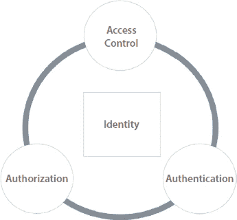

**图 7.1** 身份控制因素、认证和授权直接影响可访问性。

因此，用户将被迫在每一个他使用的网站上重新输入他所有的数据。这项重复的任务既耗时又琐碎。现有系统的一个问题在于它们的集中性质。也就是说，大多数现行系统将用户数据存储在中心服务器上。一旦数据积压，没有人能控制它；更不用说用户了，即使是数据库所有者也不知道数据存储在哪里，谁有权访问它。这使得用户隐私面临最大的风险，因为他的数据可以在任何时间被任何第三方访问，而不会留下任何痕迹。此外，众所周知，集中式服务器容易受到单点故障和黑客攻击等问题，近年来这类问题的数量在急剧增加。

由于上述因素，我们可以得出结论，现有的身份管理系统是脆弱和过时的。存在很多需要修补的漏洞，以提高其效率到所需水平。当涉及到便携性、验证时间以及最重要的隐私等因素时，上述声明的真实性得到了证实。这表明，迫切需要开发一个强大的系统，用户可以在其中安全地存储和管理其身份信息，同时对其流动拥有完全控制权。也就是说，在这样的系统中，个人应该对其数据拥有完全控制权，并能够决定在与他人分享时的“什么”、“多少”、“与谁”和“何时”等因素。

## 7.3 去中心化标识概念

从前面的章节可以看出，将用户信息存储在中央数据库中会增加被黑客攻击的风险。这直接意味着需要通过增加节点数量来去中心化过程。一个可能的解决方案是将数据存储在个人设备上，比如手机。结果呢？将有和手机数量一样多的数据节点——网络分布广泛（图 7.2)！毫无疑问，这为防止数据泄露等行为创造了一个强大的屏障。自行处理和控制身份的想法被称为自主主权身份（SSID）管理[2]，基于区块链技术。

自主主权身份（SSID）的起点是通过在自主主权身份数据平台上注册来生成一个去中心化身份（DID）[3]。这将生成一组用户特定的私钥和公钥。公钥将因维护原因在链上轮换，而私钥则起到保护数据的作用。访问存储信息的唯一可行方式是使用私钥（图 7.3]，只有用户知道。这是一种“无钥匙，无数据”的安排，DID 充当不可篡改的数字水印，定义一个人的身份[4]。除了使用私钥，没有其他方式可以访问或篡改信息。

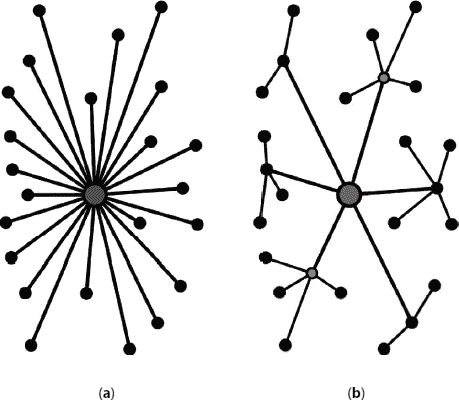

**图 7.2** 集中式、去中心化和分布式网络的图文展示。

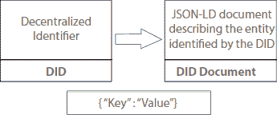

**图 7.3** “关键数据”概念的图文展示。

## 7.4 区块链身份管理系统的工作流程

区块链身份管理系统围绕三组人员展开：发行者、所有者和验证者（^([5] (图 7.4)。每个人都有明确的职责，并且必须以特定方式运作，以确保区块链管理系统的成功。）

最初，希望建立自己身份的人需要向身份发行方提供所有必要的证明。这个发行机构可以是任何像政府或银行这样的可信方，与现有系统非常相似。在验证所产生的数据有效且合法后，发行方将向该特定人员交付一组凭证。这些文件将带有发行机构的加密签名作为证明。一旦交付，这些凭证就落入申请人手中。从那时起，该人成为其唯一“所有者”，发行方不再对其拥有任何垄断权。

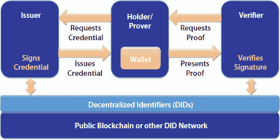

**图 7.4** 区块链身份管理系统的分析视图。参考：Manning 出版社的《自我主权身份活页手册》。

身份所有者现在可以将这些信息，以加密形式，存储在从 DID 发行平台获得的个人数字钱包中[6]。与传统系统不同，这些数据不会在任何其他数据库中可用。此外，如前所述，这些数据将完全处于所有者控制之下，未经其许可任何其他机构都无法访问。因此，当第三方希望验证所有者的身份时，它必须请求所有者提供区块链上存储的凭证访问权限。所有者可以选择是否与验证者分享其密钥，或者忽略该请求。此外，他不必分享自己的全部信息。相反，他可以只分享必要数据，同时保留其他敏感信息。

在区块链系统中，实际存储在链中区块上的信息只是发行方提供的引用和证明。这与现有系统存储人员确切数据的做法相去甚远。例如，在护照案例中，上链的数据仅仅是其正式描述和护照发行机构的加密签名，并非完整的护照信息如全名、护照号码等。因此，拥有者私钥提供的第三方验证者只能看到证明信息，而无法获取护照的详细信息。

这意味着即使对于验证者，所有者的敏感信息也保持未公开。尽管如此，认证过程将会成功完成(图 7.5)。

这个过程与传统身份管理系统的情况大不相同。主要原因是，在后者系统中，如果任何信息对验证者隐藏，那么所有者将被宣布为未经验证。然而，如前所述，在区块链赋能系统中，情况大不相同，因为验证者不是通过验证所有者的实际信息来决定授权。相反，他将根据发证人的信誉因素作出结论。就提到的护照示例而言，这意味着第三方（验证者）将考虑护照发行机构的可信度来声明所有者的真实性。

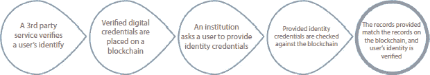

**图 7.5** 区块链系统中的授权过程。

为确保上述所有功能得到满意实施，区块链赋能系统在其后端采用强大的算法。这些程序预计将是平台无关的，以确保最大互操作性。最重要的是，它们必须保护其用户权利，并在法律基础上运行。关注这些因素的区块链系统部署可能会改变我们看待“身份”的方式。主要是因为，届时，我们将拥有一个与现有集中式系统大不相同的以用户为中心的工作模式。当时可能运行的模型将具备以下特征(图 7.6)。

+   安全性

    基于区块链的系统将提供最高级别的安全性和对黑客构成严峻挑战。

+   简约

    基于区块链技术的新型系统只会向验证者披露最必要的信息。

    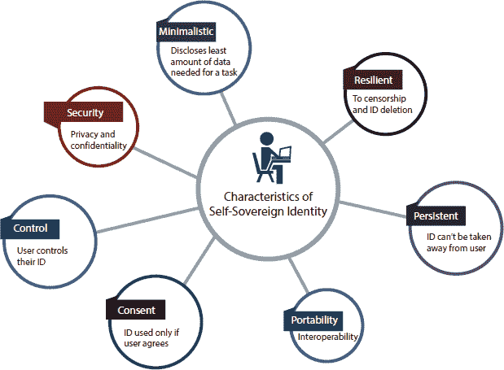

    **图 7.6** 自主主权系统的特征。参考：consensys.net。

+   弹性

    区块链身份管理系统具有高度弹性。它们为每个与身份相关的问题提供了灵活性。

+   持久性

    一旦创建，数字 ID 无法检索或交换。它们总是与同一个人关联。

+   可移植性

    区块链系统不需要用户携带笨重的文件。相反，只需确保他的个人设备连接到链上就足够了。

+   同意

    在这些区块链赋能系统中，验证者需要得到所有者同意才能验证其身份证明。

+   控制

    完全的授权或拒绝访问权将始终完全属于所有者，而其他任何第三方都不能影响他的决定。

## 7.5 它如何促进数据安全？

+   身份标识符（DID）对一个人来说是唯一且永久的，因为它们是不可重新分配的。因此，即使其私钥和公钥；除了所有者自己外，对第三方保持未公开。因此，在区块链系统中，只有所有者能够成功声称他的钱包凭据。这使得区块链身份对盗窃和伪装等问题具有鲁棒性，这些问题在现行的身份管理系统中相当频繁。

+   一旦数据存储在区块链上，如果没有被其节点注意到，就无法对其进行追溯性的更改。特别是，网络数据的更改需要至少 51%的连接点的同意，并需要巨大的计算能力[7]。这个过程在本质上很简单，而且并不普遍支持或鼓励。因此，区块链系统上存储的所有信息都将是不可篡改的，使得其注册的交易防欺诈。更多关于在各种用例中使用区块链技术的原因在图 7.7 中有所描述。

+   如前所述，在区块链身份管理系统中，实际用户信息永远不会存储在网络上。相反，它们将被很好地包含在所有者的个人设备中，如手机或笔记本电脑。因此，即使网络被黑客攻击，用户的个人数据也不会落入未经授权的人手中。这降低了与敏感数据相关的风险，否则这些数据可能会被滥用。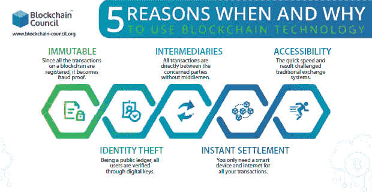

    **图 7.7** 使用区块链系统的优势。参考：区块链委员会。

+   区块链管理系统为每个人提供“同一真相来源”，与当前的身份管理解决方案不同。这意味着，同一个人在任何阶段都不能提交两套不同的文件。例如，他不能声称拥有两个资产，这两个资产的所有者名字略有不同，比如首字母的扩展版。这个限制将对可能的欺诈案件造成严重的阻碍，与传统系统的情况不同。

+   所有者可以使用他在区块链上存储的数据来在多个平台上声明他的身份验证。这避免了在开始使用新平台时重复注册和验证活动，因为用户身份可以根据他在网络上记录的早期活动轻松引用。结果将是一个完善的数字身份，能够追踪一个人所有的在线活动，从简单的到最复杂的。

+   用户在必要时分享数据，以软拷贝形式大大加快了验证过程。同时，它消除了验证者地点的亲自出席需求。这意味着区块链系统确实具有作为单一元系统的潜力，在多个平台之间实现更快速、实时的身份验证。因此，与传统验证方式相比，区块链验证系统的速度构成了严重挑战。支持此机制的全部流程已在图 7.8 中展示。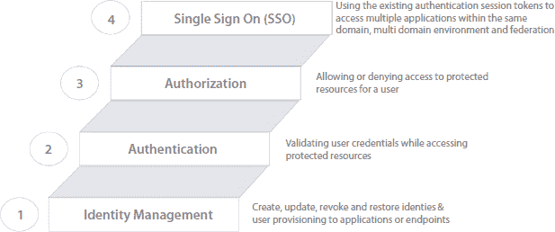

    **图 7.8** 区块链身份管理系统流程。

## 7.6 流行的区块链身份管理项目

有许多组织[9, 10]正准备设计一个功能全面、健壮的区块链身份系统。他们不断努力为人类提供更优质的系统，在解决现有缺陷的同时增加更多价值。以下是一些涉及区块链身份系统及其显著特点的流行项目。

+   Hyperledger Indy

    这是一个开源社区，致力于开发稳定的框架、工具和库，帮助部署区块链系统。在身份管理方面，这个基于 Linux 的项目旨在开发智能合约和数据货币化。

+   Civic

    Civic 是一家位于旧金山的公司，旨在开发一个移动应用程序，以加密形式存储用户的信息。其目的是开发一个平台启用验证系统，这对身份盗窃构成严重威胁。

+   Sovrin

    这是一个非盈利组织，致力于开发自主身份识别系统。然而，在这些系统中，并非所有用户都被允许向区块链中输入信息。相反，只有可信的各方才会被授权这样做。

+   Bloom

    Bloom 是一个完全去中心化的区块链身份管理系统，用户对其数据拥有完全控制权。除了维护全球身份外，它还允许用户赚取星星以提高其信任度等级。

+   SelfKey

    这个自主的数字身份管理系统使用名为“keys”的实用代币来提供平台访问权限。使用 SelfKey，用户可以建立自己的数字身份，然后使用它来申请公民身份或在线公证。

+   每位

    Evernym 是一家位于犹他州的私营公司，开发 Plenum 代码以促进自主身份识别的创建和维护。这个开源代码在伊利诺伊州的试点项目中用于数字化与出生细节相关的注册数据。

+   KYC Chain

    这家数字公司旨在开发一个平台，以帮助简化 KYC 流程。该系统完全以用户为中心，因为它允许所有者使用私钥完全控制其数据的共享。

+   Nuggets

    Nuggets 公司主要专注于提供基于生物特征的去中心化身份验证系统。这是一个基于令牌的平台，提供使用其“nuggets”来开发和维护智能合约的选项。

+   奥地利

    这是一个由西班牙资助的区块链身份管理系统，其运营方式半公开。它基于 Quorum 协议运行，旨在通过请求访问系统，使 Alastria 人民能够利用智能合约开发知识要点。

+   Jolocom

    Jolocom 专注于开发可在多个平台之间无缝操作的数字身份。这家公司开发开源代码，以帮助开发 100%自主的系统，消除对第三方的需求。

+   uPort

    这是一家位于布鲁克林的公司，它开发了一个维护数字身份的应用程序。这是一个基于以太坊的系统，在瑞士楚格进行了试点运行，以帮助创建可作为地址证明的凭证。

## 7.7 撤销的原因和方式

区块链，因其继承性，具有抗变更性，意味着放在其上的内容保持完整。这是使基于区块链的身份管理系统安全和无懈可击的基本属性。然而，在某些情况下，需要定期更新身份凭证。这样一个例子就是基于出生和/或死亡而可能发生变化的家属人数。所以，在这种情况下，我们如何更新已经存在于区块链上的数据？

这个问题解决方案体现在区块链网络上维护的撤销注册表的形式。该账本将存储有关所有者凭据有效性的信息。也就是说，它显示提交的证明是否仍然有效或已过期或已更新。因此，验证机构可以通过查看此注册表来了解所有者凭据的当前状态。这种撤销功能（图 7.9）集成到区块链系统中，有助于维护和尊重与个人身份相关的动态特性。

又是另一个案例，撤销注册表成为区块链身份管理系统中的关键需求是在于存储所有者个人信息的设备丢失或被盗时。此类案例可能会把他的数据置于错误的手中，对他的身份构成严重威胁。然而，通过使用撤销注册表，所有者可以采取两个简单步骤来防止这种情况发生：

1.  作为第一步，所有者预计将取消对他现在丢失或被盗（比如说，手机）设备的授权。为此，他可以使用他的另一个授权设备（比如说，笔记本电脑）在撤销注册表中写下从他丢失的设备召回授权的行为。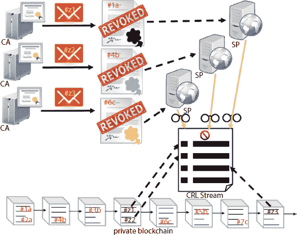

    **图 7.9** 区块链身份管理系统中撤销过程。参考：ceur-ws.org。

    从那一刻起，存储在丢失设备上的所有数字身份都将成为无效。这防止了设备可能落入欺诈者手中时可能发生的身份伪装。

1.  下一步将是回调数字钥匙的授权。也就是说，所有者必须通过宣布它们过时而使它们无效。这将防止现在拥有手机的不受欢迎的人探索所有者与其他设备/组织之间的现有连接。此外，他再也不能使用所有者的密钥与其他第三方建立新的关系。结果，所有者的数据将保持完整，不会被黑客入侵。然而，这当然不会阻止所有者在他的可信网络节点之间使用他的凭据，当然，是通过他没有被盗的设备，在这种情况下，是一台笔记本电脑。

## 7.8 思考点

本节简要介绍了可能由于使用区块链技术管理身份而产生的可能结果。

+   数据货币化

    区块链技术支持的自主性使一个人的身份超越了由边境设定的限制[11]。这与现有的身份策略形成对比，因为现有的身份通常与他们所属的国家相关，仅在该国有效。区块链系统可以利用一个人的抗篡改浏览历史数据有效地发展其数字身份。产生的数字足迹可以很容易地与用户的 DID 关联起来，帮助他主张所有权，例如，从而可以促进个人数据的货币化。

+   经济增长

    目前，大约有 11 亿人口估计没有身份证[12] ^(((图 7.10)。这可能是由于他们无法接触到发证机构，对拥有身份证的忽视，经济状况恶化，教育水平低下，信息不足或地理隔离等原因。无论原因是什么，结果都是无法获得身份带来的好处，同时被剥夺了基本设施。希望区块链管理系统能解决这个问题，因为这部分人口中的大多数已经在使用手机等设备，这些设备可以用来建立他们的数字身份。这反过来将导致经济部门的实质性增长。)

    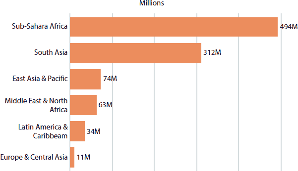

    **图 7.10** 按地区划分缺乏身份证的人口统计。参考：ourworldindata.org。

+   点对点通信

    区块链支持的系统正在实现互联网最初出现的实际思想，即点对点通信。互联网提供商将互联网视为一个平台，该平台将促进一对一的数据共享。然而，随着时间的推移，第三方，即服务提供商，接管了用户之间的数据传输控制。结果，点对点通信的基本原则似乎永远消失了。尽管如此，随着区块链的出现，这个原则有望复活[13]。主要原因是，区块链身份管理系统不需要第三方的存在。用户将是自己数据唯一的责任人，并且只能与他想分享数据的方分享。

+   关注因素

    在区块链身份管理系统中，验证者通过依赖发行者提供的证明来验证用户凭证。在验证时，新的验证者还对其提供的文件进行加密签名。接下来，当其他第三方希望检查用户的凭证时，它根据以前的证词做出决定。链条继续，验证凭证的加密签名数量不断增加。然而，如果这些验证方之一失去信任，整个链条的真实性可能会受到质疑，对所有者凭证的真实性构成潜在威胁。SSID 在我们日常使用案例中能提供的益处总结显示在图 7.11 中。

    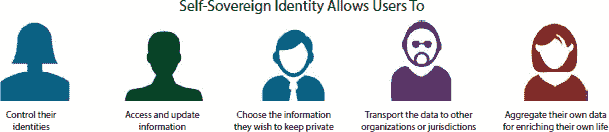

    **图 7.11** 区块链身份管理系统的优势。参考：nec.com。

### 7.8.1 传统身份管理系统与基于区块链的身份管理系统的比较

总结来说，我们可以如下表格化传统和区块链系统的区别；并且，图 7.12 展示了区块链身份机制如何简化供应链中的流程和系统。

| **传统系统** | **区块链系统** |
| --- | --- |
| 基于纸张的系统 | 以数字为导向的系统 |
| 数据将存储在中央数据库中 | 数据将存储在用户的个人设备上 |
| 用户将对自己的数据无法控制 | 用户将完全控制自己的数据 |
| 获得身份相对复杂且维护繁琐 | 获得和维护都相对容易 |
| 制造身份复制品相对容易 | 由于系统具有防篡改功能，身份复制品几乎不可能 |
| 验证需要用户提供实际数据 | 验证不需要实际数据，因为这是一个零知识证明系统 [14] |
| 验证过程繁琐，通常需要亲自到场 | 验证相对容易，不需要亲自到场 |
| 第三方可以未经用户同意访问数据 | 没有用户的同意，没有人可以访问数据 |
| 不支持跨平台功能 | 高度促进多平台活动 |
| 可能容易受到单点故障的影响 | 单点故障的概念没有意义 |
| 身份通常与个人的国籍挂钩 | 提出了超越地理边界的身份概念 |
| 高度容易遭受数据泄露活动 | 对数据黑客和其他恶意行为具有抵抗力 |

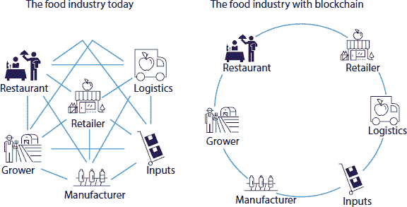

**图 7.12** 传统身份管理系统与区块链身份管理系统的比较。参考：foodtruckoperator.com。

## 7.9 结论

预计区块链技术对身份管理系统的影响将彻底改变身份处理的概念。这些系统基于更灵活的算法，与目前部署的操作机制相比，它们更加先进。这样的系统将基于去中心化的基本概念运行，从而增加隐私并减少数据泄露的可能性——区块链实体系统将维护个人身份的责任交给了自己。用户作为最高权威，可以完全控制自己的数据，并自主决定与分享相关的所有因素。所有区块链系统都基于零知识，其中验证者通过依赖证明者的声誉而不是实际数据本身来验证一个人的凭据。

区块链身份系统通过修补现有类似系统的漏洞，提供了许多潜在的好处。增加了数据隐私，减少了验证时间，减少了欺诈活动，提供了更好的用户控制，消除了中心权威，并消除了多重签名和验证过程的需要，这只是提纲挈领。从宏观上看，区块链系统促进了点对点通信，从而实现了数据可移植性、数据货币化和经济增长。由于这些因素，区块链身份管理系统很可能会以可信模式取代现有的传统系统。然而，为了充分利用这些好处，部署区块链系统时必须大规模进行，并持续关注其行为。

## 参考文献

1\. [`internetofbusiness.com/blockchain-IoT-security-2/`](https://internetofbusiness.com/blockchain-IoT-security-2/)

2. Pakkath, R.,《自主身份：遥不可及的梦想还是触手可及的可能性?》[`www.idaptive.com/blog/self-sovereign-identity-distant-dream-immediate-possibility/`](https://www.idaptive.com/blog/self-sovereign-identity-distant-dream-immediate-possibility/)，2019 年 11 月 14 日。

3. 《区块链在数字身份中的应用》[`consensys.net/blockchain-use-cases/digital-identity/`](https://consensys.net/blockchain-use-cases/digital-identity/)。

4. 《区块链身份管理简介》[`selfkey.org/introduction-to-blockchain-identity-management/`](https://selfkey.org/introduction-to-blockchain-identity-management/)，2018 年 12 月 6 日。

5. 《区块链在身份管理中的应用：终极指南》（2020 年更新版)[`tykn.tech/identity-management-blockchain/`](https://tykn.tech/identity-management-blockchain/)，2019 年 3 月 13 日。

6. Mearian, L.,《区块链如何终结密码？》[`www.computerworld.com/article/3329962/how-blockchain-may-kill-the-password.html`](https://www.computerworld.com/article/3329962/how-blockchain-may-kill-the-password.html)，2019 年 1 月 2 日。

7. Miles, C.,《区块链安全：如何保护你的交易数据？》[`www.ibm.com/blogs/blockchain/2017/12/blockchain-security-what-keeps-your-transaction-data-safe/`](https://www.ibm.com/blogs/blockchain/2017/12/blockchain-security-what-keeps-your-transaction-data-safe/)，2017 年 12 月 12 日。

8. 《区块链如何革新身份管理？》[`www.accenture.com/nl-en/blogs/insights/how-blockchain-will-revolutionize-identity-management`](https://www.accenture.com/nl-en/blogs/insights/how-blockchain-will-revolutionize-identity-management)，2018 年 5 月 28 日。

9. Anwar, H.,《数字身份的区块链应用：去中心化和自主身份（SSI）》，2019 年 10 月 2 日。

10. Kirk, J.,《区块链在身份验证方面的应用：6 个热门项目》，2018 年 2 月 5 日。

11. Pina, G.,《自主身份：将控制权还给乘客》[`www.sita.aero/resources/blog/self-sovereign-identity-giving-control-back-to-passengers`](https://www.sita.aero/resources/blog/self-sovereign-identity-giving-control-back-to-passengers)，2019 年 6 月 20 日。

12. ID4D 数据：全球身份挑战数据，2020 年。

13. Iansiti, M. *等人*.，《区块链的真相》[`hbr.org/2017/01/the-truth-about-blockchain`](https://hbr.org/2017/01/the-truth-about-blockchain)，2017 年 1 月-2 月。

14. Kasireddy, P.,《公共区块链的基本挑战》[`www.preethikasireddy.com/post/fundamental-challenges-with-public-blockchains`](https://www.preethikasireddy.com/post/fundamental-challenges-with-public-blockchains)，2017 年 12 月 13 日。

1.  *电子邮件*: abhib.work@gmail.com
