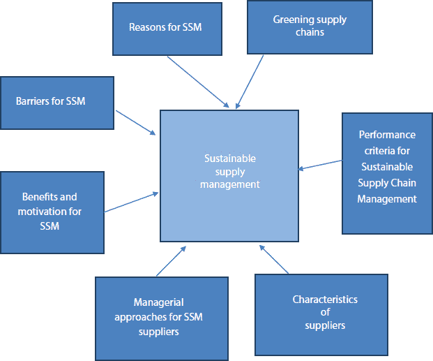
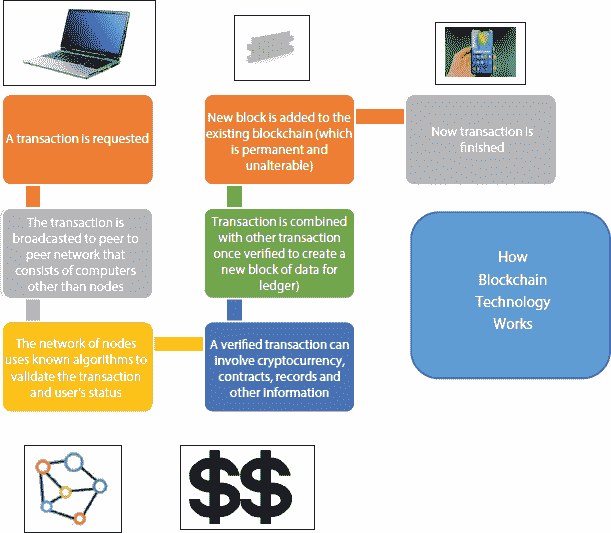

**9**

区块链增强型供应链管理系统

**Sonal Pathak**

**计算机应用学院，曼纳尔·拉钦国际研究与学习学院，印度法里达巴德**

**摘要**

在组织资产的价值中 - 区块链技术如今被认为是有价值的。任何交易在信息库和数据库的事实性、可靠性和所有参与者的同意下都是可能和成功的。在网络管理的帮助下，它可以转换为跨组织透明、安全且易于使用的格式。市场数据需要与技术进步一起受到保护和验证。一个可靠的分布式账本有助于通过解决定义单独和多个账本的问题来连接供应商、市场、组织和消费者。数字货币与区块链相关联。在供应链管理中，区块链和数字货币有各种类型的应用。供应链网络中需要管理许多参与者。在智能组织的供应链网络中，可以开发数字账本来通过区块链管理所有参与者的实时交易和活动。在第九章中，作者讨论了区块链和数字货币在供应链中的应用，以获得更好的结果。本章的目的是评估区块链的适用性，并为研究人员和实践者提供基础，以便将未来的项目方向引导到改进应用和技术上。本章还描述了智能合约和账本如何帮助管理从采购到支付的高价差距。

**关键词：**区块链，智能组织，数字货币，数字账本，交易信息，金融安全，数字合同，供应链管理

**9.1 引言**

通过区块链技术，可以创造社会和经济系统的新途径。可以认为区块链是物流、制造和供应链行业带来巨大变革的游戏规则改变者，这些行业看似透明但复杂。使供应链解决方案得以实现并大幅降低供应链行业成本、提高效率的区块链技术已被广泛应用。供应链的复杂性使得供应链流程变得有些复杂。供应链中的许多阶段和长时间涉及大量支付和发票、地理位置、人和实体，这取决于所涉及的产品。

但变革性信息不应干扰工具的简洁性。在供应链管理中，区块链可以帮助实现权力的去中心化和无偏见。所有活动都将记录在账本上，每个参与者都将拥有数字账本的副本[8]。通过在多个战场上最优化地利用资金、时间和努力，可以获得利益，并可以重构业务。如果公司系统中存在任何欺诈或欺诈行为，它将与生态系统的其余部分不同步。在采购过程中，通过区块链还可以实现更多的节省和可见性，数字支付和合同也可以增强财务安全。

### 9.1.1 供应链管理

在 20 世纪 80 年代末，出现了“供应链管理”这一术语，适用性在 20 世纪 90 年代出现。在那之前，商人使用的是“运营管理”和“物流”这些术语。以下是供应链的几种定义：

供应链是公司将产品或服务推向市场的企业联盟（Lambert、Stock 和 Ellram）[11]。

+   供应链包括所有直接或间接参与满足客户请求的阶段。供应链不仅包括制造商和供应商，还包括运输商、仓库、零售商和客户本身（Chopra 和 Meindl）[7]。

+   供应链是由设施和分销选项组成的网络，执行采购材料、将这些材料转化为中间产品和成品以及将这些成品分发给客户的功能[12]。

因此，供应链可以被解释为我们通过影响供应链的行为来达到结果的事情。旧的业务角色和跨供应链以及公司内部的策略协调被称为供应链管理。通过供应链—协调供应链中所有参与者的产品、库存、位置和运输的过程，以达到市场的效率和响应性的最佳组合，从而实现改进和长期的个人和公司的目标。

供应链管理概念与传统运营管理概念之间存在差异。运营管理通常指的是发生在组织边界内的活动。供应链指的是协同工作并协调其行动以将产品推向市场的公司网络。此外，传统运营更多地强调诸如采购、维护、分销和库存管理等活动。供应链管理认可传统运营管理，并涉及新产品开发、市场营销、客户服务和财务等活动。为了满足供应链参数，这些创新性额外活动已成为该链条的一部分，以提高工作效率并满足客户需求。

在供应链管理参数的观点下，组织和供应链被视为单一实体。它为处理所需协调不同产品和服务的各种活动提供了一种系统方法。这种系统方法促进了最佳适配框架，在该框架中，过于复杂的业务需求可以通过照顾不同供应链的不同需求来有效地处理。适当的协作和供应商关系是成功和可持续供应链的成功秘诀。根据 Brammer 和 Walker 的讨论，影响可持续供应链管理最频繁出现的因素是供应商和组织之间质量和深度的关系[4]。根据 Pagell 和 Wu 的说法，最佳实践和可持续供应链管理的一个重要组成部分是各个供应商之间的合作[17]。可持续供应链管理的描述已在图 9.1 中展示。

影响供应链管理并使其更加可持续的各种参数包括——供应链管理的管理方法、供应商的特征、供应链管理的绩效标准、供应链管理的利益和激励因素、供应链管理面临的障碍、绿色供应链以及提高供应链质量的其他原因。Simpson 和 Power 讨论了，为了执行业务流程，供应链成员之间的协作是一个必不可少的步骤[21]。

**图 9.1** 可持续供应链管理。

一些供应商发展计划是创新的环境设计、联合减少浪费的方法、开发环保技术、为可回收产品而进行的协作努力以及减少有害废物。陈和保罗提出了一个观点，即所有在传统供应链管理理论中使用的概念现在都被用作可持续供应链管理理论的特权实践[6]。作者还强调了传统供应链管理与现代研究中伙伴关系必要性的区别研究人员进行了一个书包制造公司的案例研究，发现在整个供应链过程中应用逆向物流或回收技术可以减少产品交货期，而供应商合作可以提高销售和生产效率与基于权力的合规伙伴相比，供应链参与者之间的信任是强制性的。布洛姆得出结论，有效的可持续供应链管理实施可以通过强大的伙伴关系和协作实现[3]。然而，在关系管理中，合规也被认为是一种负相关的做法。

根据朱*等人*的研究，管理文献中提到的将可持续性扩展到供应商的实践，供应商发展计划可以被开发出来以提高供应商的绩效[30]。此类计划的例子包括：

+   对供应商的评估，

+   供应商之间的协作

+   对供应商的培训。

为了成功实施可持续供应链管理，供应商必须变得更加社会和环境负责。到目前为止，许多研究者已经确定了评估协作关系深度的方法，但仍有很多研究空间来分析 SSCM。到目前为止，很少有研究能够评估如供应不平衡等协作。在公司的全方位成功中，可持续采购发挥了重要作用，而它应该扩展到所有利益相关者，而不是仅在组织内部实施。在管理文献中，最被认为有效的方法是真正的供应商之间的协作；然而，其适用性是困难的。大部分研究都考虑了大型企业，其中供应商是中型和小型企业（SME）。因此，为了实现大公司与小型公司的真正协作，可持续实践是必要的[14]。

对于一个大型企业来说，可持续性的概念在供应链管理方面是相当理解和广泛的。在动态的商业环境中，供应链可持续性管理（SSCM）包括基于环境、经济和社会方面的供应链整合视角。为了向客户提供价值主张，以及供应链盈利能力和 SSC 实践的成功实施，需要所有利益相关者之间的协作，以及资源、资金和信息的最佳利用。

温特和克内梅耶尔讨论了，该领域的研究人员应识别研究机会，并定期深入文献。供应链可持续性管理（SSCM）的各种视角，如经济、社会、治理、环境和绩效测量，应在当前的 SSCM 研究中得到更多关注。当前的研究还集中在对 SSCM 的实证和定量建模方法。已经确定了阻碍和促进大型组织实施 SSC 实践的参数。需要进行更多研究以实现供应链背景下三重底线的范畴，并增强社会视角。建模方法需要在不同行业中进行，并在更现实的决策环境中进行，以充分理解和整合 SSCM 实践 across industry [27]。

## 9.2 区块链技术

一个去中心化、开放式的分布式账本，是一种软件机制，能够高效且永久地记录所有交易（KariKorpela, Jukka Hallikas）[9, 10]。它为交易和可信资产提供了支持，而无需中心服务器和中心信任的干预，使得供应链管理中的所有合作伙伴之间的价值交换成为可能。

特伦特·麦康纳希和罗道夫·马奎斯讨论了，借助分布式账本、不可篡改的加密记录和区块链启用的智能合约，可以降低生产成本、提高运营系统，并在全球范围内揭示新的商业机会[24]。区块链是参与者共享的所有数字活动的记录公共账本或数据库。克罗斯比等人描述了大多数参与者对其数字账本中的每一笔交易给予同意，并且每笔交易的共识都得到保证。存储在各种资金都会在其网络上通过区块链技术进行验证。

皮尔金顿（Pilkington）探讨了不与任何组织关联且网络控制权分布在所有参与者手中的区块链，这被称为公有区块链。为了验证每笔交易，矿工执行验证过程，他们使用特别设计的设备或计算机进行操作。这些矿工以数字形式获得奖励；这可能是一个预定义的比特币或其他任何加密货币。区块链可以字面上解释为块的链条，这些块代表按顺序持有的数据（如图 9.2 所示）。如图 9.2 所示，区块链可以数字方式连接不同的各方共同工作。

每个块代表存储为数字签名（金额、日期、时间）的数据。这些数据揭示了交易的信息，并且每个块在存储的信息方面与链中的其他块不同。每个块中的信息被分配了一个独特的代码，称为“哈希”。我们也可以将区块链想象为一个账本，因为大多数区块链实际上都是这样运作的。每个数据块代表账本上的新交易，无论这意味着合同、销售还是其他任何使用账本的事项。区块链是交易记录。使用区块链的个人或公司可以验证并执行这些交易。这些都是关于区块链技术的重要概念。随着挖矿能力的增加，计算的复杂性也随之增加，以保持编写特定块文本所需的时间不变。

**图 9.2** 区块链应用示例。

区块链是一种协议而非单一技术。这是一种执行所需事项和记录任何交易的方法。与互联网不同，区块链的所有权可以转让给另一方。有许多原因使区块链成为一种理想的技术。在不同的货币兑换团体相互交易的情况下，区块链可以消除对协调分割器的需要。它还消除了中心权威的角色；他们的支付成本也将被消除，账本的精确性可以通过所有用户的分布来维护。所有交易都可以通过计算机访问和监控，这使得透明度提高，并使区块链成为“自我监控”的。

通常，区块链技术的主要特点和优势如下：

1.  (i) 透明度：由于区块链采用分布式共识的概念，数据透明度得以保持；其所有用户可以阅读整个活动历史，使过程完全透明。

1.  (ii) 可追溯性：通过时间戳记录，可以有效地获取信息的历史。

1.  (iii) 安全性：由于发动网络攻击的难度较大，分布式账本中的数据安全性得到了显著增强。

1.  (iv) 效率：由于不需要中心化数据库，因此可以实现去中介化。由于不需要一个可信赖的中介（如银行）来维护数据库，因此处理时间和成本也显著降低。

1.  (v) 保密性：这是令人担忧的一个方面，因为网络上的每个参与者都能查看所有的活动，因此数据的保密性难以管理。虽然区块链的去中心化账本中保持了透明度和安全性，但并未维护保密性。因此，在 BCT 中，高级加密技术和伪匿名地址被用来保存用户数据和隐私。

1.  (vi) 不可变性：在 BCT 中，由于数据的完整性，审计成本也大幅降低，因为一旦区块链系统验证了一个活动或交易，它就无法再被修改或撤销。

1.  (vii) 增加创新：对去中心化架构的创新将提供大量新的机会来创建专业的新用途。智能运输者可以被挖掘并帮助产生利润。

1.  (viii) 客户参与度：通过使用区块链数据库，可以建立更优的交货时间表，使零售商对生产和运输的跟踪更加方便。通过这种数据共享，可以培养更深的忠诚度和客户关系，达到一个新的透明度水平。

这些特性可以总结为两个关键方面：透明度和不必要的方的移除。因此，在 BCT 上做出的决策对于确保商业成功至关重要。

## 9.3 供应链管理中的区块链技术

在之前的章节中，我们详细讨论了供应链管理的概念和区块链的基础知识。现在我们可以讨论区块链在供应链中的使用。区块链由于其去中心化特性而具有巨大的可扩展性和效率。由于所有区块都相互关联，交易在所有节点上执行，因此它更加安全和透明。因此，区块链可以用来提高供应链的透明度和效率，从仓库到交付的所有活动都受到这种技术的影响。为了有效地管理供应链，区块链技术中使用了一系列内置命令。由于所有链实体对交易都有相同的账本，因此链中没有冲突。区块链记录不能被删除，这是维持供应链透明度的关键因素。

在他的论文中，Ahmed Farah 讨论了以比特币形式出现的区块链技术，为供应链管理增加了新的管理方式。这种方法依赖于从比特币的角度来看供应链过程的成功。BCT 逐渐在各种目的上运行，无论是私人的还是公共的，并增加了客户的满意度和信心。本文突出了新数字世界的机遇和现代技术面前的挑战。本研究旨在检查区块链技术的当前理论和研究框架。实证研究旨在识别材料性对信用风险建模特定问题的可衡量影响，在更广泛的区块链范式内。为了纳入 BCT 效果的测量和在技术领域内，这对公司成长的显著影响。由于使用数字账本，还可以突出经济问题，并解释财务困境[1]。

在他们的论文中，Nordgren 等人建立了区块链技术因 2009 年比特币的出现而广为人知，并作为一种颠覆金融服务行业的技术而获得了很多炒作。在英国脱欧之后，英国边境问题可能通过使用区块链技术得到解决。尽管区块链开发者承诺提供交易的安全性和速度，但与区块链功能相关的问题仍然存在。

区块链技术可以被称为我们这个时代的互联网或颠覆性技术。区块链技术已经重塑了会计和金融领域。通过解决与区块链技术相关的问题和批评，可以提高区块链技术的潜力[15]。

Kiwillinski 讨论了 BCT 对供应链管理价值的重要性。区块链块提供的信息更可靠、更透明。只有在所有参与者的同意下才能进行交易。借助网络，交易可以在群体之间透明、安全、轻松地格式化[9]。区块链与供应链管理的结合具有以下好处：

+   快速高效的在线交易

+   可以使用智能手机应用程序进行账户续订。

+   虚拟数据识别系统

+   整个过程允许改变。

Babich 和 Hilary 描述了 BCT 和 SCM 的应用仍然非常少，并且很少有案例可以观察到[3]。BCT 只在金融部门得到充分利用。供应链管理和 BCT 在金融领域的核心价值是它们适用性的基础差异。信息安全性是金融应用的核心价值，而 SCM 应用的核心价值是系统可追溯性透明度。

通常，可以采用以下三个方面来应用区块链技术在供应链管理中

+   智能合约

+   去中介化

+   信息不对称。

我们将扩展那些将激励我们建模假设的特征。由于 BCT 的透明性特征，文件处理（例如交易、清关、运输、质量检查）将被移除，这将显著提高商业效率。从这个角度看，我们可以认为供应商的成本可以通过采用 BCT 来降低。智能合约是 BCT 的知名应用之一。当满足预定义的条款和条件时，智能合约将自动执行并验证每个供应商。

潜在的智能合约应用之一是在艺术领域。例如，我们可以讨论音乐产业，艺术家和作曲家可以借助两方之间的智能合约自动实时获取版税。相应地，考虑到智能合约，高质量的供应和生产可以得到提升。通过 BCT 的功能，可以关注信息不对称问题。关于服务或产品的信息通常在消费者和卖家之间是不对称的，这种情况由第三方监督和认证，是最佳可能的解决方案。

吉安纳卡斯讨论了关于有机食品的属性信任的一个例子，顾客将无法区分传统食品和有机食品。此外，传统食品的生产成本显著低于有机食品。由于消费者在没有了解食品类型的情况下会为任何类型的食品支付费用，这可能导致有机食品供应商的损失，并且没有激励去供应这类食品。最终，有机食品市场可能无法增长。在这种情景下，只有第三方或许可以标记认证（例如美国农业部&食品药品监督管理局）通过向消费者提供必要的信息来刺激有机食品市场，这是这个问题的唯一解决方案。

罗素和弗兰肯报告称，消费者对环境友好、社会和生态健康的产品的兴趣更大。一份报告称，消费者愿意为某些高质量产品支付 25%的价格溢价，即使没有信息提供。区块链技术有助于生成有关供应商的信息，并帮助消费者确保有关高质量产品的信息。[20]。如果实际的信息关于高质量生产的环保健康效应可以透明地达到消费者，价格溢价可以达到最高。与传统渠道相比，通过区块链可以实现更大的透明度。如果财产滥用和腐败成为问题，这是可取的。例如，基于块的资产可以用于提供公用事业基金；甚至可以识别出获得补贴的最后一批收件人。目前，公司之间的交易导致了一种“四重记账”类型，其中每个公司自动进行双重记账，理论上两组输入值相等。这种模型可以通过区块链进行重大修改。

通过在区块链上进行直接输入，可以消除任何供应链或公司的内部墙壁，所有交易都可以通过簿记 authentically、truthfully 记录到每个当事方。通过区块链元素，供应链变得更加可行。当供应链的循环数据经历各种转变时，区块链上的交易是安全且不可变的。满足不同复杂需求可以实现相同的目标。一种机制可以增加可变性并确保交易保密性得到支持，防止或阻止任何恶意方参与供应链，篡改或非法修改支付和发票信息。

因此，在供应链的情况下，必须通过机制保护交易的不可变性和机密性。区块链技术为管理安全问题提供了可行的解决方案，通过提高产品透明度和完整性来改善问题。

影响供应链与区块链技术结合的因素如下总结：

+   性能：供应链中的流程和行动更容易受到欺诈和人为错误的影响，这降低了性能。在区块链系统中，所有活动都以电子交易的形式展示。因此，执行变得更快，性能将得到提高。

+   可扩展性：一个去中心化和网络良好的数据库通过促进参与实体和改进连接，提高了区块链的可扩展性。因此，所有供应链数据都存储在账本和建立的点对网络中，消除了任何单一故障点。

+   共识：通过在账本中使用此机制，区块链确保数据的不可变性。它维护网络节点以保持和更新有关所有提交交易的信息。在交易中维护订单接收的时间戳和交易金额。

+   位置：区块链技术的属性和功能不受用户地理位置的影响。因此，由区块链启用的供应链范围可以跨越全球，允许参与者在全球范围内提供服务和产品，并开展他们的业务。

+   隐私：区块链在数字账本中维护用户的隐私，其中包括不可变信息。在公共区块链中，提供伪匿名性，其中任何用户都可以通过新的地址共同工作，而不向账本透露他们的真实身份。

+   成本：加密货币技术在区块链技术启用的供应链系统中大幅降低了成本。加密货币提高了交易处理速度。数字交易提高了效率，使工作流程更快。

## 9.4 影响供应链的区块链要素

如我们迄今为止所讨论的，在供应链中，最初的步骤是提取自然资源（原材料）并将其运送到下一阶段。产品通过供应商和分销商预处理后，运送到下一阶段。在准备好销售的产品从原材料中产生之后，准备好的产品就与分销商准备好，他们将进一步向像零售商和批发商这样的中介分发建造好的商品。

在与供应商建立联系之前，分销商已经维持了一个活跃的库存。随后，批发商没有直接向公众销售产品，而是将其销售给其他零售商，而零售商则将购买的产品处置给最终用户。最后，消费者是购买或接收个人需要或使用的商品或服务的人，而不是为了转售或贸易的商业目的。在供应链的整个过程中，会产生许多交易并转移到标准供应链的下一阶段。

图 9.3 展示了将区块链技术与供应链功能相结合，每个步骤都发生交易。每个交易在概念上与供应链中不同参与者相关联，这些参与者在一个区块链网络上进行互动。每个参与者根据完成的活动以特定的方式向区块链网络提交交易。在原料步骤中，预处理天然资源的供应商正在向账本提交关于最初过程的交易。这些交易包括标签，如原料名称、数量、质量、地理起源等。一旦原料开始向制造商的旅程，适当的交易就会被提交。

**图 9.3** 区块链支持的供应链中的交易管理。

实现区块链支持的供应链模型的步骤/算法。

1.  步骤 1：识别将区块链整合到供应链中的经济、推动和可靠性元素。

1.  步骤 2：识别技术、操作和组织方面。

1.  步骤 3：识别将区块链整合到供应链中的阻力因素和文化障碍。

1.  步骤 4：设计一个框架并验证同一框架以涵盖区块链支持的供应链管理过程。

在任何时间点，网络各方成员都可以验证他们产品的关键细节，包括产品的原料来源和具体的原料。同样，制造商通过区块链和物流下一链参与者进行持续的互动。从概念上讲，这是供应链中的不同参与者在一个区块链网络上进行互动的方式。各方可以在特定的方式下向区块链网络提交交易。同样，在每个交易步骤中识别标签，并继续执行下一个步骤。在每个步骤完成后，提交包含新标签信息的新的交易，如制造商的现场经验、名称等，直到产品交付给分销商。这个过程通过区块链交易展示重要数据标签，如商家和客户地址、交易金额、产品原料质量等。

最后，最终产品将通过提交交易（包括适当的标签）被终端用户接收，并从供应链产品的旅程开始验证每个标签的方面 [28]。

表 9.1 总结了不同的供应链参与者和他们的当前限制以及区块链技术采用如何影响供应链。

目前供应链是一个非常庞大的供应链，其中不同的各方需要进行协调。许多供应的产品需要通过多个中介，与传统的 OEM（原始设备制造商）和供应商网络不同。产品生命周期已经缩短；供应链的运营和动态能力得到增强。企业仍需要通过使供应链管理传统方式与区块链相结合，并在其流程中整合区块链的潜力，从而将业务拓展到全球范围。

**表 9.1** 供应链参与者、当前面临的局限性以及区块链影响。

| **供应链参与者** | **当前局限性** | **区块链影响** |
| --- | --- | --- |
| 生产商/原材料 | 产品的来源和质量指标没有被证明是透明和全球性的 | 终端消费者因增加了对价值链的了解和追踪生产原材料的能力而受益 |
| 制造商 | 监测产品直到最后阶段的能力有限。评估质量措施的能力也有限。 | 由于共享信息系统，原材料供应商和分销商之间的网络得到了加强。 |
| 分销商 | 定制跟踪系统协作能力差，缺乏信任和认证问题 | 由于所有信息已注册在账本中，因此可以提供状态证明认证和位置信息 |
| 批发商 | 产品路径的认证和信任不足。 | 验证商品的转变/运输条件和原产地信息的能力 |
| 零售商 | 产品路径的信任和认证不足 | 批发商和终端消费者之间的每个产品都可以追踪。成功管理故障产品退货的能力 |
| 消费者/终端用户 | 对产品合规性来源的信任有限，尤其是关于质量和产品规格的履行 | 可以透明地了解产品从原材料到最近采购产品的整个旅程 |

在新兴商业应用中，区块链技术将带来的主要应用包括众筹、智能合约、治理、共享经济、供应链审计、文件存储、预测市场、物联网（IoT）、社区微电网、客户身份验证（KYC）、反洗钱（AML）、身份管理、金融机构审计跟踪、数字身份、代币化、股票交易以及土地登记，区块链使交易更快：

1.  a) 各方之间立即管理支付，无需第三方干预，

1.  b) 账本自动更新

1.  c) 双方同时执行交易。

实施区块链增强型供应链管理的企业如下：

+   通过区块链验证实现更清晰的结算条款

+   TBSx3——防止假货，提高透明度。

+   弗莱网络——增强供应链的数据跟踪。

+   英国航空公司——使用区块链解决冲突的航班数据。

+   沃尔玛——让员工能够看到食品的来源。

皮斯奇尼讨论了，为了增强供应链上的合作伙伴关系，通过拥有智能合约和去中介化，运营效率可以得到大幅提高。需要更多的研究来增强网络的可扩展性和扩展性，以及兼容性和多个区块链的集成也应该被探索[18]。

背后的逻辑是，一旦一家公司决定向其潜在供应商披露更多的产品信息，它更有可能找到一个能提供更优产率的好供应商，反映出可靠的供应和高品质。区块链技术“工作量证明”概念提供的可追溯性克服了供应链参与者之间的信息不对称问题。考虑到熟悉区块链（或，广泛地，熟悉技术）的消费者，我们假设 BCT 的采用可以提高随机需求——采用程度越高，需求越大，在随机意义上。

通过采用 BCT 工具，可以解决信息不对称的问题。许多研究表明，信息的可获取性和真实性是创造繁荣的权威商品市场的两个主要力量。从这个意义上说，我们认识到 BCT 可以在整个供应链中披露数据的同时，证实其有效性，是最安全的解决方案。佐特揭示了供应链参与者如何帮助设计一个具有区块链功能的供应链。在个别公司的第一层次，常常研究业务模式，但也可以用一个全面的思考框架作为系统变革的一部分，因为技术创新导致工业和结构的变化[29]。

津本茂对“平台”和“生态系统”的概念与业务模式进行了研究。在供应链的合作伙伴中，应该清楚地研究生态系统的构建，以报告相互依赖和互联互通。在政府机构和技术服务提供商等技术促进者的帮助下，供应链参与者能够增强以打败竞争对手。平台的概念往往被当作业务生态系统的一个子系统来处理[25]。

区块链技术的颠覆性影响要求供应链参与者重新思考他们业务模式的多方面以及治理问题。迪斯还就业务模型提出了一些观点。价值创造、捕获机制、交付机制的结构也应该用于成功的 BCT 供应链。在现有的供应链管理中，第一步是确定“痛点”。需要为联盟和最佳时间通过迭代过程部署区块链技术，然后决定进入点。技术和关注点围绕被称为比特币的加密货币模型，因此，在下一节中，我们讨论比特币的基本概念[26]。

### 9.4.1 比特币

加密货币的繁荣将注意力带来了区块链。最突出的加密货币类型是比特币，它是区块链的主要角色，并引入了共识机制和金融服务中介，这有助于增强信任。然而，这种观点不应该仅仅局限于其货币属性。如今，区块链技术正在社会所有领域产生影响，并吸引人们关注区块链的基本价值：值得信赖、去中心化、集体维护、开源数据库和可靠，区块链的应用在生活的所有环节都在扩大。人们用化名中本聪创建了一种名为比特币的在线货币。他们在 2008 年底提交了他们的白皮书，并在 2009 年初介绍了第一段代码，中本聪使比特币成为一种电子货币，可以发送给同伴，而无需中央银行或其他权威机构来使用和修改账本，更不用说它是如何使用虚拟货币的。很快比特币成为最有效的金融交易方式，比特币提案解决了许多传统或其他会计方法的问题[2, 22]。

使用了比特币账本的技术被称为区块链，这个词现在用来指代所有被广泛传播的糟糕的账本技术。最初和最大的区块链是那个持续在比特币交易中产生的。有些工作是为几百个“山寨币”服务的——一些同样的货币项目有不同的规则——以及不同的系统，比如以太坊或瑞波币。在全球记录系统中，一种具有潜在颠覆性且技术含量低的技术——比特币，因其几个独特且简单的特性，吸引了金融行业投资者的关注。比特币的作用是支付矿工——这为发送新交易创造了有吸引力的基础工作——以新创建的比特币[13]。

区块链应用了最初为比特币设计的机制。为了控制通货膨胀，还自动调整了航运困难。矿工被激励去创造新工作，而不是转向不同的较小群体，奖励也被部署到最古老的现有链上。但是，直到所有参与者都同意安装它们，比特币客户端的新更新的有效性一直是一个挑战。以下是吸引更多比特币用户的一些原因：

+   支付方的低成本

+   自从货币的诞生以来，会计一直在稳步增长。

+   与传统银行相比，该系统受到更多限制。

比特币没有“了解你的客户”或身份要求——任何有互联网连接的人都可以加入并开始接收和发送比特币。虽然这使得系统更便宜、更易访问，但它以与纸币相同的方式吸引着罪犯，Silk Road“黑网”市场在 2013 年 10 月被 FBI 关闭之前广泛使用比特币。比特币没有与国际边界相关的问题，因为它是基于互联网的货币。比特币不会受到不同方位置的影响。许多区块链项目正在考虑筹集资金，包括国际中央银行发行的支付应用程序 Ripple。

## **9.5 区块链供应链实施的挑战**

尽管区块链技术可以革新供应链，提供许多服务，并可以评估自动、高效且更可靠的系统，但在供应链中使用这项技术也有一些缺点[23]

1.  a) 区块链技术高度依赖互联网。因此，落后的基础设施可能会起到破坏作用。同时，高级别的网络安全是必须的。

1.  b) 会计和审计受到法律的严格约束。因此，为了确保区块链会计的全面利益，还需要制定适当的法规。过程必须得到启用，以便任何法规的变更都能立即得到采用。

1.  c) 区块链容量：要建立一个紧密的网络，我们需要很多轨道。问题是，这些轨迹中的每一个都必须基于区块链。

1.  d) 另一个挑战是，供应链参与者需要确定一个由多个玩家共同创造价值和共享/捕获利益的空间。由于业务性质和供应链网络中的相对“位置”，不同的联盟成员往往有不同的优先事项，有时甚至目标冲突（O'Byrne）[16]。

## 9.6 结论

我们可以说，在当前情景下，区块链可以被视为一项婴儿期的技术。原本人们认为这项技术将遵循比特币加密货币的基本原则运作，但后来在其设计中增加了几项措施以提高其全球知名度。因此，算法研究者、密码学家和计算机科学家不断地进行活动，以逐步发展区块链技术。这项技术不仅仅被用于数字支付，但这项基本技术有潜力改变供应链几乎所有重大活动。供应链的重要方面，如可靠性、金融差异化、灵活性以及网络技术，这些是供应链的基本参数，在当前概念框架下同样适用。

然而，除了区块链的技术挑战外，社会影响以更加鼓舞人心的方式被遇到。在 BCT（区块链）对供应链绩效及其设计的影响方面，需要更多的创新。我们不能仅仅考虑一家普通公司，它从供应商那里采购产品，然后销售给技术熟练的客户，以此作为评估 BCT 在供应链中成功与否的标准。但我们应当分析这种技术在上游供应链和下游客户中的采纳情况。任何公司都希望通过共同管理——订单和生产设计、区块链设计和动态定价以及销售，来最大化总利润。

可以包括这样的观点：BCT 的部署可以帮助公司降低销售价格，减少订单数量，最小化目标库存水平。一些特殊类型的经验商品和信誉商品通过采用 BCT 而受益，但其他（搜索商品）可能不会证明有益。考虑到典型经验商品的生命周期，我们建议尽可能早地采用 BCT，并且在更高程度和更早阶段采用。

这种早期采用有助于更深入了解 BCT 在供应链管理中的良好服务。经过某些修改，我们的框架和解决方案的想法也可以应用于其他场景，特别是在采用新的供应链管理技术时，比如云计算、物联网、人工智能等。BCT 为供应链管理中的各种场景提供了一种具有颠覆性和最先进水平的企业解决方案，特别是对于那些服务于潜在技术熟练消费者的企业。尽管我们已经努力考虑了 BCT 的主要特征，但还有一些其他吸引人的因素需要考虑以丰富研究。作为一个潜在的未来研究项目，区块链技术可以显著缩短交易的前置时间，同时加快信息处理时间和文件处理时间。从财务角度来看，通过在其供应链网络中利用加密货币生态系统，现金流可能会变得更快，甚至即时。在这种情况下，研究 BCT 对流程加速的影响将是有趣的。将来，不同公司甚至不同行业的区块链解决方案将能够无缝地相互通信和共享数字资产。

总之，区块链可以改变供应链、行业和生态系统。有趣的是，即使是看似会失去优势的组织，如银行和政府，也可以看到利用区块链简化自身业务的机会。当然，供应链的深度变革不会立即发生。然而，供应链可以从现在开始使用区块链处理其运营的小部分。智能合约可以帮助消除由于手动处理文件而目前经历的昂贵延迟和浪费。此后，从一端到另一端的大门将打开，迎接更智能、更快、更安全的供应链。

## 参考文献

1. Ahmed Farah, N.A., 区块链技术：分类、机遇和挑战。*国际研究期刊工程技术*，05，05，3423-3426，2018。

2. Ganeshan, R. 和 Harrison, T.P., *供应链管理简介*, 由 Sementic Publishing House 在伦敦出版。 [`silmaril.smeal.psu.edu/supply_chain_intro.html`](http://silmaril.smeal.psu.edu/supply_chain_intro.html), 1995。

3. Blome, C., Paulraj, A., Schuetz, K., 供应链协作与可持续性：轮廓偏差分析。*国际运营生产管理*，34，5，639-663，2014。

4. Brammer, S. 和 Walker, H., 公共部门可持续采购的国际比较研究。*国际运营生产管理*，31，4，452-476，2011。

5. Babich, V. 和 Hilary, G., 分布式账本和运营：操作管理研究人员应了解的区块链技术？*制造服务运营管理*，12，1-32，2018。

6. Chen, I.J. 和 Paulraj, A., 向供应链管理理论迈进：构建和测量。 《操作管理杂志》，22，2，119-150，2004。

7. Chopra, 和 Meindl, 《供应链管理：战略、计划和运营》精要，在《供应链管理：战略、计划和运营》中，Prentice-Hall, Upper Saddle River, NJ, 2001。

8. Haber, S. 和 Stornetta, W., 如何为数字文档打时间戳。《密码学杂志》，3，2，99-111，1991。

9. Melnychenko, O. 在经济活动控制系统中的应用人工智能。 《虚拟经济学》，2，（3），30-40，2019。

10. Kari, K., Jukka, H., Tomi, D., 朝着区块链集成的数字供应链转型，在《第 50 届夏威夷国际系统科学会议》论文集中，2017。

11. Lambert, Stock, Ellram, 《物流管理基础》，Irwin/McGraw-Hill, Boston, MA, 1998。

12. Mentzer, J.T., De Witt, W., Keebler, J.S., Min, S., Nix, N.W., Smith, C.D., Zacharia, Z.G., 定义供应链管理。《商业物流杂志》，22，2，18，2001。

13. Miguel, C. 和 Barbara, L., 实用的拜占庭容错机制。《操作系统设计与实现》(OSDI) 99，173-186，1999。

14. McCluskey, J., 有机食品的游戏理论方法：对不对称信息和政策的分析。《农业资源经济学评论》，29，1，1-9，2000。

15. Nordgren, A., Weckstrom, E., Martikainen, M., Lehner, O.M., 金融和会计领域的区块链：一种颠覆性技术还是一个被过度炒作的现象。《牛津金融风险观点杂志》，47，47-58，2018。

16. O’byrne, R. 供应链与区块链第二部分 - 让它工作。在线可用[`www.logisticsbureau.com/supply-chains-blockchain-part-2-making-it-work/`](https://www.logisticsbureau.com/supply-chains-blockchain-part-2-making-it-work/)，2018 年 3 月 27 日。

17. Pagell, M. 和 Shevchenko, A., 为什么可持续供应链管理的研究应该没有未来。《供应链管理杂志》，50，1，44-55，2014。

18. Piscini, E., Dalal, D., Mapgaonkar, D. & Santhana, P. 区块链到区块链：广泛采用和集成进入可能性的领域：技术趋势 2018。来源于[`www2.deloitte.com/insights/us/en/focus/tech-trends/2018/blockchain-integrationsmart-contracts.html`](https://www2.deloitte.com/insights/us/en/focus/tech-trends/2018/blockchain-integrationsmart-contracts.html)，2017。

19. Pilkington, M., 区块链技术：原则和应用，在《数字化转型研究手册》中，2016。

20. Rousseau, S. 和 Vranken, L., 通过减少信息不对称扩大绿色市场：有机食品标签化产品的证据。《食品政策》，40，31-43，2013。

21. Simpson, D. 和 Samson, D., 制定绿色供应链管理策略。《决策线》，39，4，12-15，2008。

22. Nakamoto, S. 《比特币：一种点对点电子现金系统》。可在[`bitcoin.org/bitcoin.pdf`](https://bitcoin.org/bitcoin.pdf)下载，2008。

23.*区块链的未来：分布式账本技术的应用与影响*（未注明日期），澳大利亚-新西兰特许会计师协会，2017 年。

24.McConaghy, T., Marques, R., Müller, A., De Jonghe, D., McConaghy, T., McMullen, G., Henderson, R., Bellemare, S., Granzotto, A.，*BigchainDB：可扩展的区块链数据库*，白皮书，BigChainDB，ascribe GmbH，柏林，德国，2016 年。

25.Tsujimoto, M., Kajikawa, Y., Tomita, J., Matsumoto, Y.，生态系统概念的回顾——迈向一致的生态系统设计。*技术预测与社会变革*，136，49-58，2018 年。

26.Teece, J.，商业模式、商业战略与创新。*长期规划杂志*，43，2-3，172-194，2010 年。

27.Winter, M. 和 Knemeyer, A.M.，探索可持续性与供应链管理整合：当前状态与未来研究的机遇。*国际物理分布与物流管理杂志*，43，1，18-38，2013 年。

28.Woodside, J.M., Augustine, Jr. F.K., Giberson, W.，区块链技术采用现状及策略。*国际技术信息管理杂志*，26，2，65-93，2017 年。

29.Zott, C., Amit, R., Massa, L.，商业模式：近期发展及未来研究。*管理学杂志*，37，4，1019-1042，2011 年。

30.Zhu, Q., Feng, Y., Choi, S.，客户关系治理在通过绿色供应链管理提高环境和经济效益中的作用。*清洁生产杂志*，155，46-53，2017 年。

1.  电子邮件： pathak25@gmail.com
