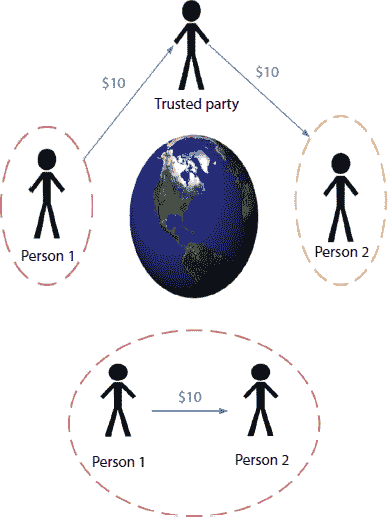
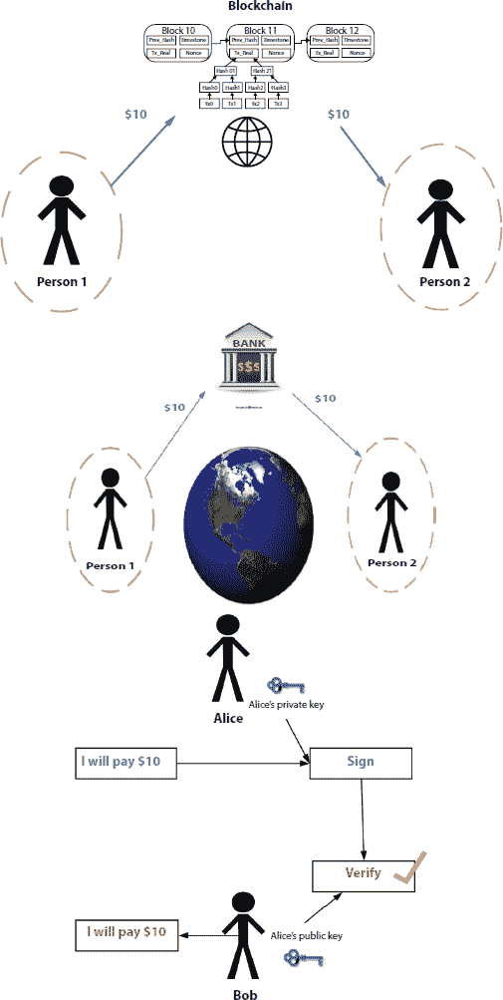

10.1 #

区块链的安全问题

**Neha Jain* 和 Kamiya Chugh**

*K.L. Mehta Dayanand College for Women, Faridabad, India*

**摘要**

区块链是一个存储在公共数据库中的链，由包含数字信息的块组成。尽管批评者对其耐久性、安全性和稳定性提出挑战，但区块链凭借其在许多应用中的巨大影响，正式改变了无数人的生活。区块链作为一种新颖的分布式共识方案出现，允许交易和其他数据在不需要任何中心化权威的情况下安全存储和验证。分布式信任以及因此带来的安全性和隐私性是区块链技术的核心，它们有可能使区块链成功，也有可能导致其失败。尽管区块链技术的特性可能为我们提供更可靠、更便捷的服务，但这种创新技术背后的安全问题和挑战也是一个我们需要关注的的重要话题。在本章中，我们将尝试介绍针对区块链的安全威胁，因为黑客无法修改区块链上的数据，因为每个用户都有一份账本，并且区块中的数据是加密的。本章还描述了针对开发高级区块链系统的安全攻击及其预防措施。

**关键词：** 区块链，区块链中的安全问题，区块链丑闻，区块链模型挑战

## 10.1 引言：区块链的安全问题

区块链是一种存储、执行和管理交易的技术。这被认为是密码学和网络安全的一个突破。它是数学、密码学、算法、金融模型等多方面技术的融合。区块链是最快的增长趋势。区块链是执行交易的最简单方式，因为它们使用加密货币，这些货币防伪造，不需要中心权威，并且受到强大而复杂的加密算法的保护。

区块链可以被描述为所有加密货币交易的数字形式、分布式和可共享的领导者。区块链支持分布式数据库，其中不同的计算机系统可以被创建。网络上的每一个计算机都被称为一个节点或点，网络上的每一个节点都会自动接收到它在远程位置下载的区块链的相同副本。我们也可以说，这是所有加密货币交易的一个公共领导，按顺序存储在连续的区块链中，以帮助客户跟踪交易。交易详情分布到块的所有永久雕刻成员中，每个成员拥有几个比特币。

除了数据库之外，它们还具有以交易形式向网络中每个节点提出信息的机制，网络可以考虑数据库的接受版本。考虑到某些参与者可能是有缺陷的或恶意的，这些参与者接受区块链上记录的内容。这可以通过几种方法实现。工作量证明、栈证明和权威证明是最受欢迎的共识算法之一。

## 10.2 加密货币场景

比特币是区块链加密货币的典型例子；因此，它很容易被攻击者入侵。实际上，已经披露了各种攻击，例如在尼什什 13 号基于斯洛文尼亚的比特币[1]挖掘市场的社交工程攻击，几乎窃取了 6400 万比特币。还有其他为安全定义的方法，例如双重花费的完整性（例如，两个不同客户的同一枚硬币）。这些问题应该得到妥善处理，同时不减少参与加密货币的公司的机密性。

一般来说，基于区块链的加密货币有两个主要因素导致其保密性。正如我们可以看到，许多加密货币无法提供两个地址在同一钱包中且属于同一用户的匿名资产。因此，由于同一用户使用不同的地址进行输入，无法实现去链接性。而，公链披露了所有用于交易的数据，用于交易的货币也向所有用户披露。如果用户考虑比特币，那么这些方面在最近的工作中都是可见的，这些工作基于过去的行为指导了严格的网络安全原则。

这个问题可以通过开始保密来解决；在这些情况下提高匿名性是使用混合服务。混合方法主要用于创建新的加密货币，包括秘密资产。下面讨论了一些建议。在这个方向上，这是基于责任制政策的第一种混合策略，强调随机混合费用的使用和盗窃。此外，这种方法为比特币提供了混合网络的优化，使其能够针对活跃攻击者表现出不可区分特性。另外，盲币还扩展了混合协议以提高隐私功能。特别是，作者提议使用盲签名方案以确保任何对混合服务器隐藏的用户都有输入/输出地址映射。另一种混合机制已经提出，涉及 coinjoin。

在本章中，我们将尝试介绍区块链的安全威胁，因为黑客无法修改区块链上的数据，因为每个用户都有账本的副本，并且块中的数据是加密的。本章还描述了针对开发高级区块链系统的安全攻击及其预防措施。

## 10.3 区块链的隐私挑战

### 10.3.1 区块链中的保护问题

区块链被认为在提供安全和隐私方面具有敏感的个人信息，因为用户可以使用生成的地址而不是真实地址。然而，一些研究人员建议，区块链可能会因过度隐私而受到威胁，因为账本中记录的信息不会被更改或删除。它们使用公钥创建，也称为非对称密钥，有两个密钥：一个是私钥，另一个是公钥。发送者使用公钥发送数据，而接收者使用私钥提取信息。由于区块链中的账本是公开的，因此可能会带来一些安全问题。

区块链上对隐私的关注被称为保护交易，不泄露信息，即在数字交易中维护隐私。将数据传输到区块链上并不认同这些隐私问题，例如可以在用户不知情的情况下披露详细信息，数据可能会被滥用等。这个问题在区块链上被加剧，因为当参与者减少控制权并更改详细信息时，账本中的机密信息不受影响。这就是区块链控制数据被黑客使用的主要目的。

区块链上的隐私发生在两个主要领域：隐私和控制。隐私意味着保护数据免受未授权访问。这也涉及到完整性、匿名性、不安全性以及保护通信，而管理依赖于授予用户的版权来控制和维护其个人信息。区块链可以使用隐私控制与 PET [2]即扩展隐私结合，保证个人数据的最小披露。

因此，安全模型已经扩展到区块链，以赋予用户自主权。区块链存在许多隐私挑战。其中一些包括：

1.  交易通信**—**由于区块链使用公钥，黑客处理敏感信息变得困难。区块链作为一个公开的社区，可以在任何时候独立创建新的地址，当有问题时，账本继续更新并跟踪所有交易记录。尽管如此，如果基于区块链代币，相同的用户地址可以按照以下方式链接：

    +   交易录入更多内容：在该交易中，用户地址是唯一的，即同一个独特用户生成的第一个问题是要找到链接。这个问题通过拥有一个单一地址但在所有活动中都不同来解决。

    +   由交易产生的：当使用相同的地址作为公共访问时，某些商品的变化会为用户提供供应。为了提高隐私，用户必须在交易过程中发行新的民主论述以退款。

    +   危险南瓜服务：可能由多个提供商混合升级的空间中心的服务的混合。然而，隐私可能被定义为一个挑战，因为陌生人的服务既输入和输出对；因此，隐私取决于一个真正的律师。

    +   支付网：用户的身份可以与你真实身份相连。当客户使用加密货币进行交易时，服务提供商可以连接用户的真实铸币历史。这可能对战斗和南瓜造成问题。

    +   区块链 P2P 网络策略：当节点网络连接对在互联网上时，区块链支持数据库。这个网络使用户能够追踪他们地址在 IP 发送中的整个过程。注重隐私的区块链，如门罗币，参考他们客户隐私层和区块链系统 P2P，连接到另一个系统，如 Tor（洋葱路由）或 I2P。然而，使用 Tor 作为秘密层网络[6]连接到各种系统可能对用户造成新的攻击。

1.  私钥管理与救援：由于区块链使用公钥和私钥，私钥在交易中非常重要。每个都用于在区块链中签署交易。密钥管理在区块链中扮演着重要角色。这不应该冒险，因为这些可能会受到虐待攻击或窃取用户私钥。这可能导致当各种特洛伊木马和恶意软件可能会破坏存储密钥的账本，并且访问加密密钥时的问题。

    用户有责任在使用设备时保护他的密钥，使用秘密钱包或将密钥管理外包给可能的盗贼或黑客（假装是演员），以免泄露所有敏感信息。这可以作为一个安全信任来解决，即你不会处理糟糕的密钥。

    为了解决这个问题，提出了几种解决方案，以防止密钥丢失，例如准备文件夹，以及包括机密数据的投资文件，其中包括私钥和公钥，或者不与黑客分享一次性密码，以防止丢失。拥有的一种解决方案是超级钱包，当演员持有账本在安全的地方，并且每天可以使用有限数量的智能手机。这减少了丢失或被盗造成的损失。

1.  Malicious Smart Contracts: 这些合约基本上是双方协议的匹配。它们在没有律师或律师的情况下执行职责。智能合约是通过验证所有漏洞而创建的，而账本则记录代码、输入和输出。智能合约操作可能带来风险。许多合约通常通过真实区块链机器，例如以太坊虚拟机，用字节码进行加密。在制定智能合约协议之前，参与者必须验证智能合约中的代码与在交易中发送的字节码相似。该协议包含分析工具，如开源工具，有助于解决智能合约的风险。隐私攻击的一个例子是将合约协议作为智能合约进行冲突和投注。然而，智能合约可以实现在一个确保制造平台的平台上，但也受到安全问题的影响。

1.  Immovable Data and Chain Data Privacy: 如我们之前所学的，区块链上的隐私与隐私和控制有关。为了保证隐私，交易中的信息必须加密。为了确保控制，访问权由用户决定保护和保存信息。任何类型的个人数据，如隐藏数据、散列值，都不应存储在链上。它应该是完全匿名的，或者存储在数据库中。区块链支持诸如启用擦除等方法，可以阻止数据并确保完整性。它还允许同时继续添加散列链接的记录和删除记录。

1.  Post-Quantum Computing Resistance: 在量子计算的未来场景中，一些工作量证明算法和验证存在风险。量子算法如 Shor 的算法，未来可能会破坏椭圆公共密钥加密（ECDSA）或整数因式分解（RSA）问题，这是生成签名的基础，而签名是区块链中使用的基本加密协议的基础（例如在比特币中）。为了最小化这个问题，在没有先前随机过程的情况下不应在链上存储散列值。

1.  Crystal-Privacy Performance: 密码学技术是确保区块链上隐私的必要条件。像 ZKP 或 ZK-SNARKS[3]这样的软件需要在区块链上完全匿名。这些系统效率较低，因为它们需要更多时间进行计算，并且需要更多令人信服的证据。新的 NIZKPoKs 系统，即零交互不可访问信息的证据，在采用密钥对称机制时能确保更好的性能。

1.  隐私-可用性：如果用户不是技术型的，隐私可能会导致他或她故障排除密钥、配置和选择属性以遵循组织的要求。因此，术语/规格和相关区块链终止应用程序需要促进区块链/数据验证/选择验证的区块链声明和管理 DID 文档和信息，通常，解决和管理演员的隐私。

1.  强调联系计划中的隐私：未来物联网可以从区块链中受益。他们可以包括混合器的匿名支持、验证器和 ID 认证支持、移动货币转账、测试和命名可能性、智能合约支持以及有效的位置要求。这与区块链的分解和各种无法使用、因此难以相互集成的用途相似。

### 10.3.2 隐私保护机制分析

前面描述的隐私保护实践可以根据它们的隐私保护目的分为 4 个主要领域。四个类别和方法可以总结如下：

1.  a. 使用 SMPC 技术 [4] 导出智能合约的秘密保护和密钥管理。

1.  b. 使用身份数据匿名化、混合（匿名签名）、环签名（匿名签名）、承诺方案和同态隐藏（如转换为币地址）在 ZKP 中隐藏用户身份的方法。

1.  c. 交易数据是保护区块链交易内容隐私的方法。这包括混合方法（例如硬币交易匿名笔记）、差分隐私、ZKKPs 和同态隐藏（隐藏交易金额）。

1.  d. 链上数据保护，它结合了通过加密系统保护数据的技術，包括公钥加密、基于特征的加密数据和机密数据共享。有一些隐私保护服务，如 ZKPs 和同态隐藏，可能应用于获得唯一数据（例如支付者、支付者）和交易信息（例如交易的硬币）的匿名性。

### 10.3.3 数据匿名化-混合

为了匿名化电子邮件使用，许多作者引入了混合方法。自那时起，这些技术已被用来使许多服务对许多用户匿名。主要过程是协调足够多的用户，延迟所有消息的分组，然后同时返回或以随机顺序返回。随着消息的编译和延迟，消息创建与网络漫游消息的用户行为之间没有关系。这项技术不是个人可识别信息（PII）的消息，而是消息在网络上的交互。

在区块链中，混合技术被用来隐藏特定代币的历史。在比特币中，用户可以为每个交易创建公钥对账户，而不是重复使用以前的交易，但交易历史可以将那些以前的地址链接到新的地址，当使用多个输入地址时，它们都是相同的。使用混合技术可以使交易历史地址任意化。

## 10.4 区块链的去中心化

去中心化是区块链的一个重要组成部分。它允许公有链、私有链和联盟链。公有链允许所有人进行交易，联盟链允许已获得授权的用户，私有链只允许一个参与者或独裁者。去中心化通过确保信任，让用户信任每一个区块链提供商。然而，这种信任可能会产生一个问题。去中心化系统与分布式系统相似，因为它没有单一的失败点。一个完全去中心化的系统并不总是与每个单一的点连接以实现一个单独的任务。决策是由系统中的每个部分或节点整体完成的。每个节点都相互连接，但在消息传递和协作方面它们并不连接。去中心化之下，每个人都自成一体。

然而，去中心化自治组织，即 DAO，是基于开源协议或智能合约运行的自制规则，只有当大多数创始成员同意时才能更改。这些规则对所有成员都是透明的，并写入协议或智能合约中。

制作 DAO 的协议或智能合约的成本低于传统组织，因为它们不需要任何管理者、员工或办公楼。它可以通过成员执行的代码来执行和运营。如果规则更加集中，DAO 将会更好，而较不集中的 DAO——它看起来就像非传统公司。

成本降低和效率是 DAO 相对于传统组织的好处，这些好处将相当于机器自动化 revolutionized 商品生产，只不过它将应用于组织的管理。DAO 中有各种各样的可能性，将使用机器对机器的交互。一个管理自动驾驶车辆（AV）的 DAO 从客户那里收集所有付款，支付每条道路的通行费和停车费，并在最后准备摘要。在有许多优点之后，DAO 面临潜在的挑战，可能会损害系统，并且可能在 DAO 还需要在其创建方面工作时获得系统访问权限，应该避免早期阶段的问题，并尝试使操作变得简单而不是复杂。DAO 的目的是为组织管理构建“集体智慧”，以改善今天大型组织的层次结构，从而鼓励创新和遏制官僚主义。他们的目标不是用智能合约替换经理以自动化决策，而是让经理摆脱重复的决策，以便能够将精力集中在创新和影响组织长期未来的高层次战略决策上。

### 10.4.1 区块链中去中心化的作用

众所周知，域名系统（DNS）在互联网上存储所有用户的名字或地址，它将数值 IP 地址转换为容易记忆的 URL。但这个过程是一个集中化的过程，容易受到监控和审查。谷歌是最大的 DNS 服务器运营商之一。无论何时你在浏览器中输入一个网站 URL，它都会被发送到 DNS 服务器进行查询。互联网服务提供商或谷歌会存储用户的请求，包括你的 IP 地址和你要访问的网站。

一些 DNS 可能会阻止一些网站或链接，以防止恶意攻击。DNS 服务器运营商决定你应该访问哪些网站，不应该访问哪些网站。

因此，在这种情况下，集中式系统可能会被政府和公司用于审查。

区块链技术主要应用于加密货币，这些货币用于数字流程中的交易。它们通过专门的加密算法进行加密。Namecoin 是另一种将数据存储在区块链上的加密货币服务，以创建替代的 DNS。Namecoin 加密货币使用 bit 域名代替.com、.in 或.net。地址可以存储在区块链上，这样每个人都可以访问它。如果没有加密算法，可能会导致 DNS 中毒问题，这会改变用户希望访问的 URL 的 IP 地址。这是犯罪分子或政府为了保护我们不访问某些特定网站而进行的操作。

然而，区块链既使用私有加密也使用公共加密；任何钓鱼或毒害行为都不可能发生。用户有责任关注计算机上进行的隐私保护，这不应该创建任何关于你的 DNS 请求的网络日志。

### 10.4.2 PoS 和 DPoS 的分析

密码学证明（工作量证明）的谜题解决过程正在形成中。因此，建议使用权益证明（PoS）[2]的证据来改善计算机的功耗。当处理一个区块时，矿工需要将数字添加到获胜的协议中来建立区块，这与区块的价值相对应。错误参与者的存款将被用来补偿不当行为。PoS 区块链的中间层取决于权益的分布，而不是高度可配置的计算能力。权益转发认证（DPoS）不需要每个人都直接制作区块。相反，参与者可以提供一个特定的孔。DPoS 减少了协议中的矿工数量，另一方面，它使得权益持有者难以直接建立区块，这有助于信任模型。由于权益证明减少了建立区块的矿工数量，集中化的速度将会增加。例如，EOS 允许二十一个大型组织建立区块，产生一个比使用 PoW 或 PoS 的完全开放区块链更集中的 N0=21 空间。

### 10.4.3 去中心化的问题

区块链可以将它的网络划分为各种层级，如物理层、平台软件、智能合约和客户端。这种问题不会在区块链中发生，但在账本的全栈中会发生。可共享区块链的不同层级中可以总结出去中心化的问题[5]。

+   物理节点：层级的物理节点位于矿工系统的 P2P 网络底部。所有与可共享区块链相关的物理节点基本上都不是集中的。这个假设随着 ASIC 矿工和矿池偏移了算力分布而不成立。

+   平台软件：平台软件层运行在物理节点之上。它包括共识算法的实现和智能合约的运行时。公共区块链的平台软件通常由贡献者社区开发、维护并开源。影响是多方面的：首先，治理和决策通常由一个“核心”开发社区领导，其中领导者对平台软件开发有重大影响。其次，由于平台软件的信任至关重要且经济上受到奖励，许多情况下，开发社区有强烈的激励使平台可靠。第三，平台软件层需要得到矿工网络的支持。例如，如果矿工网络所有者拒绝平台软件的新更新，那么平台软件的新更新将不会发生或导致区块链分叉。

+   智能合约：智能合约是部署在区块链平台上的应用程序。应用程序的逻辑编码在智能合约代码中。智能合约的执行由客户端或其他智能合约的函数调用触发。执行的结果反映在区块链的状态变化中（例如，用户账户余额的变化）。如第 4.3 节所述，智能合约的执行是完全复制和顺序的。

+   客户端

    客户端层服务于智能合约的最终用户。它接收用户输入并将最终结果显示给用户。客户端层只需要使用标准 API 与平台层交互。它是完全开放的，因为任何人都可以自由实现自己的客户端。

这些问题可以解释如下：

1.  倾斜的挖矿力量

    倾斜的挖矿力量是去中心化网络中的第一个问题，它导致了工作量证明（PoW）。这个问题也存在于物理节点层的底部。网络中的挖矿在两个系统中定义：首先，由于加密货币价格的飙升，挖矿力量得到了提升。其次，随着挖矿节点数量的增加，利润将随之增加。因此，为了稳定利润，进行挖矿。

    倾斜的挖矿力量[5]已经高度分散。这表明区块链由少数几个不同的实体维护和保护。倾斜的挖矿力量对攻击的抵抗力较强，大约有 51%的攻击发生。

1.  交易吞吐量可扩展性

    去中心化系统导致了各种问题，如区块链交易吞吐量可扩展性。

1.  智能合约执行的可扩展性

    区块链在智能合约的可扩展性也成为了一个问题，因为当前的去中心化区块链系统中的智能合约执行得不够好。

1.  完全复制和单线程执行

    在去中心化区块链系统中，每次执行智能合约时都会重复挖矿节点。这种重复导致难以识别原始地址。此外，计算能力与区块链系统中的单个节点相似。智能合约或协议是单线程的，这意味着一次只能执行一条命令。因此，在一个节点内利用并行性是不可能的。因此，整个比特币或以太坊网络的计算能力，由超过数十万台机器组成，不如现代智能手机。

1.  顺序编程模型

    智能合约以并行方式执行，但在某些情况下，智能合约的执行是顺序进行的。它有全局变量，例如余额，存储每个账户的代币余额。考虑到智能合约语言的通用性（Solidity 是图灵完备的），扩展智能合约的执行规模是一个挑战，因为它们目前是按顺序编写的。

### 10.4.4 去中心化恢复方法

有三种方法可以克服去中心化的问题

1.  i. 挖矿力量应该通过设计变得更加去中心化。

1.  ii. 在可能的情况下，应考虑其他形式的信任来取代去中心化。

1.  iii. 智能合约应该扩展以实现更高的整体可扩展性。

1.  去中心化挖矿力量

    导致挖矿力量失衡的关键因素之一是专用挖矿硬件的出现，尤其是 ASICs。专用挖矿硬件在挖矿能力和挖矿能效方面远远超过了个人电脑。此外，专用挖矿硬件通常非常昂贵。因此，它们大多落入了少数群体之手，如大型矿场主和 ASIC 挖矿机制造商。实现挖矿力量民主化的一种可能方法是为 PoW 设计 ASIC 证明散列算法。

1.  信任，而非必要的去中心化

    去中心化是一种民主化信任的手段，而非目标。还有其他确保信任的方式。例如，可验证计算和安全的硬件允许客户端在不信任的平台上运行代码。在这个过程中，不信任的平台为客户端生成可验证的证明，以供客户端审核计算的正确性。有了可验证计算，就不再需要假设信任系统节点的多数。另举一例，形式验证和认证编程允许程序员提供数学证明，证明区块链实现符合其规格说明。这可以用来消除区块链实现中的非预期行为。

1.  扩展智能合约执行规模

    为了实现智能合约的扩展执行，是时候重新思考编程模型和运行时的设计了。首先，需要引入新的编程原语，以使智能合约的并行执行成为可能。例如，可以从过去几十年广泛的编程语言研究中借鉴许多编程构造，如并发数据结构。其次，智能合约的运行时需要重新设计，以支持智能合约的并行执行，同时仍然保持确定性的交易顺序和所有的交易保证。许多现有的数据库和系统方法应该重新审视并采纳到智能合约运行时中。

## 10.5 区块链的法律和监管问题

区块链面临许多法律和监管问题。法律问题可能是因为管辖权、DAO、合同执行等问题。以前，在去中心化方式中，数据库由网络的一个对等节点管理，并作为协议行事，而在中心化方式中，数据由服务器维护，这些服务器处理信息并验证数据。在去中心化数据库中，由协议或智能合约控制，不需要第三方验证。

去中心化环境在法律问题上可以负责，因为在这个网络中很难确定谁拥有网络，以及谁对问题负责。因此，很难确定谁实施了信息，在哪里，何时，应适用谁的管辖权，谁控制信息，以及谁对完整性或保密性负责。

### 10.5.1 区块链的法律价值和其问题

区块链旨在增强分布式数据库，支持无信任交易并执行加密货币。正如我们所知，区块链是有效的，容易在账本中记录数据，告诉我们谁拥有数据，并证明数据没有被篡改，但这并不意味着基于区块链的交易和区块链上的注册应该合法进行。

区块链的状态需要[7]：

1.  签名——谁进行了交易或谁拥有数据。

1.  时间戳——交易完成的时间。

1.  验证——谁验证交易。

1.  文档——与交易一起作为合同附带的文档。

1.  一. 在欧洲，这些问题是在电子身份验证；认证和信任服务法规（EIDAS）下处理的。它有三种不同级别的电子签名——简单、高级和合格，这使得破解信息更加复杂。区块链必须在技术上追求简单和高级签名，但同时也追求法律约束的高标准。通过使用 TSPs（信任服务提供商）可以实现。

    通过这一点，我们得知区块链不具有任何法律权威。

1.  二. 领土性——用户之间的交易是通过比特币进行的。它们没有放置在特定的位置。如果有人想要破解它们存储的地方，那么只要有一定的技术知识，他们就可以操作代码。领土性使得实现法律责任变得困难。网络中的每一个节点都受到法律要求的管理，并以集中方式由一个头部维护，该头部对每个分布式账本负责。在监管方面，它可能充当“锚”。在这方面；区块链将引发领土性的棘手问题。在网络中，任何损害或破坏都需要直接分析方法。

    在领土性方面提出了几个挑战，这涉及到法院对侵权和非合同争议的管辖权。

1.  iii. 强制执行性—智能合约是签署和同意法律的一种更简便方式，但如果发生任何事件争议，智能合约在法院中如何强制执行？因此，所有争议都必须在附带的争议解决过程中明确。它涵盖了两个主要术语：

    1.  a. 伪匿名性/匿名性***—***如果法律通过对违法者实施行动或处罚来执行，法律应该是有效的。但是，检测谁违法是一项困难的任务？潜在的伪匿名性或匿名性可能被用来为罪犯创造法律空白区域。使用私有区块链技术的问题是在忽略应该是强制性的法律和监管法律，所有参与者都可以很容易地识别出来，而在公共区块链技术中，很难确定违反法律的用户。它们是不可追踪的。此外，一些用户或参与者使用有效的工具，但在不同的平台上进行交易，这提供了真正的匿名性，而不是比特币或以太坊，后者是交易的可信平台，但不支持匿名性。似乎向国家提供身份验证工具应该是国家执行责任并确保法律对区块链空间中人类行为影响的最低条件。

    1.  b. 执行接入点—假设区块链上要发送的信息和要进行的交易无法直接访问执法部门或监管机构，这并不意味着区块链与执法无关，因为有很多“接入点”当局可以用来执行规则。

1.  iv. 责任—它指的是参与者签署的智能合约的法律责任。施加此类责任的主要目标是激励/引导个人行为朝着立法者期望的方向发展。责任规定也具有补偿功能：其目的是为受伤者提供获得赔偿的机会和来源。今天，归责规则在很大程度上因（i）谁，（ii）向谁，（iii）为什么以及（iv）一个人因为什么后果/痛苦而负有责任而有所不同。法律制度中通常包括的 main kinds of liability（主要责任类型）包括：刑事责任，行政责任，合同责任和侵权责任。部分独立规定的是董事对公司承担的责任。此外，许多具体规定和法律为责任问题提供了特殊规定。

    1.  侵权责任（网络参与者的责任一般）——侵权法通常处理涉及民事错误的 issues，其中一个人可能因其给另一个人造成的损害而承担责任。需要注意的是，在现实世界中，识别造成损害的人的风险同样存在。这不仅与区块链有关。通常，受害方对损害是由一个容易识别的人造成的没有影响力。

    因此，在某些情况下，政府决定通过其他手段来保护受害/受损方，不仅仅依靠责任追究。例如，银行有义务创建一个资金池，以赔偿因银行破产而对其客户造成的损害。国家健康保险系统承担个人伤害风险。保险公司有义务维持一个保险基金，以在驾驶员未识别或未适当投保的情况下向道路交通事故中的受害者支付赔偿。

1.  数据保护——在交易中保护数据是难以维持的。在完全去中心化的区块链中，根据 GDPR 定义的数据控制者和处理者可能难以识别，因此难以执行其义务。这与上述讨论的司法管辖和接入点等问题有关。特别是在难以或可能无法识别数据控制者的情况下，自然难以执行 GDPR 对数据控制者的要求。

    最后但同样重要的是，区块链可能会使执行《通用数据保护条例》（GDPR）中规定的某些数据主体权利变得困难。这一点在 GDPR 著名的“被遗忘权”规定[7]中表现得最为明显，因为记录在区块链上的数据通常无法被修改或删除。然而，在其他权利在区块链背景下也可能存在问题，包括个人数据的更正权、知晓自己的数据是否被处理的权利，以及与智能合约相关的一个问题——不受仅基于自动化数据处理作出的决策影响的权利。

    如《通用数据保护条例》（GDPR）之类的法规存在，赋予公民改进、删除或忘记其数据的权利，这可能与区块链技术发生冲突，因为链必须是不可变的、持久的，也不应被考虑。区块链漏洞必须遵循这些规则，以向用户保证他们的隐私受到保护。

    《通用数据保护条例》的目标是防止收集（和处理）并非合理必要来实现预期目的的个人数据，通过默认设计确保隐私。区块链也必须满足各种权利，如信息权、接收权利的同意、直接访问数据、数据更正、被遗忘、可携带数据以及访问数据泄露信息的权利。

GDPR 第五条定义了关于个人数据处理的六项规定，符合六项原则：

1.  有效性、公平性和透明度：客观、透明地处理与数据内容相关的事务。透明度：提供有关数据处理的信息。公平：数据处理应符合描述的内容。有效：处理必须符合 GDPR 中描述的测试。

1.  目标限制：个人数据只能“为特定、明确和有效目的”获取。未经进一步授权，数据不能与这些目标不一致地处理。

1.  数据最小化：对一项物品收集的数据“为处理目的所必需、适当并有限”。

1.  准确性：数据必须“准确并及时更新；应尽一切合理努力确保不准确的个人信息与处理目的相关或予以更正。”

1.  存储限制：个人数据“以允许检测比处理个人数据所需更多的数据的形式存储”，即，数据不再按需删除。

1.  完整性及保密性：保护数据是确保适当安全的基础，包括个人数据，包括保护免受非法处理和风险、破坏或损害，包括使用监管信息或组织措施。

## 10.6 智能合约

比特币的成功证明，在区块链的帮助下创建数字货币是可能的。用户通过运行在去中心化方式上的计算机程序轻松地相互分享数据，这些程序不受任何单一实体的控制。区块链技术是处理通用计算的第一个概念。区块链包括可以在一个或多个各方之间的各种设备上运行的计算机代码。这些代码或程序是自我执行的。

智能合约是存储在区块链上的代码，一旦部署就会自动执行，从而利用区块链网络的信任和安全。

智能合约并不意味着它是两个当事人之间的合同或协议。它们可用于代币化，用于编码和自动化多方同时共享的业务流程。因此，它提高了业务流程和服务的效果。智能合约在基于条款和条件达成的协议下，在各方之间自动、高效和透明地运行，使其对手难以或无法退出或撤回提议。

智能合约可以分为两点。

+   智能法律合约

+   具有法律影响的智能合约。

1.  智能法律合约**—**这是由两个或多个多方共享的智能合约或协议，代表他们之间的问题的法律合约。

    智能法律合同中的问题 [2]

    1.  i. 形式要求

        这是一个简单的问题，它说明了一个智能法律合同是否符合法律所给出的具有法律约束力的协议的形式要求。

    1.  ii. 签名要求

        这个问题说明了一个具有法律约束力的合同是否具有“谁”签署了协议的证明以及这个签名是如何完成的。这个问题主要出现在离线流程中，在这些流程中，组织已经指定了具有签名权限的人员。智能合约应该由这些人员以数字方式签署。

    1.  iii. 智能合约的不可篡改性

        智能合约必须实现自动化，因为智能合约的自动化程度越高——法律问题就越少。智能合约被认为是“防篡改”的协议，这意味着没有人能够更改数据，但仍存在许多问题。结论是，智能合约的使用并不能解决或消除合同违约、合同责任及执行问题。因此，基于区块链网络的分布式网络中，识别参与者可用工具的缺乏问题再次出现。

    1.  iv. 智能合约审计/质量保证

        如果智能合约存在漏洞或缺陷，可能会成为一个严重的问题。如果交易过程中协议中存在漏洞，可能会造成很大的伤害。再次更改所有合同条款将非常困难。智能合约可能会按写明的形式执行，然而其行为方式却超出了编写者的预见。

        因此，智能合约“审计”——通常是一种复杂且高度技术的过程，用以检查智能合约代码的有效性和可行性——变得至关重要。这引出了一个问题：这样的审计是否必须成为要求，或者也需要某种法律认可，以使智能合约有效。

    1.  v. 智能合约的法律地位、效力和可执行性 交易行为，即使不包含任何信任元素，也必须导致涉及资产权利的实质性变更，无论这是代币还是代币所代表的资产。

1.  具有法律影响的智能合约**—**这些是基于智能技术的艺术品/构造，显然具有法律影响。智能合约的法律影响可以分为三种方式描述

    1.  i. 智能合约代表数字形式的资产

    1.  ii. 智能合约代表去中心化自治组织（DAO）

    1.  iii. 智能合约作为自主代理。

## 10.7 区块链的十大争议

区块链最简单地说是一个数字账本，它将交易捆绑在“区块”中，这些区块相互链接，依次形成所谓的不可篡改的“链”。没有一个用户能够更改跨地理分散用户广泛网络中的交易记录。

然而，支持者和反对者都将验证、记录和广播数字交易的能力定位为在 2008 年危机之后重新合法化金融的重要途径。这些技术的最初和最显著的表现形式，比特币，被开发者和推广者明确认为预示着更稳定、更少欺诈和更少投机的金融秩序。尽管目前成千上万的加密货币尚未实现这样的期望，但其基础技术的吸引力不仅持续存在，而且还催生了一大批区块链应用，这些应用继续提高了重新合法化金融的希望。

这种更集中的“授权”或“私有”区块链的使用在更广泛的金融行业增长，表明了这一组技术在金融行业社会接受程度之深。然而，我们在此的关注不在于技术的合法性本身，而在于它对金融社会合法性的贡献。因此，我们重点关注自中本聪[8]白皮书神秘出现以来，基于区块链的去中心化、自下而上的应用，该白皮书概述了其最初应用于比特币的设计计划于 2008 年（Nakamoto, 2008）。

1.  道德经济、责任与 scandalous times 下的合法性

    合法性包括一系列过程，通过这些过程，狭义的社会经济。

    实践最终被视为对更广泛社区有益的。将金融实践定位在更广泛的社会目标内的工作可以通过几种方式来追踪、理解和衡量。

    道德经济的概念预设，生产与消费的经济活动，以及交换和投资的活动，总是基于特定的理解，即代理人是如何对待和行为对待彼此的。道德经济概念将此解释为特定且最终可争论的“关于适当经济目标、原则、价值观和活动的相互主观共识”的结果（Baker, 2018: 294）。因此，突出“道德经济”强调了在任意时刻特定道德的霸权，同时也强调了人类代理人在努力转变关于事物应该如何的正常化假设中的关键角色。

    就 2008 年后的全球金融而言，道德经济的概念引导我们关注交换、信用分配和投资方法背后的价值观是如何陷入一个“持续的互动过程，其中规范性主张和它们的系统性愿景得到推进、接受、拒绝或修改”的。

    运用“道德经济”概念工作可以为理解此类二分法提供更细腻的视角，它引起了人们对主导行为标准的连续性以及在不同时间和地点针对他人行为方式的改变的关注。正如怀特和维格拉茨（2016: 5）所指出的，这意味着要避免将道德经济自动与亲社会行为实践联系起来的诱惑。

    因此，道德经济为实际存在政治经济中的道德转变和连续性提供更细腻的理解。一方面，它突出了后 2008 年金融中对集体责任的日益关注。危机以来金融专业人士之间的讨论广泛强调与平等、稳定性、正义和公平（超出简单盈利）相关的问题。

1.  利用道德经济概念的第二个相关好处是，虽然变化是可能的，但关于如何彼此行动和相处的主导标准很难完全根除。在主导的道德经济中的变化通常涉及更多竞争性愿景的混合或融合，关于如何对待或彼此行动。道德经济很少从“纯粹”的超个体主义摇摆到“纯粹”的超集体主义（反之亦然）。

    丑闻事件揭示了超出狭隘社区的道德越轨行为，为我们提供了独特见解，深入了解金融实践中竞争性道德理念之间的持续争论，正是因为他们涉及到对规范期望的明确表述和内在不一致性。作为过程，丑闻涉及活动家、记者、举报者和其他行为者通过更广泛地公开主导行为标准的内部违规行为来行使代理权。作为工具，丑闻推进了某些物质利益（如能够出售广告的代理人的利益），以及挑战或巩固现有社会规范的特殊意识形态。然而，丑闻通常引发巩固现状的回应，向我们保证特定实践或社会秩序的更广泛道德性”（约翰逊，2017: 704）。因此，丑闻可以通过其倾向于“个体化和孤立违规行为”的倾向，巩固金融中长期主导的超个体主义（约翰逊，2017: 704）。在丑闻中，责任通过“强情节”和旨在识别行为不当的恶棍的典型故事来断言，这些故事无处不在（Czarniawska，2011）。丑闻往往转移了对集体或系统性责任及其变化的关注，同时将注意力集中在个人失职和指责上。

### 10.7.1 区块链技术作为金融合法性的绊脚石

Swartz (2018) 将比特币与互利共生自助组织和合作社对人类社会的愿景[4]相提并论，其中“每个人都尽自己的份力”以确保隐私和整个网络的完整性。这些目标得益于比特币及其他区块链实验背后开源的计算机协议，这些协议是由维护底层代码的程序员社区开发的。尼格尔·道德（Nigel Dodd，2018）同样将比特币与追求建立普遍的世界货币这一共同目标的多样化的社会运动联系起来。

在第二次丑闻化事件中，对比特币的兴趣越来越集中在对其美元汇率大幅波动负有责任的个人身上。比特币在主要国际交易所的价格在 2013 年底达到顶峰，为 1242 美元，随后在接下来的三个月内下跌了一半。

通过与个人法律违规行为关联，比特币的广泛丑闻化并未对金融合法性背后的道德经济主导地位产生多大影响。比特币周围的持续“加密丑闻”倾向于“命令公众想象”，突出个人行为和错误，而不是技术上隐含的集体努力，以解决影响全球金融以及其他社会问题，如药物使用的一些更广泛的结构问题。对设计、汇率波动以及在非法市场使用比特币的个人责任的广泛关注，并未对区块链技术如何对一个以投机、欺诈和其他 1970 年代以来不断加剧和频繁出现的病症为特征的行业的脆弱合法性做出积极贡献提供多少认可。

## 10.8 区块链是无需信任的信任的兴起吗？

区块链示例

曾有人猜测，区块链将颠覆目前从金融到数字所有权和医疗研发，以及追踪和税收征收的众多行业。无论可能发生或不可能发生的心理干扰程度如何，区块链无疑给政策制定者和管理者带来了新的问题。至于互联网如何打开数十个关于如何管理网络交易的问题，新的区块链结构为法学者和董事们提供了一个未安装的地方。区块链很重要，也许是因为区块链提供了建立信任的身份。当对机构和权威人物的信心日益减弱时，新的信任体系非常需要。

“在 2017 年，对于四大机构——企业、政府、非政府组织以及媒体的公正性——的信任都被拒绝了。”

传统上，信任主要集中在任何中心权威上，这种权威支持法治，尽管，信誉是通过 peers 之间的互动在 peer relationships 中建立的，这种信任体系基于共享价值观。区块链创建了一个新的信任、共享构建。信任不是强加于系统中的任何一个人的特性，而是作为整个系统而存在。区块链技术使人们可以依赖系统中所有人共享相同的信息；它来自同一台计算机，适合其他所有时间。通过在可以合法认证的程序中移动一个信任机构，你无需信任系统中的任何单一人物。因此，建立了“可靠信任”系统。

 ### 10.8.1 我们为什么需要一个信任体系？

使用区块链的好处是依赖于中心权威的数量。这是建立比特币的主要动机。比特币的创始人开发者希望找到一种独立于任何政府结构分发货币的方法。在没有理论理由反对集中式治理结构的情况下，以下是一些例子：这种集中式控制是不够的——例如，当应用需要一个工作环境、场地时，通常出于竞争原因。更不明显的原因是在当前系统充满低效的情况下，需要一个不可靠的信任系统，通过拥有普遍共识来避免。任何时候如果有多个各方保持他们自己的交易记录，在联名贷款的情况下，有 10 家主要银行参与数十亿美元的主要交易所，其 overhead、duplication、delay 以及巨大的错误风险。区块链的分布式账本技术在这种情况下，提供了一种廉价、有效的替代方案。

一旦区块链建立起来，数字基础设施为企业间和行业内的自动化创造了机会。因为一切都在一个共同的平台上，涉及的所有方面都能享有相同级别的可见性和透明度。区块链并非去中心化或无需信任

描述了三种分类模式：建设、政治和心理。

在属性方面，论点是：你可以问两个问题来确定网络是否受管理：

+   网络由多少基本设备提供动力？

+   它们地理位置分散还是集中在一片区域？

然而，当我们观察主要的技术参与者，如 FAANGs（Facebook、Apple、Amazon、Netflix 和 Google），他们为数十亿用户广泛分布着许多服务器。

全世界的区块链都保持同样的副本，并持有所有内容。当创建新任务时，网络上的变化重复进行，到处回响。区块链是复制的，而不是分离的。

接下来的论点是，区块链的政治限制取决于你对这些问题的回答：

+   有多少个人/团体参与决策？

+   权力分配看起来是什么样子？

+   用于衡量每位参与者影响力的工具类型是什么？

+   是否有可以在系统中复制的途径？

然而，很少有数字能让人从政治分离的角度来看待这个问题。在另一个例子中，“97%的比特币由 4%的投资者拥有。”此外，几乎所有的比特币攻击都来自采矿池：

另外，加密货币的交换方式几乎与中央交易所相同。最终，关键开发者对网络的未来拥有中央控制权。

区块链去中心化的最后论据是你有理性的理由。例如，无论是首席执行官还是董事会成员都没有控制网络的能力。没有记录、物理地址或银行账户。虽然区块链作为一种技术而不是一家公司，确实不需要这些事物，但仍然涉及到一些有权势的人，比如关键开发者、采矿池以及拥有大钱包的“鲸鱼”投资者。

最终，区块链并没有整合到传统网络中，而且离扩展还很远。当我们不得不依赖关键开发者来决定技术的未来、忠诚的用户和投资者避免伪造应用程序，以及依赖采矿池来保障交易时，这并不是真的可靠。

附言：如果区块链是不可靠和分裂的，那它有多重要？区块链泡沫中没有人听说过外汇。

Dapps（去中心化应用）可以通过标准浏览器如 Google Chrome 使用，前端可能仍然有效。大多数人从未寻找过智能合约（更不用说知道那意味着什么）。

最终，你需要一个比说“我们分割 X”更好的理由来使用区块链。

## 10.9 区块链模型挑战

你需要解决这些问题，才能使你的企业运营成功。

区块链技术近年来越来越受欢迎。最初由中本聪为流行的数字货币比特币创建的区块链技术，现在已经发展成为对技术用户更有用、更有价值的技术。

尽管区块链的扩展，但并非所有企业都接受区块链的概念。在一个去中心化系统不监控标准机构的背景下；许多人仍然对这项新技术的安全性持怀疑态度。

如果你真的想将区块链整合到你的企业中，以下是区块链企业家必须克服的五个挑战，以便拥有成功的企业。

1.  创建新的商业模式：所谓“商业模式”是指组织整体的结构，旨在创建盈利的商业活动，包括公司的目标、任务和详细计划。有些商业模式是关于创造盈利的产品并将其销售给感兴趣的客户。从批发商那里订购产品，实施库存指南，创建在线目录，处理订单，国内或国际运输更为困难。大多数公司使用不同商业模式的组合来确保成功的商业运营。

    传统的商业模式没有区块链，而且很少有现代商业模式有自己的规则集。由于区块链技术不断变化的限制，您总是需要调整您的商业模式或创造一些新东西以适应合法性。不幸的是，这对初创公司来说可能很困难，特别是那些没有足够人力或资金的公司。如果您想避免未来可能出现的所有障碍和法律问题，最好是从头开始创建一个新的商业模式。这意味着重新思考商业模式的所有方面，尤其是您的渠道、收入流、关键来源和成本结构。

1.  整合区块链：初创公司很难将其区块链整合到现有业务中。区块链需要特别关注，这就是为什么企业主在创新时需要有创造性。计划将区块链整合到其系统的企业主应该了解区块链，并避免或解决沿途可能出现的问题。

1.  寻找人才：公司里的人不仅仅是创业者，他们还必须了解区块链。员工还需要学习一些区块链相关的内容。

    不幸的是，尽管这种技术得到了越来越多的认可，但在区块链上找到有才能和知识的人仍然很困难。在组织中全面实施区块链之前，员工需要接受额外的培训和指导，尤其是区块链基础，如密码经济学和密码学数学。

1.  获得适当的资金：基于区块链的业务由于其性质很难获得融资。由于与区块链相关的所有风险，投资者通常在投资这些初创公司之前会三思。

    为了获得资金，区块链创业者必须寻找投资者，尤其是那些对区块链行业持开放态度的投资者。另一种选择是寻找一个可靠的联系，该联系可以介绍您的公司给投资者，并解释为什么您的公司是一个好的投资。您的目标投资者可能是已经对您进行过投资、人脉广泛且盈利的人或公司。您的联系越成功，获得资金的机会就越大。

1.  业务描述不实：许多区块链企业家在评估时都有困难。当你刚开始时，你对公司未来的收益持乐观态度是很自然的。

    当你的股权收益不符合投资者的期望时，问题就出现了。这可能导致投资者失去他们的钱或对你的业务失去信任。为了避免这种情况，一定要在估计公司价值之前正确计算你的未来利润。

    如果你想在你的业务中使用区块链技术，记得要提前做好准备，成功地克服这些挑战。区块链可能是一种很好的新技术，但它很容易在你的新目标中找到它的位置。

## 参考文献

1. 古普塔, N., 区块链技术的安全和隐私问题，在: *区块链技术的先进应用*, 第 207-226 页，斯普林格，2019.

2. 阿明, Md. R., 智能合约的综述: 安全与挑战。*国际网络安全杂志*, 29, 05, 3, 2020.

3. 乔希, A.P., 韩, M., 王, Y., 区块链技术的安全和隐私问题综述，美国数学科学研究所。第 1 卷，第 2 期，第 121-147 页，2018。

4. 李, X., 姜, P., 陈, T., 罗, X., 文, Q., 区块链系统安全性的综述。*未来生成计算系统*, arXiv:1802.06993 [cs.CR], 2017.

5. 孜斯 kind, G., 纳坦, O. *等*，去中心化隐私：使用区块链保护个人数据，在: *安全和隐私研讨会(SPW), 2015*，电气和电子工程师协会，第 180-184 页，谷歌学术，2015。

6. السقاف, W. 和 塞德勒, N., 区块链技术为社会影响带来的机遇与挑战。*网络政策杂志*, 2, 3, 2017。2. 彼得斯, G.W. 和 帕纳伊, E., 通过区块链技术理解现代银行账本：交易处理和互联网货币智能合约的未来，在: *超越银行的银行与货币*, 斯普林格，2016。

7. 塞斯, M., 区块链赋能平台：挑战和建议。*国际交互多媒艺术智能杂志*, 6, 73, 2020.

8. 楚, S. 和 王, S., *区块链去中心化的诅咒*, 2018.

9. 马科拉迪斯, S. 和 克里斯托杜洛乌, K., 区块链—当前的挑战和未来的前景/应用。11. 258. *未来互联网*, 2019.

1.  * *通讯作者*: jain_neha200@yahoo.com
