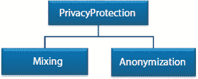
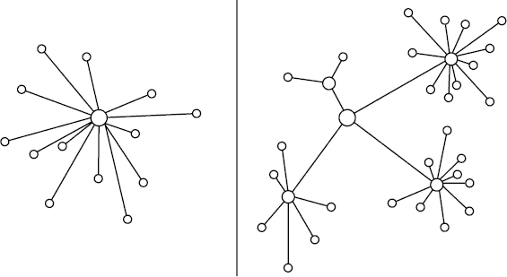
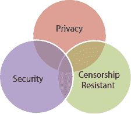
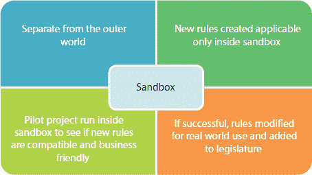
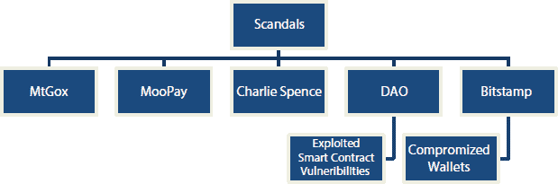
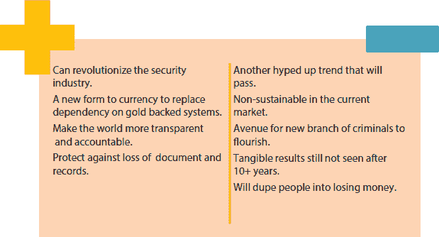
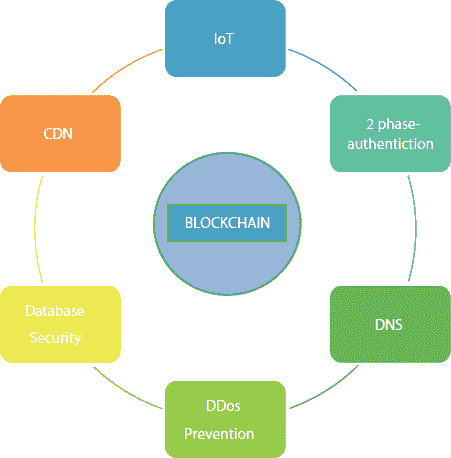

**12**

区块链技术的缺陷和网络安全潜在的增强

**Eshan Bajal^(1†), Madhulika Bhatia^(1)*, Lata Nautiyal²，以及 Madhurima Hooda^(1)**

**¹印度诺伊达的 Amity School of Engineering Technology**

**²布里斯托尔大学，布里斯托尔，英国**

**摘要**

有许多用户案例和扮演角色的用户在自动化交易和活动中涉及。这些活动在网络中被许多用户安全地改变。当我们实施时，更改和更新会被记录下来。区块链是一个共享数据库，提供了一个令牌管理器来跟踪由任何数据交易生成的日志。区块链技术有很多安全问题。但另一方面，它代表了一个比旧技术-如数据库更大的网络安全威胁。用户在使用区块链时面临相同级别的风险。在本章中，我们将讨论与区块链相关的重大安全问题，以及揭示区块链正在邀请新的挑战或减少安全风险的问题和事实。本章旨在讨论与区块链技术相关的隐私挑战以及去中心化挑战。业务模式以及监管问题存在问题。还将处理丑闻以及最终用户的感知。另一方面也显示，区块链确实是值得信赖的，或者正在为系统架构师以及数据库管理员邀请新的挑战。

**关键词*:** 匿名化, BDoS, moopay, 沙盒化, 内容分发网络

**12.1 引言**

区块链越来越受欢迎，无论是由于真正的兴趣，还是作为一个热门关键词，正处于趋势之中，每个人都试图了解一些相关内容。其基石是 DLT（分布式账本技术）[1]，它使用一个去中心化的公共账本，在严格的对等网络中进行交互，遵守协议并由密码学保护。由于去中心化的性质，即没有中央管理机构，交易和数据不是由一个单一实体验证和拥有，而是如典型系统中所示，而是由任何接入网络的节点或计算机来确认交易的有效性。这种账本的透明性是区块链成名的原因之一，因为从理论上讲，它是无法被篡改的。然而，这种技术也有其公平份额的隐私问题，从其基本运作到外部代理，如 DDoS 攻击和对独立节点的安全漏洞。共享账本也意味着任何恶意的更改或修改都将变得永久且不可更改。我们讨论了一些在现实世界中与使用区块链网络相关的常见问题。

## **12.2 区块链技术中的安全问题**

当涉及到安全问题时，我们可以考虑许多方面，从终端用户的匿名性开始，去中心化网络的一般稳定性，从无信任的核心概念到监管机构对丑闻和诈骗的仓促反应，特别是在加密货币方面，这是这项技术最著名的产物。但有一点是恒定的，那就是一旦公司或服务提供商获取了我们的数据，我们对此一无所知。因此，客户和使用者不愿意在网上向服务提供商提供他们的信息，但他们需要这样做以创建用户访问权限。这造成了一种无助的局面，用户别无选择，只能提供他们的数据并祈祷它不会被误用或出售给第三方。

网络安全是一个大问题，特别是在当今这个时代，技术的快速变化使得很大一部分人群对他们的网络安全风险一无所知，也不知道如何防范。大数据和机器学习的兴起使得有可能梳理数百万用户的数据并为其各种用途存档[2]。

人们曾认为区块链技术是安全的下一步，并由于各种原因将在下文中讨论，将在网络安全领域带来一场文艺复兴[3]。然而，现实要严峻得多。像任何新技术一样，与之相关的问题以及由于这种独特技术的使用而产生的不可预见的后果随之而来。我们将在下面的章节中讨论区块链面临的许多安全问题。

## 12.3 隐私挑战

隐私是个体或群体隔离自己或数据并谨慎表达的能力。在区块链中的隐私意味着能够进行交易而不会泄露身份信息。同时，隐私允许用户通过谨慎地透露自己而不向整个网络展示他们的活动来保持合规。实际上，区块链网络对隐私泄露非常脆弱[4]，这是因为用户的公钥和 IP 追踪的可见性。

+   最近的一项研究[5]显示，一个人的加密货币交易确实会留下可以追溯到他们 IP 地址的痕迹，即使他们使用了防火墙或类似的保护服务。

这是可能的，因为节点可以通过客户端唯一标识，并且可以使用这些数据追踪其来源。规避这个问题的一个方法是使用自定义分配的动态 IP 地址范围或使用 TOR 网络 [6]。然而，这不太可能，因为 IP 提供商通常分配静态 IP 地址，管理员可以简单地阻止来自 tor 网络的客户端连接。卢森堡大学的一项研究 [7] 详细展示了在 P2P 网络中脱匿名客户端的不同方法，他们发现他们的攻击有 11%到 60%的成功率来脱匿名客户端。该研究还得出结论，最重要的因素是连接到受害者入口节点的连接数量。

+   智能手机的兴起也见证了部署使用这些智能手机作为网络节点的应用程序（主要用于挖矿目的）的激增。将移动平台作为网络的一员也提出了无限制数据收集的问题，这些问题反映了关于他们家庭、政治和宗教观点、与一个组织的联系、位置等的丰富细节。

欧洲的数据保护立法在“被遗忘权”方面做了大量工作 [8]。

它写道：“数据主体有权要求控制者及时删除与其相关的个人数据，控制者有义务及时删除个人数据。” 当成员/节点工作时添加到账本的数据是永久添加到网络的一部分。在公共区块链的情况下，这意味着只要区块链在线或具有功能节点，信息就是公开可见的。这引起了关注，因为它与立法者为保护普通个人民隐所做的一切背道而驰。通过私有区块链共享医疗史、法律信息和财务数据也引起了类似的关注，因为数据无法被销毁，未来可能发生泄露。

已经提出了两种主要方法来提高区块链中节点的隐私性。

已经提出了两种主要方法来提高区块链中节点的隐私性 [9]，如图 12.1 所示。

1.  混合

    用户的真实 IP 并不完全匿名，实际上是伪匿名。从同一个地址进行多次交易会增加被追踪或识别的风险。混币是一项服务，它接受来自多个源的输入并提供多个输出源作为中间人。如果人员 X 通过人员 Y 与人员 Z 进行交易，那么 Y 接受来自多个输入 m1, m2, m3 并且有多个输出 o1, o2, o3 等。这使得追踪人员 X 和人员 Z 之间的交易变得更加困难。然而，这需要我们信任中介不会出售我们的信息或直接窃取。有解决方案，例如 Coinjoin [10]使用一个中心混币服务器来打乱输出地址以防止盗窃。

    

    **图 12.1** 隐私保护类型。

1.  匿名化

    零知识证明用于 Zerocoin [11]。矿工不必验证带有数字签名的交易，而是验证属于有效硬币列表的硬币。支付的来源与交易本身不链接，以防止图形分析。然而，目的地地址和金额是可见的。Zerocash 被提出来解决此问题。在 Zerocash 中，零知识简洁非交互式知识证明（zk-SNARKs）[12]被利用。硬币的真实价值和用户所拥有的价值都保持机密。

### 12.3.1 BGP 劫持攻击

BGP 是一种 IP 协议，它定义了数据包如何被发送到目的地。通过操纵 BGP 流量，攻击者可以拦截区块链网络。这通常需要先攻陷网络运营商，从而导致黑客控制运营商。此后，可以对网络和节点进行攻击。攻击者可以有效地分割区块链网络，并减慢其消息传播速度。通过将矿工引导到攻击者的自己的池中，他可以窃取受害者的加密货币。据估计，有 82,000 美元被 unsuspecting victims 在两个月的时间里利用这一漏洞而被盗。网络管理员没有可靠的方式来追踪这样的攻击，而是依赖于检测恶意活动的系统监控，例如 BGP-Mon。恢复是手工的，需要大量的手动重新配置来撤销劫持[13]。

### 12.3.2 BDoS (区块链拒绝服务)

经典的 DoS 攻击对区块链几乎无用，尝试起来可能极其昂贵[14]。2018 年底比特币 SV 与比特币 ABC 之间的哈希战就是其有限成功的证明。这就是区块链拒绝服务（BDOS）出现的地方。 Nakamoto [15]的协议及其所有修改版本固有的属性都暴露于更便宜的 DoS 攻击形式。

同伴发现协议有一个机制，可以防止同一地址的多次重传。这意味着对于每个连接，节点都会维护一个通过该连接发送的地址历史。这个历史记录每隔 24 小时清空一次，更重要的是，它不限制所持有的元素数量。如果有人用假地址淹没这个系统，那么他们就可以增加用户端的响应延迟，阻止它连接到新块[16]。在一个受控试验中，每秒发送 30,000 个假地址给一个容器。发现用户由于响应延迟而无法访问新节点的时间只需 45 分钟。

### 12.3.3 迫使其他矿工停止挖矿

另一种方法是只生成并发布块的头部，并为其提供证明[17]。这会说服诚实的矿工停止挖矿是最好的行动方案。这是因为，给定一个头部，理性的矿工有三种可能的行动：(1)延伸主链，忽略头部，(2)延伸块头（SPV 挖矿），或者(3)停止挖矿，不消耗电力也不赢得奖励。如果矿工选择第一种行动并延伸主链，找到并广播一个新的块，攻击矿工就会利用他相对较高的连接性（如同自私挖矿）并传播与头部 BA 对应的完整块。这导致了两组矿工之间的竞争，一组是首先听到攻击者块数据的一组，另一组是首先听到理性矿工块的一组。因此，如果“无攻击”环境中的原始盈利性不是太高，在这两种情况下，攻击者都可以确保诚实的矿工最终会亏钱。所以，BDoS 攻击者的威胁意味着诚实的矿工最好放弃，根本不挖矿，即选择方案 3。首先，如果攻击者的哈希率足够大，攻击将会成功。其次，如果矿工的哈希率足够小，攻击也会成功。最后，如果矿工 i 在最初并没有赚取太多利润，攻击也会成功。

## 12.4 去中心化挑战

梅里亚姆-韦伯斯特词典将去中心化定义为“一个组织，特别是关于规划和决策活动的过程，从中心、权威的位置或群体分散或委派开来。”

去中心化是区块链的支柱，它消除了中心监管机构的存在，而是使整个网络严格以 P2P 方式运行，如图 12.2 所示。换句话说，与分布式系统不同，节点仅连接到其他节点。这是伟大的进步，因为中心节点的缺点如延迟和拥塞可以在 1970 年的星形网络拓扑中就看出。总的来说，当网络的控制权由网络节点的子集共享时，我们认识到网络是去中心化的。节点是网络的成员，可以是世界上任何地方的系统。活跃节点之间能够相互通信。现在让我们来谈谈去中心化的问题。

+   节点间就当前领导者达成共识并不能解决信任问题。当前领导者必须得到信任。它必须以公平的方式验证和组装区块。因此，在基于领导者的共识协议中，领导者需要提供一些证明：工作量证明、股权证明、容量证明或唯一标识证明[18]等。

+   验证和组装区块的工作所获得的奖励，为节点竞争奖励创造了激励。这种激励往往形成了一类特殊的节点。例如，比特币最初是一个 peers 网络，其中每个节点都可以验证交易并竞争奖励。今天它是一个双层网络（矿工和用户），由大的所有权池控制。

    **图 12.2** （a）集中式和（b）去中心化系统，由节点和边表示。

+   当区块的组装留给一个节点时，共识理论的一个主要要求就失去了：共识不是基于对将存储在区块链上的信息的多数共识。达成的唯一共识是选择领导节点的方法。

+   当创建下一个区块的节点必须将信息广播给所有其他节点时，就会引入瓶颈。瓶颈的影响取决于找到键值节点发送数据的速度。如果它们太慢，另一个节点将会获得功劳。

+   这个过程效率低下；大量数据更容易受到传输错误和最大尺寸数据包的重传影响。

+   冗余度非常高。每个包含在区块中的交易在最初发布时已经单独被每个节点接收。副作用是存储和带宽需求大幅增加[18]（在基础设施较差的地方这非常困难）。

+   系统容易受到多数接管攻击（51%攻击）：拥有网络超过 50%计算能力的攻击者或攻击者团体可以接管系统，打破如图 12.3 所示的三个核心概念，并阻止矿工完成区块，撤销交易，并强制执行硬币双重花费[19,20]。

    **图 12.3** 去中心化的三个方面。

+   由于每秒可执行的交易数量有限制，扩展是非常困难的，这一点已经被之前的演示所证明[21]。

+   ASICs 的兴起，专门为挖矿而设计的硬件，在计算和能源效率上比个人电脑高出一个数量级，导致了挖矿池的失衡，一小部分人拥有大量的挖矿能力[22, 23]。

+   缺乏重点，所有层级的独立决策制定导致对系统原则的很多模糊和混淆。在集中式系统中，中心机构会雇佣合格人员为系统做出决策，这可能不会个人受益，但会整体有益于系统。在去中心化系统中，治理过程往往缓慢且因琐事而被拖延。

+   安全性和透明度的提高是以降低速度为代价的[24]。节点之间达成共识的过程或协议，取决于复杂性和节点数量，可能是一个非常耗时的任务。

+   去中心化按定义消除了中心权威和责任制。如果一个网络下线或像以太坊那样的网络经历硬分叉[17]，一些用户可能会被迫遭受损失，而没有办法解决他们的投诉。与可以要求医院或银行对某些故障负责的方式不同，网络的所有者或管理员不能被同等责任地追究。

+   运行和维护所有节点的成本总是大于运行一个集中式系统的总成本。通常作为个人电脑的节点不如为特定目的设计的服务器节能。

+   高带宽，每当新区块被挖出时，每个节点都会更新，每个区块也都有从创世区块开始的全部区块的交易历史。这需要大约 3GB/天的显著带宽，节点上区块链历史的总大小可能高达 50GB [18]。

## 12.5 监管挑战

尽管区块链让比特币用户能够在线持有、发送和接收资金，但这些分布式账本做得更多，包括数字资产交易的清算和结算以及无需中央中介的分布式计算。随着区块链的成熟并改变数据的概念和存储方式，可能会出现意想不到的后果，促使监管机构考虑进行干预。

分布式账本是一个跨网络共享的资产数据库，可以是电子的、金融的、法律的或物理的。所做的更改也几乎实时地反映出来。在像欧盟这样的地区，利率为负，这将为当前基于现金的系统提供一个更好、更透明的替代方案。

法律代码是外在的，如果发现违规，可以通过物理手段强制执行合规。相比之下，数字代码是内在的，这意味着代码可以检测到违规并报告错误，但这仅此而已。除非在编写代码时已经为此类规定安排了自动监管或纠正措施，否则不会采取任何自动的监管或纠正行动。此外，这种数字代码即使产生了未预见和不希望的后遗症，也遵守既定的规则[25]。

随后，对于像比特币中使用的区块链创新以及许多其他不同的应用，一致性成本较低，因为成员只需要使用一致的客户端软件包。尽管如此，实施成本的问题依然存在，这些成本可能会受到质疑，特别是对于框架的客户端来说，他们需要接受显著的计算资源成本，特别是在最著名的分布式账本框架方面。当涉及到基于反机构信念的区块链技术，如比特币时，它很难形成一个连贯的治理机制。

BBVA 的一项研究显示，区块链要想在行业中可行，需要克服各种监管挑战。

由于共享分布式账本没有物理位置，如果出了问题，对特定群体的法律责任几乎不存在。这与不同地区法律规定的冲突[26]相辅相成。按照同样的推理，责任也代表了一个问题，因为可能没有最终负责分布式账本运行及其所含信息的一方。即使严格遵守现有规则，法律框架也无法为不希望或未预见到的结果做好准备。

加密货币本应作为现金的虚拟对应物，即无需经过中央监管机构的验证即可用于交易，但在许多国家缺乏适当的法律规定其使用[26]。例如，一些政府已经威胁要使加密货币在其领土内非法。比特币在 110 个国家完全不受限制，在阿尔及利亚、摩洛哥、厄瓜多尔、伊朗、巴基斯坦等地被明令禁止[27]。在孟加拉国，据报道警方逮捕了比特币所有者。除非 governing authorities 能够提出适当的规则和指导方针，否则悬而未决的威胁不会得到解决。

许多专家现在坚信，2017 年底的加密货币疯狂繁荣是交易所之间勾结的直接结果。特别是，一些持有大量加密货币的加密货币所有者被指控使用不透明的美元挂钩稳定币泰达币来人为推高价格。德克萨斯大学发现，2017 年 3 月至 2018 年之间，用泰达币进行的 100 笔最大的比特币购买中，有 87 笔占到了比特币同期复合收益的 50%[28]。

+   不可篡改的账本直接与被欧洲法规授予保护私人数据的“被遗忘权”相冲突。目前可能的补救措施是改变其政策，禁止第三方使用所述数据。

+   关于区块链中存储的文件的合法有效性作为占有或存在的证据（法律验证推送到链上的文件的真相，如所有权，产生额外的验证成本，使过渡部分变得多余）。

+   开放性和匿名性也与反洗钱(AML)和了解你的客户(KYC)规定[29, 30]相冲突。

区块链使用（智能）法律合同来执行网络规则以及普通合同。至于司法问题，不仅涉及分布式账本本身是否有特定的位置，还涉及合同签署方可能受到各自司法管辖区的不同法律的问题。关于责任，智能合同涉及多方：不仅是合同各方，还包括合同的创建者（通常是某种编码器）和合同的保管人（理想情况下不需要后者）。这使得由于各部分可能处于不同的司法管辖区以及缺乏定义使智能合同在法庭上可执行与其实体对应物相同的规定，合同的执行变得困难。

### 12.5.1 监管时需遵循的原则

随着区块链技术的不断发展，它仍然具有可塑性，并随着扩展和进入新领域而变化。这意味着法律也需要随着旧范式不再足以应对其复杂性而进行改变。立法者和利益相关者需要认识到的关键优先事项是为双方利益定制这样的法规。监管机构无法独自完成，需要工业家和专家宝贵的意见来解决他们的担忧和顾虑。只有通过复杂的合作努力，我们才能制定出令大多数人满意的法规。在采取监管行动之前，应考虑以下原则：

监管的目标是给专家、工业家和企业家一种确定性，以便他们更容易识别合法与非法的事物。因此，我们必须考虑被监管者的观点和目标。在法律不明确的情况下，如果企业家担心未来可能因法律变化而面临起诉，他们将犹豫不决地从事新课题。当在线支付在数字市场推出时，人们犹豫是否提供信用卡详情[31]。但随着时间和适当法规的实施，这已成为全球所有家庭接受的。不确定性带来许多问题，例如小公司的法律合规性、诉讼成本的增加以及需要进行许多修订的法律制定。

#### 法规应灵活适应法律创新.*12.5.1.1 灵活适应法律创新*

区块链技术仍然相对较新，易于变化。监管机构应意识到，它可能被用于好的和自私的意图。因此，监管策略必须对公共政策和其对大众的影响负责。监管机构不应因行业的意外而对行业持敌对态度，而应重视创新本身：创新被视为有益于公众的创新。这种发展应得到鼓励，并且法规应为此类增长和实验提供必要的规定。他们的角色是保护人民，这不应该因为技术向可能不符合他们观点的方向发展而变成权威控制。我们已经看到，仓促实施法律作为对负面事件或公众骚动的直觉反应可能导致未来潜在的陷阱[32]。区块链是一项技术和商业方面，因此需要专门的框架来制定其法规，以规范其行为。

法律情景随着社会及其人民的观点的变化而不断变化。区块链也将不可避免地迫使法律在某些方面进行改变以适应，这应该被视为进步的标志。经验也表明，使用法律和技术代码的组合克服传统自上而下立法方法的限制是更好的。技术创新还确保了在尊重公共政策的同时，股东之间持续互动。可以采取共同监管方法，其中“监管制度是由一般立法和一个自我监管机构的复杂互动组成” [33]。这也是区块链生态系统运作的体现。随着区块链预计将影响越来越多的领域，多中心共同监管将把参与者聚集在一个平台上，在那里可以讨论法规。群体的智慧将在个体能力失败的地方提供见解。实施不充分或可能引起争议的政策的风险大幅降低。

#### **12.5.1.2 应鼓励进行实验**

由于区块链技术相对较新，因此关于区块链的新信息仍然很难获得。我们发现有两个主要原因，首先，这项技术本身尚未足够发展，无法获得可靠的结果并进行测试以了解其如何运作。其次，这个领域中的专家非常少，涉及此领域的人大多是自学的，没有专业指导。他们可能不熟悉技术的所有复杂运作。随着时间的推移，当他们有更多时间和经验与技术打交道时，这种情况会逐渐消失。

监管机构应将此作为其方法中的关键特征，并在同时给予参与者法律清晰的同时推广此类方法。这项技术主要有利于创新者，但好处并不仅限于那里。监管机构本身可能从这项技术的含义中在未来获得巨大好处。描述了许多方法来强制实施监管而不干扰增长。例如，他们可以依赖小型项目并运行区块链。发现的问题将有助于深入了解在处理技术时需要考虑的潜在方面。另一个选择是使用与欧盟相关的第 28 个制度。第 28 个制度是一个可选的法律框架，它不取代当前存在的框架，而是作为额外的法律与之作补充，以防需要用于执行。私营公司可以选择依赖任一框架进行业务，而法律体系无需经历重大的改动。在欧盟，这种情况会更容易，因为可以在不更改现有法律体系的情况下促进跨境交易。额外的好处是，这些法律作为试点案例，为进一步的研究提供了有用的数据。

#### *12.5.1.3 关注即时影响*

监管机构应专注于使用区块链的系统，而不是技术本身。就像互联网、云存储、个人电脑等一样，任何具有颠覆性的技术并非本质上是坏的。它占据了道德上和法律上的中性灰色区域。结果取决于最终用户使用它来追求自己的目标。人们用它来建立提供非法服务的可疑网站，也用它来用无法追踪的加密货币支付其他罪犯。这些活动已经是非法的，存在法律来处理这些侵权行为并惩罚违法者。我们可以很容易地修改这些法律，以适应监管使用区块链及其产品的要求。Fintech 是这一技术积极使用的绝佳例子 [34]，像 BitPesa [35] 这样的公司通过改善他人的生活产生了影响。我们倾向于泛化和分类这些作为好或坏，但在现实世界中，没有什么必然是黑白分明的，这取决于我们如何对待它。除了在协议级别实施控制或关闭互联网本身，没有其他方法可以阻止区块链的扩展。监管机构应避免采取此类行动，直到形势变得更加明朗。

#### *12.5.1.4 监管机构应参与跨国对话*

在一个理想的世界里，全球区块链将由一个全球监管机构来规范。如果实现不了这种合作，规则将会是支离破碎的，合作将难以相互协作解决基于区块链的许多非法活动，创新者也会因需要面对多种监管框架的复杂性而受到打击。然而，众所周知，这是一个愚蠢的梦想，也没有一个是现实的选项。除了这种激进的选择之外，应该鼓励更现实的方法，这些方法能够追求相同的目标。这包括跨国合作和对话，包括经验分享以及技术数据互操作性的问题。在美国，许多州已经意识到在这些问题上进行跨司法合作的好处。美国统一法委员会最近通过了一项规范数字加密货币的示范法。欧盟委员会正在努力引导这些努力，作为其内部市场能力的一部分[36, 37]。

### **12.5.2 监管策略**

下一节将讨论已经实施或正在考虑的五种监管策略，以规范区块链。每种方法都有其自身的优点和缺点以及其特点。但主要目标是看到采取的各种方法，以便我们将来可以制定出更好的策略。

#### **12.5.2.1 观望态度**

最原始的方法类似于开发小型软件的临时构建和修复方法。监管者的主要目标是教育而不是规范。他们持续监控技术。随着新方面的发展和展开，新的规则被添加进来。这使得每个人都能在技术的最初发展阶段观察到它，并在需要时随着明确指导方针的制定而阐明，如图 12.4 所示。

这种方法在处理尚处于起步阶段的新技术时已经被广泛使用。欧盟委员会也遵循这种观望态度的理念，尤其是在其经济平台上表现得最为明显。他们积极监控进展并组织研讨会，资助试点项目。虽然看起来他们只是在被动观察，但实际上已经收集并分析了大量的数据。这项分析的结果可以反过来提供有价值的信息，比如提供一种寻找现有框架潜在漏洞的替代方法。我们也会明白为什么需要进一步实验来收集更多数据，或者为了更有效地实施而切换到不同的方法。如果现在实施严格的规定，它们将需要很快进行审计，以克服新发现的不完善之处。

**图 12.4** 观望态度的步骤。

我们首先需要决定是否我们的现有法律框架确实足够应对在观望方法等待期间可能出现的潜在问题。美国国内收入局将比特币分类为财产而非货币。因此，监管比特币的法律与适用于你房子的法律相同。另一方面，代币的语境尚未确定，法律的不确定性使得企业家市场的增长放缓。人们正在研究绕过这些不足的替代方案。

#### **12.5.2.2 施加狭窄和拓宽的指导**

监管机构首先根据他们所拥有的初步信息发布非正式指南。随着新信息的产生，这些指南会变得狭窄或拓宽。主要缺点是这些指南并不是 properly drafted 法律，因此在法庭上执行起来相当困难。实际上，大多数这些指南在法庭上都不会有任何价值。有影响力的团体可以对监管机构施加压力，迫使制定出符合他们需求的新法律。这种做法有多种方式，如游说、诽谤、诉讼技巧，甚至虚假广告。

#### **12.5.2.3 沙盒技术**

如图 12.5 所示，沙盒技术是一种相对较新的方法，它允许监管机构观察，并为该领域的参与者提供法律确定性。

**图 12.5** 沙盒技术的不同特点。

“监管沙盒可以定义为一套规则，允许创新者在暂时免于遵循某些或所有现行法律要求的环境中测试他们的产品或业务模型。作为交换，这些参与者通常有义务以受限的方式运营他们的业务模型，例如通过控制客户数量或风险暴露，并在严格的监管监督下进行。”

这种技术考虑到了监管机构和被监管者的需求。立法者无需处理不确定的结果，创新者也可以无需担心陷入困境而尝试新的方法。金融科技行业是技术变革带来监管变革的最佳例证。这种技术最早是在 2016 年的英国金融科技服务中使用的[38]。英国框架允许在一段规定的时间内，在一个不同监管环境中进行操作。后来，其他公司如瑞士金融市场监督机构等也采取了这种方法。

沙盒有其自己的优点和缺点，需要分别解决。沙盒作为一个黑盒子和透明度产生了冲突。沙盒的规则对商业也不是很友好。例如，对于在企业进入沙盒之前使用过某种服务的消费者来说，他们认为他们之间的关系会受到一般适用制度覆盖，但现在不再如此怎么办？还有一些进一步的限制，如限制在单一司法管辖区内，使全球交易几乎不可能。优点是它为监管机构提供了一些时间来观察技术的各个方面，并在需要时提供法律咨询。

#### **12.5.2.4 发布新法规**

尽管创新改进仍然处于起步阶段，但各个地区都已经迈出了制裁新法规的步骤。虽然这显示了将地区描述为一个动态、区块链支持的设置以吸引区块链发展的好处，但它也存在时机不当的风险。这种监管热情可能会在技术继续发展过程中，确实显示出长期有负面结果，这可能会导致不久的将来需要行政修正。此外，正如沃尔奇所注意到的，围绕区块链的措辞仍然混乱，这也可能导致与使用此类监管结构相关的混淆 [39]。可以确定此类方法的多个示例。2017 年 3 月，亚利桑那州授予州级法规，使通过区块链和智能合约验证的商标成为电子商标。俄罗斯建立了一个法律体系，以制裁 ICO。佛蒙特州考虑通过立法，使区块链记录在法庭上可以作为允许的证据。另一方面，法国批准了基于区块链的债务融资众筹。

从长远来看，这些细微差别让监管机构不愿去处理的问题变得更加头疼。他们感到负担沉重，因此通过限制创新的法律，并执行他们知道不会有效的方法。立法者的行动不应过早，但也不能太晚，以免产生歧义。随着时间推移和人们采用一套标准的术语和原则，立法者的工作会变得容易。国际标准化组织（ISO）已经开始制定标准的术语，使未来的事情变得更容易 [40]。

#### **12.5.2.5 在监管中使用区块链**

监管过程可以利用区块链自身来优化流程。通过使用它来了解这项技术，他们会有更大的机会。在世界的一些地区已经可以看到这种倡议的几次出现。乌克兰希望通过与 Bit Fury 合作，将政府数据放在区块链上，以此认可透明度和责任问题 [41]。格鲁吉亚正在尝试使用账本登记土地权利 [42]。爱沙尼亚利用区块链提高医疗行业 [43]。新加坡已经启动了其智能国家项目，用于银行间交易。迪拜试图使用区块链连接整个城市 [44, 45]。

这些项目的益处是多方面的。试点项目提供了实践经验，这将影响监管方法。其次，它为政府和创新者等不同因素创造了一个讨论政策和未来潜力的平台。第三，现有政府看到了使流程更加流畅的潜力。其他方法已经提出，例如为区块链投票的监管系统、区块链即服务（BaaS）和通过监管达成共识。这些都是新颖的想法，需要更多的研究和分析来理解这些独特方法的可行性。

这是区块链行业当前监管场景的概述。每种方法都有其独特的优点和缺点，没有一种是完美的。互联网应该对所有人免费，但存在 ISP 监管；同样，区块链可能抵制审查，但它仍然会在监管锤子下。进一步的研究和新的创新可能会带来这个环境中的巨大变化，这可能会改变现有的模型和方式。## 12.6 商业模式挑战

“商业模式”这个术语指的是公司创建盈利业务的整体结构，包括公司的目的、目标和详细计划。一些公司使用简单的模型向现有客户群销售一组特定的产品，而其他公司则使用更复杂的模型，从制造到国际运输。传统企业没有必要或规定在其当前环境中实施区块链。我们突出了一些行业面临的问题。

+   创建新的商业模式

    平均而言，企业没有实施区块链的准备，而且只有少数模型具有足够的灵活性来容纳它。在改进业务以符合不断变化的区块链规则方面，初创公司处于更不利的地位。为了避免所有麻烦，最好的办法是从头开始设计一个新的商业模式，这将需要重新思考收入流、资源和运营方式。

+   整合过程本身

    需要实施的建议不够，因为下一个要求是能够从事区块链工作的人才。对于区块链的整合需要特别注意，因此需要企业主具备一定的知识，以避免未来可能出现的问题。

+   寻找专家和工程师

    这非常难以找到，因为这是一项新技术，一名区块链工程师可能会让公司每年花费超过 70,000 美元；初创企业也可能面临许多困难，因为许多人尚未对区块链的使用持开放态度。此外，我们必须考虑培训和指导这些新员工的成本，以使他们融入公司。

+   资金不足

    由于未来稳定性和投资回报率的不确定性，投资者对任何基于区块链的公司都持谨慎态度。企业家可能会高估利润；问题开始出现在你的预期利润与投资者的期望不匹配时。这可能导致投资者撤资或对你的企业失去信任。一项研究表明，区块链的分布式特性在没有提升金融服务的情况下是无法应用的。这风险很大，投资者出于明显的理由不会资助这样的冒险。技术共和国的一项涉及行业内超过 500 人的调查显示，平均预期的投资回报率为 24%，但实际项目仅看到了低至 10%的回报[46]。交付和效率的方法难以衡量，留下了高估的余地。

+   利益相关者认同

    任何项目都需要转移到生产环境中。但在区块链的情况下，这已被证明要困难得多和具有挑战性。生产价值也需要与组织外部的其他成员团队合作。这种对外机构的依赖可能会与利益相关者发生冲突。

+   不确定性

    尽管区块链已经不再是初创阶段，但它离成熟和稳定还远。许多人对区块链的承诺持怀疑态度，不知道它是否可持续，因为它存在可扩展性问题。这种技术完全可能被大型技术玩家放弃，留下小玩家一个过时的技术。另一种可能是被不同但更好的技术形式所取代，这种技术的缺点不同但更容易管理，可能会完全盖过区块链。商业应用还必须得到大众对区块链的接受，而大众通常不会舒服地处理其复杂性或所需的操作知识。

+   网络管理

    下一个挑战是业务团队之间的协调。由于应用程序的结构，节点需要与其他公司或独立第三方的外部节点进行交互。这些节点由其他公司或独立第三方托管。IT 团队需要管理这种系统所需的不同的权限、协议和隐私控制，这是一项巨大的挑战。手动部署也需要很长时间，因此使用自动化是强制性的，这又需要自己的一套专家。定义控制访问和权利时出错的机会也增加了。市场上今天存在多种协议，如 Hyper ledger Sawtooth，随着更多协议的推出，管理它们之间互动的复杂性也在增加[47]。该领域最后一个问题是监控和基准测试，由于缺少低级数据，这两个问题都受到严重限制。自主性有限，这对公众来说是有益的，但对试图将其用于商业的公司来说是有害的。

+   缺乏现成的数据库架构

    在当前系统中，证书是由服务器端的 HTTPS 或类似的安全层，如 SSL 进行管理的，而无需任何人工干预。但在区块链上，人类劳动是必需的，因为每个问题都需要具体解决[48]。区块链也伴随着前面提到的权衡，比如速度和治理因素。这五大因素是速度、去中心化信任、抗审查、开放性和交易成本。如果其中任何一个受损，其他也会受到影响。

+   可靠性和健壮性

    其他框架的错误证明了一些缺陷仍然存在于区块链架构中，特别是在数据的角色特定私有化方面。向后保密控制在新技术参与者无法看到他们加入网络之前的交易时难以融入。区块链也不遵循标准化的防火墙规定，公司无法保证未来其合规性[49]。在这种情况下没有确切硬件或软件规则。最后，平台互操作性仍然是行业面临的挑战，机器和人类在协议和标准上达成共识的任务令人畏惧。

    区块链无疑会带来巨大变革，创造新的市场并使一些过时，但它掌握在能够利用这种技术并承担其巨大资源需求的企业手中。

## 12.7 丑闻和公众观念

新技术的概念随之带来了一群试图通过不道德手段从中获利的人。在区块链领域，特别是在比特币等加密货币中，已经发生了许多损害公众舆论的事件。这在技术文盲眼中改变了它们作为不稳定和易被盗的事物的看法。在本节中，我们将讨论打击区块链的主要丑闻。其中大多数将包括以某种形式的加密货币盗窃，因为这是这项技术最显著的应用。比特币是第一种加密货币，因此将与它相关最多的案例。其他像以太坊、NiceHash、LitCoin 等加密货币也有自己的一份额外争议。图 12.6 进行了总结。

+   Mt Gox

    诈骗和丑闻中已知的第一起最大案件是臭名昭著的 Mt Gox，在其鼎盛时期控制了 70%的比特币。遗憾的是，它成了众多攻击的受害者；黑客和内部盗窃，使他们在四年的时间里失去了超过 150,000 个比特币。最后，国土安全局介入，事情开始走下坡路，直到 2014 年申请破产。在混乱中，Mt Gox 的经理马克·卡佩莱斯为自己偷走了 100 万美元。几天后，Mt. Gox 在东京申请了破产保护，报告称其负债约为 65 亿日元（当时为 6400 万美元），资产为 38.4 亿日元。据消息来源，该公司失去了近 75 万客户的比特币，以及约 10 万的比特币，相当于当时所有比特币的 7%，当时价值约 4.73 亿美元。这种行为对公司的声誉造成了不可挽回的损害，进而影响到加密货币（即比特币）的产品[50-53]。

+   Moopay

    Moopay，Moolah 和 MintPay 交易所背后的公司，在 2014 年底申请了破产。这个故事的主要转折点是，CEO Alex Green 实际上是一个长期在线诈骗犯，名叫 Ryan Kennedy。他自称 Alex，声称公司资金耗尽，不得不停止运营，而实际上他从他们那里偷走了 200 万的比特币。当他被发现时，他没有表现出丝毫的内疚，理由是他不得不创造这个身份，因为他“犯了一个灾难性的错误”。后来在 2016 年，SEC 对他进行了长时间的调查后，以与暴力有关的罪名被判处 11 年监禁。

    

    **图 12.6** 与区块链相关的丑闻。

+   在线黑市

    一个主要担忧是使用加密货币在家中购买非法物质和服务，同时保持匿名。丝绸之路是一个完整的在线黑市，只能通过 Tor 网络访问，前提是你已经设置了正确的连接。它成为了一个交易所有非法物品的市场，这些交易只使用比特币。

    1.  a.丝绸之路的创始人 Ross Ulbricht 与其他人一起被 FBI 逮捕，原因是参与非法洗钱计划。Ross 声称他是被 Mt Gox 的 Mark Karpeles 设置的替罪羊，后者是该网站的实际所有者。FBI 以洗钱、毒品贩运和企图杀害六个人的罪名对他提出指控。2015 年，FBI 从他那里没收了超过 14 万个比特币，并且法院判处他五个连续的刑期，包括两个无期徒刑，没有假释的可能。这无疑促成了许多仍然存在的较小非法交易网站的产生。

    1.  b. Shrem 是 BitInstant 的联合创始人，这是一家比特币交易所和投资公司 Intellisys Capital。他的衰落始于在肯尼迪机场被捕，当时他刚从阿姆斯特丹返回，被指控向“丝绸之路”的用户出售超过 100 万美元的比特币。Shrem 后来达成和解协议，被控参与未经授权的资金传输。他在监狱服刑两年后，于 2017 年加入 Jaxx 区块链钱包公司担任董事。

    1.  c.中国官方逮捕了多人，他们涉嫌使用比特币运行庞氏骗局，承诺最高可达 600%的回报。一个例子是现在已经倒闭的比特币交易所 MyCoin，该交易所总部位于香港，在 2015 年 2 月被当地当局关闭。香港商业罪案调查局（CCB）进行的一系列调查揭示，相关投资者可能损失了高达 4 亿美元。该计划要求投资者至少投资 40 万港元以获得 90 个比特币。资金将被存入 My Coin 账户，期限为几个月，而 MyCoin 承诺回报率为 150%。虽然进行了多次逮捕，但尚不清楚欺诈资金中有多少已经或将会退还给受害者。

    1.  d.欧洲比特币交易所 Bitstamp 在 2015 年 1 月 4 日有一些钱包遭到入侵，失去了 19000 个比特币，当时价值约 500 万美元。在入侵事件发生前几周，有 6 名员工受到了钓鱼攻击的怀疑。他们在入侵事件后不久也报告了一次大规模的 DDoS 攻击，但没有数据或资金被窃取。这促使该行业所有大型公司引入了许多新的安全措施。

+   DAO（去中心化自治组织）

    DAO 是一个基于以太坊运行编码智能合约的去中心化自治组织，遭到了一次具有巨大后果的盗窃[57]。以太币被转换成 DAO 代币，分发给持有者。它被设想为“一种风险资本工具，将投资于分享经济中的项目”。它甚至筹集了 1.5 亿美元资金，以建立一个类似于现代民主的金融机构。然而，由于人为错误，黑客将其中三分之一的资金转入了他们的账户。由于不可变性，这些资金无法转回，因此社区投票决定进行硬分叉，以一半支持修改后的区块链，另一半保持未修改的区块链。因此，从分叉中产生了两种不同的加密货币。

2017 年 4 月 5 日，比特币开发者格雷戈里·马克斯韦尔发布了一条信息，指出如何利用 ASCIBOOST 技术获得采矿优势。预计从这项技术中获得的收益每年可达 11 万美元。这家公司背后的技术，Bitmain，尽管他们否认了所有指控，但仍受到质疑。

在当前形势下，加密货币的描绘有点悲观。公众印象是由这些事件塑造的，其中许多没有报道，许多被压制。关于这项技术的这种悲观新闻肯定会让人对其持怀疑和谨慎态度。许多人并不了解这些事件背后的运作，只是跟随记者的观点。积极的公众印象非常重要。如果人们喜欢一个想法，它会得到很多关注，结果吸引投资者和政府机构参与其中。有了初始资金，公司可以开始生产直接造福消费者的产品。这使得它成长并巩固为行业的一部分。为研究工作和其后续发展开辟了更多途径。但反过来说也是真的，缺乏适当的支持会破坏初始阶段。

他们并不孤单，许多人在丑闻曝光后也发表了类似的文章。主要问题是这类文章更容易被普通人获得，现在他们只把区块链和骗局联系在一起[58]。这导致了负面的公众印象，这对任何发展中的技术都是极其有害的，可能会在它萌芽阶段就将其扼杀。然而，并非一切都失去了希望，为了提高区块链的安全性已经做出了许多改进，每天都有很多人努力使这项技术完美无缺。一个在 2017 年初创建的系统利用比特币技术提高了安全性，保护人们免受身份盗窃。

在普华永道 2018 年对来自 15 个地区的 600 位高管的调查中，有 84%的人表示他们有一定程度的参与，这可能更多的是出于害怕错过的恐惧。德勤的一项调查发现，53%的公司已将区块链列为他们五大优先事项之一，比去年增加了 10%，47%的公司认为在 3 年内可以看到投资回报。调查还称，77%的公司认为，如果他们不适应区块链技术，他们将失去竞争优势。

造成不良舆论的一个主要问题可能是缺乏对所取得进展或克服挑战的广告宣传，以反驳由诈骗和丑闻传播的负面情绪。例如，Power Ledger 是一家澳大利亚公司，致力于实现点对点能源交易[59]。他们的愿景是创造一个可以自由控制能源生态系统的世界，该系统可以在需要时生产和提供。网上可以找到大量关于区块链在现实世界应用的文章，但其中大部分仍处于开发阶段或未被广泛宣传。一些例子包括 Guard time（健康记录安全）、REMME（使用存储在区块链中的 SSL 登录和密码替代方案）、Bank Hapoalim（以色列银行与微软合作管理保证）、马士基（简化海洋保险解决方案）[60]等。

当涉及到公共观念时，据观察主要有两种思想流派在图 12.7 中得到阐述。第一组认为区块链是一种革命性和颠覆性的技术。他们围绕它制造炒作，让每个人都急于加入其中。最近的一项调查发现，区块链是 2018 年最被高估的词汇。这并不令人惊讶，因为许多公司测试区块链却没有什么实质性的成果。调查建议公司这样做是为了利用媒体的关注来作为一种营销策略。麦肯锡公司发现，绝大多数这样的试点项目和概念验证仍然处于“开发阶段”，或者正处于被取消的边缘。他们还大肆宣扬区块链的自主性，以及政府将无法对其进行监管。第二组由那些认为这项技术只是会逐渐消失的另一种花招的人组成。他们将它视为像谷歌眼镜一样的局部炒作，最终会因为缺乏公众支持而失败。Abra 的首席执行官比尔·巴 hydt 认为，区块链在不久的将来不会取得任何成果。一些人指出，尽管有大胆的声明和超过 130 亿美元的众筹，但直到 2018 年都没有看到任何实质性的成果，并且在此之后采用区块链只是为了解决他们自己创造的问题。

**图 12.7** 对区块链的两种不同公共观念。

双方在其假设上都是正确的。一项新技术可能取得广泛的成功（例如带滚轮的鼠标）也可能消亡。但作为个人，避免偏颇决策非常重要。相反，一个人应该了解事实并做出自己的判断。

## 12.8 为什么区块链是无需信任的

无需信任并不意味着缺乏信任，而是指无需将信任寄托在第三方组织和代理上。尽管某种程度上，“信任少”这个词被紧密地与信任而不是它的缺乏联系在一起。在本节中，我们讨论了使这个系统变得无需信任的各种因素，并将这种说法付诸测试。我们看到，在基本的现金交易中，一个人将一个物理对象（现金）交给收款人。钞票的真实性可以得到验证，而且一个人不能将同一个对象给两个人。

在大多数现代支付系统中，参与者是交易中的各方和一个隐藏的中介，比如银行或支付网关。我们将信任寄托于银行，相信银行会从我们的账户中扣除相应金额并将其添加到收款人的相应账户中。运用区块链技术，我们消除了第三方，并利用节点通过一种称为挖矿的过程来进行验证。维基百科将挖矿定义为“将交易记录添加到比特币的公共交易记录中”。每个区块也需要发送工作证明，即附上过去消息的历史并花时间尝试找到散列值（对网络来说是固定的）。如果一个矿工要更改一个区块，他必须更改所有在此之前的区块，或者因不一致而被移除。这需要计算能力，而在给定的固定时间框架内完成工作是不可能的。因此，在区块链中，传统的篡改信息的方法是不可能的。区块链最小化了信任，并在网络中的所有节点均匀分配它[61]。

+   没有人会被赋予特殊权限，即便是管理员也不会；这消除了与中心化组织相关的问题，比如交易税、人力和数据库错误、数据泄露以及组织自身的盗窃。

在某种意义上，并不是完全无需信任，因为我们信任的是区块链，而不是中心权威。然而，区块链是由所有成员组成的节点集合，不能滥用其权力，这与民主社会中一个人拥有很少的权力类似。例如，如果一个人从一个电子商务零售商那里购买了一个产品，他们要信任很多他们不认识的人。他们信任网站、电子商务业务本身、软件、数据库正确存储订单，甚至是可能会误放包裹但报告已送达的送货员。使用区块链可以避免这些问题，因为数据库、订单信息、订单状态不能为个人利益而更改。整个过程除了“硬分叉”直接改变协议、加密货币交易所的管理、ICO 的发行和投资者救济外，需要很少的人工干预。

尽管如此，多年来已经有许多论文支持了区块链确实是无需信任的观点。例如，Forogolu 和 Tsilidou 明确指出，“基于区块链架构的整体事情就是它们允许无需信任的交易活动，”[62]，而 Kiviat 大胆断言，“无需信任意味着——历史上第一次——计算机网络上的价值交换可以没有可信的第三方或中心机构的验证、监控和执行，”[63]。Madisetti 解释说，“节点之间不需要可信的中介进行交互，”因为“区块链网络不受中心权威控制，所有交易都通过节点之间的共识进行验证和验证”，因此“节点之间不需要相互信任”[64]。

如所讨论，多种特性汇聚在一起使这成为可能。其中一些是众所周知且期望每一项技术都具备的，而另一些则是具有革命性和颠覆性的，因为它们可以改变未来的发展流程。

### 12.8.1 信任机制

所有节点都必须执行一些计算工作才能有资格获得挖矿奖励。这种方式是，当在区块链中对交易或进行修改时，矿工们（花费计算和电能）为交易寻找一个散列值。当找到一个散列值时，修改被认为是有效的并被添加到不断增长的链中。所做的工作称为工作量证明，这是一份既难以产生又易于验证的数据。它是通过暴力方法完成的，这涉及大量的尝试和错误，从而使其变得困难。找到下一个散列值的矿工群体将获得加密货币作为奖励，这为他们提供了继续工作的激励。由于所有矿工都需要提供工作量证明，因此无法欺骗这个系统。已经提出了其他替代方案，例如权益证明（拥有一定数量的加密货币价值）、身份验证甚至基于 M2M 的信任证明。

### 12.8.2 匿名性

在人们日益关注数据如何被使用以及为何被使用的日子里，人们生活在数据被窃取并用于恶意活动的恐惧之中。相对于目前的由中央机构执行的系统，区块链提供了一个令人耳目一新的替代方案。区块链中的用户相对于他们的中心化对手来说相对更安全。尽管可以追溯源头，但交易的目的是几乎无法找到的。数据与公钥和私钥一起工作，这些密钥可以存储在离线的 USB 驱动器中。为了克服剩下的小问题，正在开发和测试新的模型。

### 12.8.3 数字钱包中的应用

这与之前提到的匿名性上下文相关。区块链自 2004 年以来一直存在，但由于中本聪的工作，它在 2008 年首次亮相，他推出了了一种名为比特币的第一种加密货币。比特币或其他加密货币不需要将交易的详细信息告诉银行。如果个人 A 向公司 C 转账 0.0000023 BTC，我们不知道交易的目的是什么或使用了什么服务[65]。加密货币的交易费用只是正常金融机构收费的一小部分。实际上，在一些国家，工人可以用加密货币支付，并且由于加密货币的分类，他们可以免除纳税。

### 12.8.4 防伪

几十年来困扰数字金融机构的一个问题就是双重支付问题。基本上，相同的资金可以用来购买两种不同的产品。具体的等价物就是骗局，同一财产在没有让他们知道彼此的情况下卖给多个客户。这个问题最初是由区块链因其独特的共识确认特性而解决的。可以制造并流通假币，如果不特意寻找它们可能拥有的微小缺陷，是无法识别的，但加密货币无法被伪造[66]，在使用时会自动由网络检查。迄今为止，还没有关于制造或使用假加密货币的报告。

## 12.9 区块链在网络安全中的应用

随着个人数据的增加和我们互联网活动收集的数据，获取这些数据的需求也在增加。据估计，一个人的年度浏览数据在被卖给目标广告公司或类似企业时价值略超过 210 美元。数据是一种普遍的货币。因此，人们会想出新的方法来窃取或追踪这些数据也就不足为奇了。网络安全是一个广阔的领域，包括对抗攻击、信息和身份盗窃的主动和被动保护。区块链的出现为我们提供了新的角度来改进和加强当前的网络安全模型，通过引入区块链的元素来论证它。

这样一个广阔的领域不断增长并需要越来越多的创新来领先于网络犯罪分子并不令人惊讶。自 2016 年以来，每天的网络攻击数量增加了 300%以上。当 Uber 被黑时，5700 万客户的记录被泄露[67]，而 Friend Finders 的安全漏洞使 41200 万账户受到威胁[68]。没有技术是安全的，今天安全的技术明天可能就会被攻破。即使是像亚马逊和 Facebook 这样的科技巨头也不是免疫的，尽管它们被攻破的机会非常低。即使是曾被认为是“无法破解”的苹果产品也正在遭受攻击[69]。仅 2018 年，就有 49000 种新恶意软件针对 MacBook。网络安全威胁不仅限于计算机、数据库；物联网设备如摄像头、智能电视、WiFi 打印机、与虚拟助手相连的家电都可以受到网络攻击。特别是物联网，随着智能自主设备的兴起，安全措施薄弱，为黑客提供了进入个人数据的捷径。技术的不断发展和其在我们的生活各个方面的深入应用使得跟上其安全方面变得颇具挑战性。

虽然网络安全行业正在开发新技术，但区块链作为一种新兴的、具有潜在革命性的技术，正在改变网络安全场景。区块链的特性，如不可变性、共识机制、数字合同、比特公证，为我们提供了新的、更有效的工具来满足网络安全行业的当前需求。我们将讨论图 12.8 中显示的各种领域，这些领域最容易受到网络攻击，并讨论如何通过与区块链互补来提供增加的安全性和隐私性，在经济和商业上都是可行的。

**图 12.8** 区块链在网络安全中的不同用途。

### 12.9.1 区块链数据库

传统数据库已经有超过 20 年的历史了。许多新技术已经被开发出来，从端点加密到通过特殊代币修改数据，以增强安全性。我们甚至看到数据库作为企业使用的云服务出现。但是，自数据库早期生命阶段以来困扰它们的问题仍然存在。数据库容易受到无法预防的物理灾害和损害。一项调查还发现，大约 40%到 55%的数据库攻击来自内部，由具有管理员访问权限和特权的员工发起[70]。2019 年发表的一篇论文展示了我们如何创建一个支持 SQL 和非 SQL 命令的分布式数据库。用户通过唯一的公钥进行身份验证，他们的交易由这个公钥签名。主表存储最近交易的索引和相关数据存储条目。这使得同步和验证变得快速。未同步的部分会被其他成员迅速同步。用户可以选择只关注自己的交易，或者为其他交易提供计算资源。数据完整性由共识机制检查，如果未达成共识，则操作会被回滚。这个过程可以在几秒钟内完成，用户会立即得知他的交易状态。共识机制基于正确性、收敛性和一致性[71]。共识的主要目标是尽可能快地达到一个约定的数据存储状态。这是通过保持拜占庭错误共识的阈值来实现的。

另一种方法是保留传统数据库，并将其连接到多层企业应用程序。所有定义的数据和用户操作都在使用区块链技术的不可变日志中定义。用户应用程序将能够与网络节点发送和接收数据。用户查询将存储在靠近用户的节点上的本地数据库中，当达成共识时，交易将更新到主数据库。如果节点失败，用户可以无缝地转移到另一个节点，使其成为零时间恢复系统。故障节点可以维修并放回池中。

由于数据存储在节点上，基于区块链的数据库也可以实现恢复节点，这些节点位于远程位置，持有数据库的副本。在发生灾难的情况下，主数据库可以恢复到这些恢复节点的状态，而不会永久丢失数据。这比维持一个海外数据中心作为数据备份在经济上更为可行。不可变性为系统带来了固有的可审计性特征。在传统数据库的情况下，用户 A 对用户 B 和 C 在表 E 上执行 CRUD 操作。在添加区块链层后，该操作作为区块链交易记录，相应的访问交易由签名发送给相关对等节点。一旦达成共识，网络就会最终确定并将其包含在数据存储中。如果用户 C 对表 T 执行选择查询并发送给节点 N，节点 N 将通过查询签名识别用户。如果用户 C 有权执行该操作，节点将执行查询并将结果返回给用户 C。采用这些方法，我们稍微增加了延迟，但提供了更好的安全性和防止内部攻击的保护。

随着技术的进步和更快互联网连接的引入，我们可能会看到保护数据库的新方法，甚至本地数据安全也可能通过区块链得到增强。

### 12.9.2 DNS 安全

域名服务主要用于将常用语言中的主机名解析为相应的 IP 地址。它提供了一些重要服务，如防止基于机器人的垃圾邮件、在异常流量期间共享负载并提供隐私，通过掩盖组织的实际命名空间来实现。基于区块链的 DNS，如 DNS 链，提供了必要的软件来替换 X.509 公钥结构，并提供 MITM 身份验证证明[72]。考虑到 Zooko 的三角理论案例，我们可以看到这种方法将具有所有这三个属性。当前的 DNS 完全由系统管理员控制，他们可以随意更改。在基于区块链的方法中，所有节点将拥有平等的特权和优先级。只有所有者才能使用私钥更改现有的名称和结构。

关于安全问题，我们认为这种方法有两个明显的好处。即使有了 DNSSEC 的所有增强，传统的 DNS 在其协议中仍然存在漏洞，这使得它容易受到 DoS 和 DDoS 攻击。在新的方法中，域名存储在所有节点的本地。这消除了服务器处理 DNS 地址的编码和解码协议的需要。所有的查询都在本地执行，DDoS 攻击无法影响性能。这种技术还使得协议数据不可变，从而减少了服务器或协议攻击可能造成的损害。此外，它还为客户端提供了更高的安全性，保护它们免受监听和其他类似攻击。

另一种方法是创建一个组合单一密钥（CSK），这是公钥基础设施（PKI）的一个修改版本[72, 73]。这些系统允许 X.509 证书添加到公共区块链中，当 CSR 被接受时，证书也广播到区块链网络。然后网络可以验证证书并对其真实性达成共识。这些变化比 CLR 系统更快地传播到网络中。此外，系统始终了解网络中使用的证书的状态。

### 12.9.3 物联网安全

近年来，物联网已经走出了它的婴儿期，开始在大多数家庭中显露出来。这以许多形式出现，从智能扬声器、智能电视、自动门铃、智能安全传感器等，它们之间共享大量敏感数据以实现家庭自动化。这个列表无穷无尽，随着大型科技公司的发展，它只会增长，在未来十年内预计将达到 2 亿美元。许多这些设备轻巧，功耗低[74]。因此，它们成为各种网络攻击的吸引目标。这些设备没有足够的能量开销来实施计算和能量密集型的加密协议。此外，大多数广泛使用的网络安全系统高度集中，因此不适合像物联网这样的分布式系统。如果任何一个设备（如智能门锁）被黑，黑客将通过物联网的各个层面获得所有连接设备的访问权限，包括我们的手机。在家自动化中，大多数非安全设备（如 Alexa 功能的咖啡机）没有适当的安全措施，为黑客提供了一个诱人的入口点进入家庭网络。在应用区块链时，有两种主要方式来实施它以保护整个生态系统。

第一种是在每个用户家的本地私有区块链上使用与智能矿工连接的方法。区块链头部将强制执行定义信息访问的政策。每个交易都将存储在一个块中，并且块将具有附加参数，以唯一标识与交易相关的设备类型。矿工授权、验证和审计交易。此外，矿工还参与生成创世交易、更改交易结构、分发和更新密钥及集群管理。矿工将所有交易收集到一个块中，并将完整的块附加到区块链上。额外的容量以矿工本地存储的形式进行管理。智能设备可以直接相互通信，或与位于其他网络上的设备通信。矿工将使用策略作为指导，生成一个共享密钥，用户可以使用该密钥访问和控制他家中的设备。只要密钥有效，设备之间就可以发送消息。当不再需要密钥时，矿工可以简单地向所有设备发送一个控制消息，撤销它们的访问权限。设备可以从矿工那里请求新密钥，矿工决定是否根据用户设置的规则授予它。它还维护了一个日志，记录了请求共享密钥的所有设备以及发生的所有交易，这些交易是不可变的，且不易篡改[75, 76]。

第二种方法是将访问控制存储在分布式区块链中，并在节点之间实施智能合约。在这种方法中，我们不将物联网设备作为区块链的一部分使用，而是使用一个管理枢纽来代表物联网设备发出请求。被称为“管理者”的实体与智能合约交互，定义设备和个别用户的访问控制策略。物联网设备注册在管理者名下，一个设备可以归多个管理者所有。有一个特殊的节点称为代理，用于部署智能合约，在访问控制的整个生命周期中成为所有者。管理枢纽（高性能设备）将连接在节点和 Iota 设备之间，充当中介。这可以使用私有或公共区块链来验证交易。其余的结构与标准的物联网生态系统相似。这两种方法使系统能够抵御 DoS 攻击，同时不牺牲性能。它们还提供了一般性安全，维护永久日志，并解决了单点故障问题。

在像城际服务这样的大规模物联网应用中，设备能够智能地管理资源，如电力、气体、移动性和环境资源，类似于安德森的系统 [77]。多层次的区块链被整合到城市的 主框架中，即物理、应用、数据库和服务层。在这种情况下，主要的安全性来自于伪匿名化，因此生产者或消费者的身份只能通过合并数据来揭示，而不会排除合并来自多个来源的数据会导致身份识别。在不使用附加属性的情况下，个人数据将不再可识别 [78]。这种方法将数据分成块并分布到多个物联网设备中。因此，只有所有者能够重新构建数据。如果一个服务请求访问，所有者可以选择通过预定义的访问列表共享公钥。

区块链还可以被利用，为数据库支持结构提供替代方案，这在供应链等应用中很有用。当与物联网设备的感知数据结合时，系统能够监控供应链和处理程序。关键因素来自区块链在通信设备之间的固有多方性质。物联网设备的感知读数提供更多实时信息，并带来更高层次的信任和透明度。目前在试点项目中使用最普遍的两个传感器是时间温度传感器（TTI）和 GPS 传感器，以及用于质量控制的 RFID 芯片。该行业在可追溯供应链的应用中表现出明显的兴趣，这些供应链具有更高的透明度和不可变记录。沃尔玛和 IBM 已经开始研究专有技术；然而，具体细节目前对公众是不公开的。该领域的作者已经提出了许多供应链的实际应用，例如：

+   基于区块链的农产品供应链 [79]。

+   基于区块链的葡萄酒追溯系统，用于追踪葡萄酒的生产和购买，以保持其真实性 [80]。

+   利用区块链存储所有权和制造信息，并结合 RFID 标签，防止假冒产品流向卖家。

+   由政府和企业监管机构组成的联盟控制的许可区块链，以确保食品安全。

### 12.9.4 DDoS 预防

分布式拒绝服务（DDoS）攻击并非新鲜事物，它们已经存在很长时间了。虽然有过多次尝试，但没有任何一个能够为这个问题提供长期安全的解决方案。所有这些方法的主要弱点在于域名系统（DNS），它是一个部分集中的系统，用于将系统名称（IP）映射到域名。目前，区块链是唯一提供这个问题的解决方案的技术[81]，这也是为什么像 Sound Cloud、Facebook 和 Twitter 这样的大公司正在寻找将区块链整合进他们安全网络的方法。通过使整个服务器去中心化，网络请求被发送到全球上百万个节点中的一个。如果黑客试图通过发送请求来淹没服务器，网络 simply send the extra requests to other nodes. In this architecture a single node will never get overwhelmed and the network will always have additional nodes to deal with excessive traffic. An additional benefit is that a simple program can be used for maintenance of the nodes; this would reduce manpower costs and be much simpler than redirecting traffic and taking a server offline for maintenance [82].

我们已经讨论了区块链如何造福物联网（IoT）。了解物联网网络中的 DDoS 攻击至关重要。在物联网中，黑客可以入侵多个设备并将恶意代码注入其中，使它们成为僵尸网络的一个节点，在 DDoS 攻击期间发送请求。在论文《使用区块链在软件定义物联网中预防 DDoS 僵尸网络》中，作者提出了一套涉及三个模块的安全系统：SecPoliMod（安全政策模块）、ConMod（控制器）和 LogMod（日志模块），以防止物联网设备成为僵尸网络的一部分[82]。这些模块在不同互联网层面上共同工作，以阻止可疑流量，并使用特殊的“彩色硬币”最终防止无辜的物联网设备成为 DDoS 攻击的士兵。

### 12.9.5 CDN (内容分发网络)

内容分发网络（CDN）是一个由多个系统组成的网络，这些系统拥有相同的数据集，以提高分发速度、提供更高的带宽和减少依赖。目前，BitTorrent 协议在某些圈子里实现了类似的服务。然而，即使有了哈希验证，BitTorrent 协议仍然面临着拜占庭共识问题，CDN 上的系统可能因为不可控因素或网络错误而具有不同的数据值。此外，也有可能伪造一个哈希，发送错误的数据块来导致数据损坏。这个系统还提供了原始的安全防护，以防止 IP 追踪和黑客攻击。我们有机会通过在系统中实现区块链来改进这个系统[83]。不可变性将防止任何人发送损坏数据包，交易可以被记录下来以验证数据的传输。由于系统已经设置好，实施将相对容易，并且可以利用网络带宽的增加为用户提供更流畅的服务。我们可以在不使普通用户关心数据传输的微小复杂性的情况下，提高安全性并提供更流畅的服务。这套新系统也可能有助于洗掉与种子下载应用相关的盗版污名。

### - 12.9.6 短信验证

认证是确定用户身份合法性的行为，主要是为了给予用户访问或服务。认证通常通过数字证书或匹配密码来验证这一身份。双因素认证使用密码和第二种独特的识别方法的组合，这两种方法必须同时存在才能被认为是有效的。使用一次性密码（OTP）的双阶段认证已经在印度实施很长时间了。我们正在看到其他国家开始实施类似技术，以更好地防范网络犯罪。通常在双因素认证中，用户输入密码并请求服务后，会生成一个一次性密码。这个密码通常由 6 位数字组成，通过短信发送到用户的注册手机号码。然而，攻击者已经找到了绕过这个系统的方法，未经用户许可就获取用户账户的访问权限。基于区块链的框架可以用来增加更好的安全性，并使认证过程更加安全。Jesudoss 和 Subramaniam 的一项研究结论指出，攻击者可能有 11 种可能的方法获取密码[84]。其他独立研究已经表明，Dropbox、Twitter 的认证模型可以通过利用某些漏洞而被攻破。另一方面，攻击者可以简单地拦截 OTP 或捕获会话 cookie 来重新生成 OTP。如果用户丢失了他们的手机，攻击者可以说服运营商他们是手机的原始所有者，并获得手机上所有来电和短信。这是一个致命的弱点，许多服务现在要求用户使用替代的认证方式来绕过这个问题。

有一些方法已经被研究人员实施，但成功有限。一种方法是使用伪随机函数生成一次性密码（OTP）[85]，并通过智能合约将其发送给用户。根值用于生成多个值，最终用于认证。尽管这使得篡改 OTP 变得不可能，但中间人攻击仍然可以获取 OTP。第二种方法是将用户变成会员，并使用会员函数生成 OTP。这与之前的方法类似，第三方攻击无法实施。然而，这种方法也将 OTP 以明文形式发送，使其容易受到拦截和钓鱼攻击。最后一种方法是将用户变成区块链的钱包节点。网络应用程序要求用户将合约发送到以太坊区块链，并等待一段时间。以太坊与网络应用程序检查用户交易的完整性并验证它。在有效请求的情况下，以太坊 2FA 合约生成 OTP[86]，并使用用户的公钥加密后发送给他。以太坊还计算 OTP 的哈希值并传达给网站。用户解密并计算收到的 OTP 的哈希值，并发送给网络应用程序。如果两个哈希值被发现相等，则向用户提供服务。通过使用公钥加密 OTP，我们使任何攻击者都无法使用它。即使攻击者获得了加密的 OTP，在请求超时关闭交易之前，他们也无法通过暴力破解解密值。

## 参考文献

1. Maull, R., Godsiff, P., Mulligan, C., Brown, A., Kewell, B., 分布式账本技术：应用与影响.*战略变革*，26，5，481-489，2017。

2. Sagiroglu, S.和 Sinanc, D., 大数据：综述，在*国际协作技术与系统会议（CTS）*，IEEE，第 42-47 页，2013。

3. Kollmann, T., Hensellek, S., de Cruppe, K., Sirges, A., 面向电子市场促进合作社复兴的区块链研究.*电子市场*，30，2，1-12，2019。

4. Joshi, A.P., Han, M., Wang, Y., 区块链技术的安全与隐私问题研究.*数学与计算机基础*，1，2，121-147，2018。

5. Henry, R., Herzberg, A., Kate, A., 区块链访问隐私：挑战与方向.*IEEE 安全与隐私*，16，4，38-45，2018。

6. Dingledine, R., Mathewson, N., Syverson, P.F., Tor：第二代洋葱路由器，在*Usenix 安全研讨会（USENIX ‘04）*，2004。

7. Biryukov, A., Khovratovich, D., Pustogarov, I., 比特币 P2P 网络中客户端的去匿名化，在*2014 年 ACM SIGSAC 计算机与通信安全会议*，第 15-29 页，2014。

8. Rosen, J., 被遗忘的权利.*斯坦福法律评论在线*，64，88，2011。

9. 风, 庆, 他, 扎达利, 汗, 库马尔, 区块链系统中的隐私保护研究.*网络计算与应用.*, 126, 45–58, 2019.

10. Maurer, F.K., Neudecker, T., Florian, M., 任意价值的匿名 CoinJoin 交易，在: *2017 IEEE Trustcom/BigDataSE/ICESS*, 2017 年 8 月，IEEE，第 522-529 页。

11. Sasson, E.B., Chiesa, A., Garman, C., Green, M., Miers, I., Tromer, E., Virza, M., Zerocash: 从比特币的分布式匿名支付，在: *IEEE Symposium on Security and Privacy*, IEEE，第 459-474 页，2014 年。

12. Sasson, E.B., Chiesa, A., Garman, C., Green, M., Miers, I., Tromer, E., Virza,

13. Apostolaki, M., Zohar, A., Vanbever, L., 比特币劫持：针对加密货币的路由攻击，在: *2017 IEEE Symposium on Security and Privacy (SP)*, 2017 年 5 月，IEEE，第 375-392 页。

14. Rodrigues, B., Bocek, T., Lareida, A., Hausheer, D., Rafati, S., Stiller, B., 基于智能合约的协作 DDoS 缓解的区块链架构，在: *IFIP International Conference on Autonomous Infrastructure, Management and Security*, 2017 年 7 月，Springer, Cham，第 16-29 页。

15. Nakamoto, S., 比特币：一种点对点电子现金系统，[`bitcoin.org/bitcoin.pdf`](https://bitcoin.org/bitcoin.pdf)，2018 年。

16. Mirkin, M., Ji, Y., Pang, J., Klages-Mundt, A., Eyal, I., Jules, A., 区块链服务拒绝。在: *Cryptography and Security,* 第 3 卷，arXiv 预印本 arXiv:912.07497，第一部分，2019 年。

17. Lin, I.C. 和 Liao, T.C., 区块链安全问题与挑战的调查。*IJ Netw. Secur.*, 19, 5, 653-659, 2017 年。

18. Hoy, M.B., 区块链简介及其对图书馆和医学的影响。*Med. Ref. Serv. Q.*, 36, 3, 273-279, 2017 年。

19. Sayeed, S. 和 Marco-Gisbert, H., 区块链对抗加密货币攻击的有效性。*UBICOMM 会议论文集*, 2018 年。

20. Chohan, U.W., 双花问题与加密货币，*CBRI 工作论文：21 世纪 Notes*。SSRN，第 2 页，2019 年。

21. Chauhan, A., Malviya, O.P., Verma, M., Mor, T.S., 区块链与可扩展性，在: *IEEE International Conference on Software Quality, Reliability and Security Companion (QRS-C)*, IEEE，第 122-128 页，2018 年。

22. Dev, J.A., 比特币挖矿加速及性能量化，在: *IEEE 27th Canadian Conference on Electrical and Computer Engineering (CCECE)*, IEEE，第 1-6 页，2014 年。

23. Chu, S. 和 Wang, S., 区块链去中心化的诅咒，*arXiv 预印本 arXiv:1810.02937*, 第三部分，2018 年。

24. Kiayias, A. 和 Panagiotakos, G., 区块链协议中的速度-安全性权衡。*IACR Cryptol. ePrint Archive*, 2015 年，1019, 2015 年。

25. Finck, M., 区块链：监管未知。*Ger. Law J.*, 19, 4, 665-692, 2018 年。

26. Jacquez, T., *加密货币：银行、执法和法律系统的新洗钱问题*，普尔奎斯特论文出版（博士论文，尤蒂卡学院，10251759，第 5-9 页，2016。

27. Di Giuda, M., 加密货币被禁止的国家：因比特币而被 busted，htps:www.Bitnewstoday.com.，2018。

28. McCrank, J. 和 Irrera, A., *加密货币泰达币用于推高比特币价格*，即将出版，金融科技手册（英国 Routledge），第 4 页，2018。

29. Gill, M. 和 Taylor, G., 是防止洗钱还是阻碍商业？金融公司对了解你的客户程序的视角。*英国犯罪学杂志*，44，4，582-594，2004。

30. 马，Z., 江，M., 高，H., 王，Z., 区块链在数字版权管理中的应用。*未来生成计算系统*，89，746-764，2018。

31. Abd Aziz, N.N. 和 Abd Wahid, N., 为什么消费者犹豫在线购物：在线购物的重大担忧。*国际学术研究商业社会杂志*，8，9，8，2018。

32. Thomas, Z., 比特币监管：最新发展评估，国际金融法评论*，Euromoney Institutional Investor PLC，2013。

33. Marsden, C.T., 互联网共同监管与宪法主义：走向欧洲司法审查。*国际法律与计算机技术评论*，26，2-3，211-228，2012。

34. Kursh, S.R. 和 Gold, N.A., 在您的课程中添加金融科技和区块链。*商业教育创新杂志*，8，2，6-12，2016。

35. Njuguna, M.E., *肯尼亚采用比特币*，BitPesa 的案例研究，第 22 页，2014。

36. Reddy, A., Coinsensus: 统一国家虚拟货币监管的需求。*迪金森法律评论*，123，251，2018。

37. Miseviciute, J., 欧盟的区块链和虚拟货币监管。*J.投资合规*，2018。

38. 金融科技沙盒，新加坡金融管理局，[`www.mas.gov.sg/Singapore-FinancialCentre/Smart-Financial-Centre/FinTech-Regulatory-Sandbox.aspx`](http://www.mas.gov.sg/Singapore-FinancialCentre/Smart-Financial-Centre/FinTech-Regulatory-Sandbox.aspx)，第 6 页，2018。

39. Walch, A., 区块链词典的路径（和法律）。*银行与金融法评论*，36，713，2016。

40. Gramoli, V. 和 Staples, M., 区块链标准：我们能达成共识吗？*IEEE 通信标准杂志*，2，3，16-21，2018。

41. Chavez-Dreyfuss, G., 乌克兰与科技公司 Bitfury 启动大型区块链交易，*路透社*，[`www.reuters.com/article/us-ukraine-bitfury-blockchain-idUSKBN17F0N2`](https://www.reuters.com/article/us-ukraine-bitfury-blockchain-idUSKBN17F0N2)，2017。

42. Jonathan Keane, E., *瑞典进入区块链土地登记下一阶段*，COINDESK，[`www.coindesk.com/sweden-moves-next-stage-blockchain-land-registry/`](https://www.coindesk.com/sweden-moves-next-stage-blockchain-land-registry/)，2017。

43. Jonathon Marshall, E., *爱沙尼亚为医疗数据安全规定区块链*, PWC BLOGS, [`pwc.blogs.com/health_matters/2017/03/estonia-prescribes-blockchain-for-healthcare-data-security.html`](http://pwc.blogs.com/health_matters/2017/03/estonia-prescribes-blockchain-for-healthcare-data-security.html)，23，2，2017。

44. Lohade, N.,迪拜旨在成为建立在区块链之上的城市.*华尔街日报*。[`www.wsj.com/articles/dubai-aims-to-be-a-city-built-on-blockchain-1493086080`](https://www.wsj.com/articles/dubai-aims-to-be-a-city-built-on-blockchain-1493086080)，2017。

45. Finck, M., 区块链：在德国法律杂志*中的未知领域的监管，第 19 卷，第 4 期，第 665-692 页，2018。

46. WolkoffWachsman, Melanie, 你对区块链有什么看法？[`www.techrepublic.com/article/what-do-you-think-about-blockchain-tell-us-in-a-quick-survey/`](https://www.techrepublic.com/article/what-do-you-think-about-blockchain-tell-us-in-a-quick-survey/)，1，2019。

47. Olson, K., Bowman, M., Mitchell, J., Amundson, S., Middleton, D., Montgomery, C., *Sawtooth: An Introduction*, The Linux Foundation, Jan., 2018。

48. Lesavre, L., Varin, P., Mell, P., Davidson, M., Shook, J., 对新兴区块链身份管理系统的一种分类方法，*arXiv 预印本 arXiv:1908.00929*，2019。

49. Ahluwalia, S., Mahto, R.V., Guerrero, M., 区块链技术与创业融资：从交易成本经济学的视角看。*技术预测与社会变革*，151，119854，2015。

50. Chen, W., Wu, J., Zheng, Z., Chen, C., Zhou, Y., 比特币市场操纵：来自 Mt. Gox 交易网络的证据。在*2019 年 IEEE INFOCOM-IEEE 计算机通信会议*上，IEEE，第 964-972 页，2019。

51. Feder, A., Gandal, N., Hamrick, J.T., Moore, T., DDoS 和其他安全冲击对 Bitcoin 交易所的影响：来自 Mt. Gox 的证据。*网络安全杂志*，3，2，137-144，2017。

52. Steele, S. and Morishita, T., 从 Mt Gox 汲取的教训：虚拟货币破产的实践考虑。在*亚洲金融法研究手册*中，Edward Elgar Publishing，2020。

53. Bohannon, J., *比特币崩溃*，2016。[`science.sciencemag.org/content/351/6278/1144`](https://science.sciencemag.org/content/351/6278/1144)。

54. Christin, N., 穿越丝绸之路：对一个大型匿名在线市场的测量分析。在*第 22 届国际万维网会议*上，第 213-224 页，2013。

55. Huang, A., 深入丝绸之路：需要一种新的传票权力，针对非法比特币交易。*BCL Rev.*，56，2093，2015。

56. Roy, J., BitInstant CEO Charlie Shrem Arrested for Alleged Money Laundering, TIME, 2014。[`time.com/1892/bitinstant-

57. Falkon, S., 《DAO 的历史及其后果》的故事，（2018 年 4 月访问），[https://medium.com/swlh/the-story-of-the-daoits-history-and-consequences-71e6a8a551ee`](https://medium.com/swlh/the-story-of-the-daoits-history-and-consequences-71e6a8a551ee)，2017。

58. Vasek, M. 和 Moore, T., 即使使用比特币，也没有免费的午餐：追踪虚拟货币诈骗的流行度和利润，（收录于）*国际金融密码学与数据安全会议*，2015 年 1 月，斯普 inger 出版社，柏林，海德堡，第 44-61 页。

59. Ledger, P., 《Power Ledger 白皮书》，Power Ledger Pty Ltd，澳大利亚，白皮书，第 8 版，2017。

60. Katona, Z. 和 Sarvary, M., Maersk Line：B2B 社交媒体—这是通讯，不是营销。《加州管理评论》56, 3, 142-156，2014。

61. Zheng, Z., Xie, S., Dai, H., Chen, X., Wang, H., 区块链技术概述：架构、共识和未来趋势。《IEEE 第六届大数据国际会议》，2017 年 6 月，第 557-564 页，2017。

62. Foroglou, G. 和 Tsilidou, A.L., 区块链的进一步应用，*第 12 届管理科学和技术学生会议*，2015。

63. Kiviat, T.I., 超越比特币：监管区块链交易的问题。《杜克法律杂志》65, 569, 2015。

64. Bahga, A. 和 Madis

65. Kaushal, P.K., Bagga, A., Sobti, R., 比特币的演变及比特币钱包的安全风险，（收录于）*2017 年国际计算机、通信和电子学会议（Comptelix）*，IEEE，第 172-177 页，2017。

66. Li, Y.N., Feng, X., Xie, J., Feng, H., Guan, Z., Wu, Q., 一种用于开放公平数据交易的去中心化和安全的区块链平台。《并发计算：实践与经验》e5578, 32, 7, 2019。

67. Tagliaferro, J., 《为什么每个人仍然在遭受黑客攻击》，2017。[`www.cs.tufts.edu/comp/116/archive/fall2017`](http://www.cs.tufts.edu/comp/116/archive/fall2017)

68. Walters, R., 《2014 年美国公司网络攻击情况》，The Heritage Foundation，第 4289 卷，第 1-5 页，2014。

69. Whittaker, Z., Google 表示，恶意网站多年来被用来秘密黑客攻击 iPhone，[`techcrunch.com/2019/08/29/google-iphone-secretly-hacked/`](https://techcrunch.com/2019/08/29/google-iphone-secretly-hacked/)，2019。

70. Liu, L., De Vel, O., Han, Q.L., Zhang, J., Xiang, Y., 检测和预防网络内部威胁：一项调查。《IEEE 通信 surveys 教程》20, 2, 1397-1417。

71. Gaetani, E., Aniello, L., Baldoni, R., Lombardi, F., Margheri, A., Sassone, V., 基于区块链的数据库，以确保云计算环境中的数据完整性，*2017 年意大利网络安全会议*，第 10 期，2017。

72. Karaarslan, E. 和 Adiguzel, E., 基于区块链的 DNS 和 PKI 解决方案。《IEEE 通信标准杂志》2, 3, 52-57，2018。

73. 刘, J., 李, B., 陈, L., 侯, M., 项, F., 王, P., 一种基于区块链的分布式 DNS 数据存储方法, 在: *IEEE 第三国际数据科学在网络空间会议 (DSC)*, IEEE, 第 189-196 页, 2018.

74. Bekara, C., 物联网智能电网的安全问题与挑战. *FNC/MobiSPC*, 第 532-537 页, 2014.

75. Dorri, A., Kanhere, S.S., Jurdak, R., Gauravaram, P., 区块链在物联网安全与隐私中的应用：智能家居案例研究. *IEEE 普适计算与通信研讨会 (PerCom workshops)*, IEEE, 第 618-623 页, 2017.

76. Samaniego, M. 和 Deters, R., 区块链即服务在物联网中的应用. *IEEE 物联网国际会议 (iThings) 和 IEEE 绿色计算与通信会议 (GreenCom) 和 IEEE 网络物理社会计算会议 (CPSCom) 和 IEEE 智能数据会议 (SmartData)*, IEEE, 第 433-436 页, 2016.

77. Andersen, M.P., Kolb, J., 陈, K., Fierro, G., Culler, D.E., Popa, R.A., *Wave: 通过区块链智能合约实现物联网的去中心化授权系统*, 技术报告 UCB/EECS-2017-234, 加州大学伯克利分校 EECS 系, 2017.

78. Biswas, K. 和 Muthukkumarasamy, V., 使用区块链技术确保智慧城市的安全. *IEEE 第 14 届智能城市国际会议*, 2016 年 12 月, 第 1392-1393 页.

79. Fu, H., 赵, C., 陈, C., 马, H., 基于区块链的农业食品供应链管理：中国的案例研究. *国际食品农业管理评论*, 1-14, 2020.

80. Biswas, K., Muthukkumarasamy, V., Tan, W.L., 基于区块链的葡萄酒供应链追溯系统. *未来技术会议 (RTC)*, 5, 2017.

81. Javaid, U., Siang, A.K., Aman, M.N., Sikdar, B., 使用区块链缓解物联网设备 DDoS 攻击. *加密货币与分布式系统区块链研讨会*, 第 71-76 页, 2018.

82. Shafi, Q. 和 Basit, A., 使用区块链在软件定义的物联网中预防 DDoS 僵尸网络. *第 16 届应用科学和技术国际会议 (IBCAST)*, IEEE, 第 624-628 页, 2019.

83. Ak, E. 和 Canberk, B., BCDN: 一种基于区块链的 CDN 调度和路由的概念验证模型. *计算网络*, 161, 162-171, 2019.

84. Jesudoss, A. 和 Subramaniam, N., 分布式环境中的认证攻击及其对策调查. *印度计算机科学工程杂志 (IJCSE)*, 5, 2, 71-77, 2014.

85. Eldefrawy, M.H., Alghathbar, K., Khan, M.K., 使用手机进行基于 OTP 的双因素认证, 在: *2011 第八届国际信息技术: 新一代*, IEEE, 第 327-331 页, 2011.

86. Alharbi, E. 和 Alghazzawi, 使用基于区块链的 OTP-SMS 双因素认证框架. *机器学习与人工智能杂志*, 7, 3, 17-27, 2019.

1.  * *通讯作者*: madhulikabhatia@gmail.com

1.  † *通讯作者*: eshanbajal@gmail.com
